# 2.1 Binary Variables

📊 **Progress:** `16` Notes | `24` Screenshots

---

 

## Phân phối Bernoulli và tính chất

<kbd></kbd>

> [!NOTE]
> Rồi, đầu tiên gặp lại (cái mà trong Stat110 hay Casella gọi là Bern(p): Phân
> phối Bernoulli.
>
>
>
> Dĩ nhiên gs Bishop ở đây ko nói gì mới cả, nó là một discrete distribution với
> hai possible value 0, 1.
>
>
>
> pmf của X ~ Bern(μ) thì như đã biết f(1) = P(X=1) = μ và f(0) = p(X=0) = 1 - μ.
>
>
>
> và thể hiện theo cách kết hợp f(x) = μ^x(1-μ)^(1-x),
>
>
>
> Ông nói chứng minh nó normalized tức là chứng minh tính valid của f(x) bằng
> cách chứng minh Σ{x=0,1} f(x) = 1, cái này thì quá rõ rồi: 
>
>
>
> μ^1(1-μ)^0 + μ^0(1-μ)^1 = μ + 1 - μ = 1
>
>
>
> Làm lại vụ tính EX, VarX đã làm trong Stat110, Casella:
>
>
>
> EX, theo định nghĩa, là weighted sum các possible value của X, với weighted
> là xác suất  tương ứng: EX = 1 * f(1) + 0*f(0) = 1 * μ = μ.
>
>
>
> VarX, theo công thức thứ nhất: 
>
>
>
> = E[(X - EX)^2], = E[(X - μ)^2],
>
>
>
>  áp dụng LOTUS = Σ{x=1,0} (x-μ)^2f(x) 
>
>
>
> = (1-μ)^2 μ + (0-μ)^2 (1-μ) 
>
>
>
> = (1-μ)^2 μ + μ^2(1-μ)
>
>
>
> = (1-2μ+μ^2)μ + μ^2 - μ^3
>
>
>
> = μ - 2μ^2 + μ^3 + μ^2 - μ^3 = μ - μ^2 = μ(1-μ)

 

### Ước lượng Maximum Likelihood Bayes

<kbd>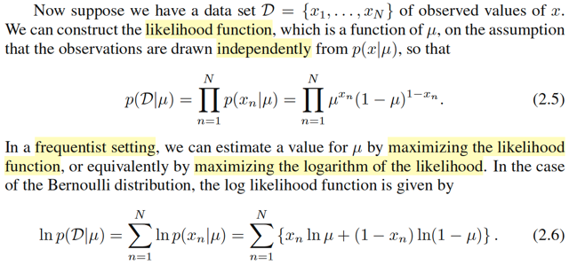</kbd>

> [!NOTE]
> Rồi, đoạn này đại ý là nếu ta có dataset {x1,....xN} là các giá trị quan sát được của x và
> công thức likelihood function
>
>
>
> Ôn lại chút, trong Casella, định nghiã của một random sample size n, là khi ta muốn quan
> sát giá trị của một đại lượng mang tính chất uncertainty n lần, mỗi lần đại diện bởi một
> random variable: X1,X2,....Xn, và được tiến hành sao cho các rvs này mutually
> independent và chúng có cùng distribution  population distribution kí hiệu là f(x|θ).
>
>
>
> Khi đó, nếu xét joint pdf/pmf của X1,...Xn thì nhờ tính chất independent, ta có thể tách
> thành tích các marginal pdf: f(**x**|θ) = Πi=1:n f(xi|θ)
>
>
>
> Và ta trong các bài trước nhiều lần nhắc đến likelihood function, được định nghĩa là hàm
> của θ: L(θ|**x**) = f(**x**|θ) mang ý nghĩa độ hợp lí của θ khi giá trị quan sát được của **X**
> là **x**.
>
>
>
> và đi giải bài toán maximize_θ ∈ Θ L(θ|**x**) ta sẽ tìm được Maximum Likelihood estimator
> của θ: θ^_ml(**X**)
>
>
>
> Quay lại đây, cái mà ta có cũng chính là một observed value của một random sample **X**
> =(X1,...XN) iid: chúng mutually independent và indicator distributed Xi ~ Bern(μ).
>
>
>
> Nên likelihood function L(μ|**x**), như định nghĩa = f(**x**|μ), nhờ tính iid,...
>
>
>
> = Πn=1:N f(xi|μ) = Πn=1:N μ^xn(1-μ)^(1-xn). là công thức 2.5 trong sách.
>
>
>
> ------
>
>
>
> Rồi, như vừa nói xong, gs Bishop cũng nhắc lại, trong trường phái Frequetist ta thường đi
> tìm μ khiến maximize likelihood function.
>
>
>
> Và bài toán tối ưu này như đã biết, ta có thể chuyển thành bài toán tương đương dùng
> hàm ln: maximize ln likelihood:
>
>
>
> ln {Πn=1:N μ^xn(1-μ)^(1-xn)}
>
>
>
> = Σn=1:N ln {μ^xn(1-μ)^(1-xn)}
>
>
>
> = Σn=1:N ln {μ^xn} + ln {(1-μ)^(1-xn)}
>
>
>
> = Σn=1:N ln {μ^xn} + Σn=1:N ln {(1-μ)^(1-xn)}
>
>
>
> = Σn=1:N [xn ln μ] + Σn=1:N [(1-xn) ln (1-μ)]
>
>
>
> **Vì sao phải nhắc đến Frequentist** (hay trong Casella gọi là Classical, trường phái thống
> kê cổ điển) là vì trong cách tiếp cận này, ta coi θ (hay ở đây là μ) là fixed và unknown, chứ
> không phải là biến ngẫu nhiên). Trong Casella, ngay sau khi học về ML estimator ta học về
> Bayes estimator, thì chính là làm theo trường phái Bayesian, nơi ta coi θ là random
> variables. Từ đó ta chọn prior distribution cho θ, kí hiệu là π(θ). Và dùng Bayes rule để xây
> dựng distribution của θ conditioned on **X** = **x**: π(θ|**x**)  = f(**x**|θ)π(θ)/f(**x**). Khi
> đó, ta sẽ làm theo optimality theory để xây dựng Bayes  estimator:
>
>
>
> Chọn **loss function** L(W(**X**), θ), ví dụ squared error loss hay absolute error loss,
>
>
>
> từ đó có **risk function** là lấy trung bình của loss trên mọi **x**:
>
>
>
> R(W(**X**), θ) = E_θ[L(W(**X**), θ] = ∫L(W(**x**),θ)f(**x**|θ) d**x** là hàm số theo θ.
>
>
>
> Và vì θ  là random variable, nên risk function vẫn là random variable.
>
>
>
> Người ta sẽ lấy **trung bình trên prior π(θ)**:
>
>
>
> E_θ~π(θ) [R(W(**X**),θ)] để được một fixed value không còn phụ thuộc θ, gọi là Bayes
> risk.
>
>
>
> = ∫[∫L(W(**x**),θ)f(**x**|θ)d**x**]π(θ)dθ
>
>
>
> = ∫∫L(W(**x**),θ)[π(θ|**x**)f(**x**)/π(θ)]π(θ)dθd**x**
>
>
>
> = ∫∫L(W(**x**),θ)π(θ|**x**)f(**x**)dθd**x**
>
>
>
> = ∫ {∫L(W(**x**),θ)π(θ|**x**)dθ} f(**x**)d**x**
>
>
>
> Thì cái này ∫L(W(**x**),θ)π(θ|**x**)dθ gọi là **posterior expected loss** 
>
>
>
> Từ đó, đi minimize_W(**X**) E_θ~π(θ|x) [R(W(**X**), θ)] cũng là minimize posterior
> expected loss  ta sẽ có "Bayes estimator that minimize Bayes risk" cho θ.

 

#### Thống kê đủ và MLE

<kbd></kbd>

<kbd></kbd>

<kbd></kbd>

> [!NOTE]
> Tiếp theo gs Bishop nói về việc hàm ln likelihood phụ thuộc vào x1,...xN thông
> qua Σn xn Cái này dễ thấy, vì ln likelihood = Σn=1:N [xn ln μ] + Σn=1:N [(1-xn) ln
> (1-μ)]
>
>
>
> = ln μ [Σn=1:N xn] + ln (1-μ) Σn=1:N [1-xn]
>
>
>
> = ln μ [Σn=1:N xn] + ln (1-μ) [N - Σn=1:N xn]
>
>
>
> Và ông nói đây là một sufficient statistic.
>
>
>
> Dừng lại chút, chap 6, phần 1 của Casella mình đã được học về Sufficient
> principle, cũng như sufficient statistic, nói ngắn gọn, đây là loại statistic  chứa
> đủ thông tin về θ mà sample **X** mang lại rồi. Để rồi, giả sử ta ko biết  giá trị
> của **X**, nhưng thay vào đó, chỉ cần biết giá trị của t của T(**X**), với T(**X**)
> là một sufficient statistic, thì từ t ta vẫn có thể inference ra giá trị của θ một cách
> đầy đủ giống như ta có **x** vậy.
>
>
>
> Hiểu theo cách trực giác là như vậy, nhưng định nghĩa chính thức là nếu
> T(**X**) có tính chất đó là khiến f(**x**|T(**X**) = T(**x**)) không còn là hàm phụ
> thuộc θ, thì nó chính là sufficient statistic. Trong sách Casella, với định nghĩa
> này, ta mới đi chứng minh cho thấy rằng, giả sử có hai ông A, và B, ông A biết
> **X** = **x**, và T(**X**) = T(**x**), còn ông B chỉ biết T(**X**) = T(**x**). Sau đó
> ông A dựa vào T(**X**) = T(**x**), generate các giá trị của **Y** sao cho P(**Y** =
> **y** | T(**X**) = T(**x**)) = P(**X** = **y** | T(**X**) = T(**x**)) thì ta chứng minh
> được cái random variable **Y** này qủa thật chính là ~ marginal pmf của **X**:
> f(**x**|θ) (hay P(**X**=**y**) = P(**Y**=**y**) ∀**y**) Điều này giúp kết luận là chỉ
> cần dựa trên T(**x**) cũng đủ để xây dựng hiểu biết của ta về θ
>
>
>
> Sau đó ta được học một theorem quan trọng giúp chứng minh sufficient
> statistic: **Factorization**, nói rằng, miễn f(**x**|θ) có thể được factor thành
> g(T(**x**)|θ)h(**x**) tức là tích của hàm h(**x**) chỉ phụ thuộc **x** và hàm g phụ
> thuộc  cả **x** lẫn θ nhưng chỉ phụ thuộc **x** thông qua T(**x**), thì khi đó T
> **chính là  sufficient statistic**.
>
>
>
> Nhờ theorem này, ta có cách tìm sufficient statistic: tìm các factor f(**x**|θ)
> thành dạng trên thì cái cụm nào chứa **x** trong g(T(**x**)|θ) chính là sufficient
> statistic function.
>
>
>
> Vậy ở đây mình có thể chứng minh nhanh là với X1,...Xn ~ Bern(μ) thì  Σi Xi là
> sufficient:
>
>
>
> f(**x**|μ), như vừa làm = Πn=1:N μ^xn(1-μ)^(1-xn)
>
>
>
> xét Pμ(**X**=**x**|T(**X**)=T(**x**)), trước khi chứng minh nó ko phụ thuộc θ, ta
> biến đổi chút xíu:
>
>
>
> Pμ(**X**=**x**|T(**X**)=T(**x**)) = Pμ(**X**=**x**, T(**X**)=T(**x**)) /
> P(T(**X**)=T(**x**))
>
>
>
> Vì **X**=**x** ⇨ T(**X**)=T(**x**) ⇨ (**X**=**x**) ⊂ T(**X**)=T(**x**) ⇨
> (**X**=**x**, T(**X**)=T(**x**) = (**X**=**x**)
>
>
>
> (do A ⊂ B ⇨ A ∩ B = A)
>
>
>
> ⇨ Pμ(**X**=**x**, T(**X**)=T(**x**)) / P(T(**X**)=T(**x**))
>
>
>
> = Pμ(**X**=**x**) / P(T(**X**)=T(**x**))
>
>
>
> Thay vào:
>
>
>
> Từ số Pμ(**X**=**x**) = f(**x**|μ) = Πn=1:N μ^xn(1-μ)^(1-xn)
>
>
>
> Còn mẫu số, với T(**X**) = ΣXi với Xi iid Bern(μ) thì ΣXi chính là binomial(n, μ)
>
>
>
> (còn nhớ trong Stat110, hay Casella, story của Binomial(n,p) là tổng các
> success event của chuỗi n Bern(p) trials. có pmf là P(X=k) = (n choose
> k)p^k(1-p)^(n-k)
>
>
>
> Nên P(T(**X**)=T(**x**)) = (n choose T(**x**)) μ^T(**x**) (1-μ)^[n-T(**x**)] ,với
> T(**x**) = Σnxn.
>
>
>
> Thay kết qủa này vào mẫu số ta có:
>
>
>
> Πn=1:N μ^xn(1-μ)^(1-xn)  / (n choose Σn xn) μ^(Σn xn) (1-μ)^(n-Σn xn)
>
>
>
> = μ^(Σn xn) (1-μ)^(Σn (1-xn))  / (n choose Σn xn) μ^(Σn xn) (1-μ)^(n-Σn xn)
>
>
>
> = μ^(Σn xn) (1-μ)^(n-Σn xn)  / (n choose Σn xn) μ^(Σn xn) (1-μ)^(n-Σn xn)
>
>
>
> =  1  / (n choose Σn xn)
>
>
>
> kết quả ko còn phụ thuộc μ nên theo định nghĩa Σn xn chính là sufficient
> statistic
>
>
>
> Có thể làm còn nhanh hơn bằng factorization theorem:
>
>
>
> f(**x**|μ) =  Πn=1:N μ^xn(1-μ)^(1-xn) =
>
>
>
> = μ^(Σn xn) (1-μ)^[Σn(1-xn)]
>
>
>
> = μ^(Σn xn) (1-μ)^[N-Σn xn)]
>
>
>
> bằng cách chọn h(x) = 1, g(T(x)|μ) = μ^(Σn xn) (1-μ)^[N-Σn xn)] ta suy ra ngay
> T(x) = Σx xn chính là sufficient statistic
>
>
>
> -------
>
>
>
> Còn quay lại bài toán tìm μ khiến maximum likelihood, thì cũng đơn giản, đây là
> bài toán tối ưu ko ràng buộc, dùng điều kiện cần tối ưu bậc nhất ta cho đạo
> hàm bằng 0 tìm critical point:
>
>
>
> d/dμ [Σn=1:N [xn ln μ] + Σn=1:N [(1-xn) ln (1-μ)]] = 0
>
>
>
> ⇔ Σn=1:N d/dμ [xn ln μ] + Σn=1:N d/dμ [(1-xn) ln (1-μ)] = 0
>
>
>
> ⇔ Σn=1:N [xn/μ] + Σn=1:N (1-xn) d/dμ [ln(1-μ)] = 0
>
>
>
> ⇔ Σn xn / μ - (N-Σn xn) / (1-μ) = 0
>
>
>
> ⇔ Σn xn / μ = (N-Σn xn) / (1-μ)
>
>
>
> ⇔ (1-μ) Σn xn = μ (N-Σn xn)
>
>
>
> ⇔ Σn xn - μ Σn xn  = μ (N-Σn xn)
>
>
>
> ⇔ Σn xn = μ (N-Σn xn) + μ Σn xn
>
>
>
> ⇔ Σn xn = μ N
>
>
>
> ⇔ (Σn xn) / N = μ,
>
>
>
> Tất nhiên để kết luận đây là maximizer của objective thì còn cần check đạo
> hàm bậc hai (lấy đạo hàm bậc hai tại critical point và coi thử nó có âm ko)
>
>
>
> nhưng cũng có thể dùng nhận định hàm này là tổng các hàm ln vốn là concave
> function nên cũng là concave function, từ đó khiến cho ta có thể kết luận ngay
> maximizer.
>
>
>
> Như vậy μ^_ML = (Σn xn) / N, dĩ nhiên ta biết đây chính là sample mean.
>
>
>
> Như vậy, giả sử ta trong bài toán cụ thể là tung đồng xu N lần, ra được m lần
> ngửa thì m/N chính là cách ta estimate xác suất ra ngửa của đồng xu đó (μ)
> theo cách tối đa hóa độ hợp lí dựa trên kết quả quan sát được. Ví dụ tung
> N=100, m = 10 thì dựa trên kết quả thử nghiệm dự đoán population param hợp
> lí nhất là μ = 0.1, tức xác suất xu ra ngửa là 10%.
>
>
>
> Hoặc nếu N = 3, m = 3, thì μ^_ML = 1, đồng nghĩa là theo đó, mô hình (theo
> cách estimate μ bằng maximum likelihood approach) sẽ dự đoán là nếu tiếp tục
> tung xu thì sẽ luôn luôn ra ngửa. Điều này rõ ràng là ko đúng. Theo gs Bishop,
> đây chính là một ví dụ của overfit. Và cách tiếp cận Bayesian với prior
> distribution của μ sẽ giúp khắc phục chuyện này.
>
>
>
> Nói thêm chút xíu, trong sách Casella đã nói về vụ này rồi, khi trong phần cuối
> của Bayes estimator ông có in một cái bảng (7.3.1) so sánh hai phương pháp
> MLE và Bayes. Cho thấy Bayes ít cho các extreme (thái quá) estimate hơn.
> Nguyên nhân cũng là nhờ prior distribution.

 

##### Phân phối nhị thức và chứng minh

<kbd></kbd>

<kbd>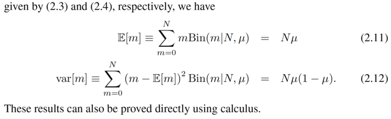</kbd>

> [!NOTE]
> Rồi, thế thì binomial là gì thì stat110, Casella đã quá rành rồi, cái quan
> trọng nhất là story của nó: X ~ binomial(n, p) thì nó chính là  số trial
> success trong n iid Bern(p) trial. có pmf: P(X=k) = (n choose k) p^k
> (1-p)^(n-k).
>
>
>
> -------
>
>
>
> Thử giải thích lại công thức của (n choose k), đây là cái đã học từ những
> bài đầu của Stat110:
>
>
>
> Chứng minh (n choose k) có công thức như vậy (Stat110 đã học, ôn lại)
>
>
>
> Bài toán là đếm số cách chọn m object từ N object ko care thứ tự:
>
>
>
> n object có n! hoán vị.
>
>
>
> Với mỗi hoán vị ta lấy k object đầu tiên thì ta sẽ có n! cách chọn k object
>
>
>
> Tuy nhiên vì không care thứ tự các object nên ta đã đếm thừa với mỗi cách
> chọn n! lần, nên để adjust ta sẽ chia cho k!
>
>
>
> Ngoài ra, với mỗi một cách chọn này ta cũng đã đếm thừ (n-k)! lần số cách
> chọn n-k quả banh ở cuối → nên cũng phải adjust bằng cách chia (n-k)!.
>
>
>
> Nên  (n choose k) = n! / k!(n-k)!
>
>
>
> ------
>
>
>
> Derive công thức EX cực nhanh: dùng story của nó, thì bên cạnh story
> trên, binomial còn có story khác: nó là tổng có n iid indicator random
> variable I_{Aj} với Aj là trial thứ j, và I_{Aj} j=1,2....n có hai possible value là
> 1 hoặc 0 nếu  kết quả của trial là success hoặc failure, dễ thấy I_{Aj} chính
> là Bern(μ)
>
>
>
> Khi đó EX = E[Σi I_{Aj}]
>
>
>
> dựa trên tính linearity của kì vọng
>
>
>
> ...= Σi E[I_{Aj}]
>
>
>
> = Σi [μ] = nμ (hay trong sách là Nμ)
>
>
>
> ------
>
>
>
> VarX: Trong Stat110 gs Joe đã trình bày 3 cách để tìm Var của binomial
> trong đó cách dễ nhất chính là dựa trên tính chất của Variance: Nếu  X1,...
> Xn độc lập thì Var(Σi Xi) = Σi VarXi
>
>
>
> ở đây, dựa trên story binomial random variable X là tổng các iid Bern I_Aj
>
>
>
> ⇨ Var X = Σi Var(I_Aj)
>
>
>
> Mà với Bern(μ) mình đã chứng minh Var = μ(1-μ) rồi
>
>
>
> ⇨ Var X = Σi μ(1-μ) = nμ(1-μ) (hay trong sách là Nμ(1-μ))
>
>
>
> -------
>
>
>
> Nói thêm chút xíu hai công thức gs Bishop trong sách thật ra chỉ là ông
> dùng định nghĩa thôi, nhưng cách derive nhanh là như gs Joe đã dạy ở
> trên),
>
>
>
> theo định nghĩa EX = Σ{mọi possible value x của X} xP(X=x)
>
>
>
> ở đây ông Bishop dùng chữ m, để chỉ random variable binomial, (một lần
> nữa phải complain rằng việc ông dùng chữ thường để chỉ tên biến đi
> ngược lại quy ước của toán khiến ta rất dễ lú), mình cũng dùng lại chữ m
> nhưng viết hoa cho nó theo chuẩn:
>
>
>
> E[M] = Σ{mọi possible value m của M} mP(M = m)
>
>
>
> Và pmf của M ~ binomial(N,μ) thì ông kí hiệu nó là Bin(m|N, μ) (giống  như
> pdf của Normal(μ, σ^2) thì thay vì như sách toán người ta ghi f(x|μ, σ^2)
> thì ổng chơi luôn N(x|μ, σ^2), thật hay.
>
>
>
> = Σ{m=0,1,...N} m Bin(m|N,μ)
>
>
>
> Var[M], thì theo định nghĩa gốc của variance thôi: E[(M - EM)^2], và dùng
> LOTUS, ta có Σ{mọi possible value m của M} (m -EM)^2 P(M=m)
>
>
>
> = Σ{m=0,1,...N} (m - EM)^2 Bin(m|N,μ)

 

###### Ưu tiên liên hợp Beta-Nhị thức

<kbd>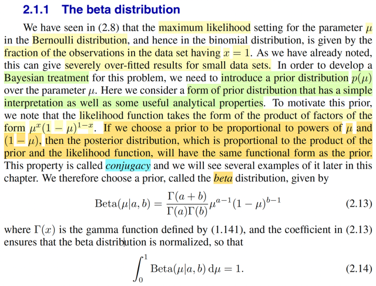</kbd>

> [!NOTE]
> Đại khái là gs nói rằng mình đã thấy trong ví dụ mà ta đi xây dựng
> maximum likelihood estimator cho μ của binomial(N, μ) và cho thấy kết quả
> là μ^_ML là tỉ lệ của số lượng các observer value = 1 so với tổng số
> observed value. Để rồi giúp ta nhận thấy rằng nếu số lượng data mà nhỏ,
> thì cách làm này có thể dẫn tới những kết quả thái quá ví dụ như μ^_ML =
> 1.
>
>
>
> So với cách tiếp cận này, thì Bayesian approach sẽ khắc phục được nhược
> điểm này. Và theo cách làm này, như đã nói nhiều lần, mình sẽ coi μ như
> random variable, và chọn cho nó một distribution, gọi là prior distribution, để
> rồi dùng Bayes theorem để xây dựng posterior distribution.
>
>
>
> Và khi làm vậy, ta sẽ chọn prior sao cho đơn giản hóa việc tính toán.
>
>
>
> Thế thì ông nói khi ta nhìn vào hàm likelihood, ta thấy nó có dạng là tích
> của các cụm μ^x(1-μ)^(1-x). Từ đó nếu ta chọn prior distribution sao cho
> công thức của nó cũng có dạng μ lũy thừa gì đó nhân với (1-μ) lũy thừa gì
> đó thì ta sẽ thấy posterior cũng hóa ra sẽ là distribution cùng loại với prior.
> Và tính chất này gọi là CONJUGACY.
>
>
>
> Thế thì trong trường hợp này, cái distribution có tính chất đó, chính là β. có
> pdf: Nếu μ ~ β(a, b) thì pdf f(μ|a,b), hay beta(μ|a,b) = [Γ(a+b)/Γ(a)Γ(b)]
> μ^(a-1)(1-μ)^(b-1).
>
>
>
> Nhờ các class stat110, casella, mình đã quen với distribution này. và trong
> Casella đã nhiều lần làm các ví dụ đi xây dựng Bayes estimator của θ, với
> sample X là iid Bern(θ). Để rồi khi ta chọn prior là β, tính ra posterior, ta sẽ
> thấy cái kernel có dạng kernel của môt β có tham số khác, từ đó giúp kết
> luận posterior là β, và ta cũng ko cần care các hằng số vì nó sẽ cùng nhau
> tạo thành normalizing constant. Do đó β distribution ngọi là binomial
> conjugate.
>
>
>
> Có thể làm lướt qua rất nhanh cho vui:
>
>
>
> Đây nhé, mình có hàm joint pdf của data (observation) f(**x**|μ) của random 
> sample iid X1,..Xn ~ Bern(μ) → f(**x**|μ) = Πi f(xi|μ). Theo định nghĩa hàm
> likelihood thì L(μ|**x**) = f(**x**|μ).
>
>
>
> Tiếp, giả sử chọn β(a,b) là prior distribution của μ: π(μ) là pdf của beta(a,b).
> (trong sách Casella, ta kí hiệu prior/posterior của tham số với π)
>
>
>
> DÙng Bayes theorem để derive posterior:
>
>
>
> π(μ|**x**) = f(**x**|μ) π(μ) / f(**x**)
>
>
>
> vì f(**x**) chỉ là marginal pdf của **X** tại **x**, ta biết nó chỉ là một constant,dù không
> biết f(**x**) là gì nhưng theo lí thuyết chắc chắc nó phải tham gia vào normalizing
> constant của π(μ|**x**), vì cái này là một valid pdf (giúp đảm bảo ∫π(μ|**x**)dμ  = 1)
>
>
>
> Thành ra người ta sẽ chỉ quan tâm các term có dính μ, và chuyển sang dùng
> kí hiệu tỉ lệ thuận (vì normalizing constant phải dương)
>
>
>
> π(μ|**x**) ∝ f(**x**|μ) π(μ) và đây cũng là L(μ|**x**) π(μ), đó là lí do mà gs nhắc đến
> likelihood ở đây, nhưng cái chính ta hiểu nó là joint distribution của **x:** f(**x**|μ)
>
>
>
> Rồi, thế vô: 
>
>
>
> π(μ|x) ∝ Πi f(xi|μ) β(μ|a,b) 
>
>
>
> = Πi μ^xi(1-μ)^(1-xi) C μ^(a-1)(1-μ)^(b-1) với C là constant = [Γ(a+b)/Γ(a)Γ(b)]
>
>
>
> tiếp tục, ta lại ko cần care cái constant, vì nó sẽ nhập với cái constant f(**x**) 
> tạo thành normalizing constant của π(x|μ), giúp đảm bảo ∫π(μ|**x**)dμ = 1
>
>
>
> ⇨ π(μ|x) ∝ Πi μ^xi(1-μ)^(1-xi) μ^(a-1)(1-μ)^(b-1)
>
>
>
> ⇔ π(μ|x) ∝ μ^Σxi(1-μ)^[Σ(1-xi)] μ^(a-1)(1-μ)^(b-1)
>
>
>
> ⇔ π(μ|x) ∝ μ^(Σxi+a-1)(1-μ)^[Σ(1-xi)+b-1]
>
>
>
> ⇔ π(μ|x) ∝ μ^(Σxi+a-1)(1-μ)^[N-Σxi+b-1]
>
>
>
> từ đây ta nhận định đây là kernel (hạt nhân) của một pdf của β(Σxi+a, N-Σxi+b)
>
>
>
> nên suy ra luôn posterior chính là β(Σxi+a, N-Σxi+b)
>
>
>
> và cũng giúp ta hiểu vì sao β gọi là conjugate prior của binomial.
>
>
>
> Nếu joint pdf f(x|μ) mà là distribution khác, ví dụ Xi ~ normal, thì prior phải
> chọn normal thì posterior mới cũng ra normal, nên normal là prior conjugate
> của normal
>
>
>
> Tất nhiên việc chọn prior như vậy chỉ là để đơn giản hóa việc tính toán,giống
> như gs Bishop nói đến trong câu "form of prior distribution that has a simple
> interpretation as well as some useful analytical properties"

 

###### Kỳ vọng phân phối Beta

<kbd>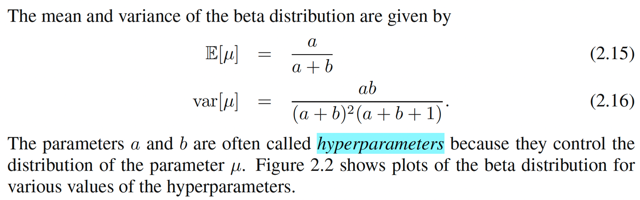</kbd>

> [!NOTE]
> Việc chứng minh mean và variance của β thì trong stat110 và casella đã làm
> rồi, làm lại cho nhớ (cũng là bài tập 2.6 của sách Bishop)
>
>
>
> Cho X ~ β(a,b). tính EX
>
>
>
> Để cho dễ ta sẽ đi tính EX^n luôn, gọi là n'th moment:
>
>
>
> Theo LOTUS để tính EY với Y = g(X), ta có thể dùng pdf/pmf f(x) của X: Eg(X)
> = ∫g(x)f(x)dx
>
>
>
> ⇨ EX^n = ∫x^n f(x)dx = ∫x^n [Γ(a+b)/Γ(a)Γ(b)] x^(a-1)(1-x)^(b-1) dx
>
>
>
> = [Γ(a+b)/Γ(a)Γ(b)] ∫x^(n+a-1)(1-x)^(b-1) dx  (đưa constant ra, nhập mũ x lại)
>
>
>
> Rồi, cái trong tích phân dễ thấy nó sẽ là kernel của β pdf có tham số n+a và b,
> tức β(n+a, b) nên ta sẽ nhân và chia cho normalizing constant của β(n+a, b):
> Γ(n+a+b) / Γ(n+a) Γ(b)
>
>
>
> → .. = [Γ(a+b)/Γ(a)Γ(b)] ∫ [Γ(n+a+b)/Γ(n+a) Γ(b)] / [Γ(n+a+b)/Γ(n+a) Γ(b)]
> x^(n+a-1)(1-x)^(b-1) dx
>
>
>
> đưa / [Γ(n+a+b) / Γ(n+a) Γ(b)] ra ngoài, bên trong tích phân bây giờ là tích
> phân từ trên toàn miền support set của β [0:1] của pdf của β(n+a, b), theo tính
> valid của pdf, cái này phải = 1
>
>
>
> = [Γ(a+b)/Γ(a)Γ(b)] / [Γ(n+a+b)/Γ(n+a)Γ(b)] ∫ [Γ(n+a+b)/Γ(n+a)Γ(b)]
> x^(n+a-1)(1-x)^(b-1) dx
>
>
>
> = [Γ(a+b)/Γ(a)Γ(b)] / [Γ(n+a+b)/Γ(n+a)Γ(b)]
>
>
>
> = Γ(a+b)Γ(n+a)/Γ(a)Γ(n+a+b)
>
>
>
> Áp dụng với n = 1: và dùng công thức Γ(a+1) = aΓ(a)
>
>
>
> EX = Γ(a+b)Γ(1+a)/Γ(a)Γ(1+a+b)
>
>
>
> = Γ(a+b)aΓ(a)/Γ(a)(a+b)Γ(a+b)
>
>
>
> = a/(a+b)
>
>
>
> Áp dụng với n = 2:
>
>
>
> EX^2 = Γ(a+b)Γ(2+a)/Γ(a)Γ(2+a+b)
>
>
>
> = Γ(a+b)(1+a)Γ(1+a)/Γ(a)(1+a+b)Γ(1+a+b)
>
>
>
> = Γ(a+b)(1+a)aΓ(a)/Γ(a)(1+a+b)(a+b)Γ(a+b)
>
>
>
> = (1+a)a/(1+a+b)(a+b)
>
>
>
> Từ đó, áp dụng công thức thứ 2 của VarX = EX^2 - (EX)^2
>
>
>
> và biến đổi đại số thì sẽ ra công thức trong sách
>
>
>
> ------
>
>
>
> a, b theo gs Bishop gọi là hyperparam, vì nó sẽ quyết định hình dạng của 
> distribution

 

###### Các dạng phân phối Beta

<kbd>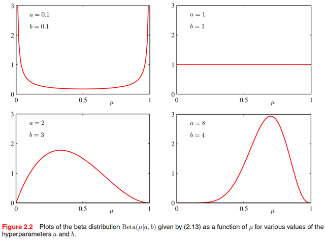</kbd>

> [!NOTE]
> β(1,1) chính là uniform(0,1).
>
>
>
> còn với các giá trị tham số khác, nó có các hình dạng khác nhau.

 

###### Hậu nghiệm Beta

<kbd>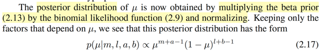</kbd>

<kbd>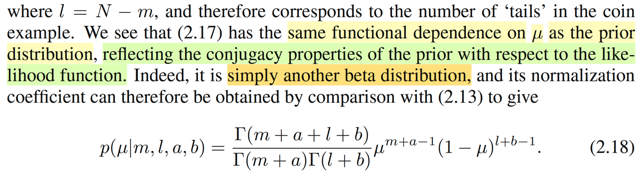</kbd>

> [!NOTE]
> kết quả này nãy mình đã hiểu rồi khi đã cho thấy posterior chính là β(Σxi+a,
> N-Σxi+b), với m = Σixi, cũng là số observed data = 1, và l = N - Σxi = N - m thì
> ta có kết qủa 2.17 trong sách.
>
>
>
> Và cũng như mình đã làm, gs Bishop cũng nói rằng nó có dạng kernel của
> β(m+a,l+b), nên ta có quyền suy ra giá trị constant (lúc nãy ta làm thì trên tử có
> constant C = [Γ(a+b)/Γ(a)Γ(b)], và chia cho f(**x**) ở dưới) còn lại phải là
> normalizing constant của β(m+a,l+b)

 

###### Tham số Beta: Quan sát hiệu quả

<kbd>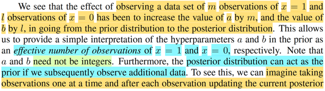</kbd>

<kbd>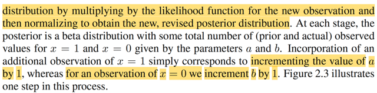</kbd>

<kbd>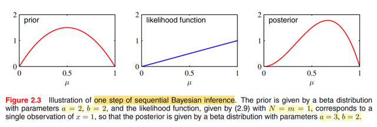</kbd>

> [!NOTE]
> Đại ý là, bắt đầu với prior là β(a,b) để rồi posterior là β(a+số observed success
> (x=1), b+số observed failure (x=0))
>
>
>
> thế thì ta có thể hình dung một chuỗi suy luận về μ trong đó với mỗi lần, ta
> dùng posterior đang có làm priori, để update với giá trị quan sát mới để có
> posterior
>
>
>
> khi đó, dễ hiểu là ta sẽ thấy việc cập nhật sẽ có hiệu quả là: cứ mỗi lần quan
> sát được success (x=1) thì posterior sẽ tăng thêm 1 ở giá trị tham số đầu tiên
> (a) và nếu quan sát được failure (x=0) thì sẽ tăng thêm 1 ở giá trị  tham số thứ
> hai (b)
>
>
>
> Minh họa bởi hình 2.3, bắt đầu với β(2,2) (cũng là uniform), sau khi quan sát
> thấy một observed data x=1, posterior trở thành β(3,2)
>
>
>
> Và theo gs Bishop, điều này giúp ta có thể HIỂU / DIỄN GIẢI a, b LÀ GIÁ TRỊ
> HIỆU QỦA CỦA SỐ QUAN SÁT CỦA SUCCESS (x=1) HAY FAILURE (x=0)

 

###### Học tuần tự Bayesian

<kbd>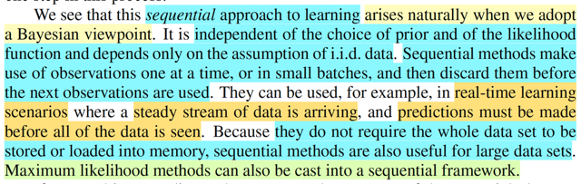</kbd>

> [!NOTE]
> Đại khái là cái ta vừa nói, gọi là sequential approach to learning (ý là việc học 
> (học ra giá trị tham số của distribution) theo chuỗi) nó là cách tiếp cận rất tự
> nhiên khi ta theo trường phái / góc nhìn Bayesian. Vì nó ko phụ thuộc cách
> chọn prior, điều này là rõ ràng, mà chỉ phụ thuộc vào giả định iid của data,
> vì sao?
>
>
>
> HIểu đơn giản. Còn **nhớ chính nhờ iid**, nên **joint pdf** f(**x**|θ) **mới tách thành
> tích các** f(xi|θ). Ví dụ ta có x1,x2. Thì nhờ iid mà f(x1,x2|θ) = f(x1|θ)f(x2|θ).
>
>
>
> Từ đó với prior π(θ),  posterior π(θ|x1,x2) ∝ f(x1,x2|θ)π(θ) thì cái này cũng
> bằng f(x2|θ)f(x1|θ)π(θ), và π(θ|x1) thì ∝ f(x1|θ)π(θ) thì 
>
>
>
> Thành ra ta có thể coi như quá trình học ra π(θ|x1,x2) gồm 2 bước:
>
>
>
> π(θ|x1) ∝ f(x1|θ)π(θ)
>
>
>
> π(θ|x2) ∝ f(x2|θ)π(θ|x1)
>
>
>
> Và để bảo đảm tính valid của việc này thì c**hỉ cần tính iid của data**, chứ prior
> distribution là gì, hay likelihood là gì thì đều ko care
>
>
>
> Để rồi ta có thể mỗi lần, dùng data quan sát được, (một hoặc một vài observed
> data) để update posterior, sau đó thì vứt chúng đi, không cần lưu làm gì.
>
>
>
> Nhờ vậy, với bài toán có data nhiều hoặc bài toán mà ta cần đưa ra dự đoán
> khi data ở dạng stream, ta có thể làm kiểu này, để không phải lưu trữ data.
> (Cái này gọi là real-time learning)

 

###### Phân phối dự đoán Bayesian

<kbd>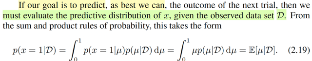</kbd>

> [!NOTE]
> Tiếp theo, đại khái là gs nói nếu ta phải đưa ra dự đoán cho thử nghiệm tiếp
> theo dựa trên những gì đã quan sát thấy, ta sẽ cần evaluate predictive
> distribution của x, dựa trên D. Là sao ta?
>
>
>
> Thì thật ra mình đã học cái này trong chap 1 rồi, predictive distribution, lập luận
> là, với cách tiếp cận Bayesian, ta coi θ (hay ở đây là μ) như random variable,
> để rồi ta chọn prior distribution cho nó, kí hiệu π(θ) (ví dụ như ta chọn β(a,b)
> cho làm prior distribution của μ vậy), rồi dùng Bayes rule để xây dựng posterior
> π(θ|**x**) ∝ f(**x**|θ) π(θ) (ví dụ như ta vừa tìm ra posterior của μ là β(a+m,b+l)
> đó). Thế thì giờ đặt vấn đề muốn dùng kết quả này để đưa ra dự đoán cho lần
> thử tiếp theo, cũng đồng nghĩa là dựa trên đó, ta muốn tính xác suất của hai
> giá trị khả dĩ x=1 và x=0.
>
>
>
> Thế thì thế này, X ~ f(x|θ), hay ở đây là X ~ Bern(μ).
>
>
>
> Nên f(x|μ)|x=1 = P_μ(X=1) = μ.
>
>
>
> Nhưng ta đâu có biết μ, ta chỉ vừa mới có posterior của μ: β(a+m,b+l) tức là ta
> có f(μ|a,b,m,l) = β(μ|a,b,m,l) thôi.
>
>
>
> Thế thì, nếu nhớ lại trong sách Casella, khi nói về Bayes estimator, sau khi đã
> có posterior, thì tùy vào việc ta muốn dùng loss là gì thì ta sẽ dùng mean hoặc
> median của posterior distribution để làm point estimator cho param θ. Ví dụ,
> nếu dùng square error loss, thì mean E[θ|**X**] θ ~ π(θ|**x**) chính là Bayes
> estimator mà minimize Bayes risk, cũng là minimize posterior expected loss,
> ngược lại nếu dùng absolute error loss, thì Bayes estimator là median của
> posterior.
>
>
>
> Như vậy, theo cách cách làm này, giả sử ta dùng squared error loss, thì
> E[μ|**x**] với μ ~ β(a+m,b+l), = a+m/(a+m+b+l) sẽ chính là Bayes estimator
> minimize Bayes risk, và từ đó ta đưa ra dự đoán xác suất trial tiếp theo  ra x=1
> sẽ là a+m/(a+m+b+l).
>
>
>
> Nhưng mà trong sách này, như đã thấy trong chap 1 (xem link), gs Bishop
> không làm kiểu đó. Mà thay vào đó, ông nói rằng vì trong bài toán machine
> learning, ta care nhiều hơn đến nhiệm vụ prediction, thay vì inference, tức là ta
> ko cần biết tham số của population distribution, mà chủ yếu là đưa ra dự đoán
> dựa trên tham số đó. Chính vì vậy, ví dụ như trong bài toán này, ta ko cần biết
> population parameter μ là bao nhiêu, mà ta cần dự đoán kết quả cho lần trial
> tiếp theo,  thông qua việc tính xác suất của việc ra X = 1 hay X = 0. Do đó, thay
> vì dùng một point estimator của μ (ví dụ dùng posterior mean, hay median) ta
> sẽ lấy trung bình f(x|μ) over mọi possible value của μ với μ ~ posterior
> π(μ|**x**), để có P(X=x|**x**) gọi là **predictive distribution**
>
>
>
> Và hành động này cũng chính marginalizing joint pdf của x, μ: f(x, μ) với mọi giá
> trị khả dĩ của μ ~ posterior: ∫f(x, μ|**x**) dμ = ∫f(x|μ) π(μ|**x**) dμ
>
>
>
> P(X=x|**x**) = E[f(x|μ)|**x**] với μ ~ π(μ|**x**), = ∫f(x|μ)π(μ|**x**)dμ
>
>
>
> và với Bern(μ) thì f(x|μ) = μ^x(1-μ)^(1-x)
>
>
>
> ⇨ E[f(x|μ)|**x**] = ∫μ^x(1-μ)^(1-x) β(μ|a+m,b+l) dμ
>
>
>
> Để rồi P(X=x|**x**) = E[f(x|μ)|**x**]|x=1 = ∫μ^1(1-μ)^(1-1) β(μ|a+m,b+l) dμ
>
>
>
> = ∫ μ β(μ|a+m,b+l) dμ
>
>
>
> và cái này cũng lại chính là E[μ|**x**] (hay E[μ|/D/] tức mean của posterior
> distribution.
>
>
>
> (chữ D in hoa trong sách Bishop cũng chính là observed data **x** thôi)
>
>
>
> -----
>
>
>
> Nói thêm chút, vì sao ∫f(x|μ)π(μ|**x**)dμ lại là E[f(x|μ)] với μ ~ π(μ|**x**)?
>
>
>
> Nhìn thế này sẽ hiểu: f(x|μ) là gì, nó là P(X=x|μ), tức là pmf của X, một random
> variable có distribution là Bern(μ), và evaluate tại x, mang ý nghĩa với xác suất
> của event X=x xảy ra là bao nhiêu nếu X ~ Bern(μ). Dĩ nhiên, theo định nghĩa
> của Bernoulli distribution thì P(X=x|μ) = μ..
>
>
>
> nhưng ở đây ta sẽ nhìn nó dưới góc độ là hàm của μ: f(x|μ) = g(μ) mà trong
> trường hợp đặc biệt này g(μ) = μ, tức g là identity function, nhưng quan trọng là
> ta xem f(x|μ) là hàm của μ.
>
>
>
> Mà μ là random variable (đây là cái mà trường phái Bayesian khác với
> Frequentist), nên f(x|μ) là gì: một hàm số của random variable, thì cũng là
> random variable!  Đây là điều mà gs Joe Blizstein đã nhắc lại nhiều lần trong
> Stat110.
>
>
>
> À, như vậy f(x|μ) là một random variable, THÌ DO ĐÓ TA CÓ THỂ NÓI VỀ KÌ
> VỌNG CỦA NÓ: E[f(x|μ)] (vì chỉ có random variable mới có quyền có kì vọng)
>
>
>
> (hoặc chặt chẽ hơn thì ghi E[f(x|μ)|**x**])
>
>
>
> Rồi, tính kì vọng của cái random variable này thế nào?
>
>
>
> → LOTUS: Vì nó là hàm của μ, là random variable có distribution posterior
> π(μ|**x**) nên theo LOTUS, khi một biến Y được tạo thành bởi áp hàm g lên
> biến X, thì  EY = ∫g(x)f(x)dx.
>
>
>
> Vậy E[f(x|μ)|**x**] = ∫f(x|μ) π(μ|**x**)dμ
>
>
>
> và trong trường hợp đặc biệt này (trường hợp khác thì chưa chắc) là khi f(x|μ)
> = μ  thì E[f(x|μ)|**x**] = ∫μ π(μ|**x**)dμ và cái này chính là E[μ|**x**], tức mean
> của posterior, như đã nói, cũng chính là Bayes esimator của μ khiến minimize
> Bayes risk với squared error loss function.

 

###### Hội tụ Ước lượng Bayes và ML

<kbd>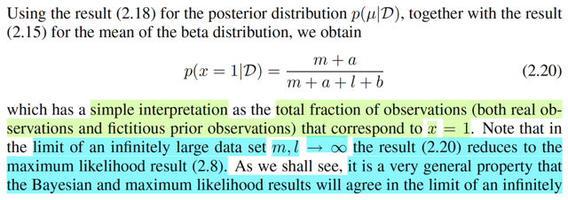</kbd>

<kbd>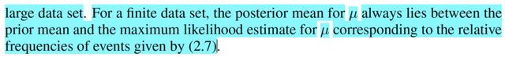</kbd>

> [!NOTE]
> kết quả 2.20 chính là mean của posterior, là một β(a+m, b+l) như mình vừa nói
> trong note trước. Và với công thức mean của β(a,b) = a/a+b thì mean của 
> posterior là (a+m)/(a+m+b+l)
>
>
>
> Điểm đáng suy nghĩ là, gs cho biết khi m và l → inf, thì kết quả này nó sẽ
> converge về kết quả của dự đoán nếu ta dùng maximum likelihood μ^_ML
>
>
>
> Vì sao nhỉ? 
>
>
>
> À là vì ta đã derive μ^_ml rồi, cho ra kết quả chính là m / N, hay m / (m + l)
> (cũng chính là sample mean).
>
>
>
> thì khi m, l càng lớn ảnh hưởng của a, và b trong (a+m)/(a+m+b+l) sẽ nhỏ
> dần, (a+m)/(a+m+b+l) → m/(m+l)
>
>
>
> và gs nói, đây là tính chất mang tính khái quát, khi dataset càng lớn thì kết quả
> của Bayesian và maximum likelihood sẽ trở nên giống nhau
>
>
>
> Còn trong một bộ data hữu hạn, thì posterior mean của μ sẽ **luôn nằm đâu đó
> giữa prior mean và μ_ML**
>
>
>
> Đây là một nhận định mà có vẻ trong sách Casella đã nói, thông qua việc 
> ông nói rằng Bayes estimator, nhờ có prior, nó sẽ khiến kết luận của Bayes
> estimator luôn ít extreme hơn là của maximum likelihood, kiểu như nhờ có 
> prior nên nó sẽ luôn có vai trò kìm hãm, kéo lại giúp tránh các estimate
> quá extreme.
>
>
>
> Với cách hiểu này, mình thấy nó y như vai trò của regularization, mà trong 
> chap 1 quả thật ta đã thấy việc giải bài toán curve fitting có regularization 
> theo Bayesian cũng chính là maximize posteriori

 

###### Giảm phương sai hậu nghiệm

<kbd>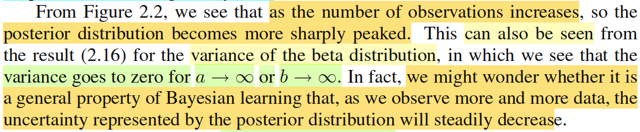</kbd>

<kbd>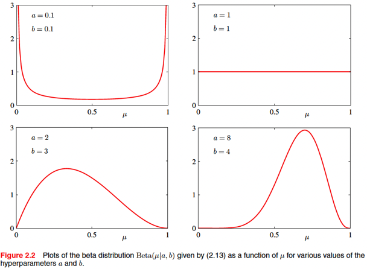</kbd>

> [!NOTE]
> Đại khái là, dựa vào hình 2.2, ta có thể thấy khi số lượng quan sát tăng lên,
> thì distribution ngày càng "nhọn" hơn. Là sao?
>
>
>
> ví dụ với β(1,1), tương đương uniform(0,1), distribution hoàn toàn phẳng.
>
>
>
> Khi có thêm 3 observed data  với 1 success, 2 failure, thì posterior trở thành
> β(2,3), bắt đầu có hình quả đồi.
>
>
>
> (ta nhớ lập luận theo chuỗi (sequential Bayesian) lúc nãy: tại mỗi mắt xích,
> posterior đóng vai prior, để rồi cùng với likelihood để update lại posterior mới
> ví dụ prior đang là β(a,b) quan sát thấy m+l observation với m success (X=1)
> và l failure (X=0) thì posterior mới sẽ là β(a+m, b+l)
>
>
>
> khi có thêm 7 observation với 6 success, 1 failure thì posterior trở thành β(8,
> 4), có đỉnh nhọn hơn nữa.
>
>
>
> Bên cạnh đó công thức variance của β(a,b) (2.16) cũng cho thấy nếu a,b
> càng lớn thì variance càng nhỏ, cũng giải thích hiện tượng nói trên (đồ thị pdf
> càng nhọn, thì nó càng ốm → chính là variance càng nhỏ)
>
>
>
> -----
>
>
>
> Thế thì, gs Bishop mới đặt vấn đề là, liệu đây có phải là tính chất khái quát
> không, **rằng càng có nhiều data thì posteriori** sẽ **ngày càng có variance
> nhỏ** **lại**, (variance cũng là thể hiện tính uncertainty) hay không?

 

###### Luật Adam và Bayes

<kbd>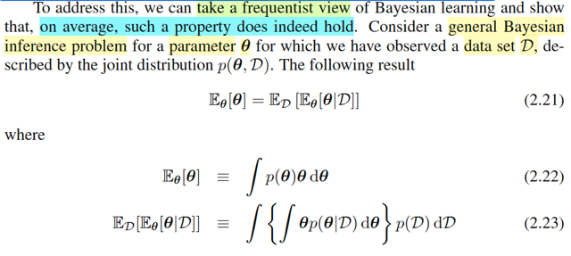</kbd>

> [!NOTE]
> Thế thì để chứng minh rằng, tính chất vừa nói: khi càng có nhiều data thì độ
> không chắc chắn (uncertainty) của param μ thể hiện bởi posterior  distribution
> càng giảm sẽ càng, ta xét bài toán inference khái quát với  θ là population
> parameter và D là dữ liệu quan sát được (y như trong Casella là **X** - random
> sample lấy từ distribution).
>
>
>
> Thế thì trước tiên, mình nhớ lại Stat110 đã học công thức này: Adam's Law:
>
>
>
> EX = E[E(X|Y)], thử chứng minh lại:
>
>
>
> E(X|Y) là cái gì, hay nên nhìn nhận nó như thế nào? và vì sao lại lấy kì vọng
> của cái này, và vì sao khi làm vậy lại ra EX.
>
>
>
> Đầu tiên, để có thể lấy kì vọng của nó E[E(X|Y)], thì nó phải là một random
> variable. Vậy thì có phải nó là random variable?
>
>
>
> Xét E(X|Y), bản chất của cái này là gì, thì trước tiên xét bản chất của EX là gì
> trước.
>
>
>
> EX, theo định nghĩa mà thầy Joe trong Stat110 dạy rằng, nó chỉ là giá trị trung
> bình. Vì X là random variable, vốn có bản chất là một hàm số map từ một
> possible outcome trong original sample space sang một con số thực. Nên  với
> các possible outcome khác nhau, ta có các possible value khác nhau của X. Và
> EX chỉ là trung bình của đám này. Chấm hết. Có điều, khi tính trung bình, ta sẽ
> gán trọng  số vào các giá trị, sao cho cái nào xuất hiện nhiều thì trọng số lớn,
> và ngược lại. Và trọng số đó chính là xác suất possible value đó xảy ra, hay
> pmf của X: P(X=x) Nên EX = Σ{mọi possible value x của X} P(X=x) x, hay viết
> vầy cho gọn Σi xi f(xi) Với biến liên tục thì nó trở thành ∫xf(x)dx với f(x) là pdf của
> X
>
>
>
> Vậy quay lại nói về E(X|Y). Thì hãy cho Y = một possible value y nào đó trước
> rồi nói tiếp: E(X|Y=y), hay viết gọn là E(X|y), hoàn toàn tương tự theo định
> nghĩa trên cũng chỉ là giá trị trung bình của X, chấm hết. Chỉ có điều ta cũng
> gán trọng số, và lần này, trọng số là xác suất mà một possible value x nào đó
> của X xuất hiện khi đã biết Y=10. Nên:
>
>
>
> E(X|Y=10) = Σ{mọi possible value x của X} x P(X=x|Y=10), hay viết gọn là Σi xi
> f(xi|y)
>
>
>
> Thế thì, kết quả này (E(X|10)) vì mình đã trung bình mọi possible value của X
> rồi NÊN NÓ KHÔNG PHỤ THUỘC X NỮA, HAY NÓI CÁCH KHÁC, NÓ LÀ
> MỘT CON SỐ CỐ ĐỊNH.
>
>
>
> Tuy nhiên, nên nhớ là ta đang tính với Y=10, tức là đã biết giá trị của Y, nên kết
> quả E(X|10) ra một con số cố định.
>
>
>
> Chứ nếu thay 10 bằng y, thì bản thân E(X|y) dĩ nhiên sẽ là một  hàm theo y.
>
>
>
> Vậy thì dừng lại đây, để nhớ một lời dạy khác của gs Joe trong Stat110: Bất kì
> khi nào ta có hàm g(x), ví dụ g(x) = x^2 + 1. Và ta đem áp vào random variable
> X: Để có g(X) = X^2 + 1, thì ta sẽ có MỘT RANDOM VARIABLE MỚI. Tức là
> g(X) là một random variable.
>
>
>
> Quay lại ý trên, ta đã nói E(X|y) là một hàm số theo biến y, ví dụ gọi là g(y)
>
>
>
> Ta đem áp hàm số này vào random variable Y, để có g(Y) = E(X|Y), thì như vừa
> nói, ta sẽ được một random variable mới.
>
>
>
> Vậy, E(X|Y) chính là random variable có được khi áp hàm g(t) = E(X|y) vào
> random variable Y. Và vì vậy, dĩ nhiên ta có thể bàn về kì vọng của nó:
> E[E(X|Y)]
>
>
>
> Và việc hiểu bản chất này cũng sẽ giúp ta chứng minh vì sao E[E(X|Y)] = EX
>
>
>
> Cụ thể là: ta vừa kết luận E(X|Y) có bản chất chỉ là g(Y) với g(y) = E[X|y]. và
> mình muốn tính kì vọng của g(Y). Thì trong Stat110, đã học LOTUS  tức Law Of
> Unconscious Statistician cho phép ta tính kì vọng của một biến ngẫu nhiên
> nhiên có được từ việc áp một hàm số lên biến ngẫu nhiên khác như sau:
>
>
>
> Eg(Y) = Σ{mọi possible value y của Y} g(y)P(Y=y)
>
>
>
> = Σ{mọi possible value y của Y} E[X|y] P(Y=y)
>
>
>
> viết gọn lại Σ{mọi y} E[X|y] P(Y=y)
>
>
>
> Đến đây thay E[X|y] ở trên vào, = Σ{mọi possible value x của X} xP(X=x|Y=y)
>
>
>
> viết gọn Σ{mọi x} xP(X=x|Y=y)
>
>
>
> ta có Eg(Y) = E[E[X|Y]] = Σ{mọi y} [Σ{mọi x} xP(X=x|Y=y)] P(Y=y)
>
>
>
> = Σ{mọi y} P(Y=y) [Σ{mọi x} xP(X=x|Y=y)]
>
>
>
> Đưa P(Y=y) đang đứng ngoài cái tổng ở trong vào trong cái tổng đó:
>
>
>
> .. = Σ{mọi y} [ Σ{mọi x} xP(X=x|Y=y)P(Y=y) ]
>
>
>
> Thay P(X=x|Y=y)P(Y=y) = P(X=x,Y=y), đây là định nghĩa của conditional
> probability
>
>
>
> = Σ{mọi y} [ Σ{mọi x} xP(X=x,Y=y)]
>
>
>
> Đây là tổng của tổng, ta có thể đổi chỗ hai tổng:
>
>
>
> = Σ{mọi x} [Σ{mọi y}xP(X=x,Y=y)]
>
>
>
> x ở trong tổng y không phụ thuộc y, đưa ra
>
>
>
> = Σ{mọi x} x [Σ{mọi y}P(X=x,Y=y)]
>
>
>
> đến đây, cái tổng ở trong: Σ{mọi y}P(X=x,Y=y) chính là marginalizing joint pmf
> của X,Y over mọi possible value của Y, ta biết một theorem nói rằng, nó chính là
> marginal pmf của X, tức P(X=x). Cái này có thể chứng minh dễ dàng bằng
> LOTP (Định lí xác suất toàn phần)
>
>
>
> Vậy ta có Σ{mọi x} x P(X=x) và cái này chính là EX theo định nghĩa
>
>
>
> -------
>
>
>
> Như vậy ta đã tự chứng minh lại công thức mà trong Stat110 gs Jow gọi là
> Adam's Law, áp dụng cho **θ** và D (D tương đương với **X**, tức random
> sample lấy (draw) từ population distribution trong bối cảnh thống kê dĩ nhiên
> cũng  là random variable (vector)):
>
>
>
> E[θ] = E[E[θ|D]] chính là công thức 2.21, mà gs Bishop ghi rõ với chữ D hay θ
> dưới chân là vì:
>
>
>
> vì khi tính E[θ|D], dĩ nhiên ta coi θ là random variable cần tính trung bình, nên ta
> sẽ dùng trọng số là phân phối của θ conditioned on observed  value của D, nên
> gs Bishop kí hiệu θ dưới chân chữ E thứ 2
>
>
>
> (y như ở trên ta tính E[X|y] = Σ{x} P(X=x|Y=y)
>
>
>
> còn với E[E[θ|D]], ta tự hiểu E[θ|D] là random variable cần tính trung bình, nên
> ta sẽ thông qua LOTUS, tính trung bình các giá trị của nó với phân phối của D,
> nên  gs Bishop có kí hiệu chữ D ở dưới chữ E thứ nhất là vậy.
>
>
>
> Và và phân tích bản chất ở trên cũng giúp ta hiểu 2.22 và 2.23:
>
>
>
> i) 2.22: Y như E(X) = Σ{mọi x} xP(X=x) với biến discrete và ∫xf(x)dx với biến liên
> tục có pdf f(x), thì ở đây cũng vậy, **θ** là random variable liên tục:
>
>
>
> E[**θ**] = ∫**θ**f(**θ**)d**θ** 
>
>
>
> Đúng hơn phải hiểu thêm đây là tích phân đa, vì θ đang kí hiệu chữ đậm, là random
> vector.
>
>
>
> ii) 2.23:
>
>
>
> E[θ|D] thì y như E[X|Y=y] ở trên đã nói = Σ{mọi x} xP(X=x|Y=y)
>
>
>
> với biến liên tục thì E[X|Y=y] = ∫xf(x|y)dx
>
>
>
> ⇨ E[**θ**|D] = ∫**θ**f(**θ**|D)d**θ**
>
>
>
> Và E[E[X|Y]] = Σ{mọi y} P(Y=y) [Σ{mọi x} xP(X=x|Y=y)]
>
>
>
> với biến liên tục sẽ là ∫ [∫ xf(x|y)dx] f(y) dy
>
>
>
> ⇨ E[E[**θ**|D]] = ∫ [∫**θ**f(**θ**|D)d**θ**] f(D) dD

 

###### Định luật Adam

<kbd>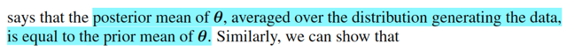</kbd>

> [!NOTE]
> Và mục đích của viện dẫn Adam's Law, là gs Bishop muốn nói rằng, nếu ta
> có posterior mean. (E(**θ**|D=một observed value của D) rồi đem trung bình
> ở mọi D  thì kết qủa sẽ chính là prior mean E[θ].

 

###### Mối quan hệ phương sai Bayes

<kbd>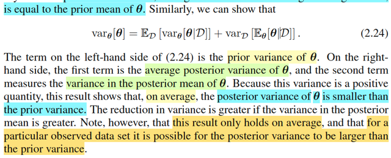</kbd>

> [!NOTE]
> Tính chất thứ hai liên quan đến một tính chất của variance đã học trong Stat110: Eve's Law
>
>
>
> Var(Y) = E[Var(Y|X)] + Var[E(Y|X)]
>
>
>
> Var(Y) = E[(Y - EY)^2] (định nghiã của variance)
>
>
>
> = E[(Y - E[Y|X] + E[Y|X] - EY)^2]
>
>
>
> = E[(Y - E[Y|X])^2 + 2(Y - E[Y|X])(E[Y|X] - EY) + (E[Y|X] - EY)^2]
>
>
>
> = E[(Y - E[Y|X])^2 + 2E[(Y - E[Y|X])(E[Y|X] - EY)] + E[(E[Y|X] - EY)^2]
>
>
>
> Xét hạng tử đầu tiên: E[(Y - E[Y|X])^2], đặt Z = (Y - E[Y|X])^2
>
>
>
> Áp dụng Adam's Law: E[Z] = E[E[Z|X]]
>
>
>
> = E[E[(Y - E[Y|X])^2|X]]
>
>
>
> cái này chính là E[Var(Y|X)]. vì sao?
>
>
>
> Vì theo định nghĩa của variance của Y, Var(Y) = E[(Y - EY)^2]
>
>
>
> thì variance của Y conditioned on X sẽ là Var(Y|X) = E[(Y - E(Y|X)^2|X]
>
>
>
> Xét hạng tử thứ ba: E[(E[Y|X] - EY)^2]
>
>
>
> E[Y|X] là random variable có được bởi việc áp hàm E[Y|X=x] lên X.
>
>
>
> Xét mean của nó E[E[Y|X]], theo Adam's law, chính là bằng EY.
>
>
>
> vậy E[(E[Y|X] - EY)^2] = E[(E[Y|X] - E[E[Y|X]])^2] nhìn thì rối, nhưng nếu đặt cái random variable E[Y|X] là Z ta sẽ thấy nó là
> E[(Z
> \- EZ)^2] nên đây chính là Var(Z).
>
>
>
> Vậy term thứ ba chính là Var[E(Y|X)]
>
>
>
> Xét term thứ hai: 2E[(Y - E[Y|X])(E[Y|X] - EY)]
>
>
>
> Coi nguyên cục trong kì vọng là U, thì term thứ 2 là 2E(U). Áp dụng Adam's law: EU = E[E(U|X)]
>
>
>
> E[U|X] là random variable có được bởi việc áp hàm E[U|X=x] lên x.
>
>
>
> ⇨ E[E[U|X]] = ∫ E[U|X=x] fX(x) dx
>
>
>
> E[U|X=x] = E[(Y - E[Y|X])(E[Y|X] - EY)|X=x]
>
>
>
> vì đã condition on X=x, nên E[Y|X] không còn là random variable, mà là fixed value E[Y|X=x]
>
>
>
> = E[(Y - E[Y|X=x])(E[Y|X=x] - EY)|X=x]
>
>
>
> dẫn đến E[Y|X=x] - EY trở thành fixed value, đưa ra ngoài kì vọng theo tính linearity
>
>
>
> = (E[Y|X=x] - EY) E[(Y - E[Y|X=x])|X=x]
>
>
>
> tới đây thừa số E[(Y - E[Y|X=x])|X=x], theo linearity = E(Y|X=x) - E[E(Y|X=x)|X=x]
>
>
>
> = E(Y|X=x) - E(Y|X=x) = 0 (Do E(Y|X=x) là constant, nên E[E(Y|X=x)|X=x] = E(Y|X=x)
>
>
>
> Như vậy term thứ hai = (E[Y|X=x] - EY) . 0 = 0
>
>
>
> Kết luận Var(Y) = E[Var(Y|X)] + Var[E(Y|X)]
>
>
>
> -------
>
>
>
> Áp dụng vào đây giúp ta hiểu:
>
>
>
> ⇨ Var(θ) = E[Var(θ|D)] + Var[E(θ|D)]
>
>
>
> Và xét Var[E(θ|D)]:
>
>
>
> Nếu với D = một observed value d của D, ta có E[θ|D=d] là kì vọng của θ với θ ~ π(θ|D=d) dĩ nhiên chính là mean của
> posterior.
>
>
>
> ⇨ E(θ|D) là random variable khi áp hàm E[θ|D=d] lên D, giá trị của nó mang ý nghĩa, với mean của posterior ứng với các
> possible value khác nhau của D,
>
>
>
> Và Var(E(θ|D)) sẽ là variance của random variable này, do đó nó mang ý nghĩa là độ biến động của giá trị posterior mean khi
> giá trị của D thay đổi, do đó gs Bishop gọi nó là "variance in posterior mean", variance của posterior mean
>
>
>
> Chú ý, nó hoàn toàn không phải là variance của posterior distribution. Hiểu thế này: E[θ|D=d] là một point estimator của θ với
> θ ~ π(θ|D=d), tức là, một ước lượng điểm của θ, được tính bởi cách thức dùng mean của posterior distribution để ước
> lượng. Và vì tùy vào giá trị của D, ta có các posterior khác nhau, nên cái sự ước lượng ) này là một hàm số, hay, E[θ|D] cũng
> là một biến ngẫu nhiên. Tóm lại E[θ|D] là posterior mean, là một biến ngẫu nhiên và Var của nó là variance của posterior
> mean.
>
>
>
> Còn variance của posterior distribution thì phải kí hiệu là Var(θ|D=d), mang ý nghĩa là variance của θ với θ ~ π(θ|D=d).
>
>
>
> Như vậy thì đây cũng là một hàm số phụ thuộc d, nên Var(θ|D) cũng là một random variable có được do áp hàm Var(θ|D=d)
> lên D.
>
>
>
> Và E[Var(θ|D)] chính là lấy mean của random variable này, nên nó mang ý nghĩa là trung bình của [variance của posterior
> distribution]
>
>
>
> Chốt lại,
>
>
>
> term thứ nhất, mang ý nghĩa: **trung bình / kì vọng của [variance của posterior distribution]**
>
>
>
> term thứ hai mang ý nghĩa: **variance / độ biến động của [posterior mean]**
>
>
>
> Còn bên trái, Var(θ) dĩ nhiên là **[variance / độ biến động của prior distribution]**
>
>
>
> mà term thứ hai, (variance / độ biến động của [posterior mean]) dĩ nhiên không âm do variance thì luôn không âm
>
>
>
> suy ra:
>
>
>
> variance / độ biến động của prior distribution = số k0 âm + trung bình / kì vọng của [variance của posterior distribution]
>
>
>
> ⇨ **variance / độ biến động của prior distribution** ≥ **trung bình / kì vọng của [variance của posterior distribution]**
>
>
>
> -------
>
>
>
> Vậy thì cái kết luận vừa rồi cũng chính là (nói bằng lời): nói chung (lấy trung bình trên các bộ dataset D=d khác nhau) thì
> variance của posterior sẽ nhỏ hơn so với variance của prior. Cũng chính là nói: Khi ta chưa biết gì về D, chưa quan sát thấy
> data, lúc này chỉ dựa vào prior distribution, thì ta có variance của θ là nhiêu đó, ví dụ = a, thì sau khi có dữ liệu để rồi ta cập
> nhật lại distribution của θ, để có posterior distribution, thì variance của θ lúc này, ví dụ b, thì b sẽ NHỎ HƠN a Và độ giảm
> của variance, a - b, dĩ nhiên theo phương trình trên, chính là độ lớn của cái term thứ hai: variance / độ biến động của
> [posterior mean]
>
>
>
> Do đó gs Bishop mới nói trong sách rằng, mức độ giảm của variance sẽ càng lớn nếu như variance của posterior mean càng
> lớn ("The reduction in variance is greater if the variance in the posterior mean is greater").
>
>
>
> Và điều này nhằm chứng minh cho nhận định mà gs Bishop đặt vấn đề lúc nãy: liệu đây có phải là tính chất khái quát không,
> rằng càng có nhiều data thì posteriori sẽ ngày càng có variance nhỏ lại, (variance cũng là thể hiện tính uncertainty) hay
> không?

 

