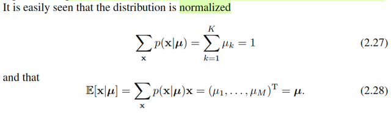
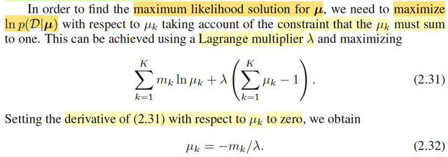
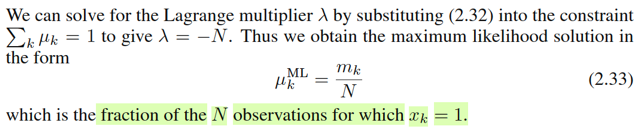
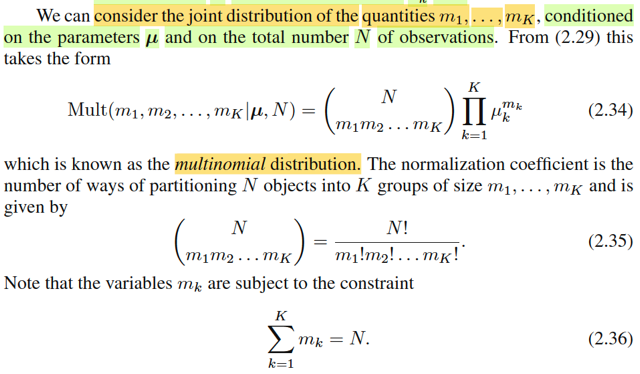
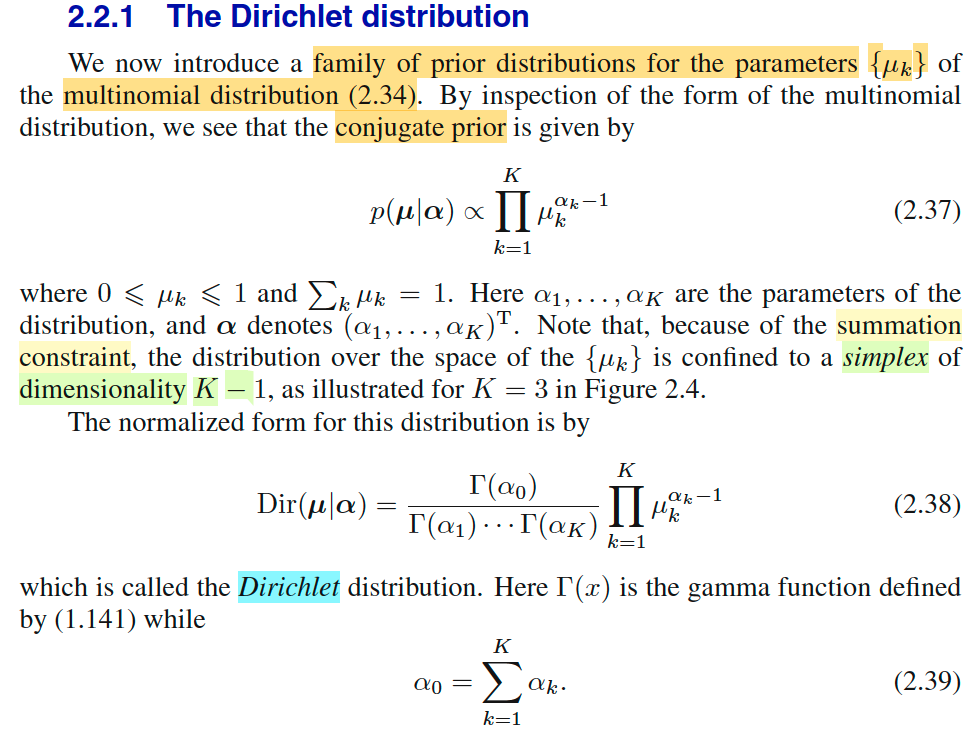
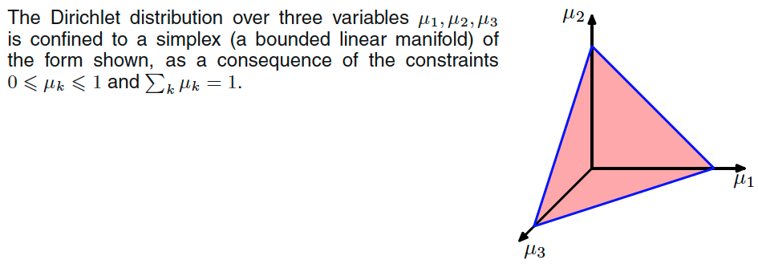
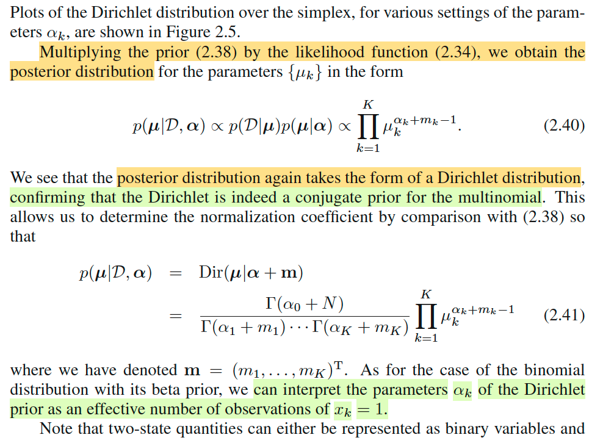
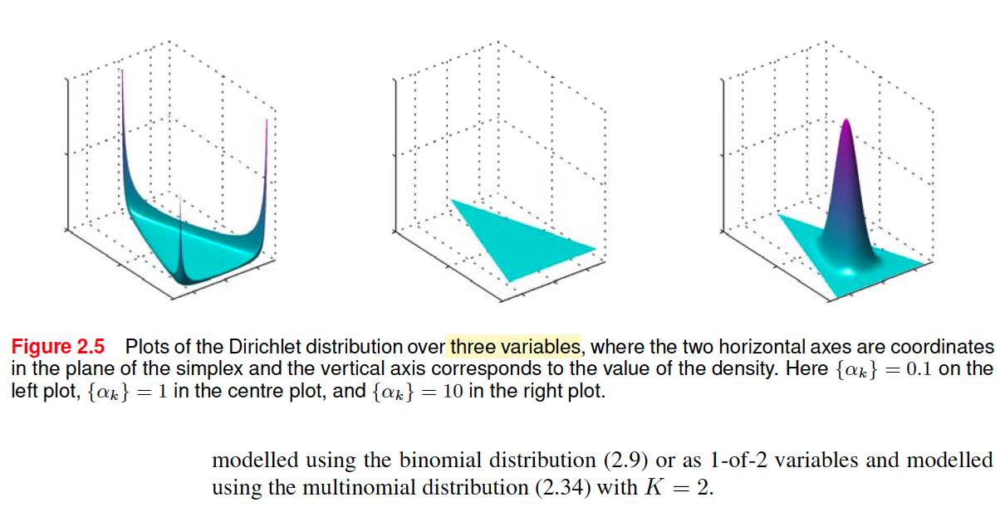

# 2.2 Multinomial Variables

📊 **Progress:** `7` Notes | `10` Screenshots | `3` AI Reviews

---

 

## Vector hóa biến rời rạc

<kbd></kbd>

> [!NOTE]
> Đại ý là mở đầu gs cho biết biến nhị phân (binary variables) (chính là
> Bernoulli variables như đã biết) có thể được dùng để đại diện cho những
> đại lượng có hai possible values.
>
>
>
> Tuy nhiên có nhiều đại lượng khác sẽ có nhiều hơn hai các giá trị khả dĩ
> rời rạc. Thì phần này ta sẽ học một cách phổ biến và tiện lợi để represent
> loại này, tuy không phải là cách duy nhất.
>
>
>
> Giả sử ta có K possible values và μ1,...μ6 là xác suất tương ứng của K=6
> possible values này. Ví dụ U là random variable có 6 possible value u1,...
> u6 ứng với xác suất μ1,...μ6 thì dĩ nhiên ta có pmf fU(u1) = P(U=u1) = μ1.
>
>
>
> Tuy nhiên cách mà người ta sẽ làm đó là dùng một K-dimensional vector,
> trong đó chỉ có một vị trí là = 1, còn lại là bằng 0, để biểu diễn một
> possible value. Có nghĩa là K possible values sẽ được biểu diễn bởi K
> vector, mà vị trí số một sẽ tương ứng.
>
>
>
> Ví dụ trong K=6 possible value đó, thì sẽ có một cái u3  được represent
> bởi vector [0,0,1,0,0,0].
>
>
>
> Như vậy mình sẽ xem xét một random variable vector: **X** = (X1,...X6)
> mà trong đó X1,...X6 là các Bernoulli random variables. Và có ràng buộc
> X1 + ...+X6 = 1,  X1,X2,...X6 ∈ {0,1}
>
>
>
> U = u3 sẽ TƯƠNG ỨNG **X** = [0,0,1,0,0,0]T
>
>
>
> Thế thì ta có:
>
>
>
> P(U=u1) = μ1
>
>
>
> ⇔ P_**μ**(**X**=[1,0,0,0,0,0]T) = μ1
>
>
>
> ⇔ P_**μ**(X1=1,X2=0,...,X6=0) = μ1.
>
>
>
> Tương tự P_**μ**(X1=0,X2=1,...,X6=0) = μ2
>
>
>
> Vậy thì thể hiện khái quát là P_**μ**(**X**=**x**) = Πk=1:K μk^**x**k
>
>
>
> (cái này chỉ là khái quát của pmf của binary / Bern(μ) variable vốn có thể
> coi như K = 2: P_μ(X=x) = μ^x(1-μ)^(1-x))

 

### Chuẩn hóa và Kỳ vọng có điều kiện

<kbd></kbd>

> [!NOTE]
> Cái vụ normalize thì hiển nhiên là tổng các μi = 1.
>
>
>
> Còn xem thử E[**X**|**μ**] là sao ? Câu trả lời là theo định nghĩa của  kì vọng
> thôi - là weighted average các possible value của **X** với weight là pmf
> tương ứng:
>
>
>
> E[**X**|**μ**] = Σ_{xi=**x**1,..**x**K} **x**iP(**X**=**x**i) (***x**i là các one-hot vector, hay cũng dễ nhận 
> dưới góc nhìn đại số tuyến tính, đây chính là các standard basis **e**i )
>
>
>
> = Σ_{**x**i=**x**1,..**x**K} **x**i μi
>
>
>
> Và cái này chính là gì? ⇨ linear combination các vector **x**i với hệ số μi. và
> dễ hiểu kết quả là vector **μ** (vì μ1*[1,0,..0]T + μ2*([0,1,0..]T + .. = [μ1, μ2,..]T
> = **μ**)

 

#### Hàm likelihood và thống kê đủ

<kbd></kbd>

> [!NOTE]
> Rồi, thế thì gs cho rằng ta sẽ xem xét một dataset D = {**x**1,...**x**N} (tức là
> các observation của U, hiểu theo góc nhìn Casella, thì ta có một random
> sample U1, U2..UN iid, ~ fU(u), nhưng ta represent U bởi **X** như đã nói để rồi
> observed value {u1,u2,...uN} của random sample **U1,..Un**  sẽ được represent
> bởi {**x1**, **x2**,..**xN**} của random sample **X1**, **X2, ..XN**
>
>
>
> (chú ý, chỗ này dễ confuse về kí hiệu nên nói rõ tí:  **X1** là random variable
> vector [**X1**1, **X1**2,...**X1**K] mà giá trị quan sát thấy của nó là **x1**, là
> một one hot vector nào đó (số 1 nằm ở đâu đó) ví dụ (0,1,0,..0)T
>
>
>
> Và X1 là random variable vector tương ứng với U1,
>
>
>
> Tương tự X2, ...XN cũng vậy, sẽ tương ứng với U2,...
>
>
>
> Rồi. giờ ta bàn về likelihood của data D, thì có lẽ nên nhắc lại về hàm likelihood
> chút cho nhớ:
>
>
>
> Trong Casella, mình được học định nghĩa của hàm likelihood như sau. Giả sử
> ta có random sample **X** = X1,...Xn iid ~ f(x|θ), có observed value **X** = **x**
> Thì hàm likelihood là hàm số của θ, kí hiệu L(θ|**x**) được định nghĩa là =
> f(**x**|θ) mang ý nghĩa là độ hợp lí của θ khi quan sát thấy **X** = **x**.
>
>
>
> L(θ|**x**) = f(**x**|θ). Mà vì tính iid, nên joint pdf của X có thể tách thành tích các
> marginal pdf: f(**x**|θ) = Πi=1:N f(xi|θ).
>
>
>
> Nên lúc này L(θ|**x**) = Πi=1:N f(xi|θ)
>
>
>
> Quay lại đây, bối cảnh là ta cũng đang có D = **X1**, **X2**,...**XN** iid ~
> f(**x**|**μ**).
>
>
>
> L(**μ**|D) = f(D|**μ**) = Πi=1:N f(**xi**|**μ**)
>
>
>
> = Πi=1:N Πk=1:K μk^**xi**k
>
>
>
> =  Πk=1:K { Πi=1:N μk^**xi**k }
>
>
>
> =  Πk=1:K μk^ { Σi=1:N **xi**k }
>
>
>
> Đặt mk = Σi=1:N **xi**k : tức là tổng các phần tử thứ k của các vector **x1**, ...
> **xN**.
>
>
>
> = Πk=1:K μk^mk
>
>
>
> -------
>
>
>
> Tiếp, như đã ôn lại về sufficient statistic bữa trước, theo Factorization theorem
> khi pdf của **X**: f(x|θ) có thể được factor thành tích của một hàm h(**x**) chỉ
> phụ thuộc **x** và một hàm phụ thuộc **x** và tham số θ nhưng chỉ phụ thuộc x
> thông qua một hàm T(**x**) nào đó: g(T(**x**)|θ). Tức f(**x**|θ) =
> g(T(**x**)|θ)h(**x**), thì khi đó, T(**x**) chính là sufficient statistic của θ.
>
>
>
> Ở đây ta vừa thấy f(**x**|μ) = Πk=1:K μk^ { Σi=1:N **xi**k }
>
>
>
> có dạng g(T(**x**)|**μ**)h(**x**) với h(**x**) = 1, g(T(**x**)|**μ**) = Πk=1:K μk^{T(**x**)_k}
>
>
>
> với T(**x**) = Σi=1:N **xi,** T(**x**)_k là phần tử thứ k của vector T(**x**)
>
>
>
> Như vậy T(**X**) = Σi=1:N **Xi chính là sufficient statistic**
>
>
>
> ------
>
>
>
> Cũng ko khó để hiểu T(**x**)_K, tổng các phần tử thứ k của các vector **x1**,...**xN**
> thì cũng chính là tổng số các observed value ứng với U = uk.

 

##### Ước lượng ML Lagrange

<kbd></kbd>

<kbd></kbd>

> [!NOTE]
> L(**μ**|D) = f(D|**μ**) = Πk=1:K μk^mk
>
>
>
> với mk = Σi=1:N **xi**k : tức là tổng các phần tử thứ k của các vector **x1**,...,**xN**.
>
>
>
> Tiếp theo, đại khái là ta sẽ nói về việc tìm ML estimator của **μ**, **μ**^_ML, là solution
> của bài toán:
>
>
>
> maximize_**μ** L(**μ**|D) constraint Σk μk = 1
>
>
>
> Đây là bài toán equality constraint optimization.
>
>
>
> Như thường lệ, ta sẽ chuyển sang bài toán tương đương với hàm log (log base e)
>
>
>
> maximize ln L(**μ**|D) s.t Σk μk = 1
>
>
>
> Xét objective ln L(**μ**|D) = ln { Πk=1:K μk^mk }
>
>
>
> = Σk ln (μk^mk)
>
>
>
> = Σk mk ln μk
>
>
>
> Lagrangian: L(**μ**, λ) = Σk mk ln μk + λ (Σk μk - 1)
>
>
>
> = **m**Tln(**μ**) + λ(**μ**T**1**-1)
>
>
>
> (**m** là vector (m1, m2,...mK)T, **1** là vector (1,1,..1)T)
>
>
>
> ∇_μ L(**μ**, λ) = d/d**μ** [**m**Tln(**μ**) + λ(**μ**T**1**-1)]
>
>
>
> = d/d**μ** [**m**Tln(**μ**)] +  d/d**μ** [λ(**μ**T**1**-1)]
>
>
>
> = d/d**μ** [**m**Tln(**μ**)] +  λ d/d**μ** (**μ**T**1**-1)
>
>
>
> Xét d/dμ [**m**Tln(**μ**)], tính gradient theo cách đã học trong MIT 18.s096:
>
>
>
> d[**m**Tln(**μ**)] = **m**Tln(**μ**+d**μ**) - mTln(**μ**)
>
>
>
> = Σk {mk ln(μk + dμk)} - Σk {mk ln(μk)}
>
>
>
> = Σk {mk ln(μk + dμk) - mk ln(μk)}
>
>
>
> = Σk {mk [ln(μk + dμk) - ln(μk)]}
>
>
>
> = Σk {mk ln [(μk + dμk) / μk]}
>
>
>
> = Σk {mk ln(1 + dμk/μk)}
>
>
>
> = Σk {mk dμk/μk} | ln(1+ε) ≈ ε
>
>
>
> = Σk (mk/μk) dμk
>
>
>
> = (m1/μ1,...mK/μK)Td**μ**
>
>
>
> ⇨ ∇_**μ** [**m**Tln(**μ**)] = (m1/μ1,...mK/μK)
>
>
>
> Xét d/dμ (**μ**T**1**-1)
>
>
>
> d(**μ**T1-1) = (**μ**+d**μ**)T**1**-1) - (**μ**T**1**-1) = dμT**1** = **1**Td**μ**
>
>
>
> ⇨ ∇_**μ** [**μ**T**1**-1]= **1**
>
>
>
> Vậy ∇_μ L(**μ**, λ) = (m1/μ1,...mK/μK) + λ **1** (chú ý **1** là K-dimensional vector
> **1** = (1,1,...1)T)=(m1/μ1 + λ ,...,mK/μK + λ)
>
>
>
> Stationary condition: ∇_μ L(**μ**, λ) = 0
>
>
>
> ⇔ (m1/μ1 + λ ,...,mK/μK + λ) = 0
>
>
>
> ⇔ m1/μ1 + λ = 0 ,..., mK/μK + λ = 0
>
>
>
> ⇔ μ1 = - m1/λ ,..., μK = -mK/λ = 0.  → Đây là kết quả 2.32 trong sách.
>
>
>
> Để kết luận stationary point là maximum phải xét điều kiện đạo hàm bậc hai, hoặc cũng
> có thể chỉ ra đây là concave problem
>
>
>
> Objective = **m**Tln(**μ**)
>
>
>
> ln(.) là hàm concave ⇨ mTln(**μ**) là tổng các mk ln(μk) với mk = Σi=1:N **xi**k chắc
> chắn là không âm ⇨  cũng là hàm concave, và tổng của chúng cũng sẽ là hàm
> concave.
>
>
>
> Vậy thì, với concave problem, KKT condition đủ để kết luận optimal → stationary point
> ở trên chính là maximizer
>
>
>
> Hoặc check đạo hàm bậc hai:
>
>
>
> d/d**μ** (d/d μ Σk mk ln μk)
>
>
>
> = d/d**μ** [(m1/μ1,...mK/μK)T]
>
>
>
> Dễ thấy Jacobian của (m1/μ1,...mK/μK)T cũng là Hessian của objective chính là
> diagonal matrix: diag(-m1/μ1^2, -m2/μ2^2,...,-mK/μK^2):
>
>
>
> Ví dụ, hàng 1 của Jacobian là vector [∂(m1/μ1) ∂μ1, ∂(m1/μ1)/∂μ2,...,∂(m1/μ1)/∂μK]
>
>
>
> thì sẽ là [-m1/μ1^2, 0,..,0]
>
>
>
> tương tự hàng 2 của Jacobian là [0, -m2/μ2^2, 0,...0]
>
>
>
> Và với mọi mi đều không âm thì nó là matrix  xác định âm ⇨ stationary point là
> maximizer
>
>
>
> ------
>
>
>
> Thế optimal point **μ*** vào constraint (Σk μk - 1) = 0 để giải tìm λ (Lagrange multiplier
> hay như trong ee364a  cũng gọi là dual variable):
>
>
>
> λ [Σk (-mk / λ) - 1] = 0
>
>
>
> ⇔ - Σk mk - λ  = 0
>
>
>
> ⇔ - Σk mk = λ 
>
>
>
> ⇔ - Σk (Σi=1:N **xi**k) = λ
>
>
>
> Thế thì mk là tổng các observed ứng với class thứ k và sum qua mọi k thì chính
> là tổng số sample: N
>
>
>
> Vậy dual optimal λ = -N
>
>
>
> ⇨ Maximizer, tức **μ**^_ML = [-m1/-N, -m2/-N,...,-mK/-N]
>
>
>
> = [m1/N, m2/N,....,mK/N]
>
>
>
> Điều này có nghĩa là. Theo maximum likelihood estimator của parameter **μ** = (μ1, μ2, ...μK)
> thì ML estimate của μi chính là tỉ lệ của sample / observed data thuộc class i trong dataset.

 

###### Giải thích Phân phối Đa thức

<kbd></kbd>

> [!NOTE]
> Tiếp gs Bishop mới nói đến joint distribution của m1,...mk. Là sao?
>
>
>
> mk = (Σi=1:N xik)
>
>
>
> Nhớ lại **X1, X2,...XN** là các random variable vector trong D
>
>
>
> dĩ nhiên **X1**\_1, **X1**\_2,...**X1**\_K, **X2**\_1, **X2**\_2,... đều là các random variable
>
>
>
> thành ra nếu coi Mk = (Σi=1:N **Xi**\_k) thì dĩ nhiên nó là random variable
>
>
>
> và từ đó **M** = (M1, M2,...MK) là random variable vector.
>
>
>
> Và cũng từ đó ta bàn đến joint distribution của M1,...MK (nhắc lại lần nữa trong sách này gs Bishop ko còn theo quy ước toán thông thường trong đó viết hoa với tên biến, viết thường với giá trị biến) nên mình phải chịu khó phân tích.
>
>
>
> Thế thì, thử xem joint distribution của M1,...MK là gì? Hay vì sao lại ra công thức 2. 34:
>
>
>
> Đầu tiên xét Mk, hay cụ thể với k = 2, xem M2 có distribution là gì.
>
>
>
> M2 = Σi=1:N **Xi**\_2, tổng số phần tử thứ 2 của các random vector **X1**,...**XN**.
>
>
>
> Đầu tiên nhận định nó là biến rời rạc, nhận các possible value là 0,1,..,N
>
>
>
> Xét ý nghĩa của M2 thì có thể thấy nó giống như là ta thực hiện N trial: mỗi lần / mỗi trial, ví dụ trial thứ 1, chính là: xét giá trị của U xem nó có phải là bằng u2, để khiến **X1** = (0,1,..0) cũng là phần tử thứ 2 của **X1**là 1 hay. không.
>
>
>
> Và các random vector **X1**,...**XN** dĩ nhiên là độc lập, (iid).
>
>
>
> Do đó, story của M2 là tổng của N iid Bern(p) trials. Với p là chính là xác suất để U = u2, P(U=u2), chính là μ2.
>
>
>
> Vậy M2 là tổng của N iid Bern(μ2) trials nên nó chính là \~ Binomial(N, μ2)
>
>
>
> Tương tự M1 \~ Binomial(N, μ1), M3 \~ Binomial(N, μ3),...MK \~ Binomial(N, μK)
>
>
>
> Thế thì dĩ nhiên M1,...MK không identically distribution.
>
>
>
> Nhưng chúng có độc lập (mutually independent) không?
>
>
>
> Câu trả lời là không, vì tổng Σk=1:K Mk = N
>
>
>
> Do đó, ta không thể xây dựng joint pdf cũa M1,..MK bằng tích các marginal pdf.
>
>
>
> Thay vào đó ta sẽ làm theo cách sau:
>
>
>
> Xét vector random variable **M** = (M1,M2,...MK)
>
>
>
> Xét một possible value của nó, (m1,m2,...mK): Σk mk = N
>
>
>
> thì về bản chất đây là event:
>
>
>
> (có m1 lần U = u1, có m2 lần U = u2,....)
>
>
>
> hay:
>
>
>
> (có m1 lần object ∈ class 1, có m2 lần object ∈ class 2,...)
>
>
>
> Vậy xác suất P(**M**=(m1,m2,...mK))
>
>
>
> = P(M1=m1,M2=m2,...MK=mK)
>
>
>
> = P("trong chuỗi N=Σk mk event quan sát giá trị của U, có m1 lần U = u1, có m2 lần U = u2,....")
>
>
>
> Thế thì xét event này, có thể thấy nó là union của nhiều event disjoint. Vì ví dụ như có m1 lần U = u1 thì vị trí xuất hiện có thể khác nhau, tương tự với các case khác.
>
>
>
> Do đó, ta cần xem đây là union của bao nhiêu disjoint event:
>
>
>
> Bài toán trở thành: đếm số cách sắp xếp m1 banh u1, m2 banh u2,...mK banh uk vào m1+m2+...mK = N vị trí:
>
>
>
> Nếu coi tất cả các banh đều khác nhau, với N vị trí ta có N! cách sắp xếp.
>
>
>
> Nhưng vì có m1 banh u1 và ta không care thứ tự các banh u1, nên với m1! cách sắp có các thứ tự khác nhau của bánh u1 (còn các loại khác thì giống nhau hết) thì ta chỉ lấy 1. Tức là, ta sẽ adjust bằng cách chia N! cho m1!.
>
>
>
> Tương tự, trong N!/m1! cách sắp xếp cũng sẽ có m2! cách sắp giống nhau hết ở các banh m1,m3,... chỉ khác nhau thứ tự các banh m2, và vì ta ko care thứ tự các banh m2, nên trong m2! thì ta chỉ lấy 1. Có nghĩa là lại chia N!/m1! cho m2!.
>
>
>
> Tiếp tục tương tự như vậy, cuối cùng ta có N!/(m1!m2!...mK!).
>
>
>
> Vậy event "trong chuỗi N=Σk mk event quan sát giá trị của U, có m1 lần U = u1, có m2 lần U = u2,...." thật ra là union của N!/(m1!m2!...mK!) event disjoint tương ứng với các thứ tự khác nhau của các m1 lần U=u1, m2 lần U=u2,...
>
>
>
> Để dễ hình dung.
>
>
>
> Lấy ví dụ K = 3, N = 5
>
>
>
> thì các chuỗi kết quả cụ thể của U1,U2,...U5 có thể là (u1,u2,u3,u1,u2) hoặc (u3,u2,u2,u3,u2) ...
>
>
>
> Vậy thì giờ giả sử ta xét event: "có 2 lần U = u1, 2 lần U = u2, 1 lần U = u3"
>
>
>
> Thì nó sẽ là union của các event:
>
>
>
> (u1,u1,u2,u2,u3), (u1,u2,u1,u2,u3), (u1,u2,u2,u1,u3),....
>
>
>
> và ta cần đếm hết các chuỗi này.
>
>
>
> Thế thì ta mới đưa về bài toán rải 2 banh vàng, 2 banh đỏ, 1 banh trắng vào 5 ô để đếm có bao nhiêu cách sắp xếp khác nhau nhưng ta không phân biệt các banh cùng màu. Ví dụ ta không coi \[vàng 1, vàng 2, đỏ 1, đỏ 2, trắng\] và \[vàng 2, vàng 1, đỏ 1, đỏ 2, trắng\] là hai cái khác nhau, đồng nghĩa ta coi hai case này là 1.
>
>
>
> Thành ra đầu tiên ta coi 5 banh này là khác nhau thì ta có 5! cách hoán vị của chúng.
>
>
>
> Sau đó, trong 5! này, sẽ có 2! lần ta có các dạng mà ta có các cách sắp hoàn toàn giống nhau mà ta đếm dư là do ta coi hai banh vàng là khác nhau, nên phải chia bớt đi cho 2! (giống như trong 2 case trên, chỉ lấy 1 mà thôi)
>
>
>
> Tương tự, trong 5!/2! này sẽ lại có 2! cách sắp hoàn toàn giống nhau mà ta đếm dư là do ta đang phân biệt hai banh đỏ. Nên phải điều chỉnh tiếp, bằng cách chia cho 2!.
>
>
>
> Tương tự, lại chia tiếp cho 1!
>
>
>
> Nói chung đây là bài toán đếm mà ta đã học ở những bài đầu của stat110.
>
>
>
> Quay lại đây, theo axiom 3: Xác suất của các union các disjoint event = tổng xác suất của từng event đó.
>
>
>
> P("trong chuỗi N=Σk mk event quan sát giá trị của U, có m1 lần U = u1, có m2 lần U = u2,....") = tổng của N!/(m1!m2!...mK!) xác suất của một event ứng với một kết quả cụ thể nào đó có dạng m1 lần U = u1, m2 lần U = u2,...
>
>
>
> Xét một event như vậy, thì đây lại là joint event của chuỗi event này độc lập (các data sample độc lập)
>
>
>
> nên xác suất này, theo tính định nghĩa của independent event, sẽ là tích các xác suất của từng event:
>
>
>
> .. = \[tích của m1 cái P(U = u1)\]\*\[tích của m2 cái P(U=u2)\]....\[tích của mL cái P(U=uK)\]
>
>
>
> = (μ1)^m1 (μ2)^m2 ...(μK)^mK
>
>
>
> = Πi=1:K μk^mk
>
>
>
> Và các event khác cũng đều bằng như vậy.
>
>
>
> Kết luận ta có:
>
>
>
> P("trong chuỗi N=Σk mk event quan sát giá trị của U, có m1 lần U = u1, có m2 lần U = u2,....") = tổng của N!/(m1!m2!...mK!) cái xác suất mỗi cái = Πi=1:K μk^mk
>
>
>
> = N!/(m1!m2!...mK!) (Πi=1:K μk^mk)
>
>
>
> ⇔ P(M1,M2,..MK =m1,m2,...mK) = N!/(m1!m2!...mK!) (Πi=1:K μk^mk)
>
>
>
> là pmf của multinomial distribution

> [!TIP]
> **🤖 AI Feedback** — ✅ Score: **98/100**
>
> Phần phân tích và dẫn xuất của bạn cho phân phối đa thức là vô cùng kỹ lưỡng và sâu sắc, vượt xa việc chỉ tóm tắt nội dung. Bạn đã thể hiện sự hiểu biết sâu sắc về các nguyên lý xác suất nền tảng. Có một lỗi nhỏ khi viết 'mL' thay vì 'mK' trong một dòng, nhưng đây là một điểm không đáng kể so với chất lượng tổng thể của bài làm.

 

###### Phân phối Dirichlet

<kbd></kbd>

<kbd></kbd>

> [!NOTE]
> Đại khái là phần này sẽ nói về họ các prior distribution của Multinomial
>
>
>
> Ôn lại tí xíu, ta biết với Binomial thì conjugate prior là Beta, và điều này có nghĩa là khi chọn beta làm prior, thì posterior (xây dựng bằng Bayes theorem) sẽ cũng là Beta.
>
> Vậy thì ở trong phần trước ta đã biết pmf của Multinomial:
>
>
>
> f(**m**|**μ**,N) = P\_**μ**(M1,M2,..MK =m1,m2,...mK) = N!/(m1!m2!...mK!) (Πi=1:K μk^mk)
>
>
>
> bỏ qua phần constant (normalizing constant) thì ta chỉ cần chú ý tới (Πi=1:K μk^mk).
>
>
>
> Thế thì nhìn vào đó ta thấy để mà posterior có cùng dạng với prior thì prior phải có dạng là tích của các lũy thừa của μ: Πk=1:K μk^(something). Vì khi đó, khi nhân với cái cụm ở trên, để tạo ra kernel của posterior, thì nó cũng sẽ có dạng Πk=1:K μk^(something). Đây là lí do gs Bishop nói p(**μ**|**α**) ∝ Πk=1:K μk^(αk-1) với αk-1 chính là something, dĩ nhiên **α** = (α1, α2,...αK)T là parameter của prior.
>
>
>
> Thế thì vì sao Σk μk = 1?, à thì là vì đây vẫn là do điều kiện valid của pdf của multinomial thôi. Nên bây giờ do prior là distribution của **μ** tức, là cũng là joint distribution của μ1,...μK
>
>
>
> Như vậy thì chỗ này mình cần hiểu thế này, giống như là ta có một joint distribution của K random variable X1,X2,....XK với một đặc điểm là X1+X2+... +XK = 1 vậy. Cái điều kiện này khiến cho mình gặp một thứ mà trong các lớp Stat110, Casella chưa hề gặp qua, vì thường thì ta chỉ xét joint của các randomvariable X1,...Xn iid, chứ chưa khi nào gặp ràng buộc Σi Xi = 1. Và gs Bishop cho biết cái này gọi là một **simplex**.
>
>
>
> Thế thì đại khái là, cái distribution này, gọi là **Dirichlet**, thật ra chỉ là **phiên bản mở rộng của Beta** **distribution**.
>
>
>
> Còn nhớ beta(α, β) có pdf: f(x|α, β) = C x^(α-1)(1-x)^(β-1) với C là normalizing constant = beta(α, β) (hàm beta, được define là = Γ(α+β)/Γ(α)Γ(b)), thì thật ra cũng có thể coi nó là Dirichlet với K=2:
>
>
>
> **X** = (X1,X2) \~ f(x1,x2|α,β) = \[Γ(α+β)/Γ(α)Γ(b)\] x1^(α-1) x2^(β-1) với x1 + x2 = 1
>
>
>
> Từ đó ta có pdf của **X** = (X1,..XK) \~ Dirichlet distribution f(x1,x2...xK|α1,α2,...,αK)
>
>
>
> = \[Γ(α1+...+αK)/ Γ(α1)...Γ(αK)\] x1^(α1-1) x2^(α2-1) ...xK^(αK-1)
>
>
>
> = \[Γ(Σk=1:K αk)/ Γ(α1)...Γ(αK)\] Πk=1:K xk^(αk-1) 
>
>
>
> = \[Γ(α0)/ Γ(α1)...Γ(αK)\] Πk=1:K xk^(αk-1)
>
>
>
> Và cũng qua đó ta có thể hiểu đại khái công thức có vụ -1 là vì đây là một dạng mở rộng của beta.

> [!TIP]
> **🤖 AI Feedback** — ⚠️ Score: **85/100**
>
> Bài phân tích cho thấy sự nắm vững xuất sắc về khái niệm prior liên hợp và mối liên hệ sâu sắc giữa phân phối Beta và Dirichlet. Cách giải thích về dạng của prior và nguồn gốc của hằng số chuẩn hóa rất rõ ràng và mạch lạc. Tuy nhiên, cần diễn đạt chính xác hơn về lý do tại sao Σk μk = 1 lại là một ràng buộc quan trọng cho các tham số μk mà phân phối prior phải tuân thủ, chứ không chỉ đơn thuần là điều kiện hợp lệ của PMF Multinomial. Một chút tinh tế hơn trong cách dùng từ sẽ nâng cao chất lượng bài phân tích.

 

###### Prior liên hợp Dirichlet

<kbd></kbd>

<kbd></kbd>

> [!NOTE]
> Thế thì như đã nói, với việc dùng Dirichlet Dir(**α**) làm prior cho **μ**. Thì posterior sẽ có kernel có dạng:
>
>
>
> π(**μ**|D) = f(D|**μ**) π(**μ**) / f(D) ∝ f(D|**μ**) π(**μ**)
>
>
>
> = N!/(m1!m2!...mK!) (Πk=1:K μk^mk) \[Γ(α0)/ Γ(α1)...Γ(αK)\] (Πk=1:K μk^(αk-1))
>
>
>
> = \[N!/(m1!m2!...mK!)\] \[Γ(α0)/ Γ(α1)...Γ(αK)\] (Πk=1:K μk^mk) (Πk=1:K μk^(αk-1))
>
>
>
> ∝ Πk=1:K μk^αk+mk-1
>
>
>
> Và cái này lại có dạng kernel của một Dirichlet có tham số là (α1+m1, α2+m2,....), tức Dir(**α** + **m**) Và dĩ nhiên mình hiểu là tất cả các cụm constant \[N!/(m1!m2!...mK!)\] \[Γ(α0)/ Γ(α1)...Γ(αK)\] / f(**μ**) sẽ làm thành normalizing constant của distribution này, nên ta biết chắc nó phải
>
>
>
> = Γ(Σk αk+Σk mk)/Γ(α1+m1)...Γ(αK+mK)
>
>
>
> = Γ(α0+N)/Γ(α1+m1)...Γ(αK+mK)
>
>
>
> Hình 2.5 minh họa pdf của Dir K = 3 với các **α** khác nhau.
>
>
>
> Ta thấy nó chỉ qủa thật chỉ là dạng mở rộng của beta. Với **α** = (1,1,1) tương ứng với beta(1,1) (cũng là uniform(0,1))
>
>
>
> Với α=(0.1, 0.1, 0.1) thì nó có dạng 3 đỉnh cao vút lên ở các đỉnh (giống như beta(0.1, 0.1)

> [!TIP]
> **🤖 AI Feedback** — ❌ Score: **65/100**
>
> Bài làm thể hiện sự hiểu biết tốt về cách dẫn xuất phân phối hậu nghiệm Dirichlet. Tuy nhiên, em đã bỏ sót giải thích quan trọng về ý nghĩa các tham số "αk" như số lượng quan sát hiệu quả và mô tả Hình 2.5 còn thiếu chi tiết về biểu đồ bên phải, ảnh hưởng đến chiều sâu phân tích.

 

