# 2.3.0 Gaussian Distribution

📊 **Progress:** `16` Notes | `27` Screenshots | `15` AI Reviews

---

 

## Phân phối Gaussian

<kbd>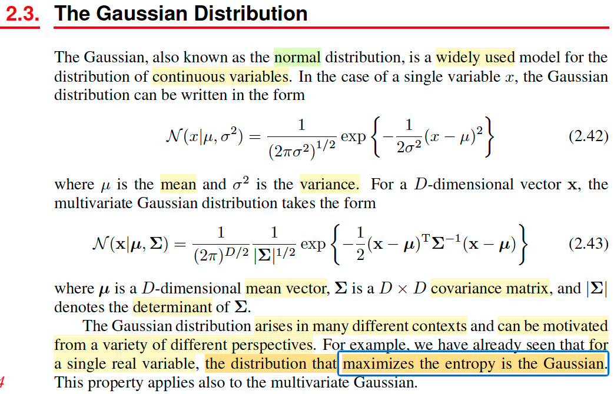</kbd>

> [!NOTE]
> Phần này ta sẽ nói về Gaussian (hay Normal distribution), là distribution khá quan quen thuộc sau khi học xong Stat110 và Casella. Công thức của case đơn biến hay đa biến thì mình cũng đã đều bíết rồi. Đặc biệt trong chap 1 mình đã derive lại công thức Normal đa biến để hiểu công thức 2.43 rồi.
>
>
>
> Thế thì gs nói đây là distribution hay dùng, và nó xuất hiện trong nhiều bối cảnh. Ví dụ như trong chap 1 mình đã thấy nó chính là **distribution có entropy lớn nhất**.

> [!TIP]
> **🤖 AI Feedback** — ⚠️ Score: **80/100**
>
> Ghi chú đã nắm bắt chính xác các thuộc tính chính của phân phối Gaussian, bao gồm tên gọi khác, ứng dụng rộng rãi và đặc biệt là đặc tính cực đại hóa entropy. Để tăng cường độ sâu, bạn có thể bổ sung các định nghĩa về tham số (như μ, σ², Σ) và lưu ý về việc phân phối này áp dụng cho "biến liên tục" từ văn bản.

**🔗 See also:** [Tối ưu Entropy và Hàm Lagrangian](./16_information_theory.md#node-hhyh07u) · [Phân phối chuẩn entropy tối đa](./16_information_theory.md#node-71bnwai) · [Biến đổi Gaussian độc lập](#node-1vavixz) · [3.1.5 Multiple outputs](./315_multiple_outputs.md#node-5d9hd8j)

 

### Định lý giới hạn trung tâm

<kbd>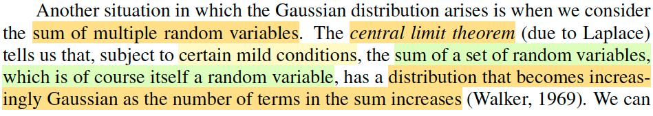</kbd>

<kbd>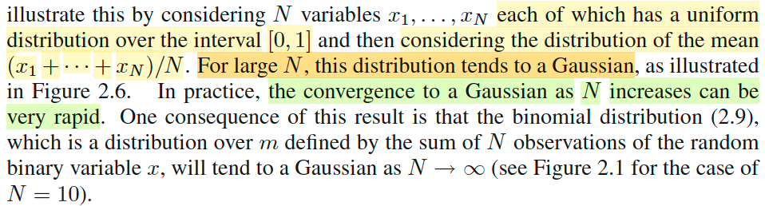</kbd>

<kbd>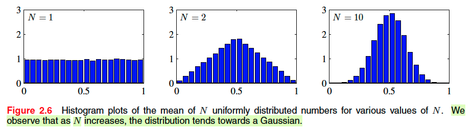</kbd>

> [!NOTE]
> đại khái là gs Bishop nói một trường hợp nữa mà ta thấy sự xuất hiện của
>
> Normal đó là, Central Limit Theorem, còn nhớ trong Stat110 và Casella,
>
> theorem này nói rằng, xét một random sample size n X1,X2,...Xn \~ distribution
>
> có mean μ và variance σ^2 thì sample mean  Xbar sẽ converge in distribution
>
> về một normal(μ, σ^2/n).
>
>
>
> Và hình ảnh minh họa cho thấy, X1, ..Xn là uniform, và người ta plot giá trị của
>
> sample mean Xbar.
>
>
>
> Hiểu như sau. Ban đầu ta sẽ chỉ in Xbar của sample size N=1: tức là lấy
>
> random sample size N = 1 nhiều lần, mỗi lần tính ra Xbar, và plot ra, khi đó có
>
> thể thấy distribution của Xbar cũng chỉ là uniform.
>
>
>
> Nhưng ta làm vậy với N lớn dần thì sẽ thấy distribution của Xbar dần dần có
>
> dạng của normal.

> [!TIP]
> **🤖 AI Feedback** — ✅ Score: **95/100**
>
> Ghi chú của bạn giải thích rất chính xác và chi tiết về Định lý Giới hạn Trung tâm, bao gồm cả công thức cụ thể cho phân phối của trung bình mẫu. Để toàn diện hơn, bạn có thể bổ sung thêm về sự hội tụ của phân phối nhị thức đã được đề cập.

**🔗 See also:** [Histogram Density Estimation](./25_non_parametric_model.md#node-qmfgqko)

 

#### Dạng hình học phân phối Gaussian

<kbd>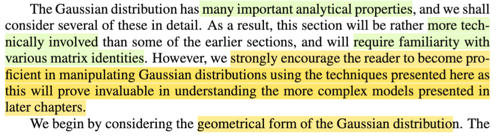</kbd>

<kbd>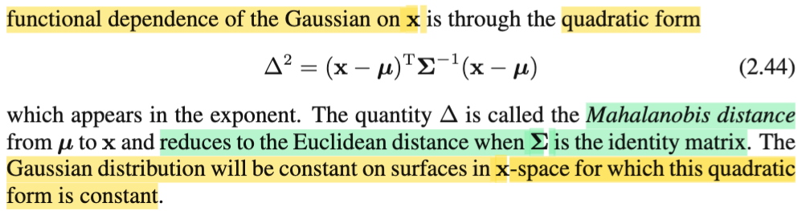</kbd>

> [!NOTE]
> Đại ý là gs nói rằng phần này ta sẽ cần nhiều kiến thức về matrixmà ông có nói đến trong Appendix C. Tuy nhiên ông khuyến khích người học nên trở nên thành thạo trong việc biến đổi liên quan đến phân phối Normal với các kĩ thuật sẽ nói đến ở đây. Vì như vậy sẽ giúp cho ta có thể hiểu được các mô hình phức tạp hơn giới thiệu trong các chương sau.
>
>
>
> Đầu tiên ta sẽ xem xét khía cạnh hình học của phân phối Gaussian. 
>
>
>
> Thế thì, ông nói, đại khái là, phân phối Gaussian sẽ phụ thuộc vào x thông qua quadratic form (**x** - **μ**)T Σinv (**x** - **μ**), đặt là Δ^2. Ý ông nói vậy có nghĩa là, ta thấy trong pdf của multivariate Normal, thì có thể thấy nó phụ thuộc với x thông qua cái cụm này, chỉ vậy thôi. Và cụm này, có dạng của zTAz, như đã biết trong MIT 1806, gọi là quadratic form (cũng chính là cái mà nếu ta có thể chỉ ra zTAz &gt; 0 với mọi z thì ta sẽ kết luận A là positive definite matrix đó).
>
>
>
> Rồi, ở đây mình được biết một ý mới, rằng Δ được gọi là Mahalanobis distance của **μ** và **x**. Và khi Σ là identity matrix I, thì Δ trở thành (**x** - **μ**)T(**x** - **μ**), dĩ nhiên đây chính là ||**x** - **μ**||^2, là L2 hay Eucledean distance của **x** và **μ**.
>
>
>
> Cuối cùng, đương nhiên ta cũng hiểu ý cuối, là nếu cái cụm này mà là constant, thì dĩ nhiên hàm pdf Gaussian cũng là constant theo **x**.

> [!TIP]
> **🤖 AI Feedback** — ✅ Score: **98/100**
>
> Ghi chú của bạn rất chi tiết, chính xác và thể hiện sự hiểu sâu sắc về nội dung, bao gồm cả khả năng liên hệ kiến thức với các môn học khác. Tiếp tục duy trì cách phân tích và ghi chú này để củng cố kiến thức một cách vững chắc.

 

##### Tính đối xứng của ma trận Σ

<kbd>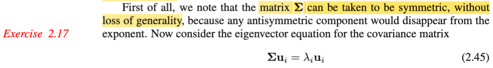</kbd>

> [!NOTE]
> Thế thì chỗ này gs nói matrix Σ có thể coi như là symmetric (đối xứng), mà không mất tính tổng quát vì mọi thành phần bất đối xứng đều bị biến mất bởi exponent. Là sao ta?
>
>
>
> Sau khi thảo luận với gemini, mình hiểu thế này: Một matrix A được gọi là đối xứng khi AT = A (A tranpose, chuyển vị, bằng chính nó). Còn nếu AT = -A thì nó gọi là anti-symmetric matrix.
>
>
>
> Thế thì giả sử ta xét một matrix A bình thường (bất kì, bằng cách biến đổi chút ta sẽ có: A = (1/2)A + (1/2)A
>
>
>
> = (1/2)A + (1/2)AT + (1/2)A - (1/2)AT
>
>
>
> = (1/2)(A + AT) + (1/2)(A - AT)
>
>
>
> Khi đó ta có (1/2)(A + AT) là matrix đối xứng, vì (1/2)(A + AT)T = (1/2)(AT + A) = (1/2)(A + AT)
>
>
>
> Còn (1/2)(A - AT) là matrix anti-symmetric vì (1/2)(A - AT)T = (1/2)(AT - A) = -(1/2)(A - AT)
>
>
>
> Như vậy có thể hiểu mọi matrix Σ bất kì đều có thể thể hiện bởi tổng của một matrix symmetric và một matrix antisymmetric.
>
>
>
> Thế thì như vậy, nếu ta xét Σ trong Gaussian là matrix bất kì, thì cái cụm quadratic form sẽ trở thành (**x** - **μ**)T Σinv (**x** - **μ**)
>
>
>
> = (**x** - **μ**)T \[Σinv_sym + Σinv_asym\] (**x** - **μ**)
>
>
>
> = (**x** - **μ**)T Σinv_sym (**x** - **μ**) + (**x** - **μ**)T Σinv_asym (**x** - **μ**)
>
>
>
> Xét hạng tử thứ hai: 
>
>
>
> (**x** - **μ**)T Σinv_asym (**x** - **μ**)
>
>
>
> như đã biết, quadratic form thì là một scalar, nên:
>
>
>
> (**x** - **μ**)T Σinv_asym (**x** - **μ**) = \[(**x** - **μ**)T Σinv_asym (**x** - **μ**)\]T
>
>
>
> ⇔ (**x** - **μ**)T Σinv_asym (**x** - **μ**) = (**x** - **μ**)T (Σinv_asym)T (**x** - **μ**)
>
>
>
> ⇔ (**x** - **μ**)T Σinv_asym (**x** - **μ**) = (**x** - **μ**)T (-Σinv_asym) (**x** - **μ**)
>
>
>
> ⇔ (**x** - **μ**)T Σinv_asym (**x** - **μ**) = -(**x** - **μ**)T (Σinv_asym) (**x** - **μ**)
>
>
>
> Như vậy,  nếu coi vế trái là c thì ta có c = -c, suy ra c = 0.
>
>
>
> Vậy (**x** - **μ**)T Σinv_asym (**x** - **μ**) = 0
>
>
>
> ⇨ (**x** - **μ**)T Σinv_sym (**x** - **μ**) + (**x** - **μ**)T Σinv_asym (**x** - **μ**)
>
>
>
> = (**x** - **μ**)T Σinv_sym (**x** - **μ**) 
>
>
>
> Do đó, dù có xét Σ có không đối xứng thì quadratic form (**x** - **μ**)T Σinv (**x** - **μ**) cũng chỉ còn lại phần đối xứng của nó. Thành ra gs mới nói là ta coi Σ là matrix đối xứng mà không sợ mất tính tổng quát (loss of generality)

> [!TIP]
> **🤖 AI Feedback** — ✅ Score: **100/100**
>
> Phân tích của bạn rất sâu sắc và chính xác, giải thích rõ ràng lý do tại sao thành phần phản đối xứng biến mất khỏi biểu thức bậc hai. Việc phân tích từng bước này thể hiện sự hiểu biết vững chắc về đại số tuyến tính.

 

###### Phân rã Eigen hiệp phương sai

<kbd>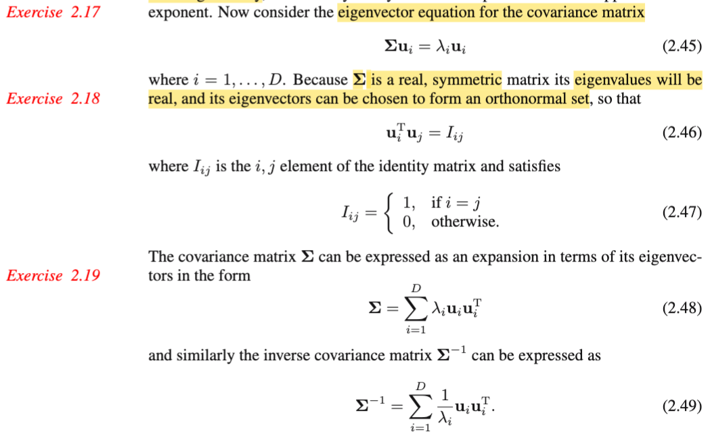</kbd>

> [!NOTE]
> Tiếp theo, nhờ MIT 1806 cũng như kiến thức về đại số tuyến tính mà gs Bishop cung cấp ở Appendix C, ko có gì khó hiểu ở đoạn này. Là như vầy:
>
>
>
> Như đã biết, nếu gọi ui và λi, i = 1,....D là các eigenvector và eigenvalue tương ứng của Σ, thì vì định nghĩa của eigenvector/value, ta có Σui = λiui.
>
>
>
> Nhưng với Σ, là matrix số thực, và đối xứng thì ta cũng biết rằng nó có tính chất đặc biệt hơn đó là mọi eigenvalue sẽ đều là số thực, và tồn tại, có thể chọn một bộ eigenvector orthogonal, và bộ vector này đương nhiên là độc lập nhau, nhưng hơn thế nữa, nó còn đủ số lượng (theo cách nói của gs Strang trong MIT 1806: matrix đối xứng A shape nxn, luôn có đủ n eigenvector độc lập, và điều này có nghĩa là chúng sẽ đủ sức tạo một basis của R^n) để tạo một basis của R^D, hay, nói cách khác: span được toàn bộ R^D.
>
> Và cũng nên tự hiểu là chúng được normalize để có unit norm (length = 1), để vừa orthogonal + unit norm = orthonormal. Tóm lại, với Σ, các eigenvector ui của chúng có tính chất: 
>
>
>
> Unit norm ⇨ ||ui|| = 1, cũng là ||ui||^2 = 1 ⇔ uiTui = 1. 
>
>
>
> Orthogonal: uiTuj = 0, i ≠ j → đây chính là 2.46
>
>
>
> Và như trong MIT18.06 đã học, ta gom ui thành các cột của matrix U thì U là một orthogonal matrix: UTU = UUT = I ⇨ UT = Uinv.
>
>
>
> Thế thì công thức 2.48 là sao?
>
>
>
> Là vầy: Bản chất là từ các equation Σu1 = λ1u1, Σu2 = λ2u2, ...ΣuD = λDuD.
>
>
>
> Thì nếu ta gom các u1,...uD thành các cột của matrix U nói trên, và λ1u1, λ2u2,...là các cột của matrix V khi đó, dựa vào góc nhìn thứ 3 khi nhân hai matrix AB: cột j của AB = linear combination các cột của A bởi bộ hệ số là cột j của B, thì ta sẽ thấy ngay rằng hệ các phương trình trên có thể được thể hiện compact bởi: AU = V.
>
>
>
> Và tương tự, cũng dựa vào góc nhìn đó, ta sẽ thấy cột j của V, tức λj uj chính là linear combination các cột u1,..uD với bộ hệ số là 0,0...1,..0 với số 1 nằm ở vị trí thứ j, Để từ đó có thể thấy V = U diag(λ1,..λD), đặt diag(λ1,..λD) = Λ, ta có:
>
>
>
> Vậy AU = UΛ, đây chính là identity của phân rã eigenvalue (eigenvalue decomposition).
>
>
>
> Rồi, vì UT = Uinv, nên nhân bên phải hai vế cho UT, ta có A = U Λ UT.
>
>
>
> Tiếp, với phân tích cái vế phải,  theo góc nhìn là nhân hai matrix: (U Λ) với UT theo góc nhìn thứ 4: tổng các rank 1 matrix. Theo góc nhìn đó, giả sử ta có AB, thì có thể xem nó là tổng các rank 1 matrix tạo bởi \[cột j của A\] outer product \[hàng j của B\], j = 1,2,...
>
>
>
> Nên A = Σj=1:D \[cột j của UΛ\] outer product \[hàng j của UT\]
>
>
>
> Mà cột j của UΛ chính là λjuj. và hàng j của UT thì cũng là \[cột j của U lật ngang lại\], tức \[cột j của U\]T, hay ujT. Vậy A = Σj=1:D λjujujT, → 2.48.
>
>
>
> (giải thích dài dòng để hiểu bản chất)
>
>
>
> Hoàn toàn tương tự với Σinv: Ta dùng kiến thức, nếu u,λ là eigenvector/value của A thì u, 1/λ chính là eigenvector/value của Ainv. Nên eigenvalue và vector của Σinv chính là u1, 1/λi, i=1,2...D.
>
>
>
> Nên áp dụng lập luận tương tự, ta sẽ thấy Ainv = Σj=1:D ujujT/λj

> [!TIP]
> **🤖 AI Feedback** — ✅ Score: **100/100**
>
> Bạn đã giải thích các khái niệm và công thức một cách cực kỳ chi tiết và chính xác, thể hiện sự hiểu biết sâu sắc về đại số tuyến tính. Cách bạn liên hệ các kiến thức từ MIT 18.06 và các tính chất của ma trận đối xứng để chứng minh các công thức 2.48 và 2.49 là rất ấn tượng và có giá trị.

 

###### Chuyển tọa độ eigenvector

<kbd>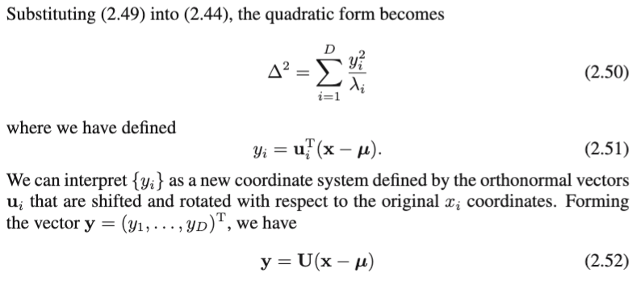</kbd>

<kbd>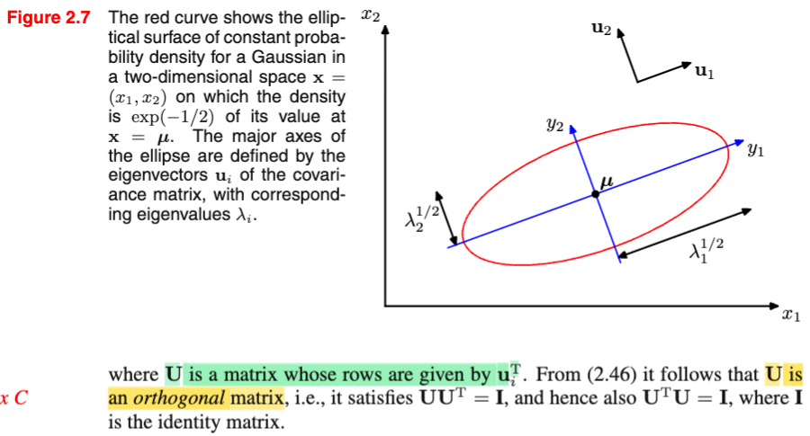</kbd>

> [!NOTE]
> Thay Σinv = Σj=1:D ujujT/λj vào (**x** - **μ**)T Σinv (**x** - **μ**) ta có:
>
>
>
> = (**x** - **μ**)T \[Σj ujujT/λj\] (**x** - **μ**)
>
>
>
> = Σj \[(**x** - **μ**)TujujT(**x** - **μ**)/λj\] | đưa (**x** - **μ**)T và (**x** - **μ**) vào trong tổng.
>
>
>
> Đặt yj = (**x** - **μ**)Tuj (cũng là ujT(**x** - **μ**) vì cái này là scalar), ta có:
>
>
>
> = Σj (yjTyj/λj) = Σj (yj^2/λj) → 2.51
>
>
>
> Thế thì với y1 = (**x** - **μ**)Tu1, y2 = (**x** - **μ**)Tu2,...mình có thể thấy: y1 = dot product của **x** - **μ** với u1, y2 là dot product của **x** - **μ** với y2,...thì với việc gs Bishop đặt U là matrix có các hàng là u1, u2,...để rồi UT là matrix có các cột là u1, u2... Thì ta sẽ thấy **y** = (y1, y2...)T chính là U(**x**-**μ**).  
>
> ⇨ **y** = U(**x** - **μ**)
>
>
>
> ---
>
>
>
> Rồi, chỗ này dùng kiến thức về **change of basis** đã học trong MIT 1806: Ôn lại nhanh:
>
>
>
> Trong MIT 1806, bài linear transformation, đại khái là mình đã học rằng, một phép biến đổi T(.) được gọi là linear transformation là khi nó thỏa mãn: T(c**u** + d**v**) = cT(**u**) + dT(**v**) (c, d là scalar, u, v là vector) Và vì A(c**u** + d**v**) = cA**u** + dA**v**, nên quả thật việc nhân A với vector **x**, chính là một phép biến đổi tuyến tính. T(**x**) = A**x**.
>
>
>
> Thế thì sau đó gs mới nói về việc, giả sử có một linear transformation T(.), thì làm sao xác định matrix A đại diện cho nó? Tức là, giả sử ta có vector **x** trong input basis v's, và kết quả T(**x**) trong output basis u's, thì làm sao tìm A khiến T(**x**) = A**x**. Câu trả lời là lập luận như sau:
>
>
>
> Gọi **v1**,...**vn** là các basis của input space. Thì tọa độ của **x** đang được thể hiện theo (linear combination của) basis này, có nghĩa là, **x** = x1**v1** + x2**v2** + ...xn**vn** = Σi xi**vi** (x1,x2...là các tọa độ của **x**)
>
>
>
> Thế thì, T(**x**), có tọa độ trong output basis T(**x**)1, T(**x**)2,...T(**x**)m:
>
>
>
> T(**x**) = Σj=1:m T(**x**)j \* **uj**
>
>
>
> Và T(**x**) = A**x** = Σi=1:n xi **a**i
>
>
>
> ⇨ Σi=1:n xi **a**i = Σj=1:m T(**x**)j \* **u**j
>
>
>
> vì T(.) là linear transformation, nên T(**x**) = T(Σi=1:n xi**v**i) = Σi=1:n xi T(**v**i).
>
>
>
> ⇔ Σi=1:n xi **a**i = Σj=1:m { \[Σi=1:n xi T(**v**i)\]j **u**j }
>
>
>
> Xét \[Σi=1:n xi T(**v**i)\]j có nghĩa là linear combine các T(**v**1), T(**v**2).. với hệ số x1,x2.., được một vector, rồi lấy phần tử thứ j của nó. Thì cái này cũng y như lấy phần tử thứ j của T(**v**1), T(**v**2),...rồi linearly combine với hệ số x1,x2...
>
>
>
> ⇨ \[Σi=1:n xi T(**v**i)\]j = Σi=1:n xi T(**v**i)j
>
>
>
> ...⇔ Σi=1:n xi **a**i = Σj=1:m { \[Σi=1:n xi T(**v**i)j\] **u**j }
>
>
>
> Tiếp, xét cụm \[Σi=1:n xi T(**v**i)j\] **u**j ở bên trong tổng j. ta có thể đưa uj vào trong tổng i, vì nó chỉ là thừa số chung:
>
>
>
> ⇨ \[Σi=1:n xi T(**v**i)j\] **u**j = Σi=1:n \[xi T(**v**i)j **u**j\]
>
>
>
> ...⇔ Σi=1:n xi **a**i = Σj=1:m { \[Σi=1:n xi T(**v**i)j **u**j\] }
>
>
>
> Tiếp, ta đang có dạng Tổng j của tổng i, có quyền swap hai dấu tổng:
>
>
>
> ...⇔ Σi=1:n xi **a**i = Σi=1:n { Σj=1:m \[xi T(**v**i)j **u**j\] }
>
>
>
> Đến đây xét cái tổng Σj=1:m \[xi T(**v**i)j **u**j\], có quyền đưa xi ra ngoài:
>
>
>
> ⇔ Σi=1:n xi **a**i = Σi=1:n xi { Σj=1:m \[ T(**v**i)j **u**j\] }
>
>
>
> Như vậy tới đây có thể suy ra:
>
>
>
> ⇨ **a**i = Σj=1:m T(**v**i) **u**j
>
>
>
> Và từ đó ta có quy tắc xây dựng matrix A đại diện cho phép biến đổi tuyến tính T(**x**) từ **x** trong input space basis **v**'s sang T(**x**) trong output space basis **u**'s:
>
>
>
> Biến đổi các basis **v**i's và thể hiện chúng trong tọa độ basis **u**'s. Khi đó tọa độ của T(**v**1),..T(**v**n) chính là là hệ số các cột của A.
>
>
>
> ---
>
>
>
> Từ đó ta xét phép biến đổi identity: Tức T(**x**) = **x**:
>
>
>
> Vì đã nói cột i của A là tọa độ của T(**v**i) trong basis u's, nên: \
> \
> T(**v**i) = linear combination các **u**1,...**u**m bởi các hệ số là cột i của A, đặt U là matrix các cột **u**1,..**u**m thì ta có T(**v**i) = U \[cột i của A\]
>
>
>
> Xét phép biến đổi identity: T(**v**i) = **v**i. Ta có:
>
>
>
> **v**i = U\[cột i của A\], i = 1,..n 
>
>
>
> Gom **v**1, **v**2...**v**n thành các cột của V, thì **v**i = U\[cột i của A\], i = 1,..n chính là V = UA
>
>
>
> Và nhân hai vế cho Uinv: UinvV = A, đây chính là công thức của "change of basis" / matrix chuyển cơ sở từ cơ sở v's sang cơ sở u's: A = UinvV.
>
>
>
> Xét một case đặc biệt, khi input basis là standard basis: **v**1, **v**2,... = **e**1, **e**2,...Hay cũng là V = I. Ta sẽ có:
>
>
>
> A = Uinv I = Uinv. Từ đây giúp kết luận, khi có **x là vector có tọa độ trong standard basis**, thì A**x** = Uinv **x**, chính là động tác tính ra tọa độ của nó trong basis **u**'s.
>
>
>
> ---
>
>
>
> Rồi, quay lại công thức y = U(**x**-**μ**):
>
>
>
> Đầu tiên chú ý là trong phần ôn lại ở trên, mình nói U là vector tạo bởi các **cột** là các basis u's.
>
>
>
> Còn trong bài này, U ở đây được gs Bishop định nghĩa là là **matrix có các các hàng là các orthogonal eigenvector ui**. Như vậy **UT là orthogonal matrix**, **có các cột là orthogonal eigenvector ui.** Và với orthogonal matrix Q thì QT = Qinv, nên (UT)T = UTinv ⇔ U = (UT)inv
>
>
>
> ⇨ **y** = U(**x**-**μ**) = (UT)inv(**x**-**μ**)
>
>
>
> Và phần ôn lại ở trên giúp ta hiểu rõ bản chất của cái này chính là:
>
>
>
> **CHUYỂN TỌA ĐỘ CỦA** **x (SAU KHI SHIFT BỞI μ) TỪ CƠ SỞ CHUẨN (BASIS e's) SANG HỆ TỌA ĐỘ CƠ SỞ LÀ CÁC CỘT CỦA UT, CHÍNH LÀ ui = CÁC EIGENVECTOR CỦA Σ!**
>
>
>
> Hơn nữa, với UT là orthogonal matrix,  (để rồi U = (UT)inv) thì UTU = UT (UT)inv = I, điều này cho thấy U cũng là orthogonal matrix. Và ta biết với orthogonal matrix, thì phép biến đổi bởi nó thực chất là phép xoay trục.
>
>
>
> Như vậy có 2 ý quan trọng cần hiểu rút ra từ phân tích trên:
>
>
>
> i) y = U(**x**-**μ**) = (UT)inv(**x**-**μ**) có bản chất là: **chuyển tọa độ của (x-μ) từ basis e's sang basis tạo bởi các cột của UT, chính là các vector ui, là eigenvector của Σ**.
>
>
>
> ii) Và UT là orthogonal matrix thì U cũng vậy, nên đây cũng là **phép xoay hệ trục tọa độ**.
>
>
>
> Gom lại hai ý này, ta sẽ hình dung **bản chất chỉ là tính lại tọa độ của x-μ bằng cách xoay trục tọa độ thẳng góc với các eigenvector của Σ.**

> [!TIP]
> **🤖 AI Feedback** — ⚠️ Score: **75/100**
>
> Bạn đã thể hiện sự hiểu biết sâu sắc về đại số tuyến tính qua việc phân tích chuyển đổi dạng toàn phương và khái niệm thay đổi cơ sở. Tuy nhiên, kết luận về lỗi của công thức (2.52) trong sách là không chính xác do bạn đã bỏ qua định nghĩa tường minh của tác giả Bishop về ma trận U (các hàng của U là u_i^T).

 

###### Đường đồng mức Gaussian

<kbd>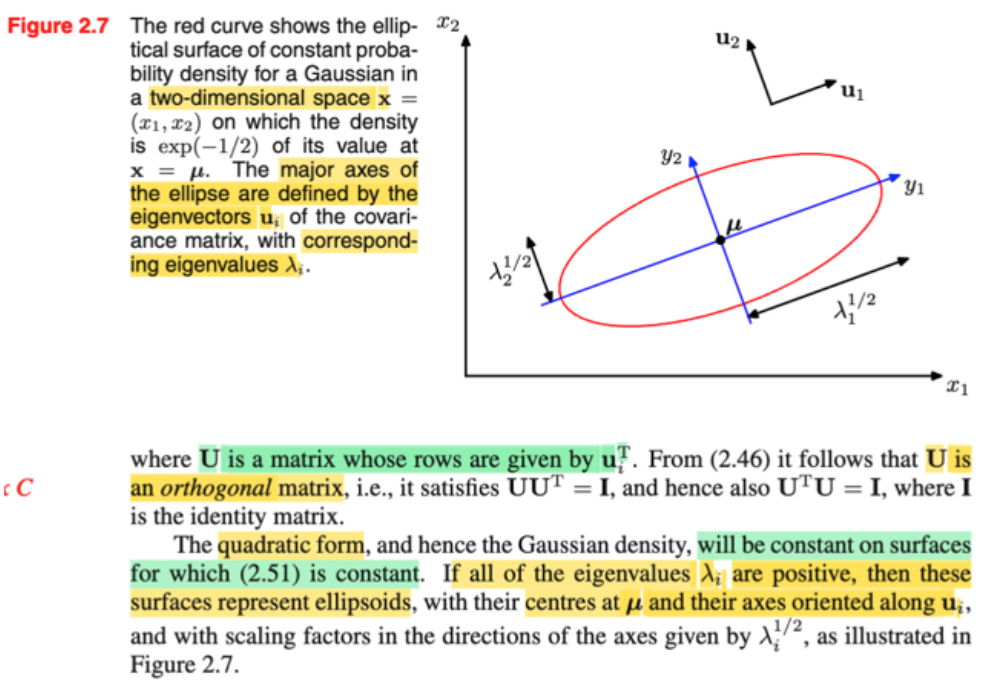</kbd>

> [!NOTE]
> Nhờ việc phân tích ở note trước, ta có thể hiểu đoạn sau: Đại ý là như trước đây đã nói, pdf của multivariate Gaussian sẽ phụ thuộc **x chỉ thông qua cái cụm quadratic form (x-μ)T Σinv (x-μ), nên dĩ nhiên tập hợp các điểm x trong input space sao cho cụm này bằng constant, thì tương ứng sẽ chính là những điểm có cùng mật độ xác suất pdf.**
>
>
>
> Thế thì xét một tập hợp như vậy: (**x**-**μ**)T Σinv (**x**-**μ**) = constant c, thì như vừa nói sẽ tương ứng với một level set (tập các điểm của f(**x**|**μ**, **Σ**), hay N(**x**|**μ**, **Σ**)), câu hỏi đặt ra là nó có hình dạng thế nào.
>
>
>
> Thế thì như note trước, (**x**-**μ**)T Σinv (**x**-**μ**) = constant c
>
>
>
> ⇔ Σj (yj^2/λj) = c
>
>
>
> Ta sẽ xét trong case 2 chiều, tức D=2, **x** là vector (x1,x2)T, nó sẽ là:
>
>
>
> y1^2 / λ1 + y2^2 / λ2 = c
>
>
>
> Còn nhớ cấp hai đã học, phương trình của đường ellips trong mặt phải xOy là x^2/a^2 + y^2/b^2 = 1. (a, b gọi là độ dài bán trục lớn và nhỏ). Thì chia hai vế cho c, (1) ⇔ y1^2 / cλ1 + y2^2 / cλ2 = 1. Cho thấy **level set này chính là một hình elipse**.
>
>
>
> y là tọa độ của x-μ trong hệ trục tọa độ eigenvector u1, u2.
>
>
>
> Vậy ọa độ của tâm ellipse, là 0,0 trong hệ trục này, chính là ứng với điểm nào trong hệ tọa độ gốc (basis e's)?
>
>
>
> Dùng công thức chuỷển ngược lại thôi: Nãy ta dùng (UT)inv để chuyển từ basis e's về basis eigenvector u's thì ((UT)inv)inv = UT sẽ chuyển ngược lại: đương nhiên UT**0** (ý là U tranpose nhân vector zero **O**) cũng bằng **0**, Nhưng sau đó ta sẽ phải shift lại: + **μ**: 0 + **μ** = **μ** Vậy, tâm của ellipse chính là tại **x** = **μ** trong hệ tọa độ ban đầu.
>
>
>
> Còn trục của ellipse? Như đã nói, chính là hai vector u1, u2.
>
>
>
> Tóm lại, đường đồng mức của Gaussian (level set, nơi có giá trị hàm pdf bằng nhau) trong case 2D, sẽ chính là một đường elipse có trục trùng với phương của các eigenvector của Σ, và tâm thì nằm tại **μ**
>
>
>
> Khái quát lên n-D, nó là ellipsoid trong không gian n chiều, cũng có tâm tại μ và trục trùng với eigenvector.
>
>
>
> ---
>
>
>
> Trong hình 2.7, gs vẽ level set với của pdf với level ứng với exp(-1/2) (chú ý, tự hiểu là giá trị pdf là \[hằng số gì đó (normalizing constant)\] exp(-1/2), chứ ko phải pdf = exp(-1/2) nhé)
>
>
>
> Ta có exp {-\[y1^2 / λ1 + y2^2 / λ2\]} = exp(-1/2)
>
>
>
> (chú ý, đầu giờ chỉ nói đến cái cụm quadratic form nhưng khi bỏ vào exp() của hàm pdf của Normal thì trước cái cụm quadratic form phải có dấu trừ)
>
>
>
> ⇔ -{y1^2 / λ1 + y2^2 / λ2} = -1/2
>
>
>
> ⇔ y1^2 / (λ1/2) + y2^2 / (λ2/2) = 1
>
>
>
> và ông vẽ cái đường màu đỏ chính là hình ellipse với a = λ1/2, b = λ2/2

 

###### Eigenvalues Ma trận Hiệp phương sai

<kbd>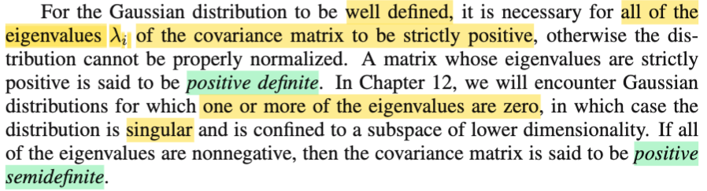</kbd>

> [!NOTE]
> Tiếp, đại ý là, covariance matrix của phân phối multivarate Normal, tức Σ có một đặc điểm nhằm đảm bảo rằng phân phối này được define đúng (**well defined**). Đó là **mọi eigenvalues của Σ đều dương.**
>
>
>
> **Vì sao**? Ở đây có một ý rất hay mà gs Bishop không nói kĩ: Như trong note trước, ta đã hiểu cái level set (đường đồng mức của hàm 2D Gaussian là một đường ellipse) ứng với exp(-1/2) có tâm tại **μ** và có trục ellipse theo phương của các eigenvector với độ dài bán trục là λ1/2 và λ2/2.
>
>
>
> Thì như vậy ta sẽ nhận thấy một sự thật rằng: λi chính là phản ánh **mức độ phân tán** (**spreading**) **của pdf theo phương eigenvector** **u**i, và đó chính là gì: và như vậy, nó phản ánh **variance theo phương u**i.
>
>
>
> HIểu nôm na về mặt hình học là vậy, còn ta sẽ **lập luận lại từ định nghĩa của Covariance matrix**:
>
>
>
> Ở đây tạm quay lại kí hiệu chuẩn toán với việc dùng **X viết hoa** để chỉ random variable vector **X**. (**μ**, hay **u** thì cũng là vector như là vector fixed value, không phải random variable)
>
>
>
> Theo định nghĩa, Σ = Cov(**X**, **X**) = E\[(**x** - **μ**)(**x** - **μ**)T\]
>
>
>
> (covariance của hai random variable X, Y: Cov(X,Y) = E\[(X-EX)(Y-EY)\])
>
>
>
> Thế thì ta gọi λ và **u** là eigenvalue và eigenvector của Σ, ta có Σ**u** = λ**u**.
>
>
>
> ⇔ **u**TΣ**u** = **u**Tλ**u** (nhân trái hai vế cho **u**T (**u** transpose))
>
>
>
> ⇔ **u**TΣ**u** = λ**u**T**u** (λ là scalar, move tự do)
>
> \
> ⇔ **u**TΣ**u** = λ (vì ta đang luôn làm việc với bộ eigenvector orthogonal và unit norm → **u**T**u** = ||**u**||^2 = 1)
>
>
>
> ⇔ **u**T E\[(**X**-**μ**)(**X**-**μ**)T\] **u** = λ
>
>
>
> Thế thì E\[...\] là kì vọng là liên quan đến random variable vector **X**, nên **u** chỉ là vector fixed value, hay constant, đưa vào kì vọng nhờ tính linearity: E\[cX\] = cE\[X\] 
>
>
>
> ⇔ E\[**u**T(**X**-**μ**)(**X**-**μ**)T**u**\] = λ
>
>
>
> Tới đây, ta đặt Z = (**X** - **μ**)T**u ⇨** E\[ZTZ\] = E\[Z^2\] = λ 
>
>
>
> Vậy λ = E\[Z^2\] Và từ đây suy ra hai thứ:
>
>
>
> Nhưng trước tiên cần hiểu Z **cũng là một random variable** (scalar, ko phải random vector).
>
> Z = (**X**-μ)T**u**, chính là áp hàm g(**x**) = (x-μ)Tu lên random variable vector **X**, đương nhiên, theo Stat110, thầy Joe đã luôn nhắc ta khi áp một hàm số lên một random variable (vector) ta luôn được một random variable (vector) mới), do đó ta  có được random variable scalar Z. Sở dĩ phải nói vậy là vì nhờ đó mới bàn tới kì vọng / trung bình của Z: E\[Z^2\], chứ nếu Z ko phải random variable, thì điều này vô nghĩa. Và dĩ nhiên Z^2 cũng lại là một random variable, có giá trị không âm
>
>
>
> i) Như vậy λ là **trung bình / kì vọng của một biến ngẫu nhiên không âm** nên sẽ luôn **không âm**.
>
>
>
> ii) Ý thứ hai quan trọng hơn nhiều: λ = E\[Z^2\], mà Z = (**X** - **μ**)T**u** có bản chất hình học là gì?
>
>
>
>  → Ta biết trong đại số tuyến tính phép tích vô hướng aTb chính là ||a|| ||b|| cos(a,b), và nếu b là unit vector q, thì aTq chính là hình chiếu của a lên q, có giá trị là tọa độ của a theo trục q. Như vậy ở đây u là unit vector. Chính là **hình chiếu** của (**x**-**μ**) lên trục tọa độ là **eigenvector** **u**.
>
>
>
> Và thật ra ta đã có cùng kết luận này từ trong note trước, khi ta làm phân tích cái quadratic form (**x**-**μ**) Σinv (**x**-**μ**) = Σi (yiTyi/λi) = Σi yi^2/λi với yi = uiT(**x**-**μ**), cũng là vector **y** = U(**x**-**μ**). Thì ta đã hiểu ý nghĩa của cái này chính là chuyển tọa độ **x** bằng cách dời hệ trục về gốc tại **μ**, sau đó xoay hệ trục để trùng với các eigenvector ui. Nên y1, y2,...chính là tọa độ của x trong hệ trục mới: tâm tại mu, trục trùng với eigenvector **u1**, **u2**,..Mà điều này dĩ nhiên có nghĩa là y1 chính là hình chiếu của vector **X** - **μ** lên trục **u1**,  y2 là hình chiếu của vector **X** - **μ** lên trục **u2**,...Cùng chính là cùng kết luận ở trên.
>
>
>
> Xét tiếp EZ = E\[(**X**-μ)T**u**\] = E\[**X**-μ\]T**u** = (E**X**-E**μ**)T**u** = (**μ**-**μ**)T**u** = **0**T**u** = 0.
>
>
>
> Như vậy E\[Z^2\] thật ra chính là E\[Z^2 - (EZ)^2\] và đây chính là **VARIANCE** của **Z:** Var(**Z**).
>
> Và với ý nghĩa của Z là hình chiếu của (**X** - **μ**) lên trục eigenvector **u**, thì như vậy ta có thể hiểu vì sao E\[Z^2\], **CŨNG LÀ** **EIGENVALUE** **λ**, **CHÍNH LÀ PHƯƠNG SAI CỦA DISTRIBUTION THEO PHƯƠNG EIGENVECTOR** **u**, và dĩ nhiên, again, phương sai thì không âm cũng giúp khẳng định lại λ phải không âm.
>
>
>
> ---
>
>
>
> Rồi, ở trên ta đã hiểu λi của Σ chính là phương sai của distribution theo phương eigenvector ui, và do đó  nó phải không âm. Nhưng thậm chí nó phải dương luôn. Lí do có thể tạm hiểu nhanh là vì trong công thức pdf của Normal, Σ xuất hiện ở dạng inverse Σinv. Mà để invertible, thì Σ phải non-singular / full-rank. Do đó mọi eigenvalue phải khác 0.
>
>
>
> Và như vậy, từ MIT 1806 (cũng như phần Appendix C đã nhắc lại), mọi eigenvalues dương là một trong những cách để check điều kiện matrix là một positive definite matrix (bên cạnh các cách khác như check quadratic form,..)
>
>
>
> Gs cũng nói trong chap 12 ta sẽ làm việc với một phân phối Normal có covariance không đảm bảo mọi eigenvalue đều dương, mà chỉ không âm thôi, khi đó chỉ là positive semi definite. Và, nếu có eigenvalue = 0, thì matrix Σ sẽ singular. Vì sao singular, singular là sao?
>
>
>
> Ôn lại kiến thức trong MIT 18.06: singular là khi matrix tồn tại nonzero vector trong nullspace hoặc left nullspace. Khi đó vector khác 0 đó sẽ bị biến thành 0 bởi matrix. Thế thì, nếu tồn tại eigenvalue bằng 0, thì như đã biết, nếu λ và u là eigenvalue và eigenvector tương ứng, thì ta có Au = λu, vậy nếu λ = 0, thì u chính là vector bị biến thành 0 bởi A: Au = 0u = 0. Nên nó chính là non-zero vector trong nullspace, như vậy nullspace có dimension khác 0, cũng đồng nghĩa các cột của A không độc lập, cũng đồng nghĩa luôn là rank của A nhỏ hơn số hàng số cột, và matrix A không full-rank, không invertible, hay và gọi là matrix suy biến (singular).

> [!TIP]
> **🤖 AI Feedback** — ✅ Score: **98/100**
>
> Ghi chú này rất chính xác và thể hiện sự hiểu biết sâu sắc về các khái niệm. Bạn không chỉ tái hiện thông tin từ văn bản gốc mà còn bổ sung thêm các lập luận toán học chặt chẽ và giải thích trực quan về ý nghĩa hình học của các eigenvalues, giúp làm rõ lý do tại sao chúng phải dương. Đây là một cách học tập rất hiệu quả.

 

###### Ma trận Jacobian Gaussian

<kbd>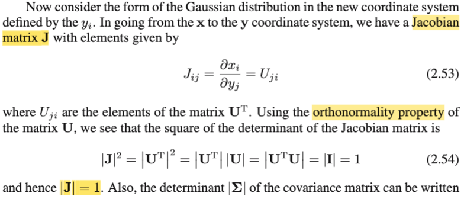</kbd>

> [!NOTE]
> Thế thì tiếp theo gs nói là ta sẽ xem xét dạng của Gaussian trong hệ trục tọa độ mới. Là sao?
>
>
>
> Có nghĩa là, như đã hiểu khi ta ôn lại kiến thức change of basis matrix trong MIT 1806 ở note trước, việc ta đặt **y** = U(**x**-**μ**) chính là = (UT)inv(**x**-**μ**), có bản chất là ta đã chuyển hệ trục tọa độ về gốc tọa độ mới là **μ** và trục tọa độ bây giờ là các eigenvector, và một điểm có tọa độ **x** trong hệ trục gốc (tức basis **e**'s) bây giờ sẽ có tọa độ **y** trong basis **u**'s.
>
>
>
> Và trong bối cảnh ở đây là hàm pdf, thì ta lại liên hệ với kiến thức đã học trong Stat110: Change of variable: Ôn lại nhanh: Khi ta có random variable X \~ fX(x), và áp dụng hàm g(x) lên nó để có một random variable mới: Y = g(X) sao cho ta có mapping 1-1 giữa x belong range X và y belong range Y, đồng nghĩa nếu y = g(x) ⇔ x = ginv(y), thì ta sẽ có theoerem cho phép xây dựng pdf của Y: fY(y) = fX(x) |dx/dy| = fX(ginv(y) |d/dy ginv(y)|.
>
>
>
> Sau đó, tương tự, khái quát lên cho random variable **VECTOR**: **X**, và **Y** = g(**X**) thì f**Y**(**y**) = f**X**(**x**) |d**x**/d**y**| = f**X**(**x**) |d/d**y** ginv(**x**)| Lúc này với việc **y** = g(**x**) và ginv(**y**) là vector → vector function, nên đạo hàm của ginv(y) đối với y sẽ là gì: Theo kiến thức đã học trong MIT 18s096, đó sẽ là một matrix, có mỗi hàng là một gradient vector: hàng i sẽ là vector các partial derivative của xi = ginv(y)\_i (phần tử thứ i của vector **x**) đối với vector **y:** (∂xi/∂y1, ∂xi/∂y2,....).
>
>
>
> Và matrix này gọi là Jacobian matrix, nên với case này thì change of variable theorem, ta có: f**Y**(**y**) = f**X**(**x**) |J| (thật ra là | |J| |, hay |det(J)| với ý nghĩa: giá trị tuyệt đối của determinant của matrix Jacobian).
>
>
>
> Thế thì quay lại đây (sách Bishop), chính là ta đang đối mặt với bài toán đổi biến (change of variables), khi ta có **X** (hay gs Bishop viết thường **x**, như nói nhiều lần, gs Bishop viết thường đối với tên biến có thể gây lú lẫn), có pdf là hàm Gaussian pdf f**X**(**x**|**μ**,Σ) = (công thức 2.43). Và nay ta có random variable vector **Y có được bằng cách áp hàm g(x) lên X, với g(x) =** U(**x**-**μ**), tức là **Y** = U(**X** - **μ**). Vậy thì áp dụng điều trên ta sẽ có pdf của **Y**:
>
>
>
> f**Y**(**y**) = f**X**(**x**|**μ**,Σ) |J|
>
>
>
> Vậy J, trong trường hợp này, cụ thể nó sẽ là thế nào: Ta có thể theo định nghĩa đã nói trên, đi tìm Jij, là ∂xi/∂yj. Nhưng MIT 18s096 cho ta một cách làm dễ hơn nhiều - tìm đạo hàm theo lối hoslistically:
>
>
>
> Ta có hàm **y** = U(**x** - **μ**) ⇨ **x** = Uinv**y** + **μ**, = g(**y**) nếu có thể chỉ ra dg(**y**) = một linear operator của d**y**, thì ta sẽ thấy ngay công thức đạo hàm. Làm như sau:
>
>
>
> dg = g(**y**+d**y**) - g(**y**) = Uinv(**y** + d**y** + **μ**) - Uinv(**y** + **μ**) = Uinvd**y**. Và đây chính là linear operator act on d**y**, nên đơn giản ta kết luận ngay d/dy g(**y**), chính là Jacobian = Uinv.
>
>
>
> Vậy J = Uinv Nên det J = det Uinv, mà U là matrix gì, còn nhớ, gs Bishop, đã define U là matrix mà các hàng là các eigenvector ui của Σ, nên UT là matrix tạo bởi các cột là các eigenvector ui, và đám này lại orthogonal, và unit norm. Đồng thời mình trong note trước cũng cũng đã nói, với orthogonal matrix thì transpose của nó cũng vậy. Như vậy UT là orthogonal matrix, thì U cũng vậy. Và như vậy Uinv = UT (tính chất của orthogonal matrix)
>
>
>
> Như vậy Jacobian **J chính là UT**, đây chính là **giải thích cho công thức 2.53**: Jij = Uji (chú ý thứ tự ij ngược nhau, vì Uji thực chất chính là (UT)ij, nên chính là ông đang nói J = UT)
>
>
>
> Rồi, thế thì tới đây nếu ta còn nhớ kiến thức trong MIT 1806 sau đây thì có thể kết luận luôn |det J| = |det UT| = 1: determinant, hay tiếng việt là định thức, có ý nghĩa là gì? là tỉ lệ của thể tích của một khối lập phương cạnh bằng 1 sau khi bị linear transform bởi matrix J so với thể tích ban đầu của nó (= 1). Hay trong 2D, thì nó là tỉ lệ của diện tích của hình vuông cạnh = 1 sau khi bị tranform bởi J. Thế thì, ta vừa nói J (chính là UT) là orthogonal matrix, nên **phép biến đổi tuyến tính bởi J chỉ là PHÉP XOAY, nó bảo tồn diện tích**. Thành ra tỉ lệ này dĩ nhiên là 1. ⇨ det J = det UT = 1.
>
>
>
> Còn trong sách, gs tính det J^2 trước, (det J)^2 = (det UT)^2
>
>
>
> = (det UT)(det UT)
>
>
>
> = (det UT)(det U) (do det A = det AT)
>
>
>
> = det(UT U) (det (AB) = det A) (det B))
>
>
>
> = det (I) (do U orthogonal → UTU = I)
>
>
>
> = 1.
>
>
>
> Vậy (det J)^2 = 1 ⇨ det J = +/-1. Nhưng trong công thức change of variable nói trên, như đã nói, thật ra ta lấy trị tuyệt đối của det, nên kết quả là 1.
>
>
>
> Như vậy ta hiểu rõ hai công thức 2.53, và 2.54 cũng như đoạn này nói gì.

> [!TIP]
> **🤖 AI Feedback** — ✅ Score: **100/100**
>
> Ghi chú của bạn thể hiện sự hiểu biết sâu sắc và toàn diện về ma trận Jacobian và định thức của nó trong ngữ cảnh thay đổi biến cho phân phối Gaussian. Bạn đã giải thích rất chi tiết và chính xác cả hai công thức (2.53) và (2.54) bằng cách liên hệ với các kiến thức nền tảng vững chắc.

 

###### Biến đổi Gaussian độc lập

<kbd>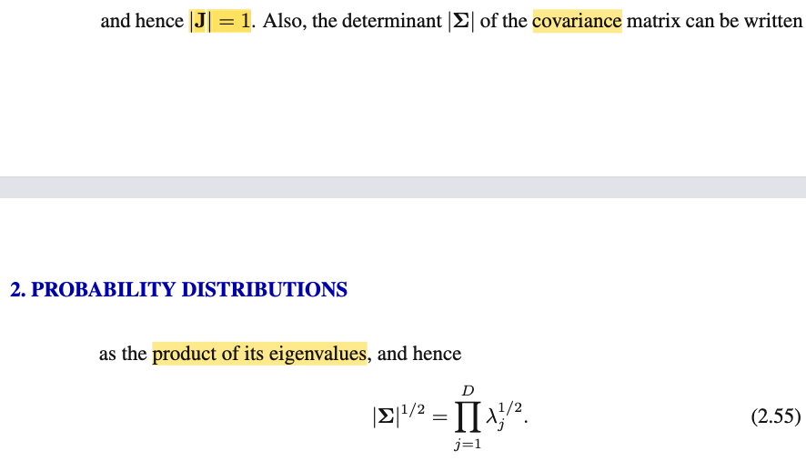</kbd>

<kbd>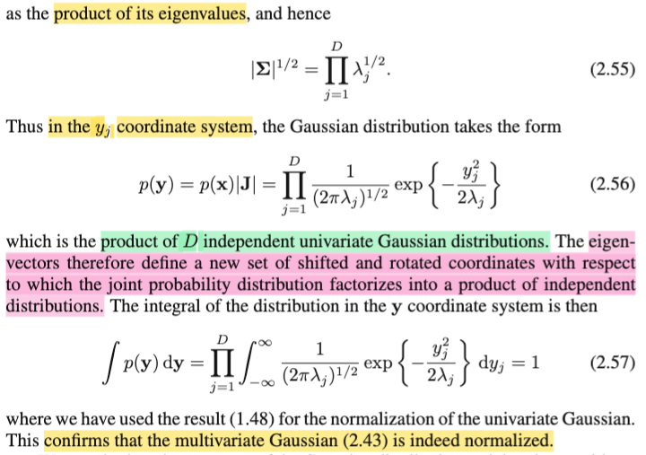</kbd>

<kbd>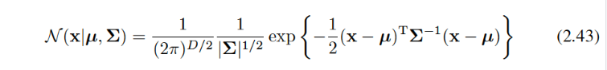</kbd>

> [!NOTE]
> Tiếp, thử xem vì sao gs nói |Σ| có thể thể hiện bởi tích các eigenvalues?
>
>
>
>  Là vì đơn giản đây là công thức của det thôi: det A = tích các eigenvalue của nó. Và vì các eigenvalue của Σ như vừa nói, đều dương nên ta có |det Σ| = det Σ = Πi λi.
>
>
>
> ⇨ √\[det Σ\] (hay |Σ|^(1/2) = √\[Πi λi\] = (Πi λi)^1/2 = Πi λi^1/2
>
>
>
> Rồi, như vậy ta đã có đủ nguyên liệu để ráp vào công thức đổi biến để có pdf của **Y** = U(**X** - **μ**):
>
>
>
>  f**Y**(**y**) = f**X**(**x**|**μ**,Σ) |J| với:
>
>
>
> |J| = 1
>
>
>
> f**X**(**x**|**μ**,Σ) = công thức 2.43 = \[1/(2π)^(D/2)\] \[1/|Σ|^1/2\] exp\[-1/2(**x**-**μ**)T Σinv(**x**-**μ**)\]
>
>
>
> = \[1/(2π)^(D/2)\] \[1/|Σ|^1/2\] exp\[-1/2(Uinv**y**+**μ**-**μ**)T Σinv(Uinv**y**+**μ**-**μ**)\]
>
>
>
> = \[1/(2π)^(D/2)\] 1/\[Πi λi^1/2\] exp\[-1/2(UT**y**)T Σinv(UT**y**)\]
>
>
>
> = \[1/(2π)^(D/2)\] 1/\[Πi λi^1/2\] exp\[-(1/2)**y**TU Σinv UT**y**\]
>
>
>
>  Xét cụm này: (1/2)**y**TU Σinv UT**y** (bữa trước ta đã phân tích, gọi nó là Δ^2, và thu gọn nó là thành Σj (yj^2/λj)
>
>
>
> Ghi lại đoạn đó: "Thay Σinv = Σj=1:D ujujT/λj vào (**x** - **μ**)T Σinv (**x** - **μ**) ta có:
>
>
>
> = (**x** - **μ**)T \[Σj ujujT/λj\] (**x** - **μ**)
>
>
>
> = Σj \[(**x** - **μ**)TujujT(**x** - **μ**)/λj\] | đưa (**x** - **μ**)T và (**x** - **μ**) vào
>
> trong tổng.
>
>
>
> Đặt yj = (**x** - **μ**)Tuj (cũng là ujT(**x** - **μ**) vì cái này là scalar), ta có:
>
>
>
> = Σj (yjTyj/λj) = Σj (yj^2/λj) → 2.51"
>
>
>
> Nhưng ở đây mình có thể làm theo cách khác cũng ra: Xét **y**TU Σinv UT**y**, ta phân tách trị riêng (eigenvalue decomposition) đối với Σinv = Q H QT với Q là orthogonal matrix có các cột là eigenvector của Σinv, và như đã biết, Σ và Σinv có chung bộ eigenvector : tức là nếu λ, u là eigenvalue, eigenvector của Σ thì 1/λ, u cũng là eigenvalue, eigenvector của Σinv. Nên Q chính là UT. Còn H là diagonal matrix có đường chéo là các eigenvalue của Σinv. Vậy thì vì ta đang gọi λ1, λ2,... là các eigenvalue của Σ nên eigenvalue của Σinv là 1/λ1, 1/λ2,.... ⇨ H chính là diag(1/λ1, 1/λ2,...,1/λD). Vậy ta có Σinv = Q H QT = UT diag(1/λ1, 1/λ2,...,1/λD) U.
>
>
>
> Thay vào **y**TU Σinv UT**y** = **y**TU UT diag(1/λ1, 1/λ2,...,1/λD) U UT **y**
>
>
>
> với U thì ta đã biết UT = Uinv nên biểu thức trên = **y**T diag(1/λ1, 1/λ2,...,1/λD) **y**,
>
>
>
> và cái này chính là Σi=1:D yi^2/λi.
>
>
>
> Vậy tóm lại, f**Y**(**y**) (trong sách gs Bishop ghi là p(**y**)) là:
>
>
>
> \[1/(2π)^(D/2)\] 1/\[Πi=1:D λi^1/2\] exp\[-(1/2)Σi=1:D yi^2/λi\]
>
>
>
> = \[Πi=1:D\[1/(2π)^(1/2)\] 1/\[Πi=1:D λi^1/2\] exp\[-(1/2)Σi=1:D yi^2/λi\]
>
>
>
> = Πi=1:D \[1/(2πλi)^(1/2)\] exp\[-Σi=1:D yi^2/2λi\]
>
>
>
> = Πi=1:D { \[1/(2πλi)^(1/2)\] exp\[-yi^2/2λi\] } (cái tổng trong exp(), tách ra thành tích các exp luôn: e^(a+b) = e^a e^b)
>
>
>
> → **Và** **đây chính là 2.56**
>
>
>
> ---
>
>
>
> Và nhận xét quan trọng đó là: xét một thừa số trong tích:
>
>
>
> 1/(2πλi)^(1/2)\] exp\[-yi^2/2λi\]
>
>
>
> Có thể thấy, nó chính là công thức pdf của Normal(0, λi), nhớ ko, với normal(μ, σ^2) thì pdf là \[1/√(2πσ^2)\] exp\[-(x-μ)/2σ\].
>
>
>
> Đến đây ta lập luận như sau: Dùng kiến thức của Stat110 đã học: Xét joint pdf của các random variable X1,X2,...Xn. f**X**(x1,x2,..), nếu có thể factor nó thành tích các marginal pdf: fX1(x1)fX2(x2)...fXn(xn). Thì có thể suy ra các random variable X1,X2,...Xn **ĐỘC LẬP**. (independent)
>
>
>
> Vậy ở đây, f**Y**(**y**), thật ra chính là joint pdf của D random variable Y1, Y2,...YD (các phần tử của vector **Y**). Và cái công thức 2.57, là joint pdf của chúng, như đã thấy, lại chính là tích các marginal pdf của các random variable Y1,Y2....YD đơn lẻ.
>
>
>
> **NHƯ VẬY KẾT LUẬN: Y1, Y2,....YD LÀ CÁC RANDOM VARIABLE ĐỘC LẬP.**
>
>
>
> **Và ý nghĩa của điểu này chính là: Việc đổi biến, từ X sang Y, bằng cách shift bởi μ và xoay trục sao cho trùng với các eigenvector của Σ đã giúp cho trong hệ trục tọa độ mới, các tọa độ trở nên hoàn toàn độc lập nhau. Đây chính là ý mà gs Bishop nói ở đây** "*eigen- vectors therefore define a new set of shifted and rotated **coordinates** with respect to which the joint probability distribution factorizes into a product of independent distributions"*
>
>
>
> ---
>
>
>
> Ý cuối chỉ là gs nói về việc khi ta marginalizing pdf của **Y** over toàn bộ range **Y**, thì bằng cách đưa tích phân của tích thành tích các tích phân, và các tích phân này đều bằng 1 do tính valid của pdf nên kết quả là tích của các số 1, nên bằng 1. Cho thấy pdf của Y là một valid pdf. Ví dụ, để dễ hiểu thì ta có thể xét case hai biến Y1,Y2:
>
>
>
> ta có f**Y**(**y**) = f**Y**(y1,y2) = Πi=1:2 { \[1/(2πλi)^(1/2)\] exp\[-yi^2/2λi\] }
>
>
>
> = \[1/(2πλ1)^(1/2)\] exp\[-y1^2/2λ1\] \[1/(2πλ2)^(1/2)\] exp\[-y2^2/2λ2\]
>
>
>
> = f(y1) f(y2).
>
>
>
> Và xét tích phân trên toàn bộ range **Y**, trong trường hợp này là toàn mặt phẳng 2D:
>
>
>
> ∫-inf:inf∫-inf:inf f**Y**(**y**) d**y** = ∫-inf:inf∫-inf:inf f**Y**(y1,y2) dy1dy2
>
>
>
> = ∫-inf:inf∫-inf:inf f(y1) f(y2) dy1dy2
>
> \
> Tính tích phân theo y1 trước, thì vì f(y2) ko dính gì tới y1 nên đưa ra ngoài:
>
> = ∫-inf:inf \[∫-inf:inf f(y1)  dy1\] f(y2) dy2
>
> Tíếp, xét tích phân theo y2, thì vì \[∫-inf:inf f(y1)  dy1\], ko dính gì đến y2, nên đưa ra ngoài 
>
>
>
> = \[∫-inf:inf f(y1) dy1\] \[∫-inf:inf f(y2) dy2\]
>
>
>
> Và mỗi cách tích phân này, theo tính valid của một pdf, nên bắt buộc phải bằng 1.
>
>
>
> kết quả là 1 x 1 = 1.

> [!TIP]
> **🤖 AI Feedback** — ✅ Score: **98/100**
>
> Bạn đã thể hiện sự hiểu biết sâu sắc và toàn diện về chủ đề này. Các bước chứng minh chi tiết và logic, đặc biệt là việc sử dụng hai phương pháp để đơn giản hóa số mũ và liên hệ kết quả với ý nghĩa về sự độc lập của các biến ngẫu nhiên là rất xuất sắc. Việc bạn kết nối trực tiếp các công thức toán học với các phát biểu lý thuyết của Bishop cho thấy một sự nắm vững kiến thức vững chắc.

**🔗 See also:** [Phân phối Gaussian](#node-arii2cl)

 

###### Chứng minh Mean Gaussian

<kbd>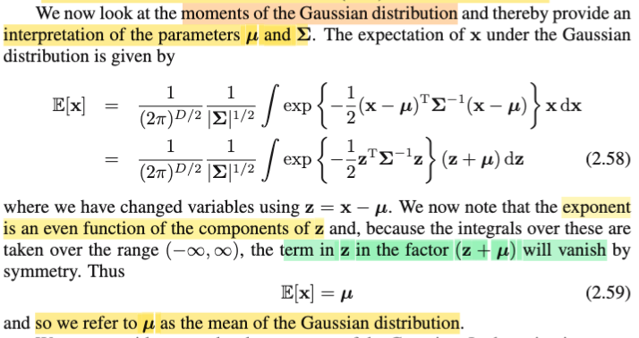</kbd>

> [!NOTE]
> Tiếp, có thể hiểu đoạn này là gs nói rằng ta sẽ xem xét các moment của nó. Từ Stat110 mình đã biết, nói về moment, khái niệm moment của distribution, được define như sau: moment bậc n là E\[X^n\]. Và như vậy **moment bậc 1, chính là mean** của distribution, EX. Còn **moment bậc 2**, EX^2, sẽ giúp ta tính **variance** với công thức VarX = EX^2 - (EX)^2.
>
>
>
> Thế thì dù mình vẫn hay mặc định là nói với X \~ normal(μ, σ^2) thì μ chính là mean EX. Nhưng thực ra phải chứng minh. Như trong Stat110 đã làm, ta sẽ dựa vào định nghĩa của kì vọng, để chứng minh mean của Z\~ Normal(0, 1) là 0 trước, làm như sau: (đây cũng là ôn lại, nhưng sẽ cho ta thấy cái mà gs Bishop làm ở đoạn này thật ra là y chang)
>
>
>
> EZ = ∫-inf:inf zfZ(z) dz = ∫-inf:inf z \[1/√(2π)\] exp(-z^2/2) dz
>
>
>
> = \[1/√(2πσ^2)\] ∫-inf:inf z exp(-z^2/2σ^2) dz (đưa constant ra ngoài tích phân)
>
>
>
> Thế thì biểu xét biểu thức trong tích phân, coi nó như hàm g(z) = z exp(-z^2/2σ^2) thì nó là một hàm có tính chất:
>
>
>
> g(-z) = -z exp(-(-z)^2/2σ^2) = -z exp(-z^2/2σ^2) = -g(z)
>
>
>
> Vậy nó là một hàm lẻ (odd function). Mà với hàm lẻ, khi ta tích phân từ -inf tới inf, thì các giá trị sẽ cancel out nhau (hủy nhau). Nên kết quả là 0.
>
>
>
> ⇨ EZ = 0. Và từ đó, dùng location scale theorem, nói rằng nếu ta có Z \~ standard member của một location scale family, thì σZ + μ sẽ là thành viên ứng với location μ và scale σ. Với normal, nó là một location scalar family, thành ra theo đó, X = σZ + μ chính là một normal có location μ và scale σ: X \~ normal(μ, σ^2)
>
>
>
> Chứng minh cũng dễ: X = σZ + μ = g(Z) ⇨ Z = (X-μ)/σ = ginv(X). Dùng change of variable theorem, tính pdf của X:
>
>
>
> fX(x) = fZ(z) |dz/dx| = fZ(ginv(x)) |d/dx ginv(x)|
>
>
>
> = fZ((x-μ)/σ) |d/dx \[(x-μ)/σ\]|
>
>
>
> = (1/√2π) exp\[-((x-μ)/σ)^2/2\] |1/σ|
>
>
>
> = (1/√2π) exp\[-(x-μ)/2σ^2\] (1/σ)
>
>
>
> = (1/√2πσ^2) exp\[-(x-μ)/2σ^2\] → đây chính là pdf của normal(μ, σ^2).
>
>
>
> Đến đây ta sẽ dùng linearity để tính EX: EX = E(σZ + μ) = σE(Z) + E(μ) = σ0 + μ = μ. Giúp kết luận với normal(μ, σ^2) thì location μ chính là mean của distribution.
>
>
>
> Chú ý, thường thì ta cứ nghe người ta nói rằng nói normal(μ, σ^2) thì mean là μ, variance là σ^2. Tuy nhiên, đó là kết luận, ta phải chứng minh. Và việc chứng minh chính là như trên vừa làm: Chứng minh nếu X có pdf là 1/√(2πσ^2) exp\[-(x-μ)^2/2σ\] thì EX = μ.
>
>
>
> ---
>
>
>
> Rồi, quay lại đây, cái gs Bishop làm cũng là tương tự, ta có **X** có pdf:
>
>
>
> f(**x**) = \[1/(2π)^(D/2)\] \[1/|Σ|^1/2\] exp\[-1/2(**x**-**μ**)T Σinv(**x**-**μ**)\],
>
>
>
> ta sẽ phải chứng minh E**X** = **μ**.
>
>
>
> Theo định nghĩa của kì vọng:
>
>
>
> E**X** = ∫**x**f(**x**)d**x** = ∫**x** \[1/(2π)^(D/2)\] \[1/|Σ|^1/2\] exp\[-1/2(**x**-**μ**)T Σinv(**x**-**μ**)\] d**x**
>
>
>
> = \[1/(2π)^(D/2)\] \[1/|Σ|^1/2\] ∫**x** exp\[-1/2(**x**-**μ**)T Σinv(**x**-**μ**)\] d**x**
>
>
>
> Tới đây, ông Bishop đổi biến tích phân bằng cách đặt **z** = **x** - **μ** thì thực ra cái ổng làm cũng chính là lặp lại những gì ta làm ở trên, chẳng qua là nó hơi khó để thấy, như sau:
>
>
>
> Đặt **z** = **x** - **μ ⇨** d**z** = d**x**, và cận của tích phân thì vẫn vậy (vẫn là toàn miền R^D)
>
>
>
>  Khi đó, E**X** = \[1/(2π)^(D/2)\] \[1/|Σ|^1/2\] ∫ (**z**+**μ**) exp\[-(1/2) **z**T Σinv **z**\] d**z**
>
>
>
> = \[1/(2π)^(D/2)\] \[1/|Σ|^1/2\] ∫ **z** exp\[-(1/2) **z**T Σinv **z**\] d**z** +
>
>   \[1/(2π)^(D/2)\] \[1/|Σ|^1/2\] ∫ **μ** exp\[-(1/2) **z**T Σinv **z**\] d**z**
>
>
>
> Xét term thứ nhất, và xét cái cụm ∫ **z** exp\[-(1/2) **z**T Σinv **z**\] d**z**, ta sẽ thấy mr Bishop dùng lập luận y chang: vì hàm exp\[-(1/2) **z**T Σinv **z**\] là hàm chẵn, do exp\[-(1/2) **z**T Σinv **z**\] = exp\[-(1/2) (-**z**)T Σinv (-**z**)\], nên **z** exp\[-(1/2) **z**T Σinv **z**\] là hàm lẻ. Và vì vậy khi tích phân trên toàn miền sẽ ra 0.
>
>
>
> (Chú ý nhé, ông nói "exponent is an even function of the components of z" là đang nói  cái cục exp\[-(1/2) **z**T Σinv **z**\] làm hàm chẵn. nhưng ở ngoài còn thằng **z** nữa, nên **z** exp\[-(1/2) **z**T Σinv **z**\] là hàm lẻ, và khi đó thì tích phân trên toàn miền nó mới bị triệt tiêu (vanish) do tính đối xứng (symmetry))
>
>
>
> Nên ông mới nói "*the term in z in the factor (z + μ) will vanish by symmetry*" là vậy.
>
>
>
> Và hãy nhìn kĩ cái term thứ nhất, \[1/(2π)^(D/2)\] \[1/|Σ|^1/2\] ∫ **z** exp\[-(1/2) **z**T Σinv **z**\] d**z**, ta sẽ thấy nó chính là E**Z**.
>
>
>
> Vậy chỉ còn cái term thứ 2: \[1/(2π)^(D/2)\] \[1/|Σ|^1/2\] ∫ **μ** exp\[-(1/2) **z**T Σinv **z**\] d**z**
>
>
>
> Để làm tiếp, đưa μ ra ngoài tích phân, thật ra là đưa hẳn ra ngoài luôn
>
>
>
> **μ** { \[1/(2π)^(D/2)\] \[1/|Σ|^1/2\] ∫ exp\[-(1/2) **z**T Σinv **z**\] d**z** }
>
>
>
> đưa cái cụm constant vào trong tích phân lại:
>
>
>
> **μ** { ∫ \[1/(2π)^(D/2)\] \[1/|Σ|^1/2\] exp\[-(1/2) **z**T Σinv **z**\] d**z** }
>
>
>
> thì lúc này, cái cụm { ∫ \[1/(2π)^(D/2)\] \[1/|Σ|^1/2\] exp\[-(1/2) **z**T Σinv **z**\] d**z** } chính là marginalizing pdf của Z over R^D. nên theo tính valid của pdf, nó phải bằng 1.
>
>
>
> Kết quả term 2 bằng **μ**. giúp ta có E**X** = **μ**, giúp chứng minh μ chính là mean của Normal(**μ**, Σ).

> [!TIP]
> **🤖 AI Feedback** — ✅ Score: **100/100**
>
> Phân tích rất chi tiết và chính xác, giải thích cặn kẽ từng bước và cung cấp bối cảnh vững chắc từ Stat110, làm rõ hoàn toàn ý tưởng 'biến mất do đối xứng' mà tài liệu gốc chỉ trình bày ngắn gọn. Đây là một ghi chú xuất sắc giúp hiểu sâu sắc hơn về việc chứng minh kỳ vọng của phân phối Gaussian.

 

###### Kì vọng XXT Gaussian

<kbd>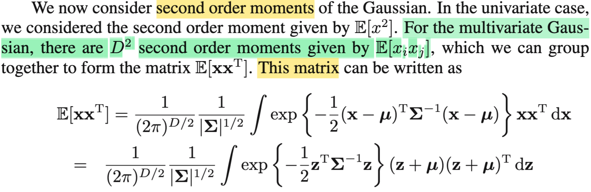</kbd>

> [!NOTE]
> Tiếp theo xét qua second orther moment. Như nãy đã nói, n'th order moment của X là E\[X^n\], nên 2nd order moment là E\[X^2\]. Tuy nhiên với D-dimensional random variable vector **X** (có D variables X1, X2,...XD) thì ta sẽ biết thêm một kiến thức đó là, sẽ có D^2 cái 2nd order moment, mỗi cái là E\[XiXj\] với i,j=1,2...D. Và có thể gom lại để thể hiện cả đám ở dạng matrix E\[**XX**T\].
>
>
>
> > Dừng lại chút để nói rõ thêm về cái này: Vì sao E\[**XX**T\] là matrix? → à đơn giản là vì **XX**T (**X** nhân với **X** transpose), thì đây chính là outer product của vector **X** và chính nó, kết quả, như đã biết trong MIT 1806, sẽ là một rank 1 matrix. (sẵn nói luôn cho vui, vì sao rank 1? Là vì ta sẽ coi đây là phép nhân hai matrix có shape D-1 nhân với matrix 1-D, theo góc nhìn thứ hai khi nhân matrix A với B, thì cột j của AB là linear combination các cột của A bởi hệ số là cột j của B. Vậy thì A=**X** là matrix có mỗi 1 cột, nên cột j của AB=**XX**T sẽ là chỉ là phần tử thứ j của vector **X** nhân với cột của A, tức là vector **X**, như vậy có thể thấy mọi cột của **XX**T đều chỉ là vector **X** nhân với một số nào đó, là phần tử của vector **X**, vậy nên chắc chắn nó chỉ có duy nhất một cột độc lập ⇨ rank = 1.)
>
>
>
> Tiếp, thế thì **XX**T là matrix, và vì **X** là random variable vector, nên **XX**T là một random variable matrix. Và kì vọng của nó, sẽ là matrix có các component là kì vọng của từng phần tử của matrix, nên dĩ nhiên E\[**XX**T\] là matrix.
>
>
>
> (Lại phải nhắc lại phòng khi có người đọc bản note của mình đó là ở sách này gs Bishop ko dùng cách quy ước kí hiệu thông thường của toán học thống kê xác suất như trong sách Casella, Stat110 - Havard đó là viết hoa với tên biến, viết thường với giá trị biến, tuy vậy ông vẫn viết đậm ở vector, viết nét mảnh ở biến scalar. Cách làm này có thể có chút tiện lợi nhưng với mình là người học Stat110 và Casella, việc này khiến nó thấy sao sao á, nên mình sẽ vẫn theo kí hiệu của Stat110 và Casella, trong đó ngoài chuyện viết hoa, thường, mình sẽ thường dùng chữ f để chỉ phân phối xác suất thay vì p. Có thể qua bối cảnh khác ở những chương sau, ta sẽ có lúc phải theo cách ghi của gs Bishop.)
>
>
>
> Rồi, thế thì vì sao có công thức E\[**XX**T\] dài thòng lòng như trong đoạn này?
>
>
>
> Thật ra chỉ là theo định nghĩa của kì vọng và LOTUS, EX là weighted average của các possible value của X, với weight là xác suất tương ứng: P(X=x) (giả sử xét discrete random variable X) ⇨ EX = Σ{mọi possible value x của X} xP(X=x), và với continous variable thì EX = ∫xfX(x)dx với fX(x) là pdf của X.
>
>
>
> Thế thì, giả sử ta có Y = g(X), thì đáng lẽ để tính EY ta phải tìm pdf/pmf của Y. Nhưng LOTUS cho phép tính EY mà chỉ việc xài luôn pdf/pmf của X: EY = Eg(X) = ∫g(x)fX(x)dx.
>
>
>
> Tiếp, giả sử ta có hai biến X,Y. và muốn tính kì vọng của Z với Z = g(X,Y). Thì ta cũng có cái gọi là 2D LOTUS, cho phép tính EZ mà chỉ cần dùng joint pdf của X, Y kí hiệu fX,Y(x,y) chứ khỏi phải dùng pdf/pmf của Z: EZ = ∫∫g(x,y)fX,Y(x,y)dxdy.
>
>
>
> Vậy thì quay lại đây cũng y chang vậy, như đã nói, E\[XXT\] là matrix mà mỗi phần tử ij là E\[XiXj\]. Vậy thì E\[XiXj\] có thể thấy nó chính là E\[g(Xi,Xj)\] với g(xi,xj) = xixj. Nên theo 2D LOTUS, ta có E\[XiXj\] = ∫∫xixj fXiXj(xi,xj)dxidxj.
>
>
>
> Tuy nhiên, ta có thể coi XiXj là một hàm của X1,X2,...XD luôn: ví dụ g(x1,x2,...xD) = x1x2, vẫn được, để rồi khi đó thay vì 2D LOTUS, ta có D-D LOTUS luôn: E\[XiXj\] = E\[g(X1,X2,...XD)\]
>
>
>
> = ∫..∫ g(x1,x2,..xD) f(x1,x2...xD) dx1dx2...dxD
>
>
>
> (f(x1,..xD) là joint pdf của X1,..XD), nói cách khác chính là f**X**(**x**), mà đang xét ở đây là pdf của N(**μ**, **Σ**) đó
>
>
>
> viết gọn lại thành:
>
>
>
> ∫ xixj f(**x**)d**x**.
>
>
>
> Như vậy phần tử ij của E\[**XX**T\] sẽ có dạng ∫xixj f(**x**)d**x**
>
>
>
> > Và, như vậy ta sẽ thể hiện E\[**XX**T\] = ∫ **xx**T f(**x**)d**x**. Vì sao, hiểu thế này: **xx**T là matrix DxD có phần tử ij là xixj. Còn f(**x**) thì là scalar, là giá trị pdf tại **x**, nên **xx**T f(**x**) là matrix nhân scalar = matrix, có phần tử ij là \[xixj f(**x**)\]. Còn việc lấy tích phân, thì ∫ **xx**T f(**x**)d**x** sẽ chỉ là tổng của vô số matrix, để kết qủa là matrix có phần tử ij là tổng của vô số phần tử ij của các matrix đó, chính là ∫ xixj f(**x**)d**x**.
>
>
>
> Như vậy khi đã hiểu E\[**XX**T\] = ∫ **xx**T f(**x**)d**x**, chỉ việc thay f(**x**) pdf của Normal(**μ**, Σ) vào:
>
>
>
> E\[**XX**T\] = ∫ **xx**T \[1/(2π)^(D/2)\] \[1/|Σ|^(1/2)\] exp {-(1/2)(**x**-**μ**)T Σinv (**x**-**μ**)} d**x**
>
>
>
> và đưa các constant ra ngoài tích phân ta sẽ có:
>
>
>
> \[1/(2π)^(D/2)\] \[1/|Σ|^(1/2)\] ∫ **xx**T exp {-(1/2)(**x**-**μ**)T Σinv (**x**-**μ**)} d**x**, đây chính là hàng trên của cái công thức trong đoạn này.
>
>
>
> Và làm tương tự như khi tính E\[**X**\], đặt **z** = **x** - **μ**, và đổi biến tích phân sang **z**, ta có:
>
>
>
> \[1/(2π)^(D/2)\] \[1/|Σ|^(1/2)\] ∫ (**z**+**μ**)(**z**+**μ**)T exp {-(1/2)**z**T Σinv **z**} d**z**
>
>
>
>  → Là ta đã hiểu hết được đoạn này.

> [!TIP]
> **🤖 AI Feedback** — ✅ Score: **98/100**
>
> Bài phân tích rất sâu sắc và chính xác về các khái niệm moment bậc hai cho biến ngẫu nhiên đa chiều và ma trận hiệp phương sai. Việc giải thích chi tiết về định nghĩa E[XX^T] và cách thức áp dụng LOTUS cho biến ngẫu nhiên ma trận là điểm mạnh nổi bật, thể hiện sự nắm vững kiến thức. Bạn chỉ cần chú ý một lỗi nhỏ chính tả ở từ "orther" thay vì "order".

 

###### E[XXT] Phân tích Eigen

<kbd>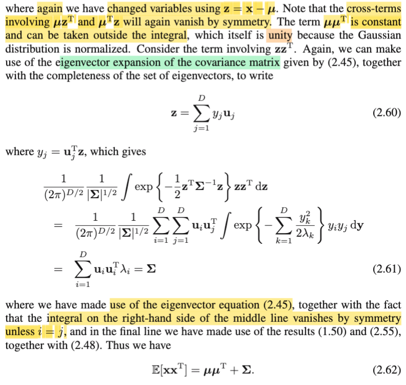</kbd>

<kbd>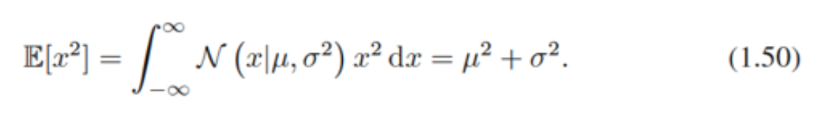</kbd>

<kbd>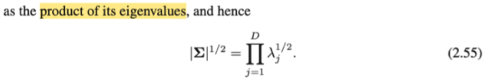</kbd>

<kbd>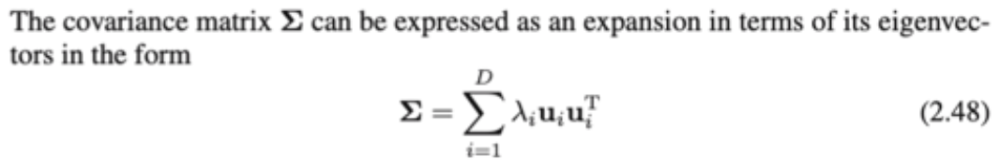</kbd>

> [!NOTE]
> Thế thì, ta đang có E\[**XX**T\] = \[1/(2π)^(D/2)\] \[1/|Σ|^(1/2)\] ∫ (**z**+**μ**)(**z**+**μ**)T exp {-(1/2)**z**T Σinv **z**} d**z**
>
>
>
>  Tiếp theo ta sẽ mở cái tích (**z**+**μ**)(**z**+**μ**)T ra: = (**z**+**μ**)(**z**T+**μ**T) = **zz**T+**μz**T+ **zμ**T+**μμ**T, vậy thì chú ý ở đây ko phải mr Bishop nói hai cục **μz**T và **zμ**T cancel nhau đâu nhé, mà phải hiểu là, ta tách cái tích phân này thành tổng của 4 cái tích phân:
>
>
>
> \[1/(2π)^(D/2)\] \[1/|Σ|^(1/2)\] ∫ **zz**T exp {-(1/2)**z**T Σinv **z**} d**z** +
>
>
>
> \[1/(2π)^(D/2)\] \[1/|Σ|^(1/2)\] ∫ **μz**T exp {-(1/2)**z**T Σinv **z**} d**z** +
>
>
>
> \[1/(2π)^(D/2)\] \[1/|Σ|^(1/2)\] ∫ **zμ**T exp {-(1/2)**z**T Σinv **z**} d**z** +
>
>
>
> \[1/(2π)^(D/2)\] \[1/|Σ|^(1/2)\] ∫ **μμ**T, exp {-(1/2)**z**T Σinv **z**} d**z** +
>
>
>
> Và xét cái thứ 2, và 3, ta sẽ thấy hàm trong tích phân là hàm lẻ, nên tích phân trên toàn miền sẽ bằng 0, đây mới là ý của gs khi nói "the cross-term involving **μz**T và **zμ**T will again vanish by symmetry"
>
>
>
> Còn cái thứ 4, vì **μμ**T ko dính tới **z**, nên đưa ra ngoài, đồng thời đưa hai cụm constant vào trong lại, để có:
>
>
>
> **μμ**T ∫ \[1/(2π)^(D/2)\] \[1/|Σ|^(1/2)\] exp {-(1/2)**z**T Σinv **z**} d**z**
>
>
>
> và cái tích phân này, chính là hành động marginalizing một hàm pdf của Z \~ Normal(0, **Σ**) trên toàn miền, nên theo tính valid của pdf, thì nó phải bằng 1 (đây chính là khúc ổng nói "**which itself is unity, because Gaussian distribution is normalized**". Vậy term 4 chỉ còn **μμ**T, để nó ở đó.
>
>
>
> Giờ quay lại term 1 trong 4 cái ở trên: \[1/(2π)^(D/2)\] \[1/|Σ|^(1/2)\] ∫ **zz**T exp {-(1/2)**z**T Σinv **z**} d**z**
>
>
>
> Gs mới nói tiếp, ta sẽ dùng kết quả của việc phân tách eigendecomposition (cái chữ decomposition vốn có nghĩa là phân tách, phân rã) đối với matrix covariance Σ. Là sao?
>
>
>
> Là vầy, làm lại cho nhớ ko thừa, ta đã biết Σ là symmetric, và Σinv cũng vậy. Theo MIT 1806 đã học, một khi ta có matrix đối xứng thì eigenvalue của nó chắc chắn có giá trị thực và luôn có thể chọn một bộ eigenvector orthognormal với đủ số lượng để span toàn bộ R^D (D là kích thước matrix). Và ở đây ta đã gọi **u**1,...**u**D là bộ eigenvector như vậy của Σ (và cũng là của Σinv), đặt nó thành các hàng của U, cũng là các cột của UT, thì ta sẽ có phép eigendecomposition của Σ sẽ là: Σinv = (UT)T Λinv UT = U Λinv UT với Λ là diag(1/λ1,..1/λD), diagonal matrix có các eigenvalues của Σinv (cũng là nghịch đảo các eigenvalue của Σ) trên đường chéo.
>
>
>
> (Chỗ này có chút dễ confuse do cách mr Bishop gọi U là matrix có các hàng là các eigenvector **u**1,..**u**D thay vì đặt chúng làm cột của U, cách làm này khiến UT mới là matrix có các cột là eigenvector. Và theo lí thuyết MIT 1806, thì khi Q là matrix có các cột là eigenvector của A, Λ là matrix các eigenvalues, thì ta có A = QT Λ Q. Vậy áp dụng vào Σ thì Σ = (UT)T Λinv UT, và tiếp tục = U Λinv UT)
>
>
>
> Tiếp, xét bản chất của UT Λinv U, có thể hiểu theo góc nhìn nhân hai matrix UT, và ΛinvU, với UT có các cột như đã nói, là eigenvectors **u**1,...**u**D. Và ΛinvU là matrix có các hàng là **u**1/λ1, **u**2/λ2,.... (chú ý, phải hiểu **u**1/λ1 là lấy scalar 1//λ1 nhân vector = vector). Theo 4 góc nhìn nhân hai matrix thầy Strang đã dạy thì góc nhìn thứ 4 sẽ thấy nó là tổng các rank 1 matrix tạo bởi các outer product của một cột của UT và một hàng của Λinv U. Từ đó ta có:
>
>
>
> Σinv = UT Λinv U = Σi=1:D **u**i (λ**u**i)T = Σi=1:D **u**i**u**iT/λi, viết gọn là Σi **u**i**u**iT/λi
>
>
>
> Vậy thế vào \[1/(2π)^(D/2)\] \[1/|Σ|^(1/2)\] ∫ **zz**T exp {-(1/2)**z**T Σinv **z**} d**z**, ta có:
>
>
>
> \[1/(2π)^(D/2)\] \[1/|Σ|^(1/2)\] ∫ **zz**T exp {-(1/2)**z**T (Σi **u**i**u**iT/λi) **z**} d**z**
>
>
>
> Xét cái cục này **z**T (Σi **u**i**u**iT/λi) **z**, đưa **z** vào trong tổng, = Σi \[**z**T(**u**i**u**iT/λi)**z**\] = Σi \[(**z**T**u**i)(**u**iT**z**)/λi\]
>
>
>
> Đặt yi = **z**T**u**i, chú ý, nó là scalar, kết quả của dot product của hai vector **z** và **u**i, và vì là scalar nên yi = yiT,
>
>
>
> .. = Σi \[(yi yiT)/λi\] = Σi \[(yi yi)/λi\] = Σi (yi^2/λi), hay chuyển index variable thành k (tất nhiên vẫn hiểu k=1:D) để chuẩn bị cho lát nữa, ta có
>
>
>
> **z**T (Σi **u**i**u**iT/λi) **z** = Σk (yk^2/λk)
>
>
>
> Rồi, nãy giờ, ta chỉ mới dùng cái ý mà gs Bishop nói "make use of eigenvector expansion of covariance matrix" để mà giải thích vì sao **z**T (Σi **u**i**u**iT/λi) **z** = Σk (yk^2/λk), giúp ta hiểu ở đâu ra có cái cục Σk (yk^2/2λk) trong công thức 2.61 trong sách.
>
>
>
> Thế thì sau ý đó ông nói "together with the completeness of the eigenvectors set". Là sao? Thật ra ko có gì khó, nó chính là nói cái ý mà ta nói ở trên, rằng, theo thầy Strang đã dạy trong MIT 1806, matrix A size nxn đối xứng thì luôn có thể có một bộ eigenvector orthogonal và hơn nữa chúng còn đủ số lượng n vector độc lập. Có nghĩa là, không chỉ chúng có một bộ eigenvector orthogonal, mà chúng còn có đủ n vector. Phải nhấn mạnh ý này là vì, không phải cứ là matrix vuông size nxn thì sẽ luôn có đủ n eigenvector độc lập, vì nếu như nó bị defective, là khi có eigenvalue trùng nhau, thì khi đó trong n eigenvector, thì sẽ có những cái phụ thuộc nhau (trùng phương nhau), dẫn đến ta ko có một bộ n vector độc lập, và dẫn đến chúng không thể span được toàn bộ R^n, cũng là cách nói của việc, chúng không làm thành basis của R^n, và cũng đồng nghĩa luôn với việc nếu chỉ lấy các vector độc lập, và orthogonal đó ra, đặt các vector đó vào các cột của Q, thì Q không phải là orthogonal matrix, là cho dù bộ vector đó vẫn được gọi là orthogonal, nhưng vì không đủ n vector, nên Q không vuông, nên dù vẫn có các cột orthogonal, hoặc chuẩn hóa thành unit norm, để thành orthonormal thì nó vẫn không được gọi là orthogonal matrix, mà chỉ đơn giản gọi là matrix có các cột orthonormal mà thôi.
>
>
>
> Vậy thì quay lại đây, việc Σ đối xứng giúp không những eigenvector orthogonal mà còn có đủ D cái. Thành ra chúng sẽ tạo một basis để span toàn bộ R^D Đây chính là ý "completeness of the eigenvectors set" của ngày Bishop. Và như vậy, bất kì vector **z** nào cũng đều có thể được thể hiện bởi linear combination của các basis vector **u**i này.
>
>
>
> Thế thì, quay lại nói về vector **z**, vừa rồi mình đã có đặt yi = **z**T**u**i. Thì chỗ này ta sẽ dùng một kiến thức nữa của MIT 1806: Là khi ta có một unit vector **q**, thì **a**T**q**, chính là độ dài của a trên q, và vì q có độ dài đơn vị, nên đây cũng chính là tọa độ của a trên trục q. Và nếu ta có một orthogonal basis **q**1, **q**2,...**q**n, thì **a**T**q**1, **a**T**q**2,....**a**T**q**n chính là tọa độ của a trong hệ tọa độ basis **q**1, **q**2,.., đồng nghĩa: **a** = (**a**T**q**1) **q**1 + (**a**T**q**2) **q**2 + ...+ (**a**T**q**n) **q**n
>
>
>
> (Nếu muốn nói rõ hơn thì có thể sẵn tiện ôn lại cái gốc của nó: Phép chiếu Gram-Smidth mình sẽ ghi ở cuối)
>
> Như vậy, y1,...yD chính là tọa độ của **z** trong basis **u**1,...**u**D.  Và do đó: **z** = y1 **u**1 + y2 **u**2 + .. = Σj=1:D yj**u**j, viết gọn Σj yj**u**j → đây chính là 2.60.
>
>
>
> Vậy thì tới đây đã đủ nguyên liệu, ráp vào, và bây giờ tích phân cũng trở thành theo **y** thay vì **z.** Ta có
>
>
>
> \[1/(2π)^(D/2)\] \[1/|Σ|^(1/2)\] ∫ **zz**T exp {-(1/2)**z**T (Σi **u**i**u**iT/λi) **z**} d**z**
>
>
>
> = \[1/(2π)^(D/2)\] \[1/|Σ|^(1/2)\] ∫ (Σj yj**u**j) (Σj yj**u**j)T exp {-(1/2) \[Σk (yk^2/λk)\] } d**y**
>
>
>
> Xét ∫ (Σj yj**u**j) (Σj yj**u**j)T exp {-(1/2) \[Σk (yk^2/λk)\] } d**y**:
>
>
>
> để dễ thấy ta xem D = 2 thì cái này là:
>
>
>
> ∫ (y1**u**1 + y2**u**2)(y1**u**1 + y2**u**2)T \[scalar h(**y**)\] d**z**, với (h(**y**) = exp{...})
>
>
>
> Ta sẽ thấy, bằng cách tách cái tích (y1**u**1 + y2**u**2)(y1**u**1 + y2**u**2)T, ta sẽ tách cái tích phân này thành tổng của 4 tích phân mà mỗi cái gắn với một trong 4 term:
>
> (y1^2)**u**1(**u**1T), y1y2**u**1(**u**2T), y2y1**u**2(**u**1T), (y2^2)**u**2(**u**2T).
>
>
>
> Có nghĩa là ta sẽ có Σi=1:2 Σj=1:2 ∫ yi yj **u**i **u**jT h(**y**) d**y**
>
>
>
> Vậy nên \[1/(2π)^(D/2)\] \[1/|Σ|^(1/2)\]∫ (Σj yj**u**j) (Σj yj**u**j)T exp {-(1/2) \[Σk (yk^2/λk)\] } d**y**
>
>
>
> = \[1/(2π)^(D/2)\] \[1/|Σ|^(1/2)\] Σi=1:D Σj=1:D ∫ yi yj **u**i **u**jT exp {-\[Σk (yk^2/λk)\] } d**y**
>
>
>
> Đưa yiyj ra cuối, và đưa uiuj ra ngoài tích phân
>
>
>
> = \[1/(2π)^(D/2)\] \[1/|Σ|^(1/2)\] Σi=1:D Σj=1:D **u**i **u**jT ∫ exp {-\[Σk (yk^2/λk)\] } yi yj d**y**
>
>
>
> → đây chính là kết quả trong sách (cái dấu = thứ 2)
>
>
>
> ---
>
>
>
> Để làm tiếp, ông nói ta sẽ xài kết quả 1.50, 2.55 và 2.48. Là như sau:
>
>
>
> Ta đưa cái cụm hằng số vào lại trong tổn và vào luôn trong tích phân:
>
>
>
> = Σi=1:D Σj=1:D **u**i **u**jT ∫ \[1/(2π)^(D/2)\] \[1/|Σ|^(1/2)\] exp {-\[Σk (yk^2/λk)\] } yi yj d**y**
>
>
>
>  Xét cụm này: ∫ \[1/(2π)^(D/2)\] \[1/|Σ|^(1/2)\] exp {-\[Σk (yk^2/λk)\] } yi yj d**y**
>
>
>
> Dùng 2.55 |Σ|^(1/2) = Πj=1:D λj^(1/2)
>
>
>
> = ∫ \[1/(2π)^(D/2)\] \[1/(Πj=1:D λj^(1/2))\] exp {-\[Σk (yk^2/λk)\] } yi yj d**y**
>
>
>
> = ∫ Πj=1:D \[1/(√(2πλj)\] exp {-\[Σk (yk^2/λk)\] } yi yj d**y**
>
>
>
> nếu i khác j:
>
>
>
> = ∫ Πj=1:D \[1/(√(2πλj)\] exp {-\[Σk (yk^2/λk)\] } yi yj dy1dy2...dyD
>
>
>
> = ∫ Πj=1:D \[1/(√(2πλj)\] exp {-y1^2/λ1}...exp {-yD^2/λD} yi yj dy1dy2...dyD
>
>
>
> = ∫ Πj=1:D \[1/(√(2πλj)\] exp {-y1^2/λ1} y1 ...exp {-yD^2/λD} yi yj dy1dy2...dyD
>
>
>
> khi đó ta sẽ tách thành tích các tích phân: 
>
>
>
> \[ ∫ 1/(√(2πλ1) exp {-y1^2/λ1} y dy1 \] \[∫1/(√(2πλ2) exp {-yD^2/λD} dy2\] ...\[∫ 1/(√(2πλi)exp {-yi^2/λi} yi dyi\]... \[ ∫ 1/(√(2πλj) exp {-yj^2/λj} yj dyj \]...
>
>
>
> Và trong cái tích này, hai cái tích phân ∫ 1/(√(2πλi) exp {-yi^2/λi} yi dyi, và ∫ 1/(√(2πλj) exp {-yj^2/λj} yj dyj đều là tích phân của hàm lẽ trên toàn miền, nên đều = 0, hoặc có thể nhìn ra nó đều là mean E(Yi) của Yi \~ normal(0, λi) và E(Yj) của normal(0, λj). Còn những cụm khác đều có dạng của tích phân hàm normal(0, λi) trên toàn miền, nên đều bằng 1. Nhưng dù sao, thì vì có thừa số - 0, nên cả cái tích này bằng: 1\*1\*...\*0\*0\*1\*1 = 0.
>
>
>
> Còn nếu i = j, thì nó sẽ trở thành 1\*1\*...\*\[∫ 1/(√(2πλi) exp {-yi^2/λi} (yi^2)dyi\]\*1\*...\*1
>
>
>
> = ∫ 1/(√(2πλi) exp {-yi^2/λi} yi^2 dyi
>
>
>
> và đây chính là có dạng của việc tính ∫yi^2 f(yi)dx với f(yi) là pdf của normal(0, λi). Nên kết quả chính là second moement, E\[Yi^2\] với Yi\~ Normal(0, λj). Mà ta biết VarX (=λi) = EYi^2 - (EYi)^2 ⇨ EYi^2 = VarYi + (EYi)^2 = λi + 0 = λi. Nên kết quả tích phân này là bằng λi.
>
>
>
>  Như vậy, quay lại đây, ta thấy khi xét cụm Σi=1:D Σj=1:D **u**i **u**jT ∫ \[1/(2π)^(D/2)\] \[1/|Σ|^(1/2)\] exp {-\[Σk (yk^2/λk)\] } yi yj d**y**, thì bản chất của nó là một cái tổng lớn, mà khi i khác j thì cái tích phân = 0, nên hạng tử cũng bằng 0. Còn i = j thì tích phân bằng λi.
>
>
>
> Do đó, cái tổng này chỉ còn lại:
>
>
>
> Σi=1:D **u**i **u**iT λi
>
>
>
> Và, má ơi, đây chính là gì, chính là Σ, mà ta đã phân tích ở 2.48 hoặc cũng phân tích lại ở đầu cái note này.
>
>
>
> Như vậy cái term 1, \[1/(2π)^(D/2)\] \[1/|Σ|^(1/2)\] ∫ **zz**T exp {-(1/2)**z**T Σinv **z**} d**z** = Σ.
>
>
>
> Và như vậy ta đã hiểu hết toàn bộ bước chứng minh E\[**XX**T\] với **X** \~ Normal(**μ**, Σ) chính là = Σ + **μμ**T
>
>
>
> ---
>
>
>
> (Ôn lại phần chiếu Gramd Smith với orthogonal basis giúp giải thích vì sao **a** = Σi=1:n (**a**iT**q**i) **q**i:
>
>
>
> Ta có vector **a** và muốn thể hiện nó trong orthogonal basis **q**'s: **a** = a1 **q**1 + a2 **q**2 + .. an **q**n.
>
>
>
> Đầu tiên, chiếu **a** lên **q**1. gọi **p**1 là hình chiếu của a lên **q**1, cũng chính là nói **p**1 ∈ span {**q**1}: p1 = α**q**1. Và phần dư **r**1 = **a** - **p**1 = **a** - α**q**1 sẽ vuông góc với span {**q**1}, và do đó, nó nằm trong orthogonal complement của span {**q**1}
>
>
>
> ⇨ **r**1T**q**1 = 0 ⇔ (**a** - α**q**1)T**q**1 = 0 ⇔ **a**T**q**1 = α**q**1T**q**1 ⇔ **a**T**q**1/**q**1T**q**1 = α ⇔ **a**T**q**1/1 (do q1 là unit vector → q1Tq1 = ||q1||^2 = 1) = **a**T**q**1. Vậy α = **a**T**q**1. Nên a = **p**1 + **r**1 = α**q**1 + **r**1 = (**a**T**q**1) **q**1 + **r**1.
>
>
>
> Tiếp theo, xét **r**1, nó nằm trong orthogonal complent của span {**q**1}, cũng chính là span {**q**2,..**q**n}, ta sẽ chiếu tách nó thành **p**2 là hình chiếu của **r**1 lên span {**q**2} và phần dư **r**2 = **r**1 - **p**2.
>
>
>
> Tương tự, **p**2 ∈ span {**q**2} nên **p**2 = β **q**2 phần dư **r**2 sẽ orthogonal với **q**2: (**r**1 - **p**2)T**q**2 = 0 ⇔ **r**1T**q**2 = **p**2T**q**2 ⇔ **r**1T**q**2 = β **q**2T**q**2 ⇔ **r**1T**q**2 = β (do q2 unit vector. ||**q**2|| = 1) Vậy β = **r**1T**q**2 = (**a** - **p**1)T**q**2 = (**a** - α**q**1)T**q**2 = **a**T**q**2 - α**q**1T**q**2, và cái này thì bằng **a**T**q**2 do q1,q2 vuông góc (bởi đã nói q1,..qn là bộ orthogonal basis). Vậy β = **a**T**q**2.
>
>
>
> Nên đến đây ta đã có **a** = α**q**1 + **r**1 = α**q**1 + β**q**2 + **r**2 = (**a**T**q**1) **q**1 + (aT**q**2) **q**2 + **r**2 với cái đầu là hình chiếu của **a** lên **q**1, cái sau là hình chiếu của phần dư **r**1 lên **q**2, nhưng vì bộ orthogonal basis, nên nó cũng đồng thời chính là hình chiếu của **a** lên **q**2.
>
>
>
> Và tiếp tục như vậy ta sẽ thấy kết quả là: a sẽ tách thành Σi=1:n (**a**iT**q**i) **q**i
>
>
>
> Và đây là điều chỉ có được nếu ta dùng một orthogonal basis.)

> [!TIP]
> **🤖 AI Feedback** — ✅ Score: **99/100**
>
> Bài giải thích này rất chi tiết, chính xác và có chiều sâu, giải thích cặn kẽ từng bước và liên kết tốt các khái niệm trong bài đọc. Cách bạn đi sâu vào cả những kiến thức nền tảng như eigendecomposition và tính đối xứng là rất ấn tượng.

 

###### Ma trận hiệp phương sai Σ

<kbd>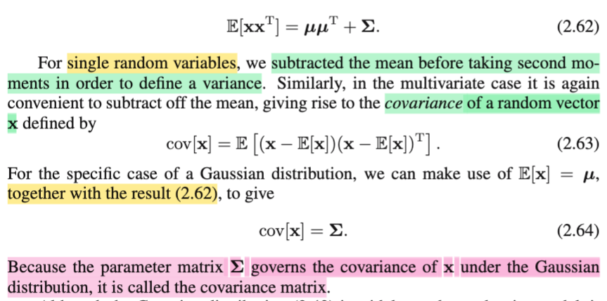</kbd>

> [!NOTE]
> Tiếp, tới đây ta đã có E\[**XX**T\] = **μμ**T + Σ
>
>
>
> Thế thì dừng lại chút, để nhớ rằng thứ ta đang cố gắng tính, E\[**XX**T\], là matrix các second moment của **X**, là random vector \~ Normal (**μ**, Σ).
>
>
>
> Vậy thì ta còn nhớ, với single random variable X, khi học về variance Var(X), thì công thức đầu tiên được học là VarX = E\[(X - EX)^2\], thì nếu nhìn kĩ vào đây, ta sẽ thấy nó chính là việc đặt một biến Z = X - EX, và lấy second moment của nó: E\[Z^2\], cho nên đây là ý của gs Bishop khi nói "subtracted the mean before taking second mo-ments in order to define a variance".
>
>
>
> Thế thì với với random variable vector **X**, ta cũng làm tương tự: trừ đi mean: E\[**X**\], và lấy second moment, mà second moment đối với random variable vector thì như đã nói, sẽ là một matrix, (ví dụ second moment của **X** là matrix E\[**XX**T\]), nên second moment của **X** - E**X** là E\[(**X** - E**X**)(X - E**X**)T\], và cái này **được gọi là covariance** của **X**.
>
>
>
> Dừng lại chút xíu để suy ngẫm rằng: Có thể thấy đây là một cách dẫn dắt khiến mình thấy hơi lạ. Trong Stat110 hay Casella, mình chưa từng được nghe về second moment của một random variable vector, nhưng đã được học về khái niệm covariance giữa hai random variable: Cov(X,Y) được define bởi E\[(X-EX)(Y-EY)\]. Tuy nhiên, mình nhớ là gs Joe trong Stat110 hay trong sách Casella cũng không nói đến covariance matrix, để rồi mình chỉ hiểu một cách đại khái là, với random variable vector **X**, là vector tạo bởi các random variable X1,...Xn, thì covariance matrix là matrix mà các phần tử sẽ là covariance của các cặp random variable Xi, Xj mà thôi. Hiểu vậy thì vẫn đúng. Nhưng ý muốn nói ở đây là, với đoạn này của sách Bishop, mình nhận ra ông đang cho ta biết về định nghĩa của **covariance của một random vector**, đó là: Covariance của vector X được define là second moment của vector **X** - E**X**, và với second moment của vector **U**, được define bởi E\[**UU**T\] thì covariance của vector **X** sẽ là E\[(**X**-E**X**)(**X**-E**X**)T\]. Như vậy từ nay khi nói về covariance matrix, mình sẽ hiểu thêm một tầng, đó là nó chính là **second moment của** (**X** - E**X**).
>
>
>
> Tiếp, gs nói tiếp, vì đang xét **X** \~ Normal(**μ**, Σ), mà ở trên ta đã chứng minh E**X** = **μ.** Nên covariance của **X**:
>
>
>
> cov(**X**) = E\[(**X** - **μ**)(**X** - **μ**)T\]
>
>
>
> Triển khai ra: E\[(**X** - **μ**)(**X** - **μ**)T\] = E\[(**X** - **μ**)(**X**T - **μ**T)\] = E\[**XX**T - **μX**T - **Xμ**T + **μμ**T\]
>
>
>
> = E\[**XX**T\] - E\[**μX**T\] - E\[**Xμ**T\] + E\[**μμ**T\]
>
>
>
> = E\[**XX**T\] - E\[**μX**T\] - E\[**Xμ**T\] + E\[**μμ**T\]
>
>
>
> = E\[**XX**T\] - **μ**E\[**X**T\] - E\[**X**\]**μ**T + E\[**μμ**T\]  (dùng tính linearity E\[**μX**T\] = **μ**E\[**X**T\], E\[**Xμ**T\] = E\[**X**\]**μ**T)
>
>
>
> = E\[**XX**T\] - **μ**(E\[**X**\]T) - **μμ**T + **μμ**T  (**μμ**T là constant ⇨ E\[**μμ**T\] = **μμ**T)
>
>
>
> = E\[**XX**T\] - **μ**(**μ**T) - **μμ**T + **μμ**T
>
>
>
> = E\[**XX**T\] - **μμ**T
>
>
>
> Vậy Cov(**X**) = E\[**XX**T\] - **μμ**T, mà kết quả 2.62 cho ta E\[**XX**T\] = **μμ**T + Σ
>
>
>
> ⇨ Cov(**X**) = **μμ**T + Σ - **μμ**T = Σ
>
>
>
> Như vậy là ta đã chứng minh rằng: **COVARIANCE** CỦA RANDOM VECTOR **X**, có định nghĩa là second moment của (**X** - E**X**), và với việc X \~ Normal(**μ**, Σ), THÌ NÓ CHÍNH LÀ Σ. 
>
>
>
> Và từ đây ta mới hiểu sâu hơn là vì sao khi nói về pdf của Normal(μ, Σ) thì Σ lại được gọi là **COVARIANCE MATRIX.**

> [!TIP]
> **🤖 AI Feedback** — ✅ Score: **100/100**
>
> Bài phân tích rất xuất sắc, vừa chính xác từng chi tiết vừa thể hiện sự đào sâu và kết nối kiến thức một cách sâu sắc. Cách bạn suy ngẫm và liên hệ với các nguồn khác cho thấy sự hiểu biết toàn diện về khái niệm ma trận hiệp phương sai.

 

###### Ma trận hiệp phương sai Normal

<kbd>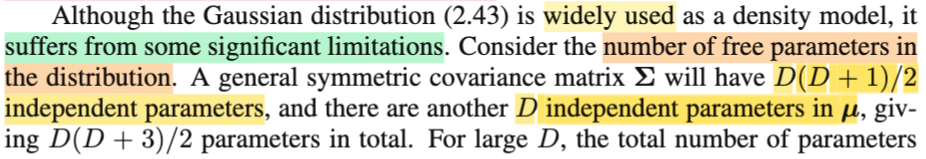</kbd>

<kbd>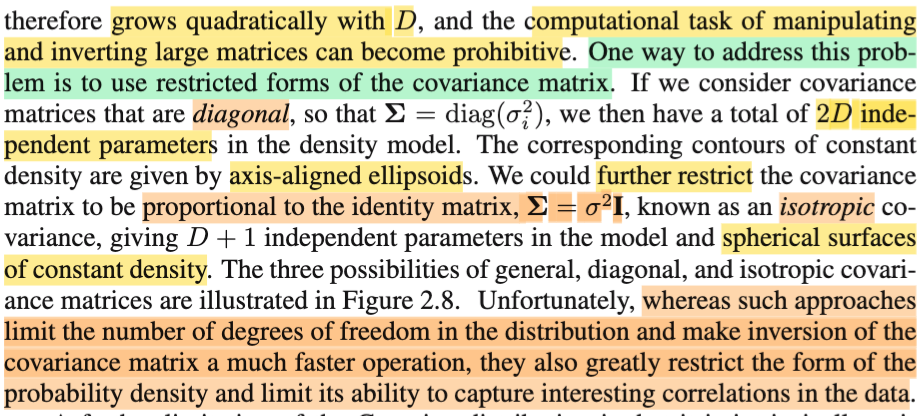</kbd>

<kbd>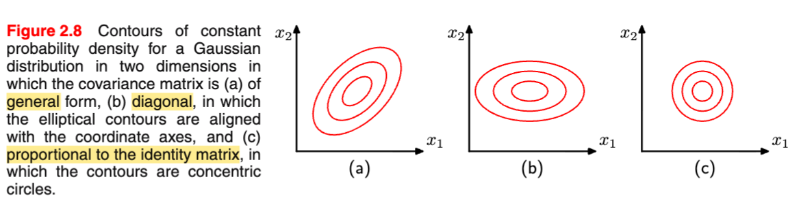</kbd>

> [!NOTE]
> Đại khái là, gs nói về nhược điểm của phân phối (multivariate) Normal: Nói ngắn gọn là tốn quá nhiều parameter, cụ thể là với D-dimension, thì ta có D parameters của **μ** và D(D+1)/2 là số parameter của Σ (ko phải DxD là vì Σ là matrix đối xứng). Như vậy tổng cộng là D(D+3)/2, tức là với D lớn, số params cũng như chi phí tính toán sẽ tăng theo O(D^2).
>
>
>
> Để khắc phục, người ta có thể đưa vào vài ràng buộc với Σ, đánh đổi việc sẽ làm hạn chế bớt khả năng biểu diễn các pattern trong data để đổi lấy việc giảm chi phí tính toán (tính toán nhanh hơn). Trong đó một cách là dùng Σ chỉ có dạng diagonal, dĩ nhiên khi đó số param chỉ là D, khiến tổng cộng chỉ là 2D.
>
>
>
> Hoặc là dùng Σ có dạng αI, có nghĩa là chỉ tốn một param cho Σ, để tổng cộng là D+1 params, và case này gọi là isotropic covariance.
>
>
>
> Thế thì thử giải thích vì sao có 3 hình dạng khác nhau trong hình a, b, c.
>
>
>
> Với hình a, là Σ bình thường. Thì note trước mình đã hiểu, với một level set của hàm pdf, sẽ tương ứng với level set của hàm exponent: exp\[-(1/2)(**x**-**μ**)T Σinv(**x**-**μ**)\] = c thì nó sẽ có dạng là một đường ellipse có tâm tại **μ**, và các trục trùng với eigenvector **u**i của Σ, và độ dài bán trục là cλ1/2, cλ2/2
>
>
>
> Thế thì nếu Σ trở thành diagonal matrix diag(σ1, σ2...) thì sao? Hay vì sao các hình ellipse trở nên thẳng góc với các trục xi?
>
>
>
> Rất đơn giản nếu như ta đã hiểu trục của ellipse là các eigenvector của Σ, thì **khi Σ là diag(σ1, σ2,...) thì eigenvector của nó là gì**? → Nó **chính là các basis vector** **e**1,**e**2,....Vì sao:
>
>
>
> Là vì **với diagonal matrix, eigenvector của nó chính là nằm trên đường chéo**: Nên λ1, λ2,...cũng chính là σ1, σ2,....
>
>
>
> Nếu gọi **u1** là eigenvector của Σ ứng với eigenvector λ1, ta có:
>
>
>
> Σ **u1** = λ1 **u1** ⇔ diag(σ1, σ2,...) **u1** = λ1 **u1**
>
>
>
> Xét vế trái, dễ thấy nó sẽ là vector (λ1 **u1**1, λ2 **u1**2,...). còn vế phải là vector (λ1 **u1**1, λ1 **u1**2,...). Nên ta có hệ phương trình: λ1 **u1**1 = λ1 u**1**1, λ2 **u1**2 = λ1 **u1**2, ...,λD **u1**D = λ1 **u1**D,.... và cái này suy ra **u1**1 = 1, u12 = u13 = ...= 0, nói cách khác **u1** chính là **e1** = \[1,0,0,..0\] 
>
>
>
> Tương tự, **u2** chính là **e2**
>
>
>
> Như vậy cái eigenvector của diagoal(σ1,...σD) chính là các trục ban đầu (basis **e**'s) thành ra các ellipse thẳng trục như hình b.
>
>
>
> Còn hình c), là khi Σ = αI, khi đó đơn giản là **mọi eigenvalue đều bằng nhau** và bằng α, nên các ellipse có **độ dài bán trục bằng nhau, nên thành hình tròn** hết (với D &gt; 2 thì các level set là các mặt cầu, spherical surface)

> [!TIP]
> **🤖 AI Feedback** — ✅ Score: **98/100**
>
> Bài ghi chú của bạn thể hiện sự hiểu biết sâu sắc và chính xác về các hạn chế của phân phối Gaussian cùng với các giải pháp khắc phục, đặc biệt là phần giải thích chi tiết về hình dạng các đường đồng mức dựa trên cấu trúc ma trận hiệp phương sai. Đây là một phân tích rất đầy đủ và có chiều sâu, vượt xa nội dung bề mặt trong tài liệu gốc.

 

###### Phân phối Gaussian và biến ẩn

<kbd>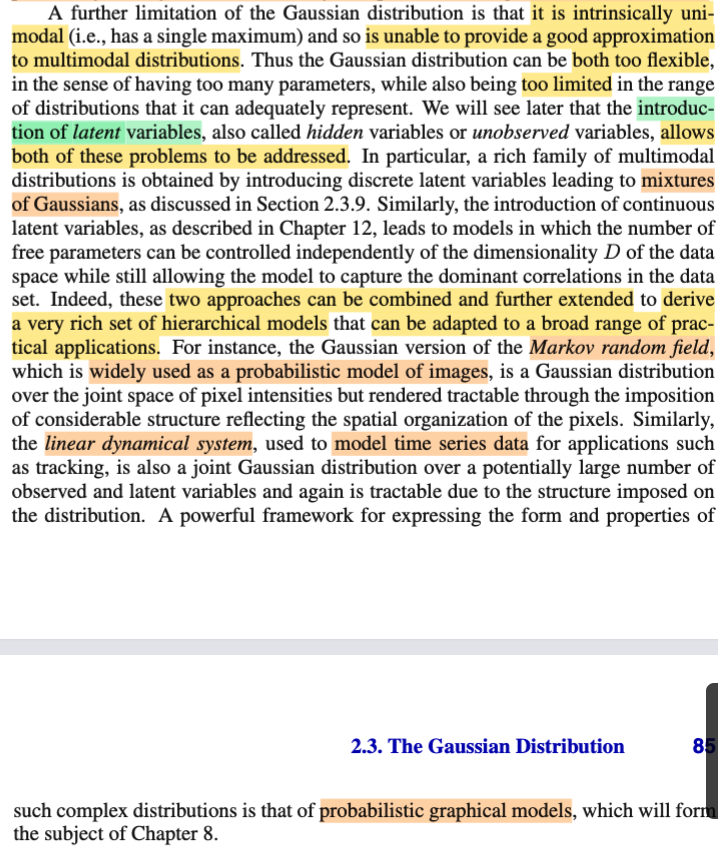</kbd>

> [!NOTE]
> Rồi đại khái là phần cuối cùng này nói về một cái nhược điểm, một cái hạn chế nữa của cái phân phối Gaussian, phân phối normal đó. Đó là về cơ bản nó **về mặt nội tại của nó là một cái phân phối gọi là unimodal**. Có nghĩa là nó chỉ có một cái đỉnh thôi. Chính vì vậy nó không thể mô hình hóa được, không thể xấp xỉ hóa được những cái distribution trong tự nhiên mà vốn nó có nhiều đỉnh, nó gọi là multi-modal distribution. Do đó về mặt mình có thể hiểu nôm na là cái normal distribution nó **vừa quá flexible, nếu như mình xét ở khía cạnh nó quá nhiều parameters**, quá nhiều tham số. Nhưng nó cũng lại quá có **cái tính chất là không đủ flexible** khi mà xét ở khía cạnh nó chỉ là một cái **unimodal** **distribution**. 
>
>
>
> Thành thử ra là nó có cái hạn chế ở chỗ đó. 
>
>
>
> Đồng thời, những cái chương sau mình sẽ học rằng là bằng cách giới thiệu những cái đưa vào những cái **biến ẩn** gọi là **latent variable** hoặc gọi là **hidden variable** thì người ta **có thể khắc phục được chuyện này**. Và nó sẽ dẫn đến một số những cái mô hình, ví dụ như gọi là **Markov random field**, là một cái mô hình mà trong đó người ta đưa vào thêm một cái biến ẩn thuộc dạng rời rạc discrete. Cũng như là **linear dynamical system**. 
>
>
>
> Nói chung là đây là những cái mà trong những cái chương sau mình sẽ học và trong chương 8 mình sẽ học một cái rất là mạnh, một cái cách kết hợp của những cái dạng này, nó gọi là probabilistic graphical model.

> [!TIP]
> **🤖 AI Feedback** — ✅ Score: **95/100**
>
> Phần tóm tắt đã nắm bắt rất tốt các hạn chế của phân phối Gaussian và các giải pháp sử dụng biến ẩn cùng các ví dụ liên quan. Để đạt độ chính xác cao hơn, bạn có thể bổ sung chi tiết về mô hình hỗn hợp Gaussian khi nói về biến ẩn rời rạc.

 

