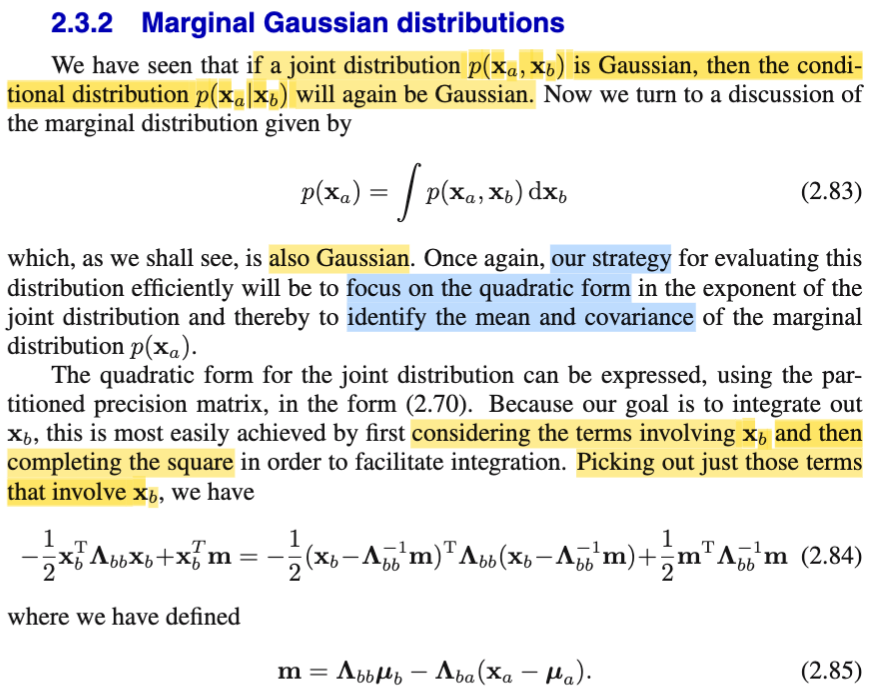
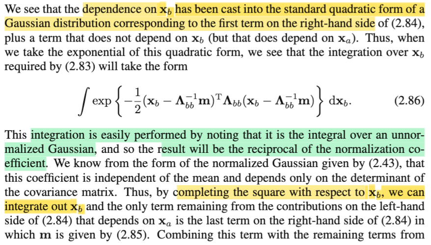
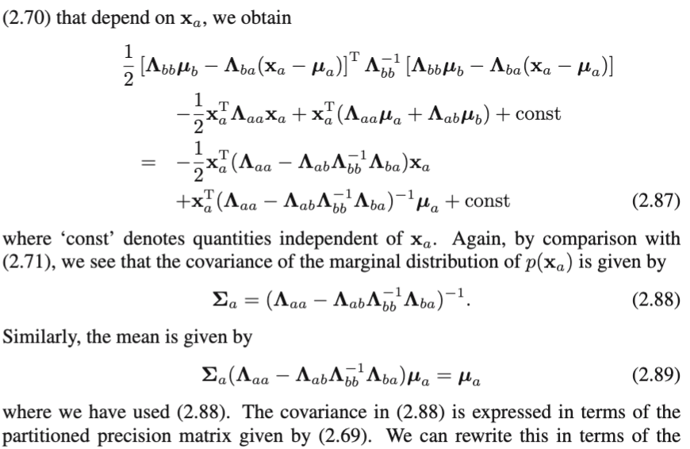
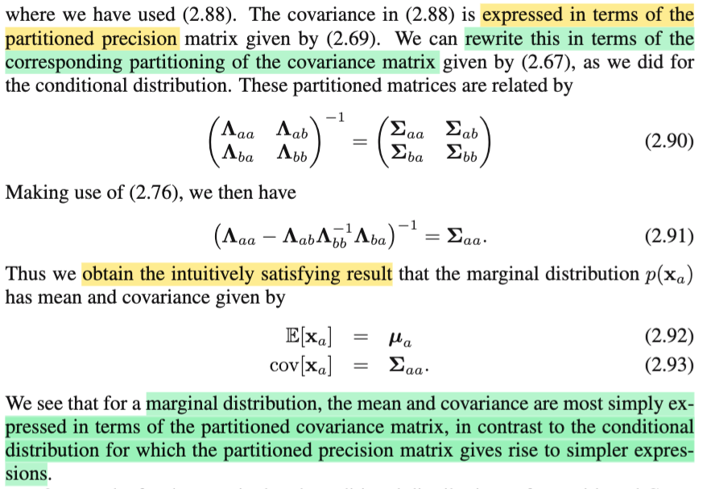
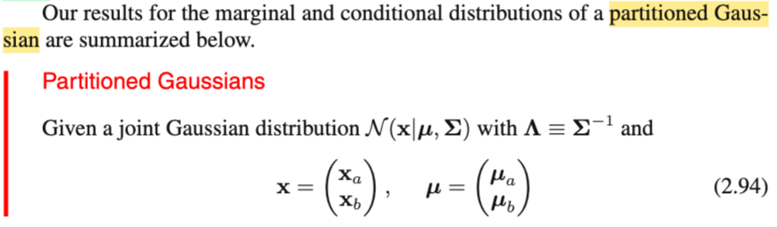
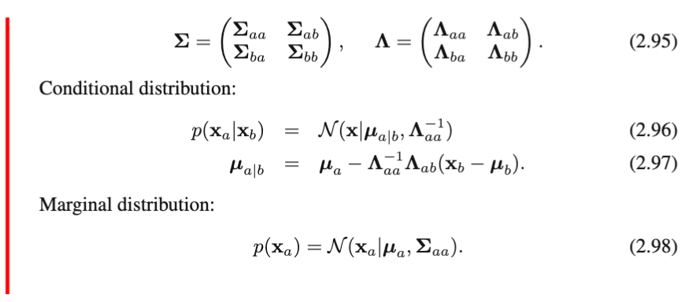
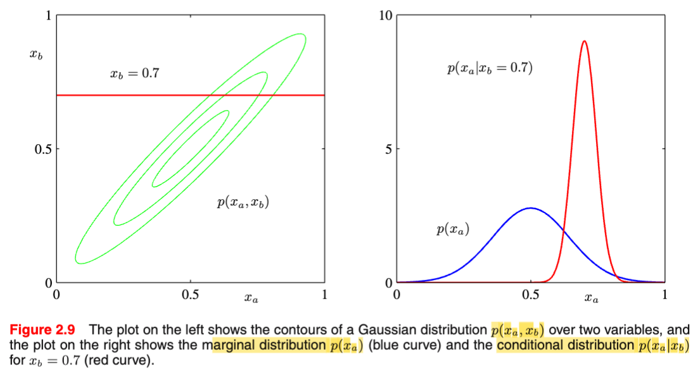

# 2.3.2 Marginal Gaussian

📊 **Progress:** `3` Notes | `7` Screenshots | `3` AI Reviews

---

## 2.3.2 Marginal Gaussian

 

## Phân phối Gaussian biên

<kbd></kbd>

<kbd></kbd>

<kbd></kbd>

> [!NOTE]
> Tiếp, phần trước mình đã thấy nếu f(**X**) với \[**Xa**; **Xb**\] là Normal thì f(**Xa**|**Xb**) cũng là Normal. Nay xét marginal distribution của **Xa** (cũng như **Xb**) thì mr Bishop cho rằng ta cũng sẽ thấy nó là Normal. Và ta cũng sẽ làm theo cách làm như trước, chỉ quan tâm kernel (phần exp(...)) để chỉ ra rằng nó cũng là quadratic function của **Xa** (hoặc **Xb**), đồng nghĩa là nó có dạng của kernel của một phân phối Gaussian, và dùng cách là khớp mẫu, ta sẽ suy ra được mean và covariance matrix.
>
>
>
> Thế thì như đã biết trong Stat110, Casella, khi ta có joint pdf của **Xa**, **Xb** (tức pdf của **X**), thì bằng cách marginalize over mọi possible value của **Xb**, thì ta sẽ có marginal pdf của **Xa**:
>
>
>
> f(**xa**) = ∫f(**xa**,**xb**)d**xb**
>
>
>
> Với f(**xa**, **xb**), là công thức dài dòng bữa trước đã biết, ta tạm không quan tâm chi tiết, chỉ cần thấy nó có dạng \[normalizing constant\] exp\[-(1/2)...\] và phần trong exp\[-(1/2)...\] là quadratic form (**x**-**μ**)T**Λ**(**x**-**μ**) và thể hiện nó dưới dạng:
>
>
>
> (**xa**-**μa**)T**Λaa**(**xa**-**μa**) + (**xa**-**μa**)T**Λab**(**xb**-**μb**) + (**xb**-**μb**)T**Λba**(**xa**-**μa**) + (**xb**-**μb**)T**Λbb**(**xb**-**μb**)
>
>
>
> Thế thì với f(**xa**|**xb**), ta chỉ việc coi **xb** là fixed (constant), và gom các term của **xa** lại, phần nào còn lại cứ đưa ra theo tính chất e^(a+b) = e^a e^b để gộp với normalizing constant đứng ngoài và làm theo chiến lược completing the square nói trên để chỉ ra mean và covariance.
>
>
>
> Còn ở đây, ta phải đối diện với cái tích phân theo **xb**.
>
>
>
> Vậy kế hoạch sẽ là, ta sẽ mở cái cụm trên ra, gom các term dính tới **xb** lại, còn lại thì tách ra (xài tính chất e^(a+b) = e^a e^b nói trên), và đối với tích phân theo **xb** thì chúng cũng là constant, nên ta đưa ra ngoài tích phân. Khi đó cơ bản là ta sẽ có kết quả có dạng:
>
>
>
> \[constant\] ∫exp{hàm của **xb**, tạo thành bởi các term dính tới **xb**} d**xb**.
>
>
>
> Lúc này, ta sẽ chỉ ra cái hàm của **xb** trong exp(..) lại có dạng quadratic function của **xb**, và như vậy nó là kernel của một Normal pdf. Dẫn tới việc nếu ta bổ sung thêm normalizing constant, (bằng cách nhân thêm và chia bớt) của cái normal này, thì việc lấy tích phân trên toàn miền, của cái này, sẽ phải ra 1 theo tính valid của pdf, đồng nghĩa là, kết quả nó sẽ chỉ còn lại cái 1/(normalizing constant). Để rồi toàn bộ sẽ chỉ còn là một hàm nào đó của **xa**, và lúc này ta sẽ chỉ ra nó lại là kernel của Normal.
>
>
>
> Ta sẽ làm chi tiết theo kết hoạch này như sau.
>
>
>
> i) Bung cụm dài thòng lòng ở trên ra gom lại để thành phần dính tới **xb** nằm riêng và không dính nằm riêng:
>
>
>
> (**xa**-**μa**)T**Λaa**(**xa**-**μa**) + (**xa**-**μa**)T**Λab**(**xb**-**μb**) + (**xb**-**μb**)T**Λba**(**xa**-**μa**) + (**xb**-**μb**)T**Λbb**(**xb**-**μb**)
>
>
>
> Đầu tiên gom hai thằng giữa lại, vì chúng giống nhau: đều là scalar, và có cùng giá trị: thằng thứ 2 = (**xa**-**μa**)T**Λab**(**xb**-**μb**) = \[(**xa**-**μa**)T**Λab**(**xb**-**μb**)\]T = (**xb**-**μb**)T(**Λab**)T(**xa**-**μa**) = (**xb**-**μb**)T**Λba**(**xa**-**μa**) = thằng thứ 3
>
>
>
> = (**xa**-**μa**)T**Λaa**(**xa**-**μa**) + 2(**xa**-**μa**)T**Λab**(**xb**-**μb**) + (**xb**-**μb**)T**Λbb**(**xb**-**μb**)
>
>
>
> = (**xa**-**μa**)T**Λaa**(**xa**-**μa**) + 2(**xa**-**μa**)T**Λabxb** - 2(**xa**-**μa**)T**Λabμb** + (**xb**-**μb**)T**Λbb**(**xb**-**μb**)
>
>
>
> = (**xb**-**μb**)T**Λbb**(**xb**-**μb**) + 2(**xa**-**μa**)T**Λabxb** - 2(**xa**-**μa**)T**Λabμb** + (**xa**-**μa**)T**Λaa**(**xa**-**μa**)
>
>
>
> Dựa vào tính chất hàm mũ, ta tách ra thành tích hai exp(term dính **xb**) exp(term không dính **xb**) (nhớ là còn con số -(1/2)):
>
>
>
> f(**xa**) = f(**xa**,**xb**) d**x** = ∫ \[constant 1\] exp{-(1/2) g(**xb**)} exp{-(1/2) h(**xa**)} d**xb**
>
>
>
> Với:
>
>
>
> g(**xb**) = (**xb**-**μb**)T**Λbb**(**xb**-**μb**) + 2(**xa**-**μa**)T**Λabxb**
>
>
>
> h(**xa**) = -2(**xa**-**μa**)T**Λabμb** + (**xa**-**μa**)T**Λaa**(**xa**-**μa**)
>
>
>
> Constant 1 là normalizing constant của pdf của **X**, = \[1/(2π)^(D/2)\] \[1/|**Σ**|^(1/2)\])
>
>
>
> đưa constant 1 cũng như exp{-(1/2) h(**xa**)} ra ngoài tích phân:
>
>
>
> .. = \[constant 1\] exp{-(1/2) h(**xa**)} ∫ exp{-(1/2) g(**xb**)} d**xb**
>
>
>
> Xét exp{-(1/2) g(**xb**)}, = exp{-(1/2) \[(**xb**-**μb**)T**Λbb**(**xb**-**μb**) + 2(**xa**-**μa**)T**Λabxb**\]}
>
>
>
> = exp{-(1/2)(**xb**-**μb**)T**Λbb**(**xb**-**μb**) - (**xa**-**μa**)T**Λabxb**}
>
>
>
> = exp{-(1/2)(**xb**T**Λbbxb** - **μb**T**Λbbxb** - **xb**T**Λbbμb** + **μb**T**Λbbμb**) - **xa**T**Λabxb** + **μa**T**Λabxb**}
>
>
>
> = exp{-(1/2)(**xb**T**Λbbxb** - 2**μb**T**Λbbxb** + **μb**T**Λbbμb**) - **xa**T**Λabxb** + **μa**T**Λabxb**}
>
>
>
> = exp{-(1/2)**xb**T**Λbbxb** + **μb**T**Λbbxb** -(1/2)**μb**T**Λbbμb** - **xa**T**Λabxb** + **μa**T**Λabxb**}
>
>
>
> = exp{-(1/2)**xb**T**Λbbxb** + \[**μb**T**Λbb** - **xa**T**Λab** + **μa**T**Λab**\]**xb** -(1/2)**μb**T**Λbbμb**}
>
>
>
> = exp{-(1/2)**xb**T**Λbbxb** + \[**μb**T**Λbb** - **xa**T**Λab** + **μa**T**Λab**\]**xb**} exp\[-(1/2)**μb**T**Λbbμb**}
>
>
>
> Tới đây thừa số đầu dính tới **xb**, cái sau thì không, ta đưa exp\[-(1/2)**μb**T**Λbbμb**} ra ngoài tích phân:
>
>
>
> Ở ngoài tích phân lúc này là \[constant 1\] exp{-(1/2) h(**xa**)} exp\[-(1/2)**μb**T**Λbbμb**}
>
>
>
> còn tích phân, trở thành ∫ exp{-(1/2)**xb**T**Λbbxb** + (**μb**T**Λbb** - **xa**T**Λab** + **μa**T**Λab**)**xb**} d**xb** 
>
>
>
> ---
>
>
>
> **Xét riêng cái tích phân**, tí nữa nhớ rằng ở ngoài còn \[constant 1\] exp{-(1/2) h(**xa**)} exp\[-(1/2)**μb**T**Λbbμb**}
>
>
>
> Đến đây, làm lại cái vụ ta phân tích cái kernel của multi Normal (**μ**, **Σ**): exp\[-(1/2)(**x**-**μ**)T Σinv (**x**-**μ**)\] và triển khai cái cụm -(1/2)(**x**-**μ**)T Σinv (**x**-**μ**) này ra:
>
>
>
> exp\[-(1/2)(**x**-**μ**)T Σinv (**x**-**μ**) = -(1/2)(**x**T**Σinvx** - **μ**T**Σinvx** - **x**T**Σinvμ** + **μ**T**Σinvμ**)\]
>
>
>
> = exp\[-(1/2)(**x**T**Σinvx** - 2**μ**T**Σinvx** + **μ**T**Σinvμ**)\]
>
>
>
> = exp\[-(1/2)**x**T**Σinvx** + **μ**T**Σinvx** -(1/2)**μ**T**Σinvμ**)\]
>
>
>
> Như vậy, bằng cách khớp:
>
>
>
> i) Khớp **Λbb với Σinv**
>
>
>
> ii) Khớp **μb**T**Λbb** - **xa**T**Λab** + **μa**T**Λab** với **μ**T**Σinv**
>
>
>
> **⇨ μ sẽ tương ứng với:** \[(**μb**T**Λbb** - **xa**T**Λab** + **μa**T**Λab**)**Λbb_inv**\]T.
>
>
>
> Để rồi, ta sẽ cộng thêm và trừ bớt cho một hằng số tương ứng với **μ**T**Σinvμ**, tức là:
>
>
>
> {\[(**μb**T**Λbb** - **xa**T**Λab** + **μa**T**Λab**)**Λbb_inv**\]T}T **Λbb** {\[(**μb**T**Λbb** - **xa**T**Λab** + **μa**T**Λab**)**Λbb_inv**\]T} (đặt là constant 2)
>
>
>
> Khi đó có thể kết luận cái tích phân ∫ exp{-(1/2)**xb**T**Λbbxb** + (**μb**T**Λbb** - **xa**T**Λab** + **μa**T**Λab**)**xb**} d**xb**  sẽ chính là:
>
>
>
> = ∫ kernel của pdf của Normal(-(1/2)\[(**μb**T**Λbb** - **xa**T**Λab** + **μa**T**Λab**)**Λbb_inv**\]T, **Λbb_inv**) exp \[hằng số mà ta đã thêm, constant 2\]
>
>
>
> = exp \[-(1/2)(-constant 2)\] ∫ kernel của pdf của Normal(-(1/2)\[(**μb**T**Λbb** - **xa**T**Λab** + **μa**T**Λab**)**Λbb_inv**\]T, **Λbb_inv**)
>
>
>
> Tiếp, nhân thêm và chia bớt cái normalizing constant của cái normal(-(1/2)\[(**μb**T**Λbb** - **xa**T**Λab** + **μa**T**Λab**)**Λbb_inv**\]T, **Λbb_inv**), đặt là constant 3, ta có:
>
>
>
> exp \[(1/2) constant 2\] \[1constant 3\] ∫ \[pdf của normal(-(1/2)\[(**μb**T**Λbb** - **xa**T**Λab** + **μa**T**Λab**)**Λbb_inv**\]T, **Λbb_inv**)\] d**xb**
>
>
>
> Nhờ tính valid của pdf → ∫ \[pdf của normal(-(1/2)\[(**μb**T**Λbb** - **xa**T**Λab** + **μa**T**Λab**)**Λbb_inv**\]T, **Λbb_inv**)\] d**xb = 1**
>
>
>
> ⇨ Cái tích phân = exp \[(1/2) constant 2\] \[constant 3\] . 1 = exp \[constant 2\] \[1/constant 3\]
>
>
>
> ---
>
>
>
> Xét toàn bộ, tức ∫f(**xa**,**xb**)d**xb** thì trở thành:
>
>
>
> \[constant 1\] exp{-(1/2) h(**xa**)} exp\[-(1/2)**μb**T**Λbbμb**} exp \[(1/2) constant 2\] \[constant 3\]
>
>
>
> Rồi, như vậy đến đây ta chỉ còn một hàm theo **xa**, và cũng không còn tích phân gì nữa. Nhiệm vụ chỉ là, chỉ ra nó có dạng của kernel của một normal gì đó.
>
>
>
> Ta sẽ xét các constant 1, 2, 3 :
>
>
>
> constant 1, còn nhớ, là normalizing constant của pdf của **X**: \[1/(2π)^(D/2)\] \[1/|**Σ**|^(1/2)\])
>
>
>
> constant 3, là normalizing constant của cái normal(\[(**μb**T**Λbb** - **xa**T**Λab** + **μa**T**Λab**)**Λbb_inv**\]T, **Λbb_inv**)
>
>
>
> Nhận xét, constant 1 không phụ thuộc **xa**, nên tiếp tục mặc kệ nó.
>
>
>
> Còn constant 3, vì ta nhớ rằng, normalizing constant của Normal (**μ**, **Σ**) chỉ dính tới **Σ**, nên constant 3 chỉ dính tới **Λbb_inv**, không dính tới **xa**, nên ta cũng tiếp tục mặc kệ nó.
>
>
>
> (1/2) constant 2, = (1/2) {\[(**μb**T**Λbb** - **xa**T**Λab** + **μa**T**Λab**)**Λbb_inv**\]T}T **Λbb** {\[(**μb**T**Λbb** - **xa**T**Λab** + **μa**T**Λab**)**Λbb_inv**\]T}
>
>
>
> Cái này có phụ thuộc **xa**
>
>
>
> Vậy trong \[constant 1\] exp{-(1/2) h(**xa**)} exp\[-(1/2)**μb**T**Λbbμb**} exp \[constant 2\] \[1/constant 3\] ta chỉ cần quan tâm exp{-(1/2) h(**xa**)} exp \[constant 2\]
>
>
>
> Gộp hai cái exp (..) này lại:
>
>
>
> exp{-(1/2)h(**xa**) + (1/2) constant 2}
>
>
>
> Xét thành phần trong mũ:
>
>
>
> \-(1/2)\[-2(**xa**-**μa**)T**Λabμb** + (**xa**-**μa**)T**Λaa**(**xa**-**μa**)\] + (1/2) \[(**μb**T**Λbb** - **xa**T**Λab** + **μa**T**Λab**)**Λbb_inv**\] **Λbb** \[(**μb**T**Λbb** - **xa**T**Λab** + **μa**T**Λab**)**Λbb_inv**\]T
>
>
>
> = (**xa**-**μa**)T**Λabμb** + -(1/2(**xa**-**μa**)T**Λaa**(**xa**-**μa**) + (1/2) {(**μb**T**Λbb** - **xa**T**Λab** + **μa**T**Λab**)**Λbb_inv** **Λbb** \[(**μb**T**ΛbbΛbb_inv** - **xa**T**ΛabΛbb_inv** + **μa**T**ΛabΛbb_inv**)\]T}
>
>
>
> = (**xa**-**μa**)T**Λabμb** - (1/2)(**xa**-**μa**)T**Λaa**(**xa**-**μa**) + (1/2) {\[**μb**T**Λbb** - (**xa**T - **μa**T)**Λab**\] (**μb**T - **xa**T**ΛabΛbb_inv** + **μa**T**ΛabΛbb_inv**)T}
>
>
>
> = (**xa**-**μa**)T**Λabμb** - (1/2)(**xa**-**μa**)T**Λaa**(**xa**-**μa**) + (1/2) {\[**μb**T**Λbb** - (**xa**T - **μa**T)**Λab**\] (**μb**T - (**xa - μa**)T**ΛabΛbb_inv**)T}
>
>
>
> = (**xa**-**μa**)T**Λabμb** -(1/2) (**xa**-**μa**)T**Λaa**(**xa**-**μa**) + (1/2) {**μb**T**Λbbμb** - (**xa**T - **μa**T)**Λabμb** - **μb**T**ΛbbΛbb_inv**T**Λab**T(**xa - μa**) + (**xa**T - **μa**T)**ΛabΛbb_inv**T**Λab**T(**xa - μa**)}
>
>
>
> = (**xa**-**μa**)T**Λabμb** -(1/2) (**xa**-**μa**)T**Λaa**(**xa**-**μa**) + (1/2) {**μb**T**Λbbμb** - (**xa**T - **μa**T)**Λabμb** - **μb**T**Λab**T(**xa - μa**) + (**xa** - **μa**)T**ΛabΛbb_inv**T**Λab**T(**xa - μa**)}
>
>
>
> = (**xa**-**μa**)T**Λabμb** -(1/2) (**xa**-**μa**)T**Λaa**(**xa**-**μa**) + (1/2) **μb**T**Λbbμb** - **μb**T**Λab**T(**xa - μa**) + (1/2)(**xa** - **μa**)T**ΛabΛbb_inv**T**Λab**T(**xa - μa**)}
>
>
>
> = -(1/2) (**xa**-**μa**)T**Λaa**(**xa**-**μa**) + (1/2) **μb**T**Λbbμb** + (1/2)(**xa** - **μa**)T**ΛabΛbb_inv**T**Λab**T(**xa - μa**)}
>
>
>
> Đưa cái (1/2) **μb**T**Λbbμb** ra khỏi cụm này (nó sẽ nhập vào phần constant)
>
>
>
> Ta còn lại phần trong exp có dính **xa**: exp{-(1/2) \[(**xa**-**μa**)T**Λaa**(**xa**-**μa**) - (**xa** - **μa**)T**ΛabΛbb_inv**T**Λab**T(**xa - μa**)}
>
>
>
> = exp{-(1/2) \[(**xa**-**μa**)T\[**Λaa** - **ΛabΛbb_inv**T**Λab**T\](**xa**-**μa**)}
>
>
>
> Và ta đã có term dạng quadratic form. Cho phép ta kết luận ngay đây là pdf của Normal, với mean là:
>
>
>
> Mean = **μa** → Ở đây **ta có cùng kết luận với trong sách là 2.89**
>
>
>
> Inverse của covariance matrix, kí hiệu **Σa**, chính là: **Λaa** - **ΛabΛbb_inv**T**Λab**T
>
>
>
> ⇨ **Σa =** \[**Λaa** - **ΛabΛbb_inv**T**Λab**T\]**inv,**
>
>
>
> dùng tính đối xứng của **Λbb_inv**: **Λbb_invT** = **Λbb_inv** và **Λab**T = **Λba**
>
>
>
> **=** \[**Λaa** - **ΛabΛbb_invΛba**\]**inv**, **→ đây là kết luận 2.88 trong sách.**
>
>
>
>  Thật ra bài toán này tuy dài nhưng chủ yếu là biến đổi đại số matrix, chứ chiến thuật đơn giản thôi: chỉ là gom bi các term gắn với **xa** lại, cái nào ko dính tới **xa** thì kệ cha nó, đưa nó ra ngoài (tức là cứ bám theo nguyên tắc chỉ xét các term dính tới **xa**, thì kiểu gì ta cũng sẽ thấy cuối cùng kết quả cho ra một quadratic form).
>
>
>
> Vậy **Xa** có phân phối Normal(**μa**, **Λaa** - **ΛabΛbb_invΛba**\]**inv**)

> [!TIP]
> **🤖 AI Feedback** — ✅ Score: **95/100**
>
> Ghi chú của bạn đã cung cấp một phân tích cực kỳ chi tiết và chính xác về quá trình suy diễn phân phối biên của Gaussian, đi theo sát logic và các kết quả trong sách giáo khoa. Tuy nhiên, việc trình bày có thể được tinh gọn hơn ở một số bước biến đổi đại số để tăng tính súc tích.

 

### Hiệp phương sai phân phối biên Σaa

<kbd></kbd>

> [!NOTE]
> Tiếp theo cũng không có gì khó hiểu, chỉ là nói rằng kết quả mean và covariance matrix của marginal distribution f(**xa**) vừa rồi: **Xa** có phân phối Normal(**μa**, **Λaa** - **ΛabΛbb_invΛba**\]**inv**), là đang biểu thị thông qua các matrix **Λaa**, **Λab**, **Λbb**, như đã biết, là các matrix con của matrix precision **Λ**. Thì dùng cái công thức Schur Complement, ta có thể biến đổi tí để đưa nó về dạng biểu thị bởi các **Σaa,Σbb,Σab**, là các matrix con của covariance matrix **Σ**.
>
>
>
> Khi đó kết quả sẽ ra rất gọn: Covariane matrix chính là **Σaa**.
>
>
>
> Và như vậy ta có nhận xét, **với conditional distribution, thì dùng cách biểu thị theo các matrix con của precision matrix sẽ gọn hơn nhưng với marginal distribution thì dùng cách biểu thị theo partitioned covariance matrix sẽ gọn hơn**.

> [!TIP]
> **🤖 AI Feedback** — ✅ Score: **95/100**
>
> Bài phân tích rất chính xác, nắm bắt được cả các công thức biến đổi và kết luận quan trọng về sự đơn giản hóa trong biểu diễn cho phân phối biên và có điều kiện. Để bài phân tích súc tích hơn, bạn có thể cân nhắc rút gọn một số phần diễn đạt.

**🔗 See also:** [Tính chất phân phối biên Gaussian](./233_bayess_theorem_for_gaussian_variables.md#node-77d52im)

 

#### Phân phối Gaussian phân tách có điều kiện

<kbd></kbd>

<kbd></kbd>

<kbd></kbd>

> [!NOTE]
> Cuối cùng, tóm tắt lại việc ta chứng minh rằng với random variable vector **X** có phân phối Normal(**μ**, **Σ**) phân tách thành hai random variable vector \[**Xa**; **Xb**\].
>
>
>
> (nói là Partitioned Gaussians, có ý nghĩa chỉ là. ta có D-dimensional random vector **X**, mà dĩ nhiên cũng chỉ là một bộ các random vector X1,...XD, có joint distribution là thuộc loại Normal(**μ**, **Σ**). Nay ta tách ra (partition) làm hai bộ X1,..XM (đặt là vector **Xa**) và và XM+1,...XD (đặt là vector **Xb**)). Thì dĩ nhiên vẫn có thể nói hai random variable vector **Xa** và **Xb** có joint distribution là Normal(**μ**, **Σ**). Nên gọi là partitioned Gaussian, ko có gì ghê gớm cả)
>
>
>
> Khi đó, với **Σ** là Cov(**X**), thì nó có thể thể hiện bởi \[**Σaa, Σab; Σba Σbb**\]
>
>
>
> và **Λ**, precision matrix, inverse của **Σ**, cũng tương ứng \[**Λaa, Λab; Λba, Λbb**\]
>
>
>
> Thì ta đã chứng minh f(**xa**|**xb**) chính là pdf của Normal(**μa|b, Σa|b)**
>
>
>
> Với:
>
>
>
> **μa|b** = **μa** - **Λaa_inv Λab** (**xb** - **μb**)
>
>
>
> **Σa|b** = (**Λaa**)**inv**
>
>
>
> Còn marginal pdf f(**xa**) chính là pdf của Normal(**μa**, **Σaa**)
>
>
>
> Hình ảnh minh họa cho D=2, ramdom vector **X** tách thành hai single random variable Xa, Xb. Thì hình bên trái thể hiện joint pdf, là một 2D normal. HÌnh bên phải, màu xanh, là pdf của 1D normal của Xa. Và hình màu đỏ là f(xa|xb), cũng là normal.

> [!TIP]
> **🤖 AI Feedback** — ✅ Score: **98/100**
>
> Bài tóm tắt rất đầy đủ và chính xác các kết quả về phân phối Gaussian phân hoạch, từ định nghĩa đến các công thức và minh họa hình ảnh. Phần giải thích về ý nghĩa của "Partitioned Gaussians" rất trực quan, giúp người đọc dễ hiểu hơn.

**🔗 See also:** [Mô hình Gaussian tuyến tính](./231_conditional_gaussian.md#node-usyapsm)

 

