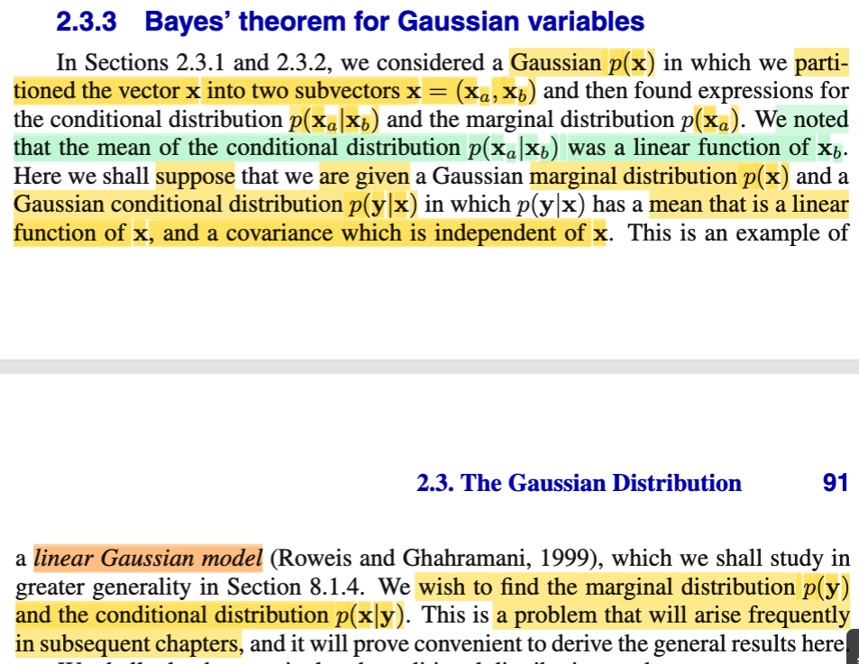
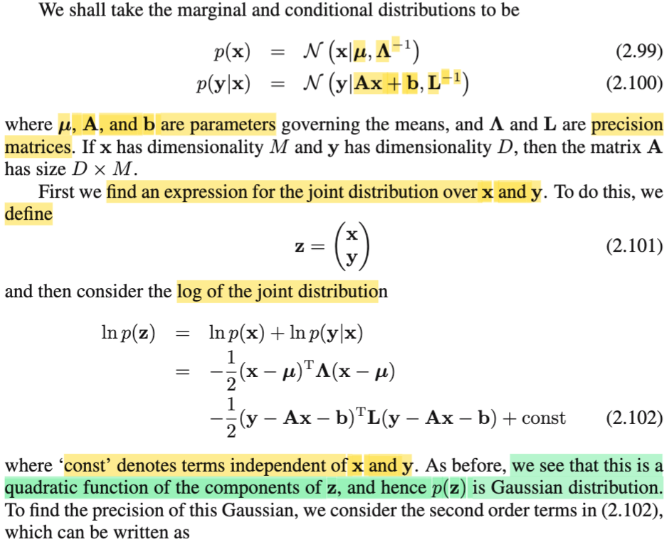
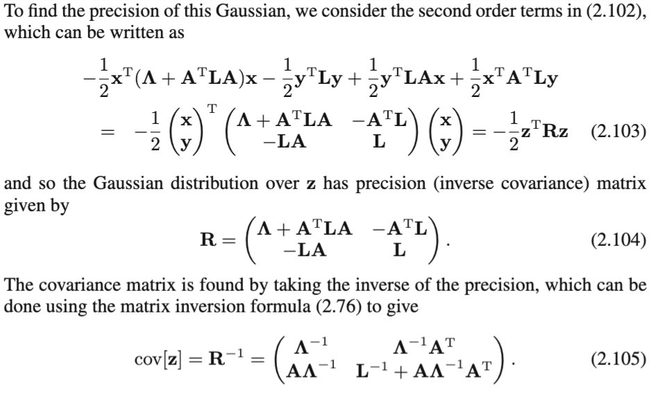
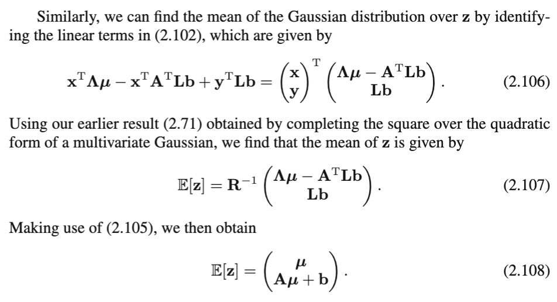
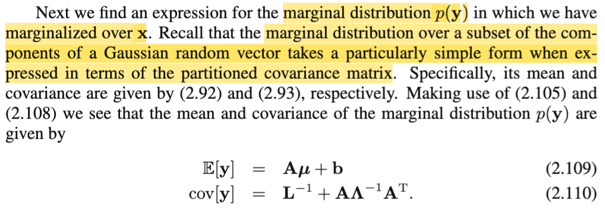
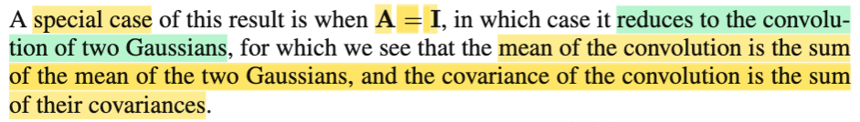
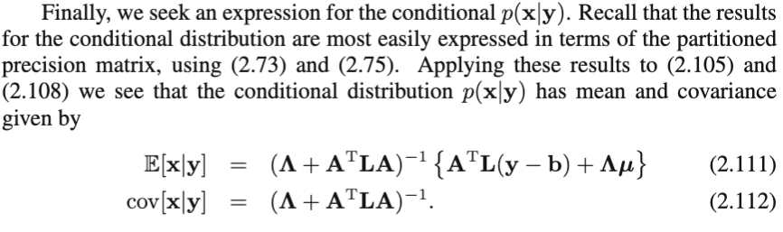
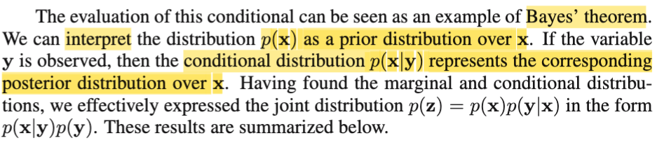
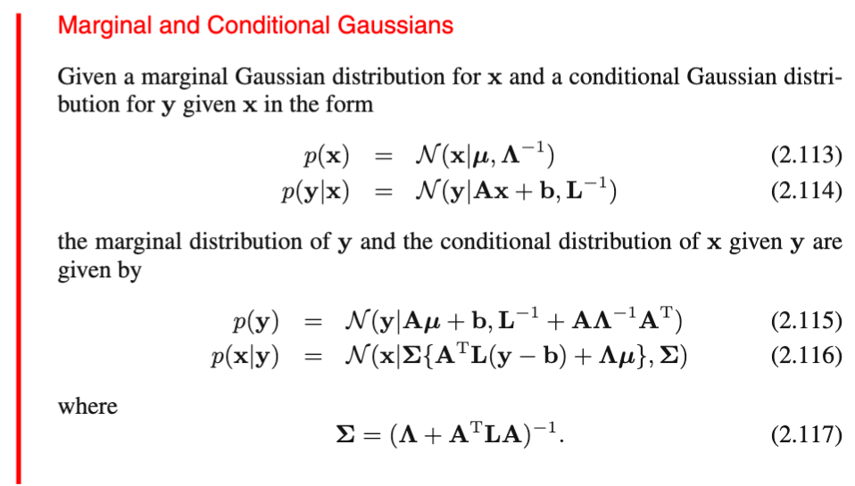

# 2.3.3 Bayes's theorem for Gaussian variables

📊 **Progress:** `6` Notes | `9` Screenshots | `4` AI Reviews

---

## 2.3.3 Bayes's theorem for Gaussian variables

 

## Mô hình Gaussian Tuyến tính

<kbd></kbd>

> [!NOTE]
> Qua phần này, đầu tiên gs nhắc lại, hai phần trước, ta bắt đầu với **X** \~ Normal(**μ**, **Σ**), sau đó tách **X** thành hai subvector **Xa**, **Xb**, để rồi ta chứng minh rằng f(**xa**|**xb**) và f(**xa**) đều là pdf của normal. Và trong quá trình đó, ta đã đề cập đến một điểm, mean f(**xa**|**xb**) là một hàm tuyến tính theo **xb**
>
>
>
> Xem link tới note trước, ta có **μa|b** = **μa** - **Λaa_inv Λab** (**xb** - **μb**) thế thì vì sao nó là hàm tuyến tính với **xb**? à là vì nó có dạng \[matrix\] **xb** + constant, mà matrix nhân vector có bản chất là một linear transformation như đã học trong MIT 18.06.
>
>
>
> Mình nghĩ: như đã biết từ ee364a, nếu chặt chẽ, thì đây là affine function, ko phải linear function.
>
>
>
> Bên cạnh đó, covariance matrix, **Σa|b** = (**Λaa**)**inv**, thì không phụ thuộc **xb**, để rồi ông cho biết đây là một ví dụ của cái gọi là linear Gaussian model.
>
>
>
> Thế thì, trong bài toán này, cho rằng ta được cho f(**x**) và f(**y**|**x**) đều là Normal trong đó mean của f(**y**|**x**) là hàm phụ thuộc **x** và covariance matrix không phụ thuộc **x**. Đây là ví dụ của linear Gaussian model, và ta sẽ đi tìm f(**y**) cũng như f(**x**|**y**). Và đại khái là đây là bài toán gặp nhiều trong các chap sau nên ta sẽ phân tích nó ở đây trước.

**🔗 See also:** [Mô hình Gaussian tuyến tính](./231_conditional_gaussian.md#node-usyapsm)

 

### Phân phối kết hợp Gaussian

<kbd></kbd>

<kbd></kbd>

<kbd></kbd>

> [!NOTE]
> Rồi, như đã nói, ta có **X** \~ Normal và **Y**|**X** \~ Normal với mean là hàm tuyến tinh của **x**, và covariance không phụ thuộc **x**. Nên ta gọi distribution của **X** là Normal(**μ**, **Λinv**) và **Y|X** \~ Normal(A**x**+b, **Linv**).
>
>
>
> (Chú ý, cách ghi của gs f(**x**) = N(**x**|**μ**, **Λinv**), chỉ cũng đồng nghĩa với việc nói hàm pdf của **X** là hàm pdf của Normal(**μ**, **Λinv**), thì nó cùng ý nghĩa với việc nói distribution của **X** là Normal(**μ**, **Λinv**), mình ít thấy cách ghi này trong Casella và Stat110)
>
>
>
> Một điểm lưu ý nữa, như đã biết, khi nói đến Normal(**μ**, **Σ**), thì Σ, như đã chứng minh, là covariance matrix, Cov(**X**), và inverse của nó, **Σinv**, gọi là precision matrix. Nên nay khi ghi **X** \~ Normal(**μ**, **Λinv**) thì **Λinv** chính là covariance matrix, và **Λ**, dĩ nhiên là precision matrix. Tương tự với **Linv**, cũng là covariance matrix của f(**y**|**x**)
>
>
>
> Rồi, nói thêm rằng M, và D là số chiều (tức số phần tử) của **X** và **Y**. Và ta sẽ đi derive joint pdf của **X**, **Y**.
>
>
>
> Một điểm có thể có bạn thấy bị ngáo: khi nói về random vector **X** = (X1,...XM), thì nói về pdf của **X**, cũng chính là nói về joint pdf của X1,...XM. Tương tự, pdf của random vector **Y**, cũng chính là joint pdf của các single random variable Y1,....YD. Vậy thì nay, nói đi tìm joint pdf của **X**, **Y** cũng chính là tìm joint pdf của X1,..XM, Y1,...YD. Hiểu vậy sẽ thấy việc ta tạo vector **Z** = \[**X**; **Y**\] (gắn nó lại thành vector M + D chiều) thì pdf của **Z** cũng chính là joint pdf của X1,..XM, Y1,...YD, hay joint pdf của **X**, **Y**
>
>
>
> Thế thì như đã học trong Casella và Stat119, dùng Bayes theorem, cho ta: f(**x**, **y**) = f(**y**|**x**)f(**x**) (mà ta nhớ cái theorem này thực ra chỉ là hệ quả từ định nghĩa của conditional probability mà thôi)
>
>
>
> ⇨ f(**z**) = f(**x**,**y**) = f(**y**|**x**)f(**x**)
>
>
>
> Và ta mới xét log của f(**z**): log f(**z**) = log \[f(**y**|**x**)f(**x**)\], dùng tính chất hàm log: log(ab) = log(a) + log(b).
>
>
>
> ⇨ log(f(**z**)) = log f(**x**) + log f(**y**|**x**)
>
>
>
> Tại sao tự nhiên gs Bishop lại lấy log?
>
>
>
> Mình hiểu: là để **dễ làm**, vì mục đích cuối cùng là chỉ ra rằng log f(**z**) có dạng của log của một hàm số mà phần phụ thuộc **z** có dạng kernel của pdf của một Normal distribution. khi đó, ta sẽ kết luận **Z** cũng là Normal variable.
>
>
>
>  Vì sao dễ làm, là vì với log f(**x**) + log f(**y**|**x**), cùng với việc hai cái f đều có dạng: \[normalizing constant\] exp\[-(1/2) quadratic form\], thì ta có:
>
>
>
> Gọi C1, C2 là hai cái normalizing constant của hai cái Normal đó, ta có
>
>
>
> log {C1 exp\[-(1/2) (**x**-**μ**)T**Λ**(**x**-**μ**)\] } + log {C2 exp\[-(1/2)(**y**-A**x**-b)T**L**(**y**-A**x**-b)\]}
>
>
>
> Dùng tính chất hàm log, tách ra:
>
>
>
> log {C1} + log exp\[-(1/2) (**x**-**μ**)T**Λ**(**x**-**μ**)\] } + log {C2} + log exp\[-(1/2)(**y**-A**x**-b)T**L**(**y**-A**x**-b)\]}
>
>
>
> = -(1/2) (**x**-**μ**)T**Λ**(**x**-**μ**) -(1/2)(**y**-A**x**-b)T**L**(**y**-A**x**-b) + log {C1} + log {C2}
>
>
>
>  = -(1/2) (**x**-**μ**)T**Λ**(**x**-**μ**) -(1/2)(**y**-A**x**-b)T**L**(**y**-**Ax**-b) + conts (hai term cuối ko dính gì đến **x**, **y**, ta ko care)
>
>
>
> = -(1/2) \[**x**T**Λx** - **μ**T**Λx** - **x**T**Λμ** + **μ**T**Λμ** + **y**T**Ly** - **x**T**A**T**Ly** - **b**T**Ly** - **y**T**LAx** + **x**T**A**T**LAx** + **b**T**LAx** - **y**T**Lb** + **x**T**A**T**Lb** + **b**T**Lb**\]
>
>
>
> Nhiệm vụ của là gom các term lại: Cái này thì chỉ là dài dòng, ko có gì khó:
>
>
>
> Đầu tiên kể ra các term bậc hai (tức có dính 2 cái **x**, 2 cái **y** hoặc dính **x** và **y**):
>
>
>
> = -(1/2) \[**x**T**Λx** + **y**T**Ly** - **x**T**A**T**Ly** - **y**T**LAx** + **x**T**A**T**LAx**\]
>
>
>
> = -(1/2) \[**x**T(**Λx** + **A**T**LA**)**x** + **y**T**Ly** - **y**T**LAx** - **x**T**A**T**Ly**\]
>
>
>
> Bằng các xét cái matrix tạo bởi các block: \[**Λ** + **A**T**LA**, -**A**T**L**; -**LA**, **L**\], đặt là **R**, thì ta sẽ thấy cái trên chính là: -(1/2) **z**T**Rz**
>
>
>
> Tiếp, ra các term bậc một: (có dính tới **x** hoặc **y**):
>
>
>
> \-(1/2) \[- **μ**T**Λx** - **x**T**Λμ** - **b**T**Ly** + **b**T**LAx** - **y**T**Lb** + **x**T**A**T**Lb** + **b**T**Lb**\]
>
>
>
> = -(1/2) \[- 2**μ**T**Λx** - 2**b**T**Ly** + 2**b**T**LAx**\]
>
>
>
> = -(1/2) \[- 2(**μ**T**Λ**-**b**T**LA**)**x** - 2**b**T**Ly**\]
>
>
>
> = (**μ**T**Λ**-**b**T**LA**)**x** + **b**T**Ly**
>
>
>
> Bằng cách define vector **h** = \[(**μ**T**Λ**-**b**T**LA**)T, (**b**T**L**)T\] = (**Λ**T**μ**-**A**T**L**T**b**, **L**T**b**) = (**Λμ**-**A**T**Lb**, **Lb**) (do tính đối xứng của L, **Λ**) , ta sẽ thấy đây chính là **h**T**z**
>
>
>
> Còn các term bậc 0, thì gom lại thành constant.
>
>
>
> và do đó, nó có dạng quadratic function của **z**: =(1/2)**z**T**Rz** + **h**T**z** + const giúp kết luận rằng: Với việc log f(**z**) **có dạng log** **exp** \[**quadratic function** của **z**\] ta **suy ra** f(**z**) **có dạng exp\[quadratic function của z\] nhân some constant**, **và điều này đủ kết luận** **Z nhất định là random variable vector có phân phối Normal**.
>
>
>
> Đồng thời, với cách làm khớp mẫu như hai phần trước đã làm, ta sẽ suy ra mean và covariance của Normal này:
>
>
>
> Với công thức Normal μ, Σ tổng quát, quadratic form sẽ có dạng: -(1/2) \[**x**T**Σinvx** - 2**μ**T**Σinvx** + **μ**T**Σinvμ**\]
>
>
>
> = -(1/2) **x**T**Σinvx** + **μ**T**Σinvx** -(1/2) **μ**T**Σinvμ**
>
>
>
> Khớp mẫu:
>
>
>
> **z**T**Rz** khớp với **x**T**Σinvx → Covariance matriz, Cov(Z) chính là Rinv, hay Precision matrix chính là R**
>
>
>
> **μ**T**Σinvx** khớp với **h**T**z ⇨** **μ**T**Σinv** khớp với **h**T ⇔ (**μ**\_**z**)T**R** = **h** ⇔ **μ**\_**z** = (**hR**inv)T = **R**invT**h**T = **R**inv**h**
>
>
>
>  Nhân vào, kết quả sẽ ra (**μ**; **Aμ** + **b**)
>
>
>
> Và để tính ra covariance matrix, Rinv, ta có thể dùng công thức 2.76 Schur complement để tính inverse của **R** = \[**Λ** + **A**T**LA**, -**A**T**L**; -**LA**, **L**\] = \[**Λ**inv, **Λ**inv**A**T; **AΛ**inv, **L**inv + **AΛ**inv**A**T\] (chỉ là bài toán đại số).

> [!TIP]
> **🤖 AI Feedback** — ✅ Score: **98/100**
>
> Bài viết giải thích rất chi tiết và sâu sắc từng bước một, từ định nghĩa phân phối đến lý do chọn log và cách các hệ số kết hợp thành dạng bậc hai của Z, cho thấy sự hiểu biết vững chắc. Để hoàn thiện hơn, bạn có thể thử tự xây dựng tường minh vector mean và ma trận precision/covariance của Z khi nó đã được chứng minh là phân phối Gaussian.

**🔗 See also:** [Phân phối Gaussian có điều kiện](#node-2d1tmn5)

 

#### Tính chất phân phối biên Gaussian

<kbd></kbd>

> [!NOTE]
> Tiếp, khi đã có joint distribution f(**z**), cho thấy cũng là Normal. Ta sẽ đi tìm f(**y**).
>
>
>
> Có lẽ nên dừng lại review chút xíu:
>
>
>
> Bữa giờ ta ta đã chứng minh:
>
>
>
> Nếu có random vector **X tách thành hai subvector Xa, Xb**, và joint distribution của chúng là Normal(**μ**, **Σ**) hay Normal(**μ**, **Λinv**), ứng với việc **X** = \[**Xa**; **Xb**\] thì **Σ** và **Λ** (precision matrix) đều thể hiện ở dạng các matrix khối \[**Σaa, Σab; Σba, Σbb\]**, \[**Λaa, Λab; Λba, Λbb**\] thì f(**xa**|**xb**) và f(**xa**) đều là Gaussian. Trong đó với f(**xa**|**xb**) có covariance matrix thể hiện theo các matrix **Λ** sẽ gọn hơn là thể hiện theo **Σ**. Còn với f(**xa**) thì ngược lại, cụ thể ta còn **Xa** \~ Gaussian(**μa**, **Σaa**) (1) (công thức 2.92, 2.93, xem link).
>
>
>
> Sau đó, ta qua bài toán khác là có marginal và conditional đều là nornal: f(**x**) là normal (**μ**, **Λ**inv), conditional f(**y**|**x**) cũng là normal(**Aμ** + **b**, Linv), thì a đã chứng minh cho thấy joint distribution f(**z**), **z** = \[**x**; **y**\] cũng là normal. Và tiếp tục ở đây, ta sẽ nói về marginal f(**y**).
>
>
>
> Thế thì, lần này ko cần chứng minh gì, chỉ cần áp dụng kết luận đã làm: Vì ta đã có f(**z**) là normal với mean E(**Z**) = \[**μ**; **Aμ** + **b**\] và covariance Cov(**Z**) = \[**Λ**inv, **Λ**inv**A**T; **AΛ**inv, **L**inv + **AΛ**inv**A**T\], theo ý (1) ở trên, có thể kết luận: marginal f(**y**) cũng là Normal. Với tham số là:
>
>
>
> Mean là **Aμ** + **b.**
>
>
>
> Covariance matrix: Trong chứng minh trước **Σ** = \[**Σaa, Σab; Σba, Σbb\]** là cov(**X** = \[**Xa**; **Xb**\]) thì cov(**Xa**) là **Σaa**, nên ở đây Cov(Y) chính là **L**inv + **AΛ**inv**A**T.
>
>
>
> ⇨ **Y** \~ Normal(**Aμ** + **b**, **L**inv + **AΛ**inv**A**T)

> [!TIP]
> **🤖 AI Feedback** — ✅ Score: **98/100**
>
> Phân tích rất chính xác và sâu sắc, giải thích rõ ràng cách suy ra phân phối biên của y từ phân phối hợp Gaussian, khớp hoàn toàn với các công thức và ý tưởng trong hình ảnh. Việc tổng hợp các kiến thức nền trước đó cũng rất hữu ích và làm tăng độ sâu của ghi chú.

**🔗 See also:** [Hiệp phương sai phân phối biên Σaa](./232_marginal_gaussian.md#node-tmn4pn3)

 

##### Convolution hai Gaussian

<kbd></kbd>

> [!NOTE]
> Rồi, cùng tìm hiểu đoạn này là sao.
>
>
>
> Ôn lại bối cảnh một chút, bài toán đang làm là, cho marginal và conditional distribution đều là Normal (Gaussian) trong đó mean của f(**y**|**x**) là hàm tuyến tính theo **x**, còn covariance độc lập với **x**. Nên ta có f(**x**) \~ Normal(**μ**, **Λ**inv) và f(**y**|**x**) \~ Normal(**A**x+**b**, **L**inv).
>
>
>
> Nhiệm vụ là tìm joint distribution, và ta đã thấy nó cũng là Gaussian. Một khi có joint distribution, ta sẽ áp dụng kết quả ở phần trước, để thấy marginal distribution f(**y**) cũng là Gaussian, có mean là E\[**Y**\] = **Aμ** + **b** và cov(**Y**) = **L**inv + **A** **Λ**inv **A**T.
>
>
>
>  Thế thì ở đây mr Bishop nói rằng khi **A** là **Identity matrix** thì distribution của Y hóa ra là convolution của hai Gaussian. Trong Stat110, thực sự thì gs Joe Blizstein chỉ nói rất sơ sơ về convolution. Cụ thể là ông cho ta biết convolution là tổng của hai random variable (ông nói convolution chỉ là một từ bóng bẩy của sum, tổng) X, Y. Có điều, ông chỉ nói nhiêu đó trong bối cảnh là nói về hàm MGF, rằng, MGF sẽ cho ta cách derive pdf của một tổng các random variable dễ hơn là dùng convolution, lợi dụng một tính chất của MGF đó là nếu X, Y độc lập thì MGF của X + Y = MGF của X nhân MGF của Y: M\_(X+Y)(t) = MX(t) × MY(t).
>
>
>
> Thế thì, thử suy nghĩ một chút: Như vậy có thể thấy bài toán thực ra là, ta có hai biến ngẫu nhiên X, Y, biết pdf, và muốn tìm distribution của Z = X + Y.
>
>
>
> Thì cái này, thực ra trong Casella đã học rồi, nó chính là bài toán đổi biến (change of variable): Một cách tổng quát, bài toán là ta có X, Y với joint pdf/pmf fX,Y(x,y). Và muốn tìm distribution của (U,V) = với U = g(X, Y), V = h(X,Y), với hàm g và h có tính chất mapping 1-1 giữa (x,y) trong support set của random variable vector (X,Y) và (u,v) trong support set của (U,V). (hiểu đại khái là, với (x,y) được map với (u,v) thì vẫn có thể có (x', y') khác được map với (u,v) nhưng với điều kiện (u', v') đó phải không được nằm trong support set của (X,Y) (tập các giá trị mà joint pdf fX,Y(x,y) dương). Khi đó: với u = g1(x,y), v = g2(x,y) thì x = h1(u,v), y = h2(u,v). (g, h là hàm nào đó, ko phải đạo hàm). Ta sẽ có:
>
>
>
> fU,V(u,v) = fX,Y(x, y) |∂(x, y)/∂(u, v)| = fX,Y(h1(u, v),h2(u, v)) |∂(x, y)/∂(u, v)|
>
>
>
> Với = |∂(x, y)/∂(u, v)| là trị tuyệt đối của det của Jacobian matrix (đạo hàm của hàm vector → vector (u, v) → (x, y), có hàng 1 là gradient ∇x(u,v): (∂x/∂u, ∂x/∂v), và hàng 2 là gradient ∇y(u,v) = (∂y/∂u, ∂y/∂v).
>
>
>
> Áp dụng vào đây, ta sẽ đặt vector (Z, X) là random vector có được bởi Z = g1(X, Y) = X + Y, V = g2(X, Y) = X (identity function) ⇨ X = h1(Z, V) = V, Y = h2(Z, V) = Z - V.
>
>
>
> Jacobinan: ∇x(z,v) = (∂x/∂z, ∂x/∂v)T =  (0, 1)T. ∇y(z,v) = (∂y/∂z, ∂y/v∂) = (1, -1)T
>
>
>
> ⇨ |det J| = |det \[0, 1; 1, - 1\]| = |1| = 1.
>
>
>
> ⇨ fZ,V(z,v) = fX,Y(x,y) = fX,Y(v, z-v)
>
>
>
> = fX,Y(x, z-x) (Thay v = x)
>
>
>
> Tới đây, cái ta đang có là joint pdf của Z, V (cũng là Z, X). Bằng cách marginalizing over mọi possible của X, ta sẽ có marginal pdf của Z:
>
>
>
> fZ(z) = ∫fZ,V(z,x) dx = ∫fX,Y(x, z-x) dx.
>
>
>
> CÁI NÀY CHÍNH LÀ CÔNG THỨC CỦA CONVOLUTION.
>
>
>
> Và nếu X, Y độc lập, ta có thể tách joint pdf của X, Y thành tích các marginal pdf:
>
>
>
> ⇨ fZ(z) = ∫ fX(x) fY(z-x) dx
>
>
>
> Rồi, nãy giờ là kiểu như để mình hiểu bản chất cái công thức convolution thật ra chỉ là đổi biến. Quay lại đây, ta sẽ cùng nhau xem thử vì sao gs lại nói "nói rằng khi **A** là **Identity matrix** thì distribution của Y hóa ra là convolution của hai Gaussian"
>
>
>
>  Đầu tiên, ta đã kết luận **Y** given **x**, f(**y**|**x**) \~ Normal(**Ax**+**b**, **L**inv), theo location scalae family theorem, khi random variable X \~ một pdf thuộc location scalar familty có location μ thì X - μ sẽ là random varialbe có pdf là standard member của familty đó, tức location = 0. Với normal, nó là một dạng location scale family, nên **T** = **Y** - E**Y** = **Y** - **Ax** - **b** chính là một Normal(**0**, **L**inv).
>
>
>
> vậy ta có **T** = **Y** - **Ax** - **b** ⇔ **Y** = **T** + **Ax** + **b**.
>
>
>
> Nếu **A** = **I**, ta có **Y** = **T** + **x** + **b**
>
>
>
> Dĩ nhiên ta đang xét **x** fixed, là một observed value của **X**.
>
>
>
> Bây giờ, nếu ta tính đến với **X** là random variable, có distribution f(**x**) là Normal(**μ**, **Λ**inv), thì theo location scale, ta cũng sẽ có **U** = **X** + **b** sẽ là Normal(**μ** + **b**, **Λ**inv)
>
>
>
>  Lúc này, **Y** = **T** + **X** + **b** = **T** + **U chính là tổng của hai Normal:**
>
>
>
> **T** \~ Normal(**0**, **L**inv) và U \~ Normal(**μ** + **b**, **Λ**inv)
>
>
>
> Nếu áp dụng công thức covolution ở trên, và giải cái tích phân f(**y**) = ∫f**T**(**t**)f**U**(**y**-**t**)d**t** thay công thức pdf của **T** và **U** vào, ta có thể chứng minh rằng quả thật đây là Gaussian có mean là tổng mean, covariance là tổng covariance. Hoặc làm như trong Stat110, dùng MGF, ta cũng có thể chứng minh điều này. Nhưng cái chính là, một khi đã chỉ ra **Y** là tổng của **T**, **U** thì dùng tính linearity ta nhất định phải có mean bằng tổng mean. Và vì tính độc lập của T, U ta sẽ có covariance bằng tổng covariance:
>
>
>
> Và mean của **Y**, E**Y** = **μ** + **b**, bằng **0** + **μ** + **b =** E**T +** E**U**.
>
>
>
> Còn covarinance Cov(**Y**) = **L**inv + **Λ**inv = Cov(**T**) + Cov(**U**)
>
>
>
> Và kết quả mà mình đã làm ở phần trước - marginal pdf của **Y**, f(**y**) cho thấy nó Normal(**Aμ** + **b**, **L**inv + **AΛ**inv**A**T) , với **A** = **I**, Normal(**μ** + **b**, **L**inv + **Λ**inv) đã xác nhận điều này.
>
>
>
> Do đó, gs mới nói, với **A** = **I** thì hóa ra **Y** chính là tổng của hai Normal random variable

> [!TIP]
> **🤖 AI Feedback** — ✅ Score: **100/100**
>
> Bài viết rất chính xác và có chiều sâu vượt trội. Cách giải thích cặn kẽ về bản chất của phép tích chập (convolution) thông qua đổi biến, cùng với việc áp dụng chi tiết vào trường hợp A=I, giúp người đọc nắm vững kiến thức một cách toàn diện. Đây là một phân tích xuất sắc.

**🔗 See also:** [Variance of the Predictive Distribution](./332_predictive_distribution.md#node-w88dcdy)

 

- **Phân phối Gaussian có điều kiện**

<kbd></kbd>

> [!NOTE]
> Rồi, cuối cùng là ta sẽ tìm f(**x**|**y**) (nhắc lại nhé, đề bài cho ta có f(**x**) \~ Normal(**μ**, **Λ**inv), f(**y**|**x**) là Normal(**Ax**+**b**, **L**inv), xong chứng minh f(**x**,**y**) và f(**y**) cũng là Gaussian, giờ đến cái f(**x**|**y**):
>
>
>
> Thì nhờ đã có f(**x**,**y**) ta cũng chỉ dùng cái kết quả ở mấy phần trước, khi trong đó ta có **X** = \[**Xa**; **Xb**\] có pdf Normal(**μ**, **Σ**) với **Σ** = \[**Σaa**, **Σab**; **Σba**, **Σbb**\] và **Σ**inv = **Λ** = \[**Λaa**, **Λab**; **Λba**, **Λbb**\], thì f(**xa**|**xb**) sẽ là Normal có **μa|b** = **μa** - **Λaa_inv Λab** (**xb** - **μb**) và covariance matrix là **Σa|b** = (**Λaa**)inv.
>
>
>
> Vậy thì áp dụng kết quả đó, cùng với ta có joint distribution của **X**, **Y** là Normal có mean = \[**μ**; **Aμ** + **b**\], precision = \[**Λ** + **A**T**LA**, -**A**T**L**; -**LA**, **L**\]
>
>
>
> và distribution của **Y** là Normal(**μ** + **b**, **L**inv + **Λ**inv)
>
>
>
> ⇨ **Λaa** ứng với **Λ** + **A**T**LA**, **Λ**ab ứng với -**A**T**L**, **xb** ứng với **y**, **μb** ứng với E\[**Y**\] =
>
> Rồi, cuối cùng là ta sẽ tìm f(**x**|**y**) (nhắc lại nhé, đề bài cho ta có f(**x**) \~ Normal(**μ**, **Λ**inv), f(**y**|**x**) là Normal(**Ax**+**b**, **L**inv), xong chứng minh f(**x**,**y**) và f(**y**) cũng là Gaussian, giờ đến cái f(**x**|**y**):
>
>
>
> Thì nhờ đã có f(**x**,**y**) ta cũng chỉ dùng cái kết quả ở mấy phần trước, khi trong đó ta có **X** = \[**Xa**; **Xb**\] có pdf Normal(**μ**, **Σ**) với **Σ** = \[**Σaa**, **Σab**; **Σba**, **Σbb**\] và **Σ**inv = **Λ** = \[**Λaa**, **Λab**; **Λba**, **Λbb**\], thì f(**xa**|**xb**) sẽ là Normal có **μa|b** = **μa** - **Λaa_inv Λab** (**xb** - **μb**) và covariance matrix là **Σa|b** = (**Λaa**)inv.
>
>
>
> Vậy thì áp dụng kết quả đó, cùng với ta có joint distribution của **X**, **Y** là Normal có mean = \[**μ**; **Aμ** + **b**\], precision = \[**Λ** + **A**T**LA**, -**A**T**L**; -**LA**, **L**\]
>
>
>
> và distribution của **Y** là Normal(**Aμ** + **b**, **L**inv + **AΛ**inv**A**T)
>
>
>
> ⇨ **Λaa** ứng với **Λ** + **A**T**LA**, **Λ**ab ứng với -**A**T**L**, **xb** ứng với **y**, **μb** ứng với E\[**Y**\] = **Aμ** + **b**
>
>
>
> ta có thể nói ngay: f(**x**|**y**) cũng là pdf của Normal, có mean:
>
>
>
> E\[**X**|**y**\]  
>
>
>
> (sẽ áp vào công thức tương ứng với **μa** - **Λaa_inv Λab** (**xb** - **μb**))
>
>
>
> = **μ** - (**Λ** + **A**T**LA**)\_inv (-**A**T**L**)(**y** - **Aμ** - **b**)
>
>
>
> = **μ** + (**Λ** + **A**T**LA**)\_inv (**A**T**L**)(**y** - **Aμ** - **b**) 
>
>
>
> = (**Λ** + **A**T**LA**)inv(**Λ** + **A**T**LA**)**μ** + (**Λ** + **A**T**LA**)\_inv\[**A**T**L**(**y** - **b**) - **A**T**LAμ**\] 
>
>
>
> = (**Λ** + **A**T**LA**)inv{(**Λ** + **A**T**LA**)**μ** + \[**A**T**L**(**y** - **b**) - **A**T**LAμ**\]}
>
>
>
> = (**Λ** + **A**T**LA**)inv \[**Λμ** + **A**T**LAμ** + **A**T**L**(**y** - **b**) - **A**T**LAμ**\]
>
>
>
> = (**Λ** + **A**T**LA**)inv \[**Λμ** + **A**T**L**(**y** - **b**)\]
>
>
>
> = (**Λ** + **A**T**LA**)inv \[**A**T**L**(**y** - **b**) + **Λμ**\] → Đây là 2.111
>
>
>
> Cov(**X**|**y**) 
>
>
>
> (sẽ áp vào công thức (**Λaa**)inv) 
>
>
>
> = (**Λ** + **A**T**LA**)inv → Đây là 2.112

> [!TIP]
> **🤖 AI Feedback** — ✅ Score: **98/100**
>
> Bài giải rất chi tiết, logic và chính xác từng bước một trong việc áp dụng kết quả từ phân phối Gaussian có điều kiện và ma trận độ chính xác, hoàn toàn khớp với hình ảnh gốc. Việc tự sửa lỗi nhỏ về phân phối biên của Y cho thấy sự cẩn trọng và hiểu biết sâu sắc.

**🔗 See also:** [Hiệp phương sai Gaussian điều kiện](./231_conditional_gaussian.md#node-mm664xt) · [Phân phối kết hợp Gaussian](#node-axpsoob)

 

- **Phân bố tiên nghiệm và hậu nghiệm**

<kbd></kbd>

<kbd></kbd>

> [!NOTE]
> Cuối cùng, gs cho rằng ta có thể coi f(**x**) như prior distribution của **X** và f(**x**|**y**) là posterior distribution của **X** dựa trên **Y** = **y**. 
>
>
>
> Và tóm tắt lại các kết quả ta đã tự làm trong bảng sau.

**🔗 See also:** [Bayesian Linear Regression Posterior Update](./331_bayesian_linear_regression.md#node-fv65lte) · [3.3.2 Predictive distribution](./332_predictive_distribution.md#node-wdjepxb)

 

