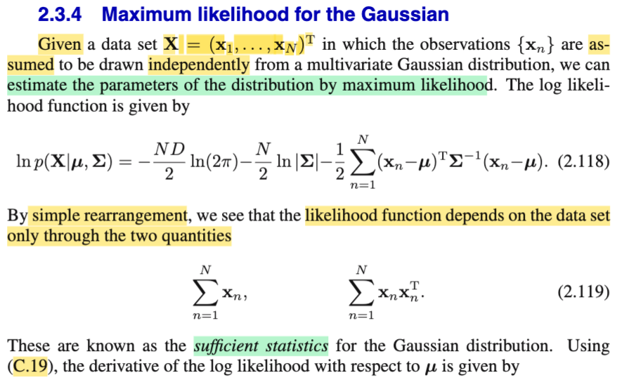
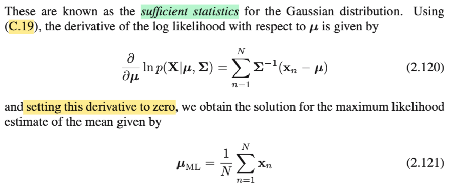
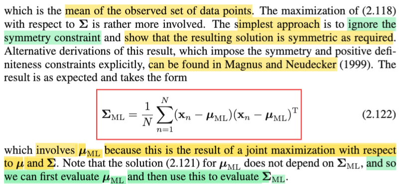
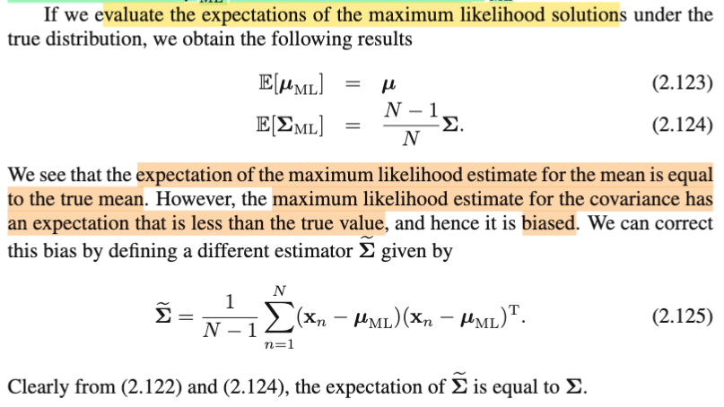

# 2.3.4 Maximum Likelihood for Gaussian

📊 **Progress:** `4` Notes | `4` Screenshots | `2` AI Reviews

---

## 2.3.4 Maximum Likelihood for Gaussian

 

## Ước lượng MLE Normal đa biến

<kbd></kbd>

> [!NOTE]
> Rồi, đại khái là phần này gs nói về việc ta có thể dùng cách tiếp cận MLE để estimate tham số của một population Normal đa biến. Cho **X1** ,**X2**,....**XN** là các random variable **VECTOR**, được sample từ Normal(**μ**, **Σ**), và giả định rằng chúng độc lập ⇨ tức đây là một random sample size N iid (mutually independent, identically distributed).
>
>
>
> Review cực nhanh về MLE, đã học trong Casella: Nói ngắn gọn, trong Casella, chap 6, ta học bài toán inference: Point estimation, trong đó, với random sample size n X1,...Xn (gom thành random vector vector **X**) iid \~ f(**x**|θ), ta muốn xây dựng một hàm số W(**x**), để W(**X**), là một statistic, sao cho với oserved value **x** của **X**, ta có một giá trị estimate cho θ. Thế thì, làm sao để tìm W(**x**) cho ra estimate tốt, thì một cách tiếp cận đó là (trong sách Casella nói về 3 cách: Method of moment, MLE, và Bayes estimator) MLE: Dùng cái hàm sau đây: W_mle(**X**) = argmax\_θ L(θ|**x**), với L(θ|**x**) là likelihood function, được định nghĩa bằng (mang giá trị bằng) f(**x**|θ), và mang ý nghĩa là với input θ, L(θ|**x**) sẽ là độ hợp lí của θ đó giúp giải thích cho việc ta quan sát thấy **X** = **x**. Và ý nghĩa của argmax\_..là, ta giải bài toán tối ưu: maximize\_θ L(θ|**x**), tìm cái θ khíến có likelihood cao nhất, thì đó chính là maximum likelihood estimator cho θ, kí hiệu W_mle(**X**) hay θ^mle(**X**) đều được. Và thường ta sẽ chuyển thành bài toán tương đương: maximize log của hàm L(θ|**x**), vì hàm log monotone increasing, nên giải ra θ\* khiến log L lớn nhất thì cũng là cái khiến L lớn nhất.
>
>
>
> Vậy thì quay lại đây, cũng y chang vậy. ta có random sample size N, mà mỗi sample là một D-dimensional RANDOM VECTOR **Xi** i=1,...N. Thành ra cả bộ random sample được thể hiện bởi một **MATRIX**: Tới đây mình có lẽ hiểu vì sao ông Bishop không theo quy ước của toán thống kê thông thường đó là viết hoa cho tên biến, viết thường (lowercase) cho giá trị biến (dù vẫn viết đậm với vector, viết nét thường với với giá trị biến), là vì ổng để dành chữ **X** hoa cho matrix.
>
>
>
> Còn mình, vì theo cách kí hiệu chuẩn toán trong Casella, Stat110, trong đó viết **X** thì hiểu là vector, dẫn đến giờ muốn viết matrix X chứa các random vector **X1**, **X2**,....thì buộc phải mượn một font chữ khác, phải chú thích (hoặc tự hiểu).
>
>
>
> Ok, vậy quay lại đây, ta có **X là matrix có các hàng là các random vector X1,X2,...XN**, là một random sample iid, \~ Normal(**μ**, **Σ**).
>
>
>
> Vậy thì tương ứng với lí thuyết, ta tìm θ^mle(X) là ml estimator của θ, thì ở đây, θ chú ý, là bao gồm cả **μ** và **Σ**, nên phải viết là: ta sẽ đi tìm (**μ**, **Σ**)^\_mle, là ml estimator của (**μ**, **Σ**).
>
>
>
> Và do đó, ta sẽ giải bài toán: maximize\_(**μ**, **Σ**) L((**μ**, **Σ**)|**x**) với **x**, là observed value của matrix **X** nói trên.
>
>
>
> Thế thì, đầu tiên phải xây dựng hàm likelihood L((**μ**, **Σ**)|**x**): Theo định nghĩa đã ôn lại vừa nãy,
>
> vì dễ sai nên cần nói lại:
>
>
>
> Với random sample là vector **X**, tạo bởi các single variable X1,...Xn độc lập, có chung distribution với pdf f(x|θ), khi đó joint pdf của X1,...Xn (cũng là pdf của random vector **X**) là, f(**x**|θ). Và định nghĩa của likelihood là: L(θ|**x**) = f(**x**|θ), tức là joint pdf của mọi random sample, tại observed value **x** của **X**, và vì tính iid, nên joint pdf f(**x**|θ) tách thành Πi=1:n f(**xi**|θ), nên bài toán tìm mle lúc này là: maximize\_θ Πi=1:n f(**xi**|θ)
>
>
>
> Nhưng ở đây, mỗi một sample trong N sample, là một random vector (**X1**,...**XN** đều là random vector) có pdf là f(**x**|**μ**, **Σ**). Thì gom chúng lại, ta có random sample là **matrix X**, và joint pdf của chúng, ta phải kí hiệu là f(**matrix x** | **μ**, **Σ**) để phân biệt với f(**x**|**μ**, **Σ**), nhưng vì tính iid, ta cũng tách nó thành tích các marginal pdf: f(**matrix x** | **μ**, **Σ**) = Πi=1:N f(**xi**|**μ**, **Σ**)
>
>
>
> và L((**μ**, **Σ**)|**x**), độ hợp lí của (**μ**, **Σ**) khi quan sát thấy **matrix** **X** = **matrix** **x**, sẽ được define bởi giá trị của joint pdf của random sample trong trường hợp matrix **X** tại **x**: f(**matrix** **x**|(**μ**, **Σ**)) = Πi=1:N f(**xi**|**μ**, **Σ**).
>
>
>
> Vậy bài toán tối ưu cần giải: maximize\_(over (**μ**, **Σ**)) {Πi=1:N f(**xi**|**μ**, **Σ**)} (1)
>
>
>
> với Normal(**μ**, **Σ**), pdf, như đã biết (cái công thức dài thòng):
>
>
>
> f(**x**|(**μ**, **Σ**)) = \[1/(2π)^(D/2)\] \[1/|**Σ**|^1/2\] exp\[-1/2(**x**-**μ**)T **Σ**inv(**x**-**μ**)\]
>
>
>
> ⇨  f(**xi**|(**μ**, **Σ**)) = \[1/(2π)^(D/2)\] \[1/|**Σ**|^1/2\] exp\[-1/2(**xi**-**μ**)T **Σ**inv(**xi**-**μ**)\]
>
>
>
> Thay vào (1) ta có:
>
>
>
> maximize\_(over (**μ**, **Σ**)) {Πi=1:N \[1/(2π)^(D/2)\] \[1/|**Σ**|^1/2\] exp\[-1/2(**xi**-**μ**)T **Σ**inv(**xi**-**μ**)\]}
>
>
>
> Chuyển thành bài toán tương đương với hàm log như nói trên:
>
>
>
> maximize\_(over (**μ**, **Σ**)) log {Πi=1:N \[1/(2π)^(D/2)\] \[1/|**Σ**|^1/2\] exp\[-1/2(**xi**-**μ**)T **Σ**inv(**xi**-**μ**)\]} 
>
>
>
> Xét objective, dùng tính chất log(ab) = log(a) + log(b):
>
>
>
> log {Πi=1:N \[1/(2π)^(D/2)\] \[1/|**Σ**|^1/2\] exp\[-1/2(**xi**-**μ**)T **Σ**inv(**xi**-**μ**)\]} 
>
>
>
> = log {Πi=1:N \[1/(2π)^(D/2)\] × Πi=1:N \[1/|**Σ**|^1/2\] × Πi=1:N exp\[-1/2(**xi**-**μ**)T **Σ**inv(**xi**-**μ**)\]} 
>
>
>
> = log {Πi=1:N \[1/(2π)^(D/2)\]} + log {Πi=1:N \[1/|**Σ**|^1/2\]} + log {Πi=1:N exp\[-1/2(**xi**-**μ**)T **Σ**inv(**xi**-**μ**)\]} 
>
>
>
> Term đầu:
>
>
>
> log {Πi=1:N \[1/(2π)^(D/2)\]} = Σi=1:N {log \[(2π)^(-D/2)\]}
>
>
>
> = Σi=1:N {(-D/2)log (2π)}
>
>
>
> = (-ND/2) log (2π)
>
>
>
> Term thuần túy là constant, tí nữa ta sẽ không care (hay nói cách khác, chuyển thành bài toán tương đương lần nữa bằng cách bỏ đi constant).
>
>
>
> Term thứ 2: log {Πi=1:N \[1/|**Σ**|^1/2\]}
>
>
>
> = log {Πi=1:N \[1/|**Σ**|^1/2\]}
>
>
>
> = Σi=1:N { log \[1/|**Σ**|^1/2\]}
>
>
>
> = Σi=1:N { log \[|**Σ**|^-1/2\]}
>
>
>
> = Σi=1:N { -1/2 log |**Σ**|}
>
>
>
> = -(N/2) log |**Σ**|
>
>
>
> Term thứ ba: log {Πi=1:N exp\[-1/2(**xi**-**μ**)T **Σ**inv(**xi**-**μ**)\]} 
>
>
>
> = Σi=1:N {log exp\[-1/2(**xi**-**μ**)T **Σ**inv(**xi**-**μ**)\]} 
>
>
>
> = Σi=1:N {-1/2(**xi**-**μ**)T **Σ**inv(**xi**-**μ**)} 
>
>
>
> = -(1/2) Σi=1:N {(**xi**-**μ**)T **Σ**inv(**xi**-**μ**)} 
>
>
>
> = -(1/2) Σi=1:N {(**xi**-**μ**)T **Σ**inv(**xi**-**μ**)} 
>
>
>
> Thay vào, ta có:
>
>
>
> maximize\_(over (**μ**, **Σ**)) {(-ND/2) log (2π) -(N/2) log |**Σ**|-(1/2) Σi=1:N {(**xi**-**μ**)T **Σ**inv(**xi**-**μ**)}  → objective này chính là công thức 2.118
>
>
>
> Ta sẽ chuyển sang bài toán tương đương bằng cách bỏ đi constant:
>
>
>
> maximize\_(over (**μ**, **Σ**)) {-(N/2) log |**Σ**| -(1/2) Σi=1:N {(**xi**-**μ**)T **Σ**inv(**xi**-**μ**)}
>
>
>
> Biến đổi sắp xếp tiếp cái cục Σi=1:N {(**xi**-**μ**)T **Σ**inv(**xi**-**μ**)}:
>
>
>
> = Σi=1:N {**xi**T**Σ**inv**xi** - **μ**T**Σ**inv**xi** - **xi**T**Σ**inv**μ** + **μ**T**Σ**inv**μ**}
>
>
>
> = Σi=1:N {**xi**T**Σ**inv**xi** - 2**μ**T**Σ**inv**xi** + **μ**T**Σ**inv**μ**}
>
>
>
> = Σi=1:N {**xi**T**Σ**inv**xi**} - Σi=1:N{2**μ**T**Σ**inv**xi**} + Σi=1:N{**μ**T**Σ**inv**μ**}
>
>
>
> = Σi=1:N {**xi**T**Σ**inv**xi**} - 2**μ**T**Σ**invΣi=1:N{**xi**} + Σi=1:N{**μ**T**Σ**inv**μ**}
>
>
>
> ⇨ -(1/2) Σi=1:N {(**xi**-**μ**)T **Σ**inv(**xi**-**μ**)}
>
>
>
> = -(1/2) Σi=1:N {**xi**T**Σ**inv**xi**} + **μ**T**Σ**invΣi=1:N{**xi**} -(1/2) Σi=1:N{**μ**T**Σ**inv**μ**}
>
>
>
> Thay vào, bài toán trở thành:
>
>
>
> maximize\_(over (**μ**, **Σ**)) {-(N/2) log |**Σ**| -(1/2) Σi=1:N {**xi**T**Σ**inv**xi**} + **μ**T**Σ**inv Σi=1:N{**xi**} -(1/2) Σi=1:N{**μ**T**Σ**inv**μ**
>
>
>
> Tới đây, ta có thể làm rõ vì sao gs Bishop nói: "**we see that the likelihood function depends on the data set only through the two quantities** Σn=1:N **x**n, và Σn=1:N **x**n**x**nT", là vì:
>
>
>
> nhìn vào những chỗ có x: term thứ hai: -(1/2) Σi=1:N {**xi**T**Σ**inv**xi**}, thì bỏ qua cái -1/2, thì cái tổng chính là gì? Nhờ MIT 18.06 ta sẽ xem nó là cái gì:
>
>
>
> Đầu tiên, **xi**, nên nhắc lại, là giá trị của vector **Xi**, chủ yếu muốn nhấn mạnh đây là vector. Do đó **xi**T**Σ**inv**xi** là quadratic form của **Σ**inv, và nó là một scalar. Với scalar a ta sẽ dùng tính chất: a = tr(a) (trace a):
>
>
>
> **xi**T**Σ**inv**xi** = tr(**xi**T**Σ**inv**xi**)
>
>
>
> Dùng tính chất cyclid của trace: tr(AB) = tr(BA)
>
>
>
> ..= tr(**Σ**inv**xixi**T)
>
>
>
> ⇨ Σi=1:N {**xi**T**Σ**inv**xi**} = Σi=1:N { tr(**Σ**inv**xixi**T) }
>
>
>
> Dùng tính linearity của trace:
>
>
>
> .. = tr(Σi=1:N {**Σ**inv**xixi**T})
>
>
>
> Đặt thừa số chung (matrix **Σ**inv)
>
>
>
> = tr(**Σ**inv Σi=1:N{**xixi**T})
>
>
>
> Vậy ở đây, thay vào lại hàm objective, ta có bài toán là:
>
>
>
> maximize\_(over (**μ**, **Σ**)) {-(N/2) log |**Σ**| -(1/2) tr(**Σ**inv Σi=1:N{**xixi**T}) + **μ**T**Σ**inv Σi=1:N{**xi**} -(1/2) Σi=1:N{**μ**T**Σ**inv**μ**
>
>
>
> Như vậy rõ ràng objective, (log likelihood) phụ thuộc vào các vector xi ở:  cụm Σi=1:N{**xixi**T} và cụm Σi=1:N{**xi**} → đây chính là điều gs nói ở 2.119
>
>
>
> Có thể biến đổi thêm thêm tí ở cái term thứ 3: nhận ra Σi=1:N{**xixi**T}, là tổng của các rank 1 matrix, theo góc nhìn thứ 4 của việc nhân hai matrix, đây chính là tích của hai matrix: matrix thứ nhất có các cột là các vector **xi** (có thể thấy, đây chính là \[**matrix X**\]T) và matrix thứ hai có các hàng là các vector **xiT** (đây chính là \[**matrix X**\]).
>
>
>
> Vậy tr(**Σ**inv Σi=1:N{**xixi**T}) = tr(**Σ**inv \[**matrix X**\]T\[**matrix X**\]}), đặt matrix **G** là \[**matrix X**\]T\[**matrix X**\], G mình cố tình chọn, là vì ta còn nhớ trong MIT 1806, matrix ATA (A transposed nhân A) có tên gọi là Gram matrix. Thì cái cụm này là tr(**Σ**inv **G**).
>
>
>
> ---
>
>
>
> Tiếp ông nói, chúng chính là **sufficient statistic** của Gaussian distribution.
>
>
>
> Vì sao? Dựa vào việc đã học Casella, mình có thể hiểu ý này. Còn nhớ, trong chap 6 của Casella, sufficient statistic được định nghĩa statistic mà giá trị của nó đã phản ánh đủ thông tin giúp suy luận ra θ chứa trong **X** rồi, nói nôm na là, khi đã biết **T**=**t**, thì dù không biết **X** bằng bao nhiêu, ta vẫn có đủ thông tin để suy luận ra θ, y như việc biết **X**=**x** . Và có một theorem giúp tìm ra sufficient statistic đó là Factorization theorem, nói rằng, nếu pdf f(**x**|θ) có thể được tách thành tích của g(T(**x**)|θ) h(**x**), tức là một hàm phụ thuộc **x** không phụ thuộc θ, và một hàm phụ thuộc cả **x** và θ nhưng chỉ phụ thuộc **x** thông qua hàm T(**x**), thì khi đó, T(**X**) chính là một sufficient statistic.
>
>
>
>  Vậy thì ở đây, nên nhớ cái ta đang có là log likelihood:
>
>
>
> = -(N/2) log |**Σ**| -(1/2) tr(**Σ**inv Σi=1:N{**xixi**T}) + **μ**T**Σ**inv Σi=1:N{**xi**} -(1/2) Σi=1:N{**μ**T**Σ**inv**μ**
>
>
>
> Đặt T1(**x1,..xN**) = Σi=1:N{**xixi**T, và T2(**x1,..xN**) = Σi=1:N{**xi**}, thì có thể thấy log likelihood hiện tại nó có dạng g1(**Σ**) + g2(T1(**x1,..xN**), **Σ**) + g3( **μ**, T2(**x1,..xN**))
>
>
>
> Và do đó bỏ log, để có lại hàm likelihood, ta có dạng g1(**Σ**) × g2(T1(**x1,..xN**), **Σ**) × g3( **μ**, T2(**x1,..xN**)), và có thể coi nó là hàm g(T1,T2,**μ**,**Σ**).
>
>
>
> Để rồi, nếu coi h(**x1**,**x2**,...) = 1, thì joint pdf của **X**1,..**X**N, cũng là likelihood, chính là tích của g(T1,T2,**μ**,**Σ**)h(**x1**,**x2**,...), và theo factorization theorem, vector T(**x1,..xN**) = (T1(**x1,..xN**), T2(**x1,..xN**)) **CHÍNH LÀ SUFFICIENT STATISTIC.**
>
>
>
> ---

> [!TIP]
> **🤖 AI Feedback** — ✅ Score: **98/100**
>
> Bài ghi chép cực kỳ chi tiết, chính xác và có chiều sâu, đặc biệt trong việc giải thích lý thuyết MLE, dẫn giải công thức log-likelihood và chứng minh tính đủ của các thống kê bằng định lý Factorization. Độ dài của ghi chú có thể quá chi tiết cho một lần ôn tập nhanh, tuy nhiên, điều này thể hiện sự hiểu biết sâu sắc và kỹ lưỡng.

 

### Ước lượng trung bình Max Likelihood

<kbd></kbd>

> [!NOTE]
> Rồi, qua đây, vẫn phải nhớ là ta đang giải bài toán maximium likelihood
>
>
>
> maximize\_(over (**μ**, **Σ**)) {-(N/2) log |**Σ**| -(1/2) tr(**Σ**inv Σi=1:N{**xixi**T}) + **μ**T**Σ**inv Σi=1:N{**xi**} -(1/2) Σi=1:N{**μ**T**Σ**inv**μ**}
>
>
>
> thay cái cụm thứ 2 bởi dạng thể hiện với matrix Gram cho gọn tr(**Σ**inv **G**)
>
>
>
> maximize\_(over (**μ**, **Σ**)) {-(N/2) log |**Σ**| -(1/2) tr(**Σ**inv **G**) + **μ**T**Σ**inv Σi=1:N{**xi**}
>
>
>
> maximize\_(over (**μ**, **Σ**)) {-(N/2) log |**Σ**| -(1/2) tr(**Σ**inv **G**) + **μ**T**Σ**inv Σi=1:N{**xi**} -(1/2) Σi=1:N{**μ**T**Σ**inv**μ**}
>
>
>
> Trước khi giải, đầu tiên mình sẽ hiểu thế này, bài toán này có hai biến tối ưu, là **μ** và **Σ**, thì trong ee364a đã học, rằng, inf_x,y f(x,y) = inf_x {inf_y f(x,y)} tức làvới bài toán tối ưu có hai biến x, y, ta có thể giải lần lượt từng biến: giữ y fixed, tìm x\*, sau đó tìm y\*.
>
>
>
> Vậy ở đây cũng vậy, ta sẽ giữ **Σ** fix, giải tìm **μ\*** trước, sau đó giải tìm **Σ\***.
>
>
>
> Dùng điều kiện tối ưu cần bậc nhất: gradient ∇\_**μ** \[objective\] = 0 (tức đạo hàm bậc nhất của hàm mục tiêu đối với **μ**, = 0).
>
>
>
> ∇\_**μ** \[objective\], = ∇\_**μ** \[{-(N/2) log |**Σ**| -(1/2) tr(**Σ**inv **G**) + **μ**T**Σ**inv Σi=1:N{**xi**} -(1/2) Σi=1:N{**μ**T**Σ**inv**μ**}}
>
>
>
> = ∇\_**μ** \[**μ**T**Σ**inv Σi=1:N{**xi**} - (1/2) Σi=1:N{**μ**T**Σ**inv**μ**}\] (hai term đầu ko dính tới **μ**, nên đạo hàm = 0)
>
>
>
> = ∇\_**μ** \[**μ**T**Σ**inv Σi=1:N{**xi**} - (1/2) Σi=1:N{**μ**T**Σ**inv**μ**}\]
>
>
>
> Nguyên cục **Σ**inv Σi=1:N{**xi**} này, thật ra chỉ là một vector, đặt là **u**, thì **μ**T**Σ**inv Σi=1:N{**xi**} = **μ**T**u** ⇨ đạo hàm đối với **μ** của **μ**T**u**, dễ thấy, chính là = **u**.
>
>
>
> Còn cục thứ hai: -(1/2) Σi=1:N {**μ**T**Σ**inv**μ**} = -(N/2) **μ**T**Σ**inv**μ**, đạo hàm theo **μ** chính là -N **Σ**inv **μ**
>
>
>
> (nhờ MIT 18s096, với f(x) = xTPx + qTx với P đối xứng mình nhớ ∇f(x) = (1/2) Px + q, cũng ko khó để derive)
>
>
>
> Vậy, ∇\_**μ** \[objective\] = **Σ**inv Σi=1:N{**xi**} - N **Σ**inv **μ**
>
>
>
> = **Σ**inv Σi=1:N{**xi**} - **Σ**inv Σi=1:N{**μ**}
>
>
>
> = **Σ**inv Σi=1:N{**xi** - **μ**} → Chính là kết quả 2.120 trong sách:
>
>
>
> (Trong sách gs Bishop kí hiệu là ∂/∂**μ** ln likelihood, cũng là đạo hàm hàm objective theo **μ** thôi.)
>
>
>
> Và như vậy, ∇\_**μ** \[objective\] = 0 ⇔ **Σ**inv Σi=1:N{**xi** - **μ**} = 0
>
>
>
> ⇔ Σi=1:N{**xi** - **μ**} = 0
>
>
>
> ⇔ Σi=1:N{**xi**} = Σi=1:N{**μ**}
>
>
>
> ⇔ Σi=1:N{**xi**} = N**μ**
>
>
>
> ⇔ Σi=1:N{**xi**}/N = **μ** → 2.121
>
>
>
> Kết luận **μ**\*, cũng là **μ**^\_mle chính là Σi=1:N{**xi**}/N, là **SAMPLE MEAN.**

> [!TIP]
> **🤖 AI Feedback** — ✅ Score: **100/100**
>
> Bài giải cực kỳ chi tiết và chính xác, từng bước đạo hàm ma trận được giải thích rõ ràng và hoàn toàn khớp với các phương trình trong hình ảnh. Cách tiếp cận tối ưu hóa tuần tự cho nhiều biến cũng rất hợp lý và sâu sắc.

 

#### Tối ưu ma trận Σ^mle

<kbd></kbd>

> [!NOTE]
> Tiếp, sau khi có μ^mle, ta sẽ giải tiếp bài toán tối ưu tìm **Σ**^mle, gs không giải ở đây mà chỉ đưa công thức, và cách này cũng phức tạp vì đây là bài toán mà biến tối ưu lại là một matrix, nên mình sẽ tạm chấp nhận kết quả này.

 

##### Tính chệch của ước lượng MLE

<kbd></kbd>

> [!NOTE]
> Cuối cùng, là một cái mà mình đã biết từ Casella, đó là, với một estimator W(**X**) nào đó của θ, thì Bias(W(**X**)) được define bởi E\_θ\[W(**X**) - θ\], theo tính linearity, = E\_θ\[W(**X**)\] - θ, để rồi, nếu bias = 0, thì ta có một unbiased estimator của θ.
>
>
>
> Còn nhớ, trong Casella, mình cũng đã thấy, sample mean Xbar = (Σi Xi)/n là unbiased estimator của population mean, còn sample variance S^2 = (1/n) Σi (Xi-EX)^2 lại là biased estimator của population variance σ^2.
>
>
>
> Ở đây, ta gặp lại cái vụ này:
>
>
>
> E\[**μ**^ml\] = E\[(Σi **Xi**) / N\], theo linearity, = Σi E\[**Xi**\] / N = Σi **μ** / N = N **μ** / N = **μ**
>
>
>
> → Bias(**μ**^ml) = **μ** - **μ** = 0 → **μ**^ml là unbiased estimator của **μ**.
>
>
>
> Còn E\[**Σ**^ml\] = E\[(1/N) Σi=1:N (**Xi** - **μ**^ml)(**Xi** - **μ**^ml)T\]
>
>
>
> = (1/N) Σi=1:N E\[(**Xi** - **μ**^ml)(**Xi** - **μ**^ml)T\] (dùng tính linearity của kì vọng)
>
>
>
> = (1/N) Σi=1:N E\[(**Xi** - **μ** + **μ** - **μ**^ml)(**Xi** - **μ** + **μ** - **μ**^ml)T\]
>
>
>
> = (1/N) Σi=1:N E{\[(**Xi** - **μ**) + (**μ** - **μ**^ml)\]\[(**Xi** - **μ**) + (**μ** - **μ**^ml)\]T}
>
>
>
> = (1/N) Σi=1:N E{\[(**Xi** - **μ**) + (**μ** - **μ**^ml)\]\[(**Xi** - **μ**)T + (**μ** - **μ**^ml)T\]}
>
>
>
> = (1/N) Σi=1:N E\[(**Xi** - **μ**)(**Xi** - **μ**)T + (**μ** - **μ**^ml)(**Xi** - **μ**)T + (**Xi** - **μ**)(**μ** - **μ**^ml)T + (**μ** - **μ**^ml)(**μ** - **μ**^ml)T\]
>
>
>
> = (1/N) Σi E\[(**Xi** - **μ**)(**Xi** - **μ**)T\] +
>
>
>
> (1/N) Σi E\[(**μ** - **μ**^ml)(**Xi** - **μ**)T\] +
>
>
>
> (1/N) Σi E\[(**Xi** - **μ**)(**μ** - **μ**^ml)T\] +
>
>
>
> (1/N) Σi E\[(**μ** - **μ**^ml)(**μ** - **μ**^ml)T\]
>
>
>
>  Xét term thứ 2: (1/N) Σi E\[(**μ** - **μ**^ml)(**Xi** - **μ**)T\]
>
>
>
> = (1/N) E\[Σi (**μ** - **μ**^ml)(**Xi** - **μ**)T\]
>
>
>
> = (1/N) E\[(**μ** - **μ**^ml) Σi (**Xi** - **μ**)T\]
>
>
>
> = E\[(**μ** - **μ**^ml) ((1/N)Σi **Xi** - **μ**)T\] 
>
>
>
> = E\[(**μ** - **μ**^ml) (**μ**^ml - **μ**)T\] 
>
>
>
> Xét term thứ 3 (1/N) Σi E\[(**Xi** - **μ**)(**μ** - **μ**^ml)T\]
>
>
>
> tương tự, sẽ ra - E\[(**μ** - **μ**^ml) (**μ**^ml - **μ**)T\]
>
>
>
> Do đó chỉ còn (1/N) Σi E\[(**Xi** - **μ**)(**Xi** - **μ**)T\] + (1/N) Σi E\[(**μ** - **μ**^ml)(**μ** - **μ**^ml)T\]
>
>
>
> Và cái đầu chính là **Σ**, cái sau chính là **Σ**/N
>
>
>
> ⇨ Kết quả là \[(N - 1)/N\] **Σ**, kết quả này khác **Σ**
>
>
>
> do đó đây là một biased estimator của **Σ**.

 

