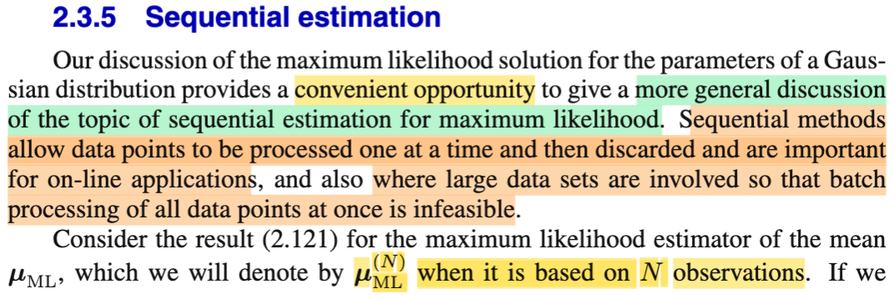
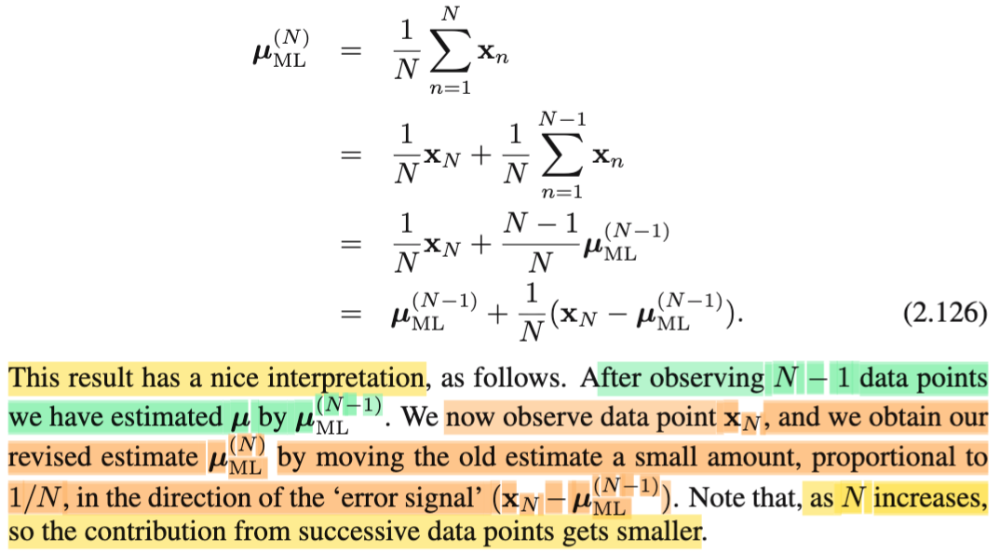
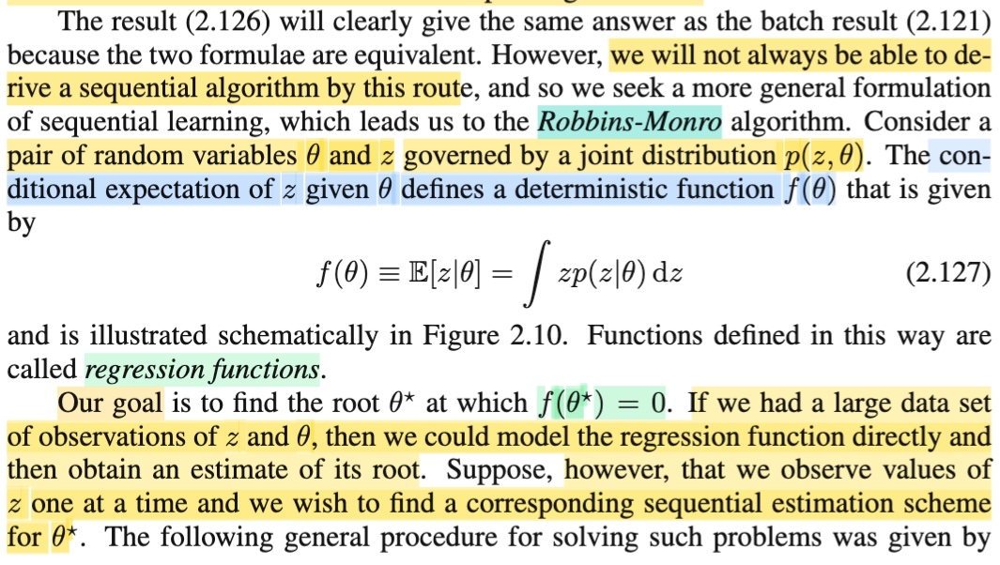
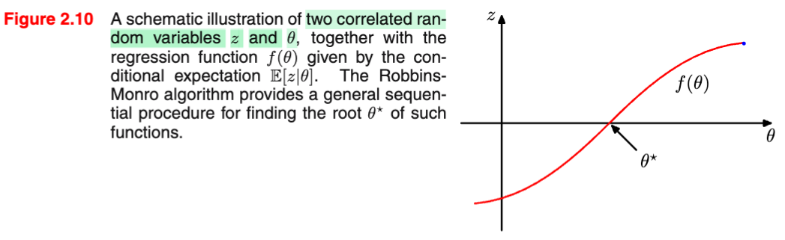
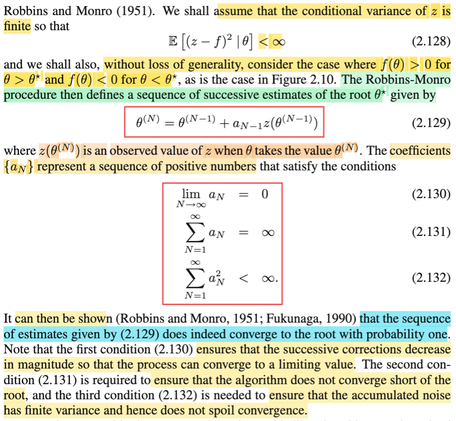
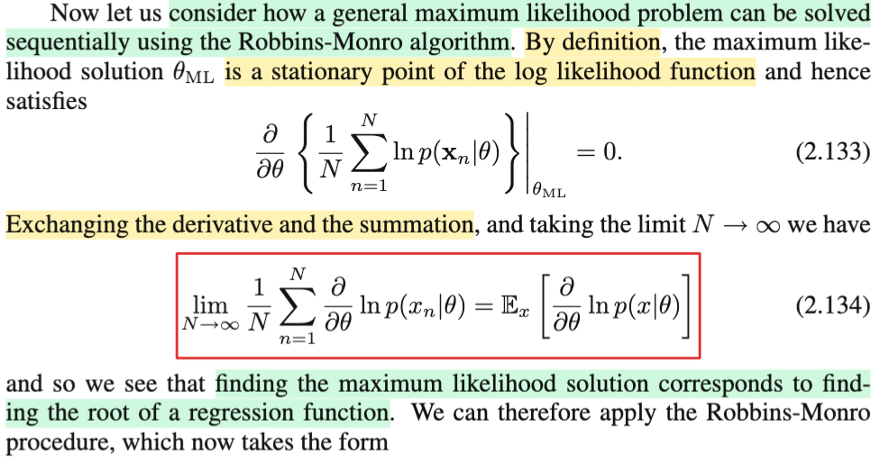
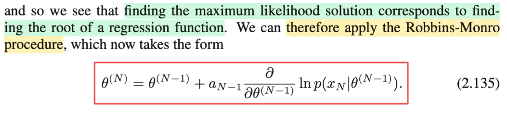
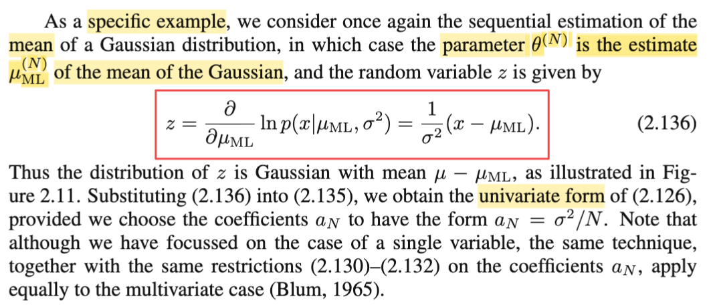

# 2.3.5 Sequential  estimation

📊 **Progress:** `5` Notes | `8` Screenshots | `5` AI Reviews

---

 

## Cập nhật ước lượng ML tuần tự

<kbd></kbd>

<kbd></kbd>

> [!NOTE]
> Phần này, đại ý là, gs cho rằng, việc thảo luận về ml estimation của Gaussian parameter (**μ** và **Σ**) trong phần trước giúp ta tiện thể nói về cái gọi là **sequential estimation for maximum likelihood**, mà ông nói đại khái là cái này sẽ mở ra khả năng cho phép xây dựng một mô hình trong đó nó sẽ đưa ra estimate cho parameter dựa trên từng data point một, giúp cho ta ứng dụng cho những ứng dụng on-line (nơi data xuất hiện liên tục, khác với việc có một cục data cùng một lúc), hoặc cũng giúp ích trong những case mà data lớn, không thể nào xử lí mọi data cùng lúc được.
>
>
>
> Trước tiên ông mượn kết quả **μml**, như đã biết, chính là **Xbar**, = (Σi Xi) / N. Và gọi nó là **μml^(N)**, tức sample mean từ sample size N.
>
>
>
> **μml**^(N) = **xbar** = (Σi=1:N-1 **x**i) + **x**N\] / N
>
>
>
> = (Σi=1:N-1 **x**i) / N + **x**N / N
>
>
>
> = **x**N/N + (Σi=1:N-1 **x**i) / N
>
>
>
> Nhân và chia term thứ hai cho N-1, mục đích để có (Σi=1:N-1 **x**i) / (N-1), chính là **μml**^(N-1), sample mean size N-1
>
>
>
> = **x**N/N + (Σi=1:N-1 **x**i) (N-1) / N (N-1)
>
>
>
> = **x**N/N + \[(N-1) / N\] (Σi=1:N-1 **x**i) / (N-1)
>
>
>
> = **x**N/N + (1 - 1/N) **μml**^(N-1)
>
>
>
> = **x**N/N + **μml**^(N-1) - **μml**^(N-1)/N
>
>
>
> = **μml**^(N-1) + **x**N/N - **μml**^(N-1)/N
>
>
>
> = **μml**^(N-1) + \[**x**N - **μml**^(N-1)\]/N
>
>
>
> Kết quả này, ông nói, cho ta một cách nhìn (interpretation) nhận như sau: với một data point / data sample **x**N mới được quan sát thấy, thì nó giúp cập nhật ml estimate theo hướng của data mới (thể hiện qua việc term thứ hai, có **x**N - **μml**^(N-1), chính là hướng từ estimation point cũ (sample mean size N-1) tới điểm **x**N. Và độ lớn của bước cập nhật, di chuyển này là tỉ lệ với 1/N.
>
>
>
> Như vậy, nếu N tăng lên, thì mức đóng góp của chuỗi các data point sẽ nhỏ lại.

> [!TIP]
> **🤖 AI Feedback** — ✅ Score: **95/100**
>
> Phân tích rất chính xác và chi tiết từng bước, từ động cơ của ước lượng tuần tự đến việc diễn giải công thức cập nhật μ_ML^(N). Tuy nhiên, cách trình bày các bước đạo hàm hơi dài dòng một chút so với văn bản gốc và bạn có thể nhấn mạnh hơn thuật ngữ "tín hiệu lỗi" (error signal).

 

### Kì vọng có điều kiện và Hồi quy

<kbd></kbd>

> [!NOTE]
> Phần này giải thích rằng cách tiếp cận được mô tả ở ghi chú trước không phải lúc nào cũng dẫn đến một thuật toán khả thi, hay không phải lúc nào cũng có thể thực hiện được. Do đó, tác giả sẽ đề cập đến một cách tiếp cận khái quát hơn, đó là thuật toán Robin-Monroe.
>
>
>
> Trong bối cảnh này, chúng ta **xét hai biến ngẫu nhiên là θ và Z**, với **phân phối đồng thời là f(z, θ)**.
>
>
>
> Tiếp tục, ta sẽ xem xét kỳ vọng của Z dựa trên θ đã biết, ta có một hàm theo θ: E\[Z|θ\].
>
>
>
> Từ stat110 đã học về kì vọng, có bản chất chỉ là weight average các possible value của random variable với weight là xác suất tương ứng. Với biến rời rạc (ví dụ X có các possible value x1,x2,... thì EX = Σi xiP(X=xi)) còn với biến liên tục có pdf f(x) thì EX = ∫xf(x)dx.
>
>
>
> Thế thì với conditional expectation E\[X|y\], đơn giản cũng chỉ là y chang vậy, chỉ khác là ta sẽ dùng phân phối của X khi đã biết Y=y tức f(x|y) thay vì marginal pdf f(x): E\[X|y\] = ∫xf(x|y)dx. Và với việc Y là random variable, thì cái này cũng là sẽ phụ thuộc giá trị cụ thể của Y, nói cách khác, nó là hàm theo Y, và cũng chính là E\[X|Y\] là một random variable có dạng g(Y) với g(y) = ∫xf(x|y)dx.
>
>
>
> Vậy thì ở đây, E\[Z|θ\] = ∫zfZ(z|θ)dz, và cũng y như vừa nói ở trên, rằng E\[X|y\] là hàm theo y, thì E\[Z|θ\] là hàm theo θ, đặt là f(θ), và người ta gọi cái hàm này là regression function.
>
>
>
> Chú ý tạm hiểu là gs Bishop chỉ đang nói về một thuật toán thuần túy toán học, ta chưa hiểu sẽ áp dụng, hay mục đích để làm gì. Cũng vì vậy, tạm thời chấp nhận rằng, mục tiêu là đi tìm nghiệm của phương trình f(θ) = 0.
>
>
>
> Thế thì, ông nói, nếu ta có nhiều observed value của θ, và Z thì ta có thể mô hình hóa hàm regression một cách trực tiếp để sau đó ta estimate root của nó. Tức là sao?
>
>
>
> Hiểu nôm na là, nếu ta có nhiều data của Z và θ, thì mình sẽ mô phỏng lại "hình dạng" hành vi của hàm f(θ), từ đó tìm / estimate điểm θ khiến f(θ) = 0. Mô phỏng ở đây mình cứ hiểu là thế này: hàm f(θ) nhất định phải có dạng sao đó, ví dụ như hàm f(θ) = θ^2 thì nó có hình dạng parabol, đáy (root) tại θ = 0, kiểu kiểu vậy. Và giả sử như ta biết nó có dạng a θ^2 + b θ + c, thì bằng cách thu thập các điểm (θ, f(θ)) thì ta có thể giải tìm các hệ số, để từ đó có được phương trình chính xác của f(θ), khi đó có thể giải chính xác θ nào khiến f(θ) = 0. Thì ở đây cũng vậy, f(θ) = E\[Z|θ\] cũng sẽ là một phương trình có công thức nào đó. Như vậy nếu ta có nhiều cặp data (θ, f(θ)) thì đại khái là cũng có thể dùng thông tin đó để mô phỏng lại hàm f(θ), để rồi tìm root.
>
>
>
> Nhưng vấn đề là observed data lại không có một cục cùng lúc, mà lại chỉ có thêm từng cái từng cái một (one at a time). Do đó cách tiếp cận Robbins-Monro sẽ giúp ta trong nhiệm vụ này (giải tìm root: f(θ) = 0).

> [!TIP]
> **🤖 AI Feedback** — ✅ Score: **98/100**
>
> Ghi chú của bạn rất chính xác và có chiều sâu vượt trội, giải thích rõ ràng từng khái niệm và mối liên hệ giữa chúng. Bạn đã kết nối kiến thức một cách xuất sắc, làm nổi bật sự cần thiết của thuật toán Robbins-Monro trong học tuần tự.

 

#### Hiểu về Phương sai Có điều kiện

<kbd></kbd>

<kbd></kbd>

> [!NOTE]
> Trước khi nói về thuật toán của Robbins - Monroe, đầu tiên phải giả định là varance của Z: Var(Z|θ) finite.
>
>
>
> Nếu thấy khó hiểu về conditional variance thì cũng dễ thôi: chỉ cần xuất xứ từ định nghĩa của variance: Ví dụ với random variable X, Var(X) = E\[(X-EX)^2\], và ta nên nhớ, (X-EX)^2, biểu hiện một hàm số áp lên X, là cái hàm sau đây: g(x) = \[x - EX\]^2 (EX là một contant nào đó). Như vậy (X-EX)^2 có bản chất chỉ là g(X), là áp hàm g lên X, theo gs Joe luôn nhấn mạnh trong Stat110, khi áp hàm số lên random variable thì ta có một random variable, do đó và Var(X) thật ra chính là kì vọng của cái random variable g(X) này: E\[g(X)\] = E\[(X-EX)^2\].
>
>
>
> Để rồi, LOTUS, nói rằng, thay vì mày phải đi tìm pdf (hàm h(g) nào đó) của g(X), để tính Eg(X) theo định nghĩa: Eg(X) = ∫gh(g)dg, thì nó cho phép ta cứ dùng pdf f(x) của xX: E\[g(X)\] = ∫g(x)f(x)dx
>
>
>
> = ∫(x-EX)f(x)dx
>
>
>
> = ∫(x-∫xf(x)dx) f(x)dx
>
>
>
> Tóm lại tuy biết công thức là Var(X) = E\[(X-EX)^2\], nhưng ta hiểu bản chất của nó là kì vọng của biến ngẫu nhiên g(X), và khi tính, ta sẽ dùng pdf của X, f(x) để tính. 
>
>
>
> Và nói dài dòng vậy để giúp hiểu cái condition variance là gì. Đơn giản, Var(X|y), chính là kì vọng của random variable g(X), nhưng lần này, distribution của nó, phải là distribution conditioned on Y=y. Tức là, nếu tính theo định nghĩa, ta sẽ đi tìm pdf của g(X) condition Y=y, ví dụ h(g|Y=y) nào đó, rồi tính E\[g(X)|Y=y\] = ∫gh(g|y)dg. Nhưng một lần nữa lotus cho phép ta dùng conditional pdf on Y=y của X, để tính.
>
>
>
> tính E\[g(X)|Y=y\] = ∫g(x)f(x|y)dx
>
>
>
> = ∫(x - E\[X|y\])^2 f(x|y)dx
>
>
>
> = ∫(x - ∫xf(x|y)^2dx) f(x|y)dx
>
>
>
> Nói tóm lại, Var(X) là kì vọng của biến g(X) = (X-EX)^2, được tính dựa theo marginal pdf của X: f(x)
>
>
>
> Còn Var(X|Y) là kì vọng của biến g(X) = (X - E(X|Y))^2, được tính dựa thep conditional pdf của X: f(x|y)
>
>
>
> Như vậy, cũng giúp ta hiểu Var\[Z|θ\] = E\[(Z - E\[Z|θ\])^2\] = E\[(Z - f)^2\]
>
>
>
> Và giả định ở đây là cái này mang giá trị hữu hạn.
>
>
>
> ---
>
>
>
> Vậy thì Robbins-Monroe cho một quy trình để định ra một chuỗi các estimate của θ\* như sau:
>
>
>
> θ^(N) = θ^(N-1) + a_N-1 z(θ^(N-1))
>
>
>
> Cần hiểu đây là kí hiệu của chuỗi số, ko có lũy thừa gì cả.Nói bằng lời đó là, quy trình sẽ sinh ra chuỗi θ1, θ2,....theo cách thức θ2 = θ1 + a1 × z(θ1) với a1 là cons số nào đó, và z(θ1) là gía trị quan sát của Z khi θ đang có gía trị θ1. Như vậy tương tự, khi θ đang đã được cập nhật bằng θ2, ta quan sát thấy z = z(θ2), thì dùng một hệ số a2 nào đó, ta sẽ tính θ3, cứ thế...
>
>
>
> Như vậy cùng với chuỗi {θ}, ta sẽ có bộ hệ số {a1, a2,....} và Robbins-Monroes quy định nó phải thỏa các tính chất 2.130/1/2, để đảm bảo một số tính chất hội tụ (chưa hiểu lắm)

> [!TIP]
> **🤖 AI Feedback** — ✅ Score: **95/100**
>
> Ghi chú của bạn thể hiện sự hiểu biết sâu sắc, đặc biệt là phần giải thích chi tiết về phương sai có điều kiện và cách liên hệ với các định nghĩa cơ bản cùng định lý LOTUS. Cách bạn làm rõ ký hiệu lũy thừa trong công thức thuật toán cũng rất tốt. Để ghi chú hoàn thiện hơn, bạn có thể mô tả điều kiện của hàm f(θ) chính xác theo văn bản gốc (f(θ) > 0 khi θ > θ* và f(θ) < 0 khi θ < θ*) thay vì chỉ nói hàm f đồng biến.

 

##### Ứng dụng Robbins-Monro trong MLE

<kbd></kbd>

> [!NOTE]
> Rồi, thế thì ở đây ta mới áp dụng cái Robbins Monroes vào để giải bài toán maximum likelihood estimation đây.
>
>
>
> Thế thì ta đã nói trong phần trước rằng, nói về phương pháp maximum likelihood là ta đang tìm cách ước lượng (estimate) tham số của một population mà các data được lấy từ đó. Cụ thể là với random sample X1,...Xn iid \~ f(x|θ), ta muốn tìm một statistic W(**X**) để estimate cho θ, và một cách tiếp cận, đó là dùng W(**X**) = argmax\_θ L(θ|**x**), với định nghĩa của hàm L(θ|**x**) là = f(**x**|θ), thì W(**X**) = argmax\_θ f(**x**|θ). Và với việc nó là ML estimator của θ, ta kí hiệu θ^ml, hay viết θ^ml(**X**) cũng được để nhớ rằng nó là một statistic - tức một random variable có được bởi việc áp một hàm số lên random sample **X**. Ta có θ^ml(**X**) = argmax\_θ f(**x**|θ).
>
>
>
> Sau đó, ta cũng biết để giải bài toán tối ưu, có thể chuyển bài toán gốc thành các bài toán tương đương bằng các technique khác nhau, ví dụ dùng objective mới là \[một hàm monotone áp lên hàm objective gốc\], hoặc nhân với constant.
>
>
>
> Vậy thì ở đây log là một hàm montone, nên solution của bài toán maximize hàm log (hay ln để thể hiện log base e) likelihood, nhân thêm constant (1/N), thì cũng là solution của bài toán gốc: θ^ml(**X**) = argmax\_θ {(1/N) log L(θ|**x**) = (1/N) log \[f(**x**|θ)\]
>
>
>
> và với việc data, hay random sample thường sẽ có tính iid, nên joint pdf của chúng sẽ có thể tách thành tích các marginal pdf: f(**x**|θ) = Πi=1:N f(**x**i|θ) Dẫn đến ln \[f(**x**|θ)\] = ln \[Πi=1:N f(**x**i|θ)\]. Dùng tính chất hàm log, ta có Σi=1:N ln f(**x**i|θ). Và bài toán tối ưu lúc này là:
>
>
>
> maximize\_θ {(1/N) Σi=1:N ln f(**x**i|θ)}
>
>
>
> Như vậy, đây là bài toán tối ưu ko ràng buộc có objective là (1/N) Σi=1:N ln f(**x**i|θ), thì để giải ta sẽ dùng điều kiện cần tối ưu bậc nhất (first order optimality necessary condition) để tìm stationary point, nơi có gradient vanish:
>
>
>
> ∇{(1/N) Σi=1:N ln f(**x**i|θ)} = 0,
>
>
>
> dĩ nhiên cũng có thể kí hiệu:
>
>
>
> ∂/∂θ {(1/N) Σi=1:N ln f(**x**i|θ)} = 0 → đây là công thức 2.133 trong sách.
>
>
>
> (kí hiệu .. |θml trong sách chỉ đơn giản là, cái ∂/∂θ {(1/N) Σi=1:N ln f(**x**i|θ)}, là hàm số theo θ, và với θ = θml, thì giá trị của hàm số này phải bằng 0)
>
>
>
> Tất nhiên, (1/N) Σi=1:N ln f(**x**i|θ) là tổng của N hàm, áp dụng đạo hàm của tổng = tổng đạo hàm (sum rule) ta có:
>
>
>
> ⇔ (1/N) Σi=1:N ∂/∂θ \[ln f(**x**i|θ)\]
>
>
>
> Tới đây, tác giả nói, nếu ta xét cái này ở limit, tức lấy lim N → ∞, thì ta sẽ có gì, hay ta sẽ xem nó là cái gì, mà vì sao nó lại là kết quả như 2.134 trong sách:
>
>
>
> lim N→∞ {(1/N) Σi=1:N ∂/∂θ \[ln f(**x**i|θ)\]}
>
>
>
> Thế thì mình hãy tạm bỏ qua cái lim, mà nhìn vào cụm Σi=1:N ∂/∂θ \[ln f(**x**i|θ)\]. Nếu mình xét cái hàm T(**u**) sau đây: T(**u**) = ∂/∂θ \[ln f(**u**|θ)\], thì khi đem áp nó lên một random variable vector **Xi**, ta sẽ có một random variable mới: T(**Xi**) = ∂/∂θ \[ln f(**Xi**|θ)\]. Khi đó ứng với mỗi random variable trong **X1**, **X2**, ....**XN**, ta sẽ có T1 = T(**X1**), T2 = T(**X2**),...cũng tạo thành một random sample Ti.
>
>
>
> Thế thì Tbar = (Σi Ti)/N là sample mean của random sample này.
>
>
>
> Nhớ lại trong Stat110 đã học **Week Law Of Large Number**, với random sample X1,...Xn \~ f(x|θ) với θ là population mean và Xbar là sample mean, WLLN nói rằng ta đã biết, khi N → ∞, Tbar sẽ hội tụ in probability về true population mean của Ti, cũng chính là nói rằng sample mean khi xét ở limit N → ∞ chính là true mean E\[Xi\] = θ.
>
>
>
> Vậy quay lại đây chính là ta đang dùng WLLN để nói rằng sample mean Tbar sẽ hội tụ (in probability) về true mean của Ti:
>
>
>
> lim {N → ∞} Tbar = E\[Ti\]
>
>
>
> ⇔ lim N→∞ {(1/N) Σi=1:N ∂/∂θ \[ln f(**X**i|θ)\]} = E\[∂/∂θ \[ln f(**Xi**|θ)\], giúp ta hiểu công thức 2.134 ở đâu ra.
>
>
>
> Thêm nữa, ta đã biết cái việc giải bài toán MLE, thì điều kiện cần tối ưu bậc nhất giúp giải ra stationary point chính là Σi=1:N ∂/∂θ \[ln f(**X**i|θ)\], cũng ⇔ (1/N) Σi=1:N ∂/∂θ \[ln f(**X**i|θ)\] = 0. Thì nếu vậy giá trị của nó khi xét tại limit N → ∞ cũng phải bằng 0. Do đó, điều kiện giải tìm stationary point trở thành tương đương với E\[∂/∂θ \[ln f(**Xi**|θ)\] = 0. Mà như ta đã đặt ∂/∂θ \[ln f(**Xi**|θ) = Ti, = T(**Xi**). Nên ta có điều kiện cần giải là E\[T\] = 0. Và dĩ nhiên E\[T\] là hàm phụ thuộc θ, nên ghi là E\_θ\[T\], hoặc ông Bishop ghi là E\[T|θ\] để áp cái Robbins-Monroes vào, dù rằng cách ghi này hơi khiên cưỡng vì nó có thể khiến ta lầm tưởng θ được xem như random variable, thật sự thì không phải vậy, θ trong bối cảnh bài toán MLE, chắc chắn là fixed unknown, nên đáng lí phải ghi E\_θ\[T\] thôi.
>
>
>
> Thế thì khi mở màn, gs nói về Robbins-Monroes, ông nói ta sẽ hai random variable θ và Z, có joint pdf f(θ, z), và xét hàm E\[Z|θ\], là một hàm theo θ, f(θ), và gọi nó là regresion function.
>
>
>
> Vậy ở đây, cái E\[T\], như đã nói trên, nó cũng là hàm theo θ, nên được ghi là E\_θ\[T\], nhưng nếu ghi là E\[T|θ\] với ngầm hiểu chỉ thể hiện là hàm theo θ fixed, thì ta cũng có thễ chấp nhận nó là regression function vì sao nói và việc giải E\[T|θ\] = 0 cũng chính là tìm root của regression function.
>
>
>
> Sẵn tiện ôn lại vài vài ý về của expectation hay conditional expectation:
>
>
>
> Này nhé, nếu ta có X \~ f(x|θ), và ta coi θ như fixed & unknown. Cái hàm pdf của x, thực ra có thể ghi là f\_θ(x) cũng được. Khi đó dùng định nghĩa EX, ta có EX = ∫x f\_θ(x)dx, thì cái này là hàm theo θ. Trong sách toán thống kê xác suất, khi ko muốn nhắc đến việc đây là hàm của θ, người ta có thể chỉ ghi E\[X\], còn khi muốn nhấn mạnh nó là hàm của θ, người ta ghi là E\_θ\[X\]. (chữ θ ở dưới chân E), dĩ nhiên nó là hàm theo θ, có thể đặt là g(θ)
>
>
>
> Vậy tương tự, giả sử ta thay cái kí hiệu θ bởi y, để có X \~ f(x|y), hay f_y(x), thì kì vọng của X sẽ kí hiệu là E_y\[X\], dĩ nhiên tương tự, nó là hàm theo y, có thể đặt là g(y)
>
>
>
> Tiếp, nếu ta lại coi y chỉ là một possible value của một random variable Y nào đó, lúc này, cái pdf f_y(x), hay f(x|y) trở thành conditional pdf. Và sự khác biệt là: Với y, hay θ trong hai case trên, thì nó được coi là fixed, và unknown, chỉ vì ta chưa biết giá trị của nó thôi (chứ nó chỉ có một giá trị cố định nào đó, dẫn đến pdf của X chỉ là một hàm cố định nào đó thôi), nên khi tính kì vọng của X, ta sẽ phụ thuộc vào nó, để kết quả là function của y, hay θ (g(y) hay g(θ)).
>
>
>
> Còn một khi ta đã coi y là một possible value của random variable, thì giá trị của nó ko còn fixed unknown nữa, mà nó là random variable. Lúc này, tùy vào giá trị của Y, mà pdf của X sẽ khác, tức là f(x|y) sẽ là hàm số phụ thuộc Y. Nên đây gọi là conditional pdf của X given Y. Để từ đó, kì vọng của X, vẫn là hàm phụ thuộc y, nhưng bản chất nó khác case trên ở chỗ, ở case trên, ta hiểu E_y\[X\], hay E\_θ\[X\] là con số cố định nào đó, chẳng qua chưa biết θ, hay y là gì để mà ráp vào thôi, còn ở đây kì vọng của X sẽ là con số có thể mang nhiều giá trị khác nhau, tùy vào ông Y có giá trị là gì. Thành ra người ta ko kí hiệu f_y(x) (cũng ám chỉ hàm này phụ thuộc y, nhưng mang ý nghĩa y là param có giá trị fixed, unknown) mà kí hiệu f(x|y) (cũng ám chỉ hàm này phụ thuộc y, nhưng nó hàm ý rằng y có giá trị thay đổi). Và tương ứng, ta cũng không chỉ ghi kì vọng của X là E_y\[X\], mà kí hiệu là E\[X|y\].
>
>
>
> Và lúc này E\[X|Y\], là hàm theo Y, nên nó là random variable, thành ra ta nhớ trong Adam's Law, có cái vụ E\[E\[X|Y\]\] là vì vậy: vì E\[X|Y\] chính là một random variable, có được nhờ áp hàm E\[X|y\] vào random variable Y, nên ta mới có thể nói về kì vọng của nó: E\[E\[X|Y\]\]. Chứ còn nếu chỉ là E_y\[X\], thì nó chỉ là con số fixed nào đó, chứ ko phải random variable.
>
>
>
> Cuối cùng, nhức đầu ở chỗ khi người ta viết X \~ f(x|θ), thì có khi họ đang nói θ là fixed nhưng có khi họ đang theo Bayesian mà nói θ là random variable. Thành ra dễ gây confused nếu không để ý. Do đó có khi ghi E\[X|θ\], có khi ghi E\_θ\[X\] thì phải hiểu khi ghi E\[X|θ\] thì có thể đang nói về random variable hoặc chỉ là fixed number phụ thuộc θ.
>
>
>
> Trong lúc mở màn, ổng nói ta xét hai biến Z và θ, và nói về hàm E\[Z|θ\], thì như vừa rồi đã lập luận, ta hoàn toàn hiểu cái này là hàm theo θ, gọi là regression function
>
>
>
> Vậy thì khi ta có T(X) = ∂/∂θ ln f(X|θ), thì kì vọng của T cũng có thể kí hiệu là E\[T|θ\]
>
>
>
> Và hãy nhận ra rằng, dù đang trong bài toán MLE, vốn dĩ không coi θ như random variable, nhưng mr Bishop lại đang lí thuyết của Robbins-Monroes, trong đó coi θ và Z đều là random variable, nên nó gây vài confuse.

> [!TIP]
> **🤖 AI Feedback** — ✅ Score: **99/100**
>
> Phần giải thích rất chi tiết, chính xác và sâu sắc, làm rõ cả quá trình từ bài toán MLE đến ý nghĩa của công thức 2.134 thông qua định luật số lớn. Bạn đã xuất sắc trong việc phân tích các sắc thái của ký hiệu kỳ vọng, giúp người đọc nắm vững ngữ cảnh. Tuy nhiên, để tối ưu trải nghiệm đọc, có thể xem xét cô đọng một số phần.

 

###### Robbins-Monro trong MLE Gaussian

<kbd></kbd>

<kbd></kbd>

> [!NOTE]
> Thế thì, sau khi đã THẤY rằng việc giải first order necessary optimality condition gíup tìm stationary point của bài toán MLE chính là giải bài toán tìm root của hàm regression f(θ) = E\[T|θ\] với T(**X**) = ∂/∂θ \[ln f(**X**|θ)\] (tìm root tức là f(θ) = ⇔ E\[T|θ\] = 0) thì ta sẽ áp dụng cơ chế của Robbin-Monroes (R-M)
>
>
>
> Nhớ lại R-M nói rằng, để giải f(θ) = 0, với f(θ) = E\[Z|θ\], ta sẽ tạo (generate) chuỗi {θ^(1), θ^(2),....,θ^(N)} theo công thức:
>
>
>
> θ^(N) = θ^(N-1) + a_N-1 × z(θ^(N-1))
>
>
>
> với a_N-1 là con số dương nào đó, và z(θ^(N-1)) là giá trị quan sát được của Z khi θ đang = θ^(N-1).
>
>
>
> Áp dụng vào đây, ta muốn giải bài toán MLE tìm μML của Gaussian, thì θ cần tìm để E\[Z|θ\] = f(θ = 0 chính là μML, để f(μML) = E\[T|μML\]= \[đạo hàm của log likelihood tại μML\] = 0.
>
>
>
> (T = T(X) = ∂/∂μ \[ln f(X|μ)\]).
>
>
>
> Thế thì thuật toán R-M để tìm μML sẽ là việc tạo chuỗi {μML^(1), μML^(2),...μML^(N) tiến dần về μML thật sự thỏa f(μML) = 0}, theo công thức:
>
>
>
> μML^(N) = μML^(N-1) + a_N-1 × t(μML^(N-1))
>
>
>
> với a_N-1 là hệ số nào đó
>
>
>
> và t(μ^(N-1)) là giá trị quan sát được của T khi μML = μML^(N-1).
>
>
>
> Thế thì T = T(X) = ∂/∂μ \[ln f(X|μ)\]) thì
>
>
>
> t(μML^(N-1)) sẽ là ∂/∂μ \[ln f(X|μ)\]) | μ = μML
>
>
>
> = ∂/∂μ \[ln {\[1/√(2πσ^2)\] exp\[-(x-μ)^2/2σ^2\]) | μ = μML
>
>
>
> = ∂/∂μ \[ln {\[(2πσ^2)^(-1/2)\] exp\[-(x-μ)^2/2σ^2\]) | μ = μML
>
>
>
> = ∂/∂μ \[ln \[(2πσ^2)^(-1/2)\] + ln exp\[-(x-μ)^2/2σ^2\])\] | μ = μML
>
>
>
> = ∂/∂μ \[(-1/2) ln (2πσ^2) - (x-μ)^2/2σ^2\] | μ = μML
>
>
>
> = {∂/∂μ \[(-1/2) ln (2πσ^2)\] - ∂/∂μ \[(x-μ)^2/2σ^2\] } | μ = μML
>
>
>
> = {0 - (1/2σ^2) ∂/∂μ \[(x-μ)^2\] } | μ = μML
>
>
>
> = (1/2σ^2) 2(x-μ) | μ = μML
>
>
>
> = (1/σ^2)(x-μ) | μ = μML
>
>
>
> = (1/σ^2)(x-μML) → Đây chính là 2.136
>
>
>
> (gs Bishop ghi ∂/∂μML gây khó hiểu, đáng lí phải là ∂/∂μ\[...\] | μ = μML để thể hiện rằng, đây là hàm số đạo hàm theo μ, và evaluate tại μML)
>
>
>
> Vậy T = (tương ứng với Z khi xét lí thuyết Robbin-Monros ta nói về Z và θ) = (1/σ^2)(x-μML)
>
>
>
> Nên thuật toán sẽ là:
>
>
>
> μML^(N) = μML^(N-1) + a_N-1 (1/σ^2)(x - μML) với ý nghĩa là, gỉa sử ta đang có μML = μML^(N-1). Và data mới xuất hiện X = xN. Ta sẽ dùng nó để ráp vào công thức để tính μML mới (μML^(N)).
>
>
>
> Và ví dụ ta chọn a_N = σ^2 / N, thì công thức để update sẽ là:
>
>
>
> μML^(N) = μML^(N-1) + (xN - μML^(N-1)) / (N-1).

> [!TIP]
> **🤖 AI Feedback** — ✅ Score: **100/100**
>
> Điểm mạnh: Bài ghi chú này thể hiện sự nắm bắt xuất sắc về thủ tục Robbins-Monro và ứng dụng của nó vào ước lượng MLE tuần tự cho giá trị trung bình của phân phối Gaussian. Bạn đã trình bày chi tiết quá trình đạo hàm gradient và giải thích chính xác quy tắc cập nhật, cùng với quan sát sâu sắc về ký hiệu trong sách giáo khoa. Điểm yếu: Không có điểm yếu đáng kể nào, bài ghi chú rất kỹ lưỡng, chính xác và cung cấp cái nhìn sâu sắc vượt ngoài sách giáo khoa.

 

