# 2.3.6 Bayes inference for the Gaussian

📊 **Progress:** `8` Notes | `13` Screenshots | `8` AI Reviews

---

<kbd>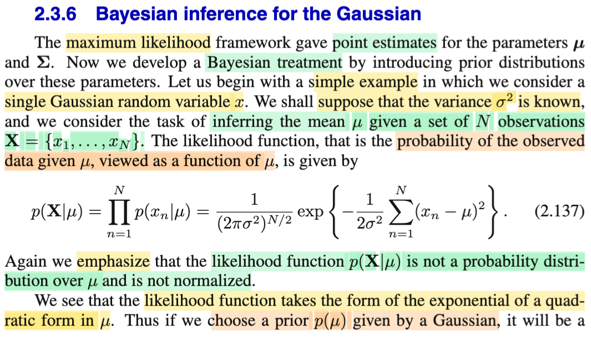</kbd>

> [!NOTE]
> Phần trước, đại khái là với maximum likelihood framework, thì gs Bishop cho ta một cách tiếp cận để point estimate giá trị của parameter. Nhờ cày xong cuốn Casella, nên mình hiểu vì sao lại point estimate. Nói sơ lại chút xíu: Như đã học trong chap 7 Casella - Point estimation, thì bài toán đặt ra là có một random sample iid X1,..Xn (gom lại thành vector **X**) có chung population distribution f(x|θ) (tụi này manually independent và có chung distribution (indetically distributed)), yêu cầu là xây dựng một function, W(**x**), sao cho với observed value của sample **X** = **x**, thì ta sẽ có một estimation - một giá trị ước lượng của θ. Và sự ước lượng này mang tính chất là một ước lượng điểm - đơn giản là vì ta muốn ước lượng ra một điểm giá trị của θ, thay vì với bài toán khác, interval estimation, ta sẽ muốn ước lượng ra một khoảng mà ta tin sẽ chứa θ. Thế thì, maximum likelihood là một cách tiếp cận để làm cái việc đi tìm hàm W này, vì nó sẽ giúp ta có một estimation tương đối tốt. Và với MLE, nó thuần túy là thuộc trường phái Frequentist, vì ta vẫn chỉ coi θ như tham số có giá trị cố định nhưng chưa biết (fixed & unknown).
>
>
>
> Thế thì bước sang Bayesian approach, bất cứ khi nào dùng cách tiếp cận này, ta sẽ đều COI θ NHƯ **RANDOM VARIABLE**, và do đó, sẽ bắt đầu nó về distribution cuả nó, cũng như có thể nói về kì vọng, variance, ...của nó. Và thường thì ta sẽ chọn một prior distribution cho θ, trong sách Casella thường kí hiệu π(θ). Để rồi, dùng Bayes rule, ta xây dựng condional distribution của θ: π(θ|**x**), = f(**x**|θ) π(θ) / f(**x**).
>
>
>
> Nếu dừng tại đây chút xíu, có thể nói vài điểm quan trọng. Thứ nhất, vai trò của f(**x**) trong công thức này, dĩ nhiên có thể gọi nó là marginal pdf của **X** tại **x** (dù rằng thường người ta không gọi vậy), nhưng ta không quan tâm đến f là gì, vì Bayes theorem ĐẢM BẢO RẰNG, vế trái, π(θ|**x**) sẽ là một pdf hợp lệ (tức là một hàm số của θ, hợp lệ để đóng vai là một pdf, với các tính chất như: normalizing: tích phân ∫ π(θ|**x**) dθ = 1, cũng như π(θ|**x**) ≥ 0) Do đó, ta chỉ cần coi nó (f(**x**)) là một phần của normalizing constant của π(θ|**x**).
>
>
>
> Một điểm nữa, nhìn vào tử số, f(**x**|θ), dĩ nhiên, cái này là joint pdf của **X**, tại **x**, và theo định nghĩa của likelihood L(θ|**x**), thì nó chính là Likelihood của θ. Thành ra ta có thể ghi là π(θ|**x**) = L(θ|**x**) π(θ) / f(**x**), và bỏ qua cái constant, vốn là số không âm, bằng cách dùng cách thể hiện tỉ lệ thuận, ta sẽ có: π(θ|**x**) ∝ L(θ|**x**) π(θ).
>
>
>
> Và cuối cùng, một điểm quan trọng nữa đã học trong Casella, đó là có một số loại distribution mà quan hệ của chúng có tính chất như sau: Ví dụ như nếu Xi \~ binomial (tức f(x|θ) là pdf của binomial distribtion), và prior π(θ) là beta, thì posterior π(θ|**x**) hóa ra cũng sẽ là beta distribution. Đây gọi là tính chất conjugate: Beta là conjugate prior của binomial. Và tính chất này đem lại VÀI THUẬN LỢI TRONG TÍNH TOÁN. Tương tự, tí nữa ta sẽ thấy normal là prior conjugate với normal.
>
>
>
> Rồi, vẫn trong bối cảnh đang ôn lại Casella, thì sau khi có posterior thì sao: Thì khi đó ta không chỉ có một point estimation, mà ta có một distribution của θ. Do đó, ta có thể lấy mean hoặc median của distribution để làm point estimation. Và chúng chính là Bayes estimator giúp giảm thiểu Bayes risk với loss function được chọn là square error loss hay absolute error loss.
>
>
>
> Việc ôn lại Casella như vậy giúp dễ dàng hiểu những gì nói đến ở đây: gs Bishop đặt ra bài toán là ta cần infer (suy luận / suy diễn) giá trị mean μ của một population Normal(μ, σ^2) đã biết σ^2, dựa trên giá trị quan sát thấy của sample (data) **X** = (X1,...Xn) iid. Vậy thì như mình đã ôn lại ở trên, likelihood function là function của tham số θ, ở đây là μ, được định nghĩa bởi L(μ, σ^2|**x**) = f(**x**|μ, σ^2). Dùng tính iid của random sample, f(**x**|μ, σ^2), tức joint pdf của chúng được tách thành tích các marginal pdf:
>
>
>
> f(**x**|μ, σ^2) = Πn=1:N f(xn|μ, σ^2)
>
>
>
> Ráp pdf của normal(μ, σ^2) vô:
>
>
>
> .. = Πn=1:N { \[1/√(2πσ^2)\] exp\[-(xn-μ)^2/2σ^2\]}
>
>
>
> = { \[1/√(2πσ^2)\]^N Πn=1:N exp\[-(xn-μ)^2/2σ^2\]}
>
>
>
> Dùng tính chất hàm exp: e^a e^b = e^(a+b)
>
>
>
> = \[1/(2πσ^2)^N/2\] exp{ Σn=1:N \[-(xn-μ)^2/2σ^2\]}
>
>
>
> = \[1/(2πσ^2)^N/2\] exp{ (-1/2σ^2)Σn=1:N \[(xn-μ)^2\]}
>
>
>
> Viết lại:
>
>
>
> L(μ, σ^2|**x**) = f(**x**|μ, σ^2) = \[1/(2πσ^2)^N/2\] exp{ (-1/2σ^2)Σn=1:N \[(xn-μ)^2\]} → Đây là công thức 2.137 trong sách.
>
>
>
> (trong sách ông ghi là p(**X**|μ), thì chỉ là ông ko kể để σ^2, vì ta đã biết cái này, còn mình thì ghi như vậy với ghi chú đã biết σ^2 cũng chẳng sao). Còn một điểm nữa, ông Bishop dùng **X** nên hiểu là ông đang nói về giá trị của toàn bộ data set, tức **X** là vector chứa các giá trị quan sát được của X1,X2,....: **X** = (x1,x2....xN). Chỗ này ổng lại viết hoa mới đau, đáng lẽ ổng theo chuẩn kí hiệu thì chỗ này phải là viết **x**, vì với random vector **X** = (X1,...XN) thì giá trị của nó là **x**, = (x1,...xN). Nói chung là trong sách này phải tỉnh lắm mới không bị rối kí hiệu của ngà Bishop)
>
>
>
> Thế thì, nhờ Casella, tiếp theo ta cũng hiểu vì sao ông Bishop nói p(**X**|μ) không phải là một distribution over μ. Bởi lẽ đơn giản đây là hàm của θ, chỉ là được define theo cách thức mà giá trị của nó tại θ, L(θ|**x**), chính là giá trị của joint pdf của **X** tại **x**: f(**x**|θ), thì tuy đúng là f(**x**|θ) là một valid pdf, nhưng nó là khi xét nó là hàm theo **x**, thì ta mới có f(**x**|θ) sẽ luôn ko âm với mọi **x**, và ∫f(**x**|θ)d**x** = 1. Còn khi coi nó là hàm theo θ, thì CHƯA CHẮC ∫f(**x**|θ)dθ ĐÃ = 1.

> [!TIP]
> **🤖 AI Feedback** — ✅ Score: **98/100**
>
> Bài viết cực kỳ chi tiết, chính xác và sâu sắc, thể hiện sự hiểu biết vững chắc về cả phương pháp Maximum Likelihood và Bayesian Inference. Việc kết nối kiến thức với sách Casella, giải thích cặn kẽ từng khái niệm và thậm chí phân tích chi tiết về ký hiệu cho thấy khả năng tổng hợp và tư duy phản biện xuất sắc.

 

## Phân phối hậu nghiệm Normal

<kbd>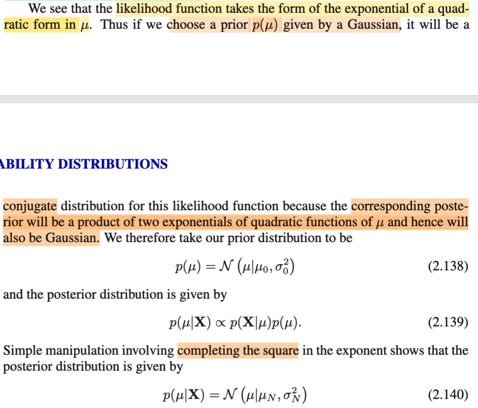</kbd>

<kbd>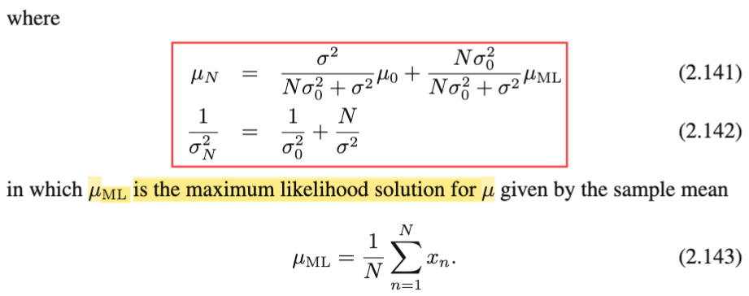</kbd>

> [!NOTE]
> Rồi, thế thì như phần review ở note trước ta sẽ dùng Bayes rule để xây dựng posterior, bỏ qua constant f(**x**) (mình sẽ cứ theo notation của Casella):
>
>
>
> π(μ|**x**) ∝ L(μ, σ^2|**x**) π(μ)
>
>
>
> π(μ|**x**) ∝ \[1/(2πσ^2)^N/2\] exp{(-1/2σ^2)Σn=1:n \[(xn-μ)^2\]} π(μ)
>
>
>
> Ở đây ông chọn priori là Normal(μ0, σ0^2), thay vào, đồng thời tiếp tục bỏ đi các constant (vì ta đang dùng kí hiệu tỉ lệ thuận rồi)
>
>
>
> π(μ|**x**) ∝ exp{(-1/2σ^2)Σn=1:N \[(xn-μ)^2\]} exp\[-(μ-μ0)^2/2σ0^2\]
>
>
>
> π(μ|**x**) ∝ exp{-(1/2σ^2) Σn=1:N \[(xn-μ)^2\] - (1/2σ0^2) (μ-μ0)^2}
>
>
>
> Tại đây, xét phần trong dấu exp{..}: -(1/2σ^2) Σn=1:N \[(xn-μ)^2\] - (1/2σ0^2) (μ-μ0)^2, ta thấy nó là một quadratic function của μ. Nội điều này đã đủ kết luận rằng posterior distribution là một Normal. Và để xác định tham số của normal này, ta sẽ làm động tác complete the sqaure và khớp mẫu giống như đã làm ở các phần trước. Viết gọn Σn=1:N là Σn
>
>
>
> ...= -(1/2σ^2) Σn \[(xn-μ)^2\] - (1/2σ0^2) (μ-μ0)^2
>
>
>
> = -(1/2σ^2) Σn (xn^2-2xnμ+μ^2) - (1/2σ0^2) (μ^2-2μμ0+μ0^2)
>
>
>
> = -(1/2σ^2) Σn (xn^2-2xnμ+μ^2) - (1/2σ0^2) (μ^2-2μμ0+μ0^2)
>
>
>
> Đặt -(1/2σ^2) và - (1/2σ0^2) là a, b cho gọn:
>
>
>
> = aΣn (xn^2-2xnμ+μ^2) + b(μ^2-2μμ0+μ0^2)
>
>
>
> = aΣn (xn^2) - 2a(Σnxn)μ + aNμ^2 + bμ^2 - 2bμ0μ + bμ0^2
>
>
>
> = aNμ^2 + bμ^2 - 2a(Σnxn)μ - 2bμ0μ + aΣn (xn^2)+ bμ0^2
>
>
>
> = (aN + b)μ^2 - 2(aΣnxn + bμ0)μ + aΣn (xn^2)+ bμ0^2
>
>
>
> Tới đây ta xét phần bên trong exp của một μ \~ Normal(τ, ε^2) sẽ có công thức là -(μ - τ)^2/2σ^2 = -(μ^2 + τ^2 - 2μτ)/2ε^2 = (-μ^2 - τ^2 + 2μτ)/2ε^2 = -μ^2/2ε^2 - τ^2/2ε^2 + μτ/ε^2
>
>
>
> Khớp mẫu:
>
>
>
> (aN + b) = -1/2ε^2 ⇨ ε^2 = -1/\[2(aN + b)\]
>
>
>
> \- 2(aΣnxn + bμ0) = τ/ε^2
>
>
>
> ⇔ -2(aΣnxn + bμ0)ε^2 = τ
>
>
>
> ⇔ τ = -2(aΣnxn + bμ0)(-1/\[2(aN + b)\])
>
>
>
> ⇔ τ = 2(aΣnxn + bμ0)/\[2(aN + b)\]
>
>
>
> ⇔ τ = (aΣnxn + bμ0)/(aN + b)
>
>
>
> Thay a, b vào:
>
>
>
> ε^2 = -1/\[2(aN + b)\] = -1/\[2(\[-(1/2σ^2)\]N -(1/2σ0^2))\]
>
>
>
> = 1/(N/σ^2 + 1/σ0^2)
>
>
>
> ⇔ 1/ε^2 = N/σ^2 + 1/σ0^2 → Tới đây ta đã có nghịch đảo của variance của posterior (cũng là precision), chính là **công thức 2.142 trong sách**
>
>
>
> τ = (aΣnxn + bμ0)/(aN + b)
>
>
>
> = ((1/σ^2)Σnxn + (1/σ0^2)μ0)/((1/σ^2)N + 1/σ0^2)
>
>
>
> = (Σnxn/σ^2 + μ0/σ0^2)/(N/σ^2 + 1/σ0^2)
>
>
>
> = (Σnxn/σ^2 + μ0/σ0^2)/(1/ε^2) | Thay cái mẫu chính là 1/ε^2
>
>
>
> = (NΣnxn/Nσ^2 + μ0/σ0^2)/(1/ε^2)
>
>
>
> Thay Σnxn/N = μML
>
>
>
> = (NμML/σ^2 + μ0/σ0^2)/(1/ε^2)
>
>
>
> = ε^2(NμML/σ^2 + μ0/σ0^2)
>
>
>
> = ε^2NμML/σ^2 + ε^2μ0/σ0^2
>
>
>
> = ε^2μ0/σ0^2 + ε^2NμML/σ^2
>
>
>
> = \[ε^2/σ0^2\]μ0 + \[Nε^2/σ^2\]μML
>
>
>
> = \[ε^2/σ0^2\]μ0 + \[Nε^2/σ^2\]μML
>
>
>
> Với 1/ε^2 = N/σ^2 + 1/σ0^2 ⇨ ε^2 = 1 / \[N/σ^2 + 1/σ0^2\]
>
>
>
> = σ^2σ0^2 / (Nσ0^2 + σ^2)
>
>
>
> ⇨ = \[ε^2/σ0^2\]μ0 + \[Nε^2/σ^2\]μML
>
>
>
>  = \[σ^2 / (Nσ0^2 + σ^2)\] μ0 + \[Nσ0^2 / (Nσ0^2 + σ^2)\] μML
>
>
>
> → Đây chính là kết quả 2.141 trong sách

> [!TIP]
> **🤖 AI Feedback** — ✅ Score: **98/100**
>
> Bản ghi chú này rất xuất sắc, cung cấp một phân tích sâu sắc và chi tiết từng bước để suy ra phân phối hậu nghiệm. Bạn đã thành công trong việc trình bày rõ ràng các bước đại số phức tạp, dẫn đến các công thức khớp chính xác với sách giáo khoa.

 

### Hậu nghiệm và ước lượng ML

<kbd>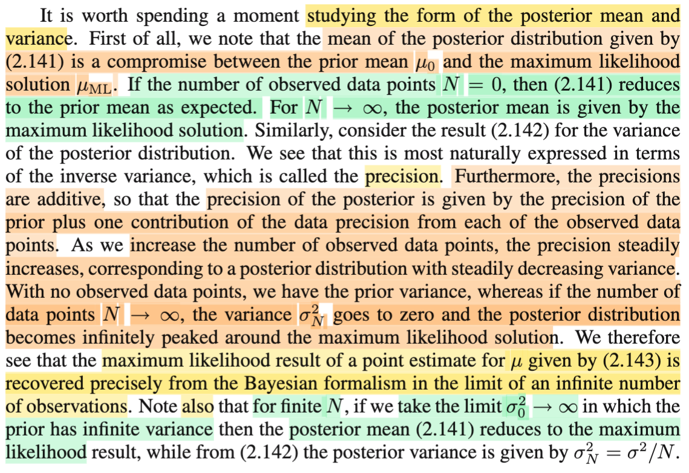</kbd>

<kbd>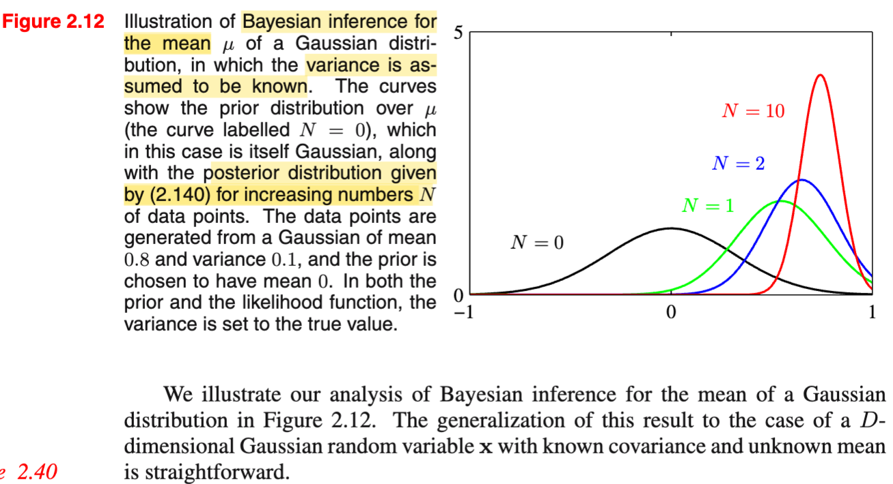</kbd>

> [!NOTE]
> Đây là đoạn ta sẽ dừng lại để nhận xét về kết quả vừa rồi khi ta đã chứng minh posterior là một Normal có:
>
>
>
> posterior mean = \[σ^2 / (Nσ0^2 + σ^2)\] μ0 + \[Nσ0^2 / (Nσ0^2 + σ^2)\] μML
>
>
>
> posterior precision 1/ε^2 = N/σ^2 + 1/σ0^2
>
>
>
> Thế thì nhận định đầu tiên: posterior mean là một sự thỏa hiệp giữa prior mean (μ0) và ML estimation của μ (μML). Để rồi khi số data tăng lên, hệ số của prior mean giảm xuống,  đóng góp của nó giảm xuống → và của μML tăng lên → Kết quả, posterior mean sẽ chuyển dịch dần về μML.
>
>
>
> Tương tự, precision (nghịch đảo của variance) cũng là kết hợp của cả hai precision (nhưng hởi khác với mean, là một convex combination, thì với precision, nó là tổng của precision): Khi dữ liệu tăng lên, precision sẽ ngày càng tăng, và cứ mỗi một data sample quan sát được, sẽ làm tăng precision thêm một khoảng bằng precision của X distribution, tức 1/σ^2.
>
>
>
> Và precision sẽ tăng lên liên tục khi tăng số sample nên hình ảnh sẽ là, data càng nhiều thì cái chuông normal posterior càng ốm lại, cộng với tâm của nó sẽ dịch về μML. Để khi N → ∞, posterior sẽ về cơ bản là cái chuông siêu ốm, với xác suất tập trung hoàn toàn tại đỉnh (peak) μML.
>
>
>
> Và hình ảnh trong sách minh họa cái vụ dịch chuyển này rất rõ.
>
>
>
> Chính vì vậy, mà gs Bishop nói rằng, cách tiếp cận Bayesian đã recover chính xác kết quả của maximum likelihood khi ta xét tại limit (khi xét điều kiện có vô số data) Nói vậy phải hiểu rằng, vốn dĩ hai cách tiếp cận này thuộc 2 trường phái rất khác nhau, trong đó ML là ước lượng điểm, coi μ là fixed nhưng ta không biết nó ở đâu unknown trong khi Bayesian coi μ là biến ngẫu nhiên, và tìm cách xây dựng distribution để thể hiện việc ta không biết về μ. Hãy để ý, quan điểm của Bayesian khác với Frequentist là coi μ như biến ngẫu nhiên để dùng distribution của nó để phản ánh tính uncertainty của nó, còn Frequentist thì phản ánh tính uncertainty thông qua việc nói rằng ta ko, chưa biết nó bằng bao nhiêu.  Để rồi với vô số data, thì hóa ra cái distribution của Bayessian trở thành một point estimation khi nó biến thành cái chuông nhọn hoắc tập trung hoàn toàn xác suất tại μML.
>
>
>
> Cuối cùng, một nhận xét nữa là nếu data ko vô hạn, chỉ hữu hạn, nhưng ta cho variance của prior tăng vô hạn, thì mean của posterior cũng trở thành μML: Điều này nghĩa là sao? Mình hiểu thế này, cái việc chọn prior là Normal(μ0, σ0^2) phản ánh một kinh nghiệm nào đó, một hiểu biết nào đó về μ. Nhưng nếu ta không biết gì hết, thì ta sẽ phản ánh sự "không biết gì hết này" bằng cách cho xác suất dàn trải ra rất rộng: tăng σ0 → ∞ (khi đó, giống như coi như ta có uniform vậy, mặc dù chính xác thì ko phải), thì khi đó, dĩ nhiên với việc ta chả có kinh nghiệm gì, thì prior chẳng đóng góp gì, mọi dự đoán sẽ đều do data mà ra, tức là, ta sẽ dựa hoàn toàn vào μML và hai cái công thức trên phản ánh điều này.

> [!TIP]
> **🤖 AI Feedback** — ✅ Score: **98/100**
>
> Phân tích của bạn rất chính xác và có chiều sâu, bao gồm cả những diễn giải quan trọng về sự hội tụ của phương pháp Bayesian về kết quả ML và sự khác biệt về quan điểm giữa Bayesian và Frequentist. Bạn đã nắm bắt rất tốt các điểm chính được nêu trong tài liệu.

 

#### Ước lượng Tuần tự Bayesian

<kbd>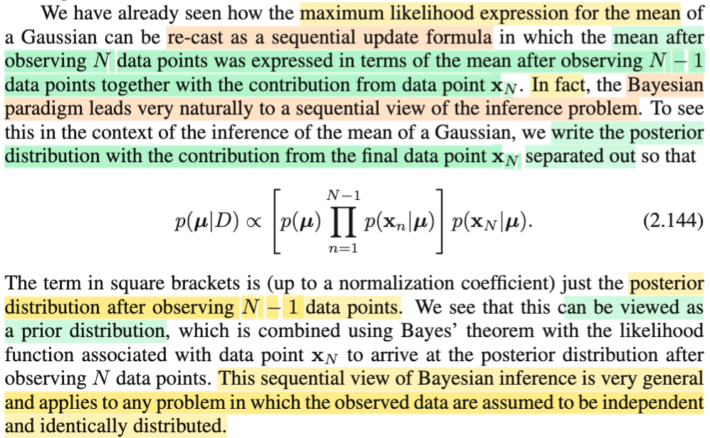</kbd>

> [!NOTE]
> Qua đoạn này, nhớ lại bữa trước, trong phần sequential estimation, ta đã biết dựa vào lí thuyết của Robbin-Monroes, cho phép ta có một cách làm đối với việc tính toán ra μML theo lối tạo ra một chuỗi các giá trị μML trong đó, tại mỗi bước, ta sẽ update giá trị mới của μML dựa trên một observed data sample mới, để rồi, với N → inf thì chuỗi μML^(N) sẽ hội tụ về μML.
>
>
>
> Vậy thì đoạn này, đại ý là, ông cho biết với cách tiếp cận của Bayesian, thì cái việc sequential estimation trên diễn ra rất tự nhiên, hay nói cách khác, là bản thân nó đã có thể cũng được nhìn nhận theo cách này.
>
>
>
> Rất dễ hiểu thôi, đầu tiên nhớ lại một chút, với Bayesian, điểm mấu chốt khác với trường phái Frequentiest / Classical đó là, ta sẽ coi parameter θ, hay ở đây là μ, LÀ MỘT RANDOM VARIABLE. Từ đó, ta sẽ đi tìm distribution của nó, điều này khác với Frequentist, điển hình là việc tìm ML estimation của **μ**, thì ta không coi **μ** là random variable, mà chỉ là một giá trị chưa biết nằm đâu đó trong không gian parameter space, và ta đi tìm thông qua việc giải bài toán tối ưu: tìm **μ** khiến maximize hàm likelihood mà thôi. Thế thì, mục đích chính là đi tìm distribution của μ dựa trên observed data **X** = **x**, và Bayes theorem cho ta một công cụ: Bằng cách chọn một prior distribution của **μ**: π(**μ**), thì posterio π(**μ**|**x**) = f(**x**|μ)π(**μ**) / f(**x**). Như đã nói trong note trước, f(**x**) sẽ chỉ là một constant, đóp góp vào normalizing constant của posterior. Nên ta sẽ chuyển sang kí hiệu ∝:
>
>
>
> π(μ|**x**) **∝** f(**x**|**μ**)π(**μ**)
>
>
>
> nhờ tính iid của data ..
>
>
>
> ...= Πi=1:N f(**xi**|μ) π(**μ**)
>
>
>
> (Thế thì ở đây cần ghi chú rõ xíu một cái có thể gây khó hiểu về kí hiệu **x** trong π(**μ**|**x**) (hay D trong p(**μ**|D) trong sách, mang ý nghĩa là toàn bộ data / observed value của N samples), ta có thể coi nó là matrix mà mỗi hàng là một observed value của một random variable vector **Xi**.)
>
>
>
> Bayes theorem giúp ta từ việc ban đầu chỉ có prior distribution của **μ**, tức π(**μ**), mang ý nghĩa là distribution ban đầu, khi ta chưa biết data **X** (hay D) là gì, thì ta sẽ chỉ kiểu như dựa vào kinh nghiệm để chọn ra một distribution cho **μ**. để rồi sau khi có data **X**, thì Bayes theorem giúp ta cập nhật thêm thông tin về distribution của **μ** cho chính xác hơn.
>
>
>
> Nhưng cái chínnh muốn nói ở đoạn này là, ta cũng có thể nhìn nhận theo cách sequential, bằng cách tách cái tích của N marginal pdf f(**xi**|**μ**) thành tích của N-1 cái từ x1 → x(N-1) và một cái xN\
> \
> π(**μ**|**x**) **∝** f(**x**|**μ**)π(**μ**) = Πi=1:N-1 f(**xi**|**μ**) f(**xN**|**μ**) π(**μ**)
>
>
>
> gom cái prior π(**μ**) và Πi=1:N-1 f(**xi**|**μ**) lại:
>
>
>
> > π(**μ**|**x**) = \[ Πi=1:N-1 f(xi|**μ**) π(**μ**) \] f(**xN**|**μ**)
>
>
>
> Thì đến đây đại ý là: Ta có thể nhìn nhận posterior π(**μ**|**x**) theo cách khác: Là coi Πi=1:N-1 f(**xi**|**μ**) π(**μ**) là prior distribution, và dùng Bayes theorem để cập nhật thêm distribution của **μ** sau khi quan sát thấy data thứ N: **xN**. Và như vậy, rõ ràng là Bayesian approach cho ta một cách giải thích theo kiểu sequential estimation rất tự nhiên: Ban đầu chưa biết gì (chưa có data), ta đoán **μ** có distribution π(**μ**). Sau đó, có một data sample **X1** = **x1**: Ta cập nhận lại distribution, để có posterior distribution π(**μ**|x1) = π(**μ**) f(x1|**μ**). Có thêm quan sát mới **X2** = **x2**, ta lại coi posterior trước đó là prior, cập nhật lại với posterior mới: π(**μ**|**x1**,**x2**) = \[π(**μ**) f(**x1**|**μ**)\] f(**x2**|**μ**). Cứ thế tiếp tục.
>
> \
> Và một điểm mình cần nhận ra, sở dĩ có thể làm được vậy, mấu chốt là nhờ có thể tách cái joint pdf f(**x**|μ), tức f(**x1**,**x2**,...**xN**|**μ**) thành tích f(**x1**|**μ**)f(**x2**|**μ**)...f(**xN**|**μ**). Do đó, ta sẽ hiểu vì sao gs Bishop nói cái ý này:
>
>
>
> "This sequential view of Bayesian inference is very general and applies to any problem in which the **observed data are assumed to be independent and identically distributed**."
>
>
>
> Với ý quan trọng là chỉ khi ta assumption (giả định) data có tính iid thì Bayesian inference mới có thể được nhìn nhận theo sequential view.

> [!TIP]
> **🤖 AI Feedback** — ✅ Score: **98/100**
>
> Đây là một ghi chú xuất sắc và rất sâu sắc, giải thích rõ ràng sự khác biệt giữa Bayesian và Frequentist, cũng như cơ chế cập nhật tuần tự một cách chi tiết. Việc nhấn mạnh vai trò của giả định i.i.d. là rất chính xác và quan trọng.

 

##### Suy diễn Bayesian độ chính xác

<kbd>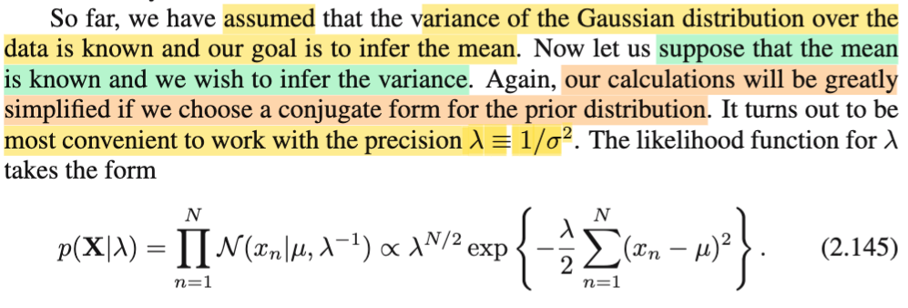</kbd>

<kbd>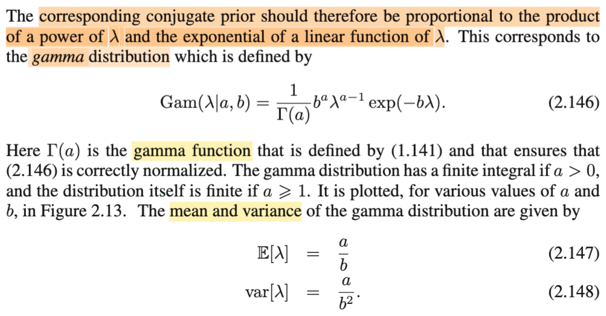</kbd>

<kbd>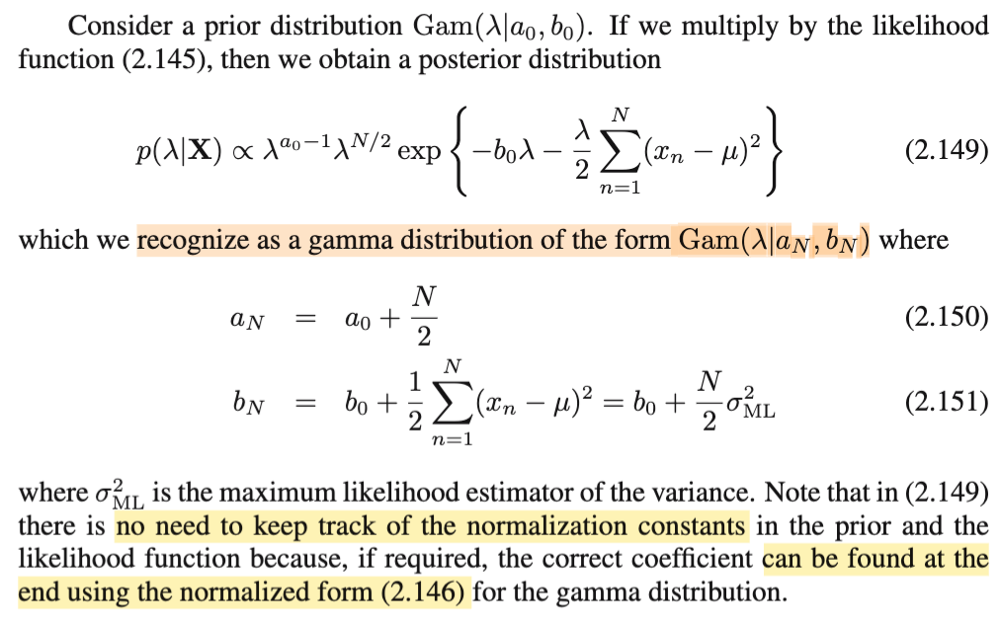</kbd>

> [!NOTE]
> Qua đây, đại ý là, nãy giờ là ta giả định đã biết variance σ^2, và đi infer μ. Còn bây giờ là giả định biết μ, ta sẽ infer variance (theo Bayesian approach)
>
>
>
> Cần nhắc lại chút về đầu bài: Ta có random sample (data set): X1,X2,...XN iid \~ Normal(μ, σ^2). Và observed value của chúng, là x1, x2,....Gom lại thành vector **x** = (x1,...xN) (trong sách gs viết hoa, thành **X**, mình cho là trái quy tắc, không biết để làm gì, nhưng kệ). Ở đây ta coi như biết μ, cần infer (suy diễn. statistical inference: suy diễn thống kê) ra σ^2. Với cách làm Bayesian đã biết, ta sẽ cũng coi variance là một random variable, chọn một prior distribution của nó, và dựa vào Bayes theorem để xây dựng posterior distribution.
>
>
>
> Tuy nhiên, gs Bishop, cho rằng sẽ tiện hơn nếu thay vì infer σ^2, ta infer nghịch đảo của nó: 1/σ^2, đặt là λ, như đã biết, cái này gọi là precision. Mình nên hiểu thế này: Không đơn giản là ta đang tính σ^2, thì thay vì tính σ^2, ta tính 1/σ^2, mà phải hiểu là ta đang tính cái distribution của σ^2: π(σ^2|**x**), nên khi ta đi infer λ = 1/σ^2, thì khi có distribution π(λ|**x**), ta sẽ dùng change of variable theorem để derive π(σ^2|**x**)
>
>
>
> Rồi, thế thì như thường lệ ta sẽ dùng Bayes theorem để có π(λ|**x**) ∝ f(**x**|λ) π(λ).
>
>
>
> Xét f(**x**|λ), như đã biết, theo định nghĩa hàm likelihood, nó cũng là likelihood của λ, L(λ|**x**) mang ý nghĩa độ hợp lí của λ khi quan sát thấy **X** = **x**, dùng tính iid, ta tách nó ra thành tích các marginal pdf của các Xi, là các hàm Normal pdf N(x|μ,1/λ)
>
>
>
> f(**x**|λ) = Πi=1:N f(xi|λ) = Πi=1:N N(xi, μ,1/λ)
>
>
>
> = Πi=1:N {\[1/√2π(1/λ)\] exp\[-(xi-μ)^2/2(1/λ)\]}
>
>
>
> = Πi=1:N {\[2π(λ)^-1\]^(-1/2) exp\[-(λ/2)(xi-μ)^2\]}
>
>
>
> = Πi=1:N {\[2π^(-1/2) (λ)^(1/2)\] exp\[-(λ/2)(xi-μ)^2\]}
>
>
>
> = \[2π^(-N/2) (λ)^(N/2)\] exp\[Σi=1:N -(λ/2)(xi-μ)^2\]
>
>
>
> lắp vào π(λ|**x**) ∝ f(**x**|λ) π(λ):
>
>
>
> π(λ|**x**) ∝ \[2π^(-N/2) (λ)^(N/2)\] exp\[Σi=1:N -(λ/2)(xi-μ)^2\] π(λ)
>
>
>
> Bỏ qua các constant, vì đã đang dùng cách thể hiện tỉ lệ thuận, ta hiểu rằng các constant sẽ tự động gộp vào normalizing constant của posterior
>
>
>
> π(λ|**x**) ∝ (λ)^(N/2) exp\[-(λ/2) Σi=1:N (xi-μ)^2\] π(λ) → 2.145 trong sách
>
>
>
> Tới đây ta mới lập luận như sau:
>
>
>
> Như đã viết về khái niệm conjugate prior: Đó là, có những loại distribution mà chúng có tính chất: ví dụ, nếu joint pdf của X là binomial (n, p) thì khi chọn Beta là prior distribution của tham số (p, rate of success) thì posterior của p hóa ra cũng sẽ là Beta. Và việc này, mục đích chính chỉ là: Bằng cách chọn pror distribution là conjugate của hàm joint pdf của data, thì posterior sẽ ra cùng loại, khiến tính toán thuận lợi. Mình nhớ trong sách nào đó cũng đã từng đề cập, đây thật ra là một dạng bias, mà những người theo trường phái Frequentist dùng để chê cách làm của Bayesian, vì việc chọn prior để tính toán thuận lợi đã tạo ra một bias trong quá trình làm thống kê.
>
>
>
> Vậy thì ở đây, ý chính đó là, ta sẽ nhìn vào cấu trúc của hàm λ xuất hiện trong joint pdf, để quyết định nên dùng distribution nào cho prior.
>
>
>
> Thế thì, nhận thấy likelihood của λ có dạng:
>
>
>
> λ^(c1) exp(-λ c2), là tích của một hàm lũy thừa λ với hàm e^(một hàm tuyến tính của λ).
>
>
>
> Và nó có dạng của kernel của một distribution đã học trong Stat110 và Casella: GAMMA. Một X \~ Gamma(α, β) có pdf là:
>
>
>
> f(x) = \[1/Γ(α)\] \[1/β^α\] x^(α-1) e^-x/β với x ∈ (0, inf) α, β > 0.
>
>
>
> Chỗ này cần cẩn thận, ta biết công thức Gamma, có thể thể hiện theo variance hoăc precision. Với β ở công thức trên là variance, nếu dùng β là precision thì công thức sẽ là:
>
>
>
> f(x) = \[1/Γ(α)\] \[β^α\] x^(α-1) e^-xβ với x ∈ (0, inf) α, β > 0.
>
>
>
> Nhìn vào kernel của nó, đúng là nó có dạng x^(constant 1) e^(-x × constant 2)
>
>
>
> Mean và variance của Gamma thì trong Stat110 hay Casella đã làm qua rồi.
>
>
>
> Như vậy nếu ta chọn prior cũng là Gamma (a0, b0) thì khi nhân vào, kernel của nó sẽ nhập vào hai cái term trên để hình thành kernel của một gamma có tham số khác, cùng làm thử:
>
>
>
> π(λ|**x**) ∝ (λ)^(N/2) exp\[-(λ/2) Σi=1:N (xi-μ)^2\] π(λ)
>
>
>
> Thay pdf π(λ), là pdf của Gamma(a0, b0) = \[1/Γ(a0)b0^a0 λ^(a0-1) e^-b0λ và cũng bỏ qua constant, chỉ dùng cái kernel (phần có dính đến λ):
>
>
>
> π(λ|**x**) ∝ λ^(N/2) exp\[-(λ/2) Σi=1:N (xi-μ)^2\] λ^(a0-1) e^-λb0
>
>
>
> π(λ|**x**) ∝ λ^(N/2) λ^(a0-1) exp\[-(λ/2) Σi=1:N (xi-μ)^2\] exp\[-λb0\]
>
>
>
> π(λ|**x**) ∝ λ^(N/2+a0-1) exp\[-(λ/2) Σi=1:N (xi-μ)^2 - λb0\]
>
>
>
> π(λ|**x**) ∝ λ^(N/2+a0-1) exp\[-λ \[(1/2) Σi=1:N (xi-μ)^2 + b0\]\]
>
>
>
> Và với việc kernel của một X \~ Gamma(α, β) có dạng x^(α-1) e^-xβ
>
>
>
> thì dựa việc kernel của posterior như trên ta có thể kết luận posterior là một Gamma có tham số aN, bN, với
>
>
>
> aN ứng với N/2 + a0 → 2.150
>
>
>
> bN ứng với (1/2) Σi=1:N (xi-μ)^2 + b0
>
>
>
> ⇔  bN = b0 + (1/2) Σi=1:N (xi-μ)^2
>
>
>
> Và nếu ta còn nhớ σ^2_ML, tức maximum likelihood estimator của σ^2, thì nó có công thức là: biased sample variance: σ^2_ML = \[Σi=1:N (xi-μ)^2\] / N
>
>
>
> nên bN = b0 + (N/2) σ^2_ML  → 2.151
>
>
>
> Và dĩ nhiên mình cũng hiểu câu cuối gs nói ta ko cần phải quan tâm mấy cái constant (mà nãy giờ mình đã nói bỏ qua) làm gì, vì nội cái kernel và thực hiện khớp mẫu đã giúp ta xác định được posterior là gamma có hai tham số trên, muốn tính ra normalizing constant thì chỉ việc ráp vào công thức mà tính ra

> [!TIP]
> **🤖 AI Feedback** — ✅ Score: **98/100**
>
> Bài viết của bạn rất xuất sắc, vừa chính xác từng bước trong các phép chứng minh toán học, vừa có chiều sâu trong việc giải thích các khái niệm như conjugate prior và lý do chọn precision. Độ chi tiết và khả năng kết nối với các công thức trong sách giáo trình là rất ấn tượng.

 

###### Mẫu hiệu quả trong Gamma prior

<kbd>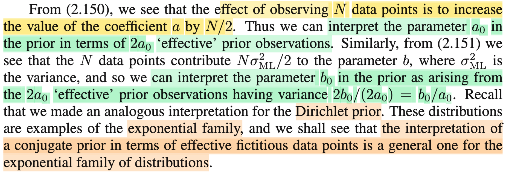</kbd>

> [!NOTE]
> aN = a0 + N/2
>
>
>
> bN = b0 + (N/2) σ^2_ML
>
>
>
> Rồi, tiếp theo đoạn này ý nói là vầy: ta thấy với priori là Gamma(a0, b0) thì sau khi quan sát thấy giá trị của sample size N (data), thì posterior là Gamma(a0 + N/2, b0 + N/2) σ^2_ML).
>
>
>
> Thì điều này có nghĩa là (có thể hiểu là 0 interpret): N sample khiến tham số a của Gamma tăng thêm N/2, thì như vậy ta có thể coi như con số a0 ban đầu là kết quả của việc ta quan sát thấy 2a0 sample tưởng tượng (hay hiệu quả) nào đó trước đây, để rồi khiến tham số a của Gamma tăng lên thêm 2a0/2 = a0.
>
>
>
> Tương tự, việc quan sát thấy N data sample có variance σ^2_ML khiến tham số b của Gamma tăng thêm Nσ^2_ML/2 = N × σ^2_ML / 2 , thì như vậy ta có thể coi như việc quan sát thấy 2a0 sample tưởng tượng nào đó có variance là b0/a0. Để đóng góp thêm vào b: 2a0 × (b0/a0) / 2 = b0.
>
>
>
> Và ông nói, ta cũng đã thấy một cách giải thích tương tự khi nói về Dirichlet prior (còn nhớ cái này chỉ là phiên bản khái quát của Βeta - cái distribution làm prior của Binomial, thì Dirichlet là prior của Multi-nomial)
>
>
>
> Và một sự thật nữa, là cả Beta và Gamma đều thuộc exponential family (vụ này đã biết ở Casella, và mình nhớ Normal cũng thuộc họ này), nên ta sẽ thấy cách diễn giải này, là điểm chung của các distribution trong exponential family

> [!TIP]
> **🤖 AI Feedback** — ✅ Score: **100/100**
>
> Ghi chú giải thích rất đầy đủ và chính xác các điểm chính từ văn bản gốc, bao gồm cả cách giải thích các tham số tiên nghiệm như những quan sát hiệu quả và tính tổng quát của phương pháp này cho exponential family. Các công thức tính toán và kiến thức nền bổ sung cho thấy sự hiểu biết sâu sắc và toàn diện về chủ đề.

 

###### Phân phối Gaussian-Gamma

<kbd>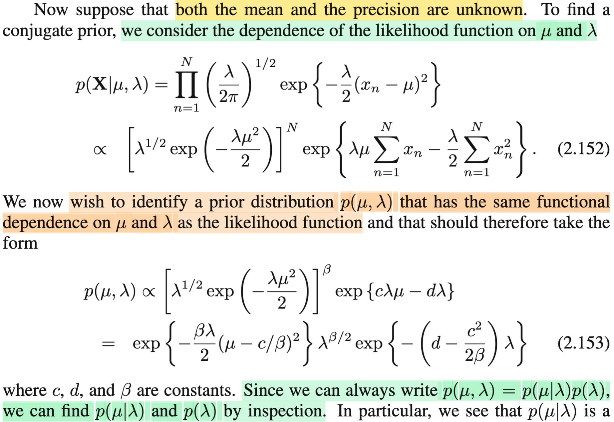</kbd>

<kbd>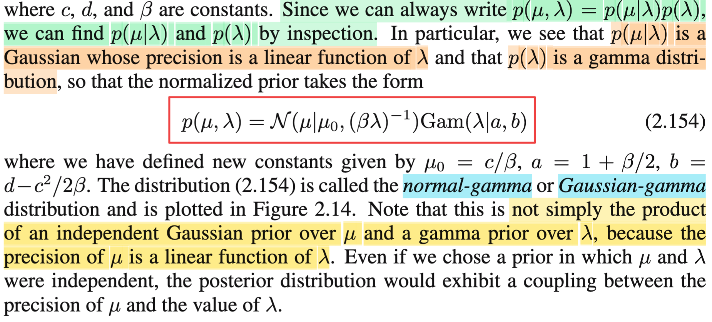</kbd>

> [!NOTE]
> Tiếp, nãy giờ là ta đã làm hai bài toán theo phong cách Bayesian: biết σ^2, infer μ, và biết μ, infer σ^2 (hay đúng hơn là λ = 1/σ^2).
>
>
>
> Có thể nhớ lại chút xíu, rằng với bài toán biết variance, infer Normal μ, ta đã chọn priori là Normal, vì likekihood (joint pdf của sample as a function of μ) có kernel là quadratic function của μ, hay có thể nói luôn, nó chính là một Normal, nên với việc normal là conjugate prior của chính nó, ta chọn priori là normal dẫn đến posterior cũng ra normal.
>
>
>
> Còn qua bài toán biết μ, infer Normal variance σ^2, và để dễ làm, ta infer precision λ = 1/σ^2, thì likelihood lại có dạng là hàm Gamma, và bằng cách dùng conjugate prior của Gamma cũng chính là Gamma, ta có posterior của λ cũng là Gamma. (như vậy qua bài toán đó ta biết thêm một thằng conjugate với chính nó tương tự Normal nữa, chính là Gamma)
>
>
>
> Quay lại, đây, bài này ta sẽ infer cả μ và precision λ, câu hỏi cũng là, nên chọn prior là gì.
>
>
>
> Thế thì tuy có hơi khác hai trường hợp trên, nơi mà ta chỉ infer một thứ, còn ở đây ta infer cả μ lẫn precision λ, nhưng thật ra mình chỉ cần coi như đây là một random vector, để rồi cũng theo quy trình: chọn prior distribution cho (μ, λ), kí hiệu π(μ, λ), rồi dùng Bayes rules để xây dựng posterior distribution của (μ, λ) conditioned on **X** = **x**, và như thường lệ, ta chỉ cần quan tâm đến kernel, không care constant:
>
>
>
> π(μ, λ|**x**) ∝ f(**x**|μ, λ) π(μ, λ)
>
>
>
> π(μ, λ|**x**) ∝ Πi=1:N { \[1/√2π(1/λ)\] exp\[-(xi-μ)^2/(2/λ)\] } π(μ, λ)
>
>
>
> π(μ, λ|**x**) ∝ Πi=1:N { \[2π(λ^-1)\]^(-1/2) exp\[-(λ/2)(xi-μ)^2\] } π(μ, λ)
>
>
>
> π(μ, λ|**x**) ∝ Πi=1:N { (λ^1/2) exp\[-(λ/2)(xi^2-2xiμ+μ^2)\] } π(μ, λ)
>
>
>
> π(μ, λ|**x**) ∝ Πi=1:N { (λ^1/2) exp\[-(λ/2)(xi^2-2xiμ)-(λ/2)μ^2)\] } π(μ, λ)
>
>
>
> π(μ, λ|**x**) ∝ Πi=1:N { (λ^1/2) exp\[-(λ/2)(xi^2-2xiμ)\] exp\[-(λ/2)μ^2)\] } π(μ, λ)
>
>
>
> π(μ, λ|**x**) ∝ Πi=1:N { (λ^1/2) exp(-λμ^2/2)\] exp\[-(λ/2)(xi^2-2xiμ)\] } π(μ, λ)
>
>
>
> π(μ, λ|**x**) ∝ Πi=1:N { (λ^1/2) exp(-λμ^2/2)\] } × Πi=1:N { exp\[-(λ/2)(xi^2-2xiμ)\] } π(μ, λ)
>
>
>
> π(μ, λ|**x**) ∝ { (λ^1/2) exp(-λμ^2/2)\] } ^N × Πi=1:N { exp\[-(λ/2)(xi^2-2xiμ)\] } π(μ, λ)
>
>
>
> π(μ, λ|**x**) ∝ { (λ^1/2) exp(-λμ^2/2)\] } ^N × Πi=1:N { exp\[-(λ/2)xi^2 +(λ/2)2xiμ)\] } π(μ, λ)
>
>
>
> π(μ, λ|**x**) ∝ { (λ^1/2) exp(-λμ^2/2)\] } ^N × Πi=1:N { exp\[-(λ/2)xi^2 + λμxi\] } π(μ, λ)
>
>
>
> π(μ, λ|**x**) ∝ { (λ^1/2) exp(-λμ^2/2)\] } ^N × exp {Σi \[-(λ/2)xi^2 + λμxi\] } π(μ, λ)
>
>
>
> π(μ, λ|**x**) ∝ { (λ^1/2) exp(-λμ^2/2)\] } ^N × exp {-(λ/2)Σixi^2 + λμΣixi } π(μ, λ)
>
>
>
> Tới đây, likelihood, L(λ, μ|**x**) = f(**x**|λ, μ) có dạng { (λ^1/2) exp(-λμ^2/2)\] } ^α × exp {-bλ + aλμ }
>
>
>
> nên nếu muốn posterior có chung dạng với prior, thì prior phải cũng có dạng này vì sao, vì ví dụ như priori có kernel là { (λ^1/2) exp(-λμ^2/2)\] } ^β × exp {-dλ + cλμ } thì khi nhân vào, ta sẽ có:
>
>
>
> { (λ^1/2) exp(-λμ^2/2)\] } ^α × exp {-bλ + aλμ } × { (λ^1/2) exp(-λμ^2/2)\] } ^β × exp {-dλ + cλμ }
>
>
>
> = { (λ^1/2) exp(-λμ^2/2)\] }^(α+β) × exp {- bλ + aλμ - dλ + cλμ }
>
>
>
> = { (λ^1/2) exp(-λμ^2/2)\] }^(α+β) × exp {-(b+d)λ + (a+c)λμ}
>
>
>
> và nó cũng có cùng dạng với kernel của prior.
>
>
>
> Vậy kernel của prior phải có dạng:
>
>
>
> { (λ^1/2) exp(-λμ^2/2)\] } ^β × exp {-dλ + cλμ }
>
>
>
> = (λ^β/2) exp(-βλμ^2/2) × exp (-dλ + cλμ)
>
>
>
> = (λ^β/2) exp(-βλμ^2/2 - dλ + cλμ)
>
>
>
> = (λ^β/2) exp\[(-βλμ^2/2 + cλμ) - dλ\]
>
>
>
> = (λ^β/2) exp\[(-βλ/2)\[μ^2 - 2(c/β)μ)\] - dλ\]
>
>
>
> = (λ^β/2) exp\[(-βλ/2)\[μ^2 - 2(c/β)μ) + (c/β)^2 - (c/β)^2\] - dλ\]
>
>
>
> = (λ^β/2) exp\[(-βλ/2)\[μ^2 - 2(c/β)μ) + (c/β)^2\] - (-βλ/2)(c/β)^2\] - dλ\]
>
>
>
> = (λ^β/2) exp\[(-βλ/2)\[μ^2 - 2(c/β)μ) + (c/b)^2\] + λc^2/2β - dλ\]
>
>
>
> = (λ^β/2) exp\[(-βλ/2)\[μ - c/β\]^2 exp\[λc^2/2β - dλ\]
>
>
>
> = (λ^β/2) exp\[(-βλ/2)\[μ - c/β\]^2 exp\[-(d-c^2/2β)λ\]
>
>
>
> = exp\[(-βλ/2)(μ - c/β)^2\] (λ^β/2) exp\[-(d-c^2/2β)λ\] → 2.153
>
>
>
> ---
>
>
>
> Thế thì mình hiểu thế này, vì π(μ, λ), là joint pdf của μ, λ. Nên dùng conditional probability theorem, ta có π(μ, λ) = π(μ|λ) π(λ)
>
>
>
> Nên từ đó, mình có thể nhìn cái kernel mong muốn của π(μ, λ), là { (λ^1/2) exp(-λμ^2/2)\] }^β × exp {-dλ + cλμ } theo cách thức, là tích của π(μ|λ) π(λ) với
>
>
>
> π(λ) là (λ^β/2) exp\[-(d-c^2/2β)λ\]
>
>
>
> π(μ|λ) là {exp\[(-βλ/2)(μ - c/β)^2\]
>
>
>
> ---
>
>
>
> Xét π(λ) là (λ^β/2) exp\[-(d-c^2/2β)λ\]
>
>
>
> Đặt a = 1 + β/2, b = d-c^2/2β thì exp\[-(d-c^2/2β)λ\] = exp\[-bλ\]
>
>
>
> Đây là kernel của một gamma: vì pdf của Gamma là f(x) = \[1/Γ(α)\] \[β^α\] x^(α-1) e^-xβ
>
>
>
> Nên (λ^β/2) exp\[-(d-c^2/2β)λ\] chính là λ^(a-1)exp(-λb) tương ứng với kernel của Gamma(a, b)
>
>
>
> Còn π(μ|λ) là exp\[(-βλ/2)(μ - c/β)^2\]
>
>
>
> đặt μ0 = c/b, thì exp\[(-βλ/2)(μ - c/β)^2\] là exp\[(-βλ/2)(μ - μ0)^2\], là kernel của normal có μ = μ0, precision là βλ ⇨ variance = 1/βλ
>
>
>
> Trong Casella mình đã học một thứ gọi là các distribution depend nhau: **hierachical model**. Đây chính là cái vụ đó: λ có marginal là một Gamma(a,b), và dựa trên λ, thì μ là một Normal, hay Gaussian(μ, 1/βλ)
>
>
>
> Thì joint distribution của μ và λ, có là một distribution tên gọi là GAUSSIAN-GAMMA.
>
>
>
>  Và lẽ dĩ nhiên priori π(μ, λ) ở đây ko phải là tích của Normal pdf và Gamma pdf, vì trong cái Normal, nó phụ thuộc λ \~ Gamma(a,b)

> [!TIP]
> **🤖 AI Feedback** — ✅ Score: **98/100**
>
> Bài viết của bạn rất xuất sắc, đã đi sâu vào từng bước tính toán từ việc phân tích hàm likelihood đến việc xác định dạng của prior và posterior, làm nổi bật sự phụ thuộc giữa μ và λ trong phân phối Normal-Gamma một cách rõ ràng và chính xác. Một lưu ý nhỏ là hãy kiểm tra lại các biến khi chuyển đổi (ví dụ: c/b nên là c/β) để đảm bảo tính nhất quán tuyệt đối, nhưng điều này không ảnh hưởng đến độ chính xác tổng thể của bài giải.

 

###### Suy luận tham số Gaussian đa biến

<kbd>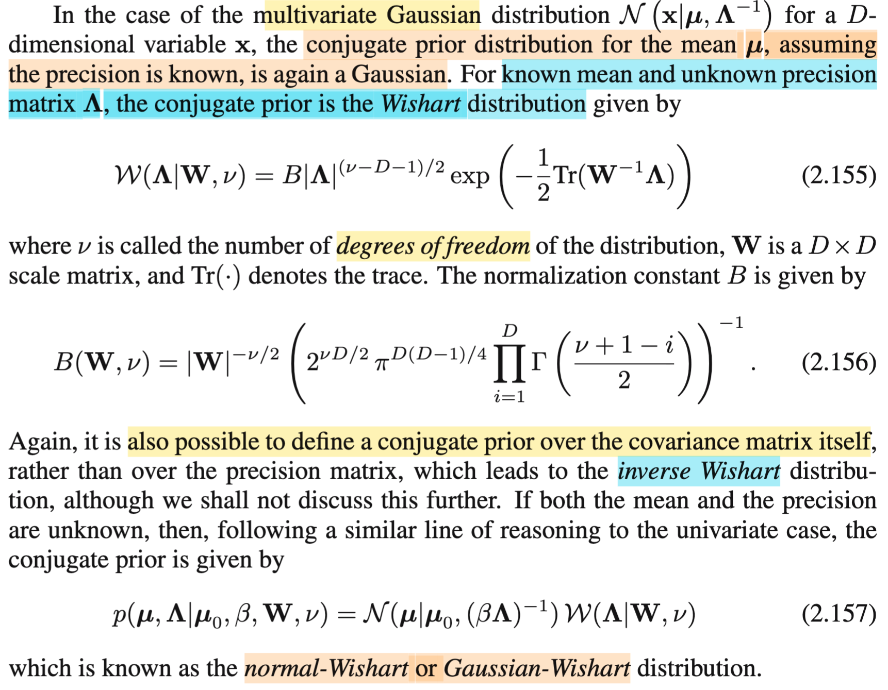</kbd>

> [!NOTE]
> Rồi cái đoạn cuối thì đại khái là nói qua cái trường hợp mà mình muốn suy luận tham số của một cái mô hình Gaussian đa biến. Thì cũng chia ra ba trường hợp. Dĩ nhiên là trước khi nói thì mình nên nói thêm chút xíu là với cái mô hình Gaussian đa biến thì mỗi một cái observe data đó, tức là mỗi một cái data sample đó thì nó là một cái vector, nó là một cái random variable vector. Để rồi toàn bộ cái bộ sample sẽ làm thành ra một cái ma trận. Vậy thì cái case đầu tiên là mình biết covariance matrix và mình muốn infer, mình muốn suy luận cái mean, cái vector mean của cái mô hình multivariate normal này. Thì với cách làm tương tự thì mình cũng sẽ chọn ra một cái prior distribution rồi dùng Bayes theorem để mà xây dựng cái posterior. Thì ta sẽ thấy rằng là với cái mô hình mà multivariate Gaussian thì cái prior distribution cũng là multivariate Gaussian luôn. Để rồi cái posterior nó cũng là Gaussian. Cái này là ở trong mấy cái phần trước mình đã làm rồi. Rồi trường hợp thứ hai là không biết cái covariance matrix và mình muốn infer nó mà đã biết cái mu, đã biết mean rồi.
>
> Thì trong trường hợp này cái prior distribution của nó là một cái loại distribution mà lần đầu tiên mình được thấy. Nó gọi là distribution, nó có cái công thức 2.155. Thì cũng phải nói là cái bài toán này là mình cũng sẽ làm gọi là suy luận cái precision matrix thay vì cái covariance matrix. Nhưng mà nếu mình làm cái cái việc suy luận cái cái covariance matrix đó thì mình cũng sẽ thấy cái prior distribution đó cái conjugate prior nó sẽ là cái inverse Wishart. Rồi cuối cùng nếu mình không biết mean và covariance matrix và mình muốn infer cùng lúc thì mình sẽ cùng mình sẽ infer cái precision và mean cùng lúc thì mình sẽ thấy cái cái prior distribution mà nó conjugate sẽ là normal Wishart hay là Gaussian Wishart. 
>
>
>
> Nói chung cái này nó chỉ là mở rộng hoặc là khái quát hơn của những cái gì nãy giờ làm. Nãy giờ làm là với biết cái covariance matrix xin lỗi, biết cái cái variance rồi để infer mean thì cái prior conjugate là normal để rồi cái posterior cũng là normal. Nếu như mà biết mean và infer cái precision thì cái prior sẽ là gamma để rồi cái posterior cũng là gamma. Cũng đồng nghĩa là nói rằng cái cái prior conjugate của cái trường hợp đó là một cái beta à một cái gamma. Còn nếu như infer cả hai cùng lúc mean và variance thì cái prior conjugate sẽ là một cái phân phối gọi là normal gamma. Đó thì cái case ở đây nó là nó nó khái quát hơn cái chuyện đó.

> [!TIP]
> **🤖 AI Feedback** — ✅ Score: **95/100**
>
> Bài giải thích của bạn rất rõ ràng và chính xác, bao quát đầy đủ cả ba trường hợp của phân phối tiên nghiệm liên hợp cho phân phối Gaussian đa biến, và việc liên hệ với các trường hợp đơn biến thể hiện sự hiểu biết sâu sắc. Để bài làm thêm hoàn thiện, bạn có thể cân nhắc sử dụng ngôn ngữ học thuật hơn một chút.

 

