# 2.3.8 Periodic variables

📊 **Progress:** `7` Notes | `17` Screenshots | `7` AI Reviews

---

<kbd>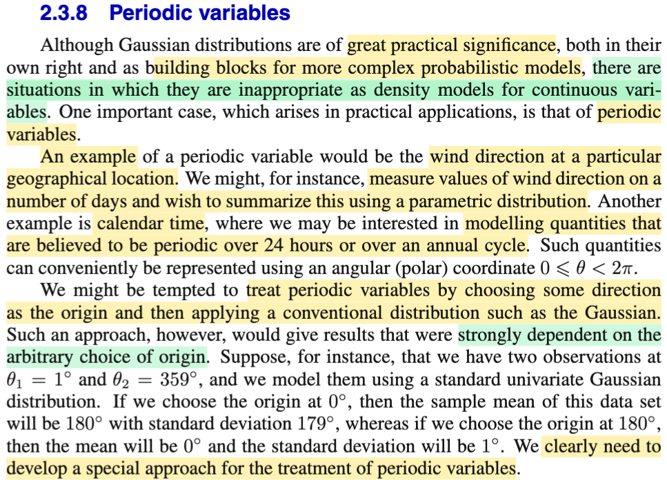</kbd>

> [!NOTE]
> Qua phần này, đại ý là, đầu tiên gs nói rằng, tuy Normal distribution có vai trò khá lớn khi nó có thể là building block của nhiều mô hình xác xuất phức tạp. Tuy nhiên cũng có những mô hình khó có thể dùng Normal để mô phỏng.
>
>
>
> Một trường hợp như vậy là preriodic variable. Ví dụ như hướng gió. (Kiểu như ta cho rằng X1,...Xn là các random variable, mang gía trị là hướng gió. Và muốn estimate distribution của chúng) Thì đoạn này nói rằng, một mô hình như vậy sẽ **phụ thuộc vào gốc tham chiếu nếu ta làm như kiểu thông thường** (ví dụ như dùng các random variable để mang giá trị của các observation và đi xây dựng (inference) tham số của population distribution)
>
>
>
> Ví dụ như ta có 2 observed value của hai random variable θ1, θ2 với θ1 = 1 độ, và θ2 = 359 độ. (θ1, θ2, chỉ là như X1, X2 thôi, là random variable trong sample, chẳng qua là vì trong bài toán này người ta sẽ dùng / đo hướng gió nên các random variable đây thể hiện góc của hướng gió. Có thể hiểu là θ1, θ2 là iid random sample \~ f(θ|μ, σ^2) Thì nếu lấy chọn gốc lại tại 0 độ, thì sample mean sẽ là 180, với standard deviation là 179. Nhưng nếu chọn gốc tại θ0 = 180 thì sample mean lại là 0, và standard deviation lại là 1.
>
>
>
> Do đó ta cần một cách tiếp cận đặc biệt để xử lý khi deal với periodic variable

> [!TIP]
> **🤖 AI Feedback** — ✅ Score: **97/100**
>
> Tóm tắt rất chính xác và đầy đủ các ý chính, bao gồm cả ví dụ minh họa cụ thể về sự phụ thuộc vào gốc tham chiếu. Để tăng tính súc tích, bạn có thể cân nhắc cô đọng hơn một số phần giải thích trong dấu ngoặc đơn.

 

## Đại diện hướng gió bằng véc-tơ

<kbd>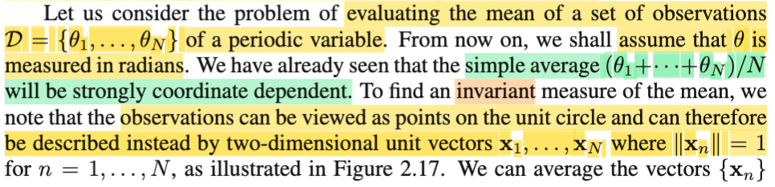</kbd>

<kbd>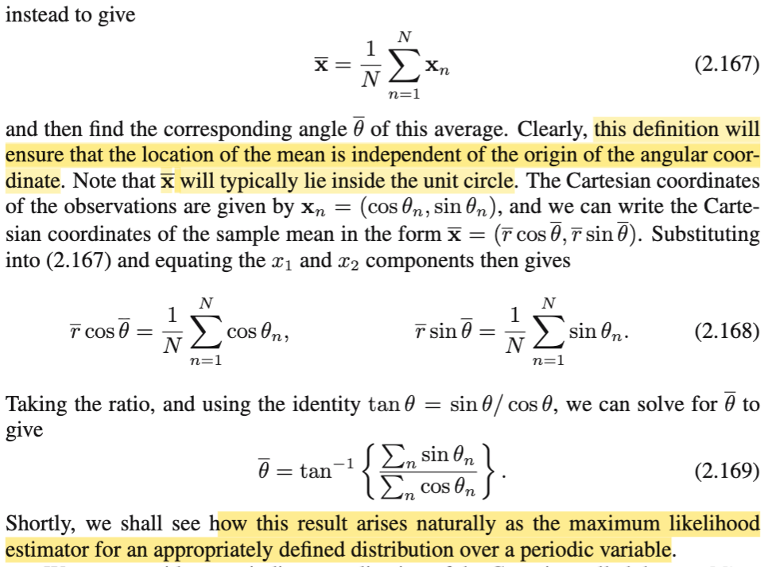</kbd>

<kbd>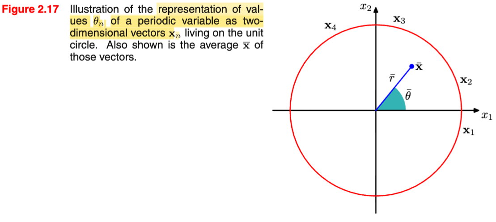</kbd>

> [!NOTE]
> Ok, đại khái là, cách tiếp cận khác sẽ là như sau: Vì mục đích là mô hình hóa hướng gió, và đại lượng hướng, ngoài cách làm dùng hệ tọa độ cực (polar coordinate) và dùng thông số góc, để đại diện, thì vẫn có thể dùng một cặp giá trị (x1,x2), tức một 2D vector **x**, nằm trên unit circle để đại diện, vì lẽ dĩ nhiên mỗi một điểm như vậy, sẽ mang thông tin của một giá trị góc, và vì ta chỉ quan tâm đến hướng, nên ta chỉ cần xét những điểm nằm trên unit circle thôi.
>
>
>
> Νhư vậy, giả sử với observed value của sample θ1, θ2,...θN, sẽ tương ứng với sampe, **x**1, **x**2, ...**x**N.
>
>
>
> Từ đó sample mean θbar = (Σi θi)/N sẽ tương ứng với sample mean **x**bar = (Σi **x**i)/N
>
>
>
> Rồi, vì θn sẽ liên hệ với **x**n thông qua: **x**n = (**x**n_1, **x**n_2) = (cos θn, sin θn) nên 
>
>
>
> **xbar** = (**x**bar_1, **x**bar_2) = (rbar × cos(θbar), rbar × sin(θbar)).
>
>
>
>  và từ đó, 
>
>
>
> tan(θbar) = **x**bar_1 / **x**bar_2 
>
>
>
> = \[(1/N) Σi **x**i_1\] / \[(1/N) Σi **x**i_2\] 
>
>
>
> = Σi **x**i_1 / Σi **x**i_2 
>
>
>
> = Σi **x**i_1 / Σi **x**i_2
>
>
>
> = Σi sin(θi) / Σi cos(θi)
>
>
>
> ⇨ θbar = argtan(Σi sin(θi) / Σi cos(θi))  → 2.169
>
>
>
> Nói chung ko có gì khó hiểu cả, chỉ là, thay vì ta dùng thước đo là góc θ để ghi nhận, thể hiện giá trị của các data (đồng nghĩa ta dùng Polar coordinate), thì ta dùng 2D vector **x** trên đường tròn unit, để ghi nhận cùng một quan sát. Từ đó, bằng cách này, ta không còn bị cái vụ phụ thuộc vào mốc làm chuẩn nữa.

> [!TIP]
> **🤖 AI Feedback** — ✅ Score: **92/100**
>
> Bạn đã nắm vững lý do cần chuyển đổi sang vector 2D và cách thức suy ra công thức góc trung bình một cách rõ ràng và logic, giải quyết được vấn đề phụ thuộc hệ tọa độ. Tuy nhiên, hãy cẩn thận hơn một chút với thứ tự của các thành phần khi tính tan(θbar) trong các bước trung gian (phải là x_bar_2 / x_bar_1), dù kết quả cuối cùng của bạn vẫn đúng.

 

### Von Mises Distribution

<kbd>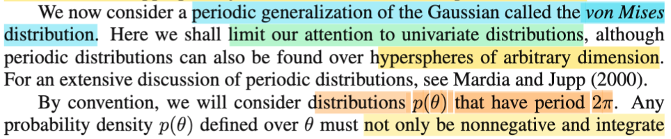</kbd>

<kbd>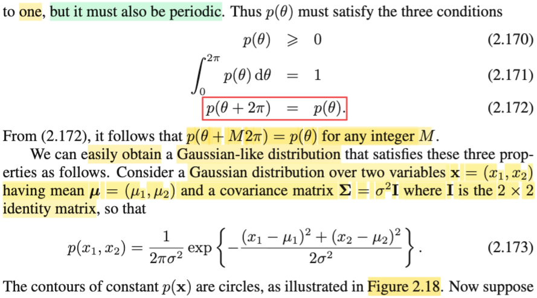</kbd>

<kbd>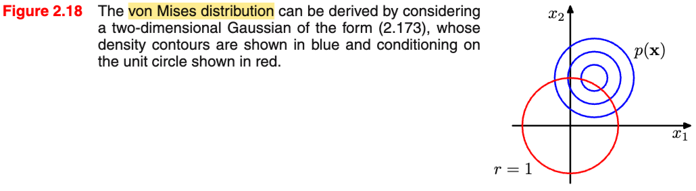</kbd>

> [!NOTE]
> Rồi, thế thì, ta sẽ được học một phiên bản khái quát của phân phối Normal, có tên gọi là von Mises. Và sẽ chỉ làm với case đơn biến.
>
>
>
> Theo quy ước ta sẽ xét distribution f(θ) có chu kì 2π.
>
>
>
> Thế thì, vì tính chất perdiod, nên đại ý là, ngoài hai đặc điểm của một valid pdf: không âm và intergrate = 1, thì nó còn phải thỏa f(θ + 2π) = f(θ).
>
>
>
> Và ta sẽ bắt đầu việc derive ra công thức của pdf von Mises như sau: Xét một phân phối Normal 2D: **X** \~ Normal(**μ**, **Σ**) có mean là **μ** = (μ1, μ2), covariance là σ^2 **I** (là 2x2 matrix).
>
>
>
> Công thức 2.173 là sao?
>
>
>
> Còn nhớ công thức của multivariate Gaussian:
>
>
>
> f**X**(**x**|**μ**,Σ) = công thức 2.43 = \[1/(2π)^(D/2)\] \[1/|**Σ**|^1/2\] exp\[-1/2(**x**-**μ**)T **Σ**inv(**x**-**μ**)\]
>
>
>
> Thì ở đây với D = 2, và **Σ** = σ^2 **I**, thì |**Σ**| = (σ^2)^2 ⇨ |**Σ**|^1/2 = σ^2.
>
>
>
> Và **Σinv** sẽ là (1/σ^2) **I ⇨ Σ**inv(**x**-**μ**) = \[(x1-μ1)/σ^2; (x2-μ2)/σ^2\]T
>
>
>
> ⇨ (**x**-**μ**)T **Σ**inv(**x**-**μ**) = \[x1-μ1; x2-μ2\] dot product \[(x1-μ1)/σ^2; (x2-μ2)/σ^2\]
>
>
>
> = (x1-μ1)^2/σ^2 + (x2-μ2)^2/σ^2
>
>
>
> = \[(x1-μ1)^2 + (x2-μ2)^2\] /σ^2
>
>
>
> Thay vào ta sẽ có f(**x**|**μ**,**Σ**) = (1/2πσ^2) exp{-(1/2σ^2)\[(x1-μ1)^2 + (x2-μ2)^2\]}
>
>
>
> ---
>
>
>
> Và contour plot của hàm pdf này là những đường tròn trên hình 2.18, vì sao:
>
>
>
> Thì chỉ cần xét một c level curve: f(x) = c
>
>
>
> ⇔ (1/2πσ^2) exp{-(1/2σ^2)\[(x1-μ1)^2 + (x2-μ2)^2\]} = c
>
>
>
> ⇔ exp{-(1/2σ^2)\[(x1-μ1)^2 + (x2-μ2)^2\]} = c 2πσ^2
>
>
>
> ⇔ -(1/2σ^2)\[(x1-μ1)^2 + (x2-μ2)^2\] = log(c 2πσ^2)
>
>
>
> ⇔ (x1-μ1)^2 + (x2-μ2)^2 = - log(c 2πσ^2) 2σ^2  = constant d
>
>
>
> Thì đây là phương trình đường tròn tâm tại μ, bán kính √d

> [!TIP]
> **🤖 AI Feedback** — ✅ Score: **98/100**
>
> Bài ghi rất chính xác và có chiều sâu, đặc biệt là phần chứng minh chi tiết công thức 2.173 và giải thích vì sao đồ thị contour là hình tròn. Bạn đã thể hiện sự hiểu biết vững chắc về các khái niệm.

 

#### Gaussian distribution polar coordinates

<kbd>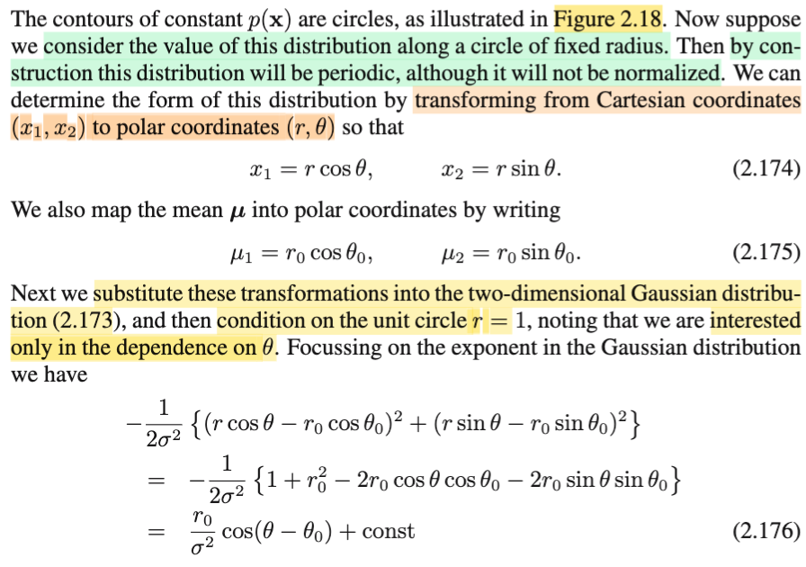</kbd>

<kbd>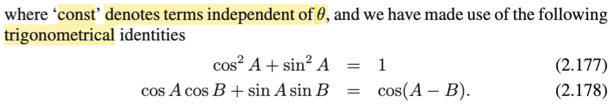</kbd>

<kbd>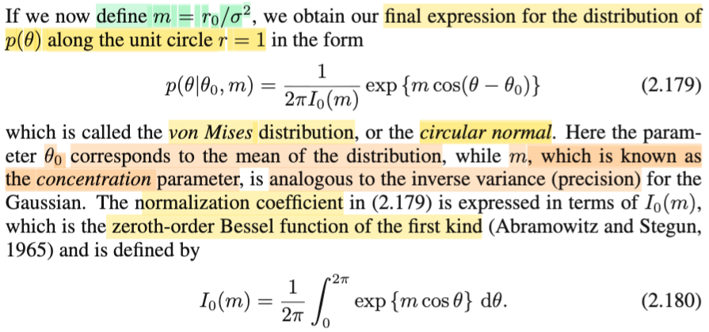</kbd>

> [!NOTE]
> Từ note trước ta đã hiểu f(**x**|**μ**,**Σ**) = (1/2πσ^2) exp{-(1/2σ^2)\[(x1-μ1)^2 + (x2-μ2)^2\]}
>
>
>
> Bước tiếp theo là đổi biến x1 = r cos(θ), x2 = r sin(θ), và xét trong phạm vi circle unit
>
>
>
> Theo change of variable theorem đã học ở Stat110 hoặc Casella, cụ thể ở đây là bivariate change of variable:
>
> Ôn lại nhanh, với random variable vector (X,Y) có pdf fX,Y(x,y), và ta có U = g1(X,Y), V = g2(X,Y), với mapping 1-1 từ support set của (X,Y) với support set của (U,V): X = h1(U,V), Y = h2(U,V), thì change of variable theorem cho ta:
>
>
>
> fU,V(u,v) = fX,Y(x,y) |∂(x,y)/∂(u,v)| = fX,Y(h1(u,v), h2(u,v)) |∂(x,y)/∂(u,v)|
>
>
>
> với |∂(x,y)/∂(u,v)| là trị tuyệt đối của Jacobian matrix của hàm vector → vector: \[g1(u,v), g2(u,v)\]
>
>
>
> Áp dụng vào đây
>
>
>
> f(θ, r) = f(x1,x2) |det J|, với J là jacobian matrix: matrix ∂(x1,x2)/∂(θ,r)
>
>
>
> (có thể tính |det J| ra ko khó, vì matrix này là matrix 2x2: \[∂x1/∂θ, ∂x1/∂r; ∂x2/∂θ, ∂x2/∂r\] = \[cos(θ), -rsin(θ); sin(θ), rcos(θ)\] = rcos(θ)cos(θ) - \[-rsin(θ)sin(θ)\] = r\[cos(θ)^2 + sin(θ)^2\] = r ⇨ |det J| = |r| = r)
>
>
>
> = f(r cos(θ), r sin(θ)) r
>
>
>
> = (r/2πσ^2) exp{-(1/2σ^2)\[(r cos(θ)-μ1)^2 + (r sin(θ)-μ2)^2\]}
>
>
>
> Tiếp, như thường lệ, ta sẽ chỉ cần quan tâm quadratic form (vì constant bên ngoài, chỉ đóng vai normazing constant):
>
>
>
> = -(1/2σ^2)\[(r cos(θ)-μ1)^2 + (r sin(θ)-μ2)^2\]
>
>
>
> = -(1/2σ^2)\[r^2 cos(θ)^2 - 2r μ1 cos(θ) + μ1^2 + r^2 sin(θ)^2 - 2r μ2 sin(θ) + μ2^2\]
>
>
>
> = -(1/2σ^2)\[r^2 (cos(θ)^2 + sin(θ)^2) - 2 r μ1 cos(θ) - 2 r μ2 sin(θ) + μ1^2 + μ2^2\]
>
>
>
> gọi (θ0, r0) là tọa độ tương ứng của (μ1, μ2) trong polar coordinate, ta thay vào luôn
>
>
>
> = -(1/2σ^2)\[r^2 - 2 r r0 cos(θ0) cos(θ) - 2 r r0 sin(θ0) sin(θ) + (r0 cos θ0)^2 + (r0 sin θ0)^2\]
>
>
>
> Dùng điều kiện r = 1 (do đang chỉ xét trong phạm vi trên đường unit circle)
>
>
>
> = -(1/2σ^2)\[1 - 2 r0 cos(θ0) cos(θ) - 2 r0 sin(θ0) sin(θ) + r0^2\]
>
>
>
> = -(1/2σ^2)\[1 + r0^2 - 2 r0 cos(θ0) cos(θ) - 2 r0 sin(θ0) sin(θ)\]
>
>
>
> = -(1/2σ^2)\[1 + r0^2 - 2 r0 cos(θ0) cos(θ) - 2 r0 sin(θ0) sin(θ)\]
>
>
>
> = -(1/2σ^2)(1 + r0^2) + (1/2σ^2)\[2 r0 cos(θ0) cos(θ) + 2 r0 sin(θ0) sin(θ)\]
>
>
>
> = const + (r0/σ^2)\[cos(θ0) cos(θ) + sin(θ0) sin(θ)\]
>
>
>
> = (r0/2σ^2)\[cos(θ0) cos(θ) + sin(θ0) sin(θ)\] + const
>
>
>
> = (r0/σ^2)\[cos(θ - θ0)\] + const
>
>
>
> ---
>
>
>
> Rồi, tới đây ta có:
>
>
>
> f(θ) = (1/2πσ^2) exp{(r0/σ^2)cos(θ - θ0) + const} |J|
>
>
>
> Nhưng vì ta đã làm động tác chỉ xét trên phạm vi đường tròn unit, nên bản thân cái vế phải không còn là một valid pdf nữa, hay nói cách khác, ta sẽ phải normalizing nó. Thành ra, những hằng số cụ thể ở đây ko còn đóng vai trò biểu hiện chính xác của normalizing constant nữa, nên ta ko cần care nữa cho mệt, chỉ cứ làm theo lối thông dụng: quan tâm đến kernel, và định nghĩa normalizing constant sau.
>
>
>
> Đặt m = r0 / σ^2
>
>
>
> f(θ) ∝ exp{m cos(θ - θ0)}
>
>
>
> ∝ exp{m cos(θ - θ0)}
>
>
>
> Và vì tính valid: ∫0:2π f(θ) dθ = 1 ⇔ ∫0:2π \[normalizing constant\] exp{m cos(θ - θ0)\] dθ = 1
>
>
>
> ⇔ \[normalizing constant\] ∫0:2π exp{m cos(θ - θ0)\] dθ = 1
>
>
>
> ⇔ ∫0:2π exp{m cos(θ - θ0)\] dθ = 1/\[normalizing constant\]
>
>
>
> Vậy f(θ) = \[normalizing constant\] exp{m cos(θ - θ0)}
>
>
>
> với \[normalizing constant\] = 1/∫0:2π exp{m cos(θ - θ0)\] dθ
>
>
>
> Và người ta đặt cái tích phân ở mẫu số là 2πI0(m):
>
>
>
> 2πI0(m) = ∫0:2π exp{m cos(θ - θ0)\] dθ
>
>
>
> ⇔ I0(m) = (1/2π) ∫0:2π exp{m cos(θ - θ0)\] dθ, và cái này được gọi là **hàm Bessel bậc zero of the fisrt kind** (tạm biết vậy thôi)
>
>
>
> ∫0:2π exp{m cos(θ - θ0)\] dθ = 2πI0(m) ⇔ (1/2π) ∫0:2π exp{m cos(θ - θ0)\] dθ = I0(m) , để rồi:
>
>
>
> f(θ) = \[1/2πI0(m)\] exp{m cos(θ - θ0)}
>
>
>
> Vậy là ta đã có von Mises distribution, còn gọi là **CIRCULAR NORMAL**, có mean là θ0, m là tham số **CONCENTRATION** , tương đương với **inverse variance** (precision) trong phân phối normal thông thường.
>
>
>
> ---
>
>
>
>
>
> Mình nên nói thêm chút xíu. Đại ý của cái ý tưởng của chuyện mà nãy giờ làm. Mục đích là như đã nói là muốn xây dựng một cái phân phối chuẩn nhưng mà dành cho một cái đại lượng có tính chất là periodic, có nghĩa là tính chất chu kỳ. Cái tính chất chu kỳ á nó nó là một cái tính chất mà trong một số cái trường hợp, một số cái bài toán thực tế nó phát sinh. Ví dụ, khi mà mình muốn xét một cái đại lượng mang ý nghĩa là hướng. Thì kiểu như là bây giờ cái hướng nó xoay vòng vòng. Thì nó xoay vòng vòng nó có một cái tính chất đó là khi mà mình thay đổi, ví dụ như từ hướng 1 giờ mình thay đổi thành hướng 2 giờ thì thì nó nó là giá trị nó thay đổi. Tức là nó ra một cái hướng khác. Rồi từ 2 giờ nó thành 3 giờ thì nó ra một hướng khác, nó giống như cái chuyện mà mình thay đổi trên trục số từ x1 bằng 1, từ x2 bằng 2, từ x3. Nhưng mà khi mà mình thay đổi đến cái hướng đến một cái mức nào đó nó lại quay lại vị trí cũ. Thì đó là cái tính periodic, tính chu kỳ. Thì cái này mình lại không thể nào phản ánh nó bằng những cái biến ngẫu nhiên mà mang giá trị thực được. Bởi vì giá trị thực nó không có cái chuyện đó, x1 bằng 1, x2 bằng 2, bằng 3, nếu mà nó tiếp tục tăng thì nó không bao giờ nó quay lại được cũ cả. Do đó là mình phải tìm cách là ép hoặc là xây dựng một cái phân phối chuẩn nhưng có cái tính chất chu kỳ để dành để riêng cho việc mô hình hóa những cái biến periodic.
>
>
>
>
>
> Vậy thì cái ý tưởng Đại khái là mình cứ nhìn vô cái hình trong sách. Người ta bắt đầu với một cái mô hình normal. Xét một cái hàm một cái hàm density. Cái hàm density đặc biệt ở chỗ này là nó cái hàm cái đường màu đỏ là đại khái vậy. Mình đang có một cái hàm hai biến một cái chuông ở trong không gian 3D, đúng không? Mình có cái hàm hai biến. Bây giờ mình mới restrict nó trên một cái đường tròn unit. Thì khi đó cái hàm số mà hai biến, cái hàm PDF của normal đó nhưng mà bị restrict trên một cái đường tròn đơn vị thì lúc bây giờ nó chỉ còn là một cái hàm một biến. Mà khi mà mình đi trên cái đường tròn đó thì nó có một cái tính chất thế này. Đó là khi mà mình đi một vòng thì mình lại về lại chỗ cũ. Ví dụ như mình xuất phát tại cái điểm mà tại đó cái độ lớn hàm PDF là lớn nhất đi thì khi mình đi đúng một vòng thì mình lại quay lại đúng cái chỗ cũ. Tức là mình có được một cái hàm số có cái tính chất là chu kỳ.
>
>
>
>
>
> Và mình cứ hình dung là khi mà mình di chuyển trên cái đường đó đó thì mình sẽ ví dụ như điểm bắt đầu của mình nó nói là cái điểm mà có cái có cái độ cao cao nhất, tức là cái giá trị density cao nhất. Nó là cái điểm mà nằm bên phải và nói chung là ở cái gốc bên phải ở bên trên á. Nằm đâu khúc giữa mà nó gần với cái cái cái tâm nhất của mấy cái đường màu xanh á. Thì mình cứ hiểu đại khái nó là giống như là một cái là nó ứng với tâm của cái phân phối vậy. Rồi để coi rồi mình đi mình đi trên cái đường tròn màu đỏ đó thì cái density nó giảm dần. Nhưng mà khi mình đi qua phía bên kia thì density lại tăng lên dần và nó lại về lại vị trí cũ. Và dĩ nhiên là khi mà mình đã restrict cái hàm normal PDF ở trên cái đường màu đỏ thì lúc bấy giờ nó không còn có cái tính hợp lệ để trở thành một cái PDF nữa. Do đó mình phải có cái bước gọi là normalizing. Cái bước chuẩn hóa. Nhưng mà cái kiểu như là cái cái cách biến thiên của cái hàm mà gọi là circulating Gaussian này nó cũng có cái dạng của hình chuông nhưng mà nó lại có cái tính periodic. Nó hay là chỗ đó.

> [!TIP]
> **🤖 AI Feedback** — ✅ Score: **99/100**
>
> Bài viết của bạn thể hiện sự hiểu biết sâu sắc và toàn diện về phân phối von Mises, từ quá trình biến đổi tọa độ với Jacobian đến lý do tồn tại của nó. Bạn đã làm rất tốt việc giải thích cả khía cạnh toán học và trực giác của chủ đề này.

 

##### Figure 2.19 von Mises Distribution

<kbd>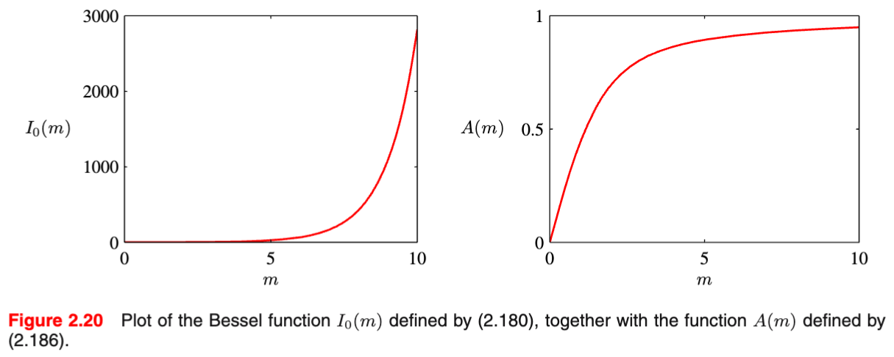</kbd>

<kbd>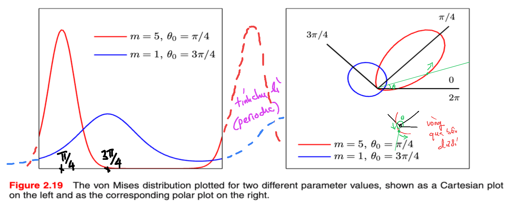</kbd>

> [!NOTE]
> Ôn nhanh lại chút xíu về Circulating Gaussian: Đại ý là, ta muốn mô hình hóa các đại lượng mang tính chu kì, gọi là periodic variable, và cụ thể hơn, ta muốn xây dựng một phân phối Normal đối với periodic variable. Vậy thì, đại khái là, đầu tiên, lấy ví dụ yếu tố cần mô phỏng là hướng gió, thì nếu chỉ biểu diễn theo lối thông thường, ta sẽ có kết quả rất phụ thuộc vào gốc.
>
>
>
> Ý là, ví dụ nếu như cứ cho X1,X2,...Xn là các random variable thể hiện cho các giá trị quan sát của hướng gió (còn nhớ, trong Casella đã học định nghĩa của random sample size n: Tiến hành quan sát giá trị của một đại lượng ngẫu nhiên n lần, mỗi lần dùng một random variable Xi để ghi nhận giá trị của nó, và thực hiện theo lối sao cho các random variable mutually independent và có cùng distribution. Vì tính chất random của đại lượng được quan sát nên dĩ nhiên Xi là random variable, vì nó có thể có nhiều possible values), thì vấn đề là, hướng gió (giả sử dùng đơn vị độ) 179 độ và 1 độ thật ra rất gần nhau. Dẫn đến vấn đề là, nếu ta chọn gốc khác thì mô hình sẽ khác. Ví dụ, chọn gốc tham chiếu là mốc 0 độ thì sample mean sẽ khác, mà chọn ở mốc khác thì sample mean sẽ khác.
>
>
>
> Do đó, ta mới dùng một cách tiếp cận khác: Đó là thay vì dùng góc θ để biểu diễn hướng gió, đồng nghĩa là đang dùng hệ tọa độ cực (polar coordinate) thì ta sẽ dùng hệ tọa độ Cartesian, tức là cứ dùng các vector 2D, và vì chỉ quan tâm hướng, nên ta cho chúng có độ dài bằng nhau, và tiện nhất là cho bằng 1, để sự khác nhau của các vector sẽ thể hiện sự khác nhau của hướng gió. Bằng cách này, ta loại bỏ sự phụ thuộc vào gốc tham chiếu khi sample mean luôn là sample mean (ý là ko phải bị phụ thuộc gốc tham chiếu như dùng góc). Và ta đi đến công thức:
>
>
>
> **θbar = argtan(Σi sin(θi) / Σi cos(θi))**
>
>
>
> Và đại ý là, khi ta đi xây dựng một phân phối Chuẩn dành cho biến periodic, ta sẽ thấy đây chính là công thức của ML estimator của mean θ của phân phối đó (y như Xbar, tức sample mean cũng là ML estimator của μ vậy)
>
>
>
> Thế rồi, để đi xây dựng một phân phối chuẩn nhưng dành cho biến chu kì (periodic variable), người ta có ý tưởng làm như sau: Lôi một phân phối 2D Normal(**μ**, σ^2 × **I**), và phương hướng làm (xây dựng một hàm density có tính chất của một phân phối Normal hình chuông nhưng lại có tính chu kì, đó là pdf tại θ + 2π phải bằng pdf tại θ (theo quy ước, người ta dùng chu kì 2π) như sau: CHUYỂN HÀM NORMAL SANG BIẾN θ, r (dùng change of variable, để xây dựng pdf của θ, r từ pdf của X1, X2), sau đó, GIỚI HẠN NÓ TRÊN RÀNG BUỘC R = 1. Lúc này, ta được một cái hàm density có tính chất chu kì (có được là do ràng buộc r = 1, khiến khi θ thay đổi, sẽ tương ứng ta chạy vòng quanh đường tròn đơn vị → mang lại tính chu kì) và đồng thời thừa hưởng đặc điểm của phân phối Normal, vì kiểu như khi chạy một vòng quanh đường tròn đơn vị, giá trị hàm số cũng thay đổi theo hình chuông: cao khi tới gần góc phần tư thứ 1, giảm khi đi xa ra khỏi đó.
>
>
>
> Và nhiệm vụ còn lại, là, đặt ra normalizing function để giúp cái hàm density này trở thành valid: tích phân toàn miền = 1 (vì khi ta giới hàn hàm Normal density trên r = 1, thì đã không còn valid là pdf ở điều kiện tích phân toàn miền bằng 1 nữa)
>
>
>
> Và kết qủa là ta có công thức của phân phối Von Mises, còn gọi là Circulating Gaussian:
>
>
>
> **f(θ) = \[1/2πI0(m)\] exp{m cos(θ - θ0)}**
>
>
>
> với θ là mean tương ứng với μ của normal thông thường
>
>
>
> và m là concentration, tương tự precision của normal thông thường
>
>
>
> Và để ý tính periodic của nó: f(θ + 2π) = \[1/2πI0(m)\] exp{m cos(θ - θ0 + 2π)} đúng là bằng f(θ) vì cos(α + 2π) = cos(α)
>
>
>
> ---
>
>
>
> Rồi, như trên là mình đã ôn lại ý tưởng chính giúp derive ra pdf của **Von Mises**, quay lại đây, hình này sẽ hiểu như sau:
>
>
>
> Bên trái: khi thay đổi θ: chạy từ trái sang phải, chính là thay đổi θ, thì pdf của Von Mises (π/4, 5) sẽ có giá trị cao nhất tại π/4, và của Von Miese (3 π/4, 1) là tại 3π/4, rất dễ hiểu. Tham số m, concentration, có thể thấy, chi phối sự dàn trải của xác suất, với màu đỏ (m = 5), nó có sự tập trung xác suất cao, dẫn đến hình chuông đỏ ốm, cao, ngược lại với màu xanh. Và cả hai đều thể hiện tính chu kì, khi có thể thấy khi tại 2π, đường cong giống như tiếp nối với khúc đầu.
>
>
>
>
>
> Còn cái hình bên phải thì thật ra là mình đang nhìn theo tọa độ cực. Có nghĩa là với hình bên trái là khi mình chạy từ trái sang phải, có nghĩa là mình sẽ thay đổi cái góc theta từ 0 đến 2 pi. Nhưng mà ở bên phải là mình sẽ hiểu rằng là mình **xoay cái góc theta quanh cái điểm gốc tọa độ**. Mình xoay cái góc để từ 0 radian đến 2 pi radian. Thì với cái góc nhìn đó thì mình sẽ thấy rằng là cái khoảng cách từ một cái điểm ở trên đường màu đỏ với cái tâm nó chính là giá trị của density function. Để rồi mình thấy rằng khi mình xoay mình tăng cái góc theta lên thì nó sẽ khi từ 0 radian tăng lên dần đến pi/4 thì nó sẽ đạt giá trị lớn nhất. và tiếp tục cho cái điểm giao điểm với cái của cái đường mà mình vẽ với cái đường Elip màu đỏ nó di chuyển trên cái đường Elip thì mình sẽ thấy rằng nó sẽ cái góc nó sẽ tăng lên nó sẽ tiếp tục tăng lên và quét hết toàn bộ một vòng từ 0 pi 0 đến 2pi.
>
>
>
> Cần hiểu đường màu đỏ đi rất sát gốc tọa độ, nhưng thật ra nó hơi vòng xuống dưới, vì góc θ sẽ quét từ 0 → 2π, chỉ là ở phía đối diện với π/4, giá trị xác suất ≈ 0. Cho dễ hình dung, cứ tưởng tượng ta có sợ dây thun, và cây đinh là gốc tọa độ, thì thực tế là tròng sợi dây thun vào cây đinh, và giữ ngón tay ở đầu π/4.

> [!TIP]
> **🤖 AI Feedback** — ✅ Score: **98/100**
>
> Ghi chú của bạn cực kỳ chi tiết, chính xác và thể hiện sự hiểu biết sâu sắc về phân phối Von Mises, từ động lực, quá trình dẫn xuất đến cách các tham số ảnh hưởng đến hình dạng phân phối trên cả hai loại biểu đồ. Bạn đã phân tích biểu đồ cực rất sắc sảo, giải thích rõ ràng mối quan hệ giữa giá trị hàm mật độ và khoảng cách từ tâm. Để ghi chú cô đọng hơn, bạn có thể cân nhắc rút gọn một số đoạn giải thích phụ, nhưng nhìn chung đây là một ghi chú học tập xuất sắc.

 

###### Maximum Likelihood Estimators for Von Mises

<kbd>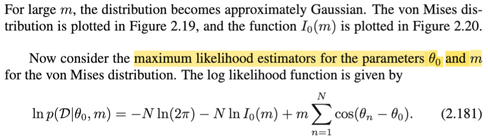</kbd>

<kbd>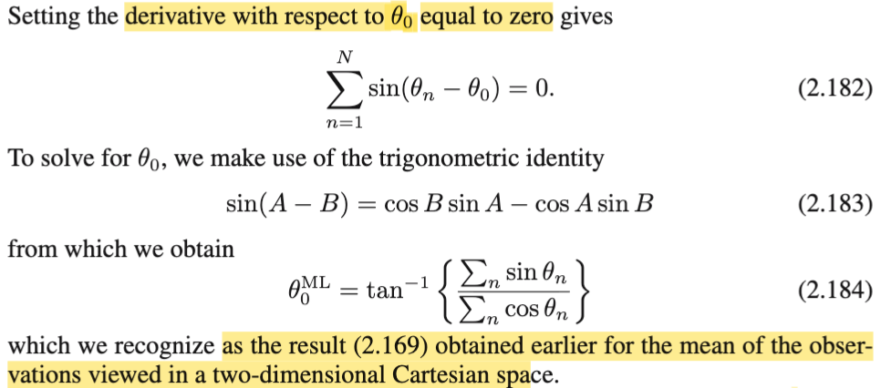</kbd>

> [!NOTE]
> Tới đây, đại khái là ta sẽ đi tìm công thức của ML estimator của Von Mises mean θ.
>
>
>
> Có nghĩa là, ta lại quay lại bài toán inference: point estimation θ, của một random sample θ1, θ2,....θn (gom tụi này lại kí hiệu là D) iid \~ Von Mises (θ0, m).
>
>
>
>  Như đã biết, chính là ta giải bài toán tối ưu sau:
>
>
>
> maximize over θ {L(θ|D)} với L là likelihood function, theo định nghĩa là hàm của tham số θ, được tính bởi joint pdf của các random variable của random sample, evaluate tại observed value, L(θ|D) = f(D|θ)
>
>
>
> (chỗ này dễ lú, nên nhắc lại lí thuyết chút: trong cách thể hiện theo lí thuyết trong sách Casella, ta có random sample X = X1,X2,...Xn, độc lập, và có cùng phân phối f(x|θ), và ta muốn infer θ, tức là xây dựng hàm W(**X**), sao cho giá trị W(**x**), tức W(**X**) evaluate tại giá trị quan sát **X** = **x** = (x1,x2,....xn) sẽ có thể estimate tốt cho giá trị θ chưa biết. Và một trong cách làm, đó là dùng hàm W(**X**) = argmax L(θ|**X**), gọi là maximum likelihood, có nghĩa là, viêc đi giải bài tóan tối ưu này sẽ cho ta ra một cái hàm theo **X**, mà khi lắp giá trị quan sát được của **X** vào, tức W(**x**) = argmax L(θ|**x**), thì ta sẽ có giá trị θ hợp lí nhất giải thích cho sự kiện **X** = **x**.
>
>
>
> Vậy thì ở đây, nên hiểu là ta có các random variable θ1, θ2,...θn độc lập, và có cùng distribution f(θ|θ0, m), với f là pdf của Von Mises distribution. Và ta sẽ làm cái việc là suy luận / point estimate giá trị của (θ0,m) (θ trong bài toán khái quát chỉ mọi tham số của population, thì ở đây là (θ0, m). Vậy thì cũng y như trên, nhiệm vụ là đi xây dựng một hàm W(θ1, θ2,....), tức W(D) sao cho khi lắp các giá trị quan sát được của D vào thì ta sẽ có một estimate tốt cho (θ0,m). Và cách làm là ta sẽ dùng hàm W(D) = argmax L(θ0,m|D), để khi đó, W(D) sẽ mang giá trị θ0, m hợp lí nhất, giúp giải thích cho việc quan sát thấy giá trị cụ thể của D.
>
>
>
> Rồi, vậy ta có bài toán maximize over θ0,m {L(θ0,m|D)}
>
>
>
> xét hàm mục tiêu L(θ0,m|D), như định nghĩa, nó là joint pdf của θ1, ...θn (với tư cách tên biến) tại observed value của D,
>
> và vì tính chất iid, nên joint pdf có thể tách thành tích các marginal pdf:
>
>
>
> = Πi=1:n f(θi|θ0, m)
>
>
>
> = Πi=1:n \[1/2πI0(m)\] exp{m cos(θi - θ0)}
>
>
>
> = \[1/2πI0(m)\]^n Πi=1:n \[exp{m cos(θi - θ0)}\]
>
>
>
> = {\[1/2πI0(m)\]^n} × exp{m Σi=1:n cos(θi - θ0)}
>
>
>
> Tiếp, như đã biết, ta có thể dùng hàm log để chuyển thành bài toán tương đương vì nó là hàm monotone:
>
>
>
> Hay dùng kí hiệu tỉ lệ thuận, ta nói hàm mục tiêu gốc (likelihood, tỉ lệ thuận với)
>
>
>
> ∝ ln { \[1/2πI0(m)\]^n × exp{m Σi=1:n cos(θi - θ0)}}
>
>
>
> = n ln \[1/2πI0(m)\] + ln exp{m Σi=1:n cos(θi - θ0)}
>
>
>
> = -n ln \[2πI0(m)\] + m Σi=1:n cos(θi - θ0)
>
>
>
> = -n ln(2π) - n ln\[I0(m)\] + m Σi=1:n cos(θi - θ0) → đây là 2.181
>
>
>
> Có nghĩa là lúc này, ta sẽ có bài toán tối ưu tương đương (equivalent optmization problem):
>
>
>
> maximize over θ0,m ln f(D|θ0, m) = -n ln(2π) - n ln\[I0(m)\] + m Σi=1:n cos(θi - θ0)
>
>
>
> Rồi, đây là bài toán tối ưu với hai biến tối ưu, θ0, m. Ta có thể giải theo từng biến, giải theo θ0 trước. Dùng first order necessary condition, tìm stationary point:
>
>
>
> d/dθ0 \[-n ln(2π) - n ln\[I0(m)\] + m Σi=1:n cos(θi - θ0)\] = 0
>
>
>
> ⇔ m \[Σi=1:n d/dθ0 cos(θi - θ0)\] = 0
>
>
>
> ⇔ m \[Σi=1:n {d/d(θi - θ0) cos(θi - θ0) . d/dθ0 (θi - θ0)\] = 0 | chain rule
>
>
>
> ⇔ m \[Σi=1:n {- sin(θi - θ0) . (-1)\] = 0
>
> \
> ⇔ m Σi=1:n {sin(θi - θ0)} = 0
>
>
>
> ⇔ Σi=1:n {sin(θi - θ0)} = 0
>
>
>
> Dùng lượng giác: sin(A - B) = cosBsinA - cosAsinB
>
>
>
> ..⇔ Σi=1:n {sin(θi)cos(θ0) - cos(θi)sin(θ0)} = 0
>
>
>
> ⇔ cos(θ0) Σi=1:n\[sin(θi)\] - Σi=1:n\[cos(θi)\]sin(θ0) = 0
>
>
>
> ⇔ cos(θ0) Σi=1:n\[sin(θi)\] = Σi=1:n\[cos(θi)\]sin(θ0)
>
>
>
> ⇔ Σi=1:n\[sin(θi)\]/Σi=1:n\[cos(θi)\] = sin(θ0)/cos(θ0)
>
>
>
> ⇔ Σi=1:n\[sin(θi)\]/Σi=1:n\[cos(θi)\] = tan(θ0)
>
>
>
> ⇔ argtan {Σi=1:n\[sin(θi)\]/Σi=1:n\[cos(θi)\]} = θ0
>
>
>
> Vậy ML estimator của θ0 là: θ0^ml = argtan {Σi=1:n\[sin(θi)\]/Σi=1:n\[cos(θi)\]}
>
>
>
> ⇨ đây cũng chính là công thức sample mean 2.169
>
>
>
>  (ở đây nếu chặt chẽ phải xét đạo hàm bậc 2 của hàm objective tại θ0^\_ml để cho thấy nó âm thì mới kết luận là maximizer được, nhưng dài quá thì thôi khỏi làm)

> [!TIP]
> **🤖 AI Feedback** — ✅ Score: **98/100**
>
> Bài viết rất chính xác và chi tiết trong việc chứng minh công thức ước lượng hợp lý cực đại, thể hiện sự hiểu biết sâu sắc về lý thuyết. Để tinh gọn hơn, bạn có thể cân nhắc cô đọng phần giải thích lý thuyết ban đầu nếu trọng tâm là các bước tính toán.

 

###### A(m) Function and Maximum Likelihood

<kbd>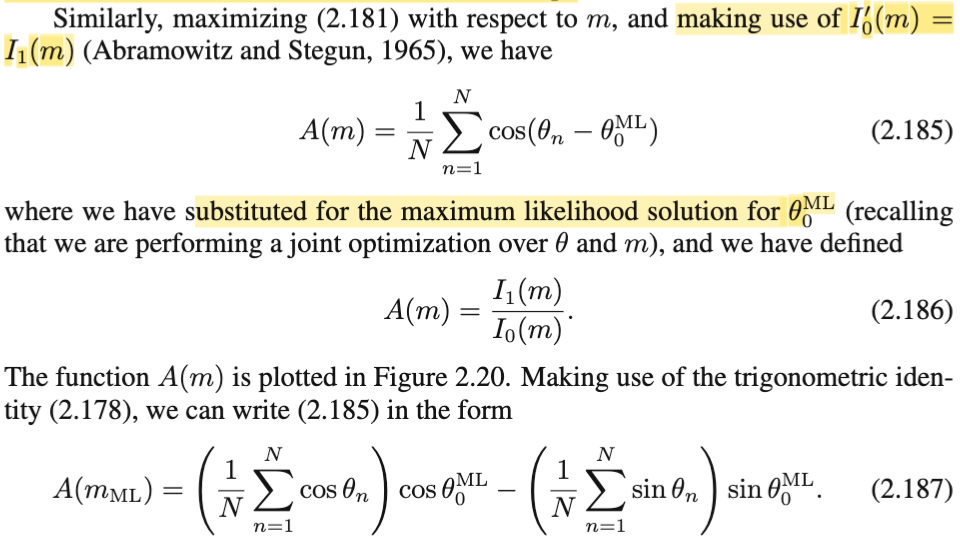</kbd>

<kbd>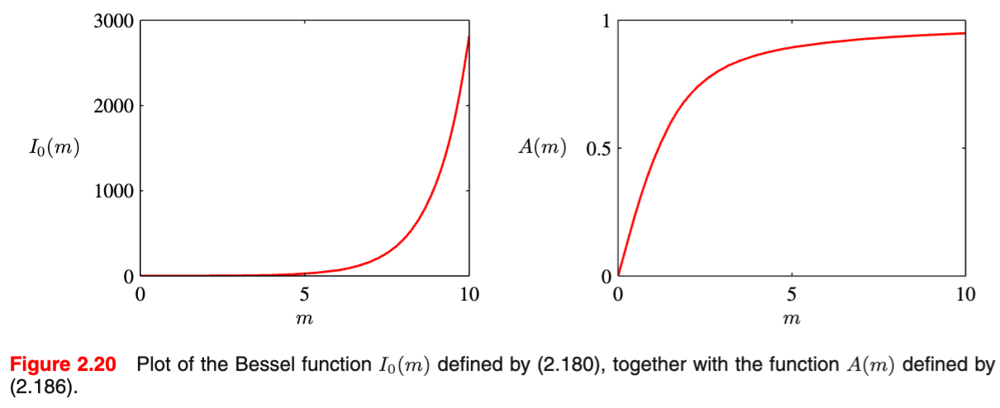</kbd>

<kbd>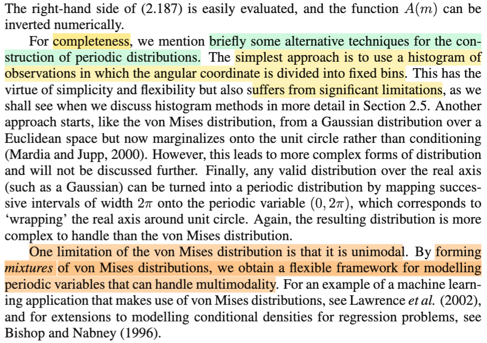</kbd>

> [!NOTE]
> Tiếp, giải tìm m^ml (ML estimator của m):
>
>
>
> d/dm \[-n ln(2π) - n ln\[I0(m)\] + m Σi=1:n cos(θi - θ0)\] = 0
>
>
>
> ⇔ d/dm \[- n ln\[I0(m)\] + d/dm \[mΣi=1:n cos(θi - θ0)\] = 0
>
>
>
> ⇔ - n d/dm \[ln\[I0(m)\] + Σi=1:n cos(θi - θ0) = 0
>
>
>
> ⇔ - n \[d/d(I0(m)) \[ln\[I0(m)\] . d/dm I0(m)\] + Σi=1:n cos(θi - θ0) = 0
>
>
>
> Dùng d/dx ln(x) = 1/x. và d/dm I0(m) = I1(m) (trong sách cho biết "make use of I'0(m), tức d/dm I0(m) = I1(m))
>
>
>
> ⇔ - n \[1/I0(m) . I1(m)\] + Σi=1:n cos(θi - θ0) = 0
>
>
>
> ⇔ I1(m)/I0(m) = (1/n) Σi=1:n cos(θi - θ0)
>
>
>
> Đặt A(m) = I1(m)/I0(m), ta có:
>
>
>
> A(m) = (1/n) Σi=1:n cos(θi - θ0)
>
>
>
>  Và áp công thức lượng giác vào, phá cái cos(θi - θ0) ra, gom lại, ta sẽ có công thức 2.187, ko khó lắm.
>
>
>
> ---
>
>
>
> Cuối cùng gs Bishop nói sơ qua vài cách tiếp cận khác để xây dựng pdf của phân phối dành cho biến periodic.

> [!TIP]
> **🤖 AI Feedback** — ⚠️ Score: **88/100**
>
> Bài giải thích của bạn rất rõ ràng và chính xác trong việc dẫn xuất công thức A(m), thể hiện sự nắm vững các bước toán học. Tuy nhiên, để hoàn thiện hơn, bạn nên bổ sung phần thảo luận về giới hạn của phân phối von Mises và cách khắc phục bằng cách sử dụng các hỗn hợp phân phối.

 

