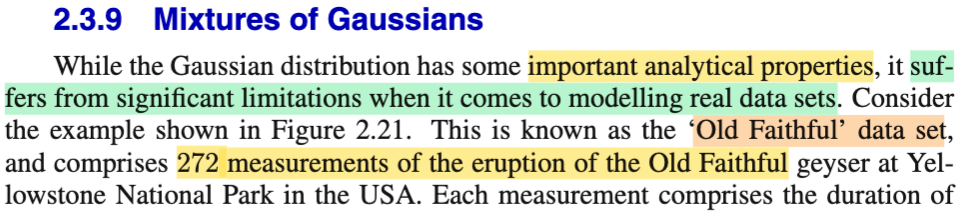
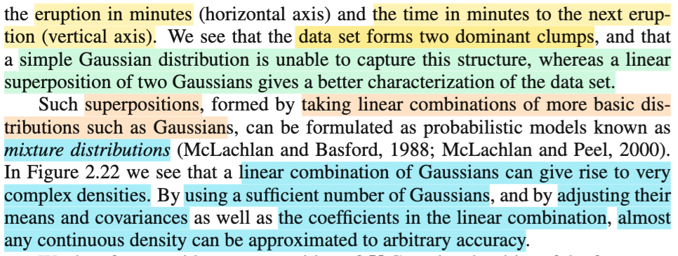
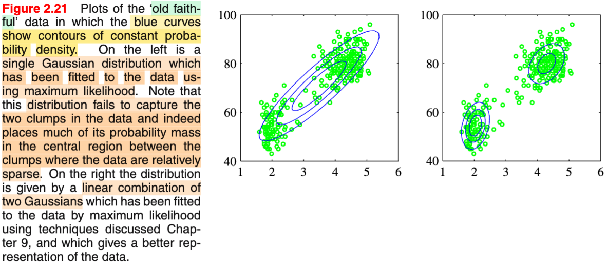
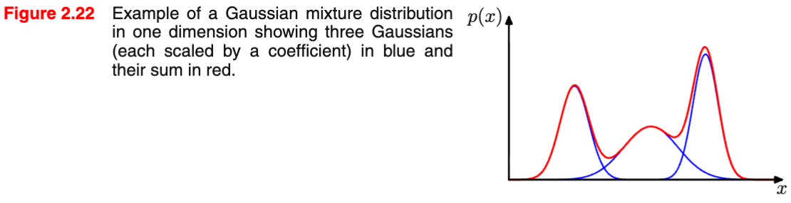
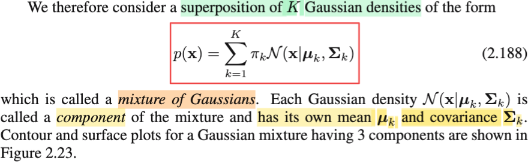
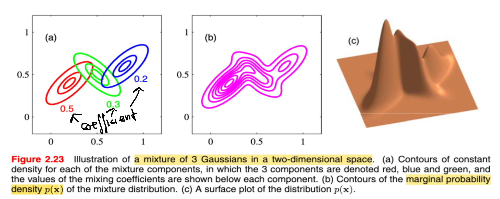
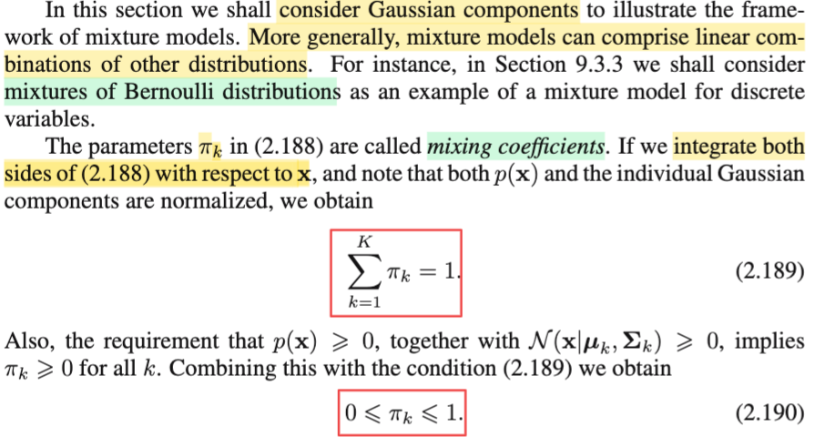
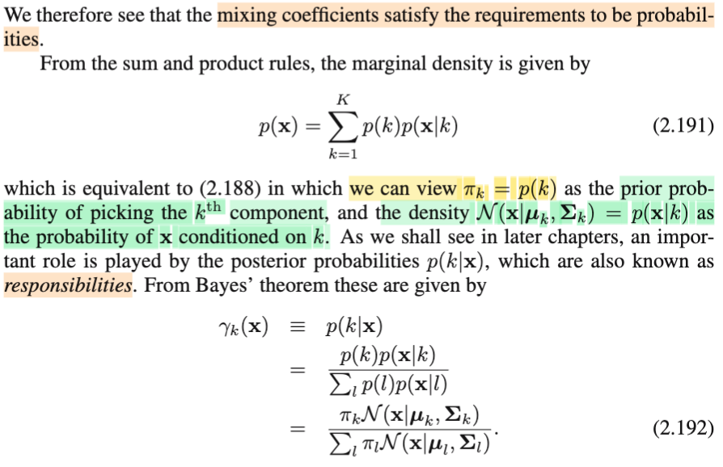
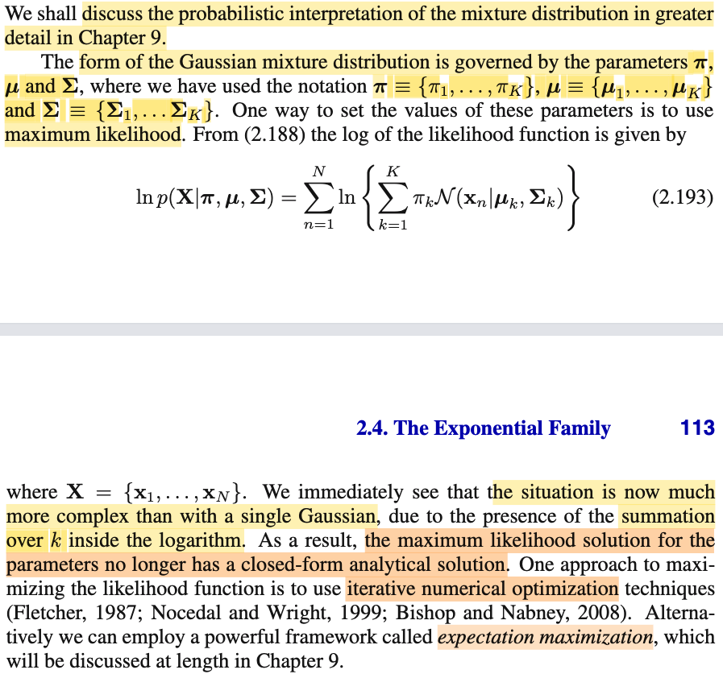

# 2.3.9 Mixtures of Gaussians

📊 **Progress:** `5` Notes | `9` Screenshots | `5` AI Reviews

---

## 2.3.9 Mixtures of Gaussians

 

## Mixtures of Gaussians

<kbd></kbd>

<kbd></kbd>

<kbd></kbd>

<kbd></kbd>

> [!NOTE]
> Trong phần này, chúng ta sẽ tìm hiểu về mixtures of Gaussian, hay còn gọi là hỗn hợp các phân phối Gaussian. Mở đầu, người ta nhấn mạnh vai trò quan trọng của phân phối Gaussian (hay còn gọi là phân phối Normal). Mặc dù có nhiều tính chất quan trọng, nhưng một nhược điểm lớn của phân phối này là nó gặp hạn chế khi dùng để mô hình hóa dữ liệu thực tế. Một ví dụ được đưa ra là bộ dữ liệu Old Faithful, bao gồm 272 chỉ số đo đạc về các lần phun trào của núi lửa. Old Faithful là tên của ngọn núi lửa tại Công viên Quốc gia Yellowstone ở Mỹ. Các chỉ số đo đạc này bao gồm thời gian phun trào (tính bằng phút, thể hiện ở cột nằm ngang) và khoảng thời gian (tính bằng phút) cho đến lần phun trào tiếp theo (thể hiện ở cột dọc).
>
>
>
> Quan sát hình 2.21, có thể thấy các điểm dữ liệu tập trung thành hai nhóm rõ rệt. Cụ thể, hình bên trái cho thấy nếu sử dụng một mô hình Normal (Gaussian) để mô phỏng, mô hình này không khớp tốt với dữ liệu, đặc biệt khi giá trị trung bình tập trung ở một vùng có ít điểm dữ liệu. Ngược lại, hình bên phải sử dụng tổ hợp tuyến tính của hai phân phối Gaussian. Phương pháp này, sẽ được học trong Chương 9, có khả năng biểu diễn dữ liệu tốt hơn. Điều này cho thấy một mô hình Gaussian đơn giản không thể nắm bắt được cấu trúc của loại dữ liệu này.
>
>
>
> Ngược lại, một linear superposition (tổ hợp tuyến tính) của hai mô hình Gaussian lại cho kết quả tốt hơn nhiều. Khái niệm superposition được hình thành bằng cách lấy tổ hợp tuyến tính (linear combination) của các phân phối cơ bản, không nhất thiết phải là Normal mà có thể là các phân phối khác. Từ đó, ta có được một mô hình gọi là mixture (phân phối hỗn hợp). Hình 2.22 cho thấy tổ hợp tuyến tính của các phân phối Gaussian có thể tạo ra những mô hình phức tạp hơn rất nhiều.
>
>
>
> Một ý quan trọng là **bằng cách quyết định số lượng Gaussian, điều chỉnh các tham số của từng mô hình Gaussian đơn lẻ, và các hệ số tổ hợp, chúng ta có thể biểu diễn hầu như bất kỳ hàm phân phối liên tục nào với độ chính xác rất cao.** 
>
>
>
> Nhìn chung, việc sử dụng một mô hình Gaussian đơn lẻ có những hạn chế bởi vì dữ liệu thực tế thường tuân theo các phân phối rất phức tạp. Một mô hình Gaussian (hoặc bất kỳ mô hình đơn lẻ nào) không thể nắm bắt hết được sự phức tạp đó. Tuy nhiên, bằng cách kết hợp (mixture) các mô hình này lại, chúng ta có thể tạo ra những phân phối rất phức tạp và biểu diễn dữ liệu một cách hiệu quả.

> [!TIP]
> **🤖 AI Feedback** — ✅ Score: **95/100**
>
> Bài tóm tắt rất chính xác và đầy đủ các ý chính từ văn bản gốc, bao gồm cả việc giải thích các hình ảnh minh họa. Để bài viết mạch lạc hơn, bạn có thể cân nhắc tránh lặp lại một số cụm từ và tổng hợp ý một cách ngắn gọn hơn.

 

### Gaussian Mixture Density Formula

<kbd></kbd>

<kbd></kbd>

> [!NOTE]
> Thế thì, ở đây, ta sẽ xem xét một superposition của K phân phối Normal, như đã nói, superposition chỉ là linear combination các hàm density của các component thôi:
>
>
>
> f(**x**) = Σk=1:K πk N(**x**| **μ**k, **Σ**k)
>
>
>
> Và cái này, gọi là **ΜIXTURE OF GAUSSIAN**, là linear combination của các component k là các Gaussian, với **μ**k, **Σ**k.
>
>
>
> Hình 2.23 minh họa một superposition với K = 3. các coefficient là 0.5, 0.3, 0,2 với contour plot của f(**x**)
>
>
>
> Mình nghĩ, có vẻ như tổng hệ số bằng 1, mà như vậy thì nói đúng hơn, đây không phải linear combination, mà là **CONVEX COMBINATION**, và khi đó, như mình đã học bên Convex Optim S.Boyd, thì đúng là nó gọi là **MIXTURE**, vì convex combination còn có tên khác là mixture. Khác với linear combination, là tổ hợp tuyến tính với hệ số âm dương bất kì, nếu tổng phải bằng 1, thì ta sẽ có affine combination, và nếu **không âm + tổng bằng 1** thì ta sẽ convex combination.

> [!TIP]
> **🤖 AI Feedback** — ✅ Score: **98/100**
>
> Bạn đã nắm vững khái niệm về Hỗn hợp Gaussian (Mixture of Gaussians) và giải thích công thức (2.188) một cách chính xác, cùng với việc đọc đúng các hệ số từ hình minh họa. Phân tích sâu sắc về convex combination là một điểm cộng lớn, thể hiện sự hiểu biết vượt trội về lý thuyết.

**🔗 See also:** [MLE cho Mô hình Hỗn hợp Gaussian](#node-ftegw07)

 

#### Mixture Model Mixing Coefficients

<kbd></kbd>

> [!NOTE]
> Rồi đại khái đợi tiếp theo là nói rằng trong cái phần này mình sẽ chỉ xét những cái mixture mà những cái component nó là Gaussian thôi, nhưng mà không có nghĩa là bắt buộc phải Gaussian. Mình vẫn có thể mixture với những cái distribution khác. Nó lại cái một ý như sau những phần sau trong chương 9 bạn sẽ thấy mixture của các cái phân phối Bernoulli. Rồi một cái ý nữa giúp confirm cái điều đã nói ở cái nốt trước, đó là thật ra nói một cách chính xác nó phải là một cái convex combination.
>
>
>
> Bởi vì ở đây như tôi nói là khi mà mình xét những cái những cái hệ số pi k đó thì cái công thức mà mình định nghĩa ra một cái mixture đó, thì nếu như mà mình lấy cái tích phân mình tích phân trên toàn miền ở hai vế thì dĩ nhiên là ở bên trái là mình sẽ ra 1, bởi vì tính valid tính hợp lệ của một cái pdf. Ở bên phải thì mình cũng sẽ tách thành ba cái tích phân. Và với mỗi tích phân thì mình cũng đưa cái hệ số ra ngoài. Và để rồi mỗi một cái tích phân nó cũng là tích phân trên toàn miền của một cái phân phối hợp lệ, cho nên nó cũng phải ra 1. Để rồi kết quả mình sẽ là tổng của các hệ số bằng 1. 
>
>
>
> f(**x**) = Σk=1:K πk N(**x**| **μ**k, **Σ**k)
>
>
>
> ⇔ ∫f(**x**)d**x** = ∫Σk=1:K πk N(**x**| **μ**k, **Σ**k) d**x**
>
>
>
> ⇔ ∫f(**x**)d**x** = Σk=1:K πk ∫N(**x**| **μ**k, **Σ**k)d**x**
>
>
>
> ⇔ 1 = Σk=1:K πk × 1
>
>
>
> ⇔ 1 = Σk=1:K πk → Như là cái công thức 2.189 ở đây. 
>
>
>
> Và vì cái tính chất là valid, tính chất hợp lệ của một PDF cho nên là mình cũng có thể dễ dàng suy ra được các cái hệ số cũng phải là không âm.
>
>
>
> Như vậy là tất cả các hệ số đều không âm và tổng hệ số bằng 1 cho nên đây nhất định nó chính là một cái convex combination. Như đã học ở trong convex optimization của giáo sư Steven Boyd. Tức là mình hiểu rằng nói là một tổ hợp tuyến tính thì cũng đúng nhưng mà tổ hợp lồi thì nó là một cái trường hợp hẹp hơn, đặc biệt hơn của tổ hợp tuyến tính bởi vì khi đó các hệ số nó phải không âm và có tổng bằng 1.

> [!TIP]
> **🤖 AI Feedback** — ✅ Score: **100/100**
>
> Rất xuất sắc. Bạn đã giải thích chi tiết và chính xác mọi điểm trong văn bản, đặc biệt là việc làm rõ các bước tích phân và khái niệm "tổ hợp lồi" đã bổ sung thêm chiều sâu đáng kể cho phần giải thích.

 

##### Posterior Probabilities and Responsibilities

<kbd></kbd>

> [!NOTE]
> Thế thì đại khái là, với việc ta đã hiểu vì sao các coefficient πk đều không âm và có tổng bằng 1, thì điều này có nghĩa bản thân tụi nó, có dáng dấp, hay, thỏa điều kiện để trở thành một phân phối xác suất. Vì cấu trúc của một hàm pmf của phân phối xác suất rời rạc là có giá trị không âm và tổng xác suất ở mọi possible value là bằng 1 (tính valid của pmf/pdf).
>
>
>
> Vậy thì, dựa vào công thức đã học Stat110, Casella: Khi marginalizing joint pmf của hai random variable X, Y over mọi possible value của Y, ta sẽ có marginal pmf của X:
>
>
>
> P(X=x), hay fX(x) = Σ{mọi possible value y của Y} P(X=x, Y=y) = Σ{mọi possible value y của Y} fX,Y(x,y)
>
>
>
> (Và bản chất cái này xuất phát từ LOTP: Định luật xác suất toàn phần Law of Total Probability)
>
>
>
> Vậy thì ở đây, nếu ta xét Y là discrete random variable có các possible value 1,2,....K. Và f(x, k) là joint pmf của **X**, và K, áp dụng cái trên ta có:
>
>
>
> f(**x**) = Σk=1:K f(**x**, k)
>
>
>
> Dựa theo conditional probability theore f(**x**, k) = f(**x**|k) f(k) = f(k)f(**x**|k)
>
>
>
> ⇨ f(**x**) = Σk=1:K f(k) f(**x**|k) → Chính là 2.191
>
>
>
> Và nếu ta coi pmf của Y là P(K=k) = πk, tức coi các coefficient πk chính là giá trị của pmf của K tại k, và đồng thời coi f(**x**|k) là pdf của Normal(**μ**k, **Σ**k), hay ghi la N(**x**|**μ**k, **Σ**k) thì
>
>
>
> f(**x**) = Σk=1:K πk f(**x**|k) chính là định nghĩa của Gaussian mixture
>
>
>
> Có nghĩa là, ta có thể nhìn thấy định nghĩa của Gaussian mixture theo góc nhìn này.
>
>
>
> Thêm nữa, pmf của Y: f(k) = πk, gs cho rằng, có thể xem nó là prior probability của việc chọn component thứ k'th, và vài bữa ta sẽ xét đến posterior probability f(k|**x**), là một khái niệm quan trọng, mang tên **responsibilities**
>
>
>
> Dùng Bayes theorem để derive f(k|**x**) như sau:
>
>
>
> f(k|**x**) = f(**x**|k)f(k) / f(**x**)
>
>
>
> Thay f(**x**) bằng công thức trên, nhưng dùng l cho index variable thay cho k để khỏi lẫn lộn với k ở tử số:
>
>
>
> = f(**x**|k)f(k) / Σl=1:K \[πl f(**x**|l)\] 
>
>
>
> = πk N(**x**|**μ**k, **Σ**k) / Σl=1:K \[πl N(**x**|**μ**l, **Σ**l)\] → 2.192

> [!TIP]
> **🤖 AI Feedback** — ✅ Score: **98/100**
>
> Ghi chú của bạn cực kỳ rõ ràng, chính xác và cung cấp một cách suy luận từng bước kỹ lưỡng cho cả hai phương trình (2.191) và (2.192), thể hiện sự hiểu biết sâu sắc về các khái niệm. Việc liên kết với các định lý xác suất cốt lõi (LOTP, Bayes) là một điểm mạnh đáng kể.

 

- **MLE cho Mô hình Hỗn hợp Gaussian**

<kbd></kbd>

> [!NOTE]
> Đại ý là, ko khó để thấy distribution của Gaussian mixtures (f(**x**) = Σk=1:K πk N(**x**| **μ**k, **Σ**k)) sẽ phụ thuộc vào các tham số: πk, **μ**k, **Σ**k với k = 1,2,...K (Gom lại thành **π** = {π1, π2,...πK}, **μ** = {**μ**1, **μ**2,...**μ**K}, **Σ** = {**Σ**1, **Σ**2,....**Σ**K})
>
>
>
> Và ta có thể dùng cách tiếp cận MLE để estimate các tham số này, như đã biết, bằng cách giải bài tóan tối ưu:
>
>
>
> maximize (over **π**, **μ**, **Σ**) {likelihood function}
>
>
>
> Nói về likelihood function, như đã nói nhiều, theo định nghĩa, nó là hàm của tham số (θ, hay cụ thể ở đây là cả cụm **π**, **μ**, **Σ**) có giá trị (được định nghĩa) bằng giá trị của joint pdf/pmf của toàn bộ các random variable trong sample tại observed data của nó, chính là **matrix** **X** (data / hay sample gồm N random vector **X**1,**X**2,... có observed value là x1,x2,..., gom lại làm thành random \[**matrix** **X**\] (hay D) có observed value là \[**matrix** **x**\].
>
> (chỗ này phải nói lại vì rất lằng nhằng trong cách kí hiệu mà xuất phát cũng vì ông Bishop khi viết sách này ko tuân thủ quy tắc kí hiệu trong toán thống kê thông thường:
>
>
>
> Toán thống kê viết hàm pdf/pmf là f,
>
>
>
> tên biến ngẫu nhiên thì viết hoa, giá trị biến thì viết chữ thường:
>
>
>
> nên nếu X là biến ngẫu nhiên đơn lẻ thì ta viết là X, có giá trị là x,
>
>
>
> nếu là vector các biến ngẫu nhiên thì viết nét đậm **X**, có giá trị là **x**
>
>
>
> Còn ông Bishop thì dùng chữ p thay vì f, và tên biến thì viết thường hết, nên không biết khi thấy x, là nói về biến hay về giá trị của nó, mà phải xem ngữ cảnh. Ổng vẫn theo lối viết đậm đối với vector, nên thấy ta thấy **x**, nhưng cũng ko biết là nói về biến hay nói về giá trị của nó.
>
>
>
> Νhưng theo cách kí hiểu của ông Bishop, thì khi ổng muốn gom các random variable vector lại thì ổng lại dùng chữ **X** (viết hoa, nét đậm), để chỉ toàn bộ mọi data, và ta cũng ko biết **X** sẽ là bản thân cái random variable matrix hay giá trị quan sát của nó
>
>
>
> Thành ra nếu ai đó theo chuẩn kí hiệu Casella sẽ thấy bối rối khi gặp **X**, vì lẽ thường nó ám chỉ random variable vector nhưng ở đây lại phải hiểu nó là random variable matrix mà cũng ko biết là chỉ biến hay chỉ giá trị, hoặc phải tự hiểu rằng khi nói công thức thì chỉ biến, khi tính thì thay giá trị vào.
>
>
>
> Còn mình do theo chuẩn Casella, nên mình sẽ ghi là data, tức sample sẽ gồm các random variable vector **X**1, ...**X**N, có observed value là **x**1, **x**2,...**x**N. Gom các random vector lại thành một random matrix: \[**matrix** **X**\] có observed value là \[**matrix** **x**\] (mà mỗi hàng là các observed value **x**1, **x**2, ...của **X**1,**X**2...**X**N.)
>
>
>
> Nói chung rắc rối đến phần lớn từ việc quy tắc kí hiệu ông Bishop dùng không tuân theo khuôn mẫu sách toán thống kê
>
>
>
> ---
>
>
>
> Quay lại đây
>
>
>
> Nên L(**π**, **μ**, **Σ**|**matrix** **x**) = f(**matrix** **x**|**π**, **μ**, **Σ**)
>
>
>
> dùng tính iid của các data sample, tách joint pmf thành tích marginal pmf
>
>
>
> = Πn=1:N f(**x**n|**π**, **μ**, **Σ**)
>
>
>
> = Πn=1:N { Σk=1:K πk N(**x**n|**μ**k, **Σ**k) }
>
>
>
> và như thường lệ cũng xét bài toán tương đương với hàm ln likelihood:
>
>
>
> ln L(**π**, **μ**, **Σ**|**x**) = ln {Πn=1:N { Σk=1:K πk N(**x**n|**μ**k, **Σ**k) }}
>
>
>
> = Σn=1:N ln {Σk=1:K πk N(**x**n|**μ**k, **Σ**k) } → Đây chính là 2.193
>
>
>
> Đến đây, mọi chuyện không đơn giản như khi hàm likelihood chỉ là của 1 Gaussian, ta nhớ khi đó, chỉ việc dùng tính chất log (ab) = log (a) + log(b) để tách normalizing constant ra, sau đó cái log exp (quadratic form) sẽ trở thành (quadratic form), và như vậy bài toán tối ưu trở nên là bài toán tối ưu lồi, khi hàm objective là hàm quadratic, và chỉ cần dùng điều kiện cần bậc nhất, tìm điểm stationary là xong, vì hàm lồi nên chắc chắn local optimizer cũng là global optimizer. Đây cũng chính là gọi là bài toán có closed-form solution là vậy
>
>
>
> Còn ở đây, ta thấy trong cái log có một cái tổng, khiến không thể nào đơn giản được. Và bài toán trở nên không có closed form solution, mà phải giải bằng các thuật toán tối ưu mà trong chap 9 mình sẽ bàn đến (khi đó các kiến thức về optimization mình đã cày bên Nocedal sẽ phát huy tác dụng)

> [!TIP]
> **🤖 AI Feedback** — ✅ Score: **98/100**
>
> Bài viết rất chính xác và cực kỳ chi tiết, giải thích rõ ràng từng bước hình thành hàm log-likelihood và lý do vì sao không có nghiệm dạng đóng. Phần bình luận về ký hiệu của Bishop cũng rất sâu sắc, giúp làm rõ những điểm gây bối rối cho người đọc.

**🔗 See also:** [Gaussian Mixture Density Formula](#node-gm8wqi8)

 

