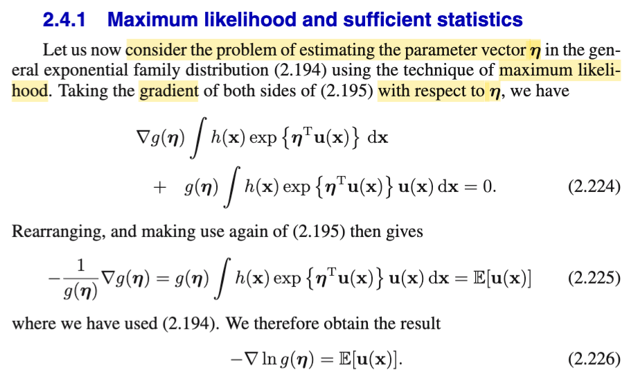
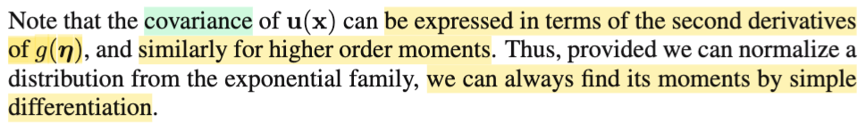
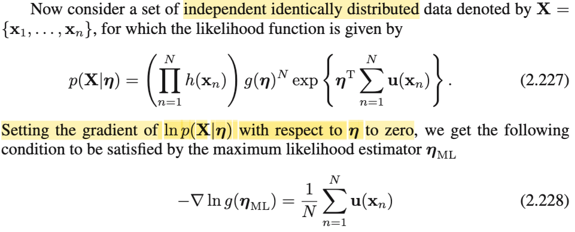
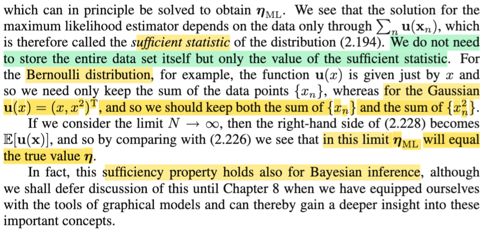

# 2.4.1 Maximum likelihood & sufficient statistic

📊 **Progress:** `4` Notes | `4` Screenshots | `3` AI Reviews

---

<kbd></kbd>

> [!NOTE]
> Qua phần này, ta sẽ bàn về việc estimate parameter **η** của exponential family thông qua phương pháp MLE. Cũng đã quen với MLE, chỉ nhắc lại nha, MLE vốn dĩ là một trong các phương pháp để giải bài toán point estimation - là một trong những bài toán suy luận thống kê: Cho random sample **X** = (X1,...Xn), có giá trị quan sát được là **x** = (x1,x2,...xn), là các random varialle independent & identically distributed - iid \~ f(**x**|θ) (θ là parameter của population distribution). Nhiệm vụ của bài toán point estimation là tìm một hàm W(**X**), để với giá trị quan sát được của **X**: **X** = **x**, thì W(**x**) sẽ là estimate tốt cho θ. Phải nói thêm, với cách tiếp cận MLE, thì nó thuộc trường phái Classic hay Frequentist, vì ta chỉ xem θ như giá trị cố định nhưng chưa biết, chứ không xem nó như biến ngẫu nhiên.
>
>
>
> Vậy thì theo sách Casella, estimator, có thể là bất kì function nào của sample, và với một định nghĩa mơ hồ như vậy, ta cần có những phương pháp tiếp cận để dẫn đến một estimator tốt, và tiêu biểu là MoM (method of moment). MLE (maximum likelihood estimator) và Bayes estimator. Thế thì, với MLE, nói ngắn gọn, cái hàm W(**X**) mà ta dùng sẽ là hàm số sau: W(**x**) = argmax (over θ) L(θ|**x**), với L(θ|**x**) là likelihood function, là hàm số theo θ, được define (có giá trị bởi) f(**x**|θ), tức giá trị của likelihood L(θ|**x**) tại θ được tính bằng giá trị của joint pdf của sample tại observed value **x**. 
>
>
>
> (Chú ý, L(θ|**x**) cũng chính là L(θ|(x1,x2,...xn), và f(**x**|θ) cũng là f(x1,x2,...xn|θ), mà nhờ tính chất iid sẽ tách thành f(x1|θ)f(x2|θ)...f(xn|θ))
>
>
>
> Và viết W(**x**) = argmax (over θ) L(θ|**x**) có ý nghĩa là ta sẽ giải bài toán tối ưu: maximize over θ L(θ|**x**), cũng là maximize f(**x**|θ), cũng là f(x1,x2,...xn), và với tính chất iid của X1,...Xn, thì f(**x**|θ) = f(x1,...xn|θ) có thể được tách thành tích các marginal pdf: f(**x**|θ) = f(x1,...xn|θ) = f(x1|θ) × f(x1|θ) × .. f(xn|θ) = Πi=1:n f(xi|θ)
>
>
>
> Quay lại đây, express theo cái khung của bài toán point estimation trên thì ta sẽ nói thế này: cho **X**1, ...**X**N là iid \~ f(**x**|**η**), và muốn tìm ML estimator cho **η**. Thì theo định nghĩa, likelihood function là hàm theo **η**, được define bởi giá trị của joint pdf của sample tại observed value. do đó, likelihood tại **η**, kí hiêu7 tính bằng f(**x**1, **x**2,....**x**N|**η**). Hay gom các random vector **X**1, ...**X**N, lại thành random matrix **X**, có observed value là **x**, hay mình ghi là \[**matrix x**\] cho dễ phân biệt.
>
>
>
> Khi đó, likelihood sẽ kí hiệu là L(**η**|\[**matrix** **x**\]) = f(\[**matrix x**\]|**η**) = f(**x**1,**x**2,..,**x**N|**η**) = f(**x**1|**η**)f(**x**2|**η**)...f(**x**N|**η**) = Πi=1:N f(**x**i|**η**).
>
>
>
> Nên bài toán tối ưu cần giải để có MLE của **η** là:
>
>
>
> maximize over **η** {Πi=1:N f(**x**i|**η**)} với f(**x**i|**η**) = h(**x**i)g(**η**)exp{**η**T**u**(**x**i)}
>
>
>
> (trong sách, gs Bishop dùng **X** để chỉ observed value của mọi sample, tức là tương ứng \[**matrix x**\] của mình, (vì đã nói nhiều lần, gs Bishop ko theo chuẩn kí hiệu thông thường, việc dùng X rất dễ gây lầm lẫn là một random vector X nào đó)
>
>
>
> ---
>
>
>
> Quay lại đây, trước khi giải, đầu tiên gs Bishop sẽ chuẩn bị cho việc giải bài toán này, bằng cách dùng tính chất:
>
>
>
> ∫f(**x**|**η**) d**x** = 1, để rồi, đạo hàm hai vế thế **η**, ta sẽ có một kết quả đó là - ∇ln g(**η**) = E\[u(**x**)\] đặng tí nữa dùng. Thử xem các bước như thế nào mà ra kết quả này:
>
>
>
> ∫f(**x**|**η**) d**x** = 1
>
>
>
> ⇨ d/d**η** \[∫f(**x**|**η**) d**x**\] = d/d**η** \[1\]
>
>
>
> ⇔ d/d**η** \[∫h(**x**)g(**η**)exp{**η**T**u**(**x**)} d**x**\] = 0
>
>
>
> ⇔ d/d**η** \[g(**η**) ∫h(**x**)exp{**η**T**u**(**x**)} d**x**\] = 0
>
>
>
> Dùng product rule:
>
>
>
> ⇔ d/d**η** \[g(**η**)\] × ∫h(**x**)exp{**η**T**u**(**x**)} d**x**\] + g(**η**) d/d**η**\[∫h(**x**)exp{**η**T**u**(**x**)} d**x**\] = 0
>
>
>
>  ⇔ ∇g(**η**) × ∫h(**x**) exp{**η**T**u**(**x**)} d**x** + g(**η**) × d/d**η**\[∫h(**x**)exp{**η**T**u**(**x**)} d**x**\] = 0
>
>
>
> Xét cái d/d**η**\[∫h(**x**)exp{**η**T**u**(**x**)} d**x**\] trong term thứ 2: Đây là ta đang đạo hàm theo η của một cái tích phân theo **x**, được phép đưa đạo hàm vào trong, vì biên của tích phân không phụ thuộc **η**, cái này giống như ta đạo hàm theo **η** của một cái tổng các hàm số thôi.
>
>
>
> d/d**η**\[∫h(**x**)exp{**η**T**u**(**x**)} d**x**\] = ∫d/d**η**\[h(**x**)exp{**η**T**u**(**x**)}\] d**x**
>
>
>
> = ∫h(**x**) d/d**η**\[exp{**η**T**u**(**x**)}\] d**x**
>
>
>
> Dùng chain rule: d/d**η**\[exp{**η**T**u**(**x**)}\] = d/d\[**η**T**u**(**x**)\]\[exp{**η**T**u**(**x**)}\] . d/d**η** \[**η**T**u**(**x**)\]
>
>
>
> = ∫h(**x**) d/d\[**η**T**u**(**x**)\]\[exp{**η**T**u**(**x**)}\] . d/d**η** \[**η**T**u**(**x**)\] d**x**
>
>
>
> Dùng đạo hàm hàm sơ cấp: d/dx e^x = e^x, d/dx xTa = a
>
>
>
> = ∫h(**x**) exp{**η**T**u**(**x**)} **u**(**x**)d**x**
>
>
>
> Vậy kết qủa tới đây là:
>
>
>
> ∇g(**η**) × ∫h(**x**) exp{**η**T**u**(**x**)} d**x** + g(**η**)∫h(**x**) exp{**η**T**u**(**x**)} **u**(**x**)d**x** = 0 → đây là 2.224
>
>
>
>  ⇔ ∇g(**η**) \[1/g(**η**)\] g(**η**) ∫h(**x**) exp{**η**T**u**(**x**)} d**x** = - g(**η**)∫h(**x**) exp{**η**T**u**(**x**)} **u**(**x**)d**x**
>
>
>
> Dùng tiếp cái kết quả 2.195: g(**η**)∫h(**x**)exp{**η**T**u**(**x**)} d**x** d**x** = 1
>
>
>
> ⇔ ∇g(**η**) \[1/g(**η**)\] × 1 = - g(**η**)∫h(**x**) exp{**η**T**u**(**x**)} **u**(**x**)d**x**
>
>
>
>  ⇔ -\[1/g(**η**)\] ∇g(**η**) = g(**η**)∫h(**x**) exp{**η**T**u**(**x**)} **u**(**x**)d**x**
>
>
>
> và đồng thời nhận định vế phải chính là gì?
>
>
>
> g(**η**)∫h(**x**) exp{**η**T**u**(**x**)} **u**(**x**)d**x** = ∫h(**x**) g(**η**) exp{**η**T**u**(**x**)} **u**(**x**)d**x** chính là = ∫**u**(**x**)f(**x**|**η**)d**x**, còn nhớ kiến thức về LOTUS, khi ta có X \~ pdf f(x), và Y = g(X), thì EY = Eg(X) = ∫g(x)f(x)dx. Nên tương tự, ta sẽ thấy ở đây cái ta đang có chính là E\[u(**X**)\]
>
>
>
> Vậy -\[1/g(**η**)\] ∇g(**η**) = E\[**u**(**X**)\]
>
>
>
> Và vế trái, lại là - d/d**η** ln g(**η**), vì theo chain rule, - d/d**η** ln g(**η**) = - d/dg(**η**) ln g(**η**) . d/d**η** g(**η**) = - 1/g(**η**) ∇g(**η**).
>
>
>
> Vậy ta có kết quả để dành tí nữa xài: - 1/g(**η**) ∇g(**η**) = E\[**u**(**X**)\] → 2.226
>
>
>
> (nhiệm vụ của ta vẫn là giải bài toán tối ưu: maximize ln L(**η**|**x**))

> [!TIP]
> **🤖 AI Feedback** — ✅ Score: **98/100**
>
> Phân tích cực kỳ chi tiết và sâu sắc, giải thích rõ ràng từng bước trong quá trình suy luận và các quy tắc toán học áp dụng, vượt xa nội dung được trình bày trong hình ảnh gốc. Độ chính xác cao và kiến thức nền được củng cố vững chắc.

**🔗 See also:** [2.4 The Exponential Family](./24_the_exponential_family.md#node-1hlelhn)

 

## Moments by Differentiation

<kbd></kbd>

> [!NOTE]
> Quay lại ý này sau

 

### Maximum Likelihood Estimator Condition

<kbd></kbd>

> [!NOTE]
> Rồi, tiếp tục, như đã nói, ta sẽ giải bài toán maximize  L(**η**|\[**matrix x**\]), cũng là
>
>
>
> maximize over η {ln Πi=1:N f(**x**i|**η**)}
>
>
>
> Xét hàm likelihood, L(η|\[**matrix x**\]) = Πi=1:N f(**x**i|**η**)
>
>
>
> thay công thức vô:
>
>
>
> = Πi=1:N h(**x**i)g(**η**)exp\[**η**T**u**(**x**i)\]
>
>
>
> = \[Πi=1:N h(**x**i)\] \[g(**η**)\]^N {Πi=1:N exp\[**η**T**u**(**x**i)\]}
>
>
>
> = \[Πi=1:N h(**x**i)\] \[g(**η**)\]^N exp{∑i=1:N\[**η**T**u**(**x**i)\]} → đây là 2.227
>
>
>
> Và bài toán maximize likelihood sẽ equivalient maximize ln likelihood
>
>
>
> Hàm ln likelihood:
>
>
>
> = ln \[Πi=1:N h(**x**i)\] \[g(**η**)\]^N exp{∑i=1:N\[**η**T**u**(**x**i)\]}
>
>
>
> = ln \[Πi=1:N h(**x**i)\]  + ln \[g(**η**)\]^N  + ln exp{∑i=1:N\[**η**T**u**(**x**i)\]}
>
>
>
> = ln \[Πi=1:N h(**x**i)\]  + N ln \[g(**η**)\]  + ∑i=1:N\[**η**T**u**(**x**i)\]
>
>
>
> bài toán maximize ln likelihood tiếp tục tương đương với: 
>
>
>
> maximize (over η) {N ln \[g(**η**)\] + ∑i=1:N\[**η**T**u**(**x**i)\] (tức là ta bỏ constant ln \[Πi=1:N h(**x**i)\] đi)
>
>
>
> Tới đây, dùng first order neccessary condition, cho gradient (đạo hàm theo η) của objective bằng 0 để giải ra stationary point (sau đó cần check secondary test để xác nhận là cực tiểu hay cực đại, theo kiến thức đã học ở MIT 18.01). Vậy đầu tiên tính gradient:
>
>
>
> d/dη \[N ln \[g(**η**)\] + ∑i=1:N\[**η**T**u**(**x**i)\]
>
>
>
> = N d/dη \[ln \[g(**η**)\] + d/dη ∑i=1:N\[**η**T**u**(**x**i)\]
>
>
>
> = N \[1/g(**η**)\] ∇g(**η**) + ∑i=1:N d/dη \[**η**T**u**(**x**i)\]
>
>
>
> = N \[∇g(**η**)/g(**η**)\]  + ∑i=1:N d/dη **u**(**x**i)
>
>
>
> cho cái này bằng 0:
>
>
>
> N \[∇g(**η**)/g(**η**)\] + ∑i=1:N **u**(**x**i) = 0
>
>
>
> ⇔ N \[-∇g(**η**)/g(**η**)\] = ∑i=1:N **u**(**x**i) 
>
>
>
> ⇔  \[-∇g(**η**)/g(**η**)\] = (1/N) ∑i=1:N **u**(**x**i) 
>
>
>
> → đây chính là 2.228 (vì ta đã thay d/dη \[ln \[g(**η**)\] = ∇g(**η**)/g(**η**))

> [!TIP]
> **🤖 AI Feedback** — ✅ Score: **98/100**
>
> Bài giải cực kỳ chi tiết, chính xác và thể hiện sự hiểu biết sâu sắc về các bước tính toán từ hàm likelihood đến điều kiện đạo hàm bằng 0. Cách bạn tách rời các thành phần và áp dụng quy tắc logarit, cùng với việc nhận diện hằng số, là rất ấn tượng. Chỉ có một chi tiết nhỏ về ký hiệu đạo hàm của tổng có thể được làm rõ hơn, nhưng kết quả cuối cùng hoàn toàn đúng.

 

#### Sufficient Statistic Property

<kbd></kbd>

> [!NOTE]
> Vậy thì đại khái là từ kết quả ta đã có \[-∇g(**η**)/g(**η**)\] = (1/N) ∑i=1:N u(xi), có nghĩa là, giải cái này ra ta sẽ tìm được stationary **η**, và hàm - ln likelihood, có thể chứng minh là convex, nên **η** này cũng chính là maximizer của nó → ta có maximum likelihood **η**ML. (gs Bishop ko nói gì, nhưng phải hiểu, điều kiện gradient = 0 chưa đủ để kết luận η thỏa cái gradient = 0 là maximizer, phải check thêm đạo hàm bậc hai hoặc lập luận chỉ ra hàm objective là hàm lồi)
>
>
>
> Vậy thì, có thể thấy, **η**ML chỉ là hàm phụ thuộc ∑i u(xi), và đây lại chính là một sufficient statistic. Cái này mình đã nói trước đây (xem link) trong Casella, đã học đại khái là, nếu một statistic T(**X**) được định nghĩa là nếu T(**X**) có tính chất đó là khiến f(**x**|T(**X**) = T(**x**)) không còn là hàm phụ thuộc θ, thì nó chính là sufficient statistic. Và nhờ Factorization theorem nói rằng nếu pdf f(**x**|θ) có thể tách thành g(T(**x**)|θ)h(**x**), tức một hàm h(**x**) ko phụ thuộc θ chỉ phụ thuộc **x**, và hàm g phụ thuộc cả θ và **x** nhưng chỉ phụ thuộc **x** thông qua một statistic T(**x**) thì T(**X**) chính là sufficient statistic.
>
>
>
> Vậy thì xét joint pdf của sample:
>
>
>
> f(\[matrix **X**\]|**η**) = Πi=1:N f(**x**i|**η**)
>
>
>
> = Πi=1:N h(**x**i)g(**η**)exp{ηTu(**x**i)}
>
>
>
> = \[Πi=1:N h(**x**i)\] \[g(**η**)\]^N Πi=1:N exp{**η**Tu(**x**i)}
>
>
>
> = \[Πi=1:N h(**x**i)\] \[g(**η**)\]^N exp{∑i=1:N **η**Tu(**x**i)}
>
>
>
> = \[Πi=1:N h(**x**i)\] \[g(**η**)\]^N exp{**η**T\[∑i=1:N u(**x**i)\]}
>
>
>
> ta thấy đúng là có thể tách thành h(**x**) g(T(**x**), **η**) với:
>
>
>
> h(**x**) = h(x1,x2...xN) = \[Πi=1:N h(xi)\]
>
>
>
> T(**x**) = T(x1, x2, ...xN) = ∑i=1:N u(xi)
>
>
>
> Do đó, theo **Factorization theorem**, T(X1,X2,...) ∑i=1:N u(Xi) **chính là sufficient statistic**.
>
>
>
> Và trong Casella mình đã biết ý nghĩa của sufficient statistic, đó là **inference về θ dựa trên một sufficient statistic T(x) cũng y như inference về θ dựa trên sample X**. Và thường thì sufficient statistic có kích thước nhỏ hơn sample X, nên ta có thể dùng T(x), vất bỏ đi observed data x.
>
>
>
> Làm cụ thể với Bern(μ) distribution, f(**x**|μ) = Πi=1:N f(xi|μ) = Πi=1:N μ^xi ×(1-μ)^(1-xi)
>
>
>
> = Πi=1:N {(1-μ) exp {ln\[μ/(1-μ)\] x} (chuyển pmf của Bern(μ) về dạng exponential family, kết quả bữa trước)
>
>
>
> = (1-μ)^n Πi=1:N exp {ln\[μ/(1-μ)\] xi}
>
>
>
> = (1-μ)^n exp {∑i=1:N ln\[μ/(1-μ)\] xi}
>
>
>
> = (1-μ)^n exp {ln\[μ/(1-μ)\] ∑i=1:N xi}
>
>
>
> kết qủa này có dạng h(**x**)g(T(**x**), μ) với h(**x**) = 1, g(T(**x**), μ) = (1-μ)^n exp {ln\[μ/(1-μ)\] ∑i=1:N xi}, và T(**x**) = ∑i=1:N xi
>
>
>
> Do đó theo Factorization theroerm, đối với Bern(μ) thì sufficient statistic là ∑i=1:N xi, → nên gs Bishop nói với Bern distribution thì ta chỉ cần giữ lại tổng của các data point.
>
>
>
> Còn với Normal, pdf (đã triển khai) = ..
>
>
>
> f(x|μ, σ^2) = \[1/√(2πσ^2)\] exp{-μ^2/2σ^2} exp{(-1/2σ^2)x^2+(μ/σ^2)x}
>
>
>
> ⇨ f(**x**|μ, σ^2) = Πi=1:n f(xi|μ, σ^2)
>
>
>
> = Πi=1:n { \[1/√(2πσ^2)\] exp{-μ^2/2σ^2)} exp{(-1/2σ^2)xi^2+(μ/σ^2)xi}}
>
>
>
> = \[1/√(2πσ^2) exp{-μ^2/2σ^2)}\]^n exp{∑i=1:n(-1/2σ^2)xi^2 + ∑i=1:n(μ/σ^2)xi}
>
>
>
> = \[1/√(2πσ^2) exp{-μ^2/2σ^2)}\]^n exp{(-1/2σ^2)∑i=1:n xi^2 + (μ/σ^2)∑i=1:nxi}
>
>
>
> Kết quả này có dạng h(**x**)g(T(x), μ, σ^2)
>
>
>
> với h(**x**) = 1
>
>
>
> g(T(**x**), μ, σ^2) = \[1/√(2πσ^2) exp{-μ^2/2σ^2)}\]^n exp{(-1/2σ^2)∑i=1:n xi^2 + (μ/σ^2)∑i=1:nxi}
>
>
>
> và T(**x**) = (∑i=1:n xi^2, ∑i=1:nxi)
>
>
>
> Nên theo Factorization theorem, sufficient statistic là T(**X**) = \[∑i=1:n **X**i^2, ∑i=1:n **X**i\]
>
>
>
> do đó gs Bishop nói với Normal ta cần giữ lại cả tổng xi và tổng bình phương xi là vậy (should keep both the sum of {xn} and the sum of {xn^2})
>
>
>
>
>
>  Một ý nữa, đại ý là lúc nãy ta đã đi đến kết quả này:
>
>
>
>   Kết quả 2.226: ∇g(**η**)/g(**η**) = E\[u(**X**)\]
>
>
>
> còn ở note trước ta có ηML sẽ thỏa: \[-∇g(**η**)/g(**η**)\] = (1/N) ∑i=1:N u(**x**i)
>
>
>
> Evaluate hai vế của phương trình trên tại limit N → inf:
>
>
>
> lim N→∞ \[-∇g(**η**ML)/g(**η**ML)\] = lim N→∞ \[(1/N) ∑i=1:N u(**x**i)\]
>
>
>
> Vế phải, cái ta có chính là sample mean size n: u_bar_n, theo luật số lớn (WLLN, Weak Law Of Large Number đã học trong Casella), bất kì Xbar_n = (Σi=1:n Xi)/n nào đều hội tự về population mean E\[Xi\].
>
>
>
> Nên lim N→∞ \[(1/N) ∑i=1:N u(xi)\] = E\[u(xi)\].
>
>
>
> như vậy lim N→∞ \[-∇g(**η**ML)/g(**η**ML)\] = ∇g(η)/g(η), điều này cho thấy **η**ML converge về **η**, tức population parameters. Và điều này có nghĩa là gì?
>
>
>
> Như đã học về khái niệm consistency trong Casella, định nghĩa của cái gọi là một chuỗi các estimator có tính nhất quán (consistent) đó là nếu như Wn thỏa: lim n → inf P\_θ(|Wn - θ| < ε) = 1. Mang ý nghĩa là khi kích thước mẫu tăng lên vô hạn thì xác suất mà estimator khác với θ sẽ cực kì nhỏ, hay, xác suất estimator sẽ có giá trị chính xác với θ là cực lớn.
>
>
>
> Nôm na là, lim n → inf Wn(x) = θ
>
>
>
> khi đó thì chuỗi Wn(**X**) được gọi là một sequence of **consistent** estimator của θ. Vậy thì ở đây, dựa trên kiến thức này, ta thấy ML estimator của **η**, tức **η**ML chính là một consistent estimator của **η**.

> [!TIP]
> **🤖 AI Feedback** — ✅ Score: **98/100**
>
> Bài phân tích rất chi tiết, sâu sắc và chính xác, chứng minh rõ ràng các khái niệm bằng Định lý Factorization và áp dụng cụ thể cho các phân phối. Bạn thể hiện sự hiểu biết vững chắc về lý thuyết, bao gồm cả việc bổ sung điều kiện lồi cho MLE, mặc dù có thể mở rộng thêm một chút về ứng dụng trong Bayesian inference.

 

