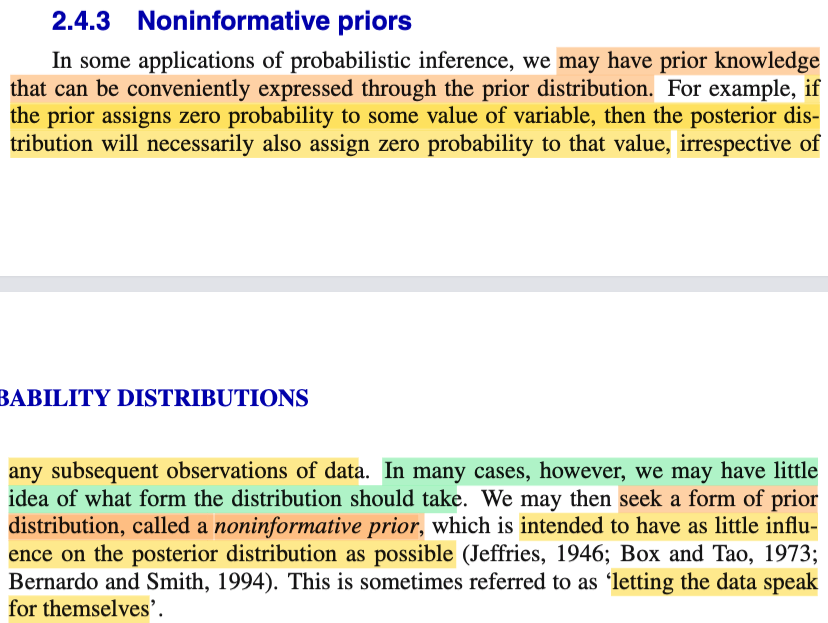
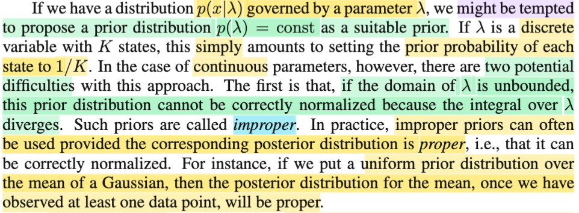
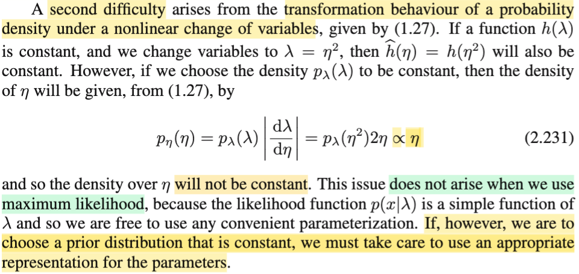
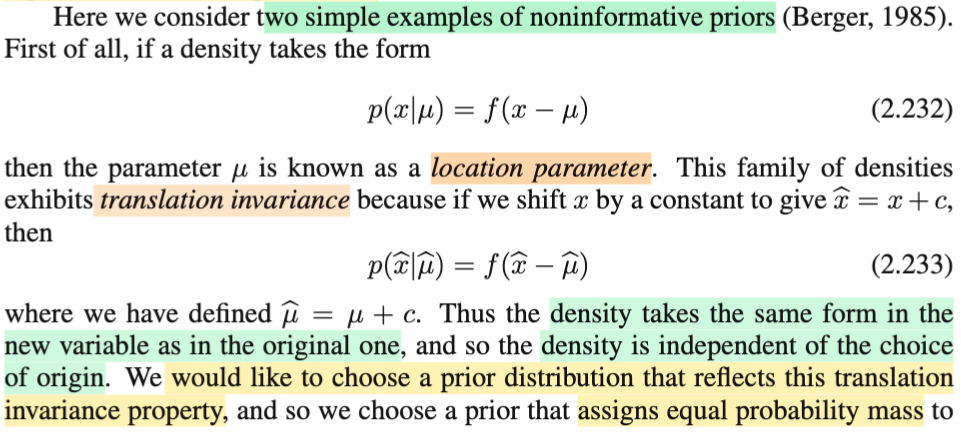
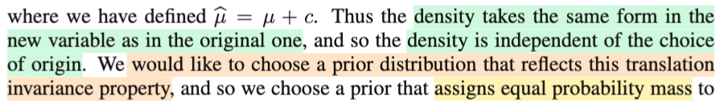
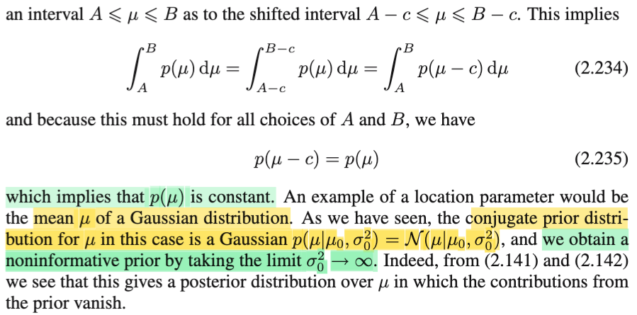
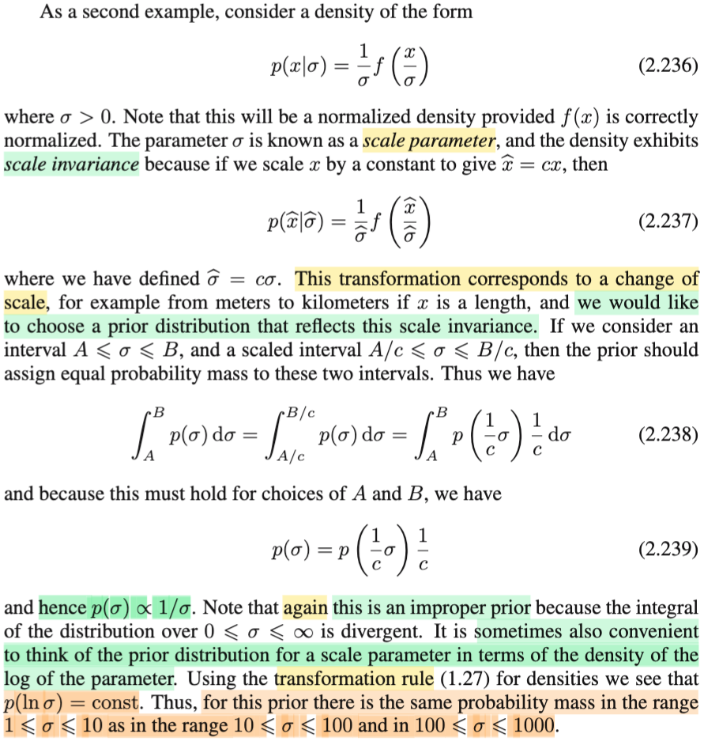
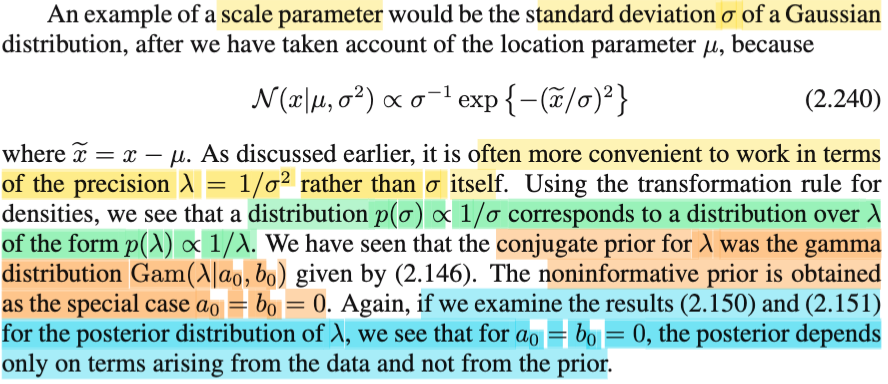

# 2.4.3 Non-informative priors

📊 **Progress:** `7` Notes | `8` Screenshots | `6` AI Reviews

---

<kbd></kbd>

> [!NOTE]
> Đoạn này đại ý là, trong một số bài toán suy luận (probabilistic inference), đại khái là nhiều lúc người ta có một số ý niệm, kinh nghiệm nào đó về prior distribution, ví dụ như, ta biết chắc rằng giá trị của tham số (với tư cách là biến ngẫu nhiên) sẽ không thể có một số giá trị nào đó được (xác suất bằng 0). Khi đó, lẽ dĩ nhiên posterior distribution cũng phải nên phản ánh kinh nghiệm này, dù cho giá trị quan sát được của data có là gì đi nữa.
>
>
>
> Nhưng cũng có trường hợp khác, khi đó ta không có chút kinh nghiệm nào về prior distribution, lúc này, để đảm bảo tính công bằng, tránh đưa vào những lệch lạc, những thiên kiến nào đó, ta sẽ muốn chọn prior sao cho CHỨA ÍT ẢNH HƯỞNG ĐẾN POSTERIOR NHẤT CÓ THỂ. Khi đó ta sẽ tìm kiếm một distribution gọi là NON-INFORMATIVE PRIOR, cách tiếp cận này đôi khi được gọi là "hãy để dữ liệu tự lên tiếng" (mình hiểu, đồng nghĩa, posteror sẽ chịu ảnh hưởng hầu hết từ data)

> [!TIP]
> **🤖 AI Feedback** — ✅ Score: **98/100**
>
> Phần giải thích của bạn cực kỳ chính xác và sâu sắc, nắm bắt đầy đủ các sắc thái của khái niệm. Cách diễn giải cụm từ "hãy để dữ liệu tự lên tiếng" rất đúng trọng tâm.

 

## Improper Prior Distributions

<kbd></kbd>

> [!NOTE]
> Thế thì với loại non-informative prior, đại khái là gs cho rằng ta sẽ có thể bị cám dỗ bởi việc chọn một hằng số (để xác suất ở đâu cũng bằng nhau, thể hiện tính chất "non-informative"), tức là f(λ) = constant (λ là population param, chi phối distribution của data f(x|λ)).
>
>
>
> Ví dụ như nếu λ là biến rời rạc (discrete) có K possible values (states) thì ta sẽ cho priori là f(λ) = 1/K với mọi possible value của λ.
>
>
>
> Tuy nhiên, gs cho biết, đối với λ là continous rv, thì cách làm này, có thể có phát sinh những vấn đề tiềm năng.
>
>
>
> Vấn đề đầu tiên là nếu như range (tập xác định) của λ là unbounded (tức là nó có thể trải dài từ -inf, tới +inf với trường hợp λ đơn biến), thì khi đó, việc cho pdf = constant sẽ không thể được. Vì lúc này nó sẽ không thể normalized. Mình hiểu ý này như sau: còn nhớ theo định nghĩa của pdf/pmf, thì để một function trở thành valid, thì tổng / tích phân trên toàn miền của nó phải bằng 1, và giá trị hàm pdf/pmf luôn không âm. Vậy thì giả sử ta có hàm f(λ) = constant c, với range của λ từ -inf tới inf, thì ∫-inf:inf c dλ = c ∫-inf:inf dλ = c × ∞ = ∞, gọi là tích phân bị diverge, và không thể nào bằng 1 được, nên không thể xây dựng một valid pdf được.
>
>
>
> Và cái prior distribution này được gọi là IMPROPER (tạm hiểu là, không hợp lệ, phù hợp)
>
>
>
> Tuy vậy, trong thực tế, gs nói vẫn có thể dùng improper prior nếu posterior là proper distribution (tức là dù priori improper, nhưng nếu posterior pdf/pmf vẫn có thể thỏa yêu cầu valid). Lấy ví dụ khi ta dùng uniform (cái này mình hiểu là hàm uniform (-inf, inf), tức f(λ) = constant với mọi λ từ -inf tới inf, như đã nói, đây không phải một phân phối xác suất hợp lệ. trong Stat110, mình chỉ được học uniform(a,b) chứ không cho phép có uniform(-inf, inf)) để làm priori cho mean của Normal (sample X \~ Normal(μ, σ^2)), thì posterior sẽ vẫn là một valid pdf (proper)

> [!TIP]
> **🤖 AI Feedback** — ✅ Score: **98/100**
>
> Điểm mạnh: Bạn đã nắm bắt chính xác tất cả các điểm chính từ văn bản, với giải thích toán học sâu sắc về lý do một phân phối tiên nghiệm hằng số trên miền không bị chặn lại không thể chuẩn hóa được. Để tăng cường hơn nữa, bạn có thể thêm ví dụ cụ thể về việc sử dụng improper prior được đề cập trong văn bản.

 

### Probability Density Transformation

<kbd></kbd>

> [!NOTE]
> Rắc rối thứ hai đại ý là như sau:
>
>
>
> Như ta đã nói, giả sử ta muốn chọn một hàm constant làm prior để thể hiện tính non-informative, và ta muốn nó ít ảnh hưởng tới posterior nhất có thể. Nhưng thực tế, lấy ví dụ ta chọn prior f(λ) (hay π(λ), theo cách viết quen thuộc của sách Casella về prior/posterior) = constant c. Rồi, trong quá trình tính toán, giả sử ta đổi biến (change of variable) với λ = η^2 chẳng hạn. Thì pdf của η sẽ không còn là constant nữa:
>
>
>
> Ôn nhanh kiến thức change of variable: Stat110 đã học, khi ta có X với pdf fX(x) và Y = g(X), với g là invertible function, tức y = g(x) thì x = ginv(y). Khi đó, pdf của Y sẽ được tính như sau: fY(y) = fX(x) |dx/dy| ⇔ fY(y) = fX(ginv(y)) |d/dy ginv(y)|.
>
>
>
> Vậy thì ở đây ta có λ (như vai trò X), η như vai trò Y, hàm ginv(y) = η^2.
>
>
>
> λ có pdf f(λ), và λ = η^2
>
>
>
> fη(η) = fλ(λ) |d/dη η^2|
>
>
>
> = fλ(λ) |2η|
>
>
>
> = 2 fλ(λ) η
>
>
>
> = 2c × η (fλ(λ) = c)
>
>
>
> Và dễ thấy fη(η) là hàm tuyến tính, không còn là constant nữa.
>
>
>
> Thế thì, đại khái là, vì cái này, nên nếu ta chọn constant function là prior thì khi đổi biến phải tính đến chuyện này.
>
>
>
> Còn nếu chỉ làm theo Maximum Likelihood thì không sao.
>
>
>
> Nói rõ thêm ý này: Ta nhớ, với MLE thì cơ bản ta chỉ giải bài toán tối ưu: maximize over λ hàm likelihood L(λ|data). Thế thì, chỉ đơn giản là vì, với MLE, TA ĐÂU CÓ NÓI VỀ PRIOR DISTRIBUTION GÌ ĐÂU mà bị ảnh hưởng hay không. Bản chất của MLE, ta còn nhớ, nó là trường phái cổ điển (frequentist), coi parameter là giá trị cố định nhưng chưa biết (fixed & uknown), và đi tìm một hàm số, một statistic W(sample **X**) để khi ráp vào observed value của data, W(**x**) sẽ estimate giá trị của nó, và MLE là một cách làm cụ thể, khi ta chọn dùng hàm W(x) = argmax\_λ L(λ|sample **x**). Và trong cách làm này, nếu có đổi biến, thì cũng chả sao, vì bản chất likelihood, như đã nói, chỉ là một hàm số theo λ, KHÔNG PHẢI LÀ HÀM PDF, nên có đổi biến thì cũng chả ảnh hưởng gì (đây là lí mr Bishop nói rằng nếu h(λ) là constant thì h^(η) = h(η^2) (h^(η) ý là, khi thay λ = η^2 vào h(λ) và coi nó  như hàm của η, thì ta có hàm khác - h^(η)) vẫn là constant. 
>
>
>
> CHỈ KHI TA CHUYỂN QUA TRƯỜNG PHÁI BAYESIAN, bằng cách coi λ LÀ RANDOM VARIABLE, THÌ MỚI NÓI VỀ DISTRIBUTION CỦA NÓ, để rồi phải nói về / chọn prior distribution và dùng bayes theorem để xây dựng posterior.
>
>
>
> Tóm lại, ý của gs chỉ đơn giản là, cái vụ constant function prior này chỉ gây rắc rối tiềm ẩn nếu ta làm theo Bayesian, còn làm theo MLE thì không đơn giản vì MLE chẳng coi λ là random variables, nên ko bàn đến prior distribution gì hết.

> [!TIP]
> **🤖 AI Feedback** — ✅ Score: **98/100**
>
> Bài giải thích rất chi tiết và sâu sắc, đặc biệt là phần làm rõ sự khác biệt giữa MLE và phương pháp Bayesian trong việc xử lý các tham số và prior distribution, giúp làm sáng tỏ lý do tại sao vấn đề này không ảnh hưởng đến MLE. Công thức đạo hàm của bạn nhìn chung chính xác, mặc dù việc thay thế λ bằng η² trong fλ(λ) sẽ giúp nó rõ ràng hơn một chút trong các bước trung gian.

 

#### Noninformative Priors: Translation Invariance

<kbd></kbd>

> [!NOTE]
> Gs giới thiệu hai ví dụ về non-informative prior. Đầu tiên là distribution có dạng f(x|μ) = g(x - μ)
>
> (mình dùng f từ đầu tương đương với p của gs, nên chỗ này gs xài f cho hàm f(x-μ), thì mình phải dùng chữ g, vì f(x|μ) ám chỉ làm pdf của X, còn g(x - μ) ám chỉ một hàm g cụ thể nào đó là hàm phụ thuộc term (x - μ), ví dụ pdf của X \~ normal(μ, σ^2) là f(x|μ, σ^2) = 1/√(2πσ^2) exp{-(x-μ)^2/2σ^2}, và nó là hàm g(x - μ) với g(u) = 1/√(2πσ^2) exp{-u^2/2σ^2}.
>
>
>
> Thế thì, μ ở đây gọi là location parameter, và họ các pdf này có tính chất translation invariance (tạm hiểu là bất biến theo vị trí, tức là dạng của chúng không bị thay đổi, ảnh hưởng bởi vị trí).
>
>
>
> Trong Casella, mình nhớ ra cái này chính là định nghĩa của location family: mọi pdf f(x|μ) = g(x - μ) với μ thay đổi sẽ tạo nên một họ (family) các distribution có chung dạng, nhưng khác location (μ). Và trong đó f(x|0) = f(x) chính là standard member của họ distribution, có location tại 0.
>
>
>
> Để cho thấy tính chất location invariant, giả sử ta có X \~ f(x|μ) = g(x - μ). đổi biến y = x + c, cũng là dời tọa độ một cách tịnh tiến. Thì để xem distribution của Y = X + c là gì. Theo transformation theorem:
>
>
>
> fY(y) = fX(x) |dx/dy| = g(x - μ) |d/dy (y-c)| = g(x - μ) × 1 = g(x - μ) = g(y - c - μ) = f(y|μ+c).
>
>
>
> Như vậy, pdf của Y có cùng dạng với X (đều là f), chỉ khác location là μ + c thay vì μ.

> [!TIP]
> **🤖 AI Feedback** — ✅ Score: **98/100**
>
> Ghi chú của bạn rất chính xác và cực kỳ sâu sắc, không chỉ nắm bắt đúng các khái niệm mà còn mở rộng bằng chứng minh toán học và kiến thức nền tảng vững chắc. Sự cẩn thận trong giải thích ký hiệu và liên hệ với Casella là điểm cộng lớn, cho thấy hiểu biết vượt trội về chủ đề.

 

##### Density and Translation Invariance

<kbd></kbd>

<kbd></kbd>

> [!NOTE]
> Đại khái lập luận là như sau: Ta đã biết và nhắc lại hồi nãy, nói về prior là nói về Bayesian inference. Ta coi μ là random variable, rồi chọn prior distribution của μ, kí hiệu π(μ) và dùng Bayes theorem để derive π(μ|**x**) = f(**x**|μ) π(μ) / f(**x**), cũng là ∝ f(**x**|μ) π(μ).
>
>
>
> Thế thì, ở đây ta đang xét trường hợp mà density (tức đang nói đến f(**x**|μ) là một location family. Thì vì nó là một pdf thuộc location family (nên có dạng g(x - μ)) nên **khi μ thay đổi, dạng của distribution không đổi, chỉ đổi location**. 
>
>
>
> Thế thì, cái chính là **nếu như ta muốn prior distribution phản ánh được tính non-informative**, tức là thể hiện "**ta ban đầu không biết gì hết về μ**" **THÌ PRIOR DISTRIBUTION PHẢI CÓ TÍNH CHẤT: KHI TA THAY ĐỔI μ, THÌ π(μ) PHẢI KHÔNG ĐỔI**. **VÌ SAO?** **Vì nếu thay đổi μ khiến π(μ) thay đổi, thì sẽ dẫn đến hệ quả là khi nó nhân với f(x|μ) - vốn không bị ảnh hưởng hình dạng bởi μ, thì sẽ khiến posterior bị phụ thuộc vào prior → prior không còn non-informative**
>
>
>
> Lấy ví dụ nôm na có hai thứ đóng góp vào posterior: prior và likelihood. mà thằng likelihood thì không bị ảnh hưởng bởi μ, nên nếu prior có giá trị khác nhau tại μ khác nhau, thì posterior sẽ bị ảnh hưởng bởi prior, có nghĩa là prior không còn non-informative để phản ánh sự không biết gì ban đầu.
>
>
>
> Cái 2.234 và 2.235 chỉ là lập luận để chỉ ra prior π(μ), nếu muốn có tính location invariant thì phải là constant function, nhưng về trực giác thì ta hiểu là như trên.
>
>
>
> Gs cho biết một ví dụ đó là ta chọn prior distribution của Normal mean (như đã biết từ Casella, normal là một loại location scale family, cũng có nghĩa là fixed σ^2 thì normal là một location family), thì prior conjugate, như đã biết của normal mean, là normal). Vậy để thể hiện non-informative, ta cho cái normal này có variance lớn vô cực → cái chuông bẹp dí và rộng vô cực, → coi như hàm hằng.

> [!TIP]
> **🤖 AI Feedback** — ✅ Score: **95/100**
>
> Ghi chú trình bày rất tốt lập luận trực giác về lý do prior không thông tin cho tham số vị trí nên là hàm hằng. Cần làm rõ hơn về việc likelihood bị ảnh hưởng như thế nào bởi μ để tránh hiểu lầm.

 

###### Scale Invariance and Prior Distributions

<kbd></kbd>

> [!NOTE]
> Trường hợp thứ hai, khi density có dạng f(x|σ) = (1/σ)g(x/σ), như trong Casella đã biết, đây là định nghĩa của một scale family: khi σ (scale parameter) thay đổi ta sẽ có các distribution có chung dạng, chỉ khác scale (gọi là scale invariance) với standard member là f(x|1) = g(x) (scale parameter = 1).
>
>
>
> Vậy thì tương tự như lập luận hồi nãy về việc khi density có thuộc location family, có tính location invariance (thay đổi μ thì dạng pdf giữ nguyên) kéo theo để có non-informative prior, thì prior cũng phải location invariance, mà như vậy có nghĩa là khi thay đổi μ thì π(μ) không đổi → nên π(μ) là hàm hằng). Thì ở đây, để prior π(σ) là non-informative, thì nó cũng phải scale invariance: Thay đổi σ khiến scale không đổi.
>
>
>
> Vậy thì với trường hợp location invariance, ta dễ suy ra ngay π(μ) là constant. Nhưng lập luận bài bản thì sẽ là: Xác suất μ ∈ (A, B) phải bằng xác suất μ ∈ (A - c, B - c):
>
>
>
> P(μ ∈ (A,B)) = P(μ ∈ (A - c, B - c))
>
>
>
> ⇔ ∫A:B π(μ) dμ = ∫A-c:B-c π(μ) dμ
>
>
>
> Vế phải: đổi biến ε = μ + c ⇨ dε = dμ, cận tích phân thành từ A tới B → ∫A-c:B-c π(μ) dμ = ∫A:B π(ε + c) dε
>
>
>
> ... ⇔ ∫A:B π(μ) dμ = ∫A:B π(ε + c) dε
>
>
>
> Đổi tên biến tích phân về lại μ
>
>
>
> ..⇔ ⇔ ∫A:B π(μ) dμ = ∫A:B π(μ + c) dμ
>
>
>
> ⇔ π(μ) = π(μ - c)
>
>
>
> ⇨ π(μ) = constant
>
>
>
> Còn ở đây, để thể hiện tính scale invariance:
>
>
>
> bởi P(σ ∈ (A,B)) = P(σ ∈ (A/c,B/c))
>
>
>
> ⇔ ∫A:B π(σ) dσ = ∫A/c:B/c π(σ) dσ
>
>
>
> Xét vế phải ∫A/c:B/c π(σ) dσ: Đổi biến ε = c × σ ⇨ cận tích phân từ A → B, dε = c dσ ⇔ dσ = dε / c
>
>
>
> ⇨ ∫A/c:B/c π(σ) dσ = ∫A:B π(ε/c) dε (1/c) = (1/c) ∫A:B π(ε/c) dε.
>
>
>
> Đổi lại tên biến thành σ ta có vế phải là (1/c) ∫A:B π(σ/c) dσ.
>
>
>
> Vậy đẳng thức điều kiện trở thành:
>
>
>
> ∫A:B π(σ) dσ = (1/c) ∫A:B π(σ/c) dσ.
>
>
>
> ⇨ π(σ) = (1/c) π(σ/c)
>
>
>
> c ở đây là hằng số bất kì, có nghĩa là để scale invariance, prior π(σ) phải có tính chất thỏa đẳng thức trên với mọi c, do đó ta có quyền chọn c.
>
>
>
> Chọn c = σ ⇨ π(σ) = (1/σ) π(1) = constant × (1/σ). Vậy nên điều kiện để prior có scale invariance là nó có dạng tỉ lệ thuận với 1/σ.
>
>
>
> ---
>
>
>
> Tiếp, với σ \~ π(σ) = constant × (1/σ) thì thử tính pdf của ω = ln (σ) ⇔ σ = e^ω.
>
>
>
> Dùng change of variable theorem:
>
>
>
> fω(ω) = fσ(σ) |dσ/dω| = π(σ) |d/dω e^ω|
>
>
>
> = constant × (1/σ) e^ω
>
>
>
> = constant × (1/σ) e^\[ln (σ)\]
>
>
>
> = constant × (1/σ) × σ
>
>
>
> = constant
>
>
>
> Như vậy, đại ý là, yêu cầu để prior distribution π(σ) có tính scale invariance tương đương với việc yêu cầu chọn prior distribution của ln(σ) phải là constant funciton (giống như prior của location param π(μ)) hồi nãy.

 

###### Noninformative Prior for Precision

<kbd></kbd>

> [!NOTE]
> Rồi, một ví dụ của scale param như đã biết, là standard deviation của Normal.
>
>
>
> pdf của normal(μ, σ^2)
>
>
>
> N(x|μ, σ^2) = (1/σ√2π) exp(-(x-μ)^2/2σ^2)
>
>
>
> ∝ (1/σ) exp(-(x-μ)^2/2σ^2) (bỏ đi constant dương 1/√2π)
>
>
>
> ∝ (1/σ) exp(-(x-μ)^2/σ^2) (bỏ đi constant 1/2 trong hàm mũ, vì nó là hàm monotone increasing)
>
>
>
> = (1/σ) exp(-(x^/σ)^2) (đặt x^ = x - μ)
>
>
>
> Rồi, thế thì trong mấy phần trước mình cũng đã thấy gs nói làm việc với precision thì thuận lợi hơn variance (tức thay vì giải bài toán inference σ^2, ta sẽ giải bài toán inference 1/σ^2, gọi là precision, kí hiệu λ.
>
>
>
> Thế thì thử xem distribution của λ là gì theo prior distribution của σ, tức π(σ):
>
>
>
> λ = 1/σ^2 ⇔ σ^2 = 1/λ ⇔ 2σ dσ = -1/λ^2 dλ ⇔ dσ/ dλ = -1/2σλ^2
>
>
>
> dùng change of variable theorem tiếp:
>
>
>
> fλ(λ) = fσ(σ) |dσ/dλ| = π(σ) |-1/(2σλ^2)| = π(σ) 1/(2σλ^2)
>
>
>
> Với việc π(σ) = constant × (1/σ) để thỏa scale invariance nói trên
>
>
>
> ⇨ fλ(λ) = constant × (1/σ) × 1/(2σλ^2)
>
>
>
> = constant × (1/σ^2) × 1/(2λ^2)
>
>
>
> = constant × λ × 1/(2λ^2)
>
>
>
> = constant × 1/2λ
>
>
>
> và cái này ∝ 1/λ.
>
>
>
> Như vậy có nghĩa là, để prior distribution của σ scale invariance (π(σ) ∝ 1/σ) thì prior distribution của precision cũng phải ∝ 1/λ.
>
>
>
> ---
>
>
>
> Cuối cùng, bữa trước ta đã thấy conjugate prior của Normal precision là phân phối Gamma(λ| a0,b0). Nên để có tính chất non-informative, ta sẽ cho hai tham số a0, b0 = 0.

> [!TIP]
> **🤖 AI Feedback** — ✅ Score: **90/100**
>
> Bài làm đã thể hiện sự hiểu biết sâu sắc khi tự mình chứng minh được phân phối của độ chính xác λ tương ứng với p(λ) ∝ 1/λ, đây là một điểm mạnh lớn. Tuy nhiên, để hoàn thiện hơn, em nên bổ sung giải thích tại sao a₀ = b₀ = 0 lại khiến phân phối hậu nghiệm chỉ phụ thuộc vào dữ liệu mà không phụ thuộc vào tiền nghiệm, và chú ý hơn trong các bước biến đổi toán học ban đầu để tránh những nhầm lẫn nhỏ.

 

