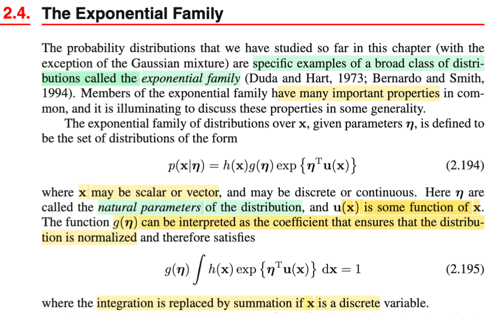
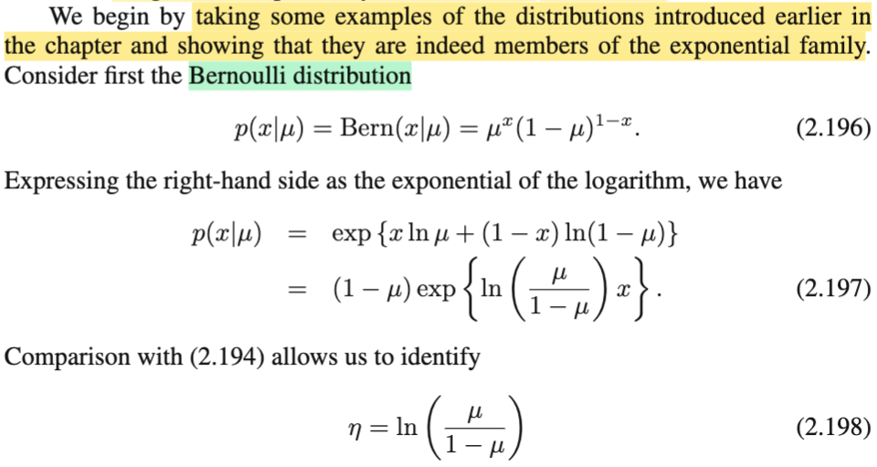
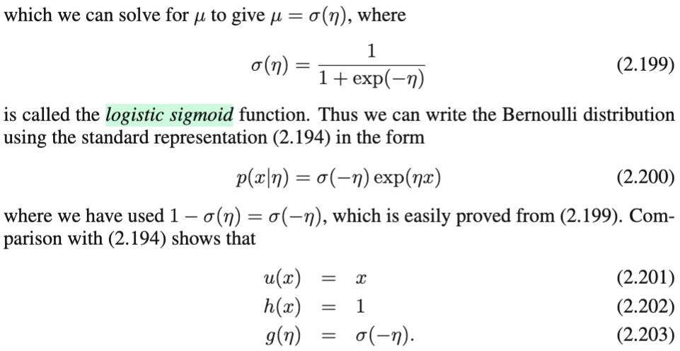
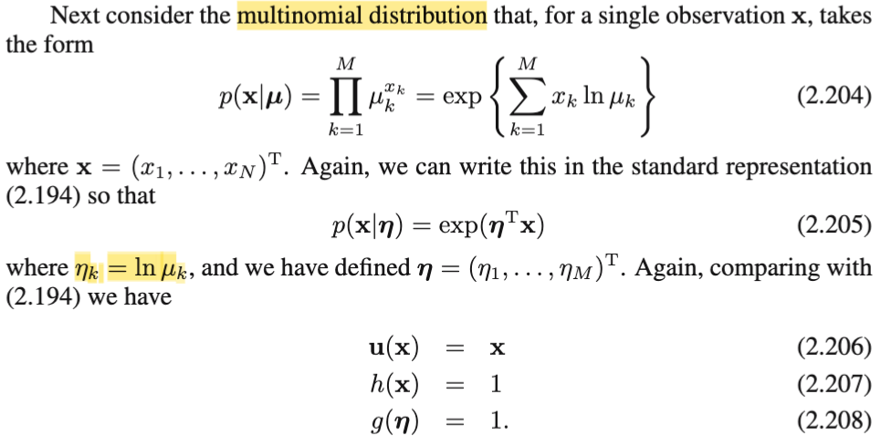
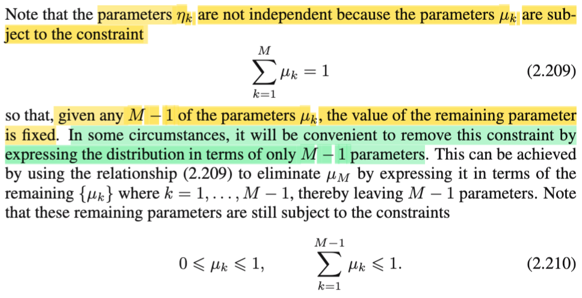
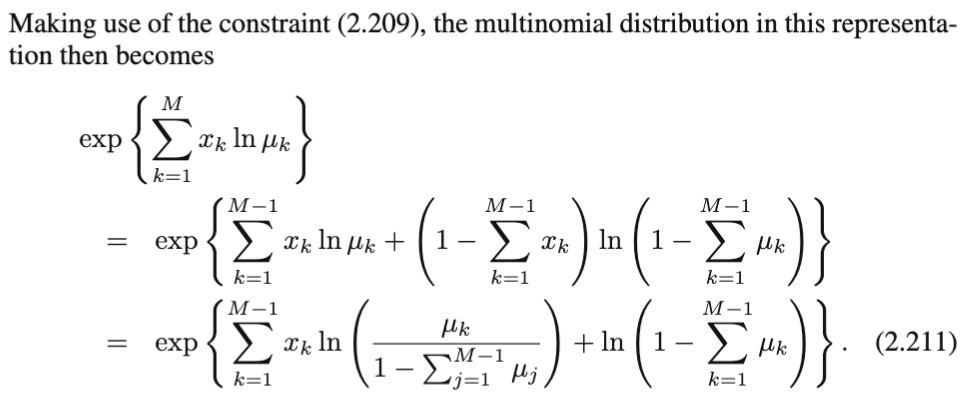
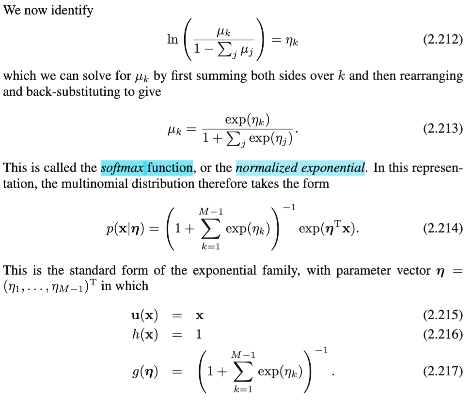
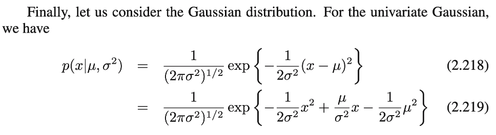
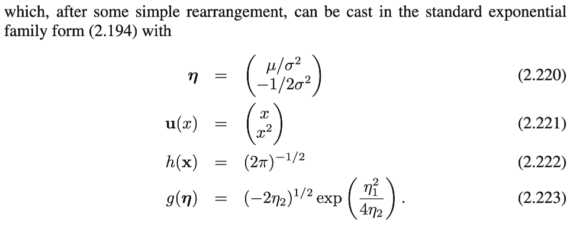

# 2.4 The Exponential Family

📊 **Progress:** `6` Notes | `9` Screenshots | `5` AI Reviews

---

<kbd></kbd>

> [!NOTE]
> Qua phần này, mình sẽ gặp lại Exponential Family đã học ở Casella, còn nhớ đại khái, đây là một họ các distribution, trong đó bao gồm nhiều distribution quan trọng như Normal, Exponential, Binomial,... và cái này có vài tính chất đặc biệt khiến cho nó hữu ích. Trong Casella, mình đã đi qua vài ví dụ để chỉ ra vì sao một distribution là thành viên của Exponential family, cũng như vài theorem nói về tính chất của nó. Nay mình sẽ gặp lại nó trong bối cảnh Bishop (Machine Learning)
>
>
>
> Rồi, thế thì ở đây gs Bishop cũng nhắc lại vài ý trên, đó là, Normal, thật ra là thành viên của một họ các distribution rộng hơn, gọi là Exponential family. Và chúng có nhiều đặc điểm quan trọng.
>
>
>
> Công thức chung của chúng là:
>
>
>
> f(**x**|**η**) = h(**x**)g(**η**)exp{**η**T**u**(**x**)}
>
>
>
> g(**η**) đóng vai normalizing constant.
>
>
>
> **η**, được gọi là natural parameters
>
>
>
> **u**(**x**) là function nào đó của **x**.
>
>
>
> Trong sách Casella, công thức của nó là được ghi là: f(x|**θ**) = h(x) c(**θ**) exp(Σi wi(**θ**)ti(x)) 
>
>
>
> dĩ nhiên Σi wi(**θ**)ti(x) cũng tương đương với **η**T**u**(**x**) ở đây

**🔗 See also:** [2.4.1 Maximum likelihood & sufficient statistic](./241_maximum_likelihood_sufficient_statistic.md#node-niekuox)

 

## Bernoulli Distribution Exponential Family

<kbd></kbd>

<kbd></kbd>

> [!NOTE]
> Rồi, trong Casella mình đã thấy qua ví dụ chứng minh Binomial, Normal là thành viên của của Exponential family, nay ta cũng làm lại, và thêm vài distribution khác, ví dụ Bern(μ)
>
>
>
> Pdf f(x|μ) của X \~ Bern(p), hay trong sách Bishop gs thường ghi luôn là Bern(x|μ):
>
>
>
> Bern(x|μ) = μ^x(1-μ)^(1-x)
>
>
>
> mục đích là xem nó có dạng:
>
>
>
> f(**x**|η) = h(**x**)g(**η**)exp{**η**Tu(**x**)} không
>
>
>
> dùng công thức a = exp ln (a)
>
>
>
> ⇨ μ^x(1-μ)^(1-x) = exp {ln \[μ^x(1-μ)^(1-x)\] }
>
>
>
> = exp {ln \[μ^x\]+ ln\[(1-μ)^(1-x)\]}
>
>
>
> = exp {x ln(μ) + (1-x) ln(1-μ)}
>
>
>
> = exp {x ln(μ) + ln(1-μ) - xln(1-μ)}
>
>
>
> = exp {x ln(μ) - xln(1-μ) + ln(1-μ)}
>
>
>
> = exp {x\[ln(μ) - ln(1-μ)\]} exp {ln(1-μ)}
>
>
>
> = exp {x ln\[μ/(1-μ)\]} (1-μ)
>
>
>
> = (1-μ) exp {ln\[μ/(1-μ)\] x}
>
>
>
> Tới đây, η chính là ln\[μ/(1-μ)\], và g(η) = (1-μ), và h(x) = 1, u(x) = x
>
>
>
> để từ đó pmf của Bern(η) có dạng h(x)g(η) exp{η u(x)} (công thức **η**T**u**(**x**) trong trường hợp này chính là ηu(x) = ηx) nên đây chính là thành viên của Exponential family.
>
>
>
> Ở trên mình nói g(η) = (1-μ) có thể làm rõ hơn tí:
>
>
>
> Ta có η = ln\[μ/(1-μ)\]
>
>
>
> ⇨ exp(η) = μ/(1-μ)
>
>
>
> ⇔ (1-μ) exp(η) = μ
>
>
>
> ⇔ exp(η) - μexp(η) = μ
>
>
>
> ⇔ exp(η) = μ + μexp(η)
>
>
>
> ⇔ exp(η) = μ\[1 + exp(η)\]
>
>
>
> ⇔ exp(η)/\[1 + exp(η)\] = μ
>
>
>
> ⇔ μ = σ(η) với σ(.) là sigmoid function, σ(x) = e^x / (1 + e^x) (đã gặp nhiều trong các lớp ml trước đây).
>
>
>
> Vậy g(η) = 1-μ = 1-σ(η) = 1 - exp(η)/\[1 + exp(η)\] = \[1 + exp(η) - exp(η)\]/\[1 + exp(η)\]
>
>
>
> = 1/\[1 + exp(η)\]
>
>
>
> và đây cũng chính là σ(-η), vì ráp công thức sigmoid vào sẽ thấy.
>
>
>
> Vậy g(η) = σ(-η)
>
>
>
> (thật ra ta có thể dừng ngay ở trên, vì khi η = ln\[μ/(1-μ)\], thì kiểu gì 1-μ cũng là hàm g(η) với hàm g có công thức nào đó, chẳng qua là nếu giải chi tiết ra sẽ thấy đó chính là σ(-η))

> [!TIP]
> **🤖 AI Feedback** — ✅ Score: **100/100**
>
> Bạn đã thực hiện biến đổi đại số một cách hoàn hảo và chi tiết, làm nổi bật từng bước để đưa phân phối Bernoulli về dạng của họ Exponential. Việc xác định rõ ràng các thành phần h(x), g(η), η, u(x) chứng tỏ bạn đã nắm rất vững cấu trúc của Exponential Family và vượt xa độ sâu trình bày của tài liệu gốc.

 

### Multinomial Distribution Representation

<kbd></kbd>

> [!NOTE]
> Tương tự, xét phiên bản khái quát của Binomial, tức Multinomial distribution.
>
>
>
> f(**x**|**μ**) (hay Multinomial(**x**|**μ**)) = ∏k=1:M μk^xk
>
>
>
> (Chú ý chỗ này, **RẤT DỄ LÚ**, cần nhớ công thức pmf của multinomial(N, **μ**) với M category, tức μ = (μ1,...μM) là:
>
>
>
>  f(**x**|N, **μ**) = N! ∏k=1:M (μk^xk)/xk!
>
>
>
> Nhưng chú ý ông Bishop **ĐANG XÉT** **N = 1**, khi ổng nói "for a single observation **x**". 
>
>
>
> Và tí nữa ta sẽ derive lại pmf của multinomial(N, **μ**) để hiểu rõ lại cái pmf này)
>
>
>
> = exp ln {∏k=1:M μk^xk} (a = e^ln(a))
>
>
>
> = exp {∑k=1:M \[ln (μk^xk)\]}
>
> \
> = exp {∑k=1:M \[xk ln (μk)\]}
>
>
>
> Đặt vector **η** = \[η1, η2,...\]T = \[ln(μ1), ln(μ2),... \]T và u(**x**) = **x** ta sẽ thấy cái cụm trên chính là exp(**η**Tu(**x**))
>
>
>
> và do đó exp {∑k=1:M \[xk ln (μk)\]} = h(**x**) g(**η**) exp(**η**Tu(**x**)) với h(**x**) = 1, g(**η**) = 1 là đã đủ để chỉ ra pmf của multinomial distribution có dạng của một exponential family
>
>
>
> ---
>
>
>
>  Thử derive lại pmf của multinomial:
>
>
>
> Câu chuyện của distribution này là: Thực hiện N, ví dụ 5 thử nghiệm: bốc từ một rổ có K = 3 loại banh (đánh số thứ tự các banh). Lọ có nhiều banh, nhưng chỉ có 3 loại, (không phải chỉ có 3 banh) và xác suất bốc được banh thứ k là pk. Dĩ nhiên tổng Σk pk = 1.
>
>
>
> Một kết qủa cụ thể của thử nghiệm có thể là: 12312, và ta sẽ nói rằng, thử nghiệm cho ra 2 lần bốc banh 1, 2 lần bốc banh 2, 1 lần bốc banh 3 → (2,2,1)
>
>
>
> Và kết qủa này là story của một random vector X = (X1,X2,X3) tuân theo phân phối multinomial(N=5,K=3)
>
>
>
> Có nghĩa là story của X là X1 là số lần bốc được banh 1 trong M lần bốc, ...Xi là số lần bốc được banh i trong N lần bốc.
>
>
>
> Nên Σk=1:K Xk = N
>
>
>
> Rồi, thử xét event **X** = (2,2,1) tương ứng với nhiều kết quả, trong đó có kết quả cho ra chuỗi cụ thể 12312 ở trên
>
>
>
> Lập luận là: event X = (2,2,1) sẽ là union của các event (hay chuỗi kết quả) trong đó đều có số banh 1, 2, 3 là 2, 2, 1. gọi chung các event này là E221_j, và J là tổng số event này. Ta có:
>
>
>
> P(X = (2,2,1) = P(E221_1 U E221_2 U....E221_J)
>
>
>
> Nhận định: các event E221_j này sẽ khác nhau về mặt hình thức, chúng chỉ có cùng cấu trúc là 2, 2, 1 banh 1,2,3 mà thôi, nói cách khác, chúng là các chuỗi kết quả cụ thể khác nhau, nên đây là các DISJOINT EVENTS, từ đó, áp dụng Axiom 3 của lí thuyết xác suất, ta có: xác suất của union các disjoint event = tổng xác suất các event:
>
>
>
> ⇨ P(X = (2,2,1) = ∑j=1:J P(E221_j)
>
>
>
> Nhiệm vụ bây giờ chia thành hai việc: Tính J và tính P(221_j)
>
>
>
> Tính P(E221_j), j = 1,2,....J.
>
>
>
> Lấy một chuỗi cụ thể ra làm ví dụ, ví dụ cho rằng chuỗi 12312 là E221_1 (tức là nó là cái đầu tiên trong số các chuỗi kết quả có dạng 2 banh 1, 2 banh 2, 1 banh 3), thì bản thân nó là joint event của các event:
>
>
>
> (X1 = 1, X2 = 2, X3 = 3, X4 = 1, X5 = 2)
>
>
>
> Thế thì, vì cách tiến hành thử nghiệm khiến các lần bốc banh đều độc lập (việc bốc được banh 1 lần thứ nhất không ảnh hưởng đến xác suất bốc được banh 1 ở lần sau), do đó, các event đều độc lập. Như vậy, dùng định nghĩa của các indepenent event, xác suất củau joint event của chúng bằng tích xác suất từng event:
>
>
>
> P(E221_1) = P(X1 = 1, X2 = 2, X3 = 3, X4 = 1, X5 = 2) = P(X1=1)P(X2=2)P(X3=3)P(X4=1)P(X5=2)
>
>
>
> ráp các giá trị xác suất vào:
>
>
>
> = μ1μ2μ3μ1μ2 = (μ1^2)(μ2^2)μ3
>
>
>
> Và lập luận tiếp theo là, với bất kì cách sắp xếp nào khác của 2 banh 1, 2 banh 2, và 1 banh 3, thì cách tính cũng y chang, nên dễ thấy P(E221_j) đều bằng (μ1^2)(μ2^2)μ3 với mọi j.
>
>
>
> Nhiệm vụ thứ 2: tính J, tức tổng số chuỗi kết quả thử nghiệm có dạng 2 banh 1, 2 banh 2, và 1 banh 3:
>
>
>
> Đây chỉ là bài toán đếm: Đếm số lần kết quả ra được được chuỗi có 2 banh 1, 2 banh 2, 1 banh 3, trong đó ta không care thứ tự của chúng, và không phân biệt hai banh cùng loại với nhau.
>
>
>
>  Bài toán tương đương số cách xếp 5 banh vào chuỗi trong đó có 2 banh 1, 2 banh 2 và 1 banh 3:
>
>
>
> Chọn 2 vị trí cho 2 banh 1: 5 choose 2
>
>
>
> Chọn 2 vị trí cho 2 banh 2: 3 choose 2
>
>
>
> Chọn 1 vị trí cho 1 banh 1: 1
>
>
>
> ⇨ Đếm theo step rule: (5 choose 2)×(3 choose 2)×1 = \[5!/3!2!\]×\[3!/2!1!\]×1 = 5!/(2!2!)
>
>
>
> Có thể đếm cách khác: Nếu cho rằng các banh đều khác nhau thì với 5 vị trí ta có 5! cách xếp. Nhưng không phân biệt hai banh cùng loại nên phải điều chỉnh: 5!/(2!2!1!) = 5!/(2!2!)
>
>
>
> Vậy J = 5!/(2!2!1!)
>
>
>
> ⇨ P(**X** = (x1=2,x2=2,x3=1) = ∑j=1:J P(E221_j) = 5!/(2!2!1!) (μ1^2)(μ2^2)μ3
>
>
>
> Suy ra công thức tổng quát là:
>
>
>
> P(**X**=(x1,x2,..xK)) = \[n!/(x1!x2!...xK!)\] (μ1^x1)(μ2^x2)...(μK^xK)
>
>
>
> = N! ∏k=1:K (μk^xk)/xk! → Đây chính là pdf của **X** = (X1,...XK) \~ multinomial(N, **μ**)
>
>
>
> Nên từ đây giúp ta hiểu cái công thức mà gs Bishop đang nói như sau:
>
>
>
> Nói ngắn gọn, **ÔNG ĐANG NÓI ĐẾN MULTINOMIAL X** = (X1,X2,...XM) \~ (N=1, **μ**), nên pmf sẽ là:
>
>
>
> 1! ∏k=1:M (μk^xk)/xk!
>
>
>
> = ∏k=1:M (μk^xk)/xk!

> [!TIP]
> **🤖 AI Feedback** — ✅ Score: **98/100**
>
> Ghi chú của bạn giải thích rất chi tiết và chính xác quá trình biến đổi công thức phân phối đa thức (multinomial distribution) sang dạng exponential family, khớp hoàn hảo với hình ảnh gốc. Đặc biệt ấn tượng là việc bạn đã tự mình đạo hàm công thức tổng quát của phân phối đa thức và sau đó lý giải một cách sáng tỏ tại sao công thức trong sách lại chỉ áp dụng cho trường hợp 'một lần quan sát' (N=1).

 

#### Parameter Constraint and Reduction

<kbd></kbd>

<kbd></kbd>

> [!NOTE]
> Xét constraint của các μk: ∑k=1:M μk = 1 (constrain này đơn giản là do định nghĩa của multinomial distribution)
>
>
>
> Vậy thì ở đây nói, ta có thể bỏ đi cái constraint này, bằng cách thể hiện thằng μM bởi M-1 cái còn lại:
>
>
>
> μM = 1 - ∑k=1:M-1 μk,
>
>
>
> Ngoài ra ta còn có constraint: ∑k=1:M xk = 1 (tức ∑k xk = N, với N = 1) ⇨ xM = 1 - ∑k=1:M-1 xk
>
>
>
> lúc này tham số của distribution chỉ còn M-1 cái: μ1,...μM-1.
>
>
>
> Khi đó pmf trở thành:
>
>
>
> exp {∑k=1:M \[xk ln (μk)\]}
>
>
>
> = exp {∑k=1:M-1 \[xk ln (μk)\] + xM ln(μM)} (tách cái tổng M term thành tổng M-1 term + cái cuối xM ln(μM))
>
>
>
> = exp {∑k=1:M-1 \[xk ln (μk)\] + (1 - ∑k=1:M-1 xk) ln(μM)}
>
>
>
> = exp {∑k=1:M-1 \[xk ln(μk)\] + ln(μM) - ln(μM) ∑k=1:M-1 (xk)}
>
>
>
> = exp {∑k=1:M-1 \[xk ln(μk)\] + ln(μM) - ∑k=1:M-1 \[xk ln(μM)\]}
>
>
>
> = exp {∑k=1:M-1 \[xk ln(μk)\] - ∑k=1:M-1 \[xk ln(μM)\] + ln(μM)}
>
>
>
> = exp {∑k=1:M-1 \[xk (ln(μk) - ln(μM))\] + ln(μM)}
>
>
>
> = exp {∑k=1:M-1 \[xk ln(μk/μM)\] + ln(μM)}
>
>
>
> Thay μM = 1 - ∑k=1:M-1 μk vào, và dùng index j cho phân biệt: μM = 1 - ∑j=1:M-1 μj
>
>
>
> = exp {∑k=1:M-1 \[xk ln(μk/\[1 - ∑j=1:M-1 μj\])\] + ln(1 - ∑j=1:M-1 μj)} → đây là 2.211

> [!TIP]
> **🤖 AI Feedback** — ✅ Score: **98/100**
>
> Phần trình bày của bạn rất chi tiết và chính xác từng bước trong quá trình biến đổi đại số, thể hiện sự hiểu biết sâu sắc về việc loại bỏ tham số và cách các biến xk được xử lý. Bạn đã khớp thành công với công thức (2.211) và có nhận định đúng về trường hợp N=1 cho tổng xk. Để hoàn thiện hơn nữa, bạn có thể giải thích rõ ràng hơn về lý do ban đầu bạn chọn xử lý trường hợp N=1 trong biến đổi của mình.

 

##### Softmax Function and Multinomial Distribution

<kbd></kbd>

> [!NOTE]
> Tiếp tục, với việc ta đã có:
>
>
>
> f(**x**|μ) = exp {∑k=1:M-1 \[xk ln(μk/\[1 - ∑j=1:M-1 μj\])\] + ln(1 - ∑j=1:M-1 μj)}
>
>
>
> (cần chú ý, đây chỉ là việc ta bỏ bớt một tham số μM dùng constraint Σk=1:M μk = 1, và cũng như cùng constraint Σk=M xk = N = 1. Và lưu ý cái số 1 đầu tiên là do định nghĩa của multinomial, tổng các xác xuất μ1,...μM phải bằng 1, còn cái số 1 thứ hai là do ta đang xét một multinomial(N, **μ**) với N = 1, tương ứng với ý nghĩa của X = x1,x2...xM là: trong N=1 lần bốc, thì có bao nhiêu lần bốc được banh 1, bao nhiêu lần bốc được banh 2, ..bao nhiêu lần bốc được banh M, và như vậy ta thấy với multinomual(1, **μ**) thì các observed value của nó luôn chỉ có dạng one-hot vector. ví dụ (1,0,0,..0), hoặc (0,1,....0))
>
>
>
> Tiếp, cái việc ta đang làm vẫn chỉ là chỉ ra cho thấy công thức pdf của multinomial có dạng của exponential family (mà lúc nãy đã làm xong rồi), chẳng qua muốn xem với việc bỏ bớt tham số nhờ constraint nói trên thì kết quả sẽ cho thấy dạng exponential family sẽ trông như thế nào. (lúc nãy kết quả ra là: exp {∑k=1:M \[xk ln (μk)\]} = h(**x**) g(**η**) exp(**η**Tu(**x**)) với h(**x**) = 1, g(**η**) = 1)
>
>
>
> Vậy tiếp tục làm việc với:
>
>
>
> f(**x**|μ) = exp {∑k=1:M-1 \[xk ln(μk/\[1 - ∑j=1:M-1 μj\])\] + ln(1 - ∑j=1:M-1 μj)}
>
>
>
> để ý trong exp là một cái tổng, mà hạng tử đầu tiên là ∑k=1:M-1 \[xk ln(μk/\[1 - ∑j=1:M-1 μj\])\]
>
>
>
> Đặt ln(μk/\[1 - ∑j=1:M-1 μj\]) = ηk
>
>
>
>  và dùng biến đổi đại số (dài dòng nhưng ko khó) ta có thể cho ra:
>
>
>
> μk = exp(ηk) / \[1 + Σj exp(ηj)\]
>
>
>
> và đây gọi là hàm SOFTMAX (đã gặp nhiều)
>
>
>
> từ đó, pdf của multinomial có thể được thể hiện ở dạng của exponential family theo cách thứ hai:
>
>
>
> f(x|η) = \[1 + ∑k=1:M-1 exp(ηk)\]^-1 exp(**η**T**x**)
>
>
>
> chính là công thức của exponential familty với u(**x**) = **x**, h(**x**) = 1, g(η) = \[1 + ∑k=1:M-1 exp(ηk)\]^-1

> [!TIP]
> **🤖 AI Feedback** — ✅ Score: **100/100**
>
> Bài làm rất chính xác và sâu sắc. Bạn không chỉ tái hiện lại các công thức mà còn giải thích chi tiết ý nghĩa của các biến đổi và ràng buộc, thể hiện sự hiểu biết toàn diện về nội dung.

 

###### Solving for mu_k

<kbd></kbd>

<kbd></kbd>

> [!NOTE]
> Cuối cùng là Normal, cái này bên Casella đã biết rồi. Cơ bản thì vì Normal nó đã có cái exp sẵn, nên chỉ cần xử lí nó để lòi ra **η**Tu(**x**):
>
>
>
> Normal(x|μ, σ^2) = \[1/√(2πσ^2)\] exp{-(x-μ)^2/2σ^2}
>
>
>
> = \[1/√(2πσ^2)\] exp{-(x^2-2μx+μ^2)/2σ^2}
>
>
>
> = \[1/√(2πσ^2)\] exp{-x^2/2σ^2+2μx/2σ^2-μ^2/2σ^2)}
>
>
>
> = \[1/√(2πσ^2)\] exp{-x^2/2σ^2+μx/σ^2-μ^2/2σ^2)}
>
>
>
> = \[1/√(2πσ^2)\] exp{(-1/2σ^2)x^2+(μ/σ^2)x} × exp{-μ^2/2σ^2)}
>
>
>
> = \[1/√(2πσ^2)\] exp{-μ^2/2σ^2) exp{(-1/2σ^2)x^2+(μ/σ^2)x}}
>
>
>
> Đặt **η** = \[-1/2σ^2, μ/σ^2\]T
>
>
>
> u(x) = \[x^2, x\]
>
>
>
> ⇨ trong exponential chính là **η**Tu(x)
>
>
>
>  và ở ngoài \[1/√(2πσ^2)\] exp{-μ^2/2σ^2) ta có thể tin là h(x) g(**η**) luôn cũng được. Hoặc giải tìm cụ thể chúng là gì:
>
>
>
> Ta đặt **η** (= (η1, η2)) = \[-1/2σ^2, μ/σ^2\]T ⇨ η1 = -1/2σ^2 ⇨ σ^2 = -1/2η1
>
>
>
> η2 = μ/σ^2 ⇨ μ = σ^2 η2 = -η2/2η1
>
>
>
> ⇨ \[1/√(2πσ^2)\] exp{-μ^2/2σ^2) = \[1/√(2π)\] \[1/√σ^2)\] exp{-μ^2/2σ^2)
>
>
>
>  = \[1/√(2π)\] \[1/√(-1/2η1)\] exp{-(-η2/2η1)^2/2(-1/2η1))
>
>
>
> = \[1/√(2π)\] \[1/√1/(-2η1)\] exp{-(η2^2/4η1^2)/(-η1))
>
>
>
> = \[1/√(2π)\] \[√(-2η1)\] exp{η2^2/4η1)
>
>
>
> = \[1/√(2π)\] (-2η1)^1/2 exp{η2^2/4η1) → 2.223 (mình đặt eta và u(x) thứ tự ngược lại với trong sách nhưng ko quan trọng.

> [!TIP]
> **🤖 AI Feedback** — ✅ Score: **100/100**
>
> Bạn đã thể hiện sự hiểu biết sâu sắc bằng cách trình bày chi tiết từng bước chuyển đổi phân phối Gaussian sang dạng exponential family, bao gồm cả việc rút gọn h(x)g(η) một cách chính xác. Việc bạn nhận ra và giải thích sự khác biệt trong thứ tự các thành phần của η so với tài liệu gốc cho thấy một tư duy phản biện và cực kỳ chính xác.

 

