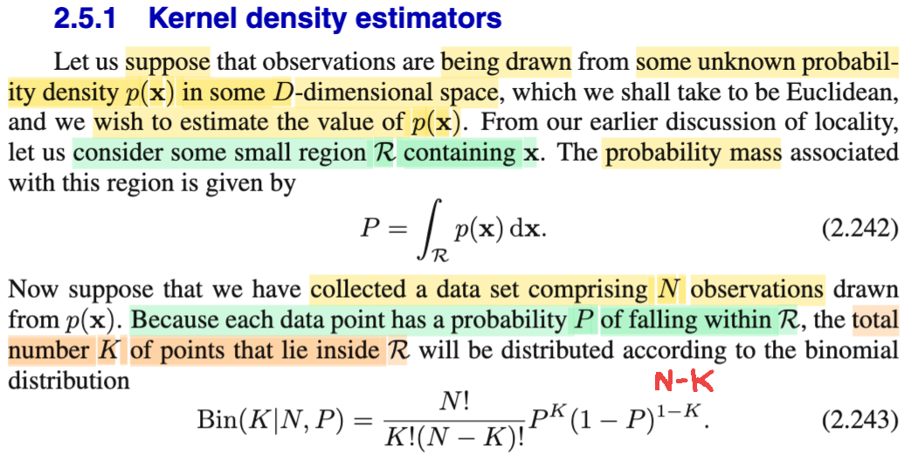
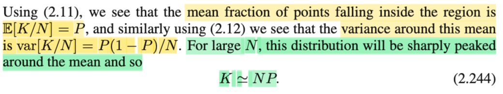
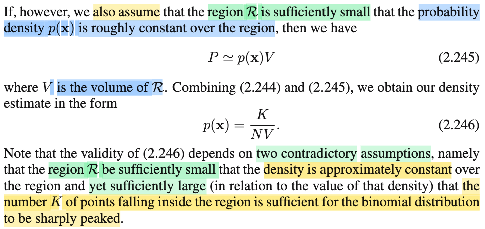
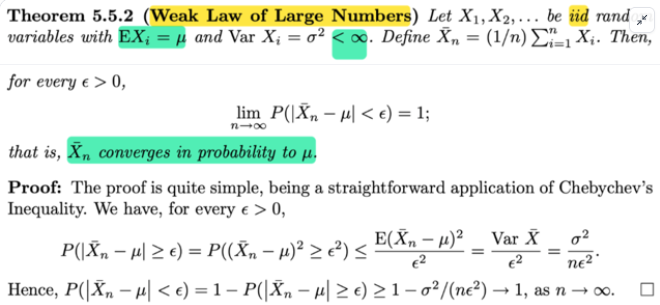
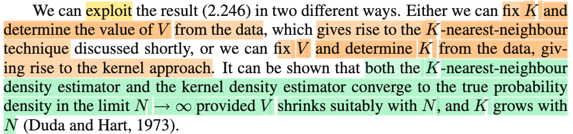
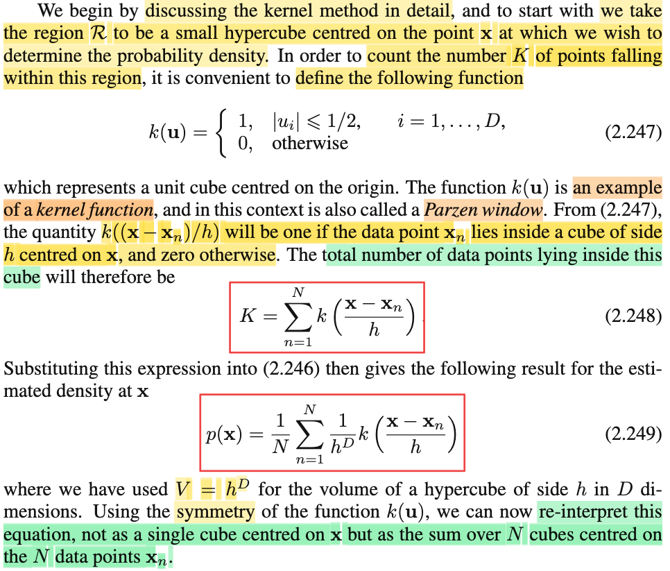
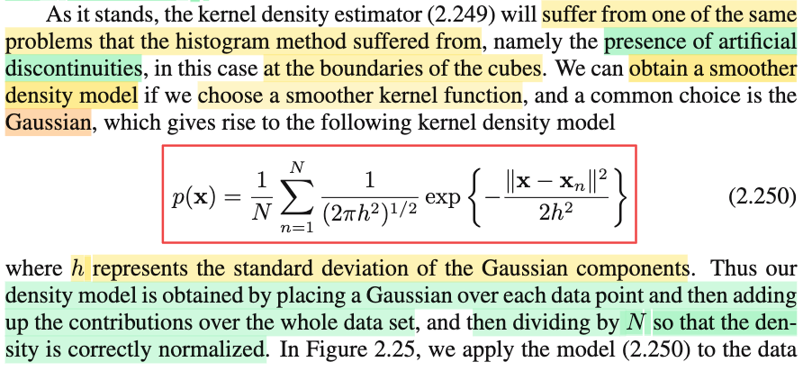
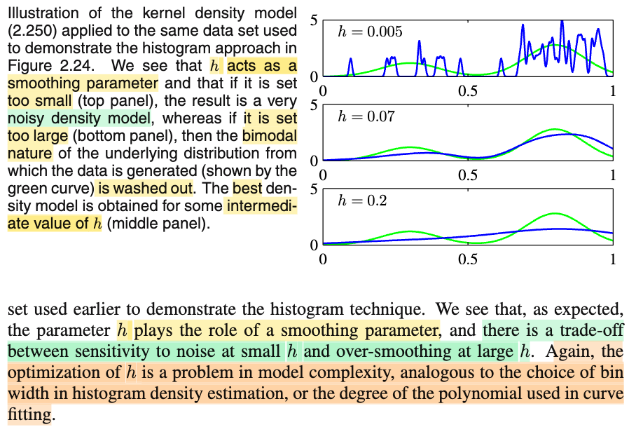
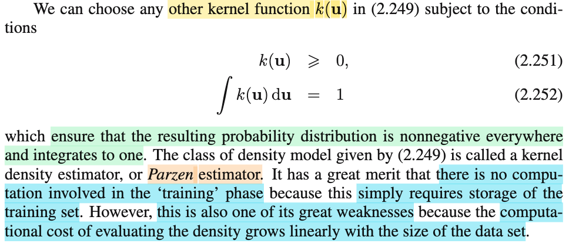

# 2.5.1 Kernel density estimators

📊 **Progress:** `7` Notes | `9` Screenshots | `5` AI Reviews

---

 

## Kernel density estimators

<kbd></kbd>

> [!NOTE]
> Ta qua phương pháp đầu tiên - Kernel density estimator. 
>
>
>
> Đầu tiên gs cho rằng ta có một distribution có pdf f(**x**) nào đó có dimension. (Ý này nói theo ngôn ngữ thống kê chỉ là: xét một random variable vector **X** = (X1,...XD) có pdf là f(**x**). Và ta lấy mẫu (sampling) từ nó, với mong muốn là estimate hàm pdf này.
>
>
>
> Rồi, đại khái gọi **x** là một điểm nào đó, và gọi vùng nhỏ lân cận **x** là **R**.  Còn nhớ theo định nghĩa của hàm pdf đã học trong Casella hay Stat110, pdf của biến ngẫu nhiên liên tục X, kí hiệu fX(x) là hàm được định nghĩa là P(X ∈ A) = ∫A fX(x)dx. Nên tương tự, với f(**x**) là pdf của **X**, thì P(**X** ∈ R) = ∫R f(**x**) d**x**. Và ở đây gs đặt gía trị này là P.  (tóm lại 2.242 chỉ là từ định nghĩa của hàm pdf, không có gì cao siêu)
>
>
>
> Tiếp theo, gs cho biết ta thu thập được N giá trị quan sát từ phân phối f(**x**) này. 
>
>
>
> Chỗ này, nếu nói theo ngôn ngữ Casella, thì ta có một **random sample** size N, iid **X1**, **X2**,...**XN** đều \~ f(**x**) (dĩ nhiên phải hiểu, **X1**, viết đậm, là random variable vector trong sample, bản thân nó là vector có D phần tử **X1** = (X11, X12,..X1D).
>
>
>
> Ôn nhanh định nghĩa của random sample size n: Đó là ta có một đại lượng có tính không chắc chắn nào đó, và ta sẽ tiến hành quan sát giá trị của nó n lần, sao cho mỗi lần là độc lập nhau. Vì mỗi lần quan sát, do tính không chắc chắn, nên giá trị quan sát được sẽ có thể có nhiều possible value, do đó giá trị quan sát sẽ được thể hiện bởi một random variable: X1, ...Xn. Vì thí nghiệm được tiến hành độc lập, nên các random variable này đều độc lập lẫn nhau (mutually independent), và vì cùng quan sát một đại lượng có tính không chắc, nên các random variable này đều có chung một population distribution (indentically distributed), viết tắt lạ iid.
>
>
>
>  Thế thì, **X1**, **X2**,... **XN**,cần hiểu rằng, là các random variable vector thuộc distribution f(**x**), nên: 
>
>
>
> P(**X1** ∈ R) = ∫R f(**x**) d**x**
>
>
>
> và đối với **X2**,..,**XN** cũng vậy
>
>
>
> Nên P(**X1** ∈ R) = P(**X2** ∈ R) = ..∫R f(**x**) d**x**, và giá trị này ta đã đặt là **P** ở trên.
>
>
>
> Thế thì tiếp theo, ta sẽ gọi K là số data point rơi vào vùng R. Thì vì **X1**,...**XN** như đã nói, là các random variable, nên chúng có nhiều possible value dẫn đến việc giá trị của chúng có thuộc vùng R không và dẫn đến giá trị của K sẽ có nhiều khả năng, do đó, **K là một random variable**, và người ta quan tâm đến distribution của K.
>
>
>
> Thế thì, các possible value của K, dễ thấy sẽ từ 0,1,2... đến N. K = 0 khi mọi random variable **Xi** đều không ∈ R và K = N khi mọi **X1**, ...**XN** đều ∈ R.
>
>
>
> Như vậy, nhớ lại Stat110, ta nhớ story của binomial(n,p), là ta có n Bern(p) trial iid, và ta quan tâm đến tổng số trial success. Khi đó, đại lượng này sẽ là một random variable thuộc phân phối binomial(n,p). Vậy thì ở đây, ta cũng có N Bern trial. Mỗi trial là check xem Xi có thuộc R hay không. Và vì **Xi** đều độc lập, nên ta cũng có các Bern trial độc lập. Hơn nữa, xác suất thành công của trial này đều là P, nên đây thỏa mãn story trên: Đó là ta có N iid Bern(P), nên tổng số data point rơi vào vùng R, tức là random variable K, sẽ là một random variable \~ Binomial(N, P).
>
>
>
> Và pmf của binomial thì biết rồi:
>
>
>
> P(K = k) = (N choose k) P^k (1-P)^(N - k)
>
>
>
> hay viết theo trong sách
>
>
>
> Bin(k|N,P) = (N choose k) P^k (1 - p)(N - k)
>
>
>
> Như vậy chỗ này có thể thấy mr Bishop viết sai công thức, phải là N - k chứ không thể nào là 1 - p)^(1 - k) được.
>
>
>
> Và nhận xét thêm việc ông tương chữ K (viết hoa) vô làm ta dễ rối. vì theo nguyên tắc K là random variable, thì giá trị của nó là k (viết thường), ông ghi luôn K viết hoa trong công thức khiến khó hiểu.

> [!TIP]
> **🤖 AI Feedback** — ✅ Score: **99/100**
>
> Ghi chú của bạn rất chính xác và chi tiết, đặc biệt xuất sắc khi bạn đã phát hiện ra lỗi đánh máy trong công thức 2.243 của văn bản gốc. Khả năng liên hệ kiến thức với các giáo trình thống kê khác và giải thích cặn kẽ các khái niệm cơ bản cho thấy sự hiểu biết sâu sắc của bạn.

 

### Mean and Variance Approximation

<kbd></kbd>

> [!NOTE]
> Rồi, thế thì với X \~ binomial(n, p) ta đã chứng minh nhiều lần (trong Casella và Stat110): EX = np, Var(X) = np(1-p)
>
>
>
> Vậy ở đây, K \~ binomial(N, P) ⇨ E\[K\] = NP ⇨ E\[K\] / N = P. Vì 1/N chỉ là constant, ta dùng tính chất linearity của kì vọng (E\[cX\] = cEX) đưa nó vào trong: E\[K\] / N = P ⇔ **E\[K/N\] = P**
>
>
>
> Tương tự, Var\[K\] = NP(1-P)
>
>
>
> Dùng tính chất của Variance: Var(cX) = c^2 Var(X)
>
>
>
> ⇨ Var\[K\] = Var\[NK/N\] = N^2 Var\[K/N\]
>
>
>
> ⇨ Var\[K\] = NP(1-P) ⇔ N^2 Var\[K/N\] = NP(1-P)
>
>
>
> ⇔ **Var\[K/N\] = P(1-P)/N**
>
>
>
> Khi N lớn thì Var\[K/N\] = P(1-P)/N sẽ tiến về 0.
>
>
>
> Vậy ta hiểu thế này: K là random variabel \~ binomial(N, P) như đã nói. Thì K/N là kết quả của việc áp một hàm số (g(u) = u/N) lên K, nên nó cũng là random variable, distribution của nó là gì ta không cần biết, nhưng biết mean của distribution này là E\[K/N\] = P, và variance là P(1-P)/N, để rồi khi N → inf thì variance → 0. Thế thì ý nghĩa của variance ta nhớ, là đại lượng đo tính chất phân tán (dispersion) của một distribution, nên nếu variance → 0, thì cũng đồng nghĩa là distribution sẽ ít phân tán và tập trung quanh mean P, đây là ý gs nói nó "will be sharply peaked around mean"
>
>
>
> Thế thì như vậy K/N, là random variable. Theo lí mà nói, không thể có giá trị nào cụ thể, mà nó có nhiều possible value. Nếu tính trung bình, qua các possible value đó, với trọng số là pmf thì ta có kì vọng E\[K/N\]. Nhưng ở đây khi N lớn, ta đã nói, xác suất sẽ tập trung hết quanh mean P, tức là coi như K/N = P với xác suất P(K/N = P) = 1. Đây là ý nghĩa của việc ghi: K/N ≈ P hay K ≈ NP.
>
>
>
> Một điểm nữa, hãy để ý, nếu ta đặt Ij = là indicator random variable gắn với event **Xj** ∈ R, j = 1,...N. Khi đó bối cảnh bài toán ta sẽ random sample I1, I2, ...IN iid \~ Bern(P) Và K/N = (∑j Ij) / N chính là sample mean. Khi đó, nhớ lại Weak Law of Large Number theorem, nói rằng: với một số điều kiện, thì sample mean sẽ hội tụ phân phối về population mean. Vậy nên ở đây K/N = (∑j Ij) / N sẽ hội tụ về E\[Ij\] = P: K/N → P. Viết ở dạng toán học: lim N→∞ K/N = P, hay có thể ghi là tại limit khi N lớn, K/N ≈ P ⇔ K ≈ PN

> [!TIP]
> **🤖 AI Feedback** — ✅ Score: **98/100**
>
> Phân tích rất chi tiết và chính xác, không chỉ tái hiện các công thức mà còn giải thích sâu sắc ý nghĩa của chúng, đặc biệt là khi liên hệ với Định luật Số lớn Yếu. Cấu trúc trình bày có thể gọn gàng hơn một chút để dễ đọc hơn.

 

#### Density Estimate Formula

<kbd></kbd>

<kbd></kbd>

> [!NOTE]
> Thế thì tiếp theo, đại khái là nếu như ta giả định rằng vùng R nhỏ đến nỗi trong phạm vi đó f(**x**) có thể coi như là constant, thì khi đó P(**X** ∈ R) = ∫\_R f(**x**)d**x** = f(**x**) ∫\_R d**x** = f(**x**) × thể tích của vùng R = f(**x**) V.
>
>
>
> Kết hợp P ≈ f(**x**)V ⇔ f(**x**) = P/V và K ≈ PN ta có f(x) ≈ K/NV.
>
>
>
> Ông cũng lưu ý rằng kết quả này dựa trên hai assumption mâu thuẫn nhau:
>
>
>
> Giả định thứ nhất là cái vừa nói: là vùng R phải đủ nhỏ để pdf trong vùng đó là hằng số.
>
>
>
> Nhưng nhớ lại chút xíu bối cảnh bài toán: Là cho random sample size N tuân theo một distribution f(**x**) nào đó, và xét vùng R, với xác suất **X** ∈ R đặt là P, khi đó gọi K = Σj Ij là số data point ∈ R, Ij là indicator random variable ứng với event **X**j ∈ R, là một Bernouilly(P) random variable, thì story của K sẽ như số trial success trong N iid Bernouilly(P) trial, nên K sẽ \~ Binomial(N, P), và (Σj Ij)/N chính là sample mean I_bar_n (sample mean từ sample size N), theo luật số lớn yếu, chuỗi I_bar_n sẽ cMộtonverger về E\[Ij\] = P.
>
>
>
> Vậy thì nó liên quan gì đến việc vùng R phải đủ lớn?
>
>
>
> Hiểu thế này:
>
>
>
>  Một ý cốt lõi để WLLN work đó là Var(Xi) phải < ∞, thì Xbar_n mới hội tụ xác suất về E\[Xi\].
>
>
>
> Vậy thì ở đây, bức tranh lớn mà gs đang dẫn dắt ta là thực hiện cái gọi là ước lượng hàm density (density estimation). Nó khác với bài toán parameter inference, trong đó ta đã biết hay giả định biết rằng hàm pdf của distribution có dạng gì (f(x|θ), chỉ là không biết giá trị cụ thể của tham số θ. Còn ở đây, cái mà ta làm, thì lại chả cần quan tâm hoặc không cần biết hình dạng của nó có dạng gì, mà chỉ là ta đi xây một cái hàm số f(x) bằng cách kiểu như vẽ ra tại x bằng các giá trị khác nhau thì f(x) sẽ bằng bao nhiêu (trong cách tiếp cận này, ta không nói gì đến tham số, vì ta không cần tham số, ta chỉ cần biết một mapping x f(x) mà thôi)
>
>
>
> Thế thì để làm cái việc đó, về cơ bản là như đã nói, ta sẽ ước lượng hàm f(**x**) tại một điểm **x** bất kì. Và ý tưởng chủ đạo cho việc này, đó là:
>
>
>
> i) Xét một vùng R quanh lân cận điểm **x**.
>
>
>
> ii) Cho rằng R đủ nhỏ để trong đó f(**x**) là hằng số, thì P(**X** ∈ R), (đặt là P) = f(**x**) V.
>
>
>
> Rồi, lại dựa trên việc ta có N sample (observation) **X**1,...**X**N, thì với việc chúng iid nên khi quan tâm đến việc chúng có thuộc R hay không thì ta sẽ có bối cảnh là chuỗi N iid Bernouilly(P) trial nên K = Σj I\_(**X**j ∈ R) sẽ là một rv \~ Binomial(N, P).
>
>
>
> Đồng thời, nếu ta xét \[Σj I\_(**X**j ∈ R)\] / N, thì đây là sample mean size N của random sample size N Bern(P) I\_(X1 ∈ R), I\_(X2 ∈ R),..... viết gọn là I1, I2,...IN. Thì theo WLLN, nếu ta đảm bảo Var\[Ij\] < ∞, thì \[Σj I\_(**X**j ∈ R)\] / N sẽ hội tụ xác suất về E\[Ij\] = P.
>
>
>
> Và nếu vậy, thì ta sẽ có thể cho \[Σj I\_(**X**j ∈ R)\] / N xấp xỉ cho P, tương đương K/N xấp xỉ f(**x**) V, cũng là f(**x**) xấp xỉ K/NV. Và như vậy ta có được estimate của f(**x**) tại **x**. Làm tương tự với mọi **x** khác trên range **X**, thì ta sẽ có được estimatio của hàm density f(**x**).
>
>
>
> Vấn đề là có thể thấy ta đã dùng hai giả định: Một là f(**x**) phải là constant trong R, nên R phải đủ nhỏ. Và hai là, ta đã viện dẫn WLLN, để cho phép \[Σj I\_(**X**j ∈ R)\] / N xấp xỉ cho P.
>
>
>
> Nhưng để viện dẫn WLLN, thì phải thỏa điều kiện của WLLN: Var\[Ij\] < ∞.
>
>
>
> Để có thể dễ hiểu hơn ta sẽ nhìn theo góc độ khác: đó là xét các random variable Zj = Ij/V. Vì Ij iid thì Zj cũng iid.
>
>
>
> E\[Zj\] = E\[Ij/V\] = E\[Ij\]/V = P/V
>
>
>
> Var\[Zj\] = Var\[Ij/V\] = Var\[Ij\]/V^2
>
>
>
> Và sample mean size N là (Σj Zj)/N,
>
>
>
> nếu Var\[Zj\] < ∞ thì chuỗi sample mean, (Σj Zj)/N, theo WLLN cũng sẽ converge về E\[Zj\] = P/V, để rồi tại limit ta có: 
>
>
>
> (Σj Zj)/N = P/V ⇔ Σj Zj = NP/V 
>
>
>
> ⇔ Σj (Ij/V) = NP/V ⇔ Σj (Ij) = NP 
>
>
>
> ⇔ P = (Σj Ij) / N 
>
>
>
> ⇔ f(**x**) = (Σj Ij) / NV = K / NV 
>
>
>
> Hay xét với N lớn thì ta có xấp xỉ: f(**x**) ≈ K / NV  như kết quả trên.
>
>
>
> Vấn đề là, với việc xét WLLN theo sample mean của Z ta mới thấy khi V quá nhỏ, V → 0 thì Var\[Zj\] = Var\[Ij\]/V^2 sẽ → ∞. Để rồi giúp ta chỉ ra rằng, muốn áp dụng được WLLN, để mà có kết quả xấp xỉ  trên thì V không thể quá nhỏ.
>
>
>
> Đó là lí do ở đây ta có hai assumption mâu thuẫn: V phải nhỏ để f(**x**) là constant trong R, nhưng phải lớn để có thể áp dụng WLLN để có ước lượng f(**x**) ≈ K / NV.

> [!TIP]
> **🤖 AI Feedback** — ✅ Score: **100/100**
>
> Ghi chú rất chính xác và đi sâu vào giải thích các giả định mâu thuẫn, đặc biệt là liên kết giả định thứ hai với điều kiện của Định luật số lớn yếu và ảnh hưởng của thể tích V đến phương sai. Giải thích rõ ràng và sâu sắc hơn nhiều so với văn bản gốc.

**🔗 See also:** [Local Density Estimation Method](./252_nearest_neighbour_methods.md#node-qpzx5xr)

 

##### K-nearest-neighbour and Kernel Density

<kbd></kbd>

> [!NOTE]
> Thế thì ở đây nói ta có thể khai thác kết quả f(**x**) ≈ K / NV theo hai cách:
>
>
>
> Giữ K cố định và dùng data để xác định V, cách này sẽ dẫn đến phương pháp K-nearest neigbor
>
>
>
> Và Giữ V cố định và tính K từ data sẽ dẫn ta đến kernel approach.
>
>
>
> Và người ta đã chứng minh là khi N → inf và cho V nhỏ một cách phù hợp theo N, Và K → N thì cả hai kết quả từ hai cách làm để sẽ hội tụ về distribution thật.

 

###### Parzen Window Density Estimation

<kbd></kbd>

> [!NOTE]
> Rồi, đại khái là đoạn này ta sẽ bàn chi tiết về cách tiếp cận kernel method (nơi ta sẽ dựa vào f(**x**) ≈ K / NV, và fixed V, và tính K từ data)
>
>
>
> Thế thì, như vậy ta sẽ làm gì? → Dựa vào công thức f(**x**) ≈ K / NV thôi, như đã nói, ta sẽ coi như V đã biết, thì xác định K thì ta sẽ có được f(**x**). Và K là gì, còn nhớ, nó là Σj I\_(xi ∈ R), tức số observed value xi thuộc vùng R.
>
>
>
> Đầu tiên, ta sẽ chọn vùng R, là một hypercube (tương tự như trong case D=3 thì là một khối lập phương tâm tại **x**, cạnh là h). Vì việc tiếp theo cần làm là tính K, tức là đếm số data point rơi vào vùng R, nên gs cho rằng sẽ tiện hơn nếu ta định nghĩa một function k(**u**) như công thức 2.247, mà mình có thể dùng cách diễn đạt indicator cho gọn: k(**u**) = I\_{ui ≤ 1/2, i=1,2...D}. Dễ hiểu ý nghĩa của hàm này đó là nếu input vector có mọi phần tử để có trị tuyệt đối ≤ 1/2 thì trả ra 1 hoặc ngược lại thì trả ra 0. Và đây là một ví dụ của cái gọi là **kernel function**, cụ thể trong bối cảnh này, nó có tên là **Parzen window**
>
>
>
> Nhờ có k(**u**), số data point rơi vào một vùng R quanh điểm **x** (nơi cần estiamate density, tức f(**x**)) sẽ là:
>
>
>
> K = Σn=1:N k((**x**-**x**n)/h)
>
>
>
> Và vì vùng R là hypercube cạnh h, nên volume của nó sẽ là h^D (như thể tích hình khối lập phương trong case D=3 thì là h^3 vậy)
>
>
>
> Và như vậy density tại **x** sẽ là f(**x**) ≈ K/NV = Σn=1:N k((**x**-**x**n)/h) / (Nh^D)
>
>
>
> = (1/N) Σn=1:N (1/h^D) k((**x**-**x**n)/h)
>
>
>
>  Và xét cái tổng Σn=1:N k((**x**-**x**n)/h), hoàn toàn có thể nhìn nó theo hai cách: là check xem có bao nhiêu **x**i thuộc cái hộp (hypercubic) có tâm **x**. Nhưng cũng có thể nhìn theo cách khác: là check xem **x** thuộc bao nhiêu cái hộp tậm **x**i.

> [!TIP]
> **🤖 AI Feedback** — ✅ Score: **98/100**
>
> Ghi chú của bạn rất chính xác và đầy đủ, giải thích rõ ràng các khái niệm và công thức từ hình ảnh. Việc trình bày hai cách hiểu về tổng sigma cũng cho thấy sự hiểu biết sâu sắc về nội dung.

 

###### Gaussian Kernel Density Model

<kbd></kbd>

<kbd></kbd>

> [!NOTE]
> Như vậy thì mình hình dung việc "vẽ" cái density function f(**x**) theo phương pháp kernel sẽ là như sau:
>
>
>
> (tưởng tượng ta trong case 1D, và cho **x** đi từ -inf tới inf, tại mỗi điểm ta sẽ vẽ giá trị của f(**x**) = (1/N) Σn=1:N (1/h^D) k((**x**-**x**n)/h)
>
>
>
> Thì như đã nói, với công thức này, đại khái là ta sẽ đếm, xem điểm **x đang xét thuộc cái hộp cubic của mấy data point** rồi nhân cho constant 1/Nh^D. Điều này có nghĩa là, chiều cao của hàm số tại các điểm **x khác nhau ăn thua là ở việc điểm x đó nằm gần nhiều các data point không**, còn cái hằng số thì "ai cũng như ai" chỉ đóng vai trò normalizing constant.
>
>
>
> Với D=1, thì hypercubic, thật ra chỉ là 1 đoạn thẳng có tâm tại x, (lúc này x là 1D nên không cần viết bold font), và dài h.Nên không cần vẽ ra cũng có thể tượng tưởng trong đầu là ta đi từ trái sang phải, ban đầu chưa có data point nào, thì f(x) = 0 khi vào phạm vi của một data point, ví dụ x1, thì lập tức đồ thị dựng đứng lên, và đi ngang, nếu chưa ra khỏi box của x1 mà đã vào box x2, thì đồ thị tiếp tục nhảy lên để đạt độ cao bằng tổng của hai cái. Như vậy có thể thấy, hàm density estimate này là step function, không được trơn (smooth) cho lắm.
>
>
>
> Thế thì người ta mới nghĩ đến việc dùng một hàm kernel k(**u**) khác, smooth hơn, để thay vì có cái rule cục xúc như hàm Parzen window: bằng 1 hoặc 0 khi đủ gần hoặc không. Ta sẽ dùng hàm khác, có hành vi giống pdf của Normal: Để nó có tính chất là, khi đến gần **x thì hàm sẽ tăng để đạt đỉnh tại ngay x và giảm xuống khi ra xa**. Như vậy, sẽ mang lại sự mềm mại hơn.
>
>
>
> Vậy thì quay lại ví dụ "vẽ đồ thị" ở trên, thì ta chỉ khác là khi đứng tại x, f(x) đã bằng tổng kernel của mọi điểm dù ở xa hay gần, chỉ là những điểm ở xa thì mức đóng góp ít, giống như tầm ảnh hưởng ít, còn ở gần thì đóng góp nhiều. Để rồi tiến gần tới x1, thì đóng góp của x1, (và cả các x2, x3,...) đều tăng lên, khiến hàm f(x) đi lên. Khi đi qua khỏi x1, mức đóng góp của x1, giảm xuống, nhưng x2 tăng lên,...nhưng dễ hiểu là sự lên xuống sẽ mượt, chứ không sudden như dùng Parzen window. Giúp ta hiểu cái đoạn gs nói "placing a Gaussian over each data oiint and then adding up the contributions over the whole data set, and then devidinf by N so that the density is correctly normalized"
>
>
>
> Nói chung, mình hiểu cái việc chọn hàm Gaussian kernel **chả liên quan gì với Gaussian distribution gì ở đây**, mà **chỉ là ta muốn hàm kernel nó có hành vi của Gaussian distribution, hay nói đơn giản là ta muốn nó có dạng cái chuông Normal và từ đó có tính smooth mà thôi**. Nên ta hiểu cái 2.250 **không liên quan gì tới phân phối normal cả**, nó chỉ có bản chất là (1/N) Σi k(x - xi) với k(u) là một kernel function, mà ta thay vì dùng Parzen function, thì ở đây ta dùng Gaussian kernel function, = (1/√2πh^2)exp{-(x-xi)^2/2h^2}.
>
>
>
> Cuối cùng, gs cho minh họa để thấy rằng h cũng đóng vai trò là smoothing parameter, khi h nhỏ quá thì hàm density cũng sẽ noisy mà lớn quá thì nó lại quá smooth khiến mất đi, lu mờ đi hai cái đỉnh của hàm pdf gốc (bimodal, màu xanh lá). Dĩ nhiên điều này đồng nghĩa h nhỏ quá hay lớn quá đều khiến estimate density không capture được pattern của true density. Cái này rất tương ứng với việc chọn bề rộng bins của histogram density cũng như chọn bậc của polynomial function trong bài toán curve fitting của chap 1.

> [!TIP]
> **🤖 AI Feedback** — ✅ Score: **92/100**
>
> Bài giải thích rất sâu sắc về cách thức kernel function giúp làm mượt hàm mật độ và vai trò của tham số h, thể hiện sự hiểu biết vượt trội so với văn bản. Để hoàn thiện hơn, hãy làm rõ thêm về mối liên hệ trực tiếp giữa hàm Gaussian kernel được sử dụng và đặc tính của phân phối Gaussian.

 

###### Kernel Density and Parzen Estimator

<kbd></kbd>

> [!NOTE]
> Rồi, cuối cùng, ta có thể chọn các kernel function khác, miễn thỏa hai tính chất ko âm và tích phân = 1.
>
>
>
> Một ý quan trọng đó là, rõ ràng với phương pháp này, không có cái gì gọi là training phase cả, vì tất cả những gì ta cần là lưu trữ bộ dataset. Và khi cần tính density, thì chỉ việc chạy hàm để tính thôi. Nhưng gs cho rằng đây cũng là điểm yếu lớn nhất, khi chi phí tính toán sẽ tỉ lệ tuyến tính với kích thước dataset.

 

