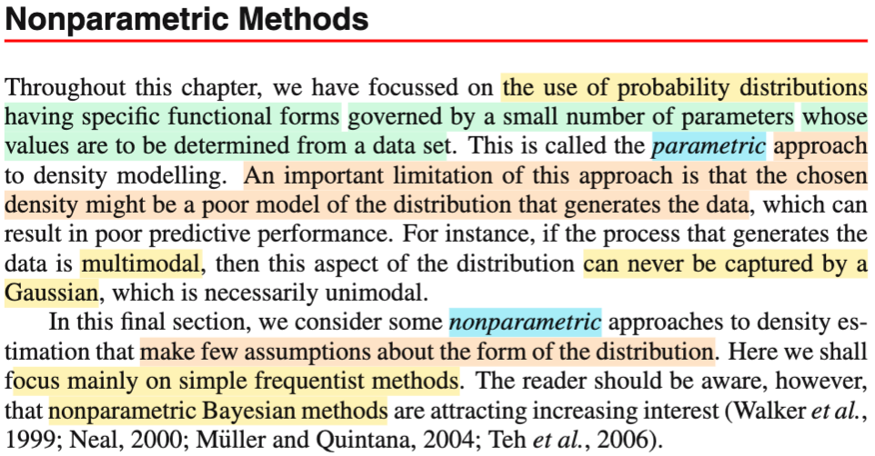
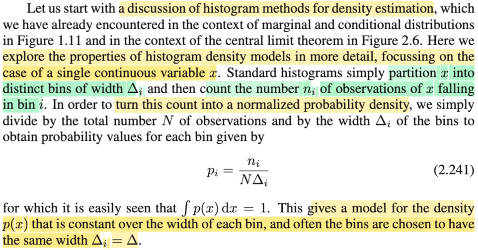
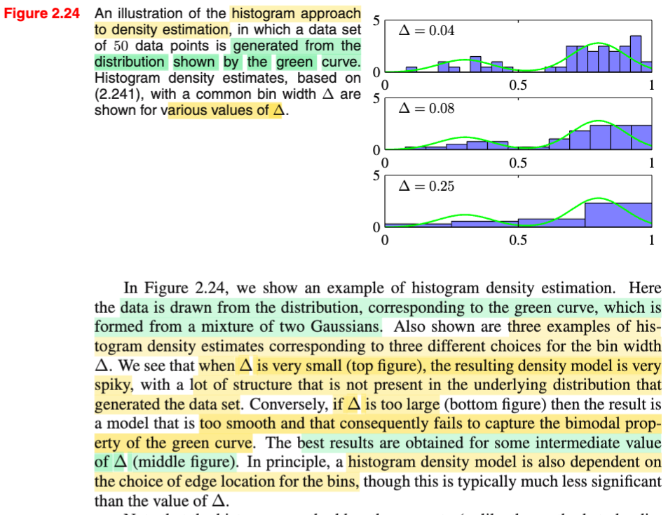
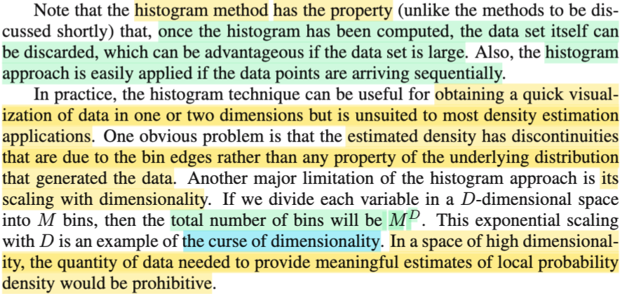
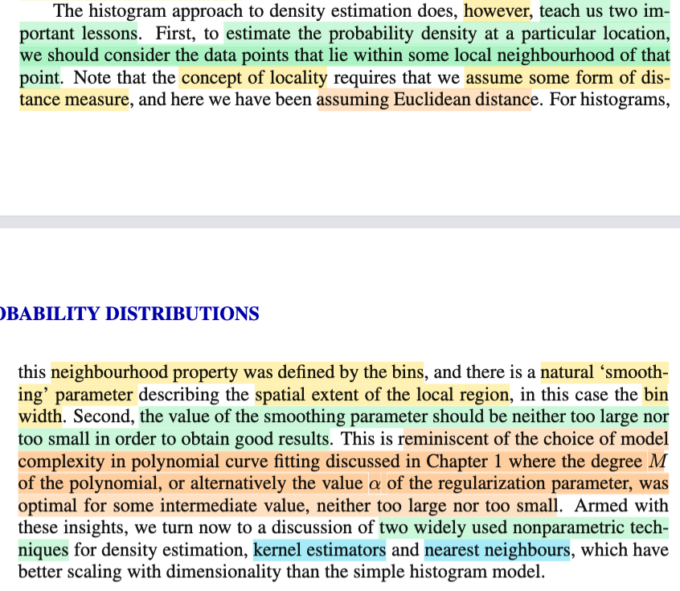

# 2.5 Non-parametric model

📊 **Progress:** `5` Notes | `5` Screenshots | `3` AI Reviews

---

 

## Nonparametric Methods

<kbd></kbd>

> [!NOTE]
> Phần này, đại khái là bữa giờ gs cho biết ta chỉ toàn làm việc với những phân phối xác suất có dạng của một hàm số mà hành vi của nó bị chi phối bởi một số ít các tham số (paramter), và ta sẽ đi xác định giá trị của chúng nhờ data. (bài toán inference). Thì cách làm này được gọi là parametric approach - cách tiếp cận tham số đối với bài toán mô hình hóa mật độ xác suất.
>
>
>
> Tuy nhiên, nhược điểm của cách tiếp cận này đại khái là nó gặp rủi ro rằng ta giả định sai, và chọn nhầm một mô hình. Ví dụ như quy luật thật sự sinh ra dữ liệu đến từ một phân phối xác suất thuộc dạng multi modal, trong khi ta chọn một mô hình xác suất thuộc loại uni modal (như Normal), thì sẽ không thể nào nắm bắt (capture) được quy luật sinh dữ liệu.
>
>
>
>  Phần này mình sẽ bàn đến cách tiếp cận thứ hai: non-parametric approach, trong đó ta sẽ giả định ít hơn về dạng của distribution. Và ông nói ta sẽ chủ yếu là bàn về những phương pháp thuộc trường phái cổ điển (frequentist) nhưng lưu ý ta rằng các phương pháp thuộc trường phái Bayesian đang phát triển mạnh mẽ.

 

### Histogram Density Estimation

<kbd></kbd>

> [!NOTE]
> Ở đây ta sẽ thảo luận sâu hơn về cái gọi là phương pháp histogram đối với bài toán density estimation.
>
>
>
> Phương pháp này đại ý là như sau: giả sử ta muốn estimate density (hàm mật độ xác suất - pdf) của một continous random variable X, ta sẽ làm như sau: Chia trục x thành các khoảng nhỏ i gọi có bề rộng Δi, và thường cho bề rộng bằng nhau hết = Δ. Sau đó, đặt pi = ni / NΔi với ni là số sample quan sát được của random variable X rơi vào cái bins thứ i này. Và N là tổng số sample.
>
>
>
> Như vậy có nghĩa là ta đã ĐỊNH NGHĨA RA MỘT HÀM PDF CÓ DẠNG STEP-FUNCTION,
>
> với giá trị của nó tại khoảng bin thứ i là f(x) = pi = n/NΔi.
>
>
>
> Thế thì thử xem vì sao ∫f(x)dx = 1:
>
>
>
> Xét tích phân ∫f(x)dx, ta biết bản chất của tích phân này là diện tích dưới đồ thị hàm pdf f(x) từ -inf tới inf. Ở đây vì hàm f(x) có dạng step function như nói trên, nên ta sẽ chia nó thành tổng các phần diện tích con tương ứng với các bins, và theo cách định nghĩa của hàm pdf như trên, thì tại bin i, f(x) = pi = ni / NΔi nên diện tích phần này sẽ là pi × Δi
>
>
>
> .. = Σi {over các bins i} \[pi × Δi\]
>
>
>
> = Σi {over các bins i} \[(ni / NΔi) × Δi\]
>
>
>
> = Σi {over các bins i} \[(ni / N)\]
>
>
>
> = N/N = 1
>
>
>
> Cần chú ý, đây vẫn là pdf của một biến liên tục, tức X vẫn mang giá trị liên tục, nhưng chỉ là hàm pdf là một step function, mang các giá trị rời rạc.
>
>
>
>  (cái hàm này nói nôm na là nó sẽ quy định ví dụ như trong khoảng từ x=1 tới x=2, thì f(x) = 0.1, từ x=2 tới x=3 thì f(x)=0.2 ví dụ vậy)

**🔗 See also:** [Mô hình hóa phân phối dữ liệu](./120_probability_theory.md#node-jfoiqx1) · [Định lý giới hạn trung tâm](./230_gaussian_distribution.md#node-cp5ac1u)

 

#### Figure 2.24 Histogram Density Estimation

<kbd></kbd>

> [!NOTE]
> Rồi, thế thì gs cho minh họa, cho 50 sample (observed data) của X có population distribution là một Gaussan mixture từ hai Gaussian, mà pdf thật của nó là đường màu xanh lá.
>
>
>
> Và xây dựng hàm histogram pdf như vừa nói với các Δi = Δ có giá trị khác nhau từ nhỏ đến lớn.
>
>
>
> Thế thì nhận xét quan trọng như vầy:
>
>
>
> Nếu Δ nhỏ quá, cái hàm step function của histogram pdf nó quá spiky, ý là nhô lên nhô xuống nhiều, khiến cho kiểu như nó không phản ánh được quy luật thật sự của hàm pdf thật là chỉ có 2 cái đỉnh thôi. Nhìn vào dạng của histogram, mình cũng có thể thấy nó phản ánh 2 cái đỉnh, nhưng vì mỗi bậc nó nhấp nhô liên tục nên hai cái đỉnh cũng không được thể hiện rõ.
>
>
>
> Còn khi Δ lớn quá, thì histogram pdf lại kiểu như là lại qúa mượt cũng khiến cho nó làm lu mờ luôn, khiến cũng khó thấy hình dạng của hai cái đỉnh, đồng nghĩa là nó không nắm bắt được quy luật của hàm pdf thật.
>
>
>
> Chỉ khi Δ vừa phải, thì historgam pdf mới tạm gọi là phản ánh tốt được hình dạng của hàm pdf thật.
>
>
>
> Gs nói, ngoài ra thì histogram pdf cũng bị phụ thuộc vào lựa chọn vị trí cạnh của mỗi bins, nhưng cái này ảnh hưởng nhỏ hơn so với bề rộng Δ

> [!TIP]
> **🤖 AI Feedback** — ✅ Score: **98/100**
>
> Phân tích của bạn cực kỳ chính xác và sâu sắc, nắm bắt tốt các điểm cốt lõi về ảnh hưởng của bề rộng bin (Δ) đến ước lượng mật độ histogram, từ trường hợp quá spiky đến quá mượt, cũng như giá trị tối ưu và yếu tố vị trí cạnh bin. Để bài phân tích thêm hoàn hảo, bạn có thể cân nhắc việc trực tiếp đề cập đến thuật ngữ 'tính chất hai đỉnh' (bimodal property) khi mô tả sự thất bại của histogram trong việc nắm bắt hình dạng hàm PDF thật khi Δ quá lớn.

 

##### Histogram and Curse of Dimensionality

<kbd></kbd>

> [!NOTE]
> Đại khái là, phương pháp xây dựng density từ histogram này có vài ưu điểm: Điển hình là một khi đã tính xong histogram, thì có thể vứt data đi, khỏi phải lưu trữ, cũng như cách làm này cho phép cái kiểu có dạng có được data theo cách tuần tự (data mới đến sẽ giúp update histogram).
>
>
>
> Trong thực tế, cách làm này cũng có ưu điểm giúp phác họa nhanh dữ liệu, tuy nhiên chỉ khả thi khi ở bài toán có data 1D hoặc 2D thôi.
>
>
>
> Một vấn đề dễ thấy nữa, đó là histogram density có những khoảng không liên tục mà chủ yếu là do vị trí của cạnh của các bins chứ không liên quan gì đến density thật (hàm ý rằng, việc dùng histogram density sẽ khiến tạo ra những pattern hoàn toàn không liên quan gì đến data)
>
>
>
> Và cuối cùng là một vấn đề đã gặp: lời nguyền của dimensinality: Đại ý là, giả sử ta có M bins, thì số lượng data point cần có để lấp đầy chúng (để mỗi bin đều có ít nhất 1 data point) sẽ là M^D, nên trong bài toán thực tế với data là vector có D lớn (high dimension) thì số data cần thiết là không tưởng, khiến cho đại khái là, cái histogram pdf sẽ giống như không đủ data để mà vẽ vậy (tưởng tượng muốn vẽ histogram pdf lúc nãy nhưng chỉ có 1, 2 data point, thì ko thể hình thành một hàm histogram pdf tốt được).

> [!TIP]
> **🤖 AI Feedback** — ✅ Score: **97/100**
>
> Ghi chú của bạn rất chính xác và có chiều sâu, đặc biệt trong việc giải thích "lời nguyền của chiều dữ liệu" một cách dễ hiểu. Để hoàn thiện hơn, bạn có thể cân nhắc sử dụng ngôn ngữ học thuật hơn một chút trong các phần giải thích ban đầu.

 

###### Bài học về bề rộng bin histogram

<kbd></kbd>

> [!NOTE]
> Cách tiếp cận histogram có cả nhược điểm và ưu điểm. Giáo sư cho rằng việc thảo luận về nó giúp chúng ta nhận ra hai bài học quan trọng. Bài học thứ nhất là để ước lượng hàm mật độ xác suất tại một vị trí cụ thể, chúng ta nên xem xét các điểm dữ liệu nằm trong phạm vi lân cận với điểm cần xem xét. Giáo sư lưu ý rằng để thảo luận về vấn đề này, cần có một thước đo, vì yếu tố lân cận phải dựa trên một tiêu chí đo lường cụ thể. Trong ngữ cảnh này, chúng ta đang sử dụng giả định về thước đo khoảng cách Euclidean. 
>
>
>
> Một ý khác là với hàm mật độ xác suất (PDF) của histogram, tính chất lân cận được định nghĩa bởi cách chia các khoảng bin. Do đó, cách định nghĩa này hàm chứa một tham số quy định mức độ cũng như hành vi mở rộng khoảng lân cận một cách tự nhiên. Tham số này chính là bề rộng của khoảng chia, và nó quy định mức độ gần xa. 
>
>
>
> Bài học thứ hai là khi bề rộng delta quá lớn hoặc quá nhỏ, hàm PDF của histogram đều không thể nắm bắt tốt các quy luật thực sự của dữ liệu. Vì vậy, giá trị của smoothing parameter, mà trong histogram điển hình là bề rộng khoảng chia, không nên quá lớn cũng không quá nhỏ. Điều này liên hệ đến ví dụ trong bài toán khớp hàm đa thức ở Chương một. Khi tăng độ phức tạp của mô hình (bậc của đa thức) quá lớn hoặc quá nhỏ, hoặc sử dụng giá trị regularization parameter không phù hợp, kết quả khớp hàm của bài toán đó cũng không đạt hiệu quả tốt. Có sự tương đồng giữa hai vấn đề này, khiến chúng ta liên tưởng đến bài toán trước đó. 
>
>
>
> Với hai bài học này, chúng ta sẽ xem xét hai mô hình nổi tiếng nhất của cách tiếp cận không tham số: kernel estimator và nearest neighbor.

> [!TIP]
> **🤖 AI Feedback** — ✅ Score: **95/100**
>
> Bản tóm tắt rất chính xác và sâu sắc, nắm bắt đầy đủ các bài học quan trọng và so sánh với khớp hàm đa thức một cách chi tiết. Để hoàn thiện hơn, bạn có thể cân nhắc giữ nguyên cách diễn đạt ở phần mở đầu và bổ sung chi tiết về lợi ích của các kỹ thuật phi tham số cuối cùng.

 

