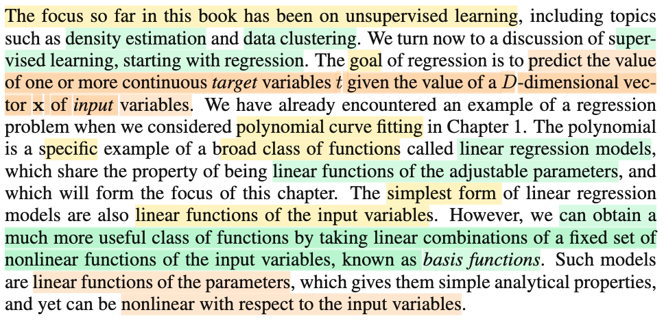
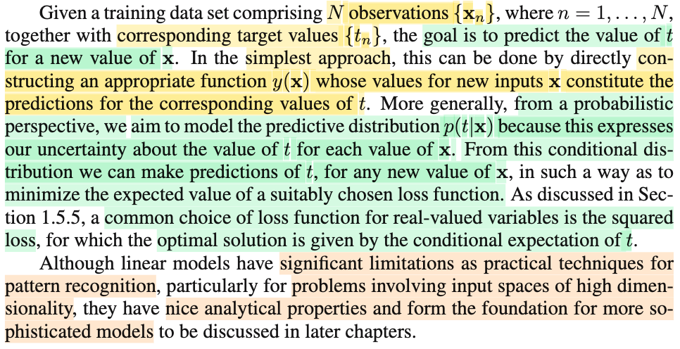
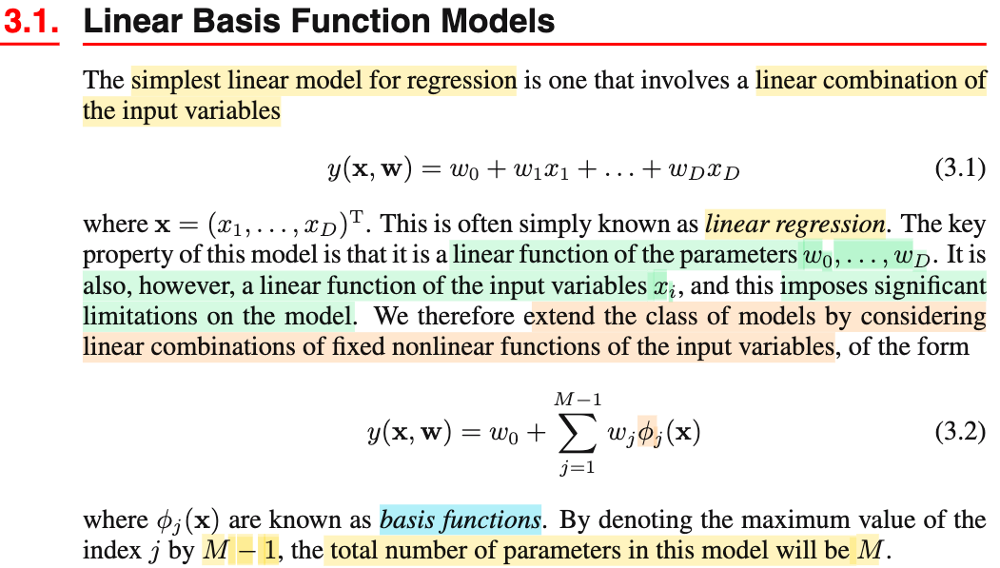
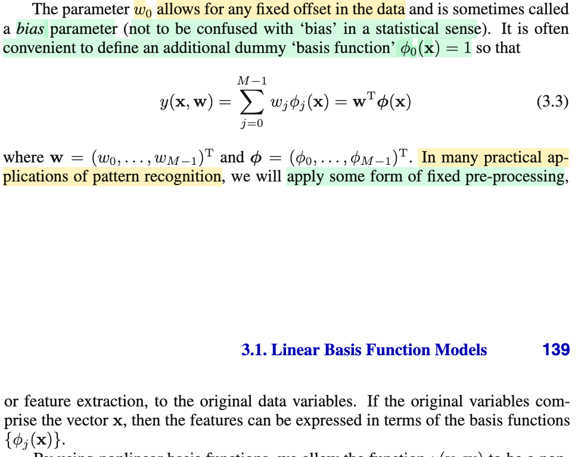
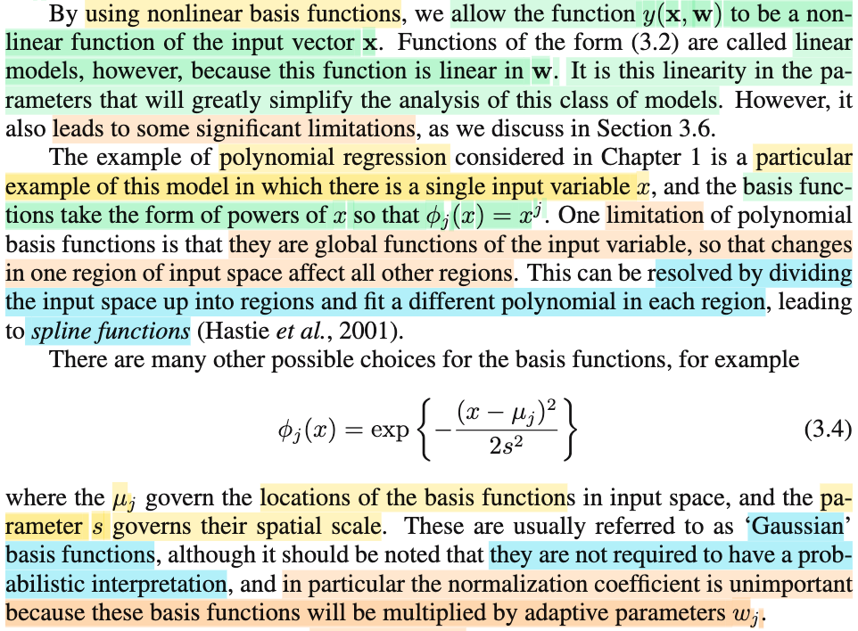
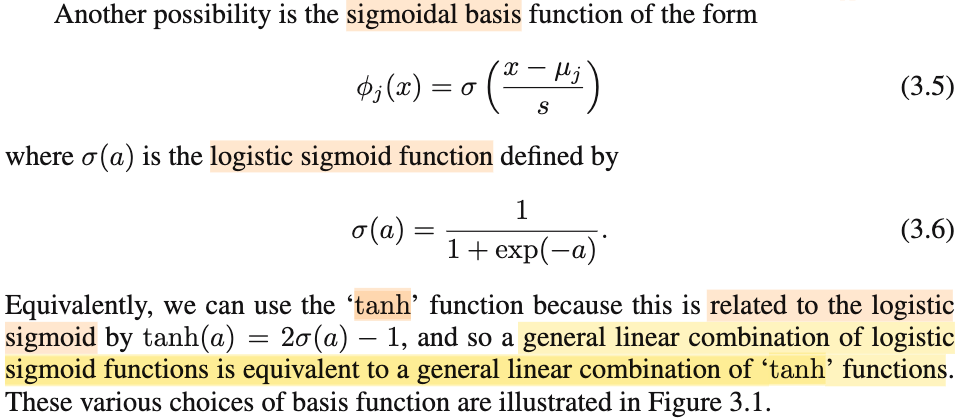
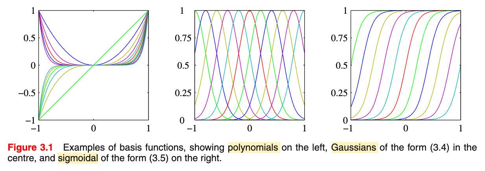
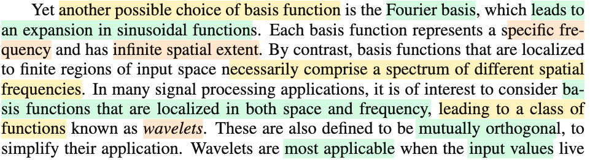
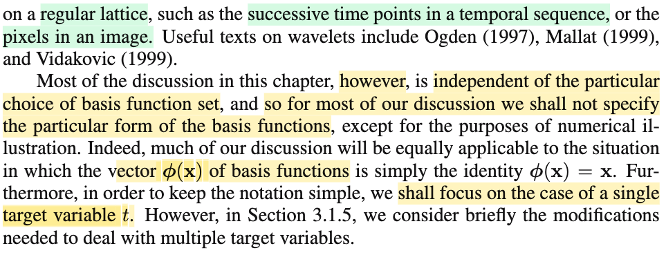

# 3.1.0 Linear Regression and Basis Functions

📊 **Progress:** `7` Notes | `9` Screenshots | `6` AI Reviews

---

## 3.1.0 Linear Regression and Basis Functions

<kbd></kbd>

> [!NOTE]
> Đoạn này đại ý là bữa giờ chủ yếu là ta tập trung vào unsupervied learning, thì chương này ta sẽ nói về supervied learning, cụ thể là bài toán regression - trong đó mục tiêu là dự đoán một giá trị hoặc vector các giá trị liên tục t, dựa trên input là vector D chiều.
>
>
>
> Ta đã gặp bài toán này trong ví dụ khớp hàm đa thức (polynomial curve fitting) rồi, và nó (tức polynomial function) là một ví dụ trong một tập rộng hơn các function, gọi là linear regression function (hàm hồi quy tuyến tính), mà chúng có điểm chung là: đều là hàm tuyến tính đối với các tham số có thể điều chỉnh được (adjustable parameter).
>
>
>
> Và ý chính muốn nói là, chương này ta sẽ vẫn bàn về các hàm này - tuyến tính đối với param, nhưng, ta có thể làm cho nó hiệu quả hơn bằng cách dùng hàm phi tuyến đối với inputs, bằng cách kết hợp tuyến tính các inputs, sử dụng các basis function.
>
>
>
> Nói ngắn gọn thì hiểu đơn giản, là, cái hàm dùng để dự đoán t, là hàm của cả param θ và input x. Thì ta sẽ luôn dùng các hàm tuyến tính đối với θ, có nghĩa là, coi x như constant, thì f(θ, x) = g(θ) là hàm tuyến tính, nhưng với input x thì hàm là phi tuyến. Ví dụ như f(x) = θ1 x1 + θ2 x2^2, là hàm tuyến tính theo θ = θ1, θ2 nhưng nhưng phi tuyến theo x = (x1, x2)

> [!TIP]
> **🤖 AI Feedback** — ✅ Score: **92/100**
>
> Bạn đã tóm tắt rất chính xác về trọng tâm thay đổi sang học có giám sát và định nghĩa của hồi quy. Điểm mạnh lớn nhất là cách bạn giải thích và minh họa bằng ví dụ về việc hàm có thể tuyến tính theo tham số nhưng phi tuyến theo biến đầu vào, thể hiện sự hiểu biết sâu sắc. Chỉ cần lưu ý thêm rằng các 'basis function' thường là các hàm phi tuyến của biến đầu vào, và chúng ta kết hợp tuyến tính các hàm cơ sở này.

 

## Predicting Values and Linear Models

<kbd></kbd>

> [!NOTE]
> Đại ý là, đề bài sẽ là. ta có N giá trị quan sát {**x**1, ....**x**N} (**x**i là vector D chiều), cũng như đi kèm là các giá trị target t1, ...tN tương ứng. Mục tiêu sẽ là xây dựng hàm dựa đoán t từ một vector **x** mới.
>
>
>
> Vậy thì đại khái là, ông nói, nếu làm đơn giản, ta có thể xây dựng hàm dự đoán y(**x**) để dự đoán t một cách trực tiếp.
>
>
>
> Tuy nhiên, với góc nhìn xác suất, ta sẽ muốn xây dựng một cái gọi là predictive distribution (khái niệm đã gặp ở chap 1) f(t|**x**), vì nó sẽ giúp thể hiện tính uncetainty. Và từ đó, ta sẽ đưa ra dự đoán t, theo cách thức giúp giảm thiểu giá trị trung bình của loss mà ta chọn. Phổ biến hay dùng là squared loss, khi đó, cái cách để đưa ra dự đoán t giúp giảm trung bình squared error loss chính là dùng mean của cái predictive distribution này (chính là cái mà gs nói - conditional expectation of t, E\[t|**x**\], chính là mean của phân phối f(t|**x**))
>
>
>
> Cuối cùng, ông nói tuy linear model có nhiều hạn chế đáng kể trong bài toán pattern recognition, ví dụ như khi input space là không gian cao chiều (D lớn), tuy nhiên, mô hình này có những đặc điểm tốt về mặt phân tích (analytical properties) và do đó, nó đóng vai trò nền tảng cho nhiều mô hình phức tạp sau này.
>
>
>
> ---
>
>
>
> Dù mình đoán gs Bishop cũng sẽ nhắc lại, nói lại về cái ý vừa nói ở trên - cái gì mà thay vì xây dựng hàm y(x) dự đoán t, ta xây dựng predictive distribution, và từ đó đưa ra dự đoán, theo cái cách thức nào đó giúp giảm kì vọng (trung bình) loss. Để rồi nếu làm theo cách phổ biến - dùng loss là squared loss thì ta sẽ lấy conditional expectation để dùng dự đoán cho t. Có thể nhớ lại cái này chút xíu:
>
>
>
> Đầu tiên, cái ý mà gs nói xây dựng hàm y(x) dự đoán thẳng ra t, thì đại ý là, ta xây dựng một function dựa trên tham số nào đó, để rồi với x đưa vào, lấy ra t luôn. Nhưng làm như vậy, không phản ánh được tính chất không chắc chắn. Ví dụ, làm sao để ta thể hiện ý "với x này, tôi đoán t sẽ bằng như này, nhưng không chắc lắm, nhưng tôi tin t sẽ bằng như kia hơn, tức tôi chắc chắn hơn". Do đó, để thể hiện cái ý rằng, sự dự đoán của ta có yếu tố không chắc, thì ta sẽ dùng một probability distribution, gọi là predictive distribution f(t|**x**).
>
>
>
> Thế thì f(t|**x**), tất nhiên, đã học xác suất từ Casella hay Stat110, nó là conditional probability distribution, hay nếu nói theo kiểu prior/posterior, thì nó chính là posterior distribution của T.
>
>
>
> Rồi, mình còn nhớ bài toán polynomial curfitting, cũng có bối cảnh chung của bài toán linear regression cho các observed data (**x**1, t1), ....(**x**N, tN).
>
>
>
> Đầu tiên sẽ có ích khi ôn lại bài toán point estimation của Casella: Cho random sample **X** = (X1,....Xn) iid \~ f(x|θ). Nhiệm vụ là muốn xây dựng một hàm của sample W(**X**), sao cho tại observed value của **X**, ta có W(**x**) estimate tốt cho θ. Sau đó, vì định nghĩa của point estimator quá mơ hồ (bất cứ hàm của sample nào cũng có thể là một point estiamator cho θ (nhưng có là estimator tốt hay không thì chưa biết) nên ta mới có vài phương pháp tiếp cận chính: Method of Moment, Maximum Likelihood, Bayes estimator.
>
>
>
> Thế thì tạm gác lại hai cái đầu, mình nói luôn sang Bayes estimator. Đã đụng tới chữ Bayes, dĩ nhiên là ta dùng quan điểm (perspective) của trường phái Bayesian - coi θ không phải là fixed nhưng unknown như trường phải classic (hay Frequentist), mà ta coi nó là random variable (vector). Để rồi, khi chưa có data gì, ta chọn cho nó distribution nào đó, dựa vào niềm tin ban đầu (prior knowledge), ví dụ như kinh nghiệm hay sao đó, gọi là prior distribution của θ, f(θ), hay trong sách Casella dùng π(θ). Sau đó, dựa vào Bayes theorem, ta sẽ xây dựng posterior distribution của θ, chính là f(θ|**x**), hay π(θ|**x**) = f(x|θ)π(θ)/f(**x**).
>
>
>
> Và lúc này, với một distribution, thì nhiệm vụ vẫn là, cần đưa ra một point estimator, là một hàm của sample W(**X**). Vậy thì point estimator là cái gì đây?
>
>
>
> Câu trả lời, là, ta sẽ cần viện tới decision theory, trong đó ta sẽ tính có các khái niệm như loss function, risk function. Vì thứ mà ta có là một distribution, vốn phản ánh tính không chắc chắn, nên cần dựa vào lí thuyết này để đưa ra quyết định tối ưu.
>
>
>
> Vậy thì, loss function, là hàm của một estimator, được định nghĩa phản ánh độ sai lệch, của estimator và giá trị param. Cái này nó giống định nghĩa của MSE, MSE cũng là một hàm của estimator, được định nghĩa bằng trung bình của W(**X**) - θ:
>
>
>
> Bias(W(**X**) = E\_θ\[(W - θ)^2\], để rồi triển khai ra, ta sẽ có:
>
>
>
> = E\_θ\[W^2 - 2Wθ + θ^2\]
>
>
>
> = E\_θ\[W^2\] - 2θE\[W\] + θ^2
>
>
>
> = E\_θ\[W^2\] - 2θE\[W\] + θ^2
>
>
>
> Dùng Var(W) = E\[W^2\] - (EW)^2 ⇨ E\[W^2\] = Var(W) + (EW)^2
>
>
>
> ..= Var(W) + (EW)^2 - 2θE\[W\] + θ^2
>
>
>
> = Var(W) + (EW - θ)^2
>
>
>
> = Var(W) + \[Bias(W)\]^2
>
>
>
>  Quay lại với hàm loss, L(W, θ), như đã nói, có thể có nhiều loại, một loại cụ thể là ta có thể có square error loss: L(W(**X**), θ) = (W(**X**) - θ)^2
>
>
>
> lấy trung bình: E\_θ\[L(W, θ)\], đây chính là risk function. (có nghĩa là với loss là squared error loss thì MSE chính là risk function thôi)
>
>
>
> Lưu ý, W(**X**) là statistic, tức cũng là random variable, thì L(W(**X**), θ) cũng là random variable, nên dĩ nhiên ta có quyền lấy trung bình / expected value của nó, và vì bản chất đều là function của sample **X** \~ f(**x**|θ), nên distribution của L(W(**X**), θ) sẽ phụ thuộc θ, nên ta mới ghi là E\_θ\[L(W(**X**), θ)\], ám chỉ kì vọng này, sẽ là hàm phụ thuộc θ do distribution của của L(W(**X**), θ) sẽ phụ thuộc θ.
>
>
>
> Và với risk function, hay loss function, nó không phân biệt classic hay Bayessian, vì việc ta lấy kì vọng, là đang kì vọng của random variable L(W(**X**), θ). Và điềy này mang ý nghĩa bằng lời là, ta đã biết loss của W(**X**) khi estimate cho θ, thì bây giờ ta tính trung bình trên mọi giá trị của **X**:
>
>
>
> R(θ, W(**X**)) = E\[L(W(**X**), θ)\] = ∫L(W(**x**), θ)f(**x**|θ)d**x**
>
>
>
> Thế thì, nếu giờ ta quay lại với việc đang xét Bayesian approach, và có θ \~ prior distribution f(θ).
>
>
>
> Thì lúc này E\_θ\[L(W(**X**), θ)\], hay R(θ, W(**X**)) với tư cách là function của θ, cũng lại là random variable. Từ đó ta được quyền lấy kì vọng của nó: E\[R(θ, W(**X**))\] và lần này, đây là kì vọng của một random variable có được bằng cách áp một hàm lên θ, vốn dĩ là một random variable có phân phối π(θ). Và đây chính là **Bayes risk**, nó sẽ không còn là một random variable nữa, mà là một fixed number, vì ta đã intergrate mọi possible value của θ rồi.
>
>
>
> Bayes risk = ∫\[risk function\] π(θ) dθ = ∫R(θ, W(**X**)) π(θ) dθ
>
>
>
> Điều này cũng có thể hiểu theo cách khác, là ta có L(W(**X**), θ) là function của random variable **X** và θ. Và kì vọng của nó chính là ta tính trung bình của L, dựa trên **joint distribution** của **X** và θ
>
>
>
> E\[L(W(**X**), θ)\] = ∫∫ L(W(**X**), θ) f(**x**, θ) d**x** dθ
>
>
>
> = ∫∫L(W(**X**), θ) f(**x**|θ) π(θ) d**x** dθ
>
>
>
> = ∫ \[∫L(W(**X**), θ) f(**x**|θ) d**x**\] π(θ) d**x** dθ
>
>
>
> ∫L(W(**x**), θ)f(**x**|θ)d**x** chính là risk function R(W(**X**), θ)
>
>
>
> .. = ∫ \[R(W(**X**), θ)\] π(θ) dθ → Bayes risk
>
>
>
> Do đó nếu biến đổi tí ta sẽ thấy nó cũng là:
>
>
>
> ∫∫ L(W(**X**), θ) f(**x**|θ) π(θ) d**x** dθ
>
>
>
> = ∫ \[∫L(W(**X**), θ) f(θ|**x**) dθ\] f(**x**) d**x**
>
>
>
> Thì ∫L(W(**X**), θ) f(θ|**x**) dθ chính là **posterior expected loss**
>
>
>
> để rồi ta sẽ nhìn nhận bayes risk như việc ta tính trung bình posterior expected loss over mọi possible value của **X**.
>
>
>
> Và quay lại mục tiêu đưa ra point estimator từ posterior distribution, thì mục tiêu sẽ là giảm thiểu Bayes risk: minimize\_θ ∫ \[∫L(W(**x**), θ) f(θ|**x**) dθ\] f(**x**) d**x**
>
>
>
> Và điều này (với vài lập luận) sẽ tương đương minimize ∫L(W(**x**), θ) f(θ|**x**) dθ, tức minimize posterior expect loss.
>
>
>
> Ta có bài toán: minimize (over W(**x**)) ∫L(W(**x**), θ) f(θ|**x**) dθ
>
>
>
> Giả sử dùng squared error loss: ∫L(W(**x**), θ) f(θ|**x**) dθ = ∫\[W(**x**) - θ\]^2 f(θ|**x**) dθ,
>
> dễ thấy, đây chính là E\[(W(**x**) - θ)^2\] với θ \~ f(θ|**x**).
>
>
>
> Và bài toán lúc này tương đương: tìm a để E\[(X - a)^2\] nhỏ nhất. Ta có E\[(X - a)^2\] = E\[X^2 - 2aEX + a^2\] = E\[X^2\] - E\[2aEX\] + E\[a^2\] = E\[X^2\] - 2a(EX) + a^2. Để cái này nhỏ nhất, thì -2a EX + a^2 nhỏ nhất. Đây là hàm bậc hai của a. Đạo hàm: 2a - 2EX. Cho đạo hàm bằng 0, ta có a = EX, chính là minimizer.
>
>
>
> Áp dụng vào bài toán tìm W để E\[(W(**x**) - θ)^2\] nhỏ nhất với θ \~ f(θ|**x**), thì solution là W(**X**) = E\[θ\] với θ \~ f(θ|**x**), thì cũng có thể ghi là W(**X**) = E\[θ|**X**\], tức posterior mean, và đây chính là Bayes estimator minimize Bayes risk với squared error loss 
>
>
>
> Vậy thì nãy giờ là nói về bài toán inference: suy luận θ từ data.
>
>
>
> Với bài toán prediction, ta không quan tâm θ, mà ta quan tâm đến việc dự đoán T, nên đại ý là ta sẽ xây dựng predictive distribution f(t|θ,**x**)
>
>
>
> Và để ra quyết định tối ưu, hoàn toàn tương tự, ta cũng giải bài toán minimize expected loss, và kết quả nếu loss là squared error, sẽ là E\[t|**x**\]

> [!TIP]
> **🤖 AI Feedback** — ✅ Score: **98/100**
>
> Điểm mạnh: Bạn đã tóm tắt nội dung văn bản một cách cực kỳ chính xác và đi sâu vào giải thích các khái niệm phức tạp như kỳ vọng có điều kiện và hàm lỗi bình phương bằng cách liên hệ chặt chẽ với lý thuyết thống kê Bayesian. Điều này thể hiện sự hiểu biết sâu rộng, mặc dù một chi tiết nhỏ về ký hiệu f(t|θ,x) ở cuối có thể được làm rõ thêm.

**🔗 See also:** [Optimal Prediction with Gaussian Noise](./311_maximum_likelihood_and_least_squares.md#node-wsglxqn)

 

### Linear Basis Function Models

<kbd></kbd>

> [!NOTE]
> Rồi, đại khái là đầu tiên gs nói về một mô hình đơn giản nhất của bài toán regression: có dạng y(**x**, **w**) = w0 + w1x1 + ...wDxD, là linear combinaton các input. (chỗ này, mình tự hiểu, cái cụm Σi wixi thì đúng là linear combination các xi, nhưng vì có thêm w0, nên đây là affine function, không hoàn toàn chính xác là linear function, điểm này trong nhiều lớp như CS224, CS231 cũng có nói tới)
>
>
>
> Với mô hình này, người ta gọi là linear regression, với đặc điểm dễ thấy là, nó là hàm tuyến tính (affine) của cả tham số **w** = (w0, w1,...wD) và input **x** = (x1, ....xD). Và gs cho rằng nó có những hạn chế nghiêm trọng.
>
>
>
> Thành ra, người ta sẽ mở rộng mô hình này, bằng cách thay vì dùng linear combination các input xi, ta sẽ dùng basis function Φi(**x**) để tạo các non-linear function của **x**, và sau đó mới tổ hợp tuyến tính chúng với hệ số wi:
>
>
>
> y(**x**, **w**) = w0 + w1 Φ1(**x**) + ...+ wM-1 ΦM-1(**x**) = w0 + Σj=1:M-1 wj Φj(**x**).
>
>
>
> Như vậy, số tham số là M.
>
>
>
> Nói chung, điểm mấu chốt là, thay vì dùng **x** = x1,...xD như input, và linear combination chúng lại, thì ta chế biến các x1,...xD thành một bộ input khác Φ1(x1,..xD), Φ2(x1,...xD),...là các hàm phi tuyến đối với **x**, khi đó tuy vẫn tổ hợp tuyến tính chúng lại với w0,w1,...: w0 + w1Φ1(**x**) + w2Φ2(**x**) + ...nhưng lúc này, đối với **x**, ta có hàm phi tuyếm, nhưng đối với **w** vẫn là hàm tuyến tính. Và mô hình này sẽ mạnh hơn.

> [!TIP]
> **🤖 AI Feedback** — ✅ Score: **98/100**
>
> Bạn đã nắm vững các khái niệm trọng tâm rất tốt, đặc biệt là sự phân biệt chính xác giữa hàm tuyến tính và hàm affine, điều này thể hiện sự hiểu biết sâu sắc. Cách bạn tóm tắt lại điểm mấu chốt của Basis Function Models cũng rất rõ ràng và đầy đủ.

 

#### Bias Parameter and Basis Function

<kbd></kbd>

> [!NOTE]
> Tiếp, gs nói về w0, đại khái là vai trò của nó giúp ta có thể gán một mức offset cố định nào đó cho data, và thỉnh thoảng người ta gọi là bias parameter.
>
>
>
> Ông lưu ý ta đừng confuse với bias trong thống kê. Ý này có thể hiểu, như note vừa nãy, mình cũng đã nhắc đến khái niệm bias trong statsitic: Cụ thể là trong bài toán point estimator, bias của estimator W(**X**) là hàm số của W(**X**), định nghĩa bởi: Bias(W(**X**)) = E\_θ\[W(**X**)\] - θ, và nếu E\_θ\[W(**X**)\] = θ, hay Bias(W(**X**)) = 0, ta gọi W(**X**) là unbiased estimator của θ.
>
>
>
> Rồi, ý sau cũng ko khó hiểu, y(**x**, **w**) = w0 + Σj=1:M-1 wj × Φj(**x**), thì sẽ thuận tiện hơn nếu ta đặt Φ0(**x**) = 1, để w0 + Σj=1:M-1 wj × Φj(**x**) = w0 × Φ0(**x**) + Σj=1:M-1 wj × Φj(**x**) = Σj=0:M-1 wj × Φj(**x**), và dễ thấy, nếu đặt **w** = \[w0, ....wM-1\]T và **Φ** = (Φ0(**x**), ...ΦM-1(**x**)), thì cái cụm trên chính là dot product của chúng **w**T**Φ**(**x**)
>
>
>
> Ông nói đại ý rằng trong nhiều bài toán pattern reconition thực tế, thì ta thường có bước feature engineering hay pre-processing (như đã biết, đại khái là ta tiền xử lí data, hoặc chế cháo tạo các feature mới từ các feature gốc) thì khi đó, chúng có thể được thể hiện thông qua các basis function này. (nói đơn giản, là ta có thể hiểu hàm Φ sẽ đại diện cho các bước preprocessing hay feature engineering này trong thực tế)

> [!TIP]
> **🤖 AI Feedback** — ✅ Score: **100/100**
>
> Ghi chú rất chính xác và chi tiết, đặc biệt là phần giải thích về vai trò của φ₀(x) và sự khác biệt giữa "bias" trong mô hình và "bias" trong thống kê. Cách bạn liên hệ hàm cơ sở với feature engineering thực tế cũng rất rõ ràng.

**🔗 See also:** [Likelihood and Error Functions](./311_maximum_likelihood_and_least_squares.md#node-urnjdcs) · [Section 3.3.3 Equivalent Kernel](./333_equivalent_kernel.md#node-qgf9klh)

 

##### Gaussian Basis Functions

<kbd></kbd>

> [!NOTE]
> Đại khái là như đã nói, nhờ có basis function mà ta có thể có mô hình phi tuyến đối với input. Tuy nhiên, vẫn là hàm tuyến tính đối với tham số (**w**) và đặc điểm này mang lại các lợi ích khi giải thích (kết quả) mô hình nhưng vẫn đi kèm vài nhược điểm - như nó hạn chế sức mạnh của mô hình.
>
>
>
> Sau đó, ông đề cập đến trong ví dụ polinomial curve fitting, thì ta còn nhớ dùng function y(**w**,x) là hàm đa thức bậc M: w0 + w1x^1 + w2x^2 + ...wMx^M (xem link), thì dễ hiểu ở đây, basis function là Φj(x) = x^j. Cách làm này, có nhược điểm liên quan tới việc hàm φ là global function của input, để rồi có thể khắc phục bằng cách dùng spline funciton. Thì ý này đại khái là, ví dụ xét hàm y(x, w) = w × x^3 đi, và muốn ép nó khớp với một nhóm data (xi, ti) thì có khi ta điều chỉnh w khiến w × φ(xi) khớp được vài điểm đầu, thì lại khiến nó rời xa nhóm khác, mà bắt nguồn là do cái hàm x^3 nó là **hàm toàn cục, khi x trải dài từ -∞ đến ∞ thì f(x) ở đâu cũng là x^3**, nên nếu thay đổi (điều chỉnh để cái hàm wx^3) ở một vùng thì nó sẽ **thay đổi luôn những vùng khác**. Còn giả sử ta xét hàm Gaussian dưới đây, ta sẽ thấy, cái hàm này, nó chỉ có tính cục bộ, cụ thể là **nó chỉ tác động với các điểm quanh μ**, trong phạm vi nào đó (do s), như vậy, **giả sử ta điều chỉnh tham số w gắn với Φ(x) giúp nó khớp những điểm ở vùng cục bộ này, thì nó không ảnh hưởng với các vùng khác**. 
>
>
>
> Rồi, nói về Gaussian basis Φj(x) = exp{-(x-μj)^2/2s^2} với μj sẽ chi phối location của basis function trong input space và s chi phối spatial scale (cũng chưa hiểu lắm).
>
>
>
> Ông lưu ý, đại khái là cái này đừng coi nó hay đòi hỏi nó phải là một valid pdf, hay cũng đừng cho rằng nó có ý nghĩa xác suất gì, cái này có thể hiểu cũng giống như với Gaussian kernel, ta chỉ muốn hàm kernel có cái hành vi như đường cong cái chuông của phân phối Normal pdf mà thôi, chứ chả có hàm ý xác suất gì cả. Nên ở đây cũng vậy, ta sẽ ko đòi hỏi Φj(x) phải có các tính chất valid của một hàm pdf (như intergrate = 1). Hơn nữa, kiểu gì thì ta cũng sẽ nhân với hệ số wj.

> [!TIP]
> **🤖 AI Feedback** — ✅ Score: **95/100**
>
> Ghi chú của bạn rất chính xác và sâu sắc. Đặc biệt, cách bạn giải thích sự khác biệt giữa hàm cơ sở toàn cục và cục bộ bằng ví dụ minh họa và phép so sánh với Gaussian kernel thể hiện sự hiểu biết sâu rộng. Một chút rõ ràng hơn về vai trò của 's' trong 'spatial scale' sẽ làm cho ghi chú trở nên hoàn hảo.

**🔗 See also:** [Khớp đường cong hàm đa thức](./11_example_polynomial_curve_fitting.md#node-79h9mtc)

 

- **Sigmoidal and Tanh Functions**

<kbd></kbd>

<kbd></kbd>

> [!NOTE]
> Rồi, một hàm basis quan trọng nữa, là sigmoidal basis function:
>
>
>
> Φj(x) = σ\[(x - μj)/s\] với σ(a) = 1/\[1 + exp(-a)\].
>
>
>
> và một phiên bản equivalent (tương đương) là hàm tanh, có quan hệ với sigmoid: tanh(a) = 2 σ(a) - 1, có nghĩa là, có quan hệ tuyến tính giữa chúng, nên dễ hiểu khi gs nói rằng nhìn chung, một tổ hợp tuyến tính của các logistic sigmoid thì cũng là một tổ hợp tuyến tính các tanh (ví dụ, α σ1(a) + β σ2(a), là tổ hợp tuyến tính của các σ, thì thay tanh1(a) = 2 σ1(a) - 1 ⇨ σ1(a) = \[tanh1(a) + 1\]/2, và σ2(a) = \[tanh2(a) + 1\]/2 thì ta cũng sẽ có α \[tanh1(a) + 1\]/2 + β \[tanh2(a) + 1\]/2 = α tanh1(a) / 2 + α/2 + β tanh2(a)/2 + β/2, đây cũng là linear combination các tanh function (chính xác hơn là affine, nhưng như đã nói, ta coi như là linear combination luôn)
>
>
>
> Nói thêm chút về hàm sigmoid và tanh, mình đã gặp chúng trong các lớp machine learning của Andrew Ng, cũng như sau này với các lớp deep learning. Bây giờ gặp lại trong bối cảnh Bishop, thì mình được hiểu thêm chúng là thuộc loại basis function, là function nhằm tạo ra tính chất "non-linearity đối với input", mà nhờ đó, ta vẫn có linear model - là hàm tuyến tính đối với tham số, nhưng là hàm phi tuyến đối với input → giúp mạnh hơn.

> [!TIP]
> **🤖 AI Feedback** — ✅ Score: **98/100**
>
> Bạn đã ghi chú rất chính xác các định nghĩa và mối quan hệ giữa hàm sigmoid và tanh. Phần ví dụ minh họa chi tiết về tổ hợp tuyến tính cho thấy sự hiểu biết sâu sắc và khả năng áp dụng kiến thức của bạn.

 

- **Fourier Basis and Wavelets**

<kbd></kbd>

<kbd></kbd>

> [!NOTE]
> Đoạn đầu nói sơ về một loại basis function gọi là Fourier basis, có thể tìm hiểu nó sau, chỉ cần biết đại ý là nó sẽ phù hợp với input có cấu trúc dạng chuỗi ví dụ như các điểm thời gian nối tiếp nhau hoặc các pixel trên bức ảnh.
>
>
>
> Cuối cùng, gs cho rằng, phần lớn các thảo luận trong chap này không care / phụ thuộc basis fuction cụ thể là gì. Nói cách, Φ là gì cũng được, kể cả là hàm identity Φ(**x**) = **x** Và để đơn giản, ta sẽ chỉ tập trung vào bài toán mà t là scalar, tức là target variable chỉ là scalar variable chứ ko phải vector.

 

