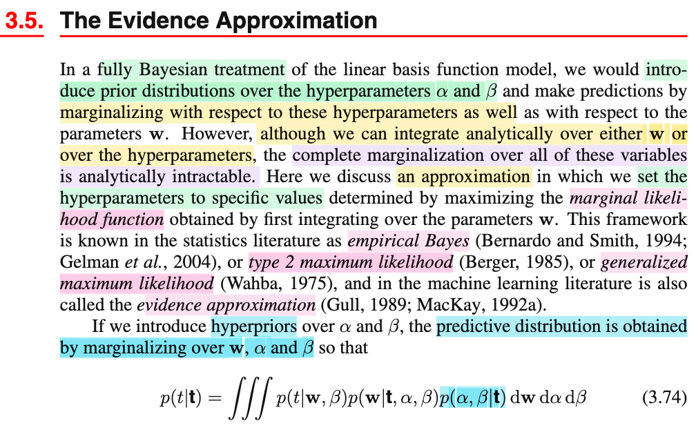

# 3.1.1 Maximum likelihood and least squares

📊 **Progress:** `7` Notes | `10` Screenshots | `6` AI Reviews

---

<kbd></kbd>

> [!NOTE]
> Đầu tiên gs nhắc lại là ở chap 1 mình đã học bài toán polynomial curve fitting - về cơ bản là đi tìm một hàm đa thức để khớp với các data, bằng cách tìm parameter sao cho giảm thiểu sum of square error function. Và trong quá trình làm, ta đã chứng minh hoặc cho thấy rằng, bản chất của việc minimize hàm squared error function, thực chất chính là tiếp cận bài toán như bài toán point estimation, theo phương pháp maximum likelihood với một gỉa định là noise tuân theo phân phối normal.
>
>
>
> Thế thì phần này, mình sẽ quay lại bài toán đó, và bàn thêm về cách tiếp cận least square cũng như liên quan của nó với maximum likelihood.
>
>
>
> Mình muốn active recall lại tí xíu, để ít nhất có thể làm rõ vì sao nói ý trên.
>
>
>
>  Nói một cách ngắn gọn, đầu tiên ta thể hiện tính uncertainty của target bằng cách coi nó là random variable T
>
>
>
> Và giả định sai số Ei = Ti - y(𝐰, 𝐱i) \~ normal(0, 1/β), điều này có nghĩa là, ta xây dựng function để dự đoán t, nhưng tin rằng, kể cả có đoán chính xác, thì vẫn tồn tại noise, khiến tạo ra sai số, và noise là đại lượng ngẫu nhiên, ta thể hiện nó bởi random variable Ei, có phân phối normal(0, 1/β) (precision β nào đó)
>
>
>
> Như vậy, theo location family, nếu Ei = Ti - y(𝐰, 𝐱i) \~ normal(0, 1/β), thì Ti \~ normal(y(𝐰, 𝐱i), 1/β).
>
>
>
> Cần nhấn mạnh: Mấu chốt là lập luận rằng: Coi target variable là một đại lượng mang tính ngẫu nhiên - điều này hợp lí vì, với một đối tác là 𝐱i, ti có thể có nhiều possible value, nó mang tính uncertainty. Và hàm dự đoán của ta y(𝐰, 𝐱i) dù có làm tốt đến mấy trong việc nắm bắt được quy luật, thì vẫn còn đó sai sót do nhiễu, và nhiễu này, ta cho rằng, tuân theo phân phối chuẩn.
>
>
>
> Rồi, như vậy, bài toán trở thành, cho random sample T1,...Tn (n hay m, hay N gì đó, chỉ số sample), với Ti \~ normal(y(𝐰, xi), 1/β), i = 1,2,...n. Và các random variable Ti này độc lập nhau (vì data được collect một cách độc lập). Chú ý, độc lập nhưng không identically distributed, vì các normal đều có mean khác nhau, nên không có tính iid, chỉ độc lập thôi.
>
>
>
>  Dĩ nhiên, ta có bài toán quen thuộc: tìm point estimator cho 𝐰 - tham số chi phối distribution của Ti (given 𝐱i)
>
>
>
> Và cách tiếp cận phổ biến là Maximum Likelihood estimation (nhất là sau khi ta học chap 10 Casella, mình biết ML estimator sẽ tạo một chuỗi estimator có tính chất (asymptotically) efficient (và consistent))
>
>
>
> Thế thì, để làm, đầu tiên cần xét joint pdf của 𝐓 = (T1,...Tn), ta sẽ thấy dù chúng không cùng distribution, nhưng vẫn độc lập, cho phép tách joint pdf thành tích các marginal pdf: Πi=1:n f(ti|y(𝐰,𝐱i), 1/β).
>
>
>
> Từ đó hàm likelihood, theo định nghĩa, là hàm của parameter, được define bởi giá trị của joint pdf của sample tại observed value:
>
>
>
> L(𝐰, β|𝐭, 𝐱1,...𝐱n) = f(𝐭|𝐰, 𝐱1,..𝐱n, 1/β) = Πi=1:n f(ti|y(𝐰,𝐱i), 1/β)
>
>
>
> Và theo ML, ta sẽ giải bài toán:
>
>
>
> maximize (over 𝐰, β) L(𝐰, β|𝐭, 𝐱1,...𝐱n)
>
>
>
> Tới đây, ta sẽ dùng các kĩ thuật chuyển bài toán tối ưu thành bài toán tương đương bằng cách dùng hàm monoton ln, hoặc bỏ đi constant:
>
>
>
> L(𝐰, β|𝐭, 𝐱1,...𝐱n) ∝ ln {L(𝐰, β|𝐭, 𝐱1,...𝐱n)}
>
>
>
> = ln {Πi=1:n f(ti|y(𝐰, 𝐱i), 1/β)} = Σi=1:n ln {f(ti|y(𝐰, 𝐱i), 1/β)}
>
>
>
> = Σi=1:n ln {N(ti|y(𝐰, 𝐱i), 1/β)}
>
>
>
> = Σi=1:n \[ ln { Πi \[1/√\[2π(1/β)\]\] exp\[-\[ti-y(xi,𝐰)\]²/2(1/β)\] } \]
>
> (....biến đổi, thu gọn)\
> \
> = (n/2) ln β - (n/2) ln (2π) - (β/2) Σi \[ti-y(xi,𝐰)\]²\
> \
> = - (β/2) Σi \[ti-y(xi,𝐰)\]² + (n/2) ln β - (n/2) ln (2π)
>
>
>
> ∝ - Σi \[ti-y(xi,𝐰)\]²
>
>
>
> Như vậy, bài toán euivalent là: maximize (over 𝐰) - Σi \[ti-y(xi,𝐰)\]²
>
>
>
> equivalent tiếp: minimize (over 𝐰) {Σi \[ti-y(xi,𝐰)\]²}
>
>
>
> Và như vậy có thể thấy, đây chính là cách tiếp cận bài toán curve fitting theo lối đơn giản là đi tìm w sao cho giảm thiểu hàm loss tính bằng tổng bình phương của error Có nghĩa là trong đó ta ko bàn về xác suất gì cả, mà chỉ là cố đi tìm param để giảm thiểu loss thôi, nhưng với góc nhìn xác suất, ta thấy nó chính là đi giải bài toán tìm Maximun Likelihood estimator với giả định là noise \~ normal(0, 1/β)

🤖 AI Check — 🟢 Pass — ✅ **98/100** · ✓ Move on

**Summary:** Phân tích cực kỳ chi tiết, chính xác và sâu sắc, thể hiện sự hiểu biết thấu đáo về mối quan hệ giữa bình phương tối thiểu và ước lượng hợp lý tối đa. Bài trình bày cũng cung cấp một lời giải thích và dẫn xuất toán học rõ ràng và đầy đủ. Mặc dù rất toàn diện, một số phần của phép dẫn xuất toán học có thể được trình bày súc tích hơn một chút để tăng tính dễ đọc.

 

## Optimal Prediction with Gaussian Noise

<kbd></kbd>

> [!NOTE]
> Rồi, như vừa ôn lại, ta sẽ giả định noise \~ normal(0, β^-1) cũng đồng nghĩa giả định T = y(𝐱, 𝐰) + ε \~ normal(y(𝐱, 𝐰), β^-1), nên f(t|𝐱, 𝐰, β) = N(t|y(𝐱, 𝐰), β^-1) (đây chỉ là kí hiệu normal(y(𝐱, 𝐰), β^-1))
>
>
>
> Tới đây, ông nói, ta đã biết trong chap 1 rằng, khi đã có distribution của T (f(t|𝐱, 𝐰, β) thì nếu ta cần **đưa ra dự đoán sao cho tối ưu** (**optimal prediction**), thì khi **loss là squared loss**, thì prediction tối ưu đó chính là dùng **conditional mean**.
>
>
>
> Cùng làm rõ ý này:
>
>
>
> Thật ra cái này y như một điểm mà mình đã viết trong note trước (3.1.0) khi liên hệ với Casella, trong đó mình nói rằng, khi đã có posterior distribution của θ, π(θ|𝐱), thì Bayes estimator cho θ giúp giảm thiểu Bayes risk với loss tính bằng squared loss chính là mean của posterior: E\[θ|𝐱\]. Ở đây cũng y vậy, nên mình có thể chứng minh lại:
>
>
>
> Bắt đầu lại với việc mượn lập luận của bài toán inference θ trong note (Predicting Values and Linear Models, xem link), để liên hệ qua cho dễ:
>
>
>
> Squared error loss function: L(W(𝐗), θ) = \[W(𝐗) - θ\]²
>
>
>
> Risk function: average over all possible 𝐱: ∫L(W(𝐱), θ) f(𝐱|θ) d𝐱
>
>
>
> Nếu là Bayesian, ta có thêm Bayes risk: average over all possible θ:
>
>
>
> ∫ \[ ∫L(W(𝐱), θ) f(𝐱|θ) d𝐱 \] π(θ) dθ
>
>
>
> = ∫ \[ ∫L(W(𝐱), θ) f(θ|𝐱) f(𝐱) / π(θ) d𝐱 \] π(θ) dθ
>
>
>
> = ∫∫L(W(𝐱), θ) f(θ|𝐱) f(𝐱) d𝐱 dθ
>
>
>
> = ∫∫L(W(𝐱), θ) f(θ|𝐱) dθ f(𝐱) d𝐱
>
>
>
> = ∫ \[∫L(W(𝐱), θ) f(θ|𝐱) dθ\] f(𝐱) d𝐱
>
>
>
> = ∫ \[posterior expected loss\] f(𝐱) d𝐱 (posterior expected loss = ∫L(W(𝐱), θ) f(θ|𝐱) dθ)
>
>
>
> Và minimize (over W) Bayes risk sẽ trở thành mininize posterior expected loss với mọi 𝐱
>
>
>
> ⇔ minimize E\[L(W(𝐱),θ)\], θ \~ π(θ|𝐱) với mọi 𝐱
>
>
>
> ⇔ minimize E\[(W(𝐱) - θ)²\], θ \~ π(θ|𝐱) với mọi 𝐱
>
>
>
> Và solution là W(𝐱) = E\[θ|𝐱\], là posterior mean.
>
>
>
> ⇔ minimize (over W) (W(𝐱)- θ)² với mọi x
>
>
>
> Vậy quay lại đây
>
>
>
> Loss function, cụ thể là square error loss: L(T, y(𝐰, 𝐱)) = \[T - y(𝐰, 𝐱)\]²
>
>
>
> Risk function, là average over all 𝐭: E(\[T - y(𝐰, 𝐱)\]²), T \~ n(y(𝐰, 𝐱), 1/β)
>
>
>
> Y như trên với T đóng vai θ, y(𝐰,𝐱) đóng vai W(𝐱), ta có bài toán minimize risk function:
>
>
>
> minimize over y(w,x) {E(\[T - y(𝐰, 𝐱)\]²)}, với T \~ n(y(𝐰, 𝐱), 1/β)
>
>
>
> Và solution cũng sẽ là posterior mean: E\[T\], T \~ n(y(𝐰, 𝐱), 1/β), và có thể ghi là E\[T|𝐰,𝐱,β\]
>
>
>
> ---
>
>
>
> Ở đây phải rạch ròi hai việc, hay nói cách khác, có hai bài toán đặt ra:
>
>
>
> Bài toán thứ nhất là: với data quan sát được, và dưới giả định Ti \~ n(y(𝐰,𝐱i), 1/β) thì một estimator tốt của 𝐰 là gì. Và nếu ta làm theo lối tìm maximum likelihood estimator cho w, kết quả ta tìm ra là: chính là w khiến minimize sum squared error {Σi=1:n \[ti - y(𝐰, 𝐱i)\]²}.
>
>
>
> Còn bài toán thứ hai, là, giả sử ta có distribution của T là f(t|𝐱), gọi là predictive distribution, thì để dự đoán t với một **x cho trước** mới, thì hành động tối ưu là gì. Và lập luận cho thấy, giá trị tối ưu là E\[t|𝐱\], tức là mean của distribution f(t|𝐱) nếu như ta chọn loss là square error.
>
>
>
> Và đây là chỗ nhập nhằng dễ lú:
>
>
>
> Kết hợp hai bài toán: là ta dùng giả định Ti \~ n(y(𝐰,𝐱i), 1/β), để tìm ra ML estimator cho 𝐰: 𝐰^ML. Thì khi đó, ta có predictive distribution là T \~ f(t|𝐱) = pdf của n(y(𝐰^ML,𝐱), 1/β). Và theo bài toán thứ hai, dự đoán tối ưu cho giá trị t của một x cho trước chính là mean của n(y(𝐰^ML,𝐱), 1/β), và ngay tại đây xảy ra sự tiện lợi ở chỗ, nó chính là y(𝐰^ML,𝐱).
>
>
>
> Sự tiện lợi này sẽ không tồn tại nếu các trường hợp sau:
>
>
>
> Nếu ta có T \~ f(t|𝐱) = pdf của n(y(𝐰^ML,𝐱), 1/β), nhưng tiêu chí của bài toán thứ hai không phải là squared error, khi đó, hành động tối ưu không phải là dùng mean của n(y(𝐰^ML,𝐱), 1/β), mà là dùng cái gì khác, khi đó ta phải tính toán thêm.
>
>
>
> Hoặc nếu ta trong bài toán thứ nhất, ta không giả định Ti \~ n(y(𝐰,𝐱i), 1/β), thì việc giải tìm ML estimator của w sẽ không phải là tìm w khiến mininize sum square error. Và giả sử ta tìm ra w^ML, thì nó chưa chắc là mean của f(t|𝐱).Để rồi nếu trong bài toán thứ hai ta vẫn dùng tiêu chí squarer error loss, để có solution tối ưu là mean của f(t|𝐱), thì lúc này, ta sẽ phải tính tiếp mean của f(t|𝐱), thay vì có thể tiện lợi dùng y(𝐱,𝐰)

🤖 AI Check — 🟢 Pass — ✅ **98/100** · ✓ Move on

**Summary:** Ghi chú đã giải thích rất chính xác mô hình và nguyên lý dự đoán tối ưu với hàm mất mát bình phương như trong hình ảnh. Chiều sâu phân tích, đặc biệt là phần chứng minh và phân biệt các bài toán, đã làm tăng đáng kể sự rõ ràng và toàn diện của nội dung.

**🔗 See also:** [Predicting Values and Linear Models](./310_linear_regression_and_basis_functions.md#node-btnn2z0) · [3.3.2 Predictive distribution](./332_predictive_distribution.md#node-wdjepxb)

 

### Gaussian Noise and Multimodal Distributions

<kbd></kbd>

> [!NOTE]
> Cụ thể, chúng ta giả định rằng nhiễu tuân theo phân phối chuẩn với giá trị trung bình bằng 0 và độ chính xác là beta. Điều này cũng có nghĩa là biến ngẫu nhiên T có phân phối đơn đỉnh là phân phối chuẩn, với giá trị trung bình tại giá trị của hàm dự đoán y(𝐱, 𝐰) và tham số precision là beta. 
>
>
>
> Điểm chính cần nhấn mạnh ở đây là chúng ta không chỉ giả định T tuân theo phân phối chuẩn mà còn **giả định nó là một phân phối đơn đỉnh (unimodal)**. Tuy nhiên, **trong nhiều trường hợp và bài toán thực tế, giả định này không còn phù hợp**. Do đó, chúng ta sẽ cần sử dụng **mô hình hỗn hợp Gaussian (Gaussian mixture)**, tức là sự kết hợp của nhiều phân phối chuẩn. Chủ đề này sẽ được thảo luận chi tiết trong Phần 14 và Chương 14.

 

#### Likelihood and Error Functions

<kbd></kbd>

> [!NOTE]
> Rồi, từ cái note hồi đầu của section này đã giúp ta có thể hiểu đoạn này rồi:
>
>
>
> Như đã biết, ta có bộ data, là các observed value (𝐱i, ti) i=1,...N. Gom lại thành matrix 𝐗 (có thể là mỗi 𝐱i làm một hàng) và vector 𝐭 = (t1,...tN).
>
>
>
> Và như đã nói, ta dùng một distribution để thể hiện tính uncertainty của target variable, tức là coi t1,t2,...tN là observed value của các random variable T1, ...TN. Và giả định thêm rằng noise εi = Ti - y(𝐰, 𝐱) sẽ \~ Norm al(0,1/β), nên Ti \~ normal(y(𝐰, 𝐱i), 1/β).
>
>
>
> Từ đó xét joint distribution của T1,..TN,
>
>
>
> f(𝐭|𝐗, 𝐰, β) = f(t1,t2,..tN|𝐗, 𝐰, β).
>
>
>
> Vì tính chất các T1,...TN độc lập (do giả định rằng các data point được drawn independently) nên lí thuyết xác suất cho ta tách joint pdf thành tích các marginal pdf:
>
>
>
> .. = Πi=1:N f(ti|𝐱i, 𝐰, β)
>
>
>
> thay kí hiệu f(ti|𝐱i, 𝐰, β) bằng N(ti|y(𝐱i, 𝐰), 1/β) (vì đã nói ở trên, Ti \~ normal(y(𝐰, 𝐱i), 1/β))
>
>
>
> .. = Πi=1:N N(ti|y(𝐱i, 𝐰), 1/β)
>
>
>
> Tới đây, nhớ lại bối cảnh ở đây là ta đang nói về linear model: với y(𝐱i, 𝐰) = 𝐰ᵀΦ(𝐱i), là hàm tuyến tính đối với w và phi tuyến với 𝐱i (nhờ basis function Φ, nhớ không). Nên ta có:
>
>
>
> .. = Πi=1:N N(ti|𝐰ᵀΦ(𝐱i), 1/β) → Đây là 3.10 (trong sách dùng index variable là n, mình dùng i cũng được)
>
>
>
> Vậy ta có f(𝐭|𝐗, 𝐰, β) = Πi=1:N N(ti|𝐰ᵀΦ(𝐱i), 1/β)
>
>
>
> Ở đây gs nói rằng, trong bài toán regression, ta sẽ chỉ mô hình hóa distribution của T, chứ ko care distribution của 𝐗, (tức các input vector). Cũng như để cho gọn, ta sẽ bỏ bớt 𝐱 trong điều kiện. Đây là bước giải thích nếu ko đọc kĩ có thể gây confused.
>
>
>
> Vậy ln f(𝐭|𝐗, 𝐰, β) = f(𝐭|𝐰, β) (bỏ 𝐗 cho gọn) 
>
>
>
> = Πi=1:N N(ti|𝐰ᵀΦ(𝐱i), 1/β)
>
>
>
> Rồi, tiếp theo, như cách làm thông thường đến giờ đã quen, vì kiểu gì mình cũng sẽ đi thiết lập bài toán maximize likelihood, và sau đó, chuyển thành bài toán tương đương với hàm ln (nhờ tính monotone của hàm ln, nên 𝐰 khiến maximize ln likelihood cũng là maximize likelihood) nên ta sẽ chuẩn bị hàm ln likelihood luôn là vừa:
>
>
>
> Hàm likelihood, thì như đã nói nhiều lần, theo định nghĩa, là hàm của parameter θ, define bởi L(θ|𝐱) = f(𝐱|θ) (chú ý, đây chẳng có gì là Bayes theorem hay gì cả, nó chỉ là cách người ta define ra hàm likelihood, với ý nghĩa là: L(θ|𝐱) sẽ thể hiện độ hợp lí của θ, khi giá trị quan sát thấy của 𝐗 là 𝐱, và độ hợp lí này, được tính bằng giá trị của hàm pdf của 𝐗 (𝐗 \~ f(𝐱|θ)) tại observed value 𝐱. Vậy thì ở đây ln likelihood của param 𝐰, β là:
>
>
>
> ln L(𝐰, β|𝐗,𝐭) = ln f(𝐭|𝐗, 𝐰, β)
>
>
>
> = ln Πi=1:N N(ti|𝐰ᵀΦ(𝐱i), 1/β)
>
>
>
> = ln Πi N(ti|𝐰ᵀΦ(𝐱i), 1/β) (tự hiểu i chạy từ 1:N)
>
>
>
> = ln { Πi { (2π (1/β))^(-1/2) exp{-(ti-𝐰ᵀΦ(𝐱i))²/2(1/β)} } }
>
>
>
> = ln { Πi { (2π)^(-1/2) β^(1/2) exp{-β(ti-𝐰ᵀΦ(𝐱i))²/2} } }
>
>
>
> = ln { (2π)^(-N/2) β^(N/2) Πi { exp{-β(ti-𝐰ᵀΦ(𝐱i))²/2} } }
>
>
>
> = ln\[(2π)^(-N/2)\] + ln \[β^(N/2)\] + ln {Πi { exp{-β(ti-𝐰ᵀΦ(𝐱i))²/2} }
>
>
>
> = (-N/2) ln(2π) + (N/2) ln(β) + Σi { ln {exp{-β(ti-𝐰ᵀΦ(𝐱i))²/2} }
>
>
>
> = (N/2) ln(β) -( N/2) ln(2π) + Σi {-β(ti-𝐰ᵀΦ(𝐱i))²/2} 
>
>
>
> = (N/2) ln(β) -( N/2) ln(2π) - β Σi {(ti-𝐰ᵀΦ(𝐱i))²/2} 
>
>
>
> Đặt E_D(𝐰) = Σi {(ti-𝐰ᵀΦ(𝐱i))²/2}
>
>
>
> .. = (N/2) ln(β) -( N/2) ln(2π) - β E_D(𝐰) → chính là 3.11
>
>
>
> (nói chung chỉ là ta dùng tính chất hàm log: log(AB) = log(A) + log(B) thôi ko có gì phức tạp)

🤖 AI Check — 🟢 Pass — ✅ **96/100** · ✓ Move on

**Summary:** Bài ghi chú của bạn thể hiện sự hiểu biết sâu sắc và toàn diện về việc thiết lập hàm khả năng hợp lý và log-khả năng hợp lý cho mô hình hồi quy tuyến tính. Bạn không chỉ tái hiện các công thức mà còn giải thích rất rõ ràng các giả định và ý nghĩa đằng sau chúng.

## Phân tích chi tiết

### Điểm mạnh

*   **Giải thích khái niệm rõ ràng:** Bạn đã giải thích rất xuất sắc về việc mô hình hóa biến mục tiêu (`t`) dưới dạng biến ngẫu nhiên và vai trò của nhiễu Gaussian, cũng như việc bỏ qua `X` trong ký hiệu trong các bài toán hồi quy.
*   **Hiểu biết sâu sắc về Giả định Độc lập:** Việc bạn chỉ ra rằng các điểm dữ liệu được rút ra độc lập dẫn đến việc phân tách hàm mật độ xác suất chung thành tích các hàm mật độ xác suất biên là một điểm mạnh lớn, cho thấy sự hiểu biết vững chắc về lý thuyết xác suất.
*   **Liên hệ với Mô hình tuyến tính:** Bạn đã kết nối một cách chính xác công thức tổng quát với bối cảnh của mô hình tuyến tính sử dụng hàm nền (basis function) `Φ(x_i)`, làm rõ nguồn gốc của biểu thức `w^TΦ(x_i)`.
*   **Đạo hàm chính xác và chi tiết:** Toàn bộ quá trình đạo hàm để chuyển từ hàm khả năng hợp lý (dạng tích) sang log-khả năng hợp lý (dạng tổng) và cuối cùng là biểu thức 3.11 được thực hiện một cách tỉ mỉ, chính xác từng bước. Việc nhận diện `E_D(w)` cũng rất chuẩn xác.
*   **Giải thích về hàm Log:** Bạn đã đưa ra một giải thích xuất sắc về lý do tại sao chúng ta sử dụng hàm log (tính chất đơn điệu) khi tối đa hóa khả năng hợp lý, điều này cho thấy bạn không chỉ làm theo mà còn hiểu 'tại sao' các bước đó được thực hiện.

### Các điểm cần cải thiện

*   **Lỗi nhỏ trong ký hiệu:** Có một điểm nhỏ cần lưu ý trong đoạn:
    "Vậy `ln f(**t**|**X**, **w**, β) = f(**t**|**w**, β) (bỏ **X** cho gọn) = Πi=1:N N(ti|**w**TΦ(**x**i), 1/β)"
    Thực tế, khi bạn "bỏ **X** cho gọn", bạn đang chuyển từ `f(**t**|**X**, **w**, β)` thành `f(**t**|**w**, β)`. Sau đó, `ln f(**t**|**w**, β)` mới là `ln (Πi=1:N N(ti|**w**TΦ(**x**i), 1/β))`. Dòng hiện tại của bạn đã nhầm lẫn giữa `ln f(...)` và `f(...)` và cả biểu thức dạng tích. Đây chỉ là một lỗi nhỏ về cách viết ký hiệu, không ảnh hưởng đến các bước tính toán sau đó vì bạn đã tiếp tục lấy log của toàn bộ tích một cách đúng đắn.

### Gợi ý để hiểu sâu hơn

*   **Kiểm tra ký hiệu:** Dù là lỗi nhỏ, hãy luôn chú ý kỹ đến cách sử dụng các toán tử như `ln` và dấu bằng. Việc đảm bảo sự chính xác tuyệt đối trong ký hiệu sẽ giúp tránh nhầm lẫn về sau.
*   **Liên hệ với Maximum Likelihood Estimation (MLE):** Vì bạn đã chuẩn bị rất tốt hàm log-khả năng hợp lý, bước tiếp theo là tối đa hóa hàm này đối với `w` và `β`. Bạn có thể thử tự đạo hàm `ln L(**w**, β|**X**,**t**)` theo `w` (hoặc `w_j`) và `β` để tìm ra các ước lượng MLE cho các tham số này. Điều này sẽ củng cố thêm hiểu biết của bạn về mục đích cuối cùng của việc thiết lập hàm khả năng hợp lý.

#### ⭐ Bonus points
- Giải thích chi tiết về bản chất và định nghĩa của hàm khả năng hợp lý (Likelihood function) và ý nghĩa của nó.
- Làm rõ giả định về sự phân bố của nhiễu (noise) `εi` dẫn đến phân bố của biến mục tiêu `Ti`.
- Nhấn mạnh tính chất 'đơn điệu' của hàm log là lý do để chuyển từ tối đa hóa likelihood sang log-likelihood.

**🔗 See also:** [Bias Parameter and Basis Function](./310_linear_regression_and_basis_functions.md#node-6p1u6u8) · [Maximum Likelihood Noise Precision β_ML](#node-vz4hsaf) · [Section 3.3.1 Parameter Distribution](./331_bayesian_linear_regression.md#node-59lqws3) · [Tính toán hàm evidence](./351_evaluation_of_the_evidence_function.md#node-u15ayc8) · [Ex 3.5 Lagrange Multipliers in Regularization](./37_exercises.md#node-tu3cct2)

 

##### Maximum Likelihood and Gradient

<kbd></kbd>

<kbd></kbd>

> [!NOTE]
> Rồi, như đã biết, đây là bài toán point estimation: tìm hàm số để từ data tính ra estimate tốt cho tham số 𝐰, β. Thì cách tiếp cận phổ biến là MLE: (𝐰, β)^mle = argmax\_𝐰, β {L(𝐰, β|𝐗, 𝐭)}.
>
>
>
> Và ta có thể giải theo từng biến, tìm 𝐰^mle trước (hay kí hiệu 𝐰^ cũng được). Ta có bài toán:
>
>
>
> maximize\_𝐰 {L(𝐰, β|𝐗, 𝐭)}
>
>
>
> và như đã nói trước đây, giải bài toán này (maximum likelhood dưới giả định Gaussian noise) tương đương minimize sum squared error:
>
>
>
> minimize\_𝐰 E_D(𝐰) = Σi {(ti-𝐰ᵀΦ(𝐱i))²/2}
>
>
>
> Vậy tới đây chỉ là ta đối mặt bài toán tối ưu không ràng buộc, hơn nữa, đây là hàm bậc hai đối với 𝐰, nên ta có bài toán tối ưu lồi, việc tìm được stationary point sẽ đủ kết luận là optimal.
>
>
>
> Dùng điều kiện tối ưu cần bậc nhất (first order necessary optimality condition) để tìm stationary point (nơi gradient = 0). Đầu tiên chuẩn bị công thức gradient, tức đạo hàm đối với 𝐰:
>
>
>
> ∇ ln L(𝐰, β|𝐗, 𝐭) = -∇ E_D(𝐰) = - d/d𝐰 \[(Σi {(ti-𝐰ᵀΦ(𝐱i))²/2})\]
>
>
>
> = -(1/2) Σi { d/d𝐰 ( (ti-𝐰ᵀΦ(𝐱i))²)}
>
>
>
> Xét d/d𝐰 (ti-𝐰ᵀΦ(𝐱i))², dùng chain rule:
>
>
>
> = d/d(ti-𝐰ᵀΦ(𝐱i)) \[(ti-𝐰ᵀΦ(𝐱i))²\] . d/d𝐰 (ti-𝐰ᵀΦ(𝐱i))
>
>
>
> = \[2(ti-𝐰ᵀΦ(𝐱i)) . d/d𝐰 (ti-𝐰ᵀΦ(𝐱i))
>
>
>
> = \[2(ti-𝐰ᵀΦ(𝐱i)) . \[- d/d𝐰 (𝐰ᵀΦ(𝐱i))\]
>
>
>
> = - 2(ti-𝐰ᵀΦ(𝐱i)) Φ(𝐱i)ᵀ
>
>
>
> (vì 𝐰ᵀΦ(𝐱i) là vector (𝐰) → scalar function, áp dụng d/d𝐱 (𝐱ᵀ𝐚) **=** d/d𝐱 (aᵀ𝐱) = aᵀ)
>
>
>
> ⇨ ∇ ln L(𝐰, β|𝐗, 𝐭) = -(1/2) Σi {- 2(ti-𝐰ᵀΦ(𝐱i)) Φ(𝐱i)ᵀ }
>
>
>
> = Σi {(ti-𝐰ᵀΦ(𝐱i)) Φ(𝐱i)ᵀ}
>
>
>
> Điều kiện cần bậc nhất: ∇ ln L(𝐰, β|𝐗, 𝐭) = 0
>
>
>
> ⇔ Σi {(ti-𝐰ᵀΦ(𝐱i)) Φ(𝐱i)ᵀ} = 0
>
>
>
> ⇔ Σi {tiΦ(𝐱i)ᵀ - 𝐰ᵀΦ(𝐱i)Φ(𝐱i)ᵀ} = 0
>
>
>
> ⇔ Σi {tiΦ(𝐱i)ᵀ} = Σi {𝐰ᵀΦ(𝐱i)Φ(𝐱i)ᵀ}
>
>
>
> ⇔ Σi {tiΦ(𝐱i)ᵀ} = 𝐰ᵀΣi{Φ(𝐱i)Φ(𝐱i)ᵀ}
>
>
>
> Phân tích cấu trúc của hai vế:
>
>
>
> bên trái, chỉ là tổng của các (scalar ti) × \[vector Φ(𝐱i) transosed\]
>
>
>
> bên phải, cái tổng Σi{Φ(𝐱i)Φ(𝐱i)ᵀ}, chính là tổng các N marix rank 1 trong đó mỗi matrix được tạo bởi outer product của vector Φ(𝐱i) và chính nó. Theo góc nhìn thứ tư của việc nhân hai matrix mình đã học trong MIᵀ18.06, nói rằng AB là tích các rank 1 matrix tạo bởi \[cột i của A\] outer product với hàng i của B, thì ta sẽ thấy nếu đặt các cột của A là Φ(𝐱i) và các hàng của B là Φ(𝐱i)ᵀ, thì Σi{Φ(𝐱i)Φ(𝐱i)ᵀ} chính là AB. Và dĩ nhiên B = Aᵀ, và A = Bᵀ, nên cũng có thể thấy đây chính là BᵀB (B tranpose B). Và trong sách, ta sẽ dùng **Φ** thay cho chữ B, là matrix có các hàng là các vector Φ(𝐱i) transpose, gọi là **DESIGN MAᵀRIX**
>
>
>
> Nên từ đó giúp hiểu rằng Σi{Φ(𝐱i)Φ(𝐱i)ᵀ} chính là **Φ**ᵀ**Φ**.
>
>
>
> Và vế phải sẽ là 𝐰ᵀ(**Φ**ᵀ**Φ**)
>
>
>
> Đồng thời, với việc đặt ra matrix **Φ** cũng giúp ta thấy vế trái chính là transposed của một linear combination của các cột của **Φ**ᵀ, bởi bộ hệ số t1,...tN. Vậy, theo góc nhìn nhân matrix với vector trong MIᵀ 1806, thì Σi {tiΦ(𝐱i)ᵀ} chính là (**Φ**ᵀ𝐭)ᵀ = 𝐭ᵀ**Φ**
>
>
>
> Do đó Σi {tiΦ(𝐱i)ᵀ} = 𝐰ᵀΣi{Φ(𝐱i)Φ(𝐱i)ᵀ} có thể thể hiện bởi:
>
>
>
> 𝐭ᵀ**Φ = w**ᵀ(**Φ**ᵀ**Φ**)
>
>
>
> ⇔ **Φ**ᵀ**t =** (**Φ**ᵀ**Φ**)ᵀ𝐰 (Transposed hai vế)
>
>
>
> ⇔ **Φ**ᵀ**t =** (**Φ**ᵀ**Φ**)𝐰 (do **Φ**ᵀ**Φ** đối xứng nên (**Φ**ᵀ**Φ**)ᵀ = **Φ**ᵀ**Φ**)
>
>
>
> Tới đây có thể ôn lại tí, kiến thức MIᵀ 18.06 cũng là sẽ giúp ta hiểu vì sao gs Bishop nói đây là normal equation.
>
>
>
> Trong 18.06, thầy Strang đã dạy mình về bài toán: Tìm hình chiếu của vector b lên column space của full column matrix A, C(A). Lập luận rất đơn giản: Gọi p là hình chiếu của b lên C(A), thì dĩ nhiên vì p ∈ C(A), nên p phải có thể được thể hiện bởi linear combination của các C(A) basis, là các cột của A (vì A full column rank, nên các cột độc lập, tạo thành một basis của C(A)), nên ta có p = Ax (x bằng nhiêu ko cần biết)
>
>
>
> Phần dư e = b - p, sẽ vuông góc với C(A), và do đó, nó nằm trong left nullspace của A, kí hiệu N(Aᵀ) (N(A transpose)), vì hai subspace này orthogonal complement. Như vậy e là solution của equation Aᵀy = 0 ⇨ ta có Aᵀe = 0.
>
>
>
> Thay e = b - p = b - Ax vào, ta có: Aᵀ(b - Ax) = 0
>
>
>
> ⇔ Aᵀb = AᵀAx. Đây chính là normal equation.
>
>
>
> Nên trong bài toán của ta, **Φ**ᵀ**t =** (**Φ**ᵀ**Φ**)𝐰 chính là normal equation.
>
>
>
> Nếu tiếp tục với Aᵀb = AᵀAx, thì ta sẽ lập luận tiếp như sau:
>
>
>
> Vì A full column rank, nên AᵀA full rank, và do đó invertible.Nhân hai vế cho (AᵀA)⁻¹, ta có x = (AᵀA)⁻¹ Aᵀb.
>
>
>
> Và như vậy p, là hình chiếu của b lên C(A), sẽ bằng Ax = A(AᵀA)⁻¹ Aᵀb,
>
> và từ đó, nếu gọi P = A(AᵀA)⁻¹ Aᵀ, để rồi p = Pb, thì P chính là matrix giúp chiếu vector b lên C(A) (projection onto C(A) matrix)
>
>
>
> Như vậy, y chang như vậy, nhân hai vế cho (**Φ**ᵀ**Φ**)⁻¹, ta có:
>
>
>
> **Φ**ᵀ**t =** (**Φ**ᵀ**Φ**)𝐰 ⇨ 𝐰 = (**Φ**ᵀ**Φ**)⁻¹ **Φ**ᵀ𝐭
>
>
>
> và đây chính là maximum likelihood estimator của 𝐰, kí hiệu 𝐰ML
>
>
>
> Và qua việc ôn lại 1806 ở trên thì cũng giúp ta thấy **Φw** chính là **hình chiếu của vector** **t lên column space của Φ**, tức C(**Φ**)
>
>
>
> Một điểm kiến thức nữa trong MIᵀ 1806 đã học:
>
>
>
> Xét equation Ax = b, mình đã biết, nếu A full rank, invertible thì mới có thể có x = A⁻¹ b. Còn trong các trường hợp khác thì sao:
>
>
>
> Nếu A full column rank, lúc này AᵀA full rank, nên tồn tại (AᵀA)⁻¹.
>
>
>
> Nhân hai vế của Ax = b với (AᵀA)⁻¹ Aᵀ (gọi là left inverse của A), ta có:
>
>
>
> (AᵀA)⁻¹ AᵀAx = (AᵀA)⁻¹ Aᵀb
>
>
>
> ⇔ x = (AᵀA)⁻¹ Aᵀb
>
>
>
> (chú ý, chưa chắc x là solution của Ax = b, vì Ax = b ⇨ (AᵀA)⁻¹ AᵀAx = (AᵀA)⁻¹ Aᵀb chứ ngược lại chưa chắc đúng, nói cách khác, đây không phải hai phương trình tương đương)
>
>
>
> Đặt (AᵀA)⁻¹ Aᵀb này là x', thế ngược vào vế trái: Ax', = A(AᵀA)⁻¹ Aᵀb và lập luận như sau.
>
>
>
> Ta thấy với P = A(AᵀA)⁻¹ Aᵀ, là matrix chiếu lên C(A) ở trên, thì Ax' ở đây chính là Pb
>
>
>
> Tới đây ta chia hai khả năng:
>
>
>
> Nếu b ∈ C(A), thì Pb = b, do đó Ax' = b → x' = (AᵀA)⁻¹ Aᵀb chính là solution của Ax = b.
>
>
>
> Nếu b không ∈ C(A) thì Pb = p khác b, thì Ax' chỉ là điểm trong C(A) gần với b nhất. x' = (AᵀA)⁻¹ Aᵀb **chỉ là hệ số giúp kết hợp C(A) basis để ra hình chiếu của b lên C(A)**.
>
>
>
> Hiểu được như vậy, quay lại bài toán machine learning của mình, để thấy rằng:
>
>
>
> 𝐰ML = (**Φ**ᵀ**Φ**)⁻¹ **Φ**ᵀ**t chính là tương ứng với x' trong lập luận trên, để rồi:**
>
>
>
> Nó chính là nghiệm của **Φw** = 𝐭 nếu 𝐭 ∈ C(**Φ**), là hệ số giúp combine linearly các cột của **Φ** để tạo ra 𝐭
>
>
>
> Còn nếu 𝐭 không thuộc C(**Φ**), thì 𝐰ML chính là hệ số giúp combine linearly các cột của **Φ** để tạo ra điểm trong C(**Φ**) gần với 𝐭 nhất (hình chiếu của t lên C(**Φ**))
>
>
>
> Và ta cũng biết trong MIᵀ 1806, cái matrix (AᵀA)⁻¹ Aᵀ, là left inverse của A, cũng có tên là **Moore-Penrose pseudo-inverse**, kí hiệu A^(+)
>
>
>
> Nên giúp ta hiểu ở đây khi gs nói **Φ**^(+) = **Φ**ᵀ**Φ**)⁻¹ **Φ**ᵀ là **Moore-Penrose pseudo-inverse của Φ là vậy**
>
>
>
> ---
>
>
>
> Nói thêm tí xíu rằng cái matrix có tên là  **Moore-Penrose pseudo-inverse của Φ** có có nhiều hình dạng. 
>
>
>
> Như ở trong tình huống trên, nó là **left inverse**, giúp ta giải bài toán khi Ax = b và A full column rank, và b nằm ngoài C(A), thì nó sẽ giúp ta có AA^(+)b là điểm nằm trong C(A) gần b nhất, để và x' = A^(+)b có thể **coi như nghiệm gần đúng (hay nói theo giáo sư Strang là, nghiệm tốt nhất, best solution)** của bài toán Ax = b
>
>
>
> Nhưng trong còn trường hợp khác nữa: Khi A là matrix m × n mập lùn, có cột tự do, đồng nghĩa có nullspace vector, và giả sử C(A) span toàn bộ R^m, để b ∈ C(A). Thì lúc này, phương trình Ax = b, như đã biết, sẽ có vô số nghiệm có dạng x_complete = x_particular + x_null
>
>
>
> Khi đó A^(+) sẽ là **right inverse** = Aᵀ (AAᵀ)⁻¹, **giúp tìm ra cái x có norm nhỏ nhất**, như sau:
>
>
>
> Bối cảnh lúc này là ta có vô số solution x có dạng = x_particular + x_null, với việc có thể scale x_null tùy ý khiến ta có vô số nghiệm của Ax = b. Nhiệm vụ là lấy ra x_particular, vì khi đó, ||x|| = ||x_particular|| sẽ luôn ≤ ||x_particular + x_null||.
>
>
>
> Thế thì x, là một solitution của Ax = b luôn có thể tách ra làm hai phần: x\* nằm trong rowspace, và z nằm trong nullspace. Và vì rowspace và nullspace orthogonal complement, nên x\* chính là nghiệm có norm nhỏ nhất (chú ý, x_particular chưa chắc đã là x\*, vì nó có thể không nằm trong rowspace, phải chiếu nó lên rowspace thì mới có x\*, phần dư sẽ vào nullspace)
>
>
>
> Vậy ta lại dựa vào lập luận, vì x\* nằm trong rowspace, nên tồn tại linear combination các rows của A tạo ra x\*: Aᵀy = x\*, phần dư nằm trong nullspace x - Aᵀy ⇨ A(x - Aᵀy) = 0 ⇔ Ax - AAᵀy = 0 ⇔ b = AAᵀy ⇔ y = (AAᵀ)⁻¹ b.
>
>
>
> Vậy x\* = Aᵀy = Aᵀ(AAᵀ)⁻¹ b chính là nghiệm có norm nhỏ nhất trong vô số nghiệm của Ax = b
>
>
>
> Và cái A^(+) lúc này chính là right inverse của A, Aᵀ(AAᵀ)⁻¹, giúp tìm ra nghiệm có norm nhỏ nhất.
>
>
>
> ---
>
>
>
> Còn khi A invertible, thì đơn giản A^(+) chính là A⁻¹, vì dùng left hay right inverse thì đều ra A⁻¹ cả: 
>
>
>
> (AᵀA)⁻¹ Aᵀ = A⁻¹ (Aᵀ)⁻¹ Aᵀ = A⁻¹ I = A⁻¹
>
>
>
> Aᵀ(AAᵀ)⁻¹ = Aᵀ (Aᵀ)⁻¹ A⁻¹ = I A⁻¹ = A⁻¹
>
>
>
> Trong cả hai ta đều dùng tính chất (AB)⁻¹ = B⁻¹ A⁻¹ (identity này chỉ đúng khi A, B invertible)
>
>
>
> Điều này giải thích câu cuối, khi gs nói nếu **Φ** vuông và invertible, thì thì **Φ**^(+) = **Φ**inv

🤖 AI Check — 🟢 Pass — ✅ **99/100** · ✓ Move on

**Summary:** Bạn đã nắm vững kiến thức một cách xuất sắc, từ việc thiết lập bài toán MLE, tính toán gradient tỉ mỉ đến việc dẫn ra phương trình chuẩn (normal equation) một cách chính xác. Đặc biệt, việc liên hệ sâu sắc với các khái niệm từ MIT 18.06 như phép chiếu, phương trình chuẩn và nghịch đảo giả Moore-Penrose đã chứng tỏ bạn có một nền tảng lý thuyết rất vững chắc và khả năng tổng hợp kiến thức tuyệt vời.

**🔗 See also:** [Ex 3.2 Orthogonal Projection and Least Squares](./37_exercises.md#node-2dv7p1f) · [Ex 3.6  MLE Hồi quy Đa biến](./37_exercises.md#node-cq8t94f)

 

###### Bias Parameter w0 Derivation

<kbd></kbd>

> [!NOTE]
> Ý tưởng đoạn này đại khái là muốn xem thử với 𝐰ML, tức maximum likelihood estimator của 𝐰 thì 𝐰0 là cái gì?
>
>
>
> Thì lôi cái phần từ đầu tiên của 𝐰ML ra (chính là w0_ML) sẽ khó hơn là làm theo cách này: Dù gì thì 𝐰ML cũng là cái có được khi ta giải first condition d/d𝐰 log Likelihood = 0, và cũng tương đương d/d𝐰 E_D(𝐰) = 0. Và bản chất cái này cũng chỉ là hệ các phương trình ∂/∂wi E_D(𝐰) = 0. Trong đó có ∂/∂w0 E_D(𝐰) = 0. Nên bằng cách giải ∂/∂w0 E_D(𝐰) = 0, ta sẽ có w0_ML (phần tử đầu tiên của 𝐰ML), từ đó thông qua việc xem nó là gì sẽ giúp ta hiểu về vai trò của w0, vốn là tham số chỉ gắn với hàm Φ0(𝐱) = 1, không gắn với non-linear function nào của input 𝐱 nào.
>
>
>
> Tự làm để hiểu: E_D(𝐰), còn nhớ, là hàm đặt cho (1/2) Σi (ti - 𝐰ᵀ**Φ**(𝐱))² = (1/2) Σi (ti - Σj=0:M-1 wj × Φ(𝐱i))²
>
>
>
> Dưới đây để cho gọn Σj tức là Σj=1:M-1, Σi tức là Σi=1:N
>
>
>
> = (1/2) Σi {ti - w0 × Φ0(𝐱i) - Σj wj × Φj(𝐱i)}²
>
>
>
> = (1/2) Σi {ti - w0 × 1 - Σj wj × Φj(𝐱i)}² (Φ0(𝐱i) = 1, nhớ không)
>
>
>
> = (1/2) Σi {ti - w0 - Σj wj × Φj(𝐱i)}²
>
>
>
> d/dw0 = 0
>
>
>
> ⇔ d/dw0 \[(1/2) Σi {ti - w0 - Σj wj × Φj(𝐱i)}²\] = 0
>
>
>
> ⇔ (1/2) (-2) (Σi ti - Σi w0 - Σi\[Σj wj × Φj(𝐱i))\] ) = 0
>
>
>
> ⇔ (Σi ti - Σi w0 - Σi\[Σj wj × Φj(𝐱i))\] ) = 0
>
>
>
> ⇔ Σi w0 = Σi ti - Σi\[Σj wj × Φj(𝐱i))\]  
>
>
>
> ⇔ N w0 = Σi ti - Σj \[wj × Σi Φj(𝐱i)\]  
>
>
>
> ⇔ w0 = (Σi ti)/N - Σj \[wj × (1/N)Σi Φj(𝐱i)\]  
>
>
>
> Đặt (Σi ti)/N là t^ (trong sách là t bar) là trung bình của các t
>
>
>
> và (1/N)Σi Φj(𝐱i) là Φj^, là trung bình của các phần tử j của các vector Φ(𝐱i). Mà Φ(𝐱) như đã nói, là basis function, là function mà ta dùng để tạo ra một set các non-linear feature, nên Φj(𝐱) có thể coi là feature thứ j của sample 𝐱. Vậy (1/N)Σi Φj(𝐱i) là trung bình các feature thứ j
>
>
>
> Như vậy Σj \[wj × (1/N)Σi Φj(𝐱i)\] sẽ là weighted sum của các trung bình của các feature.
>
>
>
> Nói cụ thể cho dễ hiểu, giả sử x1 là diện tích nhà, x2 là chiều dài nhà, x3 là số lầu,...thì Φ1(𝐱) là quy mô căn nhà (là hàm phi tuyến nào đó dựa trên các feature gốc x1, x2,..., Φ2(𝐱) là ưu thế về vị trí của căn nhà (cũng là hàm phi tuyến nào đó của feature gốc). Khi đó (1/N) Σi Φ1(𝐱i) sẽ là trung bình các quy mô căn nhà trong mọi căn nhà (𝐱i) trong dataset, (1/N) Σi Φ2(𝐱i) là trung bình ưu thế về vị trí của mọi căn nhà. Và Σj \[wj × (1/N)Σi Φj(𝐱i)\] = w1 × (1/N) Σi Φ1(𝐱i) + w2 × (1/N) Σi Φ2(𝐱i) + ...chính là tổng tất cả các trung bình trên, nhưng có trọng số là w1,w2,....
>
>
>
> Do đó, từ việc w0 = (Σi ti)/N - Σj \[wj × (1/N)Σi Φj(𝐱i)\]  cho thấy rằng mô hình sẽ học ra cách (nói vậy là vì, w0 ta đang xét chính là maximum likelihood estimator của w0, là thứ mà ta tìm được để tối ưu likelihood) để BÙ ĐẮP (compensate) cho sự thiếu hụt giữa trung bình target value (t^) và weighted sum của trung bình các basis function values.

🤖 AI Check — 🟢 Pass — ✅ **100/100** · ✓ Move on

**Summary:** Đoạn ghi chú này trình bày việc dẫn xuất w0 một cách xuất sắc, chi tiết và chính xác, phù hợp hoàn toàn với nội dung hình ảnh. Đặc biệt, phần giải thích trực quan về các thành phần của w0 giúp người đọc dễ dàng nắm bắt vai trò của tham số này.

 

###### Maximum Likelihood Noise Precision β_ML

<kbd></kbd>

<kbd></kbd>

<kbd></kbd>

> [!NOTE]
> Ok, nãy giờ là ta chỉ nói về 𝐰ML, đương nhiên tham số mô hình còn có β - precision của distribution Normal mà ta assump rằng noise ε = T - y(𝐰,𝐱) sẽ theo phân phối này.
>
>
>
> Để tìm βML, thì cũng chỉ đơn giản là cho đạo hàm của hàm log likelihood (𝐰 ở đây đều là 𝐰ML) đối với β = 0:
>
>
>
> d/dβ \[(N/2) ln(β) -( N/2) ln(2π) - β E_D(𝐰)\] = 0
>
>
>
> ⇔ d/dβ \[(N/2) ln(β)\] - d/dβ \[β E_D(𝐰)\] = 0
>
>
>
> ⇔ d/dβ \[(N/2) ln(β)\] = d/dβ \[β E_D(𝐰)\]
>
>
>
> ⇔(N/2) (1/β) = E_D(𝐰)
>
>
>
> ⇔ 1/β = 2E_D(𝐰)/N = (2/N) (1/2) Σi (ti - Σj=0:M-1 wj × Φj(𝐱i))²
>
>
>
> = (1/N) Σi (ti - Σj=0:M-1 wj × Φj(𝐱i))²
>
>
>
> Và đây chính là (1/β)ML (tức maximum likelihood estimator của 1/β, hay cũng là σ²_ML)
>
>
>
>  Chỗ này nói rõ chút: Nên nhớ từ đầu đến giờ ta dựa trên assumption là noise, cũng là residual = phần dư, phần sai lệch của T sau khi trừ đi y(𝐰,𝐱), sẽ là random variable tuân theo normal(0, 1/β), và đièu này cũng đồng nghĩa rằng ta đang assume T \~ normal(y(𝐰,𝐱), 1/β). Với 1/β là ngịch đảo của precision, cũng chính là variance. Nên giờ khi ta dùng maximum likelihood esimator approach để tìm esimator cho 1/β (1/β)ML, thì cũng chính là maximum likelihood estimator cho variance của Normal distribution noise.
>
>
>
> Và kết quả cho ra (1/β)ML = σ²_ml = (1/N) Σi (ti - Σj=0:M-1 wj × Φj(𝐱i))², thì cho ta gì?
>
>
>
> kết quả này là trung bình bình phương residual, nhưng nhìn theo góc nhìn thống kê thì sẽ thấy nó chính là sample variance của ε
>
>
>
> Đầu bài ta đã nói rằng T là random variable, nên các data sample hình thành một bộ các random variable T1,T2,...TN. Và tương ứng với mỗi T ta có εi = Ti - y(w, 𝐱i), cũng là các random variable.
>
>
>
> Như vậy ta cũng có một bộ ε1, ε2,...εN, làm thành một sample, có distribution đều là N(0, 1/β). Và ε1,...εN độc lập, nên theo khung xác suất thống kê thì ta đang có một random sample size N ε1, ..εN iid independent identically distribution, có cùng distribution N(0, 1/β)
>
>
>
> Variance, Var(ε) = E\[ε²\] - \[E(ε)\]²
>
>
>
> Nhưng vì residual ε có mean là 0: E\[ε\] = 0, nên: Var(ε) = E\[ε²\]
>
>
>
> và (1/N) Σi (εi²) có thể **coi như một giá trị thực nghiệm ước lượng mức biến động của ε**
>
>
>
> và mang ý nghĩa cho thấy trung bình độ biến động của Ti xung quanh mean y(𝐱i,w)
>
>
>
> Và cái này giúp ta hiểu vì sao mr Bishop nói "we see that the inverse of the noise precision is given by the residual variance of the target values around the regression function"

🤖 AI Check — 🟢 Pass — ✅ **98/100** · ✓ Move on

**Summary:** Phần giải thích của bạn cực kỳ chi tiết, chính xác và đào sâu vấn đề một cách xuất sắc, từ việc trình bày bước đạo hàm đến việc làm rõ ý nghĩa thống kê của 1/β_ML và liên hệ chặt chẽ với câu kết luận trong sách. Để bản ghi chú hoàn hảo hơn, bạn có thể nhắc lại định nghĩa đầy đủ của E_D(w) ngay từ đầu phần đạo hàm để người đọc dễ theo dõi hơn.

**🔗 See also:** [Likelihood and Error Functions](#node-urnjdcs) · [Bayesian and Maximum Likelihood Variance](./353_effective_number_of_parameters.md#node-tdezntx)

 

