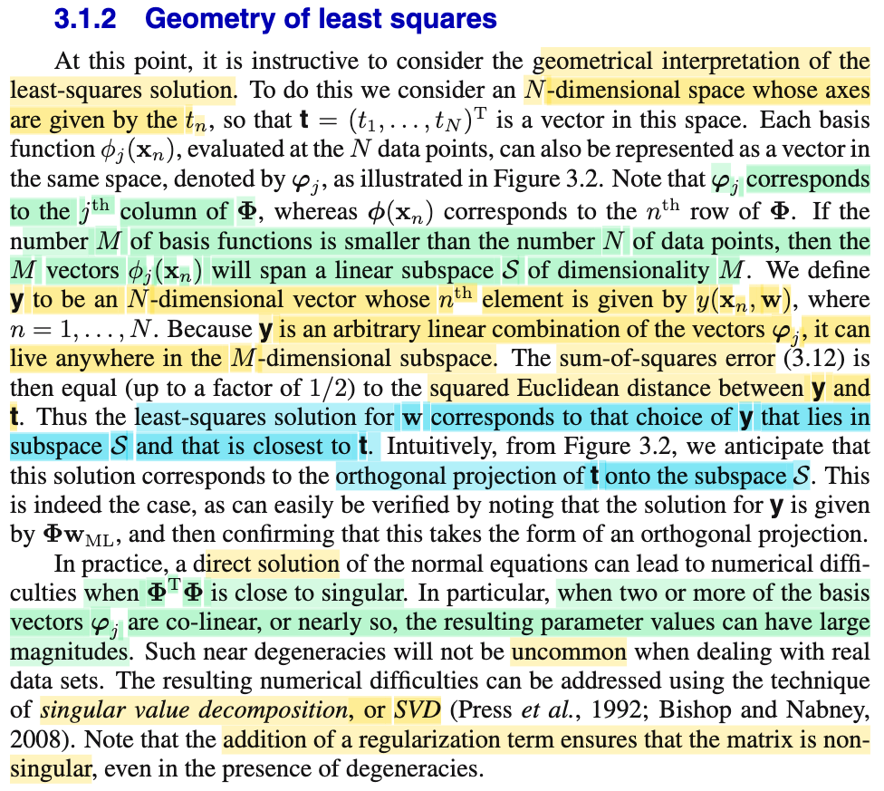
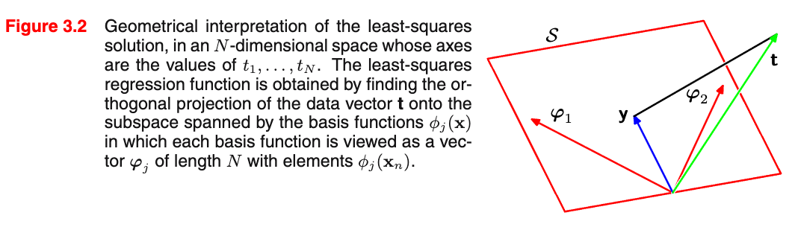

# 3.1.2 Geometry of least squares

📊 **Progress:** `1` Notes | `2` Screenshots | `1` AI Reviews

---

<kbd></kbd>

<kbd></kbd>

> [!NOTE]
> Qua góc nhìn hình học, phần lớn đều đã hiểu (trong mấy note trước đã có nói rồi).
>
>
>
> Đầu tiên, xét vector **t** = (t1,....tN), tức là tất cả target observation, sẽ là vector trong N-dimensional sapce.
>
>
>
> Thế thì hàm basis Φj() j = 0,1,...M. Ta còn nhớ là gì không? → là hàm dùng để tạo "tính chất phi tuyến", khiến cho mô hình y(**w**, **x**) = w0 Φ0(**x**) + w1 Φ1(**x**) + .. wM-1 ΦM-1(**x**) trở thành hàm phi tuyến theo **x**, (và vẫn tuyến tính theo **w**). Và nếu gom Φ1(**x**1), Φ1(**x**2),...Φ1(**x**N), thành vector **Φ**1 thì dĩ nhiên vẫn là một N-dimensional vector, nên nó cũng nằm trong vector space với vector **t** ở trên.
>
>
>
> (nói thêm chút, còn nhớ, ta define matrix **Φ**, chính là matrix có các hàng, là vector **Φ**(**x**i) = \[Φ0(**x**i), Φ1(**x**i), Φ2(**x**i),...ΦM-1(**x**i)\]. Nên vector **Φ**1 nói trên là cột 1 của matrix này. Tóm lại, các cột của design matrix **Φ** là các cột **Φ**0, **Φ**1,...**Φ**M-1. Với **Φ**j = \[Φj(**x**1), Φj(**x**2),...Φj(**x**N)\]T. Còn các hàng là vector Φ(**x**i) = \[Φ0(**x**i), Φ2(**x**i),...ΦM-1(**x**i))
>
>
>
> Thế thì, như vậy ta có M cột của design matrix, là các R^N vector **Φ**0, **Φ**1,...**Φ**M-1. Theo MIT 1806 đã học, với M vector thì trong trường hợp chúng đậc lập thì cùng lắm chỉ tạo một basis của một M-dimensional subspace của R^N thôi, cũng là nói chúng cùng lắm là chỉ span được một M-D subspace của R^N thôi. Nhưng nếu không độc lập, thì thậm chí dimension của span {**Φ**0, **Φ**1,...**Φ**M-1} còn nhỏ hơn M. Trong sách gs gọi subspace này là S. (dù ông nói nó có dimensionality là M, nhưng nhờ MIT 1806, mình hiểu điều này chỉ xảy ra khi **Φ**0, **Φ**1, **Φ**2,...**Φ**M-1 linearly independent như nói trên)
>
>
>
> Rồi, tiếp theo ta đặt vector **y** = \[y(**x**1, **w**), y(**x**2, **w**),...y(**x**N, **w**)\]T, đương nhiên, nó cũng là một N-dimensinal vector, cũng nằm trong R^N. Tuy nhiên, ta còn có thể thấy rằng:
>
>
>
> y(**x**1, **w**) = **w**T**Φ**(**x**1), y(**x**2, **w**) = **w**T**Φ**(**x**2),..
>
>
>
> nên với việc đặt design matrix **Φ** là matrix có các hàng là **Φ**(**x**1), **Φ**(**x**2),..như trên đã nói thì ta sẽ có thể thấy theo góc nhìn thứ nhất nhân matrix với vector được học trong MIT 1806 nói rằng Ax = b thì phần tử bi là dot product của hàng i của A và vector x, từ đó ta thấy **y** = **Φw**. Và từ đó, tiếp tục dùng góc nhìn thứ hai của việc nhân matrix với vector: Ax là linear combination các cột của A bởi hệ số là phần tử của x, thì ta lại thấy y chính là linear combination các cột **Φ**0, **Φ**1,...**Φ**M-1, bởi bộ hệ số là w0, w1, ...wM-1. Và điều này, theo định nghĩa của linear combination, sẽ có nghĩa là **y** phải nằm trong column space của **Φ**, là cái subspace span bởi **Φ**0, **Φ**1,...**Φ**M-1, chính là S ở trên (nên gs Bishop nới nói y có thể nằm anywhere trên M-dimensional subspace S này)
>
>
>
> Vậy thì sum of square error có công thức là = Σi \[ti - y(**w**, **x**i)\]^2, dễ thấy với việc có vector **t** và vector **y**, thì đây chính là ||**t** - **y**||^2, là squared L2 norm, cũng còn chính là bình phương Euclidean distance giữa **t** và **y**.
>
>
>
> Từ đó góc nhìn hình học này giúp ta nhìn nhận việc muốn đi giảm thiểu cái sum of squared error chính là muốn đi minimize cái L2 distance giữa **t** và **y**.
>
>
>
> Thế thì, vấn đề là **y** = **Φw**, là vector nằm đâu đó trong C(**Φ**) = S = span{**Φ**0,..**Φ**M-1}, và với các giá trị w khác nhau thì ta có có vector **y** chạy vòng vòng trong cái subspace này. Trong khi đó **t** thì sao? nó là R^N vector, là cái vector space mẹ, chứa cái subspace S, vì đang nói M < N, nên S không thể lấp đầy R^N này. Thành ra sẽ có hai trường hợp: **t nằm trong S** **hoặc không**. Do đó cái bài toán này chính là: tìm điểm nằm trong S sao cho gần với t nhất. Nói tìm điểm thực chất là tìm bộ hệ số w0,...wM-1 để dùng nó làm linear combination các cột của **Φ**, giúp ta có **y** = **Φw** gần với **t** nhất. Và đây chính là đi tìm hình chiếu của **t** lên C(**Φ**), hay S.
>
>
>
> Nói thêm, dĩ nhiên nếu hên, **t** nằm sẵn trong S, thì hình chiếu của **t** lên S là chính nó, khi đó việc minimize ||**t** - **y**||^2 sẽ có thể giảm cái này về 0, và solution đơn giản chỉ là nghiệm của **Φw** = **t**.
>
>
>
> Còn nếu **t** không nằm trong S, thì cái không thể giảm ||**t** - **y**||^2 về 0 được, mà giá trị nhỏ nhất chỉ là phần dư residual ||**t** - **p**||^2 với **p** là hình chiếu của **t** lên S. Solution của bài toán lúc này là nghiệm của **Φw** = **p**.
>
>
>
> Như mấy bữa đã từng nói rồi, dùng đặc điểm là phần dư **r** = **t** - **p** vuông góc với S, hay C(**Φ**), thì điều này có nghĩa r thuộc cái subspace mà complement orthogonal với C(**Φ**), chính là left nullspace: N(**Φ**T) (trong MIT 1806 đã học có 2 cặp subspace orthogonal complement là column space C(A) với left nullspace N(AT), và row space C(AT) với nullspace N(A)), từ đó ta có **Φ**T**r** = 0 ⇔ **Φ**T(**t** - **p**) = 0 ⇔ **Φ**T**t** = **Φ**T**p**. Tới đây ta thay **Φw** = **p** vào thì có **Φ**T**t** = **Φ**T**Φw**, chính là normal equation. Để rồi nếu **Φ** full column rank (cũng là các cột Φ0,...ΦM-1 của chúng độc lập, cũng là dimension của S là M) thì khi đó **Φ**T**Φ** full rank, ta có thể có **w** = (**Φ**T**Φ**)^-1 **Φ**T**t**. Và còn nhớ cái này **chính là** **w**ML, nơi ta giải phương trình gradient của hàm ln likelihood = 0 bữa trước.
>
>
>
> Chú ý là dù trong case t ∈ S để w là solution của **Φw** = **t, thì ta vẫn có thể nhân hai vế cho Φ**^(+), để có w = **Φ**^(+)**t** (chỉ là trong case này residual r = 0)
>
>
>
> Vậy thì ở đây gs Bishop nói đại ý là ta có thể "xác nhận" điều này (tức là **xác nhận việc giải bài toán minimize sum squared error chính là bài toán projection**) bằng cách lôi cái solution ra: **w**ML, để thấy nó chính là solution của bài toán tìm **w** giúp ta có được p là hình chiếu của **t** lên S.
>
>
>
> Và cái này thì mình đã xác nhận bên trên rồi, khi solution của bài toán projection là **w** = (**Φ**T**Φ**)^-1 **Φ**T**t** có được **bằng cách lập luận đại số tuyến tính**, thì **cũng chính là wML có được bằng cách giải điều kiện tối ưu bậc nhất** - cho gradient của hàm log likelihood bằng 0 bữa trước đó.
>
>
>
> Đoạn cuối, ông nói đại khái là việc giải nghiệm trực tiếp có thể gặp khó khăn khi **Φ**T**Φ** gần singular. Là sao?
>
>
>
> → Cũng dễ hiểu, vì cái công thức **w** = (**Φ**T**Φ**)^-1 **Φ**T**t, như đã nói trên, yêu cầu Φ**T**Φ** phải full rank / non-singular / invertible. Nên nếu **Φ**T**Φ** không invertible thì dĩ nhiên ko thể dùng công thức này.
>
>
>
> Hơn nữa, nhờ đọc Nocedal mình cũng được biết, giả sử ngay cả khi **Φ**T**Φ** invertible thì việc tính ra w cũng không phải là ta đi tính **Φ**T**Φ**, rồi tính inverse của nó (**Φ**T**Φ**)inv, sau đó nhân với **Φ**T**t**. Vì làm vậy rất tốn kém.
>
>
>
> Thay vào đó, thật ra là ta sẽ giải normal equation **Φ**T**Φw** = **Φ**T**t** theo các cách khác: Cái này chính là trong chap 10 của Numerical Optimization của J. Nocedal, nói rằng, nếu bài toán không quá lớn (large scale), ta có thể dùng các direct algorithm, dựa trên đại số tuyến tính, như các phương pháp dựa trên Cholesky factored, QR factoed, SVD, mỗi cái có ưu nhược điểm khác nhau. Còn nếu bài toán quy mô lớn, thì phải dùng trùm cuối - thuật toán Conjugate Gradient.
>
>
>
> Vậy thì ở đoạn này mình nhận ra chính là gs Bishop nói đến trường hợp đó, khi **Φ**T**Φ** gần singular, tức tồn tại các eigenvector rất nhỏ ≈ 0, sẽ khiến không thể giải bằng Cholesky factor based method được. Khi đó ta có thể giải bằng thuật toán dựa trên SVD
>
>
>
> (có nghĩa là gs Bishop ko nhắc đến, nhưng nhờ học Nocedal, nên mình biết chính xác ông nói SVD, ngoài ra còn biết về QR factor và conjugate gradient nữa)
>
>
>
> Và cũng nhờ MIT 1806 nên mình cũng hiểu đoạn ông Bishop nói vì sao có khi **Φ**T**Φ** gần singular. Đại khái là, như đã nói trên rằng khi các cột của **Φ**, độc lập, thì **Φ**T**Φ** sẽ full rank / invertivle / non-singular. Vậy thì ngược lại, nếu chúng phụ thuộc thì **Φ**T**Φ** sẽ singular. mà cột phụ thuộc là sao → tức là có thể xảy ra tình trạng có cột **Φ**i nào đó **CÓ THỂ ĐƯỢC TẠO RA BỞI MẤY CỘT KHÁC**, ví dụ **Φ**1 = 5**Φ**2, hoặc Φ1 = **Φ**2 + 3**Φ**5. Ví dụ như **Φ**1 = 5**Φ**2, thì trên không gian R^N, hai vector trùng nhau. Lúc này matrix Φ tồn tại nullspace vector khác 0, và cũng chính là tồn tại eigenvalue = 0.
>
>
>
> Vậy thì gần singular là sao? → Thì là khi ví dụ như Φ1 không bằng α Φ2 nhưng cũng rất gần bằng α Φ2, dẫn đến trong không gian, hai vector gần như trùng phương. Và eigenvalue gần bằng 0. Đó chính ý nghĩa của từ co-linear.
>
>
>
> Và gs nói hiện tượng này cũng ko phải là ít xảy ra trong các dataset thực, cũng như việc có thêm các regularization term sẽ đảm bảo ko thể xảy ra hiện tượng này

> [!TIP]
> **🤖 AI Feedback** — ✅ Score: **98/100**
>
> Phân tích cực kỳ sâu sắc và chi tiết, không chỉ nắm vững nội dung bài đọc mà còn mở rộng kiến thức từ đại số tuyến tính (MIT 1806) và tối ưu hóa số (Nocedal) để làm rõ từng khái niệm. Khả năng liên kết các ý tưởng phức tạp, đặc biệt là về phương trình chuẩn và các vấn đề tính toán liên quan đến ma trận gần suy biến, là rất ấn tượng và mang lại giá trị gia tăng đáng kể. 

**🔗 See also:** [Orthogonal Projection and Least Squares](./37_exercises.md#node-2dv7p1f)

 

