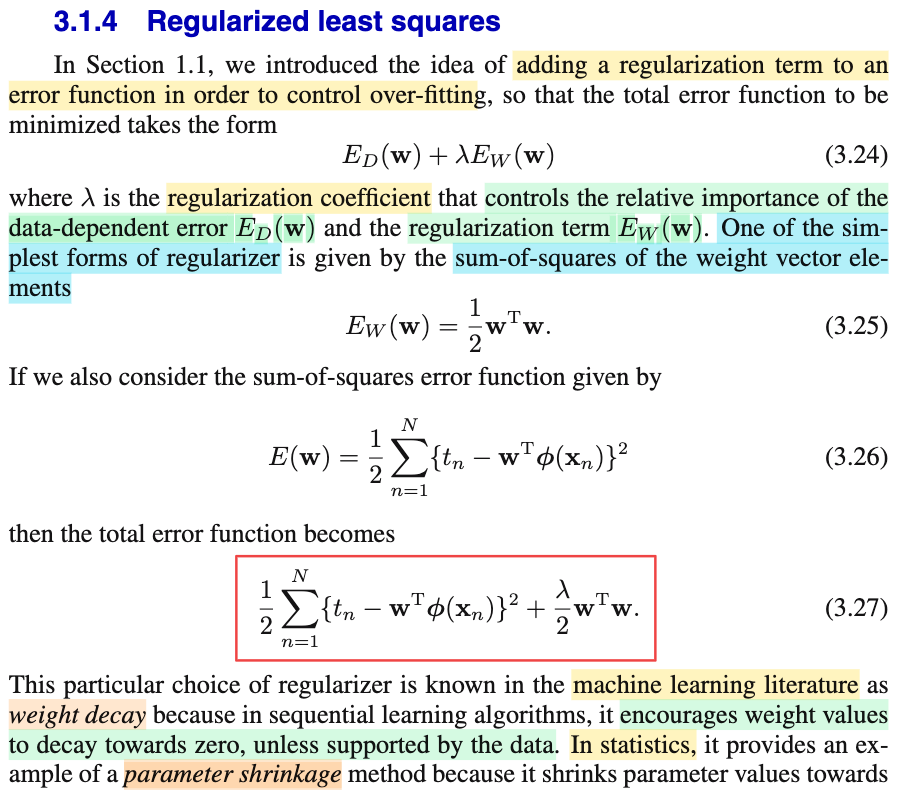
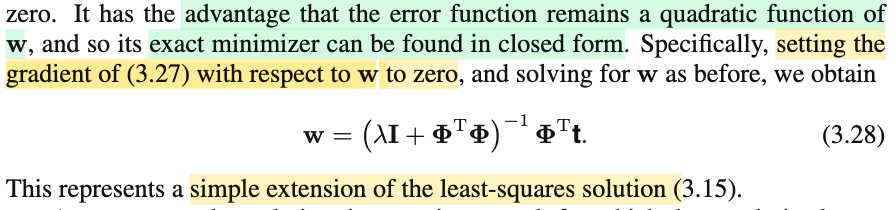
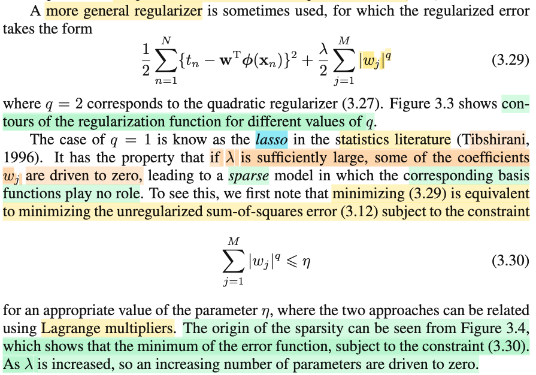
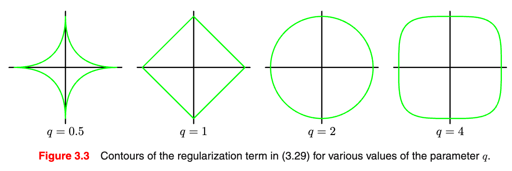
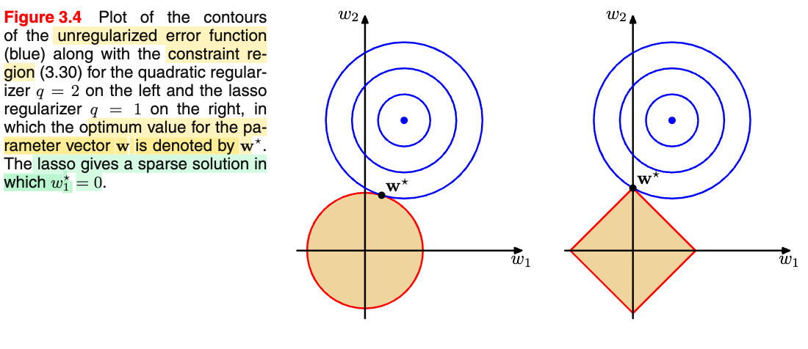
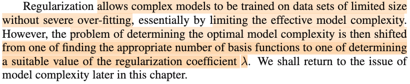
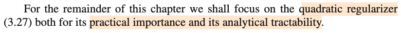

# 3.1.4 Regularized least squares

📊 **Progress:** `3` Notes | `7` Screenshots | `3` AI Reviews

---

<kbd></kbd>

<kbd></kbd>

> [!NOTE]
> Đại khái là, đoạn này gs Bishop nhắc lại một kĩ thuật gọi là regularization mà trong chap 1 khi làm ví dụ về bài toán polynomial curve-fitting mình đã gặp, trong đó ta add thêm vào loss function một hàm của parameter, gắn trọng số λ đóng vai trò điều chỉnh tương quan giữa regularization loss term là main loss term, để rồi total error sẽ là: E_D(**w**) + λ E_W(**w**). Với E_D(**w**) là main loss (error), có phụ thuộc data, còn E_W(**w**) thì chỉ phụ thuộc w, ko phụ thuộc data.
>
>
>
> Và một dạng đơn giản nhất chính là: (1/2)**w**T**w**, tức (1/2) tổng bình phương của các wi. Khi đó, nếu main error ta vẫn dùng sum squared error: E_D(**w**) = (1/2) Σi \[ti - **w**TΦ(**x**i)\]^2 (cũng là ||**Φw** - **t**||^2, với **Φ** là design matrix, thì total loss sẽ là:
>
>
>
> (1/2)||**Φw** - **t**||^2 + (1/2)λ**w**T**w**
>
>
>
> Biến đổi chút:
>
>
>
> = (1/2)\[||**Φw** - **t**||^2 + λ**w**T**w**\]
>
>
>
> = (1/2)\[(**Φw** - **t**)T(**Φw** - **t**) + λ**w**T**w**\]
>
>
>
> = (1/2)\[(**w**T**Φ**T - **t**T)(**Φw** - **t**) + λ**w**T**w**\]
>
>
>
> = (1/2)\[(**w**T**Φ**T**Φw** - **t**T**Φw** - **w**T**Φ**T**t** + **t**T**t** + λ**w**T**w**\]
>
>
>
> = (1/2)\[(**w**T**Φ**T**Φw** + λ**w**T**w**- 2**t**T**Φw** + **t**T**t**\]
>
>
>
> = (1/2)\[(**w**T(**Φ**T**Φ**+λ)**w** - 2**t**T**Φw** + **t**T**t**\]
>
>
>
> = (1/2)**w**T(**Φ**T**Φ**+λ)**w** - **t**T**Φw** + (1/2)**t**T**t**
>
>
>
> Có thể thấy rõ đây vẫn là quadratic functionc của **w**, có dạng f(**w**) = (1/2)**w**TP**w** + **q**T**w** + r, và để có gradient của hàm này, MIT 18s096 dạy ta cách tìm cực dễ, rằng ∇f chính là PTw + q, và Hessian chính là P. 
>
>
>
> Nên ở đây ∇E(**w**) = (**Φ**T**Φ**+λ)T**w** - **Φ**T**t**, cho gradient bằng 0 (điều kiện cần tối ưu bậc nhất) ta sẽ có:
>
>
>
> (**Φ**T**Φ**+λ)T**w** - **Φ**T**t** = 0
>
>
>
> ⇔ (**Φ**T**Φ**+λ)T**w** = **Φ**T**t** 
>
>
>
> ⇔ (**Φ**T**Φ**+λ)**w** = **Φ**T**t**  (vì (**Φ**T**Φ**+λ) đối xứng)
>
>
>
> ⇔ **w** = (**Φ**T**Φ**+λ)inv**Φ**T**t** → đây là 3.28
>
>
>
> Nói chung cũng không có gì khó hiểu, đại ý là nếu vẫn dùng sum squared error và add thêm một regularization term là quadratic function của w, thì dĩ nhiên hàm error vẫn là hàm bậc hai của **w**, điều đó đương nhiên khiến cho gradient vẫn là hàm bậc một của **w**, nên sẽ có thể có closed form solution.
>
>
>
> Và ông nói một điểm mà trong Casella mình cũng đã gặp, đó là cái này, trong bối cảnh machine learning, người ta gọi là weight decay, còn trong bối cảnh thống kê, người ta gọi là parameter shrinkage. (decay là shrinkage đều có nghĩa làm giảm, làm nhỏ lại). Còn vì sao lại gọi vậy thì dễ hiểu thôi, để giảm cái term thứ hai thì **w** sẽ phải nhỏ, và gs Bishop giải thích là, vì các thuật toán sẽ tìm cách làm giảm nhỏ các parameter trừ khi chúng được chống lưng bởi data (có nghĩa là, khi mô hình học, nó sẽ ép các param nhỏ lại, trừ những param thật sự cần thiết để nắm bắt quy luật của data)  
>
>
>
> Nhìn lại công thức **w** = (**Φ**T**Φ**+λ)inv**Φ**T**t**, thì mình cũng dễ thấy nó chỉ khác cái 3.15 (công thức của **w** không có regularization term, **w** = (**Φ**T**Φ**)inv**Φ**T**t**) ở chỗ có thêm việc cộng λ vào **Φ**T**Φ**

> [!TIP]
> **🤖 AI Feedback** — ✅ Score: **98/100**
>
> Bài phân tích rất chính xác và có chiều sâu, đặc biệt là phần dẫn giải chi tiết các bước biến đổi ma trận để tìm ra nghiệm đóng. Bạn đã nắm vững các khái niệm và mối liên hệ giữa chúng.

**🔗 See also:** [Bias-Variance Trade-off Explained](./320_the_bias_variance_decomposition.md#node-mqos0pj) · [Evidence Re-estimation Limit](./353_effective_number_of_parameters.md#node-00gilsq)

 

## General Regularizer and Lasso

<kbd></kbd>

<kbd></kbd>

<kbd></kbd>

> [!NOTE]
> Tiếp theo, đại ý là, nói một cách khái quát hơn, regularization có thể có dạng (λ/2) Σj |wj|^q.
>
>
>
> Với q = 2, thì ta có cái hồi nãy (gọi là L2 regularization)
>
>
>
> còn với q = 1, gs cho biết trong statistic nó gọi là Lasso (mình sẽ gặp lại gốc của cái này khi đọc cuốn Element Of Statistical Learninig của Tibshirani), có đặc điểm là nó sẽ không chỉ ép các param nhỏ lại (các param mà data cho thấy rằng nó không nên có giá trị lớn, mà mình có thể hiểu nôm na là các param gắn với các feature ít quan trọng), mà sự nhỏ lại này sẽ cực đoan hơn - ép các parameter về 0.
>
>
>
> Và đại khái là có thể hiểu vì sao như vậy như sau:
>
>
>
> Đầu tiên, khi xét bài toán tối ưu: minimize hàm error với regularization (λ/2) Σj |wj|:
>
>
>
> minimize (over **w**) (1/2 E_D(**w**) + (λ/2) Σj |wj|
>
>
>
> là một bài toán unconstrained optimization.
>
>
>
> Nhờ Convex Optimization của S.Boyd, mình đã biết cái vụ chuyển một bài toán tối ưu thành một bài toán tối ưu tương đương (equivalent, tức solution của cái này cũng giúp tìm solution của bài toán kia), ví dụ điển hình là khi ta dùng hàm ln (log base e, để thay vì minimize likelihood, ta minimize ln likelihood, lợi dụng tính chất monotone increasing của hàm log, và việc giải bài toán với ln likelihood sẽ thuận tiện hơn)
>
>
>
> Vậy thì ở đây, mình gặp lại cái vụ: chuyển thành bài toán tương đương bằng cách tích hợp constraint vào objective, và ngược lại. Có nghĩa là, thực chất bài toán không ràng buộc: minimize hàm (1/2 E_D(**w**) + (λ/2) Σj |wj| có thể chuyển thành bài toán tối ưu ràng buộc tương đương:
>
>
>
> minimize (1/2 E_D(**w**) subject to \[constrain nào đó\]
>
>
>
> Thế thì constraint nào đó là constraint gì?
>
>
>
> Trong Convex Optimization, mình đã học một kĩ thuật y chang cái này: Chuyển bài toán tối ưu ràng buộc bất đẳng thức thành bài toán tối ưu không ràng buộc bằng cách tích hợp cái ràng buộc vào main objective:
>
>
>
> Bài toán gốc (ràng buộc bất đẳng thức và ràng buộc đẳng thức):
>
>
>
> minimize_x f0(x) s.t fi(x) ≤ 0 i = 1,2..., hi(x) = 0, j = 1,2,..
>
>
>
> Ta mới tích hợp nó vào hàm objective bằng cách đặt ra hàm generalized Lagrangian:
>
>
>
> L(x, λ, ν) = f0(x) + Σi λi × fi(x) + Σi νi × hi(x)
>
>
>
> Từ đó, ta sẽ có KKT condition, giúp giải tìm candidate của solution (và nếu bài toán là convex, KKT có thể giúp kết luận luôn solution)
>
>
>
> Lát nữa mình sẽ lập luận lại KKT conditions, còn bây giờ ta quay lại vấn đề chính. Nhờ hiểu vậy, mình sẽ thấy rằng, cái objective đang xét E_D(w) + (λ/2) Σj |wj| thực chất chính là có dạng f0(w) + α f1(w) với f0(w) = E_D(w) và f1(w) = Σj |wj| - η
>
>
>
> để rồi bài toán unconstrain minimize E_D(**w**) + (λ/2) Σj |wj| có thể equivalent bởi bài toán constraint: minimize E_D(**w**) subject to Σj |wj| - η ≤ 0 ⇔ Σj |wj| ≤ η, η ≥ 0.
>
>
>
> Thế thì, trong MIT 1802 đã học về cái trực giác của Lagrange multiplier: Đại ý là hình 3.4 có thể hiểu như sau: Đường tròn đồng tâm màu xanh dương chính là contour plot của hàm E_D(**w**) (với D=2, nó đồ thị hàm số của nó là cái paraboloid), và hình màu cam là contour plot của hàm regularizer. Dĩ nhiên, contour plot cũng chính là khái niệm level set/ level curve trong MIT 1802 - là tập các điểm mà hàm số có cùng giá trị (constant). Và vì vậy, khi di chuyển trên contour plot, giá trị hàm không đổi, đồng nghĩa, đạo hàm của hàm số theo hướng tiếp tuyến với contour plot tại điểm đang xét phải bằng 0.
>
>
>
> Vậy thì, hiểu đơn giản, hình 3.4 đầu tiên với q = 2, ta sẽ thấy nếu di chuyển trên đường contour plot màu xanh ngoài cùng (đồng nghĩa có xét các điểm có cùng main error term) thì điểm gần với gốc tọa độ nhất, đồng nghĩa có regularzer error nhỏ nhất chính là w\*, giao điểm của hai đường tròn. Trong khi đó, cũng xét các điểm trên đường contour plot màu xanh ngoài cùng, thì nơi có regularizer error nhỏ nhất lại là đỉnh của hình vuông, và tại đây thì w\*1 = 0.
>
>
>
> Có nghĩa là, hình ảnh này cho ta hiểu đại khái rằng, vì hình dạng của contour plot của hàm E_W(w), sẽ dẫn đến kết quả solution w\* khác nhau, trong đó cả hai đều đạt trạng thái cân bằng giữa việc cố gắng làm giảm main error và regularizer nhưng nếu ta dùng l1 thì kết quả sẽ dẫn đến là ép cho param nào đó thành 0 (dù cả hai, trong mục tiêu giảm error tổng sẽ đều muốn ép param nhỏ lại, nhưng cái dùng l1 regularizer, thì sẽ ép một một số param thành 0 luôn).
>
>
>
> Còn điểm w\* nằm ở đâu, thì chính là thể hiện bởi: d/dw error tổng = 0
>
>
>
> ⇔ ∇E_D(**w**) + λ ∇E_W(**w**) = 0
>
>
>
> ⇔ ∇E_D(**w**) = - λ ∇E_W(**w**)  
>
>
>
> ⇨ **w**\* phải là điểm mà tại đó gradient của hàm E_D(**w**) cùng phương và ngược hướng với gradient hàm E_W(**w**).
>
>
>
> Mà cái này thì hoàn toàn phù hợp với trực giác ở trên: w\* phải là giao điểm của hai contour plot (khiến cho tổng error là nhỏ nhất, còn hai contour plot nào thì sẽ quyết định bởi λ, tham số ảnh hưởng tới tương quan giữa E_D và E_W như đã nói). Và vì gradient của hai hàm số tại đó đều phải vuông góc với contour plot (level curve), nên chúng sẽ phải paralell (trùng phương, ngược hướng)
>
>
>
> (Còn vì sao gradient phải vuông góc với level curve thì dễ rồi: vì đã nói ở trên, di chuyển theo level curve thì hàm số không đổi ⇨ đạo hàm của hàm số theo hướng tiếp tuyến với level curve phải bằng 0. Tức là nếu gọi d là hướng tiếp tuyến của level curve tại x thì directional derivative của hàm f theo vector d tại x, có công thức là ∇f(x)Td, phải bằng 0: ∇f(x)Td = 0, và cái này suy ra ∇f(x) phải vuông góc với d → tức vuông góc với level curve)
>
>
>
> Nói túm lại, về mặt trực giác chỉ cần hiểu đơn giản thôi: Để giảm error tổng, sẽ là sự giằng co trong việc giảm E_D và E_W (và kết quả dằng co này sẽ chi phối bởi λ, tham số chi phối tương quan giữa hài objective). Kết quả sẽ là một w\*. Xét hai contour plot của hai hàm số mà w\* là tiếp điểm, thì với trường hợp của q = 2 (tức L2 regularizer) và q = 1 (L1 regularizer), thì đại khái là vì sự khác nhau giữa hình dạng của contour plot của hai hàm L1 và L2, nên sẽ khiến với L1, w\* nằm ở trên trục (đồng nghĩa một số param trở thành 0) hoặc không (các param chỉ nhỏ, chứ ko thành 0)
>
>
>
> Kết quả này, đơn thuần là hệ quả về mặt toán học khi ta muốn giảm thiểu error tổng chứ hoàn toàn chẳng phải là vì L1 cố tình ép các param thành 0 hay gì hết.
>
>
>
> Hệ quả là, nếu dùng lasso, ta có một mô hình với các tham số thưa thớt (sparse)

> [!TIP]
> **🤖 AI Feedback** — ✅ Score: **97/100**
>
> Bài phân tích của bạn rất sâu sắc và chính xác, thể hiện sự hiểu biết vững vàng về cơ sở toán học và trực giác hình học của regularization, đặc biệt là sự khác biệt giữa L1 và L2. Mặc dù rất chi tiết và đúng, bạn có thể cân nhắc cô đọng một số phần để ghi chú của mình súc tích hơn.

**🔗 See also:** [Lagrange Multipliers in Regularization](./37_exercises.md#node-tu3cct2)

 

### Model Complexity and Regularization

<kbd></kbd>

<kbd></kbd>

> [!NOTE]
> Cuối cùng, ý tác giả là kỹ thuật regularization cho phép sử dụng các mô hình phức tạp cho những bài toán có ít dữ liệu mà không sợ hiện tượng quá khớp (overfit). Tuy nhiên, vấn đề lúc này là làm thế nào để chọn ra giá trị phù hợp của siêu tham số, yếu tố giúp kiểm soát mức độ cân bằng giữa hàm sai số chính và hàm regularization, thay vì tìm số lượng hàm cơ bản phù hợp.
>
>
>
> Nói cách khác, nếu không sử dụng kỹ thuật regularization, chúng ta phải đối mặt với việc khống chế độ phức tạp của mô hình bằng cách dùng các hàm cơ sở (basis function) để quyết định tính phi tuyến của hàm số đối với dữ liệu. Việc chọn hàm cơ sở phải phù hợp để hàm số không quá phức tạp gây ra overfit, nhưng cũng không quá đơn giản dẫn đến underfit.Tuy nhiên, với regularization, chúng ta có thể tùy ý sử dụng một hàm cơ sở phức tạp đến mức nào cũng được, và regularization sẽ đảm bảo tránh hiện tượng overfit.
>
>
>
> Nhưng chúng ta lại phải đối mặt với vấn đề chọn siêu tham số (ví dụ như λ) sao cho hợp lý. Bởi vì nếu siêu tham số quá lớn hoặc quá nhỏ, mô hình sẽ trở nên quá phức tạp hoặc bị khống chế quá mức, làm giảm hiệu quả.

> [!TIP]
> **🤖 AI Feedback** — ⚠️ Score: **88/100**
>
> Ghi chú giải thích rất rõ ràng về vai trò của regularization và sự dịch chuyển trong việc quản lý độ phức tạp của mô hình, đồng thời đào sâu vào ý nghĩa của siêu tham số lambda. Tuy nhiên, bạn đã bỏ sót thông tin về loại regularization cụ thể mà chương này sẽ tập trung nghiên cứu.

 

