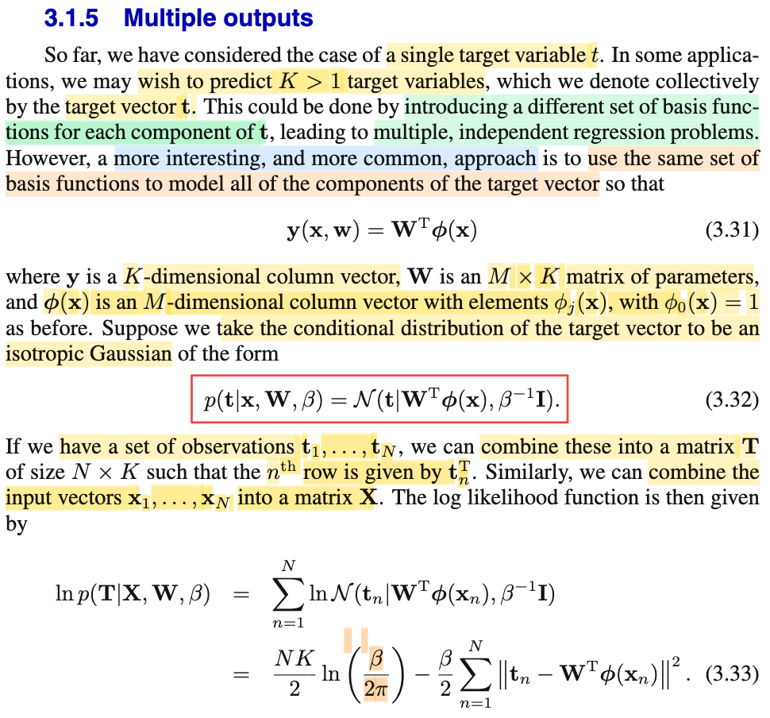
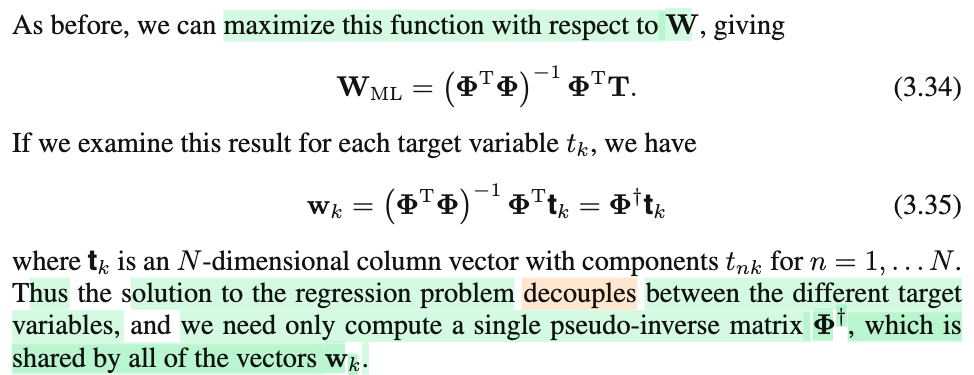
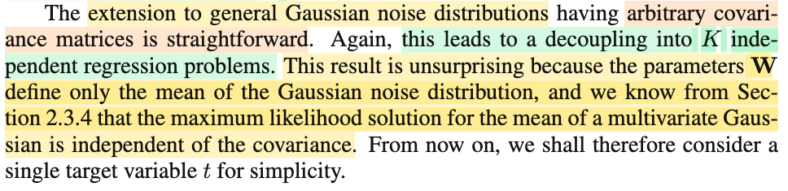

# 3.1.5 Multiple outputs

📊 **Progress:** `3` Notes | `3` Screenshots | `3` AI Reviews

---

## 3.1.5 Multiple outputs

<kbd></kbd>

> [!NOTE]
> Cũng nhau giải thích lại đoạn này: Đại khái là ở đây gs bàn qua bài toán regression trong đó ta không chỉ dự đoán scalar t từ input vector **x**, mà là dự đoán một vector **t** = (t1,...tK) từ **x**. Có nghĩa là, lúc này, ta muốn xây dựng hàm dự đoán y(parameter, **x**) sẽ là hàm có output là vector (tức y là vector)
>
>
>
> Vậy thì đại khái là, với single t, thì bữa giờ đã đang xét về linear model - tức là y(**w**, **x**) = w0 + w1x1 + ..wM-1 xM-1. Đặt **w** = (w0, w1,...wM-1)T, và dùng hàm basis Φ(**x**) = (Φ0(**x**) = 1, Φ1(**x**), Φ2(**x**), ...ΦM-1(**x**))T để biến hàm y thành phi tuyến đối với input **x** (dù vẫn tuyến tính đối với **x**), ta có y(**w**, **x**) = **w**TΦ(**x**)
>
>
>
> Vậy thì ở đây, đại ý là, ta sẽ vẫn theo lối đó, vẫn dùng Φ(**x**), chỉ là lúc này, với K target t1,...tK cần predict thì ta sẽ có K bộ (vector) parameter **w1**, **w2**,...**wK**. Đặt thành các **cột** của matrix **W**. Và mô hình lúc này sẽ là **y**(**W**, **x**) = **W**TΦ(**x**).
>
>
>
> Đương nhiên, **y** sẽ là vector có K components, và như đã biết về góc nhìn thứ nhất khi nhân matrix với vector được học trong MIT 1806, thì **W**TΦ(**x**) sẽ là vector có phần tử thứ i là hàng i của **W**T tức cột i của **W**, tức **wi**, dot product với vector Φ(**x**).
>
>
>
> Tiếp, lại so sánh với single t scenario, ta còn nhớ, trong bài toán này, với cách tiếp cận xác suất ta sẽ coi target là random variable, tức là xem xét giá trị target là các observed value của random variable T (nhưng ko care distribution của **X**, không coi **X** là random variable), và ta muốn tìm distribution của T|**x**. (còn trong cách tiếp cận không xác suất thì chỉ việc xây dựng hàm dự đoán từ **x** ra t, chẳng cần xây dựng distribution của T gì cả)
>
>
>
> Để rồi, khi đó, để làm tiếp, ta sẽ đặt ra một giả định đại khái là: giả sử ta có thể dự đoán chính xác t, thì vẫn tồn tại sai số không thể giảm được, và sai số này tuân theo Normal(0, 1/β) với β là precision mang giá trị nào đó. Khi đó dựa vào location scale theorem, giả định này đồng nghĩa ta đang giả định T \~ normal(y(**w**,**x**), 1/β), mang ý nghĩa là, với **w** tốt nhất, ta sẽ tính được mean của distribution của T, và variance của nó đến từ variance của irreducible noise.
>
>
>
> Vậy thì quay lại, đây, hoàn toàn tương tự, chỉ là lúc này ta có nhiều t, gom lại thành vector **t**. Thì ta cũng sẽ giả định nó là một distribution nào đó: Và ta sẽ gỉa định là: các random variable Ti đều độc lập, và Ti \~ normal(y(**wi**, **x**) = **wi**TΦ(**x**), 1/β) (**wi** là hàng i của **W**). Từ đó, ta sẽ có joint distribution, của T1,..TK, tức distribution của random vector **T** như sau:
>
>
>
> f(**t**|**W**, **X**, β) = f(t1, t2,..tK|**W**, **X**, β)
>
>
>
> nhờ tính độc lập của T1,...TK ta có thể tách joint pdf thành tích marginal pdf (chú ý, chúng độc lập, nhưng không identically distributed, vì khác mean)
>
>
>
> = Πi=1:K f(ti|**W**, **X**, β)
>
>
>
> = Πi=1:K N(ti|**wi**, **xi**, β) (thay kí hiệu N, vì như đã nói, ta assume Ti \~ normal(y(**wi**, **x**) = **wi**TΦ(**xi**), 1/β)
>
>
>
> = Πi=1:K \[1/√2π(1/β)\] exp\[-(ti - **wi**TΦ(**xi**))^2/2(1/β)\]
>
>
>
> = Πi=1:K \[2π(1/β)\]^(-1/2) exp\[-β(ti - **wi**TΦ(**xi**))^2/2\]
>
>
>
> = \[2π(1/β)\]^(-K/2) Πi=1:K {exp\[-β(ti - **wi**TΦ(**xi**))^2/2\] }
>
>
>
> = \[2π(1/β)\]^(-K/2) exp{Σi=1:K \[-β(ti - **wi**TΦ(**xi**))^2/2\]}
>
>
>
> = \[2π(1/β)\]^(-K/2) exp{Σi=1:K \[-β(ti - **wi**TΦ(**xi**))^2/2\]}
>
>
>
> = \[1/(2π)^K/2\] \[1/ |(1/β)**I**|^1/2\] exp{-(1/2)(ti - **wi**TΦ(**xi**))T \[(1/β)**I**\]inv (ti - **wi**TΦ(**xi**)}
>
>
>
> và đây chính là pdf của **T** \~ N(**W**TΦ(**x**), (1/β)**I**) → 3.32
>
>
>
> Như vậy, tương đương với scalar t case, trong đó ta assume T \~ normal(**w**TΦ(**x**), 1/β) thì ở vector **t** case ta sẽ assume **T** \~ N(**W**TΦ(**x**), (1/β)**I**)
>
>
>
> Rồi, như vậy bước tiếp theo, trong scalar case, với việc ta có các observation (**x**i, ti), nhờ ánh sáng của Casella, mình hiểu, đây là một random sample iid T1, T2,....TN độc lập, và có chung distribution Ti \~ normal(**w**TΦ(**xi**), 1/β). Nên joint distribution của chúng sẽ là f(t1,t2,...tN|**w**, **x**1, **x**2...**x**N) = Πi=1:N N(**x**i, **w**TΦ(**x**i), và từ đó xét hàm likelihood.
>
>
>
> Thì ở đây cũng vậy, ta phải hiểu rằng, N cặp giá trị quan sát được (**t**1, **x**1), (**t**2, **x**2), ...(**t**N, **x**N) cũng sẽ cho ta một random sample iid **T**1, **T**2,...**T**N, với **T**i \~ N(**W**TΦ(**x**i), (1/β)**I**). Để rồi joint pdf của chúng sẽ là:
>
>
>
> f(**T**1,....**T**N|**W**, **x**1, **x**2...**x**N, β) = Πi=1:N N(**T**i|**W**TΦ(**x**i), (1/β)**I**)
>
>
>
> Và khi đã có joint pdf của T1,...TN, ta mới nói đến likelihood (vì ta sẽ lại theo cách tiếp cận phổ biến - maximum likelihood estimation):
>
>
>
> Ôn lại chút, theo định nghĩa của hàm likelihood trong bối cảnh thống kê đã học trong Casella: khi ta có random sample X1, X2,...Xn iid \~ f(xi|θ), có observation x1,x2,...xn thì hàm likelihood là hàm của θ, kí hiệu L(θ|x1,x2,..xn) hay L(θ|**x**) sẽ mang ý nghĩa là độ hợp lí của θ giúp giải thích cho giá trị quan sát được x1,x2,...xn của X1,X2...Xn, và người ta định nghĩa giá trị hàm này = f(x1,x2,...xn|θ) hay f(**x**|θ).
>
>
>
> Do đó, quay lại đây, likelihood của **W**, β là: L(**W**, β|**T**1,...**T**N) = f(**T**1, **T**2...**T**N|**W**, β, **x**1,...**x**N)
>
>
>
> = Πi=1:N N(**T**i|**W**TΦ(**x**i), (1/β)**I**)
>
>
>
> Rồi, trước khi ráp công thức pdf của Ti vô, ta lại chuẩn bị sẵn ln likelihood
>
>
>
> ln L(**W**, β|**T**1,...**T**N) = ln {Πi=1:N N(**T**i|**W**TΦ(**x**i), (1/β)**I**)}
>
>
>
> = Σi=1:N { ln N(**T**i|**W**TΦ(**x**i), (1/β)**I**) }
>
>
>
> Thay pdf N(**T**i|**W**TΦ(**x**i), (1/β)**I**) = \[1/(2π)^(K/2)\] \[1/|**Σ**|^(1/2)\] exp{-(1/2)\[**t**i - **W**TΦ(**x**i)\]T **Σ**inv \[**t**i - **W**TΦ(**x**i)\] với **Σ** = (1/β)**I**
>
>
>
> = Σi=1:N { ln { \[1/(2π)^(K/2)\] \[1/|**Σ**|^(1/2)\] exp{-(1/2)\[**t**i - **W**TΦ(**x**i)\]T **Σ**inv \[**t**i - **W**TΦ(**x**i)\] }}}
>
>
>
> = Σi=1:N { ln \[1/(2π)^(K/2)\] + ln \[1/|**Σ**|^(1/2)\] + ln exp{-(1/2)\[**t**i - **W**TΦ(**x**i)\]T **Σ**inv \[**t**i - **W**TΦ(**x**i)\] }}
>
>
>
> = Σi=1:N { (K/2) ln \[1/(2π)\] + (1/2) ln \[1/|**Σ**|\] + {-(1/2)\[**t**i - **W**TΦ(**x**i)\]T **Σ**inv \[**t**i - **W**TΦ(**x**i)\] }}
>
>
>
> = Σi=1:N { (K/2) ln \[1/(2π)\] } + (N/2) ln \[1/||**Σ**||\] + Σi=1:N{-(1/2)\[**t**i - **W**TΦ(**x**i)\]T **Σ**inv \[**t**i - **W**TΦ(**x**i)\] }
>
>
>
> = (NK/2) ln \[1/(2π)\] + (N/2) ln \[1/|**Σ**|\] + Σi=1:N{-(1/2)\[**t**i - **W**TΦ(**x**i)\]T **Σ**inv \[**t**i - **W**TΦ(**x**i)\] }
>
>
>
> **Σ** = (1/β) **I** = βinv **I** → del(**Σ**) = det (βinv **I**). Và dùng tính chất của định thức đã học trong MIT 18.06, thì giả sử có matrix A, và scale một hàng của A bởi α, để được B, thì det B = α det A. Và từ đó ta có thể thấy det (βinv **I**) = (βinv)^K × det I = (βinv)^K = 1/β^K
>
>
>
> .. = (NK/2) ln \[1/(2π)\] + (N/2) ln \[1/β^K\] -(1/2) Σi=1:N{ \[**t**i - **W**TΦ(**x**i)\]T (βinv **I**)inv \[**t**i - **W**TΦ(**x**i)\] }
>
>
>
> = (NK/2) ln \[1/(2π)\] + (NK/2) ln β -(1/2) Σi=1:N{ \[**t**i - **W**TΦ(**x**i)\]T β **I**inv \[**t**i - **W**TΦ(**x**i)\] }
>
>
>
> = (NK/2) ln \[β/(2π)\] -(β/2) Σi=1:N{ \[**t**i - **W**TΦ(**x**i)\]T\[**t**i - **W**TΦ(**x**i)\] }
>
>
>
> = (NK/2) ln \[β/(2π)\] -(β/2) Σi=1:N{ ||**t**i - **W**TΦ(**x**i)||^2}
>
>
>
> Đây chính là 3.33

> [!TIP]
> **🤖 AI Feedback** — ✅ Score: **99/100**
>
> Bài giải thích của bạn cực kỳ chi tiết và chính xác, đặc biệt là các bước suy luận toán học để đi đến công thức (3.32) và (3.33) đều rất rõ ràng và dễ hiểu. Độ sâu phân tích này thể hiện sự nắm vững kiến thức đáng kinh ngạc, rất tốt!

**🔗 See also:** [Phân phối Gaussian](./230_gaussian_distribution.md#node-arii2cl)

 

## Maximum Likelihood Regression Solution

<kbd></kbd>

> [!NOTE]
> Rồi, như vậy với ln likelihood, ta sẽ lại giải bài toán tìm **W**, **β** maximize cái ln likelihood này, để có được ML Estimator của **W**.
>
>
>
> maximize (over **W**, β) {(NK/2) ln \[β/(2π)\] -(β/2) Σi=1:N{ ||**t**i - **W**TΦ(**x**i)||^2} }
>
>
>
> và như đã nói trước đây, ta có thể giải theo biến tối ưu **W** trước, khi đó ta coi β như constant nên ta sẽ chuyển thành bài toán tương đương bằng cách bỏ đi constant
>
>
>
> maximize (over **W**) { -Σi=1:N { ||**t**i - **W**TΦ(**x**i)||^2} }
>
>
>
> equivalent
>
>
>
> minimize (over **W**) { Σi=1:N { ||**t**i - **W**TΦ(**x**i)||^2} }
>
>
>
> Xét cái objective: Σi=1:N { ||**t**i - **W**TΦ(**x**i)||^2 } m thử xem có thể thể hiện gọn hơn ko: Ta thấy nó có dạng tổng các scalar - mỗi scalar là square norm của một vector (**t**i - **W**TΦ(**x**i)). Và tổng các scalar ta sẽ nghĩ đến trace. Nếu ta có ATA thì đường chéo của nó chính là chứa các dot product của row i của AT với column i của A, cũng là giữa column i của A với column i của A, tức ||column i của A||^2.
>
>
>
> Vậy ta sẽ nghĩ đến matrix nào đó mà các cột là **t**i - **W**TΦ(**x**i). gọi nó là matrix **M** đi, thì objective chính là trace(**M**T**M**).
>
>
>
> Vậy thì thì nếu đặt các **t**i thành các **hàng** của matrix **T**, thì **T**T là matrix có các cột là **t**i **W**
>
>
>
> Và Φ(**x**i) thành các **hàng** của matrix **Φ** (đây chính là design matrix bữa trước) thì **Φ**T là matrix có các cột là Φ(**x**i) và matrix có các cột là **W**TΦ(**x**1), **W**TΦ(**x**2)... chính là **W**T **Φ**T vì theo MIT 1806, **W**T **Φ**T sẽ có cột i là **W**T \[cột i của **Φ**T\].
>
>
>
> Vậy matrix có các cột là **t**i - **W**TΦ(**x**i) chính là matrix **T**T - **W**T **Φ**T, tức (**T** - **ΦW**)T. Và như vậy **M** = (**T** - **ΦW**)T. Và objective = tr(**M**T**M**) = tr((**T** - **ΦW**)(**T** - **ΦW**)T)
>
>
>
> và theo tính chất cycling của trace: tr(AB) = tr(BA) thì ta có objective cũng là tr((**T** - **ΦW**)T(**T** - **ΦW**))
>
>
>
> Tới đây, dùng điều kiện tối ưu cần bậc nhất, nên chuẩn bị gradient (d/d**W** tr((**T** - **ΦW**)T(**T** - **ΦW**))
>
>
>
> tr((**T** - **ΦW**)T(**T** - **ΦW**) = tr((**T**T - **W**T**Φ**T)(**T** - **ΦW**) = tr((**T**T**T** - **W**T**Φ**T**T** - **T**T**ΦW** + **W**T**Φ**T**ΦW**)
>
>
>
> = tr(**T**T**T** - 2**T**T**ΦW** + **W**T**Φ**T**ΦW**)
>
>
>
> = tr(**T**T**T)** - 2tr(**T**T**ΦW**) + tr(**W**T**Φ**T**ΦW**) (dùng tính liearity của trace)
>
>
>
> ⇨ d/d**W** objective = -2d/d**W** \[tr(**T**T**ΦW**)\] + d/d**W** tr(**W**T**Φ**T**ΦW**)
>
>
>
> Tới đây dùng công thức đạo hàm hàm trace:
>
>
>
> Xét X, A là matrix và hàm matrix → scalar f(X) = tr(AX). df = tr(AX + AdX) - tr(AX) = tr(AdX). Và cái này, chính là AT . dX, tức inner product của matrix AT và matrix dX. Vậy ta có df = AT . dX, là một linear operator act on dX, theo định nghĩa của đạo hàm f'(X) dX cũng là một linear operator act on dX, từ đó ta suy ra nên d/dX f(X) = AT
>
>
>
> Áp dụng vào đây ta sẽ có d/d**W** \[tr(**T**T**ΦW**)\] = (**T**T**Φ**)T = **Φ**T**T**.
>
>
>
> Còn d/d**W** tr(**W**T**Φ**T**ΦW**) thì dài dòng hơn, tí ta sẽ quay lại, = 2**Φ**T**ΦW**
>
>
>
> Vậy gradient = -2**Φ**T**T** + 2**Φ**T**ΦW**
>
>
>
> gradient = 0 ⇔ -2**Φ**T**T** + 2**Φ**T**ΦW** = 0 ⇔ **Φ**T**ΦW** = **Φ**T**T**
>
>
>
> ⇔ **W**ML = \[**Φ**T**Φ**\]inv**Φ**T**T** → 3.34
>
>
>
>  và như vậy các cột của **W**, tức **w**i sẽ chính là \[**Φ**T**Φ**\]inv**Φ**T**t**i
>
>
>
> với việc bữa trước mình đã nói về pseudo matrix, \[**Φ**T**Φ**\]inv**Φ**T, tức left inverse của **Φ**, thì ta hiểu vì sao kết quả 3.35 ghi là **w**i = **Φ**^(+) **t**i
>
>
>
> Và như vậy nhận định quan trọng là: Đại khái là, hóa ra, việc ta chuyển thành bài toán predict vector **t** gồm các t1,...tK độc lập thì hóa ra solution (ML estimator) chỉ là: Thay vì kết quả ta có vector **w**ML = **Φ**^(+) **t**, thì nay ta có K vector **w**ML_i = **Φ**^(+) **t**i. Tức là, chúng hoàn toàn tách biệt (decouple), chứ không dính với nhau, dẫn tới giống như là ta giải nhiều bài toán predict t1, t2,..riêng với input là chỉ dùng chung Φ(**x**) và với các vector wi tương ứng.
>
>
>
> Và như vậ ta chỉ cần chuẩn bị matrix **Φ**^(+) để rồi lần lượt nhân với **t**i để có **w**ML_i.

> [!TIP]
> **🤖 AI Feedback** — ✅ Score: **100/100**
>
> Ghi chú của bạn cung cấp một cách suy luận cực kỳ kỹ lưỡng và chính xác về ước lượng hợp lý tối đa cho W, hoàn toàn khớp với các phương trình (3.34) và (3.35) đã cho. Bạn đã trình bày rất rõ ràng khái niệm "decoupling" và cách ma trận giả nghịch đảo được dùng chung, cho thấy sự hiểu biết sâu sắc. Để hoàn thiện tuyệt đối, bạn có thể cân nhắc trình bày chi tiết hơn bước đạo hàm cho tr(W^T Φ^T ΦW).

 

### Maximum Likelihood for Gaussian Mean

<kbd></kbd>

> [!NOTE]
> Rồi đoạn cuối cùng thì đại khái ông nói rằng là hồi nãy giờ là mình giải cái đặt bài toán với việc giả định rằng các cái vector T nó tuân theo cái phân phối đa biến có cái ma trận hiệp phương sai có dạng là một cái ma trận identity nhân với một chia beta. Thì bây giờ ông nói rằng mình có thể mở rộng nó ra với mô hình đa biến có cái ma trận hiệp phương sai bất kỳ. Và kết quả sẽ cũng cho thấy rằng bài toán được trở thành ra là giống như việc giải nhiều bài toán dự đoán scale độc lập. Tức là nó tách bật ra thành những bài toán dự đoán một con số độc lập thay vì nó dính với nhau. Và cái lý do là bởi vì trong cái phần hai mình đã thấy rằng là cái nghiệm mà maximum likelihood vốn dĩ là nó có một cái tính chất là nó chỉ nó không có phụ thuộc vào cái covariance mà trận hiệp phương sai. Cho nên là dù ma trận hiệp phương sai nó là cái gì á thì kết quả nó cũng chỉ tương tự như ở trên. Có nghĩa là thay vì mình tức là thay vì mình dự đoán một cái T thì bây giờ mình dự đoán nhiều T nhưng mà về cơ bản là nó chỉ là giống như giải nhiều bài toán dự đoán một T cùng lúc thôi.

> [!TIP]
> **🤖 AI Feedback** — ✅ Score: **95/100**
>
> Bạn đã tóm tắt rất chính xác các điểm chính và giải thích rõ ràng lý do đằng sau việc phân tách bài toán. Để tăng cường độ chính xác, bạn có thể cân nhắc đề cập trực tiếp đến các tham số cụ thể như 'W' được nhắc đến trong văn bản.

 

