# 3.2.0 The Bias-Variance Decomposition

📊 **Progress:** `8` Notes | `16` Screenshots | `6` AI Reviews

---

## 3.2.0 The Bias-Variance Decomposition

<kbd>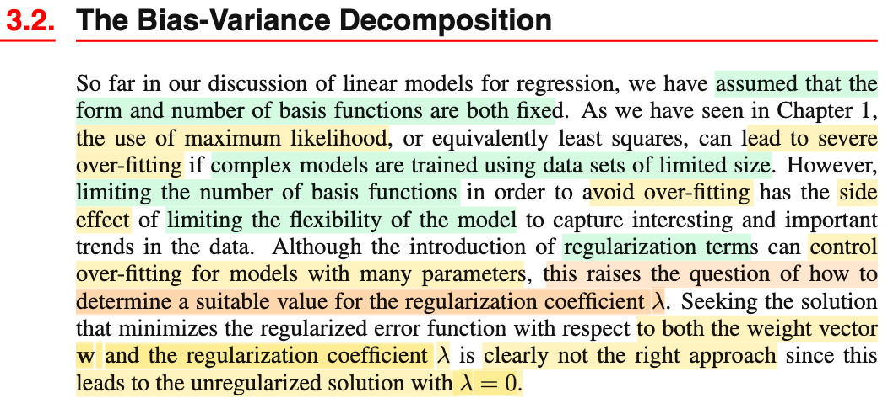</kbd>

> [!NOTE]
> Phần này đại ý là vầy: Mấy phần trước cũng như liên hệ với bên Casella mình đã thấy nhược điểm của MLE khi data ít, nó sẽ đại khái là cho ra những kết quả cực đoan, và trong bối cảnh machine learning chính là thứ ta gọi là overfit - khi ta dùng model phức tạp với ít data.
>
>
>
> Rồi ông có nhắc đến việc ta thảo luận về linear model - có dạng cũng như số basis function không đổi. Ý này là sao? → Tức là ta đang nói về linear model có dạng y(**x**, **w**) = **w**TΦ(**x**) với w = (w0, w1, ...wM-1)T và Φ(**x**) = (1, Φ1(**x**), ...ΦM-1(**x**))T, đương nhiêi với M là giá trị cố định nào đó, thì ta có một giá trị cố định các tham số cũng như các basis function. Ý muốn và ta nhớ, đây vẫn là hàm tuyến tính đối với **w** dù cho nhờ hàm basis, y trở thành hàm phi tuyến đối với **x**, và do đó vẫn gọi là linear model là vậy.
>
>
>
> Thế thì tại sao lại nhắc đến số basis function? ⇨ Mình hiểu rằng, số basis function sẽ quyết định độ phức tạp của mô hình, vì số basis function càng lớn, và basis function lại mang ý nghĩa là tạo các non-linear feature, những feature mới tạo thành bằng cách kết hợp phi tuyến các feature gốc, sẽ giúp mô hình tăng độ phức tạp, từ đó có thể đủ năng lực để capture các pattern của data.
>
>
>
> Như vậy quay lại vấn đề mle approach, nếu dùng complex model, và trong trường hợp ít data, sẽ dẫn đến overfit. Thì ta có thể nghĩ đến giảm số basis function lại để giảm độ complex của mô hình lại. Nhưng điều này lại có thể dẫn đến là, mô hình không đủ complex để capture các pattern trong data (mà mình biết gọi là underfit)
>
>
>
> Từ đó, để giải quyết, ta mới có công cụ: regularization term, add thêm vào error function một regularization term giúp tạo thêm một objective nữa: khống chế độ lớn của parameter bên cạnh main objective là giảm error function. Và sự tương quan giữa mức độ quan trọng của hai objective sẽ được kiểm soát bởi một hệ số, ví dụ λ (gọi là regularization hyperparameter). Với regularization, ta có thể dùng complex model, để train một bài toán ít data mà không sợ overfit.
>
>
>
> Nhưng cách này lại phát sinh vấn đề: chọn giá trị của regularization coefficient. Như vậy có thể thấy là, nó vẫn chưa giải quyết hoàn toán vấn đề đau đầu.
>
>
>
> Và nói thêm, nếu ta nghĩ đến việc training mô hình cùng lúc với cả weight và λ thì sẽ dẫn đến λ = 0. Vì sao? 
>
>
>
> Đơn giản là vì λ vốn có ràng buộc ≥ 0, và để minimize E_D(**w**) + λE_W(**w**) với E_W(**w**) ≥ 0 thì đây là hàm tuyến tính theo λ, E_D(**w**) + λE_W(**w**), có dạng a λ + b, và với λ ≥ 0, thì và a = E_W(**w**) cũng > 0 thì hàm này cực tiểu khi λ = biên của \[0, ∞), tức λ = 0.

> [!TIP]
> **🤖 AI Feedback** — ✅ Score: **98/100**
>
> Bài ghi chú thể hiện sự hiểu biết sâu sắc về các khái niệm, giải thích chính xác nội dung văn bản và cung cấp những phân tích bổ sung tuyệt vời, đặc biệt là lý do tại sao λ=0 khi tối ưu hóa đồng thời. Đây là một bài phân tích rất chi tiết và chính xác.

 

## Bias-Variance Trade-off Overview

<kbd>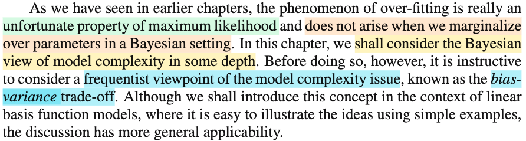</kbd>

> [!NOTE]
> Thế thì đại khái là, gs nói vấn đề overfit là nhược điểm của maximum likelihood, chứ nếu làm **theo Bayesian approach, thì ta sẽ không bị vấn đề này** (đã nói nhiều về cái này, cũng như trong Casella cũng đã nói, nguyên nhân ngắn gọn là vì Bayesian approach, ta cói paramter là random variable, và từ đó đặt ra prior distribution của parameter π(θ) và chính cái này giúp cho khi ta đi xây dựng posterior π(**x**|θ) cũng như đi maximum posterior cũng chính là maximum L(θ|**x**) π(θ), thì prior distribution sẽ giúp cho kết quả không bị extreme khi data ít như cách làm của mle (chỉ maximum L(θ|**x**)).
>
>
>
>  Cho nên trong chapter này ta sẽ bàn sâu hơn về Bayesian approach. Tuy nhiên trước đó, gs sẽ dẫn dắt ta về một **góc nhìn về vấn đề overfit trong phạm vi vẫn thuộc trường phái cổ điển**: **Bias Variance trade-off**. Và cái này sẽ mở rộng cả các phạm vi khác chứ không riêng gì bài toán linear basis function model

 

### Optimal Prediction with Squared Loss

<kbd>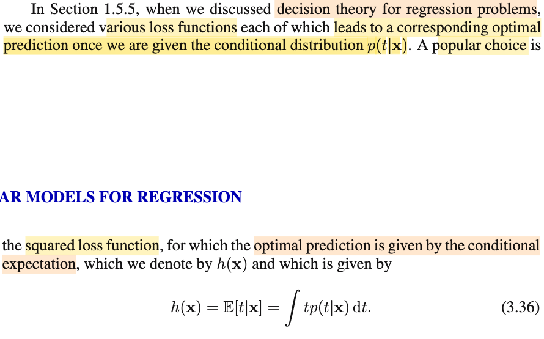</kbd>

> [!NOTE]
> Rồi, đoạn này đại khái là, nhắc lại một điểm đã nói trước đây: rằng, giả sử ta đã có predictive distribution, tức f(t|**x**). Thì dự đoán tối ưu cho giá trị của T sẽ là gì.
>
>
>
> Mình sẽ ôn lại nhanh chỗ này:
>
>
>
> Bài toán này nếu nói rõ ra thì là thế này: Nó giống y như cái vụ đưa ra point estimator (của θ) theo cách tiếp cận Bayesian (Bayes estimator) vậy.
>
>
>
> Đầu đuôi câu chuyện là: Với Bayesian, ta coi θ như random variable. Mà đã là random variable, thì nó có probability distribution. Thế thì, marginal distribution của θ, mà với θ, thì người ta gọi là prior distribution π(θ), là thứ mà ta sẽ chọn, dựa vào kinh nghiệm nào đó, nhằm phản ánh một hiểu biết nào đó của ta về θ. Để rồi dùng Bayes rule ta xây dựng π(θ|**x**) = f(**x**|θ) π(θ) / f(**x**), gọi là posterior distribution. Thế thì, vấn đề là, đây vẫn là một distribution, trong khi có thể ta cần đưa ra một point estimation cho θ thì sao? mà theo định nghĩa, point estimator là một hàm số của sample W(**X**), nên yêu cầu là ta cần rút ra một hàm số từ cái distribution này.
>
>
>
> Và đây chính là lúc ta cần viện tới công cụ thuộc lĩnh vực decision theory: Giúp đưa ra quyết định trong điều kiện không chắc chắn (making decision under uncertainty): Tính không chắc chắn phản ánh bởi một probability distribution π(θ|**x**), và ra quyết định ở đây chính là đưa ra một ước lượng điểm W(**X**) cho θ từ đó.
>
>
>
> Và trong decision theory, ta sẽ cần lựa chọn loss function: Là hàm số của estimator: L(W(**X**), θ), phản ánh một cách thức nào đó mà ta trừng phạt các sai sót. Phổ biến được dùng là square error loss (W(**X**) - θ)^2. và absolute error loss |W(**X**) - θ|.
>
>
>
> Cần hiểu điều quan trọng này: Giả sử với θ fixed, thì L(W(**x**), θ) chỉ phản ánh error của W(**x**) với một giá trị **x** cụ thể. Cho nên ta sẽ đi tính trung bình error trên mọi possible value của **X**. Hoặc nhìn theo cách khác, với θ fixed nào đó, thì L(W(**X**), θ) vẫn là môt random variable có được bằng cách áp hàm L(W(**u**), θ) lên random variable **X**. Và vì vậy, ta có quyền nói về kì vọng / mean / expected value của nó. E\[L(W(**X**), θ)\], và vì distribution của L(W(**X**), θ) sẽ phụ thuộc θ do bản chất là **X** \~ f(**x**|θ), nên ta ghi là E\_θ\[L(W(**X**), θ)\], để thể hiện, đây sẽ là hàm số phụ thuộc θ.
>
>
>
> Và cái này chính là định nghĩa của risk function: R(W(**X**), θ) = E\_θ\[L(W(**X**), θ)\], nếu dùng LOTUS, ta sẽ dễ hiểu nó là: ∫L(W(**x**), θ) f(**x**|θ) d**x**.
>
>
>
> Tới đây, nếu ta đi thêm một bước để bước chân qua Bayesian approach, coi θ như random variable, thì cái risk function trên vẫn sẽ là một random variable (có được bởi áp hàm g(θ) = E\_θ\[L(W(**X**), θ)\], lên random variable θ). Để rồi nếu ta lấy expected value của nó, ta sẽ có một con số cố định cuối cùng, không còn phụ thuộc ai. Đó chính là Bayes risk:
>
>
>
> Bayes risk = E{E\_θ\[L(W(**X**), θ)\]} = ∫ E\_θ\[L(W(**X**), θ)\] π(θ) dθ
>
>
>
> Nếu biến đổi tí xíu, dùng Bayes rule: .. = ∫ \[∫ L(W(**x**), θ)\] f(**x**|θ) d**x** π(θ)\] dθ
>
>
>
> = ∫ \[∫ L(W(**x**), θ)\] f(**x**|θ)π(θ) d**x**\] dθ
>
>
>
> = ∫ \[∫ L(W(**x**), θ)\] π(θ|**x**)f(**x**) d**x**\] dθ (thay f(**x**|θ)π(θ) bởi π(θ|**x**)f(**x**))
>
>
>
> = ∫ \[∫ L(W(**x**), θ)\] π(θ|**x**) dθ\] f(**x**)d**x** (tính tích phân theo θ trước)
>
>
>
> thì lúc này, ∫ L(W(**x**), θ)\] π(θ|**x**) dθ chính là E\[L(W(**x**), θ)\] với θ \~ π(θ|**x**), tức là, với giá trị nào đó của **X** = **x**, ta có θ \~ posterior π(**x**|θ) và tính kì vọng của L(W(**x**), θ) với θ có distribution này. Thì cái này gọi là **posterior expected loss**.
>
>
>
> Rồi, với tất cả các định nghĩa trên, giờ ta mới đi quay lại nói về việc tìm point estimator của θ sao cho tối ưu.
>
>
>
> Nói bài toán Bayesian trước: θ là random variable, thì ta sẽ đi tìm W(**X**) minimize Bayes risk, và vì Bayes risk là tích phân over mọi **x** của posterior expected risk, nên bài toán này tương đương đi minimize posterior expected risk:
>
>
>
> minimize_W ∫ L(W(**x**), θ)\] π(θ|**x**) dθ
>
>
>
> ∫ L(W(**x**), θ)\] π(θ|**x**) dθ = ∫ \[W(**x**) - θ\]^2 π(θ|**x**) dθ
>
>
>
>  ∂/∂W \[∫ \[W(**x**) - θ\]^2 π(θ|**x**) dθ\] = ∫ { ∂/∂W \[W(**x**) - θ\]^2 } π(θ|**x**) dθ
>
> = ∫ 2 \[W(**x**) - θ\] π(θ|**x**) dθ
>
>
>
> = 2 ∫\[W(**x**) - θ\] π(θ|**x**) dθ
>
>
>
> First order condition: 2 ∫\[W(**x**) - θ\] π(θ|**x**) dθ = 0
>
>
>
> ⇔ ∫\[W(**x**)π(θ|**x**) dθ - ∫θπ(θ|**x**) dθ = 0
>
>
>
> ⇔ ∫W(**x**)π(θ|**x**) dθ = ∫θπ(θ|**x**) dθ
>
>
>
> ⇔ W(**x**) ∫π(θ|**x**) dθ = E\[θ\] (θ \~ π(θ|**x**))
>
>
>
> ⇔ W(**x**) = E\[θ|**x**\] (θ \~ π(θ|**x**))
>
>
>
> → Khi **X** = **x**, và θ \~ f(θ|**x**) thì W(**x**) khiến minimize posterior expected loss với chính là mean của posterior.
>
> \
> Vậy nên W(**X**) = E\[θ|**X**\] chính là point estimator của θ với θ \~ f(θ|**X**) giúp minimize Bayes risk với square error loss.
>
>
>
> ---
>
>
>
> Nếu θ là fixed unknown, tức theo trường phái cổ điển, thì ta sẽ giải bài toán minimize risk function:
>
>
>
> minimize_W E\_θ\[L(W(**X**), θ)\] = ∫ L(W(**x**), θ) f(**x**|θ) d**x**, = (nếu dùng square error loss) = ∫ \[W(**x**) - θ\]^2 f(**x**|θ) d**x**
>
>
>
> Và cái này, ∫ \[W(**x**) - θ\]^2 f(**x**|θ) d**x**, tức E\_θ\[(W(**X**) - θ)^2\], ta nhớ chính là định nghĩa của MSE, để rồi ta sẽ phân tích nó thành Bias(W(**X**)^2 + Var(W(**X**). Từ đó đi tìm W(**X**) giúp giảm cái này, dẫn tới các cách tiếp cận như xét trong các unbiased estiamtor, xem cái nào có Variance nhỏ nhất, và variance thế nào thì nhỏ nhất lại dẫn đến công cụ là Cramer Rao Lower Bound,...
>
>
>
> ---
>
>
>
> Với chừng đó ôn tập, mình quay lại cái bài toán trong sách này, là đưa ra predict tối ưu của T khi có T \~ f(t|**x**)
>
>
>
> Thì cái này y chang việc có π(θ|**x**), và cần estimate tối ưu cho θ thôi:
>
>
>
> Ta cũng đi giải bài toán: minimize_h(**x**) Risk function = ∫ L(h(**x**), t) f(t|**x**) dt = ∫(h(**x**) - t)^2 f(t|**x**) dt
>
>
>
>  ∂/∂y \[∫(h(**x**) - t)^2 f(t|**x**) dt\] = ∫ \[∂/∂y \[(h(**x**) - t)^2\] f(t|**x**) dt
>
>
>
> = ∫ 2(h(**x**) - t) f(t|**x**) dt
>
>
>
> = 2∫ (h(**x**) - t) f(t|**x**) dt
>
>
>
> Fisrt order optimality condition: 2∫ (h(**x**) - t) f(t|**x**) dt = 0
>
>
>
> ⇔ ∫(h(**x**) - t) f(t|**x**) dt = 0
>
>
>
> ⇔ ∫h(**x**)f(t|**x**) dt - ∫t f(t|**x**) dt = 0
>
>
>
> ⇔ h(**x**) ∫f(t|**x**) dt = E\[T|**x**\]
>
>
>
> ⇔ h(**x**) = E\[T|**x**\]
>
>
>
> Như vậy, optimal point estimator cho T khi T \~ f(t|**x**) chính là posterior mean: E\[T|**x**\] → Đây chính giúp ta hoàn toàn hiểu 3.36.

> [!TIP]
> **🤖 AI Feedback** — ✅ Score: **98/100**
>
> Bài giải thích cực kỳ chi tiết và sâu sắc, vượt xa nội dung ảnh để cung cấp một nền tảng vững chắc về lý thuyết quyết định và ước lượng Bayes. Mặc dù rất toàn diện, có thể tóm tắt các phần ôn tập một cách ngắn gọn hơn nếu mục tiêu là chỉ tập trung vào giải thích công thức 3.36.

 

#### Expected Squared Loss Decomposition

<kbd>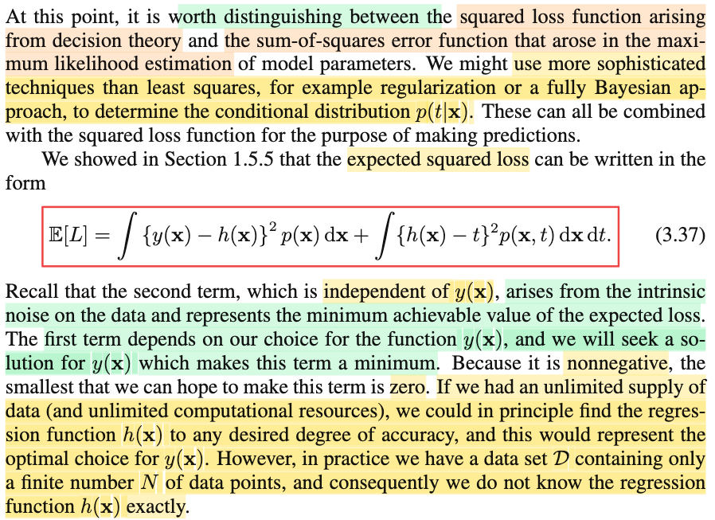</kbd>

> [!NOTE]
> Rồi, tiếp theo chỗ này dễ lú, nên cần giải thích rõ khi ông nói ta cần phải phân biệt có hai loại squared loss, trong rất giống nhau, một cái là trong bối cảnh decision theory và còn lại là trong bài toán MLE. Là sao ta?
>
>
>
> Hiểu đại khái vầy: Nói đến decision theory, là vì, như note trước ta vừa mới làm: Rằng, trong bài toán này, khi ta làm theo probabilistic perspective, coi T như random variable, có predictive distribution f(t|**x**) thì câu hỏi đặt ra là, khi đã có f(t|**x**) rồi, thì nên lấy giá trị bao nhiêu để dự đoán (vì yêu cầu của bài toán cuối cùng vẫn là cho **x**, dự đoán t, chứ không phải là tính ra f(t|**x**)). Và đối mặt với câu hỏi này, ta cần đến decision theory giúp đỡ, nó sẽ cho ta cách làm như sau: Ta sẽ chọn loss function: L(T, h(**x**)), ví dụ square error loss, = (T - h(**x**))^2, đây sẽ là random variable (hàm của T). Và tính risk function, mang ý nghĩa là average của loss over all T \~ f(t|**x**):
>
>
>
> Risk function = E\[T - h(**x**)\] = ∫(t - h(**x**))^2 f(t|**x**)dt
>
>
>
> Và đi tìm h để mininimize cái risk function thì kết quả là h(**x**) = E\[T|**x**\].
>
>
>
> Đó là nói về square loss function trong decision theory, nói ngắn gọn, nó giúp ta đưa ra optimal point estimation của T với T \~ f(t|**x**).
>
>
>
> Thế còn sum squared error trong MLE?
>
>
>
> Là vầy: Nói về MLE, tức là ta nói về bài toán tìm point estimation cho PARAMETER θ: tìm estimator, là hàm theo data W(**X**, **t**) sao cho maximize L(θ|**X**, **t**) (**X**, **t** ở đây là observed data: **X** = matrix tạo bởi các vector **x**1, ...**x**N và **t** là vector các observed data t1, t2,...tN và có thể gọi chung là D (data) cho gọn) và θ đại diện cho tất cả parameter nói chung.
>
>
>
> Trong bài toán cụ thể ở đây, nếu ta dùng linear model dự đoán cho T \~ normal(y(**w**,**x**), 1/β) thì θ chính là (**w**, β). Và bài toán để giải MLE của (w, β) sẽ là:
>
>
>
> maximize (over **w**, β) L(**w**, β|**X**,**t**) = f(**t**|**w**, β, **X**).
>
>
>
> nhờ tính independent của T1,....Tn nên f(**t**|**w**, β, **X**) = Πi=1:N normal(**t**i|**w**, β, **x**i) và dùng hàm log là hàm monotone để chuyển thành bài toán tối ưu tương đương:
>
>
>
> maximize (over **w**, β) ln L(**w**, β|**X**,**t**) = ln {Πi=1:N normal(**t**i|y(**w**, **x**i),β)}
>
>
>
> Xét hàm objective, thay pdf normal vào:
>
>
>
> ln {Πi=1:N normal(**t**i|**w**, β, **x**i) = ln {Πi=1:N \[1/√2π(1/β) exp{-(ti - y(**w**,**x**i))^2/2(1/β)}\]}
>
>
>
> = ln {Πi=1:N \[1/√2π(1/β)\]} + ln {Πi=1:N exp{-(ti - y(**w**,**x**i))^2/2(1/β)}\]}
>
>
>
> Tới đây ta có thể giải theo **w** trước, tức là coi β như constant, từ đó chuyển thành bài toán tương đương tiếp theo bằng cách bỏ constant:
>
>
>
> maximize (over **w**) ln {Πi=1:N exp{-(ti - y(**w**,**x**i))^2/2(1/β)}\]}
>
>
>
> ⇔ maximize over **w** Σi=1:N ln {exp{-(ti - y(**w**,**x**i))^2/2(1/β)}\]}
>
>
>
> ⇔ maximize over **w** Σi=1:N \[-(ti - y(**w**,**x**i))^2/2(1/β)\]
>
>
>
> ⇔ maximize over **w** Σi=1:N \[(-β/2)(ti - y(**w**,**x**i))^2\]
>
>
>
> ⇔ maximize over **w** (-β/2) Σi=1:N \[(ti - y(**w**,**x**i))^2\]
>
>
>
> ⇔ minimize over **w** (1/2) Σi=1:N \[(ti - y(**w**,**x**i))^2\]
>
>
>
> Và đây chính là bài toán mininize hàm sum square error function. Giải thích cho ý gs nói sum-squares error function xuất hiện (arose) in MLE.
>
>
>
> Nhưng cái 3.37, lại xuất phát từ 1.5.5:
>
>
>
> E\[L\] = ∫∫L(t, y(**x**)) f(t,**x**) d**x** dt
>
>
>
> mà để hiểu công thức này thì phải thấy cả T và **X** đều là random variable:
>
>
>
> Và Loss = L(t, y(**x**)) = \[t - y(**x**)\]^2, thì L(**T**, y(**X**)) cũng là random variable, do đó có thể lấy kì vọng, và theo LOTUS:
>
>
>
> E\[L\] = ∫∫L(t, y(**x**)) f(t,**x**) d**x** dt
>
>
>
> = ∫∫(t - y(**x**))^2 f(t|**x**)f(**x**) d**x** dt (Bayes rule: f(t,**x**) = f(t|**x**)f(**x**))
>
>
>
> = ∫∫(y(**x**) - t)^2 f(t|**x**)f(**x**) d**x** dt
>
>
>
> cộng thêm và trừ bớt cho h(**x**) = E\[t|**x**\]
>
>
>
> = ∫∫(y(**x**) - h(**x**) + h(**x**) - t)^2 f(t|**x**)f(**x**) d**x** dt
>
>
>
> = ∫∫{\[y(**x**) - h(**x**)\]^2 +2\[y(**x**) - h(**x**)\]\[h(**x**) - t\] + \[h(**x**) - t\]^2} f(t|**x**)f(**x**) d**x**dt
>
>
>
> = ∫∫\[y(**x**) - h(**x**)\]^2 f(t|**x**) f(**x**) d**x** dt + 2∫∫\[y(**x**) - h(**x**)\]\[h(**x**) - t\]f(t|**x**) f(**x**) d**x**dt + ∫∫\[h(**x**) - t\]^2} f(t|**x**) f(**x**) d**x**dt
>
>
>
>  Xét term thứ 2: 2∫∫\[y(**x**) - h(**x**)\]\[h(**x**) - t\]f(t|**x**) f(**x**) d**x**dt
>
>
>
> Đổi chỗ d**x**, dt, tính tích phân theo t trước (1802 đã học gặp tích phân kép∫f(x,y)dxdy, thì tính tích phân theo cái nào trước cũng được vì ở đây range đều là toàn bộ mặt phẳng)
>
>
>
> = 2∫ \[∫(y(**x**) - h(**x**))(h(**x**) - t)f(t|**x**)dt\] f(**x**)d**x**
>
>
>
> Và vì đang tính tích phân theo t, ta đưa (y(**x**) - h(**x**)) không phụ thuộc t ra:
>
>
>
> = 2(y(**x**) - h(**x**)) ∫ \[∫(h(**x**) - t)f(t|**x**)dt\] f(**x**)d**x**
>
>
>
> Xét ∫(h(**x**) - t)f(t|**x**)dt, nó chính là E\[h(**x**) - T|**x**\] theo linearity = E\[h(**x**)\] - E\[T|**x**\] = E\[T|**x**\] - E\[T|**x**\] = 0.
>
>
>
> Vậy term thứ 2 = 0. Ta chỉ còn term 1, 3:
>
>
>
> ∫∫\[y(**x**) - h(**x**)\]^2 f(t|**x**) f(**x**) d**x** dt + ∫∫\[h(**x**) - t\]^2 f(t|**x**) f(**x**) d**x**dt
>
>
>
> Và đều chuyển thành tích phân của t trước, ta sẽ thấy nó là:
>
>
>
> = ∫(y(**x**) - h(**x**))^2 \[∫f(t|**x**)dt\] f(**x**)d**x** + ∫ \[∫\[h(**x**) - t\]^2 f(t|**x**)dt\] f(**x**)d**x** 
>
>
>
> ∫f(t|**x**)dt = 1 vì tính valid của pdf
>
>
>
> ∫\[h(**x**) - t\]^2 f(t|**x**)dt = E\[(h(**x**) - T)^2|**x**\]
>
>
>
> = ∫(y(**x**) - h(**x**))^2 f(**x**)d**x** + ∫ \[∫\[h(**x**) - t\]^2 f(t|**x**)dt\] f(**x**)d**x** 
>
>
>
> Đưa ∫ \[∫\[h(**x**) - t\]^2 f(t|**x**)dt\] f(**x**)d**x** trở lại thành ∫∫\[h(**x**) - t\]^2 f(t,**x**)d**x** dt
>
>
>
> Kết qủa ta có ∫(y(**x**) - h(**x**))^2 f(**x**)d**x** + ∫∫\[h(**x**) - t\]^2 f(t,**x**)d**x** dt → Đây chính là 3.37
>
>
>
> Dừng chút để nhận định lạ: Có nghĩa là square error xuất hiện ở 3 case khác nhau:
>
>
>
> Trong case 1: Khi có T \~ f(t|**x**), thì h(**x**) = E\[T|**x**\] sẽ minimize E\[L(h(**x**), T)\] với T\~f(**x**|t), L(h(**x**), T) = (h(**x**) - T)^2
>
>
>
> Trong case 2: Khi assume noise ε \~ n(0, 1/β) cũng là T \~ n(y(**w**,**x**), 1/β), thì **w**ML chính là minimizer của ln L(**w**|**X**,**t**,β) cũng là minimizer của (1/2) Σi=1:N \[y(**w**, **x**i) - ti\]^2, là sum squared error.
>
>
>
> Trong case 3: Khi ta xét Loss của bài toàn regression: L(y(**X**), T) = \[y(**X**) - T\]^2, là một random variable (hàm của random variable **X** và T), và xét kì vọng của nó: E\[L\] = ∫∫ L(y(**x**), t) f(**x**, t) d**x** dt và triển khai ra ta có E\[L\] = ∫(y(**x**) - h(**x**))^2 f(**x**)d**x** + ∫∫\[h(**x**) - t\]^2 f(t,**x**)d**x** dt
>
>
>
> Điểm giống nhau của 1, và 3: Đều là trong bối cảnh decision theory, khi ta xét expected loss. Để rồi trong 1), minimize expected loss thì ta sẽ có h(**x**) = E\[T|**x**).
>
>
>
> Còn trong 3, ta cũng muốn (tìm y(**x**) để minimize E\[L\] thì ta sẽ thấy bài toán sẽ ≡ mininimize ∫(y(**x**) - h(**x**))^2 f(**x**)d**x** và kết quả sẽ cho solution y(**x**) = h(**x**)(tức = E\[T|**x**\]), cũng chính là quay lại bài toán nếu ta có predictive distribution: f(t|**x**) thì point estimator tối ưu cho T chính là E\[T|**x**\].
>
>
>
> Và ý chính gs Bishop muốn nói: Đi tìm f(t|**x**) (chính là ví dụ như khi mình tìm **w**ML) thì không nhất thiết ta phải dùng MLE, mà có thể dùng các các tiếp cận khác như fully Bayesian. Còn khi đã có f(t|**x**), thì theo decision theory, point estimation tối ưu cho T khi dùng squared loss là E\[T|**x**\]
>
>
>
> ---
>
>
>
> Tiếp tục, đoạn ghi chú màu xanh cũng là nói ý trên: Để tìm y(**x**) minimize E\[L\] thì chỉ tương đương tìm y(**x**) minimize term 1, vì term 2 không phụ thuộc y, và vì nó không âm nên mininimize khi y(**x**) = h(**x**) như nói trên.
>
>
>
> Vậy vì sao ông nói term 2 xuất phát từ noise nội tại (intrisic) và đại diện cho phần ko thể giảm được nữa, cũng là cái nhỏ nhất mà E\[L\] có thể đạt được (ý là với y\*(**x**), tối ưu) thì chỉ có thể giúp term 1 bằng 0, và E\[L} vẫn còn term 2?
>
>
>
> Là vì: xem xét, ∫∫\[h(**x**) - t\]^2 f(t,**x**)d**x** dt, thay h(x) = E\[T|**x**\]:
>
>
>
> = ∫∫\[t - E\[T|**x**\]\]^2 f(t,**x**) d**x** dt
>
>
>
> = ∫∫\[t - E\[T|**x**\]\]^2 f(t|**x**) f(**x**) d**x** dt
>
>
>
> = ∫∫\[t - E\[T|**x**\]\]^2 f(t|**x**) dt f(**x**) d**x**
>
>
>
> Xét riêng cụm này: ∫\[t - E\[T|**x**\]\]^2 f(t|**x**) dt, nó chính là Var\[T|**x**\], tức Var(T) với T \~ f(T|**x**). Và như vậy:
>
>
>
> ∫∫\[t - E\[T|**x**\]\]^2 f(t|**x**) dt f(**x**) d**x** = ∫ Var\[T|**x**\] f(**x**) d**x**
>
>
>
> và như vậy, nó chính là đến từ **mức biến động nội tại của data**, không phải sao? vì bản chất là T **đã có mức biến động nội tại nào đó**, chính là **thể hiện thông qua variance** của f(t|**x**), mà trong bài toán đi tìm y(**x**) tối ưu, ta sẽ không để can thiệp làm giảm cái phần loss do variance của T này. Ví dụ nôm na là: cho trước x, thì T có distribution n(μ, σ^2), thì khi y(x, **w**) = μ = E\[T|**x**) thì ta đã làm tốt nhất rồi (còn lại cái phần loss do variance của T thì chịu, không thêm làm gì khác).
>
>
>
> ---
>
>
>
> Và ở đoạn cuối cùng, mình hiểu ý gs Bishop như vầy: Xét cái term 1, là cái thứ ta có thể minimize được bằng cách tìm ra y(**x**) tốt nhất, và tốt nhất ở đây chính là h(**x**) = E\[T|**x**\]. Có nghĩa là, ví dụ như dùng linear modal đi, y(**x**) = **w**T Φ(**x**), thì nếu ta có thể tìm ra **w**\* sao cho **với mọi** **x thì w**\*TΦ(**x**) = E\[T|**x**\], thì ta sẽ có term 1 = 0.
>
>
>
> Tuy nhiên, vấn đề là, ta chỉ có thể làm vậy nếu như có **vô hạn data** và **vô hạn sức mạnh tính toán**, trong khi đó, data ta có chỉ là hữu hạn, sức mạnh tính toán cũng vậy. Nên thực tế sẽ rất khó để tìm ra chính xác hành vi của hàm số h(**x**) = E\[T|**x**\], cũng chính là nói: rất khó để mô phỏng chính xác hàm h(**x**) = E\[T|**x**\]. Dẫn tới là term 1 sẽ luôn &gt; 0.

> [!TIP]
> **🤖 AI Feedback** — ✅ Score: **100/100**
>
> Bài ghi chú này cực kỳ chính xác và chi tiết, thể hiện sự hiểu biết sâu sắc về các khái niệm phức tạp về squared loss trong lý thuyết quyết định, MLE và phân tách kỳ vọng mất mát. Phần giải thích các công thức và ý nghĩa của từng thành phần đều xuất sắc, đặc biệt là cách bạn làm rõ sự khác biệt và mối liên hệ giữa các trường hợp. Bạn cũng giải thích đúng tác động của dữ liệu hữu hạn lên việc tìm hàm hồi quy tối ưu. Đây là một phân tích mẫu mực.

**🔗 See also:** [Optimal Least Squares Predictor](./15_decision_theory.md#node-3ve6hfk) · [Expected Squared Loss Decomposition](#node-w19nneq)

 

##### The Bias-Variance Decomposition

<kbd>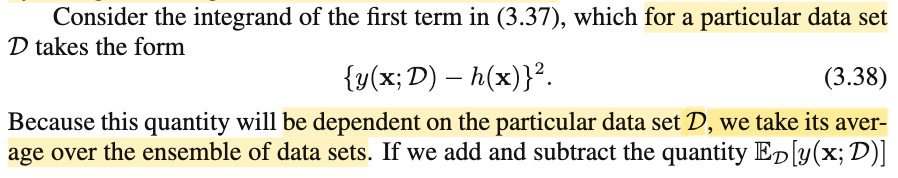</kbd>

<kbd>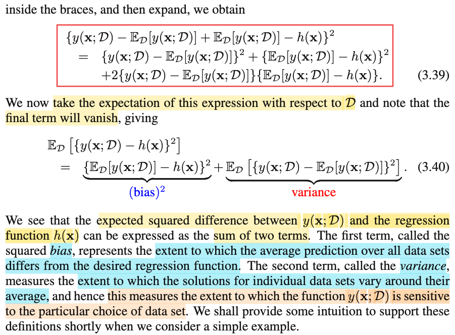</kbd>

> [!NOTE]
> Thế thì, ở trên ta đã hiểu vì sao có công thức 3.37 ∫(y(**x**) - h(**x**))^2 f(**x**)d**x** + ∫∫\[h(**x**) - t\]^2 f(t,**x**)d**x** dt.
>
>
>
> Tập trung vào phần \[y(**x**) - h(**x**)\]^2 trong tích phân của term đầu tiên: \[y(**x**) - h(**x**)\]^2
>
>
>
> Đại ý hiểu phần này như sau:
>
>
>
> Đầu tiên phải xác định y(**x**) là cái gì?
>
>
>
> → y(**x**) là function dự đoán t từ input **x**. Một ví dụ cụ thể của y(**x**) là y(**x**) = **w**TΦ(**x**).
>
>
>
> Và trong ví dụ cụ thể này thì **w**, là giá trị tham số của linear modal, mà ta có thể dùng data để inference: ví dụ MLE của **w**: **w**ML (chỗ này tuy hơi cấn, vì trong bối cảnh thống kê suy diễn (Casella), estimator thường là estimator của population parameter, ví dụ X \~ f(x|θ), thì MLE là một cách tiếp cận để estimate θ, còn ở đây w không phải là population parameter. Hoặc mình có thể hiểu khác một chút, bằng việc dùng linear modal, mình đang assume quan hệ của T và **X** chi phối bởi một quy luật tuyến tính có tham số là **w**, và ta sẽ tính MLE của **w**.)
>
>
>
> Khi đó **w**ML = argmax L(**w**|D), nên ta có thể ghi là **w**(D) và do đó y cũng phụ thuộc dataset cụ thể D: y(**x**, **w**(D)), hay y(**x**, D)
>
>
>
> Và trên cơ sở là y là hàm phụ thuộc D, và dataset D, ta cũng có thể coi như một random quantity - mà thật sự trong bối cảnh thống kê thì dataset chỉ là một **random sample**: (**X**1, T1), (**X**1, T2),....(**X**N, **T**N) và một observation là (**x**1, t1), (**x**2, t2), ...(**x**N, tN), làm thành dataset D = (**matrix** **X**, **t**).
>
>
>
> Do đó, vì D là random variable, nên y(**x**, D) sẽ mang ý nghĩa như function y(**x**, d) apply lên D, nên cũng được một random variable (**x** cố định), và như vậy, ta được quyền lấy kì vọng: E\[y(**x**, D)\].
>
>
>
> Chỗ này gs kí hiệu là E_D\[y(**x**, D)\], nhưng mình nghĩ, đã average over mọi D thì kết quả không còn phụ thuộc D nữa, nó chỉ còn là hàm theo **x**. Nên phải hiểu đây là cách viết để diễn tả ý nhấn mạnh cái này là kì vọng của y(**x**, D), là random variable có được bởi một hàm của random variable D. Sở dĩ phải nói rõ, là vì trong thống kê, có khi ta gặp E\_θ\[f(**X**)\] và chữ θ ở dưới chân lại có nghĩa là đây là hàm theo θ, còn biến ngẫu nhiên mà ta đang lấy kì vọng là f(**X**).
>
>
>
> Thế thì quay lại \[y(**x**) - h(**x**)\]^2, ta cộng và trừ cho E\[y(**x**, D)\], đồng thời thể hiện y là hàm phụ thuộc thêm D:
>
>
>
> \[y(**x**, D) - h(**x**)\]^2 = \[y(**x**, D) - E\[y(**x**, D)\] + E\[y(**x**, D)\] - h(**x**)\]^2
>
>
>
> = {y(**x**, D) - E\[y(**x**, D)\]}^2 + {E\[y(**x**, D)\] - h(**x**)}^2 + 2{y(**x**, D) - E\[y(**x**, D)\]}{E\[y(**x**, D)\] - h(**x**)} → 3.39
>
>
>
> Tới đây, ta lấy kì vọng của \[y(**x**, D) - h(**x**)\]^2 (ta cũng xem nó cũng chỉ là function của D)
>
>
>
> E\[y(**x**, D) - h(**x**)\]^2 = E\[{y(**x**, D) - E\[y(**x**, D)\]}^2 + {E\[y(**x**, D)\] - h(**x**)}^2 + 2{y(**x**, D) - E\[y(**x**, D)\]}{E\[y(**x**, D)\] - h(**x**)}\]
>
>
>
> Dùng tính linearity của kì vọng
>
>
>
> = E\[{y(**x**, D) - E\[y(**x**, D)\]}^2\] + E\[{E\[y(**x**, D)\] - h(**x**)}^2\] + 2E\[{y(**x**, D) - E\[y(**x**, D)\]}{E\[y(**x**, D)\] - h(**x**)}\]\]
>
>
>
> Xét cái term thứ 3: 2E\[{y(**x**, D) - E\[y(**x**, D)\]}{E\[y(**x**, D)\] - h(**x**)}\], cần để ý E\[y(**x**, D)\], đã là fixed number, không còn là random variable, vì như đã nói ở trên, khi ta đã lấy trung bình của y(**x**, D) over mọi D thì không còn phụ thuộc D nữa. Do đó {E\[y(**x**, D)\] - h(**x**)} cũng là fixed number. Thành ra ta đưa ra ngoài:
>
>
>
> E\[{y(**x**, D) - E\[y(**x**, D)\]}{E\[y(**x**, D)\] - h(**x**)}\] = {E\[y(**x**, D)\] - h(**x**)} × E\[y(**x**, D) - E\[y(**x**, D)\]\]
>
>
>
> Rồi tiếp, E\[y(**x**, D) - E\[y(**x**, D)\]\] = E\[y(**x**, D)\] - E\[E\[y(**x**, D)\]\] = E\[y(**x**, D)\] - E\[y(**x**, D)\] = 0
>
>
>
> Vậy E\[y(**x**, D) - h(**x**)\]^2 = E\[{y(**x**, D) - E\[y(**x**, D)\]}^2\] + E\[{E\[y(**x**, D)\] - h(**x**)}^2\]
>
>
>
> Xét hai term này, term thứ 2:
>
>
>
> E\[{E\[y(**x**, D)\] - h(**x**)}^2\], again, cái cụm E\[y(**x**, D)\] - h(**x**) là fixed number, nên {E\[y(**x**, D)\] - h(**x**)}^2 cũng là fixed number do đó E\[{E\[y(**x**, D)\] - h(**x**)}^2\] = {E\[y(**x**, D)\] - h(**x**)}^2.
>
>
>
> Nhìn kĩ cái này, ta thấy nó là gì: {E\[y(**x**, D)\] - h(**x**)}^2, nó chính là bình phương distance của y(**x**, D) tới h(**x**), mà h(**x**) là mean của distrubition f(t|**x**), tức E\[T|**x**\] và người ta gọi E\[y(**x**, D)\] - h(**x**) là BIAS, để thành ra cái này là bình phương của Bias. (tí nữa mình sẽ liên hệ với kiến thức đã học trong Statistical Inference của Casella sẽ thấy cái này nó tương tự thôi)
>
>
>
> Còn cái term thứ nhất: E\[{y(**x**, D) - E\[y(**x**, D)\]}^2\]. Thì để dễ thấy nó là gì, chỉ cần ôn lại công thức Variance của random variance X: Var(X) = E\[X - EX\]^2. Vậy thì ở đây, như đã nói ở trên, y(**x**, D) là random variable. Thành ra theo công thức của variance thì E\[{y(**x**, D) - E\[y(**x**, D)\]}^2\] chính là Var\[y(**x**, D)\].
>
>
>
> Do đó, E\[y(**x**, D) - h(**x**)\]^2 = {E\[y(**x**, D)\] - h(**x**)}^2 + Var\[y(**x**, D)\] = bình phương bias + variance của y(**x**, D).
>
>
>
> ---
>
>
>
> Thế thì, mình sẽ liên hệ với những gì đã học trong Casella để thấy cái này không có gì lạ:
>
>
>
> Trong Casella, bối cảnh sẽ là, ta có random sample X = X1,...Xn iid \~ f(x|θ), và ta muốn đi xây dựng một funciton của sample W(**X**) để estimator của θ. Có nghĩa là, với một observed value của sample: **X** = **x**, ta sẽ co W(**x**) là môt estiamate cho giá trị của θ. Và để xây dựng một estimator tốt, thì ta có các cách tiếp cận như MLE, hay Bayes, hay Method of Moment.
>
>
>
> Vậy thì, để đánh giá (evaluate) chất lượng của một estimator, người ta đặt ra loss function:
>
>
>
> L(W(**X**), θ) là hàm dùng một công thức nào đó để đo sự khác biệt giữa estimator và θ. Mà một dạng phổ biến là square error function L(W(**X**), θ) = \[W(**X**) - θ\]^2.
>
>
>
> Dĩ nhiên, L(W(**x**), θ) mang ý nghĩa là, với một observed value cụ thể của **X**, = **x**, thì ta có bình phương sai số giữa estimator W(**x**) và θ, cho thấy một mức độ sai sót nào đó.
>
>
>
> Thế thì, để đánh giá nó cho mọi giá trị có thể có của **X**, ta sẽ lấy trung bình. Hoặc cũng có thể nhìn theo kiểu khác: Là L(W(**X**), θ) = \[W(**X**) - θ\]^2 cũng chỉ là random variable (vì là hàm của **X**) nên ta sẽ lấy average / mean / expected value của random variable này: E\[L(W(**X**), θ)\] = E\[\[W(**X**) - θ\]^2\]. Và cái này, người ta đặt là hàm MSE:
>
>
>
> MSE(W(**X**), θ) = E\[\[W(**X**) - θ\]^2\]
>
>
>
> Và có khi để nhấn mạnh đây là hàm theo θ (vì bản chất khi lấy kì vọng cái L(W(**X**), θ) - là random variable phụ thuộc **X**, với X có distribution phụ thuộc θ, nên tựu chung lại, đây là hàm phụ thuộc θ), người ta sẽ ghi là:
>
>
>
> MSE(W(**X**), θ) = E\_θ\[\[W(**X**) - θ\]^2\]
>
>
>
> (để rồi khi chuyển sang Bayesian, trong đó coi θ như random variable, thì cái MSE này lại là một random variable, và ta sẽ lại có thể lấy trung bình, chính là định nghĩa của Bayes risk)
>
>
>
> Rồi, thế thì quay lại phân tích cái MSE, mở cái bình phương ra, và dùng tính linearity của kì vọng, ta có:
>
>
>
> E\_θ\[\[W(**X**) - θ\]^2\] = E\_θ\[\[W(**X**)\]^2 - 2W(**X**)θ + θ^2\]
>
>
>
> = E\_θ\[\[W(**X**)\]^2\] - E\_θ\[2W(**X**)θ\] + E\_θ\[θ^2\]
>
>
>
> = E\_θ\[\[W(**X**)\]^2\] - 2θE\_θ\[W(**X**)\] + θ^2
>
>
>
> = E\_θ\[\[W(**X**)\]^2\] - {E\[W(**X**)\]}^2 + {E\[W(**X**)\]}^2 - 2θE\_θ\[W(**X**)\] + θ^2
>
>
>
> Tới đây E\_θ\[\[W(**X**)\]^2\] - {E\[W(**X**)\]}^2 chính là Var(W(**X**)
>
>
>
> và {E\[W(**X**)\]}^2 - 2θE\_θ\[W(**X**)\] + θ^2 chính là {E\[W(**X**)\] - θ}^2
>
>
>
> = Var(W(**X**) + {E\[W(**X**)\] - θ}^2
>
>
>
> và người ta cũng define hàm bias như sau: Bias(W(**X**), θ) = E\[W(**X**)\] - θ.
>
>
>
> vậy MSE = Var(W(**X**)) + (Bias(W(**X**))^2
>
>
>
> Như vậy, đối chiếu với những gì gs Bishop làm ở đây: Thì cơ bản cũng giống vậy: E{\[y(**x**,D) - h(**x**)\]^2} chính là tương đương với MSE.
>
>
>
> Chỉ khác là, trong Casella:
>
>
>
> MSE E\_θ\[\[W(**X**) - θ\]^2\] sẽ đo độ sai khác của W(**X**) là estimator của θ, so với θ
>
>
>
> còn ở đây,
>
>
>
> E{\[y(**x**,D) - h(**x**)\]^2} là MSE đo độ sai khác của prediction y(**x**, D) so với h(**x**) = E\[T|**x**\], là giá trị tối ưu mà ta nên dùng để predict cho T khi đã biết T \~ f(t|**x**)
>
>
>
> Để rồi, khi phân tích ra, thì nó đều gồm hai phần: bias^2 và variance.
>
>
>
> Với Casella, bias là hàm đo distance giữa kì vọng của estimator W(**X**) so với θ, để nếu như bias bằng 0, người ta gọi W(**X**) là một unbiased estimator của θ
>
>
>
> Còn ở đây, bias là hàm đo distance giữa kì vọng của y(**x**, D): E\[y(**x**, D)\] (mang ý nghĩa là tính trung bình y(**x**, D) qua mọi possible dataset D) và giá trị tối ưu nên dùng khi predict t: E\[T|**x**\].
>
>
>
> Hiểu như vậy, ta sẽ thấy cũng như khi thiết kế một estimator cho θ, dĩ nhiên ta muốn khi tính trung bình qua mọi possible value của **X** (tức E\[W(**X**)\]) thì ta sẽ ra ngay chóc giá trị thật của θ. Thì tương tự vậy, khi thiết kế một hàm dự đoán y(**x**, D) để dự đoán cho T có predictive distribution f(t|**x**), thì ta cũng muốn khi lấy trung bình mọi D, thì cũng ra y chóc giá trị tối ưu: E\[T|**x**\], mean của f(t|**x**). Và cái mong muốn rất logic này, được biện minh bởi việc đây chính là muốn giảm phần đóng góm bởi bias trong công thức MSE.
>
>
>
> Phần thứ hai muốn giảm, chính là giảm Variance của W(**X**) (trong Casella) và Var\[y(**x**, D)\] (trong Bishop). Và cũng rất logic, vì ta muốn cái hàm W(**X**) phải có sự biến động nhỏ. Và thậm chí nếu được, như trong chương 10 Casella đã học, ta muốn khi kích thước sample n tăng lên vô hạn, thì W(**X**) sẽ có phương sai tiệm cận đạt đúng phương sai nhỏ nhất quy định bởi Cramer Rao Lower Bound, khi đó W(**X**) sẽ được gọi là asymptotically efficient estimator. Tương tự vậy, ta cũng muốn khi dataset lớn vô cùng, thì y(**x**, D) sẽ có phương sai rất nhỏ.
>
>
>
> Và đoạn cuối gs cũng nói điều mình hiểu vừa rồi. Bias sẽ đo xem là khi ta lấy trung bình prediction y(**x**, D) trên mọi data D thì nó còn các h(**x**) bao nhiêu.
>
>
>
> Và khi Var(y(**x**, D) sẽ cho ta biết với các dataset khác nhau, thì giá trị dự đoán y(**x**, D) sẽ biến động nhiều hay ít thế nào, từ đó cho ta thấy rằng SỰ NHẠY CẢM CỦA PREDICTION DỰA TRÊN DATA

> [!TIP]
> **🤖 AI Feedback** — ✅ Score: **100/100**
>
> Đây là một phân tích xuất sắc, vừa chính xác từng bước theo tài liệu gốc, vừa đào sâu kiến thức bằng cách liên hệ chặt chẽ với các khái niệm trong thống kê suy diễn. Khả năng giải thích và kết nối kiến thức của bạn là rất ấn tượng.

 

- **Expected Squared Loss Decomposition**

<kbd>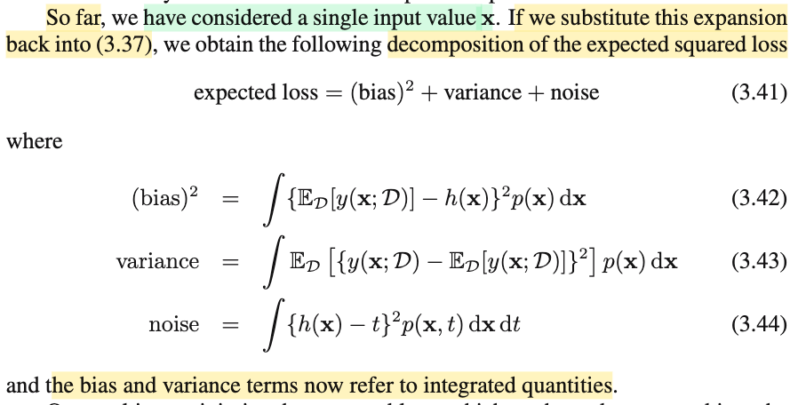</kbd>

> [!NOTE]
> Nãy giờ cái ta có là E{\[y(**x**,D) - h(**x**)\]^2}, expected value của \[y(**x**,D) - h(**x**)\]^2 với D là đối tượng random, và cái kì vọng này mang ý nghĩa là lấy trung bình qua mọi possible value của D.
>
>
>
> Nhưng đối với **x**, dĩ nhiên E{\[y(**x**,D) - h(**x**)\]^2} sẽ cũng là function theo **x**. Vậy thì quay lại cái 3.37:
>
>
>
> E\[L\] = ∫(y(**x**) - h(**x**))^2 f(**x**)d**x** + ∫∫\[h(**x**) - t\]^2 f(t,**x**)d**x** dt
>
>
>
> và thay (y(**x**) - h(**x**))^2 (mang ý nghĩa là square error tính bởi một bộ data cụ thể) bằng E{\[y(**x**,D) - h(**x**)\]^2} (mang ý nghĩa là square error tính trung bình bởi mọi bộ data có thể có), ta sẽ có:
>
>
>
> E\[L\] = ∫ E{\[y(**x**,D) - h(**x**)\]^2} f(**x**)d**x** + ∫∫\[h(**x**) - t\]^2 f(t,**x**)d**x** dt 
>
>
>
> Và E{\[y(**x**,D) - h(**x**)\]^2} = {E\[y(**x**, D)\] - h(**x**)}^2 + Var\[y(**x**, D)\]
>
>
>
> = ∫ \[ {E\[y(**x**, D)\] - h(**x**)}^2 + Var\[y(**x**, D)\] \] f(**x**)d**x** + ∫∫\[h(**x**) - t\]^2 f(t,**x**)d**x** dt 
>
>
>
> = ∫ {E\[y(**x**, D)\] - h(**x**)}^2 f(**x**)d**x** + ∫ Var\[y(**x**, D)\] f(**x**)d**x** + ∫∫\[h(**x**) - t\]^2 f(t,**x**)d**x** dt 
>
>
>
> Tới đây, xét từng term và ý nghĩa của chúng:
>
>
>
> i) ∫ {E\[y(**x**, D)\] - h(**x**)}^2 f(**x**)d**x**
>
>
>
> Như đã biết, {E\[y(**x**, D)\] - h(**x**)}^2 là bình phương của bias - thước đo cho thấy rằng khi tính trung bình y(**x**, D) trên mọi possible dataset D thì nó cách h(**x**) là bao nhiêu. Và cái này đang tính với một input **x** cụ thể. Nói cách khác, ta có thể hiểu nôm na bằng lời rằng: À với **x** cụ thể này, thì bias của hàm prediction y là bao nhiêu.
>
>
>
> Thế thì nếu bây giờ, ta tính trung bình của cái này trên mọi possible value của **x**, với trọng số là f(**x**) thì ta sẽ có cái tích phân trên. Hoặc nhìn theo cách khác: Nếu ta xem xét random variable **X**, thì {E\[y(**X**, D)\] - h(**x**)}^2 trở thành một random variable. Và ta tính expected value của random variable này: E\[{E\[y(**x**, D)\] - h(**x**)}^2\], theo công thức LOTUS đã học: khi có g(X) với X \~ f(x) thì Eg(X) = ∫g(x)f(x)dx, giúp ta có:
>
>
>
> E\[{E\[y(**x**, D)\] - h(**x**)}^2\] = ∫ {E\[y(**x**, D)\] - h(**x**)}^2 f(**x**)d**x**
>
>
>
> chính là cái tích phân trên. Và cái tích phân này mang ý nghĩa: Tính trung bình bias trên mọi possible value của **X**.
>
>
>
> ii) ∫ Var\[y(**x**, D)\] f(**x**)d**x**
>
>
>
> Như đã nói ở note trước, Var(y(**x**, D)) là variance của y(**x**, D), mang ý nghĩa là với **X** = **x**, thì mức biến động của y(**x**, D) là cỡ nào. Thế thì, nay, thay **x** bằng **X**, thì Var(y(**x**, D)) lại trở thành random variable và ta lấy kì vọng của nó, LOTUS sẽ cho ta cái tích phân ∫ Var\[y(**x**, D)\] f(**x**)d**x**:
>
>
>
> E\[Var\[y(**X**, D)\]\] = ∫ Var\[y(**x**, D)\] f(**x**)d**x**
>
>
>
> và ý nghĩa của nó là, xét trung bình trên mọi possible value **x** của **X**, thì mức biến động của y là bao nhiêu.
>
>
>
> iii) ∫∫\[h(**x**) - t\]^2 f(t,**x**)d**x** dt , cái term này thì như note trước đã nói rồi, là phần error không thể reduce được (vì không dính gì đến y), nó đơn thuần phản ánh mức độ nhiễu.

> [!TIP]
> **🤖 AI Feedback** — ✅ Score: **98/100**
>
> Bạn đã thể hiện sự hiểu biết sâu sắc về phân tách bias-variance, từ việc phân tích biểu thức kì vọng tại một điểm x cụ thể đến việc tích phân để có được các đại lượng tổng thể. Việc sử dụng Luật Thống kê Vô thức (LOTUS) để giải thích các tích phân cũng rất chính xác và hiệu quả. Để tăng cường tính rõ ràng, bạn có thể bổ sung một ghi chú nhỏ về sự tương ứng giữa f(x) bạn dùng và p(x) trong tài liệu, cũng như giữa f(t,x) và p(x,t).

**🔗 See also:** [Expected Squared Loss Decomposition](#node-s3i1j2i)

 

- **Bias-Variance Trade-off Explained**

<kbd>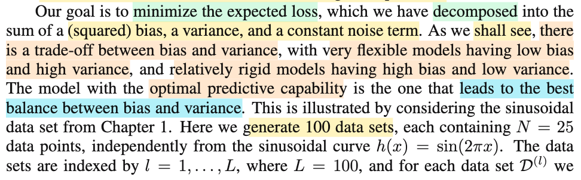</kbd>

<kbd>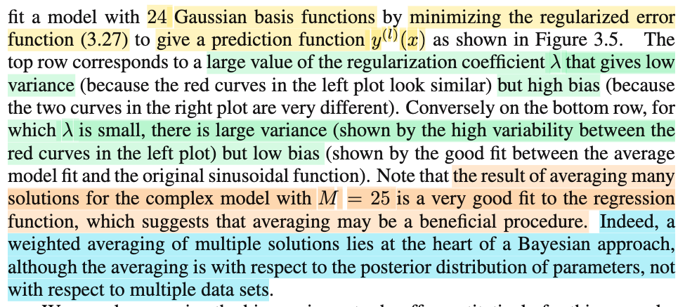</kbd>

<kbd>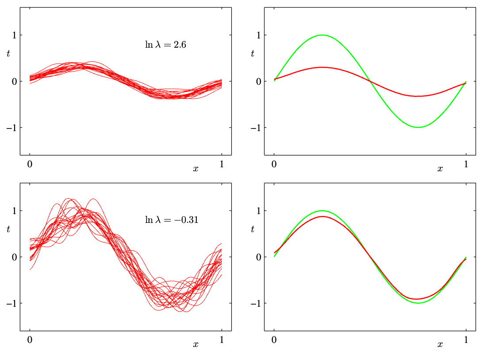</kbd>

<kbd>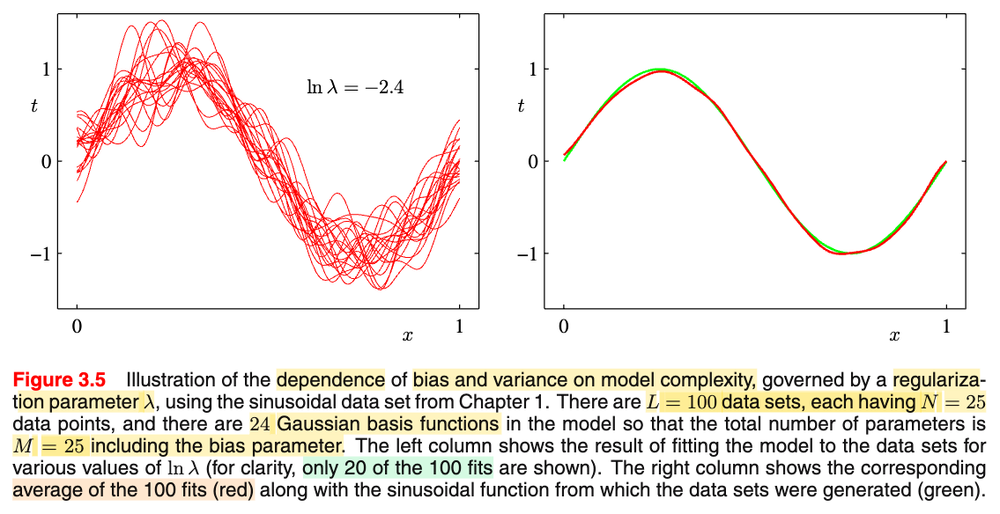</kbd>

> [!NOTE]
> Nói chung đoạn này chỉ là gs Bishop nói về việc, dù ta muốn giảm cái expected loss E\[L\], vốn dĩ tách thành 3 phần (bình phương bias), variance và noise, thì thật ra ngoại trừ việc cái noise thì ta không làm gì được, thì còn một vấn đề là hai cái đầu nó trade-off nhau, tức là (dùng model) giảm bias thì lại tăng loss do variance, và ngược lại, dùng model giảm variance thì lại tăng loss do bias.
>
>
>
> Và để minh họa, ông mới dùng một model có độ plexible cao (bằng cách dùng các hàm Gaussian basis - như đã biết, bữa giờ ta nói về linear model y(**w**, **x**) = **w**TΦ(**x**), là linear model đối với **w** nhưng nhờ basis fuction, Φ, ta có non-linear model đới với **x**, và cũng nhờ Φ mà ta có thể tăng mức complex, flexible của model.
>
>
>
> Tuy nhiên, trong quá trình training để giảm loss, ta thêm regularization (λ/2) **w**T**w**, để tùy theo λ lớn nhỏ, ta khống chế giá trị của **w\***. Và từ đó, kiểu như là tăng hay giảm mức flexible của model. (bởi dù model dùng các hàm Φi(**x**) để có tính phi tuýến, nhưng chúng gắn với trọng số là wi, nên nếu khống chế wi bằng cách không cho chúng được tự do thì ta lại vẫn có thể giàm mức độ flexible của model.
>
>
>
> Như vậy, gs sẽ làm như sau: Đầu tiên cho λ lớn, để tạo ra các model kém flexible. Và train trên 100 dataset D khác nhau, kết quả là các đường màu đỏ trên cùng (ln λ = 2.6) có mức biến động (variance) có thể thấy là nhỏ. (nhớ ko, Var(y(**x**, D)) sẽ cho biết với **X** = **x**, thì y(x, D), là random variable theo D sẽ biến động thế nào khi D thay đổi. Thì hình dung một lát cắt tại x = 0.5 chẳng hạn, thì ta sẽ thấy các đường màu đỏ không biến động quá nhiều. Cũng chính là ta thấy đám line màu đỏ nó nằm khá "gọn" (nhìn tụi nó có vẻ giống nhau). Tuy nhiên, hình bên phải khi tính trung bình lại (chính là E\[y(**x**, D), trung bình y(**x**, D) over all D) thì nó lại khá xa h(**x**) = E\[T|**x**\]. Dẫn tới đường màu đỏ trung bình bên phải lệch khá xa đường màu xanh. Đây chính là minh họa cho bias lớn.
>
>
>
> Vậy khi model có variance thấp thì bias lại lớn.
>
>
>
> Sau đó, gs làm lại, với λ rất nhỏ, tạo ra các model rất flexible. Kết quả là hình cuối (ln λ = -2.4), các đường màu đỏ có vẻ rất "loạn xạ", mà nguyên nhân là, Var(y(**x**, D)) lúc này lớn. Xét mặt cắt tại x = 0.5 sẽ thấy Var(y(x, D)) sẽ lớn hơn là trường hợp λ lớn. Nhưng khi tính trung bình, thì E\[y(**x**, D) lại khá gần h(**x**) → Bias thấp, dẫn đến thệ hiện trên hình bên phải là thì đường màu đỏ lại bám sát khá tốt đường màu xanh.
>
>
>
> Vậy khi model có variance cao thì bias lại thấp.
>
>
>
> Và lí tưởng là khi λ vừa phải, model bias và variance đều không quá cao.
>
>
>
> Và một ý cũng quan trọng đó là với mô hình có variance cao, thì tuy chúng sẽ sensitive với data, tức là, khi D thay đổi thì y(**x**, D) sẽ thay đổi rất lớn, dẫn tới mỗi đường màu đỏ rất khác nhau. Nhưng trung bình lại thì chúng lại khá sát với đường màu xanh. Điều này gợi ý cho ta rằng có thể phát triển một phương pháp nào đó mà cho phép dùng complex model sau đó lấy trung bình của chúng (đây chính là ensemble model mình đã biết sơ từ các lớp ML cơ bản)

> [!TIP]
> **🤖 AI Feedback** — ✅ Score: **98/100**
>
> Bạn đã phân tích rất chi tiết và chính xác về mối quan hệ giữa bias, variance và tham số regularization, thể hiện sự hiểu biết sâu sắc về cơ chế hoạt động của mô hình. Để tăng cường độ chính xác, bạn có thể cụ thể hóa hơn các giá trị ln λ trong hình mà bạn đang mô tả cho mỗi trường hợp.

**🔗 See also:** [3.1.4 Regularized least squares](./314_regularized_least_squares.md#node-y97v4o1)

 

<kbd>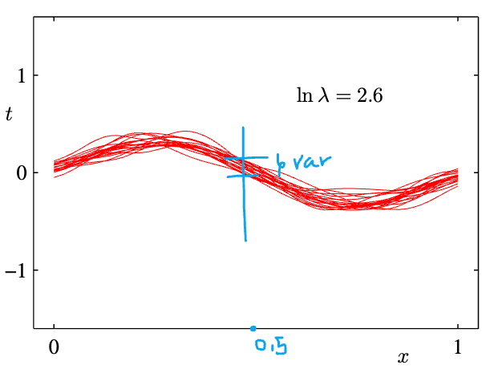</kbd>

<kbd>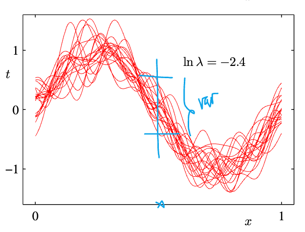</kbd>

- **Bias-Variance Trade-Off Formulas**

<kbd>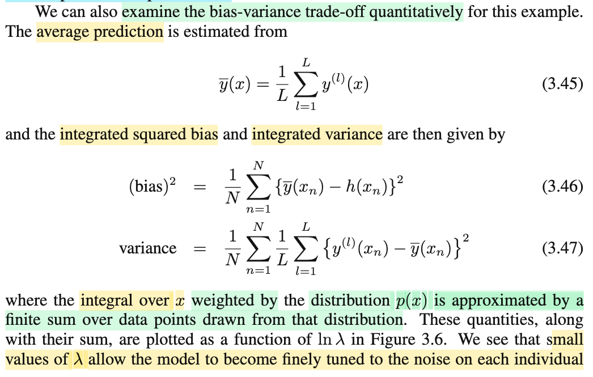</kbd>

<kbd>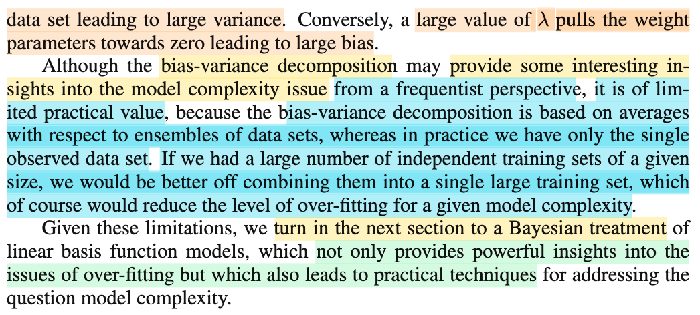</kbd>

<kbd>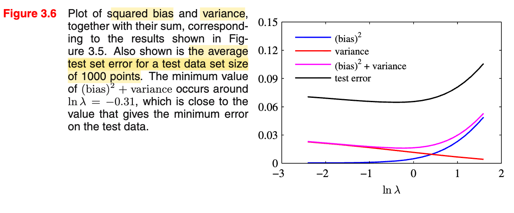</kbd>

> [!NOTE]
> Cái này nhìn vậy mà lại có thể khó hiểu đấy.

 

