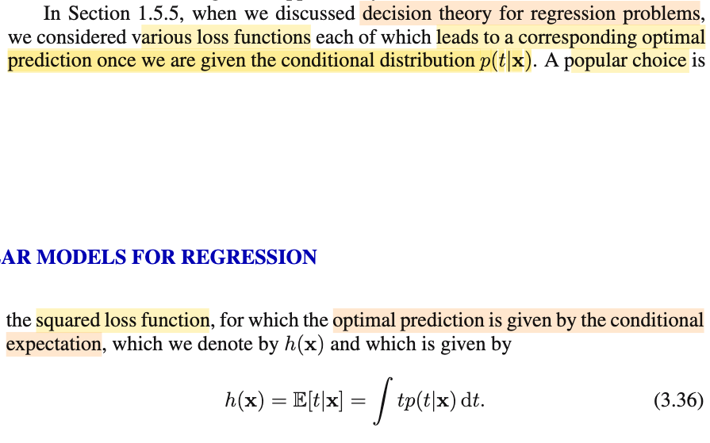

# 3.2.0 The Bias-Variance Decomposition

📊 **Progress:** `3` Notes | `4` Screenshots | `2` AI Reviews

---

## 3.2.0 The Bias-Variance Decomposition

<kbd></kbd>

> [!NOTE]
> Phần này đại ý là vầy: Mấy phần trước cũng như liên hệ với bên Casella mình đã thấy nhược điểm của MLE khi data ít, nó sẽ đại khái là cho ra những kết quả cực đoan, và trong bối cảnh machine learning chính là thứ ta gọi là overfit - khi ta dùng model phức tạp với ít data.
>
>
>
> Rồi ông có nhắc đến việc ta thảo luận về linear model - có dạng cũng như số basis function không đổi. Ý này là sao? → Tức là ta đang nói về linear model có dạng y(**x**, **w**) = **w**TΦ(**x**) với w = (w0, w1, ...wM-1)T và Φ(**x**) = (1, Φ1(**x**), ...ΦM-1(**x**))T, đương nhiêi với M là giá trị cố định nào đó, thì ta có một giá trị cố định các tham số cũng như các basis function. Ý muốn và ta nhớ, đây vẫn là hàm tuyến tính đối với **w** dù cho nhờ hàm basis, y trở thành hàm phi tuyến đối với **x**, và do đó vẫn gọi là linear model là vậy.
>
>
>
> Thế thì tại sao lại nhắc đến số basis function? ⇨ Mình hiểu rằng, số basis function sẽ quyết định độ phức tạp của mô hình, vì số basis function càng lớn, và basis function lại mang ý nghĩa là tạo các non-linear feature, những feature mới tạo thành bằng cách kết hợp phi tuyến các feature gốc, sẽ giúp mô hình tăng độ phức tạp, từ đó có thể đủ năng lực để capture các pattern của data.
>
>
>
> Như vậy quay lại vấn đề mle approach, nếu dùng complex model, và trong trường hợp ít data, sẽ dẫn đến overfit. Thì ta có thể nghĩ đến giảm số basis function lại để giảm độ complex của mô hình lại. Nhưng điều này lại có thể dẫn đến là, mô hình không đủ complex để capture các pattern trong data (mà mình biết gọi là underfit)
>
>
>
> Từ đó, để giải quyết, ta mới có công cụ: regularization term, add thêm vào error function một regularization term giúp tạo thêm một objective nữa: khống chế độ lớn của parameter bên cạnh main objective là giảm error function. Và sự tương quan giữa mức độ quan trọng của hai objective sẽ được kiểm soát bởi một hệ số, ví dụ λ (gọi là regularization hyperparameter). Với regularization, ta có thể dùng complex model, để train một bài toán ít data mà không sợ overfit.
>
>
>
> Nhưng cách này lại phát sinh vấn đề: chọn giá trị của regularization coefficient. Như vậy có thể thấy là, nó vẫn chưa giải quyết hoàn toán vấn đề đau đầu.
>
>
>
> Và nói thêm, nếu ta nghĩ đến việc training mô hình cùng lúc với cả weight và λ thì sẽ dẫn đến λ = 0. Vì sao? 
>
>
>
> Đơn giản là vì λ vốn có ràng buộc ≥ 0, và để minimize E_D(**w**) + λE_W(**w**) với E_W(**w**) ≥ 0 thì đây là hàm tuyến tính theo λ, E_D(**w**) + λE_W(**w**), có dạng a λ + b, và với λ ≥ 0, thì và a = E_W(**w**) cũng > 0 thì hàm này cực tiểu khi λ = biên của \[0, ∞), tức λ = 0.

> [!TIP]
> **🤖 AI Feedback** — ✅ Score: **98/100**
>
> Bài ghi chú thể hiện sự hiểu biết sâu sắc về các khái niệm, giải thích chính xác nội dung văn bản và cung cấp những phân tích bổ sung tuyệt vời, đặc biệt là lý do tại sao λ=0 khi tối ưu hóa đồng thời. Đây là một bài phân tích rất chi tiết và chính xác.

 

## Bias-Variance Trade-off Overview

<kbd></kbd>

> [!NOTE]
> Thế thì đại khái là, gs nói vấn đề overfit là nhược điểm của maximum likelihood, chứ nếu làm **theo Bayesian approach, thì ta sẽ không bị vấn đề này** (đã nói nhiều về cái này, cũng như trong Casella cũng đã nói, nguyên nhân ngắn gọn là vì Bayesian approach, ta cói paramter là random variable, và từ đó đặt ra prior distribution của parameter π(θ) và chính cái này giúp cho khi ta đi xây dựng posterior π(**x**|θ) cũng như đi maximum posterior cũng chính là maximum L(θ|**x**) π(θ), thì prior distribution sẽ giúp cho kết quả không bị extreme khi data ít như cách làm của mle (chỉ maximum L(θ|**x**)).
>
>
>
>  Cho nên trong chapter này ta sẽ bàn sâu hơn về Bayesian approach. Tuy nhiên trước đó, gs sẽ dẫn dắt ta về một **góc nhìn về vấn đề overfit trong phạm vi vẫn thuộc trường phái cổ điển**: **Bias Variance trade-off**. Và cái này sẽ mở rộng cả các phạm vi khác chứ không riêng gì bài toán linear basis function model

 

<kbd></kbd>

 

### Optimal Prediction with Squared Loss

<kbd></kbd>

> [!NOTE]
> Rồi, đoạn này đại khái là, nhắc lại một điểm đã nói trước đây: rằng, giả sử ta đã có predictive distribution, tức f(t|**x**). Thì dự đoán tối ưu cho giá trị của T sẽ là gì.
>
>
>
> Mình sẽ ôn lại nhanh chỗ này:
>
>
>
> Bài toán này nếu nói rõ ra thì là thế này: Nó giống y như cái vụ đưa ra point estimator (của θ) theo cách tiếp cận Bayesian (Bayes estimator) vậy.
>
>
>
> Đầu đuôi câu chuyện là: Với Bayesian, ta coi θ như random variable. Mà đã là random variable, thì nó có probability distribution. Thế thì, marginal distribution của θ, mà với θ, thì người ta gọi là prior distribution π(θ), là thứ mà ta sẽ chọn, dựa vào kinh nghiệm nào đó, nhằm phản ánh một hiểu biết nào đó của ta về θ. Để rồi dùng Bayes rule ta xây dựng π(θ|**x**) = f(**x**|θ) π(θ) / f(**x**), gọi là posterior distribution. Thế thì, vấn đề là, đây vẫn là một distribution, trong khi có thể ta cần đưa ra một point estimation cho θ thì sao? mà theo định nghĩa, point estimator là một hàm số của sample W(**X**), nên yêu cầu là ta cần rút ra một hàm số từ cái distribution này.
>
>
>
> Và đây chính là lúc ta cần viện tới công cụ thuộc lĩnh vực decision theory: Giúp đưa ra quyết định trong điều kiện không chắc chắn (making decision under uncertainty): Tính không chắc chắn phản ánh bởi một probability distribution π(θ|**x**), và ra quyết định ở đây chính là đưa ra một ước lượng điểm W(**X**) cho θ từ đó.
>
>
>
> Và trong decision theory, ta sẽ cần lựa chọn loss function: Là hàm số của estimator: L(W(**X**), θ), phản ánh một cách thức nào đó mà ta trừng phạt các sai sót. Phổ biến được dùng là square error loss (W(**X**) - θ)^2. và absolute error loss |W(**X**) - θ|.
>
>
>
> Cần hiểu điều quan trọng này: Giả sử với θ fixed, thì L(W(**x**), θ) chỉ phản ánh error của W(**x**) với một giá trị **x** cụ thể. Cho nên ta sẽ đi tính trung bình error trên mọi possible value của **X**. Hoặc nhìn theo cách khác, với θ fixed nào đó, thì L(W(**X**), θ) vẫn là môt random variable có được bằng cách áp hàm L(W(**u**), θ) lên random variable **X**. Và vì vậy, ta có quyền nói về kì vọng / mean / expected value của nó. E\[L(W(**X**), θ)\], và vì distribution của L(W(**X**), θ) sẽ phụ thuộc θ do bản chất là **X** \~ f(**x**|θ), nên ta ghi là E\_θ\[L(W(**X**), θ)\], để thể hiện, đây sẽ là hàm số phụ thuộc θ.
>
>
>
> Và cái này chính là định nghĩa của risk function: R(W(**X**), θ) = E\_θ\[L(W(**X**), θ)\], nếu dùng LOTUS, ta sẽ dễ hiểu nó là: ∫L(W(**x**), θ) f(**x**|θ) d**x**.
>
>
>
> Tới đây, nếu ta đi thêm một bước để bước chân qua Bayesian approach, coi θ như random variable, thì cái risk function trên vẫn sẽ là một random variable (có được bởi áp hàm g(θ) = E\_θ\[L(W(**X**), θ)\], lên random variable θ). Để rồi nếu ta lấy expected value của nó, ta sẽ có một con số cố định cuối cùng, không còn phụ thuộc ai. Đó chính là Bayes risk:
>
>
>
> Bayes risk = E{E\_θ\[L(W(**X**), θ)\]} = ∫ E\_θ\[L(W(**X**), θ)\] π(θ) dθ
>
>
>
> Nếu biến đổi tí xíu, dùng Bayes rule: .. = ∫ \[∫ L(W(**x**), θ)\] f(**x**|θ) d**x** π(θ)\] dθ
>
>
>
> = ∫ \[∫ L(W(**x**), θ)\] f(**x**|θ)π(θ) d**x**\] dθ
>
>
>
> = ∫ \[∫ L(W(**x**), θ)\] π(θ|**x**)f(**x**) d**x**\] dθ (thay f(**x**|θ)π(θ) bởi π(θ|**x**)f(**x**))
>
>
>
> = ∫ \[∫ L(W(**x**), θ)\] π(θ|**x**) dθ\] f(**x**)d**x** (tính tích phân theo θ trước)
>
>
>
> thì lúc này, ∫ L(W(**x**), θ)\] π(θ|**x**) dθ chính là E\[L(W(**x**), θ)\] với θ \~ π(θ|**x**), tức là, với giá trị nào đó của **X** = **x**, ta có θ \~ posterior π(**x**|θ) và tính kì vọng của L(W(**x**), θ) với θ có distribution này. Thì cái này gọi là **posterior expected loss**.
>
>
>
> Rồi, với tất cả các định nghĩa trên, giờ ta mới đi quay lại nói về việc tìm point estimator của θ sao cho tối ưu.
>
>
>
> Nói bài toán Bayesian trước: θ là random variable, thì ta sẽ đi tìm W(**X**) minimize Bayes risk, và vì Bayes risk là tích phân over mọi **x** của posterior expected risk, nên bài toán này tương đương đi minimize posterior expected risk:
>
>
>
> minimize_W ∫ L(W(**x**), θ)\] π(θ|**x**) dθ
>
>
>
> ∫ L(W(**x**), θ)\] π(θ|**x**) dθ = ∫ \[W(**x**) - θ\]^2 π(θ|**x**) dθ
>
>
>
>  ∂/∂W \[∫ \[W(**x**) - θ\]^2 π(θ|**x**) dθ\] = ∫ { ∂/∂W \[W(**x**) - θ\]^2 } π(θ|**x**) dθ
>
> = ∫ 2 \[W(**x**) - θ\] π(θ|**x**) dθ
>
>
>
> = 2 ∫\[W(**x**) - θ\] π(θ|**x**) dθ
>
>
>
> First order condition: 2 ∫\[W(**x**) - θ\] π(θ|**x**) dθ = 0
>
>
>
> ⇔ ∫\[W(**x**)π(θ|**x**) dθ - ∫θπ(θ|**x**) dθ = 0
>
>
>
> ⇔ ∫W(**x**)π(θ|**x**) dθ = ∫θπ(θ|**x**) dθ
>
>
>
> ⇔ W(**x**) ∫π(θ|**x**) dθ = E\[θ\] (θ \~ π(θ|**x**))
>
>
>
> ⇔ W(**x**) = E\[θ|**x**\] (θ \~ π(θ|**x**))
>
>
>
> → Khi **X** = **x**, và θ \~ f(θ|**x**) thì W(**x**) khiến minimize posterior expected loss với chính là mean của posterior.
>
> \
> Vậy nên W(**X**) = E\[θ|**X**\] chính là point estimator của θ với θ \~ f(θ|**X**) giúp minimize Bayes risk với square error loss.
>
>
>
> ---
>
>
>
> Nếu θ là fixed unknown, tức theo trường phái cổ điển, thì ta sẽ giải bài toán minimize risk function:
>
>
>
> minimize_W E\_θ\[L(W(**X**), θ)\] = ∫ L(W(**x**), θ) f(**x**|θ) d**x**, = (nếu dùng square error loss) = ∫ \[W(**x**) - θ\]^2 f(**x**|θ) d**x**
>
>
>
> Và cái này, ∫ \[W(**x**) - θ\]^2 f(**x**|θ) d**x**, tức E\_θ\[(W(**X**) - θ)^2\], ta nhớ chính là định nghĩa của MSE, để rồi ta sẽ phân tích nó thành Bias(W(**X**)^2 + Var(W(**X**). Từ đó đi tìm W(**X**) giúp giảm cái này, dẫn tới các cách tiếp cận như xét trong các unbiased estiamtor, xem cái nào có Variance nhỏ nhất, và variance thế nào thì nhỏ nhất lại dẫn đến công cụ là Cramer Rao Lower Bound,...
>
>
>
> ---
>
>
>
> Với chứng đó ôn tập, mình quay lại cái bài toán trong sách này, là đưa ra predict tối ưu của T khi có T \~ f(t|**x**)
>
>
>
> Thì cái này y chang việc có π(θ|**x**), và cần estimate tối ưu cho θ thôi:
>
>
>
> Ta cũng đi giải bài toán: minimize_y(**x**) Risk function = ∫ L(y(**x**), t) f(t|**x**) dt = ∫(y(**x**) - t)^2 f(t|**x**) dt
>
>
>
>  ∂/∂y \[∫(y(**x**) - t)^2 f(t|**x**) dt\] = ∫ \[∂/∂y \[(y(**x**) - t)^2\] f(t|**x**) dt
>
>
>
> = ∫ 2(y(**x**) - t) f(t|**x**) dt
>
>
>
> = 2∫ (y(**x**) - t) f(t|**x**) dt
>
>
>
> Fisrt order optimality condition: 2∫ (y(**x**) - t) f(t|**x**) dt = 0
>
>
>
> ⇔ ∫(y(**x**) - t) f(t|**x**) dt = 0
>
>
>
> ⇔ ∫y(**x**)f(t|**x**) dt - ∫t f(t|**x**) dt = 0
>
>
>
> ⇔ y(**x**) ∫f(t|**x**) dt = E\[T|**x**\]
>
>
>
> ⇔ y(**x**) = E\[T|**x**\]
>
>
>
> Như vậy, optimal point estimator cho T khi T \~ f(t|**x**) chính là posterior mean: E\[T|**x**\] → Đây chính giúp ta hoàn toàn hiểu 3.36.

> [!TIP]
> **🤖 AI Feedback** — ✅ Score: **98/100**
>
> Bài giải thích cực kỳ chi tiết và sâu sắc, vượt xa nội dung ảnh để cung cấp một nền tảng vững chắc về lý thuyết quyết định và ước lượng Bayes. Mặc dù rất toàn diện, có thể tóm tắt các phần ôn tập một cách ngắn gọn hơn nếu mục tiêu là chỉ tập trung vào giải thích công thức 3.36.

 

