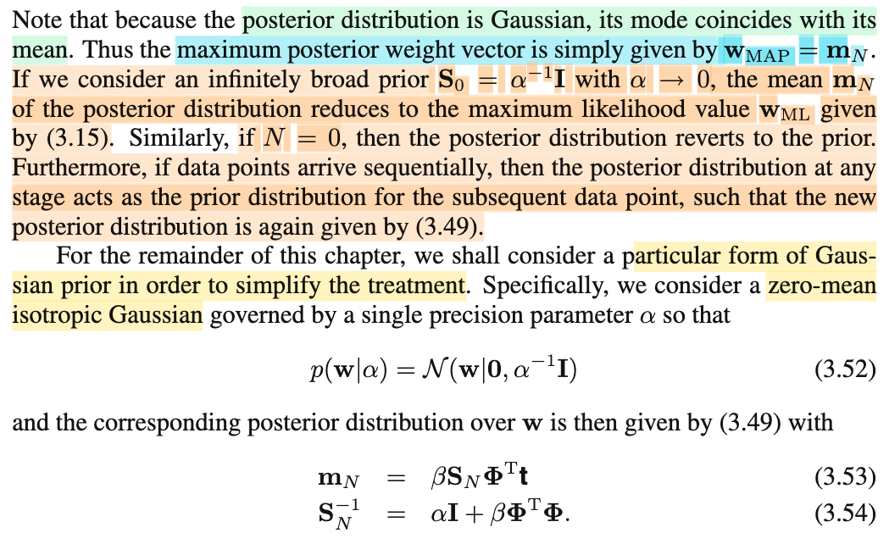

# 3.3.1 Bayesian Linear Regression

📊 **Progress:** `8` Notes | `12` Screenshots | `8` AI Reviews

---

<kbd></kbd>

> [!NOTE]
> Đoạn mở đầu này đại ý là vầy: Trong các cuộc thảo luận khi ta nói về cách tiếp cận maximum likelihood trong việc chọn giá trị của parameter của linear model (chính là 𝐰 của y(𝐰, 𝐱) = 𝐰ᵀΦ(𝐱)) thì ta đã thấy rằng, bằng cách dùng hàm basis function Φ(𝐱), ta có thể tăng mức độ complexity của model (vì còn nhớ, Φ(𝐱) giúp biến hàm y(𝐰,𝐱) = 𝐰ᵀΦ(𝐱) thành hàm phi tuyến theo 𝐱, dù vẫn là tuyến tính đối với 𝐰). Tuy nhiên, mức độ complexity cần phải được kiểm soát vì đã thấy trong các phần trước rằng MLE sẽ dẫn đến overfit khi data ít. Từ đó, ta được học rằng cũng có thể dùng reguarization để kiểm soát mức complexity hiệu quả của model.
>
>
>
> Tuy nhiên, cách làm này lại đặt ra vấn đề là phải chọn mức độ regularization thông qua việc chọn regularization coefficient (hay hyperparamter) λ. Và cái λ này, ta cũng đã từng nói, lại không thể dùng data để mà train, vì nếu làm vậy, again, nó cũng sẽ chọn λ khiến maximum likelihood → overfit.
>
>
>
> Để đối phó với vấn đề phát sinh trên, một cách làm là tách riêng một bộ data để dùng cho việc chọn λ. Tuy nhiên, cách này cũng không tối ưu khi ta phải hi sinh data vốn chứa thông tin hữu ích cho việc training model cũng như phát sinh thêm chi phí tính toán cho bước chọn λ.
>
>
>
> Thành ra, qua phần này, ta sẽ thảo luận qua Bayesian approach, và gs nói rằng, nó sẽ giúp tránh được vấn đề overfit, cũng như có thể dẫn đến một phương pháp tự quyết định mức complexity của model thông qua training data (mà ko cần dành riêng data cho validation).

> [!TIP]
> 🤖 **AI Check** — 🟢 Pass — ✅ **98/100** · ✓ Move on
>
> Bản ghi chú vô cùng xuất sắc khi giải thích rất sâu sắc, liên hệ chính xác các công thức toán học đã học để làm rõ nghĩa cho đoạn văn bản. Để hoàn hảo hơn, bạn có thể bổ sung ý nhỏ của tác giả về tầm quan trọng của việc lựa chọn số lượng và dạng thức của basis functions đối với hành vi của mô hình.

 

## Section 3.3.1 Parameter Distribution

<kbd></kbd>

> [!NOTE]
> Rồi, trước khi nói về nội dung này, mình có thể tranh thủ ôn lại chút xíu về Bayesian approach, mà được học lần đầu trong Casella.
>
>
>
> Trong Casella, với bối cảnh là bài toán point estimation: Tìm một statistic W(𝐗) để estimate cho population parameter θ (dựa trên cơ sở là ta có một random sample 𝐗 = X1,...Xn iid sampling từ population f(𝐱|θ).Thế thì, Classic (hay Frequentist) approach chỉ khác Bayesian approach ở chỗ: Frequentist coi θ là cố định nhưng chưa biết, còn Bayesian coi θ là random variable. Và vì coi θ là random variable, nên nó sẽ có probability distribution. Và chia làm hai loại: f(θ), hay người ta thường dùng π(θ), gọi là prior distribution, là distribution khi chưa dựa trên data. Thường người ta sẽ chọn dựa trên niềm tin, kiến thức nào đó về θ. Và π(θ|𝐱), posterior distribution, là distribution của θ conditioned on 𝐗 = 𝐱. Và dùng Bayes theorem, ta sẽ có π(θ|𝐱) = f(𝐱|θ) π(θ) / f(𝐱), (do đó mới gọi là Bayesian approach). Thế thì, khi đã có posterior distribution của θ, đối với bài toán point estimation với yêu cầu là đưa ra một hàm W(𝐗), thì ta có thể dùng W(𝐗) = θ^\_B(𝐗) = E\[θ|𝐱\], đây chính là mean của posterior, cũng là Bayes estimator khiến minimize posterior expected loss hay minimize Bayes risk với square error loss function.
>
>
>
> Quay lại đây, như đã nói, ta sẽ dùng Bayesian approach cho bài toán đi tìm tham số 𝐰 của linear model. Thì như đã nói ở trên, với Frequentist approach, người ta không coi θ như random variable, mà chỉ là fixed & unknown, do đó, bữa giờ, khi ta đi tìm ML estimator của 𝐰, ta không hề coi nó là random variable, nên không hề nói về distribution của nó. Vậy thì nay, với Bayesian approach, ta **COI w NHƯ RANDOM VARIABLE**, từ đó mới đưa vào (introducing) **PRIOR DISTRIBUTION** f(𝐰) (hay trong sách là p(𝐰), tương ứng với π(θ) ở trên).
>
>
>
> Rồi, một điểm nữa, lúc nãy mình nói người ta thường chọn priori (viết tắt của prior distribution) của θ dựa trên kiến thức kinh nghiệm trải nghiệm của experimenter về θ. Nhưng người ta cũng thường chọn nó sao cho việc tính toán trở nên thuận lợi: Đó là, chọn priori là conjugate prior của likelihood. Là sao?
>
>
>
> Likelihood function, là function của θ, được kí hiệu là L(θ|𝐱), mang ý nghĩa là, với quan sát được 𝐗 = 𝐱 thì độ hợp lí của θ là bao nhiêu. Và độ hợp lí này được định nghĩa = f(𝐱|θ), tức joint pdf của random sample 𝐗, tại observed value 𝐱. Thế thì thông qua Bayes rule như nói ở trên: π(θ|𝐱) = f(𝐱|θ) π(θ) / f(𝐱), thì đại khái là, nếu như prior distribution π(θ) mà là conjugate prior của f(𝐱|θ), tức likelihood L(θ|𝐱), thì posterior π(θ|𝐱) SẼ CŨNG TRỞ NÊN CÙNG MỘT LOẠI VỚI PRIORI. Ví dụ, nếu f(𝐱|θ) là Binomial, thì khi chon priori là Beta distribution, thì posterior cũng sẽ ra là distribution của Beta, chỉ khác param. Do đó Beta là conjugate prior của Binomial. Tương tự, ta có nhiều cặp khác, Gaussian là conjugate prior của Gaussian,....
>
>
>
> Chính vì lí do đó, ở đây, gs Bishop mới nói về conjugate prior, cụ thể là như sau:
>
>
>
> Đầu tiên cần nhớ rằng, ta đang muốn xây dựng posterior distribution của 𝐰: f(𝐰|Data) với Data bao gồm các observed value, là các cặp data (**x1**, t1),....(𝐱N, tn) (𝐱 là vector, t là scalar), và gom các vector 𝐱1,...𝐱N lại thành design matrix 𝐗, cũng như t1,...tN thành vector 𝐭. Thế thì, theo Bayes theorem:
>
>
>
> f(𝐰|Data) = f(𝐰|𝐗,𝐭) = f(Data|𝐰) f(𝐰) / f(Data)
>
>
>
> và f(Data|𝐰) ở đây sẽ là f(𝐗, 𝐭|w).
>
>
>
> Có điều, trong bài toán regression, người ta sẽ không coi 𝐗 là random variable, mà chỉ coi nó là fixed value do đó ta chỉ coi T là random variable.
>
>
>
> nên f(Data|𝐰) là f(𝐭|𝐗,𝐰), và như đã nói ở đâu đó trước đây trong sách, ta sẽ bỏ qua không kể 𝐗 cho gọn, nên chỉ còn là f(𝐭|𝐰).
>
>
>
> Vậy nên ta có f(𝐰|𝐭) = f(𝐭|𝐰) f(𝐰) / f(𝐭).
>
>
>
> Và f(𝐭|𝐰) ở đây, theo 3.10, chính là Πi=1:N N(ti|𝐰ᵀΦ(𝐱i), 1/β). Giải thích sơ lại cái này:
>
>
>
> ---
>
>
>
> Trong bài toán này, ta đặt ra giả định rằng noise sẽ tuân theo Normal(0, 1/β), đồng nghĩa, Ti - y(𝐱i, 𝐰) sẽ \~ normal(y(𝐱i, w), 1/β).
>
>
>
> Như vậy, với việc ta có data set 𝐗, 𝐭, cũng chính là ta có một observed value của 𝐓 (=T1,....TN) = 𝐭 = (t1,...tN)).
>
>
>
> Thì likelihood L(𝐰|𝐭), theo định nghĩa nói trên, = f(𝐭|𝐰)
>
>
>
> và vì T1,...TN independent, nên joint pdf của 𝐓 tách thành tích các marginal pdf của T1,....TN:
>
>
>
> f(𝐭|𝐗, 𝐰) = f(t1|𝐱1, 𝐰) ×... × f(tN|𝐱N, 𝐰) = Πi=1:N f(ti|𝐱i, 𝐰)
>
>
>
> Do đó L(𝐰|𝐭) = f(𝐭|𝐰) = Πi=1:N f(ti|𝐱i, 𝐰)
>
>
>
> = Πi=1:N f(ti|𝐰) nêú muốn không nhắc đến 𝐱 cho gọn)
>
>
>
> và f(ti|𝐰) là pdf của normal(y(𝐱i, w), 1/β)
>
>
>
> =  Πi=1:N N(ti|y(𝐱i, 𝐰), 1/β)
>
>
>
> =  Πi=1:N N(ti|𝐰ᵀΦ(𝐱i), 1/β) (chính là 3.10)
>
>
>
> ---
>
>
>
> Thế thì N(ti|𝐰ᵀΦ(𝐱i), 1/β), là pdf của N(𝐰ᵀΦ(𝐱i), 1/β), nó sẽ có dạng \[1/√2π(1/β)\] × exp{-\[ti - 𝐰ᵀΦ(𝐱i)\]²/2(1/β)}
>
>
>
> Nên Πi=1:N N(ti|𝐰ᵀΦ(𝐱i), 1/β) = \[1/√2π(1/β)\]^N × Πi=1:N exp{-\[ti - 𝐰ᵀΦ(𝐱i)\]²/2(1/β)}
>
>
>
> = \[1/√2π(1/β)\]^N × exp {Σi=1:N \[-(ti - 𝐰ᵀΦ(𝐱i))²/2(1/β)\]}
>
>
>
> Xét cái term trong exp: Σi=1:N \[-(ti - 𝐰ᵀΦ(𝐱i))²/2(1/β)\]
>
>
>
> = - \[1/2(1/β)\] Σi=1:N \[(ti - 𝐰ᵀΦ(𝐱i))²\]
>
>
>
> = - \[1/2(1/β)\] ||**Φw** - 𝐭||²
>
>
>
> = - \[1/2(1/β)\] (**Φw** - 𝐭)ᵀ(**Φw** - 𝐭)
>
>
>
> = - (1/2) (**Φw** - 𝐭)ᵀ (β𝐈) (**Φw** - 𝐭)
>
>
>
> ⇒ Πi=1:N N(ti|𝐰ᵀΦ(𝐱i), 1/β) = \[1/√2π(1/β)\]^N exp\[- (1/2) (**Φw** - 𝐭)ᵀ (β𝐈) (**Φw** - 𝐭)\]
>
>
>
> = \[1/√2π\]^N \[1/√(1/β)\]^N exp\[- (1/2) (**Φw** - 𝐭)ᵀ (β𝐈) (**Φw** - 𝐭)\]
>
>
>
> = \[1/(2π)^(N/2)\] \[1/√|**Σ**|\] exp\[- (1/2) (𝐭 - **Φw**)ᵀ (**Σ**inv) (𝐭 - **Φw**)\]
>
>
>
> với **Σ**inv = β𝐈 ⇔ **Σ** = (1/β)𝐈
>
>
>
> Và như vậy, f(𝐭|𝐰) sẽ có dạng của Gaussian và do đó vì Gaussian là conjugate prior của Gaussian nên ta sẽ chọn priori là Gaussian: f(w) = N(𝐰|𝐦0, 𝐒0) (𝐦0, 𝐒0 là mean và covariance matrix của prior distribution này)
>
>
>
> Ghi chú nhỏ: Trong sách, gs nói cái likelihood function của 3.10 là hàm exponential của quadratic function của 𝐰, mục đích chính cũng chỉ là muốn chỉ ra rằng hàm prior phải là Gaussian với lập luận tương tự như sau:
>
>
>
> vì bên trong exp của f(𝐭|𝐰) có dạng exp (quadratic function của 𝐰). thì nếu ta chọn prior f(𝐰) là normal(𝐦0, 𝐒0) thì pdf sẽ cũng có dạng exp (quadratic function của 𝐰). Để rồi khi nhân lại f(t|𝐰) f(𝐰) / f(𝐭) thì dùng tính chất hàm exp, cái tử cũng sẽ nhập lại, để rồi trở thành dạng exp \[quadratic function cuả 𝐰\], còn cái mẫu, như đã biết, sẽ chỉ là nó sẽ nhập vào các phần constant để trở thành normalizing constant của posterior, và như vậy, posterior cũng sẽ có cùng dạng với prior distribution.

> [!TIP]
> 🤖 **AI Check** — 🟢 Pass — ✅ **98/100** · ✓ Move on
>
> Ghi chú cực kỳ chi tiết, chính xác và có chiều sâu khi kết nối từ lý thuyết nền tảng đến các bước biến đổi toán học cụ thể của hàm likelihood. Điểm lưu ý nhỏ duy nhất là bạn viết nhầm ký hiệu vector kỳ vọng của prior thành w0 thay vì m0 như trong sách (phương trình 3.48).

**🔗 See also:** [Likelihood and Error Functions](./311_maximum_likelihood_and_least_squares.md#node-urnjdcs)

 

### Bayesian Linear Regression Posterior Update

<kbd></kbd>

> [!NOTE]
> Rồi, thế thì với việc đã chọn prior của 𝐰 là N(𝐦0, 𝐒0), thì ở đây, đại ý gs Bishop nói là, ta sẽ theo Bayes theorem để mà derive ra f(𝐰|𝐭), kết quả chắc chắn sẽ ra dạng của một Normal (có parameter khác). Và nhờ những gì ta đã chuẩn bị ở chương 2 (xem link) - trong phần đó, đại ý là mình cũng đã kinh qua việc dùng kĩ thuật completing the square cũng như là nhận diện mẫu, để kiểu như là với prior f(𝐱) là normal có param này, f(𝐲|𝐱) cũng là normal có param kia thì f(𝐱|𝐲) cũng sẽ ra là normal có param nọ. Nên nay ta chỉ việc áp dụng thôi, khỏi cần tự làm:
>
>
>
> Cụ thể, theo link tới note trong chap 2, ta có bảng tóm tắt sau:
>
>
>
> Cho f(𝐱) = N(𝐱|**μ**, **Λ**inv),
>
>
>
> f(𝐲|𝐱) = N(𝐲|**Ax** + 𝐛, 𝐋inv)
>
>
>
> thì f(𝐲) = N(𝐲|**Aμ** + 𝐛, 𝐋inv + 𝐀 **Λ**inv 𝐀ᵀ)
>
>
>
> và f(𝐱|𝐲) = N(𝐱| **Σ**{𝐀ᵀ𝐋(𝐲 - 𝐛) + **Λμ**}, **Σ**) với **Σ** = (**Λ** + 𝐀ᵀ 𝐋 𝐀)⁻¹
>
>
>
> Vậy thì, ở đây, ta có
>
>
>
> và f(𝐰) = N(𝐰|𝐦0, 𝐒0) (tương đương **μ** = 𝐦0, **Λ**inv = 𝐒0 → **Λ** = 𝐒0inv
>
>
>
> f(𝐭|𝐰) là N(𝐭|**Φw**, (1/β)𝐈) (tương đương 𝐀 = **Φ**, 𝐛 = 0, L⁻¹ = 1/β)𝐈 → 𝐋 = β𝐈)
>
>
>
> nên f(𝐰|𝐭) sẽ là Normal có mean và variance là:
>
>
>
> Covariance matrix, 𝐒N, tức là **Σ**, áp dụng công thức trên: (**Λ** + 𝐀ᵀ 𝐋 𝐀)⁻¹: thay **Λ** = 𝐒0inv, 𝐀 = **Φ**, 𝐋 = β𝐈
>
>
>
> = (𝐒0inv + **Φ**ᵀ (β𝐈) **Φ**)⁻¹
>
>
>
> = (𝐒0inv + β**Φ**ᵀ**Φ**)⁻¹
>
>
>
> ⇔ 𝐒N⁻¹ = 𝐒0inv + β**Φ**ᵀ**Φ** → 3.51.
>
>
>
> Mean: 𝐦N, áp dụng công thức **Σ**{𝐀ᵀ𝐋(𝐲 - 𝐛) + **Λμ**}
>
>
>
> = 𝐒N{**Φ**ᵀ(β𝐈)(𝐭 - **0**) + 𝐒0inv 𝐦0}
>
>
>
> = 𝐒N{β**Φ**ᵀ𝐭 + 𝐒0inv 𝐦0}
>
>
>
> = 𝐒N{𝐒0inv 𝐦0 + β**Φ**ᵀ𝐭} → 3.50
>
>
>
> Nói chung là áp dụng công thức thôi

> [!TIP]
> 🤖 **AI Check** — 🟢 Pass — ✅ **100/100** · ✓ Move on
>
> Ghi chú cực kỳ chính xác và chi tiết khi liên kết thành công công thức tổng quát từ Chương 2 để chứng minh công thức Chương 3 một cách tường minh. Để hoàn hảo hơn, bạn có thể bổ sung thêm giải thích ngắn gọn về ý nghĩa vật lý của các tham số đóng vai trò là độ chính xác (precision) trong việc cập nhật phân phối.

**🔗 See also:** [Phân bố tiên nghiệm và hậu nghiệm](./233_bayess_theorem_for_gaussian_variables.md#node-zswmsts) · [3.3.2 Predictive distribution](./332_predictive_distribution.md#node-wdjepxb) · [Ex 3.7 Posterior Distribution in Linear Basis Models](./37_exercises.md#node-97teyoh)

 

#### Gaussian Prior and Posterior Parameters

<kbd></kbd>

> [!NOTE]
> Rồi, đoạn này để ý là dựa trên kết quả, mình có được về cái phân phối hậu nghiệm có dạng là một phân phối chuẩn, hay còn gọi là normal hay là Gaussians. Thì ta biết cái phân phối chuẩn đó, nó có một cái đặc điểm là hình dạng đồ thị của hàm phân phối, nó sẽ như cái hình cái chuông, có cái tâm của cái chuông là ngay tại tham số location của phân phối. Và ý nghĩa của nó đó là khi mà càng gần tâm thì giá trị của hàm PDF nó sẽ càng lớn và nó lớn nhất ở tại tâm. Và khi đi ra khỏi xa tâm đó thì hàm PDF sẽ giảm xuống, xác suất sẽ giảm xuống, trở hình cái chuông. Vậy thì ý chính ở đây nó là vì phân phối hậu nghiệm mình xây dựng được có dạng của phân phối chuẩn, do đó nếu như ta dựa vào phân phối hậu nghiệm của tham số W để mà đưa ra một cái ước lượng điểm, một cái point estimation cho giá trị của W, thì đương nhiên là có nhiều cách, và một trong những cách đó đó là dùng cái giá trị của W mà có phân phối hậu nghiệm cao nhất. Vậy thì đương nhiên trong trường hợp này, nếu mình dùng theo cách làm đó, thì chỉ đơn giản là lấy cái mean, lấy cái tâm của cái phân phối hậu nghiệm ra. Và do đó người ta mới nói đó là cái maximum posterior weight vector đó nó chỉ đơn giản là mean của phân phối hậu nghiệm vừa tìm được.
>
>   \
> Vậy thì mình phải hiểu rằng là cái việc mình đi tìm tham số W chính là việc giải một cái bài toán ước lượng điểm. Tuy nhiên, mình đang tiếp cận theo trường phái Bayesians, nó khác với cách tiếp cận của trường phái cổ điển. Khi mà mình đi tìm cái gọi là Maximum Likelihood Estimator đó của W thì thật ra mình đang đi theo trường phái cổ điển. Trong đó, ta coi giá trị của W, tức là tham số, chỉ là một giá trị cố định nhưng mà chưa biết, và mục đích là tìm một cái hàm số, một cái statistic, sao cho khi mà mình gắn giá trị của sample vào, tức là giá trị quan sát được của mẫu, thì mình sẽ có được một cái giá trị ước lượng, sao cho tốt nhất đối với giá trị mà mình không biết của tham số. Và để giải bài toán đó thì một cái cách làm hợp lý hoặc một cái cách làm mà tương đối tốt mà giới thống kê hay dùng đó là ước lượng hợp lý nhất, tức là Maximum Likelihood Estimation. Nhưng mà khi mình chuyển qua trường phái Bayesian thì cách tiếp cận của nó sẽ coi giá trị của W, hoặc là nó coi W là một biến ngẫu nhiên. Và vì nó coi là biến ngẫu nhiên cho nên mình sẽ định ra cái phân phối tiên nghiệm của nó và sau đó xây dựng phân phối hậu nghiệm là phân phối của tham số dựa trên giá trị quan sát được của mẫu, gọi là phân phối hậu nghiệm. Thì cái việc xây dựng này nó dựa trên cái định lý Bayes cho nên mới gọi đây là trường phái Bayesians. Vậy thì cái chính cần hiểu đó là mình sẽ tìm ra cái phân phối hậu nghiệm của W, nhưng bài toán ban đầu đặt ra yêu cầu là tìm ra một cái ước lượng điểm cho W. Do đó, mình có phân phối hậu nghiệm thì mình vẫn phải đi tìm hoặc là vẫn phải đưa ra một cái lựa chọn cho ước lượng điểm. Và có nhiều cách để làm, thì cách đơn giản nhất hoặc là một trong những cách đó chính là dùng ước lượng điểm hoặc là dùng cái giá trị W mà có phân phối hậu nghiệm lớn nhất.\
> \
> Cái câu tiếp theo giáo sư nói đó là như ở trên là mình đang chọn cái hàm phân phối tiên nghiệm của w, nó là một cái phân phối chuẩn có mean zero và có cái ma trận hiệp phương sai là 1/alpha nhân I. Thì mình hiểu đại khái là cái hình dạng của cái phân phối tiên nghiệm nó sẽ thể hiện như sau, tức là nó thể hiện một cái niềm tin rằng cái giá trị của tham số nó sẽ đâu đó tập trung ở quanh cái mốc zero, tức là các cái biến ngẫu nhiên w1, w2, vân vân sẽ có cái giá trị tập trung quanh mốc zero. Nhưng mà đương nhiên vì nó là biến ngẫu nhiên cho nên mình không biết nó nằm ở đâu, và mình thể hiện cái chuyện không chắc chắn đó thông qua cái ma trận hiệp phương sai của phân phối chuẩn. Vậy thì cái giá trị alpha đó chính là cái tham số, hoặc ở đây mình hay gọi nó là một cái, nó cũng là một cái tham số khác. Nó quyết định cái hình dạng của phân phối tiên nghiệm, và giá trị của alpha nó sẽ quyết định cái mức độ tập trung của hình chuông tiên nghiệm quanh cái mốc zero, để rồi nếu như mà alpha lớn thì có nghĩa là mình đang tin rằng các giá trị của w tập trung quanh mốc zero nhưng tập trung ở mức độ rất cao, tức là nó chỉ lớn hơn hoặc bé hơn zero tí xíu thôi. Và mình tin chắc là như vậy, tức là mình có một cái niềm tin cao là như vậy. Còn ngược lại, nếu như mình giảm cái alpha thì đồng nghĩa là mình đang nói rằng mình cũng tin rằng giá trị của w sẽ tập trung quanh mốc zero nhưng mình không chắc lắm, nó có thể có cái tính không chắc chắn dàn trải hơn nhiều. Và ở mức độ cực đoan khi mà cho alpha tiến tới zero thì mình có thể coi như là cái hình chuông đó nó không còn là hình chuông nữa mà nó dàn trải xác suất ra toàn bộ không gian mặt phẳng và nó thể hiện rằng niềm tin ban đầu cho w là mình không biết gì về nó hết. Nó sẽ giống như một cái phân phối uniform mà trong đó xác suất ở bất cứ nơi nào đều như nhau.
>
>
>
> Và với cái trường hợp như vậy khi mà có thể nói nôm na là có cái phân phối tiên nghiệm hoặc là có những cái niềm tin ban đầu coi như không biết gì, tức là có cũng như không đó thì cái bài toán mà mình đi tìm ước lượng điểm của w theo phương pháp Bayesian nó lại trở về y chang cái bài toán mình tìm ước lượng điểm của w theo trường phái cổ điển là theo phương pháp Maximum Likelihood. Cho nên cái ý ở đây là lặp lại một cái điểm mà giáo sư Bishop đã nói ở mấy chương trước đó, đó là cái cách tiếp cận Bayesian nó giúp khắc phục những cái nhược điểm của cách tiếp cận cổ điển. Bởi vì với cái Maximum Likelihood Estimation thì nếu như dữ liệu ít thì cái ước lượng điểm mà tạo bởi phương pháp này nó có thể trở nên rất cực đoan. Trong khi đó, với cách tiếp cận Bayesian thì nhờ vào cái phân phối tiên nghiệm prior distribution mà cho dù rơi vào cái hoàn cảnh có ít dữ liệu thì cái kết quả nó cũng không cực đoan như là thằng Maximum Likelihood Estimation. Thì từ đó mình hiểu rằng nếu như mà cái phân phối tiên nghiệm nó trở nên là cực kỳ dàn trải để rồi mang ý nghĩa là mình cũng chẳng biết gì hoặc là chưa có một cái hiểu biết gì về cái giá trị của w cả thì lúc đó nó coi như là không có tác dụng và cái bài toán mà ước lượng w theo Bayesian nó vẫn trở nên giống như thằng Maximum Likelihood Estimation.
>
> \
> \
> Và một ý tiếp theo cũng không quá khó để hiểu đó là khi nói về chuyện N nếu bằng 0 thì phân phối hậu nghiệm nó cũng y như phân phối tiên nghiệm. Thì cái chuyện này cũng không khó để hiểu bởi vì phân phối hậu nghiệm về cơ bản chỉ là phân phối của W dựa trên những cái data, những giá trị quan sát được của dữ liệu. Vậy thì nếu mà chưa có giá trị quan sát nào thì phân phối hậu nghiệm nó cũng như là phân phối tiên nghiệm thôi. Và một điểm nữa mình cũng đã gặp ở trong những cái phần trước đó là cái chuyện mình có thể dùng cái cách diễn giải của Bayesians hoặc là của Bayes' rule đó để mà giải thích cho cái trường hợp mà dữ liệu nó không đến cùng một lúc ban đầu ngay có một cục có sẵn mà nó đến từng điểm một, nó đến một cách nối tiếp thì kết quả nó vẫn giống nhau. Nếu mà nó đến một cục có sẵn đó thì mình sẽ dùng Bayes' rule, mình xây dựng phân phối hậu nghiệm bằng phân phối tiên nghiệm nhân cho cái hàm likelihood của tham số dựa trên giá trị quan sát của cả cái cục đó. Còn nếu mà dữ liệu đến theo từng điểm thì ví dụ như mình có điểm thứ nhất thì mình sẽ tính phân phối hậu nghiệm bằng phân phối tiên nghiệm nhân cho cái likelihood của W dựa trên giá trị quan sát của X1. Sau đó mình lại dùng cái phân phối hậu nghiệm đó để làm phân phối tiên nghiệm tiếp tục nhân với hàm likelihood khi mà xuất hiện thêm X2 và thành ra một cái chuỗi như vậy thì kết quả nó sẽ vẫn ra là phân phối hậu nghiệm dựa trên toàn bộ dữ liệu. Còn cái đoạn cuối cùng thì chỉ là áp dụng lại một cái kiến thức đã học ở trong chương 2 đó là khi mình chọn cái phân phối tiên nghiệm là hàm phân phối chuẩn mean như vậy và ma trận hiệp phương sai như vậy cộng với hàm likelihood cũng là phân phối chuẩn thì mình sẽ ra được cái phân phối hậu nghiệm có mean và ma trận hiệp phương sai như công thức 3.53, 3.54.

> [!TIP]
> 🤖 **AI Check** — 🟢 Pass — ✅ **95/100** · ✓ Move on
>
> Ghi chú của bạn rất xuất sắc, giải thích rất sâu sắc và trực quan từ trực giác hình chuông của phân phối chuẩn đến sự khác biệt giữa hai trường phái Bayes và tần suất. Điểm trừ duy nhất là lỗi gõ nhầm số thứ tự công thức ở cuối bài từ (3.53, 3.54) thành (5.3, 5.4).

**🔗 See also:** [Section 3.3.3 Equivalent Kernel](./333_equivalent_kernel.md#node-qgf9klh) · [Tính toán hàm evidence](./351_evaluation_of_the_evidence_function.md#node-u15ayc8) · [Hessian of Regularized Error Function](./351_evaluation_of_the_evidence_function.md#node-vpu7vqs) · [Iterative Estimation of Alpha](./352_maximizing_the_evidence_function.md#node-vstyyq2)

 

##### Maximum A Posteriori Estimation

<kbd></kbd>

> [!NOTE]
> Tiếp, đoạn này là sao:
>
>
>
> Thì đại ý là, sau khi đã có posterior distribution của 𝐰, là normal(mN, SN⁻¹) thì ta làm gì nữa? Tại sao lại nói đến maximize log của posterior distribution?
>
>
>
> Thế thì, chỗ này để hiểu rõ cần phải nhắc lại maximum likelihood, rồi ta sẽ liên hệ qua lại cái này.
>
>
>
> Đầu tiên, cần nhấn mạnh, nói đến maximum likelihood, thì ta đang trong trường phái Frequentist. Vì trong trường phái này, ta coi tham số, tức 𝐰 là giá trị cố định nhưng chưa biết. Và ta muốn đi tìm một function của data để estimate ra giá trị 𝐰. Và MLE chỉ là một cách tiếp cận phổ biến, trong đó ta sẽ dùng cái function sau đây để làm estimator cho 𝐰: 𝐰ML(data) = argmax\_𝐰 L(𝐰|data). Có nghĩa là, ta sẽ giải bài toán tối ưu:
>
>
>
> maximize over 𝐰 {L(𝐰|data)}. Với data ở đây là 𝐭, matrix 𝐗
>
>
>
> và hàm likelihood là hàm của 𝐰, được mang ý nghĩa là độ hợp lí của 𝐰 dựa trên / giải thích cho giá trị quan sát được của data, có giá trị = f(data|𝐰), ở đây, tức là f(𝐭|𝐗, 𝐰), hay f(𝐭|𝐰).
>
>
>
> và để giải bài toán tối ưu ta có thể dùng hàm ln để chuyển thành bài toán tương đương trong đó ta maximize hàm ln likelihood: ln L(𝐰|data) = ln f(𝐭|𝐰). Và với f(t|𝐰) là pdf của normal, kết quả một lần nữa chuyển thành minimize sum square error như đã biết.
>
>
>
> Thế thì, ý chính là, khi ta maximize hàm likelihood L(𝐰|𝐭) thì ta đang tìm w để maximize hàm L(𝐰|𝐭)
>
>
>
> Vậy thì quay lại đây, khi ta đã có posterior f(𝐰|𝐭) = f(𝐭|𝐰) f(𝐰) / f(𝐭) thì hoàn toàn tương tự, ta cũng có thể đi tìm 𝐰 để maximize f(𝐰|𝐭) cũng là maximize f(𝐭|𝐰) f(𝐰) / f(𝐭)
>
>
>
> Và xét bài toán maximize over 𝐰 {f(𝐭|𝐰) f(𝐰) / f(𝐭)}
>
>
>
> thì vì f(𝐭) không âm , và dùng hàm ln để có bài toán tối ưu tương đương:
>
>
>
> maximize over 𝐰 {ln \[f(𝐭|𝐰) f(𝐰)\]}
>
>
>
> dùng tính chất hàm log: ln \[f(𝐭|𝐰) f(𝐰)\] = ln f(𝐭|𝐰) + ln f(𝐰)
>
>
>
> Thay công thức của f(𝐭|𝐰) (y như ở trên) và f(𝐰), và gom constant lại ta sẽ thấy nó thành bài toán:
>
>
>
> minimize (β/2) sum square error + α 𝐰ᵀ𝐰 + constant
>
>
>
> Tuy nhiên vì ta biết f(𝐰|𝐭) là normal có mean mN, nên ta cũng biết w khiến maximize f(𝐰|𝐭) rồi: chính là 𝐦N.
>
>
>
> Có nghĩa là giải bài toán trên ta sẽ ra 𝐰 là 𝐦N
>
>
>
> Nhưng ý quan trọng muốn nói, là bài toán minimize hàm sum square error với L2 regularization loss chính là việc ta đi tìm w khiến maximize posterior distribution, dù rằng trong trường hợp này ta biết solution chính là mean 𝐦N
>
>
>
> Suy ngẫm một chút, mình nhớ, trong Casella, khi đã đi theo Bayesian approach, để đi xây dựng cái gọi là Bayes estimator của θ, và sau khi đã có được posterior distribution π(θ|𝐱), thì hình như người ta không làm theo lối đi tìm θ khiến maximize π(θ|𝐱). Mà thay vào đó, họ sẽ dùng decision theory: chọn loss function, L(W(𝐗), θ), ví dụ square error loss = \[W(𝐗) - θ\]². 
>
>
>
> Rồi, tính risk function: E\_θ\[L(W(𝐗), θ)\] = ∫ L(W(𝐱), θ) f(𝐱|θ) d𝐱. 
>
>
>
> Và Bayes risk: E\[E\_θ\[L(W(𝐱), θ)\]\] = ∫E\_θ\[L(W(𝐱), θ)\] π(θ)dθ. Từ đó đi minimize cái Bayes risk này, và bài toán sau một chút biến đổi, sẽ cũng là minimize ∫L(W(𝐱), θ) π(θ|𝐱) dθ, gọi là posterior expected loss. Và kết quả sẽ cho ra là E\[θ|𝐱\], tức mean của posterior
>
>
>
> Nếu so với việc tìm θ có π(θ|𝐱) lớn nhất, thì kết quả có thể sẽ khác. Tuy rằng trong trường hợp posterior là Normal thì hai kết quả sẽ giống nhau, vì mean của posterior cũng là nơi có π(θ|𝐱) lớn nhất.

> [!TIP]
> 🤖 **AI Check** — 🟢 Pass — ✅ **98/100** · ✓ Move on
>
> Ghi chú cực kỳ xuất sắc, thể hiện sự hiểu biết sâu sắc và chính xác về mối liên hệ giữa tối đa hóa hậu nghiệm (MAP) và việc giảm thiểu sai số có Regularization L2. Bạn chỉ cần lưu ý thêm hệ số 1/2 ở phần phạt L2 (tức là α/2 thay vì α) để công thức hoàn toàn đồng nhất với tài liệu học.

 

###### Bayesian Linear Regression Example

<kbd></kbd>

> [!NOTE]
> Đại khái là ở đây với mục đích là muốn minh họa và so sánh kết quả thu được khi dùng cách tiếp cận Bayesian đối với bài toán linear model, tác giả sẽ đặt ra một bối cảnh như sau:
>
>
>
> Ta sẽ tạo ví dụ N = 100 điểm data theo quy luật sau:
>
>
>
> Sampling X1,....X100 từ Uniform(-1,1)
>
>
>
> Dùng hàm f(x, 𝐚) = a0 + a1x = -0.3 + 0.5x.
>
>
>
> Và sampling ε1,...ε100 từ N(0, (0.2)²)
>
>
>
> Và tính t1 = f(x1, 𝐚) + ε1, ...,t100 = f(x100, 𝐚) + ε100
>
>
>
> Như vậy, có nghĩa là gì?
>
>
>
> Có nghĩa là, các giá trị t1,...tN sẽ là observed value của T|x sẽ tuân theo phân phối Normal(f(x, 𝐚), (0.2)²). Vì sao? Vì ε \~ Normal(0, (0.2)²), thì ε + f(x, 𝐚) sẽ là một Normal(f(x,𝐚), (0.2)²).
>
>
>
> Do đó, nếu ta dùng một linear model có basis function đơn giản: tuyến tính: Φ(x) = x, để linear model sẽ là: y(x, 𝐰) = w0 + w1x, và đặt ra assumption là T|x \~ normal(y(x, 𝐰), (0.2)²) thì ta đang giả định đúng distribution của T. Khi đó, nếu làm tốt, để tìm ra được 𝐰 = 𝐚, thì khi dùng hàm y(x, 𝐰=𝐚) để dự đoán giá trị t của một x mới, sai số error sẽ chỉ còn là sai số đơn thuần do nhiễu ngẫu nhiên - là phần không thể loại bỏ được.
>
>
>
> Chý ý là, vì ở đây ta chủ động tạo noise theo normal có variance 0.2², và mục đích là tập trung vào 𝐰, nên trong giả định về distribution normal(y(x, 𝐰), (0.2)²) của T|x thì ta coi như biết variance luôn, chứ nếu không, variance cũng là một tham số cần phải đi tìm (estimator, dựa trên data)
>
>
>
> Và còn một parameter nữa, đó là vì sẽ chọn prior distribution cho 𝐰, là N(0, 1/α). Trong trường hợp này, ta cũng cho rằng nó là 2. (Nói chung là để chỉ còn parameter là 𝐰 là chưa biết thôi).

> [!TIP]
> 🤖 **AI Check** — 🟢 Pass — ✅ **95/100** · ✓ Move on
>
> Ghi chú của bạn rất chính xác và thể hiện sự hiểu biết sâu sắc về quá trình sinh dữ liệu giả lập cũng như mô hình Bayesian Regression. Bạn chỉ cần lưu ý làm rõ mô hình sử dụng hai hàm cơ sở là phi_0(x) = 1 và phi_1(x) = x để tránh nhầm lẫn khi định nghĩa vector basis function.

 

###### Bayesian Linear Regression

<kbd></kbd>

<kbd></kbd>

<kbd></kbd>

<kbd></kbd>

<kbd></kbd>

> [!NOTE]
> Đây là cái hình quan trọng nhất cuốn sách này. Nó minh họa giúp ta có sự hình dung về quá trình data giúp nhào nặn lại distribution của 𝐰
>
>
>
> Hàng đầu tiên: Trạng thái chưa có observation (x,t) nào. Hình đầu tiên (cột 1) trống trơn. Tuy nhiên ta sẽ hiểu nó sẽ thể hiện đồ thị của hàm likelihood (dĩ nhiên là theo w0, w1) dựa trên data point mới nhất. 
>
>
>
> Còn nhớ, likelihood, là hàm theo w, kí hiệu bởi L(𝐰|data), mang ý nghĩa độ hợp lí của w dựa trên giá trị quan sát data, và được định nghĩa là có độ lớn tính bởi f(data|𝐰) tức joint pdf của random sample tại observed value của nó. Vậy thì ở đây, giả sử ta có một observed data - là một cặp giá trị (x, t). Thì, hàm L(𝐰|data) = L(w0, w1|x, t) = f(t|x, w0, w1). Và với pdf của T là n(y(x, 𝐰), 0.2²), thì f(t|x, w0, w1) 
>
>
>
> = \[1/√2π(0.2)²\] exp{-\[t-y(x,𝐰)\]²/2(0.2)²} 
>
>
>
> = \[1/√2π(0.2)²\] exp{-\[t-w0-w1x\]²/2(0.2)²}
>
>
>
> = \[constant1\] exp{-\[t-w0-w1x\]²/ \[constant 2\]}
>
>
>
> Và cột 1 chính là vẽ đồ thị hàm L(w0, w1|x, t) = \[constant1\] exp{-\[t-w0-w1x\]²/ \[constant 2\]} theo w0, w1. Ta sẽ quay lại khi nói về hàng thứ hai, sau khi đã có observation đầu tiên.
>
>
>
> Thế thì, cột hai của hàng 1 chính là prior distribution của 𝐰, là một normal(0, 1/α = 1/2)), nên ta thấy nó có dạng cái chuông (dĩ nhiên nhìn từ trên cao xuống, đỉnh chuông là tại mean (0, 0). Vì sao các dải màu lại có dạng các đường tròn đồng tâm? → đơn giản là cho n(𝐰|0,1/2) = c, ta sẽ thấy nó có dạng của phương trình đường tròn.
>
>
>
> Còn cột 3: Chính là ta sẽ sampling các 𝐰 = (w0, w1) từ distribution của cột 2, và với các 𝐰 đó, ta vẽ đồ thị của hàm số y = w0 + w1x để ra các đường màu đỏ.
>
>
>
> ---
>
>
>
> Qua hàng 2: Đã có một cặp (x1, t1), điểm data (x,t) màu xanh ở hình bên phải hàng 2.
>
>
>
> Thì hình bên trái (cột 1), như đã nói, sẽ vẽ đồ thị hàm likelihood. Thì lúc này, nó sẽ là đồ thị (dĩ nhiên cũng là nhìn từ trên cao xuống) của hàm L(𝐰|x1,t1) = \[constant1\] exp{-\[t1-w0-w1x1\]²/ \[constant 2\]}: 
>
>
>
> L sẽ đạt giá trị lớn nhất, nếu như -\[t1-w0-w1x1\]² đạt giá trị lớn nhất (vì hàm exp đồng biến). Và điều này tương đương \[t1-w0-w1x1\]² nhỏ nhất ⇔ t1-w0-w1x1 = 0 ⇔ w0+w1x1 = t1. Như vậy, level set của hàm L(𝐰|x1, t1) ứng với giá trị lớn nhất của L sẽ là đường thẳng w0 + w1x1 = t1, và đó chính là đường màu đỏ đậm trong hình bên trái.
>
>
>
> Khi c tăng lên từ 0, t1-w0-w1x1 = c sẽ là level set của hàm L với giá trị nhỏ dần. Tạo nên các đường song song màu đỏ tươi, vàng, xanh lá.
>
>
>
> Có nghĩa, là ta hình dùng đây là nhìn từ trên cao của đồ thị hàm L(𝐰|x1,t1) có dạng giống như con sóng vậy Mà mặt cắt của con sóng sẽ là một hình chuông, có standard deviation chính là 0.2. Cũng có nghĩa là cái bề rộng của giả mày đỏ vàng xanh lá này chính là quy định bởi con số 0.2 này.
>
>
>
> Rồi, hình ở giữa (cột 2) của hàng 2 lúc này chính là contour plot của hàm posterior f(𝐰|x1,t1), như đã biết, cũng là một normal. Tuy nhiên, sự hữu ích của mấy cái hình này ở đây mới phát huy tác dụng: Đó là: **Cái ellipse dẹp lép này chính là hệ quả của việc nhân cái prior tròn quay ở trên với cái con sóng likelihood nói trên.** 
>
>
>
> Và sampling từ cái posterior f(𝐰|x1,t1) lúc này, sẽ vẽ nên các đường y = w0 + w1x bên phải bắt đầu không còn xay tứ phía như khi chưa có data (sampling từ priori) nữa, mà chúng đều đi gần điểm data (x1, t1) màu xanh.
>
>
>
> ---
>
>
>
> Qua hàng 3: Khi có thêm data point (x2, t2)
>
>
>
> Xét cái hình bên trái hàng 3, nên nhớ ta đã nói nó sẽ chỉ là contour plor của hàm L(𝐰|data point mới nhất). Nên đây chính là của L(𝐰|x2, t2). Tương tự như của L(𝐰|x1, t1), đồ thị của nó sẽ nếu nhìn trong 3D sẽ là con sóng nằm chéo, mà tâm sóng nơi sóng cao nhất là cái đường w0 + w1x2 = t2 trong mặt phẳng w0w1
>
>
>
> Qua hình 2, lúc này, là contour plot của posterior f(w|x1,t1,x2,t2) mà về mặt lý thuyết ta cũng đã biết nó là một normal lúc này có dạng của cái chuông không còn dẹt dài mà trở thành tròn và nhọn hơn nhiều, nên cái contour plot trở thành cái ellipse tương đối tròn nhưng nhỏ hơn rất nhiều so với cái prior f(𝐰), và posterior f(𝐰|x1,t1).
>
>
>
> Và again, caí hay là: nó chính là kết quả khi ta áp cái con sóng của L(𝐰|x2,t2) lên cái ellipse dẹt f(𝐰|x1,t1).
>
>
>
> Và khi sampling từ distribution f(w|x1,x2,t1,t2), các đường y = w0 + w1x trở lúc này đều đi gần hai điểm (x1,t1), (x2,t2). Mà như vậy dẫn đến chúng lúc này khá giống nhau (điều mà trước đây, khi chỉ có observed (x1, t1) chưa làm được, khi lúc đó tuy các đường màu đỏ đều đi gần (x1, t1) nhưng chúng vẫn có hướng rất khác nhau.
>
>
>
> ---
>
>
>
> Thế thì một điểm quan trọng đó là: Nếu ta bỏ qua hàng 2, mà vẽ likelihood L(w|x1, t1, x2, t2). Rồi áp nó lên (ý là nhân với) cái contour plor của prioro trên cùng, thì ta cũng sẽ có cáii hình giữa của hàng 3. Mà theo tóan học, nó chính là: 
>
>
>
> f(𝐰| data point 1) = f(data point 1|𝐰) f(𝐰)
>
>
>
> f(𝐰|data point 1,2) = f(data point 2|𝐰) f(𝐰| data point 1)
>
>
>
> và f(𝐰|data point 1,2) cũng = f(data point 1, 2|𝐰) f(𝐰).
>
>
>
> ---
>
>
>
> Và cuối cùng, khi có 20 data point, cái contour plot của posterior (hình giữa hàng 4) f(w|x1,..x20, t1,..t20) trở nên rất nhỏ, rất focus và rất gần cái dấu cross màu trắng (nãy giờ quên nói, chính là 𝐚 = (a0, a1), tức giá trị thật sự mà ta muốn tìm ra cho w0, w1.
>
>
>
> Và khi sampling từ posterior này, các đường y = w0 + w1x (hình phải hàng 4) trở nên cực kì giống nhau, có độ biến động nhỏ hơn nhiều.
>
>
>
> Và nếu ta tăng data lên vô hạn, thì cái plot của posterior nó sẽ trở thành 1 cái delta function - tức là giống như cây kim nhọn hoắc ngay vị trí white cross (a0, a1).

> [!TIP]
> 🤖 **AI Check** — 🟢 Pass — ✅ **98/100** · ✓ Move on
>
> Ghi chú của bạn cực kỳ xuất sắc, thể hiện sự hiểu biết sâu sắc khi tự giải thích được bản chất toán học đằng sau các hình ảnh trực quan của đồ thị likelihood và posterior. Để hoàn thiện hơn nữa, bạn có thể bổ sung thêm giải thích về ký hiệu toán học cụ thể của nhiễu precision ̢͂ beta để liên kết chặt chẽ hơn với văn bản gốc.

 

###### Generalized Gaussian Prior Distribution

<kbd></kbd>

> [!NOTE]
> Cuối cùng, đại ý là gs cho biết ta có thể dùng một phiên bản khái quát hơn của Gaussian để làm priori cho 𝐰, với pdf có dạng 3.56, trong đó khi q = 2 thì pdf này chính là Gaussian.
>
>
>
> Và gs nói lại điều đã biết, khi tìm maximum của posterior distribution, thì nó sẽ tương đương với việc giải bài toán minimize error function có regularization term, để rồi khi priori là Gaussian (khi q trong 3.56 = 2) thì posterior cũng là Gaussian, và w khiến maximize posterior chính là mean của posterior. (nếu q khác 2, 3.56 không phải Gaussian, khi đó chưa chắc posterior đã là Gaussian, vì như likelihood là Gaussian, có conjugate prior là Gaussian)

> [!TIP]
> 🤖 **AI Check** — 🟢 Pass — ✅ **95/100** · ✓ Move on
>
> Ghi chú rất chính xác và thể hiện sự hiểu biết sâu sắc về mối liên hệ giữa hàm prior khái quát hóa, tính liên hợp (conjugate) và các đặc trưng của phân phối posterior (mean và mode). Việc bạn tự suy luận hệ quả khi $q \neq 2$ dựa trên kiến thức về conjugate prior là một điểm cộng lớn.

 

