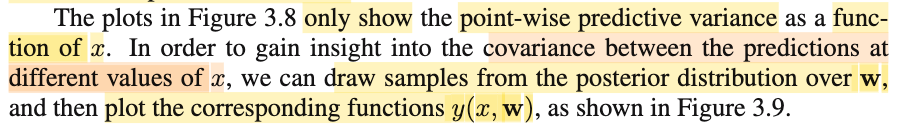
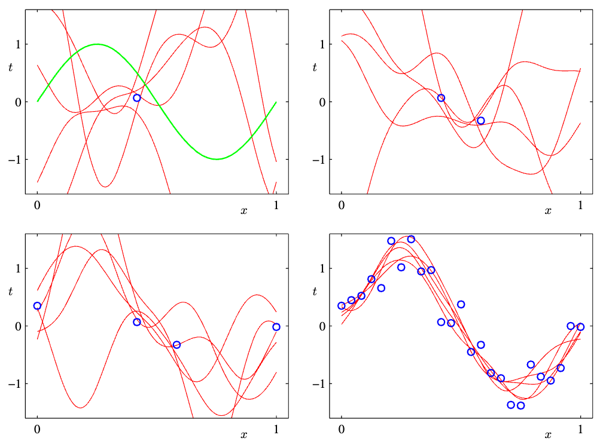
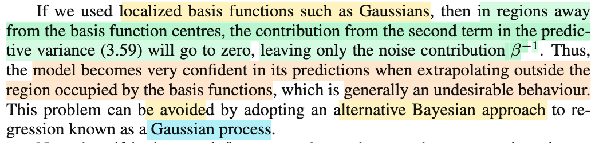
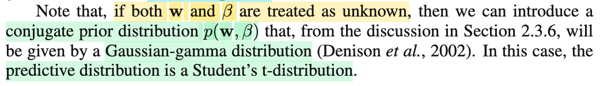

# 3.3.2 Predictive distribution

📊 **Progress:** `6` Notes | `10` Screenshots | `5` AI Reviews

---

<kbd></kbd>

> [!NOTE]
> Rồi, cùng nhau tìm hiểu đoạn này:
>
>
>
> Active recall tí xíu: Bữa giờ mình hay nói về bài toán point estimation trong Statistical Inference của Casella, đó là cho random sample size n 𝐗 = (X1,..Xn) sampling từ population distribution f(x|θ), với θ chưa biết, và bài toán đặt ra là tìm một estimator (theo định nghĩa, là một function của sample: W(𝐗)) để khi evaluate trên observed value 𝐱 = (x1,...xn) của sample thì ta có một estimate value của θ. Thế thì, hai cách tiếp cận lớn, một theo trường phái Clasical (hay Frequentist) và một theo trường phái Bayesian: Maximum likelihood estimator, và Bayes estimator.
>
>
>
> Với MLE, vì theo Frequentist, ta coi θ như fixed & unknown, và đi dùng function sau đây: θ^\_ML(𝐗) = argmax\_θ L(θ|𝐗), với ý nghĩa: Với observed data 𝐗 = 𝐱, thì cái giá trị mà ta dùng để estimate cho θ sẽ là giá trị mà khiến hàm likelihood đạt giá trị lớn nhất (khi xem xét trong mọi giá trị có thể có của θ, tức θ ∈ Θ).
>
>
>
> Còn với Bayes estimator, theo Bayesian approach, ta coi θ như random variable, có distribution trước khi có data, gọi là priori, kí hiệu π(θ), và distribution khi quan sát thấy data, posteriori: π(θ|𝐱), và cái này được xây dựng dựa trên Bayes theorem: π(θ|𝐱) = f(𝐱|θ) π(θ) / f(𝐱). Và sau khi đã có posteriori, vốn dĩ cũng chỉ là một phân phối xác suất, trong khi bài toán yêu cầu là tìm một hàm theo data 𝐗: W(𝐗) để với 𝐗 = 𝐱 thì ta có giá trị của W(𝐱) dùng để estimate cho θ. Vậy thì, bằng cách dùng decision theory, ta sẽ có thể đưa ra quyết định tối ưu cho point estimation của θ dựa trên posterior distribution π(θ|𝐱), và tùy thuộc loss function ta chọn là gì, mà Bayes estimator (kí hiệu θ^\_B(𝐗)) có thể là mean của posterior hoặc là median.
>
>
>
> Quay lại đây, bữa giờ, trong bối cảnh của trí tuệ nhân tạo, machine learning, cụ thể là mô hình tuyến tính, trong nhiệm vụ tìm ra giá trị của tham số w giúp nắm bắt được quy luật map giữa input 𝐱 và giá trị target t, thì chính là ta cũng đi theo hai phương pháp chủ đạo này, để tìm point estimate cho 𝐰. (tất nhiên tham số mô hình không chỉ có 𝐰, mà còn có β,..nhưng chủ yếu là 𝐰). Có nghĩa là, qua tới Bishop, việc training mô hình cơ bản cũng chỉ là giải bài toán point estimation. Và nó khác một chút so với bên Casella, vì với Casella, bài toán là tìm (estimate) tham số θ của phân phối xác suất f(x|θ) mà từ đó dữ liệu quan sát của sample được sinh ra. Còn qua Bishop, ở bài toán regression, câu chuyện nó rắc rối hơn, ở chỗ, bắt đầu từ việc ta có dữ liệu quan sát được: (𝐱1, t1),...(𝐱N, tN), thì không phải là ta sẽ đi estimate tham số θ nào đó của joint distribution f(x, t|θ), vì làm vậy quá khó. Thay vào đó, ta đặt ra một số giả định giúp đơn giản hoá bài toán: Đó là một cách làm đó là:
>
>
>
> Giả định rằng với 𝐱 cho trước, thì T|𝐱 sẽ là một random variable \~ normal(y(𝐰, 𝐱), 1/β). Với mean của distribution này, sẽ là hàm phụ thuộc tham số 𝐰 nào đó, và input 𝐱.
>
>
>
> Giả định này cũng đồng nghĩa: mean của distribution của T|𝐱, sẽ là hàm số nào đó tính bởi input 𝐱 và tham số 𝐰, và nếu ta có thể tìm ra đúng hàm số này, (bao gồm dạng hàm số, và giá trị đúng của tham số 𝐰) thì khi đó sai số của việc dự đoán t từ 𝐱, chỉ còn là ngẫu nhiên. Nói cách khác, ta đang giả định rằng error: ε = sai khác giữa t và \[mean của phân phối của T|𝐱, tính bởi y(𝐰, 𝐱)\] sẽ chỉ là random variable \~ normal(0, 1/β).
>
>
>
> Hãy chú ý, đây chỉ là giả định, và đã giả định thì có thể sai: ví dụ, T|𝐱 có thể không \~ Normal(y(𝐰, 𝐱), 1/β)
>
>
>
> Giả định tiếp theo, (again, trong nhằm mục đích là đơn giản hóa bài toán), là ta gỉa định về dạng của hàm y(𝐰, 𝐱): Cụ thể là ta giả định nó là hàm tuyến tính theo 𝐰, và phi tuyến theo 𝐱, tức là y(𝐰, 𝐱) = 𝐰ᵀ Φ(𝐱). Và bằng cách chọn hàm Φ, nhằm mang lại tính phi tuyến, thì cũng lại là ta thêm một giả định nữa.
>
>
>
> Để rồi với tất cả các giả định này, ta mới bắt đầu đi theo các cách tiếp cận như MLE, Bayes để đi tìm (estimate) 𝐰.
>
>
>
> Thế thì, như đã từng học bên ISL - Tibshirani, mình sẽ hiểu rằng, nếu tất cả các giả định trên là đúng, thì các phương pháp như MLE, Bayes sẽ giúp dẫn ta đến kết quả đúng của 𝐰, từ đó ta có mô hình dự đoán tốt t từ 𝐱. Nhưng nếu giả định là sai, thì dĩ nhiên kết quả sẽ ngược lại.
>
>
>
> Và thật ra, trong bài toán point estimation ra tham số của θ trong Casella, ta cũng sẽ phải đặt ra giả định về phân phối f(𝐱|θ), từ đó mới đi dùng MLE, Bayes để tìm θ, đây gọi là cách tiếp cận parametric model (vs với cách tiếp cận non-parametric model).
>
>
>
> Thế thì, nếu như giả định sai ở chỗ y(𝐰, 𝐱) không phải hàm tuyến tính theo 𝐰, hay hàm giả định về hàm basis Φ(𝐱) là sai, cũng như giả định lớn đầu tiên - T|𝐱 \~ normal(y(𝐰,𝐱), 1/β) là sai thì ta sẽ có những mô hình không nắm bắt được tốt pattern trong dữ liệu, dù có dùng phương pháp gì đi nữa (chưa kể với Bayes, ta còn giả định prior distribution của 𝐰 nữa)
>
>
>
> ---
>
>
>
> Tuy nhiên, như đã nói nếu giả định là đúng thì ta sẽ tìm được estimator tốt cho w (𝐰ML hoặc 𝐰\_Bayes), từ đó y(𝐰,𝐱) sẽ có thể là hàm prediction phản ánh đúng được mapping giữa 𝐱 và t.
>
>
>
> ---
>
>
>
> Thế thì, tới đây ta mới sực nhận ra: Khoan đã, khác với trong bối cảnh Casella, nơi ta muốn tìm population distribution của data, thì ở đây dù nói là muốn tìm 𝐰, nhưng mục đích cuối cùng thật ra là muốn tìm một function y(𝐱), mapping tốt giữa 𝐱 và t, mà giá trị đúng của 𝐰 chỉ là cái góp phần tạo ra cái mapping function này (cái còn lại là dạng function bao gồm dạng hàm tuyến tính wᵀ Φ(𝐱) và lựa chọn hàm basis Φ).
>
>
>
> Vậy thì, nếu như ta dùng MLE, trong đó ta như đã nói, đây là Frequentist, nên ta cho rằng 𝐰 là fixed và unknown, để đi xây dựng hàm 𝐰ML(data), để gắn data vào (dựa trên data), thì 𝐰ML là giá trị của w giúp maximize hàm likelihood. Rồi dùng 𝐰ML này gắn vào y(𝐰, 𝐱) để có prediction function. Nói chung là không có gì để nói.
>
>
>
> Nhưng nếu ta dùng Bayesian approach, thì cái ta có thể có: lại là một distribution của 𝐰: posteriori f(𝐰|data)= f(𝐰|𝐭,𝐗) hay f(𝐰|𝐭) (gs Bishop bỏ đi 𝐗 cho gọn). Vậy thì sao, có gì khác?
>
>
>
> Điểm khác nhau chính là ở chỗ:
>
>
>
> Nhưng với Bayesian, vì ta coi 𝐰 là random variable có distribution f(𝐰|data).
>
>
>
> Và thay vì lắp một point estimate value của w vào y(w,x) để dự đoán cho t. Người ta làm như sau:
>
>
>
> Người ta định nghĩa ra cái gọi là predictive distribution: f(t|𝐱, data), hoặc có thể kể thêm α, β, nhưng không còn depend vào 𝐰 nữa, bằng cách:
>
>
>
> marginalizing f(t|𝐱, 𝐰, β) over mọi possible value của 𝐰:
>
>
>
> f(t|𝐱, α, β) = ∫f(t|𝐱, 𝐰, β) f(𝐰|t, α, β) d𝐰
>
>
>
> để rồi, kết quả là:
>
>
>
> Từ việc ta có f(t|𝐱, 𝐰, β) đang phụ thuộc w, ví dụ như Normal(y(𝐰, 𝐱), 1/β), có mean phụ thuộc 𝐰
>
>
>
> bằng cách marginalizing over mọi 𝐰, thì ta có distribution của T|𝐱 không còn phụ thuộc w nữa. Mà ý nghĩa của nó cũng chính là: Lấy trung bình distribution Normal(y(𝐰, 𝐱), 1/β) trên mọi possible value của 𝐰, dựa theo posterior distribution của 𝐰.
>
>
>
> ---
>
>
>
> Thế thì mình sẽ quay lại sau để nói về cái vụ posterior là Normal, f(t|x, w, β) cũng là normal, nên cái vụ vừa nói xong gọi là convolution và kết quả cũng là cái normal.
>
>
>
> Để nói thêm tí xíu về góc nhìn khác của việc vừa làm:
>
>
>
> Đó là, y(𝐰, 𝐱), với 𝐰, 𝐱 fixed thì y chỉ là fixed. Và câu chuyện chỉ là tìm ra cái giá trị estimate cho 𝐰 mà lắp vào thôi.
>
>
>
> Nhưng với Bayesian thì 𝐰 là random variable có posterior f(𝐰|𝐭), thì lúc này, cái y(𝐰, 𝐱) cũng trở thành random variable. Và thay vì vì gắn một point estimation nào đó của 𝐰 vào, ví dụ như posterior mean E\[𝐰|𝐭\] vào để dùng y(E\[𝐰|𝐭\], 𝐱) làm prediction cho t. Thì ta có thể lấy trung bình trên mọi possible value của 𝐰 đối với của y(𝐰, 𝐱), để làm dự đoán cho t. Có nghĩa là ta với input 𝐱, sẽ dự đoán t bằng:
>
>
>
> h(𝐱) = (E\[y(𝐰, 𝐱)\] với 𝐰 \~ f(𝐰|𝐭).
>
>
>
> Và ôn nhanh LOTUS đã học trong Stat110: khi có X \~ f(x), và Y = g(X), thì EY = E\[g(X)\] = ∫g(x)f(x)dx. Áp dụng vào đây:
>
>
>
> E\[y(𝐰, 𝐱)\] = ∫y(𝐰, 𝐱) f(𝐰|𝐭) d𝐰.
>
>
>
> Có nghĩa là ta có thể:
>
>
>
> Marginalizing over mọi 𝐰 đối với f(t|𝐰,β) để có predictive distribution f(t|𝐭, β, α). Và từ đó, dùng decision theory để đưa ra optimal point estimate cho t.
>
>
>
> Hoặc, thay vì dùng y(𝐰, 𝐱) để predict t, ta dùng E\[y(𝐰,𝐱)\] với w \~ f(𝐰|𝐭) để predict t.
>
>
>
> Chú ý Hai kết quả có thể trùng hoặc không.
>
>
>
> Vì ở cách làm i): Ta coi như là lấy trung bình distribution f(t|𝐰,α, β) trên mọi 𝐰, để có predictive distribution, từ đó đưa ra point estimate tối ưu (dựa theo loss function nào đó)
>
>
>
> Còn với cách làm ii) Ta lấy trung bình các y(𝐰,𝐱) (là mean của T|𝐱 \~ normal(y(𝐰,𝐱), 1/β)) để dự đoán.
>
>
>
> ---
>
>
>
> Quay lại với vụ convolution:
>
>
>
> Đơn giản là ta dùng kết quả đã chứng minh ở chapter 2 (xem link) trong đó nói rằng:
>
>
>
> Với f(𝐱) = N(𝐱|**μ**, **Λ**inv)
>
>
>
> f(𝐲|𝐱) = N(𝐲|**Ax**+𝐛, 𝐋inv)
>
>
>
> thì f(𝐲) (= ∫f(𝐱,𝐲)d𝐱 = ∫f(𝐱|𝐲)f(𝐲)d𝐱) sẽ = N(𝐲|**Aμ** + 𝐛, 𝐋inv + 𝐀 **Λ**inv 𝐀ᵀ) 
>
>
>
> Áp dụng vào đây:
>
>
>
> Posterior distribution của 𝐰:
>
>
>
> f(𝐰|𝐭, α, β) = N(𝐰|𝐦N, 𝐒N) với 𝐦N = 𝐒N\[𝐒0inv𝐦0 + β**Φ**ᵀ𝐭\], 𝐒N⁻¹ = 𝐒0inv + β**Φ**ᵀ**Φ**
>
>
>
> (cái này tương ứng với f(𝐱) = N(𝐱|**μ**, **Λ**inv)) với **μ** tương ứng 𝐦N, **Λ**inv tương ứng 𝐒N)
>
>
>
> f(t|𝐰, β) = N(t|y(𝐰,𝐱), 1/β) = N(t|𝐰ᵀΦ(𝐱),1/β)
>
>
>
> (cái này tương ứng với f(𝐲|𝐱) = N(𝐲|**Ax**+𝐛, 𝐋inv), với 𝐀 = Φ(𝐱)ᵀ, 𝐛 = 0, 𝐋inv = 1/β)
>
>
>
> ⇒ f(t|𝐭, α, β) theo công thức sẽ là tương ứng với N(t|**Aμ** + 𝐛, 𝐋inv + 𝐀 **Λ**inv 𝐀ᵀ)
>
>
>
> thay 𝐀, 𝐛, **μ**, 𝐋inv, **Λ**inv vào
>
>
>
> = N(t|Φ(𝐱)ᵀ𝐦N + 0, 1/β + Φ(𝐱)ᵀ 𝐒N (Φ(𝐱)ᵀ)ᵀ)
>
>
>
> = N(t|(𝐦N)ᵀΦ(𝐱), 1/β + Φ(𝐱)ᵀ 𝐒N Φ(𝐱)) → chính là 3.59

🤖 AI Check — 🟢 Pass — ✅ **98/100** · ✓ Move on

**Summary:** Ghi chú cực kỳ chất lượng, thể hiện tư duy sâu sắc khi liên hệ hệ thống giữa thống kê cổ điển (Casella) và trường phái Bayes để tự chứng minh chi tiết công thức (3.59). Bạn có thể làm rõ thêm rằng việc tìm phân phối dự báo (predictive distribution) vượt trội hơn chỉ tính kỳ vọng E[y(w,x)] ở chỗ nó định lượng được cả độ bất định (variance) của dự báo.

**🔗 See also:** [Optimal Prediction with Gaussian Noise](./311_maximum_likelihood_and_least_squares.md#node-wsglxqn) · [Bayesian Linear Regression Posterior Update](./331_bayesian_linear_regression.md#node-fv65lte) · [Phân bố tiên nghiệm và hậu nghiệm](./233_bayess_theorem_for_gaussian_variables.md#node-zswmsts) · [Predictive Distribution with Hyperpriors](./35_evidence_approximation.md#node-0sy5yof)

 

## Variance of the Predictive Distribution

<kbd></kbd>

> [!NOTE]
> Rồi, qua đọan này, đại ý là, cái variance của predictive distribution vừa rồi sẽ có hai phần
>
>
>
> 1/β + Φ(𝐱)ᵀ 𝐒N Φ(𝐱)
>
>
>
> (với 𝐒N⁻¹ = 𝐒0inv + β**Φ**ᵀ**Φ**)
>
>
>
> thì 1/β (chính là trong assumption T|𝐱 \~ N(y(𝐰,𝐱), 1/β) cũng là ε \~ N(0, 1/β) nên nó chính là variance của noise.
>
>
>
> Còn Φ(𝐱)ᵀ 𝐒N Φ(𝐱) thì ông nói nó phản ánh mức uncertainty của 𝐰. Là sao ta?
>
>
>
> À thì là vì: SN là variance của posterior distribution của 𝐰, nên dĩ nhiên Φ(𝐱)ᵀ 𝐒N Φ(𝐱) sẽ phản ánh mức uncertainty (ý nghĩa của variance là phản ánh mức uncertainty của random variable) của 𝐰.
>
>
>
> Và gs cho biết đại ý là, khi data size (N) tăng lên thì cái cục này (variance của posteriori) luôn giảm. Do đó, khi N → ∞ thì variance của predictive distribution của còn là do variance của noise thôi.

**🔗 See also:** [Convolution hai Gaussian](./233_bayess_theorem_for_gaussian_variables.md#node-15ryxvq)

 

### Figure 3.8 Predictive Distribution

<kbd></kbd>

<kbd></kbd>

<kbd></kbd>

<kbd></kbd>

> [!NOTE]
> Đại khái là để minh họa predictive distribution, gs quay lại ví dụ trong đó ta dùng hàm sinusoidal để generate data. Ta sẽ dùng linear model y(𝐰, x) = w0 + w1 Φ1(x) + ..w9 Φ9(x) với Φi là các Gaussian kernel function (còn nhớ, các basis function chỉ là nhằm tạo ra yếu tố phi tuyến, thì Gaussian kernel basis function Φi(x) chỉ là tạo ra một hàm phi tuyến của x, để rồi từ đó ta có hàm y là hàm phi tuuyến theo x, thế thôi)
>
>
>
> Và 4 hình sẽ là kết quả khi fit linear model này trên 4 bộ data với các size khác nhau (data được tạo bởi hàm sinusoidal + noise)
>
>
>
> Và đường màu đỏ ở mỗi hình chính là mean của predictive distribution (nhớ không predictive distribution kết quả ta derive ra là N(t|(𝐦N)ᵀΦ(𝐱), 1/β + Φ(𝐱)ᵀ 𝐒N Φ(𝐱))
>
>
>
> Nên cụ thể ở đây mean của nó, (𝐦N)ᵀΦ(𝐱):
>
>
>
> với input ở đây là 1 biến, nên không viết bold nữa. Và w ở đây sẽ là vector (w0, ...w9)
>
>
>
> (𝐦N)ᵀΦ(x)
>
>
>
> và mN là gì, là mean của posterior distribution của 𝐰 (cũng sẽ là 9D vector: (wN_1, ...wN_9) mang giá trị nào đó)
>
>
>
> và Φ(x) là vector (1, Φ1(x), ...Φ9(x))
>
>
>
> (𝐦N)ᵀΦ(x) sẽ là dot product của hai vector này, là hàm theo x.
>
>
>
> Để rồi ta sẽ cho x chạy (ví dụ từ 0 → 1) và tính (𝐦N)ᵀΦ(x) và vẽ ra đường màu đỏ.
>
>
>
> Vậy thì ứng với mỗi x, ta sẽ có predictive distribution f(t|x, 𝐭, β, α) (chú ý, luôn phải hiểu là có phụ thuộc x, chẳng qua để cho gọn, ta bỏ nó đi thôi), là normal có mean (𝐦N)ᵀΦ(x) và variance 1/β + Φ(x)ᵀ 𝐒N Φ(x). Và cái phần màu đỏ nhạt chính là đang vẽ phạm vi của 1 standard deviation, là sao:
>
>
>
> Tức là giả sử với x = 0.5 đi, ta sẽ tính 1/β + Φ(x)ᵀ 𝐒N Φ(x), ra được bao nhiêu đó, thì đây chính là variance, đem lấy căn bậc hai, được con số, ví dụ 0.4. Với con số này, ta mới canh từ điểm tương ứng của đường màu đỏ nhạt để vẽ 1 khoảng bên trên và bên dưới rộng = 0.4. Làm tương tự với mọi x khác, ta sẽ có cái vùng mày đỏ nhạt.
>
>
>
> Xét hình 1, khi ta fit model với dataset chỉ có 1 điểm data:
>
>
>
> Cái vùng nhạt ngay tại điểm data bị thắt lại và phình ra ở những chỗ khác, và đường màu đỏ nó gần như thẳng băng là vì sao?
>
>
>
> ---
>
>
>
> Để trả lời ý đầu: Là vì tại x = x1 (data point quan sát được x1,t1) thì variance 1/β + Φ(x1)ᵀ 𝐒N Φ(x1) sẽ nhỏ, còn với x khác x1 thì nó lớn chứ sao. **Nhưng vì sao lại vậy?**
>
>
>
> Lôi lại công thức 𝐒N:
>
>
>
> 𝐒N⁻¹ = 𝐒0inv + β**Φ**ᵀ**Φ**
>
>
>
> Với data chỉ có 1 point, tức N = 1, ta có lúc này là 𝐒1:
>
>
>
> 𝐒1inv = 𝐒0inv + β**Φ**ᵀ**Φ**
>
>
>
> Và **Φ**, là design matrix, còn nhớ, nó là matrix có các hàng là Φ(x1), Φ(x2)....Φ(xn) (và Φ(xk) là 1 vector \[1, Φ1(xk), Φ2(xk),..., ΦM(xk))\].
>
>
>
> Vậy ở đây chỉ có 1 data point. nên **Φ** sẽ chỉ là một row vector (matrix có 1 hàng): Φ(x1)ᵀ
>
>
>
> Dẫn đến **Φ**ᵀ sẽ là matrix có 1 cột: Φ(x1)
>
>
>
> Nên **Φ**ᵀ**Φ** là sẽ là gì? → nó là Φ(x1) nhân Φ(x1)ᵀ, tức là matrix rank 1, tạo bởi outer product của Φ(x1) và chính nó: Φ(x1)Φ(x1)ᵀ
>
>
>
> Như vậy 𝐒1inv là tổng của 𝐒0inv (precision matrix của priori) với rank 1 matrix βΦ(x1)Φ(x1)ᵀ:
>
>
>
> 𝐒1inv = 𝐒0inv + βΦ(x1)Φ(x1)ᵀ
>
>
>
> Với 𝐒0 = (1/α)𝐈 thì 𝐒0inv = α𝐈
>
>
>
> 𝐒1inv = α𝐈 + βΦ(x1)Φ(x1)ᵀ
>
>
>
> ⇒ 𝐒1 = \[α𝐈 + βΦ(x1)Φ(x1)ᵀ\]⁻¹
>
>
>
> Vậy quay lại câu hỏi tại sao khi x ở gần x1 thì variance 1/β + Φ(x1)ᵀ 𝐒1 Φ(x1) sẽ nhỏ, còn với x ra xa x1 thì nó lớn?
>
>
>
> Xét biết thiên hàm f(x) = 1/β + Φ(x)ᵀ 𝐒1 Φ(x)
>
>
>
> = 1/β + Φ(x)ᵀ \[α𝐈 + βΦ(x1)Φ(x1)ᵀ\]⁻¹ Φ(x)
>
>
>
> Tới đây, theo gợi ý của thằng Gemini, mình sẽ mượn đến một công thức mà thật ra đã gặp trong lúc học cuốn Numerical Optimization của Nocedal: Đại ý là trong chap 7, khi học về BFGS, mình gặp học một công thức nghịch đảo matrix tên là Sherman-Morrison formula (hình chụp trong Appendix của cuốn này) nói rằng:
>
>
>
> (A + abᵀ)⁻¹ = A⁻¹ - (A⁻¹ abᵀ A⁻¹) / (1 + bᵀ A⁻¹ a) 
>
>
>
> Áp dụng cái này ta có:
>
>
>
> \[α𝐈 + βΦ(x1)Φ(x1)ᵀ\]⁻¹ 
>
>
>
> = (α𝐈)⁻¹ - ((α𝐈)⁻¹ βΦ(x1)Φ(x1)ᵀ (α𝐈)⁻¹) / (1 + βΦ(x1)ᵀ (α𝐈)⁻¹ Φ(x1)) 
>
>
>
> = (1/α)𝐈 - (\[(1/α)𝐈\] βΦ(x1)Φ(x1)ᵀ \[(1/α)𝐈\] / (1 + βΦ(x1)ᵀ \[(1/α)𝐈\] Φ(x1)) 
>
>
>
> = (1/α)𝐈 - \[(1/α²) Φ(x1)Φ(x1)ᵀ \] / (1 + (1/α) βΦ(x1)ᵀ Φ(x1)) 
>
>
>
> = (1/α)𝐈 - \[(1/α²) βΦ(x1)Φ(x1)ᵀ\] / (1 + (1/α) βΦ(x1)ᵀ Φ(x1)) 
>
>
>
> = (1/α)𝐈 - \[(1/α²) βΦ(x1)Φ(x1)ᵀ\] / (1 + (1/α) β ||Φ(x1)||²)
>
>
>
> = (1/α)𝐈 - {\[(1/α²) β\] / (1 + (1/α) β ||Φ(x1)||²)} Φ(x1)Φ(x1)ᵀ
>
>
>
> = (1/α)𝐈 - \[β / (α² + α β ||Φ(x1)||²\] Φ(x1)Φ(x1)ᵀ
>
>
>
> Cái này tuy phức tạp nhưng chỉ là 
>
>
>
> = (1/α)𝐈 - c Φ(x1)Φ(x1)ᵀ
>
>
>
> với c là scalar value =  β / (α² + α β ||Φ(x1)||²
>
>
>
> Vậy  f(x) = 1/β + Φ(x)ᵀ 𝐒1 Φ(x)
>
>
>
>  = 1/β + Φ(x)ᵀ \[(1/α)𝐈 - c Φ(x1)Φ(x1)ᵀ\] Φ(x)
>
>
>
>  = 1/β + Φ(x)ᵀ \[(1/α)𝐈\] Φ(x) - Φ(x)ᵀ\[c Φ(x1)Φ(x1)ᵀ\] Φ(x)
>
>
>
>  = 1/β + (1/α) Φ(x)ᵀΦ(x) - c Φ(x)ᵀ\[Φ(x1)Φ(x1)ᵀ\] Φ(x)
>
>
>
>  = 1/β + (1/α) ||Φ(x)||² - c \[Φ(x)ᵀΦ(x1)\]²
>
>
>
> Tới đây ta có thể phân tích giá trị của  f(x) = 1/β + Φ(x)ᵀ 𝐒1 Φ(x) khi x tới gần x1 và ra xa x1: 
>
>
>
> Khi x ≈ x1. Thì vector Φ(x) sẽ ≈ Φ(x1), tức là hai vector gần trùng hướng nhau → Φ(x)ᵀΦ(x1) đạt max khiến cho cụm - c \[Φ(x)ᵀΦ(x1)\]² đạt min
>
>
>
> Còn ra xa x1 thì Φ(x) sẽ khác hướng Φ(x1) → Φ(x)ᵀΦ(x1) sẽ giảm (về 0 khi chúng orthogonal) → - c \[Φ(x)ᵀΦ(x1)\]² tăng lên.
>
>
>
> Và điều này giải thích cho việc vùng đỏ nhạt sẽ bị hẹp lại khi gần x1 và phình to khi ra xa.
>
>
>
> Dĩ nhiên khi x thay đổi thì ||Φ(x)||² cũng thay đổi, nó sẽ giải thích cho bề rộng của dải đỏ nhạt sẽ thay đổi theo x, nhưng cái vụ bóp lại khi tới gần x1 thì là do cái trên.
>
>
>
> Và ý nghĩa của nó:
>
>
>
> Tại x gần x1, xác suất tập trung cao quanh mean của predictive distribution f(t|𝐭,x,α,β). Ngược lại, tại x xa x1, xác suất dàn trải rất rộng quanh mean.
>
>
>
> mà điều này có nghĩa là: tại x gần x1, nếu bảo mô hình dự đoán giá trị của t, nó sẽ tự tin mà phán: mean của f(t|𝐭,x,α,β). Ngược lại, nó sẽ không chắc lắm.
>
>
>
> ---
>
>
>
> Còn câu hỏi thứ hai: là vì sao trong hình một đường màu đỏ gần như đi ngang?

🤖 AI Check — 🟢 Pass — ✅ **98/100** · ✓ Move on

**Summary:** Ghi chú của bạn rất xuất sắc, có độ sâu toán học cao khi tự biến đổi công thức Sherman-Morrison để giải thích định lượng hiện tượng 'thắt nút' của phương sai tại điểm dữ liệu quan sát. Để hoàn thiện hơn nữa, bạn có thể giải thích thêm lý do tại sao đường mean màu đỏ gần như nằm ngang ở hình thứ nhất (gợi ý: liên quan đến việc ưu tiên của prior khi chỉ có 1 điểm dữ liệu).

 

#### Covariance of Predictive Distributions

<kbd></kbd>

<kbd></kbd>

> [!NOTE]
> Tiếp, cùng tìm hiểu đoạn này.
>
>
>
> Đầu tiên, gs nói cái hình trước, cụ thể là cái bề rộng của dải màu đỏ nhạt tại một vị trí x, như đã hiểu, nó chính là phương sai của predictive distribution f(t|𝐭, x, α, β), mà ta đã hiểu nó là normal(t|𝐦NᵀΦ(𝐱), 1/β + Φ(𝐱)ᵀ𝐒NΦ(𝐱)) tại x (nên gs mới nói rằng: nó chỉ là point-wise predictive variance 1/β + Φ(𝐱)ᵀ𝐒NΦ(𝐱) khi xem xét ở khía cạnh nó là hàm theo 𝐱.
>
>
>
> Thế thì, như vậy, ta chỉ có thể nhìn vào đồ thị này, để có hiểu rằng, với x cho trước, ta có thể tự tin cỡ nào nếu lấy mean của của predictive distribution, tức 𝐦NᵀΦ(𝐱) để dự đoán cho t, mà nơi vùng đỏ nhạt phình ra chính là nơi mà mô hình không tự tin lắm (khi dùng 𝐦NᵀΦ(𝐱) để dự đoán cho t tương ứng với x tại đó
>
>
>
> Tuy nhiên, gs đề cập đến việc, ta muốn biết sự tương quan của variance tại các vị trí khác nhau (có nghĩa là, ví dụ như tại x1, variance là vầy, tại x2 variance là vầy, nhưng tương quan của chúng thế nào, vì đây là một dạng thông tin khác, cho biết tương quan giữa variance giữa hai điểm) - giống như ta có hai variable X, Y. Var(X), Var(Y) sẽ cho ta biết về mức biến động của nó quanh mean của mỗi đứa, nhưng covariance Cov(X,Y) sẽ cho biết sự tương quan giữa mức biến động của hai thằng với nhau.
>
>
>
> Thế thì để có được thông tin như vậy, ta sẽ làm như sau:
>
>
>
> Đại khái là vì ta đã có posterior distribution f(𝐰|𝐭, 𝐗, α, β) (hay nếu bỏ 𝐗 đi cho gọn thì là f(𝐰|𝐭, α, β)). Và giả sử tìm được 𝐰 thì ta sẽ dùng 𝐰ᵀΦ(𝐱) để dự đoán cho t. (chú ý coi chừng lú chỗ này: Ở trên, khi ta nói mình dùng mean của predictive distribution 𝐦NᵀΦ(𝐱) để dự đoán cho t thì ý là vì đây là cách làm tối ưu, khi thay vì ta đi tìm 𝐰 tốt nhất để lắp vào 𝐰ᵀΦ(𝐱), ta lấy trung bình lại, để có một predictive distribution không còn phụ thuộc 𝐰, rồi dùng mean của nó để dự đoán. Còn ở đây ta làm theo kiểu cũ - lắp 𝐰 vào 𝐰ᵀΦ(𝐱).
>
>
>
> Như vậy, ta sẽ làm như sau: sampling w từ posterior distribution, và lắp vào 𝐰ᵀΦ(𝐱), và vẽ đồ thị hàm 𝐰ᵀΦ(𝐱) ra. Kết quả là với mỗi sample, ta được một hàm 𝐰ᵀΦ(𝐱), vẽ đồ thị ra, ta được một đường màu đỏ.
>
>
>
> Từ đó, nhận xét như sau:
>
>
>
> Các đường màu đỏ uốn lượn lên xuống rất mượt
>
>
>
> Và so sánh các hình thì có nhận xét sau:
>
>
>
> Khi chỉ có một data point, các đường màu đỏ tuy đều cố đi qua điểm data, nhưng sau đó chúng chạy lên chạy xuống tán loạn.
>
>
>
> Khi tăng số data point lên, các đường màu đỏ sinh ra bắt đầu ít tán loạn hơn.
>
>
>
> Và khi data là 20 điểm, thì chúng giống như bắt đầu giống giống nhau.
>
>
>
> Thế thì, ý nghĩa cần hiểu là
>
>
>
> i) Tại sao khi data càng nhiều thì các đường màu đỏ giống như bắt đầu giống giống nhau?
>
>
>
> Thì đại ý thế này: Ta đã biết posterior của w là một phân phối normal có mean 𝐦N và covariance matrix 𝐒n.
>
>
>
> Và 𝐒n (covariance của 𝐰 sau khi có N data point) liên hệ với S0 (prior covariance của 𝐰, khi chưa có data) qua công thức sau: 𝐒N⁻¹ = 𝐒0inv + β**Φ**ᵀ**Φ**.
>
>
>
> Và trong note trước mình cũng đã hiểu **Φ**ᵀ**Φ**, với **Φ**, là design matrix có các hàng là các vector Φ(x1), Φ(x2),...Φ(xN). Thì **Φ**ᵀ**Φ** sẽ là tổng N các rank 1 matrix tạo bởi outer product của Φ(xj) và chính nó:
>
>
>
> **Φ**ᵀ**Φ** = Σj=1:N Φ(xj)Φ(xj)ᵀ.
>
>
>
> Như vậy ta sẽ thấy rằng: Khi càng có thêm data, thì cái tổng này càng bự ra, khiến giá trị của các phần tử matrix **Φ**ᵀ**Φ** sẽ càng lớn. Và có nghĩa 𝐒N⁻¹ = 𝐒0inv + β**Φ**ᵀ**Φ** cũng sẽ càng lớn. Điều này dẫn đến 𝐒N là nghịch đảo của 𝐒N⁻¹ sẽ càng nhỏ lại.
>
>
>
> Vậy thì hệ quả là gì: Để hiểu, ta cần hiểu ý nghĩa của covariance matrix, nó tương tự như variance σ² trong normal đơn biến n(μ, σ²) vậy: Khi σ² càng nhỏ, thì cái dạng hình chuông càng nhọn tại μ, xác suất tập trung cao tại đây. Và ý nghĩa của chuyện này là: NẾU TA SAMPLING TỪ DISTRIBUTION NHỌN NÀY, CÁC GIÁ TRỊ SẼ XUẤT HIỆN GIỐNG GIỐNG NHAU (VÀ GIỐNG μ). Ngược lại, nếu σ² lớn, cái xác suất phân tán rộng, nên khi sampling, các giá trị có được sẽ rất khác nhau.
>
>
>
> Vậy thì ở đây cũng y vậy: khi chỉ có 1 data, 𝐒1inv còn nhỏ, khiến 𝐒1 còn lớn, dẫn đến khi sampling 𝐰 từ posterior normal(𝐦1, 𝐒1) thì CÁC GIÁ TRỊ THU ĐƯỢC 𝐰 RẤT KHÁC NHAU, VÀ DO ĐÓ, CÁC HÀM SỐ y(𝐰, x) = 𝐰ᵀΦ(x) CŨNG RẤT KHÁC NHAU ⇒ CÁC ĐƯỜNG MÀU ĐỎ RẤT KHÁC NHAU.
>
>
>
> Khi data tăng lên, SN⁻¹ tăng lên, SN nhỏ lại, nên giống như SAMPLING TỪ MỘT DISTRIBUTION NORMAL CÓ HÌNH CHUÔNG NHỌN HOẮC tại 𝐦N, kết quả sẽ ra các giá trị w đều giống giống 𝐦N, và DO ĐÓ, CÁC HÀM 𝐰ᵀΦ(x) CŨNG TRỞ NÊN GIỐNG NHAU → CÁC ĐƯỜNG MÀU ĐỎ CỦA HÌNH CUỐI GIỐNG NHƯ BÓ LẠI THÀNH 1 BÓ LÀ VẬY
>
>
>
> ---
>
>
>
> ii) Bản thân các đường màu đỏ, vì sao chúng lại uốn lượn mượt như vậy?
>
>
>
> Để hiểu, ta sẽ đi từng bước như sau:
>
>
>
> Như đã biết, ta đang coi 𝐰 là random variable có distribution là posterior f(𝐰|𝐭,α,β). Thế thì, với một x fixed, y(x, 𝐰) = 𝐰ᵀΦ(x) là một hàm của 𝐰, nên nó cũng là một random variable. Vậy ta sẽ xét hai random variable sau:
>
>
>
> y(x1, 𝐰) và y(x2, 𝐰), đặt là Y1, Y2 cho gọn
>
>
>
> và đi xét covarinance của hai random variable này. Dùng công thức Cov(X,Y) đã học trong Stat110 hay Casella, = E\[(X - EX)(Y - EY)\], ta có:
>
>
>
> Cov(Y1, Y2) = E\[(Y1-EY1)(Y2-EY2)\]
>
>
>
> = E\[Y1Y2 - (EY1)Y2 - Y1EY2 + (EY1)EY2\]
>
>
>
> = E(Y1Y2) - E\[(EY1)Y2\] - E\[Y1EY2\] + E\[(EY1)EY2\]
>
>
>
> = E(Y1Y2) - EY1 EY2 - EY1 EY2 + EY1 EY2
>
>
>
> = E(Y1Y2) - EY1 EY2
>
>
>
> = E(𝐰ᵀΦ(x1)𝐰ᵀΦ(x2)) - E(𝐰ᵀΦ(x1)) E(𝐰ᵀΦ(x2))
>
>
>
> Do 𝐰ᵀΦ(x1) là scalar ⇒ 𝐰ᵀΦ(x1) = \[𝐰ᵀΦ(x1)\]ᵀ = Φ(x1)ᵀ𝐰
>
>
>
> Và tính linearity của kì vọng cho ta E(𝐰ᵀΦ(x1)) = E(𝐰)ᵀΦ(x1)), E(𝐰ᵀΦ(x2)) = E(𝐰)ᵀΦ(x2)),
>
>
>
> = E(Φ(x1)ᵀ**ww**ᵀΦ(x2)) - E(𝐰)ᵀΦ(x1)) E(𝐰)ᵀΦ(x2))
>
>
>
> Tiếp tục dùng tính linearity: E(Φ(x1)ᵀ**ww**ᵀΦ(x2)) = Φ(x1)ᵀE(**ww**ᵀΦ(x2)) = Φ(x1)ᵀE(**ww**ᵀ)Φ(x2)
>
>
>
> Và dùng tính chất E(𝐰)ᵀΦ(x1) là scalar nên E(𝐰)ᵀΦ(x1) = \[E(𝐰)ᵀΦ(x1)\]ᵀ = Φ(x1)ᵀE(𝐰)
>
>
>
> = Φ(x1)ᵀE(**ww**ᵀ)Φ(x2) - Φ(x1)ᵀE(𝐰) E(𝐰)ᵀΦ(x2)
>
>
>
> Tới đây gom lại (đặt thừa số chung):
>
>
>
> = Φ(x1)ᵀ \[ E(**ww**ᵀ) - E(𝐰) E(𝐰)ᵀ\] Φ(x2)
>
>
>
> Xét cục ở giữa: E(**ww**ᵀ) - E(𝐰) E(𝐰)ᵀ, thì đây chính là định nghĩa của cov(𝐰, 𝐰) hay cov(𝐰), tức covariance matrix (Xem link).
>
>
>
> Và 𝐰 \~ prior distribution là normal(m0, posterior là normal(t|𝐦N, 𝐒N)
>
>
>
> nên cov(𝐰, 𝐰) chính là 𝐒N
>
>
>
> Vậy, Cov(Y1, Y2) = Φ(x1)ᵀ 𝐒N Φ(x2)
>
>
>
> Và kết quả này giúp ta trả lời câu hỏi, Cov(X, Y) sẽ cho biết tương quan của chúng, nếu covariance lớn, thì sẽ biểu hiện xu hướng hai thằng cùng lớn hoặc cùng bé, ví dụ X lớn hơn EX thì Y cũng vậy. Còn ngược lại, nếu nó nhỏ, thì biểu hiện xu hướng một thằng lớn thì thằng kia bé.
>
>
>
> Vậy, nếu xét x1, x2 là hai điểm gần nhau: x1 ≈ x2, thì dĩ nhiên Φ(x1) sẽ ≈ Φ(x2) tức là hai vector gần trùng nhau.
>
>
>
> (chú ý Φ(x) là vector chứa các phần tử 1, Φ1(x),...Φ9(x))
>
>
>
> Và xét Φ(x1)ᵀ 𝐒N Φ(x2)
>
>
>
> 𝐒N, là matrix xác định dương (positive definite). Chứng minh rất nhanh thôi:
>
>
>
> Với covariance matrix, Cov(𝐗), có công thức = E\[(𝐗 - 𝐚)(𝐗 - 𝐚)ᵀ\] (xem link, như hồi nãy), sẽ luôn bán xác định dương:
>
>
>
> Như đã học trong MIᵀ 1806, để chứng minh matrix A positive semi definite, chỉ cần chứng minh quadratic form xᵀAx của nó không âm khi x khác 0.
>
>
>
> Vậy ở đây ta xét 𝐳ᵀCov(𝐗)𝐳, = 𝐳ᵀE\[(𝐗 - 𝐚)(𝐗 - 𝐚)ᵀ\]𝐳 = E\[𝐳ᵀ(𝐗 - 𝐚)(𝐗 - 𝐚)ᵀ𝐳\] (đưa 𝐳 vào, do tính linearity) 
>
>
>
> = E{ \[(𝐗 - 𝐚)ᵀ𝐳\]ᵀ \[(𝐗 - 𝐚)ᵀ𝐳\] }
>
>
>
> = E{ \[(𝐗 - 𝐚)ᵀ𝐳\]²} (vì = (𝐗 - 𝐚)ᵀ𝐳 là scalar nên tranpose của nó bằng chính nó, nên đây là bình phương của nó.
>
>
>
> và \[(𝐗 - 𝐚)ᵀ𝐳\]² ≥ 0 nên kì vọng cũng không âm, vậy covariance matrix luôn bán xác định dương.
>
>
>
> Thế thì 𝐒N⁻¹ = 𝐒0inv + β**Φ**ᵀ**Φ**. Trong đó 𝐒0 đều là covariance matrix (của posterior và prior) nên sẽ bán xác định dương như vừa chứng minh, nhưng ta biết nó lại được chọn là (1/α)𝐈, nên nó xác định dương luôn chứ không bán, và đương nhiên nghịch đảo cũng vậy. Còn **Φ**ᵀ**Φ** thì là Gram matrix, đã biết nó cũng bán xác định dương rồi. Vậy tổng hai thằng nhất định xác định dương. Dẫn đến 𝐒N xác định dương
>
>
>
> Do đó Φ(x1)ᵀ 𝐒N Φ(x2) ≈ Φ(x1)ᵀ 𝐒N Φ(x1), và đây chính là **quadratic form** của 𝐒N, với matrix xác định dương, thì **quadratic form** sẽ **luôn là số dương**.
>
>
>
> Và do đó, với x1 ≈ Φ(x1)ᵀ 𝐒N Φ(x2) = Cov(Y1, Y2) sẽ luôn là số dương, khiến cho Y1, Y2 đều luôn có xu hướng lớn nhỏ cùng nhau và điều này dẫn tới đồ thị đường màu đỏ y(𝐰, x) = 𝐰ᵀΦ(x) SẼ UỐN LƯỢN, VÌ CÁI SỰ UỐN LƯỢN NÀY CHÍNH LÀ HỆ QỦA VIỆC VIỆC HAI ĐIỂM X GẦN NHAU SẼ CÓ XU HƯỚNG CÓ GIÁ TRỊ HÀM SỐ GIỐNG NHAU, NẾU KHÔNG, ĐỒ THỊ SẼ GIẬT CỤC NHƯ RĂNG CƯA VẬY.

🤖 AI Check — 🟢 Pass — ✅ **98/100** · ✓ Move on

**Summary:** Excellent note with exceptionally clear intuition and rigorous mathematical derivation of the covariance between predictions. To make it even better, you could explicitly mention that the smoothness also depends on the choice of continuous basis functions, such as Gaussians.

**🔗 See also:** [Ma trận Hiệp Phương Sai](./1212_probability_densities_expectations_covariances.md#node-jrsj465) · [Covariance and the Equivalent Kernel](./333_equivalent_kernel.md#node-fpm5jlu)

 

##### Localized Basis Functions and Gaussian Processes

<kbd></kbd>

> [!NOTE]
> Đoạn này đại ý là nói rằng nếu ta dùng hàm basis, là mấy cái hàm Φ1(x),...Φ9(x) đó, mà ở đây cụ thể là dùng Gaussian kernel basis function, trong đó nó sẽ tạo pattern phi tuyến theo kiểu hình cái chuông, để khi input x gần tâm - tâm này cũng define sẵn trong hàm, thì Φ(x) sẽ lớn và càng ra xa thì hàm nhỏ lại. Thế thì dễ hiểu là nếu hàm basis kiểu này chỉ mang tính local (mà cái chuông vừa mô tả chính là mang tính local vì dạng đường cong của cái chuông chỉ nằm trong phạm vi cục bộ quanh tâm nào đó, còn khi ra xa thì nó xẹp về constant = 0) thì Φ(x) sẽ = 0, và do đó variance của predictive distribution = 1/β + Φ(x1)ᵀ 𝐒N Φ(x2) chỉ còn 1/β.
>
>
>
> Và điều này gây ra một đặc điểm: Với những điểm ở xa phạm vi của basis function thì predictive distribution lại rất tự tin (vì variance nó nhỏ lại). Và sự tự tin này hoàn toàn không do cơ sở nào cả, chỉ là vì cái hành vi của hàm basis cục bộ.
>
>
>
> Gs nói, để khắc phục, ta sẽ học qua Gaussian process, là một cách tiếp cận Bayesian khác.

🤖 AI Check — 🟢 Pass — ✅ **95/100** · ✓ Move on

**Summary:** Giải thích của bạn rất xuất sắc và chi tiết, thể hiện sự hiểu biết sâu sắc về bản chất toán học lẫn trực quan vật lý của vấn đề. Điểm lưu ý duy nhất là công thức phương sai dự báo tại một điểm nên là $\phi(x)^T \mathbf{S}_N \phi(x)$ thay vì dùng hai điểm $x_1, x_2$ (vốn là công thức hiệp phương sai giữa hai điểm khác nhau).

 

###### Suy luận w và beta

<kbd></kbd>

> [!NOTE]
> Rồi đoạn cuối đấy là nói sang cái việc mình coi beta cũng là biến ngẫu nhiên. Beta thì ta nhớ 1 phần beta là phương sai của phân phối chuẩn mà mình dùng để giả định cho nhiễu. Và cũng đồng nghĩa là mình cũng giả định biến ngẫu nhiên t là theo phân phối chuẩn có tâm là hàm y (x, w) và phương sai là 1 phần beta. Vậy thì đấy là hồi đầu đến giờ là mình đang chỉ xét cái bài toán suy luận ra cái giá trị của w theo cách tiếp cận Bayesian. Thì nay là mình sẽ nếu mình tính luôn cả beta vô thì nó sẽ khác chút xíu. Lúc trước nếu như mình chỉ suy luận cho w và mình coi hoặc là giả định beta đã biết thì đương nhiên là mình chỉ phải chọn cái phân phối tiên nghiệm, prior distribution của w. Và như đã nói vì hàm likelihood là một cái phân phối chuẩn, hoặc là giả định là phân phối chuẩn, cho nên là tiên nghiệm liên hợp của phân phối chuẩn là Gaussian, cũng là phân phối chuẩn, cho nên là mình sẽ có cái phân phối tiên nghiệm của w là phân phối chuẩn, và dẫn đến là phân phối hậu nghiệm posterior nó cũng là phân phối chuẩn. Còn bây giờ nếu như mình xét beta cũng là biến ngẫu nhiên, thì lúc bấy giờ mình sẽ phải chọn phân phối tiên nghiệm không phải chỉ của w mà là của w và beta cùng lúc.\
> \
> Và trong cái chương 2 đó là mình đã học về cái trường hợp này khi mà giáo sư đã chuẩn bị một số cái nền tảng về xác suất cho những cái phần sau đây mình không cần phải làm lại. Cụ thể đó là khi mà mình xét cả W và beta thì phân phối tiên nghiệm của W beta sẽ là một cái phân phối gọi là Gaussian gamma và dựa trên cái phân phối tiên nghiệm đó mình tiến hành xây dựng phân phối predictive thì mình sẽ thấy nó không phải phân phối chuẩn nữa mà nó sẽ là phân phối student T.

🤖 AI Check — 🟢 Pass — ✅ **100/100** · ✓ Move on

**Summary:** Ghi chú vô cùng xuất sắc, không chỉ dịch đúng nội dung cốt lõi của đoạn text (tiên nghiệm Gaussian-gamma và phân phối dự báo Student-t) mà còn hệ thống hóa rất tốt kiến thức nền tảng liên quan. Tư duy liên kết mạch lạc này rất đáng khen ngợi, hãy tiếp tục duy trì nhé!

 

