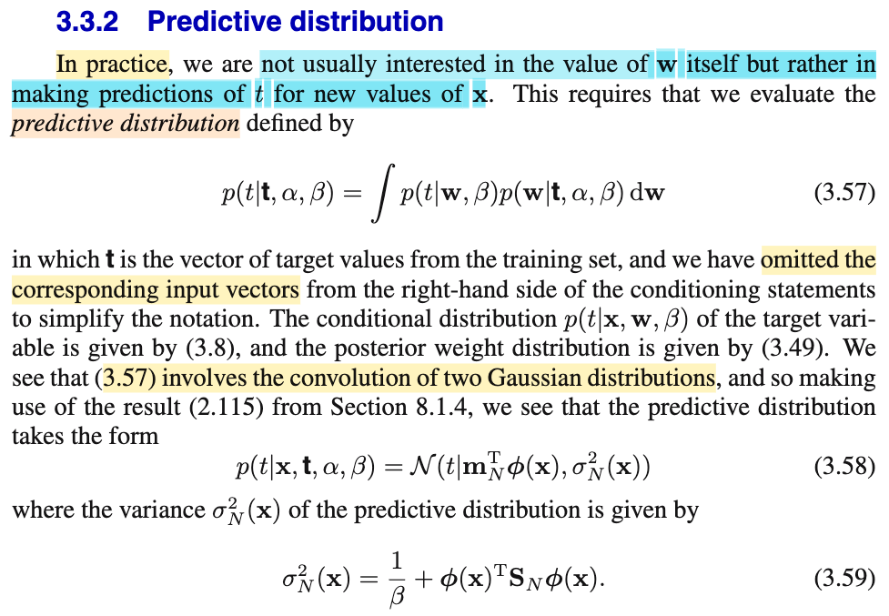
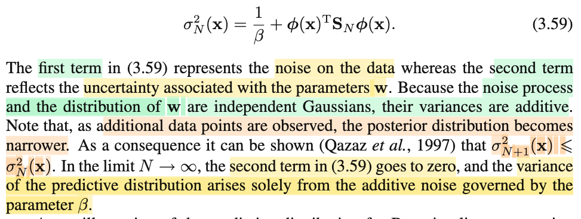
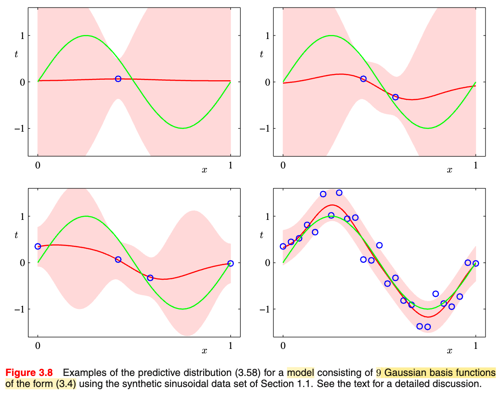
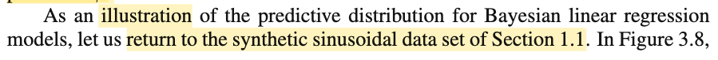
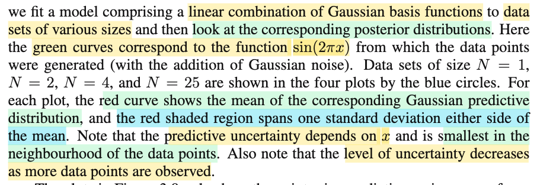
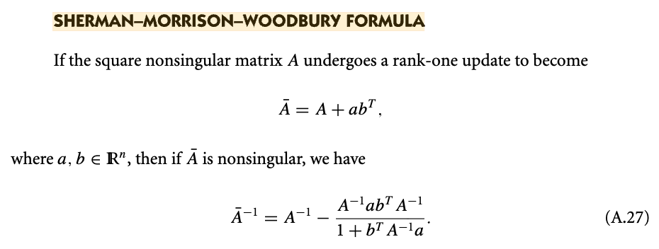

# 3.3.2 Predictive distribution

📊 **Progress:** `3` Notes | `6` Screenshots | `2` AI Reviews

---

## 3.3.2 Predictive distribution

<kbd></kbd>

> [!NOTE]
> Rồi, cùng nhau tìm hiểu đoạn này:
>
>
>
> Active recall tí xíu: Bữa giờ mình hay nói về bài toán point estimation trong Statistical Inference của Casella, đó là cho random sample size n **X** = (X1,..Xn) sampling từ population distribution f(x|θ), với θ chưa biết, và bài toán đặt ra là tìm một estimator (theo định nghĩa, là một function của sample: W(**X**)) để khi evaluate trên observed value **x** = (x1,...xn) của sample thì ta có một estimate value của θ. Thế thì, hai cách tiếp cận lớn, một theo trường phái Clasical (hay Frequentist) và một theo trường phái Bayesian: Maximum likelihood estimator, và Bayes estimator.
>
>
>
> Với MLE, vì theo Frequentist, ta coi θ như fixed & unknown, và đi dùng function sau đây: θ^\_ML(**X**) = argmax\_θ L(θ|**X**), với ý nghĩa: Với observed data **X** = **x**, thì cái giá trị mà ta dùng để estimate cho θ sẽ là giá trị mà khiến hàm likelihood đạt giá trị lớn nhất (khi xem xét trong mọi giá trị có thể có của θ, tức θ ∈ Θ).
>
>
>
> Còn với Bayes estimator, theo Bayesian approach, ta coi θ như random variable, có distribution trước khi có data, gọi là priori, kí hiệu π(θ), và distribution khi quan sát thấy data, posteriori: π(θ|**x**), và cái này được xây dựng dựa trên Bayes theorem: π(θ|**x**) = f(**x**|θ) π(θ) / f(**x**). Và sau khi đã có posteriori, vốn dĩ cũng chỉ là một phân phối xác suất, trong khi bài toán yêu cầu là tìm một hàm theo data **X**: W(**X**) để với **X** = **x** thì ta có giá trị của W(**x**) dùng để estimate cho θ. Vậy thì, bằng cách dùng decision theory, ta sẽ có thể đưa ra quyết định tối ưu cho point estimation của θ dựa trên posterior distribution π(θ|**x**), và tùy thuộc loss function ta chọn là gì, mà Bayes estimator (kí hiệu θ^\_B(**X**)) có thể là mean của posterior hoặc là median.
>
>
>
> Quay lại đây, bữa giờ, trong bối cảnh của trí tuệ nhân tạo, machine learning, cụ thể là mô hình tuyến tính, trong nhiệm vụ tìm ra giá trị của tham số w giúp nắm bắt được quy luật map giữa input **x** và giá trị target t, thì chính là ta cũng đi theo hai phương pháp chủ đạo này, để tìm point estimate cho **w**. (tất nhiên tham số mô hình không chỉ có **w**, mà còn có β,..nhưng chủ yếu là **w**). Có nghĩa là, qua tới Bishop, việc training mô hình cơ bản cũng chỉ là giải bài toán point estimation. Và nó khác một chút so với bên Casella, vì với Casella, bài toán là tìm (estimate) tham số θ của phân phối xác suất f(x|θ) mà từ đó dữ liệu quan sát của sample được sinh ra. Còn qua Bishop, ở bài toán regression, câu chuyện nó rắc rối hơn, ở chỗ, bắt đầu từ việc ta có dữ liệu quan sát được: (**x**1, t1),...(**x**N, tN), thì không phải là ta sẽ đi estimate tham số θ nào đó của joint distribution f(x, t|θ), vì làm vậy quá khó. Thay vào đó, ta đặt ra một số giả định giúp đơn giản hoá bài toán: Đó là một cách làm đó là:
>
>
>
> Giả định rằng với **x** cho trước, thì T|**x** sẽ là một random variable \~ normal(y(**w**, **x**), 1/β). Với mean của distribution này, sẽ là hàm phụ thuộc tham số **w** nào đó, và input **x**.
>
>
>
> Giả định này cũng đồng nghĩa: mean của distribution của T|**x**, sẽ là hàm số nào đó tính bởi input **x** và tham số **w**, và nếu ta có thể tìm ra đúng hàm số này, (bao gồm dạng hàm số, và giá trị đúng của tham số **w**) thì khi đó sai số của việc dự đoán t từ **x**, chỉ còn là ngẫu nhiên. Nói cách khác, ta đang giả định rằng error: ε = sai khác giữa t và \[mean của phân phối của T|**x**, tính bởi y(**w**, **x**)\] sẽ chỉ là random variable \~ normal(0, 1/β).
>
>
>
> Hãy chú ý, đây chỉ là giả định, và đã giả định thì có thể sai: ví dụ, T|**x** có thể không \~ Normal(y(**w**, **x**), 1/β)
>
>
>
> Giả định tiếp theo, (again, trong nhằm mục đích là đơn giản hóa bài toán), là ta gỉa định về dạng của hàm y(**w**, **x**): Cụ thể là ta giả định nó là hàm tuyến tính theo **w**, và phi tuyến theo **x**, tức là y(**w**, **x**) = **w**T Φ(**x**). Và bằng cách chọn hàm Φ, nhằm mang lại tính phi tuyến, thì cũng lại là ta thêm một giả định nữa.
>
>
>
> Để rồi với tất cả các giả định này, ta mới bắt đầu đi theo các cách tiếp cận như MLE, Bayes để đi tìm (estimate) **w**.
>
>
>
> Thế thì, như đã từng học bên ISL - Tibshirani, mình sẽ hiểu rằng, nếu tất cả các giả định trên là đúng, thì các phương pháp như MLE, Bayes sẽ giúp dẫn ta đến kết quả đúng của **w**, từ đó ta có mô hình dự đoán tốt t từ **x**. Nhưng nếu giả định là sai, thì dĩ nhiên kết quả sẽ ngược lại.
>
>
>
> Và thật ra, trong bài toán point estimation ra tham số của θ trong Casella, ta cũng sẽ phải đặt ra giả định về phân phối f(**x**|θ), từ đó mới đi dùng MLE, Bayes để tìm θ, đây gọi là cách tiếp cận parametric model (vs với cách tiếp cận non-parametric model).
>
>
>
> Thế thì, nếu như giả định sai ở chỗ y(**w**, **x**) không phải hàm tuyến tính theo **w**, hay hàm giả định về hàm basis Φ(**x**) là sai, cũng như giả định lớn đầu tiên - T|**x** \~ normal(y(**w**,**x**), 1/β) là sai thì ta sẽ có những mô hình không nắm bắt được tốt pattern trong dữ liệu, dù có dùng phương pháp gì đi nữa (chưa kể với Bayes, ta còn giả định prior distribution của **w** nữa)
>
>
>
> ---
>
>
>
> Tuy nhiên, như đã nói nếu giả định là đúng thì ta sẽ tìm được estimator tốt cho w (**w**ML hoặc **w**\_Bayes), từ đó y(**w**,**x**) sẽ có thể là hàm prediction phản ánh đúng được mapping giữa **x** và t.
>
>
>
> ---
>
>
>
> Thế thì, tới đây ta mới sực nhận ra: Khoan đã, khác với trong bối cảnh Casella, nơi ta muốn tìm population distribution của data, thì ở đây dù nói là muốn tìm **w**, nhưng mục đích cuối cùng thật ra là muốn tìm một function y(**x**), mapping tốt giữa **x** và t, mà giá trị đúng của **w** chỉ là cái góp phần tạo ra cái mapping function này (cái còn lại là dạng function bao gồm dạng hàm tuyến tính wT Φ(**x**) và lựa chọn hàm basis Φ).
>
>
>
> Vậy thì, nếu như ta dùng MLE, trong đó ta như đã nói, đây là Frequentist, nên ta cho rằng **w** là fixed và unknown, để đi xây dựng hàm **w**ML(data), để gắn data vào (dựa trên data), thì **w**ML là giá trị của w giúp maximize hàm likelihood. Rồi dùng **w**ML này gắn vào y(**w**, **x**) để có prediction function. Nói chung là không có gì để nói.
>
>
>
> Nhưng nếu ta dùng Bayesian approach, thì cái ta có thể có: lại là một distribution của **w**: posteriori f(**w**|data)= f(**w**|**t**,**X**) hay f(**w**|**t**) (gs Bishop bỏ đi **X** cho gọn). Vậy thì sao, có gì khác?
>
>
>
> Điểm khác nhau chính là ở chỗ:
>
>
>
> Nhưng với Bayesian, vì ta coi **w** là random variable có distribution f(**w**|data).
>
>
>
> Và thay vì lắp một point estimate value của w vào y(w,x) để dự đoán cho t. Người ta làm như sau:
>
>
>
> Người ta định nghĩa ra cái gọi là predictive distribution: f(t|**x**, data), hoặc có thể kể thêm α, β, nhưng không còn depend vào **w** nữa, bằng cách:
>
>
>
> marginalizing f(t|**x**, **w**, β) over mọi possible value của **w**:
>
>
>
> f(t|**x**, α, β) = ∫f(t|**x**, **w**, β) f(**w**|t, α, β) d**w**
>
>
>
> để rồi, kết quả là:
>
>
>
> Từ việc ta có f(t|**x**, **w**, β) đang phụ thuộc w, ví dụ như Normal(y(**w**, **x**), 1/β), có mean phụ thuộc **w**
>
>
>
> bằng cách marginalizing over mọi **w**, thì ta có distribution của T|**x** không còn phụ thuộc w nữa. Mà ý nghĩa của nó cũng chính là: Lấy trung bình distribution Normal(y(**w**, **x**), 1/β) trên mọi possible value của **w**, dựa theo posterior distribution của **w**.
>
>
>
> ---
>
>
>
> Thế thì mình sẽ quay lại sau để nói về cái vụ posterior là Normal, f(t|x, w, β) cũng là normal, nên cái vụ vừa nói xong gọi là convolution và kết quả cũng là cái normal.
>
>
>
> Để nói thêm tí xíu về góc nhìn khác của việc vừa làm:
>
>
>
> Đó là, y(**w**, **x**), với **w**, **x** fixed thì y chỉ là fixed. Và câu chuyện chỉ là tìm ra cái giá trị estimate cho **w** mà lắp vào thôi.
>
>
>
> Nhưng với Bayesian thì **w** là random variable có posterior f(**w**|**t**), thì lúc này, cái y(**w**, **x**) cũng trở thành random variable. Và thay vì vì gắn một point estimation nào đó của **w** vào, ví dụ như posterior mean E\[**w**|**t**\] vào để dùng y(E\[**w**|**t**\], **x**) làm prediction cho t. Thì ta có thể lấy trung bình trên mọi possible value của **w** đối với của y(**w**, **x**), để làm dự đoán cho t. Có nghĩa là ta với input **x**, sẽ dự đoán t bằng:
>
>
>
> h(**x**) = (E\[y(**w**, **x**)\] với **w** \~ f(**w**|**t**).
>
>
>
> Và ôn nhanh LOTUS đã học trong Stat110: khi có X \~ f(x), và Y = g(X), thì EY = E\[g(X)\] = ∫g(x)f(x)dx. Áp dụng vào đây:
>
>
>
> E\[y(**w**, **x**)\] = ∫y(**w**, **x**) f(**w**|**t**) d**w**.
>
>
>
> Có nghĩa là ta có thể:
>
>
>
> Marginalizing over mọi **w** đối với f(t|**w**,β) để có predictive distribution f(t|**t**, β, α). Và từ đó, dùng decision theory để đưa ra optimal point estimate cho t.
>
>
>
> Hoặc, thay vì dùng y(**w**, **x**) để predict t, ta dùng E\[y(**w**,**x**)\] với w \~ f(**w**|**t**) để predict t.
>
>
>
> Chú ý Hai kết quả có thể trùng hoặc không.
>
>
>
> Vì ở cách làm i): Ta coi như là lấy trung bình distribution f(t|**w**,α, β) trên mọi **w**, để có predictive distribution, từ đó đưa ra point estimate tối ưu (dựa theo loss function nào đó)
>
>
>
> Còn với cách làm ii) Ta lấy trung bình các y(**w**,**x**) (là mean của T|**x** \~ normal(y(**w**,**x**), 1/β)) để dự đoán.
>
>
>
> ---
>
>
>
> Quay lại với vụ convolution:
>
>
>
> Đơn giản là ta dùng kết quả đã chứng minh ở chapter 2 (xem link) trong đó nói rằng:
>
>
>
> Với f(**x**) = N(**x**|**μ**, **Λ**inv)
>
>
>
> f(**y**|**x**) = N(**y**|**Ax**+**b**, **L**inv)
>
>
>
> thì f(**y**) (= ∫f(**x**,**y**)d**x** = ∫f(**x**|**y**)f(**y**)d**x**) sẽ = N(**y**|**Aμ** + **b**, **L**inv + **A** **Λ**inv **A**T) 
>
>
>
> Áp dụng vào đây:
>
>
>
> Posterior distribution của **w**:
>
>
>
> f(**w**|**t**, α, β) = N(**w**|**m**N, **S**N) với **m**N = **S**N\[**S**0inv**m**0 + β**Φ**T**t**\], **S**Ninv = **S**0inv + β**Φ**T**Φ**
>
>
>
> (cái này tương ứng với f(**x**) = N(**x**|**μ**, **Λ**inv)) với **μ** tương ứng **m**N, **Λ**inv tương ứng **S**N)
>
>
>
> f(t|**w**, β) = N(t|y(**w**,**x**), 1/β) = N(t|**w**TΦ(**x**),1/β)
>
>
>
> (cái này tương ứng với f(**y**|**x**) = N(**y**|**Ax**+**b**, **L**inv), với **A** = Φ(**x**)T, **b** = 0, **L**inv = 1/β)
>
>
>
> ⇒ f(t|**t**, α, β) theo công thức sẽ là tương ứng với N(t|**Aμ** + **b**, **L**inv + **A** **Λ**inv **A**T)
>
>
>
> thay **A**, **b**, **μ**, **L**inv, **Λ**inv vào
>
>
>
> = N(t|Φ(**x**)T**m**N + 0, 1/β + Φ(**x**)T **S**N (Φ(**x**)T)T)
>
>
>
> = N(t|(**m**N)TΦ(**x**), 1/β + Φ(**x**)T **S**N Φ(**x**)) → chính là 3.59

> [!TIP]
> **🤖 AI Feedback** — ✅ Score: **98/100**
>
> Ghi chú cực kỳ chất lượng, thể hiện tư duy sâu sắc khi liên hệ hệ thống giữa thống kê cổ điển (Casella) và trường phái Bayes để tự chứng minh chi tiết công thức (3.59). Bạn có thể làm rõ thêm rằng việc tìm phân phối dự báo (predictive distribution) vượt trội hơn chỉ tính kỳ vọng E[y(w,x)] ở chỗ nó định lượng được cả độ bất định (variance) của dự báo.

**🔗 See also:** [Optimal Prediction with Gaussian Noise](./311_maximum_likelihood_and_least_squares.md#node-wsglxqn) · [Bayesian Linear Regression Posterior Update](./331_bayesian_linear_regression.md#node-fv65lte) · [Phân bố tiên nghiệm và hậu nghiệm](./233_bayess_theorem_for_gaussian_variables.md#node-zswmsts)

 

## Variance of the Predictive Distribution

<kbd></kbd>

> [!NOTE]
> Rồi, qua đọan này, đại ý là, cái variance của predictive distribution vừa rồi sẽ có hai phần
>
>
>
> 1/β + Φ(**x**)T **S**N Φ(**x**)
>
>
>
> (với **S**Ninv = **S**0inv + β**Φ**T**Φ**)
>
>
>
> thì 1/β (chính là trong assumption T|**x** \~ N(y(**w**,**x**), 1/β) cũng là ε \~ N(0, 1/β) nên nó chính là variance của noise.
>
>
>
> Còn Φ(**x**)T **S**N Φ(**x**) thì ông nói nó phản ánh mức uncertainty của **w**. Là sao ta?
>
>
>
> À thì là vì: SN là variance của posterior distribution của **w**, nên dĩ nhiên Φ(**x**)T **S**N Φ(**x**) sẽ phản ánh mức uncertainty (ý nghĩa của variance là phản ánh mức uncertainty của random variable) của **w**.
>
>
>
> Và gs cho biết đại ý là, khi data size (N) tăng lên thì cái cục này (variance của posteriori) luôn giảm. Do đó, khi N → ∞ thì variance của predictive distribution của còn là do variance của noise thôi.

**🔗 See also:** [Convolution hai Gaussian](./233_bayess_theorem_for_gaussian_variables.md#node-15ryxvq)

 

### Figure 3.8 Predictive Distribution

<kbd></kbd>

<kbd></kbd>

<kbd></kbd>

<kbd></kbd>

> [!NOTE]
> Đại khái là để minh họa predictive distribution, gs quay lại ví dụ trong đó ta dùng hàm sinusoidal để generate data. Ta sẽ dùng linear model y(**w**, x) = w0 + w1 Φ1(x) + ..w9 Φ9(x) với Φi là các Gaussian kernel function (còn nhớ, các basis function chỉ là nhằm tạo ra yếu tố phi tuyến, thì Gaussian kernel basis function Φi(x) chỉ là tạo ra một hàm phi tuyến của x, để rồi từ đó ta có hàm y là hàm phi tuuyến theo x, thế thôi)
>
>
>
> Và 4 hình sẽ là kết quả khi fit linear model này trên 4 bộ data với các size khác nhau (data được tạo bởi hàm sinusoidal + noise)
>
>
>
> Và đường màu đỏ ở mỗi hình chính là mean của predictive distribution (nhớ không predictive distribution kết quả ta derive ra là N(t|(**m**N)TΦ(**x**), 1/β + Φ(**x**)T **S**N Φ(**x**))
>
>
>
> Nên cụ thể ở đây mean của nó, (**m**N)TΦ(**x**):
>
>
>
> với input ở đây là 1 biến, nên không viết bold nữa. Và w ở đây sẽ là vector (w0, ...w9)
>
>
>
> (**m**N)TΦ(x)
>
>
>
> và mN là gì, là mean của posterior distribution của **w** (cũng sẽ là 9D vector: (wN_1, ...wN_9) mang giá trị nào đó)
>
>
>
> và Φ(x) là vector (1, Φ1(x), ...Φ9(x))
>
>
>
> (**m**N)TΦ(x) sẽ là dot product của hai vector này, là hàm theo x.
>
>
>
> Để rồi ta sẽ cho x chạy (ví dụ từ 0 → 1) và tính (**m**N)TΦ(x) và vẽ ra đường màu đỏ.
>
>
>
> Vậy thì ứng với mỗi x, ta sẽ có predictive distribution f(t|x, **t**, β, α) (chú ý, luôn phải hiểu là có phụ thuộc x, chẳng qua để cho gọn, ta bỏ nó đi thôi), là normal có mean (**m**N)TΦ(x) và variance 1/β + Φ(x)T **S**N Φ(x). Và cái phần màu đỏ nhạt chính là đang vẽ phạm vi của 1 standard deviation, là sao:
>
>
>
> Tức là giả sử với x = 0.5 đi, ta sẽ tính 1/β + Φ(x)T **S**N Φ(x), ra được bao nhiêu đó, thì đây chính là variance, đem lấy căn bậc hai, được con số, ví dụ 0.4. Với con số này, ta mới canh từ điểm tương ứng của đường màu đỏ nhạt để vẽ 1 khoảng bên trên và bên dưới rộng = 0.4. Làm tương tự với mọi x khác, ta sẽ có cái vùng mày đỏ nhạt.
>
>
>
> Xét hình 1, khi ta fit model với dataset chỉ có 1 điểm data:
>
>
>
> Cái vùng nhạt ngay tại điểm data bị thắt lại và phình ra ở những chỗ khác, và đường màu đỏ nó gần như thẳng băng là vì sao?
>
>
>
> ---
>
>
>
> Để trả lời ý đầu: Là vì tại x = x1 (data point quan sát được x1,t1) thì variance 1/β + Φ(x1)T **S**N Φ(x1) sẽ nhỏ, còn với x khác x1 thì nó lớn chứ sao. **Nhưng vì sao lại vậy?**
>
>
>
> Lôi lại công thức **S**N:
>
>
>
> **S**Ninv = **S**0inv + β**Φ**T**Φ**
>
>
>
> Với data chỉ có 1 point, tức N = 1, ta có lúc này là **S**1:
>
>
>
> **S**1inv = **S**0inv + β**Φ**T**Φ**
>
>
>
> Và **Φ**, là design matrix, còn nhớ, nó là matrix có các hàng là Φ(x1), Φ(x2)....Φ(xn) (và Φ(xk) là 1 vector \[1, Φ1(xk), Φ2(xk),..., ΦM(xk))\].
>
>
>
> Vậy ở đây chỉ có 1 data point. nên **Φ** sẽ chỉ là một row vector (matrix có 1 hàng): Φ(x1)T
>
>
>
> Dẫn đến **Φ**T sẽ là matrix có 1 cột: Φ(x1)
>
>
>
> Nên **Φ**T**Φ** là sẽ là gì? → nó là Φ(x1) nhân Φ(x1)T, tức là matrix rank 1, tạo bởi outer product của Φ(x1) và chính nó: Φ(x1)Φ(x1)T
>
>
>
> Như vậy **S**1inv là tổng của **S**0inv (precision matrix của priori) với rank 1 matrix βΦ(x1)Φ(x1)T:
>
>
>
> **S**1inv = **S**0inv + βΦ(x1)Φ(x1)T
>
>
>
> Với **S**0 = (1/α)**I** thì **S**0inv = α**I**
>
>
>
> **S**1inv = α**I** + βΦ(x1)Φ(x1)T
>
>
>
> ⇒ **S**1 = \[α**I** + βΦ(x1)Φ(x1)T\]inv
>
>
>
> Vậy quay lại câu hỏi tại sao khi x ở gần x1 thì variance 1/β + Φ(x1)T **S**1 Φ(x1) sẽ nhỏ, còn với x ra xa x1 thì nó lớn?
>
>
>
> Xét biết thiên hàm f(x) = 1/β + Φ(x)T **S**1 Φ(x)
>
>
>
> = 1/β + Φ(x)T \[α**I** + βΦ(x1)Φ(x1)T\]inv Φ(x)
>
>
>
> Tới đây, theo gợi ý của thằng Gemini, mình sẽ mượn đến một công thức mà thật ra đã gặp trong lúc học cuốn Numerical Optimization của Nocedal: Đại ý là trong chap 7, khi học về BFGS, mình gặp học một công thức nghịch đảo matrix tên là Sherman-Morrison formula (hình chụp trong Appendix của cuốn này) nói rằng:
>
>
>
> (A + abT)inv = Ainv - (Ainv abT Ainv) / (1 + bT Ainv a) 
>
>
>
> Áp dụng cái này ta có:
>
>
>
> \[α**I** + βΦ(x1)Φ(x1)T\]inv 
>
>
>
> = (α**I**)inv - ((α**I**)inv βΦ(x1)Φ(x1)T (α**I**)inv) / (1 + βΦ(x1)T (α**I**)inv Φ(x1)) 
>
>
>
> = (1/α)**I** - (\[(1/α)**I**\] βΦ(x1)Φ(x1)T \[(1/α)**I**\] / (1 + βΦ(x1)T \[(1/α)**I**\] Φ(x1)) 
>
>
>
> = (1/α)**I** - \[(1/α^2) Φ(x1)Φ(x1)T \] / (1 + (1/α) βΦ(x1)T Φ(x1)) 
>
>
>
> = (1/α)**I** - \[(1/α^2) βΦ(x1)Φ(x1)T\] / (1 + (1/α) βΦ(x1)T Φ(x1)) 
>
>
>
> = (1/α)**I** - \[(1/α^2) βΦ(x1)Φ(x1)T\] / (1 + (1/α) β ||Φ(x1)||^2)
>
>
>
> = (1/α)**I** - {\[(1/α^2) β\] / (1 + (1/α) β ||Φ(x1)||^2)} Φ(x1)Φ(x1)T
>
>
>
> = (1/α)**I** - \[β / (α^2 + α β ||Φ(x1)||^2\] Φ(x1)Φ(x1)T
>
>
>
> Cái này tuy phức tạp nhưng chỉ là 
>
>
>
> = (1/α)**I** - c Φ(x1)Φ(x1)T
>
>
>
> với c là scalar value =  β / (α^2 + α β ||Φ(x1)||^2
>
>
>
> Vậy  f(x) = 1/β + Φ(x)T **S**1 Φ(x)
>
>
>
>  = 1/β + Φ(x)T \[(1/α)**I** - c Φ(x1)Φ(x1)T\] Φ(x)
>
>
>
>  = 1/β + Φ(x)T \[(1/α)**I**\] Φ(x) - Φ(x)T\[c Φ(x1)Φ(x1)T\] Φ(x)
>
>
>
>  = 1/β + (1/α) Φ(x)TΦ(x) - c Φ(x)T\[Φ(x1)Φ(x1)T\] Φ(x)
>
>
>
>  = 1/β + (1/α) ||Φ(x)||^2 - c \[Φ(x)TΦ(x1)\]^2
>
>
>
> Tới đây ta có thể phân tích giá trị của  f(x) = 1/β + Φ(x)T **S**1 Φ(x) khi x tới gần x1 và ra xa x1: 
>
>
>
> Khi x ≈ x1. Thì vector Φ(x) sẽ ≈ Φ(x1), tức là hai vector gần trùng hướng nhau → Φ(x)TΦ(x1) đạt max khiến cho cụm - c \[Φ(x)TΦ(x1)\]^2 đạt min
>
>
>
> Còn ra xa x1 thì Φ(x) sẽ khác hướng Φ(x1) → Φ(x)TΦ(x1) sẽ giảm (về 0 khi chúng orthogonal) → - c \[Φ(x)TΦ(x1)\]^2 tăng lên.
>
>
>
> Và điều này giải thích cho việc vùng đỏ nhạt sẽ bị hẹp lại khi gần x1 và phình to khi ra xa.
>
>
>
> Dĩ nhiên khi x thay đổi thì ||Φ(x)||^2 cũng thay đổi, nó sẽ giải thích cho bề rộng của dải đỏ nhạt sẽ thay đổi theo x, nhưng cái vụ bóp lại khi tới gần x1 thì là do cái trên.
>
>
>
> Và ý nghĩa của nó:
>
>
>
> Tại x gần x1, xác suất tập trung cao quanh mean của predictive distribution f(t|**t**,x,α,β). Ngược lại, tại x xa x1, xác suất dàn trải rất rộng quanh mean.
>
>
>
> mà điều này có nghĩa là: tại x gần x1, nếu bảo mô hình dự đoán giá trị của t, nó sẽ tự tin mà phán: mean của f(t|**t**,x,α,β). Ngược lại, nó sẽ không chắc lắm.
>
>
>
> ---
>
>
>
> Còn câu hỏi thứ hai: là vì sao trong hình một đường màu đỏ gần như đi ngang?

> [!TIP]
> **🤖 AI Feedback** — ✅ Score: **98/100**
>
> Ghi chú của bạn rất xuất sắc, có độ sâu toán học cao khi tự biến đổi công thức Sherman-Morrison để giải thích định lượng hiện tượng 'thắt nút' của phương sai tại điểm dữ liệu quan sát. Để hoàn thiện hơn nữa, bạn có thể giải thích thêm lý do tại sao đường mean màu đỏ gần như nằm ngang ở hình thứ nhất (gợi ý: liên quan đến việc ưu tiên của prior khi chỉ có 1 điểm dữ liệu).

 

