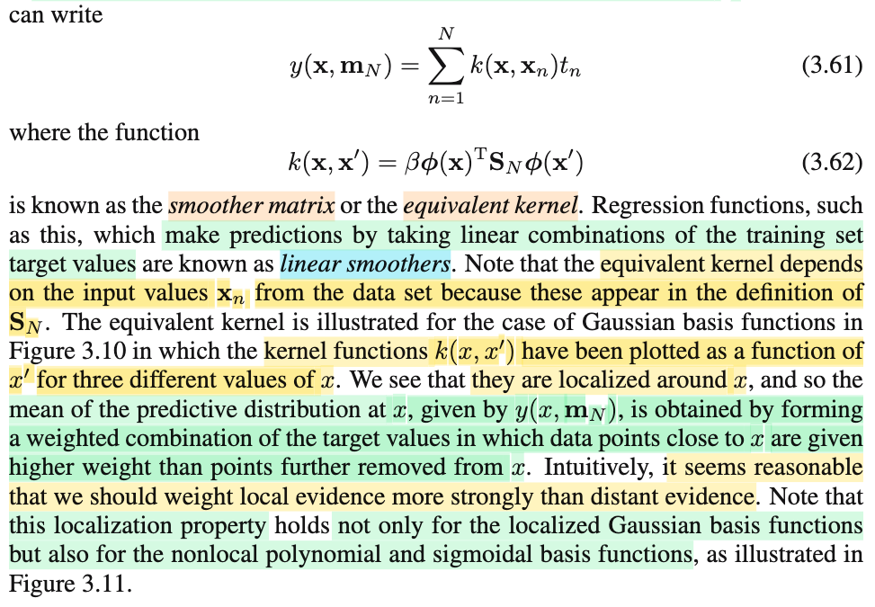
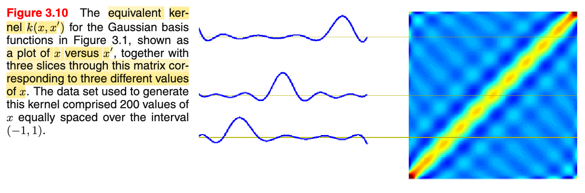
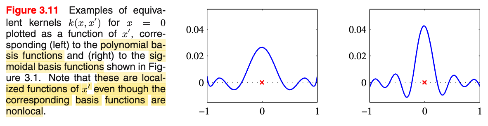
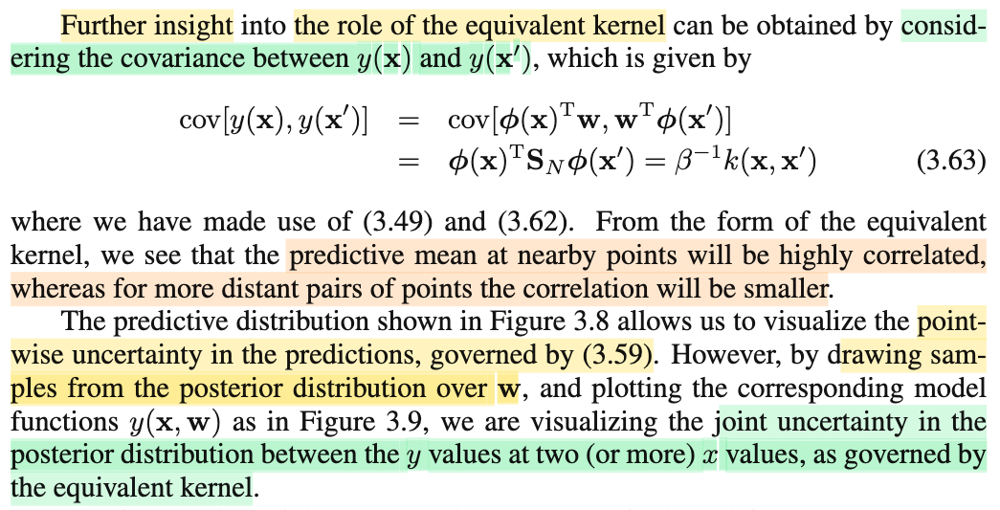
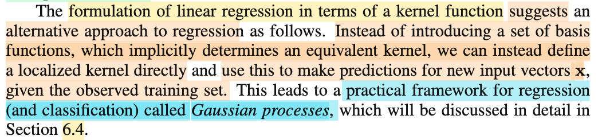
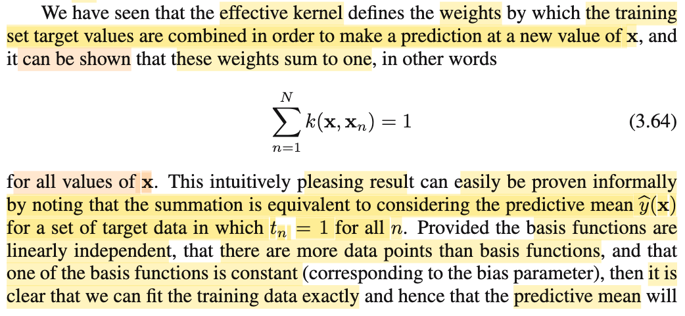
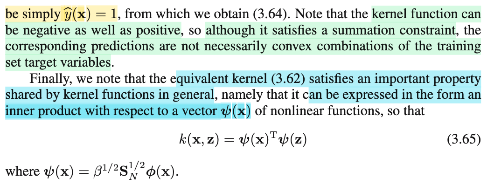

# 3.3.3 Equivalent kernel

📊 **Progress:** `5` Notes | `8` Screenshots | `4` AI Reviews

---

 

## Section 3.3.3 Equivalent Kernel

<kbd></kbd>

> [!NOTE]
> Rồi, đại khái là, đầu tiên gs nói rằng, cái posterior mean solution 𝐦N = β**S𝐍Φ**ᵀ𝐭, có một cách diễn giải thú vị, sẽ giúp chuẩn bị cho kernel method, bao gồm Gaussian process đã nhắc đến ở trên. (Dừng lại tí, vì sao gọi là posterior mean solution? À thì là vì, như đã giải thích trong ghi chú "Gaussian Prior and Posterior Parameters", khi đã có posterior, thì một cách để đưa ra point estimate cho 𝐰 chính là dùng cái 𝐰 khiến maximize posterior distribution)
>
>
>
> Như vậy, dùng wMAP, (tức là, tương tự như wML, viết tắt, ám chỉ cho w có được nhờ maximum likelihood, thì wMAP, là w khiến maximum posterior distribution) ta sẽ có hàm dự đoán là y(𝐰, 𝐱) = (𝐰MAP)ᵀΦ(𝐱) = (β**S𝐍Φ**ᵀ𝐭)ᵀΦ(𝐱) 
>
>
>
> Thế thì ta sẽ phân tích cái cục này để xem vì sao nó ra như 3.60:
>
>
>
> (β**S𝐍Φ**ᵀ𝐭)ᵀΦ(𝐱) 
>
>
>
> = β(**S𝐍Φ**ᵀ𝐭)ᵀΦ(𝐱) (β chỉ là scalar, bỏ nó ra khỏi khối matrix transpose)
>
>
>
> = β\[(**Φ**ᵀ𝐭)ᵀ(𝐒N)ᵀ\]Φ(𝐱) (dùng identity (AB)ᵀ = Bᵀ Aᵀ)
>
>
>
> = β𝐭ᵀ**Φ**(𝐒N)ᵀΦ(𝐱)
>
>
>
> = β\[𝐭ᵀ**Φ**(𝐒N)ᵀΦ(𝐱)\]ᵀ (do 𝐭ᵀ**Φ**(𝐒N)ᵀΦ(𝐱) là scalar, có thể transpose tự do)
>
>
>
> Mấy biến đổi dưới chỉ là dùng identity (AB)ᵀ = Bᵀ Aᵀ 
>
>
>
> = β\[**Φ**(𝐒N)ᵀΦ(𝐱)\]ᵀ𝐭
>
>
>
> = β\[Φ(𝐱)ᵀ\[**Φ**(𝐒N)ᵀ\]ᵀ\]𝐭
>
>
>
> = βΦ(𝐱)ᵀ(𝐒N)**Φ**ᵀ𝐭
>
>
>
> Tới đây ta phân tích như sau:
>
>
>
> Tiếp, **Φ**ᵀ là gì: còn nhớ **Φ**, là matrix có các hàng là các vector Φ(𝐱1)ᵀ, ...Φ(𝐱N)ᵀ, nên **Φ**ᵀ là matrix có các cột là Φ(𝐱1), ...Φ(𝐱N)
>
>
>
> Vậy **Φ**ᵀ**t,** theo góc nhìn thứ hai đã học trong MIᵀ 1806 khi nhân matrix với vector, kết quả sẽ là linear combination các cột của **Φ**ᵀ với hệ số là các phần tử của 𝐭.
>
>
>
> **Φ**ᵀ𝐭 = Σn=1:N Φ(𝐱n) tn 
>
>
>
> Nên βΦ(𝐱)ᵀ(𝐒N)**Φ**ᵀ𝐭 = βΦ(𝐱)ᵀ(𝐒N)\[Σn=1:N Φ(𝐱n) tn\]
>
>
>
> = Σn=1:N {βΦ(𝐱)ᵀ(𝐒N)Φ(𝐱n) tn} → 3.60
>
>
>
> Tiếp, phân tích kĩ hơn, βΦ(𝐱)ᵀ(𝐒N)Φ(𝐱n) tn sẽ là tích của scalar βΦ(𝐱)ᵀ(𝐒N)Φ(𝐱n) với target variable tn Nên cái 3.60 chính là linear combination của các scalar t1,...tN với bộ hệ số là βΦ(𝐱)ᵀ(𝐒N)Φ(𝐱1),....βΦ(𝐱)ᵀ(𝐒N)Φ(𝐱N)
>
>
>
> Và người ta đặt hàm k(𝐱, 𝐱') = βΦ(𝐱)ᵀ(𝐒N)Φ(𝐱') là k(𝐱, 𝐱'), gọi là **smoother matrix**, hoặc **equivalent kernel**.
>
>
>
> thì bộ hệ số trên chính là k(𝐱, 𝐱1), k(𝐱, 𝐱2),...k(𝐱, 𝐱N) 
>
>
>
> và từ đó 3.60 trở thành:
>
>
>
> y(𝐰, 𝐱) = Σn=1:N {k(𝐱, 𝐱n) tn}

**🔗 See also:** [Gaussian Prior and Posterior Parameters](./331_bayesian_linear_regression.md#node-nt82rck) · [Bias Parameter and Basis Function](./310_linear_regression_and_basis_functions.md#node-6p1u6u8)

 

### Equivalent Kernel and Linear Smoothers

<kbd></kbd>

<kbd></kbd>

<kbd></kbd>

> [!NOTE]
> Rồi, tiếp theo đại ý là như sau:
>
>
>
> Trong note trước mình đã hiểu vì sao có được kết qủa y(𝐰, 𝐱) = Σn=1:N {k(𝐱, 𝐱n) tn}, để thấy hàm y dự đoán t cho một input 𝐱 sẽ đưa ra dự đoán bằng cách tổ hợp tuyến tính (linear combination) các giá trị target t trong data (t1,....tN), với hệ số tổ hợp quy định bởi hàm kernel k(𝐱, 𝐱1),...k(𝐱, 𝐱N).
>
>
>
> Mà phân tích kĩ hàm kernel, với công thức k(𝐱, 𝐱') = β Φ(𝐱)ᵀ𝐒N Φ(𝐱'), ta sẽ thấy nó có các đặc điểm sau:
>
>
>
> Thứ nhất, nó là scalar, tức là, nhận vào hai input (có thể là vector hoặc scalar) là 𝐱 (input đang muốn dự đoán t) và 𝐱' (có thể là là input trong data, ví dụ 𝐱1,...𝐱N), và nó sẽ dùng công thức trên để tính ra một scalar value. Muốn nhấn mạnh chỗ này vì nó nó làm rõ rằng các hàm k(x, x1), ...k(x, N) sẽ tạo ra một bộ hệ số, giúp tổ hợp tuyến tính các vector x1,..xN.
>
>
>
> Thứ hai, thông qua việc công thức của nó có 𝐒N, là posterior variance của 𝐰, mà posterior distribution, sẽ được xây dựng thông qua Bayes rule: f(w|data) = f(data|w)f(w)/f(data), nên đương nhiên là nó sẽ phụ thuộc data. Do đó, hàm kernel, cũng sẽ phụ thuộc data, chứ không phải là một hàm fixed, hay nói cách khác, tùy vào việc data như thế nào sẽ chi phối hàm kernel.
>
>
>
> Đặc điểm thứ ba đó là, khi x gần x'. kernel sẽ lớn, và ngược lại (tí nữa mình sẽ quay lại điểm này)
>
>
>
> Gs vẽ hình minh họa 3.10: Hiểu như sau:
>
>
>
> Bản đồ nhiệt bên phải chính là đồ thị hàm kernel(x, x') theo x, x'. Để rồi tại nơi x = x', bản đồ nhiệt có màu vàng đỏ biểu hiện hàm kernel có giá trị lớn, và ra xa đường chéo này (tức x khác x') thì màu xanh thể hiện hàm kernel nhỏ.
>
>
>
> Và từ đồ thị này, người ta cắt 3 mặt cắt (để chỉ còn vẽ hàm k(x,x') theo x tại 3 giá trị x' khác nhau.
>
>
>
> Với hình dưới cùng, khi x' nằm bên trái, thì đồ thị hàm k(x, x') sẽ cho thấy nếu x nằm bên trái, thì k sẽ cao, và ngược lại x ra xa (qua chính giữa hay bên phải) thì k sẽ giảm.
>
>
>
> Tương tự, với hình thứ hai, khi x' nằm giữa, thì đồ thị hàm k(x, x') theo x cũng cho thấy nếu x ở giữa, thì k lớn, và nhỏ lại khi x nhích ra trái hoặc phải.
>
>
>
> Và hình trên cùng cũng tương tự.
>
>
>
> Tóm lại, ý nói là: hành vi của hàm kernel(x, x') sẽ: có giá trị lớn nếu x gần x' và nhỏ khi ngược lại.
>
>
>
> Do đó khi phân tích cái tổ hợp y(𝐱,𝐰) = k(𝐱,𝐱1) t1 + k(𝐱,𝐱2) t2 + ....k(𝐱,𝐱N) tN ta sẽ thấy như đã nói, nó sẽ lấy tổ hợp tuyến tính của các t1,...tN để làm dự đoán cho input 𝐱, nhưng hệ số lấy như thế nào thì tùy xem 𝐱 gần hay xa các 𝐱1,...𝐱N.
>
>
>
> Cuối cùng gs nói, cái đặc điểm cục bộ này (ý chỉ cái tính chất ta nói vừa rồi - dùng trọng số lớn hay nhỏ tùy tao x cần dự đoán nằm gần hay xa điểm dữ liệu xj) cũng đúng với các basis function khác như non-local polynomial hoặc sigmoidal như hình 3.11.
>
>
>
> ---
>
>
>
>
>
> Chỗ này rất quan trọng cần nói rõ: Cục bộ là sao mà toàn cục là sao?
>
>
>
> Vì sao Gaussian kernel basis function lại là hàm cục bộ? là vì nó có dạng giống như cái chuông, có đỉnh tại một điểm nào đó. Để rồi nhận vào input x, nếu x nằm gần cái tâm này thì giá trị hàm sẽ cao, và khi x ở xa thì hàm sẽ nhỏ lại gần bằng 0. 
>
> \
> Và ta nói nó cục bộ là vì, giả sử ta có hàm Φ(x) như vậy, và nhân với trọng số w: wΦ(x) và ta sẽ điều chỉnh w. Khi đó có thể hình dung ràng, khi điều chỉnh w, thì ta chỉ làm thay đổi độ cao cái chuông chứ hoàn toàn không đổi được hành vi: khi ra xa cái tâm thì Φ(x) nhỏ về 0 kéo theo w Φ(x) cũng nhỏ về 0.
>
>
>
> Khi đó gỉa sử ta có hàm w1Φ1(x) + w2Φ2(x), thì hình dung đồ thị của nó giống như ta có hai cái chuông nối tiếp nhau vậy,  và giả sử ta muốn nắn lại hình dạng của độ thị tại khúc đầu bằng cách thay đổi w1, thì nó cũng không làm méo mó khúc sau, và ngược lại.
>
>
>
> Trong khi đó, với hàm đa thức, giả sử xét hàm Φ(x) = x². Thì nó sẽ có dạng đường cong phi tuyến (parabol) kéo dài đến vô cùng. Và nếu xét hàm w1 x² + w2 x³,  thì nếu ta thay đổi w1, hay w2 thì giá trị của hàm y trên toàn bộ trục số sẽ thay đổi. Điều này hoàn toàn khác với hàm basis cục bộ ta ví dụ ở trên nơi mà khi thay đổi w1, hay w2 sẽ chỉ khiến đồ thị của hàm y thay đổi một cách cục bộ tại các vùng tương ứng thôi. Trong khi đó ở đây, nó việc thay đổi w1, w2 sẽ kéo theo đồ thị của y trên toàn trục số thay đổi. Đó chính là tính toàn cục.
>
>
>
> Như vậy, ở đây gs muốn nói đến một sự vi diệu, thông qua kernel function, thì dù basis function có là hàm toàn cục hay cục bộ, thì kết quả vẫn là: tính cục bộ - dùng giá trị target của data t1,...tN với trọng số lớn với các 𝐱j ở gần input 𝐱 và trọng số nhỏ với 𝐱j ở xa input 𝐱.

🤖 AI Check — 🟢 Pass — ✅ **95/100** · ✓ Move on

Bài viết thể hiện sự thấu hiểu sâu sắc và giải thích trực quan rất tốt về đồ thị, đặc biệt là phần phân biệt tính cục bộ/toàn cục của basis functions. Bạn chỉ cần sửa một lỗi diễn đạt nhỏ ở đoạn 4: hệ số kernel dùng để tổ hợp tuyến tính các giá trị target $t_n$ chứ không phải các vector $x_n$.

 

#### Covariance and the Equivalent Kernel

<kbd></kbd>

> [!NOTE]
> Tiếp theo, đoại này đại ý là: Bữa trước trong note (Covariance of Predictive Distributions, xem link) mình đã hiểu rằng Cov(y(𝐱), y(𝐱')) chính là Φ(𝐱) 𝐒n Φ(𝐱').
>
>
>
> Và với việc k(𝐱,𝐱') = β Φ(𝐱) 𝐒n Φ(𝐱') thì như vậy Cov(y(𝐱), y(𝐱')) = (1/β) k(𝐱,𝐱')
>
>
>
> Và từ đó giúp ta có thể dẫn đến một góc nhìn khác giúp giải thích cho hiện tượng đường cong màu đỏ trong hình 3.9 (là đường cong đồ thị hàm y(𝐰,𝐱) với 𝐰 được sampling từ posterior distribution) có đặc điểm cong lên cong xuống mượt mà như vậy (mà không phải là nhảy lên nhảy xuống đột ngột như răng cưa). 
>
>
>
> Cụ thể là, như bữa trước, ta giải thích đặc điểm này bằng cách chỉ ra rằng vì Cov(y(𝐱), y(𝐱')) = Φ(𝐱) 𝐒n Φ(𝐱'), nên nó chắc chắn là một giá trị dương, đo đó y(𝐱) và y(𝐱') có sự tương quan dương nên khi thằng này cao thì thằng kia cũng cao, dẫn đến với x' nằm kề x, thì covariance cao sẽ khiến hàm số tại x và x' sẽ cao thấp cùng nhau, dẫn tới kết quả là sự lên xuống mượt mà hàm y(𝐱,𝐰).
>
>
>
> Vậy thì nay, với kernel function, ta càng thấy rõ điều đó: khi 𝐱 gần 𝐱', hàm kernel sẽ lớn, và covariance của y(𝐱) và y(𝐱') sẽ lớn, dẫn đến kết quả như vừa nói. Còn khi 𝐱 xa 𝐱', kernel k(x,x') nhỏ → sự tương quan của y(𝐱) và y(𝐱') sẽ kém, biểu hiện là hai điểm xa nhau trên đồ thị sẽ có có giá trị ít liên quan nhau
>
>
>
> Đây cũng chính là ý gs nói, cái đường cong màu đỏ này giúp ta thấy (visualize) yếu tố joint uncertainty của posterior distribution giữa hai y values tại 2 x values, được chi phối bởi kernel function

🤖 AI Check — 🟢 Pass — ✅ **98/100** · ✓ Move on

Your note is exceptionally accurate and demonstrates a deep, intuitive understanding of how the equivalent kernel represents joint uncertainty and smoothness in the sampled functions. To make it perfect, ensure you explicitly define β as the noise precision parameter when relating the kernel to the covariance.

**🔗 See also:** [Covariance of Predictive Distributions](./332_predictive_distribution.md#node-yslp52z)

 

##### Introduction to Gaussian Processes

<kbd></kbd>

> [!NOTE]
> Trong đoạn tiếp theo, tác giả chỉ ra rằng thông qua các kết quả vừa phân tích, hàm hồi quy (regression) y(𝐰, 𝐱)—dùng để dự đoán giá trị mục tiêu t cho đầu vào 𝐱—thực chất có thể đ**ược biểu diễn dưới dạng tổ hợp tuyến tính của các giá trị mục tiêu t1, t2, ..., tN, với hệ số được xác định bởi hàm kernel.** 
>
>
>
> Cách thể hiện này **mang lại một hướng tiếp cận mới cho bài toán hồi quy**. Thay vì **phải đưa vào một bộ các hàm cơ sở (basis functions) để định nghĩa một cách ngầm định (implicitly) hàm kernel tương đương (equivalent kernel)**, chúng ta **có thể định nghĩa trực tiếp hàm kernel đó**. Sau đó, chúng ta **dự đoán giá trị t bằng cách lấy tổ hợp tuyến tính của các giá trị mục tiêu với trọng số là các hàm kernel.** 
>
>
>
> Có nghĩa là việc định nghĩa các hàm cơ sở ban đầu nhằm đưa tính phi tuyến vào để biến hàm y(𝐰, 𝐱) thành phi tuyến đối với 𝐱, nhưng **kết quả cuối cùng của quá trình dự đoán vẫn chỉ là tổ hợp tuyến tính của các giá trị mục tiêu thông qua hệ số kernel**. Vì vậy, thay vì thực hiện toàn bộ các bước phức tạp bắt đầu từ việc định nghĩa các hàm cơ sở, chúng ta có thể **bỏ qua các bước trung gian này để định nghĩa trực tiếp một hàm kernel cục bộ (localized kernel)**. Phương thức trực tiếp này giúp đưa ra dự đoán cho một vectơ 𝐱 dựa trên tập huấn luyện (training set) một cách tương tự, và đây chính là nội dung sẽ được nghiên cứu trong phần 6.4 với tên gọi **Quá trình Gaussian (Gaussian Process).**

🤖 AI Check — 🟢 Pass — ✅ **95/100** · ✓ Move on

Ghi chú rất xuất sắc khi giải thích chi tiết và chính xác ý tưởng cốt lõi của đoạn văn về việc định nghĩa trực tiếp kernel thay vì thông qua các basis functions. Để hoàn thiện hơn, bạn nên dùng thuật ngữ chuyên ngành 'Quá trình Gaussian' thay vì 'quy trình Gaussian'.

 

###### Effective Kernel Weights Sum to One

<kbd></kbd>

<kbd></kbd>

> [!NOTE]
> Rồi, còn vài ý cuối. Thì ý tiếp theo đại khái gs nói là, ta có thể chứng minh Σj=1=N k(𝐱j, 𝐱) = 1. Và chứng minh cũng đơn giản chỉ cần lập luận như vầy:
>
>
>
> Đó là giả sử ta có rất nhiều data, với mọi t1,...tN đều bằng 1. Dĩ nhiên, như đã nói, việc đưa ra hàm dự đoán cho giá trị t của một input 𝐱 mới cuối cùng cũng chỉ là xây dựng hàm kernel k(𝐱, 𝐱'), để rồi dùng Σj=1:N k(𝐱j, 𝐱) tj để dự đoán cho t. Và kiểu như là, với data rất nhiều, thì chắc chắn là ta có thể xây dựng một hàm số fit tuyệt đối dataset. Và vì mọi t1,...tN đều bằng 1 nên kiểu như ta sẽ tin rằng hàm regress sẽ dự đoán t cho một input 𝐱 nào đó cũng phải bằng 1.
>
>
>
> ⇔ Σj=1:N k(𝐱j, 𝐱) = 1, chứng minh xong tính chất này.
>
>
>
> ---
>
>
>
> Tiếp theo là một cái ý đó là tuy rằng tổng của các cái kernel K này nó đều là bằng 1 khiến cho mình có thể bị lầm tưởng đây là một cái tổ hợp convex. Ở đây có thể dừng lại chút xíu để nói về một số cái định nghĩa mà ở bên cái cuốn sách tối ưu hóa lồi của tác giả Stephen Boyd cũng đã giới thiệu mà mình cũng có được học. Đầu tiên là mình đã biết khái niệm tổ hợp tuyến tính khi mà học cái lớp MIT 18.06 của thầy Gilbert Strang. Thì tổ hợp tuyến tính đó là một cái tổng thôi, một cái tổng của các cái vectơ với cái bộ hệ số bất kỳ, bộ hệ số bất kỳ. Nhưng bây giờ nếu như mình giới hạn cái bộ hệ số đó là nó phải có tổng bằng 1, có tổng bằng 1 thì lúc bấy giờ nó sẽ trở thành một cái tổ hợp gọi là tổ hợp affine hoặc là affine combination. Tiếp tục thêm một ràng buộc nữa, là bắt buộc các cái hệ số không những tổng bằng 1 mà còn phải không âm thì khi đó mình sẽ có một cái gọi là tổ hợp lồi hay là convex combination. Và khi đó thì cái bộ giá trị của các cái hệ số nó sẽ tạo thành một cái phân phối xác suất đúng không? Khi mà thỏa hai cái tính chất là không âm và có tổng bằng 1. Như vậy thì mình sẽ có thể dễ hiểu cái ý của tác giả ở đây khi mà ông nói cái này không nhất thiết phải là một cái tổ hợp lồi đúng chưa? Bởi vì cái hàm kernel tuy có tổng bằng 1 đúng chưa, nhưng mà nó không có yêu cầu phải là không âm. Kernel giữa x và x' vẫn có thể là âm. Đó là một điểm chú ý, nên đây không phải là convex combination.
>
>
>
> ---
>
>
>
> \
> Và cái cuối cùng đó là tác giả nói rằng cái hàm equivalent kernel đó nó phải thỏa mãn những cái đặc điểm quan trọng của kernel function nói chung. Đó là nó phải được thể hiện bởi, tức là nó phải có thể được thể hiện bởi inner product của hai cái vector. Như vậy thì trong cái trường hợp này mình có thể thấy rằng cái kernel function nó có thể được thực sự là thỏa mãn cái tiêu chí này. Cũng không khó để hiểu bởi vì beta nhân phi X nhân cho SN nhân phi X thì cái SN là một cái ma trận xác định dương, mình đã nhắc đến cái chuyện này trước đây. Vì nó là ma trận xác định dương cho nên nó luôn luôn có thể được phân tách thành hai cái dạng là SN mũ 1/2 nhân với SN mũ 1/2. Và từ đó thì mình sẽ thấy cái kernel function này nó chính là tích vô hướng của hai cái vector được định nghĩa bởi là căn bậc hai của beta nhân với ma trận SN mũ 1/2 nhân với vector phi X. Thì giáo sư nhắc đến cái đặc điểm này mục đích là gì? Để mà khi mình qua cái phần 6.4 đó mình phát triển những cái localized kernel function đó thì mình phải nhớ rằng nó phải thỏa cái đặc điểm chung của kernel function này.

🤖 AI Check — 🟢 Pass — ✅ **95/100** · ✓ Move on

Ghi chú rất xuất sắc, đặc biệt là phần liên hệ sâu sắc với kiến thức tổ hợp affine/lồi và giải thích việc phân tách ma trận xác định dương $S_N$. Để hoàn thiện hơn, bạn nên làm rõ rằng ta fit chính xác được nhãn $t_n=1$ là nhờ có một basis function hằng số (bias), thay vì chỉ giải thích chung chung là do có nhiều dữ liệu.

 

