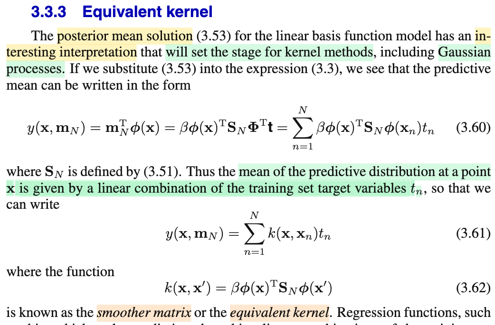

# 3.3.3 Equivalent kernel

📊 **Progress:** `1` Notes | `1` Screenshots

---

## 3.3.3 Equivalent kernel

 

## Section 3.3.3 Equivalent Kernel

<kbd></kbd>

> [!NOTE]
> Rồi, đại khái là, đầu tiên gs nói rằng, cái posterior mean solution **m**N = β**S**N**Φ**T**t**, có một cách diễn giải thú vị, sẽ giúp chuẩn bị cho kernel method, bao gồm Gaussian process đã nhắc đến ở trên. (Dừng lại tí, vì sao gọi là posterior mean solution? À thì là vì, như đã giải thích trong ghi chú "Gaussian Prior and Posterior Parameters", khi đã có posterior, thì một cách để đưa ra point estimate cho **w** chính là dùng cái **w** khiến maximize posterior distribution)
>
>
>
> Như vậy, dùng wMAP, (tức là, tương tự như wML, viết tắt, ám chỉ cho w có được nhờ maximum likelihood, thì wMAP, là w khiến maximum posterior distribution) ta sẽ có hàm dự đoán là y(**w**, **x**) = (**w**MAP)TΦ(**x**) = (β**S**N**Φ**T**t**)TΦ(**x**) 
>
>
>
> Thế thì ta sẽ phân tích cái cục này để xem vì sao nó ra như 3.60:
>
>
>
> (β**S**N**Φ**T**t**)TΦ(**x**) 
>
>
>
> = β(**S**N**Φ**T**t**)TΦ(**x**) (β chỉ là scalar, bỏ nó ra khỏi khối matrix transpose)
>
>
>
> = β\[(**Φ**T**t**)T(**S**N)T\]Φ(**x**) (dùng identity (AB)T = BT AT)
>
>
>
> = β**t**T**Φ**(**S**N)TΦ(**x**)
>
>
>
> = β\[**t**T**Φ**(**S**N)TΦ(**x**)\]T (do **t**T**Φ**(**S**N)TΦ(**x**) là scalar, có thể transpose tự do)
>
>
>
> Mấy biến đổi dưới chỉ là dùng identity (AB)T = BT AT 
>
>
>
> = β\[**Φ**(**S**N)TΦ(**x**)\]T**t**
>
>
>
> = β\[Φ(**x**)T\[**Φ**(**S**N)T\]T\]**t**
>
>
>
> = βΦ(**x**)T(**S**N)**Φ**T**t**
>
>
>
> Tới đây ta phân tích như sau:
>
>
>
> Tiếp, **Φ**T là gì: còn nhớ **Φ**, là matrix có các hàng là các vector Φ(**x**1)T, ...Φ(**x**N)T, nên **Φ**T là matrix có các cột là Φ(**x**1), ...Φ(**x**N)
>
>
>
> Vậy **Φ**T**t,** theo góc nhìn thứ hai đã học trong MIT 1806 khi nhân matrix với vector, kết quả sẽ là linear combination các cột của **Φ**T với hệ số là các phần tử của **t**.
>
>
>
> **Φ**T**t** = Σn=1:N Φ(**x**n) tn 
>
>
>
> Nên βΦ(**x**)T(**S**N)**Φ**T**t** = βΦ(**x**)T(**S**N)\[Σn=1:N Φ(**x**n) tn\]
>
>
>
> = Σn=1:N {βΦ(**x**)T(**S**N)Φ(**x**n) tn} → 3.60
>
>
>
> Tiếp, phân tích kĩ hơn, βΦ(**x**)T(**S**N)Φ(**x**n) tn sẽ là tích của scalar βΦ(**x**)T(**S**N)Φ(**x**n) với target variable tn Nên cái 3.60 chính là linear combination của các scalar t1,...tN với bộ hệ số là βΦ(**x**)T(**S**N)Φ(**x**1),....βΦ(**x**)T(**S**N)Φ(**x**N)
>
>
>
> Và người ta đặt hàm k(**x**, **x**') = βΦ(**x**)T(**S**N)Φ(**x**') là k(**x**, **x**'), gọi là **smoother matrix**, hoặc **equivalent kernel**.
>
>
>
> thì bộ hệ số trên chính là k(**x**, **x**1), k(**x**, **x**2),...k(**x**, **x**N) 
>
>
>
> và từ đó 3.60 trở thành:
>
>
>
> y(**w**, **x**) = Σn=1:N {k(**x**, **x**n) tn}

**🔗 See also:** [Gaussian Prior and Posterior Parameters](./331_bayesian_linear_regression.md#node-nt82rck) · [Bias Parameter and Basis Function](./310_linear_regression_and_basis_functions.md#node-6p1u6u8)

 

