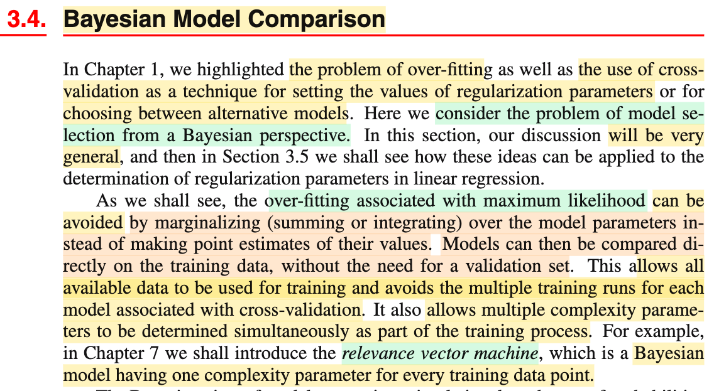
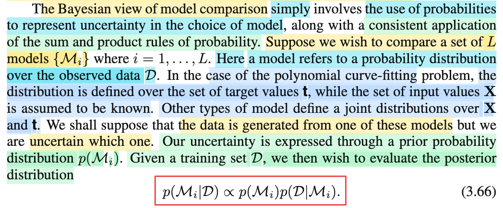
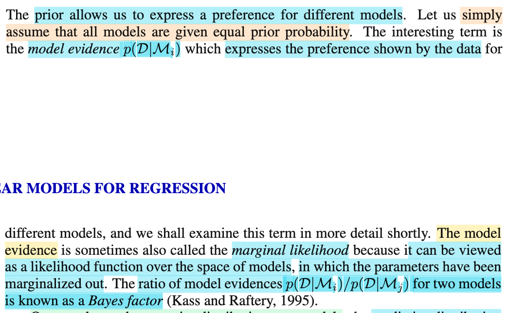
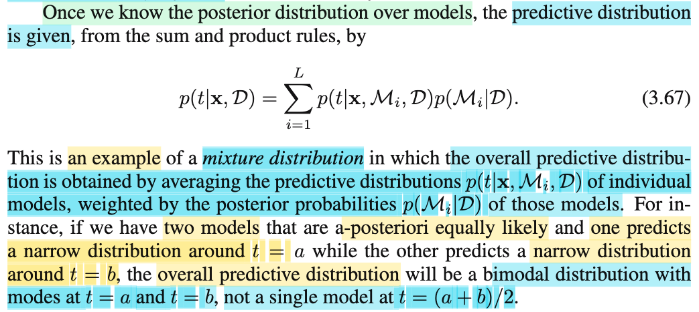
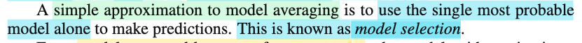
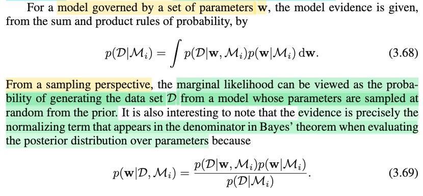
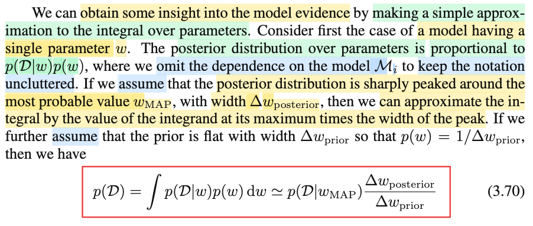
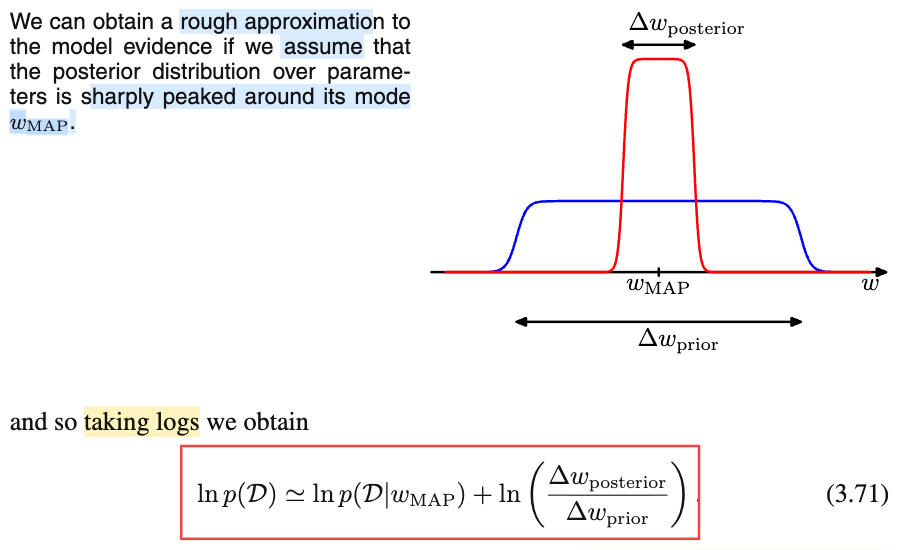

# 3.4 Bayesian Model Comparison

📊 **Progress:** `7` Notes | `8` Screenshots | `7` AI Reviews

---

## 3.4 Bayesian Model Comparison

 

## Section 3.4 Bayesian Model Comparison

<kbd></kbd>

> [!NOTE]
> Rồi, đại khái là trong chapter 1 mình đã biết về overfit, cũng như việc sử dụng cross-validation technique để chọn giá trị của regularization parameters, mang ý nghĩa là, ta sẽ chọn ra giá trị quy định mức độ phức tạp của mô hình một cách phù hợp.
>
>
>
> Thì phần này, ta sẽ tiếp cận lại vấn đề này theo trường phái Bayesian.
>
>
>
> Tiếp theo ông nói sơ vài ưu điểm của trường phái Bayesian trong việc tiếp cận vấn đề overfit và model selection: Cụ thể với overfit, ta sẽ thấy, thay vì dùng ước lượng điểm (như MLE) để lắp vào hàm dự đoán, sẽ gây overfit, ta có thể làm cách khác, đó là marginalizing over mọi giá trị khả dĩ của tham số mô hình, và từ đó có một hàm prediction map trực tiếp giữa input và target, không phụ thuộc tham số mô hình nữa, cách làm này sẽ giảm overfit.
>
>
>
> Và các ưu điểm khác như cho phép so sánh giữa mô hình với nhau một cách trực tiếp dựa trên training data, không cần thông qua validation data, từ đó giúp giảm lãng phí data và giảm chi phí tính toán khi phải giải bài toán tìm regularization parameter tối ưu (dựa trên cross validation).
>
>
>
> Và một tính chất chưa hiểu lắm nhưng ta sẽ đào sâu ở chapter 7 - Relevance vector machine.

> [!TIP]
> **🤖 AI Feedback** — ✅ Score: **95/100**
>
> Ghi chú cực kỳ chi tiết, nắm bắt chính xác các ý cốt lõi như tránh over-fitting bằng cách marginalizing và lợi ích của việc không cần tập validation. Bạn chỉ cần lưu ý thêm ý về khả năng tự động xác định đồng thời nhiều tham số phức tạp (complexity parameters) trong quá trình huấn luyện.

 

### Bayesian Model Comparison

<kbd></kbd>

> [!NOTE]
> Thế thì đoạn này nói về đại ý của cách tiếp cận Bayesian đối với bài toán model comparision (hay selection, cũng như nhau)
>
>
>
> Có lẽ nên dừng lại tí nói về vì sao lại gọi là model comparision (so sánh model) hay selection (chọn model), và vì sao lại thường đi kèm với việc nói về overfit: Đầu tiên, nó thường đi kèm với overfit và cả underfit là vì đương nhiên là ta không muốn một mô hình bị overfit hay underfit. Nhưng trước hết, model, mô hình là cái quái gì cái đã. Mình hiểu, mô hình là một mô hình mô phỏng thực tế, là cái ta dựng lên, và tìm cách làm sao cho nó giống với thực tế nhất. Về mặt từ ngữ, thì ý nghĩa của từ mô hình là vậy. Ví dụ, ta mô hình hóa / dựng mô hình một toà nhà, thì dĩ nhiên ta tìm cách dựng nên một mô hình giống với tòa nhà nhất có thể. Thế thì ở đây, cái ta muốn, là dựng nên một mô hình mô phỏng sát nhất với cái quy luật chi phối dữ liệu ở ngoài đời thực mà dữ liệu ta quan sát thấy được sinh ra từ đó.
>
>
>
> Ví dụ, ta quan sát được một chuỗi số X1,.....Xn. Và ta muốn dựng mô hình cái quy luật sinh ra bộ giá trị này, thì cái quy luật này, chính là phân phối xác suất (population distribution), và nó chỉ là một cái hàm số, quy định rằng với giá trị nào đó, thì xác suất sinh ra data có giá trị đó nên cao hay thấp. Vậy ta dựng mô hình bằng cách nào. Có hai cách, một là mô hình có tham số (parametric model), trong đó ta dùng một hàm số, có quy luật bị chi phối bởi tham số: f(x|θ) và ta sẽ đi tìm cái tham số cũng như dạng của hàm f này và hai là, mô hình phi tham số (non-parametric model). 
>
>
>
> Vậy thì, bài toán đi tìm cái hàm f chi phối quy luật của data thật sự là rất phức tạp, vì ta không biết phải làm gì, hay dạng của f thật sự là gì cả. Do đó, ta mới tiếp cận theo lối: chấp nhận rủi ro, thông qua việc đặt ra vài giả định, nhằm đơn giản bớt bài toán. Ví dụ, ta giả định phân phối f là một phân phối có dạng nào đó, ví dụ normal(μ, σ^2), và từ đó dùng các cách tiếp cận như MLE, Bayes, ta đi tìm cách estimator ra μ, σ^2. Đây chính là bài toán inference - point estimation cho population parameter. Như vậy, đã giả định thì có thể sai, có thể phân phối gốc hoàn toàn không phải là normal, thì cái estimator của ta tìm ra dù có tốt mấy cũng thành sai. Từ đó mới đẻ ra các tiêu chí như Roburstness mà mình đang học ở Chapter 10 - Casella, đó là: dưới sự thật rằng giả định ban đầu bị sai thì estimator còn tốt không?
>
>
>
> Quay lại bối cảnh machine learning với bài toán regression, giả sử quan sát được bộ dữ liệu (**x**1, t1), ....(**x**n, tn), mục đích tối thượng cũng là, ta muốn mô phỏng cái quy luật giúp map **x** với t. Vậy thì để mô phỏng, ta cũng có thể dùng parametric model, đi tìm một hàm số y(**x**,**w**) với dạng và giá trị **w** sao cho hàm này phản ánh, mô phỏng sát nhất với quy luật thực tế giữa **x** và t. Hoặc cũng có thể dùng non-parametric model.
>
>
>
> Vậy thì giả sử chọn parametric model, ta cũng sẽ thấy bài toán đặt ra quá phức tạp, vì đâu có biết cái quy luật thực tế của **x** và t nó có hình thù ra sao. Do đó, ta cũng đơn giản hóa bài toán, bằng cách đặt ra các giả định. Ví dụ, ta cho rằng quy luật này là một hàm tuyến tính đối với **w**, và phi tuyến đối với **x**, để rồi theo các cách tiếp cận đã biết, ta đi tìm ra **w**.
>
>
>
> Tới đây ta đã hiểu model là cái gì - nó chỉ là mô hình ta muốn xây dựng để mô phỏng thực tế. Với bài toán population paramter inference, thì mô hình là cái hàm f(**x**|θ) mà ta muốn tìm dạng của nó và giá trị parameter θ. Với bài toán regression, mô hình là cái hàm y(**w**,**x**) mà ta muốn tìm **w**, cũng như dạng của nó và giá trị w của nó. Và trong cả hai, thường thì ta đặt ra giả định về dạng của nó (giả định f là normal, hay y là hàm tuyến tính của w) để giúp đơn giản hóa bớt, chỉ còn phải đi tìm tham số của nó (μ, σ^2, hay **w**) thôi.
>
>
>
> Vậy sao phải so sánh model với nhau. À thì là vì, ví dụ như trong bài toán regression, nếu data ít, và ta giả định dùng mô hình (hàm y(**w**,**x**) có độ phức tạp cao (ví dụ dùng nhiều hàm basis - cũng là nhiều tham số) thì kết quả prediction sẽ tệ (không generalize tốt) 
>
>
>
> Nhưng nếu gỉam số tham số, và basis function, thì kết quả lại có thể khiến mô hình bị underfit, không đủ độ phức tạp
>
>
>
> Khi đó, bằng kĩ thuật regularization, ta vẫn dùng mô hình có độ phức tạp cao, nhưng đi tối ưu một tham số (regularization) để chọn ra giá trị (giúp kiểm soát) mức độ phức tạp của mô hình phù hợp.
>
>
>
> Và việc ta chọn, đi tìm giá trị tối ưu của regularization parameter này chính là model selection / comparision (bởi lẽ đó chính là ta đang so sánh các mô hình với mức complexity khác nhau để mà chọn ra cái tốt nhất).
>
>
>
> ---
>
>
>
> Rồi, quay lại bài. ý tưởng của Bayesian trong bài toán model comparision rất đơn giản: Là ta cũng **thể hiện sự không chắc chắn nên dùng model nào thông qua việc coi nó như biến ngẫu nhiên**.
>
>
>
> Giả sử ta phải so sánh L model: {ℳ1, ...ℳL}
>
>
>
> Trước khi nói tiếp, gs Bishop nhấn mạnh một ý cực quan trọng: Model ở đây phải hiểu, là **cái phân phối xác suất chi phối giá trị của data mà ta đang dùng để mô phỏng quan hệ thật / phân phối thật của chúng**. Ví dụ như trong bài toán polynomial curve fitting ta làm bữa giờ, thì đó là distribution của **t**|**X**. (**X** là matrix observed data **x**1,...**x**N, tức coi **X** fixed, đã biết). Hay với model dạng khác, thì nó là joint distribution của **X**, và **t** (coi **X** như random variable luôn).
>
>
>
> Cái này y như cách tiếp cận Bayesian cho bài toán point estimator của tham số mô hình **w** vậy. Đó là, ta coi nó như random variable. Rồi chọn priori f(**w**), và dùng Bayes rule để có posterior distribution f(**w**|𝒟) ∝ f(𝒟|**w**) f(**w**). Có nghĩa là, nguyên lý chung của Bayesian, là cái gì mà ta ko chắc chắn thì cứ coi nó là biến ngẫu nhiên, rồi đi xây dựng posterior distribution cho nó, từ đó, dựa vào decision theory để mà ra quyết định.
>
>
>
> Và như vậy , thì ta sẽ **coi như ta có một random variable ℳ** (có các possible value là ℳ,...ℳL). Rồi cũng chọn prior distribution của nó f(ℳ), và dùng Bayes rule để xây dựng posterior distribution:
>
>
>
> f(ℳ|𝒟) = f(𝒟|**ℳ**) f(ℳ) / f(𝒟)

> [!TIP]
> **🤖 AI Feedback** — ✅ Score: **95/100**
>
> Ghi chép rất sâu sắc khi liên hệ được nền tảng thống kê cổ điển với bài toán so sánh mô hình theo quan điểm Bayesian một cách chính xác. Tuy nhiên, phần dẫn nhập có thể cô đọng hơn để người đọc nhanh chóng nắm bắt cơ chế cốt lõi của công thức Bayes áp dụng cho tập hợp mô hình.

 

#### Model Evidence and Bayes Factor

<kbd></kbd>

> [!NOTE]
> Thế thì f(ℳ) là cách để ta đưa vào PRERENCE / PRIOR BELIEF về mô hình- ý là, cũng là việc ví dụ như ta ưu ái những mô hình này hơn mô hình kia (thông qua việc đưa nó vào danh sách, và thông qua việc gán giá trị xác suất lớn nhỏ cho nó).
>
>
>
> Và ở đây ta sẽ giả định các ℳ\_i đều có xác suất như nhau.
>
>
>
> Còn f(𝒟|**ℳ**\_i), được gọi là model evidence, thể hiện preference show bởi data cho các model khác nhau. Và có khi người ta gọi là **marginal likelihood** vì nó có thể được nhìn nhận theo kiểu là likelihood function over space of models, trong đó paramter được marginalized out.
>
>
>
> Đoạn này nghĩa là sao?
>
>
>
> Mình nghĩ để dễ hiểu cứ thử liên hệ nó với θ (là tham số mô hình, mà trong chương này ví dụ nó là **w**)
>
>
>
> posterior distribution của θ: π(θ|**x**) ∝ f(**x**|θ) π(θ) = L(θ|**x**) π(θ)
>
>
>
> thì π(θ) mang ý nghĩa là phản ánh niềm tin ban đầu của mình (experimenter) về giá trị của θ. Ví dụ như mình tin θ là biến rời rạc có các possible value θ1,..θL, nhưng ko favor thằng nào, khi đó ta cho priori là discrete uniform distribution.
>
>
>
> còn f(**x**|θ) = L(θ|**x**), như đã biết, thể hiện độ hợp lí của θ khi quan sát được giá trị của data.
>
>
>
> Vậy tương tự thôi
>
>
>
> posterior distribution của ℳ: f(ℳ|𝒟) ∝ f(𝒟|ℳ)f(**ℳ**)
>
>
>
> thì f(ℳ) mang ý nghĩa phản ánh niềm tin ban đầu của ta (preference của ta) về các giá trị mô hình khác nhau. Và ở đây ta tin biến ngẫu nhiên ℳ có L possible value ℳ1,...ℳL, nhưng ta cũng không chắc, không favor thằng nào nên cho chúng có xác suất như nhau
>
>
>
> còn f(𝒟|**ℳ**), tương tự như f(**x**|θ) = L(θ|**x**), ta cũng có thể gọi nó là L(ℳ|𝒟), marginal likelihood function mang ý nghĩa, **độ hợp lí của model ℳ khi giá trị dữ liệu quan sát được là 𝒟**.
>
>
>
> Còn sở dĩ gọi là marginal likelihood vì ý là, model ℳ thì nếu xét kĩ ra thì sẽ có phụ thuộc các giá trị của parameter nữa, nhưng ta marginalizing - tức lấy trung bình mọi giá trị khả dĩ của parameter, để không còn phụ thuộc parameter nữa.
>
>
>
> Và cuối cùng, tỉ lệ của hai model evidence f(𝒟|**ℳ**i)/f(𝒟|**ℳ**j) gọi là Bayes factor.

> [!TIP]
> **🤖 AI Feedback** — ✅ Score: **98/100**
>
> Ghi chú của bạn rất xuất sắc, thể hiện sự hiểu sâu sắc khi tự liên hệ phép tương tự giữa cấp độ tham số và cấp độ mô hình để giải thích marginal likelihood. Để hoàn thiện hơn, bạn có thể viết rõ công thức toán học thể hiện việc tích phân loại bỏ (marginalize out) tham số w.

 

##### Predictive Distribution as Mixture

<kbd></kbd>

> [!NOTE]
> Và khi đã derive được posterior distribution f(ℳ|𝒟), ta sẽ xây dựng predictive distribution
>
>
>
> f(t|**x**, 𝒟) = Σi=1:L f(t|**x**, ℳi, 𝒟) f(ℳi|𝒟)
>
>
>
> Giải thích công thức này: Rất đơn giản, giống như ta có fX,Y(x,y) với X,Y là discrete random variable, thì bằng cách marginalizing joint pdf của X,Y over mọi possible value y1,...yK của Y ta sẽ có marginal distribution của X: fX(x) = Σi=1,2..K fX,Y(X,yi). Và f(X, yi) = f(X|yi)fY(yi). Nên:
>
>
>
>  fX(x) = Σi=1,2..K f(X|yi)fY(yi)
>
>
>
> với việc ta coi ℳ là random variable có các possible value ℳ1,...ℳL thì thì joint distribution của T|**x** và ℳ là f(t, ℳ|**x**, **𝒟**). Marginalizing joint pdf của T|**x** và ℳ, ta sẽ có pdf của T|**x**:
>
>
>
> f(t|**x**, 𝒟) = Σi=1:L f(t|**x**, ℳi, 𝒟) f(ℳi|𝒟)
>
>
>
> hoặc cũng có thể hiểu như sau:
>
>
>
> Trước đây predictive distribution f(t|**x**, 𝒟) thật ra là đang dựa trên một model cụ thể (ví dụ như mô hình linear với regularization factor là bao nhiêu đó), kí hiệu nó là **ℳ**, nên ta có thể ghi là f(t|**x**, ℳ, 𝒟) với ℳ chỉ là fix value, chỉ một mô hình cụ thể. Và với ℳ, 𝒟, **x** đều fix, thì f(t|**x**, ℳ, 𝒟) là một fixed value.
>
>
>
> Nhưng nay, với cách tiếp cận Bayesian, ta coi ℳ là random variable, và posterior distribution là f(ℳ|𝒟). Thì lúc này f(t|**x**, ℳ, 𝒟) không còn là fixed value nữa, nó là hàm của random variable ℳ nên bây giờ nó trở thành random variable luôn (nhớ thần chú thầy Joe mập trong Stat110: hàm của random variable là random variable). Và vì là random variable ta có thể lấy kì vọng:
>
>
>
> E\[f(t|**x**, ℳ, 𝒟)\] với chú thích đây là E\[g(ℳ)\] với g(ℳ) = f(t|**x**, ℳ, 𝒟) và **ℳ** \~ f(ℳ|𝒟)
>
>
>
> Dùng LOTUS (ôn nhanh, cho discrete X \~ f(x) có các possible value x1,...xN, thì với Y = g(X), LOTUS cho phép tính E\[Y\] = E\[g(X)\] = Σi=1:N g(xi)f(xi).
>
>
>
> Vậy ở đây, E\[g(ℳ)\] = Σi=1:L g(ℳi)f(ℳi|𝒟) 
>
>
>
> thế hàm g(ℳ) = f(t|**x**, ℳ, 𝒟) vô lại ta sẽ có:
>
>
>
> E\[f(t|**x**, ℳ, 𝒟)\] = Σi=1:L f(t|**x**, ℳi, 𝒟) f(ℳi|𝒟)
>
>
>
> Như vậy, góc nhìn này giúp ta thấy rõ hơn bản chất chỉ là ta đang lấy average (của f(t|**x**, ℳ, 𝒟) trên mọi possible value của ℳ (bản chất của kì vọng / expected value chỉ là lấy trung bình thôi có trọng số thôi)
>
>
>
> Và nhờ đó ta cũng hiểu câu dưới khi gs Bishop nói cái này là một ví dụ của MIXTURE DISTRIBUTION, trong đó ta averaging các predictive distribution f(t|**x**, ℳi, 𝒟) với trọng số (weight) là posterior distribution f(ℳi|𝒟).
>
>
>
> ---
>
>
>
> Ông cho biết thêm, lấy ví dụ, nếu ta có hai model ℳ1, ℳ2, có posterior equally likely (ý là xác suất bằng nhau). Và trong đó một cái cho ra predictive distribution f(t|**x**, ℳ1, 𝒟) có dạng tập trung quanh mốc t = a. Còn cái kia cho f(t|**x**, ℳ2, 𝒟) có dạng tập trung quanh mốc t = b. Thì cái overal predictive distribution sẽ là BI-MODAL (!) model - tức là một mô hình có 2 đỉnh tại a, b thay vì chỉ có một đỉnh tại (a+b)/2
>
>
>
> (!) Chú ý, ko phải binomial đâu nhé, đừng có bị nhầm.

> [!TIP]
> **🤖 AI Feedback** — ✅ Score: **98/100**
>
> Ghi chú rất xuất sắc khi giải thích công thức dưới hai góc nhìn (marginalization và LOTUS) vô cùng trực quan và hiểu đúng bản chất bimodal. Để hoàn thiện hơn, bạn nên bổ sung giải thích tại sao điều kiện x biến mất ở f(ℳ_i|ᆒ) (do sự độc lập giữa mô hình và dữ liệu kiểm thử mới).

 

- **Model Selection and Model Evidence**

<kbd></kbd>

> [!NOTE]
> Ý này là sao? khi gs nói rằng một cách đơn giản để "model averaging" (tạm dịch là lấy trung bình qua các model) là ta sẽ dùng cái model có xác suất cao nhất (most probable), và chỉ lấy mình nó (alone) để mà dự đoán.
>
>
>
> Cái này nó y chang như khi ta tìm **w** (nói theo ngôn ngữ thống kê là ta đi infer (suy luận) giá trị của **w** bằng cách tìm một point estimation (là một hàm số dựa trên data) cho **w**) mà khi theo Bayesian approach, ta sẽ đi tìm posterior distribution của nó: f(**w**|𝒟), từ đó, ta có thể dựa vào decision theory giúp chỉ cho ta cách để đưa ra point estimation thế nào cho tối ưu, và kết quả có thể là mean hoặc median hoặc gì gì đó của posterior distribution. Ví dụ như khi tìm ra posterior là Normal, thì một cách hợp lý để point estimate đó là dùng cái mean nơi có posterior probability cao nhất. Nhưng đi xây dựng posterior distribution rồi lại lấy một point estimation để lắp vào hàm dự đoán y(**w**,**x**) thì nó mang tính Bayesian nửa mùa. Do đó, cách làm Bayesian hoàn chỉnh là không cần care về ước lượng điểm cho w làm gì, mà chỉ việc dùng cái distribution đó, để marginalizing f(t|**x**,**w**) over mọi possible value của **w** tuân theo f(**w**|𝒟). Khi đó predictive distribution f(t|**x**,𝒟) mang ý nghĩa đã tính trung bình trên mọi **w** rồi.
>
>
>
> Vậy thì ở đây cũng y hệt, khi ta có posterior distribution của model f(ℳ|𝒟), thì cách làm trọn vẹn theo Bayesian chính là ta sẽ dùng distribution này để marginalizing over mọi possible value của model, để có predictive distribution. Thế thì cái ở đoạn trên ta cũng có predictive distribution nhưng phải hiểu là đang làm việc với một model cụ thể nào đó, ví dụ có thể gọi là f(t|**x**) ở trên là f(t|**x**,ℳ,𝒟). Còn bây giờ, ta cũng tính trung bình trên mọi possible value của model, để có f(t|**x**,𝒟) không còn phụ thuộc model cụ thể nào nữa.
>
>
>
> Thế thì, tuy đó là cách làm mang tính là thuần túy Bayesian, nhưng quay ngược lại, ta cũng có thể làm theo kiểu nửa mùa Bayessian, đó là lại đi chọn một cái point estimation của model ℳ (y như làm nửa mùa bằng cách lấy point estimation của **w** và ráp vào y(**w**,**x**) đã nói ở trên). Và một cách hợp lý để chọn là lấy cái model có xác suất cao nhất (y như lấy **w** có posterior probability cao nhất), à cái này được gọi là model selection.

> [!TIP]
> **🤖 AI Feedback** — ✅ Score: **100/100**
>
> Ghi chú cực kỳ xuất sắc, giải thích rất sâu sắc và chính xác bản chất của 'model selection' bằng cách so sánh tương quan hoàn hảo với việc ước lượng điểm tham số trong thống kê Bayes. Lối tư duy liên hệ bản chất này vô cùng tốt và giúp hiểu rõ ngọn ngành của phương pháp xấp xỉ.

 

- **Model Evidence and Marginal Likelihood**

<kbd></kbd>

> [!NOTE]
> Tiếp theo qua đoạn này, đại ý là vầy:
>
>
>
> Ta đã hiểu rằng model thì có tham số **w**. Ý là, nói về một model cụ thể nào đó, ví dụ ℳ1, thì bản thân nó, cũng có vô số giá trị tham số **w**. Vậy thì đại ý là dùng sum rule và product rule, ta sẽ thấy f(𝒟|**ℳ**) chính là kết quả khi ta tính trung bình f(𝒟|**ℳ**) trên mọi giá trị khả dĩ của tham số **w**.
>
>
>
> Để hiểu công thức 3.68 thật ra có nhiều cách. Một cách đơn giản, đó là:
>
>
>
> xét hàm số sau: nhận input là model ℳi, và giá trị tham số **w**, và dưới mô hình này, thì ta sinh ra (sampling ra) data 𝒟, thì ta tính xác suất của giá trị cụ thể data 𝒟 là bao nhiêu (tương tự như f(**x**|θ), mang ý nghĩa dựa giá trị population parameter θ thì xác xuất sample **X** mang giá trị cụ thể **x** là bao nhiêu). Và ta kí hiệu nó là f(𝒟|**ℳ**i, **w**).
>
>
>
> Dĩ nhiên, với ℳi fixed, **w** fixed, thì đây chỉ là một fixed number.
>
>
>
> Thế rồi, ta mới không coi w là fixed nữa, mà nó là một random variable có phân phối là f(**w**|ℳi)...
>
>
>
> (chú ý chỗ này dễ lú: chỗ này không phải là f(**w**|𝒟), mà ở đây ý là nói về prior distribution của **w** khi mô hình là ℳi. Hay nói cách khác, bữa giờ ta nói về prior và posterior distribution của **w**, thì có thể hiểu là với model cụ thể nào đó, nên chúng là f(**w**|ℳ) và f(**w**|𝒟, ℳ) thì cái đang nói ở đây chính là cái prior distribution như vậy)
>
>
>
> ..thì lúc này, f(𝒟|**ℳ**i, **w**), là hàm số của một random variable, nên cũng là random variable. Và ta sẽ lấy kì vọng của cái random variable này, tức E\[f(𝒟|**ℳ**i, **w**)\] với **w** \~ f(**w**|ℳi) Theo LOTUS, nhắc lại nhanh, nói rằng khi ta có X có distribution pdf f(x), và Y = g(X), thì EY = ∫g(x)f(x)dx, vậy thì ở đây áp dụng LOTUS ta cũng có:
>
>
>
> E\[f(𝒟|**ℳ**i, **w**)\] với **w** \~ f(**w**|ℳi) = ∫f(𝒟|**ℳ**i, **w**) f(**w**|ℳ) d**w**, chính là công thức 3.68.
>
>
>
> Như vậy, ta có thể thấy f(𝒟|ℳ) có bản chất chỉ là ta đang tính f(𝒟|**ℳ**i, **w**) - mang ý nghĩa là xác suất của data 𝒟 dựa trên model ℳi có bộ tham số giá trị cụ thể **w**, nhưng lấy trung bình qua mọi possible value của **w**, với **w** \~ f(**w**|ℳi)
>
>
>
> Và đây cũng chính là ý tiếp theo khi gs nói, với góc nhìn (perspective) sampling, thì cái này chính là xác suất của việc sinh ra dataset 𝒟 từ một model (**ℳ**i) có giá trị tham số là **w** được sampled randomly từ prior distribution f(**w**|ℳi). Hiểu thế này, nói rằng theo sampling perspective, thì tức là ta sẽ làm như sau:
>
>
>
> sampling w từ f(w|ℳi), lắp w vào hàm f(𝒟|ℳi, w), tính ra ví dụ f1,
>
>
>
> sampling w từ f(w|ℳi), lắp w vào hàm f(𝒟|ℳi, w), tính ra ví dụ f2,
>
>
>
> ..
>
>
>
> sampling w từ f(w|ℳi), lắp w vào hàm f(𝒟|ℳi, w), tính ra ví dụ fn,
>
>
>
> và ta đây chính là một sample: F1,...Fn có observed value f1,...fn. với F = f(𝒟|ℳi, w) (F là random variable có được bởi áp hàm f(𝒟|ℳi, w) lên random variable w).
>
>
>
> và ta lấy trung bình Fbar = (Σi Fi)/n.
>
>
>
> Theo Law Of Large number, đã học (Casella, hay Stat110, xem link) thì sample mean sẽ converge in probabililty về true mean, mà true mean ở đây chính là E\[F\], chính là E\[f(𝒟|**ℳ**i, **w**)\] ở trên.
>
>
>
> ---
>
>
>
> Còn nếu muốn giải thích theo sum rule hay product rule cũng được:
>
>
>
> Đơn giản là, ta xét joint probability: f(𝒟, **w**|ℳi), và đi marginalizing over mọi possible value của **w** với **w** \~ f(**w**|ℳi) thì như đã học ở Stat110 hay Casella, khi marginalizing joint pdf của X, Y over y thì ta có marginal pdf của X: fX(x) = ∫f(x,y)dy. Thay f(x,y) bằng f(x|y)f(y), ta có fX(x) = ∫f(x|y)f(y)dy. Vậy ở đây cũng vậy:
>
>
>
> f(𝒟|**ℳ**i) = ∫f(𝒟, **w**|**ℳ**i)d**w** = ∫f(𝒟|**ℳ**i,**w**)f(**w**|ℳi)d**w**
>
>
>
> Vậy thì cái vụ marginalizing joint pdf của X, Y over y sẽ cho ra marginal distribution của X chính là sum rule và product rule đó, mà ta còn nhớ, nguồn gốc của nó trong Stat110, chính là có cái tên gọi là LOTP: Luật xác suất toàn phần.
>
>
>
> ---
>
>
>
> Cuối cùng, chỉ là ông nói rằng, cái f(𝒟|**ℳ**i) thật ra chính là cái xuất hiện ở mẫu số trong:
>
>
>
> f(w|𝒟, ℳi) = f(𝒟|w, ℳi) f(w|ℳi) / f(𝒟|ℳi)
>
>
>
> Ý này ko có gì đặc biệt.

> [!TIP]
> **🤖 AI Feedback** — ✅ Score: **95/100**
>
> Ghi chú cực kỳ xuất sắc, giải thích rất sâu sắc dưới cả góc độ kỳ vọng (LOTUS) và luật số lớn (LLN). Bạn chỉ cần lưu ý sửa một lỗi gõ nhỏ ở tích phân phần marginalizing khi viết thiếu điều kiện w trong f(D|M_i).

**🔗 See also:** [Luật số lớn yếu WLLN *(Statistical Inference - Casella)*](../statistical_inference_casella/55_convergence_concepts.md#node-j5m3pa1) · [Luật số lớn mạnh *(Statistical Inference - Casella)*](../statistical_inference_casella/55_convergence_concepts.md#node-0yeml4r)

 

- **Model Evidence Approximation**

<kbd></kbd>

<kbd></kbd>

> [!NOTE]
> Rồi, đoạn này là sao, cùng tìm hiểu:
>
>
>
> Đại ý là, gs nói rằng ta sẽ có thể có vài insight (tạm hiểu là hiểu biết) về model evidence (tức là cái f(𝒟|**ℳ**i) nãy giờ đang nói) bằng cách làm như sau:
>
>
>
> Đầu tiên, để đơn giản ta xét **w** chỉ là scalar, tức là model chỉ có một paramter thôi.
>
>
>
> Và xét posterior distribution của **w:** như đã biết f(w|𝒟, ℳi) = f(𝒟|ℳi,w) f(w|ℳi) / f(𝒟i|ℳi)
>
>
>
> bỏ bớt ℳi cho gọn về mặt kí hiệu (chứ phải hiểu là phải đang trong một model ℳi cụ thể):
>
>
>
> f(w|𝒟) = f(𝒟|w) f(w) / f(𝒟i)
>
>
>
> và dùng cách thể hiện proportional cho gọn, vì f(𝒟i) chỉ là constant dương.
>
>
>
> f(w|𝒟) ∝ f(𝒟|w) f(w)
>
>
>
> Tiếp, ta sẽ giả định (Để đơn giản hóa bài toán) là cái posterior distribution over parameter này nó có dạng kiểu như mọi xác suất đều dồn hết về 1 vùng có bề rộng Δw_posterior, và tại điểm wMAP, với chiều cao là xác suất tại đó f(wMAP|𝒟).
>
>
>
> Và ta giả định tiếp prior distribution là uniform (α, β) có bề rộng α đến β là Δw_prior.
>
>
>
> Rồi, thế thì lôi lại công thức f(𝒟|**ℳ**i) = ∫f(𝒟|**ℳ**i, **w**) f(**w**|ℳ) d**w**
>
>
>
> và bỏ đi ℳi cho gọn như đã nói, cũng như **w** là scalar (nên viết chữ thường) ta sẽ có:
>
>
>
> f(𝒟) = ∫f(𝒟|w) f(w) dw
>
>
>
> với prior distribution là uniform (α, β), ta có f(w) = 1/(β - α) = 1/Δw_prior
>
>
>
> ⇒ f(𝒟) = ∫f(𝒟|w) \[1/Δw_prior\] dw
>
>
>
> = \[1/Δw_prior\] ∫f(𝒟|w) dw (đưa ra ngoài tích phân)
>
>
>
> = \[1/Δw_prior\] ∫f(𝒟|w) dw 
>
>
>
> Tiếp, ∫f(𝒟|w) dw bằng cái gì?
>
>
>
> Một điểm rất quan trọng cần chú ý: Cái ta cần tính là ∫f(𝒟|w)dw, thì phải hiểu, nó là diện tích của đồ thị hàm f(𝒟|w) với tư cách là hàm của w, xét trên miền w từ -∞ tới ∞. Và ta lập luận như sau.
>
>
>
> Ta đã giả định f(w|𝒟) có dạng hình chữ nhật tại wMAP, rộng Δw_posterior, cao f(wMAP|𝒟), đương nhiên vì tính valid của pdf, diện tích của hình chữ nhật này Δw_posterior × f(wMAP|𝒟) phải ≈ 1 (dù rằng ta sẽ không xét đến đặc điểm này)
>
>
>
> Thế thì f(w|𝒟) = f(𝒟|w)f(w)/f(𝒟), với f(w) với giả định của prior distribution, ta coi như constant, f(𝒟) cũng vậy. Cho nên, f(𝒟|w), với tư cách là hàm theo w, sẽ = f(w|𝒟) nhân một constant c = f(𝒟)/f(w) = f(𝒟) Δw_prior
>
>
>
> f(𝒟|w) = c × f(w|𝒟)
>
>
>
> **Khúc này quan trọng:**
>
>
>
> Đến đây hãy hình dung khi w chạy trên trục số, khi nó chạy qua vùng có bề rộng Δw_posterior quanh wMAP, thì hàm f(w|D) và f(D|w) (trong tư cách là hàm theo w) sẽ đều nhảy vọt lên. Với f(w|𝒟) thì nó nhảy lên để mang giá trị f(wMAP|𝒟) thì f(D|w) nó sẽ nhảy vọt lên để mang giá trị nào đó, ta gọi là f(𝒟|wMAP). (dĩ nhiên hai cái này không bằng nhau), và khi đi qua vùng đó thì đồ thị xuống lại.
>
>
>
> như vậy, cái tích phân ∫f(𝒟|w) dw vốn bản chất chỉ là diện tích của đồ thị hàm f(𝒟|w) trong tư cách là hàm theo w, xét từ -∞ tới ∞, thì có thể hiểu cũng chỉ là diện tích của cái hình chữ nhật bề rộng Δw_posterior cao f(𝒟|wMAP) đặt tai w = wMAP mà thôi.
>
>
>
> Vậy cái tích phân này = f(𝒟|wMAP)  × Δw_posterior
>
>
>
> Do đó f(𝒟) = \[1/Δw_prior\] × f(𝒟|wMAP)  × Δw_posterior
>
>
>
> = f(𝒟|wMAP) × \[Δw_posterior / Δw_prior\]
>
>
>
> Lấy log ta sẽ có 3.71

> [!TIP]
> **🤖 AI Feedback** — ✅ Score: **100/100**
>
> Giải thích của bạn cực kỳ xuất sắc, trực quan và chính xác khi phân tích mối liên hệ giữa posterior và likelihood để làm rõ bản chất tích phân. Tư duy suy luận tự do nhưng logic này giúp hiểu sâu sắc công thức (3.70) thay vì chỉ đọc thuộc lòng.

 

