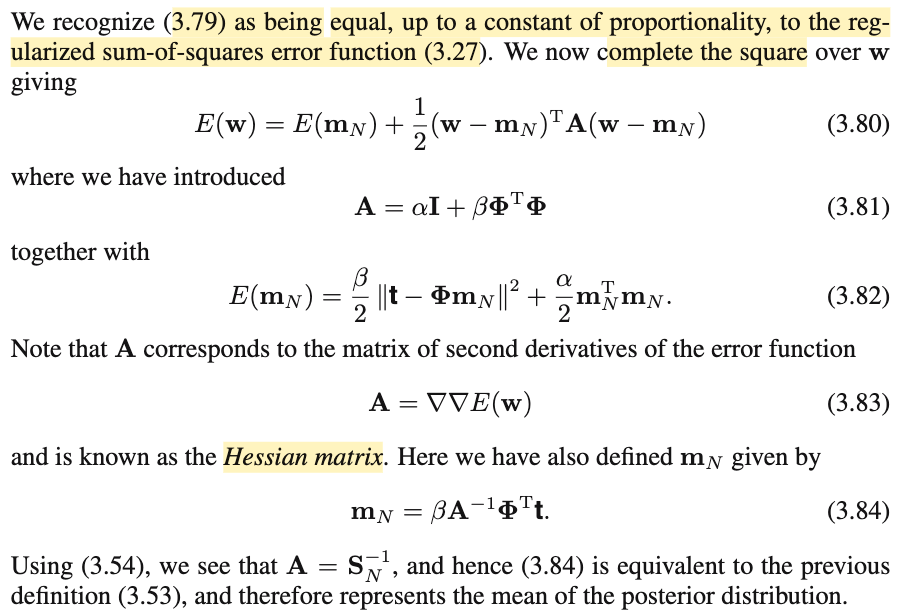
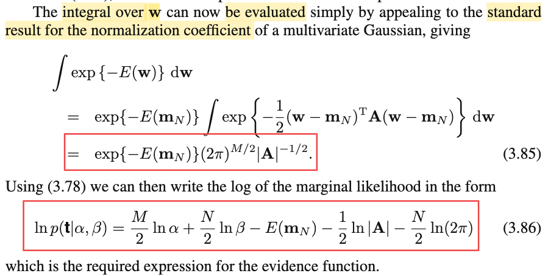
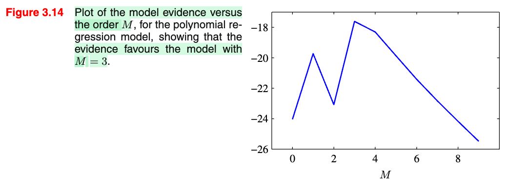
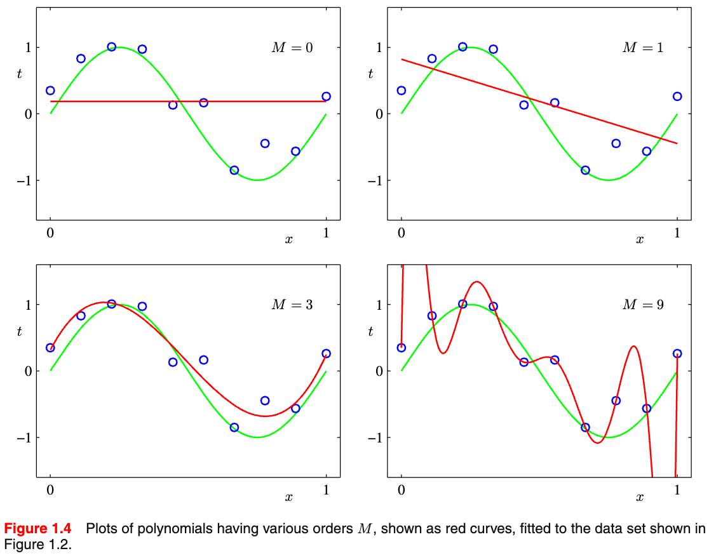
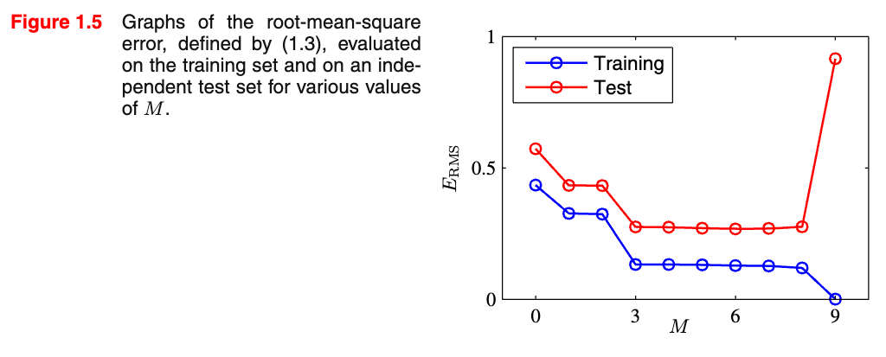
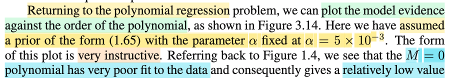
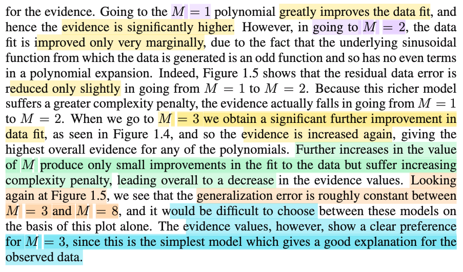

# 3.5.1 Evaluation of the evidence function

📊 **Progress:** `4` Notes | `9` Screenshots | `4` AI Reviews

---

 

## Tính toán hàm evidence

<kbd></kbd>

<kbd></kbd>

> [!NOTE]
> Qua phần này, đại khái là ta sẽ evaluate evidence function. Đầu tiên, có lẽ nên ôn lại chút xíu về marginal likelihood f(**t**|α, β) và để hiểu rõ bản chất mình nên viết tường minh đầy đủ các yếu tố phụ thuộc thay vì bỏ bớt cho gọn (nhưng sẽ dễ khiến ta hiểu sai).
>
>
>
> Theo định nghĩa, model evidence hay marginal likelihood là xác suất của observed data 𝒟 dưới giả định mô hình phân phối gốc là ℳi: f(𝒟|**ℳ**i).
>
>
>
> Và dưới một model ℳi, để sinh ra data 𝒟 ta còn phải xét đến giá trị tham số **w** cụ thể, vậy thì f(𝒟|ℳi) chính là kết quả mang ý nghĩa ta trung bình f(𝒟|**ℳ**i, **w**) trên mọi possible value của **w** với **w** \~ phân phối nào đó.
>
>
>
> f(𝒟|**ℳ**i,α) = ∫f(𝒟|**ℳ**i,**w**)\[hàm probability distribution của **w**\]d**w**
>
>
>
> Và phân phối của **w** ở đây là distribution f(**w**|α)
>
>
>
> f(𝒟|**ℳ**i,α) = ∫f(𝒟|**ℳ**i,**w**)f(**w**|α)d**w**
>
>
>
> Tới đây, xét thực tế ta chỉ coi target variable là random variable, nên viết lại thành:
>
>
>
> f(**t**|**ℳ**i,α,**X**) = ∫f(**t**|**ℳ**i,**w**,**X**)f(**w**|α)d**w**
>
>
>
> và nếu xét mô hình ℳi cụ thể nơi ta giả định T \~ n(y(**w**,x), 1/β) thì ta sẽ bỏ đi ℳi, cái trên trở thành:
>
>
>
> f(**t**|α,β,**X**) = ∫f(**t**|**w**,β,**X**)f(**w**|α)d**w**
>
>
>
> Và bỏ nốt **X** đi cho gọn (dù luôn phải hiểu nó phải nằm ở đó)
>
>
>
> f(**t**|α, β) = ∫f(**t**|**w**,β)f(**w**|α)d**w**. Đây chính là 3.77
>
>
>
> Do đó, ta sẽ cần hiểu rõ 3.77 là model evidence, hay marginal likelihood
>
>
>
> f(𝒟|**ℳ**i,α) = ∫f(𝒟|**ℳ**i,**w**)f(**w**|α)d**w**, **với trường hợp rất cụ thể khi mô hình ℳi là**: T \~ n(y(**w**,**x**), 1/β) và prior là f(**w**|α)
>
>
>
> ---
>
>
>
> Rồi, tiếp, để mà tính cái tích phân này, tác giả cho rằng ta có thể xài kết quả 2.115 (xem link), mà đại khái trong đó mình đã kết luận về công thức tham số của mô hình Normal là kết quả của nhân hai (pdf của) normal với nhau. Cụ thể là khi f(**x**) = 𝒩(**x**|**μ**, **Λ**inv), f(**y**|**x**) = 𝒩(**y**|**Ax**+**b**, **L**inv). Thì f(**y**) sẽ là 𝒩(**y**|**Aμ** + **b**, **L**inv + **A** **Λ**inv **A**T)
>
>
>
> Vậy thì ở đây, nếu dùng kết quả này thì ta sẽ có
>
>
>
> f(**w**|α) = 𝒩(**w**|**0**,(1/α)**I**) (chính là 3.52), cái này tương ứng với f(**x**) = 𝒩(**x**|**μ**, **Λ**inv)
>
>
>
> Tức **μ** = **0**, **Λ**inv = (1/α)**I**
>
>
>
> f(**t**|β,**w**) thì là joint pdf của T1.....TN, với Ti \~ 𝒩(ti|**w**TΦ(**x**), 1/β), nên theo tính iid, f(**t**|β,**w**) = Πi=1:N 𝒩(ti|**w**TΦ(**x**), 1/β).
>
>
>
> và trước đây ta đã làm cái này, nó chính là 𝒩(**t**|**Φw**, (1/β)**I**).
>
>
>
> Và cái này tương ứng với f(**y**|**x**) = 𝒩(**y**|**Ax**+**b**, **L**inv), tức
>
>
>
> **t** = **y**
>
>
>
> **w** = **x**
>
>
>
> **Ax** + **b** = **Φw** + **0**
>
>
>
> **L**inv = (1/β)**I**
>
>
>
> ---
>
>
>
> Vậy ∫f(**t**|**w**,β)f(**w**|α)d**w** sẽ là 𝒩(**y**|**Aμ** + **b**, **L**inv + **A** **Λ**inv **A**T)
>
>
>
> = 𝒩(**t**|**Φ0** + **0**, (1/β)**I** + **Φ** (1/α)**I** **Φ**T)
>
>
>
> = 𝒩(**t**|**0**, (1/β)**I** + (1/α)**ΦΦ**T)
>
>
>
> Vậy f(**t**|α, β) = 𝒩(**t**|**0**, (1/β)**I** + (1/α)**ΦΦ**T)
>
>
>
> Đặt **Σ** = (1/β)**I** + (1/α)**ΦΦ**T, ta có f(**t**|α, β) = 𝒩(**t**|**0**, **Σ**)
>
>
>
> Thay pdf của multivariate normal (1.52 xem link, nói rằng 𝒩(**x**|**μ**, **Σ**) = \[1/(2π)^D/2\] \[1/|**Σ**|^1/2\] exp {-0.5(**x**-**μ**)T **Σ**inv (**x**-**μ**)}
>
>
>
> ..= \[1/(2π)^N/2\] \[1/|**Σ**|^1/2\] exp {-0.5(**t**)T **Σ**inv (**t**)}
>
>
>
> ---
>
>
>
> Tuy nhiên, ở đây mr Bishop lại không làm theo lối này (dùng kết quả 2.115), thay vào đó ông lại dùng cách khác - là dùng cách complete the square, để ra kết quả 3.78:
>
>
>
> Có nghĩa là ta có:
>
>
>
> ∫𝒩(**t**|**Φw**, (1/β)**I**)𝒩(**w**|**0**,(1/α)**I**) d**w**
>
>
>
> = ∫𝒩(**t**|**Φw**, (1/β)**I**) 𝒩(**w**|**0**,(1/α)**I**) d**w**
>
>
>
> Xét 𝒩(**t**|**Φw**, (1/β)**I**) 𝒩(**w**|**0**,(1/α)**I**)
>
>
>
> Với 𝒩(**t**|**Φw**, (1/β)**I**) = \[1/(2π)^N/2\] \[1/|(1/β)**I**|^1/2\] exp {-0.5(**t**-**Φw**)T ((1/β)**I**)inv (**t**-**Φw**)}
>
>
>
> = \[1/(2π)^N/2\] \[1/|(1/β)**I**|^1/2\] exp {-0.5β(**t**-**Φw**)T(**t**-**Φw**)}
>
>
>
> = \[1/(2π)^N/2\] \[β^N/2\] exp {-0.5β(**t**-**Φw**)T(**t**-**Φw**)} (do determinant của (1/β)**I** với **I** là identity matrix N × N = (1/β)^N = 1/β^N
>
>
>
> = \[(β/2π)^N/2\] exp {-0.5β(**t**-**Φw**)T(**t**-**Φw**)}
>
>
>
> Còn 𝒩(**w**|**0**,(1/α)**I**) = 𝒩(**x**|**μ**, **Σ**) = \[1/(2π)^M/2\] \[1/|(1/α)**I**|^1/2\] exp {-0.5(**w**-**0**)T ((1/α)**I**)inv (**w**-**0**)}
>
>
>
> = \[1/(2π)^M/2\] \[α^M/2\] exp {-0.5α**w**T**w**} (do determinant của (1/α)**I** với **I** là identity matrix M × M = (1/α)^M = 1/α^M
>
>
>
> = \[(α/2π)^M/2\] exp {-0.5α**w**T**w**}
>
>
>
> Vậy:
>
>
>
> ∫𝒩(**t**|**Φw**, (1/β)**I**)𝒩(**w**|**0**,(1/α)**I**) d**w**
>
>
>
> = ∫\[(β/2π)^N/2\] exp {-0.5β(**t**-**Φw**)T(**t**-**Φw**)} \[(α/2π)^M/2\] exp {-0.5α**w**T**w**} d**w**
>
>
>
> = \[(β/2π)^N/2\] \[(α/2π)^M/2\] ∫ exp {-0.5β(**t**-**Φw**)T(**t**-**Φw**)} exp {-0.5α**w**T**w**} d**w**
>
>
>
>
>
> ---
>
>
>
> Tới đây, xét ∫ exp {-0.5β(**t**-**Φw**)T(**t**-**Φw**)} exp {-0.5α**w**T**w**} d**w**, xem nó là cái gì
>
>
>
> Cục (**t**-**Φw**)T(**t**-**Φw**), dễ thấy chính là ||**Φw**-**t**||^2 (hay ||**t**-**Φw**||^2)
>
>
>
> và **w**T**w** thì là ||**w**||^2, nên ta có:
>
>
>
> ∫ exp {-0.5β(**t**-**Φw**)T(**t**-**Φw**)} exp {-0.5α**w**T**w**} d**w**
>
>
>
> = ∫ exp {-0.5β||**t**-**Φw**||^2} exp {-0.5α||**w**||^2} d**w**
>
>
>
> Dùng tính chất hàm mũ: e^a × e^b = e^(a+b)
>
>
>
> = ∫ exp {-0.5β||**t**-**Φw**||^2 -0.5α||**w**||^2} d**w**
>
>
>
> Và bằng cách **DEFINE** E_D\[**w**\] = (1/2) ||**t**-**Φw**||^2
>
>
>
> E_W(**w**) = 0.5||**w**||^2 = 0.5 **w**T**w**
>
>
>
> và E(**w**) = βE_D\[**w**\] + α E_W\[**w**\] thì:
>
>
>
> f(**t**|α,β) = ∫𝒩(**t**|**Φw**, (1/β)**I**)𝒩(**w**|**0**,(1/α)**I**) d**w chính là:**
>
>
>
> \[(β/2π)^N/2\] \[(α/2π)^M/2\] ∫ exp {-E(**w**)} d**w**, → 3.78
>
>
>
> Mình hiểu E ở đây là Error, chứ ko phải kì vọng (Expectation của **w**) nhé.

> [!TIP]
> **🤖 AI Feedback** — ✅ Score: **100/100**
>
> Ghi chú vô cùng chi tiết, chính xác và thể hiện sự hiểu biết sâu sắc về cả hai phương pháp tính tích phân (dùng công thức phân phối Gaussian tuyến tính và biến đổi trực tiếp qua hàm năng lượng). Các bước phân tích rõ ràng và việc làm tường minh các biến phụ thuộc ẩn rất xuất sắc.

**🔗 See also:** [Phân bố tiên nghiệm và hậu nghiệm](./233_bayess_theorem_for_gaussian_variables.md#node-zswmsts) · [Likelihood and Error Functions](./311_maximum_likelihood_and_least_squares.md#node-urnjdcs) · [Gaussian Prior and Posterior Parameters](./331_bayesian_linear_regression.md#node-nt82rck) · [PDF Gaussian Đa Biến](./124_the_gaussian_distribution.md#node-40ke7sj)

 

### Hessian of Regularized Error Function

<kbd></kbd>

> [!NOTE]
> Tiếp nối note trước, ta đang có:
>
>
>
> f(**t**|α,β) = \[(β/2π)^N/2\] \[(α/2π)^M/2\] ∫ exp {-E(**w**)} d**w**
>
>
>
> Mà mình đã biết rằng, bằng cách dùng kết quả từ chap 2, ta sẽ có đây chính là pdf của 𝒩(**t**|**0**, **Σ**), **Σ** = (1/β)**I** + (1/α)**ΦΦ**T
>
>
>
> Còn ở đây, ta sẽ đại ý là đi làm động tác complete the square: tức là biến đổi cái cục trong exp(...) để cho ra kết quả có dạng là quadratic function của **w**, và từ đó kết luận đây là pdf của normal, rồi dùng khớp mẫu, ta sẽ xác định được mean và covariance (mà kết qủa sẽ ra cái vừa nói: 𝒩(**t**|**0**, **Σ**), **Σ** = (1/β)**I** + (1/α)**ΦΦ**T). Có nghĩa là thay vì áp dụng kết quả từ chapter 2, ta đi làm lại vậy.
>
>
>
> ---
>
>
>
> Xét E(**w**) = βE_D\[**w**\] + α E_W\[**w**\] với E_D\[**w**\] = (1/2) ||**t**-**Φw**||^2 và E_W(**w**) = 0.5||**w**||^2 = 0.5 **w**T**w**, ta có:
>
>
>
> E(**w**) = β\[(1/2) ||**t**-**Φw**||^2\] + α (1/2) **w**T**w**
>
>
>
> = (β/2) (**t**-**Φw**)T(**t**-**Φw**) + (α/2) **w**T**w**
>
>
>
> = (β/2) (**t**T - **w**T**Φ**T)(**t** - **Φw**) + (α/2) **w**T**w**
>
>
>
> = (β/2) (**t**T**t** - **w**T**Φ**T**t** - **t**T**Φw** + **w**T**Φ**T**Φw**) + (α/2) **w**T**w**
>
>
>
> = (β/2) (**t**T**t** - 2**t**T**Φw** + **w**T**Φ**T**Φw**) + (α/2) **w**T**w**
>
>
>
> = (β/2) **t**T**t** - (β/2)2**t**T**Φw** + (β/2) **w**T**Φ**T**Φw** + (α/2) **w**T**w**
>
>
>
> = (β/2) **t**T**t** - β**w**T**Φ**T**t** + (β/2) **w**T**Φ**T**Φw** + (α/2) **w**T**w**
>
>
>
> = (β/2) **t**T**t** - β**w**T**Φ**T**t** + **w**T\[(β/2)**Φ**T**Φ**\]**w** + **w**T\[(α/2)**I**\]**w**
>
>
>
> = (β/2) **t**T**t** - β**w**T**Φ**T**t** + **w**T\[(β/2)**Φ**T**Φ**+(α/2)**I**\]**w**
>
>
>
> Đặt **A** = β**Φ**T**Φ**+α**I** 
>
>
>
> = (1/2)**w**T**Aw** - β**w**T**Φ**T**t** + (β/2) **t**T**t**
>
>
>
> ---
>
>
>
> Đến đây lập luận là, ta sẽ muốn biến đổi cái trên để trở thành dạng (1/2)(**w** - **m**N)T**A**(**w** - **m**N) + C
>
>
>
> = (1/2)(**w**T**Aw** - (**m**N)T**Aw** - **w**T**Am**N + (**m**N)T**Am**N) + C
>
>
>
> = (1/2)(**w**T**Aw** - 2**w**T**Am**N + (**m**N)T**Am**N) + C
>
>
>
> = (1/2)**w**T**Aw** - **w**T**Am**N + (1/2)(**m**N)T**Am**N) + C
>
>
>
> Thực hiện động tác "khớp mẫu":
>
>
>
> i) β**w**T**Φ**T**t** = **w**T**Am**N ⇒ β**Φ**T**t** = **Am**N
>
>
>
> ⇔ **m**N = **A**inv β**Φ**T**t** = β**A**inv **Φ**T**t** → đây là 3.84
>
>
>
> ii) (β/2) **t**T**t** = (1/2)(**m**N)T**Am**N) + C
>
>
>
> ⇔ C = -(1/2)(**m**N)T**Am**N) + (β/2) **t**T**t**
>
>
>
> ⇔ C = - (**m**N)T**Am**N) + (1/2)(**m**N)T**Am**N) + (β/2) **t**T**t**
>
>
>
> Thay β**Φ**T**t** = **Am**N, và **A** = β**Φ**T**Φ**+α**I**
>
>
>
> ⇔ C = - (**m**N)T(β**Φ**T**t**) + (1/2)(**m**N)T(β**Φ**T**Φ**+α**I**)**m**N) + (β/2) **t**T**t**
>
>
>
> ⇔ C = (β/2) **t**T**t** - (**m**N)T(β**Φ**T**t**) + (1/2)(**m**N)T(β**Φ**T**Φ**+α**I**)**m**N
>
>
>
> ⇔ C = (β/2) **t**T**t** - β(**m**N)T**Φ**T**t** + (1/2)(**m**N)T(β**Φ**T**Φ**)**m**N + (1/2)(**m**N)T(α**I**)**m**N
>
>
>
> ⇔ C = (β/2) **t**T**t** - β(**m**N)T**Φ**T**t** + (β/2)(**m**N)T**Φ**T**Φm**N + (α/2)(**m**N)T**m**N
>
>
>
> ⇔ C = (β/2) \[**t**T**t** - 2(**m**N)T**Φ**T**t** + (**m**N)T**Φ**T**Φm**N\] +α(**m**N)T**m**N)
>
>
>
> ⇔ C = (β/2) ||**t** - **Φm**N||^2 +α(**m**N)T**m**N) → Đặt là E(**m**N)
>
>
>
> ---
>
>
>
> Kết quả sau khi complete the square ta có: E(**w**) = E(**m**N) + (1/2)(**w** - **m**N)T**A**(**w** - **m**N)
>
>
>
> ---
>
>
>
> Tác gỉa lưu ý: A chính là Hessian của E(**w**), kí hiệu ∇∇E(**w**). Là sao?
>
>
>
> Trả lời đơn giản là vì ta E(**w**) = (1/2)**w**T**Aw** - β**w**T**Φ**T**t** + (β/2) **t**T**t**, Mà với quadratic function của **w**: (1/2)**w**T**Pw** + **q**T**w** + r, nên với Hessian chính là **P**, nên Hessian của E(**w**) chính là **A**.
>
>
>
> ---
>
>
>
> Ý tiếp theo ông Bishop dùng kết quả 3.54 trong đó nói rằng: Khi prior của **w** chọn là N(0, (1/α)**I**), và dưới mô hình ta giả định T \~ N(**w**TΦ(**x**), (1/β)) thì: 
>
>
>
> posterior distribution của **w** sẽ là Normal (**m**N, **S**Ninv) với: 
>
>
>
> **m**N = β**S**N**Φ**T**t** (3.53)
>
>
>
> **S**Ninv = α**I** + β **Φ**T**Φ** (3.54)
>
>
>
> Vậy thì ở đây **A** cũng là matrix được ta đặt cho β**Φ**T**Φ**+α**I**. Do đó **A** = **S**Ninv. 
>
>
>
> Và như vậy cái mN ta đặt ở trên: **m**N = **A**inv β**Φ**T**t** sẽ bằng (**S**Ninv)inv β**Φ**T**t** = **S**N β**Φ**T**t** = β**S**N**Φ**T**t**, **CHÍNH LÀ MEAN CỦA POSTERIOR DISTRIBUTION 3.53**

> [!TIP]
> **🤖 AI Feedback** — ✅ Score: **95/100**
>
> Ghi chú rất chi tiết, tự biến đổi toán học xuất sắc và giải thích rõ ràng mối liên hệ giữa ma trận Hessian với các công thức posterior trước đó. Tuy nhiên, bạn lưu ý một lỗi gõ nhỏ ở bước cuối cùng khi bị thiếu hệ số 1/2 ở thành phần alpha trong công thức của E(m_N).

**🔗 See also:** [Gaussian Prior and Posterior Parameters](./331_bayesian_linear_regression.md#node-nt82rck)

 

#### Log Marginal Likelihood Derivation

<kbd></kbd>

> [!NOTE]
> Rồi, tới đây, quay lại nhiệm vụ chính (nên nhớ ta vẫn đang muốn tính cái tích phân f(**t**|α,β) = \[(β/2π)^N/2\] \[(α/2π)^M/2\] ∫ exp {-E(**w**)} d**w**)
>
>
>
> Xét ∫ exp {-E(**w**)} d**w**, thay E(**w**) = E(**m**N) + (1/2)(**w** - **m**N)T**A**(**w** - **m**N)
>
>
>
> = ∫ exp {-\[E(**m**N) + (1/2)(**w** - **m**N)T**A**(**w** - **m**N)\]} d**w**
>
>
>
> = ∫ exp {-\[E(**m**N) + (1/2)(**w** - **m**N)T**A**(**w** - **m**N)\]} d**w**
>
>
>
> = ∫ exp {-E(**m**N) - \[(1/2)(**w** - **m**N)T**A**(**w** - **m**N)\]} d**w**
>
>
>
> Dùng tính chất hàm mũ, tách ra:
>
>
>
> = ∫ exp {-E(**m**N)} exp{-\[(1/2)(**w** - **m**N)T**A**(**w** - **m**N)\]} d**w**
>
>
>
> exp {-E(**m**N)} không dính **w**, đưa ra tích phân
>
>
>
> = exp {-E(**m**N)} ∫ exp{-\[(1/2)(**w** - **m**N)T**A**(**w** - **m**N)\]} d**w**
>
>
>
> Viết lại: ∫ exp {-E(**w**)} d**w**  = exp {-E(**m**N)} ∫ exp{-\[(1/2)(**w** - **m**N)T**A**(**w** - **m**N)\]} d**w**
>
>
>
> ---
>
>
>
> Tới đây sao nữa: Lập luận như sau, xét cái tích phân ∫ exp{-\[(1/2)(**w** - **m**N)T**A**(**w** - **m**N)\]} d**w**, nó có dạng là kernel của một Normal(**m**N, **A**inv) do đó, bằng cách nhân thêm normalizing constant của pdf này, tạm gọi là C1. 
>
>
>
> Ta sẽ có: (1/C1) ∫ C1 exp{-\[(1/2)(**w** - **m**N)T**A**(**w** - **m**N)\]} d**w**.  
>
>
>
> Để rồi do tính valid của pdf, ∫ C1 exp{-\[(1/2)(**w** - **m**N)T**A**(**w** - **m**N)\]} d**w** phải bằng 1.
>
>
>
> nên ∫ exp {-E(**w**)} d**w** = exp {-E(**m**N)} (1/C1), chỉ việc thay C1 vô, C1 là gì?
>
>
>
> theo công thức pdf D-dimensional Normal(**x**|**μ**, **Σ**) = \[(2π)^-D/2\] \[1/|**Σ**|^1/2\] exp\[(**x** - **μ**)T**Σ**inv(**x** - μ)/2\], thì normalizing constant C1 của M-dimensional Normal (vì **w** có M phần tử) ở đây chính là:
>
>
>
> C1 = \[(2π)^-M/2\] (|**A**inv|^-1/2) 
>
>
>
> ⇒ ∫ exp {-E(**w**)} d**w** = exp {-E(**m**N)} \[(2π)^M/2\] (|**A**inv|^1/2)
>
>
>
> Nhớ tính chất det matrix đã học trong MIT 1806: |Ainv| = 1/|A|, nên:
>
>
>
> ∫ exp {-E(**w**)} d**w** = exp {-E(**m**N)} \[(2π)^M/2\] (|**A**|^-1/2) → 3.85
>
>
>
> ---
>
>
>
> Vậy f(**t**|α,β) = \[(β/2π)^N/2\] \[(α/2π)^M/2\] ∫ exp {-E(**w**)} d**w**)
>
>
>
> ⇔ f(**t**|α,β) = \[(β/2π)^N/2\] \[(α/2π)^M/2\] exp {-E(**m**N)} \[(2π)^M/2\] (|**A**|^-1/2)
>
>
>
> ⇒ ln f(**t**|α,β) = ln { \[(β/2π)^N/2\] \[(α/2π)^M/2\] exp {-E(**m**N)} \[(2π)^M/2 (|**A**|^-1/2)\]
>
>
>
> = ln \[(β/2π)^N/2\] + ln \[(α/2π)^M/2\] + ln \[exp {-E(**m**N)} \[(2π)^M/2 (|**A**|^-1/2)\]
>
>
>
> = (N/2) ln (β/2π) + (M/2) ln (α/2π) + ln \[exp {-E(**m**N)}\] + ln \[(2π)^M/2 (|**A**|^-1/2)\]
>
>
>
> = (N/2) \[ln (β) - ln(2π)\] + (M/2) \[ln(α) - ln (2π)\] - E(**m**N) + ln \[(2π)^M/2\] + ln \[(|**A**|^-1/2)\]
>
>
>
> = (N/2) ln (β) - (N/2) ln(2π) + (M/2) ln(α) - (M/2) ln (2π) - E(**m**N) + (M/2) ln (2π) -1/2 ln |**A**|
>
>
>
> = (N/2) ln (β) - (N/2) ln(2π) + (M/2) ln(α)  - E(**m**N) - 1/2 ln |**A**|
>
>
>
> = (M/2) ln(α) + (N/2) ln (β) + - E(**m**N) - 1/2 ln |**A**|  - (N/2) ln(2π) 
>
>
>
> Đây là kết quả 3.86

> [!TIP]
> **🤖 AI Feedback** — ✅ Score: **100/100**
>
> Ghi chú của bạn cực kỳ chi tiết, mạch lạc và chính xác tuyệt đối trong từng bước biến đổi toán học để chứng minh (3.85) và (3.86). Việc giải thích tường minh hằng số chuẩn hóa Gaussian và cách triệt tiêu các đại lượng logarit là một điểm cộng rất lớn giúp người đọc dễ dàng theo kịp.

**🔗 See also:** [PDF Gaussian Đa Biến](./124_the_gaussian_distribution.md#node-40ke7sj)

 

##### Figure 3.14 Model Evidence Plot

<kbd></kbd>

<kbd></kbd>

<kbd></kbd>

<kbd></kbd>

<kbd></kbd>

> [!NOTE]
> Tiếp tục phần cuối, dựa vào kết quả ta đã có của ln f(**t**|α, β) = (M/2) ln(α) + (N/2) ln (β) - E(**m**N) - 1/2 ln |**A**| - (N/2) ln(2π), gs mới ốp vào bài toán polynomial curve fitting đã học.
>
>
>
> Trước hết mình sẽ nói lại tí về ý nghĩa của f(**t**|α, β), là model evidence, hay marginal likelihood, mà như các note trước mình đã hiểu bản chất của nó chính là: f(𝒟|**ℳ**i), hay f(**t**|ℳi,**X**) với ℳi là mô hình cụ thể trong đó ta cho T \~ n(y(**w**,**x**), 1/β). Và f(𝒟|**ℳ**i) = f(**t**|ℳi,**X**) được hiểu là kết quả có được khi ta marginalizing f(𝒟|**ℳ**i, **w**) = f(t|ℳi, **w**, **X**) over mọi possible value của **w**, với **w** \~ n(0, 1/α)**I**).
>
>
>
> Do đó f(𝒟|**ℳ**i), cũng là f(**t**|ℳi,**X**), và viết thêm sự phụ thuộc vào α, β ta có f(**t**|ℳi, α, β, **X**), cũng như bỏ đi ℳi, **X** cho gọn (vì đã xét ℳi cụ thể cũng như tự biết sẽ phải phụ thuộc **X**) ta sẽ có f(**t**|α, β). Và bản chất của nó mang ý nghĩa là: Giả định mô hình phân phối của data là ℳi, với tham số **w** có giả định prior như vậy, thì khi ta lấy trung bình trên mọi giá trị của **w**, thì xác suất quan sát được bộ data set 𝒟 là bao nhiêu.
>
>
>
> Vậy thì với việc ta đã ra được kết quả:
>
>
>
> ln f(**t**|α, β) = (M/2) ln(α) + (N/2) ln (β) - E(**m**N) - 1/2 ln |**A**| - (N/2) ln(2π). Người ta mới vẽ nó là hàm theo M, để có hình 3.14. Và tương ứng với hình 1.4, 1.4 Ta sẽ có thể giải thích bản chất.
>
>
>
> Đầu tiên, nhìn vào công thức ta vừa làm, phân tích một chút như sau:
>
>
>
> (M/2) ln(α) + (N/2) ln (β) - E(**m**N) - 1/2 ln |**A**| - (N/2) ln(2π)
>
>
>
> = - E(**m**N) + (M/2) ln(α) + (N/2) ln (β) - 1/2 ln |**A**| - (N/2) ln(2π)
>
>
>
> = - (β/2) ||**t** - **Φm**N||^2 - (α/2) **m**NT**m**N + (M/2) ln(α) + (N/2) ln (β) - 1/2 ln |**A**| - (N/2) ln(2π)
>
>
>
> Xét term - (β/2) ||**t** - **Φm**N||^2 = - (β/2) ||**t** - **Φm**N||^2:
>
>
>
> Với **m**N = β**S**N**Φ**T**t** mà ta nhận định chính là posterior mean của **w**, thì **Φm**N chính là gì? Chính là **Φw**MAP, và - (1/2) ||**t** - **Φm**N||^2 chính là sum squared error của mô hình khi dùng **w**MAP để lắp vào hàm dự đoán y(**w**, **x**) = **w**TΦ(**x**). Và bữa trước ta cũng đã biết, khi có posterior distribution của **w**, thì một cách point estimate tốt cho **w** là dùng **w**MAP (mà ta gọi là làm Bayesian kiểu nửa mùa đó).
>
>
>
> Như vậy - (β/2) ||**t** - **Φm**N||^2 chính là (negative) của β × sum square error. Dĩ nhiên khi model fit data càng tốt thì sum square error càng nhỏ → - (β/2) ||**t** - **Φm**N||^2 càng bớt âm, đồng nghĩa sẽ kéo f(**t**|α, β) tăng lên.
>
>
>
> ---
>
> Xét -(α/2) **m**NT**m**N = -(α/2) ||**m**N||^2, đây chỉ là penalty của regularization loss khi dùng **w**MAP, đương nhiên nó là norm của vector **w**MAP, nên nếu M càng lớn, thì norm vector cũng sẽ tăng, từ đó dấu trừ phía trước sẽ kéo cục này giảm, do đó, kéo f(**t**|α, β) giảm
>
>
>
> Xét - 1/2 ln |**A**|. Thì **A** như đã nói ở note trước, chính là nghịch đảo covariance của posterior của **w**, hay, chính là posterior precision matrix. Khi M càng lớn, thì det của matrix covariance đương nhiên càng nhỏ (vì càng nhiều data thì phương sai hậu nghiệm sẽ nhỏ lại → det càng nhỏ → det precision matrix |**A**| càng lớn → ln |**A**| sẽ càng lớn , và thêm dấu trừ đằng trước thì - 1/2 ln |**A**| sẽ càng nhỏ 
>
>
>
> Xét (M/2) ln(α), với α là số nhỏ, thì ln α âm, khiến term này nó cũng sẽ nhỏ lại khi M lớn lên.
>
>
>
> Như vậy, tóm lại, khi M thay đổi trong công thức của model evidence có hai phe đấu đá nhau: 
>
>
>
> Khả năng fit của model tăng sẽ kéo sum square error nhỏ xuống → tăng model evidence. Nhưng M tăng sẽ khiến các term khác kéo model evidence tăng lên, và chúng mang ý nghĩa sẽ phạt mô hình phức tạp (M lớn)
>
>
>
> Và điều này giúp ta giải thích các hình đồ thị như sau:
>
>
>
> Khi M nhỏ, = 0, 1.4 cho thấy một model quá đơn giản (constant), không khớp tốt data → SSE lớn → model evidence nhỏ.
>
>
>
> Nguyên lí chung khi M tăng lên, lực kéo model evidence xuống sẽ tăng liên tục, nên ăn thua là xem lực kéo lên do giảm SSE có đủ để bù hay không.
>
>
>
> Khi M tăng lên 1, nó khớp tốt hơn data, giúp kéo SSE xuống và dù M tăng lên cũng khiến phe kia kéo model xuống nhưng sự tăng của phe SSE vượt trội → model evidence tăng lên (cái đỉnh thứ nhất của hình 3.14)
>
>
>
> Khi M tăng lên 2, dựa trên sự thật là data sinh ra từ hàm sin, có bản chất là hàm lẻ, nên hiểu đại khái là dùng polynomial bậc hai (w0 + w1x + wx^2) không giúp tạo ra model fit tốt hơn hơn data này. Do đó, SSE ko giảm bao nhiêu → không kéo model evidence lên bao nhiêu dẫn lực kéo lên bị yếu thế so với lực kéo model xuống → model evidence bị kéo xuống, tạo nên cái thung lũng ở hình 3.14.
>
>
>
> Khi M tăng lên 3, với bậc 3, hàm đa thức fit tốt data sinh ra bởi hàm sin, thành ra, SSE giảm mạnh, lực kéo lên vượt trội, khiến 3.14 tạo đỉnh thứ hai (cao nhất). Hình 1.4 ta thấy đường cong bậc 3 màu đỏ khớp khá tốt đường màu xanh.
>
>
>
> Khi M tăng lên 4 và hơn nữa, SSE không giảm bao nhiêu, lực kéo lên bắt đầu thua, model evidence bắt đầu đi xuống liên tục. Và với M = 9, thì phe kéo model xuống để phạt model có M cao đã vượt xa lực kéo lên của SSE, model evidence giảm rất thấp. Và đây chính là khi model bị overfit với hình 1.4 cuối, nó đi qua hết data perfectly nhưng hoàn toàn không capture được đường hình sin.
>
>
>
> Và như vậy câu chốt một ý quan trọng, đó là nếu chỉ nhìn hình 1.5, ta sẽ thấy khi M = 3 → 7, thì ra sẽ ko biết nên dùng M bao nhiêu (vì khi dựa vào test performance (màu đỏ), nó đi ngang. Nhưng nếu dùng hình 3.14 thì rõ ràng là ta sẽ chọn M = 3, nơi có model evidence cao nhất.

> [!TIP]
> **🤖 AI Feedback** — ✅ Score: **98/100**
>
> Ghi chép cực kỳ xuất sắc, giải thích rất sâu sắc và chính xác bản chất toán học của các thành phần trong công thức model evidence cùng sự liên hệ hoàn hảo với các đồ thị. Để hoàn thiện hơn, bạn có thể giải thích rõ hơn về mặt toán học tại sao định thức của ma trận precision A tăng lên khi số chiều M tăng.

 

