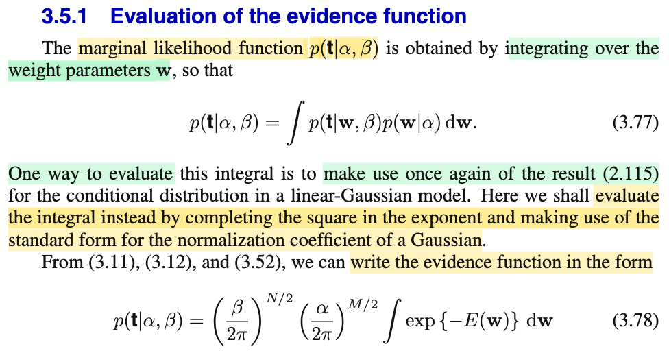
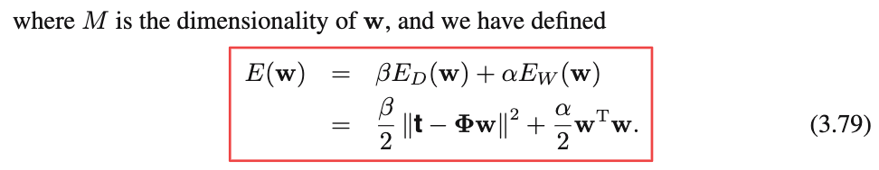

# 3.5.1 Evaluation of the evidence function

📊 **Progress:** `1` Notes | `2` Screenshots | `1` AI Reviews

---

 

## Tính toán hàm evidence

<kbd></kbd>

<kbd></kbd>

> [!NOTE]
> Qua phần này, đại khái là ta sẽ evaluate evidence function. Đầu tiên, có lẽ nên ôn lại chút xíu về marginal likelihood f(**t**|α, β) và để hiểu rõ bản chất mình nên viết tường minh đầy đủ các yếu tố phụ thuộc thay vì bỏ bớt cho gọn (nhưng sẽ dễ khiến ta hiểu sai).
>
>
>
> Theo định nghĩa, model evidence hay marginal likelihood là xác suất của observed data 𝒟 dưới giả định mô hình phân phối gốc là ℳi: f(𝒟|**ℳ**i).
>
>
>
> Và dưới một model ℳi, để sinh ra data 𝒟 ta còn phải xét đến giá trị tham số **w** cụ thể, vậy thì f(𝒟|ℳi) chính là kết quả mang ý nghĩa ta trung bình f(𝒟|**ℳ**i, **w**) trên mọi possible value của **w** với **w** \~ phân phối nào đó.
>
>
>
> f(𝒟|**ℳ**i,α) = ∫f(𝒟|**ℳ**i,**w**)\[hàm probability distribution của **w**\]d**w**
>
>
>
> Và phân phối của **w** ở đây là distribution f(**w**|α)
>
>
>
> f(𝒟|**ℳ**i,α) = ∫f(𝒟|**ℳ**i,**w**)f(**w**|α)d**w**
>
>
>
> Tới đây, xét thực tế ta chỉ coi target variable là random variable, nên viết lại thành:
>
>
>
> f(**t**|**ℳ**i,α,**X**) = ∫f(**t**|**ℳ**i,**w**,**X**)f(**w**|α)d**w**
>
>
>
> và nếu xét mô hình ℳi cụ thể nơi ta giả định T \~ n(y(**w**,x), 1/β) thì ta sẽ bỏ đi ℳi, cái trên trở thành:
>
>
>
> f(**t**|α,β,**X**) = ∫f(**t**|**w**,β,**X**)f(**w**|α)d**w**
>
>
>
> Và bỏ nốt **X** đi cho gọn (dù luôn phải hiểu nó phải nằm ở đó)
>
>
>
> f(**t**|α, β) = ∫f(**t**|**w**,β)f(**w**|α)d**w**. Đây chính là 3.77
>
>
>
> Do đó, ta sẽ cần hiểu rõ 3.77 là model evidence, hay marginal likelihood
>
>
>
> f(𝒟|**ℳ**i,α) = ∫f(𝒟|**ℳ**i,**w**)f(**w**|α)d**w**, **với trường hợp rất cụ thể khi mô hình ℳi là**: T \~ n(y(**w**,**x**), 1/β) và prior là f(**w**|α)
>
>
>
> ---
>
>
>
> Rồi, tiếp, để mà tính cái tích phân này, tác giả cho rằng ta có thể xài kết quả 2.115 (xem link), mà đại khái trong đó mình đã kết luận về công thức tham số của mô hình Normal là kết quả của nhân hai (pdf của) normal với nhau. Cụ thể là khi f(**x**) = 𝒩(**x**|**μ**, **Λ**inv), f(**y**|**x**) = 𝒩(**y**|**Ax**+**b**, **L**inv). Thì f(**y**) sẽ là 𝒩(**y**|**Aμ** + **b**, **L**inv + **A** **Λ**inv **A**T)
>
>
>
> Vậy thì ở đây, nếu dùng kết quả này thì ta sẽ có
>
>
>
> f(**w**|α) = 𝒩(**w**|**0**,(1/α)**I**) (chính là 3.52), cái này tương ứng với f(**x**) = 𝒩(**x**|**μ**, **Λ**inv)
>
>
>
> Tức **μ** = **0**, **Λ**inv = (1/α)**I**
>
>
>
> f(**t**|β,**w**) thì là joint pdf của T1.....TN, với Ti \~ 𝒩(ti|**w**TΦ(**x**), 1/β), nên theo tính iid, f(**t**|β,**w**) = Πi=1:N 𝒩(ti|**w**TΦ(**x**), 1/β).
>
>
>
> và trước đây ta đã làm cái này, nó chính là 𝒩(**t**|**Φw**, (1/β)**I**).
>
>
>
> Và cái này tương ứng với f(**y**|**x**) = 𝒩(**y**|**Ax**+**b**, **L**inv), tức
>
>
>
> **t** = **y**
>
>
>
> **w** = **x**
>
>
>
> **Ax** + **b** = **Φw** + **0**
>
>
>
> **L**inv = (1/β)**I**
>
>
>
> ---
>
>
>
> Vậy ∫f(**t**|**w**,β)f(**w**|α)d**w** sẽ là 𝒩(**y**|**Aμ** + **b**, **L**inv + **A** **Λ**inv **A**T)
>
>
>
> = 𝒩(**t**|**Φ0** + **0**, (1/β)**I** + **Φ** (1/α)**I** **Φ**T)
>
>
>
> = 𝒩(**t**|**0**, (1/β)**I** + (1/α)**ΦΦ**T)
>
>
>
> Vậy f(**t**|α, β) = 𝒩(**t**|**0**, (1/β)**I** + (1/α)**ΦΦ**T)
>
>
>
> Đặt **Σ** = (1/β)**I** + (1/α)**ΦΦ**T, ta có f(**t**|α, β) = 𝒩(**t**|**0**, **Σ**)
>
>
>
> Thay pdf của multivariate normal (1.52 xem link, nói rằng 𝒩(**x**|**μ**, **Σ**) = \[1/(2π)^D/2\] \[1/|**Σ**|^1/2\] exp {-0.5(**x**-**μ**)T **Σ**inv (**x**-**μ**)}
>
>
>
> ..= \[1/(2π)^N/2\] \[1/|**Σ**|^1/2\] exp {-0.5(**t**)T **Σ**inv (**t**)}
>
>
>
> ---
>
>
>
> Tuy nhiên, ở đây mr Bishop lại không làm theo lối này (dùng kết quả 2.115), thay vào đó ông lại dùng cách khác - là dùng cách complete the square, để ra kết quả 3.78:
>
>
>
> Có nghĩa là ta có:
>
>
>
> ∫𝒩(**t**|**Φw**, (1/β)**I**)𝒩(**w**|**0**,(1/α)**I**) d**w**
>
>
>
> = ∫𝒩(**t**|**Φw**, (1/β)**I**) 𝒩(**w**|**0**,(1/α)**I**) d**w**
>
>
>
> Xét 𝒩(**t**|**Φw**, (1/β)**I**) 𝒩(**w**|**0**,(1/α)**I**)
>
>
>
> Với 𝒩(**t**|**Φw**, (1/β)**I**) = \[1/(2π)^N/2\] \[1/|(1/β)**I**|^1/2\] exp {-0.5(**t**-**Φw**)T ((1/β)**I**)inv (**t**-**Φw**)}
>
>
>
> = \[1/(2π)^N/2\] \[1/|(1/β)**I**|^1/2\] exp {-0.5β(**t**-**Φw**)T(**t**-**Φw**)}
>
>
>
> = \[1/(2π)^N/2\] \[β^N/2\] exp {-0.5β(**t**-**Φw**)T(**t**-**Φw**)} (do determinant của (1/β)**I** với **I** là identity matrix N × N = (1/β)^N = 1/β^N
>
>
>
> = \[(β/2π)^N/2\] exp {-0.5β(**t**-**Φw**)T(**t**-**Φw**)}
>
>
>
> Còn 𝒩(**w**|**0**,(1/α)**I**) = 𝒩(**x**|**μ**, **Σ**) = \[1/(2π)^M/2\] \[1/|(1/α)**I**|^1/2\] exp {-0.5(**w**-**0**)T ((1/α)**I**)inv (**w**-**0**)}
>
>
>
> = \[1/(2π)^M/2\] \[α^M/2\] exp {-0.5α**w**T**w**} (do determinant của (1/α)**I** với **I** là identity matrix M × M = (1/α)^M = 1/α^M
>
>
>
> = \[(α/2π)^M/2\] exp {-0.5α**w**T**w**}
>
>
>
> Vậy:
>
>
>
> ∫𝒩(**t**|**Φw**, (1/β)**I**)𝒩(**w**|**0**,(1/α)**I**) d**w**
>
>
>
> = ∫\[(β/2π)^N/2\] exp {-0.5β(**t**-**Φw**)T(**t**-**Φw**)} \[(α/2π)^M/2\] exp {-0.5α**w**T**w**} d**w**
>
>
>
> = \[(β/2π)^N/2\] \[(α/2π)^M/2\] ∫ exp {-0.5β(**t**-**Φw**)T(**t**-**Φw**)} exp {-0.5α**w**T**w**} d**w**
>
>
>
>
>
> ---
>
>
>
> Tới đây, xét ∫ exp {-0.5β(**t**-**Φw**)T(**t**-**Φw**)} exp {-0.5α**w**T**w**} d**w**, xem nó là cái gì
>
>
>
> Cục (**t**-**Φw**)T(**t**-**Φw**), dễ thấy chính là ||**Φw**-**t**||^2 (hay ||**t**-**Φw**||^2)
>
>
>
> và **w**T**w** thì là ||**w**||^2, nên ta có:
>
>
>
> ∫ exp {-0.5β(**t**-**Φw**)T(**t**-**Φw**)} exp {-0.5α**w**T**w**} d**w**
>
>
>
> = ∫ exp {-0.5β||**t**-**Φw**||^2} exp {-0.5α||**w**||^2} d**w**
>
>
>
> Dùng tính chất hàm mũ: e^a × e^b = e^(a+b)
>
>
>
> = ∫ exp {-0.5β||**t**-**Φw**||^2 -0.5α||**w**||^2} d**w**
>
>
>
> Và bằng cách **DEFINE** E_D\[**w**\] = (1/2) ||**t**-**Φw**||^2
>
>
>
> E_W(**w**) = 0.5||**w**||^2 = 0.5 **w**T**w**
>
>
>
> và E(**w**) = βE_D\[**w**\] + α E_W\[**w**\] thì:
>
>
>
> f(t|α,β) = ∫𝒩(**t**|**Φw**, (1/β)**I**)𝒩(**w**|**0**,(1/α)**I**) d**w chính là:**
>
>
>
> \[(β/2π)^N/2\] \[(α/2π)^M/2\] ∫ exp {-E(**w**)} d**w**, → 3.78
>
>
>
> Mình hiểu E ở đây là Error, chứ ko phải kì vọng (Expectation của **w**) nhé.

> [!TIP]
> **🤖 AI Feedback** — ✅ Score: **100/100**
>
> Ghi chú vô cùng chi tiết, chính xác và thể hiện sự hiểu biết sâu sắc về cả hai phương pháp tính tích phân (dùng công thức phân phối Gaussian tuyến tính và biến đổi trực tiếp qua hàm năng lượng). Các bước phân tích rõ ràng và việc làm tường minh các biến phụ thuộc ẩn rất xuất sắc.

**🔗 See also:** [Phân bố tiên nghiệm và hậu nghiệm](./233_bayess_theorem_for_gaussian_variables.md#node-zswmsts) · [Likelihood and Error Functions](./311_maximum_likelihood_and_least_squares.md#node-urnjdcs) · [Gaussian Prior and Posterior Parameters](./331_bayesian_linear_regression.md#node-nt82rck) · [PDF Gaussian Đa Biến](./124_the_gaussian_distribution.md#node-40ke7sj)

 

