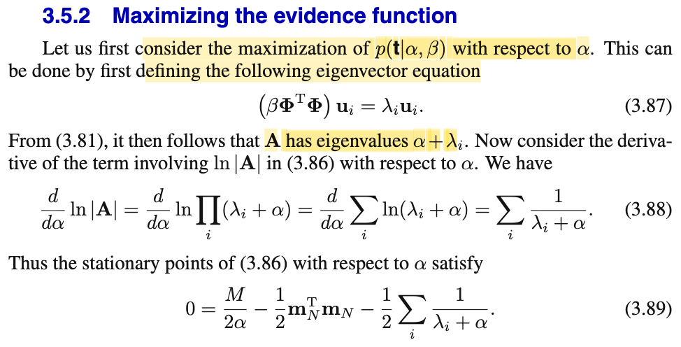
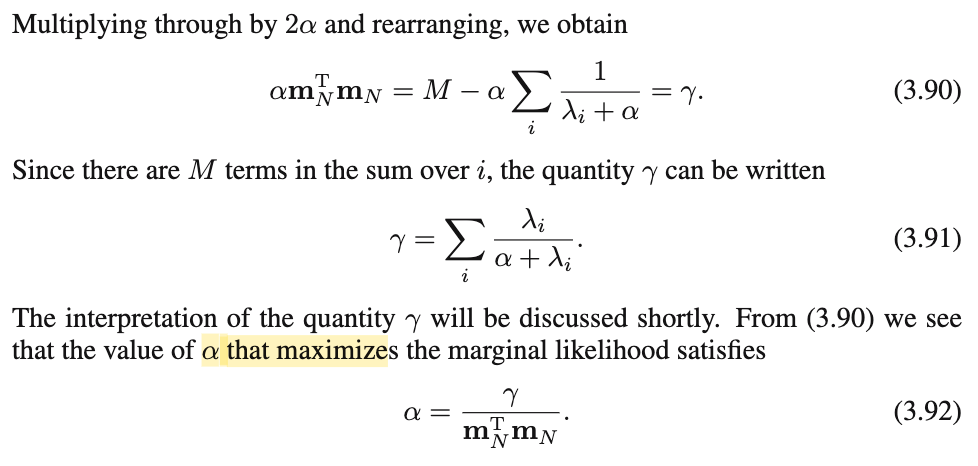
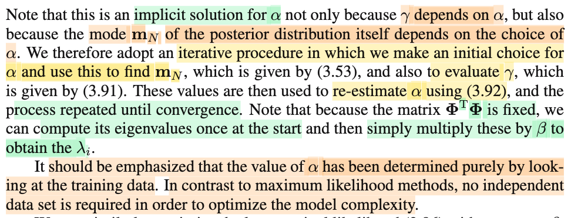
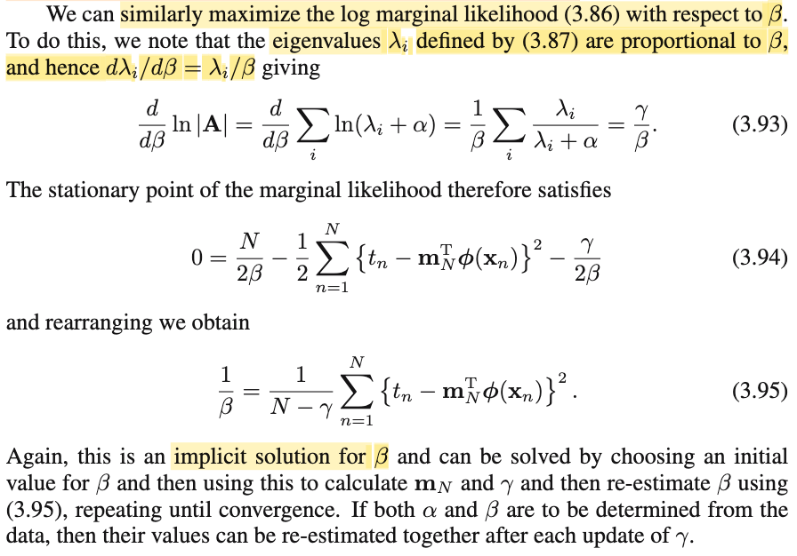

# 3.5.2 Maximizing the evidence function

📊 **Progress:** `3` Notes | `4` Screenshots | `3` AI Reviews

---

 

## Section 3.5.2 Maximizing the Evidence Function

<kbd></kbd>

<kbd></kbd>

> [!NOTE]
> Cùng tìm hiểu phần này. Đầu tiên gs nói ta sẽ đi maximizing model evidence f(**t**|α, β) theo α. Ý nghĩa về model evidence này trong các note trước mình đã nói nhiều nên ko nói lại nữa cho bớt, dài nhưng có thể nói cực nhanh, rằng cái này chính là f(𝒟|**ℳ**i) là kết qủa khi đã average out f(𝒟|**ℳ**i, **w**) over **w** \~ f(**w**|α) và với ℳi là distribution model cụ thể sau đây: T|**x** \~ n(**w**TΦ(**x**), 1/β). Nên f(𝒟|ℳi) này chính là f(**t**|β, α,**X**), bỏ đi (lờ đi để cho gọn bớt) thì ta có f(**t**|α, β).
>
>
>
> Thế thì trước khi đi giải bài toán tối ưu maximize over α {f(**t**|α, β}, tức tìm α, để f(t|α, β) lớn nhất gs làm vài công tác chuẩn bị: định nghĩa ra equation (β**Φ**T**Φ**)ui = λi ui và nói với 3.81 thì **A** có eigenvalues là α + λi. Thế là thế nào nhỉ?
>
>
>
> Là vầy: Theo link (Hessian of Regularized Error Function) ta thấy phần trước, ta đã đặt matrix **A** = α**I** + β **Φ**T**Φ**. Mà (β**Φ**T**Φ**)**u**i = λi **u**i ở đây chỉ đơn giản là có nghĩa là ta gọi λi và **u**i là eigenvalue và eigenvector tương ứng của matrix β**Φ**T**Φ** (vì như đã học trong MIT 18.06, eigenvector và eigenvalue của matrix **A** là scalar λ và vector thỏa **Au** = λ**u**, mang ý nghĩa là thông qua linear transformation bởi matrix A, vector **u** chỉ bị kéo giãn bởi scalar λ chứ không bị đổi hướng). Thế thì lập luận như sau:
>
>
>
> (β**Φ**T**Φ**)**u**i = λi **u**i, cộng hai vế cho **u**i
>
>
>
> ⇔ (β**Φ**T**Φ**)**u**i + α**u**i= λi **u**i + α **u**i
>
>
>
> ⇔ (β**Φ**T**Φ** + α**I**) **u**i= λi **u**i + α **u**i
>
>
>
> ⇔ (β**Φ**T**Φ** + α**I**) **u**i= (λi + α) **u**i
>
>
>
> và với equation này, theo định nghĩa của eigenvector ta kết luận ui cũng là eigenvector của **A** = β**Φ**T**Φ** + α**I** với eigenvalue là λi + α.
>
>
>
> ---
>
>
>
> Tiếp, lôi ra lại công thức 3.86 bữa trước (xem link Log Marginal Likelihood Derivation):
>
> ln f(**t**|α, β) = (M/2) ln(α) + (N/2) ln (β) - E(**m**N) - 1/2 ln |**A**| - (N/2) ln(2π),
>
>
>
> và xét ln |**A**|:
>
>
>
> Ta sẽ tính đạo hàm theo α. (có thể hiểu là tí nữa mình sẽ dùng điều kiện tối ưu bậc chất: đạo hàm của objective function f(t|α,β), d/dα f(t|α, β) = 0, nên đây là ta đang chuẩn bị trước)
>
>
>
> d/dα ln |**A**| = d/dα ln |β**Φ**T**Φ** + α**I**|, có kết quả như công thức 3.88. Thử giải thích xem vì sao?
>
>
>
> → Là vầy, cũng không khó hiểu, ta đã nói ở trên, matrix A có các eigenvalues là λi + α. Mà trong MIT 18.06 mình đã học, det (định thức của matrix) chính là tích các eigenvalue. Nên |A|, hay det A = Πi (λi + α).
>
>
>
> ⇒ d/dα ln |A| = d/dα ln \[Πi (λi + α)\] = d/dα Σi \[ln (λi + α)\] (dùng tính chất hàm log)
>
>
>
> = Σi d/dα \[ln (λi + α)\] (đạo hàm của tổng = tổng đạo hàm)
>
>
>
> = Σi \[d/d((λi + α)) \[ln (λi + α)\] . d/dα (λi + α)\] (chain rule)
>
>
>
> = Σi \[1 / (λi + α)\] → đây là 3.88
>
>
>
> ---
>
> Rồi, như đã nói ở trên, để giải bài toán tối ưu maximize over α f(t|α, β), ta sẽ chuyển sang bài toán tương đương là maximize over α ln f(t|α, β) ta dùng điều kiện cần bậc nhất:
>
>
>
> d/dα ln f(**t**|α, β) = 0 
>
>
>
> Thay công thức ln f(**t**|α, β) bữa trước vào: 
>
>
>
> ⇔ d/dα \[(M/2) ln(α) + (N/2) ln (β) - E(**m**N) - 1/2 ln |**A**| - (N/2) ln(2π)\] = 0
>
>
>
> nhớ lại E(**m**N) = (β/2) ||**t** - **Φm**N||^2 + (α/2)(**m**N)T**m**N), chỉ có term sau dính tới α  
>
>
>
> đang lấy đạo hàm theo α nên nhưng gì trong tổng ko dính tới α bỏ hết
>
>
>
> ⇔ d/dα \[(M/2) ln(α) - α(**m**N)T**m**N - 1/2 ln |**A**|\] = 0
>
>
>
> ⇔ M/2α - (α/2) (**m**N)T**m**N - 1/2 \[Σi \[1 / (λi + α)\]\] = 0 → 3.89
>
>
>
> ⇔ M - α(**m**N)T**m**N - α \[Σi \[1 / (λi + α)\]\] = 0
>
>
>
> ⇔ α(**m**N)T**m**N = M - α Σi \[1 / (λi + α)\], đặt là γ
>
>
>
> ⇔ α = γ / (**m**N)T**m**N, đây là critical point (hay statationary point).
>
>
>
> Và tới đây để kết luận γ / (**m**N)T**m**N là maximizer thì đúng ra ta phải check điều kiện bậc hai nữa: Nhưng gs bỏ qua, ta cũng tạm tin theo vậy.
>
>
>
> Nói thêm cái đoạn đặt γ = M - α Σi \[1 / (λi + α)\], biến đổi tí xíu:
>
> = Σi=1:M (1 - α \[1 / (λi + α)\])
>
>
>
> = Σi=1:M (λi + α - α) / (λi + α)
>
>
>
> = Σi=1:M \[λi / (λi + α)\] → 3.91

> [!TIP]
> **🤖 AI Feedback** — ✅ Score: **95/100**
>
> Bài viết rất chi tiết và giải thích cực kỳ rõ ràng các bước biến đổi tuyến tính cũng như giải tích đạo hàm mà sách giáo khoa bỏ qua. Tuy nhiên, có một lỗi gõ nhỏ ở bước trung gian khi ghi nhầm đạo hàm của $-\frac{\alpha}{2}\mathbf{m}_N^T\mathbf{m}_N$ thành $-\frac{\alpha}{2}\mathbf{m}_N^T\mathbf{m}_N$ thay vì $-\frac{1}{2}\mathbf{m}_N^T\mathbf{m}_N$, mặc dù dòng sau vẫn biến đổi đúng.

**🔗 See also:** [Hessian of Regularized Error Function](./351_evaluation_of_the_evidence_function.md#node-vpu7vqs) · [Lecture 21: Eigenvalues And Eigenvectors *(Mit 18.06)*](../mit1806_gstrang/lecture_21_eigenvalues_and_eigenvectors.md#node-aiwkaf3) · [Log Marginal Likelihood Derivation](./351_evaluation_of_the_evidence_function.md#node-ddcs0pi) · [Marginal Likelihood Maximization for Beta](#node-l71837c) · [Evidence Re-estimation Limit](./353_effective_number_of_parameters.md#node-00gilsq)

 

### Iterative Estimation of Alpha

<kbd></kbd>

> [!NOTE]
> **m**N = β**S**N**Φ**T**t**
>
>
>
> γ = Σi=1:M \[λi / (λi + α)\]
>
>
>
> Rồi, thế thì, đại khái là trong công thức minimizer của bài tóan, α = γ / (**m**N)T**m**N, thì có đặc điểm là γ, cũng phụ thuộc α và **m**N, với ý nghĩa như ta đã biết bữa trước rằng nó là mean của posterior f(**w**|𝒟,α), mà cái này ∝ f(𝒟|**w**)f(**w**|α) nên dĩ nhiên **m**N cũng phụ thuộc α. Vậy công thức trên vẫn chỉ là một hàm theo α.
>
>
>
> Do đó gs nói ta sẽ dùng một cơ chế iterative, bắt đầu với việc chọn α0, rồi lặp lại các bước: Từ α0, tính mN, γ, thay vào tính α1, lặp lại như vậy để có α2,.. cứ thế cho đến khi hội tụ. (chưa hiểu cụ thể, vì gs chỉ nói sơ)
>
>
>
> Một điểm nữa, trong quá trình tính ta sẽ cần λi, là eigenvalue của β**Φ**T**Φ**, và ta sẽ tính eigenvalue của **Φ**T**Φ** rồi nhân β (cái này đơn giản, vì dĩ nhiên eigenvalue của β**Φ**T**Φ** = β × eigenvalue của **Φ**T**Φ**)
>
>
>
> ---
>
>
>
> Cuối cùng ông nhấn mạnh quá trình xác định α hoàn toàn chỉ dựa trên training data. Khác với các làm của MLE, nơi ta phải tách riêng dataset để làm việc này. Hiểu ý này thế nào?
>
>
>
> Đó là, mình nhớ trong note trước đây có nói, **nếu ta đi tìm α theo cách maximize likelihood, thì nó sẽ cho ra kết quả bị overfit**. Lí do là trước đây ta đã hiểu regularization hyperparam thực chất là α/β (xem note Ước lượng Bayes và MAP). Do đó khi ta đi tìm α theo cách maximize likelihood, chính là ta tìm λ để giảm regularization loss, và với ràng buộc λ ≥ 0, cơ bản là nó sẽ set λ = 0, tạo ra một mô hình phức tạp hết cỡ (vì ko còn ràng buộc nào cho tham số w) dẫn đến overfit training set. Do đó, nếu làm theo cách này, bắt buộc phải dùng validation set. 
>
> Trong khi đó, với cách làm maximize model evidence, thì chỉ cần làm trực tiếp trên training set. Vì trong cả hai trường hợp là mô hình quá phức tạp hay quá đơn giản thì model evidence đều sẽ cao, mà ta đã thấy minh họa trong bài trước khi đã thấy đồ thị của model evidence theo M (M ở đây cũng là hyperparameter quy định độ phức tạp của mô hình).  Tương tự, với α, β cũng vậy, đều sẽ chi phối độ phức tạp của mô hình. Và việc tìm chúng theo cách maximize model evidence sẽ ra kết quả là giá trị khiến mô hình ko quá phức tạp cũng ko quá đơn giản

> [!TIP]
> **🤖 AI Feedback** — ✅ Score: **92/100**
>
> Ghi chú rất tốt, tóm tắt chính xác quy trình lặp và cách tính tối ưu trị riêng của ma trận hệ số. Điểm cần làm rõ thêm là phương pháp Maximum Likelihood cần tập dữ liệu độc lập (validation set) để chọn siêu tham số tránh overfit, trong khi phương pháp Bayes có thể tối ưu hóa độ phức tạp trực tiếp trên training data thông qua marginal likelihood.

**🔗 See also:** [Gaussian Prior and Posterior Parameters](./331_bayesian_linear_regression.md#node-nt82rck) · [3.2.0 The Bias-Variance Decomposition](./320_the_bias_variance_decomposition.md#node-0nolzxg) · [Ước lượng Bayes và MAP](./125_curve_fitting_re_visited.md#node-8z48xwr)

 

#### Marginal Likelihood Maximization for Beta

<kbd></kbd>

> [!NOTE]
> Tương tự, ta làm cho β, maximize over β f(**t**|α, β), và cũng equivalent với maximize ln f(**t**|α,β):
>
>
>
> Điều kiện cần bậc nhất:
>
>
>
> d/dβ ln f(**t**|α,β)\] = 0
>
>
>
> ⇔ d/dβ \[(M/2) ln(α) + (N/2) ln (β) - E(**m**N) - 1/2 ln |**A**| - (N/2) ln(2π)\] = 0\
> \
> với E(**m**N) = (β/2) ||**t** - **Φm**N||^2 + (α/2)(**m**N)T**m**N), chỉ có term đầu dính tới β
>
>
>
> ⇔d/dβ \[(N/2) ln (β) - (β/2) ||**t** - **Φm**N||^2 - 1/2 ln |**A**|\] = 0
>
>
>
> ⇔ d/dβ \[(N/2) ln (β) - (β/2) ||**t** - **Φm**N||^2 - 1/2 ln \[Πi (λi + α)\]\] = 0
>
>
>
> ⇔ N/2β - (1/2) ||**t** - **Φm**N||^2 - d/dβ\[1/2 ln \[Πi (λi + α)\]\] = 0
>
>
>
> ⇔ N/2β - (1/2) ||**t** - **Φm**N||^2 - (1/2) Σi d/dβ ln(λi + α)\] = 0
>
>
>
> ⇔ N/2β - (1/2) ||**t** - **Φm**N||^2 - (1/2) Σi \[1/ (λi + α) . dλi/dβ\] = 0
>
>
>
> Đến đây ta cần dλi/dβ, lập luận như sau. Xét (β**Φ**T**Φ**)**u**i = λi **u**i, chia hai vế cho β, ta có **Φ**T**Φ u**i = (λi/β) **u**i ⇒ (λi/β) là eigenvalue của **Φ**T**Φ**, với eigenvector là **u**i, ta đặt scalar này là **e**i: ei = λi/β.
>
>
>
> Như vậy với ei là eigenvalue của **Φ**T**Φ**, ta có hàm λi = ei β, là hàm tuyến tính theo β vì ei chỉ là constant. Do đó dλi/dβ = ei.
>
>
>
> Và ei lại là λi/β. Vậy dλi/dβ = λi/β.
>
>
>
> ---
>
>
>
> Thay kết qủa trên vào
>
>
>
> ..⇔ N/2β - (1/2) ||**t** - **Φm**N||^2 - (1/2) Σi \[1/ (λi + α) . λi/β\] = 0
>
>
>
> ⇔ N/2β - (1/2) ||**t** - **Φm**N||^2 - (1/2) Σi \[λi/(λi + α)β\] = 0
>
>
>
> ⇔ N/2β - (1/2) ||**t** - **Φm**N||^2 - (1/2β) Σi \[λi/(λi + α)\] = 0
>
>
>
> Thay γ = Σi \[λi/(λi + α)\]
>
>
>
> ⇔ N/2β - (1/2) ||**t** - **Φm**N||^2 - (1/2β) γ = 0
>
>
>
> ⇔ N/2β - (1/2) ||**t** - **Φm**N||^2 - γ/2β = 0 → đây là 3.94
>
>
>
> ⇔ N/2β - (1/2) ||**t** - **Φm**N||^2 = γ/2β
>
>
>
> ⇔ N/β -  ||**t** - **Φm**N||^2 = γ/β 
>
>
>
> ⇔ - ||**t** - **Φm**N||^2 = γ/β - N/β
>
>
>
> ⇔ - ||**t** - **Φm**N||^2 = 1/β(γ - N)
>
>
>
> ⇔ \[- 1/(γ - N)\] ||**t** - **Φm**N||^2 = 1/β
>
>
>
> ⇔ \[1/(N-γ)\] ||**t** - **Φm**N||^2 = 1/β
>
>
>
> Tới đây nhớ lại **Φ** là design matrix có các hàng chính là Φi(**x**)T,...ΦM(**x**). Nên **Φm**N là vector có các phần tử là dot product của mN với các vector hàng này.
>
>
>
> .. ⇔ 1/β = \[1/(N-γ)\] \[Σi (ti - **m**NTΦ(**x**i))^2\] 
>
>
>
> Và tương tự như α ta cũng phải giải tìm β theo lối iterative.

> [!TIP]
> **🤖 AI Feedback** — ✅ Score: **100/100**
>
> Bản ghi chép cực kỳ chi tiết, chính xác và rõ ràng, đặc biệt là phần giải thích cặn kẽ tại sao $d\lambda_i/d\beta = \lambda_i/\beta$. Các bước biến đổi đại số để đi đến công thức (3.94) và (3.95) đều rất mạch lạc và hoàn hảo.

**🔗 See also:** [Section 3.5.2 Maximizing the Evidence Function](#node-nc5qxnz) · [Evidence Re-estimation Limit](./353_effective_number_of_parameters.md#node-00gilsq)

 

