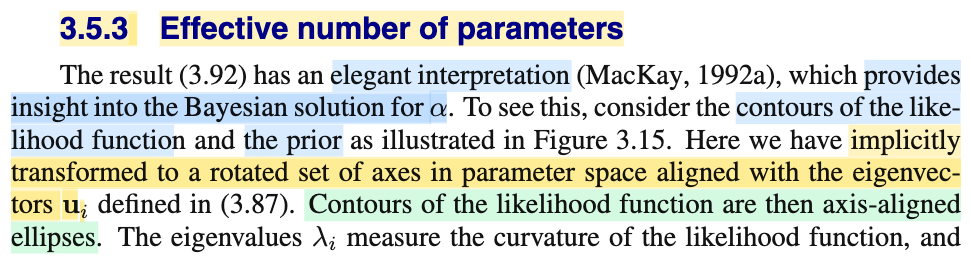
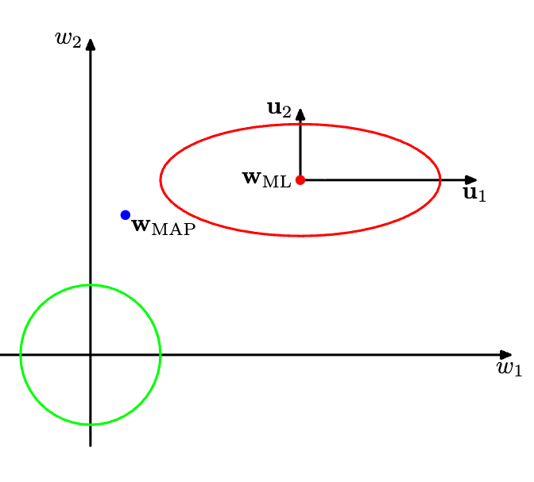
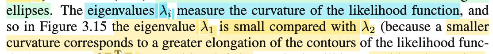
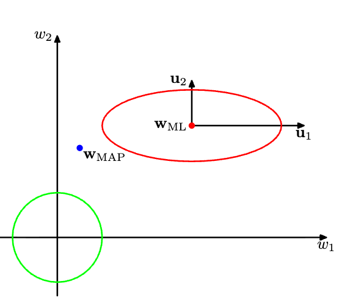
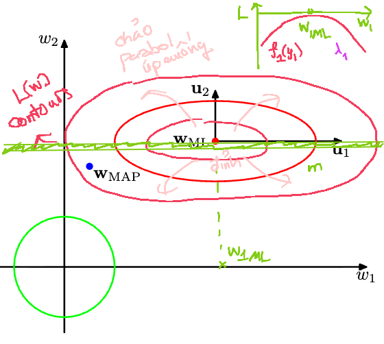
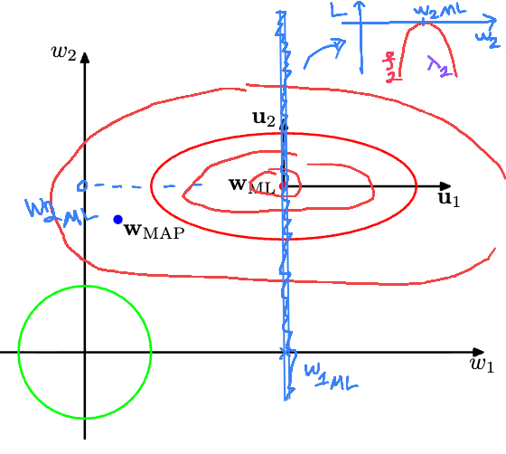
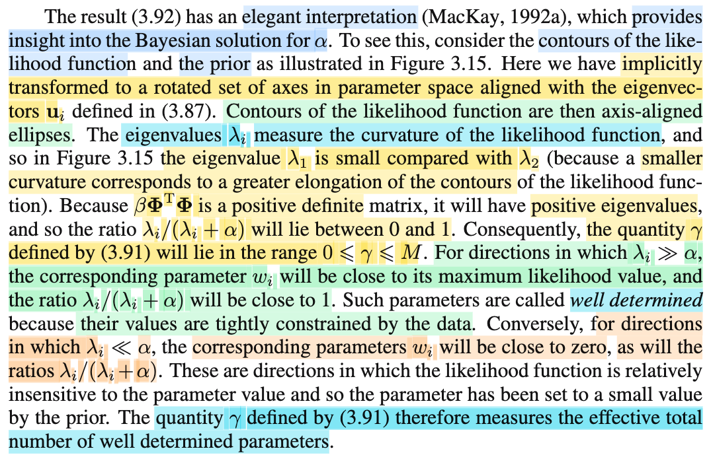
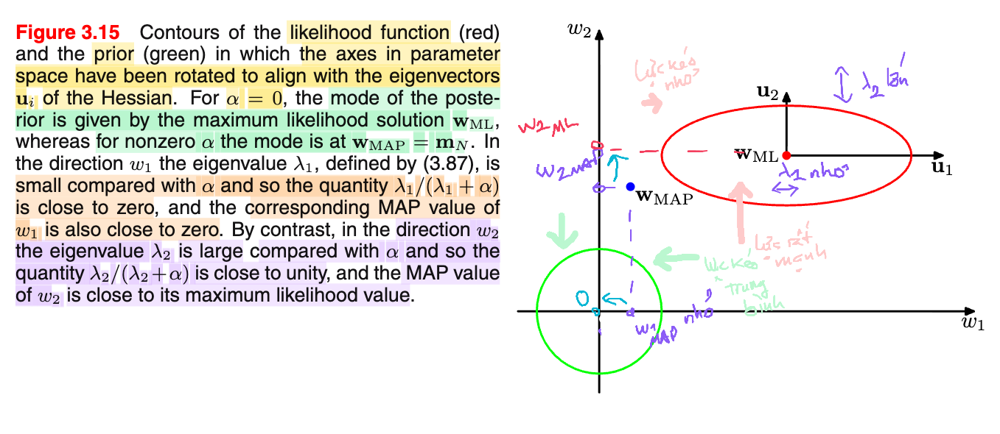

# 3.5.3 Effective number of parameters

📊 **Progress:** `3` Notes | `8` Screenshots | `3` AI Reviews

---

 

## Section 3.5.3 Effective Number of Parameters

<kbd></kbd>

<kbd></kbd>

> [!NOTE]
> Ok, tiếp theo gs nói kết quả 3.92 sẽ cho ta một góc nhìn hay ho. Đầu tiên ta sẽ xem xét contours (tức level set) của hàm likelihood.
>
>
>
> Rồi ông nói ta đã thầm (implicitly) xoay trục để thẳng góc với các **u**i là các eigenvector của **Φ**T**Φ**, và contours này có dạng là hình ellipse thẳng trục.
>
>
>
> Mình sẽ dừng lại và tìm hiểu khúc này là sao:
>
>
>
> Likelihood function là hàm L(**w**|𝒟), theo định nghĩa, nó bằng f(𝒟|**w**). Có nghĩa là, nó chính là f(𝒟|**w**) với tư cách là hàm theo **w**.
>
>
>
> Ta đang trong mô hình ℳi cụ thể: T|**x**\~ n(**w**TΦ(**x**), 1/β). Từ đó:
>
>
>
> f(𝒟|**w**) = f(**t**|**w**,β,**X**)
>
>
>
> = Πi=1:N 𝒩(ti|**w**TΦ(**x**i),1/β)
>
>
>
> và cái này ta đã derive ra kết quả chính là 𝒩(**Φw**, (1/β)**I**).
>
>
>
> Thế thì vẽ contour của f(𝒟|**w**) tức là ta cho nó bằng hằng số:
>
>
>
> 𝒩(**t**|**Φw**, (1/β)**I**) = c
>
>
>
> ⇔ \[(2π)^(-N/2)\] \[1/|((1/β)**I**)|^1/2\] exp\[-(**t** - **Φw**)T ((1/β)**I**)inv (**t** - **Φw**)/2\] = c
>
>
>
> |(1/β)**I**| = (1/β)^N = β^(-N) ⇒ 1/|((1/β)**I**)|^1/2 = β^(-N/2)
>
>
>
> ..⇔ \[(2π)^(-N/2)\] \[β^(-N/2)\] exp\[(-β/2)(**t** - **Φw**)T(**t** - **Φw**)\] = c
>
>
>
> ⇔ \[(2π)^(-N/2)\] \[β^(-N/2)\] exp\[(-β/2)(**t** - **Φw**)T(**t** - **Φw**)\] = c
>
>
>
> ⇔ exp\[(-β/2)(**t** - **Φw**)T(**t** - **Φw**)\] = c2 (nhập hằng số bên vế trái vào c bên phải)
>
>
>
> ⇔ (-β/2)(**t** - **Φw**)T(**t** - **Φw**) = c3 (lấy ln hai vế)
>
>
>
> ⇔ (**t** - **Φw**)T(**t** - **Φw**) = c4
>
>
>
> ⇔ **t**T**t** - **w**T**Φ**T**t** - **t**T**Φw** + **w**T**Φ**T**Φw** = c4
>
>
>
> ⇔ **w**T**Φ**T**Φw** - 2**t**T**Φw** + **t**T**t** = c4
>
>
>
> ⇔ **w**T**Φ**T**Φw** - 2**t**T**Φw** = c5
>
>
>
> Và đây, với tư cách là phương trình theo của **w**, biến đổi thêm ta sẽ thấy nó chính là phương trình đường ellipse.  
>
>
>
> Đặt A = **Φ**T**Φ**, **b** = **Φ**T**t**, phương trình trở thành:
>
>
>
> **w**T**Aw** - 2**b**T**w** = c5
>
>
>
> ---
>
>
>
> Tới đây, đổi biến ta sẽ thấy theo biến mới, nó sẽ trở thành phương trình ellipsoid. Và để biết đổi biến thế nào, ta sẽ làm theo kiểu ép kiểu (tức là đi từ kết quả ra ngược lại hiện tại).
>
>
>
> Thì trong phương trình theo cái biến mới, sẽ có dạng **u**T**Au** = c6 với **u** = **w** - **m** (giá trị m là cái cần tìm)
>
>
>
> Thế thì bắt đầu với cái đích mong muốn (**w** - **m**)T**A**(**w** - **m**) = c6.
>
>
>
> Khai triển vế trái ta có **w**T**Aw** - **m**T**Aw** + **w**T**Am** - **m**T**Am**
>
>
>
> = **w**T**Aw** - 2**m**T**Aw** - **m**T**Am**
>
>
>
> Cho -2**b**T**w** = - 2**m**T**Aw**, ta suy ra **b**T = **m**T**A** ⇔ **A**T**m** = **b**
>
>
>
> ⇔ **m** = (**A**T)inv **b** = **A**inv **b** =(**Φ**T**Φ**)inv **Φ**T**t**
>
>
>
> Như vậy, tới đây ta đã biết cách biến đổi: Đó là:
>
>
>
> Từ **w**T**Aw** - 2**b**T**w** = c5
>
>
>
> Ta sẽ cộng thêm hai vế cho (- **m**T**Am**) với **m** = **A**inv **b** =(**Φ**T**Φ**)inv **Φ**T**t**, ta có:
>
>
>
> **w**T**Aw** - 2**b**T**w** - **m**T**Am** = c5 - **m**T**Am**
>
>
>
> Khi đó vế trái sẽ trở thành (**w** - **m**)T**A**(**w** - **m**), và vế phải vẫn là constant, đặt là c6. Ta có:
>
>
>
> (**w** - **m**)T**A**(**w** - **m**) = c6.
>
>
>
> Và đặt **z** = **w** - **m** thì, phương trình trên là **z**T**Az** = c6.
>
>
>
> Tới đây làm thêm vài bước nữa ta sẽ thấy cái này chính là phương trình của một ellipsoid:
>
>
>
> Thay **A** = **Φ**T**Φ** vào lại:
>
>
>
> **z**T**Φ**T**Φz** = c6.
>
>
>
> ---
>
>
>
> Nhớ lại trong MIT 18.06 đã học, là với symmetric matrix size n × n thì luôn tồn tại đủ bộ eigenvector độc lập, và hơn thế nữa, ta còn luôn có thể chọn được một bộ orthogonal eigenvector. Do đó matrix này luôn có thể phân tách nó thành **Q** **Λ** **Q**T với **Q** là orthogonal matrix có các cột là bộ orthonormal eigenvector (vuông góc, và đã chuyển về unit norm) và **Λ** là diagonal matrix chứa các eigenvalue trên đường chéo. Vậy thì **A** = **Φ**T**Φ** đương nhiên là matrix đối xứng (vì (**Φ**T**Φ**)T = **Φ**T(**Φ**T)T = **Φ**T**Φ**). Nên ta có **Φ**T**Φ** = **Q** **Λ** **Q**T
>
>
>
> Khi đó, phương trình trở thành **z**T**Q** **Λ** **Q**T**z** = c6.
>
>
>
> Đặt **y** = **Q**T**z**, ta có **y**T**Λy** = c6.
>
>
>
> và với **Λ** là diagonal matrix mà đường chéo là các eigenvalue λ1,....λM của ΦTΦ thì **y**T**Λy** = Σi=1:M λi × yi^2. Ta có:
>
>
>
> λ1 × y1^2 + λ2 × y2^2 + ...λM × yM^2 = c6
>
>
>
> Chia hai vế cho c6:
>
>
>
> λ1/c6 × y1^2 + λ2/c6 × y2^2 + ...λM/c6 × yM^2 = 1
>
>
>
> ⇔ y1^2 / (c6/λ1) + y2^2/(c6/λ2) + ...+ yM^2/(c6/λM) = 1
>
>
>
> Đây chính là phương trình ellipsoid có dạng tổng quát trong 3D đã học hồi cấp 3 là: x^2/a^2 + y^2/b^2 + z^2/c^2 = 1.
>
>
>
> ---
>
>
>
> Tóm lại, quả thật cái contour của f(𝒟|**w**) tức là ta cho nó bằng hằng số: 𝒩(**t**|**Φw**, (1/β)**I**) = c
>
>
>
> biến đổi đại số một hồi, ta ra được
>
>
>
> ⇔ **w**T**Φ**T**Φw** - 2**t**T**Φw** = c5
>
>
>
> Sau khi đổi biến hai lần:
>
>
>
> Đặt **z** = **w** - **m**, với **m** = **A**inv **b** =(**Φ**T**Φ**)inv **Φ**T**t**, có thể thấy đây chính là phép tịnh tiến
>
>
>
> Và **y** = **Q**T**z**, với Q là orthogonal matrix, ta biết đây là phép (biến đổi tuyến tính) xoay
>
>
>
> thì kết quả ta có **y**T**Λy** = c6, là phương trình của ellipsoid.
>
>
>
> ---
>
>
>
> Giờ nói thêm chút về cái bước y = **Q**T**z**.
>
>
>
> Cũng là dịp để ôn kiến thức đã học trong MIT 18.06: Linear transformation. Sẽ giúp ta hiểu rõ vì sao nói **cái ellipse nói trên nó axis aligned với eigenvector ui** (eigenvectorcủa **Φ**T**Φ**):
>
>
>
> Cụ thể đây chính là lúc mình áp dụng kiến thức về Change of basis matrix:
>
>
>
> Đầu tiên, ta đã được biết, thế nào gọi là phép biến đổi tuyến tính (linear transformation): Là phép biến đổi thỏa mãn tính chất T(c**u** + d**v**) = cT(**u**) + dT(**v**) (c, d ở đây là scalar, **u**, **v** là vector). Thế thì từ đó, ta thấy nếu lấy phép biến đổi T(**v**) là là: Lấy **A** nhân vector **u**, T(**u**) = **Au** thì T(c**u** + d**v**) = **A**(c**u** + d**v**) cũng bằng c × A**u** + d × A**v** = c T(**u**) + d T(**v**). Do đó phép nhân matrix **A** với vector **u** cũng là một linear transformation.
>
>
>
> Thế thì câu hỏi là, giả sử ta có matrix **A**, ta sẽ thực hiện phép biến đổi bởi nó thì dễ rồi. Nhưng nếu ta có phép biến đổi tuyến tính, và muốn biết matrix **A** đứng sau nó là gì thì sao. Ví dụ, phép xoay một góc α, ta biết nó là phép biến đổi tuyến tính, vậy matrix **A** của nó là gì?
>
>
>
> **Hiểu cái này rất quan trọng: nói A đại diện, thì tức là giả sử ta có vector x có tọa độ trong basis v's là a1, a2,...Thì biến đổi bởi T(.), để thành T(a). Và ta lấy tọa độ của kết qủa này theo basis w's của output space, thì A làm hết mọi chuyện này, tức là Ax sẽ cho ta cái tọa độ của T(x) trong basis w's.**
>
>
>
> Nên: **Ax** có bản chất là \[matrix A\] nhân \[vector tọa độ của vector **x** theo input basis v's, tức là \[**x**\]\_v's\] sẽ cho ra kết qủa là tọa độ của vector T(**x**) trong basis w's, \[T(**x**)\]\_w's
>
>
>
> **A** \[**x**\]\_v's = \[T(**x**)\]\_w's.
>
>
>
> Và ta sẽ có cách lập luận để tìm **A** đại diện cho / đứng sau phép biến đổi tuyến tính T(.) như sau:
>
>
>
> Gọi **v**1,...**v**n và **w**1,...**w**m là basis của input space và output space
>
>
>
> Xét vector **a** có tọa độ (a1,...an) trong input space, kí hiệu \[**a**\]\_v's. Ta có:
>
>
>
> **a** = a1 **v**1 + a2 **v**2 + ...an **v**n.
>
>
>
> Biến đổi **a** bởi T(.), ta có T(**a**)
>
>
>
> Vì T(.) là phép biến đổi tuyến tính, nên:
>
>
>
> T(**a**) = T(a1 **v**1 + a2 **v**2 + ...an **v**n) = a1 T(**v**1) + a2 T(**v**2) + ... + an T(**v**n)
>
>
>
> Ở đây ta có vector T(**a**) của vế trái = vector (là tổng của các vector a1 T(**v**1) + a2 T(**v**2) + ... + an T(**v**n)) bên vế phải. Mà hai vector bằng nhau, thì tọa độ của chúng trong một hệ tọa độ phải bằng nhau. **Nên tọa độ trong basis w's của chúng bằng nhau**, ta có:
>
>
>
> ⇒ \[T(**a**)\]\_w's = \[a1 T(**v**1) + a2 T(**v**2) + ... + an T(**v**n)\]\_w's
>
>
>
> mà vế phải là **tọa độ của một tổng các vector**, sẽ là **tổng các tọa độ**. Ví dụ α\[u1, u2\]T + β\[v1, v2\]T = \[αu1 + βv1, αu2 + βv2\]T. Nên ta có:
>
>
>
> \[T(**a**)\]\_w's = \[a1 T(**v**1)\]\_w's + \[a2 T(**v**2)\]\_w's + ... + \[an T(**v**n)\]\_w's
>
>
>
> ⇔ \[T(**a**)\]\_w's = a1 × \[T(**v**1)\]\_w's + a2 × \[T(**v**2)\]\_w's + ... + an × \[T(**v**n)\]\_w's
>
>
>
> ---
>
>
>
> Rồi, lại xét **Aa**, như đã nói ở trên bản chất chính là **A** \[**a**\]\_v's, tức là matrix A nhân vector cột là vector tọa độ của **a** trong basis v's. Theo góc nhìn nhân matrix với vector, chính là linear combination các **vector cột** của matrix A (đặt là các vector **c**1, **c**2,..) bởi hệ số là các phần tử của **a** (cũng là tọa độ a1, a2,...của vector **a** trong basis v's)
>
>
>
> **A**\[**a**\]\_v's = a1 **c**1 + a2 **c**2 + ... an **c**n
>
>
>
> Và kết qủa của việc linear combination này, sẽ là một column vector.
>
>
>
> Mà giá trị của column vector này chính là tọa độ của T(**a**) trong basis w's vì ta đang đi xây dựng matrix **A** đại diện cho phép biến đổi tuýến tính T(), nên theo định nghĩa nó sẽ giúp tính ra tọa độ của T(**a**) trong basis w's
>
>
>
> **A**\[a\]\_v's = \[T(**a**)\]\_w's
>
>
>
> Do đó:
>
>
>
> a1 × \[vector cột 1\] + a2 × \[vector cột 2\] + ... an × \[vector cột n\]
>
>
>
> = a1 × \[T(**v**1)\]\_w's + a2 × \[T(**v**2)\]\_w's + ... + an × \[T(**v**n)\]\_w's
>
>
>
> Vậy \[vector cột 1\] của **A** chính là \[T(**v**1)\]\_w's, \[vector cột 2\] của **A** chính là \[T(**v**2)\]\_w's....
>
>
>
> Từ đó ta có cái rule như sau:
>
>
>
> Chuẩn bị input basis **v**1,**v**1.... Biến đổi **v**1,**v**2... bởi T(.), và lấy tọa độ của chúng trong basis **w**'s.
>
>
>
> Thì **cột j của A** chính là tọa độ của T(**v**j) trong basis **w**'s.
>
>
>
> \[Cột j của A\] = \[T(**v**j)\]\_w's
>
>
>
> ---
>
>
>
> Tiếp ta sẽ xét phép biến đổi identity: T(**x**) = **x**, tức là không làm gì, chỉ thay basis từ v's sang w's
>
>
>
> Thì theo rule đó matrix A giúp thay đổi basis sẽ được xây dựng như sau
>
>
>
> Biến đổi **v**1, thể hiện nó trong basis **w**'s, tọa độ của nó trong basis w's chính là giá trị cột 1 của A:
>
>
>
> \[Cột 1 của A\] = \[T(**v**1)\]\_w's
>
>
>
> Tương tự vậy:
>
>
>
> \[Cột 2 của A\] = \[T(**v**2)\]\_w's
>
>
>
> Mà T(**v**1) = **v**1, T(**v**2) = **v**2,...do T(.) đang xét là phép biến đổi identity.
>
>
>
> Nên: (theo nguyên tắc vector = vector thì tọa độ = toạ độ)
>
>
>
> \[T(**v**1)\]\_w's = \[**v**1\]\_w's, \[T(**v**2)\]\_w's = \[**v**2\]\_w's,...
>
>
>
> Vậy \[Cột 1 của A\] = \[**v**1\]\_w's, \[Cột 2 của A\] = \[**v**2\]\_w's,...
>
>
>
> Mà **v**1 = linear combination các vector **w**1,...**w**m bởi hệ số là vector tọa độ \[**v**1\]\_w's
>
>
>
> và vừa nói ở trên ta lại có \[Cột 1 của A\] = \[**v**1\]\_w's
>
>
>
> suy ra **v**1 = linear combination của **w**1,...**w**m với hệ số là cột 1 của A
>
>
>
> Đặt **W** là matrix các cột **w**1, **w**2,...thì điều này chính là **v**1 = **W** **c**1
>
>
>
> Tương tự
>
>
>
> \[Cột 2 của A\] = \[**v**2\]\_w's nên **v**2 = **W** **c**2.
>
>
>
> ...
>
>
>
> Và đặt **v**1, **v**2 vào thành các cột của matrix **V** ta sẽ có **V** = **W** **A**
>
>
>
> ⟹ **A** = **W**inv **V**
>
>
>
> Và do đó, nếu input space là basis e's, **V** = **I**, thì change of basis sang basis w's chính là **W**inv.
>
>
>
> ---
>
>
>
> Từ đó, quay lại bài này, ta sẽ thấy **Q**T**z**, là cái gì?
>
>
>
> Nhớ rằng, khi viết **Ax**, nếu ko nói gì (về basis của input space), thì tự phải hiểu thực ra chính là đang viết \[matrix A\] \[vector tọa độ của **x** trong basis e's\]
>
>
>
> Ở đây cũng vậy, **Q**T**z**, về bản chất chính là \[matrix **Q**\] \[**z**\]\_e's = \[matrix **Q**\] \[**w-m**\]\_e's
>
>
>
> Còn **Q**T, do **Q** là orthogonal matrix, có tính chất **Q**T**Q** = **QQ**T = **I**, nên **Q**T = **Q**inv: **Q**T chính là **Q**inv
>
>
>
> Và như đã hiểu ở trên, thì **Q**inv chính là **I** **Q**inv, là change of basis matrix từ basis e's (các cột của **I**) sang basis q's (hay trong sách là u's, các cột của Q, cũng là các eigenvector của **Φ**T**Φ**). Nên **Q**inv **u**, (mà bản chất là **Q**inv \[**u**\]\_e's) **chính là tọa độ của vector** **z trong basis** **q**1, **q**2 (hay **u**1, **u**2....)
>
>
>
> Và hành động chuyển tọa độ từ basis e's sang basis q's (cả hai đều là basis của R^n) nếu áp dụng cho toàn bộ vector trong không gian thì nó chính là việc ta xoay hệ trục tọa độ, từ hệ trục ban đầu đến khi nó thẳng góc với các vector q's.
>
>
>
> Và với việc ta thấy phương trình trở thành phương trình ellipse, giúp ta hiểu được rằng: **trong hệ trục gốc, cái ellipse này nằm xéo (bị xoay)** nên khi xoay hệ trục về thẳng góc với các eigenvector thì cái ellipse này nằm thẳng (axis aligne)
>
>
>
> Còn 1 cách giải thích khác:
>
>
>
> Gọi **q**1,**q**2,.. (trong sách là **u**1,**u**2,..) là các orthogonal eigenvector của **Φ**T**Φ**.
>
>
>
> Thử tìm kết quả của phép chiếu lên span{**q**1,**q**2,..}.
>
>
>
> Xét vector **a** có tọa độ **a**1,**a**2,...trong basis e's
>
>
>
> Chiếu **a** lên span{q1,q2,..} Thì ta có p, với p = linear combination của q's bởi hệ số x1,x2,.. nào đó **p** = **q**1x1 + **q**2x2 + ...
>
>
>
> Tuy nhiên, sự thật là **Q** full rank, nên a vốn đã nằm trong span{**q**1,**q**2,..}. Nên hình chiếu của a lên subspace này là chính nó. Ta có
>
>
>
> **a** = **Qx** với **x** là vector tọa độ của **a** (cũng là p) trong basis q's.
>
>
>
> Nhân hai vế cho **Q**T:
>
>
>
> **Q**Ta = **Q**T**Q**x
>
>
>
> ⇔ x = **Q**T**a**
>
>
>
> À như vậy, ta thấy **Q**T**a** chính là tọa độ của a trong basis **q**1, **q**2,..
>
>
>
> Thì y như vậy, **Q**T**z** sẽ chính là ta chiếu tọa độ của **z** lên các eigenvector **q**1,**q**2,..để có tọa độ mới. Thì đây cũng chính là cùng ý nghĩa với xoay hệ trục để đổi tọa độ sang basis **q**'s (hay u's, là eigenvector của design matrix)

> [!TIP]
> **🤖 AI Feedback** — ✅ Score: **100/100**
>
> Ghi chú vô cùng chi tiết và chính xác, tự chứng minh mạch lạc từ phân phối Gaussian đến phương trình ellipsoid và giải thích rất rõ ràng bản chất đại số tuyến tính của phép xoay trục tọa độ theo eigenvectors. Không có điểm gì cần cải thiện thêm.

**🔗 See also:** [PDF Gaussian Đa Biến](./124_the_gaussian_distribution.md#node-40ke7sj) · [Chuyển tọa độ eigenvector](./230_gaussian_distribution.md#node-c9cpfzj)

 

### Eigenvalue và độ cong Likelihood

<kbd></kbd>

<kbd></kbd>

<kbd></kbd>

<kbd></kbd>

> [!NOTE]
> Tiếp, vì sao gs lại nói eigenvalue λi sẽ đo độ cong (curvature) của hàm likelihood? Và trong hình 3.15, λ1 nhỏ hơn λ2 vì độ cong nhỏ hơn sẽ ứng với sự giãn (elongation) lớn hơn của contour, là sao?
>
>
>
> Lôi hàm likelihood ra lại:
>
>
>
> L(**w**|**t**) = 𝒩(**t**|**Φw**, (1/β)**I**)
>
>
>
> = \[(2π)^(-N/2)\] \[β^(-N/2)\] exp\[(-β/2)(**t** - **Φw**)T(**t** - **Φw**)\]
>
>
>
> = c exp\[(-β/2)(**t** - **Φw**)T(**t** - **Φw**)\]
>
>
>
> (đặt normarizing constant là c cho gọn)
>
>
>
> Thử xem Hessian của hàm (với tư cách là hàm theo **w**) là gì:
>
>
>
> Xét hàm ln L(**w**|**t**), (để loại bỏ exp, ta sẽ tìm cách có Hessian của hàm likelihood sau):
>
>
>
> ln likelihood = ln { c exp\[(-β/2)(**t** - **Φw**)T(**t** - **Φw**)\] }
>
>
>
> = ln (c) + ln exp\[(-β/2)(**t** - **Φw**)T(**t** - **Φw**)\]
>
>
>
> = ln (c) - (β/2)(**t** - **Φw**)T(**t** - **Φw**)
>
>
>
> = - (β/2)(**t**T**t** - **w**T**Φ**T**t** - **t**T**Φw** + **w**T**Φ**T**Φw**) + ln(c)
>
>
>
> = - (β/2)(- 2**t**T**Φw** + **w**T**Φ**T**Φw** + **t**T**t**) + ln(c)
>
>
>
> = - (β/2)(**w**T**Φ**T**Φw** - 2**t**T**Φw** + **t**T**t**) + ln(c)
>
>
>
> = - (β/2)(**w**T**Φ**T**Φw** - 2**t**T**Φw** + **t**T**t**) + ln(c)
>
>
>
> = (1/2)**w**T\[-β**Φ**T**Φ**\]**w** + β**t**T**Φw** - β**t**T**t**/2 + ln(c)
>
>
>
> Đây có dạng hàm quadratic của w: (1/2)**w**T**Pw** + **g**T**w** + **r**. Hessian chính là **P**.
>
>
>
> Vậy Hessian của hàm ln likelihood là -β**Φ**T**Φ**
>
>
>
> ---
>
>
>
> Tiếp, gọi likelihood là L(**w**) thay vì L(**w**|t) cho gọn, vì dù gì thì ta chỉ đang xem nó như hàm theo **w**.
>
>
>
> Và đặt G(**w**) = ln L(**w**) ⇒ L(**w**) = exp G(**w**)
>
>
>
> Lấy đạo hàm bậc 1 theo **w**:
>
>
>
> d/d**w** L(**w**) = d/d**w** \[exp G(**w**)\]
>
>
>
> Theo Chain rule:
>
>
>
> ..= d/d \[G(**w**)\] \[exp G(**w**)\] ⋅ d/d**w** \[G(**w**)\]
>
>
>
> Dùng d/dx e^x = e^x ⇒ d/d \[G(**w**)\] \[exp G(**w**)\] = exp G(**w**).
>
>
>
> Và d/d**w** \[G(**w**)\], vì G(**w**) là vector → scalar function (nhận vector **w**, tính ra likelihood của **w**, là một giá trị scalar), nên đạo hàm bậc một của G theo w là vector gradient, kí hiệu ∇G(**w**). Tương tự, d/d**w** L(**w**) cũng là ∇L(**w**)
>
>
>
> ..= exp G(**w**) ⋅ ∇G(**w**)
>
>
>
> Với việc đây là scalar và vector nên kí hiệu hàm hợp⋅ trở thành tích bình thường.
>
>
>
> = \[exp G(**w**)\] ∇G(**w**), và với G(w) = ln L(**w**), thì exp G(**w**) = L(**w**)
>
>
>
> Viết lại ∇L(**w**) = L(**w**) ∇G(**w**)
>
>
>
> Giờ, ta lại lấy đạo hàm bậc một theo **w** của hàm d/d**w** L(**w**), thì ta sẽ có đạo hàm bậc hai, và vì ∇L(**w**) là vector → vector function, nên đạo hàm bậc một của ∇L(**w**) gọi là Jacobian matrix, cũng chính là Hessian của L(**w**). Kí hiệu H(**w**), hay có khi ta thấy ∇∇L(**w**)
>
>
>
> d/d**w** \[∇L(**w**)\] (= H(**w**)) = d/d**w** \[L(**w**) ∇G(**w**)\]
>
>
>
> Áp dụng product rule: d/dx g(x)h(x) = \[d/dx g(x)\] h(x) + g(x)\[d/dx h(x)\], vế phải thành:
>
>
>
> ∇∇L(**w**) = d/d**w** \[L(**w**)\] ∇G(**w**) + L(**w**) d/d**w** \[∇G(**w**)\]
>
>
>
> Xét d/d**w** \[L(**w**)\], nó chính là ∇L(**w**)
>
>
>
> Còn d/d**w** \[∇G(**w**)\] thì là Hessian của G(**w**). Kí hiệu ∇∇G(**w**)
>
>
>
> ∇∇L(**w**) = ∇L(**w**) ∇G(**w**) + L(**w**) \[∇∇G(**w**)\]
>
>
>
> Như vậy là ta đã có Hessian (matrix đạo hàm cấp hai) của Likelihood function.
>
>
>
> Lấy giá trị Hessian tại đỉnh, tức **w**ML, thì tại đây, dĩ nhiên gradient của hàm likehood vanish. Tức ∇L(**w**ML) = **0** (zero vector). Nên Hessian tại **w**ML là:
>
>
>
> ∇∇L(**w**ML) = L(**w**ML) \[∇∇G(**w**ML)\]
>
>
>
> Trong đó L(**w**ML), là giá trị likelihood tại **w**ML, là một constant nào đó. Và ∇∇G(**w**ML) là matrix Hessian của ln likelihood tại **w**ML.
>
>
>
> Như vậy, tại đỉnh **w**ML, Hessian của likelihood tỉ lệ với Hessian của ln likelihood bởi một constant dương, đặt là Lmax.
>
>
>
> Mà Hessian của ln likelihood là cái gì? → Ở trên ta đã làm: -β**Φ**T**Φ**, (hoàn tòan là một matrix fixed, không phụ thuộc **w** nữa)
>
>
>
> Vậy ∇∇L(**w**ML) = Lmax (-β**Φ**T**Φ**) = -βLmax **Φ**T**Φ**
>
>
>
> Chéo hóa matrix (phân rã **Φ**T**Φ** thành **Q** **Λ** **Q**T như note trước đã làm) ta có:
>
>
>
> ∇∇L(**w**ML) = -β Lmax **Q** **Λ** **Q**T
>
>
>
> ---
>
>
>
> Tiếp, quay lại xét hàm L(**w**), khai triển Taylor bậc hai (tức là lấy xấp xỉ bậc hai) quanh **w**ML
>
>
>
> L(**w**) ≈ L(**w**ML) + ∇L(**w**ML)T(**w** - **w**ML) + (1/2)(**w**-**w**ML)T (∇∇L(**w**ML)) (**w**-**w**ML)
>
>
>
> ⇔ L(**w**) ≈ Lmax + **0**T(**w** - **w**ML) + (1/2)(**w**-**w**ML)T (∇∇L(**w**ML)) (**w**-**w**ML)
>
>
>
> ⇔ L(**w**) ≈ Lmax + (1/2)(**w**-**w**ML)T (∇∇L(**w**ML)) (**w**-**w**ML)
>
>
>
> Đặt **v** = **w**-**w**ML
>
>
>
> L(**v**) ≈ Lmax + (1/2)**v**T (∇∇L(**w**ML)) **v**
>
>
>
> Thay ∇∇L(**w**ML) = -βLmax **Q** **Λ** **Q**T
>
>
>
> L(**v**) ≈ Lmax + (1/2)**v**T (-βLmax **Q** **Λ** **Q**T) **v**
>
>
>
> ⇔ L(**v**) ≈ Lmax - (βLmax/2 )**v**T**Q** **Λ** **Q**T**v**
>
>
>
> Đặt **y** = **Q**T**v**,
>
>
>
> ⇔ L(**y**) ≈ Lmax - (βLmax/2) **y**T**Λy**
>
>
>
> ⇔ L(**y**) ≈ Lmax - (βLmax/2) Σi=1:M λi yi^2
>
>
>
> Ví dụ M = 2 như ở đây, ta có
>
>
>
> L(**y**) ≈ Lmax - (βLmax/2) (λ1 y1^2 + λ2 y2^2)
>
>
>
> Như vậy kết quả này có nghĩa là gì:
>
>
>
> Có nghĩa là sau khi đã
>
>
>
> i) dời trục tọa độ về **w**ML (thông qua động tác đổi biến sang **v** = **w** - **w**ML)
>
>
>
> ii) Xoay hệ trục để dùng hệ trục là vector eigenvalue u1, u2 của **Φ**T**Φ** (thông qua động tác đổi biến lần hai sang **y** = **Q**T**v**)
>
>
>
> thì khi đó, nếu ta xem xét hàm likelihood tại đỉnh (**w**ML), hay đúng hơn là xấp xỉ bậc hai của nó tại **w**ML (hay nói dễ hiểu là ta coi nó như hàm bậc hai vì Taylor theorem cho phép như vậy) thì ta sẽ thấy nó có một hàm số như vầy:
>
>
>
> f(y1, y2) = Lmax - (βLmax/2) (λ1 y1^2 + λ2 y2^2)
>
>
>
> Từ đó, ta lại restrict hàm số theo một phương, cụ thể là phương y2 = 0, thì hàm số này sẽ là hàm bậc hai 1 biến:
>
>
>
> f1(y1) = Lmax - (βLmax/2) λ1 y1^2
>
>
>
> Và lấy đạo hàm theo y1 của hàm số này, ta sẽ có gì: chính là - (βLmax/2) 2 λ1 = - βLmax λ1.
>
>
>
> Như vậy, độ cong của hàm bậc 2 một biến này, chính là tỉ lệ với λ1.
>
>
>
> Tương tự, nếu xét hàm f2(y2) là hàm f(y1, y2) nhưng restrict theo y1 = 0, thì nó cũng là một hàm bậc hai đơn biến, có đạo hàm bậc 2 của hàm này là - βLmax λ2, tỉ lệ với λ2.
>
>
>
> Và hình ảnh của hai động tác vừa rồi chính là: Nhìn trong không gian 2D, ta có cái chảo paraboloid có đáy tại wML. Mà nhìn từ trên cao nhìn xuống một level set nào đó thì sẽ có hình ellipse, trục của ellipse song song với hai vector u1, u2 (eigenvector của **Φ**T**Φ**).
>
>
>
> Sau đó, ta cắt parabol này bởi mặt phẳng qua **w**ML và song song với u1, thì trong mặt cắt đó, ta sẽ thấy một một parabol (chính là đồ thị hàm f1(y1))
>
>
>
> Còn cắt paraboloid này bởi mặt phẳng qua wML và song song với u2, thì trong mặt cắt đó ta sẽ thấy một parabol, là đồ thị của f2(y2).
>
>
>
> Và tới đây, với việc λ1, λ2 sẽ ảnh hưởng đến đạo hàm bậc hai của hai cái hàm f1, f2 này, mình đã hiểu tại sao nói λi sẽ phản ánh curvature của likelihood function, bởi vì đạo hàm bậc hai của f1, f2 **CHÍNH LÀ THÔNG TIN CURVATURE CỦA HÀM LIKELIHOOD THEO TỪNG PHƯƠNG** **u**1, **u**2.

> [!TIP]
> **🤖 AI Feedback** — ✅ Score: **98/100**
>
> Bài tự học của bạn cực kỳ chi tiết, chính xác và thể hiện tư duy toán học xuất sắc khi tự chứng minh mối liên hệ giữa eigenvalue và độ cong của likelihood. Điểm trừ duy nhất là lỗi ghi chép nhỏ ở đạo hàm bậc nhất của f1(y1) (thiếu biến y1), nhưng phần kết luận về đạo hàm bậc hai để chỉ curvature vẫn hoàn toàn chính xác.

 

#### Số lượng tham số hiệu dụng

<kbd></kbd>

<kbd></kbd>

> [!NOTE]
> Rồi, khi hết cấn vì sao λ (eigenvalue của **Φ**T**Φ**) cũng như cái vụ contours của L(**w**|**t**) có hình ellipses. Ta sẽ có thể nói về cái interpretation của kết quả 3.92:
>
>
>
> α = γ / (**m**N)T**m**N
>
>
>
> với γ = Σi λi / (α + λi)
>
>
>
> Như sau: Dễ hiểu thôi, lấy ví dụ **w** = (w1, w2), và λ1 và λ2 là eigenvalue, với λ1 nhỏ hơn nhiều so với α và λ2 thì ngược lại (nhắc lại cho nhớ: α là tham số của prior distribution của **w**, nơi ta assume nó là 𝒩(0, (1/α)**I**)
>
>
>
> Vậy thì hiện tượng xảy ra sẽ là như sau:
>
>
>
> Vì λ1 ≪ α, nên λ1 / (α + λ1) sẽ rất nhỏ, ≈ 0. Và hình vẽ minh họa cho thấy w1 của **w**MAP cũng bị đẩy về gần 0.
>
>
>
> Còn λ2 ≫ α, nên λ2 / (α + λ2) sẽ gần 1. HÌnh vẽ cho thấy w2 của **w**MAP bị đẩy về gần **w**ML.
>
>
>
> Vậy có nghĩa là gì:
>
>
>
> Ở cái hướng eigenvector u1 của design matrix mà eigenvalue nhỏ (ví dụ λ1), chính là cái hướng mà cái contour hình ellipse bị kéo giãn nhiều, và λ1 nhỏ tức độ cong theo hướng này nhỏ để bề mặt cái tô paraboloid sẽ dốc xuống thoai thoải. Thì **w**MAP_1 sẽ gần với 0.
>
>
>
> Ngược lại, ở hướng eigenvector u2, ứng với λ2 lớn, chính là cái hướng ellipse contour bị giãn ít, bề mặt khối paraboloid cong mạnh. Thì **w**MAP_2 sẽ gần với **w**ML_2.
>
>
>
> Mà **w**MAP_1 bị bóp về gần 0 có nghĩa là sao mà**w**MAP_2 sẽ gần với **w**ML_2 thì có nghĩa là sao?
>
>
>
> Ta hình dung có hai thứ kéo **w**MAP: Prior và Likelihood. Prior là cái khối chảo parabol có tâm tại (0,0) còn likelihood cũng là khối chảo parabol có tâm tại **w**ML. Độ cong của khối chảo Prior thì như nhau ở mọi hướng, nhưng của likelihood thì mạnh hơn ở hướng u2 (λ2 lớn) và nhẹ hơn ở u1.
>
>
>
> Ở cái hướng mà likelihood có mức thay đổi chậm (dốc thoai thoải theo phương u1) thì kiểu như lực kéo về **w**ML yếu, do đó lực kéo về prior lấn át, khiến cho w1 của **w**MAP tiến về w1 của prior mean (=0)
>
>
>
> Còn ở hướng u2, likelihood có mức thay đổi nhanh (dốc cắm đầu theo phương u2) thì lại giống như lực kéo về **w**ML lấn át lực kéo về prior mean. Do đó, w2 của **w**MAP bị kéo về w2 của **w**ML
>
>
>
> Đó là góc nhìn thứ nhất.
>
>
>
> Và insight thứ hai là, γ = Σi λi / (α + λi) = λ1 / (α + λ1) + λ2 / (α + λ2), thì coi như chỉ = λ2 / (α + λ2) (vì cái kia ≈ 0 rồi). Và như vậy trong hai tham số w1, w2 của **w**MAP, w1 bị bóp thành 0, coi như bị phế. Thành ra con số γ chính là số lượng param không bị phế, (vì khi = - thì coi như ko có), gọi là effective parameters, còn gọi là well-determined parameters.
>
>
>
> Và như vậy, ta có thể hiểu đại khái rằng, prior sẽ khiến cho mô hình phế đi các parameter ko cần thiết (là các parameter w ứng với hướng mà tác động ko mạnh tới likelihood (insensitive).

> [!TIP]
> **🤖 AI Feedback** — ✅ Score: **95/100**
>
> Ghi chép của bạn rất xuất sắc khi giải thích trực quan hóa hình học qua phép ẩn dụ 'lực kéo' giữa Prior và Likelihood cực kỳ dễ hiểu và chính xác. Điểm cần lưu ý nhỏ duy nhất là các trị riêng $\lambda_i$ thực chất là của ma trận hệ số $\beta\Phi^T\Phi$ chứ không chỉ là $\Phi^T\Phi$, bạn nên lưu ý hệ số nhiễu $\beta$ này.

 

