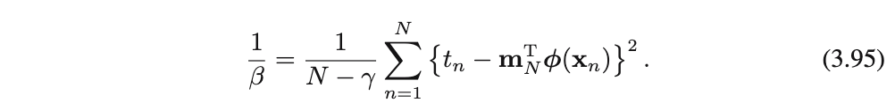
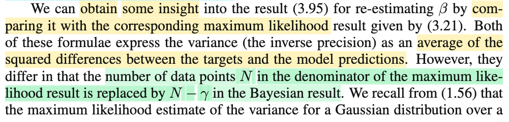
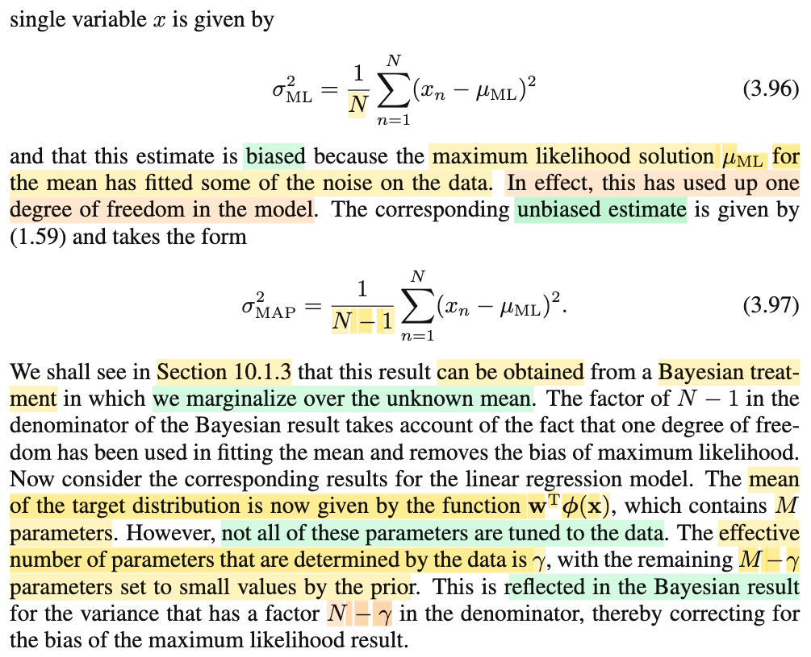
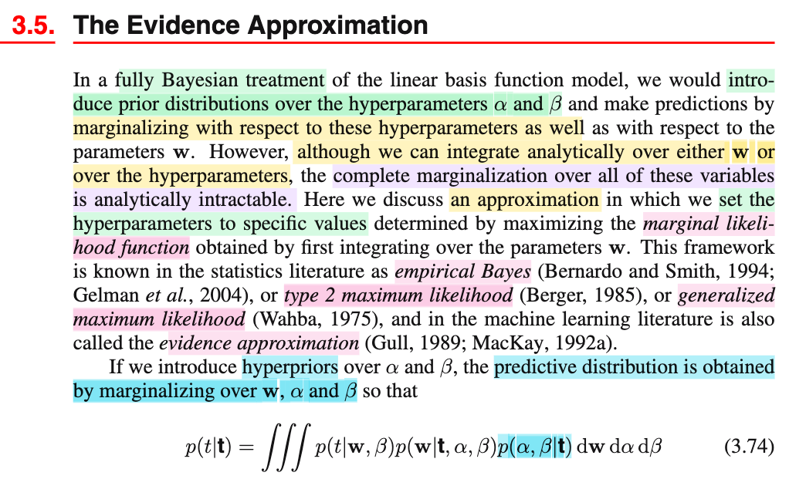
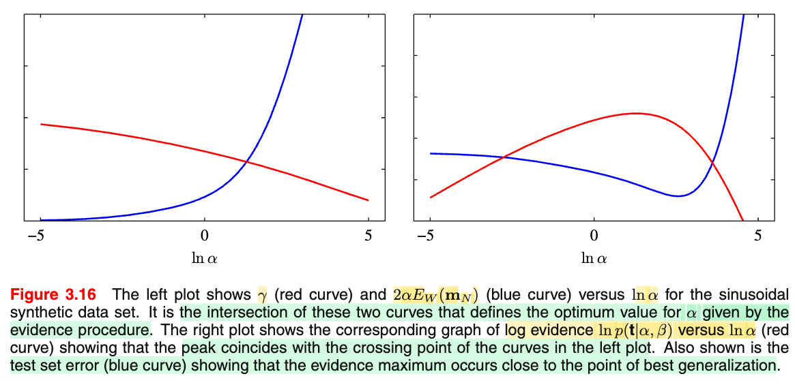
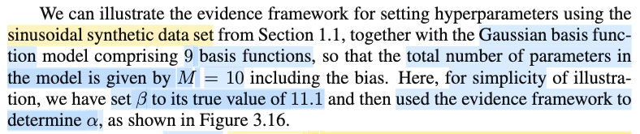
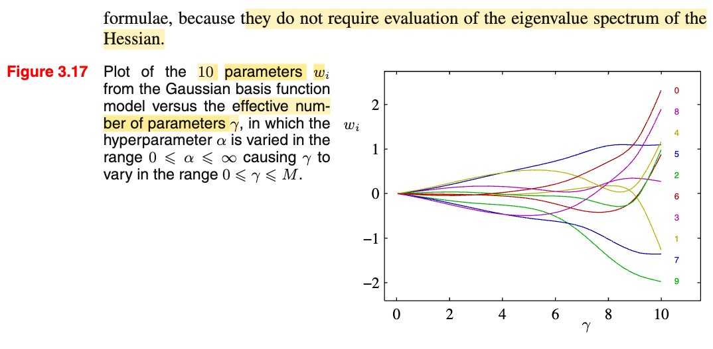
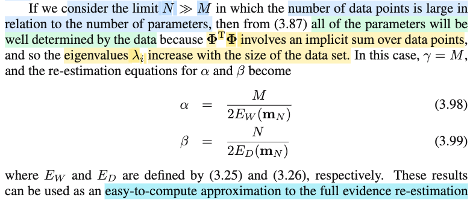
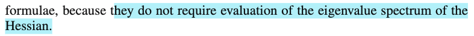

# 3.5.3 Effective number of parameters

📊 **Progress:** `6` Notes | `17` Screenshots | `6` AI Reviews

---

 

## Section 3.5.3 Effective Number of Parameters

<kbd></kbd>

<kbd></kbd>

> [!NOTE]
> Ok, tiếp theo gs nói kết quả 3.92 sẽ cho ta một góc nhìn hay ho. Đầu tiên ta sẽ xem xét contours (tức level set) của hàm likelihood.
>
>
>
> Rồi ông nói ta đã thầm (implicitly) xoay trục để thẳng góc với các 𝐮i là các eigenvector của **Φ**ᵀ**Φ**, và contours này có dạng là hình ellipse thẳng trục.
>
>
>
> Mình sẽ dừng lại và tìm hiểu khúc này là sao:
>
>
>
> Likelihood function là hàm L(𝐰|𝒟), theo định nghĩa, nó bằng f(𝒟|𝐰). Có nghĩa là, nó chính là f(𝒟|𝐰) với tư cách là hàm theo 𝐰.
>
>
>
> Ta đang trong mô hình ℳi cụ thể: T|𝐱\~ n(𝐰ᵀΦ(𝐱), 1/β). Từ đó:
>
>
>
> f(𝒟|𝐰) = f(𝐭|𝐰,β,𝐗)
>
>
>
> = Πi=1:N 𝒩(ti|𝐰ᵀΦ(𝐱i),1/β)
>
>
>
> và cái này ta đã derive ra kết quả chính là 𝒩(**Φw**, (1/β)𝐈).
>
>
>
> Thế thì vẽ contour của f(𝒟|𝐰) tức là ta cho nó bằng hằng số:
>
>
>
> 𝒩(𝐭|**Φw**, (1/β)𝐈) = c
>
>
>
> ⇔ \[(2π)^(-N/2)\] \[1/|((1/β)𝐈)|^1/2\] exp\[-(𝐭 - **Φw**)ᵀ ((1/β)𝐈)⁻¹ (𝐭 - **Φw**)/2\] = c
>
>
>
> |(1/β)𝐈| = (1/β)^N = β^(-N) ⇒ 1/|((1/β)𝐈)|^1/2 = β^(-N/2)
>
>
>
> ..⇔ \[(2π)^(-N/2)\] \[β^(-N/2)\] exp\[(-β/2)(𝐭 - **Φw**)ᵀ(𝐭 - **Φw**)\] = c
>
>
>
> ⇔ \[(2π)^(-N/2)\] \[β^(-N/2)\] exp\[(-β/2)(𝐭 - **Φw**)ᵀ(𝐭 - **Φw**)\] = c
>
>
>
> ⇔ exp\[(-β/2)(𝐭 - **Φw**)ᵀ(𝐭 - **Φw**)\] = c2 (nhập hằng số bên vế trái vào c bên phải)
>
>
>
> ⇔ (-β/2)(𝐭 - **Φw**)ᵀ(𝐭 - **Φw**) = c3 (lấy ln hai vế)
>
>
>
> ⇔ (𝐭 - **Φw**)ᵀ(𝐭 - **Φw**) = c4
>
>
>
> ⇔ 𝐭ᵀ𝐭 - 𝐰ᵀ**Φ**ᵀ𝐭 - 𝐭ᵀ**Φw** + 𝐰ᵀ**Φ**ᵀ**Φw** = c4
>
>
>
> ⇔ 𝐰ᵀ**Φ**ᵀ**Φw** - 2𝐭ᵀ**Φw** + 𝐭ᵀ𝐭 = c4
>
>
>
> ⇔ 𝐰ᵀ**Φ**ᵀ**Φw** - 2𝐭ᵀ**Φw** = c5
>
>
>
> Và đây, với tư cách là phương trình theo của 𝐰, biến đổi thêm ta sẽ thấy nó chính là phương trình đường ellipse.  
>
>
>
> Đặt A = **Φ**ᵀ**Φ**, 𝐛 = **Φ**ᵀ𝐭, phương trình trở thành:
>
>
>
> 𝐰ᵀ**Aw** - 2𝐛ᵀ𝐰 = c5
>
>
>
> ---
>
>
>
> Tới đây, đổi biến ta sẽ thấy theo biến mới, nó sẽ trở thành phương trình ellipsoid. Và để biết đổi biến thế nào, ta sẽ làm theo kiểu ép kiểu (tức là đi từ kết quả ra ngược lại hiện tại).
>
>
>
> Thì trong phương trình theo cái biến mới, sẽ có dạng 𝐮ᵀ**Au** = c6 với 𝐮 = 𝐰 - 𝐦 (giá trị m là cái cần tìm)
>
>
>
> Thế thì bắt đầu với cái đích mong muốn (𝐰 - 𝐦)ᵀ𝐀(𝐰 - 𝐦) = c6.
>
>
>
> Khai triển vế trái ta có 𝐰ᵀ**Aw** - 𝐦ᵀ**Aw** + 𝐰ᵀ**Am** - 𝐦ᵀ**Am**
>
>
>
> = 𝐰ᵀ**Aw** - 2𝐦ᵀ**Aw** - 𝐦ᵀ**Am**
>
>
>
> Cho -2𝐛ᵀ𝐰 = - 2𝐦ᵀ**Aw**, ta suy ra 𝐛ᵀ = 𝐦ᵀ𝐀 ⇔ 𝐀ᵀ𝐦 = 𝐛
>
>
>
> ⇔ 𝐦 = (𝐀ᵀ)⁻¹ 𝐛 = 𝐀inv 𝐛 =(**Φ**ᵀ**Φ**)⁻¹ **Φ**ᵀ𝐭
>
>
>
> Như vậy, tới đây ta đã biết cách biến đổi: Đó là:
>
>
>
> Từ 𝐰ᵀ**Aw** - 2𝐛ᵀ𝐰 = c5
>
>
>
> Ta sẽ cộng thêm hai vế cho (- 𝐦ᵀ**Am**) với 𝐦 = 𝐀inv 𝐛 =(**Φ**ᵀ**Φ**)⁻¹ **Φ**ᵀ𝐭, ta có:
>
>
>
> 𝐰ᵀ**Aw** - 2𝐛ᵀ𝐰 - 𝐦ᵀ**Am** = c5 - 𝐦ᵀ**Am**
>
>
>
> Khi đó vế trái sẽ trở thành (𝐰 - 𝐦)ᵀ𝐀(𝐰 - 𝐦), và vế phải vẫn là constant, đặt là c6. Ta có:
>
>
>
> (𝐰 - 𝐦)ᵀ𝐀(𝐰 - 𝐦) = c6.
>
>
>
> Và đặt 𝐳 = 𝐰 - 𝐦 thì, phương trình trên là 𝐳ᵀ**Az** = c6.
>
>
>
> Tới đây làm thêm vài bước nữa ta sẽ thấy cái này chính là phương trình của một ellipsoid:
>
>
>
> Thay 𝐀 = **Φ**ᵀ**Φ** vào lại:
>
>
>
> 𝐳ᵀ**Φ**ᵀ**Φz** = c6.
>
>
>
> ---
>
>
>
> Nhớ lại trong MIT 18.06 đã học, là với symmetric matrix size n × n thì luôn tồn tại đủ bộ eigenvector độc lập, và hơn thế nữa, ta còn luôn có thể chọn được một bộ orthogonal eigenvector. Do đó matrix này luôn có thể phân tách nó thành 𝐐 **Λ** 𝐐ᵀ với 𝐐 là orthogonal matrix có các cột là bộ orthonormal eigenvector (vuông góc, và đã chuyển về unit norm) và **Λ** là diagonal matrix chứa các eigenvalue trên đường chéo. Vậy thì 𝐀 = **Φ**ᵀ**Φ** đương nhiên là matrix đối xứng (vì (**Φ**ᵀ**Φ**)ᵀ = **Φ**ᵀ(**Φ**ᵀ)ᵀ = **Φ**ᵀ**Φ**). Nên ta có **Φ**ᵀ**Φ** = 𝐐 **Λ** 𝐐ᵀ
>
>
>
> Khi đó, phương trình trở thành 𝐳ᵀ𝐐 **Λ** 𝐐ᵀ𝐳 = c6.
>
>
>
> Đặt 𝐲 = 𝐐ᵀ𝐳, ta có 𝐲ᵀ**Λy** = c6.
>
>
>
> và với **Λ** là diagonal matrix mà đường chéo là các eigenvalue λ1,....λM của ΦTΦ thì 𝐲ᵀ**Λy** = Σi=1:M λi × yi². Ta có:
>
>
>
> λ1 × y1² + λ2 × y2² + ...λM × yM² = c6
>
>
>
> Chia hai vế cho c6:
>
>
>
> λ1/c6 × y1² + λ2/c6 × y2² + ...λM/c6 × yM² = 1
>
>
>
> ⇔ y1² / (c6/λ1) + y2²/(c6/λ2) + ...+ yM²/(c6/λM) = 1
>
>
>
> Đây chính là phương trình ellipsoid có dạng tổng quát trong 3D đã học hồi cấp 3 là: x²/a² + y²/b² + z²/c² = 1.
>
>
>
> ---
>
>
>
> Tóm lại, quả thật cái contour của f(𝒟|𝐰) tức là ta cho nó bằng hằng số: 𝒩(𝐭|**Φw**, (1/β)𝐈) = c
>
>
>
> biến đổi đại số một hồi, ta ra được
>
>
>
> ⇔ 𝐰ᵀ**Φ**ᵀ**Φw** - 2𝐭ᵀ**Φw** = c5
>
>
>
> Sau khi đổi biến hai lần:
>
>
>
> Đặt 𝐳 = 𝐰 - 𝐦, với 𝐦 = 𝐀inv 𝐛 =(**Φ**ᵀ**Φ**)⁻¹ **Φ**ᵀ𝐭, có thể thấy đây chính là phép tịnh tiến
>
>
>
> Và 𝐲 = 𝐐ᵀ𝐳, với Q là orthogonal matrix, ta biết đây là phép (biến đổi tuyến tính) xoay
>
>
>
> thì kết quả ta có 𝐲ᵀ**Λy** = c6, là phương trình của ellipsoid.
>
>
>
> ---
>
>
>
> Giờ nói thêm chút về cái bước y = 𝐐ᵀ𝐳.
>
>
>
> Cũng là dịp để ôn kiến thức đã học trong MIT 18.06: Linear transformation. Sẽ giúp ta hiểu rõ vì sao nói **cái ellipse nói trên nó axis aligned với eigenvector ui** (eigenvectorcủa **Φ**ᵀ**Φ**):
>
>
>
> Cụ thể đây chính là lúc mình áp dụng kiến thức về Change of basis matrix:
>
>
>
> Đầu tiên, ta đã được biết, thế nào gọi là phép biến đổi tuyến tính (linear transformation): Là phép biến đổi thỏa mãn tính chất T(c𝐮 + d𝐯) = cT(𝐮) + dT(𝐯) (c, d ở đây là scalar, 𝐮, 𝐯 là vector). Thế thì từ đó, ta thấy nếu lấy phép biến đổi T(𝐯) là là: Lấy 𝐀 nhân vector 𝐮, T(𝐮) = **Au** thì T(c𝐮 + d𝐯) = 𝐀(c𝐮 + d𝐯) cũng bằng c × A𝐮 + d × A𝐯 = c T(𝐮) + d T(𝐯). Do đó phép nhân matrix 𝐀 với vector 𝐮 cũng là một linear transformation.
>
>
>
> Thế thì câu hỏi là, giả sử ta có matrix 𝐀, ta sẽ thực hiện phép biến đổi bởi nó thì dễ rồi. Nhưng nếu ta có phép biến đổi tuyến tính, và muốn biết matrix 𝐀 đứng sau nó là gì thì sao. Ví dụ, phép xoay một góc α, ta biết nó là phép biến đổi tuyến tính, vậy matrix 𝐀 của nó là gì?
>
>
>
> **Hiểu cái này rất quan trọng: nói A đại diện, thì tức là giả sử ta có vector x có tọa độ trong basis v's là a1, a2,...Thì biến đổi bởi T(.), để thành T(a). Và ta lấy tọa độ của kết qủa này theo basis w's của output space, thì A làm hết mọi chuyện này, tức là Ax sẽ cho ta cái tọa độ của T(x) trong basis w's.**
>
>
>
> Nên: **Ax** có bản chất là \[matrix A\] nhân \[vector tọa độ của vector 𝐱 theo input basis v's, tức là \[𝐱\]\_v's\] sẽ cho ra kết qủa là tọa độ của vector T(𝐱) trong basis w's, \[T(𝐱)\]\_w's
>
>
>
> 𝐀 \[𝐱\]\_v's = \[T(𝐱)\]\_w's.
>
>
>
> Và ta sẽ có cách lập luận để tìm 𝐀 đại diện cho / đứng sau phép biến đổi tuyến tính T(.) như sau:
>
>
>
> Gọi 𝐯1,...𝐯n và 𝐰1,...𝐰m là basis của input space và output space
>
>
>
> Xét vector 𝐚 có tọa độ (a1,...an) trong input space, kí hiệu \[𝐚\]\_v's. Ta có:
>
>
>
> 𝐚 = a1 𝐯1 + a2 𝐯2 + ...an 𝐯n.
>
>
>
> Biến đổi 𝐚 bởi T(.), ta có T(𝐚)
>
>
>
> Vì T(.) là phép biến đổi tuyến tính, nên:
>
>
>
> T(𝐚) = T(a1 𝐯1 + a2 𝐯2 + ...an 𝐯n) = a1 T(𝐯1) + a2 T(𝐯2) + ... + an T(𝐯n)
>
>
>
> Ở đây ta có vector T(𝐚) của vế trái = vector (là tổng của các vector a1 T(𝐯1) + a2 T(𝐯2) + ... + an T(𝐯n)) bên vế phải. Mà hai vector bằng nhau, thì tọa độ của chúng trong một hệ tọa độ phải bằng nhau. **Nên tọa độ trong basis w's của chúng bằng nhau**, ta có:
>
>
>
> ⇒ \[T(𝐚)\]\_w's = \[a1 T(𝐯1) + a2 T(𝐯2) + ... + an T(𝐯n)\]\_w's
>
>
>
> mà vế phải là **tọa độ của một tổng các vector**, sẽ là **tổng các tọa độ**. Ví dụ α\[u1, u2\]ᵀ + β\[v1, v2\]ᵀ = \[αu1 + βv1, αu2 + βv2\]ᵀ. Nên ta có:
>
>
>
> \[T(𝐚)\]\_w's = \[a1 T(𝐯1)\]\_w's + \[a2 T(𝐯2)\]\_w's + ... + \[an T(𝐯n)\]\_w's
>
>
>
> ⇔ \[T(𝐚)\]\_w's = a1 × \[T(𝐯1)\]\_w's + a2 × \[T(𝐯2)\]\_w's + ... + an × \[T(𝐯n)\]\_w's
>
>
>
> ---
>
>
>
> Rồi, lại xét **Aa**, như đã nói ở trên bản chất chính là 𝐀 \[𝐚\]\_v's, tức là matrix A nhân vector cột là vector tọa độ của 𝐚 trong basis v's. Theo góc nhìn nhân matrix với vector, chính là linear combination các **vector cột** của matrix A (đặt là các vector 𝐜1, 𝐜2,..) bởi hệ số là các phần tử của 𝐚 (cũng là tọa độ a1, a2,...của vector 𝐚 trong basis v's)
>
>
>
> 𝐀\[𝐚\]\_v's = a1 𝐜1 + a2 𝐜2 + ... an 𝐜n
>
>
>
> Và kết qủa của việc linear combination này, sẽ là một column vector.
>
>
>
> Mà giá trị của column vector này chính là tọa độ của T(𝐚) trong basis w's vì ta đang đi xây dựng matrix 𝐀 đại diện cho phép biến đổi tuýến tính T(), nên theo định nghĩa nó sẽ giúp tính ra tọa độ của T(𝐚) trong basis w's
>
>
>
> 𝐀\[a\]\_v's = \[T(𝐚)\]\_w's
>
>
>
> Do đó:
>
>
>
> a1 × \[vector cột 1\] + a2 × \[vector cột 2\] + ... an × \[vector cột n\]
>
>
>
> = a1 × \[T(𝐯1)\]\_w's + a2 × \[T(𝐯2)\]\_w's + ... + an × \[T(𝐯n)\]\_w's
>
>
>
> Vậy \[vector cột 1\] của 𝐀 chính là \[T(𝐯1)\]\_w's, \[vector cột 2\] của 𝐀 chính là \[T(𝐯2)\]\_w's....
>
>
>
> Từ đó ta có cái rule như sau:
>
>
>
> Chuẩn bị input basis 𝐯1,𝐯1.... Biến đổi 𝐯1,𝐯2... bởi T(.), và lấy tọa độ của chúng trong basis 𝐰's.
>
>
>
> Thì **cột j của A** chính là tọa độ của T(𝐯j) trong basis 𝐰's.
>
>
>
> \[Cột j của A\] = \[T(𝐯j)\]\_w's
>
>
>
> ---
>
>
>
> Tiếp ta sẽ xét phép biến đổi identity: T(𝐱) = 𝐱, tức là không làm gì, chỉ thay basis từ v's sang w's
>
>
>
> Thì theo rule đó matrix A giúp thay đổi basis sẽ được xây dựng như sau
>
>
>
> Biến đổi 𝐯1, thể hiện nó trong basis 𝐰's, tọa độ của nó trong basis w's chính là giá trị cột 1 của A:
>
>
>
> \[Cột 1 của A\] = \[T(𝐯1)\]\_w's
>
>
>
> Tương tự vậy:
>
>
>
> \[Cột 2 của A\] = \[T(𝐯2)\]\_w's
>
>
>
> Mà T(𝐯1) = 𝐯1, T(𝐯2) = 𝐯2,...do T(.) đang xét là phép biến đổi identity.
>
>
>
> Nên: (theo nguyên tắc vector = vector thì tọa độ = toạ độ)
>
>
>
> \[T(𝐯1)\]\_w's = \[𝐯1\]\_w's, \[T(𝐯2)\]\_w's = \[𝐯2\]\_w's,...
>
>
>
> Vậy \[Cột 1 của A\] = \[𝐯1\]\_w's, \[Cột 2 của A\] = \[𝐯2\]\_w's,...
>
>
>
> Mà 𝐯1 = linear combination các vector 𝐰1,...𝐰m bởi hệ số là vector tọa độ \[𝐯1\]\_w's
>
>
>
> và vừa nói ở trên ta lại có \[Cột 1 của A\] = \[𝐯1\]\_w's
>
>
>
> suy ra 𝐯1 = linear combination của 𝐰1,...𝐰m với hệ số là cột 1 của A
>
>
>
> Đặt 𝐖 là matrix các cột 𝐰1, 𝐰2,...thì điều này chính là 𝐯1 = 𝐖 𝐜1
>
>
>
> Tương tự
>
>
>
> \[Cột 2 của A\] = \[𝐯2\]\_w's nên 𝐯2 = 𝐖 𝐜2.
>
>
>
> ...
>
>
>
> Và đặt 𝐯1, 𝐯2 vào thành các cột của matrix 𝐕 ta sẽ có 𝐕 = 𝐖 𝐀
>
>
>
> ⟹ 𝐀 = 𝐖inv 𝐕
>
>
>
> Và do đó, nếu input space là basis e's, 𝐕 = 𝐈, thì change of basis sang basis w's chính là 𝐖inv.
>
>
>
> ---
>
>
>
> Từ đó, quay lại bài này, ta sẽ thấy 𝐐ᵀ𝐳, là cái gì?
>
>
>
> Nhớ rằng, khi viết **Ax**, nếu ko nói gì (về basis của input space), thì tự phải hiểu thực ra chính là đang viết \[matrix A\] \[vector tọa độ của 𝐱 trong basis e's\]
>
>
>
> Ở đây cũng vậy, 𝐐ᵀ𝐳, về bản chất chính là \[matrix 𝐐\] \[𝐳\]\_e's = \[matrix 𝐐\] \[**w-m**\]\_e's
>
>
>
> Còn 𝐐ᵀ, do 𝐐 là orthogonal matrix, có tính chất 𝐐ᵀ𝐐 = **QQ**ᵀ = 𝐈, nên 𝐐ᵀ = 𝐐inv: 𝐐ᵀ chính là 𝐐inv
>
>
>
> Và như đã hiểu ở trên, thì 𝐐inv chính là 𝐈 𝐐inv, là change of basis matrix từ basis e's (các cột của 𝐈) sang basis q's (hay trong sách là u's, các cột của Q, cũng là các eigenvector của **Φ**ᵀ**Φ**). Nên 𝐐inv 𝐮, (mà bản chất là 𝐐inv \[𝐮\]\_e's) **chính là tọa độ của vector** **z trong basis** **q**1, **q**2 (hay 𝐮1, 𝐮2....)
>
>
>
> Và hành động chuyển tọa độ từ basis e's sang basis q's (cả hai đều là basis của Rⁿ) nếu áp dụng cho toàn bộ vector trong không gian thì nó chính là việc ta xoay hệ trục tọa độ, từ hệ trục ban đầu đến khi nó thẳng góc với các vector q's.
>
>
>
> Và với việc ta thấy phương trình trở thành phương trình ellipse, giúp ta hiểu được rằng: **trong hệ trục gốc, cái ellipse này nằm xéo (bị xoay)** nên khi xoay hệ trục về thẳng góc với các eigenvector thì cái ellipse này nằm thẳng (axis aligne)
>
>
>
> Còn 1 cách giải thích khác:
>
>
>
> Gọi **q**1,**q**2,.. (trong sách là 𝐮1,𝐮2,..) là các orthogonal eigenvector của **Φ**ᵀ**Φ**.
>
>
>
> Thử tìm kết quả của phép chiếu lên span{**q**1,**q**2,..}.
>
>
>
> Xét vector 𝐚 có tọa độ 𝐚1,𝐚2,...trong basis e's
>
>
>
> Chiếu 𝐚 lên span{q1,q2,..} Thì ta có p, với p = linear combination của q's bởi hệ số x1,x2,.. nào đó 𝐩 = **q**1x1 + **q**2x2 + ...
>
>
>
> Tuy nhiên, sự thật là 𝐐 full rank, nên a vốn đã nằm trong span{**q**1,**q**2,..}. Nên hình chiếu của a lên subspace này là chính nó. Ta có
>
>
>
> 𝐚 = **Qx** với 𝐱 là vector tọa độ của 𝐚 (cũng là p) trong basis q's.
>
>
>
> Nhân hai vế cho 𝐐ᵀ:
>
>
>
> 𝐐ᵀa = 𝐐ᵀ𝐐x
>
>
>
> ⇔ x = 𝐐ᵀ𝐚
>
>
>
> À như vậy, ta thấy 𝐐ᵀ𝐚 chính là tọa độ của a trong basis **q**1, **q**2,..
>
>
>
> Thì y như vậy, 𝐐ᵀ𝐳 sẽ chính là ta chiếu tọa độ của 𝐳 lên các eigenvector **q**1,**q**2,..để có tọa độ mới. Thì đây cũng chính là cùng ý nghĩa với xoay hệ trục để đổi tọa độ sang basis **q**'s (hay u's, là eigenvector của design matrix)

---

🤖 **AI Check** — 🟢 Pass — ✅ **100/100** · ✓ Move on

Ghi chú vô cùng chi tiết và chính xác, tự chứng minh mạch lạc từ phân phối Gaussian đến phương trình ellipsoid và giải thích rất rõ ràng bản chất đại số tuyến tính của phép xoay trục tọa độ theo eigenvectors. Không có điểm gì cần cải thiện thêm.

**🔗 See also:** [PDF Gaussian Đa Biến](./124_the_gaussian_distribution.md#node-40ke7sj) · [Chuyển tọa độ eigenvector](./230_gaussian_distribution.md#node-c9cpfzj)

 

### Eigenvalue và độ cong Likelihood

<kbd></kbd>

<kbd></kbd>

<kbd></kbd>

<kbd></kbd>

> [!NOTE]
> Tiếp, vì sao gs lại nói eigenvalue λi sẽ đo độ cong (curvature) của hàm likelihood? Và trong hình 3.15, λ1 nhỏ hơn λ2 vì độ cong nhỏ hơn sẽ ứng với sự giãn (elongation) lớn hơn của contour, là sao?
>
>
>
> Lôi hàm likelihood ra lại:
>
>
>
> L(𝐰|𝐭) = 𝒩(𝐭|**Φw**, (1/β)𝐈)
>
>
>
> = \[(2π)^(-N/2)\] \[β^(-N/2)\] exp\[(-β/2)(𝐭 - **Φw**)ᵀ(𝐭 - **Φw**)\]
>
>
>
> = c exp\[(-β/2)(𝐭 - **Φw**)ᵀ(𝐭 - **Φw**)\]
>
>
>
> (đặt normarizing constant là c cho gọn)
>
>
>
> Thử xem Hessian của hàm (với tư cách là hàm theo 𝐰) là gì:
>
>
>
> Xét hàm ln L(𝐰|𝐭), (để loại bỏ exp, ta sẽ tìm cách có Hessian của hàm likelihood sau):
>
>
>
> ln likelihood = ln { c exp\[(-β/2)(𝐭 - **Φw**)ᵀ(𝐭 - **Φw**)\] }
>
>
>
> = ln (c) + ln exp\[(-β/2)(𝐭 - **Φw**)ᵀ(𝐭 - **Φw**)\]
>
>
>
> = ln (c) - (β/2)(𝐭 - **Φw**)ᵀ(𝐭 - **Φw**)
>
>
>
> = - (β/2)(𝐭ᵀ𝐭 - 𝐰ᵀ**Φ**ᵀ𝐭 - 𝐭ᵀ**Φw** + 𝐰ᵀ**Φ**ᵀ**Φw**) + ln(c)
>
>
>
> = - (β/2)(- 2𝐭ᵀ**Φw** + 𝐰ᵀ**Φ**ᵀ**Φw** + 𝐭ᵀ𝐭) + ln(c)
>
>
>
> = - (β/2)(𝐰ᵀ**Φ**ᵀ**Φw** - 2𝐭ᵀ**Φw** + 𝐭ᵀ𝐭) + ln(c)
>
>
>
> = - (β/2)(𝐰ᵀ**Φ**ᵀ**Φw** - 2𝐭ᵀ**Φw** + 𝐭ᵀ𝐭) + ln(c)
>
>
>
> = (1/2)𝐰ᵀ\[-β**Φ**ᵀ**Φ**\]𝐰 + β𝐭ᵀ**Φw** - β𝐭ᵀ𝐭/2 + ln(c)
>
>
>
> Đây có dạng hàm quadratic của w: (1/2)𝐰ᵀ**Pw** + 𝐠ᵀ𝐰 + 𝐫. Hessian chính là 𝐏.
>
>
>
> Vậy Hessian của hàm ln likelihood là -β**Φ**ᵀ**Φ**
>
>
>
> ---
>
>
>
> Tiếp, gọi likelihood là L(𝐰) thay vì L(𝐰|t) cho gọn, vì dù gì thì ta chỉ đang xem nó như hàm theo 𝐰.
>
>
>
> Và đặt G(𝐰) = ln L(𝐰) ⇒ L(𝐰) = exp G(𝐰)
>
>
>
> Lấy đạo hàm bậc 1 theo 𝐰:
>
>
>
> d/d𝐰 L(𝐰) = d/d𝐰 \[exp G(𝐰)\]
>
>
>
> Theo Chain rule:
>
>
>
> ..= d/d \[G(𝐰)\] \[exp G(𝐰)\] ⋅ d/d𝐰 \[G(𝐰)\]
>
>
>
> Dùng d/dx e^x = e^x ⇒ d/d \[G(𝐰)\] \[exp G(𝐰)\] = exp G(𝐰).
>
>
>
> Và d/d𝐰 \[G(𝐰)\], vì G(𝐰) là vector → scalar function (nhận vector 𝐰, tính ra likelihood của 𝐰, là một giá trị scalar), nên đạo hàm bậc một của G theo w là vector gradient, kí hiệu ∇G(𝐰). Tương tự, d/d𝐰 L(𝐰) cũng là ∇L(𝐰)
>
>
>
> ..= exp G(𝐰) ⋅ ∇G(𝐰)
>
>
>
> Với việc đây là scalar và vector nên kí hiệu hàm hợp⋅ trở thành tích bình thường.
>
>
>
> = \[exp G(𝐰)\] ∇G(𝐰), và với G(w) = ln L(𝐰), thì exp G(𝐰) = L(𝐰)
>
>
>
> Viết lại ∇L(𝐰) = L(𝐰) ∇G(𝐰)
>
>
>
> Giờ, ta lại lấy đạo hàm bậc một theo 𝐰 của hàm d/d𝐰 L(𝐰), thì ta sẽ có đạo hàm bậc hai, và vì ∇L(𝐰) là vector → vector function, nên đạo hàm bậc một của ∇L(𝐰) gọi là Jacobian matrix, cũng chính là Hessian của L(𝐰). Kí hiệu H(𝐰), hay có khi ta thấy ∇∇L(𝐰)
>
>
>
> d/d𝐰 \[∇L(𝐰)\] (= H(𝐰)) = d/d𝐰 \[L(𝐰) ∇G(𝐰)\]
>
>
>
> Áp dụng product rule: d/dx g(x)h(x) = \[d/dx g(x)\] h(x) + g(x)\[d/dx h(x)\], vế phải thành:
>
>
>
> ∇∇L(𝐰) = d/d𝐰 \[L(𝐰)\] ∇G(𝐰) + L(𝐰) d/d𝐰 \[∇G(𝐰)\]
>
>
>
> Xét d/d𝐰 \[L(𝐰)\], nó chính là ∇L(𝐰)
>
>
>
> Còn d/d𝐰 \[∇G(𝐰)\] thì là Hessian của G(𝐰). Kí hiệu ∇∇G(𝐰)
>
>
>
> ∇∇L(𝐰) = ∇L(𝐰) ∇G(𝐰) + L(𝐰) \[∇∇G(𝐰)\]
>
>
>
> Như vậy là ta đã có Hessian (matrix đạo hàm cấp hai) của Likelihood function.
>
>
>
> Lấy giá trị Hessian tại đỉnh, tức 𝐰ML, thì tại đây, dĩ nhiên gradient của hàm likehood vanish. Tức ∇L(𝐰ML) = **0** (zero vector). Nên Hessian tại 𝐰ML là:
>
>
>
> ∇∇L(𝐰ML) = L(𝐰ML) \[∇∇G(𝐰ML)\]
>
>
>
> Trong đó L(𝐰ML), là giá trị likelihood tại 𝐰ML, là một constant nào đó. Và ∇∇G(𝐰ML) là matrix Hessian của ln likelihood tại 𝐰ML.
>
>
>
> Như vậy, tại đỉnh 𝐰ML, Hessian của likelihood tỉ lệ với Hessian của ln likelihood bởi một constant dương, đặt là Lmax.
>
>
>
> Mà Hessian của ln likelihood là cái gì? → Ở trên ta đã làm: -β**Φ**ᵀ**Φ**, (hoàn tòan là một matrix fixed, không phụ thuộc 𝐰 nữa)
>
>
>
> Vậy ∇∇L(𝐰ML) = Lmax (-β**Φ**ᵀ**Φ**) = -βLmax **Φ**ᵀ**Φ**
>
>
>
> Chéo hóa matrix (phân rã **Φ**ᵀ**Φ** thành 𝐐 **Λ** 𝐐ᵀ như note trước đã làm) ta có:
>
>
>
> ∇∇L(𝐰ML) = -β Lmax 𝐐 **Λ** 𝐐ᵀ
>
>
>
> ---
>
>
>
> Tiếp, quay lại xét hàm L(𝐰), khai triển Taylor bậc hai (tức là lấy xấp xỉ bậc hai) quanh 𝐰ML
>
>
>
> L(𝐰) ≈ L(𝐰ML) + ∇L(𝐰ML)ᵀ(𝐰 - 𝐰ML) + (1/2)(𝐰-𝐰ML)ᵀ (∇∇L(𝐰ML)) (𝐰-𝐰ML)
>
>
>
> ⇔ L(𝐰) ≈ Lmax + **0**ᵀ(𝐰 - 𝐰ML) + (1/2)(𝐰-𝐰ML)ᵀ (∇∇L(𝐰ML)) (𝐰-𝐰ML)
>
>
>
> ⇔ L(𝐰) ≈ Lmax + (1/2)(𝐰-𝐰ML)ᵀ (∇∇L(𝐰ML)) (𝐰-𝐰ML)
>
>
>
> Đặt 𝐯 = 𝐰-𝐰ML
>
>
>
> L(𝐯) ≈ Lmax + (1/2)𝐯ᵀ (∇∇L(𝐰ML)) 𝐯
>
>
>
> Thay ∇∇L(𝐰ML) = -βLmax 𝐐 **Λ** 𝐐ᵀ
>
>
>
> L(𝐯) ≈ Lmax + (1/2)𝐯ᵀ (-βLmax 𝐐 **Λ** 𝐐ᵀ) 𝐯
>
>
>
> ⇔ L(𝐯) ≈ Lmax - (βLmax/2 )𝐯ᵀ𝐐 **Λ** 𝐐ᵀ𝐯
>
>
>
> Đặt 𝐲 = 𝐐ᵀ𝐯,
>
>
>
> ⇔ L(𝐲) ≈ Lmax - (βLmax/2) 𝐲ᵀ**Λy**
>
>
>
> ⇔ L(𝐲) ≈ Lmax - (βLmax/2) Σi=1:M λi yi²
>
>
>
> Ví dụ M = 2 như ở đây, ta có
>
>
>
> L(𝐲) ≈ Lmax - (βLmax/2) (λ1 y1² + λ2 y2²)
>
>
>
> Như vậy kết quả này có nghĩa là gì:
>
>
>
> Có nghĩa là sau khi đã
>
>
>
> i) dời trục tọa độ về 𝐰ML (thông qua động tác đổi biến sang 𝐯 = 𝐰 - 𝐰ML)
>
>
>
> ii) Xoay hệ trục để dùng hệ trục là vector eigenvalue u1, u2 của **Φ**ᵀ**Φ** (thông qua động tác đổi biến lần hai sang 𝐲 = 𝐐ᵀ𝐯)
>
>
>
> thì khi đó, nếu ta xem xét hàm likelihood tại đỉnh (𝐰ML), hay đúng hơn là xấp xỉ bậc hai của nó tại 𝐰ML (hay nói dễ hiểu là ta coi nó như hàm bậc hai vì Taylor theorem cho phép như vậy) thì ta sẽ thấy nó có một hàm số như vầy:
>
>
>
> f(y1, y2) = Lmax - (βLmax/2) (λ1 y1² + λ2 y2²)
>
>
>
> Từ đó, ta lại restrict hàm số theo một phương, cụ thể là phương y2 = 0, thì hàm số này sẽ là hàm bậc hai 1 biến:
>
>
>
> f1(y1) = Lmax - (βLmax/2) λ1 y1²
>
>
>
> Và lấy đạo hàm theo y1 của hàm số này, ta sẽ có gì: chính là - (βLmax/2) 2 λ1 = - βLmax λ1.
>
>
>
> Như vậy, độ cong của hàm bậc 2 một biến này, chính là tỉ lệ với λ1.
>
>
>
> Tương tự, nếu xét hàm f2(y2) là hàm f(y1, y2) nhưng restrict theo y1 = 0, thì nó cũng là một hàm bậc hai đơn biến, có đạo hàm bậc 2 của hàm này là - βLmax λ2, tỉ lệ với λ2.
>
>
>
> Và hình ảnh của hai động tác vừa rồi chính là: Nhìn trong không gian 2D, ta có cái chảo paraboloid có đáy tại wML. Mà nhìn từ trên cao nhìn xuống một level set nào đó thì sẽ có hình ellipse, trục của ellipse song song với hai vector u1, u2 (eigenvector của **Φ**ᵀ**Φ**).
>
>
>
> Sau đó, ta cắt parabol này bởi mặt phẳng qua 𝐰ML và song song với u1, thì trong mặt cắt đó, ta sẽ thấy một một parabol (chính là đồ thị hàm f1(y1))
>
>
>
> Còn cắt paraboloid này bởi mặt phẳng qua wML và song song với u2, thì trong mặt cắt đó ta sẽ thấy một parabol, là đồ thị của f2(y2).
>
>
>
> Và tới đây, với việc λ1, λ2 sẽ ảnh hưởng đến đạo hàm bậc hai của hai cái hàm f1, f2 này, mình đã hiểu tại sao nói λi sẽ phản ánh curvature của likelihood function, bởi vì đạo hàm bậc hai của f1, f2 **CHÍNH LÀ THÔNG TIN CURVATURE CỦA HÀM LIKELIHOOD THEO TỪNG PHƯƠNG** 𝐮1, 𝐮2.

---

🤖 **AI Check** — 🟢 Pass — ✅ **98/100** · ✓ Move on

Bài tự học của bạn cực kỳ chi tiết, chính xác và thể hiện tư duy toán học xuất sắc khi tự chứng minh mối liên hệ giữa eigenvalue và độ cong của likelihood. Điểm trừ duy nhất là lỗi ghi chép nhỏ ở đạo hàm bậc nhất của f1(y1) (thiếu biến y1), nhưng phần kết luận về đạo hàm bậc hai để chỉ curvature vẫn hoàn toàn chính xác.

 

#### Số lượng tham số hiệu dụng

<kbd></kbd>

<kbd></kbd>

> [!NOTE]
> Rồi, khi hết cấn vì sao λ (eigenvalue của **Φ**ᵀ**Φ**) cũng như cái vụ contours của L(𝐰|𝐭) có hình ellipses. Ta sẽ có thể nói về cái interpretation của kết quả 3.92:
>
>
>
> α = γ / (𝐦N)ᵀ𝐦N
>
>
>
> với γ = Σi λi / (α + λi)
>
>
>
> Như sau: Dễ hiểu thôi, lấy ví dụ 𝐰 = (w1, w2), và λ1 và λ2 là eigenvalue, với λ1 nhỏ hơn nhiều so với α và λ2 thì ngược lại (nhắc lại cho nhớ: α là tham số của prior distribution của 𝐰, nơi ta assume nó là 𝒩(0, (1/α)𝐈)
>
>
>
> Vậy thì hiện tượng xảy ra sẽ là như sau:
>
>
>
> Vì λ1 ≪ α, nên λ1 / (α + λ1) sẽ rất nhỏ, ≈ 0. Và hình vẽ minh họa cho thấy w1 của 𝐰MAP cũng bị đẩy về gần 0.
>
>
>
> Còn λ2 ≫ α, nên λ2 / (α + λ2) sẽ gần 1. HÌnh vẽ cho thấy w2 của 𝐰MAP bị đẩy về gần 𝐰ML.
>
>
>
> Vậy có nghĩa là gì:
>
>
>
> Ở cái hướng eigenvector u1 của design matrix mà eigenvalue nhỏ (ví dụ λ1), chính là cái hướng mà cái contour hình ellipse bị kéo giãn nhiều, và λ1 nhỏ tức độ cong theo hướng này nhỏ để bề mặt cái tô paraboloid sẽ dốc xuống thoai thoải. Thì 𝐰MAP_1 sẽ gần với 0.
>
>
>
> Ngược lại, ở hướng eigenvector u2, ứng với λ2 lớn, chính là cái hướng ellipse contour bị giãn ít, bề mặt khối paraboloid cong mạnh. Thì 𝐰MAP_2 sẽ gần với 𝐰ML_2.
>
>
>
> Mà 𝐰MAP_1 bị bóp về gần 0 có nghĩa là sao mà𝐰MAP_2 sẽ gần với 𝐰ML_2 thì có nghĩa là sao?
>
>
>
> Ta hình dung có hai thứ kéo 𝐰MAP: Prior và Likelihood. Prior là cái khối chảo parabol có tâm tại (0,0) còn likelihood cũng là khối chảo parabol có tâm tại 𝐰ML. Độ cong của khối chảo Prior thì như nhau ở mọi hướng, nhưng của likelihood thì mạnh hơn ở hướng u2 (λ2 lớn) và nhẹ hơn ở u1.
>
>
>
> Ở cái hướng mà likelihood có mức thay đổi chậm (dốc thoai thoải theo phương u1) thì kiểu như lực kéo về 𝐰ML yếu, do đó lực kéo về prior lấn át, khiến cho w1 của 𝐰MAP tiến về w1 của prior mean (=0)
>
>
>
> Còn ở hướng u2, likelihood có mức thay đổi nhanh (dốc cắm đầu theo phương u2) thì lại giống như lực kéo về 𝐰ML lấn át lực kéo về prior mean. Do đó, w2 của 𝐰MAP bị kéo về w2 của 𝐰ML
>
>
>
> Đó là góc nhìn thứ nhất.
>
>
>
> Và insight thứ hai là, γ = Σi λi / (α + λi) = λ1 / (α + λ1) + λ2 / (α + λ2), thì coi như chỉ = λ2 / (α + λ2) (vì cái kia ≈ 0 rồi). Và như vậy trong hai tham số w1, w2 của 𝐰MAP, w1 bị bóp thành 0, coi như bị phế. Thành ra con số γ chính là số lượng param không bị phế, (vì khi = - thì coi như ko có), gọi là effective parameters, còn gọi là well-determined parameters.
>
>
>
> Và như vậy, ta có thể hiểu đại khái rằng, prior sẽ khiến cho mô hình phế đi các parameter ko cần thiết (là các parameter w ứng với hướng mà tác động ko mạnh tới likelihood (insensitive).

---

🤖 **AI Check** — 🟢 Pass — ✅ **95/100** · ✓ Move on

Ghi chép của bạn rất xuất sắc khi giải thích trực quan hóa hình học qua phép ẩn dụ 'lực kéo' giữa Prior và Likelihood cực kỳ dễ hiểu và chính xác. Điểm cần lưu ý nhỏ duy nhất là các trị riêng $\lambda_i$ thực chất là của ma trận hệ số $\beta\Phi^T\Phi$ chứ không chỉ là $\Phi^T\Phi$, bạn nên lưu ý hệ số nhiễu $\beta$ này.

 

##### Bayesian and Maximum Likelihood Variance

<kbd></kbd>

<kbd></kbd>

<kbd></kbd>

<kbd></kbd>

> [!NOTE]
> Ở đoạn này, giáo sư Bishop muốn giúp ta có vài góc nhìn để hiểu về kết quả 3.95 trong phần trước, nên có lẽ cần thiết nhắc lại bối cảnh của đoạn này chút xíu, trong phần đó cái mà ta đang làm đó là maximize model evidence theo α, β.
>
>
>
> (model evidence là cái gì, và vì sao phải đi maximize như vậy thì xem lại link)
>
>
>
> Kết quả cho β là: 1/β = 1/(N - γ) Σi=1:N {ti - (𝐦N)ᵀ Φ(𝐱i)}²
>
>
>
> Vậy thì để hiểu về ý nghĩa của kết quả này, gs Bishop muốn ta nhớ lại rằng, khi đi giải bài toán tìm MLE của σ², tức variance của phân phối normal(μ, σ²), thì kết quả ra được là:
>
>
>
> (σ²)\_ML = (1/N) Σi (xi - μML)²
>
>
>
> trong đó μML, là MLE của μ, và ta còn nhớ nó chính là sample mean: (Σi xi)/N.
>
>
>
> Thế thì sao? Liên quan gì?
>
>
>
> Là như vầy: Ở đây có một kiến thức về statistic, mà trong các lớp như Stat110, hay Statistical Inference của Casella đã nói (mình có để link) đó là, sample variance, sách Casella kí hiệu S², có công thức là (1/N-1) Σi (Xi - Xbar)² là một unbiased estimator của sample variance. Còn nếu dùng công thức (1/N) Σi (Xi - Xbar)², thì nó sẽ là biased estimator. Lí do là, khi tính kì vọng E\[(1/N-1) Σi (Xi - Xbar)²\], ta sẽ ra chính xác σ² (và trong 1.58, xem link, tác giả Bishop cũng từng nói vụ này)
>
>
>
> Còn với công thức mà chia cho N, thì không. (và định nghĩa của biased estimator (của θ) W(𝐗) là khi độ bias, tính bởi Bias(W, θ) = E\[W(𝐗)\] - θ khác 0)
>
>
>
> Vậy thì như vậy, ở đây, (σ²)\_ML chính công thức của sample variance với mẫu số là N, nên nó chính là biased estimator của σ². Và trong phần 1.59 ông cũng đã nói rằng nếu ta giải theo Bayesian ta sẽ có (σ²)\_MAP chính là công thức unbiased, E\[(1/N-1) Σi (Xi - Xbar)²\].
>
>
>
> Dừng lại chút để trả lời câu hỏi giải theo Bayesian là sao?
>
>
>
> Đó là, trong MLE approach (giải ra (σ²)\_ML), ta coi μ, và σ², tức tham số của normal, là fixed cứng, nhưng không biết giá trị. Để rồi ta sẽ đặt ra hàm likelihood, đo độ hợp lí của một giá trị input μ, σ² dựa trên data quan sát được 𝐱, kí hiệu L(μ,σ²|𝐱), và hàm này được định nghĩa là, giá trị độ hợp lí của μ, σ² dựa trên data quan sát được 𝐱, sẽ bằng f(𝐱|μ, σ²). Từ đó, ta sẽ đi giải bài toán tối ưu: tìm μ, σ² để hàm độ hợp lí có giá trị cao nhất. Và kết quả của bài toán tối ưu này chính là công thức của maximum likelihood estimator của μ và σ².
>
>
>
> Còn với Bayesian, ta coi μ, σ² như biến ngẫu nhiên. Mà như vậy thì chúng sẽ có probability distribution, gồm hai loại: prior distribution, là f(μ, σ²) và f(μ, σ²|𝐱). Bằng cách chọn prior distribution của μ, và σ² là một distribution nào đó, ta sẽ dùng Bayes rule để có posterior: f(μ, σ²|𝐱) ∝ f(x|μ, σ²)f(μ, σ²). Và sau khi có posterior distribution. Để đưa ra một point estimator của μ, và σ², ta có thể chọn gía trị khiến posterior probability là lớn nhất, đây chính là maximum posterior estimator μ\_MAP và (σ^)\_MAP.
>
>
>
> Và theo lời gs nói ở đây, kết quả bài toán này ta sẽ có (σ^)\_MAP = (1/N-1) Σi (Xi - Xbar)², là cái công thức unbiased estimator của σ² nói trên.
>
>
>
> Như vậy là sao? Như vậy có nghĩa là cách làm của Bayesian tốt hơn, khi cách làm của MLE tạo ra một biased estimator trong khi của Bayesian thì ra unbiased.
>
>
>
> ---
>
>
>
> Ở trên chỉ là ông Bishop đang mượn lại bài toán point estimator tham số của một mô hình normal để nói về sự khác nhau của MLE và MAP.
>
>
>
> Quay lại đây, với việc ta đang tìm insight trong kết quả 3.95, thì cũng y vậy, đại ý là:
>
>
>
> Với cách là MLE, ta cũng là theo quy trình y như trong bài toán point estimator: tìm β giúp maximize likelihood function L(𝐰,β|𝒟)
>
>
>
> và kết qủa ra được 3.21 ta có:
>
>
>
> (1/β)\_ML = (1/N) Σi (ti - Σj=0:M-1 wj × Φj(𝐱i))²
>
>
>
> = (1/N) Σi (ti - (𝐰ᵀ Φ(𝐱i))²
>
>
>
> lắp 𝐰ML vô ta có:
>
>
>
> (1/β)\_ML = (1/N) Σi (ti - (𝐰MLᵀ Φ(𝐱i))²
>
>
>
> Còn là theo lối đi maximize model evidence thì ta ra công thức:
>
>
>
> 1/β = 1/(N - γ) Σi=1:N {ti - (𝐦N)ᵀ Φ(𝐱i)}², với 𝐦N là 𝐰MAP
>
>
>
> Và từ đó đại khái ta hiểu có sự tương tự:
>
>
>
> Trong bài toán point estimate σ², làm theo lối MLE, ta ra công thức chia cho N → biased
>
>
>
> Còn làm theo Bayesian, ta ra công thức chia cho N-1 → unbiased. Và ý nghĩa của số 1 là một bậc tự do đã bị mất khi ta dùng để tính sample mean (chính là 𝐰MAP) để estimate 𝐰 rồi
>
>
>
> ---
>
>
>
> Ở đây, làm theo lối ML, ta ra công thức chia cho N → Biased
>
>
>
> Còn làm theo lối Bayesian, ta ra công thức chia cho N-γ , mà γ là chính là số parameter hiệu dụng (effective) trong M param, nên giống như ta tốn 1 bậc tự do cho wML thì ở đây ta đã tốn γ bậc tự do cho 𝐰MAP rồi, chỉ còn N-γ, và do đó công thức 1/β = 1/(N - γ) Σi=1:N {ti - (𝐦N)ᵀ Φ(𝐱i)}² chính là unbiased.
>
>
>
> ---
>
>
>
> Một ý mà ta có thể thấy khó hiểu, là vì sao đi maximize model evidence lại làm theo Bayesian? Trong khi ta đâu có phải là đi maximize posterior của f(α, β|𝐭), vốn phải ∝ f(t|α, β)f(α,β)) mà đang maximize f(𝐭|α,β) cơ mà.
>
>
>
> Câu trả lời: Là vì đúng là cách làm này là cách làm nửa mùa. Và giáo sư Bishop đã nói ở phần đầu của phần 3.4 (xem hình)
>
>
>
> Là sao?
>
>
>
> Cách làm **hoàn toàn** Bayesian (fully Bayesian) phải là như vầy:
>
>
>
> Ta phải coi 𝐰, α, β đều là random variable.
>
>
>
> Rồi đi xây dựng posterior f(𝐰, α, β|𝒟) ∝ f(𝒟|𝐰, α, β)f(𝐰, α, β). Khi có posterior, ta mới đi lấy trung bình của 𝐰, β, α dựa trên phân phối này. 
>
>
>
> Kết quả sẽ là cái tích phân 3 lớp 3.74.
>
>
>
> Và nếu làm từng bước, thì sẽ là như sau:
>
>
>
> Coi 𝐰 là random variable trước, prior là f(𝐰|α) → posterior f(𝐰|𝒟,α, β).
>
>
>
> Đi marginalizing over 𝐰: ta sẽ có một hàm không còn phụ thuộc 𝐰, chính là model evidence f(𝐭|α, β)
>
>
>
> Tiếp, ta sẽ coi α cũng là random variable, có prior f(α) nào đó.
>
>
>
> Rồi đi derive posterior: f(α|𝒟,β). Và đi marginalizing over α ta sẽ có f(𝒟|β)
>
>
>
> Rồi, cuối cùng, coi β như random variable, có prior f(β), đi derive posterior f(β|𝒟), và đi lấy trung bìng marginalizing over β, ta sẽ có cáo β (hay 1/β) theo kiểu fully Bayesian.
>
>
>
> Vấn đề là, khi marginalizing 𝐰 xong, để có f(𝒟|α,β) (cũng là f(𝐭|α, β)) thì vì hai bước tiếp theo quá phức tạp (cũng như gs Bishop đã nói, để tích phân 3 lớp (đối với w, với α, β) sẽ intractable) do đó, sau khi có f(𝒟|α, β) người ta lại làm theo kiểu nửa mùa, là lại đi tìm MLE của α, β. Để cho ra cái 1/β 3.95
>
>
>
> Như vậy, phải hiểu, kết quả 3.95 là Bayesian nửa mùa, có tên gọi là evidence approximation, type 2 maximum likelihood hay empirical Bayes.

---

🤖 **AI Check** — 🟢 Pass — ✅ **96/100** · ✓ Move on

Ghi chú xuất sắc, giải thích rất rõ ràng bản chất thống kê của việc hiệu chỉnh bậc tự do ($N - \gamma$) và liên hệ chính xác với ước lượng không chệch. Đặc biệt, phân tích về bản chất "nửa mùa" (Empirical Bayes) khi tối đa hóa model evidence thay vì fully Bayesian thể hiện sự hiểu biết rất sâu sắc về bản chất của phương pháp.

**🔗 See also:** [Maximum Likelihood Noise Precision β_ML](./311_maximum_likelihood_and_least_squares.md#node-vz4hsaf) · [Tính không chệch Xbar S^2 *(Statistical Inference - Casella)*](../statistical_inference_casella/73_methods_of_evaluating_estimators.md#node-dgdrvpi) · [Ước lượng không chệch phương sai](./124_the_gaussian_distribution.md#node-wki4nv2) · [Sai lệch phương sai MLE](./124_the_gaussian_distribution.md#node-1g51yok)

 

###### Evidence Re-estimation Limit

<kbd></kbd>

<kbd></kbd>

<kbd></kbd>

> [!NOTE]
> Gs Bishop minh họa kết quả của việc ta tìm α thông qua maximize model evidence:
>
>
>
> Đầu tiên list lại vài công thức cho dễ nhìn:
>
>
>
> (3.25): E_W\[𝐰\] = (1/2)𝐰ᵀ𝐰
>
>
>
> (3.26): E_D(𝐰) = (1/2) Σi {ti - 𝐰ᵀ Φ(xi)}²
>
>
>
> (3.87): (β**Φ**ᵀ**Φ**)𝐮i = λi 𝐮i
>
>
>
> và trong phần trước ta đã có các kết quả α, β maximize model evidence
>
>
>
> α = γ / (𝐦N)ᵀ(𝐦N)
>
>
>
> γ = Σi=1:M \[λi / (λi + α)\]
>
>
>
> mà theo 3.25 thì đây chính γ/2E_W(𝐦N)
>
>
>
> 1/β = \[1/(N-γ)\] \[Σi (ti - 𝐦NᵀΦ(𝐱i))²\]
>
>
>
> theo 3.26 thì đây chính là \[1/(N-γ)\] 2E_D(𝐦N), = 2E_D(𝐦N) / (N-γ)
>
>
>
> ---
>
>
>
> Ta có α = γ/2E_W(𝐦N), thế thì hình 3.16 trái, đường màu đỏ và màu xanh là γ và 2αE_W(𝐦N) (thay đổi theo ln α): Ý nghĩa là sao:
>
>
>
> bài trước mình đã hiểu rằng, với công thức α = γ/2E_W(𝐦N) ⇔ 2αE_W(𝐦N) = γ, thì vì γ = Σi=1:M \[λi / (λi + α)\], lại phụ thuộc α, và 𝐦N cũng vậy, nên công thức này là implicit function. Thành ra phải giải tìm α bằng itererative loop: Chọn α0, tính γ, 𝐦N, rồi tính ra α1, sau đó lại lặp lại,...cho đến khi converge.
>
>
>
> Vậy thì nó sẽ converge thế nào tạm hiểu là nó sẽ converge về cái điểm cân bằng nơi mà hai đường xanh đỏ của hình 3.16 bên trái, cắt nhau (để 2αE_W(𝐦N) = γ) (Bài trước gs không nói gì về thuật toán giải ra α, nên mình tạm thời chưa hiểu chính xác cách thức)
>
>
>
> Nhưng ý chính đó là, khi ta vẽ giá trị của hàm model evidence f(𝐭|α, β) với β đã chọn fixed, thì sẽ thấy nó đạt đỉnh tại vị trí của α nơi hai đường xanh đỏ giao nhau ở trên (điều này ko có gì ngạc nhiên, vì đương nhiên công thức đó chính là α giúp maximize model evidence). Tuy nhiên hình bên phải còn có đường màu xanh, là test errorr, nó thấp nhất cũng đâu đó tại αMAP này, do đó thể hiện rằng, bằng cách tìm α giúp maximize model evidence, ta đã giống như là tìm ra α giúp model có tính chất generalization tốt nhất, vốn là mục tiêu quan trọng nhất, mà đây cũng là thứ mà cái gọi là hyperparameter tuning (ví dụ với cross validation) muốn đạt được
>
>
>
> ---
>
>
>
> Tiếp, người ta plot đồ thị của 10 tham số w0,...w9 theo γ, mà γ thay đổi cũng là do α thay đổi. Nhằm cho thấy liên hệ giữa: precision của prior distribution của 𝐰 → số effective parameter γ = Σi=1:M \[λi / (λi + α)\]
>
>
>
> Kết quả cho thấy khi α từ rất nhỏ, đến rất lớn γ giảm từ M về 0.
>
>
>
> Và khi γ lớn, tức là số parameter hiệu dụng lớn, mọi param đều có gía trị lớn (các xa 0)
>
>
>
> khi γ nhỏ, số param hiệu dụng bị bóp lại, giá trị của chúng bị bóp về 0.
>
>
>
> Nhớ lại hình ảnh sự giằng co ảnh hưởng của prior và likelihood, ta thấy rằng khi α nhỏ, tức 1/α lớn, priori trở nên dàn trải xác suất khiến kiểu như niềm tin ban đầu về 𝐰 yếu ớt → sức ảnh hưởng của prior nhỏ, và do đó mọi tham số đều bị likelihood kéo lên khiến cho chúng đề có giá trị lớn (xa mức 0).
>
>
>
> Ngược lại, khi α lớn, 1/α nhỏ, priori trở nên tập trung cao xác suất, mang ý nghĩa niềm tin ban đầu của 𝐰 rất lớn → sức ảnh hưởng của prior lớn, kéo mọi tham số về 0.
>
>
>
> ---

---

🤖 **AI Check** — 🟢 Pass — ✅ **98/100** · ✓ Move on

Ghi chú cực kỳ chính xác và thể hiện sự hiểu biết sâu sắc về mặt toán học lẫn ý nghĩa trực quan của các hình vẽ, đặc biệt là phần giải thích về cơ chế 'giằng co' giữa prior và likelihood ở Hình 3.17. Chỉ có một vài lỗi chính tả rất nhỏ không đáng kể (như 'itererative', 'errorr').

**🔗 See also:** [Section 3.5.2 Maximizing the Evidence Function](./352_maximizing_the_evidence_function.md#node-nc5qxnz) · [3.1.4 Regularized least squares](./314_regularized_least_squares.md#node-y97v4o1) · [Marginal Likelihood Maximization for Beta](./352_maximizing_the_evidence_function.md#node-l71837c)

 

###### Ước lượng siêu tham số

<kbd></kbd>

<kbd></kbd>

> [!NOTE]
> Và đoạn cuối cùng, gs nói về case khi N lớn hơn M nhiều lần (data nhiều hơn số lượng tham số) thì đại ý là ta có thể khỏi phải giải tìm α, β (maximize model evidence) theo lối iterative, và thậm chí cũng khỏi cần tính các eigenvalue của β**Φ**ᵀ**Φ**. Nhờ đó tiết kiệm được chi phí tính toán.
>
>
>
> Ý chính là vậy, còn cụ thể là vì như sau:
>
>
>
> Đầu tiên là ta nhớ công thức (3.87): (β**Φ**ᵀ**Φ**)𝐮i = λi 𝐮i, ko có gì ghê gớm, chỉ là nói λi là eigenvalue của β**Φ**ᵀ**Φ** thôi, nhưng quan trọng là, xét cái design matrix **Φ**ᵀ**Φ**, thì dựa vào kiến thức đã học với thầy Strang trong 18.06, rằng, nhân hai matrix AB có 4 cách nhìn, trong đó cách thứ 4 là: AB = tổng của các rank 1 matrix tạo bởi outer product của (cột i của A) và (hàng i của B). Mà Φ là matrix có các hàng là Φ(𝐱1)ᵀ,...Φ(𝐱N)ᵀ. Nên **Φ**ᵀ chính là có các cột là Φ(𝐱1),...Φ(𝐱N), và như vậy **Φ**ᵀ**Φ** = Σi=1:N Φ(𝐱i)Φ(𝐱i)ᵀ. Mà như vậy thì có nghĩa là khi N rất lớn, design matrix là matrix có giá trị rất lớn theo, dẫn tới eigenvalue λi của nó cũng vậy.
>
>
>
> Như vậy N ≫ M tức là λi đều lớn ⇒ λi / (λi + α) đều ≈ 1 ⇒ γ ≈ γ = Σi=1:M (1) = M
>
>
>
> Khi đó α = γ / 2E(𝐦N) (vì sao trong note trước đã nói), thì ≈ M / 2E(𝐦N)
>
>
>
> và β = (N-γ) / 2E_D(𝐦N) ≈ (N-M) / 2E_D(𝐦N) ≈ N / 2E_D(𝐦N) (do N ≫ M)
>
>
>
> Như vậy có nghĩa là sao:
>
>
>
> Trả lời: Là khỏi tính γ, và như vậy khỏi tính λi, eigenvalue của β**Φ**ᵀ**Φ** (cũng là Hessian của likelihood), và từ đó giảm chi phí tính toán chứ sao.

---

🤖 **AI Check** — 🟢 Pass — ✅ **100/100** · ✓ Move on

Ghi chú của bạn rất xuất sắc và chính xác, đặc biệt là việc liên hệ kiến thức đại số tuyến tính của thầy Strang để giải thích chi tiết tại sao các eigenvalue lại tăng theo quy mô tập dữ liệu. Các bước lập luận và biến đổi toán học để đi đến công thức xấp xỉ cuối cùng đều rất rõ ràng và dễ hiểu.

 

