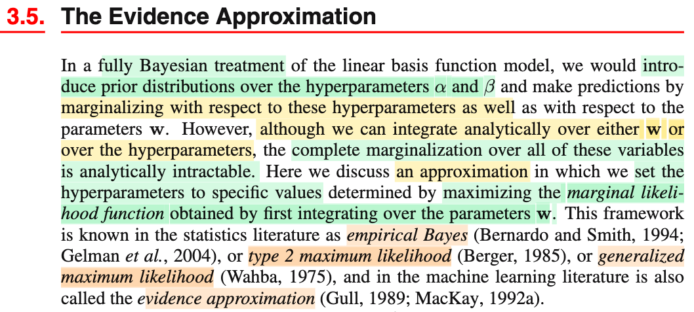
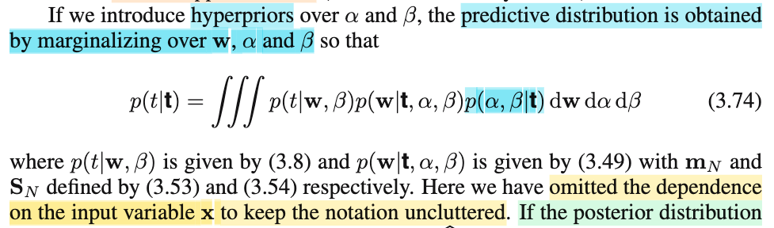
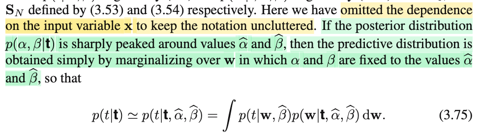
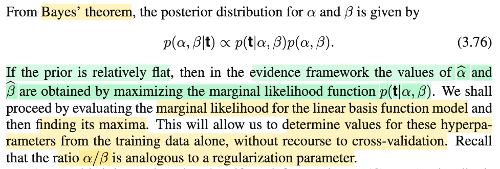
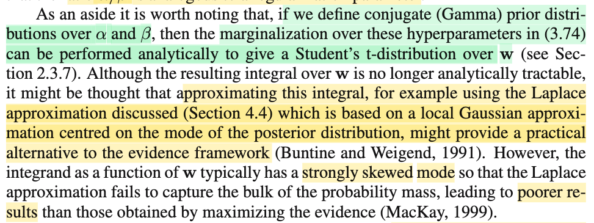
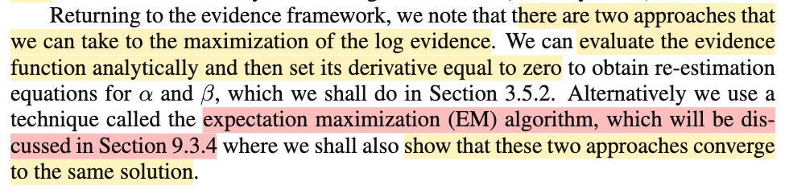

# 3.5 Evidence Approximation

📊 **Progress:** `6` Notes | `6` Screenshots | `5` AI Reviews

---

 

## Section 3.5 The Evidence Approximation

<kbd></kbd>

> [!NOTE]
> Hiểu đại ý như sau:
>
>
>
> Có thể tóm tắt nhanh vài ý chính: Khi tiếp cận bài toán regression theo Bayesian approach, ta sẽ coi tham số 𝐰 như random variable, sau đó, chọn prior distribution f(𝐰) (ví dụ f(𝐰|α) là normal(0, (1/α)𝐈) và dùng Bayes theorem xây dựng posterior distribution f(𝐰|𝒟) (ví dụ ra một normal distribution). Để rồi, nếu theo Bayesian "nửa mùa", ta sẽ lấy một point estimate của 𝐰 từ posterior (ví dụ dùng 𝐰 có posterior probability cao nhất, 𝐰MAP) để gắn vào hàm prediction y(𝐰, 𝐱). Hoặc làm Bayesian "hoàn toàn", thì ta marginalizing f(t|x, 𝐰, 𝒟) over w theo posterior distribution của, để có predictive distribution f(t|𝐱, 𝒟) không còn phụ thuộc 𝐰 nữa. Vậy thì có thể thấy, trong quá trình đó ta cũng đã đặt ra giả định về prior distribution của 𝐰, cụ thể là dạng của nó và (siêu) tham số α.
>
>
>
> Bên cạnh đó, trong lúc xây dựng mô hình dự đoán, ta cũng đặt giả định là nhiễu (error, ε = T - y(𝐰, 𝐱) sẽ tuân theo phân phối n(0, 1/β). Và β, lại là một giá trị mà ta chọn / giả định.
>
>
>
> Do đó, ở đây gs Bishop mới nói rằng, nếu làm theo fully Bayesian, thì đáng lẽ sẽ phải coi α, β là random variable luôn, và chọn distribution cho nó, và marginalizing over mọi giá trị khả dĩ của chúng, chứ không phải là chọn giá trị cụ thể ban đầu (hành động này hoàn tòan mang ý nghĩa ước lượng điểm đối với chúng, đi ngược với nguyên lý Bayesian approach).
>
>
>
> Tuy nhiên, nếu mà làm vậy, thì bài toán là intractable - quá cồng kềnh và không khả thi, dù về lí thuyết là được.
>
>
>
> Do đó ở đây, ta sẽ thảo luận một hướng, trong đó ta sẽ làm theo lối XẤP XỈ HÓA. Và ý tưởng cũng đơn giản, giống như khi ta không marginalizing over mọi 𝐰, để có predictive distribution, thì ta có thể làm theo lối xấp xỉ bằng cách dùng 𝐰 có posterior distribution cao nhất rồi lắp vào hàm prediction mà ta nói là làm theo kiểu nửa mùa ở trên. Thì đây cũng vậy, ta không marginalizing over mọi α, β. Thì ta chọn point estimate α, β theo tiêu chí nào đó, Và cụ thể là: maximize marginal likelihood (và cách làm này có vài tên khác như empirical Bayes, ....)

🤖 AI Check — 🟢 Pass — ✅ **98/100** · ✓ Move on

**Summary:** Ghi chú rất xuất sắc, giải thích trực quan và chính xác sự khác biệt giữa MAP, fully Bayesian và phương pháp xấp xỉ bằng cách tối đa hóa marginal likelihood. Để hoàn thiện hơn, bạn có thể bổ sung thêm các tên gọi học thuật khác được đề cập trong bài như empirical Bayes hay type 2 maximum likelihood.

 

### Predictive Distribution with Hyperpriors

<kbd></kbd>

> [!NOTE]
> Như vừa nói ở note trước, ý tưởng chỉ là vậy. Coi α, β làm random variable nốt, và chọn prior distribution cho nó.
>
>
>
> Khi đó, ta có predictive distribution là công thức 3.74. Thử giải thích cái công thức dài thòng này:
>
>
>
> Câu chuyện là, ta đã có prior / và posterior distribution của 𝐰: f(𝐰|α) và f(𝐰|𝒟,α,β)
>
>
>
> với 𝒟 là observed data, mà ở đây, chính là (các cặp (𝐱1, t1),...(𝐱N, tN) làm thành matrix 𝐗 và vector 𝐭). Gs Bishop ghi là p(𝐰|𝐭,α,β) thì phải hiểu nó là p(𝐰|𝐭,𝐗,α, β), hay p(𝐰|𝒟,α,β).
>
>
>
> Từ đó ta có predictive distribution f(t|𝒟,α,β), hay f(t|𝐭,α,β) bằng cách marginalizing over all 𝐰 \~ posterior.
>
>
>
> f(t|𝐭,α,β) = ∫f(t|𝐰,β)f(𝐰|𝐭,α,β)d𝐰 (1)
>
>
>
> Nay coi α, β là random variable có joint distribution f(α, β|𝐭) nữa, thì ta lại marginalizing f(t|𝐭,α,β) over distribution này, để ko còn α, β:
>
>
>
> ∫∫f(t|𝐭,α,β) f(α, β|𝐭) dα dβ (tích phân kép, vì ta đang tích phân over α và β)
>
>
>
> Thay cái (1) vô ta được:
>
>
>
> = ∫∫∫f(t|𝐰,β)f(𝐰|𝐭,α,β)d𝐰 f(α, β|𝐭) dα dβ
>
>
>
> = ∫∫∫f(t|𝐰,β)f(𝐰|𝐭,α,β)f(α, β|𝐭) d𝐰 dα dβ → 3.74
>
>
>
> ---
>
>
>
> Mình muốn nói vài lời: Thật ra nó **CHỈ RẮC RỐI LÀ DO QUÁ NHIỀU KÍ HIỆU**, rồi lại bỏ bớt đi để cho nó bớt cluttered, và khiến ta phải tự hiểu. Nên mình muốn **VIẾT MỘT PHIÊN BẢN DÀI DÒNG MỘT CHÚT NHƯNG SẼ PHẢN ÁNH TOÀN BỘ BẢN CHẤT.**
>
>
>
> ---
>
>
>
> Ban đầu, ta có bộ dữ liệu quan sát được, là những cặp (vector input, và target value): (𝐱1, t1),...,(𝐱N, tN).
>
>
>
> Ta gom 𝐱1,...𝐱N thành matrix 𝐗, có các hàng là (𝐱1)ᵀ,....(𝐱N)ᵀ
>
>
>
> Gom t1,...tN thành vector 𝐭.
>
>
>
> Và có thể đặt 𝒟 (data), là cái cục (𝐗, t) này, là toàn bộ dữ liệu quan sát được.
>
>
>
> Rồi, kế đến ta xây dựng mô hình dựa đoán, có bản chất chỉ là cái hàm y(𝐰, 𝐱), nhận vào input vector x, và dự đoán ra t. Ví dụ ta chọn hàm tuyến tính của 𝐰: y(𝐰, 𝐱) = 𝐰ᵀΦ(𝐱).
>
>
>
> Và để tìm 𝐰 theo trường phái Bayesian, ta coi nó như random variable, giả định prior distribution của nó là f(𝐰|α), ví dụ n(0, (1/α)𝐈). Đến đây, cái vụ ghi là "|α" trong f(𝐰|α) là vì hàm pdf của 𝐰 phụ thuộc α, vậy thôi.
>
>
>
> Rồi, dùng Bayes theorem, ta mới derive posterior của 𝐰:
>
>
>
> Và Bayes rule nói rằng f(x|y) = f(y|x)f(x)/f(y). Áp dụng cho 𝐰, và 𝒟 thì đáng lí nếu chỉ chỉ cần ghi thế này là gọn.
>
>
>
> f(𝐰|𝒟) = f(𝒟|𝐰)f(𝐰)/f(𝒟)
>
>
>
> hay f(𝐰|(𝐗,𝐭)) = f((𝐗,𝐭)|𝐰)f(𝐰)/f((𝐗,𝐭))
>
>
>
> hay với việc f(𝒟), chỉ là constant, ta chuyển sang dùng kí hiệu ∝:
>
>
>
> f(𝐰|𝒟) ∝ f(𝒟|𝐰)f(𝐰)
>
>
>
> hay f(𝐰|(𝐗,𝐭)) ∝ f((𝐗,𝐭)|𝐰)f(𝐰)
>
>
>
> Có điều, rắc rối là, f(𝐰) phụ thuộc α, nên phải ghi là f(𝐰|α). Nên trở thành:
>
>
>
> f(𝐰|𝒟) ∝ f(𝒟|𝐰)f(𝐰|α)
>
>
>
> Vế phải xuất hiện α thì vế trái cũng phải vậy, vì khi đó vế trái cũng phụ thuộc α:
>
>
>
> f(𝐰|𝒟,α) ∝ f(𝒟|𝐰)f(𝐰|α)
>
>
>
> hay f(𝐰|(𝐗,𝐭),α) ∝ f((𝐗,𝐭)|𝐰)f(𝐰|α)
>
>
>
> Tiếp, lại thêm một vụ nữa, rằng khi ta đặt ra gỉa định nhiễu \~ n(0,1/β), để rồi điều này tương đương gỉa định T \~ n(y(𝐱,𝐰), 1/β). Thì lúc này ta có phân phối của T,𝐗 sẽ phụ thuộc thêm β nữa: f(𝐱,t|𝐰,β). Do đó f((𝐗,𝐭)|𝐰) cũng thành f((𝐗,𝐭)|𝐰,β)
>
>
>
> f(𝐰|𝒟,α) ∝ f(𝒟|𝐰,β)f(𝐰|α)
>
>
>
> hay f(𝐰|(𝐗,𝐭),α,β) ∝ f((𝐗,𝐭)|𝐰,β)f(𝐰|α)
>
>
>
> Tiếp theo, lại rắc rối ở chỗ, trong bài toàn regression, người ta CHỈ COI t, TỨC TARGET LÀ RANDOM VARIABLE. Nên thay vì xem (𝐗, 𝐭) là observed value của \[random variable matrix 𝐗, random variable vector 𝐓\]. Nay, ta chỉ coi 𝐭|𝐗 là observed value của random variable vector 𝐓 dựa trên input là matrix 𝐗.
>
>
>
> Nên f(𝐰|𝒟,α,β) ∝ f(𝒟|𝐰,β)f(𝐰|α) trở thành:
>
>
>
> f(𝐰|𝐭,α,β,𝐗) ∝ f(𝐭|𝐰,β,𝐗)f(𝐰|α)
>
>
>
> với 𝐗 đứng trong điều kiện của bên chỉ như là hằng số. Thành ra người ta (ông Bishop) mới lờ nó đi luôn. Và viết thành:
>
>
>
> f(𝐰|𝐭,α,β) ∝ f(𝐭|𝐰,β)f(𝐰|α)
>
>
>
> Nhưng nếu ta không lờ thằng 𝐗 đi, ta sẽ có
>
>
>
> f(𝐰|𝐭,α,β,𝐗) ∝ f(𝐭|𝐰,β,𝐗)f(𝐰|α)
>
>
>
> ---
>
>
>
> Tới đây, lôi cái f(t,𝐱|𝐰,β), lúc này (sau khi nói chỉ coi T là random variable), nó trở thành f(t|𝐱,𝐰,β). Thì, ta mới marginalizing over 𝐰 để có predictive distribution, không còn phụ thuộc 𝐰:
>
>
>
> mà bản chất chỉ là ta coi f(t|𝐱,𝐰,β) như random variable phụ thuộc random variable 𝐰, và ta lấy kì vọng của random variable này:
>
>
>
> E\[f(t|𝐱,𝐰,β)\] với 𝐰 \~ f(𝐰|𝐭,α,β,𝐗), sẽ bằng:
>
>
>
> ∫f(t|𝐱,𝐰,β)f(𝐰|𝐭,α,β,𝐗)d𝐰
>
>
>
> và cái này dĩ nhiên là không còn phụ thuộc 𝐰, nhưng nó vẫn phải phụ thuộc đầy đủ bộ sậu: input 𝐱 (là cái input vào y(𝐱,𝐰)), 𝐭, α, β, 𝐗. Nên nó sẽ phải là f(t|𝐭,𝐱,β,α,𝐗)
>
>
>
> Và nếu lờ 𝐱, **X cho gọn** đi như cách gs Bishop làm, thì nó ra f(t|𝐭,α,β) chính là cái predictive distribution 3.57 (xem link), nhưng ta biết đầy đủ của nó phải là f(t|𝐭,𝐱,β,α,𝐗).
>
>
>
> ---
>
>
>
> Tới đây, cầm cái f(t|𝐭,𝐱,β,α,𝐗) này, ta lại coi α, β như random variable.
>
>
>
> Để rồi y như khi ta marginalize f(t|𝐱,𝐰,β) với 𝐰 \~ f(𝐰|𝐭,α,β,𝐗)...
>
>
>
> thì nay ta marginalizing f(t|𝐭,𝐱,β,α,𝐗) over (α, β) \~ f(α,β|𝐭,𝐗)
>
>
>
> Và như vậy, với t fixed, 𝐱 fixed, 𝐗 fixed, nhưng α, β biến ngẫu nhiên, thì f(t|𝐭,𝐱,β,α,𝐗) **LẠI LÀ BIẾN NGẪU NHIÊN**, và ta lại marginalizing, hay nói cách khác là lấy kì vọng của biến ngẫu nhiên này:
>
>
>
> E\[f(t|𝐭,𝐱,β,α,𝐗)\] với α,β \~ joint distribution f(α,β|𝐭,𝐗)
>
>
>
> sẽ bằng:
>
>
>
> ∫∫f(t|𝐭,𝐱,β,α,𝐗) f(α,β|𝐭,𝐗) dα dβ
>
>
>
> thay f(t|𝐭,𝐱,β,α,𝐗) = ∫f(t|𝐱,𝐰,β)f(𝐰|𝐭,α,β,𝐗)d𝐰 ta có
>
>
>
> ∫∫∫f(t|𝐱,𝐰,β)f(𝐰|𝐭,α,β,𝐗)d𝐰 f(α,β|𝐭,𝐗) dα dβ
>
>
>
> = ∫∫∫f(t|𝐱,𝐰,β)f(𝐰|𝐭,α,β,𝐗) f(α,β|𝐭,𝐗) d𝐰 dα dβ
>
>
>
> và bỏ đi / lờ đi cái 𝐱, 𝐗 cho bớt dài dòng thì nó chính là
>
>
>
> = ∫∫∫f(t|𝐰,β)f(𝐰|𝐭,α,β) f(α,β|𝐭) d𝐰 dα dβ
>
>
>
> và thêm bước nữa, thay vì dùng chữ f thì dùng chữ p
>
>
>
> = ∫∫∫p(t|𝐰,β) p(𝐰|𝐭,α,β) p(α,β|𝐭) d𝐰 dα dβ
>
>
>
> ta sẽ có công thức 3.74 trong sách.
>
>
>
> Và với ở đây ta cũng có thể có một thắc mắc, rằng gọi f(α,β|𝐭,𝐗) (hay như ông Bishop bỏ đi X, là p(α,β|𝐭)) mà ông gọi là HYPER-PRIOR, tức hyperparameter prior distribution của α, β. Mình cho là không đúng, vì nó rõ ràng là posterior distribution (giống như f(𝐰|𝐭,α,β,𝐗) vậy). Do đó mình đoán phải hiểu cái hyper-prior không phải là nói về f(α,β|𝐭,𝐗) hay p(α,β|𝐭), mà cái này là hyper-posterior. Còn ông Bishop nói vậy là ý là, "à nếu ta cũng coi α, β là random variable có prior distribution f(α,β) và dùng Bayes rule để derive posterior cho nó f(α,β|𝐭,𝐗), thì ta sẽ marginalizing over cả α và β theo posterior distribution này để có 3.74.

🤖 AI Check — 🟢 Pass — ✅ **100/100** · ✓ Move on

**Summary:** Ghi chú cực kỳ chi tiết và chính xác khi làm rõ các biến bị ẩn như X và x, đồng thời phân biệt rất tốt giữa hyperprior và hyper-posterior. Cách giải thích từng bước tích phân và chuẩn hóa ký hiệu toán học giúp làm sáng tỏ hoàn toàn bản chất của công thức 3.74.

**🔗 See also:** [3.3.2 Predictive distribution](./332_predictive_distribution.md#node-wdjepxb)

 

#### Approximating the Predictive Distribution

<kbd></kbd>

> [!NOTE]
> Đoạn tiếp theo hiểu thế này:
>
>
>
> Đầu tiên như trong note trước, mình đã nói, bản chất của ∫∫∫f(t|𝐰,β)f(𝐰|𝐭,α,β)f(α, β|𝐭) d𝐰 dα dβ, chỉ là:
>
>
>
> giá trị trung bình, expectation của f(t|𝐭,α,β), với tư cách nó là random variable có được bởi vì nó là hàm số của hai random variable α, β: E\[f(t|𝐭,α,β)\], với α,β \~ f(α,β|𝐭). 
>
>
>
> Mà bản chất của kì vọng, còn nhớ trong Stat110, gs Joe đã nói, nó chỉ là weighted average. Ví dụ với discrete variable X có 3 possible value x1,x2,x3. Thì EX chỉ là trung bình của 3 giá trị này, với trọng số là P(X=x1),P(X=x2),P(X=x3) tương ứng: EX = Σi=1,2,3 {xi P(X=xi)}. Và với biến liên tục thì chuyển thành tích phân nhưng ý nghĩa nó vẫn vậy. Và như đã hiểu bản chất của tích phân, ∫xf(x)dx, có thể coi như là tổng vô hạn các hạng tử xi f(xi) δ (với δ nhỏ về 0) mà trong MIT 18.01 gọi là Riemann sum.
>
>
>
> Vậy thì ở đây nói nếu như distribution f(α,β|𝐭) nó có dạng là tập trung hầu hết xác suất vào hai giá trị α^ và β^. lúc này mình có thể hiểu như sau: Ta sẽ coi tích phân ∫f(t|𝐭,α,β) dα dβ, dưới dạng Riemann sum như trên:
>
>
>
> ∫f(t|𝐭,α,β) dα dβ ≈ Σi f(t|𝐭,αi,βi) f(αi,βi|𝐭) δα,β (δα ,δβ rất nhỏ)
>
>
>
> Và với dạng phân phối của α,β tập trung hầu hết vào α^, β^ nên:
>
>
>
> tại vị trí tương ứng với α^ và β^, f(αi,βi|𝐭) δαδβ ≈ 1 và
>
>
>
> còn những chỗ còn lại, f(αi,βi|𝐭) δαδβ ≈ 0
>
>
>
> Do đó ta sẽ có thể xấp xỉ bởi:
>
>
>
> ≈ f(t|𝐭,α^,β^) × 1 + Σ{các hạng tử khác} f(t|𝐭,αi,βi) × 0
>
>
>
> ≈ f(t|𝐭,α^,β^)
>
>
>
> Do đó E\[f(t|𝐭,α,β)\] ≈ f(t|𝐭,α^,β^)
>
>
>
> và = ∫f(t|𝐰,β)f(𝐰|𝐭,α^,β^) d𝐰 → chính là 3.75

🤖 AI Check — 🟢 Pass — ✅ **95/100** · ✓ Move on

**Summary:** Ghi chú giải thích rất chính xác và trực quan bản chất của việc xấp xỉ tích phân khi phân phối posterior tập trung cao độ bằng cách liên hệ với Riemann sum và kỳ vọng. Để hoàn thiện hơn, bạn có thể bổ sung khái niệm hàm Dirac delta vốn là mô tả toán học chính thức cho trường hợp phân phối cực kỳ nhọn này.

 

##### Evidence Framework for Hyperparameter Estimation

<kbd></kbd>

> [!NOTE]
> Đại ý là, tiếp tục nói về f(t|𝐭) = E\[f(t|𝐭,α,β)\] dưới α,β \~ f(α,β|𝐭), thì note vừa rồi chỉ là trường hợp đặc biệt nếu phân phối xác suất của f(α,β|𝐭) dồn hết tại α^, β^, thì khi đó E\[f(t|𝐭,α,β)\] ≈ f(t|𝐭,α^,β^) = ∫f(t|𝐰,β)f(𝐰|𝐭,α^,β^) d𝐰 như đã hiểu.
>
>
>
> Nhưng trong trường hợp khác, mình hiểu đại ý là ta vẫn dùng một point estimate α^ β^ để thay vào E\[f(t|𝐭,α,β)\] ≈ f(t|𝐭,α^,β^), và đó là maximum posterior estimator.
>
>
>
> Chú ý, nhắc lại: Trên hết, ta muốn tính E\[f(t|𝐭,α,β)\] với α,β \~ f(α,β|𝐭). Nhưng, nếu tình huống thuận lợi, khi xác suất f(α,β|𝐭) tập trung hết vào α^, β^, thì ta sẽ có thể xấp xỉ tốt E\[f(t|𝐭,α,β)\] bởi f(t|𝐭,α^,β^). Nhưng khi không được như vậy, ta đành gắn một point estimate khác vào. Và dùng point estimate nào thì câu chuyện y chang như khi ta có posterior distribution của 𝐰: f(𝐰|𝒟) hay f(𝐰|𝐭,α,β), ta lấy cái wMAP - tức là cái khiến f(𝐰|𝒟) lớn nhất, để gắn vào f(t|𝐱,𝐰,𝒟,α,β) thay vì marginalizing over 𝐰 để có predictive distribution f(t|𝐱,α,β,𝒟) và từ đó đưa ra hàm dự đoán chỉ phụ thuộc 𝐱, 𝒟.
>
>
>
> Cho nên điều ta sẽ làm là (tìm α,β giúp) maximize posterior f(α,β|𝐭). Mà theo Bayes rule, nó ∝ f(𝐭|α,β)f(α,β). Để rồi nếu coi f(α,β) là giống như uniform, (relative flat), đồng nghĩa f(α,β) giống như hằng số, thì bài toán này sẽ trở thành đi tìm α,β giúp maximize f(𝐭|α,β), và cái này lại chính là evidence,hay marginal likelihood.
>
>
>
> Và cái này thì liên quan gì mà gs lại nói là "nó cho phép ta xác định giá trị của các hyperparameter CHỈ DỰA TRÊN TRAINING DATA mà không cần phải làm cái cách làm của Frequentist là cross-validation"" (chia training data thành 1 phần dành cho validation set, khiến lãng phí data). 
>
>
>
> Đó là vì α/β chính là tương đương với regularization parameter, nên ý quan trọng muốn nói ở đây: 
>
>
>
> BÀI TOÁN MÀ MÌNH VỪA NÓI: ĐI TÌM α, β GIÚP MAXIMIZE f(α,β|𝐭), CHÍNH LÀ CÁCH ĐỂ TUNING REGULARIZATION HYPERPARAMETER MÀ KHÔNG CẦN DÙNG VALIDATION SET.

🤖 AI Check — 🟢 Pass — ✅ **95/100** · ✓ Move on

**Summary:** Ghi chú rất xuất sắc, thể hiện sự hiểu biết sâu sắc và chính xác về bản chất của phương pháp Evidence Approximation cũng như cách xấp xỉ phân phối dự đoán bằng point estimate. Bạn đã giải thích rất rõ ràng lý do tại sao phương pháp này giúp tối ưu hóa hyperparameter trực tiếp từ training data mà không cần dùng cross-validation.

 

###### Laplace Approximation vs Evidence Framework

<kbd></kbd>

> [!NOTE]
> Rồi, đoạn tiếp theo đại ý là" nhớ hồi nãy gs có nói, nếu ta coi α,β (bên cạnh w bữa giờ) là random variable, rồi đi marginalizing hết (tính cái tích phân 3 lớp hồi nãy), thì ta sẽ có f(t|𝐭):
>
>
>
> f(t|𝐭) = ∫∫∫f(t|𝐰,β)f(𝐰|𝐭,α,β) f(α,β|𝐭) d𝐰 dα dβ
>
>
>
> Tuy nhiên, gs nói rằng, có một trừong hợp đặc biệt, là khi ta chọn prior của α, β (tức là f(α,β)) là Gamma.
>
>
>
> Thì khi marginalizing over α,β ta sẽ có ∫f(𝐰|𝐭,α,β)f(α,β)dαdβ hóa ra là phân phối Student't (là cái phân phối rất khó chịu)
>
>
>
> Và như vậy cái tích phân 3 lớp trên trở thành ∫f(t|𝐰,β)f(𝐰|𝐭) d𝐰 với f(𝐰|𝐭) là pdf của Student t's. 
>
>
>
> Khi đó việc tính cái tích phân này là không còn tính được (no longer analytically tracable) Tuy nhiên ta có thể làm bằng cách dùng xấp xỉ Laplace. Tuy nhiên, cách làm này có vài nhược điểm. (chưa hiểu lắm nhưng có thể các chương sau sẽ nói)

🤖 AI Check — 🟢 Pass — ✅ **90/100** · ✓ Move on

**Summary:** Bạn đã hiểu rất tốt ý tưởng cốt lõi và biểu diễn toán học của việc tích phân các siêu tham số để tạo ra phân phối Student's t. Tuy nhiên, bạn nên lưu ý thêm lý do xấp xỉ Laplace thất bại ở đây là do hàm dưới dấu tích phân có cực trị bị lệch rất mạnh (strongly skewed), khiến xấp xỉ Gaussian cục bộ bỏ sót phần lớn khối lượng xác suất.

 

###### Maximizing the Log Evidence

<kbd></kbd>

> [!NOTE]
> Rồi, cuối cùng, gs nói, quay lại bài toán tìm α,β khiến maximize hàm f(t|α,β) (evidence). thì ta có thể làm theo giải tích (tức tìm đạo hàm, cho bằng 0 (điều kiện cần bậc nhất và giải ra) hoặc dùng một thuật toán gọi là Expectation Maximization, sẽ học trong chapter 9.

 

