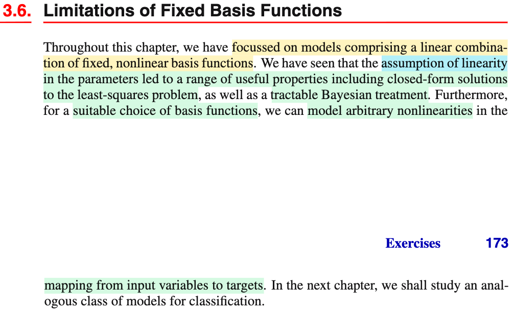
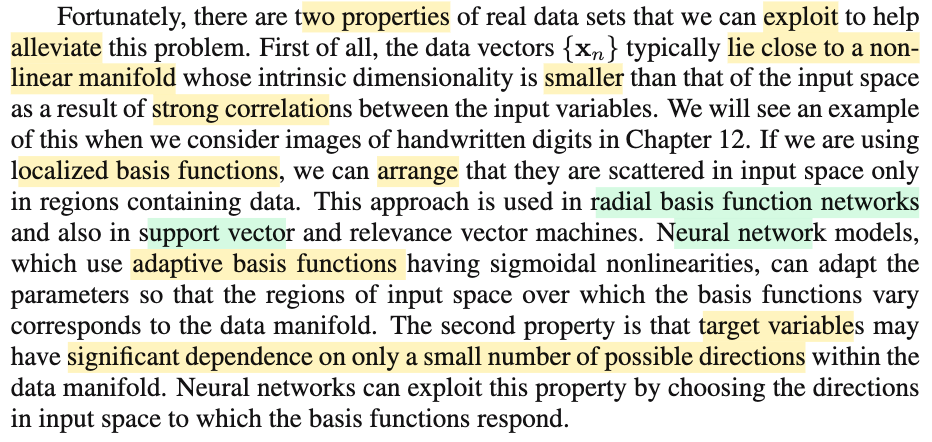

# 3.6 Limitations of Fixed Basis Functions

📊 **Progress:** `1` Notes | `2` Screenshots | `1` AI Reviews

---

 

## Limitations of Fixed Basis Functions

<kbd></kbd>

<kbd></kbd>

> [!NOTE]
> Đại ý là gs nói rằng trong chapter này ta đã thảo luận xoay quanh mô hình có dạng linear combination của các hàm phi tuyến (là sao, thì chính là ý nói cái hàm dự đoán y(**w**, **x**) = **w**TΦ(**x**) = w0 + w1 Φ1(**x**) + ...wM-1 ΦM-1(**x**) đó, nó chính là một linear combination, chính xác hơn là affine combination các hàm phi tuyến Φ1, Φ2,.. của **x**).
>
>
>
> Gs nói tiếp rằng ta cũng đã thấy giả định tuyến tính của parameter dẫn đến một loạt các tính chất hữu ích, bao gồm việc ta có thể có solution của bài toán least-square ở dạng closed form (ý là có thể giải bằng công thức thay vì dùng thuật toán iterative), cũng như là cho phép cách tiếp cận theo Bayesian có thể tractable (hiểu đại khái là có thể khả thi)
>
>
>
> Và hơn nữa, với việc dùng các hàm phi tuyến (basis function) thì tuy mô hình là tuyến tính đối với tham số nhưng phi tuyến đối với **x**, do đó vẫn có thể có khả năng biểu diễn bất cứ non-linearity phức tạp nào (arbitrary nonlinearities trong data)
>
>
>
> ---
>
>
>
> Tuy nhiên, gs cho biết rằng mô hình tuyến tính này có những hạn chế nghiêm trọng khiến ta sẽ cần những mô hình phức tạp hơn như SVM hay neural network. Điển hình là nếu số chiều không gian của input tăng lên thì số lượng basis function sẽ phải tăng theo theo hàm mũ, đây chính là xuất phát từ cái gọi là lời nguyền về kích thước không gian mà mình đã biết ở chap 1.
>
>
>
> ---
>
>
>
> Cuối cùng là ông nói về việc các mô hình như SVM, neural network sở dĩ có thể khắc phục vấn đề của linear model là vì đại ý là dù cho input space có số chiều lớn, nhưng data thực tế lại thường tập trung trong một dải có số chiều nhỏ hơn, xuất phát từ việc có sự tương quan giữa các biến input. Cái vụ này hồi chapter 1 đã từng nghe qua rồi, dễ hình dung nhất là lấy ví dụ hình ảnh. Ví dụ bức ảnh size 1000 x 1000 chụp mèo trong thực tế, thì tuy kích thước không gian input là 3000.000, nhưng vì hình ảnh chụp được sẽ luôn tuân theo một số quy luật nhất định nào đó, do đó nếu có thể vẽ các bức ảnh chụp được này trong không gian 3000.000 chiều, thì ta sẽ thấy thật ra chúng sẽ co cụm lại và tạo thành một mạng lưới có cấu trúc với số chiều thấp hơn 3000.000. Và các phương pháp như SVM, neural net sẽ khai thác đặc điểm này.

> [!TIP]
> **🤖 AI Feedback** — ✅ Score: **95/100**
>
> Ghi chú của bạn cực kỳ xuất sắc khi giải thích rất chi tiết, dễ hiểu và liên hệ trực quan tốt các khái niệm toán học từ văn bản gốc (như manifold và ví dụ về ảnh). Để hoàn thiện hơn nữa, bạn có thể tóm tắt thêm thuộc tính thứ hai được đề cập ở cuối trang là biến mục tiêu thường chỉ phụ thuộc vào một số ít hướng quan trọng trong manifold.

 

