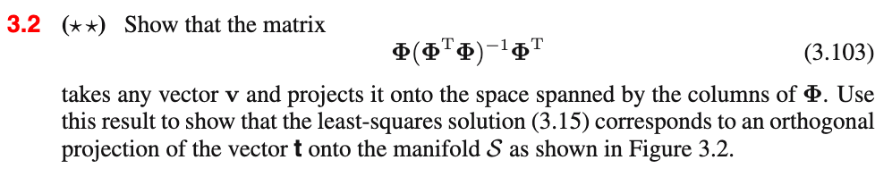
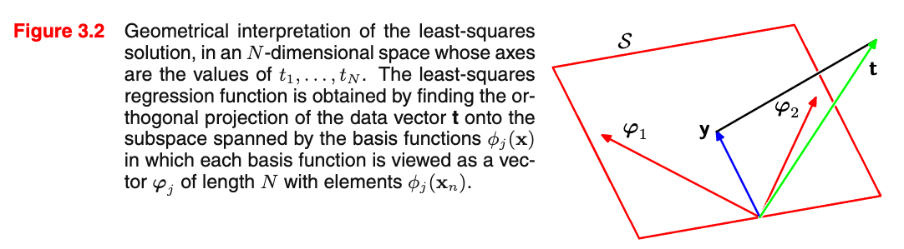
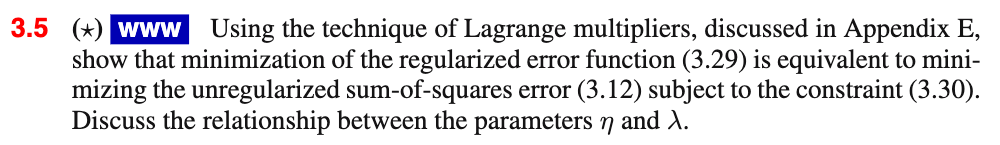
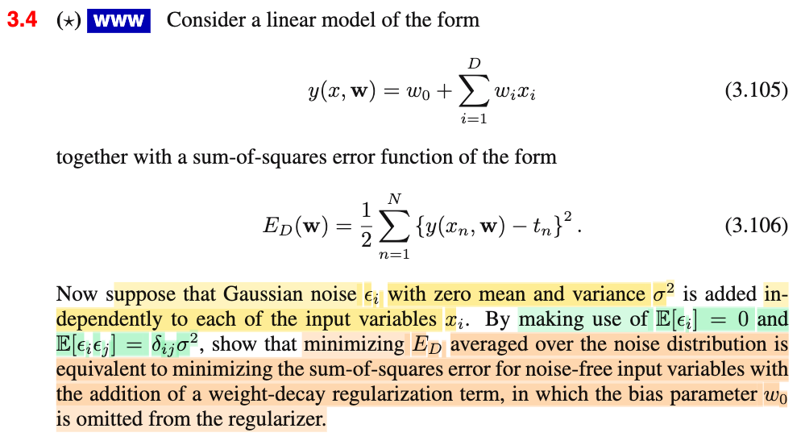
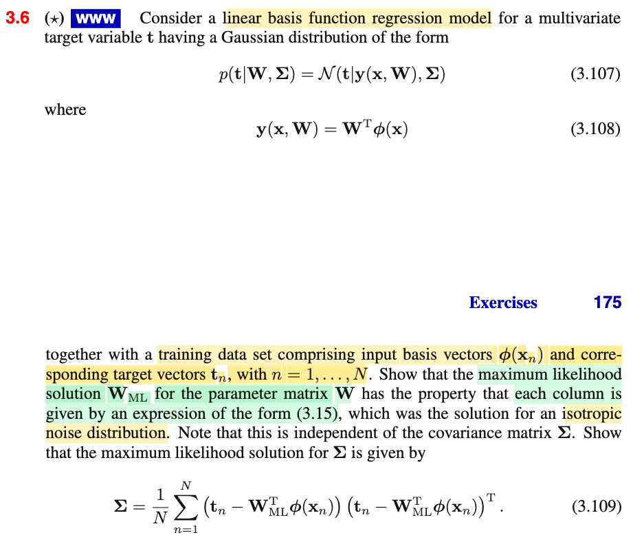
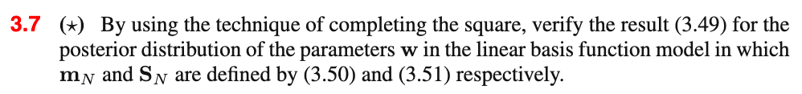

# 3.7 Exercises

📊 **Progress:** `5` Notes | `6` Screenshots | `5` AI Reviews

---

 

## Ex 3.2 Orthogonal Projection and Least Squares

<kbd></kbd>

<kbd></kbd>

> [!NOTE]
> Bài này thì thật ra quá trình note Feynman trong lúc học mục 3.1.2 thì mình đã làm rồi. (xem link)
>
>
>
> Nói sơ lại nhanh vì đây cũng là bài ta áp dụng kiến thức từ MIT 18.06 rất hay:
>
>
>
> Trong bài nói về projection matrix thầy Strang giúp ta lập luận ra cái công thức của matrix projection onto C(A) rất dễ như sau, ta có matrix A size m × n. Thì C(A), column space, theo định nghĩa chính là subspace tạo bởi mọi linear combination của các column vector của matrix A. Thế thì, xét một vector b ∈ R^m, khi chiếu nó lên C(A), được p, thì dĩ nhiên p ∈ C(A), nên theo định nghĩa của C(A), p phải là linear combination các vector column của A vói hệ số tổ hợp nào đó, ta gọi là x, tức p = Ax. Và phần dư, e = b - p, theo góc nhìn hình học sẽ phải vuông góc với C(A) (như việc ta chiếu 1 điểm trong R^3 lên mặt phẳng, thì vector b tách thành 2 phần, 1 nằm trong mặt phẳng, một vuông góc với mặt phẳng vậy). Như vậy, e ⊥ C(A) mà theo định lý cơ bản của của đại số tuyến tính, nói rằng ta có hai cặp subspace bù nhau và vuông góc đó là column space và left nullspace, rowspace và nullspace. Vậy thì theo đó, khi e ⊥ C(A) suy ra e ∈ left nullspace N(AT). Điều này đồng nghĩa phương trình e là nghiệm của ATx = 0, tức ATe = 0 (A transpose e = 0, trong cách ghi chú của mình, mình luôn dùng T là cho transpose cho gọn, khi nào cần dùng chữ T thì sẽ ghi rõ). Vậy ta có:
>
>
>
> ATe = 0 ⇔ AT(b - p) = 0 ⇔ ATb = ATp ⇔ ATb = ATAx đây chính là normal equation.
>
>
>
> Tiếp, khi A full column rank, thì ATA sẽ full rank cũng là invertible khiến ta có thể nhân hai vế cho (ATA)inv, ta sẽ có: x = (ATA)inv ATb, và p = Ax = A(ATA)inv ATb, đặt P = A(ATA)inv AT, ta có p = Pb, đồng nghĩa, projection giúp chiếu b lên C(A) chính là P = A(ATA)inv AT
>
>
>
> Vậy tới đây ta chỉ việc áp dụng kết quả này, để có matrix giúp chiếu v lên space spanned bởi columns của **Φ** (cái này chính là column space của **Φ** thôi, tức C(**Φ**)) sẽ là: **Φ**(**Φ**T**Φ**)inv **Φ**T.
>
>
>
> Trong bài giảng đó, thấy thầy cũng check lại hai tính chất của projection matrix, là PP = P (chiểu b lên C(A) rồi thì chiếu lần nữa sẽ giữ nguyên, và PT = P) ta thử xem: 
>
>
>
> \[**Φ**(**Φ**T**Φ**)inv **Φ**T\] \[**Φ**(**Φ**T**Φ**)inv **Φ**T\] 
>
>
>
> = **Φ**(**Φ**T**Φ**)inv **Φ**T**Φ**(**Φ**T**Φ**)inv **Φ**T
>
>
>
> = **Φ I** (**Φ**T**Φ**)inv **Φ**T
>
>
>
> = **Φ** (**Φ**T**Φ**)inv **Φ**T → đúng là PP = P
>
>
>
> Và Xét \[**Φ**(**Φ**T**Φ**)inv **Φ**T\]T, dùng rule (AB)T = BT AT:
>
>
>
> = (**Φ**T)T \[**Φ**(**Φ**T**Φ**)inv\]T\]
>
>
>
> = **Φ** \[(**Φ**T**Φ**)inv\]T **Φ**T\]
>
>
>
> = **Φ** \[(**Φ**T**Φ**)inv\] **Φ**T\] (do **Φ**T**Φ** đối xứng nên **(Φ**T**Φ**)inv cũng vậy.
>
>
>
>
>
> ---
>
>
>
> Và như vậy, công thức 3.15, tức MLE của **w**, **w**ML:\*\* = (**Φ**T**Φ**)inv **Φ**T**t** thì **Φw**ML sẽ là:
>
>
>
> **Φ**(**Φ**T**Φ**)inv **Φ**T**t**, chính là tương ứng với p = A(ATA)inv ATb hình chiếu của b lên C(A), thì cái này chính là hình chiếu của **t lên** C(**Φ**) chứ gì nữa.
>
>
>
> Như vậy **w**ML sẽ là có vai trò như **x** ở trên đó là BỘ HỆ SỐ TỔ HỢP GIÚP LINEARLY COMBINE CÁC COLUMN VECTOR CỦA **Φ** ĐỂ ĐƯỢC PROJECTION CỦA **t** LÊN C(**Φ**).

> [!TIP]
> **🤖 AI Feedback** — ✅ Score: **100/100**
>
> Ghi chú xuất sắc, kết hợp rất tốt kiến thức Đại số tuyến tính từ MIT 18.06 để giải thích trực quan và chứng minh chặt chẽ cả hai yêu cầu của bài toán. Các bước chứng minh tính chất ma trận hình chiếu và liên hệ với lời giải tối ưu w_ML đều hoàn toàn chính xác.

**🔗 See also:** [3.1.2 Geometry of least squares](./312_geometry_of_least_squares.md#node-6e545fx) · [Maximum Likelihood and Gradient](./311_maximum_likelihood_and_least_squares.md#node-ogc31vz)

 

### Ex 3.5 Lagrange Multipliers in Regularization

<kbd></kbd>

> [!NOTE]
> Bài tập này muốn ta chỉ ra hai bài toán tối ưu sau là equivalent:
>
>
>
> (3.29): minimize (over **w**) (1/2 E_D(**w**) + (λ/2) Σj |wj|^q
>
>
>
> minimize (3.12) E_D(**w**) = Σi {(ti-**w**TΦ(**x**i))^2/2} với ràng buộc (3/30) Σj |wj|^q ≤ η
>
>
>
> Again, mình cũng đã giải một phần trong quá trình ghi chú kiểu Feynman rồi, xem link tới note của 3.1.4, ở đây làm rõ thêm chút:
>
>
>
> Để hiểu cái này dễ nhất là vận dụng kiến thức đã học trong cuốn Numerical Optimization, chapter 12, bài toán tối ưu hàm f có ràng buộc, trong đó, ta được học về định lý điều kiện cần bậc nhất, còn gọi là KKT conditions:
>
>
>
> Và cách hay nhất để nhớ KKT condition là dựa vào lập luận trực giác sau: Giả sử ta có bài toán minimize f(x) với ràng buộc c1(x) ≥ 0. Thì để tìm nghiệm của bài toán này, tức là tìm x sao cho f(x) nhỏ nhất nhưng x vẫn thỏa ràng buộc c1(x), ta sẽ phải làm từng bước. Và bước đầu tiên đó là, tìm các ứng cử viên trước, bằng cách loại bỏ bớt các điểm không thể là solution. Và cách làm này sẽ dẫn dắt ta xây dựng được điều kiện cần KKT mà không phải học thuộc lòng. Lập luận như sau:
>
>
>
> Ta sẽ loại bỏ những điểm sau đây: là những điểm mà từ đó vẫn có thể đi theo hướng nào đó giúp vẫn feasible (thỏa constraint) đồng thời giảm hàm linearized f(x). Là sao?
>
>
>
> Đầu tiên xét tại x\*, định lý Taylor cho phép ta rằng, khi x đủ gần x\*, thì hàm f(x) ≈ f(x\*) + ∇f(x\*)T(x-x\*), ý nghĩa là, trong phạm vi lân cận x\*, hàm f (có thể là hàm phi tuyến) hành xử gần giống hàm tuyến tính f^(x) = f(x\*) + ∇f(x\*)T(x-x\*).
>
>
>
> Vậy thì, nếu như giả sử ta có điểm x1, mà tại đó tồn tại vector s có độ dài rất nhỏ khiến f^ giảm, tức:
>
>
>
> f^(x1 + s) &lt; f^(x1)
>
>
>
> và như vừa nói trong phạm vi s + s1 rất gần x1 thì hàm f hành xử giống f^, nên điều này rõ ràng sẽ khiến f(x1 + s) &lt; f(x1), như vậy x1 chắc chắn không phải là solution. vì còn có điểm x1 + s vẫn feasible mà objective lại nhỏ hơn. Nên ta sẽ loại bỏ x1 ra khỏi danh sách ứng cử viên.
>
>
>
> Ngược lại, nếu tại x2, không thể tìm được s giống như trên thì x2 sẽ là ứng cử viên cho solution. (vì sao chưa chắc là solution, là vì ta chỉ đang lập luận dựa trên ý chính là: nếu còn có thể đi theo hướng nào đó để giảm xấp xỉ bậc 1 của f, thì chắc chắn là sẽ có thể giảm f, nên ko phải solution. Nhưng ngược lại, nếu không thể đi theo hướng nào giúp giảm xấp xỉ bậc 1 của f, thì cũng chưa chắc nó là solution, vì có thể khi xét thêm điều kiện bậc 2 thì candidate cũng bị loại, đây sẽ là lập luận cho điều kiện đủ bậc 2)
>
>
>
> Còn để s là feasible direction, ta sẽ cần c1(x + s) vẫn ≥ 0, với s nhỏ, c1(x + s) cũng hành xử gần giống hàm tuyến tính, nên điều kiện trở thành c1(x) + ∇c1(x)Ts ≥ 0 (2)
>
>
>
> Vậy lập luận như sau, yêu cầu là: ta chia hai trường hợp:
>
>
>
> Case i) Gỉa sử tại x\*, constraint đang inactive: c1(x\*) &gt; 0, khi đó, dễ thấy là để thỏa tồn tại feasible direcition s: c1(x\*) + ∇c1(x\*)Ts ≥ 0, thì thật ra s có thể là vector có hướng tùy ý, miễn là giả sử nếu hướng của nó khiến ∇c1(x)Ts âm, thì chỉ cần khống chế độ lớn của s để giá trị âm ko quá nhỏ, giúp c1(x\*) dương vẫn đủ gánh. Như vậy có thể nói trong trường hợp này luôn tồn tại s giúp x\* + s vẫn feasible. Vậy câu hỏi để tìm candidate là, điểm x\* này nên như thế nào thì không thể đi theo s bất kì giúp giảm f^? Câu trả lời đó là: x\* là điểm mà gradient hàm f tại đó đang = 0. Vì khi đó f^(x\* + s) = f(x\*) + ∇f(x\*)Ts = f(x\*) bất kể s có là gì.
>
>
>
> Vậy, khi x\* có c1(x\*) &gt; 0 thì điều kiện để nó là candidate cho solution là ∇f(x\*) = 0
>
>
>
>
>
> Case ii) Tại x\*, constraint đang active: c1(x\*) = 0. Lúc này, điều kiện c1(x\*) + ∇c1(x\*)Ts ≥ 0 ⇔ ∇c1(x\*)Ts ≥ 0, tức s hợp góc nhọn hoặc tù với ∇c1(x\*). Trong khi đó, để thỏa việc giảm f^, thì ∇f(x\*)Ts phải &lt; 0 tức s hợp với ∇f(x\*) góc tù. Như vậy, cách duy nhất để tại x\* không thể tồn tại s thỏa hai cái này chính là ∇f(x\*) trùng hướng ∇c1(x\*). vì khi đó ko thể có s vừa hợp góc tù | nhọn với vector ∇f(x\*) mà lại vừa hợp góc tù với ∇f(x\*) được. Và điều kiện này thể hiện theo toán học là:
>
>
>
> Tồn tại λ\*1 sao cho ∇f(x\*) = λ\*1 ∇c1(x\*), λ\*1 ≥ 0.
>
>
>
> Tổng hợp lại:
>
>
>
> Nếu c1(x\*) &gt; 0 thì điều kiện để x\* là candidate là ∇f(x\*) = 0
>
>
>
> Nếu c1(x\*) = 0 thì điều kiện để x\* là candidate là Tồn tại λ1 sao cho ∇f(x\*) = λ1 ∇c1(x\*), λ1 ≥ 0.
>
>
>
> Và người ta đặt ra hàm Lagrangian ℒ(x, λ) = f(x) - λ1 c1(x). Ta có thể thể hiện cả hai case trên như sau (sẽ giải thích ở dưới)
>
>
>
> x\* phải thỏa:
>
>
>
> ∇\_x ℒ(x\*, λ\*) = 0 ⇔ ∇f(x\*) - λ1 ∇c1(x\*) = 0 ⇔ ∇f(x\*) = λ1 ∇c1(x\*)
>
>
>
> Cái này chính là stationary condition của KKT condition
>
>
>
> λ\*1 c1(x\*) = 0
>
>
>
> Cái này chính là complementary slackness condition của KKT
>
>
>
> λ\*1 ≥ 0.
>
>
>
> Cái này gọi là dual feasible
>
>
>
> và thêm constrain ban đầu c1(x) ≥ 0, gọi là primal feasible
>
>
>
> gom lại ta có đủ KKT condition.
>
>
>
> Giải thích vì sao nói "Ta có thể thể hiện cả hai case trên như sau"
>
>
>
> Xét c1(x\*) &gt; 0, thì từ complemetary condition ta suy ra λ\*1 = 0, khiến stationary condition trở thành ∇f(x\*) = 0 → chính là điều kiện của case 1 hồi nãy.
>
>
>
> Xét c1(x\*) = 0, thì stationary condition chính là điều kiện của case 2 hồi nãy.
>
>
>
> ---
>
>
>
> Rồi, với lập luận trên về cơ bản ta đã hiểu cách derive KKT condition, quay lại bài tập 3.5 này như sau:
>
>
>
> Để chứng minh chúng tương đương, chỉ việc chỉ ra rằng điều kiện cần để giảm tìm nghiệm của hai bài toán này là như nhau:
>
>
>
> Xét bài toán 1: minimize (over **w**) (1/2 E_D(**w**) + (λ/2) Σj |wj|^q, đây là bài toán unconstraint nên điều kiện cần tối ưu bậc nhất đơn giản là: gradient của objective = 0:
>
>
>
> ∇\_**w** \[(1/2 E_D(**w**) + (λ/2) Σj |wj|^q\] = 0
>
>
>
> ⇔ ∇\_**w** (1/2 E_D(**w**)\] + ∇\_**w** \[(λ/2) Σj |wj|^q\] = 0
>
>
>
> ⇔ 1/2 ∇\_**w** \[E_D(**w**)\] + (λ/2) ∇\_**w** \[ Σj |wj|^q\] = 0 (a)
>
>
>
> Còn bài toàn 2: minimize (3.12) E_D(**w**) = Σi {(ti-**w**TΦ(**x**i))^2/2} với ràng buộc (3/30) Σj |wj|^q ≤ η
>
>
>
> Chuyển ràng buộc thành dạng c1(w) ≥ 0: η - Σj |wj|^q ≥ 0
>
>
>
> điều kiện cần của nó chính là KKT ta mới ôn lại:
>
>
>
> Lagrangian: ℒ(**w**, λ) = E_D(**w**) - λ\[η - Σj |wj|^q\]
>
>
>
> Stationary conditiion:
>
>
>
> ∇\_**w** ℒ(**w**, λ) = 0 ⇔ ∇\_**w** \[E_D(**w**) - λ\[η - Σj |wj|^q\]\] = 0
>
>
>
> ⇔ ∇\_**w** E_D(**w**) - ∇\_**w** λ\[η - Σj |wj|^q\]\] = 0
>
>
>
> ⇔ ∇\_**w** E_D(**w**) - λ ∇\_**w** \[η - Σj |wj|^q\]\] = 0
>
>
>
> ⇔ ∇\_**w** E_D(**w**) - λ ∇\_**w** \[η\] + λ ∇\_**w** \[Σj |wj|^q\] = 0
>
>
>
> ⇔ ∇\_**w** E_D(**w**) - 0 + λ ∇\_**w** \[Σj |wj|^q\] = 0 (đạo hàm theo w của constant η dĩ nhiên = 0)
>
>
>
> ⇔ (1/2) ∇\_**w** E_D(**w**) + (1/2) λ ∇\_**w** \[Σj |wj|^q\] = 0 (b) (nhân thêm 1/2)
>
>
>
> Tới đây ta thấy nó y chang (a)
>
>
>
> Như vậy điều kiện cần là giống nhau. Và nếu làm thêm bước nữa, chỉ ra rằng cả hai là bài toán lồi thì kết luận luôn là chúng là tương đương, vì với bài toán tối ưu lồi, điều kiện KKT cũng là điều kiện đủ.
>
>
>
> E_D(**w**) là hàm lồi vì là hàm bậc hai theo w.
>
>
>
> (λ/2) Σj |wj|^q cũng là hàm lồi (nếu q ≥ 1, chứng minh thì hơi dài nên tạm bỏ qua)
>
>
>
> nên objective của bài toán unconstraint là hàm lồi nên nó là bài toán lồi
>
>
>
> còn với bài toán constraint thì objective lồi, constraint cũng lồi nên nó cũng là bài toán lồi.
>
>
>
> ---
>
>
>
> Còn một ý bài tập yêu cầu: Thảo luận quan hệ giữa η và λ:
>
>
>
> Thì ta sẽ dùng complementary condition của bài toán constraint:
>
>
>
> λ\* × \[η - Σj |w\*j|^q\] = 0
>
>
>
> Với quan hệ này:
>
>
>
> nếu λ\* &gt; 0 thì \[η - Σj |w\*j|^q\] phải = 0.
>
>
>
> và λ\* = 0 thì η - Σj |w\*j|^q ≥ 0 ⇔ η ≥ Σj |w\*j|^q
>
>
>
> Và ý nghĩa của nó là:
>
>
>
> Nếu ta tăng hệ số regularization λ, điều này sẽ khiến giảm E_w(**w**) = Σj |w\*j|^q, và vì η = E_w(**w**) nên η sẽ giảm.
>
>
>
> Còn nếu ta cho hệ số regularization = 0, tức là không penalized khi **w** lớn, thì E_w(**w**) có thể sẽ lớn, khiến η với yeu cầu ≥ E_W(**w**) nên sẽ lớn lên.
>
>
>
> Như vậy quan hệ của λ và η là: λ lớn thì η nhỏ và ngược lại.

> [!TIP]
> **🤖 AI Feedback** — ✅ Score: **98/100**
>
> Lời giải rất xuất sắc, không chỉ chứng minh đầy đủ sự tương đương toán học thông qua điều kiện KKT mà còn giải thích trực quan rất sâu sắc về KKT. Phần thảo luận về mối quan hệ nghịch biến giữa ̹Η và ̹Λ cũng hoàn toàn chính xác.

**🔗 See also:** [General Regularizer and Lasso](./314_regularized_least_squares.md#node-1msg8km) · [Likelihood and Error Functions](./311_maximum_likelihood_and_least_squares.md#node-urnjdcs)

 

#### Ex 3.4 Regularization via Input Noise

<kbd></kbd>

> [!NOTE]
> Cùng làm bài này, trước tiên là dịch sơ cái yêu cầu
>
>
>
> Ở đây gs xét linear model y(**x**, **w**) = w0 + Σi=0:D wixi
>
>
>
> với SSE function ED(**w**) = (1/2) Σn=1:N {y(**x**n, **w**) - tn}^2
>
>
>
> Và cho rằng noise εi \~ N(0, σ²), được add độc lập vào input variable xi.
>
>
>
> Dùng E\[εi\] = 0 (cái này là do nói εi \~ N(0, σ²)) và E\[εi εj\] = δij σ², yêu cầu chỉ ra rằng minimize ED có được khi average out over noise distirbution sẽ tương đương bài toán mininize SSE mà ko có noise, nhưng có thêm regularization weight-decay, với w0 bỏ ra khỏi regularizer.
>
>
>
> ---
>
>
>
> Trước khi làm nên làm rõ vài ý: Khi ông viết 3.105, ông ghi là y(x, **w**) = w0 + Σi wi xi. → chỗ gây lú: ông viết nét đậm cho **w**, ám chỉ nó là vector, nên dễ hiểu là wi là phần tử thứ i của vector **w**. Còn x, nó cũng là vector cơ mà (thể hiện qua Σi=1:D wi xi), sao ổng lại ko viết nét đậm, nên mình tự động viết nét đậm cho thấy **x** là vector.
>
>
>
> Như vậy bộ input sẽ là **x**1,**x**2,..**x**n...**x**N. và vector **x**n có các phần tử là xn1 xn2,...xnD.
>
>
>
> Tương tự, nhiễu (noise) εi cộng vào mỗi xi (của vector **x**) sẽ thì thì hợp lại với mỗi vector **x**1,**x**2,..**x**n...**x**N, nó sẽ được cộng một VECTOR **ε**1, **ε**2,...**ε**N. và vector **ε**n có các phần tử là εn1,...εnD.
>
>
>
> Tức là:
>
>
>
> Trước khi có noise: input là **x**1 = (x11,x12,..x1D), **x**2 = (x21, x22,...x2D) ...
>
>
>
> Sau khi cộng thêm noise: input là **x**1 = (x11 + ε11,x12 + ε12,..x1D + ε1D), ...
>
>
>
> Quy ước ở dưới (phòng khi mình quên viết bold / thường):
>
>
>
> **x**n vector input thứ n (n =1,...N), và xni là phần tử thứ i của nó 
>
> tương tự và vector noise **ε**n là vector noise add vào input **x**n, εni là phần tử thứ i của nó
>
>
>
> ---
>
>
>
> Đọc cái đề bài thì tạm hiểu là vầy:
>
>
>
> Đề bài nói là giả sử thêm noise \~ 𝒩(0, σ²) vào input xi, rồi đi "minimizing E_D average out over noise distribution" thì ta nên hiểu là: "À, có data như vậy, và thiết lập hàm SSE như vậy, thì nay, với viêc xi có thêm noise, nó trở thành một random variable, và ta sẽ tính kì vọng của random variable E_D này, rồi đi minimize nó."
>
>
>
> Cụ thể hơn: Thay **x**n bởi **x**n + **ε**n, lúc này E_D(**w**) = (1/2) Σn=1:N \[y(**x**n + **ε**n, **w**) - tn\]^2 **TRỞ THÀNH RANDOM VARIABLE.**
>
>
>
> (vì sao: Stat110 đã học, bất kì khi nào ta áp một function lên random variable thì ta có một random variable)
>
>
>
> Ta có thể thay kí hiệu là E_D(**w**, **ε**) để thể hiện giờ nó phụ thuộc **ε** = (ε1,...εN) nữa
>
>
>
> Và **vì nó là random variable ta sẽ lấy expected value của cái random variable** này và đây **cũng chính là động tác average out over noise distribution**.
>
>
>
> E\[E_D(**w**, **ε**)\] = E\[(1/2) Σn=1:N \[y(**x**n + **ε**n, **w**) - tn\]^2\]
>
>
>
> = (1/2) Σn=1:N E\[\[y(**x**n + **ε**n, **w**) - tn\]^2\]
>
>
>
> = (1/2) Σn=1:N E\[y(**x**n + **ε**n, **w**)^2 - 2y(xn + εn, **w**)tn + tn^2\]
>
>
>
> dùng tính linearity của kì vọng
>
>
>
> = (1/2) Σn=1:N {E\[y(**x**n + **ε**n, **w**)^2\] - E\[2y(xn + **ε**n, **w**)tn\] + E\[tn^2\]}
>
>
>
> = (1/2) Σn=1:N {E\[y(**x**n + **ε**n, **w**)^2\] - 2E\[y(xn + **ε**n, **w**)\]tn + tn^2}
>
>
>
> Với y(**x**, **w**) = w0 + Σi=1:D xi wi
>
>
>
> ⇒ y(**x**n + **ε**n, **w**) = w0 + Σi=1:D (xni + εni) wi)
>
>
>
> = w0 + Σi=1:D (xni wi) + Σi=1:D (εni wi)
>
>
>
> = w0 + Σi=1:D (xni wi) + Σi=1:D (εni wi)
>
>
>
> ⇒ E\[y(**x**n + **ε**n, w)\] = E\[w0 + Σi=1:D (xni wi) + Σi=1:D (εni wi)\]
>
>
>
> = E\[w0 + Σi=1:D (xni wi)\] + E\[Σi=1:D (εni wi)\]
>
>
>
> w0 + Σi=1:D (xni) là constant, và dùng tính linearity của E\[.\]
>
>
>
> = \[w0 + Σi=1:D (xni wi)\] + Σi=1:D E\[εni wi\]
>
>
>
> = \[w0 + Σi=1:D (xni wi)\] + Σi=1:D (E\[εni\] wi)
>
>
>
> = \[w0 + Σi=1:D (xni wi)\] + Σi=1:D (0 × wi) | do E\[εni\] = 0
>
>
>
> = w0 + Σi=1:D (xni wi)
>
>
>
> = y(**w**, **x**n)
>
>
>
> ---
>
>
>
> \[y(**x**n + **ε**n, **w**)\]^2 = \[w0 + Σi=1:D (xni + εni) wi\]^2
>
>
>
> = \[w0 + Σi=1:D (xni wi) + Σi=1:D (εni wi)\]^2
>
>
>
> = \[y(**w**, **x**n) + Σi=1:D (εni wi)\]^2
>
>
>
> = y(**w**, **x**n)^2 + 2 y(**w**, **x**n) Σi=1:D (εni wi) + \[Σi=1:D (εni wi)\]^2
>
>
>
> ⇒ E{\[y(**x**n + **ε**n, **w**)\]^2}
>
>
>
> = E{ y(**w**, **x**n)^2 + 2 y(**w**, **x**n) Σi=1:D (εni wi) + \[Σi=1:D (εni wi)\]^2 }
>
>
>
> = E{ y(**w**, **x**n)^2 } + 2 y(**w**, **x**n) E{ Σi=1:D (εni wi) } + E{ \[Σi=1:D (εni wi)\]^2 }
>
>
>
> = y(**w**, **x**n)^2 + 2 y(**w**, **x**n) { Σi=1:D \[E(εni) wi\] } + E{ \[Σi=1:D (εni wi)\]^2 }
>
>
>
> = y(**w**, **x**n)^2 + 2 y(**w**, **x**n) { Σi=1:D \[0 × wi\] } + E{ \[Σi=1:D (εni wi)\]^2 }
>
>
>
> = y(**w**, **x**n)^2 + 0 + E{ \[Σi=1:D (εni wi)\]^2 }
>
>
>
> = y(**w**, **x**n)^2 + E{ \[Σi=1:D (εni wi)\]^2 }
>
>
>
> ---
>
>
>
> Vậy:
>
>
>
> E\[E_D(**w**, **ε**)\] = (1/2) Σn=1:N {E\[y(**x**n + **ε**n, **w**)^2\] - 2E\[y(**x**n + **ε**n, **w**)\]tn + tn^2}
>
>
>
> = (1/2) Σn=1:N { y(**w**, **x**n) + E{ \[Σi=1:D (εni wi)\]^2 } - 2 y(**w**, **xn**) tn + tn^2}
>
>
>
> = (1/2) Σn=1:N { y(**w**, **x**n) - 2 y(**w**, **xn**) tn + tn^2 + E{ \[Σi=1:D (εni wi)\]^2 } }
>
>
>
> = (1/2) Σn=1:N { \[y(**w**, **x**n) - tn\]^2 + E{ \[Σi=1:D (εni wi)\]^2 } }
>
>
>
> = (1/2) Σn=1:N { \[y(**w**, **x**n) - tn\]^2 } + (1/2) Σn=1:N E{ \[Σi=1:D (εni wi)\]^2 } }
>
>
>
> = E_D(**w**) + (1/2) Σn=1:N E{ \[Σi=1:D (εni wi)\]^2 } }
>
> Như vậy tới đây ta có:
>
>
>
> E\[E_D(**w**, **ε**)\] = E_D(**w**) + (1/2) Σn=1:N E{ \[Σi=1:D (εni wi)\]^2 } }
>
>
>
> ---
>
>
>
> Xét tiếp cái kì vọng trong tổng của cụm thứ hai:
>
>
>
> E{ \[Σi=1:D (εni wi)\]^2 }
>
>
>
> Xét cái tổng trước và tự hiểu là i chạy từ 1 tới D:
>
>
>
> (Σi (εni wi))^2
>
>
>
> Bung cái tổng này ra thì ta sẽ có:
>
>
>
> (εn1 w1)(εn1 w1) + (εn1 w1)(εn2 w2) + ..(εn1 w1)(εnD wD) + (εn2 w2)(εn1 w1) + (εn2 w2)(εn2 w2) + ...(εn2 w2)(εnD wD) + ....
>
>
>
> = Σi (εni wi)^2 + 2 Σi≠j (εni wi)(εnj wj)
>
>
>
> = Σi εni εni (wi)^2 + 2 Σi≠j (εni εnj wiwj)
>
>
>
> Lấy kì vọng:
>
>
>
> E { Σi εni εni (wi)^2 + 2 Σi≠j (εni εnj wiwj) }
>
>
>
> = E\[Σi εni εni (wi)^2\] + E\[2 Σi≠j (εni εnj wiwj)\]
>
>
>
> = Σi (wi)^2 E\[εni εni\] + 2Σi≠j (wiwj) E\[εni εnj\]
>
>
>
> = Σi (wi)^2 E\[εni εni\] + 2Σi≠j (wiwj) E\[εni εnj\]
>
>
>
> Dùng cái đề bài cho:
>
>
>
> E\[εi εj\] = δij σ^2 và hàm δij = 1 khi i = j, và = 0 khi i ≠ j ta có
>
>
>
> = Σi (wi)^2 × (1 × σ^2) + 2Σi≠j (wiwj) × (0 × σ^2)
>
>
>
> = Σi (wi)^2 × σ^2
>
>
>
> = σ^2 Σi (wi)^2
>
>
>
> ---
>
>
>
> Thay vào E\[E_D(**w**, **ε**)\] = E_D(**w**) + (1/2) Σn=1:N E{ \[Σi=1:D (εni wi)\]^2 } }:
>
>
>
> = E_D(**w**) + (1/2) Σn=1:N \[σ^2 Σi (wi)^2\]
>
>
>
> = E_D(**w**) + (N/2) σ^2 Σi (wi)^2
>
>
>
> = E_D(**w**) + (Nσ^2/2) Σi (wi)^2
>
>
>
> ---
>
>
>
> Như vậy:
>
>
>
> E\[E_D(**w**, **ε**)\] = E_D(**w**) + (Nσ^2/2) Σi (wi)^2
>
>
>
> và có nghĩa là sao?
>
>
>
> Thì có nghĩa là, nếu ta đi minimize E\[E_D(**w**, **ε**)\] (đi tìm w để cái này có giá trị nhỏ nhất) thì tức ta sẽ thấy đây tương đương với bài toán minimize hàm error sau đây,
>
>
>
> Error function = E_D(**w**) + λ Σi (wi)^2 , λ = Nσ^2/2
>
>
>
> thì cái này chính là bài toán minimize sum square error (là cái E_D(w) đó) có thẹm L2 regularization (là cái Σi (wi)^2, chính là ||**w**||^2) với regularization coefficient là Nσ^2/2.
>
>
>
> Nói chung tóm lại, bài này chỉ là:
>
>
>
> Ta có hàm SSE E_D(**w**) = (1/2) Σi=1:N {y(**xi**, **w**) - ti}^2
>
>
>
> Xong ta thay **xi** = **x**i + **ε**i vì đề nói ta add noise εi vào
>
>
>
> Lúc này cái E_D(**w**), trở thành random variable: E_D(**w, ε**)
>
>
>
> Ta mới đi tính kì vọng của cái random variable này (tính kì vọng, theo định nghĩa, chính là lấy trung bình dựa trên distribution)
>
>
>
> Dùng tính tuyến tính của kì vọng nhiều lần, tuy dài nhưng cơ bản chỉ là xoay quanh tính tuyến tính, nói rằng nếu X là random variable, α, β là constant thì E\[αX + β\] = αEX + β
>
>
>
> Và khi làm dù là rất nhiều term nhưng chỉ có cái nào dính tới ε thì nó mới là random variable, còn lại là constant hết.
>
>
>
> Kết quả khi ra được tới E\[εni εni\] và E\[εni εnj\] thì dùng cái đề bài cho: E\[εi εj\] = δij σ^2. Và δij là kí hiệu của hàm Kronecker, = 1 khi i = j, và = 0 khi i khác j gs Bishop không nói.
>
>
>
> Và kết qủa sẽ thấy quả nhiên nó đúng là cái loss function có L2 regularization.
>
>
>
> ---
>
>
>
> Phần dưới là mình active recall chút, ko liên quan bài tập, nhưng giúp hiểu sâu hơn
>
>
>
> Mình hiểu thế này: Bài toán ban đầu là ta có bộ data set (x1, t1), (x2,t2) ...(xN, tN), hay đặt các vector x1,..xN vào vector **x**, và đặt t1,...tN vào vector **t**. Thì ta thể hiện observed data bởi (**x**, **t**).
>
>
>
> Và với việc coi target variable là random variable (còn input thì không), thì **t** chính là observed value của random sample **T** = (T1, T2,...TN).
>
>
>
> Như vậy, (y(x, **w**) - T)^2 là hàm số của random variable T, nên dĩ nhiên cũng là random variable.
>
>
>
> Và vì nó là random variable, ta có thể đặt vấn đề xét trung bình của nó, tức expected value:
>
>
>
> E\[(y(x, **w**) - T)^2\]
>
>
>
> Thế thì tuy ta đang giả định y(x, **w**) - T \~ n(0, 1/β), nhưng \[y(x, **w**) - T\]^2 thì ta không biết là phân phối gì. Nên không thể tính E\[(y(x, **w**) - T)^2\], để ra một hàm theo **w**, từ đó đi minimize over **w** cái này.
>
>
>
> Thay vì vậy, ta xem S = (y(x, **w**) - T) đến từ một uniform discrete distriution có các discrete value là s1 = y(x1, **w**) - t1,..., sN = y(xN, **w**) - tN.
>
>
>
> Từ đó, E\[(y(x, **w**) - T)^2\] có thể tính cái này nhờ LOTUS
>
>
>
> = Σn=1:N \[y(xn, **w**) - tn\]^2 P(S = sn)
>
>
>
> = (1/N) Σn=1:N \[y(**x**n, **w**) - tn\]^2
>
>
>
> Và từ đó ta đi minimize over **w** hàm objective E\[(y(**x**, **w**) - T)^2\] = (1/N) Σn=1:N \[y(xn, **w**) - tn\]^2
>
>
>
> và với N là constant thì bài toán này cũng tương đương minimize (1/2) Σn=1:N \[y(xn, **w**) - tn\]^2 và đây chính là sum-of-squares error E_D(**w**)
>
>
>
> Cách lập luận này giúp ta có cái nhìn sâu hơn vào bản chất của cái hàm SSE để thấy nó chính là kì vọng của S = \[y(**w**, x) - T\]^2 với S là uniform discrete với N posible value s1,...sN.
>
>
>
> ---
>
>
>
> Góc nhìn thứ hai là maximum likelihood.
>
>
>
> Đó là ta xét một khái niệm trong statistic gọi là likelihood, định nghĩa của nó là hàm của tham số (ở đây là **w**), thể hiện độ hợp lí của tham số khi dữ liệu quan sát có giá trị (observed data) ta đã thấy, kí hiệu L(**w**|observed data), Ở đây observed data chính là \[**x**1,...**x**N\], (t1,...tN). Và giá trị của nó tính bằng xác suất của event data mang giá trị observed data dựa trên **w**:
>
>
>
> L(**w**|observed data) = f(observed data|**w**)
>
>
>
> Cụ thể ở đây L(**w**|\[**x**1,...**x**N\], (t1,...tN)) = P(data = \[**x**1,...**x**N\], (t1,...tN)|**w**)
>
>
>
> với bài toán này ta chỉ coi T là random variable, thì:
>
>
>
> f(data = \[**x**1,...**x**N\], (t1,...tN)|**w**) = P(T1,...TN = (t1,...tN)|**w,** \[**x**1,...**x**N\])
>
>
>
> đặt **T** là vector (T1,...TN), matrix **X** matrix có các hàng là (**x**1)T,...(**x**N)T thì và f là pdf của của T, cũng là joint pdf của T1,...TN
>
>
>
> L(**w**|observed data) = f(**t**|**w**, **X**).
>
>
>
> Và cách làm / phương pháp nổi tiếng của Frequentist statistic, khi đi giải tìm point estimate cho w, chính là đi maximize cái hàm độ hợp lí này. Ta có bài toán:
>
>
>
> maximize (over **w**) f(**t**|**w**, **X**)
>
>
>
> Dùng tính iid f(**t**|**w**, **X**) = Πn=1:N f(tn|**w**, **xn**), bài toán trở thành.
>
>
>
> maximize (over **w**) Πn=1:N f(tn|**w**, **xn**)
>
>
>
> Và với bài toán tối ưu, ta có thể dùng hàm monotone để chuyển về bài toán tương đương dễ giải hơn và nghiệm của chúng giúp suy ra nghiệm của nhau (hoặc cùng nghiệm), cụ thể ta dùng ln, bài toán tương đương:
>
>
>
> maximize (over **w**) ln \[Πn=1:N f(tn|**w**, **xn**)\]
>
>
>
> Biến đổi hàm mục tiêu: ln \[Πn=1:N f(tn|**w**, **xn**)\] = Σn=1:N \[ln f(tn|**w**, **xn**)\]
>
>
>
> và thay pdf của Tn vô, dùng giả định là Tn \~ 𝒩(y(**x**n, **w**), 1/β),
>
>
>
> f(tn|w, xn) = \[constant c, là term dính tới β\] exp {-(tn - y(**x**n, **w**))^2/2(1/β)},
>
>
>
> hàm mục tiêu trở thành:
>
>
>
> Σn \[ln (c exp {-(tn - y(**x**n, **w**))^2/2(1/β) } \]
>
>
>
> = Σn \[ln c + ln exp {-(tn - y(**x**n, **w**))^2/2(1/β)} \]
>
>
>
> = Σn \[ln c\] + Σn ln exp {-(tn - y(**x**n, **w**))^2/2(1/β)}
>
>
>
> = Σn \[ln c\] + Σn {-(tn - y(**x**n, **w**))^2/2(1/β)}
>
>
>
> Tiếp tục chuyển thành bài toán tương đương bằng cách bỏ các constant (Σn \[ln c\] và β (là số dương) ta có:
>
>
>
>  maximize\_**w** Σn {-(tn - y(**x**n, **w**))^2/2(1/β) }
>
>
>
>  maximize\_**w** (-1/2) Σn (tn - y(**x**n, **w**))^2
>
>
>
> again, chuyển thành bài toán tối ưu tương đương bởi nguyên kí: maximize f ≡ minimize -f
>
>
>
> minimize \_**w** (1/2) Σn(tn - y(**x**n, **w**))^2
>
>
>
> Và đây chính là bài toán minimize Sum Of Square.

> [!TIP]
> **🤖 AI Feedback** — ✅ Score: **100/100**
>
> Bài viết trình bày lời giải vô cùng chi tiết, chính xác và có tư duy ký hiệu rất mạch lạc khi phân biệt rõ vector và scalar. Các phần mở rộng liên hệ với LOTUS và Maximum Likelihood thể hiện sự hiểu biết sâu sắc và toàn diện về bản chất toán học của bài toán.

 

##### Ex 3.6  MLE Hồi quy Đa biến

<kbd></kbd>

> [!NOTE]
> Giải nhanh bài này, bài này là bối cảnh bài toán dự đoán (từ một input vector **x**) ra nhiều target value, có nghĩa là ta sẽ có **t** = y(**x**) là vector.
>
>
>
> Quy ước: Xuyên suốt repo này để khỏi gõ Latext rườm ra, mình gõ thường và quy ước nhau T nếu đứng sau matrix **W** tự hiểu là **"W** **tranpose"**. Còn **T**, hay T1, T2,...là chỉ random variable
>
>
>
> Đề bài nói rằng là ta sẽ vẫn dựa trên giả định: **T** \~ f(**t**|**W**, **Σ**) = 𝒩(**t**|y(**W**,**x**), **Σ**) với y(**W**,**x**) = **W**TΦ(**x**).
>
>
>
> Đi tìm MLE của **W**
>
>
>
> Đầu tiên nên nói vài lời liên hệ với bài toán point estimation của Statistical Inference Casella để: Trong chapter 9, ta học về point estimation, với vấn đề đặt ra là, giả sử ta có một observed value **x** của random sample **X** = (X1,..Xn) với Xi \~ f(x|θ), làm sao để estimate θ. Đây gọi là bài toán point estimation, vì nhiệm vụ là đi xây dựng một hàm số của sample W(**X**) (gọi là estimator) để lắp giá trị quan sát được của **X** vào thì ta có W(**x**) là estimate cho θ.
>
>
>
> Vậy thì theo định nghĩa của estimator, bất cứ cái hàm nào của sample cũng có thể dùng, nhưng tốt hay không thì chưa chắc. Do đó, trong sách Casella dạy ta về 3 loại: Method of Moment estimator, Maximum Likelihood estimator và Bayes estimator.
>
>
>
> Thế thì như định nghĩa, estimator W(**X**) đơn giản chỉ là một function của sample **X**, vậy ML estimator là function gì? Câu trả lời là function này: argmax\_Θ L(θ|**X**). ý nghĩa: Nhận input **X**, tìm θ ∈ Θ (parameter space) sao cho L(θ|**X**) đạt giá trị max thì trả ra. Đồng nghĩa, estimator này là nghiệm của bài toán tối ưu: maximize (over θ ∈ Θ) L(θ|**X**). Và ta thấy, đây vẫn chỉ là một hàm số của **X** (nhận vào **X**, tìm θ sao cho maximize L, trả θ đó ra)
>
>
>
> Vậy L(θ|**X**) là gì. Theo định nghĩa, người ta đặt ra hàm L(θ|**x**), là hàm của θ (tức input là θ) mang ý nghĩa là: với θ đưa vào, thì dựa trên data quan sát được thấy **X** = **x** thì độ hợp lí của θ là bao nhiêu. Ví dụ, L(θ=3|**x**=(1,2)) = α sẽ được hiểu là dựa trên việc ta thấy x = (1,2) thì độ hợp lí của θ = 3 là α, với θ = 4 thì có thể độ hợp lí cao hơn. Và ta muốn tìm θ có độ hợp lí cao nhất.
>
>
>
> Và đó là ý nghĩa của độ hợp lí, còn giá trị của nó, thì người ta đặt (vì họ định nghĩa nên họ có quyền) là bằng f(**x**|θ). Là sao? Có nghĩa là độ hợp lý của θ dựa trên quan sát **X**=**x** sẽ bằng giá trị của joint pdf của **X** tại observed data **x**.
>
>
>
> Thành ra bài toán tìm θ^ML sẽ là maximize\_θ f(**x**|θ). Và với tính iid, các random sample X1,..Xn đều mutually independent, và identically distributed, tức là có cùng distributoin. Thành ra f(**x**|θ) có thể tách thành tích các marginal pdf (y như X, Y độc lập thì fX,Y(x,y) = fX(x) fY(y) và fX, fY lại là cùng một hàm pdf): f(**x**|θ) = Πi=1:n f(xi|θ)
>
>
>
> Vậy quay lại bài toán này, ta cơ bản ta đang giả định rằng, ra có một random sample (**T**1, **X**1), (**T**2, **X**2),...(**T**N, **X**N) có observed data là (**t**1, **x**1), (**t**2, **x**2)...(**t**N, **x**N), và (**T**i, **X**i) tuân theo một population distribution f(**t**,**x**|θ) nào đó. Và ta sẽ đi giải bài toán point estimate θ.
>
>
>
> Tuy nhiên, với bối cảnh ta cần đưa ra hàm dự đoán t từ một input x đã biết chứ không phải là đi xây một generative model giúp sampling ra các giá trị t,X mới, nó sẽ là bài toán khác. Nên ta sẽ COI **X** NHƯ FIX, VÀ chỉ coi T là random variable thôi. Nên bài toán trở thành ta có random sample sẽ là **T**|**x**1,..**x**N = **T**1|**x**1, **T**2|**x**2,....**T**n|**x**n có observed data là **t**|**x**1,..**x**N = **t**1|**x**1,...**t**N|**x**N. Đeo theo **x** chỉ là thể hiện sự phụ thuộc của **t** vào từng **x**, chứ không có gì phức tạp cứ coi như ta có random sample **T** = (**T**1,...**T**n) với observed data **t** = (**t**1,....**t**n) (cho giống setup của bài toán thống kê suy luận ở trên, để ta thấy cách làm thật ra là y như nhau, nhờ đó thấy bài toán machine learning này chỉ là bài toán point estimation của statistial inference)
>
>
>
> (điểm chú ý là vì **T**1,...**T**N ở đây là random vector, nên khi gom chúng lại, thì **T** là một random matrix, nhưng cũng ko quan trọng)
>
>
>
> Điểm thứ hai, với bài toán inference ra θ, ta phải giả định f(x|θ) là (pdf/pmf) của phân phối gì. thì đó mới có hàm f mà xài. Ví dụ ta giả định f là normal pdf, thì θ là μ, σ² và f(x|θ) = (1/√2πσ²) exp(-(x-μ)^2/2σ²), để mà hình dạng (công thức) của hàm likelihood. Thì ở đây cũng vậy, ta sẽ giả định dạng của để bài toán trở nên khả thi, ta phải đặt ra giả định của phân phối T. Và giả định đó chính là: **T** \~ f(**t**|**W**, **Σ**) = 𝒩(**t**|y(**W**,**x**), **Σ**) với y(**W**,**x**) = **W**TΦ(**x**)
>
>
>
> Và như vậy bài toán cứ theo phương pháp của bài toán statistical inference nói ở trên mà làm thôi:
>
>
>
> θ của f(x|θ) ở đây tương ứng với cặp matrix **W**, **Σ**.
>
>
>
> observed data **x** thì ở đây chính là giá trị của (**t**1 **x**1), (**t**2, **x**2),....(**t**N, **x**N)
>
>
>
> Và θ^ML là solution của bài toán maximize L(θ|**x**) = f(**x**|θ) = Πi=1:N f(xi|θ)
>
>
>
> thì ở đây tương ứng với:
>
>
>
> **W**^\_ML, **Σ**^\_ML sẽ là solution của bài toán maximize L(**W**, **Σ**|(**t**1 **x**1), (**t**2, **x**2),....(**t**N, **x**N))
>
>
>
> = f(**t**1, **t**2,...,**t**N | **W**, **Σ**, **x**1,..**x**N)
>
>
>
> Và cũng vì **T**1,...**T**N iid nên join pdf của chúng cũng tách thành tích marginal pdf:
>
>
>
> .. = Πi=1:N f(**t**i | **W**, **Σ**, **x**i)
>
>
>
> Vậy bài toán tối ưu cần giải là:
>
>
>
> maximize (over **W**, **Σ**) {Πi=1:N f(**t**i | **W**, **Σ**, **x**i)}
>
>
>
> ---
>
>
>
> Và để giải bài toán tối ưu, một cách ta luôn làm là dùng hàm monotone để chuyển bài toán thành tương đương dễ giải hơn, để giải bài này sẽ suy ra nghiệm bài gốc. ở đây ta dùng hàm ln: bài toàn tương đương là maximize ln likelihood:
>
>
>
> maximize (over **W**, **Σ**) **ln** {Πi=1:N f(**t**i | **W**, **Σ**, **x**i)}
>
>
>
> Xét hàm objective, dùng tính chát hàm ln: ln của tích = tổng của ln:
>
>
>
> ln {Πi=1:N f(**t**i | **W**, **Σ**, **x**i)} = Σi=1:N ln {f(**t**i | **W**, **Σ**, **x**i)}
>
>
>
> đổi sang biến chạy là n và tự hiểu n chạy từ 1 tới N cho gọn
>
>
>
> Σn ln {f(**t**n | **W**, **Σ**, **x**n)}
>
>
>
> bỏ pdf của **t** vô: f(**t**n | **W**, **Σ**, **x**n) = 𝒩(**t**| **W**TΦ(**x**), **Σ**)
>
>
>
> (Xem link tới note của phần nói về pdf hàm D-dimensional normal)
>
>
>
> = \[(2π)^-D/2\] \[1/|**Σ**|^1/2\] exp\[-(**t** - **W**TΦ(**x**))T **Σ**inv (**t** - **μ**)/2\]
>
>
>
> Đặt \[(2π)^-D/2\] là c1 cho gọn,
>
>
>
> Ta có:
>
>
>
> Σn ln { f(**t**n | **W**, **Σ**, **x**n) }
>
>
>
> = Σn ln { c1 \[1/|**Σ**|^1/2\] exp\[-(**t**n - **W**TΦ(**x**n))T **Σ**inv (**t**n - **W**TΦ(**x**n))/2\] }
>
>
>
> = Σn ( ln c1 + ln \[|**Σ**|^-1/2\] + ln exp\[-(**t**n - **W**TΦ(**x**n))T **Σ**inv (**t**n - **W**TΦ(**x**n))/2\] } )
>
>
>
> = N ln c1 + Σn (-1/2 ln |**Σ**|) - Σn \[ (**t**n - **W**TΦ(**x**n))T **Σ**inv (**t**n - **W**TΦ(**x**n))/2 \]
>
>
>
> = N ln c1 - (N/2) ln |**Σ**| - (1/2) Σn (**t**n - **W**TΦ(**x**n))T **Σ**inv (**t**n - **W**TΦ(**x**n)
>
>
>
> Tiếp tục chuyển thành bài toán tương đương bằng cách bỏ constant
>
>
>
> = - (N/2) ln |**Σ**| - (1/2) Σn (**t**n - **W**TΦ(**x**n))T **Σ**inv (**t**n - **W**TΦ(**x**n)
>
>
>
> Tới đây, bài toán là maximize {-(N/2) ln |**Σ**| - (1/2) Σn (**t**n - **W**TΦ(**x**n))T **Σ**inv (**t**n - **W**TΦ(**x**n) }
>
>
>
> Với bài toán tối ưu, ta có thể giải theo từng biến, tức maximize over **W** trước để tìm **W**\_ML và khi làm vậy ta coi **Σ** như constant. Do đó lại tiếp tục bỏ constant đi
>
>
>
> maximize\_**W** {-(1/2) Σn (**t**n - **W**TΦ(**x**n))T **Σ**inv (**t**n - **W**TΦ(**x**n) }
>
>
>
> Biến đổi hàm objective, để cho gọn **A** = **W**TΦ(**x**n) ⇒ **A**T = Φ(**x**n)T**W**, **B** = **Σ**inv
>
>
>
> \-(1/2) Σn (**t**n - **A**)T **B** (**t**n -**A**) = -(1/2)\[(**t**n)T**B** - **A**T**B**)(**t**n -**A**)\]
>
>
>
> = -(1/2) Σn \[(**t**n)T**Bt**n - **A**T**Bt**n - (**t**n)T**BA** + **A**T**BA**\]
>
>
>
> **A**T**Bt**n là scalar, nên = \[**A**T**Bt**n\]T = (**t**n)T**B**T**A**, và vì **B** là **Σ**inv, nên nó đối xứng do covariance matrix đối xứng và nghịch đảo của matrix đối xứng cũng đối xứng nên .. = (**t**n)T**BA**
>
>
>
> = -(1/2) Σn \[(**t**n)T**Bt**n - **2**(**t**n)T**BA** + **A**T**BA**\]
>
>
>
> = -(1/2) Σn \[**A**T**BA** - **2**(**t**n)T**BA** + (**t**n)T**Bt**n\]
>
>
>
>  Thay **A**, **B** vào lại:
>
>
>
> = -(1/2) Σn \[Φ(**x**n)T **W Σ**inv **W**T Φ(**x**n) - **2**(**t**n)T **Σ**inv **W**T Φ(**x**n) + (**t**n)T **Σ**inv **t**n\]
>
>
>
> (nhớ quy ước T ở đây đều là 'tranpose', không phải biến T gì đâu, và Σ đầu là tổng, **Σ** đậm mà matrix **Σ**)
>
>
>
> = -(1/2) Σn \[Φ(**x**n)T **W Σ**inv **W**T Φ(**x**n) - **2**(**t**n)T **Σ**inv **W**T Φ(**x**n) + (**t**n)T **Σ**inv **t**n\]
>
>
>
> ---
>
>
>
> Nhiệm vụ bây giờ là dùng điều kiện tối ưu bậc nhất để cho stationary point: Cho đạo hàm theo **W** của hàm trên = 0
>
>
>
> Để tìm đạo hàm đối với matrix **W** của hàm objective dài thòn này, là sao đây?
>
>
>
> Để cho gọn mắt, ta lại mượn các kí hiệu **A**, **B**, **u**, **v**, **z** để ta xét hàm sau đây: f(**A**) = **u**T **A** **B** **A**T **u** - 2 **v**T **B** **A**T **z**
>
>
>
> Giải tìm ∇f theo cách làm đã học trong MIT 18s096: Cố gắng đưa df thành dạng linear operator act on d**A**:
>
>
>
> df = **u**T (**A** + d**A**) **B** (**A** + d**A**)T **u** - 2 **v**T **B** (**A** + d**A**)T **z** - \[**u**T **A** **B** **A**T **u** - 2 **v**T **B A**T **z** \]
>
>
>
> = **u**T (**A B** + d**A B**) \[**A**T + (d**A**)T\] **u** - 2 **v**T **B** \[**A**T + (d**A**)T\] **z** - **u**T **A** **B** **A**T **u** + 2 **v**T **B A**T **z**
>
>
>
> = (**u**T **A B** + **u**T d**A B**) \[**A**T **u** + (d**A**)T **u**\] - 2 **v**T **B A**T **z** - 2 **v**T **B** (d**A**)T **z** - **u**T **A** **B** **A**T **u** + 2 **v**T **B A**T **z**
>
>
>
> = **u**T **A B A**T **u** + **u**T d**A B A**T **u** + **u**T **A B** (d**A**)T **u** + **u**T d**A B** (d**A**)T **u** - 2 **v**T **B A**T **z** - 2 **v**T **B** (d**A**)T **z** - **u**T **A** **B** **A**T **u** + 2 **v**T **B A**T **z**
>
>
>
> Cancel out, và bỏ đi term bậc cao **u**T d**A B** (d**A**)T **u**
>
>
>
> = **u**T d**A B A**T **u** + **u**T **A B** (d**A**)T **u** - 2 **v**T **B** (d**A**)T **z**
>
>
>
> hai cái term đầu là scalar, và transpose cái đầu sẽ ra cái sau
>
>
>
> = 2 **u**T **A B** (d**A**)T **u** - 2 **v**T **B** (d**A**)T **z**
>
>
>
> = 2 **u**T **A B** (d**A**)T **u** - 2 **v**T **B** (d**A**)T **z**
>
>
>
> Tới đây nhận thấy cả term cuối cũng là scalar, nên nguyên cụm df trên cái trên là scalar, và với scalar α thì α = trace(α), nên ta có df =:
>
>
>
> tr\[2 **u**T **A B** (d**A**)T **u** - 2 **v**T **B** (d**A**)T **z**\]
>
>
>
> dùng tính tuyến tính của trace
>
>
>
> = tr\[2 **u**T **A B** (d**A**)T **u**\] - tr\[2 **v**T **B** (d**A**)T **z**\]
>
>
>
> Dùng tính xoay vòng của trace
>
>
>
> = tr\[2 **uu**T **A B** (d**A**)T\] - tr\[2 **zv**T **B** (d**A**)T \]
>
>
>
> = tr\[2 **uu**T **A B** (d**A**)T - 2 **zv**T **B** (d**A**)T \]
>
>
>
> = tr\[2 (**uu**T **A B** - **zv**T **B**) (d**A**)T \]
>
>
>
> Dùng tính chất trace(**X**) = tr(**X**T)
>
>
>
> = tr\[2 (d**A**) (**uu**T **A B** - **zv**T **B**)T\]
>
>
>
> lại dùng tính xoay vòng
>
>
>
> = tr\[2 (**uu**T **A B** - **zv**T **B**)T (d**A**)\]
>
>
>
> Tới đây dùng kiến thức tr(**X**T **Y**) chính là **X** . **Y** (inner product của hai matrix X và Y) (xem link tới bài giảng của MIT 18s096) do đó ở trên chính là
>
>
>
> 2(**uu**T **A B** - **zv**T **B**) . (d**A**)
>
>
>
> Và đây inner product của chính là linear operator, nên kết quả này chính là một linear operator act on d**A**, giúp cho phép kết luận ∇f = -(1/2) Σn 2 (**uu**T **A B** - **zv**T **B**) = - Σn (**uu**T **A B** - **zv**T **B**)
>
>
>
> ---
>
>
>
> Áp dụng kết quả này, gradient của objective là:
>
>
>
> \- Σn (**uu**T **A B** - **zv**T **B**)  
>
>
>
> Thay **u** = Φ(**x**n), **A** = **W**, **B** = **Σ**inv, **z** = Φ(**x**n), **v** = **t**n
>
>
>
> \- Σn (Φ(**x**n) Φ(**x**n)T **W Σ**inv - Φ(**x**n) (**t**n)T **Σ**inv)   
>
>
>
> Cho bằng 0: Σn (Φ(**x**n) Φ(**x**n)T **W Σ**inv - Φ(**x**n) (**t**n)T **Σ**inv) = 0
>
>
>
> ⇔ Σn Φ(**x**n) Φ(**x**n)T **W Σ**inv = Σn Φ(**x**n) (**t**n)T **Σ**inv
>
>
>
> ⇔ \[ Σn Φ(**x**n) Φ(**x**n)T \] **W Σ**inv = \[Σn Φ(**x**n) (**t**n)T\] **Σ**inv
>
>
>
> ⇔ \[ Σn Φ(**x**n) Φ(**x**n)T \] **W** = \[Σn Φ(**x**n) (**t**n)T\]
>
>
>
> ⇔ **W** = \[Σn Φ(**x**n) Φ(**x**n)T\]inv \[Σn Φ(**x**n) (**t**n)T\]
>
> Đây chính là **W**\_ML
>
>
>
> ---
>
>
>
> So với kết quả 3.15, **w**ML = (**Φ**T**Φ**)inv **Φ**T**t**
>
>
>
> Hiểu như sau, còn nhớ trong MIT 18.06, trong 4 góc nhìn nhân matrix AB, góc nhìn thứ 4 là ta coi AB là tổng các rank 1 matrix tạo bởi cột i của A và hàng i của B: Σi \[cột i của A\] outer product \[hàng i của B\], giúp ta nhìn ra **Φ**T**Φ cũng chính là** Σn Φ(**x**n) Φ(**x**n)T, vì design matrix được define là các hành của nó chính là Φ(**x**1)T, Φ(**x**2)T,..., nên các cột của **Φ**T chính là Φ(**x**1), Φ(**x**2).
>
>
>
> Như vậy **W** = (**Φ**T**Φ**)inv \[Σn Φ(**x**n) (**t**n)T\]
>
>
>
> Lại dùng góc nhìn đó ta thấy Σn Φ(**x**n) (**t**n)T chính là **Φ**T \[matrix có các hàng là (**t**1)T,...(**t**N)T\]
>
>
>
> Đặt matrix có các hàng là (**t**1)T,...(**t**N)T là matrix **H**, thì ta có: 
>
>
>
> **W**\_ML = (**Φ**T**Φ**)inv **Φ**T **H**, có thể thấy nó giống (**Φ**T**Φ**)inv **Φ**T**t**, chỉ là thay matrix **H** bởi **t** 
>
>
>
> Tới đây coi như giải xong phần 1, tính MLE của **M**

> [!TIP]
> **🤖 AI Feedback** — ⚠️ Score: **85/100**
>
> Bài viết rất xuất sắc và chi tiết trong việc giải thích bản chất thống kê cũng như biến đổi vi phân ma trận cực kỳ chuẩn xác để tìm ra W_ML. Tuy nhiên, bạn mới chỉ hoàn thành phần 1 mà chưa giải quyết yêu cầu thứ hai của đề bài là chứng minh công thức ước lượng MLE cho ma trận hiệp biến Γ.

**🔗 See also:** [Maximum Likelihood and Gradient](./311_maximum_likelihood_and_least_squares.md#node-ogc31vz) · [PDF Gaussian Đa Biến](./124_the_gaussian_distribution.md#node-40ke7sj) · [linked note *(MIT 18S096 Matrix Calculus for ML)*](../mit_18s096_matrix_calculus_for_ml/lec_4_part_1_gradient_and_inner_products_in_other_vector_spaces.md#node-pkow4ed)

 

###### Ex 3.7 Posterior Distribution in Linear Basis Models

<kbd></kbd>

> [!NOTE]
> Ok, bài 3.7 là cơ hội để mình luyện tập kĩ thuật gọi là "completing the square" lần nữa.
>
>
>
> Đề bài muốn ta dùng kĩ thuật này để verify (xác nhận) kết quả 3.49 là f(**w**|**t**) = 𝒩(**w**|**m**N, **S**N) với (3.50) **m**N = **S**N{**S**0inv **m**0 + β**Φ**T**t**} và (3.51) **S**Ninv = **S**0inv + β**Φ**T**Φ**
>
>
>
> Ôn lại chút xíu bối cảnh bài toán này cũng như completing the square là cái gì?
>
>
>
> Đại ý thế này, bài này là trong bối cảnh là ta đang đi tìm **w**, tham số của mô hình T \~ 𝒩(y(**w**,**x**), 1/β) theo Bayesian approach trong đó ta coi **w** như random variable (vector), với prior distribution f(**w**), mà ta sẽ chọn dựa trên niềm tin ban đầu về phân phối của **w** để sau đó dùng Bayes theorem giúp ta có f(**w**|data) gọi là posterior distribution. Rồi từ cái distribution này, ta sẽ có thể dùng các cách làm nào đó để đưa ra ước lượng điểm của **w**
>
>
>
> Hiểu thế này: Ước lượng điểm là gì, là một hàm số mà bỏ giá trị data vào, thì ta có được giá trị ước lượng của vector tham số **w**. Thế thì khi ta có posterior distribution, thì nó là cái probability distribution, nói như giáo sư Joe Blizstein của Stat110, thì nó là một bản thiết kế (blueprint) cho ta biết với giá trị này thì xác suất **w** mang giá trị nào là bao nhiêu, với giá trị kia thì xác suất là bao nhiêu. Nên để từ cái posterior distribution, muốn cho ra một point estimation, ta có thể dùng giá trị của **w** có probability cao nhất, và có khi nó là mean của distribution, nhưng cũng có khi dùng median của distribution thì tốt hơn. Nên cái lí thuyết gọi là decision theory sẽ giúp ta đưa ra ước lượng điểm tối ưu dựa trên posterior distribution.
>
>
>
> Quay lại đây, lại nói về prior, thì như đã nói, ta chọn theo niềm tin ban đầu, nhưng bên cạnh đó, người ta cũng chọn những loại distribution có tính conjugate prior với loại distribution của likelihood, vì khi đó, khi ta derive ra posterior sẽ thấy nó cũng cùng chung một loại với prior, từ đó thuận lợi hơn trong tính toán.
>
>
>
> Và bài này cơ bản là ta có prior là **w** \~ 𝒩(**m**0, **S**0) và likelihood (tức L(**w**|data), mà theo định nghĩa cũng chính là hàm joint pdf của data f(data|**w**)) là cũng là normal, mà normal lại là conjigate prior của chính nó, nên posterior sẽ cũng ra là normal, và cái ta cần làm là dùng completing square để chứng minh cái posterior normal có mean và covariance như 3.50, 3.51.
>
>
>
> Vậy completing the square là sao?
>
>
>
> Đơn giản là vầy: Nói đủ hơn là completing the square và khớp mẫu (pattern matching): Ví dụ ta biết pdf của univariate normal 𝒩(μ, σ^2) = 1/√2πσ² exp{-(x-μ)^2/2σ²}, vậy thì giả sử ta đang derive pdf của posterior distribution mà ra được có dạng \[cái gì đó\] nhân exp (hàm bậc hai của μ) thì lập tức có thể kết luận đây là pdf của normal (lí thuyết xác suất cho phép). Và từ đó, bằng cách khớp mẫu, ta sẽ có thể kết luận mean và variance của posterior.
>
>
>
> Rồi, bắt đầu làm:
>
>
>
> Ta có priori: f(**w**) = 𝒩(**w**|**m**0, **S**0)
>
>
>
> Posteriori: f(**w**|data), ở đây chính là f(**w**|**t**,**X**) (**t**, **X** là giá trị của data: các **t** = (t1,...tn) còn các vector input **x**1,...**x**N gom thành matrix **X**)
>
>
>
> Bayes theorem cho ta: f(**w**|data) = f(data|**w**)f(**w**)/f(data)
>
>
>
> vì f(data) chỉ là constant không âm, ta không quan tâm đến nó, để rồi thay "=" bởi "∝":
>
>
>
> f(**w**|data) ∝ f(data|**w**)f(**w**) (f(data|**w**) nếu xem như hàm của **w** thì cũng chính là likelihood L(**w**|data)
>
>
>
> ⇔ f(**w**|**t**,**X**) ∝ f(**t**|**w**,**X**) f(**w**)
>
>
>
> và f(**t**|**w**,**X**), là joint pdf của T1,...Tn độc lập và có cùng distribution là 𝒩(y(**w**, **x**), 1/β) nên cũng phụ thuộc β, và tách f(**t**|**w**,**X**) thành Πn f(tn|**w**,**X**), nên cái trên trở thành
>
>
>
> ⇔ f(**w**|**t**,**X**,β,α) ∝ Πn f(tn|**w**,**x**n) f(**w**)
>
>
>
> Thay công thức của f(tn|**w**,**x**n) là 𝒩(tn|**w**TΦ(**x**n), 1/β) = 1/√2π(1/β) exp{-(tn-**w**TΦ(**x**n))^2/2(1/β)}
>
>
>
> ⇒ Πn f(tn|**w**,**x**n) = Πn 1/√2π(1/β) exp{-(tn-**w**TΦ(**x**n))^2/2(1/β)}
>
>
>
> = Πn {\[2π(1/β)\]^(-1/2) exp{-(tn-**w**TΦ(**x**n))^2/2(1/β)}}
>
>
>
> = \[2π(1/β)\]^(-n/2) Πn exp{-(tn-**w**TΦ(**x**n))^2/2(1/β)}
>
>
>
> =  c1 exp{-(β/2) Σn (tn-**w**TΦ(**x**n))^2}
>
>
>
> và f(**w**) = 𝒩(**w**|**m**0, **S**0) = \[(2π)^-M/2\] \[1/|**S**0|^1/2\] exp\[-(1/2)(**w** - **m**0)T **S**0inv (**w** - **m**0)\]
>
>
>
> = c2 \[|**S**0|^-1/2\] exp\[-(1/2)(**w** - **m**0)T **S**0inv (**w** - **m**0)\] (Đặt c2 = (2π)^-M/2)
>
>
>
> = c2 c3 exp\[-(1/2)(**w** - **m**0)T **S**0inv (**w** - **m**0)\] (Đặt c3 = \[|**S**0|^-1/2\])
>
>
>
> Như vậy
>
>
>
> f(**w**|**t**,**X**,β,α)∝ Πn f(tn|**w**,**x**n) f(**w**)
>
>
>
> = c1 exp{-(β/2) Σn (tn-**w**TΦ(**x**n))^2} c2 c3 exp\[-(1/2)(**w** - **m**0)T **S**0inv (**w** - **m**0)\]
>
>
>
> = c1 c2 c3 exp{-(β/2) Σn (tn-**w**TΦ(**x**n))^2} exp\[-(1/2)(**w** - **m**0)T **S**0inv (**w** - **m**0)\] (1)
>
>
>
> ---
>
>
>
> Xét riêng cụm Σn (tn-**w**TΦ(**x**n))^2 chút xíu:
>
>
>
> Có thể thấy nó chính là ||**t** - **Φw**||^2, vì sao? vì design matrix **Φ** được define là matrix có các hàng là \[Φ(**x**1)\]T, \[Φ(**x**2)\]T,...\[Φ(**x**N)\]T. Nên **Φw** chính là vector có các phần tử là \[Φ(**x**1)\]T**w** (cũng là **w**TΦ(**x**1)), \[Φ(**x**2)\]T**w**,.. Và dẫn đến **t** - **Φw** chính là vector có các phần tử là t1-**w**TΦ(**x**1), t2-**w**TΦ(**x**2),...tn-**w**TΦ(**x**n)
>
>
>
> Và vì ||u|| = uTu nên ||**t** - **Φw**||^2 cũng là (**t** - **Φw**)T(**t** - **Φw**)
>
>
>
> ---
>
>
>
> Vậy (1) = c1 c2 c3 exp{-(β/2) (**t** - **Φw**)T(**t** - **Φw**)} exp\[-(1/2)(**w** - **m**0)T **S**0inv (**w** - **m**0)\] 
>
>
>
>  = c4 exp{-(β/2) (**t** - **Φw**)T(**t** - **Φw**) -(1/2)(**w** - **m**0)T **S**0inv (**w** - **m**0)} (đặt c4 = c1,c2,c3)
>
>
>
>  = c4 exp{-(1/2) \[(**t** - **Φw**)T (β**I**) (**t** - **Φw**) + (**w** - **m**0)T **S**0inv (**w** - **m**0)\] }
>
>
>
>  = c4 exp{-(1/2) \[(**t** - **Φw**)T (β**I**) (**t** - **Φw**) + (**w** - **m**0)T **S**0inv (**w** - **m**0)\] }
>
>
>
>  = c4 exp{-(1/2) \[(**t**Tβ**I** - **w**T**Φ**Tβ**I**)(**t** - **Φw**) + (**w**T**S**0inv - **m**0T**S**0inv)(**w** - **m**0)\] }
>
>
>
>  = c4 exp{-(1/2) \[**t**Tβ**It** - **w**T**Φ**Tβ**It** - **t**Tβ**IΦw** + **w**T**Φ**Tβ**IΦw** + **w**T**S**0inv**w** - **m**0T**S**0inv**w** - **w**T**S**0inv**m**0 + **m**0T**S**0inv**m**0\] }
>
>
>
>  = c4 exp{-(1/2) \[β**t**T**t** - β**w**T**Φ**T**t** - β**t**T**Φw** + β**w**T**Φ**T**Φw** + **w**T**S**0inv**w** - **m**0T**S**0inv**w** - **w**T**S**0inv**m**0 + **m**0T**S**0inv**m**0\] }
>
>
>
>  = c4 exp{-(1/2) \[β**t**T**t** - 2β**t**T**Φw** + β**w**T**Φ**T**Φw** + **w**T**S**0inv**w** - 2**m**0T**S**0inv**w** + **m**0T**S**0inv**m**0\] }
>
>
>
>  = c4 exp{-(1/2) \[β**w**T**Φ**T**Φw** + **w**T**S**0inv**w** - 2β**t**T**Φw** - 2**m**0T**S**0inv**w** + **m**0T**S**0inv**m**0 + β**t**T**t**\] }
>
>
>
>  = c4 exp{-(1/2) \[**w**T\[β**Φ**T**Φ**+**S**0inv\]**w** - 2(β**t**T**Φ** + **m**0T**S**0inv)**w** + (**m**0T**S**0inv**m**0 + β**t**T**t**)\] } (2)
>
>
>
> Rồi tới đây ta mới thực hiện khớp mẫu:
>
>
>
> Nhớ lại công thức khái quát của 𝒩(**x**|**μ**, **Σ**) = \[(2π)^-D/2\] \[1/|**Σ**|^1/2\] exp\[-(**x** - **μ**)T **Σ**inv (**x** - μ)/2\]
>
>
>
> và ta sẽ chỉ cần quan tâm -(**x** - **μ**)T **Σ**inv (**x** - μ)/2, 
>
>
>
> = -(**x**T**Σ**inv - **μ**T**Σ**inv)(**x** - μ)/2
>
>
>
> = -(**x**T**Σ**inv**x** - **μ**T**Σ**inv**x** - **x**T**Σ**inv**μ** + **μ**T**Σ**inv**μ**)/2
>
>
>
> = -(**x**T**Σ**inv**x** - 2**μ**T**Σ**inv**x** + **μ**T**Σ**inv**μ**)/2
>
>
>
> Và lập luận rằng,  vì (2) cũng có dạng quadratic function của **w**, nên đủ kết luận posterior f(**w**|data) là normal
>
>
>
> Và để xác định mean và covariance ta thực hiện khớp:
>
>
>
> **x**T**Σ**inv**x** sẽ ứng với **w**T\[β**Φ**T**Φ**+**S**0inv\]**w** → **Σ**inv ứng với β**Φ**T**Φ**+**S**0inv. 
>
>
>
> Như vậy tới đây đã có thể kết luận inverse của covariance matrix của posterior distribution **S**Ninv = β**Φ**T**Φ**+**S**0inv, → đây chính là (3.51)
>
>
>
> Tiếp - 2**μ**T**Σ**inv**x** sẽ khớp với - 2(β**t**T**Φ** + **m**0T**S**0inv)**w** → **μ**T**Σ**inv khớp với (β**t**T**Φ** + **m**0T**S**0inv)
>
>
>
> ⇔ **μ**T**Σ**inv khớp với (β**t**T**Φ** + **m**0T**S**0inv)
>
>
>
> nên β**t**T**Φ** + **m**0T**S**0inv chính là **m**NT**S**Ninv: β**t**T**Φ** + **m**0T**S**0inv = **m**NT**S**Ninv
>
>
>
> ⇔ β**t**T**Φ** + **m**0T**S**0inv = **m**NT**S**Ninv
>
>
>
> ⇔ β**Φ**T**t** + **S**0invT**m**0 = **S**NinvT**m**N
>
>
>
> ⇔ β**Φ**T**t** + **S**0inv**m**0 = **S**Ninv**m**N (các covariance matrix đối xứng nên bỏ tranpose)
>
>
>
> Nhân hai vế cho **S**N:
>
>
>
> ⇔ **S**N(β**Φ**T**t** + **S**0invT**m**0) = **m**N
>
>
>
> **⇔ m**N = **S**N{**S**0inv **m**0 + β**Φ**T**t**} → Đây chính là 3.50
>
>
>
> Tới đây ta đã làm xong bài.
>
> \
> Nên tóm lại, nói là complete the square nhưng thật ra là làm theo kiểu khớp mẫu sẽ dễ hơn.
>
>
>
>
>
>
>
>
>
> ---

> [!TIP]
> **🤖 AI Feedback** — ✅ Score: **98/100**
>
> Bài làm rất chi tiết, giải thích rõ ràng cả về bối cảnh lý thuyết lẫn phương pháp hoàn thành bình phương (completing the square). Các bước biến đổi và khớp mẫu (pattern matching) được thực hiện chính xác để đi đến kết quả cuối cùng.

**🔗 See also:** [Bayesian Linear Regression Posterior Update](./331_bayesian_linear_regression.md#node-fv65lte) · [PDF Gaussian Đa Biến](./124_the_gaussian_distribution.md#node-40ke7sj)

 

