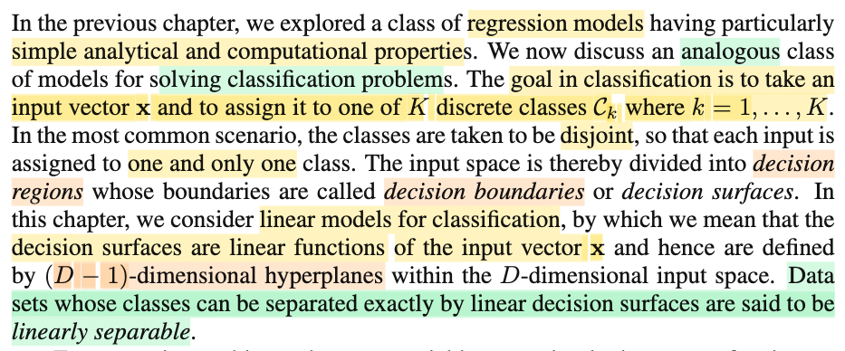

# 4.0 Linear model for Classification

📊 **Progress:** `1` Notes | `1` Screenshots | `1` AI Reviews

---

 

## Linear Models for Classification

<kbd></kbd>

> [!NOTE]
> Gs nói sơ về chương này, ta cũng sẽ nói về linear model nhưng dùng trong bài toán classfication, trong đó, nhiệm vụ là phân loại input vector **x** thành một và chỉ một trong K loại (đây là bối cảnh phổ biến, khi các class disjoint, không chồng lấn nhau).
>
>
>
> Khi đó, với một mô hình, một hàm phân loại như vậy, thì dataset sẽ được chia thành các decision regions có biên gọi là decision boundaries.
>
>
>
> (dừng lại chút xíu, cái này y như trong Statistical Inference, bài toán hypothesis testing, thì một test rule sẽ chia sample space 𝒳 thành Rejection region ℛ = {x ∈ 𝒳: Reject H0} và ℛ\_complement vậy)
>
>
>
> Và trong nội dung chapter này, ta sẽ chỉ dùng các linear function đối với x, khiến cho decision boundary sẽ là phương tuyến tính đối với input x, do đó chúng sẽ làm thành các hyperplane có số chiều bằng số chiều của input space - 1. Và dữ liệu mà có thể chia tách chính xác bởi các linear decision boundary gọi là linearly separable.
>
>
>
> Dừng lại nói thêm tí xíu về ý này, vì sao lại là D-1?
>
>
>
> Hiểu đại khái là: Giả sử ta xét vector **x** thuộc không gian R^2, tức x sẽ là vector có 2 tọa độ \[x1,x2\]T. Nếu giờ ta xét một ràng buộc của x1,x2: ví dụ x1 + x2 = 1, lúc này, với những điểm x thuộc R^2 thỏa ràng buộc này, thì biết x1 sẽ tính được x2, hoặc ngược lại. Có nghĩa là, số chiều không gian của tập hợp này {x ∈ R^2: x1 + x2 = 1} sẽ chỉ còn = 2 - 1 = 1.
>
>
>
> Tương tự, ví dụ có **x** = \[x1,x2,x3\]T ∈ R^3, áp một constraint tuyến tính đối với x1,x2,x3, ví dụ x1 + 3x2 + 2x3 = 5, thì biết x1,x2 ta sẽ biết x3. Khiến tập {x ∈ R^3: x1 + 3x2 + 2x3 = 5} chỉ còn 2 chiều không gian (chính là một mặt phẳng)
>
>
>
> Do đó khái quát lên, với **x** ∈ R^D, thì một decision rule tuyến tính về cơ bản chỉ là áp hàm tuyến tính f(**x**) lên **x** và so với một threshold nào đó để ra quyết định, nên cái decison boundary chỉ là một phương trình tuyến tính của **x**: α1 x1 + ...αD xD = β với αj, β nào đó. Và như vậy thì với constraint này, nếu biết D-1 biến thì sẽ biết biến còn lại. Nên dimension của boudary là D-1.

> [!TIP]
> **🤖 AI Feedback** — ✅ Score: **100/100**
>
> Ghi chú cực kỳ xuất sắc, không chỉ tóm tắt chính xác nội dung từ sách mà còn có liên hệ thực tế sâu sắc với bài toán kiểm định giả thuyết và giải thích trực quan, rõ ràng về mặt hình học tại sao số chiều của hyperplane lại là D-1. Bạn hãy tiếp tục duy trì cách tự học và đào sâu bản chất toán học rất hiệu quả này nhé!

 

