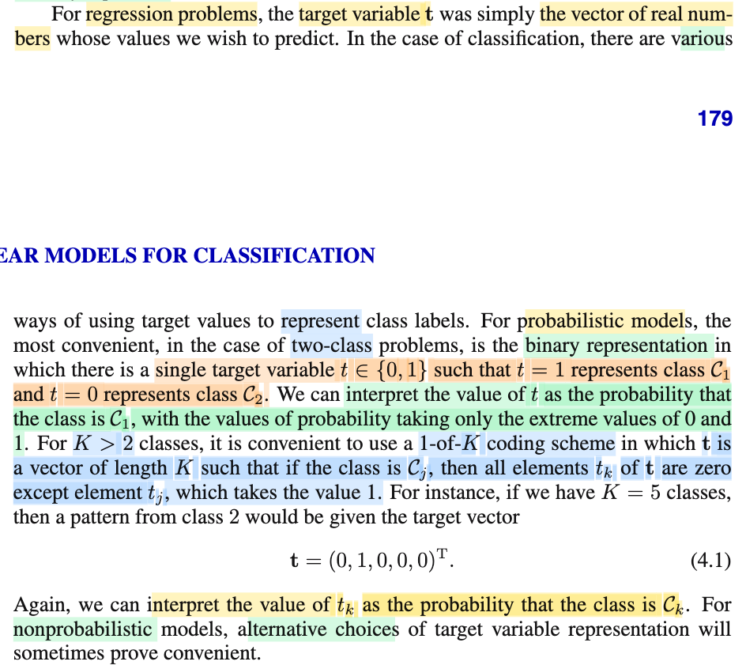
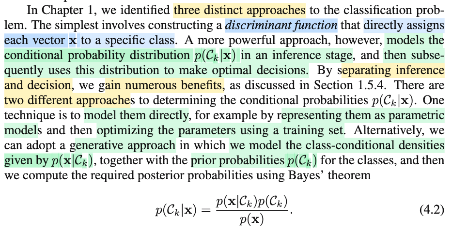
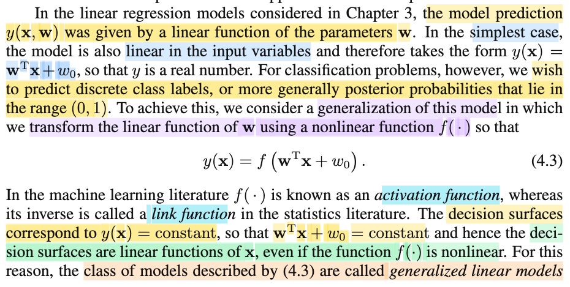
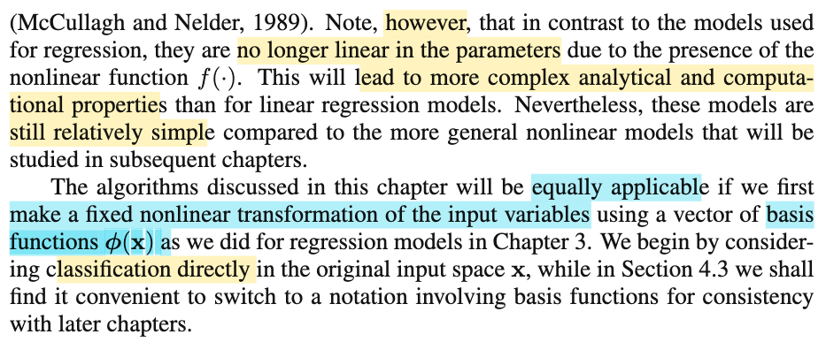

# 4.0 Linear model for Classification

📊 **Progress:** `4` Notes | `5` Screenshots | `3` AI Reviews

---

 

## Linear Models for Classification

<kbd></kbd>

> [!NOTE]
> Gs nói sơ về chương này, ta cũng sẽ nói về linear model nhưng dùng trong bài toán classfication, trong đó, nhiệm vụ là phân loại input vector 𝐱 thành một và chỉ một trong K loại (đây là bối cảnh phổ biến, khi các class disjoint, không chồng lấn nhau).
>
>
>
> Khi đó, với một mô hình, một hàm phân loại như vậy, thì dataset sẽ được chia thành các decision regions có biên gọi là decision boundaries.
>
>
>
> (dừng lại chút xíu, cái này y như trong Statistical Inference, bài toán hypothesis testing, thì một test rule sẽ chia sample space 𝒳 thành Rejection region ℛ = {x ∈ 𝒳: Reject H0} và ℛ\_complement vậy)
>
>
>
> Và trong nội dung chapter này, ta sẽ chỉ dùng các linear function đối với x, khiến cho decision boundary sẽ là phương tuyến tính đối với input x, do đó chúng sẽ làm thành các hyperplane có số chiều bằng số chiều của input space - 1. Và dữ liệu mà có thể chia tách chính xác bởi các linear decision boundary gọi là linearly separable.
>
>
>
> Dừng lại nói thêm tí xíu về ý này, vì sao lại là D-1?
>
>
>
> Hiểu đại khái là: Giả sử ta xét vector 𝐱 thuộc không gian R², tức 𝐱 sẽ là vector có 2 tọa độ \[x1,x2\]ᵀ. Nếu giờ ta xét một ràng buộc của x1,x2: ví dụ x1 + x2 = 1, lúc này, với những điểm 𝐱 thuộc R² thỏa ràng buộc này, thì **biết x1 sẽ tính được x2**, hoặc ngược lại. Có nghĩa là, số chiều không gian của tập hợp này {x ∈ R²: x1 + x2 = 1} sẽ chỉ còn = 2 - 1 = 1.
>
>
>
> Tương tự, ví dụ có 𝐱 = \[x1,x2,x3\]ᵀ ∈ R³, áp một constraint tuyến tính đối với x1,x2,x3, ví dụ x1 + 3x2 + 2x3 = 5, thì **biết x1,x2 ta sẽ biết x3**. Khiến tập {x ∈ R³: x1 + 3x2 + 2x3 = 5} chỉ còn 2 chiều không gian (chính là một mặt phẳng)
>
>
>
> Do đó khái quát lên, với 𝐱 ∈ R^D, thì một decision rule tuyến tính về cơ bản chỉ là áp hàm tuyến tính f(𝐱) lên 𝐱 và so với một threshold nào đó để ra quyết định, nên cái decison boundary chỉ là một **phương trình tuyến tính** của 𝐱: α1 x1 + ...αD xD = β với αj, β nào đó. Và như vậy thì với constraint này, nếu biết D-1 biến thì sẽ biết biến còn lại. Nên dimension của boudary là D-1.

> [!TIP]
> 🤖 **AI Check** — 🟢 Pass — ✅ **100/100** · ✓ Move on
>
> Ghi chú cực kỳ xuất sắc, không chỉ tóm tắt chính xác nội dung từ sách mà còn có liên hệ thực tế sâu sắc với bài toán kiểm định giả thuyết và giải thích trực quan, rõ ràng về mặt hình học tại sao số chiều của hyperplane lại là D-1. Bạn hãy tiếp tục duy trì cách tự học và đào sâu bản chất toán học rất hiệu quả này nhé!

 

### Linear Models for Classification

<kbd></kbd>

> [!NOTE]
> Đây là chỗ gs nói về cách biểu diễn biến mục tiêu. Cái này tuy có vẻ dễ nhưng thật ra cần phải chú ý kĩ.
>
>
>
> Ông nói trong bài toán regression, target variable t chỉ đơn giản được biểu diễn bởi một vector các số thực, chứa giá trị mà ta dự đoán cho input 𝐱. Vì sao lại là vector → vì ý là, bài toán có thể là multiple output nhận x dự đoán ra cùng lúc nhiều thứ, cái này có nói trong chap 3.
>
>
>
> Vậy thì ở bài toán classification, có nhiều cách để biểu diễn target.
>
>
>
> Đơn giản nhất khi chỉ có 2 class cần phân loại. Thì khi đó ta có thể dùng một con số thực t, mang giá trị 0 hoặc 1 để biểu diễn target. Ví dụ, observed data point thuộc class C2, ta biểu diễn điều này bởi t1 = 0, còn observed data point khác thuộc class C1, ta biểu diễn bởi t2 = 1.
>
>
>
> Sau đó có một ý rất hay, khi ông nói rằng, nếu ta dùng mô hình xác suất (vì không phải mô hình nào cũng là mô hình xác xuất) ta có thể xem cái biến t này theo ý nghĩa nó là xác suất của sự kiện "loại của data point là class C1", khi đó t=1 sẽ thể hiện ý: xác suất của event "loại của data point là C1" = 100%.
>
>
>
> Cần nhấn mạnh lần nữa có nghĩa là, data 𝐱1 thuộc loại C1, thì t1 sẽ được biểu diễn bởi giá trị 1, thể hiện ý "xác suất cái data point này thuộc class 1 là 100%"
>
>
>
> còn data point 𝐱2, thuộc loại C2, thì t2 sẽ được biểu diễn bởi giá trị 0, thể hiện "xác suất cái data point này thuộc class C1 là 0%"
>
>
>
> Nên gía trị t của data chỉ là 0 hoặc 1. Nhưng mô hình xác suất dự đoán ra t, tính toán ra giá trị của t, thì nó sẽ là con số từ 0 đến 1. 
>
>
>
> ---
>
>
>
> Còn nếu bài toán có K class, cũng có nhiều cách biểu diễn target, phổ biến nhất là 1-of-K coding scheme, trong đó 𝐭 là vector, ví dụ như data point x1 thuộc class 3 thì 𝐭1 = \[0,0,1,0,0\]ᵀ. Cái này chính là one-hot vector

> [!TIP]
> 🤖 **AI Check** — 🟢 Pass — ✅ **98/100** · ✓ Move on
>
> Ghi chú của bạn cực kỳ xuất sắc và đào sâu bản chất khi phân biệt rõ giá trị thực tế (0, 1) với dự đoán xác suất, đồng thời liên hệ rất tốt với khái niệm 'one-hot vector'. Để hoàn thiện hơn nữa, bạn có thể tự liên hệ thêm cách biểu diễn nhãn trong các mô hình phi xác suất như SVM (thường dùng -1 và 1) để so sánh.

 

#### Hướng tiếp cận phân loại

<kbd></kbd>

> [!NOTE]
> Phần này nói lại về 3 phương hướng để làm mô hình phân loại, đã thảo luận ở chapter 1
>
>
>
> Cách thứ nhất là đi xây dựng một discriminant function, ko phải mô hình xác suất, cơ bản chỉ là nhận input, trả ra loại gì.
>
>
>
> Cách thứ hai là xây dựng mô hình xác suất f(Ck|𝐱) nhưng theo cách thức trực tiếp, 
>
>
>
> Cách thứ ba là cũng tính f(Ck|𝐱) nhưng thông qua Bayes rule = f(𝐱|Ck)f(Ck)/f(𝐱)

 

##### Generalized Linear Models

<kbd></kbd>

<kbd></kbd>

> [!NOTE]
> Rồi, đoạn này đại ý cũng đơn giản thôi, ông nói trong bài toán regression, mô hình sẽ dự đoán ra giá trị t bằng cách dùng hàm y(𝐱, 𝐰) = 𝐰ᵀΦ(𝐱) = w0 + w1 Φ1(𝐱) + ... wM-1 Φ(𝐱). Với Φi là các basis function, nhiệm vụ là nhận vào 𝐱, trả ra một hàm phi tuyến của 𝐱, và nhờ vậy hàm y trở thành phi tuyến đối với 𝐱, nhưng vẫn là hàm tuyến tính đối với tham số 𝐰.
>
>
>
> Và nếu khỏi dùng basis function, hay có thể coi như xài hàm Φ1(𝐱) = x1 (phần tử thứ nhất của vector 𝐱), Φ2(𝐱) = x2,..thì
>
> ta có dạng đơn giản nhất là y = w0 + w1x1 + ...wD xD = 𝐰ᵀ𝐱 + w0 (𝐰 là vector \[w1,...wD\]ᵀ). Lúc này, y là hàm tuyến tính của cả 𝐱 lẫn 𝐰.
>
>
>
> Chú ý, có thể quên nên lú: Khi đã dùng basis function, thì số tham số là tùy (M), và basis funtion sẽ nhận cả vector 𝐱, để trong đó nó chế cháo ra các feature phi tuyến. Còn không dùng basis function thì phải có D tham số (mỗi tham số gắn với một phần tử của 𝐱)
>
>
>
> Vậy thì quay lại bài toán classfication, ông nói, vì ta cần mô hình output ra con số từ 0 tới 1, nên ta sẽ bọc 𝐰ᵀx + w0 trong một hàm phi tuyến có thể output ra 0, 1 (ví dụ sigmoid), nên ta có y(𝐱, 𝐰) = f(𝐰ᵀ𝐱 + w0), hàm này gọi tên trong bối cảnh machine learning là **ACTIVATION FUNCTION**. cái tên quen thuộc đã gặp nhiều trong các lớp như deep learning.
>
>
>
> Và như vậy, dĩ nhiên hàm y **KHÔNG CÒN LÀ HÀM TUYẾN TÍNH THEO** 𝐰 **NỮA**, dẫn đến độ phức tạp cao hơn (dù vẫn chưa là gì so với các mô hình sau này)
>
>
>
> Một điểm nữa là, cái dạng mô hình này có tính chất thế này:
>
>
>
> Như note trước đã nói, cách cách mà ta sẽ dùng để ra quyết định (ràng dự đoán input đầu vào sẽ thuộc class nào) đó là ta sẽ so với một ngưỡng, ví dụ nhận input 𝐱, tính y(𝐱,𝐰), và so với c để ra quyết định: C1 nếu y(𝐱, 𝐰) &gt; c và C2 nếu y(𝐱, 𝐰) &lt; c. Từ đó cái y(𝐱, 𝐰) = c gọi là decision boundary. Thế thì ý chính là:
>
>
>
> Cái chính là, y(𝐱, 𝐰) = f(𝐰ᵀ𝐱 + w0) = constant c là phương trình của decision boundary.
>
>
>
> nhưng f(𝐰ᵀ𝐱 + w0) = constant c cũng sẽ tương đương 𝐰ᵀ𝐱 + w0 = constant d nào đó.
>
>
>
> Và như vậy, phương trình của decision boundary vẫn là một hyperplane, vẫn là một phương trình tuyến tính đối với 𝐱 dù cho y giờ đây là hàm phi tuyến của 𝐱 rồi
>
>
>
> Do được gọi là **GENERALIZED LINEAR MODEL** (ý là, vẫn là hàm tuyến tính, nhưng được biến tấu cho bài toán classification)

> [!TIP]
> 🤖 **AI Check** — 🟢 Pass — ✅ **98/100** · ✓ Move on
>
> Note rất xuất sắc, giải thích cực kỳ cặn kẽ và chính xác bản chất toán học của Generalized Linear Model, đặc biệt là việc làm rõ lý do tại sao decision boundary vẫn là tuyến tính dù có sử dụng hàm kích hoạt phi tuyến. Bạn chỉ cần lưu ý tránh một vài lỗi gõ phím nhỏ (như 'classfication', 'TUYẾNTÍNH') để ghi chú thêm phần hoàn hảo.

**🔗 See also:** [Thuật toán Perceptron](./417_perceptron.md#node-i051b0o)

 

