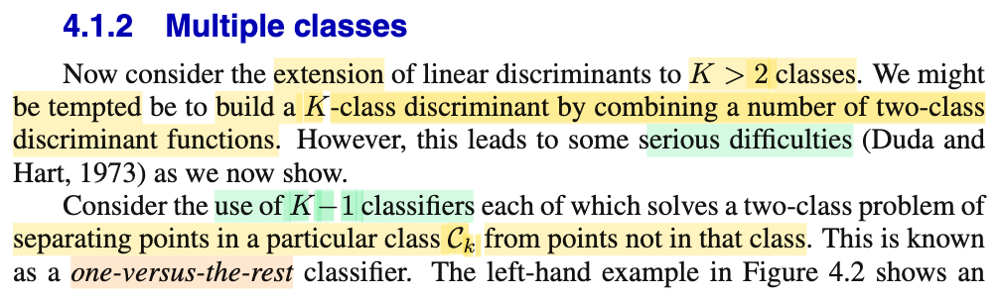
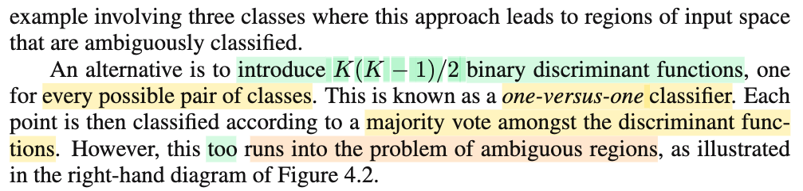
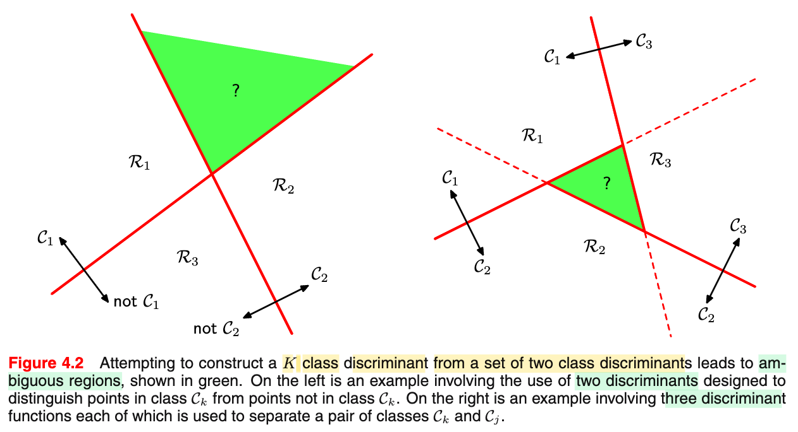
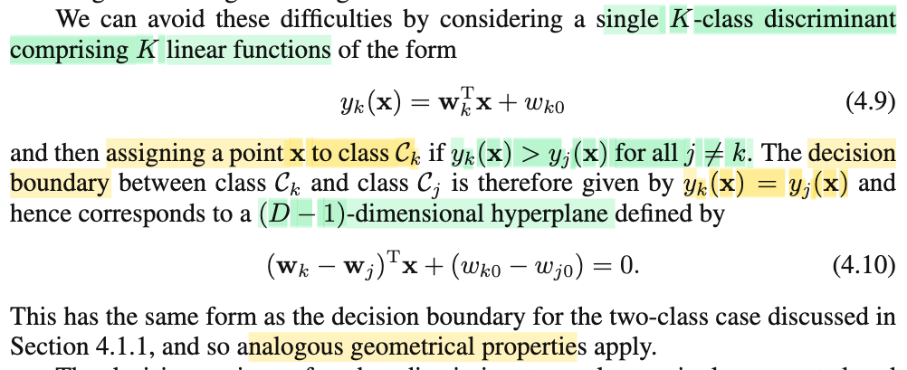
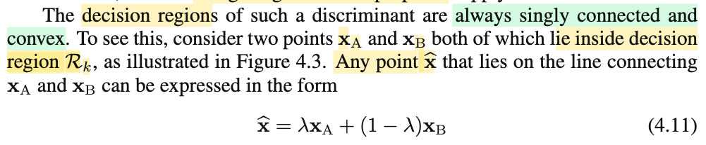
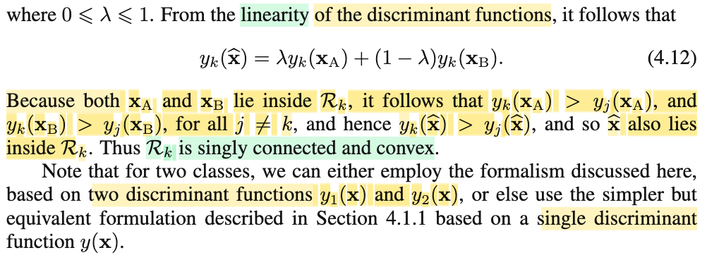
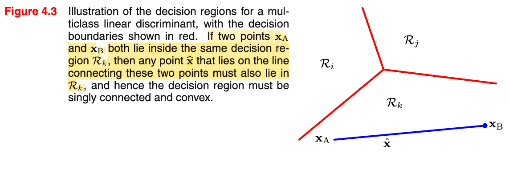

# 4.1.2 Multiple Class

📊 **Progress:** `3` Notes | `7` Screenshots | `2` AI Reviews

---

<kbd></kbd>

<kbd></kbd>

<kbd></kbd>

> [!NOTE]
> Phần này đề cập đến bài toán phân loại nhiều lớp (multiclass classification), tức là bài toán phân loại có nhiều hơn hai lớp dữ liệu. Ban đầu, chúng ta thường có xu hướng kết hợp các hàm phân biệt (discriminant function) nhị phân, vốn dùng để phân loại hai lớp, để giải quyết bài toán phân loại đa lớp.
>
>
>
> Tuy nhiên, cách tiếp cận này bộc lộ nhiều hạn chế. Cách thứ nhất là đối với bài toán gồm K lớp, ta có thể sử dụng K - 1 hàm phân biệt nhị phân theo hướng một chọi "số còn lại". Chẳng hạn, với bài toán ba lớp, ta sử dụng hai bộ phân loại nhị phân (binary discriminant function) để lần lượt xác định xem một điểm dữ liệu có thuộc lớp thứ nhất hay không, và có thuộc lớp thứ hai hay không. Nếu một điểm dữ liệu không thuộc lớp thứ nhất cũng không thuộc lớp thứ hai, ta sẽ gán nó vào lớp thứ ba.
>
>
>
> Tuy nhiên, như minh họa ở hình 4.2, ranh giới quyết định (decision boundary) của hàm phân biệt là tuyến tính, do đó hai bộ phân loại này sẽ chia không gian thành bốn vùng. Trong đó, xuất hiện một vùng không thể xác định được class cho dữ liệu. Cụ thể, nếu xét theo ranh giới phân loại của lớp C1, vùng màu xanh sẽ được xếp vào C1; nhưng nếu xét theo ranh giới của lớp C2, vùng màu xanh đó cũng được xếp vào C2. Hệ quả là chúng ta không thể xác định được điểm dữ liệu rơi vào vùng này thuộc về lớp nào.
>
>
>
> Cách thứ hai là sử dụng K(K - 1)/2 hàm phân biệt nhị phân để phân loại theo từng cặp lớp một chọi một (one-versus-one). Cách tiếp cận này khác với phương pháp K - 1 bộ phân loại ở trên, vốn chỉ xác định dữ liệu thuộc về một lớp hay không thuộc lớp đó. Ở phương pháp thứ hai, mỗi bộ phân loại nhị phân sẽ trực tiếp so sánh giữa một cặp lớp cụ thể, chẳng hạn giữa C1 và C2, giữa C1 và C3, hoặc giữa C2 và C3. Với bài toán có K = 3 lớp, số lượng hàm phân biệt nhị phân giữa các cặp lớp sẽ là 3 x 2 / 2 = 3. Khi số lượng lớp K tăng lên, số lượng bộ phân loại sẽ gia tăng rất nhanh.
>
>
>
> Tuy nhiên, cách làm này cũng gặp phải hạn chế tương tự vì tạo ra vùng không gian không thể phân định. Điển hình như vùng màu xanh ở hình minh họa bên phải: khi xét giữa C1 và C2 thì vùng này được gán về C2; khi xét giữa C2 và C3 thì lại thuộc về C3; nhưng khi xét giữa C1 và C3 thì lại thuộc về C1. Do xảy ra mâu thuẫn giữa các bộ phân loại cặp, chúng ta không thể xác định điểm dữ liệu cần được gán vào lớp nào. Tóm lại, cả hai phương pháp kết hợp các hàm phân biệt nhị phân nhằm giải quyết bài toán nhiều lớp đều bộc lộ những khiếm khuyết nghiêm trọng.

> [!TIP]
> **🤖 AI Feedback** — ✅ Score: **96/100**
>
> Ghi chú rất xuất sắc, giải thích chi tiết, chính xác bản chất và nguyên nhân tạo ra vùng nhập nhằng (ambiguous regions) ở cả hai phương pháp. Bạn có thể bổ sung rõ hơn thuật ngữ 'bầu chọn theo đa số' (majority vote) ở phương pháp one-versus-one để lập luận về sự bế tắc khi xảy ra mâu thuẫn phiếu bầu được chặt chẽ hơn.

 

## K-Class Linear Discriminant Functions

<kbd></kbd>

> [!NOTE]
> Rồi đoạn này đại khái là nói một cách làm khắc phục được vấn đề của cách làm vừa rồi như sau: Dùng K linear function có dạng yk(**x**) = **w**kT**x** + wk0. Tức là, ta sẽ dùng một vector to vector function: nhận vào **x**, tính ra vector \[y1(**x**),....yK(**x**)\]T
>
>
>
> Sau đó, ta mới đưa ra quyết định phân loại bằng cách xem trong K giá trị y1,...yK. Thì chỉ số nào là lớn nhất. Ví dụ y2 lớn nhất đám, thì classify là class 2.
>
>
>
> Và như vậy, decision boundary giữa class Ck và Cj sẽ là nơi mà yk(**x**) = yj(**x**). Tức là tập {x ∈ R^D: yk(**x**) = yj(**x**)}, và cái này sẽ define ra một D-1 hyperplane (vì sao là D-1 thì xem link, note trước đã giải thích).
>
>
>
> Và  yk(**x**) = yj(**x**) ⇔ **w**kT**x** + wk0 = **w**jT**x** + wj0
>
>
>
> ⇔ **w**kT**x** - **w**jT**x** + wk0 - wj0 = 0
>
>
>
> ⇔ (**w**k - **w**j)T**x** + wk0 - wj0 = 0
>
>
>
> Hyperplane này có normal vector là **w**k - **w**j

**🔗 See also:** [Section 4.1 Discriminant Functions](./411_discriminant_functions.md#node-fjps9mx)

 

### Convexity of Decision Regions

<kbd></kbd>

<kbd></kbd>

<kbd></kbd>

> [!NOTE]
> Tiếp đoạn này nói rằng decision region của discriminant dạng này sẽ có tính chất singly connected và lồi (convex).
>
>
>
> Đầu tiên mình nhớ định nghĩa của tập lồi (convex set) (được biết khi học bên Convex Optimizatin) đó là tập mà mọi tổ hợp lồi của một tập điểm bất kì trong tập, sẽ đều thuộc tập đó. Ví dụ, lấy hai điểm bất kì trong Rk, và tổ hợp lồi chúng (tức tạo convex combination - là linear combination với hệ số không âm và có tổng bằng 1) thì cũng ra kết quả là một điểm trong Rk.
>
>
>
> Vậy để chứng minh Rk convex, người ta lấy **x**A, **x**B ∈ Rk. Và xét **x**^ = λ**x**A + (1-λ)**x**B ∀ 0 ≤ λ ≤ 1 (đây chính là tổ hợp lồi - vì hai hệ số λ và 1-λ sẽ không âm (do 0 ≤ λ ≤ 1) và có tổng bằng 1). Dễ thấy với λ chạy từ 0 tới 1, **x**^ sẽ chạy từ **x**B tới **x**A, nên tập {**x**^ = λ**x**A + (1-λ)**x**B ∀ 0 ≤ λ ≤ 1} chính là đoạn thẳng nối **x**A, **x**B. Và ta sẽ chứng minh x^ luôn thuộc Rk. Để từ đó kết luận với mọi **x**A, **x**B ∈ Rk thì mọi tổ hợp lồi của chúng cũng thuộc Rk, suy ra Rk là tập lồi.
>
>
>
> Chứng minh cũng dễ:
>
>
>
> vì **x**A, **x**B ∈ Rk nên đương nhiên trong các y1(**x**A),..yk(**x**A),.yK(**x**A) thì yk(**x**A) sẽ luôn lớn hơn hoặc bằng mấy thằng khác nhất, nên yk(**x**A) ≥ yj(**x**A) ∀j=1,2...K
>
>
>
> Tương tự yk(**x**B) ≥ yj(**x**B) ∀j=1,2...K
>
>
>
> Tiếp từ việc **x**^ = λ**x**A + (1-λ)**x**B
>
>
>
> ⇒ yk(**x^**) = **w**kT**x^** + wk0 = **w**kT(λ**x**A + (1-λ)**x**B ) + wk0
>
>
>
> = **w**kTλ**x**A + **w**kT(1-λ)**x**B + wk0
>
>
>
> = λ**w**kT**x**A + (1-λ)**w**kT**x**B + wk0
>
>
>
> = λ**w**kT**x**A + λwk0 + (1-λ)**w**kT**x**B + (1-λ)wk0 (tách wk0 thành λwk0 + (1-λ)wk0)
>
>
>
> = λ(**w**kT**x**A + wk0) + (1-λ)(**w**kT**x**B + wk0)
>
>
>
> = λyk(**x**A) + (1-λ)yk(**x**B)
>
>
>
> Dùng yk(**x**A) ≥ yj(**x**A) ∀j=1,2...K và yk(**x**B) ≥ yj(**x**B) ∀j=1,2...K
>
>
>
> ta suy ra yk(**x^**) = λyk(**x**A) + (1-λ)yk(x**B**) ≥ λyj(**x**A) + (1-λ)yj(**x**B)
>
>
>
> và tương tự như yk(**x^**) = λyk(**x**A) + (1-λ)yk(**x**B) thì λyj(**x**A) + (1-λ)yj(**x**B) chính là yj(**x**^)
>
>
>
> Vậy yk(**x^**) ≥ yj(**x**^) ∀**x**^ suy ra **x**^ ∈ Rk.
>
>
>
> Vậy với kết quả này ta suy ra tập Rk lồi như đã nói.
>
>
>
> Còn vì sao gọi là singly connect, thì đại khái là khi không có chuyện giữa hai điểm **x**A, **x**B ∈ Rk lại có điểm nào đó trên đoạn thằng **x**A, **x**B không thuộc Rk. Và tính convex đã bao hàm tính chất này, vì ta vừa chứng minh luôn rằng, với mọi **x**^ giữa **x**A, **x**B thì nó đều thuộc Rk.

> [!TIP]
> **🤖 AI Feedback** — ✅ Score: **98/100**
>
> Ghi chú rất xuất sắc, bạn đã diễn giải và biến đổi đại số chứng minh tính lồi của vùng quyết định một cách cực kỳ chi tiết, chặt chẽ. Điểm cần lưu ý nhỏ là trong sách dùng bất đẳng thức ngặt (>) cho bên trong miền, và khái niệm 'singly connected' (đơn liên) thường ngụ ý miền liên thông không có lỗ hổng, tính lồi tự động thỏa mãn điều này.

 

