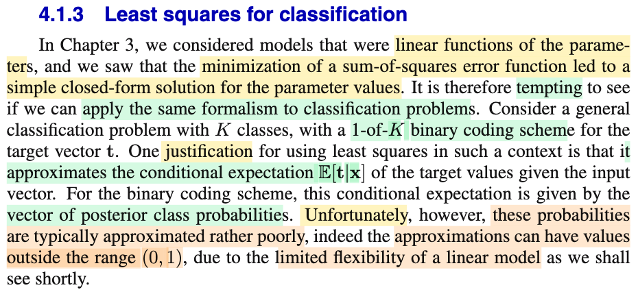
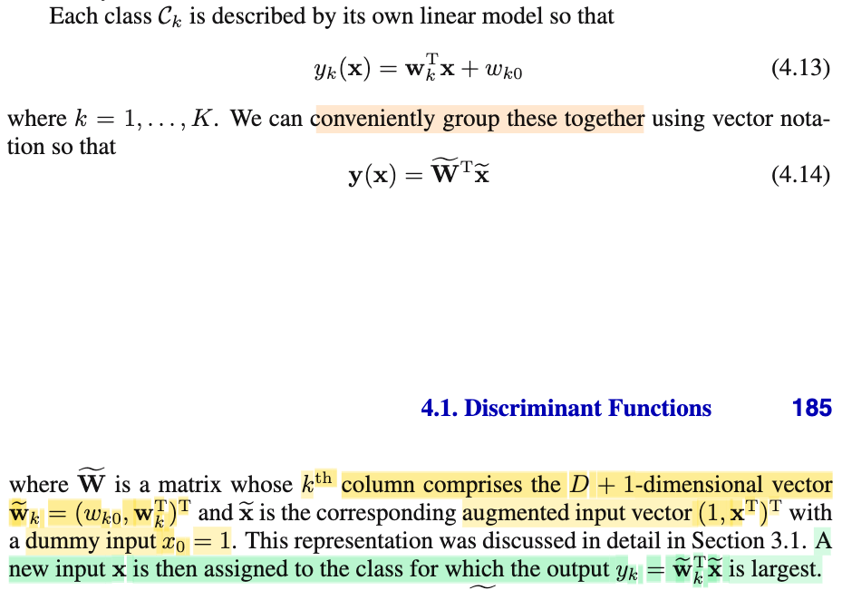
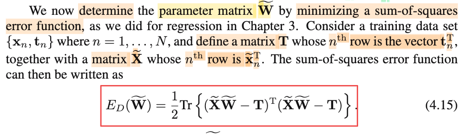
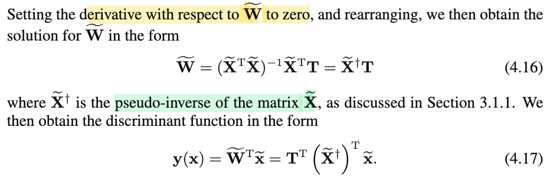
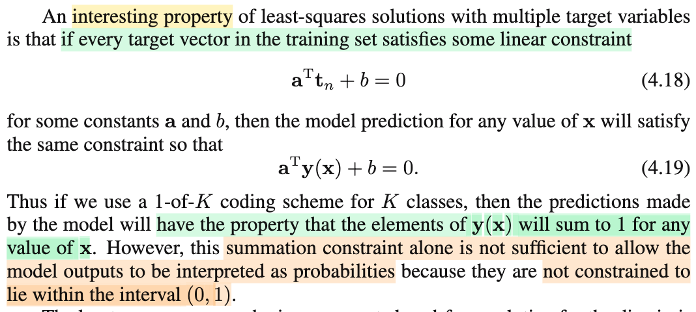
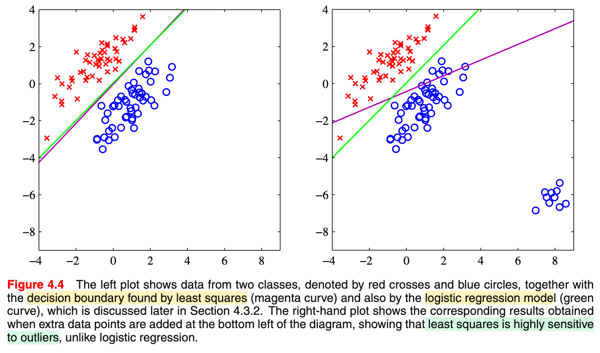
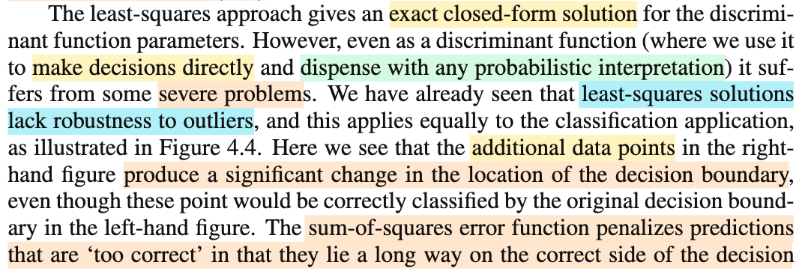
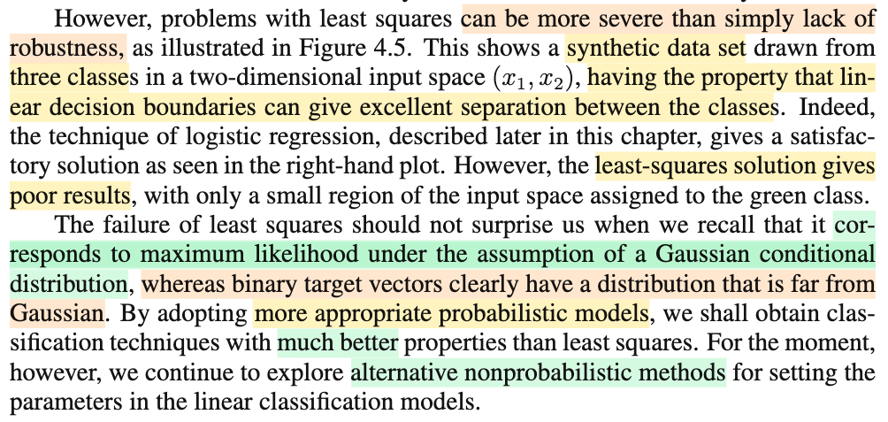
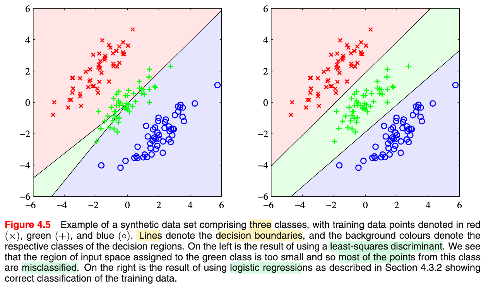

# 4.1.3 Least squares for classification

📊 **Progress:** `7` Notes | `9` Screenshots | `7` AI Reviews

---

 

## Least Squares for Classification

<kbd></kbd>

> [!NOTE]
> Quan phần này ta sẽ học về cách train ra giá trị của parameter của discriminant function.
>
>
>
> Đầu tiên đại ý gs nói trong chương 3, bài toán linear regression, ta đã thấy cách làm trong đó ta đi minimize least squares error function đã dẫn đến một closed-formed solution của tham số 𝐰, nên có lẽ mình cũng muốn tiếp cận kiểu này với bài toán classification.
>
>
>
> Thì đại ý là, trong bài toán regression, mình dùng hàm y(𝐰,𝐱) để dự đoán target value, với giả định T|𝐱 \~ 𝒩(y(𝐱,𝐰), 1/β). Và điều này đồng nghĩa ta đang dùng y(𝐰,𝐱) để estimate cho E\[T|𝐱\], vì với phân phối normal, mean của nó chính là location.
>
> \
> Thì với classification, ta cũng muốn dự đoán E\[𝐓|𝐱\], với 𝐓 theo phân phối theo kiểu 1-of-K binary coding scheme: Tức là random variable 𝐓 có K possible discrete value \[1,0,..0\]ᵀ, \[0,1,...0\]ᵀ, ..., \[0,0,...,1\]ᵀ ứng với class 𝒞1,𝒞2,...𝒞K. Điều này cũng đồng nghĩa các random variable T1,...TK của random variable vector 𝐓, sẽ đều là random variable với chỉ 2 possible value: 0 hoặc 1. Và dễ thấy, điều này có nghĩa là: T1,..TK đều là các Bernouli random variable (Stat110 đã học: Bất cứ khi nào random variable chỉ có 2 possible value thì nó \~ Bernouli)
>
>
>
> Và ta dự đoán bằng y(𝐰,𝐱) là hàm vector \[y1(𝐱), y2(𝐱),...yK(𝐱)\] = \[𝐰1T𝐱 + w10, 𝐰2T𝐱 + w20, ..., 𝐰Kᵀ𝐱 + wK0\] (xem link bài trước) 
>
>
>
> Và như vậy E\[𝐓|𝐱\] là gì? 
>
>
>
> Kì vọng của random vector là vector các kì vọng từng random variable phần tử thôi, và conditional expected value thì cũng vậy.
>
> \
> E\[𝐓|𝐱\] = \[E(T1|𝐱), E(T2|𝐱),...,E(TK|𝐱)\]ᵀ
>
>
>
> Với công thức expected value đã học trong Stat110: là weighted average của possible value với coefficient là pmf, và Ti \~ Bernouily, chỉ có hai possible value 0,1, ta có 
>
>
>
> E\[T1|𝐱\] = 0 × P(T1=0|𝐱) + 1 × P(T1=1|𝐱) = P(T1=1|𝐱)
>
>
>
> Mà T1=1, thì cũng chính là 𝐓 = \[1,0,...0\]ᵀ, và cũng chính là đại diện cho "Class 𝒞1"
>
>
>
> Nên E\[T1|𝐱\] = P(T1=1|𝐱) = P(𝐓 = \[1,0,...0\]ᵀ|𝐱) = P(𝒞1|𝐱), và đây chính là posterior probability của f(𝒞|𝐱) evaluate tại 𝒞 = 𝒞1, tức xác suất random variable (class 𝒞) mang giá trị 𝒞1 dựa trên giá trị input 𝐱. 
>
>
>
> (tức là ta coi 𝒞 là random variable có các possible value 𝒞1, 𝒞2,...𝒞K, thì f(𝒞|𝐱) đương nhiên là posterior distribution. prior distribution là f(𝒞), dùng Bayes rule: f(𝒞|𝐱) = f(𝐱|𝒞)f(𝒞)/f(𝐱)
>
>
>
> Tương tự E\[Ti|𝐱\] = P(𝒞i|𝐱)
>
>
>
> Vậy E\[𝐓|𝐱\] = \[P(T1=1|𝐱), P(T2=1|𝐱),...,P(TK=1|𝐱)\]ᵀ
>
>
>
> = \[f(𝒞1|𝐱), f(𝒞2|𝐱),...,f(𝒞K|𝐱)\]ᵀ
>
>
>
> Đây là ý gs Bishop nói câu "For the binary coding scheme, this conditional expectation is given by the vector of posterior class probabilities"
>
>
>
> ---
>
>
>
> Và vấn đề phát sinh như sau:
>
>
>
> Với regression, việc ta muốn dùng hàm tuyến tính y(𝐰,𝐱) = 𝐰ᵀΦ(𝐱) để approximate (estimate) cho E\[T|𝐱\] không vấn đề gì, vì do T là continous random variable có giá trị có thể lớn bé tùy ý nên nó không ràng buộc gì, không mâu thuẫn gì với range của 𝐰ᵀΦ(𝐱), là hàm tuyến tính, cũng có thể lớn bé tùy ý.
>
>
>
> Nhưng với cái hoàn cảnh của ta trong classification: Nếu ta dùng linear function y(𝐰,𝐱), là vector \[y(𝐰1,𝐱), y(𝐰2,𝐱),....y(𝐰K,𝐱) để dự đoán E\[𝐓|𝐱\], ...
>
>
>
> cũng đồng nghĩa là: 
>
>
>
> lấy y(𝐰1,𝐱) = w10 + w11x1 + w12x2 + ..w1DxD, để dự đoán E\[T1|𝐱\] = f(𝒞1|𝐱) 
>
>
>
> lấy y(𝐰2,𝐱) = w20 + w21x1 + w22x2 + ..w2DxD, để dự đoán E\[T2|𝐱\] = f(𝒞2|𝐱)
>
>
>
> ..
>
>
>
> Thì ta thấy vấn đề ngay: Đó là f(𝒞1|𝐱), f(𝒞2|𝐱),..đều phải là giá trị xác suất, nên phải i) Không âm ii) Bé hơn hoặc bằng 1. iii) Tổng phải bằng 1.
>
>
>
> Trong khi đó các hàm tuyến tính y(𝐰1,𝐱), y(𝐰2,𝐱)...thì lại có range lớn bé tùy ý.
>
>
>
> Đây chính là lí do ông Bishop nói : "Thật không may, các giá trị xác suất này về cơ bản là được ước lượng rất tệ vì nó có thể ra giá trị ngoài range (0,1), và lí do bắt nguồn từ hạn chế về độ flexible của hàm tuyến tính."

> [!TIP]
> **🤖 AI Feedback** — ✅ Score: **98/100**
>
> Ghi chú rất xuất sắc, giải thích cặn kẽ và chính xác bản chất toán học của kỳ vọng có điều kiện và lý do mô hình tuyến tính thất bại khi xấp xỉ xác suất. Bạn chỉ cần chú ý ký hiệu xác suất để tránh nhầm lẫn giữa hàm mật độ xác suất và xác suất rời rạc.

**🔗 See also:** [K-Class Linear Discriminant Functions](./412_multiple_class.md#node-yhoheyw)

 

### Multi-Class Linear Discriminant Functions

<kbd></kbd>

> [!NOTE]
> Rồi, như vừa nói ở note trước, ta sẽ dùng yk(𝐱) = 𝐰kᵀ𝐱 + wk0 để dự đoán f(𝒞k|𝐱), k=1,2...K
>
>
>
> Thì ở đây, ta thể hiện vector y(𝐱) = \[y1(𝐱), y2(𝐱),..yK(𝐱)\]ᵀ theo cách gọn hơn (gọi là vectorization) như sau:
>
>
>
> Đầu tiên, nhớ lại cái vụ nếu ta đặt vector 𝐰̃ = (w0, w1,...w), và 𝐱̃ = (1, x1,x2,..) thì w0 + w1x1 + w2x2.. chính là 𝐰̃ᵀ𝐱̃.
>
>
>
> Nên ở đây cũng là vậy, đặt 𝐱̃ = (1, x1,x2,..), 𝐰̃k = (wk0, wk1,...) thì yk(𝐱) chính là 𝐰̃kᵀ𝐱̃.
>
>
>
> Rồi đặt matrix 𝐖̃ (**W tilde**) là matrix có các cột là các vector 𝐰̃k, thì 𝐖̃ᵀ chính là matrix có các hàng là 𝐰̃kᵀ. 
>
>
>
> Do đó cho nên 𝐖̃ᵀ𝐱̃ sẽ chính là vector y(𝐱) = \[y1(𝐱), y2(𝐱),..yK(𝐱)\]ᵀ
>
>
>
> Và như đã biết ở phần 4.1.2, cách làm của mô hình dự đoán sẽ là tính ra y(𝐱) và xem chỉ số k nào trong các số từ 1, 2, ..K là ứng với phần tử lớn nhất, thì assign class 𝒞k cho input

> [!TIP]
> **🤖 AI Feedback** — ✅ Score: **95/100**
>
> Ghi chú giải thích rất trực quan, chính xác về cơ chế ghép vector (vectorization) và quy tắc ra quyết định theo đúng nội dung sách. Tuy nhiên, cần lưu ý không nên ký hiệu thành f(Ck|x) vì hàm phân biệt tuyến tính ở đây chỉ trả về giá trị discriminant trực tiếp chứ chưa phải xác suất hay hàm mật độ điều kiện.

 

#### Sum-of-Squares Error Matrix Form

<kbd></kbd>

> [!NOTE]
> Rồi, như đã nói, ta sẽ đi định ra, tìm ra giá trị của matrix tham số 𝐖̃ theo cách làm là đi minimize hàm sum of squares error (còn gọi là cách làm least square). Thì đầu tiên cần define thêm hai matrix: 𝐓 và 𝐗̃ (𝐗 tilde):
>
>
>
> Chỗ này cần để ý, trong bài toán regression, ta có bộ data là các cặp (vector 𝐱1, giá trị target t1), (𝐱2, t2)...(𝐱N, tN). Để rồi ta gom các vector 𝐱 lại thành matrix 𝐗 (và trong phần lớn thời gian, ta đều lờ nó đi, vì chỉ coi t là random variable, nhớ không) và gom các scalar t thành **VECTOR** 𝐭 = (t1,...tN).
>
>
>
> Nhưng ở đây, data set là các cặp (vector 𝐱1, VECTOR target 𝐭1), (𝐱2, 𝐭2),....Với 𝐭1, 𝐭2,... là vector one-hot vector, ví dụ 𝐭1 = (0,1,0,...0)ᵀ nếu như giá trị quan sát được của loại của 𝐱1 là class 𝒞2. Và vì vậy, ta gom các vector 𝐭1,𝐭2...𝐭N lại thành MATRIX 𝐓 có các hàng là 𝐭1ᵀ, 𝐭2ᵀ,...
>
>
>
> Còn với các input 𝐱 thì cũng gom thành matrix 𝐗 như cũ, nhưng vì nay các 𝐱̃i có thêm số 1 ở đầu (tức là 𝐱1 = \[x11,x12,...\]ᵀ thì 𝐱̃i = \[1, x11, x12,...\]ᵀ, nên có các hàng là 𝐱̃1ᵀ, 𝐱̃2ᵀ... nên ta gọi là 𝐗̃ (𝐗 tilde). 
>
>
>
> ---
>
>
>
> Vậy thì vì sao sum of squares error của bài toán này lại là công thức 4.15?
>
>
>
> Là như sau:
>
>
>
> Error là khác biệt giữa dự đoán và thực tế, ví dụ input 𝐱1, dự đoán là vector y(𝐱1) = 𝐖̃ᵀ𝐱̃1,
>
>
>
> Còn thực tế là vector 𝐭1. Nên error 1 là vector 𝐞1 = 𝐖̃ᵀ𝐱̃1 - 𝐭1.
>
>
>
> Tương tự error 2 là vector 𝐞2 = 𝐖̃ᵀ𝐱̃2 - 𝐭2,..
>
>
>
> Vậy 𝐞1ᵀ𝐞1 sẽ là là tổng bình phương các phần tử của 𝐞1, tương tự 𝐞2ᵀ𝐞2 là tổng bình phương các phần tử của 𝐞2,...
>
>
>
> Giờ có 𝐞1 = 𝐖̃ᵀ𝐱̃1 - 𝐭1, 𝐞2 = 𝐖̃ᵀ𝐱̃2 - 𝐭2,...(1)
>
>
>
> ⇒ 𝐞1ᵀ = 𝐱̃1ᵀ𝐖̃ - 𝐭1ᵀ, 𝐞2ᵀ = 𝐱̃2ᵀ𝐖̃ - 𝐭2ᵀ
>
>
>
> Đặt 𝐞1ᵀ, 𝐞2ᵀ...thành cách hàng của matrix 𝐄
>
>
>
> Và đặt 𝐱̃1ᵀ𝐖̃, 𝐱̃2ᵀ𝐖̃,...vào thành các hàng của matrix 𝐔
>
>
>
> và 𝐭1ᵀ, 𝐭2ᵀ,...thành các hàng của matrix 𝐕
>
>
>
> thì dễ thấy (1) tương đương 𝐄 = 𝐔 - 𝐕 (vì trừ hai matrix thì các hàng tương ứng trừ nhau)
>
>
>
> Tuy nhiên nhìn lại thì thấy 𝐔, có các hàng là 𝐱̃1ᵀ𝐖̃, 𝐱̃2ᵀ𝐖̃,...Và điều này đồng nghĩa hàng 1 của U là linear combination các hàng của 𝐖̃ bởi hệ số là 𝐱̃1ᵀ, hàng 2 của U là linear combination các hàng của 𝐖̃ bởi hệ số là 𝐱̃2ᵀ...
>
>
>
> Tới đây ta nhớ lại ở MIT 18.06, góc nhìn thứ hai khi nhân hai matrix AB = C nói rằng hàng i của C là linear combination các hàng của B bởi hệ số là hàng i của A. Nhờ góc nhìn này, ta thấy 𝐔 chính là 𝐗̃𝐖̃,
>
>
>
> Còn 𝐕 dễ thấy chính là 𝐓 ở trên
>
>
>
> Do đó 𝐄 = 𝐗̃𝐖̃ - 𝐓
>
>
>
> ---
>
>
>
> Bên cạnh đó: **EE**ᵀ sẽ là matrix có đường chéo tạo bởi dot product của hàng j của 𝐄 (chính là 𝐞1ᵀ, 𝐞2ᵀ...) và cột j của là 𝐄ᵀ (chính là 𝐞1, 𝐞2,...) ⇒ đường chéo của **EE**ᵀ là 𝐞1ᵀ𝐞1, 𝐞2ᵀ𝐞2,...
>
>
>
> Và lấy trace, ta có tổng đường chéo 𝐞1ᵀ𝐞1 + 𝐞2ᵀ𝐞2,... cũng chính là tổng bình phương các phần tử của 𝐞1,...𝐞N. Đây chính là sum of squares error. \
> \
> Do đó E_D(𝐖̃) = (1/2) trace(**EE**ᵀ)
>
>
>
> Nhưng trace lại có tính xoay vòng, tr(AB) = tr(BA), nên trace(**EE**ᵀ) = trace(𝐄ᵀ𝐄)
>
>
>
> Vậy E_D(𝐖̃) = (1/2) trace(𝐄ᵀ𝐄) =(1/2) trace((𝐗̃𝐖̃-𝐓)ᵀ(𝐗̃𝐖̃-𝐓))

> [!TIP]
> **🤖 AI Feedback** — ✅ Score: **98/100**
>
> Ghi chú giải thích rất cặn kẽ, chính xác bản chất đại số tuyến tính từ góc nhìn phép nhân ma trận đến tính chất của hàm Trace. Bạn chỉ cần chú ý đồng nhất ký hiệu dấu ngã trên ma trận thiết kế ($\widetilde{\mathbf{X}}$) để tránh nhầm lẫn với ma trận không có bias.

 

##### Least Squares Discriminant Function

<kbd></kbd>

> [!NOTE]
> Rồi, khi đã hiểu sum of squares error function E_D(𝐖̃) = (1/2) trace(𝐄ᵀ𝐄) = (1/2) trace((𝐗̃𝐖̃-𝐓)ᵀ(𝐗̃𝐖̃-𝐓)), để đi (tìm 𝐖̃) giúp minimize cái này. Ta dùng các định lý của toán tối ưu thôi: Đầu tiên là định lý điều kiện cần bậc nhất: đạo hàm theo 𝐖̃ tại minimizer phải = 0.
>
>
>
> Vậy cần tính d/d𝐖̃ E_D(𝐖̃)
>
>
>
> đây là hàm matrix → scalar, đạo hàm của nó đối với 𝐖̃ sẽ là matrix các partial derivative.
>
>
>
> Dùng cách làm đã học trong MIT 18s096, tìm d/d𝐖̃ E_D(𝐖̃):
>
>
>
> = d/d𝐖̃ \[(1/2) trace((𝐗̃𝐖̃-𝐓)ᵀ(𝐗̃𝐖̃-𝐓))\]
>
>
>
> Mở cái tích ra trước:
>
>
>
> (𝐗̃𝐖̃-𝐓)ᵀ(𝐗̃𝐖̃-𝐓) = (𝐖̃ᵀ𝐗̃ᵀ-𝐓ᵀ)(𝐗̃𝐖̃-𝐓) = 𝐖̃ᵀ𝐗̃ᵀ𝐗̃𝐖̃ - 𝐓ᵀ𝐗̃𝐖̃ - 𝐖̃ᵀ𝐗̃ᵀ𝐓+𝐓ᵀ𝐓
>
>
>
> = 𝐖̃ᵀ𝐗̃ᵀ𝐗̃𝐖̃ - 𝐓ᵀ𝐗̃𝐖̃ - 𝐖̃ᵀ𝐗̃ᵀ𝐓 + 𝐓ᵀ𝐓
>
>
>
> ⇒ trace((𝐗̃𝐖̃-𝐓)ᵀ(𝐗̃𝐖̃-𝐓)), do tính tuýến tính của trace, nên:
>
>
>
> = tr(𝐖̃ᵀ𝐗̃ᵀ𝐗̃𝐖̃) - tr(𝐓ᵀ𝐗̃𝐖̃) - tr(𝐖̃ᵀ𝐗̃ᵀ𝐓) + tr(𝐓ᵀ𝐓)
>
>
>
> = tr(𝐖̃ᵀ𝐗̃ᵀ𝐗̃𝐖̃) - tr(𝐓ᵀ𝐗̃𝐖̃) - tr(𝐓ᵀ𝐗̃𝐖̃) + tr(𝐓ᵀ𝐓) (dùng tính chất tr(𝐀) = tr(𝐀ᵀ))
>
>
>
> = tr(𝐖̃ᵀ𝐗̃ᵀ𝐗𝐖̃) - 2tr(𝐓ᵀ𝐗̃𝐖̃) + tr(𝐓ᵀ𝐓)
>
>
>
> ⇒ d/d𝐖̃ \[(1/2) trace((𝐗̃𝐖̃-𝐓)ᵀ(𝐗̃𝐖̃-𝐓))\]
>
>
>
> = (1/2) { d/d𝐖̃ tr(𝐖̃ᵀ𝐗̃ᵀ𝐗̃𝐖̃) - 2 d/d𝐖̃ tr(𝐓ᵀ𝐗̃𝐖̃) + d/d𝐖̃ tr(𝐓ᵀ𝐓) }
>
>
>
> = (1/2) { d/d𝐖̃ tr(𝐖̃ᵀ𝐗̃ᵀ𝐗̃𝐖̃) - 2 d/d𝐖̃ tr(𝐓ᵀ𝐗̃𝐖̃) + 0 }
>
>
>
> Dùng công thức trong Appendix (xem link, trong note đó mình đã tự chứng minh):
>
>
>
> ∂/∂𝐀 tr(**ABA**ᵀ) = 𝐀(𝐁ᵀ+𝐁)
>
>
>
> thì bằng cách chứng minh tương tự ta cũng có thể có:
>
>
>
> ∂/∂𝐀 tr(𝐀ᵀ**BA**) = (𝐁ᵀ+𝐁)𝐀
>
>
>
> Để áp dụng vào đây d/d𝐖̃ tr(𝐖̃ᵀ𝐗̃ᵀ𝐗̃𝐖̃) = \[(𝐗̃ᵀ𝐗̃)ᵀ + 𝐗̃ᵀ𝐗̃\]𝐖̃, mà vì 𝐗̃ᵀ𝐗̃ đối xứng nên kết quả là 2𝐗̃ᵀ𝐗̃𝐖̃
>
>
>
> Cùng trong appendix ta cũng đã gặp công thức
>
>
>
> ∂/∂𝐀 tr(**AB**) = 𝐁ᵀ (xem link)
>
>
>
> Áp dụng vào đây ta có:
>
>
>
> 2 d/d𝐖̃ tr(𝐓ᵀ𝐗𝐖̃) = 2 d/d𝐖̃ tr(𝐖̃𝐓ᵀ𝐗̃) (tính xoay vòng của trace)
>
>
>
> = 2(𝐓ᵀ𝐗̃)ᵀ = 2𝐗̃ᵀ𝐓
>
>
>
>  Vậy kết qủa đạo hàm là (1/2)\[2𝐗̃ᵀ𝐗̃𝐖̃ - 2𝐗̃ᵀ𝐓\] = 𝐗̃ᵀ𝐗̃𝐖̃ - 𝐗̃ᵀ𝐓
>
>
>
> Cho đạo hàm = 0:  𝐗̃ᵀ𝐗̃𝐖̃ - 𝐗̃ᵀ𝐓 = 0
>
>
>
> ⇔ 𝐗̃ᵀ𝐗̃𝐖̃ = 𝐗̃ᵀ𝐓
>
>
>
> Và trong sách không nói, nhưng nhờ MIT 18.06 ta biết 𝐗̃ᵀ𝐗̃ chỉ invertible khi 𝐗̃ full column rank, khi đó, nhân hai vế cho inverse của 𝐗̃ᵀ𝐗̃
>
>
>
> ⇔ 𝐖̃ = (𝐗̃ᵀ𝐗̃)⁻¹ 𝐗̃ᵀ𝐓
>
>
>
> và (𝐗̃ᵀ𝐗̃)⁻¹ 𝐗̃ᵀ là 𝐗̃⁺, pseudo inverse của 𝐗̃. Đã nói ở 3.1.1
>
>
>
> ---
>
>
>
> Vậy 𝐖̃ = (𝐗̃ᵀ𝐗̃)⁻¹ 𝐗̃ᵀ𝐓 là W thõa điều kiện cần, đúng ra phải xét tiếp đạo hàm bậc hai mới kết luận được 𝐖̃ là minimizer. Nhưng cũng dễ thấy với đạo hàm là 𝐗̃ᵀ𝐗̃𝐖̃ - 𝐗̃ᵀ𝐓, thì đạo hàm bậc hai đối với 𝐖̃ chính là 𝐗̃ᵀ𝐗̃, và theo MIT 18.06 ta đã biết đây là matrix positive semi definite, nên có thể kết luận chính là minimizer của hàm objective.
>
>
>
> ---
>
>
>
> Cuối cùng lắp 𝐖̃ = (𝐗̃ᵀ𝐗̃)⁻¹ 𝐗̃ᵀ𝐓 vào y(𝐱) = 𝐖̃ᵀ𝐱̃ 
>
>
>
> = \[(𝐗̃ᵀ𝐗̃)⁻¹ 𝐗̃ᵀ𝐓\]ᵀ𝐱̃
>
>
>
> = 𝐓ᵀ ((𝐗̃ᵀ𝐗̃)⁻¹ 𝐗̃ᵀ)ᵀ 𝐱̃
>
>
>
> = 𝐓ᵀ (𝐗̃⁺)ᵀ 𝐱̃

> [!TIP]
> **🤖 AI Feedback** — ✅ Score: **100/100**
>
> Ghi chú rất xuất sắc, chi tiết và hoàn toàn chính xác trong từng bước đạo hàm ma trận cũng như phân tích điều kiện tối ưu bậc hai. Bạn chỉ cần lưu ý một điểm nhỏ là khi $\widetilde{\mathbf{X}}$ có full column rank thì $\widetilde{\mathbf{X}}^T\widetilde{\mathbf{X}}$ sẽ là ma trận xác định dương (strictly positive definite), đảm bảo cực tiểu toàn cục duy nhất.

**🔗 See also:** [Đạo hàm Trace Ma trận](./appendix_c_matrices.md#node-0oculhd) · [Đạo hàm hàm vết ma trận](./appendix_c_matrices.md#node-f8fc5lg)

 

###### Linear Constraints in Least-Squares

<kbd></kbd>

> [!NOTE]
> Đoạn này có thể quay lại sau, nhưng đại ý là dù cho giả sử các vector target 𝐭n trong training set thỏa điều kiện 4.18 thì khi đó sẽ giúp cho các phần tử của prediction vector y(𝐱) có tổng bằng 1. Tuy vậy, nó vẫn không đảm bảo các phần tử nằm trong range (0,1) do đó không thể khớp với yêu cầu của một phân phối xác suất (tức y(𝐱) không thể là một mô hình xác suất)

> [!TIP]
> **🤖 AI Feedback** — ⚠️ Score: **88/100**
>
> Ghi chú nắm rất chuẩn ý chính về việc đầu ra có tổng bằng 1 nhưng không thỏa mãn phân phối xác suất do thiếu ràng buộc khoảng (0, 1). Bạn chỉ cần lưu ý thêm rằng công thức (4.18) là ràng buộc tuyến tính tổng quát, và chỉ khi áp dụng cho mã hóa 1-of-K thì nó mới tạo ra tính chất tổng các phần tử bằng 1.

 

###### Least Squares for Classification

<kbd></kbd>

<kbd></kbd>

> [!NOTE]
> Đoạn này đại ý nói là với least square approach, again, ta thấy có thể giải ra giá trị tham số bằng closed-form solution (tức là có công thức để tính, đại khái vậy, thay vì phải chạy thuật toán tối ưu)
>
>
>
> Và discriminant function thì như ta cũng đã biết, chỉ là một hàm mapping, nhận input, nhả ra predicted class, chứ không thể giải thích, có cách nhìn theo xác suất (vì sao thì nãy đã nói, các giá trị của y(𝐱) không thể được coi như, không thể dùng để approximate một phân phối xác suất, vì nó vi phạm các tiên đề)
>
>
>
> Và hơn nữa, như trong bài toán regression ta đã thấy least-squared approach vốn dĩ rất nhạy cảm với outlier thì trong bài toán classification cũng vậy.
>
>
>
> Hình 4.4, bên trái khi không có outlier, decision boundary của linear discriminant function cũng có chất lượng xem xem với logistic regression. Nhưng khi có outlier, nó thay đổi hẳn, thậm chí còn classify sai một đống (mà ban đầu thì đúng)
>
>
>
> Hiểu đơn giản lí do thế này:
>
>
>
> Là bởi cái kiểu của nó là muốn bóp nhỏ cái tổng bình phương của error.
>
>
>
> Mấu chốt là cái bình phương.
>
>
>
> Ví dụ ở đây là K = 2, y(𝐱) = \[y1(𝐱), y2(𝐱)\]ᵀ
>
>
>
> Nên error với input 𝐱 có target (t1, t2)ᵀ sẽ là: (y1(𝐱) - t1)² + (y2(𝐱) - t2)²
>
>
>
> Và giả sử t1 = 1, t2 = 0 (class đúng là 𝒞1).
>
>
>
> Đồng thời model 1 đoán rất tự tin và cũng chuẩn xác bằng cách cho y1(𝐱) rất lớn, ví dụ 10, y2(𝐱) rất bé (theo đó thì nó đoán class là 𝒞1), ví dụ = -1
>
>
>
> Trong khi đó một model khác (bộ giá trị 𝐰 khác) đoán trật lấc khi cho y1(𝐱) = 0, y2(𝐱) = 2 (đồng nghĩa nó gán class 𝒞2).
>
>
>
> Nhưng thử tính SSE:
>
>
>
> Model 1 sẽ là (10-1)² + (-1-0)² = **82**
>
>
>
> Model 2 sẽ là (0-1)² + (2-0)² = **5**
>
>
>
> Vậy SSE sẽ chọn model 2, dù nó đoán tầm bậy.
>
>
>
> Mà nguyên nhân gốc rẽ là, với SSE, nó không quan tâm chuyện phân loại đúng sai, mà nó chỉ quan tâm giá trị dự đoán phải sát với target. Thành ra target t1 = 1, model 1 đoán ra 10, dù là **trên khía cạnh phân loại thì rất đúng**, nhưng **với SSE, thì nó rất tệ** **vì khác quá xa target**, trong khi model 2 ra 0, dù là phân loại sai, nhưng vẫn tốt hơn model 1 theo tiêu chuẩn SSE.
>
>
>
> Đây chính là ý "sum of squares function penalize - trừng phạt dự đoán 'too correct' - chính là khi model 1 đoán y1(𝐱) = 10 , là 'too correct'.

> [!TIP]
> **🤖 AI Feedback** — ✅ Score: **96/100**
>
> Ghi chú xuất sắc! Bạn không chỉ hiểu đúng bản chất lý thuyết mà còn tự tạo ví dụ số học (numerical example) cực kỳ trực quan để giải thích hiện tượng 'too correct' bị phạt bởi Sum-of-Squares Error (SSE).

 

###### Limitations of Least Squares Classification

<kbd></kbd>

<kbd></kbd>

> [!NOTE]
> Đại ý là, cái vụ phạt nặng với dự đoán quá đúng, khiến mô hình bị sensitive với outlier (gọi là thiếu tính robust) cũng chưa phải là cái tệ nhất, mà chất lượng dự đoán của nó cũng tệ hơn so với các mô hình khác.
>
>
>
> Ôn nhanh khái niệm roburstness đã được học trong chapter 10 sách Casella: Đại ý là robustness là khả năng chống chọi của mô hình khi các giả định ban đầu bị sai. Bao gồm 3 tiêu chí: a) Trước hết nó phải là một estimator tốt (vì chống chọi tốt như estimate chất lượng kém thì cũng như không) b) Khi giả định ban đầu (về dạng thật sự của phân phối dữ liệu) khác đi chút đỉnh thì mô hình không bị ảnh hưởng mấy c) Khi giả định ban đầu sai hoàn toàn, thì cũng không dẫn đến thảm họa. Vậy hiểu trong bốic cảnh này, nếu như xuất hiện outliner, là một tín hiệu cho thấy giả định ban đầu sai mà mô hình vẫn dự đoán tốt thì nó là robustness
>
>
>
> Quay lại đây ví dụ 4.5, người ta tạo bộ data mà các điểm dữ liệu có thể phân tách hoàn toàn bởi các đường (hyperplane) tuyến tính (gọi là linearly separable, ý là dễ). Nhưng bên trái là kết quả của discriminant least square, cho thấy nó fail khá rõ. Còn bên phải là logistic regression, tốt hơn nhiều.
>
>
>
> Ý quan trọng là, điểm mấu chốt là vì: mô hình least square, cách tiếp cận theo kiểu minimize sum squared error function ta biết trong chapter 3, nó có bản chất là ta đang dùng giả định về phân phối xác suất của dữ liệu là như sau: Ta đang giả định target variable dựa trên một input 𝐱, thì T \~ 𝒩(y(𝐰,𝐱), 1/β), và sau đó ta đi giải bài toán point estimate tham số w của mô hình thông qua cách tiếp cận của trường phái cổ điển: Maximum likelihood estimation. Làm lại nhanh không thừa:
>
>
>
> Nói nhanh: Bài toán point estimation là bài toán mà ta có obsered data của random sample X1, X2,...XN iid, và Xi \~ f(x|θ). Mục tiêu là đi tìm một point estimator của θ, bản chất là một hàm θ(𝐗). Thì một cách làm thông thường của trường phái Classic là: Đi tìm θ để maximize hàm likelihood L(θ|𝐱), và kết quả ta sẽ có hàm W(𝐗), hay với MLE ta dùng θ̂\_ml(𝐗) = argmax\_Θ L(θ|𝐗). Và ý nghĩa của nó là, với data quan sát được của X bỏ vào, thì hàm này sẽ lấy ra cho ta giá trị của θ có độ hợp lí cao nhất. Và hàm likelihood thì được định nghĩa chính là có giá trị bằng joint pdf của 𝐗 tại 𝐱 dựa trên tham số θ: L(θ|𝐱) = f(𝐱|θ)
>
>
>
> Vậy thì ở đây, giả sử beta đã biết, ta dùng cách này để tìm 𝐰\_ml:
>
>
>
> Hàm likelihood L(𝐰|data) = L(𝐰|𝐭, 𝐗) = f(𝐭|𝐰,𝐗,β) 
>
>
>
> = Πi=1:N f(ti|y(𝐰,𝐱i),β) = Πi=1:N \[1/√2π(1/β)\] exp{-(ti-y(𝐰,𝐱i))²/(2/β)}
>
>
>
> Lấy log, vì tí nữa khi minimize hàm L, ta sẽ chuyển thành bài toán tương đương là minimize hàm ln (log base e), vì nó là hàm monotone increasing.
>
>
>
> ln L(𝐰|data) = ln Πi=1:N 1/√2π(1/β)\] exp{-(ti-y(𝐰,𝐱i))²/(2/β)}
>
> = Σi=1:N ln 1/√2π(1/β)\] exp{-(ti-y(𝐰,𝐱i))²/(2/β)}
>
>
>
> = Σi=1:N \[ln 1/√2π(1/β)\] + ln exp{-(ti-y(𝐰,𝐱i))²/(2/β)}\]
>
>
>
> = Σi=1:N \[ln 1/√2π(1/β)\] + Σi=1:N ln exp{-(ti-y(𝐰,𝐱i))²/(2/β)}\]
>
>
>
> = Σi=1:N \[ln \[2π(1/β)\]^-1/2 + Σi=1:N {-(ti-y(𝐰,𝐱i))²/(2/β)}\]
>
>
>
> = Σi=1:N \[-1/2 ln \[2π/β\] + (β/2) Σi=1:N {-(ti-y(𝐰,𝐱i))²}\]
>
>
>
> = \[-N/2 ln (2π/β) - (β/2) Σi=1:N {(ti-y(𝐰,𝐱i))²}\]
>
>
>
> bỏ đi constant ta chuyển thành bài toán tối ưu tương đương:
>
>
>
> maximize\_𝐰 -(β/2) Σi=1:N {(ti-y(𝐰,𝐱i))²}
>
>
>
> tương đương (maximize hàm f tương đương minimize -f)
>
>
>
> minimize\_𝐰 (β/2) Σi=1:N {(ti-y(𝐰,𝐱i))²}
>
>
>
> Và đây cũng chính là minimize hàm sum of square error.
>
>
>
> ---
>
>
>
> Vậy thì vì sao mô hình này sẽ tệ. À bởi vì cái thứ ta muốn dự đoán ở đây, là target variable T mà cái này trong classification là class label hoặc one-hot vector, không phải một biến liên tục Gaussian quanh y(𝐰,𝐱). Với binary classification, ta có thể dùng Bernoulli; với multiclass, ta dùng categorical/multinomial với xác suất được chuẩn hóa như logistic/softmax.
>
>
>
> Trong khi đó với least square discriminant ta lại đang dùng giả định 𝒩(y(𝐰,𝐱), 1/β)). Thành ra việc ta lấy mô hình này để dự đoán cho t làm sao đúng được.
>
>
>
> Những phần sau ta sẽ nói về các mô hình xác suất tốt hơn (Hàm tuyến tính y(w,x) cũng không tự động là xác suất vì nó không bị ép nằm trong \[0,1\] hoặc tổng bằng 1 không thể fit với ý nghĩa xác suất.

> [!TIP]
> **🤖 AI Feedback** — ✅ Score: **98/100**
>
> Ghi chú xuất sắc, thể hiện sự am hiểu sâu sắc và liên hệ chặt chẽ giữa các chương trong giáo trình cũng như kiến thức thống kê bổ trợ.

 

