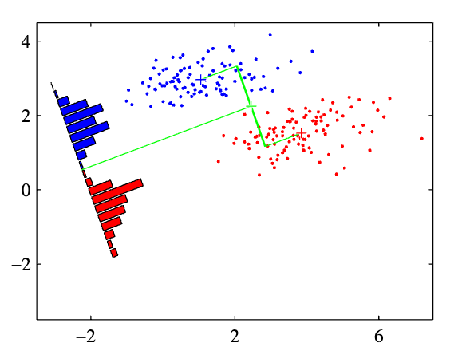
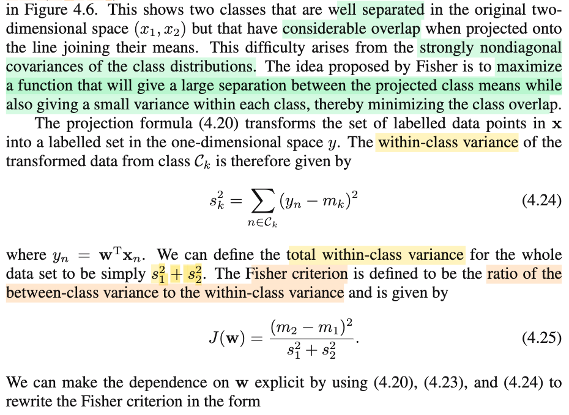
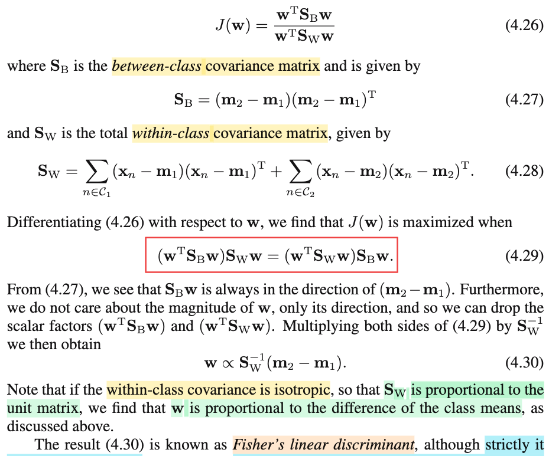
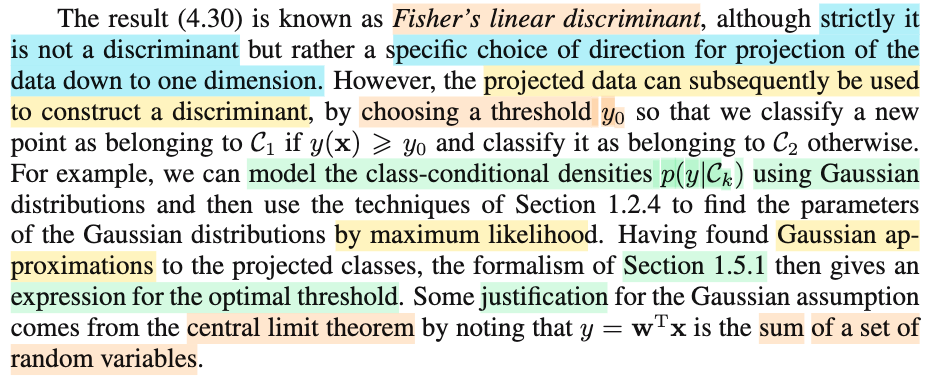
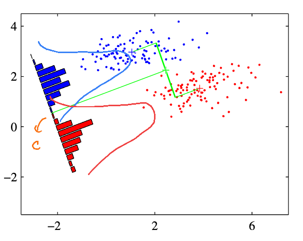

# 4.1.4 Fisher's linear discriminant

📊 **Progress:** `3` Notes | `9` Screenshots | `3` AI Reviews

---

 

## Fisher's Linear Discriminant

<kbd></kbd>

<kbd></kbd>

<kbd></kbd>

<kbd></kbd>

> [!NOTE]
> Đại ý đoạn này là nói rằng, ta có thể nhìn bài toán phân loại theo góc nhìn của bài toán giảm chiều dữ liệu (dimensionality reduction), là sao: Tức là giả sử ta có các điểm dữ liệu là các vector có D phần tử, tức là chúng thuộc D-dimensional space. Sau đó ta chiếu vector 𝐱 lên một không gian con của còn 1 chiều (1D subspace) bằng cách: dot product với vector 𝐰: 𝐱ᵀ𝐰 (kết quả dot product là scalar, chỉ còn 1 chiều). Kế đến nếu ta so với một threshold w0 để ra quyết định assign class 𝒞1 khi 𝐱ᵀ𝐰 ≥ -w0 và ngược lại thì assign class 𝒞2, thì đây chính là decision rule của cái linear discriminant function ở phần trước: vì trong phần trước, cơ bản là ta tính y(𝐰,𝐱) = 𝐱ᵀ𝐰 + w0 và so với 0, lớn hơn thì assign class 𝒞1, nhỏ hơn thì 𝒞2.
>
>
>
> Vậy đại ý đơn giản chỉ là, ta nhìn thấy việc dùng linear discriminant function chỉ giống như việc ta giảm chiều dữ liệu sau đó đưa ra quyết định trong chiều không gian nhỏ hơn sẽ dễ hơn.
>
>
>
> Vấn đề là, giảm chiều dữ liệu sẽ gây ra mất thông tin, dễ hình dung là ví dụ trong không gian gốc 2D (mặt phẳng), các data point của hai class nằm tách xa nhau rõ ràng, nhưng khi chiếu chúng lên một đường thẳng, có thể sự phân tách này không còn rõ nữa.
>
>
>
> Nhưng đương nhiên ta có thể chọn đường thẳng để mà chiếu, bằng cách điều chỉnh 𝐰. Do đó người ta mới nghĩ đến một cách tiếp cận đó là: À giờ ta sẽ tìm 𝐰 và w0 sao cho giả sử có được tâm của hai đám data thuộc hai class thì chọn 𝐰 sao cho khoảng cách giữa hai cái tâm này sau khi chiếu (𝐰ᵀ𝐦1, 𝐰ᵀ𝐦2) lớn nhất có thể.
>
>
>
> ta mới gọi 𝐦1, 𝐦2 là mean của data point thuộc class 𝒞1 và 𝒞2:
>
>
>
> 𝐦1 = (Σi∈𝒞1 𝐱i)/N1, 𝐦2 = (Σi∈𝒞2 𝐱i)/N2.
>
>
>
> Bài toán đặt ra sẽ là: maximize (over 𝐰) ||𝐰ᵀ𝐦1 - 𝐰ᵀ𝐦2|| = ||𝐰ᵀ(𝐦1 - 𝐦2)||,
>
>
>
> vì norm là không âm, nên hàm f(𝐱) = ||𝐱||² là đồng biến, nên ta chuyển thành bài toán tối ưu tương đương:
>
>
>
> maximize (over 𝐰) ||𝐰ᵀ(𝐦1 - 𝐦2)||²
>
>
>
> Vấn đề là, nếu ta làm vậy thì bài toán này không tìm được nghiệm, vì chỉ cần giá trị các phần tử của 𝐰 tăng lên vô cùng thì hàm objective này tăng lên vô hạn. Do đó, ta sẽ giới hạn (đặt ra ràng buộc) là chỉ quan tâm hướng 𝐰 thôi, còn norm thì phải bằng 1. Do đó ta có bài toán tối ưu có ràng buộc đẳng thức:
>
>
>
> maximize (over 𝐰) ||𝐰ᵀ(𝐦1 - 𝐦2)||² subject to ||𝐰|| - 1 = 0 (cũng là tương đương ||𝐰||² = 𝐰ᵀ𝐰 = Σi wi² = 1)
>
>
>
> Tới đây ông Bishop giao cho ta bài tập 4.4, nhờ học tối ưu hóa (Boyd, Nocedal) rồi nên ta có thể giải bài này như sau:
>
>
>
> Với bài toán tối ưu có ràng buộc, ta sẽ dựa trên điều kiện cần bậc nhất (KKT) để tìm ra ứng cử viên cho local maximizer, và điều đủ bậc hai (SOSC) để chốt đơn.
>
>
>
> Trước tiên ta define hàm Lagrangian: ℒ(𝐰, λ) = ||𝐰ᵀ(𝐦1 - 𝐦2)||² - λ(||𝐰||²-1)
>
>
>
> = ||𝐰ᵀ(𝐦1 - 𝐦2)||² - λ(||𝐰||²-1)
>
>
>
> = \[𝐰ᵀ(𝐦1 - 𝐦2)\]\[𝐰ᵀ(𝐦1 - 𝐦2)\] - λ(𝐰ᵀ𝐰-1)
>
>
>
> = \[𝐰ᵀ(𝐦1 - 𝐦2)\]ᵀ\[𝐰ᵀ(𝐦1 - 𝐦2)\] - λ(𝐰ᵀ𝐰-1)
>
>
>
> = (𝐦1 - 𝐦2)ᵀ𝐰 𝐰ᵀ(𝐦1 - 𝐦2) - λ𝐰ᵀ𝐰 + λ
>
>
>
> Do (𝐦1 - 𝐦2)ᵀ𝐰 là scalar, chuyển vị bằng chính nó.
>
>
>
> = 𝐰ᵀ(𝐦1 - 𝐦2)(𝐦1 - 𝐦2)ᵀ𝐰 - λ𝐰ᵀ𝐰 + λ
>
>
>
> Đặt matrix 𝐒 là (𝐦1 - 𝐦2)(𝐦1 - 𝐦2)ᵀ, ta có ℒ(𝐰, λ) = 𝐰ᵀ𝐒𝐰 - λ𝐰ᵀ𝐰 + λ
>
>
>
> = 𝐰ᵀ(𝐒-λ𝐈)𝐰 + λ
>
>
>
> KKT nói rằng, ứng cử viên 𝐰\* cho nghiệm phải thỏa: Tồn tại Lagrange multipler λ\* sao cho:
>
>
>
> Stationary condition: ∇\_𝐰 ℒ(𝐰\*, λ\*) = 0
>
>
>
> ∇\_𝐰 ℒ(𝐰, λ) = d/d𝐰 \[𝐰ᵀ(𝐒-λ𝐈)𝐰 + λ\]
>
>
>
> Thật ra ta thấy hàm này là quadratic function của 𝐰, mà dạng tổng quát là (1/2)𝐰ᵀ𝐏𝐰 + 𝐪ᵀ𝐰 + r thì gradient là 𝐏ᵀ𝐰 + 𝐪. Nhưng cũng có thể tìm gradient theo cách sau cho vui: Tìm cách đưa ℒ(𝐰, λ) về dạng dℒ = linear operator của d𝐰, khi đó ta sẽ suy ra được gradient.
>
>
>
> dℒ = ℒ(𝐰+d𝐰, λ\*) - ℒ(𝐰, λ\*)
>
>
>
> = (𝐰+d𝐰)ᵀ(𝐒-λ𝐈)(𝐰+d𝐰) + λ - 𝐰ᵀ(𝐒-λ𝐈)𝐰 - λ
>
>
>
> = (𝐰ᵀ(𝐒-λ𝐈) + d𝐰ᵀ(𝐒-λ𝐈))(𝐰+d𝐰) - 𝐰ᵀ(𝐒-λ𝐈)𝐰  
>
>
>
> = 𝐰ᵀ(𝐒-λ𝐈)𝐰 + d𝐰ᵀ(𝐒-λ𝐈)𝐰 + 𝐰ᵀ(𝐒-λ𝐈)d𝐰 + d𝐰ᵀ(𝐒-λ𝐈)d𝐰 - 𝐰ᵀ(𝐒-λ𝐈)𝐰  
>
>
>
> cancel out các term và bỏ term bậc cao
>
>
>
> = d𝐰ᵀ(𝐒-λ𝐈)𝐰 + 𝐰ᵀ(𝐒-λ𝐈)d𝐰
>
>
>
> = 2𝐰ᵀ(𝐒-λ𝐈)d𝐰 (do 𝐰ᵀ(𝐒-λ𝐈)d𝐰 là scalar, nên chuyển vị bằng chính nó, và sẽ thấy hai term giống nhau)
>
>
>
> Tới đây ta có dℒ = 2𝐰ᵀ(𝐒-λ𝐈)d𝐰 = \[2(𝐒-λ𝐈)ᵀ𝐰\]ᵀ d𝐰 có dạng dot product giữa vector 2(𝐒-λ𝐈)ᵀ𝐰 và d𝐰, mà dot product chính là một linear operator, do đó suy ra luôn gradient chính là 2(𝐒-λ𝐈)ᵀ𝐰
>
>
>
> ∇\_𝐰 ℒ(𝐰, λ) = 2(𝐒-λ𝐈)ᵀ𝐰
>
>
>
> ⇒ điều kiện stationary: 2(𝐒-λ𝐈)ᵀ𝐰 = 0 ⇔ 𝐒𝐰 = λ𝐰
>
>
>
> Và điều này chứng tỏ gì? Theo định nghĩa của eigenvector đã học trong MIT 18.06, nếu u là vector thỏa Au = λu thì u chính là eigenvector của matrix A với eigenvalue tương ứng là λ. Vậy kết quả trên cho thấy 𝐰, ứng cử viên của maximizer của bài toán tối ưu ràng buộc này sẽ phải là **eigenvector của matrix** 𝐒 và L**agrange multiplier λ chính là eigenvalue**.
>
>
>
> Thêm nữa, thay 𝐒 vào ta có:
>
>
>
> (𝐦1 - 𝐦2)(𝐦1 - 𝐦2)ᵀ𝐰 = λ𝐰
>
>
>
> Kết quả này thấy gì?
>
>
>
> Để ý (𝐦1 - 𝐦2)ᵀ𝐰 là một dot product, là scalar, gọi nó là α(𝐰) (phụ thuộc 𝐰) thì ta có: (𝐦1 - 𝐦2) α(𝐰) = λ𝐰
>
>
>
> ⇔ 𝐰 = \[α(𝐰)/λ\] (𝐦1 - 𝐦2),
>
>
>
> Kết quả này cho ta kết luận: vector 𝐰 (ứng cử viên của solution) phải **TRÙNG HƯỚNG** với vector 𝐦1 - 𝐦2. Mà hình ảnh là gì: Chính là để chọn ra đường thẳng giúp khi chiếu dữ liệu lên khiến tâm của hai đám thuộc hai loại cách xa nhau nhất thì ta phải chọn cái đường song song với đường nối hai tâm trước khi chiếu. điều này thật ra rất hợp lí và dễ hình dung. Đây chính là cái hình bên trái của hình 4.6 ta thấy đường dùng để chiếu sẽ song song với đường thẳng đi qua tâm của hai đám dữ liệu trước khi chiếu.
>
>
>
> Và dĩ nhiên kết quả này cũng chính là cái giáo sư Bishop nói: "we then find 𝐰 ∝ 𝐦2 - 𝐦1.

> [!TIP]
> **🤖 AI Feedback** — ✅ Score: **95/100**
>
> Ghi chú thể hiện sự hiểu biết sâu sắc, diễn đạt mạch lạc bản chất bài toán giảm chiều và tự chứng minh bài tập 4.4 rất chặt chẽ bằng giải tích ma trận và điều kiện KKT.

 

### The Fisher Criterion

<kbd></kbd>

<kbd></kbd>

<kbd></kbd>

> [!NOTE]
> Thế thì đại ý là, cách làm vừa rồi trong đó ta tìm 𝐰 để maximize khoảng cách giữa hình chiếu của hai tâm 𝐦1 và 𝐦2 của hai đám data thuộc hai class có chỗ không ổn. Hình 4.6 bên trái cho thấy dù hai đám data phân tách nhau tuyến tính rất tốt, nhưng sau khi chiếu lên 𝐰 tìm được theo cách này lại cho thấy rất nhiều chồng lấn, và nguyên nhân là do "strongly non-diagonal covariance" (chưa hiểu lắm)
>
>
>
> Một đề xuất bởi Fisher làm như sau:
>
>
>
> Đó là ta sẽ đặt ra một tiêu chí khác: vẫn maximize khoảng cách giữa hình chiếu của tâm như trên, nhưng đồng thời minimize variance giữa mỗi class, từ đó giúp giảm đi phần chồng lấn.
>
>
>
> Hiểu đại ý là, variance within class là như mức phân tán của data của class đó, thì để cho bớt chồng lấn giữa các hai đám data point thuộc hai class sau khi đã chiếu lên w, ta sẽ muốn mức phân tán của chúng, điều này giúp cho kiểu như chúng bớt phình ra và chồng lên nhau.
>
>
>
> Chú ý, độ phân tán này, là xét độ phân tán của hình chiếu của dữ liệu lên 𝐰 (mà tác giả gọi là transformed data, cũng có thể hiểu ý này, là ta coi như đã dùng matrix có 1 hàng là 𝐰ᵀ để linear transform vector 𝐱i) tính như sau:
>
>
>
> Với các data point 𝐱i, i ∈ 𝒞1, (như đã biết, là D-dimensional vector) sau khi chiếu, ta có scalar yi = 𝐰ᵀ𝐱i, và m1 là mean của chúng (chú ý, 𝐦1 (viết đậm, là D-dimensional vector, mean của đám 𝐱i, i ∈ 𝒞1, còn sau khi chiếu nó lên ta có m1, cũng đương nhiên là mean của đám 𝐰ᵀ𝐱i, i ∈ 𝒞1.
>
>
>
> Thế thì, tương tự như công thức của sample variance đã học: Với random sample có observed value x1, x2,....xn. Thì sample variance, kí hiệu s² = (1/n) Σi (xi-x̄)² với x̄ là sample mean.
>
>
>
> Thì ở đây cũng tương tự, công thức của within-class variance của transformed data thuộc class 𝒞1 là:
>
>
>
> (1/n1) Σi∈𝒞1 (𝐰ᵀ𝐱i-m1)², với N1 là số data point của class 𝒞1.
>
>
>
> Có thể vì (1/N1) chỉ là constant, nên ta không cần nhắc đến.
>
>
>
> nên s²k = Σi∈𝒞k (𝐰ᵀ𝐱i-mk)²
>
>
>
> Và từ đó người ta (ông Fisher) đặt ra objective như sau:
>
>
>
> J(𝐰) = (m2 - m1)²/(s1² + s2²).
>
>
>
> Thế thì vì sao tác giả lại nói nó chính là tỉ lệ của between-class variance và within-class variance?
>
>
>
> ---
>
>
>
> Tiếp, công thức trên phụ thuộc 𝐰 nhưng theo kiểu implicit (ý là gián tiếp, ngầm, thông qua m1, m2, s1², s2²). Ta sẽ chuyển thành công thức theo 𝐰 tường minh:
>
>
>
> (m2 - m1)²
>
>
>
> = \[(Σi∈𝒞1 𝐰ᵀ𝐱i)/N1 - (Σi∈𝒞2 𝐰ᵀ𝐱i)/N2\]²
>
>
>
> = \[𝐰ᵀ(Σi∈𝒞1 𝐱i)/N1 - 𝐰ᵀ(Σi∈𝒞2 𝐱i)/N2\]²
>
>
>
> = \[𝐰ᵀ((Σi∈𝒞1 𝐱i)/N1 - (Σi∈𝒞2 𝐱i)/N2\]²
>
>
>
> = \[𝐰ᵀ((Σi∈𝒞1 𝐱i)/N1 - (Σi∈𝒞2 𝐱i)/N2\]²
>
>
>
> Mà (Σi∈𝒞1 𝐱i)/N1 = 𝐦1, và (Σi∈𝒞2 𝐱i)/N2 = 𝐦2
>
>
>
> .. = \[𝐰ᵀ(𝐦1 - 𝐦2)\]²
>
>
>
> = 𝐰ᵀ(𝐦1 - 𝐦2) 𝐰ᵀ(𝐦1 - 𝐦2)
>
>
>
> = 𝐰ᵀ(𝐦1 - 𝐦2) (𝐦1 - 𝐦2)ᵀ𝐰
>
>
>
> = 𝐰ᵀ\[(𝐦1 - 𝐦2) (𝐦1 - 𝐦2)ᵀ\]𝐰
>
>
>
> = 𝐰ᵀ𝐒B𝐰, với 𝐒B = (𝐦1 - 𝐦2) (𝐦1 - 𝐦2)ᵀ.
>
>
>
> ---
>
>
>
> Còn mẫu số: (s1² + s2²)
>
>
>
> = Σi∈𝒞1 (𝐰ᵀ𝐱i-m1)² + Σi∈𝒞2 (𝐰ᵀ𝐱i-m2)²
>
>
>
> = Σi∈𝒞1 (𝐰ᵀ𝐱i-𝐰ᵀ𝐦1)² + Σi∈𝒞2 (𝐰ᵀ𝐱i-𝐰ᵀ𝐦2)²
>
>
>
> = Σi∈𝒞1 \[𝐰ᵀ(𝐱i-𝐦1)\]² + Σi∈𝒞2 \[𝐰ᵀ(𝐱i-𝐦2)\]²
>
>
>
> = Σi∈𝒞1 \[𝐰ᵀ(𝐱i-𝐦1)(𝐱i-𝐦1)ᵀ𝐰\] + Σi∈𝒞2 \[𝐰ᵀ(𝐱i-𝐦2)(𝐱i-𝐦2)ᵀ𝐰\] 
>
>
>
> = 𝐰ᵀ\[Σi∈𝒞1 (𝐱i-𝐦1)(𝐱i-𝐦1)ᵀ\] 𝐰 + 𝐰ᵀ\[Σi∈𝒞2 (𝐱i-𝐦2)(𝐱i-𝐦2)ᵀ\] 𝐰 
>
>
>
> = 𝐰ᵀ\[Σi∈𝒞1 (𝐱i-𝐦1)(𝐱i-𝐦1)ᵀ + Σi∈𝒞2 (𝐱i-𝐦2)(𝐱i-𝐦2)ᵀ\] 𝐰 
>
>
>
> Đặt \[Σi∈𝒞1 (𝐱i-𝐦1)(𝐱i-𝐦1)ᵀ + Σi∈𝒞2 (𝐱i-𝐦2)(𝐱i-𝐦2)ᵀ\] là matrix 𝐒w, gọi là within-class coavariance matrix.
>
>
>
> = 𝐰ᵀ 𝐒w 𝐰
>
>
>
> Vậy J(𝐰) = 𝐰ᵀ𝐒B𝐰 / 𝐰ᵀ𝐒w𝐰 
>
>
>
> và mục tiêu là khi maximize cái này tức là ta sẽ maximize tử số = maximize between-class variance, chính là tách mean của hình chiếu mỗi đám ra càng xa càng tốt. đồng thời minimize mẫu số, chính là bóp độ phân tán ở mỗi class lại, giúp giảm chồng lấn.
>
>
>
> ---
>
>
>
> Ta sẽ đi giải bài toán tối ưu: maximize J(𝐰) = 𝐰ᵀ𝐒B𝐰 / 𝐰ᵀ𝐒w𝐰. Như thường lệ, ta dùng điều kiện cần bậc nhất (bài toán tối ưu không ràng buộc): ∇J(𝐰) = 0
>
>
>
> Tính gradient hàm này trước ∇J(𝐰). Trước tiên, đây là hàm có dạng g(𝐰)/h(𝐰) với g và h đều là scalar function (vì đều là quadratic form). Dùng quotient rule:
>
>
>
> ∇J(𝐰) = d/d𝐰 J(𝐰) = d/d𝐰 \[g(𝐰)/h(𝐰) \]
>
>
>
> = \[\[d/d𝐰 g(𝐰)\] h(𝐰) - g(𝐰) \[d/d𝐰 h(𝐰)\]\] / h(𝐰)²
>
>
>
> = \[∇g(𝐰) h(𝐰) - g(𝐰) ∇h(𝐰)\] / h(𝐰)²
>
>
>
> Với quadratic function f(𝐱) = (1/2)𝐱ᵀ𝐏𝐱 + 𝐪ᵀ𝐱 + r, thì ta gradient chính là 𝐏ᵀ𝐱 + 𝐪, nên ∇g(𝐰) = 2𝐒Bᵀ𝐰 = 2𝐒B𝐰, do 𝐒B đối xứng. Tương tự, ∇h(𝐰) = 2𝐒wᵀ𝐰 = 2𝐒w𝐰
>
>
>
> = \[2𝐒B𝐰 (𝐰ᵀ𝐒w𝐰) - (𝐰ᵀ𝐒B𝐰) 2𝐒w𝐰\] / \[𝐰ᵀ𝐒w𝐰\]²
>
>
>
> = \[2𝐒B𝐰 (𝐰ᵀ𝐒w𝐰) - (𝐰ᵀ𝐒B𝐰) 2𝐒w𝐰\] / \[𝐰ᵀ𝐒w𝐰\]²
>
>
>
> Vì 𝐰 phải khác 0, nên mẫu số chỉ là scalar dương. Nên ∇J(𝐰) = 0 tương đương
>
>
>
> 𝐒B𝐰 (𝐰ᵀ𝐒w𝐰) - (𝐰ᵀ𝐒B𝐰) 𝐒w𝐰 = 0
>
>
>
> ⇔ 𝐒B𝐰 (𝐰ᵀ𝐒w𝐰) = (𝐰ᵀ𝐒B𝐰) 𝐒w𝐰
>
>
>
> ⇔ (𝐰ᵀ𝐒B𝐰) 𝐒w𝐰 = 𝐒B𝐰 (𝐰ᵀ𝐒w𝐰)
>
>
>
> ⇔ (𝐰ᵀ𝐒B𝐰) 𝐒w𝐰 = (𝐰ᵀ𝐒w𝐰) 𝐒B𝐰
>
>
>
> ---
>
>
>
> Phân tích kết quả này, vì 𝐒B = (𝐦2 - 𝐦1)(𝐦2 - 𝐦1)ᵀ
>
>
>
> nên 𝐒B𝐰 = (𝐦2 - 𝐦1)(𝐦2 - 𝐦1)ᵀ𝐰 = (𝐦2 - 𝐦1) \[(𝐦2 - 𝐦1)ᵀ𝐰\]
>
>
>
> = (𝐦2 - 𝐦1) (scalar c1 = (𝐦2 - 𝐦1)ᵀ𝐰)
>
>
>
> như vậy tương tự như đã lập luận trước đây, cái này cho ta thấy vector 𝐒B𝐰 = một scalar nhân vector (𝐦2 - 𝐦1), nên nó cùng phương với vector này. Ta viết: 𝐒B𝐰 ∝ (𝐦2 - 𝐦1)
>
>
>
> Đồng thời quay lại kết qủa (𝐰ᵀ𝐒B𝐰) 𝐒w𝐰 = (𝐰ᵀ𝐒w𝐰) 𝐒B𝐰:
>
>
>
> Chia hai vế cho scalar (𝐰ᵀ𝐒B𝐰), ta sẽ có 𝐒w𝐰 = (scalar c2) 𝐒B𝐰
>
>
>
> Nhân hai vế cho (𝐒w)⁻¹, ta có 𝐰 = (scalar c2) (𝐒w)⁻¹ 𝐒B𝐰, kết quả này cũng lại nói rằng vector 𝐰 sẽ cùng phương vector (𝐒w)⁻¹ 𝐒B𝐰, ta viết: 𝐰 ∝ (𝐒w)⁻¹ 𝐒B𝐰
>
>
>
> và kết hợp với 𝐒B𝐰 ∝ (𝐦2 - 𝐦1), ta có
>
>
>
> 𝐰 ∝ (𝐒w)⁻¹ (𝐦2 - 𝐦1)
>
>
>
> ---
>
>
>
> Như vậy, vector 𝐰, có hướng khiến khi chiếu data lên, ta có được kết quả là vừa khiến hình chiếu của tâm của đám dữ liệu mỗi loại cách xa nhau nhất, đồng thời giảm thiểu tối đa sự phân tán của mỗi loại, theo giải tích mà ta vừa giải ra đó là hướng có cùng hướng với vector (𝐒w)⁻¹ (𝐦2 - 𝐦1)
>
>
>
> ---
>
>
>
> Và một trường hợp đặc biệt, khi covariance matrix của mỗi loại có tính isotropic, nôm na là khi đám mây dat của mỗi loại trở nên phân tán đều nhau theo mỗi phương, giống như hai đám mây xanh đỏ trở nên tròn trị, thay vì dẹt như trong hình 4.6. Thì khi đó covariance matrix của mỗi đám (tức \[Σi∈𝒞1 (𝐱i-𝐦1)(𝐱i-𝐦1)ᵀ và \[Σi∈𝒞2 (𝐱i-𝐦2)(𝐱i-𝐦2)ᵀ sẽ đều có dạng là một scalar nhân với matrix đơn vị: ví dụ α 𝐈 và β 𝐈, để rồi 𝐒w = (α + β) 𝐈 khiến (𝐒w)⁻¹ = (α + β)⁻¹ 𝐈, từ đó 𝐰 ∝ (𝐒w)⁻¹ (𝐦2 - 𝐦1) trở thành:
>
>
>
> 𝐰 ∝ (α + β)⁻¹ 𝐈 (𝐦2 - 𝐦1) = (α + β)⁻¹ (𝐦2 - 𝐦1).
>
>
>
> Và kết quả này lại mang ý nghĩa 𝐰 sẽ cùng phương với vector (𝐦2 - 𝐦1), hay phương để chiếu khiến trong trường hợp này lại quay về song song với đường nối tâm hai đám mây xanh đỏ.
>
>
>
> Ngẫm nghĩ tí, ta sẽ thấy kết quả này rất dễ hiểu: Vì khi hai đám mây xanh đỏ trở thành tròn, thì chiếu theo phương nào mà độ phân tán chả bằng nhau, nên khi đó độ phân tán within class sẽ cố định, thành ra nhiệm vụ lại quay về việc maximize khoảng cách giữa hình chiếu của hai tâm thôi.

> [!TIP]
> **🤖 AI Feedback** — ✅ Score: **98/100**
>
> Ghi chú xuất sắc! Bạn đã tái hiện và giải thích chi tiết toàn bộ quá trình biến đổi toán học cũng như trực giác hình học đằng sau Fisher's Linear Discriminant.

 

#### Fisher's Linear Discriminant Projection

<kbd></kbd>

<kbd></kbd>

> [!NOTE]
> Rồi, cái kết quả mà ta vừa có, chỉ là 𝐰, cho ta một phương để chiếu dữ liệu xuống. Để có được một discriminant function, ta phải dùng một threshold c nào đó để so sánh với 𝐰ᵀ𝐱, và từ đó đưa ra quyết định (gán class nào)
>
>
>
> Vấn đề là làm sao để chọn threshold c.
>
>
>
> Thì tác giả Bishop nói ta có thể làm như sau:
>
>
>
> Ta giả định sau khi chiếu, training data thuộc mỗi class, tức {𝐰ᵀ𝐱i, i ∈ 𝒞1} và {𝐰ᵀ𝐱i, i ∈ 𝒞2} sẽ tạo nên hai bộ observed data của hai Normal distribution.
>
>
>
> Cơ sở biện minh cho giả định này là: Xét 𝐰ᵀ𝐱, = Σi=1:D wixi có thể xem như là tổng của ui: Σi ui với ui = wixi.
>
>
>
> Như vậy, giả sử data point 𝐱 thuộc class 𝒞1, ta có thể coi như tương ứng với một observed value u1, u2,....uD của một random sample U1,...UD, và observed value của sample mean Ū = ū = (u1 + ...uD)/D = 𝐰ᵀ𝐱/D.
>
>
>
> Vậy giả sử ta gọi 𝐱1,....𝐱N1 là các data point thuộc class 𝒞1, thì ta sẽ có N1 observed value của sample mean Ū: ū1 = 𝐰ᵀ𝐱1/D, ....,ūN1 = 𝐰ᵀ𝐱N1/D.
>
>
>
> Và vì theo CLT: Central Limit Theorem đã học bên Casella nói rằng:
>
>
>
> Nếu ta có random sample X1,...Xn có mean EX = μ, variance Var(X) = σ² thì sample mean X̄ sẽ có tính chất: √n(X̄ - μ)/σ → (d) n(0,1).
>
>
>
> Như vậy có nghĩa là, khi n lớn ta có thể coi như √n(X̄ - μ)/σ là một Z \~ n(0,1), tương đương X̄ \~ 𝒩(μ, σ²/n).
>
>
>
> Và dựa vào cơ sở này, khi D lớn thì ta có thể cho rằng, Ū = 𝐰ᵀ𝐱/D chính là một normal random variable 𝒩
>
>
>
> ---
>
>
>
> random sample size n 𝐗 = \[X1,....Xn\]ᵀ, iid independent identically distribiuted Xi \~ f(x|θ)
>
>
>
> Point estimate: W(𝐱) cuả θ, "any function của 𝐗"
>
>
>
> Như vậy, bài toán sẽ trở thành giống như trong thống kê suy luận: Với các data point thuộc class 𝒞1, thì 𝐰ᵀ𝐱1,....𝐰ᵀ𝐱N1 sẽ tạo nên một bộ observed value của một random sample Ū1, Ū2,....ŪN1, iid, và có distribution 𝒩(μ, σ²). Và dựa vào lý thuyết point estimation đã học bên Casella, ta sẽ tìm đi point estimator của μ, σ², với cách tiếp cận điển hình của trường phái Classic: MLE
>
>
>
> Gọi θ1^ = (μ, σ²)^ là maximum likelihood estimator của μ, σ², thì theo định nghĩa của MLE, nó sẽ là statistic sau đây:
>
>
>
> θ1^(𝐮̄) = argmax\_(μ, σ²) L(μ1, σ²1|𝐮̄) với 𝐮̄ là observed data \[ū1,...ūN1\]ᵀ
>
>
>
> và hàm likelihood L(μ, σ²|𝐮̄) thì theo định nghĩa sẽ có giá trị bằng joint pdf của Ū1, Ū2,....ŪN1 tại 𝐮̄:
>
>
>
> L(μ1, σ²1|𝐮̄) = f(𝐮̄|μ, σ²)
>
>
>
> Dùng tính iid, tách f(𝐮̄|μ, σ²) thành tích các marginal pdf của Ū1, ...ŪN1 (đều \~ 𝒩(μ, σ²))
>
>
>
> = Πi=1:N1 f(ūi|μ, σ²)
>
>
>
> = Πi=1:N1 𝒩(ūi|μ, σ²)
>
>
>
> = Πi=1:N1 \[(1/√2πσ²) exp{-(ūi - μ)²/2σ²}\]
>
>
>
> = Πi=1:N1 \[(2πσ²)^(-1/2) exp{-(ūi - μ)²/2σ²}\]
>
>
>
> = (2πσ²)^(-N/2) Πi=1:N1 \[ exp{-(ūi - μ)²/2σ²}\]
>
>
>
> Rồi, tới đây, viết lại bài toán:
>
>
>
> Tìm (μ, σ²) để maximize L(μ, σ²|𝐮̄) = (2πσ²)^(-N/2) Πi=1:N1 \[ exp{-(ūi - μ)²/2σ²}\]
>
>
>
> Ta chuyển thành bài toán tương đương với hàm ln:
>
>
>
> maximize L(μ, σ²|𝐮̄) = ln {(2πσ²)^(-N/2) Πi=1:N1 \[ exp{-(ūi - μ)²/2σ²}\]}
>
>
>
> = ln {(2πσ²)^(-N/2)} + ln{Πi=1:N1 \[ exp{-(ūi - μ)²/2σ²}\]}
>
>
>
> = (-N/2) ln (2π) + (-N/2) ln (σ²) + Σi=1:N1 ln {\[ exp{-(ūi - μ)²/2σ²}\]}
>
>
>
> = (-N/2) ln (2π) + (-N/2) ln (σ²) + Σi=1:N1 {-(ūi - μ)²/2σ²}
>
>
>
> = (-N/2) ln (2π) + (-N/2) ln (σ²) -(1/2σ²) Σi=1:N1 {(ūi - μ)²}
>
>
>
> Tiếp tục chuyển thành bài toán tối ưu tương đương bằng cách bỏ constant:
>
>
>
> Maximize (-N/2) ln (σ²) -(1/2σ²) Σi=1:N1 {(ūi - μ)²}
>
>
>
> Tới đây toán tối ưu cho phép ta giải theo từng biến, giải theo μ trước, thì lấy đạo hàm theo μ, rồi cho bằng 0 (điều kiện cần tối ưu bậc nhất) ta sẽ có được μML (sẽ ra m μML = samle mean: (Σi ūi)/N1
>
>
>
> Sau đó làm cho σ² để có σ²ML, kết quả sẽ là sample variance. (1/N1) Σi (ūi - μML)²
>
>
>
> ---
>
>
>
> Rồi, hoàn toàn tương tự, ta sẽ lại coi 𝐰ᵀ𝐱1/D,...𝐰ᵀ𝐱N2/D với 𝐱1,...𝐱N2 là các data point thuộc class 𝒞2 là observed value của một random sample size N2: V̄1,...V̄\_N2, \~ 𝒩(γ, ε²). Và lại làm tương tự để có ML estimator của γ, ε². Cũng là sample mean γML = (Σi v̄i)/N2 và sample variance ε²ML = (1/N2) Σi (v̄i - γML)²
>
>
>
> ---
>
>
>
> Đương nhiên, point estimator μML, σ²ML sẽ đều là statistic - là hàm của Ū1, ...Ū1. Thì gắn observed value vào, ta sẽ có giá trị maximum estimate của μ, σ². Tức là ta sẽ tính:
>
>
>
> μML = μML(ū1,...ūN1) = μML(𝐰ᵀ𝐱1/D, ....,ūN1 = 𝐰ᵀ𝐱N1/D), ra một giá trị cụ thể nào đó.
>
>
>
> Tương tự với σ²ML = σ²ML(ū1,...ūN1) = σ²ML(𝐰ᵀ𝐱1/D, ....,ūN1 = 𝐰ᵀ𝐱N1/D), ra một giá trị cụ thể nào đó.
>
>
>
> Và từ đó ta có ước lượng xấp xỉ của 𝒩(μ, σ²) (là cái ý mà gs Bishop gọi là "ta tìm được Gaussian approximation of projected classes)
>
>
>
> Tương tự với đám class 𝒞2, ta cũng có được xấp xỉ 𝒩(γ, ε²)
>
>
>
> Đây chính là ta có f(y|𝒞1) và f(y|𝒞2)
>
>
>
> Theo Section 1.5.1, mình sẽ kết hợp với prior distribution của mỗi class để có posterior
>
>
>
> để có f(𝒞1|y) = f(y|𝒞1)f(𝒞1)/f(y) và f(𝒞2|y) = f(y|𝒞2)f(𝒞2)/f(y)
>
>
>
> từ đó chọn threshold là y khiến f(𝒞1|y) = f(𝒞2|y) ⇔ f(y|𝒞1)f(𝒞1) = f(y|𝒞2)f(𝒞2)

> [!TIP]
> **🤖 AI Feedback** — ✅ Score: **95/100**
>
> Ghi chú của bạn thể hiện sự hiểu biết xuất sắc, sâu sắc và liên hệ toán học rất chặt chẽ giữa Bishop PRML và kiến thức Thống kê toán (Casella & Berger).

 

