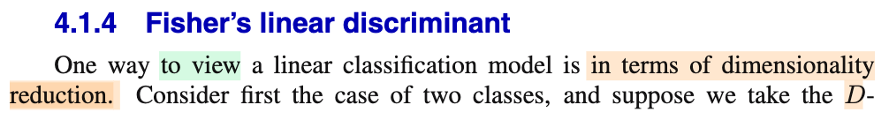
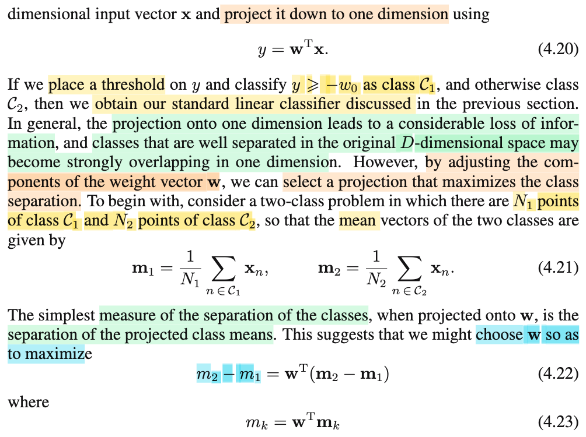
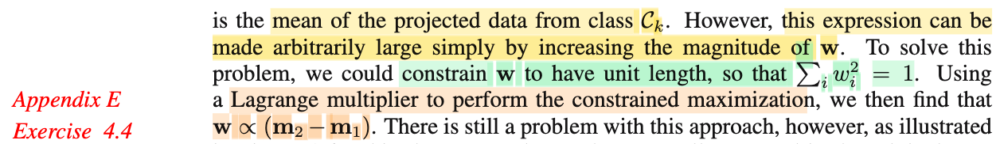
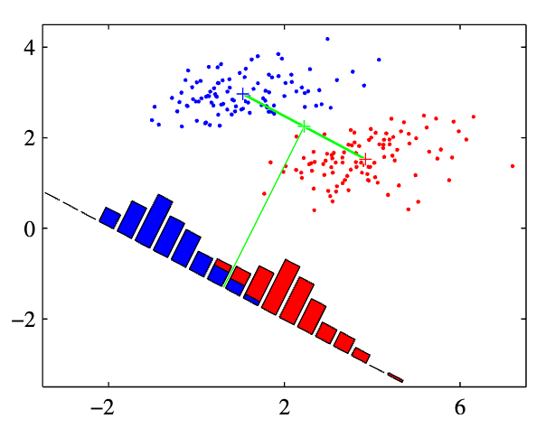

# 4.1.4 Fisher's linear discriminant

📊 **Progress:** `1` Notes | `4` Screenshots | `1` AI Reviews

---

 

## Fisher's Linear Discriminant

<kbd></kbd>

<kbd></kbd>

<kbd></kbd>

<kbd></kbd>

> [!NOTE]
> Đại ý đoạn này là nói rằng, ta có thể nhìn bài toán phân loại theo góc nhìn của bài toán giảm chiều dữ liệu (dimensionality reduction), là sao: Tức là giả sử ta có các điểm dữ liệu là các vector có D phần tử, tức là chúng thuộc D-dimensional space. Sau đó ta chiếu vector 𝐱 lên một không gian con của còn 1 chiều (1D subspace) bằng cách: dot product với vector 𝐰: 𝐱ᵀ𝐰 (kết quả dot product là scalar, chỉ còn 1 chiều). Kế đến nếu ta so với một threshold w0 để ra quyết định assign class 𝒞1 khi 𝐱ᵀ𝐰 ≥ -w0 và ngược lại thì assign class 𝒞2, thì đây chính là decision rule của cái linear discriminant function ở phần trước: vì trong phần trước, cơ bản là ta tính y(𝐰,𝐱) = 𝐱ᵀ𝐰 + w0 và so với 0, lớn hơn thì assign class 𝒞1, nhỏ hơn thì 𝒞2.
>
>
>
> Vậy đại ý đơn giản chỉ là, ta nhìn thấy việc dùng linear discriminant function chỉ giống như việc ta giảm chiều dữ liệu sau đó đưa ra quyết định trong chiều không gian nhỏ hơn sẽ dễ hơn.
>
>
>
> Vấn đề là, giảm chiều dữ liệu sẽ gây ra mất thông tin, dễ hình dung là ví dụ trong không gian gốc 2D (mặt phẳng), các data point của hai class nằm tách xa nhau rõ ràng, nhưng khi chiếu chúng lên một đường thẳng, có thể sự phân tách này không còn rõ nữa.
>
>
>
> Nhưng đương nhiên ta có thể chọn đường thẳng để mà chiếu, bằng cách điều chỉnh 𝐰. Do đó người ta mới nghĩ đến một cách tiếp cận đó là: À giờ ta sẽ tìm 𝐰 và w0 sao cho giả sử có được tâm của hai đám data thuộc hai class thì chọn 𝐰 sao cho khoảng cách giữa hai cái tâm này sau khi chiếu (𝐰ᵀ𝐦1, 𝐰ᵀ𝐦2) lớn nhất có thể.
>
>
>
> ta mới gọi 𝐦1, 𝐦2 là mean của data point thuộc class 𝒞1 và 𝒞2:
>
>
>
> 𝐦1 = (Σi∈𝒞1 𝐱i)/N1, 𝐦2 = (Σi∈𝒞2 𝐱i)/N2.
>
>
>
> Bài toán đặt ra sẽ là: maximize (over 𝐰) ||𝐰ᵀ𝐦1 - 𝐰ᵀ𝐦2|| = ||𝐰ᵀ(𝐦1 - 𝐦2)||,
>
>
>
> vì norm là không âm, nên hàm f(𝐱) = ||𝐱||² là đồng biến, nên ta chuyển thành bài toán tối ưu tương đương:
>
>
>
> maximize (over 𝐰) ||𝐰ᵀ(𝐦1 - 𝐦2)||²
>
>
>
> Vấn đề là, nếu ta làm vậy thì bài toán này không tìm được nghiệm, vì chỉ cần giá trị các phần tử của 𝐰 tăng lên vô cùng thì hàm objective này tăng lên vô hạn. Do đó, ta sẽ giới hạn (đặt ra ràng buộc) là chỉ quan tâm hướng 𝐰 thôi, còn norm thì phải bằng 1. Do đó ta có bài toán tối ưu có ràng buộc đẳng thức:
>
>
>
> maximize (over 𝐰) ||𝐰ᵀ(𝐦1 - 𝐦2)||² subject to ||𝐰|| - 1 = 0 (cũng là tương đương ||𝐰||² = 𝐰ᵀ𝐰 = Σi wi² = 1)
>
>
>
> Tới đây ông Bishop giao cho ta bài tập 4.4, nhờ học tối ưu hóa (Boyd, Nocedal) rồi nên ta có thể giải bài này như sau:
>
>
>
> Với bài toán tối ưu có ràng buộc, ta sẽ dựa trên điều kiện cần bậc nhất (KKT) để tìm ra ứng cử viên cho local maximizer, và điều đủ bậc hai (SOSC) để chốt đơn.
>
>
>
> Trước tiên ta define hàm Lagrangian: ℒ(𝐰, λ) = ||𝐰ᵀ(𝐦1 - 𝐦2)||² - λ(||𝐰||²-1)
>
>
>
> = ||𝐰ᵀ(𝐦1 - 𝐦2)||² - λ(||𝐰||²-1)
>
>
>
> = \[𝐰ᵀ(𝐦1 - 𝐦2)\]\[𝐰ᵀ(𝐦1 - 𝐦2)\] - λ(𝐰ᵀ𝐰-1)
>
>
>
> = \[𝐰ᵀ(𝐦1 - 𝐦2)\]ᵀ\[𝐰ᵀ(𝐦1 - 𝐦2)\] - λ(𝐰ᵀ𝐰-1)
>
>
>
> = (𝐦1 - 𝐦2)ᵀ𝐰 𝐰ᵀ(𝐦1 - 𝐦2) - λ𝐰ᵀ𝐰 + λ
>
>
>
> Do (𝐦1 - 𝐦2)ᵀ𝐰 là scalar, chuyển vị bằng chính nó.
>
>
>
> = 𝐰ᵀ(𝐦1 - 𝐦2)(𝐦1 - 𝐦2)ᵀ𝐰 - λ𝐰ᵀ𝐰 + λ
>
>
>
> Đặt matrix 𝐒 là (𝐦1 - 𝐦2)(𝐦1 - 𝐦2)ᵀ, ta có ℒ(𝐰, λ) = 𝐰ᵀ𝐒𝐰 - λ𝐰ᵀ𝐰 + λ
>
>
>
> = 𝐰ᵀ(𝐒-λ𝐈)𝐰 + λ
>
>
>
> KKT nói rằng, ứng cử viên 𝐰\* cho nghiệm phải thỏa: Tồn tại Lagrange multipler λ\* sao cho:
>
>
>
> Stationary condition: ∇\_𝐰 ℒ(𝐰\*, λ\*) = 0
>
>
>
> ∇\_𝐰 ℒ(𝐰, λ) = d/d𝐰 \[𝐰ᵀ(𝐒-λ𝐈)𝐰 + λ\]
>
>
>
> Thật ra ta thấy hàm này là quadratic function của 𝐰, mà dạng tổng quát là (1/2)𝐰ᵀ𝐏𝐰 + 𝐪ᵀ𝐰 + r thì gradient là 𝐏ᵀ𝐰 + 𝐪. Nhưng cũng có thể tìm gradient theo cách sau cho vui: Tìm cách đưa ℒ(𝐰, λ) về dạng dℒ = linear operator của d𝐰, khi đó ta sẽ suy ra được gradient.
>
>
>
> dℒ = ℒ(𝐰\*+d𝐰, λ\*) - ℒ(𝐰\*, λ\*)
>
>
>
> = (𝐰+d𝐰)ᵀ(𝐒-λ𝐈)(𝐰+d𝐰) + λ - 𝐰ᵀ(𝐒-λ𝐈)𝐰 - λ
>
>
>
> = (𝐰ᵀ(𝐒-λ𝐈) + d𝐰ᵀ(𝐒-λ𝐈))(𝐰+d𝐰) - 𝐰ᵀ(𝐒-λ𝐈)𝐰  
>
>
>
> = 𝐰ᵀ(𝐒-λ𝐈)𝐰 + d𝐰ᵀ(𝐒-λ𝐈)𝐰 + 𝐰ᵀ(𝐒-λ𝐈)d𝐰 + d𝐰ᵀ(𝐒-λ𝐈)d𝐰 - 𝐰ᵀ(𝐒-λ𝐈)𝐰  
>
>
>
> cancel out các term và bỏ term bậc cao
>
>
>
> = d𝐰ᵀ(𝐒-λ𝐈)𝐰 + 𝐰ᵀ(𝐒-λ𝐈)d𝐰
>
>
>
> = 2𝐰ᵀ(𝐒-λ𝐈)d𝐰 (do 𝐰ᵀ(𝐒-λ𝐈)d𝐰 là scalar, nên chuyển vị bằng chính nó, và sẽ thấy hai term giống nhau)
>
>
>
> Tới đây ta có dℒ = 2𝐰ᵀ(𝐒-λ𝐈)d𝐰 = \[2(𝐒-λ𝐈)ᵀ𝐰\]ᵀ d𝐰 có dạng dot product giữa vector 2(𝐒-λ𝐈)ᵀ𝐰 và d𝐰, mà dot product chính là một linear operator, do đó suy ra luôn gradient chính là 2(𝐒-λ𝐈)ᵀ𝐰
>
>
>
> ∇\_𝐰 ℒ(𝐰, λ) = 2(𝐒-λ𝐈)ᵀ𝐰
>
>
>
> ⇒ điều kiện stationary: 2(𝐒-λ𝐈)ᵀ𝐰 = 0 ⇔ 𝐒𝐰 = λ𝐰
>
>
>
> Và điều này chứng tỏ gì? Theo định nghĩa của eigenvector đã học trong MIT 18.06, nếu u là vector thỏa Au = λu thì u chính là eigenvector của matrix A với eigenvalue tương ứng là λ. Vậy kết quả trên cho thấy 𝐰, ứng cử viên của maximizer của bài toán tối ưu ràng buộc này sẽ phải là **eigenvector của matrix** 𝐒 và L**agrange multiplier λ chính là eigenvalue**.
>
>
>
> Thêm nữa, thay 𝐒 vào ta có:
>
>
>
> (𝐦1 - 𝐦2)(𝐦1 - 𝐦2)ᵀ𝐰 = λ𝐰
>
>
>
> Kết quả này thấy gì?
>
>
>
> Để ý (𝐦1 - 𝐦2)ᵀ𝐰 là một dot product, là scalar, gọi nó là α(𝐰) (phụ thuộc 𝐰) thì ta có: (𝐦1 - 𝐦2) α(𝐰) = λ𝐰
>
>
>
> ⇔ 𝐰 = \[α(𝐰)/λ\] (𝐦1 - 𝐦2),
>
>
>
> Kết quả này cho ta kết luận: vector 𝐰 (ứng cử viên của solution) phải **TRÙNG HƯỚNG** với vector 𝐦1 - 𝐦2. Mà hình ảnh là gì: Chính là để chọn ra đường thẳng giúp khi chiếu dữ liệu lên khiến tâm của hai đám thuộc hai loại cách xa nhau nhất thì ta phải chọn cái đường song song với đường nối hai tâm trước khi chiếu. điều này thật ra rất hợp lí và dễ hình dung. Đây chính là cái hình bên trái của hình 4.6 ta thấy đường dùng để chiếu sẽ song song với đường thẳng đi qua tâm của hai đám dữ liệu trước khi chiếu.
>
>
>
> Và dĩ nhiên kết quả này cũng chính là cái giáo sư Bishop nói: "we then find 𝐰 ∝ 𝐦2 - 𝐦1.

> [!TIP]
> **🤖 AI Feedback** — ✅ Score: **95/100**
>
> Ghi chú thể hiện sự hiểu biết sâu sắc, diễn đạt mạch lạc bản chất bài toán giảm chiều và tự chứng minh bài tập 4.4 rất chặt chẽ bằng giải tích ma trận và điều kiện KKT.

 

