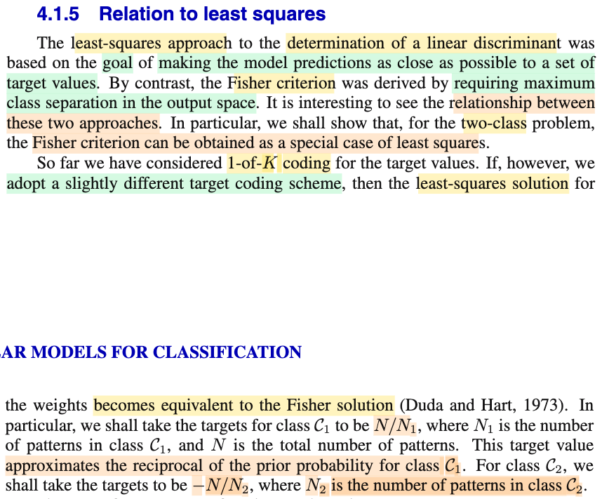
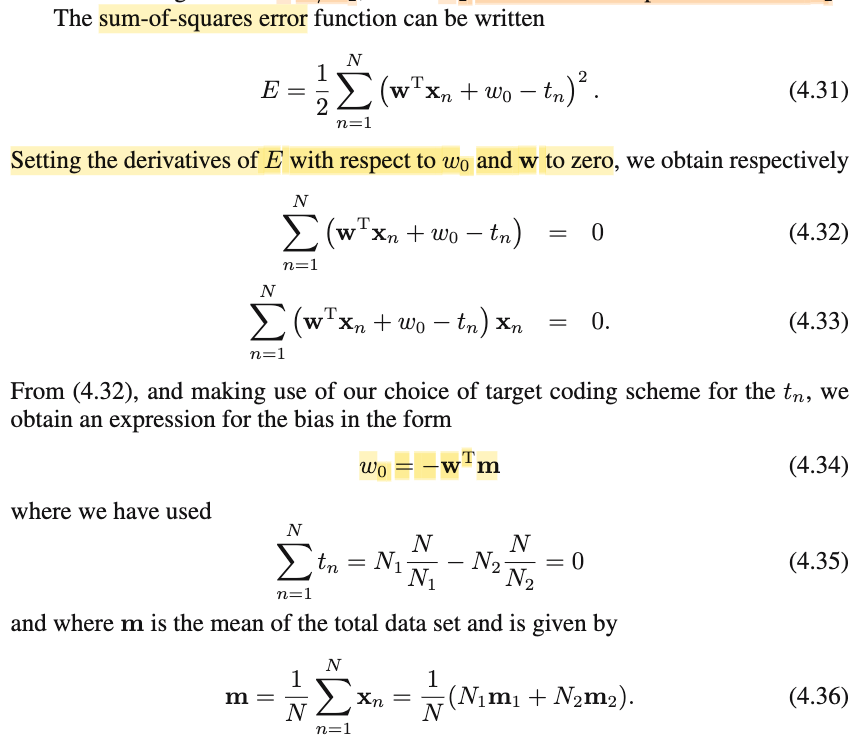
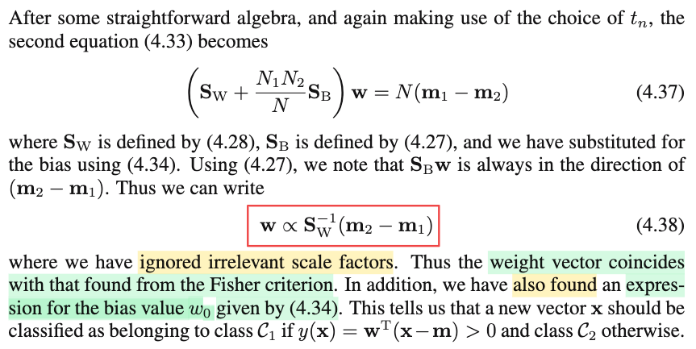

# 4.1.5 Relation to least square

📊 **Progress:** `2` Notes | `3` Screenshots | `1` AI Reviews

---

 

## Section 4.1.5 Relation to Least Squares

<kbd></kbd>

> [!NOTE]
> Đại ý là tác giả nói rằng dù như ta đã thấy nguyên lý của least-square approach rất khác so với của Fisher criterion, trong đó least-square muốn dự đoán phải sát với target nhất có thể (dẫn tới hiện tượng phạt những phân loại "quá đúng" mà mình còn nhớ) còn Fisher criterion thì lại muốn phân tách hai class ra nhiều nhất có thể (và giảm chồng lấn bằng cách giảm within-class variance).
>
>
>
> Tuy nhiên ở đây ông nói, thật ra giữa chúng có quan hệ, và có thể chỉ ra Fisher-criterion là một case đặc biệt của least-square approach.
>
>
>
> Ta sẽ thấy điều này bằng cách đầu tiên là thay đổi target coding scheme (hiểu đại khái là cách thức mà ta thể hiện target variable). 
>
>
>
> Còn nhớ, bữa giờ ta dùng cách mã hóa sau đây để thể hiện target: Ví dụ có K class, và 𝐱1 là data point thuộc loại class 𝒞3. Ta sẽ mã hóa t1 bởi one hot vector mà vị trí số 1 nằm ở thứ 3: \[0, 0, 1, 0,...\]ᵀ, với 𝐱2 là data point thuộc class CK thì t2 sẽ là \[0, 0,..,0, 1\]ᵀ. Đây chính là one-of-K coding scheme.
>
>
>
> Vậy thì giờ, ta thay cách khác như sau. (Và để đơn giản giả sử chỉ có hai class): Nếu 𝐱1 thuộc 𝒞1, thì t1 = N/N1, tức là gì? tức là nó chỉ là một scalar, mang giá trị là tỉ số của \[tổng số data point\] / \[số data point thuộc class 𝒞1\]. Còn 𝐱2 thuộc class 𝒞2 sẽ được mã hóa t2 = -N/N2 (và chỉ cần lấy gần đúng (approximate) của phép chia)

 

### Bình phương tối thiểu phân lớp

<kbd></kbd>

<kbd></kbd>

> [!NOTE]
> Rồi, tiếp theo, khi đã có cách thể hiện target mới. Giờ ta theo cách tiếp cận least-square: Đi tìm 𝐰 (là vector \[w1,...wD\] và w0 để minimize sum-squared-errors, để rồi ta sẽ thấy, với việc chọn cách "mã hóa" target variable như vừa nói, thì 𝐰 tìm được sẽ y chang như kết quả tìm được bởi Fisher criterion.
>
>
>
> SSE, như đã biết = (1/2) Σi=1:N (y(𝐰,𝐱i)-ti)² (từ đây sẽ tự hiểu i chạy từ 1 tới N cho gọn)
>
>
>
> = (1/2) Σi (y(𝐰,𝐱i)-ti)²
>
>
>
> = (1/2) Σi (𝐰ᵀ𝐱i + w0 - ti)²
>
>
>
> Để tìm 𝐰, w0 minimize SSE, ta chuẩn bị đạo hàm đối với 𝐰, w0 (đặng tí nữa dùng first order necessary condition):
>
>
>
> d/dw0 \[(1/2) Σi (𝐰ᵀ𝐱i + w0 - ti)²\] = (1/2) d/dw0 \[ Σi (𝐰ᵀ𝐱i + w0 - ti)²\]
>
>
>
> = (1/2) Σi \[d/dw0 (𝐰ᵀ𝐱i + w0 - ti)²\]
>
>
>
> = (1/2) Σi \[d/d(𝐰ᵀ𝐱i + w0 - ti) (𝐰ᵀ𝐱i + w0 - ti)² . d/d0 (𝐰ᵀ𝐱i + w0 - ti)\] (chain rule)
>
>
>
> = (1/2) Σi \[2(𝐰ᵀ𝐱i + w0 - ti) . 1\]
>
>
>
> = Σi (𝐰ᵀ𝐱i + w0 - ti)
>
>
>
> = \[Σi (𝐰ᵀ𝐱i) + Σi w0 - Σi ti\]
>
>
>
> = \[Σi (𝐰ᵀ𝐱i) + N w0 - Σi ti\]
>
>
>
> Tới đây, xét Σi ti, với ti = N/N1 nếu 𝐱i ∈ class 𝒞1, và -N/N2 nếu thuộc class 𝒞2 thì:
>
>
>
> Σi ti = Σi∈𝒞1 ti + Σi∈𝒞2 ti (tách thành 2 đám)
>
>
>
> = Σi∈𝒞1 (N/N1) + Σi∈𝒞2 (-N/N2)
>
>
>
> = N1 (N/N1) + N2 (-N/N2) (có N1 cái datapoint trong 𝒞1, và N2 cái trong 𝒞2)
>
>
>
> = N - N = 0
>
>
>
> Vậy d/dw0 \[SSE\] = \[Σi (𝐰ᵀ𝐱i) + N w0\]
>
>
>
> Dùng điều kiện cần tối ưu bậc nhất: d/dw0 \[SSE\] = 0 ⇔ \[Σi (𝐰ᵀ𝐱i) + N w0\] = 0
>
>
>
> ⇔ -Σi (𝐰ᵀ𝐱i) = N w0 ⇔ -Σi (𝐰ᵀ𝐱i) / N = w0
>
>
>
> ⇔ w0 = -Σi (𝐰ᵀ𝐱i) / N
>
>
>
> ⇔ w0 = -𝐰ᵀ(Σi 𝐱i) / N
>
>
>
> Cái (Σi 𝐱i) / N, cũng là (1/N) (Σi 𝐱i) chính là 𝐦, vector trung bình của 𝐱1,....𝐱N
>
>
>
> Và (Σi 𝐱i) / N cũng = (Σi∈𝒞1 𝐱i) / N + (Σi∈𝒞2 𝐱i) / N = (Σi∈𝒞1 𝐱i) N1/ N1N + (Σi∈𝒞2 𝐱i) N2 / N2 N
>
>
>
> = N1𝐦1 / N + N2𝐦2 / N = (1/N) (N1𝐦1 + N2𝐦2 )
>
>
>
> Như vậy w0 = -𝐰ᵀ(Σi 𝐱i) / N = -𝐰ᵀ𝐦 → 4.34
>
>
>
> ---
>
>
>
> Làm tiếp với 𝐰:
>
>
>
> d/d𝐰 \[SSE\] = (1/2) Σi \[d/d𝐰 (𝐰ᵀ𝐱i + w0 - ti)²\]
>
>
>
> = (1/2) Σi \[d/d(𝐰ᵀ𝐱i + w0 - ti) (𝐰ᵀ𝐱i + w0 - ti)² . d/d𝐰 (𝐰ᵀ𝐱i + w0 - ti)\]
>
>
>
> = (1/2) Σi \[2(𝐰ᵀ𝐱i + w0 - ti) . d/d𝐰 (𝐰ᵀ𝐱i)\]
>
>
>
> = Σi \[(𝐰ᵀ𝐱i + w0 - ti) . d/d𝐰 (𝐰ᵀ𝐱i)\]
>
>
>
> d/d𝐰 (𝐰ᵀ𝐱i) là gì? Chính là 𝐱i. Vì sao?
>
>
>
> Cách 1 (theo lối hoslistical đã học trong MIT 18.s096) d(𝐰ᵀi) = (𝐰+d𝐰)ᵀ𝐱 - 𝐰ᵀ𝐱 = (𝐰ᵀ𝐱 + d𝐰ᵀ𝐱 - 𝐰ᵀ𝐱 = d𝐰ᵀ𝐱 = 𝐱ᵀd𝐰, là linear operator của d𝐰, nên d/d𝐰 (𝐰ᵀ𝐱) chính là 𝐱. Cách 2: đơn giản cho trường hợp này nhưng khó cho các case khác: 𝐰ᵀ𝐱 là dot product, = Σi wixi, và vector gradient (tức d/d𝐰 (𝐰ᵀ𝐱)) là vector các partial derivative \[∂/∂w1 𝐰ᵀ𝐱, ...∂/∂wD 𝐰ᵀ𝐱\]ᵀ = \[x1, ... xD\]ᵀ = 𝐱)
>
>
>
> (ở trên tiếp tục) = Σi \[(𝐰ᵀ𝐱i + w0 - ti) 𝐱i\]
>
>
>
> = Σi \[(𝐰ᵀ𝐱i + w0 - ti) 𝐱i\] → đây là 4.33 (biến chạy của mình là i, trong sách là n)
>
>
>
> Cho nó bằng 0: Σi \[(𝐰ᵀ𝐱i + w0 - ti) 𝐱i\] = 0
>
>
>
> ⇔ Σi \[(𝐰ᵀ𝐱i + w0 - ti) 𝐱i\] = 0
>
>
>
> Thay w0 đã tìm được vào:
>
>
>
> ..⇔ Σi \[(𝐰ᵀ𝐱i - 𝐰ᵀ𝐦 - ti) 𝐱i\] = 0
>
>
>
> ⇔ Σi \[(𝐰ᵀ(𝐱i - 𝐦) - ti) 𝐱i\] = 0
>
>
>
> ⇔ Σi \[𝐰ᵀ(𝐱i - 𝐦)𝐱i - ti𝐱i\] = 0
>
>
>
> ⇔ Σi \[𝐰ᵀ(𝐱i - 𝐦)𝐱i\] - Σi ti𝐱i = 0
>
>
>
> ⇔ Σi \[𝐰ᵀ(𝐱i - 𝐦)𝐱i\] = Σi ti𝐱i
>
>
>
> Do 𝐰ᵀ(𝐱i - 𝐦) là scalar có thể thoải mái di chuyển chỗ khác.
>
>
>
> ⇔ Σi \[𝐱i 𝐰ᵀ(𝐱i - 𝐦)\] = Σi ti𝐱i
>
>
>
> ⇔ Σi \[𝐱i (𝐱i - 𝐦)ᵀ𝐰\] = Σi ti𝐱i
>
>
>
> ⇔ \[Σi 𝐱i (𝐱i - 𝐦)ᵀ\]𝐰 = Σi ti𝐱i
>
>
>
> ---
>
>
>
> Xét vế phải: Σi ti𝐱i = Σi∈𝒞1 ti𝐱i + Σi∈𝒞2 ti𝐱i = Σi∈𝒞1 (N/N1)𝐱i + Σi∈𝒞2 (-N/N2)𝐱i
>
>
>
> = N (Σi∈𝒞1 𝐱i)/N1 - N (Σi∈𝒞2 𝐱i)/N2
>
>
>
> = N 𝐦1 - N 𝐦2 = N(𝐦1 - 𝐦2)
>
>
>
> ---
>
>
>
> Xét vế trái: \[Σi 𝐱i (𝐱i - 𝐦)ᵀ\]𝐰
>
>
>
> = \[Σi 𝐱i(𝐱i - 𝐦)ᵀ - 0\]𝐰
>
>
>
> = \[Σi 𝐱i(𝐱i - 𝐦)ᵀ - Σi (𝐱i - 𝐦)ᵀ\]𝐰
>
>
>
> (do Σi (𝐱i - 𝐦) = Σi 𝐱i - N𝐦 = Σi 𝐱i - N (Σi 𝐱i)/ N = 0, nên Σi (𝐱i - 𝐦)ᵀ = 0 )
>
>
>
> = \[Σi 𝐱i(𝐱i - 𝐦)ᵀ - 𝐦 Σi (𝐱i - 𝐦)ᵀ\]𝐰 (do 𝐦 × Σi (𝐱i - 𝐦) = 𝐦 × 0 = 𝟎)
>
>
>
> = \[Σi 𝐱i(𝐱i - 𝐦)ᵀ - Σi 𝐦(𝐱i - 𝐦)ᵀ\]𝐰
>
>
>
> = {Σi \[𝐱i(𝐱i - 𝐦)ᵀ - 𝐦(𝐱i - 𝐦)ᵀ\]}𝐰
>
>
>
> = {Σi \[𝐱i(𝐱i - 𝐦)ᵀ - 𝐦(𝐱i - 𝐦)ᵀ\]}𝐰
>
>
>
> = {Σi \[(𝐱i - 𝐦)(𝐱i - 𝐦)ᵀ\]}𝐰
>
>
>
> tiếp tục biến đổi đại số khá dài dòng nhưng cuối cùng ta sẽ có 𝐰 ∝ (𝐒w)⁻¹ (𝐦1 - 𝐦2):
>
>
>
> là kết quả y như của Fisher criterion.
>
>
>
> ---
>
>
>
> Bên cạnh đó việc tìm ra w0 = - 𝐰ᵀ𝐦 cho ta kết quả là một hàm discriminant:
>
>
>
> Nếu 𝐰ᵀ𝐱 - 𝐰ᵀ𝐦 &gt; 0 thì assign class 𝒞1
>
>
>
> ⇔ 𝐰ᵀ(𝐱 - 𝐦) &gt; 0 thì assign class 𝒞1 và otherwise.
>
>
>
> Có nghĩa là sao, có nghĩa là nó cho ta luôn một threshold, để coi như là có đầy đủ hàm discriminant khỏi cần phải làm thêm bước chiếu xuống 𝐰, giải bài toán point estimation giả định distribution là Gaussian, rồi mới từ đó tìm threshold nơi posterior f(𝒞1|y) = f(𝒞2|y).

> [!TIP]
> 🤖 **AI Check** — 🟡 Minor issues — ✅ **95/100** · ✓ Move on
>
> Ghi chú rất xuất sắc, chi tiết và chính xác từng bước biến đổi đại số từ hàm lỗi bình phương tối thiểu đến biểu thức trọng số của Fisher và ngưỡng phân lớp w0.
>
> **🟡 Minor issues**
>
> **1.** *"d/d(𝐰ᵀ𝐱i + w0 - ti) (𝐰ᵀ𝐱i + w0 - ti)² . d/d0 (𝐰ᵀ𝐱i + w0 - ti)"*
>
> Lỗi gõ phím nhỏ ở mẫu số của đạo hàm: viết nhầm thành 'd/d0' thay vì 'd/dw0'.
>
> **2.** *"d(𝐰ᵀi) = (𝐰+d𝐰)ᵀ𝐱 - 𝐰ᵀ𝐱 = (𝐰ᵀ𝐱 + d𝐰ᵀ𝐱 - 𝐰ᵀ𝐱"*
>
> Lỗi gõ phím nhỏ: 'd(𝐰ᵀi)' thiếu vector 𝐱 (đúng ra là d(𝐰ᵀ𝐱)), và mở ngoặc chưa đóng ở vế thứ hai.
>
>
> **✓ Strengths**
> - Khai triển đạo hàm theo w0 và chứng minh tổng các nhãn t_i triệt tiêu bằng 0 rất rõ ràng và mạch lạc.
> - Biến đổi vế trái và vế phải khi đạo hàm theo w rất khéo léo, đặc biệt là bước chèn 𝐦 vào để tạo thành ma trận hiệp phương sai tổng (total scatter matrix).
> - Hiểu sâu sắc ý nghĩa của việc least squares tự động xác định ngưỡng ngưỡng bias w0 mà không cần giả định phân phối Gaussian 1 chiều như Fisher gốc.
>
> **💡 Deeper notes**
> - Biểu thức (4.38) trong sách Bishop ghi w ∝ S_w^(-1)(m_2 - m_1), do S_B w = (m_2 - m_1)(m_2 - m_1)^T w. Dù chiều tỷ lệ ngược dấu chỉ đảo chiều vector chiếu (có thể hấp thu vào hệ số tỷ lệ), việc giữ đúng chiều m_1 - m_2 tương ứng với quy tắc phân lớp y(x) > 0 cho C1.
> - Bước chuyển từ [∑ (x_i - m)(x_i - m)^T] w sang S_w^(-1)(m_1 - m_2) ẩn chứa việc phân rã ma trận scatter tổng S_T thành S_W + (N1*N2/N) S_B, trong đó S_B w cùng phương với (m_1 - m_2), từ đó thu được nghiệm tỷ lệ.

 

