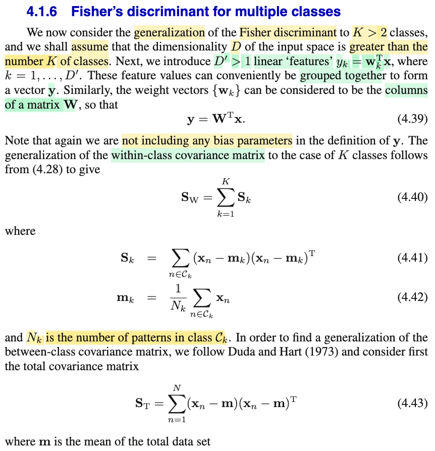
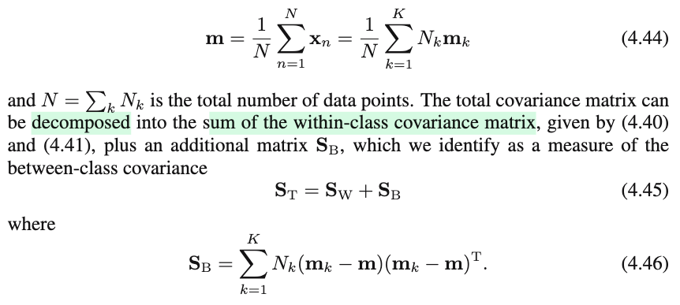
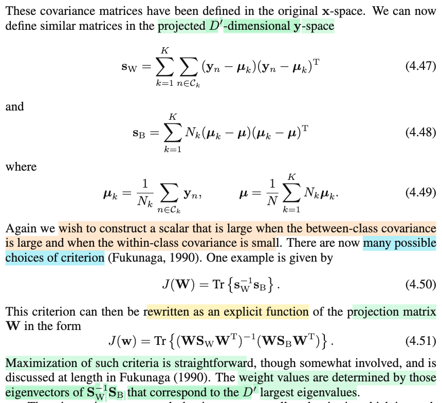
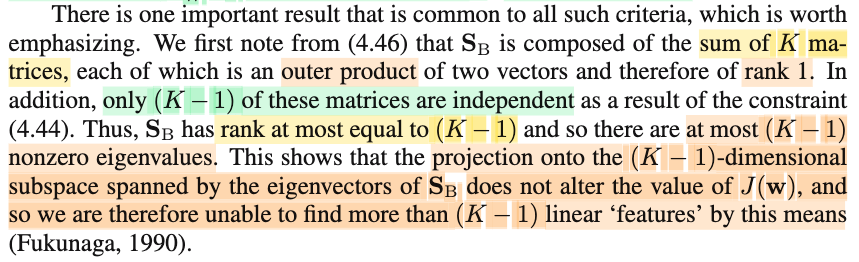

# 4.1.6 Fisher’s discriminant for multiple classes

📊 **Progress:** `2` Notes | `4` Screenshots | `2` AI Reviews

---

 

## Fisher's Discriminant for Multiple Classes

<kbd></kbd>

<kbd></kbd>

<kbd></kbd>

> [!NOTE]
> Xem nào, đại ý ở đây là ta khái quát hóa Fisher's discriminant lên cho bài toán nhiều class hơn
>
>
>
> Giả sử số chiều dữ liệu gốc là D, và gọi D' là số "feature tuyến tính": yk = 𝐰kᵀ𝐱, k=1,...D' tức là sao? Tức là tương tự như khi ta chiếu (!) 𝐱 từ D chiều lên span {𝐰}, bằng cách tính y = 𝐰ᵀ𝐱, mang ý nghĩa là giảm chiều dữ liệu từ D còn thành 1 chiều, và đây là feature tuyến tính vì y là hàm tuyến tính đối với 𝐱 đơn giản vậy thôi (nhưng gợi ý ta rằng vài bữa ta sẽ có các feature phi tuyến?), thì ở đây, ta sẽ dùng D' vector: 𝐰1,...𝐰D', để chiếu data lên, tạo ra D' feature tuyến tính y1=𝐰1ᵀ𝐱,...,yD' = 𝐰D'ᵀ𝐱, gom lại thành vector D' chiều: 𝐲. Như vậy mang ý nghĩa, là, từ dữ liệu D chiều ban đầu, ta nén còn D' chiều..
>
>
>
> Và thể hiện compact bằng cách đặt các 𝐰1,.., 𝐰D' thành các cột của 𝐖. Khi đó 𝐲 = 𝐖ᵀ𝐱, cái này dễ hiểu (vì phần tử yj sẽ là dot product của hàng j của 𝐖ᵀ, cũng là cột j của 𝐖, chính là 𝐰j với 𝐱: yj = 𝐰jᵀ𝐱)
>
>
>
> ---
>
>
>
> (!) Chú ý, **nói là chiếu nhưng nên hiểu là linear mapping từ R^D sang R^D'** nhưng **không phải là chiếu vuông góc (orthogonal projection) như trong trực giác hình học của bài toán least square.**
>
>
>
> ---
>
>
>
> Tiếp, với 2 class bữa trước, thì ta có 𝐒w:
>
>
>
> 𝐒w = 𝐒1 + 𝐒2 = Σi∈𝒞1 (𝐱i - 𝐦1)(𝐱i - 𝐦1)ᵀ + Σi∈𝒞2 (𝐱i - 𝐦2)(𝐱i - 𝐦2)ᵀ
>
>
>
> thì nay khái quát của within-class covariance matrix cho case K class là:
>
>
>
> 𝐒w = Σk=1:K 𝐒k 
>
>
>
> với 𝐒k = Σi∈𝒞k (𝐱i - 𝐦k)(𝐱i - 𝐦k)ᵀ và 𝐦k = (1/Nk) Σi∈𝒞k 𝐱i.
>
>
>
> ---
>
>
>
> Nhân tiện có thể thắc mắc vì sao đây lại là công thức của (within class) covariance matrix? hay, vì sao có công thức covariance matrix như vậy.
>
>
>
> Theo định nghĩa, nếu ta có random vector 𝐗, 𝐘 thì Cov(𝐗,𝐘) = E\[(𝐗-E(𝐗))(𝐘-E(𝐘))ᵀ\],
>
>
>
> (𝐗-E(𝐗))(𝐘-E(𝐘))ᵀ là random matrix có phần từ ij (Xi - E(Xi)) × (Yj - E(Yj))
>
>
>
> nên phần tử ij của Cov(𝐗, 𝐘) = E\[(Xi - E(Xi)) × (Yj - E(Yj))\]
>
>
>
> Cov(𝐗, 𝐗), ta viết gọn là Cov(𝐗) = E\[(𝐗-E(𝐗))(𝐗-E(𝐗))ᵀ\], thì phần tử ij là E\[(Xi - E(Xi))(Xj - E(Xj))\]
>
>
>
> Thế thì, để tính kì vọng, ta phải biết distribution: các possible value, và xác suất
>
>
>
> Vậy ta lập luận là: 𝐱1, ...𝐱N là các possible value của discrete uniform 𝐗, tức P(𝐗 = 𝐱1) = ...= P(𝐗 = 𝐱N) = 1/N
>
>
>
> E\[𝐗\] sẽ bằng: 𝐱1 × P(𝐗=𝐱1) + ...+ 𝐱N × P(𝐗=𝐱N) (định nghĩa kì vọng của discrete rv)
>
>
>
> = 𝐱1/N + ...+ 𝐱N/N = (Σi 𝐱i)/N, đặt là 𝐦 (sample mean)
>
>
>
> thì Cov(𝐗) = E\[(𝐗-E(𝐗))(𝐗-E(𝐗))ᵀ\] = (𝐱1-E(𝐗))(𝐱1-E(𝐗))ᵀ × P(𝐗=𝐱1) + ...+ (𝐱N-E(𝐗))(𝐱N-E(𝐗))ᵀ × P(𝐗=𝐱N)
>
>
>
> = (1/N) \[(𝐱1-E(𝐗))(𝐱1-E(𝐗))ᵀ + ...+ (𝐱N-E(𝐗))(𝐱N-E(𝐗))ᵀ\]
>
>
>
> = (1/N) \[(𝐱1-𝐦)(𝐱1-𝐦)ᵀ + ...+ (𝐱N-𝐦)(𝐱N-𝐦)ᵀ\]
>
>
>
> = (1/N) Σi (𝐱i-𝐦)(𝐱i-𝐦)ᵀ
>
>
>
> Bỏ 1/N đi, ta sẽ được cái gọi là scatter matrix, ta có Σi (𝐱i-𝐦)(𝐱i-𝐦)ᵀ. và những chỗ mà mr Bishop nói within-class hay between-class covariance matrix, thực chất không phải là covariance matrix mà là scatter matrix
>
>
>
> Như vậy, đây đại ý là công thức covariance matrix khi ta coi như 𝐗, vốn chưa biết distribution nó thế nào, để mà tính E\[(𝐗-E(𝐗))(𝐗-E(𝐗))ᵀ\], ta coi nó như uniform discrete có các possible value 𝐱1,...𝐱N, rồi để tính với distribution này, gọi là **emprical distribution**.
>
>
>
> ---
>
>
>
> Tiếp, quay lại đây, ta đặt 𝐒T, là total covariance matrix thì biến đổi đại số ta có thể tách 𝐒T thành 𝐒W + 𝐒B với 𝐒B theo công thức 𝐒B = Σk Nk(𝐦k - 𝐦)(𝐦k - 𝐦)ᵀ (4.46) (cái này chỉ là biến đổi đại số, **dài dòng nhưng không khó**, cứ tạm biết vậy)
>
>
>
> ---
>
>
>
> Như vậy, trong không gian gốc (nơi data là 𝐱1,...𝐱N, chia thành các class 𝒞1,...𝒞K), covariance matrix tổng là:
>
>
>
> 𝐒T = 𝐒W + 𝐒B với 𝐒W là tổng các within-class covariance matrix Σk=1:K 𝐒k có công thức 𝐒k = Σi∈𝒞k \[(𝐱i - 𝐦k)(𝐱i - 𝐦k)ᵀ\]
>
>
>
> Thì tương tự, trong không gian hình chiếu (nơi ta đã chiếu D-dimensional vector 𝐱1,...𝐱N thành các D' dimensional vector 𝐲1 = 𝐖ᵀ𝐱1, 𝐲2 = 𝐖ᵀ𝐱2,..., 𝐲N = 𝐖ᵀ𝐱N thì
>
>
>
> 𝐬W (within-class covariance matrix trong không gian chiếu), dùng chữ 𝐬 nhỏ
>
>
>
> = Σk=1:K 𝐬k, với 𝐬k = Σi∈𝒞k (𝐲i-𝛍k)(𝐱i-𝛍k)ᵀ (tương tự thôi)
>
>
>
> = Σk=1:K \[Σi∈𝒞k (𝐲i-𝛍k)(𝐲i-𝛍k)ᵀ\]
>
>
>
> Và cũng tương tự, 𝐬B = Σk Nk(𝛍k - 𝛍)(𝛍k - 𝛍)ᵀ
>
>
>
> ---
>
>
>
> Thế thì, trong case 2 class, mình còn nhớ Fisher criterion được đặt ra theo ý định đạt được hai thứ sau: Maximize sự phân tách của hai class sau khi chiếu, bằng cách maximize distance của hình chiếu của hai tâm của hai đám data thuộc hai class) và minimize sự chồng lấn bằng cách minimize mức phân tán của hình chiếu dữ liệu của mỗi class. Và với ý định đó, ta đặt ra criterion là \[between-class variance\] và \[within class variance\], và đây là một con số (scalar) phụ thuộc 𝐰, để rồi bằng cách maximize cái này theo 𝐰 ta sẽ tìm được 𝐰 tốt nhất cho mục tiêu trên.
>
>
>
> Thì điểm mình hiểu là, ta muốn thiết kế criterion là một scalar, để chi, để ta có bài toán tối ưu hàm mục tiêu là một hàm vector scalar, như vậy sẽ dễ hơn thay vì hàm mục tiêu là hàm vector - vector hay vector - matrix
>
>
>
> Thì ở đây tương tự vậy, mục tiêu cũng là như vậy, do đó ta mới thấy gs nói ta muốn construct một scalar sao cho khi nó lớn thì between-class covariance lớn và within class covariance nhỏ.
>
>
>
> Có thể hỏi vì sao ko làm như trước, lấy hai cái chia nhau: À thì là vì ở case 2 class, hai cái between / with variance chỉ là một con số (variance), nên chia nhau được. Còn ở đây, mức phân tán between-class / within-class được thể hiện bởi các covariance MATRIX, thì làm sao chia nhau được.
>
>
>
> Nhưng có một cách: Dùng trace: J(𝐖) = tr(𝐬W⁻¹ 𝐬B}. Vì sao lại dùng cái này?
>
>
>
> Vì trace, như đã biết là tổng các phần tử đường chéo, cũng là tổng các eigenvalue.
>
>
>
> Nên tr(𝐬W⁻¹ 𝐬B} là tổng eigenvalue của 𝐬W⁻¹ 𝐬B. Nếu 𝐬W nhỏ, thì 𝐬W⁻¹ sẽ lớn lại, khiến tr(𝐬W⁻¹ 𝐬B} lớn. Và nếu 𝐬B lớn, thì tr(𝐬W⁻¹ 𝐬B} cũng lớn. Do đó đây là objective mà khi nó lớn, ta sẽ bóp 𝐬W nhỏ → giảm withclass-covariance và 𝐬B lớn → răng between-class covariance.
>
>
>
> Dĩ nhiên đây vẫn là hàm gián tiếp phụ thuộc 𝐖, thay vào ta có công thức tường minh (explicit):
>
>
>
> 𝐬W = Σk \[Σi∈𝒞k (𝐲i-𝛍k)(𝐲i-𝛍k)ᵀ\]
>
>
>
> = Σk \[Σi∈𝒞k (𝐖ᵀ𝐱i-𝐖ᵀ𝐦k)(𝐖ᵀ𝐱i-𝐖ᵀ𝐦k)ᵀ\] (vì 𝐲i = 𝐖ᵀ𝐱i, 𝛍k là hình chiếu của 𝐦k, = 𝐖ᵀ𝐦k)
>
>
>
> = Σk \[Σi∈𝒞k 𝐖ᵀ(𝐱i-𝐦k)(𝐖ᵀ(𝐱i-𝐦k))ᵀ\]
>
>
>
> = Σk \[Σi∈𝒞k 𝐖ᵀ(𝐱i-𝐦k)(𝐱i-𝐦k)ᵀ𝐖\]
>
>
>
> = Σk 𝐖ᵀ \[Σi∈𝒞k (𝐱i-𝐦k)(𝐱i-𝐦k)ᵀ\] 𝐖
>
>
>
> = 𝐖ᵀ (Σk \[Σi∈𝒞k (𝐱i-𝐦k)(𝐱i-𝐦k)ᵀ\]) 𝐖
>
>
>
> Cái ở giữa chính là 𝐒W
>
>
>
> = 𝐖ᵀ (𝐒W) 𝐖
>
>
>
> 𝐬B = Σk Nk(𝛍k - 𝛍)(𝛍k - 𝛍)ᵀ, tương tự, biến đổi tí sẽ thấy nó là 𝐖ᵀ (𝐒B) 𝐖
>
>
>
> ⇒ J(𝐖) = tr(𝐬W⁻¹ 𝐬B}
>
>
>
> = tr(\[𝐖ᵀ (𝐒W) 𝐖\]⁻¹ 𝐖ᵀ (𝐒B) 𝐖)
>
>
>
> Đây là công thức 4.51. Hình như giáo sư Bishop viết sai chỗ này, vì 𝐲 = 𝐖ᵀ𝐱 thì biến đổi xong ở đầu phải là 𝐖ᵀ
>
>
>
> ---
>
>
>
> Như vậy cái ta cần làm là giải bài toán maximize over 𝐖 hàm J(𝐖) = tr(\[𝐖ᵀ (𝐒W) 𝐖\]⁻¹ 𝐖ᵀ (𝐒B) 𝐖)
>
>
>
> Và ông Bishop nói Fukunaga 1990 giải bài toán này, rất dài, kết quả cho ra các cột của 𝐖 là các eigenvector của 𝐒W⁻¹𝐒B tương ứng với D' eigenvalue lớn nhất. (cái này tạm biết vậy)

🌐 English translation of the original note

> *This is an AI-translated version of the original note.*
>
> Let's see, the main idea here is that we generalize Fisher's discriminant to the problem with more classes
>
>
>
> Suppose the original data dimension is D, and call D' the number of "linear features": yk = 𝐰kᵀ𝐱, k=1,...D' what does that mean? That means similarly to when we project (!) 𝐱 from D dimensions onto span {𝐰}, by calculating y = 𝐰ᵀ𝐱, carrying the meaning of reducing data dimension from D down to 1 dimension, and this is a linear feature because y is a linear function with respect to 𝐱 as simple as that (but hinting to us that in a few days we will have nonlinear features?), then here, we will use D' vectors: 𝐰1,...𝐰D', to project data onto, creating D' linear features y1=𝐰1ᵀ𝐱,...,yD' = 𝐰D'ᵀ𝐱, grouped into a D'-dimensional vector: 𝐲. Thus carrying the meaning, that, from the initial D-dimensional data, we compress down to D' dimensions..
>
>
>
> And expressed compactly by setting 𝐰1,.., 𝐰D' as the columns of 𝐖. Then 𝐲 = 𝐖ᵀ𝐱, this is easy to understand (because element yj will be the dot product of row j of 𝐖ᵀ, which is also column j of 𝐖, namely 𝐰j with 𝐱: yj = 𝐰jᵀ𝐱)
>
>
>
> ---
>
>
>
> (!) Note, **saying projection but it should be understood as linear mapping from R^D to R^D'** but **not an orthogonal projection (orthogonal projection) as in the geometric intuition of the least square problem.**
>
>
>
> ---
>
>
>
> Next, with the two classes the other day, then 𝐒1 = Σi∈𝒞1 (𝐱i - 𝐦1)(𝐱i - 𝐦1)ᵀ, 𝐒2 = Σi∈𝒞2 (𝐱i - 𝐦2)(𝐱i - 𝐦2)ᵀ
>
>
>
> then now the generalization of within-class covariance matrix for the K class case is:
>
>
>
> 𝐒w = Σk=1:K 𝐒k with 𝐒k = Σi∈𝒞k (𝐱i - 𝐦k)(𝐱i - 𝐦k)ᵀ and 𝐦k = (1/Nk) Σi∈𝒞k 𝐱i.
>
>
>
> By the way one might wonder why this is the formula of the (within class) covariance matrix? or, why there is such a covariance matrix formula.
>
>
>
> By definition, if we have random vector 𝐗, 𝐘 then Cov(𝐗,𝐘) = E\[(𝐗-E(𝐗))(𝐘-E(𝐘))ᵀ\],
>
>
>
> (𝐗-E(𝐗))(𝐘-E(𝐘))ᵀ is a random matrix with element ij (Xi - E(Xi)) × (Yj - E(Yj))
>
>
>
> so element ij of Cov(𝐗, 𝐘) = E\[(Xi - E(Xi)) × (Yj - E(Yj))\]
>
>
>
> Cov(𝐗, 𝐗), we write shorthand as Cov(𝐗) = E\[(𝐗-E(𝐗))(𝐗-E(𝐗))ᵀ\], then element ij is E\[(Xi - E(Xi))(Xj - E(Xj))\]
>
>
>
> Then, to calculate expectation, we have to know the distribution: the possible values, and probability
>
>
>
> So we argue that: 𝐱1, ...𝐱N are the possible values of discrete uniform 𝐗, i.e. P(𝐗 = 𝐱1) = ...= P(𝐗 = 𝐱N) = 1/N
>
>
>
> E\[𝐗\] will be equal to: 𝐱1 × P(𝐗=𝐱1) + ...+ 𝐱N × P(𝐗=𝐱N) (definition of expectation of discrete rv)
>
>
>
> = 𝐱1/N + ...+ 𝐱N/N = (Σi 𝐱i)/N, set as 𝐦 (sample mean)
>
>
>
> then Cov(𝐗) = E\[(𝐗-E(𝐗))(𝐗-E(𝐗))ᵀ\] = (𝐱1-E(𝐗))(𝐱1-E(𝐗))ᵀ × P(𝐗=𝐱1) + ...+ (𝐱N-E(𝐗))(𝐱N-E(𝐗))ᵀ × P(𝐗=𝐱N)
>
>
>
> = (1/N) \[(𝐱1-E(𝐗))(𝐱1-E(𝐗))ᵀ + ...+ (𝐱N-E(𝐗))(𝐱N-E(𝐗))ᵀ\]
>
>
>
> = (1/N) \[(𝐱1-𝐦)(𝐱1-𝐦)ᵀ + ...+ (𝐱N-𝐦)(𝐱N-𝐦)ᵀ\]
>
>
>
> = (1/N) Σi (𝐱i-𝐦)(𝐱i-𝐦)ᵀ
>
>
>
> Dropping 1/N, we will get what is called scatter matrix, we have Σi (𝐱i-𝐦)(𝐱i-𝐦)ᵀ. and the places where mr Bishop says within-class or between-class covariance matrix, is actually not covariance matrix but scatter matrix 
>
>
>
> Thus, this is roughly the covariance matrix formula when we treat 𝐗, whose distribution is originally not yet known how it is, in order to calculate E\[(𝐗-E(𝐗))(𝐗-E(𝐗))ᵀ\], we treat it as uniform discrete having possible values 𝐱1,...𝐱N, then to calculate with this distribution, called **emprical distribution**.
>
>
>
> ---
>
>
>
> Next, we let 𝐒T, be the total covariance matrix then by algebraic transformation we can split 𝐒T into 𝐒W + 𝐒B with 𝐒B according to formula 𝐒B = Σk Nk(𝐦k - 𝐦)(𝐦k - 𝐦)ᵀ (4.46) (this is just algebraic transformation, **lengthy but not difficult**, just tentatively know it like that)
>
>
>
> ---
>
>
>
> Thus, in the original space (where data is 𝐱1,...𝐱N, divided into classes 𝒞1,...𝒞K), the total covariance matrix is:
>
>
>
> 𝐒T = 𝐒W + 𝐒B with 𝐒W being the sum of the within-class covariance matrices Σk=1:K 𝐒k having formula 𝐒k = Σi∈𝒞k \[(𝐱i - 𝐦k)(𝐱i - 𝐦k)ᵀ\]
>
>
>
> Then similarly, in the projected space (where we have projected D-dimensional vectors 𝐱1,...𝐱N into D' dimensional vectors 𝐲1 = 𝐖ᵀ𝐱1, 𝐲2 = 𝐖ᵀ𝐱2,..., 𝐲N = 𝐖ᵀ𝐱N then
>
>
>
> 𝐬W (within-class covariance matrix in projected space), using lowercase letter 𝐬
>
>
>
> = Σk=1:K 𝐬k, with 𝐬k = Σi∈𝒞k (𝐲i-𝛍k)(𝐱i-𝛍k)ᵀ (just similar)
>
>
>
> = Σk=1:K \[Σi∈𝒞k (𝐲i-𝛍k)(𝐲i-𝛍k)ᵀ\]
>
>
>
> And also similarly, 𝐬B = Σk Nk(𝛍k - 𝛍)(𝛍k - 𝛍)ᵀ
>
>
>
> ---
>
>
>
> Then, in the 2 class case, I still remember Fisher criterion was set up according to the intention of achieving the following two things: Maximize the separation of the two classes after projection, by maximizing distance of the projection of the two centers of the two data clusters belonging to the two classes) and minimize the overlap by minimizing the dispersion level of the projected data of each class. And with that intention, we set up the criterion as \[between-class variance\] and \[within class variance\], and this is a number (scalar) depending on 𝐰, so that by maximizing this with respect to 𝐰 we will find the best 𝐰 for the above objective.
>
>
>
> Then the point I understand is, we want to design the criterion to be a scalar, for what, so that we have the problem of optimizing an objective function that is a vector scalar function, which will be easier instead of the objective function being a vector - vector or vector - matrix function
>
>
>
> Then here similarly, the objective is also like that, therefore we only then see prof saying we want to construct a scalar such that when it is large, between-class covariance is large and within class covariance is small.
>
>
>
> One could ask why not do like before, divide the two by each other: Ah well because in the 2 class case, the two between / with variance are just a number (variance), so can be divided by each other. Whereas here, the between-class / within-class dispersion level is represented by covariance MATRIX, so how can they be divided by each other.
>
>
>
> But there is a way: Use trace: J(𝐖) = tr(𝐬W⁻¹ 𝐬B}. Why use this?
>
>
>
> Because trace, as is known is the sum of diagonal elements, also the sum of eigenvalues.
>
>
>
> So tr(𝐬W⁻¹ 𝐬B} is the sum of eigenvalues of 𝐬W⁻¹ 𝐬B. If 𝐬W is small, then 𝐬W⁻¹ will become large again, making tr(𝐬W⁻¹ 𝐬B} large. And if 𝐬B is large, then tr(𝐬W⁻¹ 𝐬B} is also large. Therefore this is the objective where when it is large, we will squeeze 𝐬W small → reduce withclass-covariance and 𝐬B large → tooth between-class covariance.
>
>
>
> Naturally this is still an indirect function depending on 𝐖, substituting in we have the explicit formula:
>
>
>
> 𝐬W = Σk \[Σi∈𝒞k (𝐲i-𝛍k)(𝐲i-𝛍k)ᵀ\]
>
>
>
> = Σk \[Σi∈𝒞k (𝐖ᵀ𝐱i-𝐖ᵀ𝐦k)(𝐖ᵀ𝐱i-𝐖ᵀ𝐦k)ᵀ\] (because 𝐲i = 𝐖ᵀ𝐱i, 𝛍k is the projection of 𝐦k, = 𝐖ᵀ𝐦k)
>
>
>
> = Σk \[Σi∈𝒞k 𝐖ᵀ(𝐱i-𝐦k)(𝐖ᵀ(𝐱i-𝐦k))ᵀ\]
>
>
>
> = Σk \[Σi∈𝒞k 𝐖ᵀ(𝐱i-𝐦k)(𝐱i-𝐦k)ᵀ𝐖\]
>
>
>
> = Σk 𝐖ᵀ \[Σi∈𝒞k (𝐱i-𝐦k)(𝐱i-𝐦k)ᵀ\] 𝐖
>
>
>
> = 𝐖ᵀ (Σk \[Σi∈𝒞k (𝐱i-𝐦k)(𝐱i-𝐦k)ᵀ\]) 𝐖
>
>
>
> The thing in the middle is precisely 𝐒W
>
>
>
> = 𝐖ᵀ (𝐒W) 𝐖
>
>
>
> 𝐬B = Σk Nk(𝛍k - 𝛍)(𝛍k - 𝛍)ᵀ, similarly, transforming a bit will see that it is 𝐖ᵀ (𝐒B) 𝐖
>
>
>
> ⇒ J(𝐖) = tr(𝐬W⁻¹ 𝐬B}
>
>
>
> = tr(\[𝐖ᵀ (𝐒W) 𝐖\]⁻¹ 𝐖ᵀ (𝐒B) 𝐖)
>
>
>
> This is formula 4.51. It seems professor Bishop wrote it wrong here, because 𝐲 = 𝐖ᵀ𝐱 then after transforming the beginning must be 𝐖ᵀ
>
>
>
> ---
>
>
>
> Thus what we need to do is solve the problem of maximize over 𝐖 the function J(𝐖) = tr(\[𝐖ᵀ (𝐒W) 𝐖\]⁻¹ 𝐖ᵀ (𝐒B) 𝐖)
>
>
>
> And Mr. Bishop said Fukunaga 1990 solved this problem, very long, the result gives the columns of 𝐖 as the eigenvectors of 𝐒W⁻¹𝐒B corresponding to the D' largest eigenvalues. (just know this for now)

---

**🤖 AI Check (English)**

Summary: Excellent notes, very firmly grasping the geometric, algebraic, and statistical nature of multiclass Fisher LDA. In particular, you yourself accurately detected the typographical notation error (erratum) in formula (4.51) of Bishop's book.

Minor issues:
1. "𝐬k = Σi∈𝒞k (𝐲i-𝛍k)(𝐱i-𝛍k)ᵀ (just similar)" — There is a small typo with the variable 𝐱i instead of 𝐲i in the second factor. Although right in the line below you rewrote it correctly as (𝐲i-𝛍k)(𝐲i-𝛍k)ᵀ, you should still correct this line to avoid confusion when rereading.
2. "J(𝐖) = tr(𝐬W⁻¹ 𝐬B}" — The expression with the existence of the inverse 𝐬W⁻¹ (and 𝐒W⁻¹) implicitly assumes that the within-class scatter matrix is invertible. This requires the number of data samples to be sufficiently large compared to the number of dimensions (N - K ≥ D), otherwise it will encounter the singularity phenomenon (small sample size problem) that requires regularization techniques (regularization).

Strengths:
• Extremely accurate detection of Professor Bishop's typographical error (official erratum) in formula (4.51) when swapping the positions between 𝐖 and 𝐖ᵀ.
• Very deep and intuitive reasoning about the origin of the covariance/scatter matrix through the empirical distribution (empirical distribution).
• Clear distinction between linear projection (linear projection/mapping) and orthogonal projection (orthogonal projection) in least squares.

Deeper notes:
• Because 𝐒B is the sum of K rank-1 matrices with the constraint that the weighted sum equals 0 (because the sum of Nk(𝐦k - 𝐦) = 0), the rank of 𝐒B is at most K - 1. Therefore, the number of non-zero eigenvalues of 𝐒W⁻¹𝐒B is at most K - 1, leading to the maximum compressed dimension D' meaningful for classification being K - 1.
• The case of more than 2 classes does not guarantee that projecting to 1 dimension is optimal, but rather requires projecting to D' dimensions (with 1 < D' ≤ K - 1).

> [!TIP]
> 🤖 **AI Check** — 🟡 Minor issues — ✅ **95/100** · ✓ Move on
>
> Ghi chú rất xuất sắc, nắm chắc bản chất hình học, đại số tuyến tính và thậm chí phát hiện chính xác lỗi in sai (typo) kinh điển trong công thức (4.51) của sách Bishop.
>
> **🟡 Minor issues**
>
> **1.** *"𝐬k = Σi∈𝒞k (𝐲i-𝛍k)(𝐱i-𝛍k)ᵀ"*
>
> Có một lỗi gõ nhầm nhỏ giữa 𝐱i và 𝐲i ở thừa số thứ hai, dù ngay dòng tiếp theo bạn đã viết lại đúng là (𝐲i - 𝛍k)(𝐲i - 𝛍k)ᵀ.
>
> **2.** *"Nếu 𝐬W nhỏ, thì 𝐬W⁻¹ sẽ lớn lại, khiến tr(𝐬W⁻¹ 𝐬B} lớn."*
>
> Cách diễn giải này mang tính trực giác số học (scalar). Đối với ma trận, khái niệm 'lớn/nhỏ' được hiểu theo nghĩa xác định dương (positive definite ordering / Loewner order) hoặc theo độ lớn các trị riêng (độ phân tán theo các hướng).
>
>
> **✓ Strengths**
> - Phát hiện rất chuẩn xác lỗi in ấn trong công thức (4.51) của Bishop: vì 𝐲 = 𝐖ᵀ𝐱 với 𝐖 ∈ ℝ^(D × D') nên biểu thức đúng phải là 𝐖ᵀ 𝐒_W 𝐖 chứ không phải 𝐖 𝐒_W 𝐖ᵀ.
> - Phân biệt rất rõ ràng giữa ánh xạ tuyến tính giảm chiều và phép chiếu trực giao (orthogonal projection), tránh nhầm lẫn với Least Squares.
> - Hiểu sâu sắc mối liên hệ giữa ma trận hiệp phương tác (covariance matrix) lý thuyết thông qua phân phối thực nghiệm (empirical distribution) và ma trận tán xạ (scatter matrix).
>
> **💡 Deeper notes**
> - Hạng của ma trận giữa các lớp (between-class covariance) 𝐒B tối đa chỉ là K - 1 vì nó là tổng của K vector (𝐦k - 𝐦) có ràng buộc tổng bằng 0 (Σ Nk(𝐦k - 𝐦) = 0). Do đó 𝐒W⁻¹𝐒B chỉ có tối đa K - 1 trị riêng khác 0, dẫn tới số chiều tối đa hữu ích của không gian chiếu là D' ≤ K - 1.
> - Để 𝐒W khả nghịch (invertible), ta cần số lượng mẫu đủ lớn so với số chiều dữ liệu (cụ thể N - K ≥ D); nếu số chiều D lớn hơn số mẫu N (như trong bài toán nhận diện khuôn mặt), 𝐒W sẽ bị suy biến và cần các kỹ thuật hiệu chỉnh (regularization) hoặc PCA trước.

 

### Rank of Between-Class Scatter Matrix

<kbd></kbd>

> [!NOTE]
> Rồi đoạn cuối đại khái là nói 𝐒B, theo công thức hồi nãy = Σk Nk(𝐦k - 𝐦)(𝐦k - 𝐦)ᵀ, dễ thấy là tổng các rank 1 matrix Nk(𝐦k - 𝐦)(𝐦k - 𝐦)ᵀ
>
>
>
> Vì sao rank 1?
>
>
>
> À là vì đây là outer product của hai vector: Lập luận vầy sẽ thấy nó là rank 1: Giả sử A = abᵀ, có thể coi như đây là tích của hai matrix a, có m hàng, 1 cột và bᵀ có 1 hàng, n cột. Thì theo góc nhìn thứ hai của việc nhân hai matrix E = CD thì cột j của E là linear combination các cột của C bởi hệ số là các phần tử của cột j của D.
>
>
>
> Do đó, cột j của A là linear combination các cột của "matrix a" bởi hệ số là các các phần tử của cột j của "matrix b". Và matrix a chỉ có 1 cột cũng như cột j của b cũng chỉ có 1 phần tử, nên cột j của A là vector a × scalar bj. Như vậy, cột 1 của A là scalar b1 × vector a, cột 2 của A là scalar b2 × vector a,...Từ đó thấy ngay các cột của A đều bằng \[số gì đó\] × vector a, do đó chúng đều phụ thuộc tuyến tính vector a. Đồng nghĩa, trong các cột của A, chỉ có một vector độc lập (vì chúng đều chỉ có cùng một phương). Và như vậy, dimension của C(A) = 1 cũng là rank = 1.
>
>
>
> Như vậy, N1(𝐦1 - 𝐦)(𝐦1 - 𝐦)ᵀ sẽ giống như abᵀ, có các cột đều trùng hướng với 𝐦1 - 𝐦, nên chỉ có rank = 1.
>
>
>
> Và tổng chúng lại, nếu như 𝐦1 - 𝐦, 𝐦2 - 𝐦,...𝐦K - 𝐦 đều là các hướng khác nhau (độc lập tuyến tính) thì Σk Nk(𝐦k - 𝐦)(𝐦k - 𝐦)ᵀ sẽ có rank K (với điều kiện ta đang giả định D ≥ K)
>
>
>
> Vấn đề là vì 𝐦 = (Σk Nk𝐦k)/N (cái này dễ thấy)
>
>
>
> nên N𝐦 = (Σk Nk𝐦k) ⇒ (Σk Nk 𝐦k) - N𝐦 = 0
>
>
>
> (Σk Nk 𝐦k) - (Σk Nk) 𝐦 = 0
>
>
>
> ⇔ (Σk Nk 𝐦k) - (Σk Nk 𝐦) = 0
>
>
>
> ⇔ Σk \[Nk 𝐦k - Nk 𝐦\] = 0
>
>
>
> ⇔ Σk \[Nk (𝐦k - 𝐦)\] = 0
>
>
>
> ⇔ Σk=1:K-1 \[Nk(𝐦k - 𝐦)\] + NK (𝐦K - 𝐦) = 0
>
>
>
> ⇔ Σk=1:K-1 \[Nk(𝐦k - 𝐦)\] = - NK (𝐦K - 𝐦)
>
>
>
> ⇔ Σk=1:K-1 \[-(Nk / NK) (𝐦k - 𝐦)\] = 𝐦K - 𝐦)
>
>
>
> và như vậy cho thấy (𝐦K - 𝐦) có thể được tạo ra bởi (linear combination của) mấy thằng còn lại, nên theo MIT 1806 đã học, ta nói nó **phụ thuộc tuyến tính** mấy thằng đó.
>
>
>
> Như vậy, nhiều nhất, ta chỉ có K-1 vector độc lập (có thể còn ít hơn, vì có khi cả đám K vector nhưng chỉ có vài cái là độc lập)
>
>
>
> Nhưng như vậy thì sao?
>
>
>
> ---
>
>
>
> Thì hậu quả là: Ở trên vừa nói giải bài toán tìm 𝐖 ta sẽ thấy chúng là D' eigenvector ứng với những eigevalue lớn nhất của của 𝐒W⁻¹𝐒B.
>
>
>
> Như vậy gọi u và λ là eigenvector và eigenvalue của 𝐒W⁻¹𝐒B ta có:
>
>
>
> 𝐒W⁻¹𝐒B u = λ u
>
>
>
> nên trong D cột, nó chỉ có K-1 cột độc lập, D-K+1 cột phụ thuộc, ứng với D-K+1 vector độc lập khác 0 trong nullspace.
>
> \
> Và điều này cho ta một kết luận rằng: Có D-K+1 vector độc lập 𝐯1,...𝐯D-K+1 thỏa:
>
>
>
> 𝐒B 𝐯j = 0, mà 0 thì cũng là = 0 × 𝐯j
>
>
>
> điều này chính là nói, ta có D-K+1 eigenvector của 𝐒B ứng với cùng giá trị eigenvalue = 0.
>
>
>
> Và như vậy với các vector 𝐯j này thì 𝐒W⁻¹𝐒B 𝐯j cũng bằng 0, cho thấy 𝐒W⁻¹𝐒B cũng có D-K+1 eigenvector độc lập ứng với eigenvalue = 0.
>
>
>
> Do đó, đây là lí do vì sao trong sách nói vì 𝐒B có rank cao nhất là K-1 nên nó và 𝐒W⁻¹𝐒B sẽ chỉ có nhiều nhất là K-1 eigenvalue khác 0.
>
>
>
> ---
>
>
>
> Vậy thì điều này giúp ta hiểu câu cuối như sau:
>
>
>
> Trong note trước mình đã hiểu bối cảnh là ta muốn chiếu (linear mapping) data từ không gian gốc D chiều (𝐱 ∈ R^D) tới 𝐲 = 𝐖ᵀ𝐱 ∈ R^D' để rồi tìm 𝐖ᵀ sao cho hình chiếu của các đám dữ liệu (ở các class khác nhau) sẽ phân tách nhiều nhất có thể, dựa theo tiêu chí: maximize between-class covariance và minimize within-class covarinance. Và việc giải tìm 𝐖 dẫn tới kết quả là: các cột của 𝐖 sẽ là các eigenvector tương ứng với D' eigenvalue lớn nhất của 𝐒W⁻¹𝐒B.
>
>
>
> Cũng có nghĩa là 𝐒W⁻¹𝐒B 𝐰i = λi 𝐰i, i = 1,2,...,D'
>
>
>
> và cái này cũng chính là 𝐒W⁻¹𝐒B 𝐖 = 𝐖 diag(λ1,...λD')
>
>
>
> đặt là diag(λ1,...λD') = 𝚲, ta có:
>
>
>
> 𝐒W⁻¹𝐒B 𝐖 = 𝐖 𝚲
>
>
>
> ⇔ 𝐒B 𝐖 = 𝐒W 𝐖 𝚲
>
>
>
> Xét J(𝐖) = tr(\[𝐖ᵀ (𝐒W) 𝐖\]⁻¹ 𝐖ᵀ (𝐒B) 𝐖)
>
>
>
> = tr(\[𝐖ᵀ (𝐒W) 𝐖\]⁻¹ 𝐖ᵀ 𝐒W 𝐖 𝚲) (thay 𝐒B 𝐖 = 𝐒W 𝐖 𝚲)
>
>
>
> = tr(\[𝐖ᵀ 𝐒W 𝐖\]⁻¹ \[𝐖ᵀ 𝐒W 𝐖\] 𝚲)
>
>
>
> = tr(𝚲) = tr(diag(λ1,...λD')) đương nhiên là = λ1 + λ2 + ...λD' (vì trace là tổng đường chéo)
>
>
>
> ---
>
>
>
> Thế thì vấn đề là, ta lại vừa hiểu rằng 𝐒W⁻¹𝐒B chỉ có tối đa là K-1 eigenvalue khác 0. ta sẽ thấy rằng nếu cho D' từ K trở lên thì J(𝐖) không tăng thêm nữa:
>
>
>
> Ví dụ, cho K = 10, thì chỉ có tối đa là 9 eigenvalue khác 0.
>
>
>
> Như vậy, nếu chọn D' = 5, 𝐖 sẽ là matrix tạo bởi 5 eigenvector ứng với 5 eigenvalue lớn nhất của 𝐒W⁻¹𝐒B, và 5 cột này, 𝐰1,..𝐰5 sẽ giúp tạo 5 linear feature y1=𝐰1ᵀ𝐱, ..,y5=𝐰5ᵀ𝐱. Lúc này J(𝐖) = λ1 + ...λ5
>
>
>
> Sau đó, ta chọn D' = 9, 𝐖 sẽ là matrix tạo bởi 9 eigenvector ứng với 9 eigenvalue lớn nhất của 𝐒W⁻¹𝐒B, và 9 cột này, 𝐰1,..𝐰9 sẽ giúp tạo 9 linear feature y1=𝐰1ᵀ𝐱, ..,y9=𝐰9ᵀ𝐱. Lúc này J(𝐖) = λ1 + ...λ9 sẽ lớn hơn J(𝐖) khi D'=5
>
>
>
> Tiếp, ta muốn chọn D' = 10, vấn đề xuất hiện, sau khi lấy 9 eigenvector ứng với 9 eigenvalue lớn nhất của 𝐒W⁻¹𝐒B , thì cột thứ 10, ta sẽ phải lấy eigenvector ứng với eigenvalue = 0. Và J(𝐖) = λ1 + ...λ9 + 0, và vẫn bằng J(𝐖) của D' = 9, đây chính là ý J(𝐖) không thay đổi nữa.
>
>
>
> Như vậy, khi ta tăng D' từ 1 lên K-1 = 9, thì mỗi khi tăng D', intuition là ta "có thêm một linear feature", giúp cho tăng khả năng phân tách class trong không gian chiếu (R^D') và thể hiện điều này chính là J(𝐖) tăng lên thêm. Nhưng khi D' = 10, thì J(𝐖) không tăng thêm nữa, báo hiệu rằng các linear feature có thêm là VÔ DỤNG (trong việc giúp phân tách class)
>
>
>
> ---
>
>
>
> Thật vậy, cứ cho ta lấy cái eigenvector ứng với eigenvalue λ10 (giá trị = 0) để làm cột thứ 10 của 𝐖, từ đó ta có linear feature thứ 10: y10 = 𝐰10ᵀ𝐱. Xem thử vì sao nó vô dụng:
>
>
>
> Trong bài toán K = 2, phương sai giữa các class (between-class variance) thể hiện bởi 𝐰ᵀ𝐒B𝐰
>
>
>
> Trong bài toán K &gt; 2 class, yếu tố này thể hiện bởi 𝐖ᵀ𝐒B𝐖
>
>
>
> Vậy thử xem 𝐖ᵀ𝐒B𝐖 so với 𝐰ᵀ𝐒B𝐰 có ý nghĩa thế nào?
>
>
>
> Khi K = 2, ta chỉ dùng **một** 𝐰 để chiếu: y = 𝐰ᵀ𝐱, tạo ra một linear feature
>
>
>
> Ở bài toán K class, chỉ là thay vì , ta có **D' cái, 𝐰1, ...𝐰D',** đặt thành các cột của 𝐖, từ đó có D' linear feature: 𝐲 = \[y1,...yD'\]ᵀ = 𝐖ᵀ𝐱.
>
>
>
> Phần tử đường chéo vị trí jj của \[𝐖ᵀ𝐒B𝐖\] sẽ là tích vô hướng của \[hàng j của 𝐖ᵀ𝐒B\] và \[cột j của 𝐖\]. 
>
>
>
> Mà \[hàng j của 𝐖ᵀ𝐒B\] thì bằng \[hàng j của 𝐖ᵀ\] × 𝐒B (đây là theo góc nhìn nhân hai matrix thứ hai của thầy Strang đã học trong MIT 18.06) 
>
>
>
> Cho nên \[𝐖ᵀ𝐒B𝐖\]\_jj chính là: \[hàng j của 𝐖ᵀ\] 𝐒B \[cột j của 𝐖\] 
>
>
>
> và và với việc ta có cột j của 𝐖 là 𝐰j thì cái này chính là 𝐰jᵀ 𝐒B 𝐰j.
>
>
>
> Như vậy nếu dùng tr\[𝐖ᵀ𝐒B𝐖\] để thể hiện yếu tố phương sai between-class thì khi thêm một chiều không gian trong không gian chiếu (D' tăng thêm 1, số 𝐰1,..𝐰D' tăng thêm 𝐰) thì mức tăng thêm của phương sai between-class chính là \[𝐰 thêm\]ᵀ𝐒B\[𝐰 thêm\]
>
>
>
> Từ đó ta xét đóng góp vào phương sai between-class của 𝐰10:
>
>
>
> 𝐰10ᵀ 𝐒B 𝐰10 = 𝐰10ᵀ 𝐒Bᵀ 𝐰10  (do 𝐒B đối xứng)
>
>
>
> = (𝐒B𝐰10)ᵀ 𝐰10 = 𝟎ᵀ 𝐰10 (do 𝐰10 là eigenvector của 𝐒B)
>
>
>
> = 0
>
>
>
> Như vậy, việc thêm 𝐰10 (khiến 𝐖 từ 9 cột là 9 eigenvector ứng với 9 eigenvalue khác 0 của 𝐒B tăng lên thành 10 cột) KHÔNG LÀM TĂNG CHÚT NÀO YẾU TỐ PHÂN TÁCH GIỮA CÁC CLASS (thể hiện bởi between-class covariance 𝐖ᵀ 𝐒B 𝐖), và cái này minh chứng bởi việc trace của matrix này không tăng thêm tí nào.
>
>
>
> Do đó, mới nói, ta sẽ không thể tìm được hơn K-1 linear 'feature' hữu ích.

🌐 English translation of the original note

> *This is an AI-translated version of the original note.*
>
> Then the last part roughly says that 𝐒B, according to the formula earlier = Σk Nk(𝐦k - 𝐦)(𝐦k - 𝐦)ᵀ, is easy to see as the sum of rank 1 matrices Nk(𝐦k - 𝐦)(𝐦k - 𝐦)ᵀ
>
>
>
> Why rank 1?
>
>
>
> Ah it's because this is the outer product of two vectors: Arguing like this will show it is rank 1: Suppose A = abᵀ, this can be considered as the product of two matrices a, having m rows, 1 column and bᵀ having 1 row, n columns. Then according to the second perspective of multiplying two matrices E = CD, column j of E is a linear combination of the columns of C with coefficients being the elements of column j of D.
>
>
>
> Therefore, column j of A is a linear combination of the columns of "matrix a" with coefficients being the the elements of column j of "matrix b". And matrix a has only 1 column just as column j of b also has only 1 element, so column j of A is vector a × scalar bj. Thus, column 1 of A is scalar b1 × vector a, column 2 of A is scalar b2 × vector a,...From that it is immediately seen that the columns of A are all equal to \[some number\] × vector a, therefore they are all linearly dependent on vector a. Synonymously, among the columns of A, there is only one independent vector (because they all have only the same direction). And thus, dimension of C(A) = 1 is also rank = 1.
>
>
>
> Thus, N1(𝐦1 - 𝐦)(𝐦1 - 𝐦)ᵀ will be like abᵀ, having columns all coinciding in direction with 𝐦1 - 𝐦, so it only has rank = 1.
>
>
>
> And summing them up, if 𝐦1 - 𝐦, 𝐦2 - 𝐦,...𝐦K - 𝐦 are all different directions (linearly independent) then Σk Nk(𝐦k - 𝐦)(𝐦k - 𝐦)ᵀ will have rank K (under the condition that we are assuming D ≥ K)
>
>
>
> The problem is because 𝐦 = (Σk Nk𝐦k)/N (this is easy to see)
>
>
>
> so N𝐦 = (Σk Nk𝐦k) ⇒ (Σk Nk 𝐦k) - N𝐦 = 0
>
>
>
> (Σk Nk 𝐦k) - (Σk Nk) 𝐦 = 0
>
>
>
> ⇔ (Σk Nk 𝐦k) - (Σk Nk 𝐦) = 0
>
>
>
> ⇔ Σk \[Nk 𝐦k - Nk 𝐦\] = 0
>
>
>
> ⇔ Σk \[Nk (𝐦k - 𝐦)\] = 0
>
>
>
> ⇔ Σk=1:K-1 \[Nk(𝐦k - 𝐦)\] + NK (𝐦K - 𝐦) = 0
>
>
>
> ⇔ Σk=1:K-1 \[Nk(𝐦k - 𝐦)\] = - NK (𝐦K - 𝐦)
>
>
>
> ⇔ Σk=1:K-1 \[-(Nk / NK) (𝐦k - 𝐦)\] = 𝐦K - 𝐦)
>
>
>
> and thus shows that (𝐦K - 𝐦) can be created by (linear combination of) the rest of the guys, so according to MIT 1806 already learned, we say it is **linearly dependent** on those guys.
>
>
>
> Thus, at most, we only have K-1 independent vectors (possibly even fewer, because sometimes out of the whole bunch of K vectors only a few are independent)
>
>
>
> But so what?
>
>
>
> ---
>
>
>
> Then the consequence is: Above it was just said that solving the problem of finding 𝐖 we will see they are D' eigenvectors corresponding to the largest eigevalues of of 𝐒W⁻¹𝐒B.
>
>
>
> Thus calling u and λ the eigenvector and eigenvalue of 𝐒W⁻¹𝐒B we have:
>
>
>
> 𝐒W⁻¹𝐒B u = λ u
>
>
>
> so among D columns, it only has K-1 independent columns, D-K+1 dependent columns, corresponding to D-K+1 non-zero independent vectors in the nullspace.
>
> \
> And this gives us a conclusion that: There are D-K+1 independent vectors 𝐯1,...𝐯D-K+1 satisfying:
>
>
>
> 𝐒B 𝐯j = 0, but 0 is also = 0 × 𝐯j
>
>
>
> this is precisely saying, we have D-K+1 eigenvectors of 𝐒B corresponding to the same eigenvalue value = 0.
>
>
>
> And as such with these vectors 𝐯j then 𝐒W⁻¹𝐒B 𝐯j is also equal to 0, showing that 𝐒W⁻¹𝐒B also has D-K+1 independent eigenvectors corresponding to eigenvalue = 0.
>
>
>
> Therefore, this is the reason why in the book it says because 𝐒B has the highest rank of K-1, it and 𝐒W⁻¹𝐒B will only have at most K-1 non-zero eigenvalues.
>
>
>
> ---
>
>
>
> Then this helps us understand the last sentence as follows:
>
>
>
> In the previous note we understood the context is that we want to project (linear mapping) data from the original D-dimensional space (𝐱 ∈ R^D) to 𝐲 = 𝐖ᵀ𝐱 ∈ R^D' to then find 𝐖ᵀ such that the projection of the data clusters (in different classes) will be separated as much as possible, based on the criteria: maximize between-class covariance and minimize within-class covarinance. And solving for 𝐖 leads to the result that: the columns of 𝐖 will be the eigenvectors corresponding to the D' largest eigenvalues of 𝐒W⁻¹𝐒B.
>
>
>
> Also means that 𝐒W⁻¹𝐒B 𝐰i = λi 𝐰i, i = 1,2,...,D'
>
>
>
> and this is also precisely 𝐒W⁻¹𝐒B 𝐖 = 𝐖 diag(λ1,...λD')
>
>
>
> setting diag(λ1,...λD') = 𝚲, we have:
>
>
>
> 𝐒W⁻¹𝐒B 𝐖 = 𝐖 𝚲
>
>
>
> ⇔ 𝐒B 𝐖 = 𝐒W 𝐖 𝚲
>
>
>
> Consider J(𝐖) = tr(\[𝐖ᵀ (𝐒W) 𝐖\]⁻¹ 𝐖ᵀ (𝐒B) 𝐖)
>
>
>
> = tr(\[𝐖ᵀ (𝐒W) 𝐖\]⁻¹ 𝐖ᵀ 𝐒W 𝐖 𝚲) (substitute 𝐒B 𝐖 = 𝐒W 𝐖 𝚲)
>
>
>
> = tr(\[𝐖ᵀ 𝐒W 𝐖\]⁻¹ \[𝐖ᵀ 𝐒W 𝐖\] 𝚲)
>
>
>
> = tr(𝚲) = tr(diag(λ1,...λD')) of course is = λ1 + λ2 + ...λD' (because trace is the diagonal sum)
>
>
>
> ---
>
>
>
> Then the problem is, we again just understood that 𝐒W⁻¹𝐒B only has at most K-1 non-zero eigenvalues. we will see that if letting D' be from K onwards then J(𝐖) does not increase any further:
>
>
>
> For example, let K = 10, then there are only at most 9 non-zero eigenvalues.
>
>
>
> Thus, if choosing D' = 5, 𝐖 will be the matrix formed by 5 eigenvectors corresponding to the 5 largest eigenvalues of 𝐒W⁻¹𝐒B, and these 5 columns, 𝐰1,..𝐰5 will help create 5 linear features y1=𝐰1ᵀ𝐱, ..,y5=𝐰5ᵀ𝐱. At this point J(𝐖) = λ1 + ...λ5
>
>
>
> After that, we choose D' = 9, 𝐖 will be the matrix formed by 9 eigenvectors corresponding to the 9 largest eigenvalues of 𝐒W⁻¹𝐒B, and these 9 columns, 𝐰1,..𝐰9 will help create 9 linear features y1=𝐰1ᵀ𝐱, ..,y9=𝐰9ᵀ𝐱. At this point J(𝐖) = λ1 + ...λ9 will be larger than J(𝐖) when D'=5
>
>
>
> Next, we want to choose D' = 10, the problem appears, after taking 9 eigenvectors corresponding to the 9 largest eigenvalues of 𝐒W⁻¹𝐒B , then for the 10th column, we will have to take the eigenvector corresponding to eigenvalue = 0. And J(𝐖) = λ1 + ...λ9 + 0, and is still equal to J(𝐖) of D' = 9, this is precisely the meaning that J(𝐖) does not change anymore.
>
>
>
> Thus, when we increase D' from 1 to K-1 = 9, then every time D' is increased, the intuition is that we "have an additional linear feature", helping to increase the class separability in the projection space (R^D') and showing this is precisely J(𝐖) increasing further. But when D' = 10, then J(𝐖) does not increase any further, signaling that the added linear features are USELESS (in helping class separation)
>
>
>
> ---
>
>
>
> Indeed, suppose we take that eigenvector corresponding to eigenvalue λ10 (value = 0) to make the 10th column of 𝐖, from that we have the 10th linear feature: y10 = 𝐰10ᵀ𝐱. See why it is useless:
>
>
>
> In the K = 2 problem, the variance between classes (between-class variance) is represented by 𝐰ᵀ𝐒B𝐰
>
>
>
> In the K &gt; 2 class problem, this factor is represented by 𝐖ᵀ𝐒B𝐖
>
>
>
> So let's see what meaning 𝐖ᵀ𝐒B𝐖 compared to 𝐰ᵀ𝐒B𝐰 has?
>
>
>
> When K = 2, we only use **one** 𝐰 to project: y = 𝐰ᵀ𝐱, creating one linear feature
>
>
>
> In the K class problem, it's just instead of , we have **D' ones, 𝐰1, ...𝐰D',** placed as the columns of 𝐖, from which there are D' linear features: 𝐲 = \[y1,...yD'\]ᵀ = 𝐖ᵀ𝐱.
>
>
>
> The diagonal element at position jj of \[𝐖ᵀ𝐒B𝐖\] will be the dot product of \[row j of 𝐖ᵀ𝐒B\] and \[column j of 𝐖\]. 
>
>
>
> And \[row j of 𝐖ᵀ𝐒B\] is equal to \[row j of 𝐖ᵀ\] × 𝐒B (this is according to the second perspective of multiplying two matrices of Professor Strang already learned in MIT 18.06) 
>
>
>
> Therefore \[𝐖ᵀ𝐒B𝐖\]\_jj is precisely: \[row j of 𝐖ᵀ\] 𝐒B \[column j of 𝐖\] 
>
>
>
> and and with the fact that we have column j of 𝐖 as 𝐰j then this is precisely 𝐰jᵀ 𝐒B 𝐰j.
>
>
>
> Thus if using tr\[𝐖ᵀ𝐒B𝐖\] to represent the between-class variance factor then when adding one dimension of space in the projection space (D' increases by 1, the number of 𝐰1,..𝐰D' increases by 𝐰) then the additional increase of between-class variance is precisely \[added 𝐰\]ᵀ𝐒B\[added 𝐰\]
>
>
>
> From that we consider the contribution to between-class variance of 𝐰10:
>
>
>
> 𝐰10ᵀ 𝐒B 𝐰10 = 𝐰10ᵀ 𝐒Bᵀ 𝐰10  (since 𝐒B is symmetric)
>
>
>
> = (𝐒B𝐰10)ᵀ 𝐰10 = 𝟎ᵀ 𝐰10 (since 𝐰10 is an eigenvector of 𝐒B)
>
>
>
> = 0
>
>
>
> Thus, the addition of 𝐰10 (making 𝐖 from 9 columns which are 9 eigenvectors corresponding to 9 non-zero eigenvalues of 𝐒B increase to 10 columns) DOES NOT INCREASE AT ALL THE SEPARATION FACTOR BETWEEN CLASSES (represented by between-class covariance 𝐖ᵀ 𝐒B 𝐖), and this is proven by the fact that the trace of this matrix does not increase at all.
>
>
>
> Therefore, it is said that, we will not be able to find more than K-1 useful linear 'features'.

---

**🤖 AI Check (English)**

Summary: Very excellent note, extremely clear mathematical reasoning from the rank nature of the outer product matrix, constraints between expectation vectors, up to the generalized eigenvalue problem and the meaning of the objective function J(W).

Minor issues:
1. "nên trong D cột, nó chỉ có K-1 cột độc lập, D-K+1 cột phụ thuộc, ứng với D-K+1 vector độc lập khác 0 trong nullspace." — Strictly mathematically speaking, the rank of S_B is at most K-1 (rank ≤ K-1). Therefore, the dimension of the nullspace is 'at least D - K + 1' (instead of being fixed exactly as D - K + 1). You were aware of this in the previous passage, but when transitioning to the eigenvalue deduction passage, you wrote it fixed as an equality sign for convenience of illustration.
2. "Và như vậy với các vector 𝐯j này thì 𝐒W⁻¹𝐒B 𝐯j cũng bằng 0" — The reasoning that the nullspace of S_B coincides with the nullspace of S_W⁻¹S_B implicitly assumes that the matrix S_W is invertible (full-rank). In practice, this condition requires the number of samples N to be sufficiently large compared to the dimension D (usually N - K ≥ D); if the dimension D is too large (small sample size problem), S_W will be degenerate.

Strengths:
• Very intuitive explanation and proof of why the outer product matrix has rank 1 based on the perspective of linear combinations of columns.
• Rigorous algebraic transformations to prove that the weighted sum of the vectors (m_k - m) equals 0, thereby indicating the linear dependence leading to a maximum rank of K - 1.
• Accurately connects the boundedness of the rank to the number of non-zero eigenvalues and directly proves why J(W) as well as between-class variance do not increase further when D' ≥ K.

Deeper notes:
• If the original space has dimension D < K - 1, then the rank of S_B will be bounded above by min(D, K - 1) = D, meaning the maximum number of linear features obtained is also limited by the original dimension D itself.
• Bishop's point that 'projecting onto a (K-1)-dimensional subspace does not change the value of J(w)' is precisely because any component of the vector w lying in the nullspace of S_B gives S_B w = 0, meaning it completely does not contribute to the separation distance between the class centers.

> [!TIP]
> 🤖 **AI Check** — 🟡 Minor issues — ✅ **95/100** · ✓ Move on
>
> Ghi chú rất xuất sắc, lập luận toán học cực kỳ rõ ràng từ bản chất rank của ma trận tích ngoài, ràng buộc giữa các vector kỳ vọng, cho đến bài toán trị riêng tổng quát và ý nghĩa của hàm mục tiêu J(W).
>
> **🟡 Minor issues**
>
> **1.** *"nên trong D cột, nó chỉ có K-1 cột độc lập, D-K+1 cột phụ thuộc, ứng với D-K+1 vector độc lập khác 0 trong nullspace."*
>
> Về mặt toán học chặt chẽ, rank của S_B là tối đa K-1 (rank ≤ K-1). Do đó, số chiều của nullspace là 'ít nhất D - K + 1' (thay vì cố định chính xác là D - K + 1). Bạn đã nhận thức được điều này ở đoạn trước, nhưng khi chuyển sang đoạn suy luận trị riêng thì viết cố định thành dấu bằng để tiện minh họa.
>
> **2.** *"Và như vậy với các vector 𝐯j này thì 𝐒W⁻¹𝐒B 𝐯j cũng bằng 0"*
>
> Lập luận rằng nullspace của S_B trùng với nullspace của S_W⁻¹S_B ngầm định ma trận S_W khả nghịch (full-rank). Trong thực tế, điều kiện này đòi hỏi số lượng mẫu N phải đủ lớn so với số chiều D (thường là N - K ≥ D); nếu số chiều D quá lớn (small sample size problem), S_W sẽ suy biến.
>
>
> **✓ Strengths**
> - Giải thích và chứng minh rất trực quan vì sao ma trận tích ngoài có rank 1 dựa trên góc nhìn tổ hợp tuyến tính các cột.
> - Biến đổi đại số chặt chẽ để chứng minh tổng trọng số các vector (m_k - m) bằng 0, từ đó chỉ ra tính phụ thuộc tuyến tính dẫn đến rank tối đa là K - 1.
> - Kết nối chính xác việc rank bị chặn với số lượng trị riêng khác 0 và chứng minh trực tiếp vì sao J(W) cũng như between-class variance không tăng thêm khi D' ≥ K.
>
> **💡 Deeper notes**
> - Nếu không gian ban đầu có số chiều D < K - 1, thì rank của S_B sẽ bị chặn trên bởi min(D, K - 1) = D, tức số linear features tối đa thu được còn bị giới hạn bởi chính số chiều gốc D.
> - Ý của Bishop 'chiếu lên không gian con (K-1) chiều không làm thay đổi giá trị J(w)' chính là vì bất kỳ thành phần nào của vector w nằm trong nullspace của S_B đều cho S_B w = 0, nghĩa là hoàn toàn không đóng góp vào khoảng cách phân tách giữa các tâm lớp.

 

