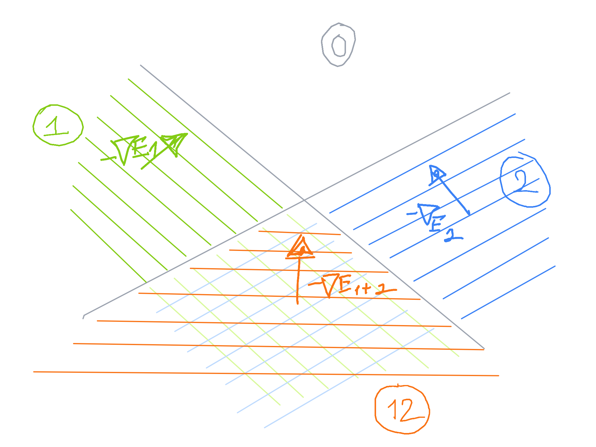
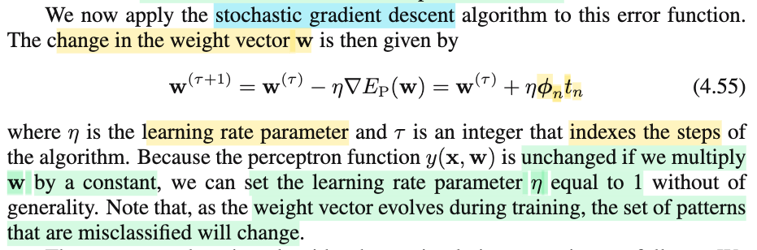
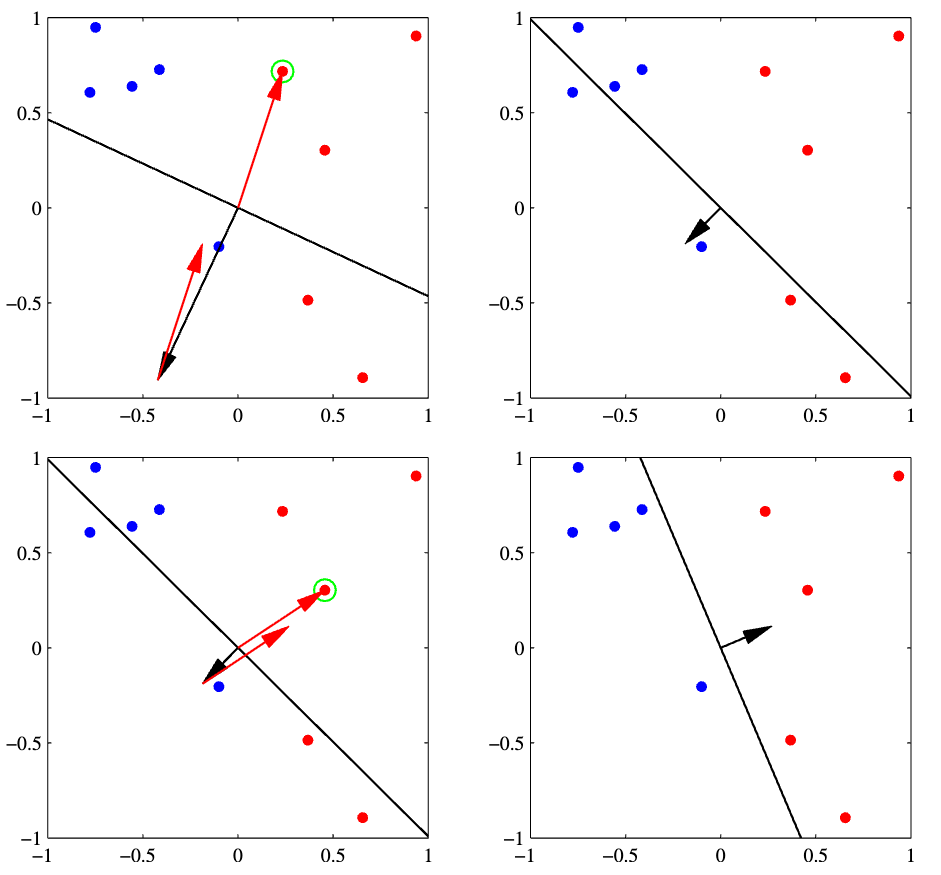
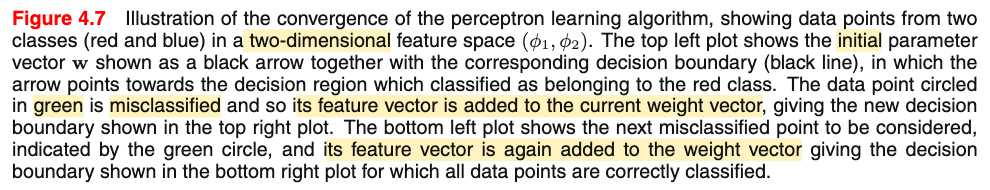
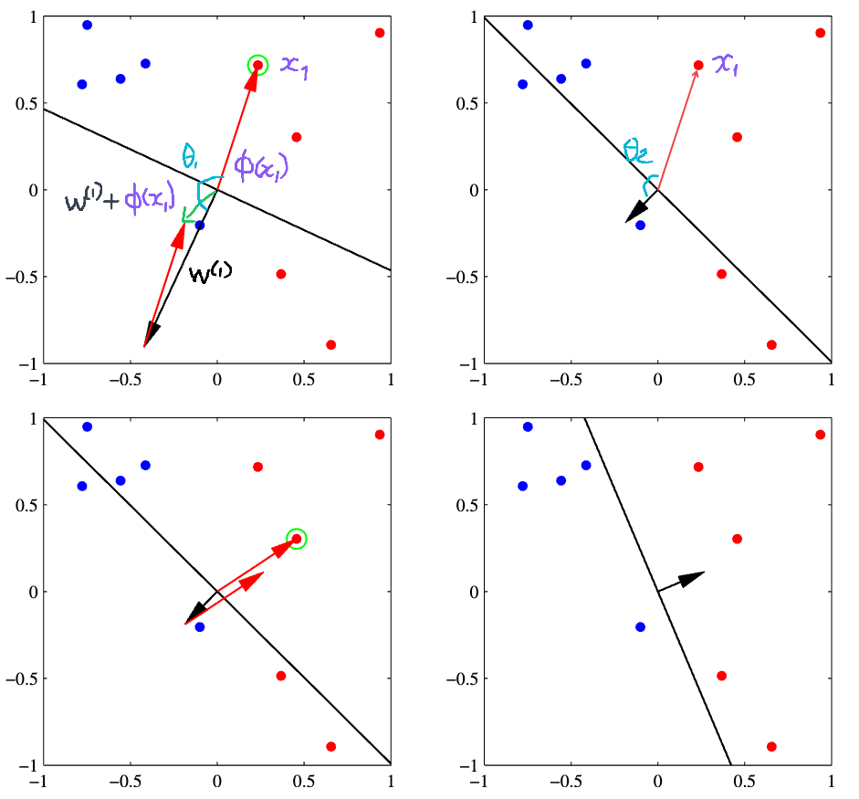
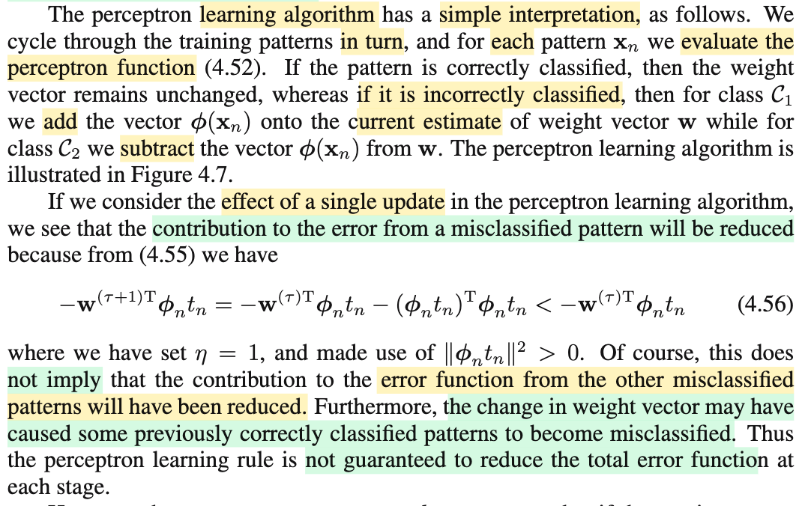
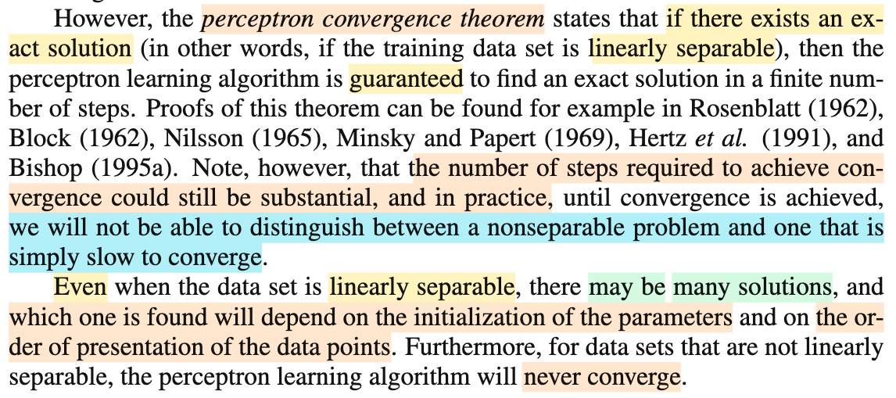
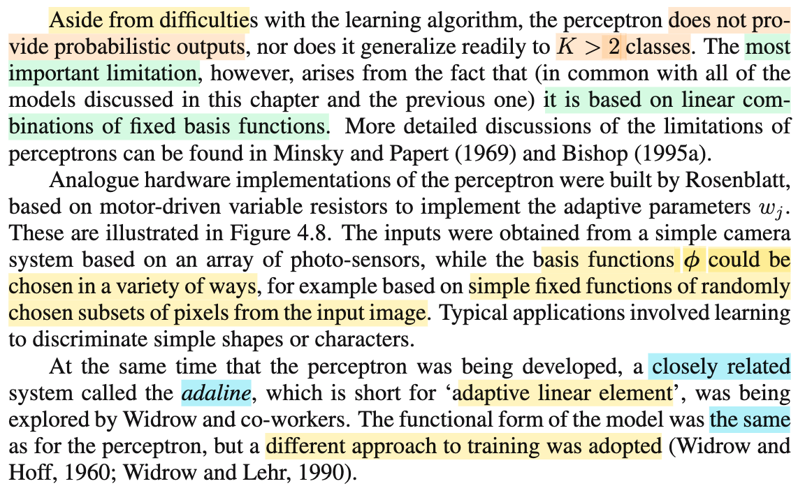

# 4.1.7 Perceptron

📊 **Progress:** `6` Notes | `11` Screenshots | `6` AI Reviews

---

 

## Thuật toán Perceptron

<kbd></kbd>

> [!NOTE]
> Phần này nói về thuật toán perceptron nổi tiếng, mà gs Bishop cũng nói nó đóng vai trò quan trọng trong lịch sử của lĩnh vực pattern recognition.
>
>
>
>  Đầu tiên cần để ý, đây là thuật toán dành cho bài toán phân loại nhị phân.
>
>
>
> Và cách làm của nó như sau:
>
>
>
> Nó sẽ dùng một non-linear function Φ(.) để transform input 𝐱 thành nonlinear feature Φ(𝐱), sau đó xây dựng generalized linear model: y(𝐱) = f(𝐰ᵀΦ(𝐱)) với f(a) = +1 khi a ≥ 0 và -1 khi a &lt; 0.
>
>
>
> Dừng lại xíu, để nhớ lại vì sao lại gọi là generalized linear model?
>
>
>
> Đại khái là vì, cái ta đang dùng, 𝐰ᵀΦ(𝐱), là hàm tuyến tính đối với 𝐰. Nhưng để cho ra giá trị dự đoán là các class rời rạc, hoặc ra con số trong khoảng \[0,1\] để  thể hiện một phân phối xác suất, thì người ta bọc nó trong hàm activation function: f(𝐰ᵀΦ(𝐱)), và mô hình kiểu này gọi là generalized linear model.
>
>
>
> Do đó nên hiểu generalized linear model, có thể dự đoán ra giá trị liên tục từ 0, tới 1, hoặc ra một trong các giá trị rời rạc nào đó thể hiện các class.
>
>
>
> Như vậy thì discriminant function mà bữa giờ mình học có thể coi là generalized linear model nhưng ở dạng đơn giản vì ta chỉ dùng hàm y(𝐱) = 𝐰ᵀ𝐱 + w0, có thể coi như f() là identity function.
>
>
>
> ---
>
>
>
> Một điểm nữa, là bữa giờ ta dùng cách mã hóa target của bài toán binary classification bằng cách gán t = 0 hoặc 1. Nhưng ở perceptron, ta sẽ dùng hai giá trị 1 hoặc -1.

> [!TIP]
> 🤖 **AI Check** — 🟢 Pass — ✅ **95/100** · ✓ Move on
>
> Ghi chú nắm rất chắc và chính xác các ý chính từ giáo trình, từ cấu trúc mô hình, hàm kích hoạt đến quy ước gán nhãn của Perceptron.
>
> **✓ Strengths**
> - Nắm rõ bản chất của Perceptron là mô hình tuyến tính tổng quát (generalized linear model) áp dụng hàm kích hoạt dạng bước nhảy (step function) lên không gian đặc trưng phi(x).
> - Hiểu đúng và giải thích mạch lạc lý do vì sao Perceptron chuyển sang dùng hệ mã hóa nhãn target là {-1, +1} thay vì {0, 1} như các mô hình xác suất trước đó.
> - Liên hệ tốt với các kiến thức trước đó về discriminant function khi coi f() là hàm đồng nhất (identity function).
>
> **💡 Deeper notes**
> - Trong sách, Bishop nhấn mạnh phép biến đổi phi(x) là 'fixed nonlinear transformation' (phép biến đổi phi tuyến cố định, không học tham số của phi như mạng nơ-ron sâu sau này), đây là điểm phân biệt quan trọng giữa Perceptron cổ điển và các mạng nơ-ron hiện đại.
> - Thành phần bias w0 thường được tích hợp ngầm vào vector w bằng cách đặt đặc trưng bias phi_0(x) = 1, giúp biểu thức gọn thành w^T phi(x).

**🔗 See also:** [Generalized Linear Models](./40_linear_model_for_classification.md#node-mefj30s)

 

### The Perceptron Criterion

<kbd></kbd>

<kbd></kbd>

<kbd></kbd>

> [!NOTE]
> Cùng tìm hiểu đoạn này: Đầu tiên đại ý là thuật toán perceptron được motivated bởi việc giảm error function. (cái này khiến ta liên tưởng đến least square classfication, cũng là tìm 𝐰 để giảm error function, với error là bình phương khác biệt của dự đoán và target)
>
>
>
> Tuy nhiên trong perceptron, error không phải sum squared error. Và đại ý là khi lựa chọn error cho bài toán classfication, một lựa chọn tự nhiên là dùng tổng số case bị misclassfied (tức bị phân loại sai). Nhưng nếu dùng error này thì hàm số error sẽ là hàm piecewise constant function theo 𝐰. Là sao?
>
>
>
> Hiểu đại khái là thế này, với error dạng này thì về cơ bản nó sẽ mang các giá trị rời rạc: ví dụ 0 ca (misclassfied), 1, 2,....N. Nên rõ ràng hàng số này sẽ là hàm bậc thang vì nó sẽ không có các giá trị trung gian như 1.1 ca phân loại nhầm. Trong khi đó 𝐰 thì mang giá trị liên tục, khi thay đổi giả sử từ rất tệ 𝐰 = 𝐰0 khiến hàm phân loại sai bét, có số misclassifed pattern = N, thì để cải thiện, 𝐰 sẽ phải thay đổi cho đến khi đạt 𝐰1 giúp số ca misclassified giảm còn N-1, vậy thì trong khoảng từ 𝐰0 tới 𝐰1, hàm error đi ngang (=N), chỉ sau khi qua 𝐰1 thì nó nhảy xuống thành N-1. Tương tự vậy, ta sẽ hình dung ra hàm bậc thang gọi là piece-wise constant (hàm hằng số theo từng đoạn)
>
>
>
> Và vấn đề là, với hàm error như này, thì ta không thể dùng thuật toán gradient descent để điều chỉnh 𝐰 được, đơn giản là vì đạo hàm bằng 0 (và tại những bước nhảy, đạo hàm còn không xác định)
>
>
>
> ---
>
>
>
> Vậy thì error function của perceptron làm như sau: Ep(𝐰) = - Σn∈ℳ 𝐰ᵀΦ(𝐱n)tn với ℳ là các index của các datapoint bị phân loại sai. Giải thích cho function này là:
>
>
>
> Vì trong perceptron, target coding scheme là {1, -1}. tức class 1 thì gán t = 1. class 2 thì gán t = -1. Và hàm dự đoán sẽ dựa vào rule: assign class 1 nếu 𝐰ᵀΦ(𝐱) &gt; 0 và class 2 nếu &lt; 0. Thành ra nếu một data point được phân loại đúng thì 𝐰ᵀΦ(𝐱) × t sẽ &gt; 0. Do đó, khi dùng error function là Ep(𝐰) = - Σn∈ℳ 𝐰ᵀΦ(𝐱n)tn thì đồng nghĩa ta đang cho rằng mỗi data point đang được phân loại đúng sẽ đóng góp 0 vào error. Và mỗi datapoint phân loại sai sẽ đóng góp một lượng bằng -𝐰ᵀΦ(𝐱) × t (sẽ mang dấu dương, do đang phân loại sai) vào error.
>
>
>
> Và xét error đóng góp bởi một data point 𝐱j nào đó bị phân loại sai, thì dễ thấy nó sẽ là hàm tuyến tính theo 𝐰. Tuy nhiên, khi 𝐰 thay đổi trong 𝐰 space thì sẽ có lúc 𝐰 khiến data point đó được phân loại đúng, khi đó error đóng góp bởi data point này sẽ = 0. Thành ra ta sẽ thấy, khi xét hàm error (bởi riêng data point này) theo 𝐰 thì 𝐰 space sẽ chia ra hai miền, miền mà 𝐰 khiến phân loại sai thì hàm số này sẽ là tuyến tính còn miền khiến phân loại đúng thì hàm số này bằng 0.
>
>
>
> Như vậy giả sử 𝐰 = \[w0, w1\]ᵀ thì ranh giới chia hai miền sẽ là 𝐰ᵀΦ(𝐱j)tj = 0 sẽ là một, đường thẳng trong 2D 𝐰 space. Còn đồ thị hàm error(𝐱j) = -𝐰ᵀΦ(𝐱j)tj sẽ trông như mặt phẳng dốc lên trong miền này (error &gt; 0) và phẳng lỳ = 0 tại miền kia (miền error = 0)
>
>
>
> Từ đó, hàm error tổng sẽ là trộn lẫn của các hàm error(𝐱j), nên gọi là piecewise-linear (tuyến tính từng phần).
>
>
>
>  Để hình dung giả sử chỉ có 2 datapoint. Ep(𝐰) = -𝐰ᵀΦ(𝐱1)t1 - 𝐰ᵀΦ(𝐱2)t2
>
>
>
> Hai cái boundary cắt nhau, chia 𝐰 space thành 4 ô, gọi vùng 1, 12, 2, và 0 là các vùng mà 𝐰 khiến phân loại sai điểm 𝐱1, 𝐱1 và 𝐱2, 𝐱2 và phân loại đúng cả hai.
>
>
>
> Khi đó trong vùng 1, hàm E sẽ là mặt ván dốc lên có độ dốc lớn nhất = ||∇E1(𝐰)|| với E1(𝐰) = -𝐰ᵀΦ(𝐱1)t1 
>
>
>
> vùng 2, hàm E sẽ là mặt ván có độ dốc lớn nhất là = ∇E2(𝐰) với E2(𝐰) = -𝐰ᵀΦ(𝐱2)t2
>
>
>
> vùng 12, hàm E sẽ là mặt ván là hàm tuyến tính E1(𝐰) + E2(𝐰), có độ dốc = ∇E(𝐰)
>
>
>
> vùng 0 thì hàm E phẳng lỳ, vì ở đây error E1(𝐰) và E2(𝐰) đều bằng 0, đương nhiên độ dốc cũng bằng 0.
>
>
>
> Hiểu vậy thì ta sẽ hình dung cái gọi là tuyến tính từng phần: giống mình làm một cái dãy núi bằng ván gỗ vậy. Thì tại một điểm nằm đó, trên dãy núi, ta đều đang đứng trên một mặt nghiêng, nhưng tại các điểm khác nhau thì hướng dốc nhất + độ dốc sẽ khác nhau. Và nhờ hình ảnh này, tí nữa ta sẽ hiểu thuật toán stochastic gradient descent nó làm gì.

> [!TIP]
> 🤖 **AI Check** — 🟡 Minor issues — ✅ **95/100** · ✓ Move on
>
> Ghi chú rất xuất sắc, nắm bắt trọn vẹn bản chất toán học lẫn trực quan hình học của hàm lỗi Perceptron criterion và lý do tại sao hàm lỗi số ca phân loại sai thất bại.
>
> **🟡 Minor issues**
>
> **1.** *"vùng 2, hàm E sẽ là mặt ván có độ dốc lớn nhất là = ∇E2(𝐰) với E2(𝐰) = -𝐰ᵀΦ(𝐱2)t2"*
>
> Độ dốc (slope) là một đại lượng vô hướng nên phải dùng độ dài vector gradient ||∇E2(𝐰)|| (như bạn đã viết chính xác ở vùng 1), trong khi ∇E2(𝐰) là một vector chỉ hướng tăng nhanh nhất.
>
>
> **✓ Strengths**
> - Giải thích rất trực quan và chuẩn xác vì sao hàm lỗi đếm số lượng phân loại sai (0/1 loss) là hàm hằng từng đoạn (piecewise constant) và khiến gradient descent bất khả thi.
> - Mô hình hóa hình học rất tốt không gian trọng số w với phép phân vùng đa diện (regions), liên kết chính xác giữa biểu thức tuyến tính và hình ảnh 'mặt ván nghiêng ghép lại'.
>
> **💡 Deeper notes**
> - Hàm lỗi Perceptron criterion là hàm liên tục và lồi (convex), dù đạo hàm không xác định tại các đường biên chia vùng, ta vẫn có thể dùng subgradient hoặc SGD cập nhật tuần tự từng điểm dữ liệu sai.
> - Lưu ý rằng điểm cực tiểu toàn cục của Ep(w) là 0 (khi tập dữ liệu linearly separable trong không gian phi), tuy nhiên nếu dữ liệu không tách biệt tuyến tính, thuật toán Perceptron sẽ không hội tụ mà dao động tuần hoàn.

 

#### Perceptron Weight Update Rule

<kbd></kbd>

> [!NOTE]
> Thuật toán này đã được nói đến ở 3.1.3 (xem lại note đó). Hiểu đại ý như sau:
>
>
>
> Để đơn giản, mình tiếp tục lấy ví dụ hai điểm trong note trước.
>
>
>
> Thì thuật toán sẽ làm như sau:
>
>
>
> Vòng 1 (τ = 1) Cho Ep(𝐰) = E1(𝐰) (tức là chỉ error đóng góp bởi thằng 𝐱1 bị misclassifed):
>
>
>
> 𝐰(1) = 𝐰(0) - η ∇E1(𝐰) = 𝐰(0) - η (-Φ(𝐱1)t1) = 𝐰(0) + η Φ(𝐱1)t1
>
>
>
> (E1(𝐰) = -𝐰ᵀΦ(𝐱)t ⇒ đạo hàm theo 𝐰 của E1(𝐰) = -Φ(𝐱)t, đạo hàm hàm dot product f(𝐱) = 𝐱ᵀ𝐚 đối với 𝐱, ∇f(𝐱) = 𝐚)
>
>
>
> Vòng 2 (τ = 2), cho Ep(𝐰) = E2(𝐰) (tức là chỉ error đóng góp bởi thằng 𝐱2 bị misclassifed):
>
>
>
> 𝐰(2) = 𝐰(1) - η ∇E2(𝐰) = 𝐰(1) + η Φ(𝐱2)t2
>
>
>
> Vòng 3 (τ = 3) Cho Ep(𝐰) = E1(𝐰) (tức là chỉ error đóng góp bởi thằng 𝐱1 bị misclassifed):
>
>
>
> 𝐰(3) = 𝐰(2) - η ∇E1(𝐰) = 𝐰(2) + η Φ(𝐱1)t1
>
>
>
> Vòng 4 lại như vòng 2, cứ thế. cho đến khi hội tụ về 𝐰\* giúp minimize E(𝐰) = E1(𝐰) + E2(𝐰).
>
>
>
> Lưu ý là tại một vòng nào đó, có thể đã phân loại đúng ví dụ 𝐱1, thì nó sẽ không đóng góp error nữa, tức là ta sẽ không bốc E của nó ra để adjust 𝐰 nữa, ví dụ sau vòng τ = 1 mà 𝐰(1) đã giúp phân loại đúng 𝐱1 thì từ τ = 2, 3 sẽ chỉ adjust 𝐰 bởi E2 thôi.
>
>
>
> Hình ảnh là sao:
>
>
>
> Tưởng tượng bắt đầu tại 𝐰0 đang đứng ở vùng 12 là vùng mà classify sai cả hai 𝐱1, 𝐱2, nơi error = E1(𝐰) + E2(𝐰).
>
>
>
> Nếu như là dùng gradient descent (không có stochastic), thì đơn giản là ta tính ∇E(𝐰), rồi cứ đi theo hướng dốc nhất (steepest) này cho đến khi đến error = 0. Và hình ảnh là ta trượt dần xuống trên miếng ván có độ dốc lớn nhất (vùng 12 này có độ dốc = ∇E1(𝐰) + ∇E2(𝐰))
>
>
>
> Nhưng với stochastic, thì hình ảnh là, ta luân phiên coi như chỉ nằm trên một miếng ván E1 hoặc E2, và mỗi lần như vậy ta trượt xuống theo hướng -∇E1(𝐰) hoặc -∇E2(𝐰).
>
>
>
> Hệ quả là, quỹ đạo trượt sẽ zig-zag thay vì là một đường thẳng như của gradient descent.
>
>
>
> Cuối cùng, vì sao nói η có thể chọn = 1? Và thậm chí có thể chọn đại bất kì mà không mất tính tổng quát (without loss of generality)?
>
>
>
> Đơn giản nhất là hình dung chỉ có 1 điểm bị phân loại sai, E(𝐰) = E1(𝐰). Và ta xuất phát tại 𝐰(0), theo hướng -∇E1(𝐰) và muốn đi qua bên miền kia (nơi 𝐰 khiến 𝐱1 được classify đúng).
>
>
>
> Và như đã biết, boundary chia hai miền chính là đường thẳng 𝐰ᵀΦ(𝐱1)t1 = 0, hình ảnh là đường thẳng (trong 𝐰 space) đi qua O và vuông góc với vector Φ(𝐱1)t1
>
>
>
> Mình sẽ chứng minh để chỉ ra rằng, dù η bằng bao nhiêu thì số bước cần thiết để đi từ 𝐰(0) tới đường thẳng này là hằng số không phụ thuộc η:
>
>
>
> Gọi 𝐰0 là điểm chiếu vuông góc của 𝐰 lên đường thẳng này. Ta có 𝐰0 thuộc đường thẳng nên nó thỏa: 𝐰0ᵀΦ(𝐱1)t1 = 0 (1)
>
>
>
> Và vector (𝐰 - 𝐰0) sẽ vuông góc đường thẳng này, nên nó sẽ song song với Φ(𝐱1)t1, ta có: 𝐰 - 𝐰0 = α Φ(𝐱1)t1
>
>
>
> ⇔ 𝐰0 = 𝐰 - α Φ(𝐱1)t1
>
>
>
> Thay vào (1): (𝐰 - α Φ(𝐱1)t1)ᵀΦ(𝐱1)t1 = 0
>
>
>
> ⇔ 𝐰ᵀΦ(𝐱1)t1 - αt1² Φ(𝐱1)ᵀΦ(𝐱1) = 0
>
>
>
> (t1² = 1)
>
>
>
> ⇔ 𝐰ᵀΦ(𝐱1)t1 = α ||Φ(𝐱1)||²
>
>
>
> ⇔ α = 𝐰ᵀΦ(𝐱1)t1/||Φ(𝐱1)||²
>
>
>
> (2) ⇔ ||𝐰 - 𝐰0|| = ||α Φ(𝐱1)t1|| = |α| ||Φ(𝐱1)|| |t1|
>
>
>
> ⇔ ||𝐰 - 𝐰0|| = |α| ||Φ(𝐱1)|| (t1 bằng +/-1 nên |t1| = 1)
>
>
>
> ⇔ ||𝐰 - 𝐰0|| = |𝐰ᵀΦ(𝐱1)t1 / ||Φ(𝐱1)||²| ||Φ(𝐱1)||
>
>
>
> ⇔ ||𝐰 - 𝐰0|| = \[|𝐰ᵀΦ(𝐱1)t1| / ||Φ(𝐱1)||²\] ||Φ(𝐱1)||
>
>
>
> ⇔ ||𝐰 - 𝐰0|| = |𝐰ᵀΦ(𝐱1)t1| / ||Φ(𝐱1)||
>
>
>
> Đây chính là khoảng cách cần phải di chuyển để đến được boundary.
>
>
>
> ---
>
>
>
> Giả sử dùng η để di chuyển từ 𝐰(0) = 𝟎 đến 𝐰(1):
>
>
>
> 𝐰(1) = 𝟎 + ηΦ(𝐱1)t1 = ηΦ(𝐱1)t1
>
>
>
> → Khoảng cách từ 𝐰(1) đến boundary:
>
>
>
> |(ηΦ(𝐱1)t1)ᵀΦ(𝐱1)t1| / ||Φ(𝐱1)|| = |η| t1² ||Φ(𝐱1)||² / ||Φ(𝐱1)|| = |η| ||Φ(𝐱1)||
>
>
>
> Nếu dùng eta = 1 tỷ thì sải bước dài gấp 1 tỉ lần eta = 1, nhưng khoảng cách cũng bị scale lên 1 tỷ lần
>
>
>
> Nên tổng số step để converge là như nhau.
>
>
>
> Do đó ta cứ chọn η = 1 thôi.
>
>
>
> Cách giải thích này nhằm làm rõ vì sao η, trong thuật toán tối ưu khác, sẽ quyết định rất lớn đến tốc độ hội tụ mà trong perceptron thì lại có thể chọn bừa bằng 1 cho đơn giản.

> [!TIP]
> 🤖 **AI Check** — 🟡 Minor issues — ✅ **90/100** · ✓ Move on
>
> Bạn nắm rất vững cơ chế cập nhật SGD của Perceptron và có trực giác hình học tốt về tính bất biến tỷ lệ của learning rate. Tuy nhiên lập luận khoảng cách đến boundary và giả thiết khởi tạo cần được làm rõ hơn để đạt độ chặt chẽ toán học.
>
> **🟡 Minor issues**
>
> **1.** *"→ Khoảng cách từ 𝐰(1) đến boundary: |(ηΦ(𝐱1)t1)ᵀΦ(𝐱1)t1| / ||Φ(𝐱1)|| = |η| t1² ||Φ(𝐱1)||² / ||Φ(𝐱1)|| = |η| ||Φ(𝐱1)|| Nếu dùng eta = 1 tỷ thì sải bước dài gấp 1 tỉ lần eta = 1, nhưng khoảng cách cũng bị scale lên 1 tỷ lần"*
>
> Lập luận hình học ở đoạn này bị ngược: điểm xuất phát w(0) = 0 thực tế đã nằm trên boundary wᵀΦ(x1)t1 = 0, nên sau 1 bước cập nhật thì w(1) đã vượt qua boundary sang miền đúng rồi. Giá trị |η| ||Φ(x1)|| là khoảng cách w(1) đi sâu vào miền đúng chứ không phải khoảng cách cần di chuyển để đến boundary. Dù vậy, trực giác tổng thể về việc tỷ lệ bước nhảy và độ lớn vector w cùng scale theo η là đúng hướng.
>
> **2.** *"Cuối cùng, vì sao nói η có thể chọn = 1? Và thậm chí có thể chọn đại bất kì mà không mất tính tổng quát (without loss of generality)?"*
>
> Khẳng định này chỉ đúng tuyệt đối khi khởi tạo w(0) = 0. Nếu w(0) ≠ 0, việc đổi η mà không scale w(0) theo sẽ làm thay đổi tỷ trọng tương đối giữa trọng số khởi tạo và các bước cập nhật, dẫn tới quỹ đạo và số bước hội tụ có thể khác nhau (dù vẫn đảm bảo hội tụ nếu dữ liệu linearly separable).
>
>
> **✓ Strengths**
> - Diễn giải chính xác công thức cập nhật trọng số theo cơ chế Stochastic Gradient Descent chỉ tác động trên các điểm phân loại sai.
> - Trực giác hình học so sánh giữa đường đi dốc nhất của GD tổng và quỹ đạo zig-zag của Perceptron SGD rất trực quan và chuẩn xác.
> - Hiểu đúng bản chất thực hành rằng learning rate η trong Perceptron không làm thay đổi mặt phẳng nghiệm thu được, cho phép đặt η = 1.
>
> **💡 Deeper notes**
> - Bản chất toán học trực tiếp nhất để giải thích vì sao η không quan trọng là tính bất biến tỷ lệ (scale invariance): quy tắc phân loại dựa vào dấu sign(wᵀΦ(x)) = sign((η w)ᵀΦ(x)) với mọi η > 0, nghĩa là mặt phân chia trong không gian đầu vào hoàn toàn không đổi khi scale w.
> - Trong định lý hội tụ Perceptron (Novikoff's Theorem), chặn trên cho số bước cập nhật tối đa là (R/γ)², hoàn toàn không phụ thuộc vào η khi khởi tạo từ vector 0.

 

##### Perceptron Learning Algorithm

<kbd></kbd>

<kbd></kbd>

<kbd></kbd>

<kbd></kbd>

> [!NOTE]
> Rồi, đoạn này chính là xác nhận lại những gì mình đã đoán về thuật toán update 𝐰 của perceptron cũng như cho ta minh họa rất hay.
>
>
>
> Ở note trước, mình đã hiểu cơ chế của việc update 𝐰 sẽ là:
>
>
>
> Tuần tự thay đổi các training point 𝐱j (kiểu như mỗi lần ta lấy một training point bị classified sai, và xoay vòng (cái chữ "in turn" trong sách), và dùng η (như đã nói, cứ chọn bằng 1) nhân negative gradient của Error đóng góp bởi data point 𝐱j này để update 𝐰. Với Ej(𝐰) = -Φ(𝐱j)ᵀ𝐰tj, thì ∇Ej(𝐰) = -Φ(𝐱j)tj
>
>
>
> 𝐰(τ) = 𝐰(τ-1) - ∇Ej(𝐰) = 𝐰(τ-1) + Φ(𝐱j)tj
>
>
>
> Đương nhiên đây là **stochastic gradient descent**, khác với **batch gradient descent** hay **mini-batch gradient descent** khi ta dùng gradient của error function của chỉ bởi 1 data point, thay vì toàn bộ hoặc một gói các data point.
>
>
>
> Và việc nói lấy các 𝐱 từ đám bị phân loại sai và update 𝐰 thì cũng tương tự như lấy hết, nhưng với 𝐱 nào đang phân loại đúng thì bỏ qua (không update 𝐰).
>
>
>
> Nhưng ý chính là ở đây ta có một góc nhìn trực giác về cách mà perceptron algorithm nó update 𝐰:
>
>
>
> Để ý, với perceptron, cách mã hóa target là gán cho t một trong hai giá trị +1 hoặc -1 (class 𝒞1, 𝒞2). Như vậy, dẫn đến về cơ bản là với mỗi vòng cập nhận, 𝐰 được + thêm hoặc - bớt một vector Φ(𝐱j)
>
>
>
> Nếu tj = +1, 𝐰(τ) = 𝐰(τ-1) + Φ(𝐱j)
>
>
>
> Nếu tj = -1, 𝐰(τ) = 𝐰(τ-1) - Φ(𝐱j)
>
>
>
> Nên hình mình họa trong sách, ô đầu tiên, 𝐰 đang có giá trị ví dụ 𝐰(1). Đương nhiên, với giá trị này, thì dữ liệu đã đang được phân loại đúng hoặc sai sao đó, thể hiện bởi decision boundary 𝐰(1)ᵀΦ(𝐱) = 0 là đường màu đen
>
>
>
> Nhớ lại: perceptron discriminant function sẽ gán class 𝒞1 cho 𝐱 nếu y(𝐱) = 𝐰ᵀΦ(𝐱) &gt; 0 và class 𝒞2 nếu 𝐰ᵀΦ(𝐱) &lt; 0, nên hyperplane (như line màu đen) 𝐰ᵀΦ(𝐱) = 0 sẽ chia không gian thành hai decision region, trong đó những data point 𝐱 nằm trong nửa không gian (halfspace, hay halfplane) 𝐰ᵀΦ(𝐱) &gt; 0 sẽ bị phân loại là 𝒞1 và đám nằm trong halfplane 𝐰ᵀΦ(𝐱) &lt; 0 bị phân loại thành class 𝒞2.
>
>
>
> Và vì 𝐰ᵀΦ(𝐱) = 0 nên giả sử ta lấy 𝐚, 𝐛 nằm trên hyperplane này thì 𝐰ᵀΦ(𝐚) = 0 và 𝐰ᵀΦ(𝐛) = 0 ⇒ 𝐰ᵀ(Φ(𝐚)-Φ(𝐛)) = 0 nên 𝐰 sẽ vuông góc Φ(𝐚)-Φ(𝐛) với 𝐚,𝐛 bất kì. Từ đó dẫn đến ta dễ hiểu rằng 𝐰 sẽ ⊥ với cái hyperplane này (nên trên hình vector 𝐰 màu đen luôn vuông góc với decision boundary 𝐰ᵀΦ(𝐱) = 0 (mà 𝐰 cũng chính là được gọi là normal vector của hyperplane)
>
>
>
> Một cách để nhớ bên nào là halfplane 𝐰ᵀΦ(𝐱) &gt; 0, bên nào là halfplane 𝐰ᵀΦ(𝐱) &lt; 0 đó là ta cứ xét hàm f(𝐱) = 𝐰ᵀΦ(𝐱). dễ thấy gradient của hàm này đối với Φ(𝐱) chính là 𝐰: ∇f(𝐱) = 𝐰. Và gradient thì như đã biết luôn chỉ về hướng tăng hàm f nhanh nhất, nên trong bên halfplane đương nhiên cái bên mà 𝐰 chỉ về chính là bên có 𝐰ᵀΦ(𝐱) lớn: 𝐰ᵀΦ(𝐱) &gt; 0.
>
>
>
> Thế thì quay lại hình trên bên trái, tại 𝐰(1), với decision boundary như vậy, nó đang classify sai điểm màu đỏ được khoanh tròn màu xanh (và các điểm khác nữa). Và giả sử ở vòng update này, ta bốc trúng điểm này (gọi là 𝐱1 đi) để update, như trên đã nói, ta sẽ cộng hoặc trừ 𝐰(1) cho Φ(𝐱1). Và ở đây, vì là loại màu đỏ và đang nói nó đang bị phân loại sai nên đáng ra nó phải nằm "bên kia", là cái bên 𝐰ᵀΦ(𝐱) &gt; 0, nên suy ra với 𝐱1 này target t1 sẽ là +1. Do đó update 𝐰 ở vòng này: 𝐰(2) = 𝐰(1) + Φ(𝐱1)
>
>
>
> Kết qủa là sau iteration 1st, 𝐰 là vector màu đen bên hình trên bên phải, decision boundary cũng thay đổi theo hướng nhích về phía trên (kiểu như nó khiến cho điểm 𝐱1 dù vẫn đang bị classify sai nhưng bớt sai hơn như sau:
>
>
>
> E1(𝐰(2)) = -𝐰(2)ᵀΦ(𝐱1) × 1 = -𝐰(2)ᵀΦ(𝐱1)
>
>
>
> = -(𝐰(1) + Φ(𝐱1))ᵀΦ(𝐱1)
>
>
>
> = -𝐰(1)ᵀΦ(𝐱1) - Φ(𝐱1)ᵀΦ(𝐱1)
>
>
>
> = E1(𝐰(1)) - ||Φ(𝐱1)||² ≤ E1(𝐰(1)) (do bình phương norm ||Φ(𝐱1)||² ≥ 0)
>
>
>
> À như vậy với 𝐰(2), error (do đóng góp bởi datapoint 𝐱1) đã giảm (trừ khi Φ(𝐱1) = 0) (dù có thể error tổng chưa chắc đã giảm)
>
>
>
> Mà nhìn vào công thức error E1(𝐰) = -𝐰ᵀΦ(𝐱1)t1 = -||𝐰|| ||Φ(𝐱1)|| cos(θ) × 1 có thể thấy tại 𝐰(1), góc θ là góc tù chà bá lửa, cosine của nó sẽ ≈ -1, nên E1(𝐰) lớn còn 𝐰(2) thì θ đã thu hẹp (dù vẫn là góc tù) nên cosine nó đã bớt âm hơn E1(𝐰) sẽ nhỏ hơn.  
>
> ---
>
>
>
> Tiếp, vòng update thứ hai, tương tự, thuật toán sẽ bốc một điểm bị phân loại sai khác, điểm khoanh tròn màu xanh hình bên trái ở dưới (đặt là 𝐱2). Mọi chuyện tương tự, vì nó đáng lẽ phải nằm trong halfspace 𝐰ᵀΦ(𝐱) &gt; 0, nên t2 = 1, và 𝐰 được update:
>
>
>
> 𝐰(3) = 𝐰(2) + Φ(𝐱2) để thành ra vector đen của hình phải bên dưới.
>
>
>
> lúc này, nó đã đổi chiều, khiến mọi điểm màu đỏ (có target t = 1) đều đã nằm bên halfspace 𝐰ᵀΦ(𝐱) &gt; 0.
>
>
>
> Như vậy, qua minh họa này, mình hiểu cái trực giác, hay cái nguyên lý của cách update 𝐰 của perceptron gom gọn trong câu này: Đối với một điểm đang bị phân loại sai (ví dụ 𝐱1) thì feature vector Φ(𝐱1) đóng vai trò như người dẫn đường, chỉ hướng cho 𝐰 đang lạc lối mà quay về. Bằng cách đi theo hướng dẫn này (thông qua việc cộng với vector Φ(𝐱1), hướng mới của 𝐰 sẽ được điều chỉnh theo hướng gần với Φ(𝐱1) hơn)
>
>
>
> Hiện tượng tương tự cũng đúng nếu ta thử hình dung là thay vì chọn điểm phân loại sai màu đỏ, ta chọn điểm màu xanh (ví dụ điểm màu xanh nằm bên dưới decision boundary): Khi update 𝐰 do t3 lúc này là -1 nên thay vì cộng thì sẽ là trừ, và về cơ bản, -Φ(𝐱3) vẫn là chỉ về hướng hợp với 𝐰 góc tù, mà ta có thể một cách gần đúng cho là chỉ về hướng ngược lại)
>
>
>
> Do đó các feature vector của các điểm phân loại sai giống như chỉ dẫn cho 𝐰 xoay đúng dần đúng dần cho đến khi nó mọi điểm đều phân loại đúng (nếu dataset linearly separable)

> [!TIP]
> 🤖 **AI Check** — 🟢 Pass — ✅ **98/100** · ✓ Move on
>
> Ghi chú xuất sắc! Bạn đã nắm bắt hoàn hảo cả đại số lẫn trực quan hình học của thuật toán Perceptron.
>
> **🟡 Minor issues**
>
> **1.** *"tại 𝐰(1), góc θ là góc tù chà bá lửa, cosine của nó sẽ ≈ -1, nên E1(𝐰) lớn còn 𝐰(2) thì θ đã thu hẹp (dù vẫn là góc tù) nên cosine nó đã bớt âm hơn E1(𝐰) sẽ nhỏ hơn"*
>
> Lập luận này đúng về mặt trực quan hướng xoay vector, nhưng chưa hoàn toàn chặt chẽ nếu chỉ xét cos(θ) vì độ dài vector norm ||w|| cũng thay đổi sau khi cộng vector. Tuy nhiên, phép chứng minh đại số ngay trước đó E1(w(2)) = E1(w(1)) - ||Φ(x1)||^2 đã đảm bảo chắc chắn E1 giảm.
>
>
> **✓ Strengths**
> - Diễn giải toán học rất chuẩn xác khi chứng minh hàm lỗi đóng góp bởi điểm misclassified luôn giảm đi một lượng đúng bằng ||Φ(x)||^2.
> - Hiểu rất rõ vai trò hình học của vector trọng số w như một vector pháp tuyến chỉ vào nửa không gian dương (w^T Φ(x) > 0).
> - Trực quan hóa sinh động và chính xác cách vector đặc trưng đóng vai trò như lực kéo xoay w dần về phía phân loại đúng.
>
> **💡 Deeper notes**
> - Trong hình minh họa 4.7 của sách, đường biên đi qua gốc tọa độ vì không gian hiển thị là 2 chiều và giả định bias w0 = 0 hoặc đã được gộp vào vector mở rộng. Trong trường hợp tổng quát có bias w0 khác 0, mặt phẳng biên sẽ dịch chuyển khỏi gốc tọa độ một khoảng -w0/||w||.
> - Việc giảm lỗi trên điểm xj vừa được cập nhật không đảm bảo tổng lỗi trên toàn bộ tập dữ liệu giảm ngay tại bước đó, nhưng Perceptron Convergence Theorem đảm bảo thuật toán sẽ dừng sau hữu hạn bước nếu dữ liệu khả phân tuyến tính (linearly separable).

 

###### Perceptron Convergence Theorem

<kbd></kbd>

> [!NOTE]
> Rồi, đoạn này đại ý nói rằng, có một theorem mà người ta đã chứng minh rằng nếu dataset linearly separable (có thể phân tách tuyến tính hoàn toàn) thì chắc chắn thuật toán này sẽ converge (sẽ giải xong, phân loại đúng hết).
>
>
>
> Tuy nhiên, tác giả lưu ý là số bước để giải xong của thuật toán này có thể rất lớn, nên có khi bài toán linearly separable cũng chạy lâu y như là bài toán không linearly separable (với data set không linearly separable thuật toán sẽ mãi mãi không dừng)
>
>
>
> Bên cạnh đó, ngay cả bài toán linearly separable, thì cũng có thể có nhiều cách để phân tách, và thuật toán dừng ở cách nào thì hên xui, tùy vào cách ta gán giá trị ban đầu của 𝐰 (gọi là weight initialization).

> [!TIP]
> 🤖 **AI Check** — 🟡 Minor issues — ✅ **92/100** · ✓ Move on
>
> Ghi chú nắm rất tốt và chính xác nội dung chính của định lý hội tụ Perceptron cùng các hạn chế thực tế được đề cập trong sách. Chỉ có một chi tiết nhỏ bị sót là nghiệm tìm được còn phụ thuộc vào thứ tự đưa dữ liệu vào huấn luyện.
>
> **🟡 Minor issues**
>
> **1.** *"tùy vào cách ta gán giá trị ban đầu của 𝐰 (gọi là weight initialization)"*
>
> Đoạn văn gốc nêu rõ hai yếu tố quyết định nghiệm cụ thể nào được tìm thấy: khởi tạo tham số (initialization of parameters) VÀ thứ tự đưa các điểm dữ liệu vào duyệt (order of presentation of the data points). Bạn đã bỏ sót yếu tố thứ tự dữ liệu.
>
>
> **✓ Strengths**
> - Hiểu chính xác nội dung định lý hội tụ Perceptron: đảm bảo dừng và tìm ra nghiệm chính xác sau hữu hạn bước nếu dữ liệu phân tách tuyến tính.
> - Nắm bắt sắc bén hệ quả thực tế: khó phân biệt bài toán không phân tách được (không bao giờ dừng) với bài toán phân tách được nhưng hội tụ rất chậm.
>
> **💡 Deeper notes**
> - Trong lý thuyết hội tụ của Perceptron, số bước tối đa (upper bound) phụ thuộc nghịch đảo với bình phương của margin (khoảng cách nhỏ nhất từ điểm dữ liệu tới siêu phẳng phân cách). Do đó, nếu margin rất nhỏ, thuật toán có thể mất số bước lặp khổng lồ để hội tụ.

 

###### Limitations of the Perceptron

<kbd></kbd>

> [!NOTE]
> Đoạn cuối đại ý là nói thêm vài nhược điểm của perceptron, như khó mở rộng cho phân loại nhiều class hơn 2, không có cái kiểu output mang tính chất của phân phối xác suất (cái này quan trọng vì nhờ đó ta có thể kiểu như có được cách diễn giải: dự đoán với mức độ chắc chắn bao nhiêu phần trăm, thay vì chỉ dự đoán khơi khơi)
>
>
>
> Và tệ nhất là nó dự trên một tổ hợp tuyến tính các hàm basis CỐ ĐỊNH. Mình hiểu ý này là, cái này khiến nó không đủ flexible, so với các mô hình phân loại cao cấp hơn sau này như neural network, nơi mà về cơ bản có thể hiểu là mô hình tự học ra basis function nào phù hợp nhất luôn.
>
>
>
> Cuối cùng ông có nhắc tới một cỗ máy áp dụng phương thức của perceptron cũng như có một thuật toán rất giống tên là ADALINE, về cơ bản là y hệt, chỉ khác chút các training.

> [!TIP]
> 🤖 **AI Check** — 🟢 Pass — ✅ **98/100** · ✓ Move on
>
> Ghi chú tóm tắt rất chính xác và sâu sắc nội dung đoạn văn, đặc biệt là việc liên hệ đúng bản chất của hàm basis cố định so với mạng neural sau này.
>
> **✓ Strengths**
> - Nắm trọn vẹn các nhược điểm của perceptron: không có xác suất đầu ra, khó mở rộng cho bài toán nhiều lớp (K > 2), và giới hạn lớn nhất là dùng hàm cơ sở cố định.
> - Hiểu rất đúng và có trực giác xuất sắc về việc hàm basis cố định làm giảm tính linh hoạt, mở đường cho neural network tự học đặc trưng/hàm basis.
> - Tóm tắt chuẩn xác quan hệ giữa Perceptron và ADALINE (cùng dạng hàm, khác thuật toán huấn luyện).
>
> **💡 Deeper notes**
> - Sự khác biệt cốt lõi trong huấn luyện giữa Perceptron và ADALINE (Widrow-Hoff / LMS rule) là ADALINE cập nhật trọng số dựa trên đầu ra tuyến tính liên tục (trước khi qua hàm ngưỡng/kích hoạt), trong khi Perceptron cập nhật dựa trên sai số của nhãn rời rạc sau hàm bước nhảy (step function).

 

