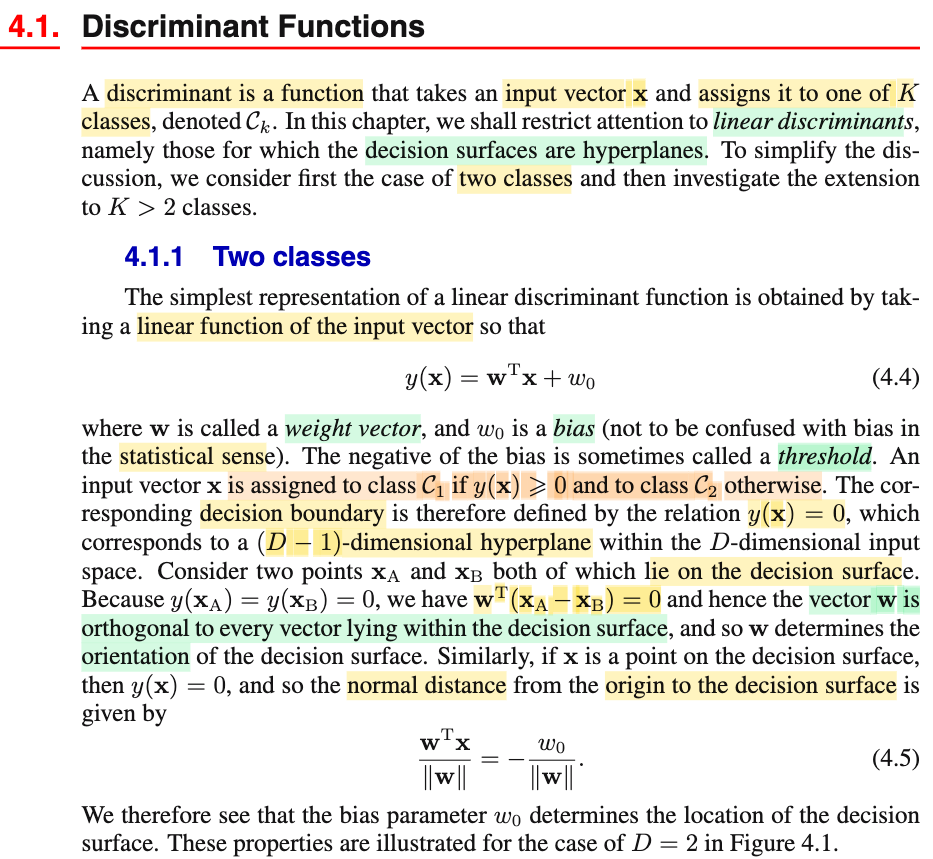
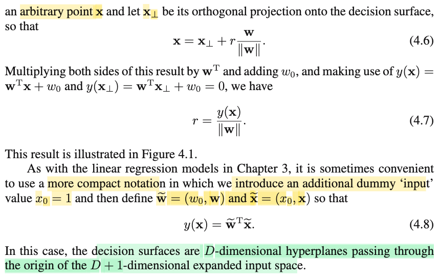
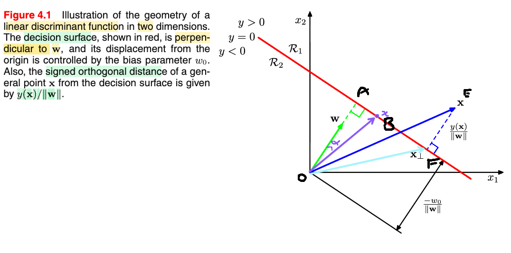

# 4.1 Discriminant Functions

📊 **Progress:** `1` Notes | `3` Screenshots | `1` AI Reviews

---

 

## Section 4.1 Discriminant Functions

<kbd></kbd>

<kbd></kbd>

<kbd></kbd>

> [!NOTE]
> Loại đầu tiên là discriminant function. Như đã nói ở phần mở đầu chương, dạng này sẽ chỉ là một decision rule, nhận vào input x, trả ra luôn loại (class) dự đoán (khác với probabislistic model, sẽ bao gồm 2 bước: tính ra xác suất sau đó dùng giá trị xác suất để đưa ra kết luận về loại, gọi là bước inference và making decision)
>
>
>
> Và ta sẽ chỉ xem xét linear discriminant function, có dạng y(**x**) = **w**T**x** + w0.
>
>
>
> Đây là lần đầu tiên mình nghe gs gọi **w** là weight vector và bias w0.
>
>
>
> Và bias này khác với bias của estimator trong thống kê (ôn nhanh cho vui, Bias của estimator W(**X**) của θ là hàm tính bởi Bias(W, θ) = E\_θ\[W(**X**)\] - θ)
>
>
>
> Và decision rule là: Gán C1 khi y(**x**) ≥ 0 và C2 khi y(**x**) &lt; 0.
>
>
>
> Như vậy decision boundary là y(**x**) = 0 ⇔ **w**T**x** + w0 = 0, dễ hiểu đây sẽ là phương trình của hyperplane (ví dụ D = 2 nó chính là đường thẳng w1 x1 + w0 = 0)
>
>
>
> Cũng dễ thấy w sẽ vuông góc với hyperplane, vì với xA, xB bất kì trên hyperplane (và sẽ tạo vector bất kì thuộc hyperplane), ta có wT(xA - xB) = wTxA - wTxB = wTxA + w0 - wTxB - w0 = y(xA) - y(xB) = 0 - 0 = 0, vậy w vuông góc với vector bất kì của hyperplane nên nó vuông góc với hyperplane.
>
>
>
> Giải thích 4.5: Vì w vuông góc hyperplane nên khoảng cách từ gốc đến hyperplane là khoảng cách từ hình chiếu điểm khi ta chiếu x thuộc hyperplane lên vector w. (xem hình, chính là OA)
>
>
>
> Thu nhỏ w để có unit norm, ta có vector w/||w|| có norm = 1, hướng thì vẫn là hướng w.
>
>
>
> Dùng công thức dot product aTb = ||a|| ||b|| cos(θ(a,b)) (w/||w||)T x = ||(w/||w||)| ||x|| cos α = ||x|| cos α.
>
>
>
> Xét tam giác vuông OAB (xem hình) thì ||x|| cos α chính là khoảng cách cần tính (cạnh huyền nhân cos kề)
>
>
>
> Bên cạnh đó (w/||w||) T x cũng bằng (wTx) / ||w|| (vì 1/||w|| chỉ là scalar)
>
>
>
> = \[y(x) - w0\]/||w|| = (0 - w0) / ||w|| = - w0 / ||w|| nên ta có distance là - w0 / ||w||
>
>
>
> ---
>
>
>
> Còn nếu x ở ngoài hyperplane, ko khó để thấy khoảng cách của nó tới hyperplane là y(x)/||w||:
>
>
>
> Trong hình mình vẽ E, F là điểm x (vector xanh đậm) và hình chiếu của nó lên hyperplane. Dĩ nhiên khoảng cách là ||EF||. vector EF này vuông góc với hyperplane nên song song với w (vì w cũng vuông góc hyperplane)
>
>
>
> Ta có EF = OE - OF = x - x⊥
>
>
>
> nhân hai vế cho wT: wT(EF) = wTx - wT(x⊥) = wTx + w0 - wT(x⊥) - w0 = y(x) - y(x⊥) = y(x) - 0 (do x⊥ ∈ hyperplane)
>
>
>
> Vậy wT(EF) = y(x)
>
>
>
> ⇔ ||w|| ||EF|| cos (β) = y(x)
>
>
>
> ⇔ ||w|| ||EF|| = y(x) (β là góc giữa EF và w, như đã nói, hai thằng này song song, nên góc = 0, cos = 1 hoặc -1)
>
>
>
> ⇔ ||EF|| = +/- y(x) / ||w|| đây chính là chính là r. 
>
>
>
> Cái ta đang tính là khoảng cách nếu xét dấu thì 
>
>
>
> Cuối cùng cũng ko có gì, gs nói để tiện hơn ta đặt vector w\~  = (w0, w1,..wD) và nhét số 1 vào vector x để có x\~ = (1, x1,..xD). khi đó y(x) = w\~Tx\~
>
>
>
> và như vậy, bài toàn tăng thành D+1 chiều, trong đó hyperplane y(x) = 0 sẽ là hyperplane đi qua gốc O.

> [!TIP]
> **🤖 AI Feedback** — ✅ Score: **100/100**
>
> Ghi chép vô cùng xuất sắc và trực quan, đặc biệt là phần tự chứng minh hình học cho công thức 4.5 và khoảng cách r rất rõ ràng, chính xác. Bạn đã nắm rất vững bản chất hình học của vector pháp tuyến w và các phép chiếu vector.

 

