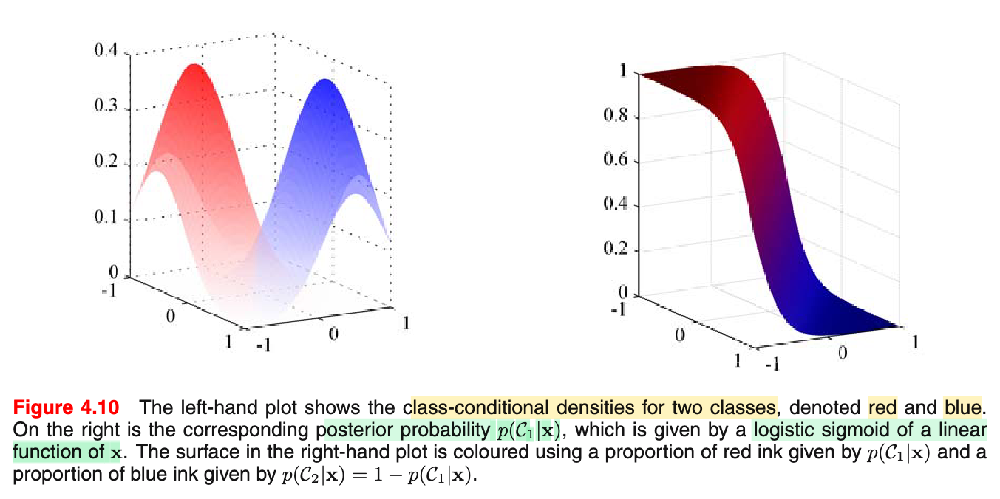
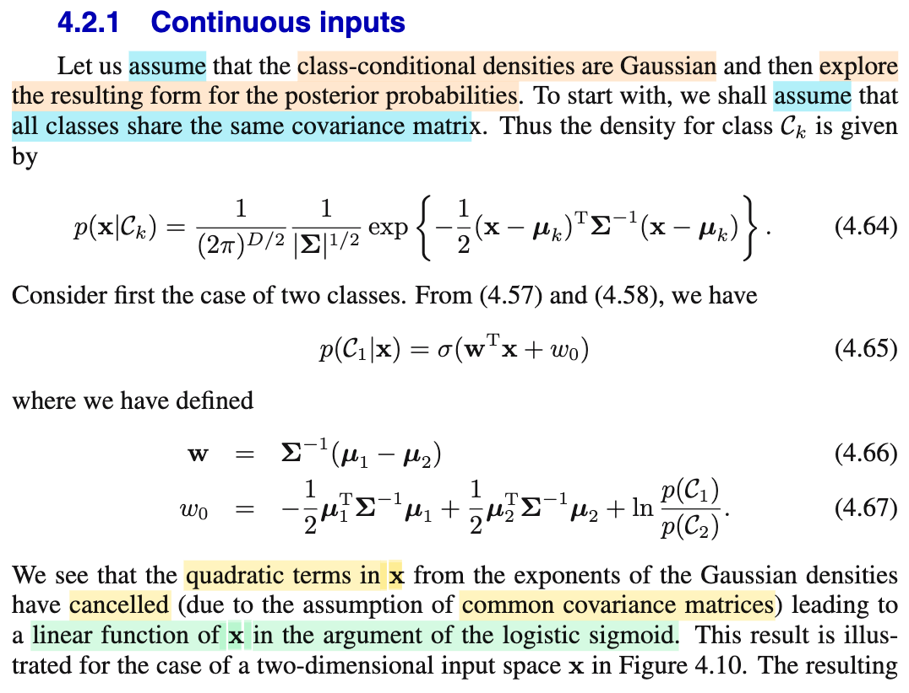
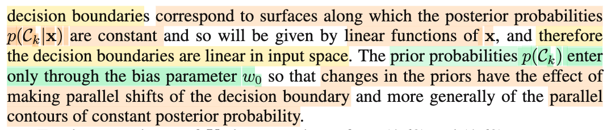
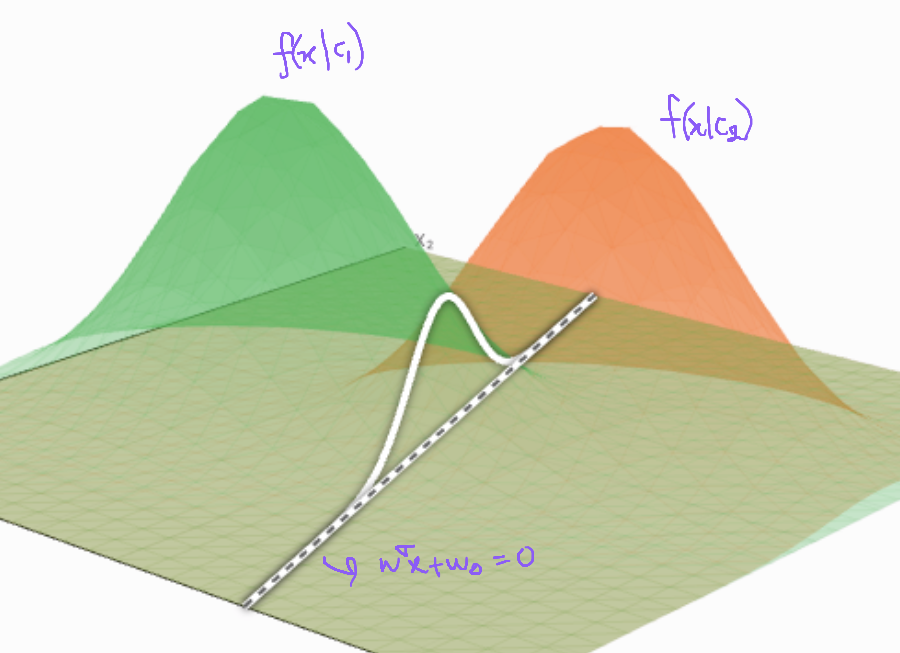
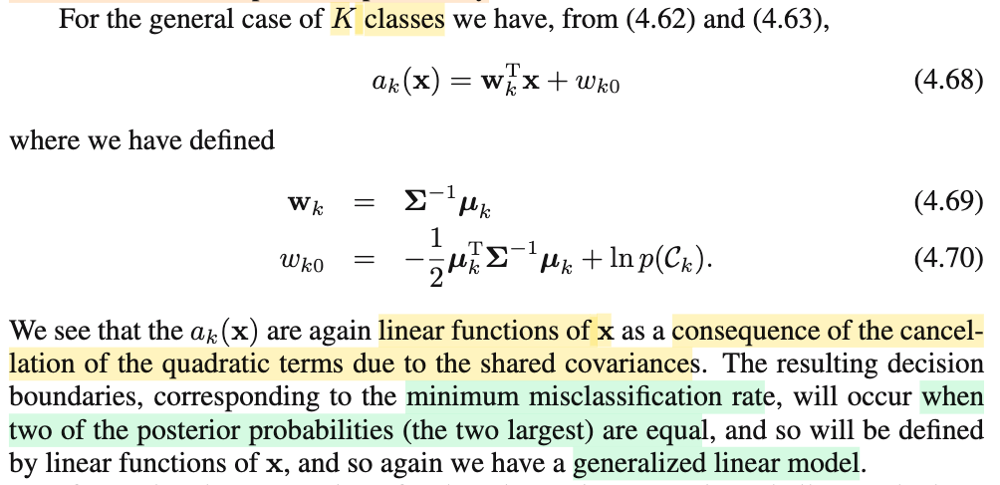
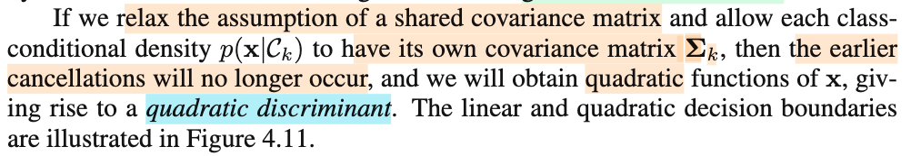
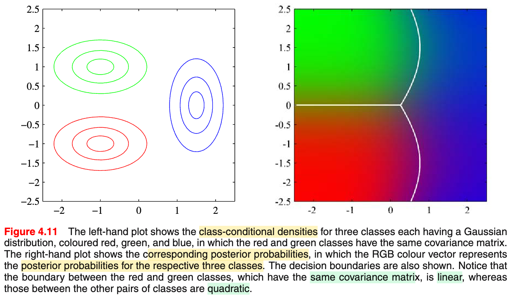

# 4.2.1 Continuous inputs

📊 **Progress:** `3` Notes | `7` Screenshots | `3` AI Reviews

---

 

## Section 4.2.1 Continuous Inputs

<kbd></kbd>

<kbd></kbd>

<kbd></kbd>

<kbd></kbd>

> [!NOTE]
> Đầu tiên, ta sẽ giả định class-conditional densities là phân phối Gaussian.Và một giả định thêm nữa là các class-conditional densities của các class đều có chung covariance.
>
>
>
> (class-conditional densities, tức là f(𝐱|𝒞k), là cái mà ý nghĩa nôm na là cho ta biết, "một tấm hình chụp chó sẽ trông như thế nào", hay nếu bảo đây là hình chụp chó (𝒞k) thì xác suất nó trong giống như thế này (𝐱) là cao hay thấp (f(𝐱|𝒞k))")
>
>
>
> Nên ta có f(𝐱|𝒞k) = 1/(2π)^(D/2) × 1/(|𝚺|^1/2) × exp{-(1/2)(𝐱-𝛍k)ᵀ𝚺⁻¹(𝐱-𝛍k)}
>
>
>
> Xét bài toán K=2 trước, với 4.57 và 4.57, tức f(𝒞1|𝐱) = σ(a) và a = ln \[f(𝐱|𝒞1)f(𝒞1)/f(𝐱|𝒞2)f(𝒞2)\], ta có:
>
>
>
> a = ln \[f(𝐱|𝒞1)f(𝒞1)/f(𝐱|𝒞2)f(𝒞2)\] 
>
>
>
> = ln {\[f(𝐱|𝒞1)/f(𝐱|𝒞2)\] × \[f(𝒞1)/f(𝒞2)\]}
>
>
>
> = ln {\[f(𝐱|𝒞1)/f(𝐱|𝒞2)\]} + ln \[f(𝒞1)/f(𝒞2)\]
>
>
>
> Xét cục f(𝐱|𝒞1)/f(𝐱|𝒞2), thế pdf ở trên vô, các term 1, 2 sẽ triệt tiêu nhau (do có cùng covariance, tức 𝚺 bằng nhau) chỉ còn: 
>
>
>
> exp{-(1/2)(𝐱-𝛍1)ᵀ𝚺⁻¹(𝐱-𝛍1)}/exp{-(1/2)(𝐱-𝛍2)ᵀ𝚺⁻¹(𝐱-𝛍2)} 
>
>
>
> ⇒ ln {\[f(𝐱|𝒞1)/f(𝐱|𝒞2)\]} = ln {exp{-(1/2)(𝐱-𝛍1)ᵀ𝚺⁻¹(𝐱-𝛍1)}/exp{-(1/2)(𝐱-𝛍2)ᵀ𝚺⁻¹(𝐱-𝛍2)}}
>
>
>
> = ln {exp{-(1/2)(𝐱-𝛍1)ᵀ𝚺⁻¹(𝐱-𝛍1)}} - ln{exp{-(1/2)(𝐱-𝛍2)ᵀ𝚺⁻¹(𝐱-𝛍2)}}
>
>
>
> = -(1/2)(𝐱-𝛍1)ᵀ𝚺⁻¹(𝐱-𝛍1) + (1/2)(𝐱-𝛍2)ᵀ𝚺⁻¹(𝐱-𝛍2)
>
>
>
> = -(1/2)\[(𝐱-𝛍1)ᵀ𝚺⁻¹(𝐱-𝛍1) - (𝐱-𝛍2)ᵀ𝚺⁻¹(𝐱-𝛍2)\]
>
>
>
> = -(1/2)\[(𝐱ᵀ𝚺⁻¹-𝛍1ᵀ𝚺⁻¹)(𝐱-𝛍1) - (𝐱ᵀ𝚺⁻¹-𝛍2ᵀ𝚺⁻¹)(𝐱-𝛍2)\]
>
>
>
> = -(1/2)\[(𝐱ᵀ𝚺⁻¹𝐱-𝛍1ᵀ𝚺⁻¹𝐱-𝐱ᵀ𝚺⁻¹𝛍1+𝛍1ᵀ𝚺⁻¹𝛍1 - (𝐱ᵀ𝚺⁻¹𝐱-𝛍2ᵀ𝚺⁻¹𝐱-𝐱ᵀ𝚺⁻¹𝛍2+𝛍2ᵀ𝚺⁻¹𝛍2)\]
>
>
>
> = -(1/2)(𝐱ᵀ𝚺⁻¹𝐱-𝛍1ᵀ𝚺⁻¹𝐱-𝐱ᵀ𝚺⁻¹𝛍1+𝛍1ᵀ𝚺⁻¹𝛍1 - 𝐱ᵀ𝚺⁻¹𝐱+𝛍2ᵀ𝚺⁻¹𝐱+𝐱ᵀ𝚺⁻¹𝛍2-𝛍2ᵀ𝚺⁻¹𝛍2)
>
>
>
> (để ý chỗ này, quan trọng, các quadratic term 𝐱ᵀ𝚺⁻¹𝐱 sẽ triệt tiêu, là nhờ ta đang xài cùng một 𝚺)
>
>
>
> (Và xét 𝛍1ᵀ𝚺⁻¹𝐱, vì là scalar, nên = (𝛍1ᵀ𝚺⁻¹𝐱)ᵀ = 𝐱ᵀ(𝚺⁻¹)ᵀ𝛍1 = 𝐱ᵀ𝚺⁻¹𝛍1 (do 𝚺 đối xứng do là covariance), nên -𝛍1ᵀ𝚺⁻¹𝐱-𝐱ᵀ𝚺⁻¹𝛍1 = -2𝛍1ᵀ𝚺⁻¹𝐱)
>
>
>
> = -(1/2)(-2𝛍1ᵀ𝚺⁻¹𝐱 + 2𝛍2ᵀ𝚺⁻¹𝐱 + 𝛍1ᵀ𝚺⁻¹𝛍1 - 𝛍2ᵀ𝚺⁻¹𝛍2)
>
>
>
> = 𝛍1ᵀ𝚺⁻¹𝐱 - 𝛍2ᵀ𝚺⁻¹𝐱 -(1/2)(𝛍1ᵀ𝚺⁻¹𝛍1 - 𝛍2ᵀ𝚺⁻¹𝛍2)
>
>
>
> = (𝛍1ᵀ𝚺⁻¹ - 𝛍2ᵀ𝚺⁻¹)𝐱 -(1/2)(𝛍1ᵀ𝚺⁻¹𝛍1 - 𝛍2ᵀ𝚺⁻¹𝛍2)
>
>
>
> = (𝚺⁻¹𝛍1 - 𝚺⁻¹𝛍2)ᵀ𝐱 -(1/2)(𝛍1ᵀ𝚺⁻¹𝛍1 - 𝛍2ᵀ𝚺⁻¹𝛍2)
>
>
>
> = \[𝚺⁻¹(𝛍1 - 𝛍2)\]ᵀ𝐱 -(1/2)(𝛍1ᵀ𝚺⁻¹𝛍1 - 𝛍2ᵀ𝚺⁻¹𝛍2)
>
>
>
> Vậy a = ln {\[f(𝐱|𝒞1)/f(𝐱|𝒞2)\]} + ln \[f(𝒞1)/f(𝒞2)\] 
>
>
>
> = \[𝚺⁻¹(𝛍1 - 𝛍2)\]ᵀ𝐱 -(1/2)(𝛍1ᵀ𝚺⁻¹𝛍1 - 𝛍2ᵀ𝚺⁻¹𝛍2) + ln \[f(𝒞1)/f(𝒞2)\] 
>
>
>
> Và ta đặt 𝐰 = 𝚺⁻¹(𝛍1 - 𝛍2) (chính là 4.66) và w0 = -(1/2)(𝛍1ᵀ𝚺⁻¹𝛍1 - 𝛍2ᵀ𝚺⁻¹𝛍2) + ln \[f(𝒞1)/f(𝒞2)\] (chính là 4.67) thì a chính là 𝐰ᵀ𝐱 + w0.
>
>
>
> Mình nhận xét: Như vậy là sao? Ý nghĩa gì? → Có nghĩa là bằng cách giả định f(𝐱|𝒞k) là phân phối normal và mọi k đều có chung covariance matrix thì a (= ln của tỉ lệ f(𝐱, 𝒞1) / f(𝐱, 𝒞2)) hóa ra là một hàm tuyến tính của 𝐱 và 𝐰. Để rồi f(𝒞1|𝐱) = σ(𝐰ᵀ𝐱 + w0). 
>
>
>
> Và hình 4.10 minh họa ý nghĩa của kết quả trên: Bên trái là hai quả chuông normal của class-conditional densities f(𝐱|𝒞1) và f(𝐱|𝒞2), có mean khác nhau, nhưng độ mập và hình dáng giống nhau (do chung covariance).
>
>
>
> Và mình hình dung thế này, khi :
>
>
>
> "đi từ nơi có f(𝐱|𝒞1) cao, f(𝐱|𝒞2) thấp tới nơi có f(𝐱|𝒞1) thấp f(𝐱|𝒞2) cao, thì 
>
>
>
> tỉ số f(𝐱|𝒞1)/f(𝐱|𝒞2) sẽ thay đổi từ rất lớn (+∞) → rất nhỏ (0) (sự thay đổi này là phi tuyến đối với x)
>
>
>
> thì a = ln \[f(𝐱|𝒞1)/f(𝐱|𝒞2)\] cũng thay đổi từ +∞ → -∞ (sự thay đổi này là **tuyến tính** đối vói 𝐱)
>
>
>
> dẫn đến σ(a) sẽ từ ≈ 1 → 0
>
>
>
> Và trực giác của cái này có gì đó rất hợp lý: Đi từ (thay đổi 𝐱) nơi (gọi là 𝐱A) có f(𝐱|𝒞1) cao tới nơi có f(𝐱|𝒞2) cao (gọi là 𝐱B đi) 
>
>
>
> Giống như dùng photoshop cái hình A đang trả lời cho câu hỏi: "Nếu là hình chó thì nên trông như thế nào" chuyển sang hình B là cái hình trả lời cho câu hỏi "Nếu là hình mèo thì nên trông như thế nào". Thì khi đó, đương nhiên là nếu ném caí hình đang biến đổi từ A sang B đó vào câu hỏi "xác suất hình này là chó là bao nhiêu" thì ta sẽ có một sự biến chuyển từ "rất cao" sang "rất thấp"
>
>
>
> Một điểm mấu chốt cần để ý, sở dĩ hàm a = ln \[f(𝐱|𝒞1)/f(𝐱|𝒞2)\] là hàm tuyến tính theo 𝐱 là nhờ việc ta đang giả định rằng f(𝐱|𝒞1) và f(𝐱|𝒞2) đều là Gaussian có chung covariance matrix.
>
>
>
> ---
>
>
>
> Một ý rất hay nữa, là, với f(𝒞1|𝐱) = σ(𝐰ᵀ𝐱 + w0) = σ(\[𝚺⁻¹(𝛍1 - 𝛍2)\]ᵀ𝐱 -(1/2)(𝛍1ᵀ𝚺⁻¹𝛍1 - 𝛍2ᵀ𝚺⁻¹𝛍2) + ln \[f(𝒞1)/f(𝒞2)\]) như vậy, thì decision boundary sẽ là:
>
>
>
> f(𝒞1|𝐱) = f(𝒞1|𝐱) = 0.5
>
>
>
> ⇔ σ(𝐰ᵀ𝐱 + w0) = 0.5
>
>
>
> ⇔ 𝐰ᵀ𝐱 + w0 = 0
>
>
>
> ⇔ 𝐰ᵀ𝐱 + w0  = 0, và như vậy, đây là phương trình của một hyperplane (trong hình minh họa với 𝐱 ∈ R² và đồ thị f(𝐱|𝒞1), f(𝐱|𝒞1) trong R³ thì nơi mà hai quả chuông này giao nhau làm thành 1 đường cong mà khi chiếu xuống mặt  R² sẽ thành một đường thẳng.
>
>
>
> Và một ý rất hay nữa, là ở trong w0 có cục ln \[f(𝒞1)/f(𝒞2)\]) chứ yếu tố prior distribution của mỗi class (cái này kiểu như trả lời câu hỏi, trong tự nhiên thì (hình) chó hay mèo nhiều hơn / phổ biến hơn). Do đó, ảnh hưởng priori sẽ chỉ đóng vai trò dịch chuyển cái đường decision boudary này một cách song song (về phía nào mà prior nhỏ hơn)

> [!TIP]
> 🤖 **AI Check** — 🟡 Minor issues — ✅ **95/100** · ✓ Move on
>
> Ghi chú xuất sắc, biến đổi đại số ma trận rất chặt chẽ và trực giác hình học/xác suất rất sâu sắc. Chỉ có vài lỗi gõ phím nhỏ (typo) không ảnh hưởng đến bản chất.
>
> **🟡 Minor issues**
>
> **1.** *"với 4.57 và 4.57, tức f(𝒞1|𝐱) = σ(a)..."*
>
> Lỗi gõ nhầm số hiệu công thức: trong sách gốc là (4.57) và (4.58).
>
> **2.** *"f(𝒞1|𝐱) = f(𝒞1|𝐱) = 0.5"*
>
> Lỗi typo ký hiệu, vế chính xác phải là f(𝒞1|𝐱) = f(𝒞2|𝐱) = 0.5.
>
> **3.** *"nơi mà hai quả chuông này giao nhau sẽ làm thành 1 mặt phẳng, chiếu xuống R² sẽ thành một đường thẳng."*
>
> Về mặt hình học trong không gian 3 chiều (x1, x2, z), giao tuyến giữa 2 mặt Gauss là một đường cong không gian (nằm trên mặt phẳng đứng wᵀx + w0 = 0) chứ bản thân vết cắt không phải là một mặt phẳng.
>
>
> **✓ Strengths**
> - Biến đổi đại số ma trận cực kỳ chi tiết, khai triển chuẩn xác tính chất đối xứng của ma trận hiệp phương sai để triệt tiêu số hạng bậc hai.
> - Hiểu rõ vai trò của giả định cùng covariance matrix đối với tính tuyến tính của log-odds và decision boundary.
> - Trực giác trực quan hóa rất tốt về việc thay đổi prior sẽ tịnh tiến mặt phân chia song song về phía class có prior nhỏ hơn.
>
> **💡 Deeper notes**
> - Nếu hai lớp không dùng chung ma trận hiệp phương sai (𝚺1 ≠ 𝚺2), các số hạng bậc hai xᵀ𝚺⁻¹x sẽ không bị triệt tiêu, dẫn đến hàm bậc hai theo x trong sigmoid và ta thu được Quadratic Discriminant Analysis (QDA) với biên phân chia phi tuyến (quadratic boundary).

**🔗 See also:** [Section 4.2 Probabilistic Generative Models](./42_probabilistic_generative_model.md#node-dutlk1o) · [PDF Gaussian Đa Biến](./124_the_gaussian_distribution.md#node-40ke7sj)

 

### Generalized Linear Model for K Classes

<kbd></kbd>

> [!NOTE]
> Tiếp, thử xem với K &gt; 2:
>
>
>
> Có lẽ nên active recall tí, mất context rồi.
>
>
>
> Phần này là mình đang chuyển sang bài toán phân loại với mô hình xác suất (probabilistic modal). Mục đích là đi xây dựng được f(𝒞|𝐱), là class posterior distribution, giúp ta trả lời câu hỏi: ví dụ f(𝒞k|𝐱) sẽ cho ta biết xác suất của việc input 𝐱 thuộc class 𝒞k là bao nhiêu. Lấy bài toán phân loại ảnh chó mèo cho dễ hình dung thì f("Chó"|𝐱) sẽ mang câu trả lời của câu hỏi "xác suất cái hình này (𝐱) là hình chó là bao nhiêu)
>
>
>
> Thế thì cũng có hai cách làm, thứ nhất là train / learn trực tiếp ra posterior f(𝒞|𝐱) ngay từ đầu luôn, và cách thứ hai là learn f(𝐱|𝒞k) trước, cái này gọi là class conditional density (hiểu nôm na là, nó mang ý nghĩa là với một class cụ thể 𝒞k, thì mật độ xác suất của một input 𝐱 là cao hay thấp, mà nói cho dễ hình dung, nó cho ta câu trả lời của câu hỏi "nếu nói vè hình ảnh chó, thì xác suất nó giống tấm hình này "𝐱" là bao nhiêu. Khi đó, kết hợp với class priori f(𝒞k) (ý nghĩa của nó là xác suất của một class 𝒞k xuất hiện là bao nhiêu) dùng Bayes rule ta sẽ có class posterior: f(𝒞k|𝐱) = f(𝐱|𝒞k)f(𝒞k)/f(𝐱).
>
>
>
> Với cách làm thứ hai, gọi là generative, vì khi có f(𝐱|𝒞k), về bản chất ta có giữa vào phân phối này để generate ra các 𝐱 có f(𝐱|𝒞k) cao, và khi đó chính là ta đang vẽ ra một con chó bằng AI.
>
>
>
> Thế thì, giả sử với K = 2, f(𝒞1|𝐱) = f(𝐱|𝒞1)f(𝒞1)/f(𝐱) và f(𝐱) như hôm qua mình đã derive lại, từ bản chất LOTP, f(𝐱) = Σi=1,2 f(𝐱|𝒞i)f(𝒞i). Thì bằng cách dùng hàm sigmoid σ(.) ta có thể thể hiện cái f(𝒞1|𝐱) bởi sigmoid như sau:
>
>
>
> f(𝐱|𝒞1)f(𝒞1) / \[f(𝐱|𝒞1)f(𝒞1)+f(𝐱|𝒞2)f(𝒞2)\]
>
>
>
> = 1 / (1+\[f(𝐱|𝒞2)f(𝒞2)/f(𝐱|𝒞1)f(𝒞1)\])
>
>
>
> = 1 / (1+\[f(𝐱|𝒞1)f(𝒞1)/f(𝐱|𝒞2)f(𝒞2)\]⁻¹)
>
>
>
> = 1 / (1+\[exp ln (f(𝐱|𝒞1)f(𝒞1)/f(𝐱|𝒞2)f(𝒞2))\]⁻¹)
>
>
>
> = σ(ln f(𝐱|𝒞1)f(𝒞1)/f(𝐱|𝒞2)f(𝒞2))
>
>
>
> Như vậy, f(𝒞1|𝐱) = σ(a1) với a1 = ln \[f(𝐱|𝒞1)f(𝒞1)/f(𝐱|𝒞2)f(𝒞2)\]
>
>
>
> Còn với K &gt; 2:
>
>
>
> f(𝒞1|𝐱) = f(𝐱|𝒞1)f(𝒞1) / f(𝐱)
>
>
>
> = f(𝐱|𝒞1)f(𝒞1) / Σj f(𝐱|𝒞j)f(𝒞j)
>
>
>
> = exp ln f(𝐱|𝒞1)f(𝒞1) / Σj exp ln f(𝐱|𝒞j)f(𝒞j)
>
>
>
> (do exp\[ln(x)\] = x = ln\[exp(x)\])
>
>
>
> Đặt ak = ln f(𝐱|𝒞k)f(𝒞k), thì:
>
>
>
> .. = exp(ak) / Σj exp(aj)
>
>
>
> ---
>
>
>
> Rồi, thế thì tiếp theo ta mới đặt ra giả định rằng class conditional density: f(𝐱|𝒞k) là phân phối (multivariate) Gaussian(𝛍k, 𝚺), và với mọi k thì đều share chung covariance matrix 𝚺.
>
>
>
> Khi đó, với bài toán K=2, ta có decision boundary f(𝒞1|𝐱) = f(𝒞2|𝐱)
>
>
>
> ⇔ σ(a1) = σ(a2) 
>
>
>
> ⇔ ln f(𝐱|𝒞1)f(𝒞1) = ln f(𝐱|𝒞2)f(𝒞2)
>
>
>
> ⇔ ln f(𝐱|𝒞1) + ln f(𝒞1) = ln f(𝐱|𝒞2) + ln f(𝒞2)
>
>
>
> ⇔ ln f(𝐱|𝒞1) - ln f(𝐱|𝒞2) + ln f(𝒞1) - ln f(𝒞2) = 0
>
>
>
> ⇔ ln f(𝐱|𝒞1) - ln f(𝐱|𝒞2) + ln \[f(𝒞1)/f(𝒞2)\] = 0
>
>
>
> Thay pdf vào:
>
>
>
> \[constant1\] + ln exp\[-(1/2)(𝐱-𝛍1)ᵀ𝚺⁻¹(𝐱-𝛍1)\] - \[constant2\] + ln exp\[-(1/2)(𝐱-𝛍2)ᵀ𝚺⁻¹(𝐱-𝛍2)\] + ln \[f(𝒞1)/f(𝒞2)\] = 0
>
>
>
> Khai triển ra triệt tiêu hết thì vì có chung 𝚺 nên cuối cùng chỉ còn một phương trình tuyến tính theo 𝐱 có dạng 𝐰ᵀ𝐱 + w0 = 0 → decision boundary là một hyperplane.
>
>
>
> (kết thúc active recall)
>
>
>
> ---
>
>
>
> Rồi, làm tiếp cho case K &gt; 2
>
>
>
> Cũng xét f(𝒞k|𝐱) = exp(ak) / Σj exp(aj) với ak = ln f(𝐱|𝒞k)f(𝒞k)
>
>
>
> ak = ln f(𝐱|𝒞k)+ ln f(𝒞k)
>
>
>
> = ln \[c exp{-(1/2)(𝐱-𝛍k)ᵀ𝚺⁻¹(𝐱-𝛍k)}\] + ln f(𝒞k) (Đặt c là tất cả những gì đứng trước exp, vì mọi class đều share chung 𝚺 nên c giống nhau hết)
>
>
>
> = ln \[c\] + ln exp{-(1/2)(𝐱-𝛍k)ᵀ𝚺⁻¹(𝐱-𝛍k)}\] + ln f(𝒞k)
>
>
>
> = ln \[c\] -(1/2)(𝐱-𝛍k)ᵀ𝚺⁻¹(𝐱-𝛍k) + ln f(𝒞k)
>
>
>
> = ln \[c\] -(1/2)(𝐱-𝛍k)ᵀ𝚺⁻¹(𝐱-𝛍k) + ln f(𝒞k)
>
>
>
> ⇒ f(𝒞k|𝐱) = exp(ak) / Σj exp(aj)
>
>
>
> = exp(ln \[c\] -(1/2)(𝐱-𝛍k)ᵀ𝚺⁻¹(𝐱-𝛍k) + ln f(𝒞k)) / Σj exp(ln \[c\] -(1/2)(𝐱-𝛍j)ᵀ𝚺⁻¹(𝐱-𝛍j) + ln f(𝒞j))
>
>
>
> = exp(ln \[c\]) exp\[-(1/2)(𝐱-𝛍k)ᵀ𝚺⁻¹(𝐱-𝛍k)\] exp ln f(𝒞k) / Σj {exp(ln \[c\]) exp\[-(1/2)(𝐱-𝛍j)ᵀ𝚺⁻¹(𝐱-𝛍j)\] exp ln f(𝒞j)}
>
>
>
> = c exp\[-(1/2)(𝐱-𝛍k)ᵀ𝚺⁻¹(𝐱-𝛍k)\] f(𝒞k) / Σj {c exp\[-(1/2)(𝐱-𝛍j)ᵀ𝚺⁻¹(𝐱-𝛍j)\] f(𝒞j)}
>
>
>
> = exp\[-(1/2)(𝐱-𝛍k)ᵀ𝚺⁻¹(𝐱-𝛍k)\] f(𝒞k) / Σj {exp\[-(1/2)(𝐱-𝛍j)ᵀ𝚺⁻¹(𝐱-𝛍j)\] f(𝒞j)}
>
>
>
> Xét tử số: exp\[-(1/2)(𝐱-𝛍k)ᵀ𝚺⁻¹(𝐱-𝛍k)\] f(𝒞k)
>
>
>
> = exp\[-(1/2)(𝐱ᵀ𝚺⁻¹-𝛍kᵀ𝚺⁻¹)(𝐱-𝛍k)\] f(𝒞k)
>
>
>
> = exp\[-(1/2)(𝐱ᵀ𝚺⁻¹𝐱-𝛍kᵀ𝚺⁻¹𝐱-𝐱ᵀ𝚺⁻¹𝛍k+𝛍kᵀ𝚺⁻¹𝛍k\] f(𝒞k)
>
>
>
> = exp\[-(1/2)(𝐱ᵀ𝚺⁻¹𝐱-2𝛍kᵀ𝚺⁻¹𝐱+𝛍kᵀ𝚺⁻¹𝛍k\] f(𝒞k)
>
>
>
> = exp\[-(1/2)(𝐱ᵀ𝚺⁻¹𝐱)\] exp(𝛍kᵀ𝚺⁻¹𝐱) exp\[(-1/2)𝛍kᵀ𝚺⁻¹𝛍k\] f(𝒞k)
>
>
>
> tương tự, triển khai mẫu số:
>
>
>
> Σj {exp\[-(1/2)(𝐱-𝛍j)ᵀ𝚺⁻¹(𝐱-𝛍j)\] f(𝒞j)}
>
>
>
> = Σj {exp\[-(1/2)(𝐱ᵀ𝚺⁻¹𝐱)\] exp(𝛍jᵀ𝚺⁻¹𝐱) exp\[(-1/2)𝛍jᵀ𝚺⁻¹𝛍j\] f(𝒞j)}
>
>
>
> = exp\[-(1/2)(𝐱ᵀ𝚺⁻¹𝐱)\] Σj {exp(𝛍jᵀ𝚺⁻¹𝐱) exp\[(-1/2)𝛍jᵀ𝚺⁻¹𝛍j\] f(𝒞j)}
>
>
>
> Nên f(𝒞k|𝐱) = exp(ak) / Σj exp(aj) sẽ triệt tiêu exp\[-(1/2)(𝐱ᵀ𝚺⁻¹𝐱)\] có ở cả tử số và mẫu số:
>
>
>
> = {exp(𝛍kᵀ𝚺⁻¹𝐱) exp\[(-1/2)𝛍kᵀ𝚺⁻¹𝛍k\] f(𝒞k)} / {Σj {exp(𝛍jᵀ𝚺⁻¹𝐱) exp\[(-1/2)𝛍jᵀ𝚺⁻¹𝛍j\] f(𝒞j)}}
>
>
>
> = exp\[𝛍kᵀ𝚺⁻¹𝐱 - (1/2)𝛍kᵀ𝚺⁻¹𝛍k +ln f(𝒞k)\] / Σj exp\[𝛍jᵀ𝚺⁻¹𝐱 - (1/2)𝛍jᵀ𝚺⁻¹𝛍j + ln f(𝒞j)\]
>
>
>
> Đặt 𝐰k = 𝚺⁻¹𝛍k và
>
>
>
> wk0 = - (1/2)𝛍kᵀ𝚺⁻¹𝛍k +ln f(𝒞k)
>
>
>
> ta sẽ thấy rõ f(𝒞k|𝐱) = exp(𝐰kᵀ𝐱 + wk0) / Σj exp(𝐰jᵀ𝐱 + wj0)
>
>
>
> Đặt ak = 𝐰kᵀ𝐱 + wk0 thì f(𝒞k|𝐱) = exp(ak) / Σj exp(aj), và again ak lại là hàm tuyến tính theo 𝐱.
>
>
>
> ---
>
>
>
> Ý cuối, hoàn toàn tương tự, nếu ta xét decision boundary giữa hai class (cho f(𝒞k|𝐱) = f(𝒞j|𝐱) và thay pdf vào thì ta sẽ thấy các term bậc hai triệt nhau hết, để chỉ còn lại một phương trình tuyến tính theo 𝐱 ⇒ decision boundary là hyperplane
>
>
>
> Một ý nữa, có nói đến việc dùng class posterior để phân loại sẽ giúp giảm thiểu misclassification rate. Cái này thì phần 1.5.1 đã chứng minh.

> [!TIP]
> 🤖 **AI Check** — 🟡 Minor issues — ✅ **95/100** · ✓ Move on
>
> Ghi chú xuất sắc, bạn đã tự biến đổi tường minh sự triệt tiêu của số hạng bậc hai xᵀΣ⁻¹x giữa tử và mẫu trong hàm softmax để ra dạng tuyến tính wkᵀx + wk0 hoàn toàn khớp với sách.
>
> **🟡 Minor issues**
>
> **1.** *"⇔ σ(a1) = σ(a2)"*
>
> Trong bài toán K = 2 với hàm sigmoid chuẩn, đầu ra là p(C1|x) = σ(a). Ranh giới quyết định p(C1|x) = p(C2|x) tương đương với σ(a) = 0.5 (tức a = 0), việc viết σ(a1) = σ(a2) là nhầm lẫn ký hiệu giữa sigmoid và softmax dù dòng suy luận log tiếp theo vẫn đúng.
>
>
> **✓ Strengths**
> - Khai triển đại số rất cẩn thận và trực quan khi tách riêng hạng tử bậc hai xᵀΣ⁻¹x và hằng số chuẩn hoá c để triệt tiêu giữa tử và mẫu của softmax.
> - Nắm vững bản chất vì sao ranh giới phân lớp tuyến tính xuất hiện khi các lớp chia sẻ chung ma trận hiệp phương sai Σ.
> - Kết nối tốt vai trò của class posterior với việc tối thiểu hóa tỷ lệ phân loại sai (misclassification rate) đã học ở chương 1.
>
> **💡 Deeper notes**
> - Với K > 2, ranh giới quyết định giữa hai lớp có xác suất hậu nghiệm lớn nhất Ck và Cj đạt được khi ak(x) = aj(x), dẫn đến (wk - wj)ᵀx + (wk0 - wj0) = 0; đây chính là một siêu phẳng tuyến tính trong không gian x.

**🔗 See also:** [Logistic Sigmoid and Logit Function](./42_probabilistic_generative_model.md#node-0mccuff) · [Giảm thiểu tỉ lệ phân loại nhầm](./15_decision_theory.md#node-xhvr2pu) · [Tối ưu hóa vùng quyết định](./15_decision_theory.md#node-6papqg6)

 

#### Quadratic Discriminant Functions

<kbd></kbd>

<kbd></kbd>

> [!NOTE]
> Rồi, ý này cũng dễ hiểu, rằng khi ta thay vì ràng buộc các f(𝐱|𝒞k) đều có chung covariance matrix mà cho chúng khác nhau, dĩ nhiên ta sẽ không còn cái vụ triệt tiêu các term bậc hai nữa từ đó, decision boundary sẽ cho ra hàm bậc hai của 𝐱.
>
>
>
> Minh họa trong hình 4.11, cho hai class có chung covariance matrix, còn cái thứ ba thì khác, ta thấy hình phải, decision boundary giữa hai class có chung covariance vẫn là tuyến tính (hyperplane) còn decision boundary giữa hai cái này với cái thứ ba thì trở thành đường cong bậc 2

> [!TIP]
> 🤖 **AI Check** — 🟢 Pass — ✅ **100/100** · ✓ Move on
>
> Ghi chú nắm rất chính xác và trực quan bản chất của Quadratic Discriminant Analysis (QDA) so với Linear Discriminant Analysis (LDA) cùng ví dụ minh họa trong Hình 4.11.
>
> **✓ Strengths**
> - Hiểu chính xác cơ chế toán học: việc các ma trận hiệp phương sai khác nhau khiến số hạng bậc hai x^T Sigma_k^{-1} x không còn triệt tiêu khi so sánh log-posterior.
> - Đọc và diễn giải rất chuẩn xác Hình 4.11 khi phân biệt ranh giới tuyến tính giữa cặp cùng ma trận hiệp phương sai và ranh giới bậc hai giữa cặp khác ma trận hiệp phương sai.
>
> **💡 Deeper notes**
> - Dạng cụ thể của ranh giới bậc hai (parabol, elip hay hyperbol) phụ thuộc vào hiệu của các ma trận nghịch đảo ma trận hiệp phương sai (Sigma_j^{-1} - Sigma_k^{-1}).

 

