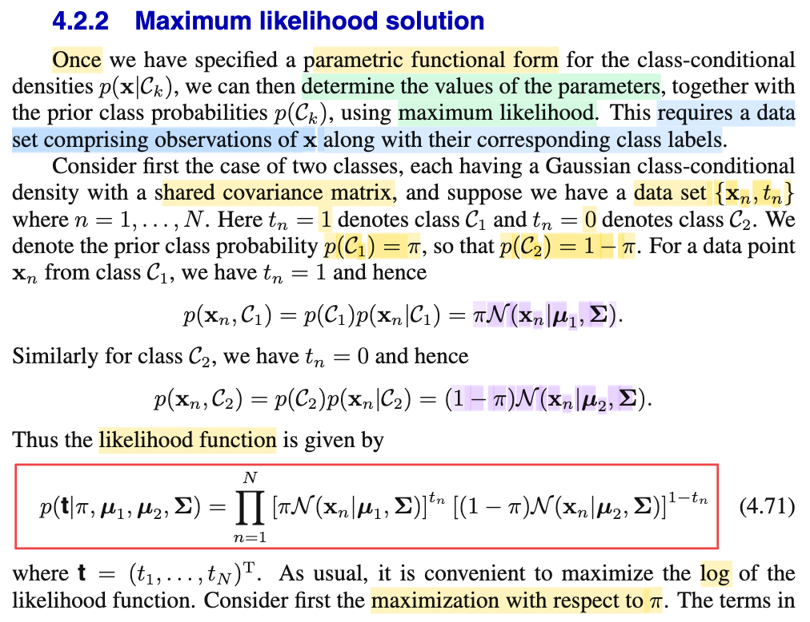
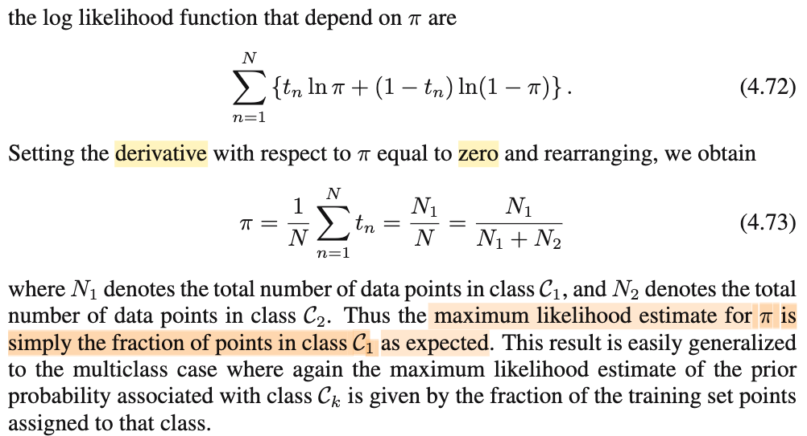

# 4.2.2 Maximum likelihood solution

📊 **Progress:** `1` Notes | `2` Screenshots | `1` AI Reviews

---

 

## 4.2.2 Maximum Likelihood Solution

<kbd></kbd>

<kbd></kbd>

> [!NOTE]
> Rồi, qua phần này đại khái là ta sẽ nói về việc training - tức đi xác định giá trị của tham số 𝐰, w0, của f(𝒞k|𝐱) cũng như prior f(𝒞k). Và như thường lệ, ta sẽ dùng cách tiếp cận phổ biến: Maximum Likelihoood.
>
>
>
> Có lẽ nên ôn lại tí về MLE, dù đã nói nhiều lần trước đây nhưng ôn lại để đặt ra cái khung sẽ giúp mình dễ làm hơn: Bài toán đặt ra là ta có observed data của môt random sample X1,....Xn, iid \~ f(x|θ). θ là tham số của population distribution, còn iid nghĩa là các random variable X1,..Xn đều độc lập nhau (gọi là multually independent) và có cùng chung distribution f(x|θ), tức pdf của X1, f(x1|θ) cũng là hàm pdf của X2, f(x2|θ) (chú ý, đừng có nhầm là f(x1|θ) = f(x2|θ) nhé, f(x1|θ) chỉ là nói về hàm pdf của X1, và f(x2|θ) chỉ là nói về hàm pdf của X2, ...và chúng là cùng một hàm số, distribution của chúng có chung một dạng, ví dụ đều là normal(μ, σ²) chẳng hạn)
>
>
>
> Thế thì ta sẽ muốn đi tìm một estimator của θ, theo định nghĩa, là hàm số của sample W(𝐗) = W(X1,..,Xn), để với observed data 𝐗 = 𝐱 thì ta có một estimate value của θ: W(𝐱). Vậy thì MLE chỉ là một phương pháp để ta đi tìm cái estimator tương đối tốt, chứ không phải là duy nhất. Và trong phương pháp này, ta sẽ chọn hàm W(𝐗) là hàm argmax\_θ L(θ|𝐱) với L(θ|𝐱) là likelihood function, mang ý nghĩa là thấy data như vậy (𝐱) thì với input θ hàm L(θ|𝐱) cho biết độ hợp lý của θ khi data khi đóng vai trò giải thích cho data như vậy là bao nhiêu. 
>
>
>
> Và giá trị của nó được define bởi f(𝐱|θ): Độ hợp lí của θ khi data quan sát được là 𝐱 được cho, được định nghĩa bởi chính giá trị joint pdf của 𝐗 tại 𝐱, L(θ|𝐱) = f(𝐱|θ).  Ta có thể coi như hai hàm này là đều là một hàm của cả θ và 𝐱 nhưng khi coi θ là fixed, thì ta có hàm của 𝐱 là joint pdf, còn khi coi 𝐱 là fixed, ta có hàm của θ là hàm likelihood.
>
>
>
> Dùng tính iid của X1,...Xn, ta có thể tách joint pdf/pmf của X1,...Xn thành tích các marginal pdf/pmf:
>
>
>
> L(θ|𝐱) = f(𝐱|θ) = Πi=1:n f(xi|θ)
>
>
>
> Tóm lại ta giải bài toán tối ưu: maximize (over θ) L(θ|𝐱) = Πi=1:n f(xi|θ). Và để dễ, toán tối ưu cho phép ta dùng hàm monotone, điển hình là ln() để chuuyển thành bài toán tương đương: maximize \[ln L(θ|𝐱)\] = ln Πi=1:n f(xi|θ), dùng tính chất hàm ln = Σi ln f(xi|θ).
>
>
>
> ---
>
>
>
> Rồi, cái phần vừa rồi sẽ làm thành cái khung để mình áp vào bài toán này.
>
>
>
> Quay lại đây, ta sẽ có thể hiểu vì sao để làm ML, ta cần data (tương ứng với 𝐗 = 𝐱 ở framework trên), và data ở đây sẽ là các cặp (𝐱n, tn) với tn là target value, mang giá trị 1 khi 𝐱n là thuộc 𝒞1, và 0 nếu là 𝒞2. (ta đang xét bài toán K = 2 trước)
>
>
>
> Bên cạnh đó, class prior f(𝒞), tức class prior distribution, ta cũng sẽ gọi tham số là π, tức f(𝒞), hay f(t) \~ Bern(π), tức P(𝒞=C1) = P(T=1) = π, đương nhiên P(𝒞=C2) = P(T=0) = 1-π 
>
>
>
> Tới đây ta cần xây dựng hàm likelihood: Mà để hiểu likelihood là cái nào thì cần nhìn lại, ta đang muốn ML estimator cho cái gì?
>
>
>
> Trả lời: ta đang muốn tìm tham số của phân phối này đây f(𝒞, 𝐱) hay cũng là f(t, 𝐱)
>
>
>
> Chú ý, cần nhớ lại phần trước gs đã nói, ta đang đi theo lối "generative", xây dựng joint distribution: f(𝐱, 𝒞k), và cái này thì bằng f(𝐱|𝒞k)f(𝒞k) (theo định lý conditional probability) để sau đó mới đi dùng Bayes theorem để có class posterior: f(𝒞k|𝐱) = f(𝐱|𝒞k)f(𝒞k)/f(𝐱) = f(𝐱|𝒞k)f(𝒞k)/ Σj f(𝐱|𝒞j)f(𝒞j). Nên ở đây, việc ta đang làm là đi giải bài toán point estimation cho tham số của f(𝐱, 𝒞k) theo cách tiếp cận maximum likelihood.
>
>
>
> (f(𝒞, 𝐱) hay f(t, 𝐱) như nhau, nếu gọi 𝒞 là class variable, nó sẽ có 2 possible value 𝒞1, 𝒞2 tương ứng với T là binary target variable có 2 possible value 1, 0: và P(𝒞 = 𝒞1) = P(T = 1), P(𝒞 = 𝒞2) = P(T = 0) nên f(𝒞|𝐱) hay f(t|𝐱) và f(𝒞) hay f(t) đều là một. 
>
>
>
> f(𝒞,𝐱) = f(𝐱|𝒞)f(𝒞)
>
>
>
> hay cũng là f(t,𝐱) = f(𝐱|t)f(t)
>
>
>
> Với f(𝐱|𝒞k) = f(𝐱|t) thì ta đang assume là Gaussian: 
>
>
>
> f(𝐱|𝒞1) = f(𝐱|t=1) = 𝒩(𝐱|𝛍1, 𝚺), 
>
>
>
> f(𝐱|𝒞2) = f(𝐱|t=0) = 𝒩(𝐱|𝛍2, 𝚺)
>
>
>
> Và prior: 
>
>
>
> f(𝒞1) = f(t)|t=1 (chính là P(T=1) = π, và f(𝒞2) = f(t)|t=0 = 1- π
>
>
>
> Do đó f(𝒞, 𝐱), hay f(t, 𝐱) sẽ phụ thuộc 𝛍k và π, ta viết f(𝒞, 𝐱| 𝛍1, 𝛍2, 𝚺, π) hay f(t, 𝐱| 𝛍1, 𝛍2, 𝚺, π):
>
>
>
> f(1, 𝐱| 𝛍1, 𝚺, π) = 𝒩(𝐱|𝛍1, 𝚺) π 
>
>
>
> f(0, 𝐱| 𝛍2, π) = 𝒩(𝐱|𝛍2, 𝚺) (1-π) 
>
>
>
> hay gom lại thành:
>
>
>
> f(t, 𝐱| 𝛍1, 𝛍2, 𝚺, π) = 𝒩(𝐱| I\_{t=1} 𝛍1 + I\_{t=0} 𝛍2, 𝚺) f(t) 
>
>
>
> hoặc có thể ghi vầy cũng được: 
>
>
>
> f(t, 𝐱| 𝛍1, 𝛍2, 𝚺, π) = \[𝒩(𝐱|𝛍1, 𝚺)\]^t × \[𝒩(𝐱|𝛍2, 𝚺)\]^(1-t) × f(t) 
>
>
>
> vì khi t = 1 thì \[𝒩(𝐱|𝛍1, 𝚺)\]^t × \[𝒩(𝐱|𝛍2, 𝚺)\]^(1-t) = \[𝒩(𝐱|𝛍1, 𝚺)\]^1 ×  \[𝒩(𝐱|𝛍2, 𝚺)\]^0 = 𝒩(𝐱|𝛍1, 𝚺)
>
>
>
> khi t = 0 thì \[𝒩(𝐱|𝛍1, 𝚺)\]^t × \[𝒩(𝐱|𝛍2, 𝚺)\]^(1-t) = \[𝒩(𝐱|𝛍1, 𝚺)\]^0 ×  \[𝒩(𝐱|𝛍2, 𝚺)\]^1 = 𝒩(𝐱|𝛍2, 𝚺)
>
>
>
> ---
>
>
>
> Tương tự, với f(t) thì f(t)|t=1 = P(T=1) = π và f(t)|t=0 = P(T=0) = 1-π thì f(t) sẽ được thể hiện bởi:
>
>
>
> f(t) = (π^t) (1-π)^(1-t)
>
>
>
> ---
>
>
>
> Như vậy tương ứng với trong framework ở trên:
>
>
>
> θ : chính là: 𝛍1, 𝛍2, 𝚺, π 
>
>
>
> 𝐱: trong L(θ|𝐱) sẽ là observed data: (𝐱1, t1), (𝐱2, t2),...(𝐱N, tN), đặt thành matrix 𝐗 và vector 𝐭.
>
>
>
> Nên hàm likelihood là L(𝛍1, 𝛍2, 𝚺, π|𝐗, 𝐭), và theo định nghĩa, giá trị của nó bằng: f(𝐗, 𝐭|𝛍1, 𝛍2, 𝚺, π) (tương tự như L(θ|𝐱) = f(𝐱|θ))
>
>
>
> Và tương tự, như nhờ tính iid của các data point: 
>
>
>
> f(𝐗, 𝐭|𝛍1, 𝛍2, 𝚺, π) = Πn=1:N f(𝐱n, tn | 𝛍1, 𝛍2, 𝚺, π)
>
>
>
> = Πn=1:N f(𝐱n, tn | 𝛍1, 𝛍2, 𝚺, π)), dùng tính chất hàm log log(AB) = log(A) + log(B)
>
>
>
> Tới đây thay f(𝐱n, tn | 𝛍1, 𝛍2, 𝚺, π) = \[𝒩(𝐱|𝛍1, 𝚺)\]^t × \[𝒩(𝐱|𝛍2, 𝚺)\]^(1-t) × f(t)
>
>
>
> và f(t) = (π^t) (1-π)^(1-t)
>
>
>
> ⇒ ...= Πn=1:N f(𝐱n, tn | 𝛍1, 𝛍2, 𝚺, π)
>
>
>
> = Πn=1:N \[𝒩(𝐱|𝛍1, 𝚺)\]^tn × \[𝒩(𝐱|𝛍2, 𝚺)\]^(1-tn) × (π^tn) × (1-π)^(1-tn) 
>
>
>
> = Πn=1:N \[𝒩(𝐱|𝛍1, 𝚺)\]^tn × (π^tn) × \[𝒩(𝐱|𝛍2, 𝚺)\]^(1-tn) × (1-π)^(1-tn) 
>
>
>
> = Πn=1:N \[π 𝒩(𝐱|𝛍1, 𝚺)\]^tn × \[(1-π) 𝒩(𝐱|𝛍2, 𝚺)\]^(1-tn) 
>
>
>
> Viết lại hoàn chỉnh likelihood:
>
>
>
> L(𝛍1, 𝛍2, 𝚺, π|𝐗, 𝐭) = f(𝐗, 𝐭|𝛍1, 𝛍2, 𝚺, π) = Πn=1:N \[π 𝒩(𝐱n|𝛍1, 𝚺)\]^tn × \[(1-π) 𝒩(𝐱n|𝛍2, 𝚺)\]^(1-tn) 
>
>
>
> Nhận xét: Ở đây tác giả Bishop đã làm theo cái kiểu bỏ bớt 𝐗 để ghi thành p(𝐭|π,𝛍1, 𝛍2, 𝚺), nhưng phải hiểu là phải có 𝐗 vì không thể tự nhiên lại bỏ mất 𝐗.
>
>
>
> ---
>
>
>
> Bài toán tối ưu cần giải ở đây: maximize hàm likelihood, như thường lệ, ta chuyển sang bài toán tương đương dùng hàm ln likelihood, và cũng bỏ đi các constant không phụ thuộc các biến tối ưu:
>
>
>
> ln L(𝛍1, 𝛍2, 𝚺, π|𝐗, 𝐭)
>
>
>
> = ln { Πn=1:N \[π 𝒩(𝐱n|𝛍1, 𝚺)\]^tn × \[(1-π) 𝒩(𝐱n|𝛍2, 𝚺)\]^(1-tn) }
>
>
>
> = Σn=1:N { ln \[π 𝒩(𝐱n|𝛍1, 𝚺)\]^tn × \[(1-π) 𝒩(𝐱n|𝛍2, 𝚺)\]^(1-tn) }
>
>
>
> = Σn=1:N { ln \[π 𝒩(𝐱n|𝛍1, 𝚺)\]^tn + ln { \[(1-π) 𝒩(𝐱n|𝛍2, 𝚺)\]^(1-tn) }
>
>
>
> = Σn=1:N { tn ln \[π 𝒩(𝐱n|𝛍1, 𝚺)\] + (1-tn) ln { \[(1-π) 𝒩(𝐱n|𝛍2, 𝚺)\] }
>
>
>
> ---
>
>
>
> Tới đây, ta sẽ giải theo từng biến (toán tối ưu cho phép ví dụ như maximize f(x,y) thì ta có thể maximize f(x, y) theo x trước (coi y như fixed), tìm ra x\*, sau đó maximize f(x\*, y) theo y để tìm y\*)
>
>
>
> Nên ở đây ta giải tìm π trước, do đó, ta sẽ tách các term không dính tới π ra, và bỏ đi (tức là chuỷển thành bài toán tương đương bằng cách bỏ đi constant ko liên quan biến tối ưu)
>
>
>
> maximize\_π ln likelihood = Σn=1:N { tn ln π + tn ln 𝒩(𝐱n|𝛍1, 𝚺) + (1-tn) ln (1-π) + (1-tn) ln \[𝒩(𝐱n|𝛍2, 𝚺)\] }
>
>
>
> equivalent:
>
>
>
> maximize\_π  Σn=1:N { tn ln π + (1-tn) ln (1-π) }   (chính là 4.72)
>
>
>
> Để giải, như thường lệ, dùng điều kiện cần tối ưu bậc nhất: Đạo hàm tại solution phải = 0:
>
>
>
> d/dπ \[Σn=1:N { tn ln π + (1-tn) ln (1-π) }\] = 0
>
>
>
> ⇔ Σn=1:N { d/dπ \[tn ln π + (1-tn) ln (1-π)\] } = 0
>
>
>
> ⇔ Σn=1:N { tn/π - (1-tn)/(1-π)\] } = 0
>
>
>
> ⇔ (1/π) Σn=1:N tn = (1/(1-π)) Σn=1:N (1-tn)
>
>
>
> ⇔ (1/π) Σn=1:N tn = (1/(1-π)) (N - Σn=1:N tn) 
>
>
>
> Σn=1:N {tn} chính là gì: chính là N1: số data point thuộc class 𝒞1, có target t =1
>
>
>
> .. ⇔ (1/π) N1 = (1/(1-π)) (N - N1) 
>
>
>
> ⇔ (1/π) N1 = (1/(1-π)) N2
>
>
>
> ⇔ (1/π) N1 - (1/(1-π)) N2 = 0
>
>
>
> biến đổi chút sẽ ra π = N1/(N1+N2)
>
>
>
> Vậy maximum likelihood estimator của π, kí hiệu πML = N1/(N1+N2), kết quả này rất hợp lý về trực giác, khi nó lấy tỉ lệ của data point thuộc class 𝒞1 trong dataset làm estimate cho π vốn dĩ là xác suất (prior) của việc một data point thuộc class 𝒞1.
>
>
>
> Trong Casella mình cũng giải bài toán tìm ML estimator của Bern(p), kết quả chính là sample mean.

> [!TIP]
> 🤖 **AI Check** — 🟢 Pass — ✅ **95/100** · ✓ Move on
>
> Ghi chú rất xuất sắc, nắm rất vững bản chất của mô hình generative và phương pháp Maximum Likelihood cho phân phối đồng thời (joint likelihood). Các bước biến đổi đạo hàm để tìm MLE cho π hoàn toàn chính xác và trực quan.
>
> **🟡 Minor issues**
>
> **1.** *"f(0, 𝐱| 𝛍2, π) = 𝒩(𝐱|𝛍2, 𝚺) (1-π)"*
>
> Thiếu ký hiệu tham số ma trận hiệp phương sai 𝚺 ở vế trái (đúng ra là f(0, 𝐱| 𝛍2, 𝚺, π)). Đây chỉ là sơ suất gõ phím nhỏ.
>
> **2.** *"Để giải, như thường lệ, dùng điều kiện cần tối ưu bậc nhất: Đạo hàm tại solution phải = 0"*
>
> Về mặt toán học chặt chẽ, đạo hàm bậc nhất bằng 0 chỉ là điều kiện cần (stationary point). Để khẳng định nghiệm là điểm cực đại toàn cục (maximum), cần kiểm tra thêm điều kiện đạo hàm bậc hai âm (tính lõm của hàm log-likelihood theo π).
>
>
> **✓ Strengths**
> - Phân biệt rất rõ bản chất mô hình Generative tiếp cận thông qua phân phối đồng thời f(x, t) = f(x|t)f(t) thay vì phân phối có điều kiện f(t|x) như Discriminative.
> - Nhận xét rất tinh tế và chuẩn xác về việc công thức (4.71) của Bishop ghi p(t|...) thực chất là joint likelihood của cả X và t nhưng tác giả viết giản lược/tắt đi X.
> - Dẫn dắt các bước tối ưu hóa log-likelihood cho tham số prior π mạch lạc, chi tiết và liên hệ tốt với ước lượng MLE của phân phối Bernoulli.
>
> **💡 Deeper notes**
> - Sở dĩ bài toán tối ưu có thể tách riêng biệt việc tìm π mà không phụ thuộc vào 𝛍1, 𝛍2, 𝚺 là do không gian tham số phân tách (decoupled parameter spaces) và hàm log-likelihood tách thành tổng các hàm mục tiêu độc lập giữa tham số prior và class-conditional.

 

