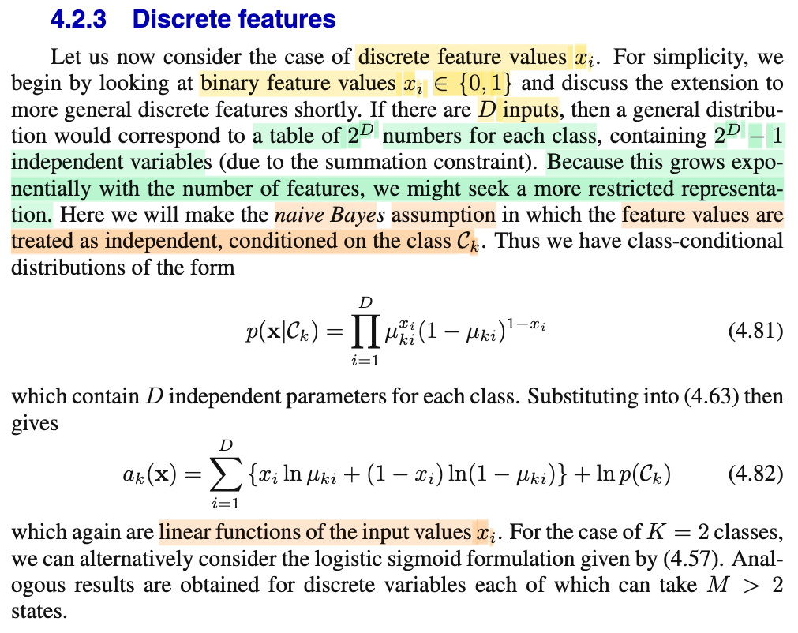

# 4.2.4 Discrete features

📊 **Progress:** `1` Notes | `1` Screenshots | `1` AI Reviews

---

 

## Section 4.2.3 Discrete Features

<kbd></kbd>

> [!NOTE]
> Phần này nói về case mà input 𝐱 là D-dimensional vector mà mỗi phần tử chỉ có thể là 1 hoặc 0.
>
>
>
> Thì khi đó, (T, 𝐗) sẽ có joint distribution là gì:
>
>
>
> 𝐗 lúc này sẽ là discrete random vector có bao nhiêu possible value?
>
>
>
> → Dễ thấy sẽ là 2^D, nên distribution của 𝐗 (marginal distribution) là discrete distribution có 2^D possible values 𝐱1, 𝐱2,....𝐱\_2^D
>
>
>
> Cộng với T cũng là discrete variable có K possible values: t1,...tK (ứng với class 𝒞1,..𝒞K) thì joint distribution của T và 𝐗 sẽ là cái bảng có K × 2^D ô, mà ô ví dụ (k, i) quy định rằng P(T = tk, 𝐗 = 𝐱i)
>
>
>
> ---
>
>
>
> Vậy rõ ràng là, để mà mô tả đầy đủ cái phân phối này, ta sẽ phải điền vào các giá trị của K × 2^D ô này, hoặc ít nhất là với mỗi giá trị t, thì phải điền đủ 2^D - 1 ô (ô còn lại, thì do luật tổng bằng 1, nên ta có thể suy ra từ các ô kia). Và số giá trị cần điền vào đó, chính là số tham số của mô hình xác suất rời rạc này. (nhớ lời thầy Joe Blizstein trong Stat110: distrbution chỉ là một blueprint, cho ta biết với event một random variable mang giá trị nào đó thì xác suất là bao nhiêu)
>
>
>
> Như vậy số lượng parameter của joint distribution này tăng theo cấp lũy thừa, nên sẽ rất lớn khi D lớn. Do đó đây sẽ là một mô hình cực kì phức tạp (complex) và dùng nó sẽ bị overfit. Thành ra, người ta mới giảm bớt sự phức tạp cuả nó, bằng cách đơn giản bớt thông qua: thêm ràng buộc, và cụ thể ràng buộc là: các feature values sẽ độc lập nhau trong mỗi class. Tức là: với random vector 𝐗 = \[X1,...XD\]ᵀ, ta sẽ coi X1,...XD là các random variable independent xét trên một class 𝒞k nào đó.
>
>
>
> (Chú ý, giả định độc lập là độc lập dựa trên một class cụ thể, tức nếu viết thì viết thế này: conditioned on class 𝒞k thì X1,...XD độc lập, hat X1|𝒞k,....XD|𝒞k là độc lập, chứ không phải X1,...XD độc lập bất chấp)
>
>
>
> Và cái ràng buộc (cũng là giả định này) có tên gọi là Naive Bayes.
>
>
>
> Vì sao gọi là naive (ngây thơ) Bayes: Là vì với giả định này thì joint distribution của X1,X2,...XD sẽ tách thành tích các marginal pdf/pmf: Ví dụ với X1, X2: f(x1,x2) = f(x1|x2)f(x2) và vì X1 independent X2 nên f(x1|x2) = f(x1) ⇒ f(x1,x2) = f(x1)f(x2).
>
>
>
> Thế thì khi đó class conditional distribution f(𝐱|𝒞k) có công thức 4.81 là vì sao?
>
>
>
> Là như vầy, xét f(𝐱|𝒞k) = f(x1,...xD|𝒞k) và như vừa nói ở trên, do giả định X1, ...XD độc lập nên ta có thể tách thành tích các marginal distribution (vẫn conditional on 𝒞k):
>
>
>
> f(𝐱|𝒞k) = Πi=1:D f(xi|𝒞k)
>
>
>
> Xét f(xi|𝒞k), vì Xi chỉ có hai possible value 0, 1. Gọi μki là P(Xi = 1|𝒞k), thì Xi chính là một Bernouilly (μki) random variable, có pmf là P(Xi = xi) = (μki)^xi × (1-μki)^(1-xi)
>
>
>
> Thế vào ta có f(𝐱|𝒞k) = Πi=1:D (μki)^xi × (1-μki)^(1-xi) chính là 4.81
>
>
>
> Có thể thấy với giả định Naive Bayes, thì phân phối này chỉ có D parameter mỗi class thôi (vì sao D: thì vì ứng với mỗi class k = 1,..K ta chỉ cần biết μk1,..μkD, tổng cộng là D param, với K class là D × K param, vẫn ít hơn nhiều so với 2^D-1 nói trên.
>
>
>
> ---
>
>
>
> Thay vào 4.63: ak = ln f(𝐱|𝒞k)f(𝒞k) (là cái mà khi ta bỏ vào softmax exp(ak) / Σj exp(aj) thì ta có f(𝒞k|𝐱))
>
>
>
> → ak = ln {\[Πi=1:D (μki)^xi × (1-μki)^(1-xi)\] f(𝒞k)}
>
>
>
> = ln \[Πi=1:D (μki)^xi × (1-μki)^(1-xi)\] + ln f(𝒞k)
>
>
>
> = Σi=1:D ln \[(μki)^xi × (1-μki)^(1-xi)\] + ln f(𝒞k)
>
>
>
> = Σi=1:D ln (μki)^xi + Σi=1:D ln (1-μki)^(1-xi) + ln f(𝒞k)
>
>
>
> = Σi=1:D xi ln (μki) + Σi=1:D (1-xi) ln (1-μki) + ln f(𝒞k)
>
>
>
> = Σi=1:D \[xi ln (μki) + (1-xi) ln (1-μki)\] + ln f(𝒞k) → 4.82
>
>
>
> Dễ thấy đây vẫn là hàm tuyến tính của 𝐱 (nhìn kĩ sẽ thấy nó chỉ là tổng các term bậc 1 của xi)
>
>
>
> ---
>
>
>
> Ở trên là ông Bishop muốn chỉ ra rằng, à với 𝐗 = \[X1,...XD\]ᵀ với Xi là biến rời rạc Bernouilly thì ta thấy ak cũng là hàm tuyến tính với 𝐱 (để rồi decision boundary cũng là hyperplane)
>
>
>
> Nếu K = 2 thay vì gắn vào frame work softmax, ta dùng sigmoid thì cũng sẽ cho ra f(𝒞1|𝐱) và f(𝒞2|𝐱) cũng vậy, là hàm tuyến tính với 𝐱
>
>
>
> Và nếu Xi là biến rời rạc nhưng không chỉ có 2 possible value mà là M thì cũng sẽ ra tương tự vậy.
>
>
>
> ---
>
>
>
> Và tuy sách không nói, nhưng ta phải hiểu là, vẫn phải đi point estimate giá trị các tham số của joint distribution này. Có thể tiếp tục theo phương pháp MLE

📹 [Xem video trên YouTube](https://www.youtube.com/watch?v=jbPysqwE8nc)

> [!TIP]
> 🤖 **AI Check** — 🟡 Minor issues — ✅ **95/100** · ✓ Move on
>
> Ghi chú rất xuất sắc, hiểu sâu sắc bản chất từ việc bùng nổ số tham số ở mô hình tổng quát đến việc Naive Bayes giúp giảm tham số như thế nào và tự diễn giải từng bước đạo hàm ra phương trình 4.82.
>
> **🟡 Minor issues**
>
> **1.** *"Nếu K = 2 thay vì gắn vào frame work softmax, ta dùng sigmoid thì cũng sẽ cho ra f(𝒞1|𝐱) và f(𝒞2|𝐱) cũng vậy, là hàm tuyến tính với 𝐱"*
>
> Cần diễn đạt chính xác hơn: xác suất hậu nghiệm p(𝒞1|x) = σ(a(x)) là hàm sigmoid (phi tuyến) theo x, trong đó đối số a(x) = ln(p(x|𝒞1)p(𝒞1) / p(x|𝒞2)p(𝒞2)) (log-odds) mới là hàm tuyến tính của x.
>
>
> **✓ Strengths**
> - Giải thích rất rõ ràng lý do số tham số ban đầu là K × (2^D - 1) và vì sao cần giả định độc lập có điều kiện Naive Bayes để đưa về K × D tham số.
> - Phân biệt chuẩn xác giữa độc lập có điều kiện (conditional independence on class) và độc lập hoàn toàn (marginal/unconditional independence).
> - Tự triển khai chi tiết từng bước biến đổi đại số từ tích Bernoulli sang hàm log tổng bậc nhất của x (công thức 4.82) rất chính xác và mạch lạc.
>
> **💡 Deeper notes**
> - Khi nhóm các số hạng của ak(x) theo x_i, ta được ak(x) = Σ_i x_i ln(μ_ki / (1 - μ_ki)) + Σ_i ln(1 - μ_ki) + ln p(𝒞k). Hệ số của x_i chính là log-odds ln(μ_ki / (1 - μ_ki)), thể hiện đóng góp tuyến tính của từng feature vào logit.
> - Với trường hợp biến rời rạc có M trạng thái (M > 2), ta dùng biểu diễn 1-of-M (one-hot encoding) kết hợp phân phối Categorical (Multinoulli), hàm phân biệt ak(x) vẫn giữ nguyên tính chất tuyến tính.

**🔗 See also:** [Logistic Sigmoid and Logit Function](./42_probabilistic_generative_model.md#node-0mccuff)

 

