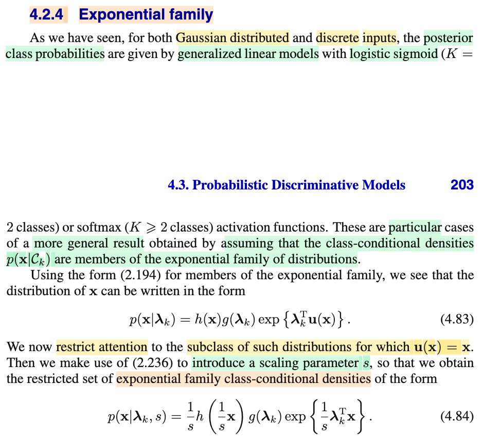
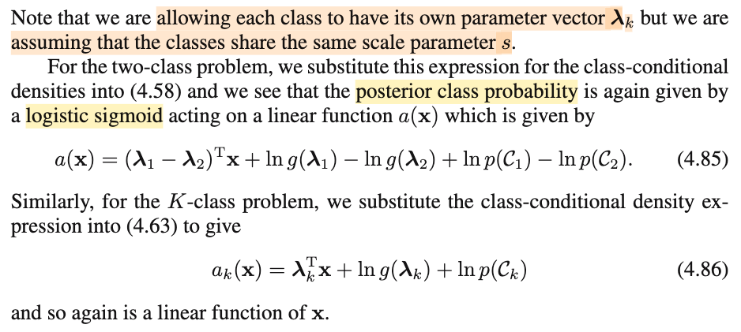

# 4.2.4 Exponential family

📊 **Progress:** `1` Notes | `2` Screenshots | `1` AI Reviews

---

 

## Section 4.2.4 Exponential Family

<kbd></kbd>

<kbd></kbd>

> [!NOTE]
> Đầu tiên active recall chút: Bối cảnh bữa giờ ta ta muốn đi xây dựng mô hình xác suất class posterior f(𝒞|𝐱) thông qua cách làm là xây dựng joint distribution (gọi là generative distribution) f(𝐱, 𝒞). Để sau đó ta sẽ có f(𝒞k|𝐱) = f(𝐱, 𝒞k)/f(𝐱) = f(𝐱, 𝒞k)/Σj f(𝐱|𝒞j)f(𝒞j)
>
>
>
> Mà để xây dựng f(𝐱, 𝒞k) ta lại dùng conditional probability theorem để có f(𝐱|𝒞k)f(𝒞k).
>
>
>
> Từ đó, ta giả định dạng của f(𝐱|𝒞k) là Normal với 𝛍1, 𝛍2 khác nhau (K=2), share chung 𝚺, cũng như gọi π là tham số của f(𝒞) (K = 2 thì 𝒞 \~ Bern(π)) thì f(𝐱, 𝒞) sẽ phụ thuộc các tham số 𝛍1, 𝛍2, 𝚺, π. Để rồi từ đó ta mới đi giải bài toán point estimation với cách tiếp cận điển hình là MLE.
>
>
>
> Dĩ nhiên là sau khi có joint distribution, mục đích cuối cùng vẫn là tính f(𝒞k|𝐱), sẽ bằng f(𝐱, 𝒞k)/Σj f(𝐱|𝒞j)f(𝒞j) và dùng nó để ra quyết định gán loại nào cho 𝐱.
>
>
>
> Và đó là khi ta đang xét 𝐱 là feature mang giá trị liên tục.
>
>
>
> Sau đó, ta mới xét 𝐱 là feature mang giá trị rời rạc, ở phần trước, thì lúc này mô hình joint distrubution f(𝐱, 𝒞) sẽ có số lượng tham số tăng theo lũy thừa, nên cần đặt ra vài giả định (naive Bayes), và nói chung là cũng giúp ta có một dạng cụ thể của joint distribution, từ đó cũng dẫn đến bài toán point estimation cho các tham số.
>
>
>
> Vậy thì nay, quay lại xét việc 𝐱 là feature liên tục. Thì như hồi học Casella đã biết, Normal distribution vẫn chỉ là thành viên của một họ phân phối lớn hơn, gọi là exponential family (bao gồm cả exponential, posson, beta, normal,....)
>
>
>
> Vậy thì, ở phần này, đại ý là thay vì giả định (dạng của f(𝐱|𝒞k) là 𝒩(𝛍k, 𝚺k)) ta sẽ dùng phân phối khái quát và bao trùm hơn này (mà mục đích cũng chỉ là: để mà có cái gọi là parametric modal, có cái dạng của distribution, từ đó mới đi point estimate tham số của distribution. Chứ nếu không giả định, ta sẽ biết estimate cái gì bây giờ khi đó phải làm theo cái gọi là non-parametric model)
>
>
>
> Thế thì, với chapter 2 cũng đã được gs Bishop nói về công thức của exponential family: f(𝐱|𝛈) = h(𝐱)g(𝛈)exp{𝛈ᵀ𝐮(𝐱)}.
>
>
>
> Thì ở đây, ta sẽ đại ý là ta sẽ chọn 𝐮(𝐱) = 𝐱. Để từ đó, coi như ta tự giới hạn lại bớt (để cho model đơn giản bớt, bớt tham số lại, giống như ta giả định naive Bayes ở phần trước vậy), và dùng 𝛌 thay vì 𝛈 (chỉ là kí hiệu)
>
>
>
> ta có class-conditional density f(𝐱|𝒞k) = h(𝐱)g(𝛌)exp{𝛌ᵀ𝐱}.
>
>
>
> (Nó chỉ y chang như khi ta giả định class-conditional density f(𝐱|𝒞k) là Normal để rồi f(𝐱|𝒞k) = 𝒩(𝐱|𝛍k, 𝚺k) thôi, chẳng qua là ở đây ta dùng một giả định rộng hơn, mô hình sẽ flexible hơn vì bây giờ tham số sẽ gồm có 𝛌k, và dạng của hàm h và g nữa thay vì chỉ có 𝛍k, 𝚺k với dạng cụ thể là pdf của normal)
>
>
>
> Bên cạnh đó, dùng thêm sự thật rằng, f(𝐱|σ) = (1/σ)f(𝐱/σ) sẽ có chung dạng, chỉ khác nhau scale param.
>
>
>
> Do đó ta sẽ đưa thêm vào tham số scalar: s.
>
>
>
> f(𝐱| 𝛌k, s) = (1/s) h(𝐱/s) g(𝛌k)exp{𝛌kᵀ𝐱/s}
>
>
>
> Mục đích là gì: Mục đích là để đưa thêm vào một giả định nữa: là nó cũng là scale family
>
>
>
> mọi f(𝐱| 𝛌k, s) đều có chung scale, và ta sẽ học thêm scale param bên cạnh param của exponential family.
>
>
>
> Nói Nên mình hiểu, giả định exponential thì khác quát hơn, nhưng bồi thêm giả định scale family nữa để có thêm scale parameter (vì exponential family không có scale parameter)

> [!TIP]
> 🤖 **AI Check** — 🟡 Minor issues — ⚠️ **80/100** · ✓ Move on
>
> Ghi chú kết nối bối cảnh rất tốt từ bài toán generative sang tổng quát hóa bằng exponential family. Cần làm rõ thêm mục đích toán học cốt lõi của việc các class chia sẻ chung scale parameter s (để triệt tiêu số hạng phi tuyến chứa x, giữ cho a(x) tuyến tính) và đính chính việc hàm h, g không phải là tham số cần ước lượng.
>
> **🟡 Minor issues**
>
> **1.** *"vì bây giờ tham số sẽ gồm có 𝛌k, và dạng của hàm h và g nữa thay vì chỉ có 𝛍k, 𝚺k"*
>
> Trong mô hình parametric thuộc exponential family, dạng hàm h(x) và g(λ) là các hàm xác định cố định gắn liền với phân phối được chọn (như Poisson, Bernoulli, Normal...), chúng không phải là tham số cần ước lượng từ dữ liệu. Tham số cần ước lượng ở đây chỉ là vector λ_k (và scale s).
>
> **2.** *"Mục đích là gì: Mục đích là để đưa thêm vào một giả định nữa: là nó cũng là scale family mọi f(𝐱| 𝛌k, s) đều có chung scale, và ta sẽ học thêm scale param bên cạnh param của exponential family."*
>
> Mục đích quan trọng nhất của việc giả định các class dùng chung scale parameter s là để thành phần ngoài số mũ (1/s)h(x/s) giống hệt nhau ở mọi class, từ đó triệt tiêu hoàn toàn khi lập tỉ lệ posterior log-odds. Nhờ việc triệt tiêu này cùng điều kiện u(x) = x, a(x) mới giữ được dạng hàm tuyến tính theo x.
>
>
> **✓ Strengths**
> - Khả năng active recall và hệ thống hóa kiến thức xuyên suốt từ mô hình liên tục (Gaussian), rời rạc (Naive Bayes) đến tổng quát hóa bằng Exponential family rất mạch lạc.
> - Nắm bắt chính xác việc giới hạn không gian giả thuyết u(x) = x và việc dùng chung tham số tỷ lệ s giữa các lớp.
>
> **💡 Deeper notes**
> - Nếu các class không chia sẻ chung tham số s (tức mỗi class có s_k riêng), số hạng ln h(x/s_1) - ln h(x/s_2) sẽ không biến mất, khiến hàm a(x) trở thành phi tuyến đối với x và mô hình không còn là Generalized Linear Model dạng logistic/softmax đơn thuần nữa.

**🔗 See also:** [2.4 The Exponential Family](./24_the_exponential_family.md#node-1hlelhn) · [Scale Invariance and Prior Distributions](./243_non_informative_priors.md#node-6t8ihcb)

 

